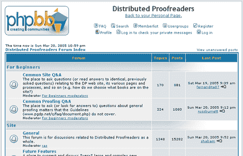
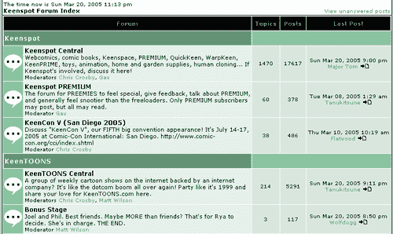
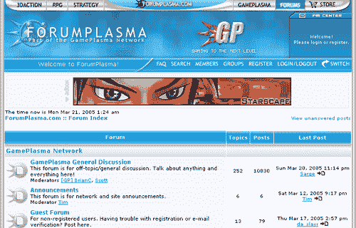
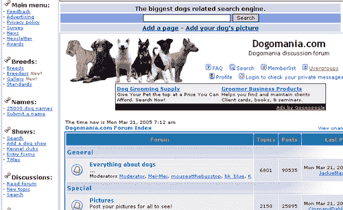
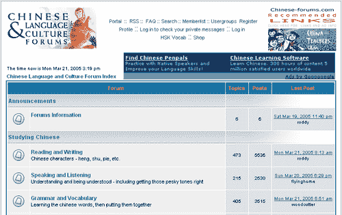
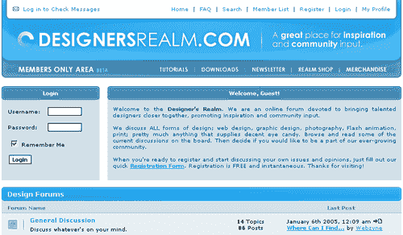
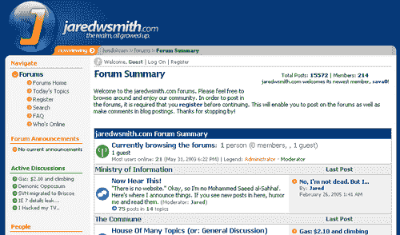
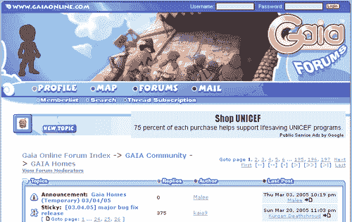

# 第一章. phpBB 简介

在本质上，在线公告板是商店和其他公共场所中发现的公告板的互联网版本。它基本上就是一个人们留下信息供他人阅读的地方。嗯，在线公告板应用程序已经变得比这更强大和复杂，但基本原则是相同的。phpBB 是目前在网上实现公告板理念的最受欢迎的免费软件之一。

在这本 phpBB 书的第一章中，你将了解以下内容：

+   在线社区

+   phpBB 历史

+   phpBB 开发及其发展方向

+   使用 phpBB 可以实现什么，以及现有的 phpBB 网站的例子

# 在线社区

在线社区是一群人因为某种原因聚集在网站上的群体。这个原因可以是任何对群体共同感兴趣的主题，比如职业、爱好、激情或地点。这样的在线社区非常受欢迎，随着越来越多的人开始上网，它们的受欢迎程度正在增长。想想看——每个人都有他或她热衷的事情。而且每个人都喜欢遇到有共同兴趣的人。从历史上看，这样的基于计算机的社区甚至在互联网出现之前就存在了；例如，使用基于调制解调器的点对点公告板系统（BBS）。

在社区中存在的一个基本部分是分享和贡献（例如，对某个主题发表评论或指出对群体感兴趣的话题）。这样，网站访客就不再是仅仅看着一个一成不变的网站。他们通过贡献内容在改变网站的面貌。如今，在我们访问的网站上发表评论的能力已经变得如此普遍，以至于我们几乎期望它在那里。

静态的、像小册子一样的网站正在变得过时。社区统治着网络。这对网站所有者和访问者来说都是好消息。网站被设计成供人们访问和使用，同时，人们也在参与建设他们访问的网站。网站所有者可以立即获得关于访客喜欢或不喜欢什么的反馈，而访客每次访问都能获得新的和新鲜的内容。如今，社区不仅会*影响*网站所有者的决策，甚至可以通过投票或公开讨论*做出*决策。因此，说网站的成功或失败往往取决于围绕网站建立在线社区的成功或失败并不过分。最终，网站是为了被使用而建立的，而人们有权决定这个网站是否有价值。

# 建设社区——工具

为了设置您的在线社区将聚集的地方，您需要工具。您可以将精力投入到自己创建工具中——当然，前提是您在网页编程、服务器管理等方面有专业知识——或者您可以选择不重新发明轮子，并采用一个解决方案。这就是 phpBB 发挥作用的地方。

现在有各种各样的社区建设工具。它们可以是像留言簿那样简单，或者更复杂，如聊天系统、网络日志（博客）或邮件列表。或者它们可以是论坛，也称为公告板。论坛系统继承了并扩展了来自黑暗的互联网前时代的公告板系统（BBS），并为它们添加了网络浏览器界面。phpBB 属于用于构建在线社区的论坛工具家族。

# 名称

名称由两部分组成——“PHP”和“BB”。PHP 是编写软件的编程语言，“BB”代表“公告板”；它是一个用 PHP 编程语言编写的公告板工具。

PHP 也是一个缩写，它代表，或者至少曾经代表，Personal Home Page。PHP 不再仅仅是像最初那样的一套个人主页工具，而已经成长为一个真正的编程语言。它的缩写已经深入了一层，现在递归地代表“PHP Hypertext Preprocessor”。但人们通常简单地称之为 PHP。

# 环境

从技术角度来说，您需要以下内容才能使用 phpBB：

+   要执行的程序代码

+   一个数据库来存储信息

+   Web 服务器软件，因为这是一个网络应用程序

+   一台计算机来运行所有这些！

如您所知，phpBB 使用**PHP**服务器端编程语言编写。此外，为了运行，phpBB 需要一个数据库。所有讨论的数据都存储在那里。有不同类型的数据库系统 phpBB 可以与之协同工作，但最流行且在当今 PHP 应用程序中最常用的是**MySQL**。最后，phpBB 需要一个网络服务器和运行操作系统的计算机。phpBB 可以在不同的操作系统和网络服务器上运行，但它主要在**Linux**平台上与**Apache**网络服务器一起使用。

使用网络开发者的术语，您可能会说 phpBB 主要在 LAMP 环境中使用，其中 LAMP 是 Linux、Apache、MySQL 和 PHP 的缩写。关于 LAMP 环境的一个重要特点是它的组件是免费和开源的。在实践中，“免费和开源”意味着：

+   您可以使用该软件而无需支付软件许可费。

+   如果您想修改软件以更好地满足您的需求，软件的编程代码可供您使用。

phpBB 的另一个优点是它对托管服务器的需求非常低。由于 phpBB 环境由免费软件产品组成，您很容易找到一个好且相对便宜的托管服务提供商。只需在 Google 上搜索“phpbb 托管”就会得到大约一百万个结果。

# 为什么选择 phpBB？

为什么你应该从你所拥有的所有选项中选择 phpBB？好吧，既然你在读这本书，你很可能已经做出了决定，所以我就给你一些建议，如何处理你的这位运行 vBulletin、Phorum 或其他类型系统的网站管理员朋友。

+   phpBB 是免费的。看起来它将保持这种方式。已经有公司提出购买 phpBB，但这些提议都被拒绝了。

+   phpBB 是最受欢迎的论坛软件之一。所有那些网站管理员都不可能是错的。他们继续使用 phpBB 来支持他们的网络社区，这是他们最好的证明。

+   人们都知道 phpBB。由于其受欢迎程度，你的访客很可能已经见过并使用过它。他们不需要学习一个全新的系统，可以立即开始发帖，在一个熟悉的环境中感到舒适。

+   phpBB 已经成熟。它已经活跃并重用了超过四年，在互联网术语中这是一个相当长的时期。

+   phpBB 功能丰富，并开放接受定制功能添加。你可以编写自己的定制功能，或者你可以使用一个或多个由 phpBB 用户社区贡献的众多 phpBB 插件，也称为 MOD 或 hacks。

+   phpBB 的外观是可定制的。你可以轻松地更改字体和颜色。你甚至可以更改布局或使用其他 phpBB 用户贡献的现有布局。

# 历史

詹姆斯·阿特金森是该软件的创造者。他是第一个开发者，现在是 phpBB 项目的项目经理。像许多其他开源项目一样，phpBB 最初是一个个人项目。詹姆斯想在妻子的网站上建立一个论坛。当时，他有两个选择：使用像先驱 UBB（Ultimate Bulletin Board，用 Perl 编写）这样的商业包，或者使用名为 Phorum 的免费解决方案，它是用 PHP 编写的，但詹姆斯不太喜欢它的线程风格。因此，他决定自己动手，创建一个类似 UBB 的基于 PHP 的公告板系统。

phpBB 是在 2000 年 7 月 1 日晚上 6:45“出生”的。我们知道确切的日期和时间，因为那是詹姆斯在互联网论坛上发帖说，他已经创建了一个公告板，并希望得到一些测试帮助的时候。几周后，他公开了项目的源代码，使其免费并可供所有希望加入并贡献开发的人使用。

其他爱好者加入了进来，2000 年 12 月 16 日，第一个官方 phpBB 发布了——phpBB 版本 1.0。此后，phpBB 团队开始了发布-特性请求-开发-测试-发布的循环。

phpBB 在 2002 年 4 月 4 日发布了 2.0 版本后变得非常受欢迎。这个版本是对源代码的完全重写，因为软件的功能比最初预期的要丰富得多，而旧代码库根本无法容纳新的开发。界面也得到了完全的翻新。

# 开发

phpBB 是一个开源项目，并且具有一些特定的特点：

+   开发者来自世界各地，他们是**志愿者**。phpBB 是一个成功的开源项目。它拥有一个令人印象深刻的团队名单，大约有 50 人，而大多数开源项目只有两三个。

+   有一个**社区**的用户经常转变为合作者。

您可能会想知道社区和 phpBB 的开源性质如何帮助其发展。有很多方法，但仅举一些主要的例子：

+   使用和测试软件

+   报告错误，以便开发者可以修复它们

+   通过 MOD 和黑客手段贡献新功能，从而扩展功能

+   为其他 phpBB 管理员贡献新的模板

+   为其他 phpBB 用户提供技巧和建议

+   推广和宣传 phpBB，从而增加社区规模

phpBB 正在持续开发中。下一个版本 3 的工作正在进行中，并且本着这个开源项目的精神，正在开发中的工作可以供预览和评论。

# phpBB 示例网站

phpBB 的一个优点是它高度可定制和可扩展，无论是在功能上还是在外观上。这意味着：

+   您可以使用您喜欢的配色方案、字体和整体布局。

+   您可以修改 phpBB 并开发您自己的功能扩展，或者您可以使用现有的修改。

在本节中，您将找到一些真实世界的例子，说明 phpBB 如何用于支持在线社区网站。

## 标准的 phpBB 布局

让我们从使用默认 phpBB 风格和默认功能集的现成解决方案的例子开始。在这个示例网站上，甚至 phpBB 标志也被保留了下来。这是 Distributed Proofreaders（[`www.pgdp.net/phpBB2/`](http://www.pgdp.net/phpBB2/））的网站，它使用 phpBB 提供一种基于网络的校对方法，以简化将公共领域书籍数字化为 Project Gutenberg 电子书的相关校对工作。通过将工作分解成单个页面，许多校对者可以同时校对同一本书。

## 不同模板的标准网站

下面的例子是具有默认功能集的 phpBB 安装，但具有不同的风格。在您的论坛展示方面，您有很多选择。

您可以选择不使用默认的 phpBB 外观，而是找到一个更适合您需求和布局/颜色偏好的预制作模板。或者，如果您找不到您想使用的模板并且您了解一些 HTML，您甚至可以创建自己的自定义模板。以下是一些使用不同于默认模板的模板的网站。

**Mike Lothar**：本书作者之一的个人网站（[`community.mikelothar.com/`](http://community.mikelothar.com/)）。他的章节（第六章 创建您的自定义模板

**Keenspot**：一个讨论漫画书的公告板（[`forums.keenspot.com/`](http://forums.keenspot.com/)）：

**ForumPlasma**：一个游戏社区（[`www.forumplasma.com/`](http://www.forumplasma.com/)）：

## 具有标准样式和修改功能的网站

一些网站选择使用默认的 phpBB 样式，但引入了新功能。这些新功能通常被称为修改（MOD）或黑客技术。

您可以找到许多可免费下载的预制作 MOD，您可以使用它们来增强您的论坛。

**Dogomania 论坛**：一个宠物主人的社区。该网站与标准 phpBB 安装不同，具有自定义页眉、页脚和导航（[`forum.dogomania.com/`](http://forum.dogomania.com/)）：

**中文语言和文化论坛**：页眉和页脚已修改以放置广告；引入了多项其他修改。该网站还提供论坛的 RSS 订阅、WAP 和 PDA 视图（[`www.chinese-forums.com/`](http://www.chinese-forums.com/)）：

## 使用自定义模板修改的 phpBB 安装

**设计师领域**：一个各种风格的设计师社区——网页、图形、印刷等。该网站具有自定义布局，并且从基础 phpBB 安装中进行了大量修改（[`www.designersrealm.com/`](http://www.designersrealm.com/)）：

**Jaredwsmith 的论坛**：一个非常好的自定义布局，包括自定义页眉、页脚、导航，以及安装了多个修改（[`www.jaredwsmith.com/forums`](http://www.jaredwsmith.com/forums)）：

## GaiaOnline

GaiaOnline 是终极 phpBB 公告板。该网站的模板是自定义的，并引入了许多功能、定制和优化。拥有约 2 亿条帖子、150 万注册用户，这是互联网上最大的公告板（[`www.gaiaonline.com`](http://www.gaiaonline.com)）：

# 摘要

本章使你熟悉了 phpBB 解决方案及其解决的问题。你已经了解了它的历史和发展。你还看到了许多现有的由 phpBB 驱动的社区网站，这些网站可以给你一些关于你可以用该软件实现什么的提示。现在，你已经准备好学习关于 phpBB 论坛的安装、配置和定制了。很快，就在下一章结束之后，你将能够开始建立自己的社区网站。让我们踏上探索 phpBB 世界的旅程。
