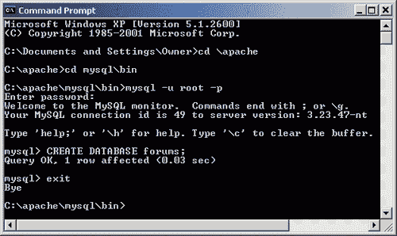
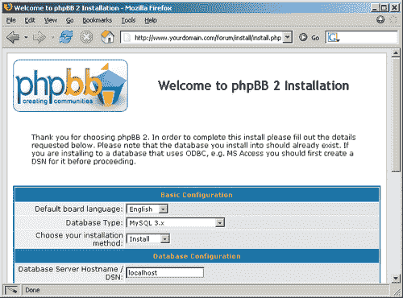
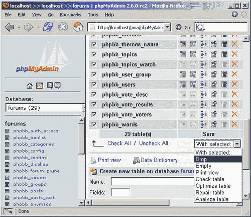
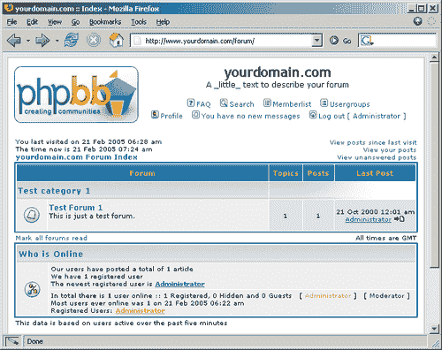
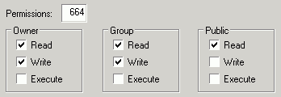

# 第二章 安装和配置 phpBB

现在你对 phpBB 有了一个大致的了解，是时候在你的服务器或个人计算机上安装它并开始使用了。安装过程通常不难——phpBB 有一个内置的基于浏览器的安装程序，这使得工作变得容易得多——但在开始之前，你需要了解一些先决条件和一些细节。安装 phpBB 后，你还需要执行一些安装后任务。在本书的第二章中，你将学习：

+   在安装 phpBB 之前需要满足哪些先决条件

+   如何下载和安装 phpBB

+   基本安装后任务，以及一些安全提示

+   遇到问题时在哪里以及如何寻求帮助

# 预安装

在本节中，你将了解 phpBB 的服务器需求，这些需求在托管提供商提供的服务器配置中价格较低。然后本节讨论一些与数据库相关的话题，并以一个清单结束，你可以使用这个清单来确保你有开始安装过程所需的一切。

## 需求

在服务器需求方面，phpBB 非常灵活，你有很多选择。但让我们集中讨论最广泛使用的配置，包括：

+   任何主要操作系统

+   Apache 网络服务器

+   MySQL 数据库系统，版本 3.22 或更高

+   PHP 版本 4\. PHP3 也可以使用，但建议使用最新的稳定版 4.3

phpBB 在设计时考虑了便携性，因此上述所有需求都非常灵活。让我们更详细地看看它们，并了解你有哪些选择。

+   **操作系统**（**OS**）：phpBB 是操作系统独立的。这意味着它可以在各种操作系统上运行——Windows、Linux、MacOS。你应该不会遇到满足这个要求的问题，并且可以在你首选或最经济的环境中运行你的论坛。

+   **网络服务器**：phpBB 可以运行在各种网络服务器上，包括最流行的 Apache 和微软的互联网信息服务器（IIS）。如果你使用的是托管服务，网络服务器需求不会成为障碍。但如果你想在你的计算机上安装 phpBB，你必须注意这个细节。虽然描述如何安装网络服务器超出了本书的范围，但你可以找到一些有用的信息。

+   **数据库系统**：目前 phpBB 支持的数据库包括 MySQL 3.22 或更高版本（包括 MySQL 4.x）、PostgreSQL 7.0.3、MS SQL Server（7 或 2000，直接或通过 ODBC）以及通过 ODBC 的 MS Access（2000 或 XP）。再次强调，根据你是本地安装 phpBB 还是远程服务器安装，你可能需要在你的计算机上安装一个支持的数据库系统，或者简单地询问你的服务提供商你有什么数据库访问权限。

+   **PHP**：一般来说，所有 PHP 应用程序都由包含编程指令的文件组成，这些指令由所谓的 PHP 解释器执行。PHP 解释器是一段软件，你需要在想要安装 phpBB 的系统上运行它。如果你选择托管服务，好消息是 PHP 非常流行，以至于实际上很难找到一个不支持它的托管服务。

    PHP 4.x 是最广泛使用的 PHP 版本，也是 phpBB 安装中最广泛使用的版本。如前所述，PHP 3.x 足以让你的论坛运行，但不推荐使用。PHP 5 也不推荐使用（目前还不推荐），因为由于 phpBB 是在 PHP 5 发布之前开发的，所以 phpBB 在这个平台上还没有经过彻底的测试。

    ### 注意

    phpBB 可以在 PHP 3.x 和 4.x 版本上运行，但如果你有选择，你应该目标是最新稳定的 PHP 4.3.x 版本。

## 攻击计划

现在你已经明确了要求，让我们来探讨将 phpBB 安装到系统中的选项：

+   **你已经有了一个现有的网络托管服务**：在这种情况下，你只需要联系你的托管服务提供商，并询问他们是否支持 PHP 以及上述列出的任何数据库，最好是 MySQL。如果他们不支持，找出他们是否可以为你安装/启用这些。如果他们仍然无法帮助你，你可能需要从剩下的选项中选择一个。

+   **你在寻找一个好的托管服务提供商**：好消息是，即使是价格最低的托管套餐通常也包含 PHP 和 MySQL 的支持。在选择托管服务提供商时有很多要点需要考虑，但至少，你应该在网上浏览一些独立的评论。不要仅仅因为带宽和磁盘空间巨大甚至无限而匆忙选择最便宜的套餐。向你的潜在托管服务提供商问一些问题（例如关于上述要求的问题）并判断他们响应的速度和质量。当你需要时，你希望有一个可靠的支持。

+   **你想要在自己的电脑上安装 phpBB**：有时，即使你选择了前两种选项，你也可能仍然想要在本地测试你的论坛。例如，如果你以后想要尝试安装或创建新的样式或修改，在你上线之前在自己的电脑上进行开发和测试可能会更容易（并且肯定更安全）。

如果你想在你的电脑上设置环境，你有两种选择：一个接一个地安装所有必要的组件，配置它们，并使它们协同工作，或者使用互联网上可以找到的某个一站式安装（捆绑包）。它们通常包括一个可下载的安装程序，负责安装和配置你所需的所有内容——Apache、PHP、MySQL——以及更多。这样的全包捆绑通常有 XAMPP（[`www.apachefriends.org/en/`](http://www.apachefriends.org/en/））和其他在 HotScripts 上列出的捆绑包，例如（[http://www.hotscripts.com/PHP/Software_and_Servers/Installation_Kits/](http://www.hotscripts.com/PHP/Software_and_Servers/Installation_Kits/)）。

如果你想要自己设置环境而不是使用现有的捆绑包，以下是你需要做的。

##### 行动时间 - 在本地电脑上设置环境

1.  安装 Apache Web 服务器。

    ### 注意

    前往[`httpd.apache.org/download.cgi`](http://httpd.apache.org/download.cgi)。从您最近的镜像下载适用于您操作系统的最新稳定版 1.3.x 服务器版本。安装它，如有疑问，请参考[`httpd.apache.org/docs/`](http://httpd.apache.org/docs/)上的文档。

1.  安装 PHP。

    ### 注意

    从[`www.php.net/downloads.php`](http://www.php.net/downloads.php)下载适用于您操作系统的最新稳定版 4.3.x。版本，如有必要，参考文档[`www.php.net/manual/en/install.php`](http://www.php.net/manual/en/install.php)进行安装。

1.  安装 MySQL。

    ### 注意

    从[`dev.mysql.com/downloads/`](http://dev.mysql.com/downloads/)下载最新推荐的版本。文档只需点击[`dev.mysql.com/doc/mysql/en/Installing.html`](http://dev.mysql.com/doc/mysql/en/Installing.html)即可获取。

1.  安装 phpMyAdmin（可选）。

    ### 注意

    phpMyAdmin 是一个免费且非常流行的 Web 应用程序，通过简单直观的浏览器界面管理 MySQL 数据库。你并不绝对需要它，但它在数据库操作方面可以使你的生活变得更加容易。它需要 PHP，但你已经安装了它，所以你一切都准备好了。最新稳定版本可以从[`www.phpmyadmin.net/`](http://www.phpmyadmin.net/)下载。

当你下载时，你可能已经注意到了建议下载“源代码”或“二进制文件”。请下载二进制文件，但如果你真的对幕后代码的样子感到好奇，请下载源代码文件，玩弄它们并尝试自己编译它们。当然，这需要一些 C 编程知识。所有这些源代码都可以免费使用、学习和修改。欢迎来到开源软件的奇妙世界！

现在有了运行 PHP 和 MySQL（或另一个数据库系统）的 Web 服务器，让我们看看一些数据库准备工作。

## 完成预安装前的触摸——数据库

phpBB 需要访问数据库，因此您必须使用现有的数据库或创建一个新的数据库。根据您是在本地计算机上安装还是远程服务器上安装，您将有不同的选项来设置 phpBB 所需的数据库；我们将查看这些选项。如果您有选择，请为 phpBB 使用一个新的空数据库；这使维护更容易。

##### 为本地安装设置数据库

如果您在个人计算机上安装 phpBB，您在创建用于 phpBB 的新数据库时应该没有限制。您可以通过使用 phpMyAdmin 或使用控制台（命令提示符）来实现。使用 phpMyAdmin，创建新数据库非常简单；这是您加载应用程序时呈现的第一个选项之一。如果您没有安装 phpMyAdmin，您可以使用命令提示符来创建新数据库。让我们看看两种方法。为了本章中的示例，让我们假设您的新数据库名为"forums"。

##### 行动时间——使用 phpMyAdmin 创建论坛数据库

1.  前往您的主要 phpMyAdmin 页面。

1.  在**创建新数据库**字段中输入文本**forums**。

1.  点击**创建**按钮。

###### 发生了什么

您已创建了一个新的数据库。在您左侧的 phpMyAdmin 中的数据库下拉菜单中，您现在将找到一个新选项——您刚刚创建的"forums"数据库。

##### 行动时间——使用命令提示符创建论坛数据库

1.  访问您的命令提示符。（Windows 用户，点击**开始**，然后**运行**，然后输入**cmd**）。

1.  在命令提示符（控制台窗口）中，使用`cd directory_name`进入目录（cd 表示“更改目录”）和`cd .`返回（向上一级），如果您错误地输入了错误的目录。

1.  一旦您进入 MySQL 安装的目录，请转到`bin`目录，在那里您将找到几个 MySQL 可执行文件。

1.  输入`mysql u root p`。

    ### 注意

    这条指令的意思是“使用用户名`root`连接到 MySQL 并要求我输入密码”。`root`是 MySQL 安装时的默认用户名。如果您已创建了其他 MySQL 用户帐户，您可以使用其中一个。

1.  当提示输入密码时，按*Enter*（Mac 上的*Return*）。这意味着您提供一个空密码。用户名`root`带有空密码是默认的 MySQL 帐户。如果您已更改此密码，请输入它。

1.  如果您已成功连接，您将看到一个欢迎信息和`mysql`提示符。输入`CREATE DATABASE forums`；然后按*Enter*。**不要**忘记在末尾加上分号。

1.  如果您想验证数据库是否已创建，请输入`SHOW DATABASES`；然后按*Enter*。您应该在列表中看到您刚刚创建的新数据库。

1.  就这样。输入`exit`，按*Enter*，MySQL 会礼貌地对您说“再见”。

1.  再次输入`exit`以关闭您的命令提示符。

##### 为远程安装设置数据库

在这种情况下，过程可能因你具体的套餐及其限制而大不相同。一些可能的场景包括：

+   一些主机只提供一个具有预定义名称的数据库。找出这个名字；这就是你将要使用的数据库。

+   一些主机允许你使用安装在服务器上的 phpMyAdmin 创建数据库。

+   一些提供不同的 Web 界面来创建数据库，作为主机套餐控制面板的一部分。

+   一些服务提供商可以给你他们的服务器 shell 访问权限。shell 访问意味着你将能够使用命令提示符并在远程服务器上执行指令（命令）。在这种情况下，你需要向你的主机提供商了解如何建立到服务器的 shell 连接。连接成功后，重复之前描述的命令提示符创建数据库的步骤。这次你将使用主机提供给你的数据库用户名和密码。

+   为了建立 shell 连接，你需要一个名为**shell 客户端**的程序。一个流行的选择是免费的 PuTTY telnet 和 SSH 客户端（[`www.chiark.greenend.org.uk/~sgtatham/putty/`](http://www.chiark.greenend.org.uk/~sgtatham/putty/))。

*安全提示*：如果可能的话，在你的主机上创建一个新的 MySQL 用户账户，只给它访问你刚刚创建的新数据库的权限，并用于 phpBB 的安装。这听起来可能有些过于偏执，但原因通常是主机只提供一个用户名和密码，它可以用于所有事情——FTP、MySQL、控制面板和 shell 访问。因此，创建新的 MySQL 用户名/密码组合的原因是，如果它因某种原因被泄露，拥有它的恶棍只能造成有限的损害。这个密码只适用于一个数据库，不适用于 FTP、shell 或控制面板访问。

在创建这个新的数据库用户账户时，最好只分配“select”、“insert”、“update”和“delete”权限；phpBB 的正常运行不需要其他可能的权限。尽管如此，phpBB 的安装也需要“create”权限，而某些修改安装可能需要“alter”或“drop”权限。因此，最安全的选项是将“select”、“insert”、“update”、“delete”和“create”权限分配给新的数据库用户，一旦安装完成，就移除“create”权限。

创建新数据库用户的实际过程可能因你的主机提供商的政策而异。有些可能不允许这样做，有些可能提供专门的界面，有些可能允许你访问 phpMyAdmin。使用 phpMyAdmin 创建新的 MySQL 用户账户相当简单；只需点击 phpMyAdmin 主页上的**用户**链接，然后填写**添加**表单。

如果你正在使用命令提示符创建新用户，请使用以下查询：

```php
GRANT SELECT,INSERT,UPDATE,DELETE,CREATE
ON forums.*
TO ‘mysecretusername’@’localhost’
IDENTIFIED BY ‘mysecretpassword’;

```

在这个例子中，`forums` 是数据库名称，`localhost` 是数据库主机名，`mysecretusername` 是分配给该数据库用户的用户名，而 `mysecretpassword` 是密码。

## phpBB 预安装清单

到目前为止，您现在已准备好安装 phpBB。但在继续之前，花一分钟回答以下问题；这只是为了确保您拥有所需的一切（第七章，讨论了修改和黑客技术，讨论了一些可能对您有帮助的技能集和工具）：

+   我有一个运行的 Web 服务器吗？

+   我的 Web 服务器运行 PHP 吗？

+   我的 Web 服务器运行的是 MySQL、PostgreSQL、MSSQL 还是 MS Access？

+   我知道我的 FTP 主机名、用户名和密码吗？（此步骤仅适用于远程服务器，请参阅清单后的说明。）

+   我访问数据库的用户名是什么？

+   该数据库运行在哪个主机上？（询问您的托管提供商；它通常是 `localhost` 或 `127.0.0.1`。在 ODBC 的情况下，需要一个 DSN。）

+   我的数据库（例如 `forums`）的名称是什么？

**关于 FTP 的说明**：您需要一个 FTP 程序，也称为 *FTP 客户端*，以便将文件从您的计算机传输到远程服务器。有许多免费/试用版的 FTP 程序可供使用。只需简单的 Google 搜索就会产生大量结果。通常，使用 FTP 程序与在本地计算机的不同位置复制文件没有太大区别。区别在于您需要首先建立与远程计算机的连接。为了做到这一点，您需要一个 FTP 主机名、用户名和密码，您可能已经拥有，由您的托管提供商提供。

# 安装

现在所有先决条件都已满足，让我们开始安装过程：

1.  **下载**：从 [`www.phpbb.com/downloads.php`](http://www.phpbb.com/downloads.php) 下载压缩的 phpBB 文件，选择您知道如何解压的压缩格式。

1.  **解压**：使用您首选的压缩工具（例如 WinZip）将文件解压到选定的目录中。如果您是在本地安装，请将文件解压到您的网站根目录内的一个目录中。phpBB 目录树的最顶层目录将被称为 `phpBB2`。

1.  **FTP**：如果您是在本地安装，请跳过此步骤。如果您是在远程服务器上安装，请将整个 `phpBB2` 目录原样复制到远程服务器上。您可以使用 FTP 程序连接到您的服务器并传输文件。

1.  **选择您的 phpBB 根目录**。在这个步骤中，您需要做出一个重要的决定——在您的服务器上安装 phpBB 的位置以及如何命名它。之所以这很重要，是因为这将决定您的用户将如何看到您的论坛。假设您的域名是 [`www.yourdomain.com`](http://www.yourdomain.com)。您有以下几种选择：

    +   如果您将 `phpBB2` 目录及其内容复制到您的网站根目录并安装而不做任何修改，您的论坛将可在 [`www.yourdomain.com/phpBB2`](http://www.yourdomain.com/phpBB2) 访问。

    +   您可以简单地将 `phpBB2` 目录重命名为您喜欢的名称，比如 `forum`。在这种情况下，您的社区将位于 [`www.yourdomain.com/forum`](http://www.yourdomain.com/forum)。

    +   您可以选择在您的网站根目录中托管论坛，以便可以直接在 [`www.yourdomain.com/`](http://www.yourdomain.com/) 访问，或者如果您使用子域名，则类似于 [`forum.yourdomain.com/`](http://forum.yourdomain.com/)。如果您决定这样做，那么您需要复制 `phpBB2` 目录的 *内容* 到您的（子）域名的网站根目录，这不仅仅是 `phpBB2` 目录本身，而是包含在其中的文件和目录。

    为了本章的目的，我们将选择第二个选项 [`www.yourdomain.com/forum`](http://www.yourdomain.com/forum)，因为它可能是最常见的一种。

1.  `config.php`：您需要更改此文件的权限，以便在安装过程中 phpBB 可以写入。转到 phpBB 安装的根目录，找到名为 `config.php` 的文件。更改文件权限，使其可由 phpBB 安装脚本写入，换句话说，在 Linux 系统上，使用 `chmod` 命令将其设置为 `666`（或 `-rw-rw-rw-`）。在 Linux/Unix 系统上，`chmod` 是一个表示“更改模式”的命令，用于调整文件权限。文件权限指定了谁可以对特定文件做什么。您更改文件模式的选择包括：

    +   如果您有对 Linux 服务器的 shell 访问权限，请转到您的 phpBB 目录并输入 `chmod 666 config.php`。这样就可以了。

    +   如果您只有 FTP 访问权限，那么您的 FTP 客户端（您用于将文件复制到远程服务器的程序）可能会给您提供 chmod 的选项，但您需要找到它。在一些 FTP 客户端中，这个选项简单地称为 chmod，在其他客户端中则位于文件属性或权限下。

    +   如果您无法更改文件权限，请不要担心。如果在安装过程中 phpBB 安装程序无法写入此文件，您将会有下载系统中的 `config.php` 文件并然后通过 FTP 上传文件，覆盖 phpBB 根目录中已有的文件的选择。

1.  **启动 phpBB 安装程序**：将您的浏览器指向 phpBB 目录，在我们的例子中是 [`www.yourdomain.com/forum/`](http://www.yourdomain.com/forum/)。您将被自动重定向到安装脚本，该脚本位于 [`www.yourdomain.com/forum/install/install.php`](http://www.yourdomain.com/forum/install/install.php)。

    您应该会看到一个类似于上页所示的屏幕。

    

1.  **安装程序数据表单**：完成安装屏幕上显示的表单。上一节中的清单在这里很有用。以下是对此表单字段描述的概述，因为其中一些可能不是那么不言自明。简而言之，此表单中的大多数字段由 phpBB 安装程序预先填写；您需要关注的基本上只是数据库名称、用户名、密码以及管理员用户名、密码和电子邮件地址。

    | 选项 | 设置 |
    | --- | --- |
    | **默认论坛语言** | 由于您尚未安装其他语言，**英语**是唯一选项。稍后如果您决定使用其他语言，您总是可以更改此设置。 |
    | **数据库类型** | 您将使用的数据库系统，最可能是 MySQL 4.x 或 MySQL 3.x |
    | **选择您的安装方法** | **安装**或**升级**。由于您没有之前的 phpBB 安装，您将选择**安装**。 |
    | **数据库服务器主机名/DSN** | 通常为**localhost**；请参考您的清单。 |
    | **您的数据库名称** | 请参考您的清单。 |
    | **数据库用户名** | 请参考您的清单。 |
    | **数据库密码** | 请再次参考您的清单。 |
    | **数据库中表的表前缀** | **phpbb_**是默认值。安装后，数据库中所有与 phpBB 相关的表都将使用此前缀作为其名称的一部分，例如**phpbb_users**和**phpbb_posts**。使用前缀不是强制性的，但这是一个很好的方法，可以区分您的 phpBB 表和其他所有表，以防您在同一数据库中有其他非 phpBB 相关的表。这也允许您，例如，拥有两个或更多共享同一数据库的独立 phpBB 安装；您只需为每个安装使用不同的前缀即可。在此前缀中不要使用空格，否则安装程序将返回错误。如果您没有理由更改它，保留默认的**phpbb_**前缀是一个好主意。您可能希望在以后安装的大多数 phpBB 修改都将假定此前缀。 |
    | **管理员电子邮件地址** | 您的电子邮件地址。当 phpBB 通知用户关于新私信时，它将被用作发送者电子邮件地址。因此，提供一个您经常检查的有效电子邮件地址是一个好主意。例如，代表您的论坛的电子邮件地址`admin@yourdomain.com`将是一个不错的选择。 |
    | **域名** | 您的域名。phpBB 安装程序可能会自动识别，否则请自行输入。 |
    | **服务器端口** | 默认值为**80**。通常您不需要更改此值。 |
    | **脚本路径** | 到您安装的相对路径。通常 phpBB 安装程序会正确猜测，您不需要更改它。 |
    | **管理员用户名** | 管理员用户名非常重要。没有默认值，但使用**管理员**是一个常见的选择。 |
    | **管理员密码** | 请谨慎选择并确保难以猜测。此选项不能留空。 |

1.  **完成安装**：点击**安装**按钮。如果到目前为止一切顺利，您已填写安装表单中所有必需的数据，并且没有错误信息，phpBB 将成功安装。恭喜！点击**完成安装**并继续进行安装后的任务。

## 安装故障排除

此故障排除指南并非详尽无遗；它仅包含 phpBB 用户遇到的一些常见问题。如果您的問題未在此列出，请参阅本章末尾的最后部分以获取有关如何寻求帮助的指南。

### 症状

错误信息：**当前无法写入配置文件**。

#### 原因

由于某种原因，上述安装步骤的第 5 步未完成。再次阅读第 5 步的描述，但仅当您需要更多关于错误性质的背景信息时。否则，请参阅下面的解决方案。

#### 解决方案

phpBB 安装程序本身将从这个情况中恢复。只需遵循屏幕上的说明即可。

您可以选择下载安装程序尝试写入的`config.php`文件。下载文件后，将其复制/FTP 到 phpBB 根目录中已存在的`config.php`文件上。

或者，如果您使用的是支持 FTP（很可能）的 PHP 版本，您还可以选择使用安装程序为您 FTP 文件。如果您想使用此选项，您将必须输入您通常用于通过桌面 FTP 客户端（CuteFTP、SmartFTP 等）连接到服务器的数据。请确保输入 phpBB 安装程序可以复制`config.php`文件的完整路径。完整路径与在您的 FTP 客户端中可见的路径相同。换句话说，phpBB 安装程序正在尝试为您充当 FTP 客户端。

### 症状

错误信息：**无法连接到数据库**。

#### 原因

此消息可能有几个原因：

+   您尚未安装数据库系统。

+   数据库系统已安装，但未运行。

+   您未从第 7 步中描述的下拉列表中选择正确的数据库类型。

+   数据库主机名/DSN 不正确。

+   您提供的数据库名称指向一个不存在的数据库。

+   您访问数据库的用户名不正确或此数据库用户权限不足。

+   您访问数据库的密码不正确。

#### 解决方案

再次阅读预安装部分。确保使用正确数据完成最后的清单。如果您仍然遇到问题，请参阅本章末尾的最后部分以获取寻求帮助的建议。

### 症状

错误信息：**您输入的密码不匹配**。

#### 原因

这指的是在安装程序表单的最后部分，在**管理员配置**下输入的管理员密码和密码确认。

#### 解决方案

确保在两个字段中输入相同的密码。密码不能为空。

### 症状

错误信息：**您的服务器上的 PHP 配置不支持您选择的数据库类型**。

#### 原因 1

PHP 实际上支持您想要使用的数据库系统，但您没有从安装表单的数据库类型字段中选择它。

#### 解决方案

点击浏览器上的 **后退** 按钮，并选择适当的数据库类型。

#### 原因 2

正如消息所述，您的 PHP 安装不支持所选的数据库系统。

#### 解决方案

与您的托管提供商联系，或者如果您是在本地安装，请阅读有关如何启用对所选数据库类型支持的 PHP 文档。

### 症状

错误信息：**尝试更新数据库表‘phpbb_auth_access’时发生错误，该表已存在**。

在这里 **phpbb_** 是您在安装表单中输入的表前缀。

#### 原因 1

虽然可能性很小，但可能发生的情况是，在您的数据库中有一个与 phpBB 完全无关的表格，其名称与 phpBB 表的名称相同。

#### 解决方案

这是一个命名冲突。为了解决这个问题，请返回并选择不同的表前缀。

#### 原因 2

您正在尝试使用已经包含 phpBB 安装的数据库进行安装。

#### 解决方案

如果您想保留现有安装，请返回安装表单并简单地选择不同的前缀。这样，您就解决了命名冲突，并且将有两个使用相同数据库的 phpBB 安装。

如果您不想保留现有安装，例如它是一个失败的安装，您必须删除由先前安装创建的所有数据库表格。要删除哪些表格？您可以通过它们的名称前缀来判断。使用友好的 phpMyAdmin 删除这些表格，或者如果您不能使用它，则像本章前面所述，在命令提示符下连接到 MySQL，并手动删除表格。为此，您需要使用 `DROP TABLE` 语法，这实际上非常简单，但也有一点危险，因为它会永久删除整个数据库表格及其内容。

##### 行动时间——使用 phpMyAdmin 删除 phpBB 表格

1.  加载 phpMyAdmin 主页。

1.  从左侧下拉菜单中选择 **forums**。**forums** 是数据库名称；如果不同，请使用您的数据库名称。

1.  在右侧，显示所有表格的地方，勾选您想要删除的每个表格旁边的框。您也可以使用 **全选** 链接来选择此数据库中的所有表格。

1.  从操作选项中选择 **删除**。

##### 行动时间——使用命令提示符删除 phpBB 表格

1.  如前所述，使用控制台连接到 MySQL。

1.  一旦连接到 MySQL，使用 `\u forums` 更改正在使用的数据库，其中 `forums` 是您数据库的名称。

1.  使用 `SHOW TABLES` 列出所有表格；然后使用 `DROP TABLE table_name_here;` 逐个删除它们。

或者，如果您确定这个数据库中没有您需要的表——也就是说，这里除了失败的安装中的一些无用的 phpBB 表之外什么都没有——您可以一次完成：连接到 MySQL 后，输入`DROP DATABASE forums`;。

这将删除整个数据库。永久！所以请小心。您需要重新创建它以进行下一次安装。

### 注意

删除表和数据库是一个单向过程，这意味着您不能撤销。所以在删除任何内容之前请三思。在销毁一些表之前，如果您有疑虑，请考虑制作备份。

*小贴士*：这是一个允许您快速备份表的 MySQL 查询：

```php
CREATE TABLE ‘new_table_name’
SELECT * FROM ‘table_to_back_up’;

```

这将在当前数据库中创建一个新的表，称为`new_table_name`，并且新表将与名为`table_to_back_up`的表具有相同的结构和内容。

如果您想备份不同数据库中的表，您可以使用：

```php
CREATE TABLE ‘new_database’.’new_table_name’
SELECT * FROM ‘source_database’.’table_to_back_up’;

```

# 安装后任务

安装 phpBB 后，您需要执行一些安装后操作，即删除不需要的目录并设置一些基本配置选项。

##### 行动时间—删除不需要的目录

1.  通过 FTP 连接到您的服务器（对于本地安装请跳过此步骤）。

1.  前往 phpBB 安装的目录。

1.  删除`install`和`contrib`目录。

1.  （可选）也可以删除`docs`目录。

###### 发生了什么？

安装成功后，当您访问您的新 phpBB 论坛首页时，您会得到有关安装后任务的提示。建议您删除`install`和`contrib`目录，因为将它们留在服务器上被认为是一个安全风险，如此之大以至于如果 phpBB 检测到它们的存在，甚至不会运行。

如果您喜欢，也可以删除`doc`目录；它不是安全威胁，但可以节省一些磁盘空间。

##### 基本配置

删除不需要的目录后，您就可以访问您刚刚安装的新亮丽的公告板了。太棒了！它工作了！

现在熟悉一下管理面板是个好主意。您可以通过编辑一些通用配置变量立即做到这一点。

##### 行动时间—使用管理面板进行初始配置

1.  在浏览器中加载您的公告板，即访问[`www.yourdomain.com/forum`](http://www.yourdomain)。它看起来像以下截图。

1.  使用页面底部的表单登录。根据安装如何结束，您可能已经登录。如果您还没有，请使用您在安装期间选择的管理员用户名和密码。

1.  点击**转到管理面板**链接；它位于每个页面的底部。

1.  点击左侧菜单中**一般管理**部分下找到的**配置**链接。

1.  根据需要编辑字段（稍后讨论）。

1.  完成后点击**提交**。

###### 发生了什么？

您已成功登录到您的管理面板，这是管理您基于 phpBB 的公告板的地方。您已加载通用配置设置表单并保存了设置。

此表单中的大多数字段都预先填充了 phpBB 安装程序设置的值，这些值已经很好，但有些字段如果编辑会更好。以下是一个感兴趣字段的列表：

**一般论坛设置**

**站点名称**：您站点的友好名称：通常是域名。它将出现在每个页面的顶部。默认值为`yourdomain.com`，您可以在前面的截图中看到它的实际应用。

**站点描述**：对站点内容的简要描述，最好不超过六到七个字。它将出现在每个页面的顶部，不是必需的。再次提醒，查看前面的截图以了解默认值**一个简短的文字来描述你的论坛**。

**启用账户激活**：这指的是新用户被接受的方式。有三个选项：

+   用户在注册后立即被接受（这是默认选项）。

+   他们必须通过点击通过电子邮件收到的链接来确认他们的订阅。这样，他们确认了他们成为会员的愿望，并验证了他们是注册时提供的电子邮件地址的所有者。这可能是最常用的选项。

+   会员注册申请需要由管理员进行审查和批准。

**系统时区**：您的社区主要所在的时区。这是一个默认值，每个成员都可以覆盖。

**启用 GZip 压缩**：启用此选项将导致所有页面在从服务器发送时被压缩，并在用户计算机接收到后（如果用户的浏览器支持压缩）被解压缩。如果不支持，则服务器不会压缩页面。这会导致网站运行更快，使用更少的带宽，但会增加服务器负载，因为压缩每个服务的页面的开销。

**Cookie 设置**

**Cookie 名称**：通常你不需要更改这个。只有在你使用同一个域名托管多个论坛时，你可能需要更改这个值。如果是这种情况，你可以为每个安装使用不同的 cookie 名称。

**Cookie 安全**：如果您的站点运行在安全套接字层（SSL）上；换句话说，如果您的页面使用安全的 HTTPS 协议显示，而不是仅使用 HTTP，则启用此选项。

**会话长度[秒]**：确定用户会话“存活”多长时间后才会被删除。这是一个与安全相关的设置，它确定用户在多久不活跃（不访问任何论坛页面）之前会被 phpBB 注销。

**头像设置**

“头像”指的是出现在成员用户名下方的那些小型的成员特定图形。你有三种方式提供这种功能。

+   **启用相册头像**：用户可以从您上传到指定目录的预定义图形中选择。

+   **启用远程头像**：用户可以将他们在互联网上找到的图形链接到其他服务器上。

+   **启用头像上传**：用户可以向您的服务器上传图形。

**头像存储路径**：上传的头像存储位置；默认为**images/avatars**，这表示[`www.yourdomain.com/forum/images/avatars/`](http://www.yourdomain.com/forum/images/avatars/)。

**头像画廊路径**：预定义图形存储位置；默认为**images/avatars/gallery**，这表示[`www.yourdomain.com /forum/images/avatars/gallery/`](http://www.yourdomain.com)。

**COPPA 设置**

COPPA 代表儿童在线隐私保护法案。基本上，如果他们的孩子要成为您论坛的成员，需要父母书面同意。更多信息，请参阅 phpBB 用户指南和[`www.coppa.org`](http://www.coppa.org)。

**电子邮件设置**

**管理员电子邮件地址**：在安装过程中提供的电子邮件地址。

**电子邮件签名**：这将被附加到 phpBB 代表您发送的每一封电子邮件上，例如私人消息通知、主题关注通知等。发挥你的想象力，为你的成员设计友好的消息页脚。

**使用 SMTP 服务器发送电子邮件**：您可以选择使用 SMTP 服务器发送邮件，而不是本地的 PHP 邮件函数。一些主机禁用了 PHP 邮件函数，因为不道德的客户可能会滥用它（发送垃圾邮件）。如果是这种情况，您需要使用 SMTP 服务器发送邮件。您的互联网服务提供商（ISP，您用来连接互联网的）很可能已经为您提供了访问 SMTP 服务器的权限来发送电子邮件（例如使用 Microsoft Outlook）。您可以使用这个 SMTP 服务器来管理您的论坛。如果您在自己的 PC 上安装 phpBB 而没有设置邮件服务器，您也可以使用这个选项。

##### **设置头像目录**

如果您允许成员向您的服务器上传头像，您必须使存储它们的目录可写。文件权限（在 Linux 机器上）需要是 777。使用我们在预安装部分中用于`config.php`的相同方法更改文件权限，将`image/avatars`目录或您决定存储成员头像的任何位置的权限更改为 777。

# 安全提示

确保您的论坛尽可能安全始终应该是一个关注点。以下是一些可以帮助您开始的提示。

##### **管理员密码**

让您的管理员密码难以猜测。这是一个非常重要的密码，所以您不希望其他人猜到并随意操作您的论坛。这也适用于您稍后决定分配的任何版主。提醒他们更改密码为非常难以猜测的密码。例如，使用与用户名相同的密码绝对不推荐。发挥创意，选择像**y0u11n3v3rgue$$**（读作“你永远不会猜到”）和**wh00p3375**（读作“whoopee 75”）这样的密码。定期更改此密码并仅为此论坛使用它（不要用于其他服务如 Hotmail 等）也是一个好主意。

##### 禁止对数据库的远程连接

远程连接允许您从远程位置访问您的数据库。例如，从您的本地机器，您可以查询在远程托管服务器上运行的数据库。这确实有好处——例如，为远程数据库中的数据制作本地备份——但它可能是一个安全风险。如果访问数据库的用户名和密码以某种方式泄露，那么如果远程连接被启用，入侵者就可以从他的或她的计算机访问您的数据。如果远程连接被禁用，黑客将必须访问远程服务器才能连接到您的数据库。此外，在启用远程连接的情况下，潜在的黑客可以通过尝试不同的组合来猜测您的密码，直到他们连接成功。

一些托管提供商允许您启用/禁用远程连接，而有些则完全不允许远程连接。检查您的情况，并且（除非您有很好的理由）确保远程连接被禁用。

##### MySQL 账户

为论坛使用新的 MySQL 账户（或您可能正在使用的任何其他数据库的新账户）。这在本章的预安装部分中已有更详细的描述。

##### config.php

在您将`config.php`文件的权限（在预安装部分中描述）更改为所有用户可写之后，并安装了 phpBB，现在是时候将其恢复原状了。使用之前描述的相同方法，将权限更改为 664。

在执行`chmod 664 config.php`命令后，以下是配置文件的更直观描述。这是一张来自 Windows FTP 客户端的屏幕截图。



##### .htaccess 保护管理面板

为管理面板添加一层额外的保护可以通过设置 `.htaccess` 目录保护来实现。`.htaccess` 是一个文件，可以包含适用于 `.htaccess` 文件所在目录及其所有子目录的 Apache 服务器指令。设置 `.htaccess` 保护将在你进入管理面板时显示一个额外的用户名/密码窗口。设置保护可能不是一件简单的事情，互联网上有许多教程可以帮助你完成这项任务。`.htaccess` 文档可以在 Apache 网站上找到，网址为 [`httpd.apache.org/docs/howto/htaccess.html`](http://httpd.apache.org/docs/howto/htaccess.html)。

有可能你的托管提供商为你提供了一个更简单的界面（控制面板），这可以帮助你设置保护。

因此，你可以直接使用 `.htaccess` 或通过一个更友好的界面来保护根 phpBB 目录下的 `admin` 子目录，使用与“正常”管理密码不同的用户名和密码。这样，你使潜在的入侵者更难入侵，因为他们需要处理两个不同的用户名/密码组合。

# 寻找帮助

记得我们之前提到的 phpBB 用户的大社区吗？这些人可以在你遇到无法解决的问题时帮助你。在 phpBB.com 上，有一个包含“静态”文章的支持部分，例如用户指南、知识库和常见问题解答，还有一个社区部分（不出所料，由 phpBB 支持），全球的 phpBB 用户在这里分享他们的经验。你可以在 phpBBHacks.com 上找到类似的用户社区。

当你遇到问题时，不要慌张；你不是一个人，而且很可能有人遇到过并解决了完全相同的问题，这个人很可能会分享解决方案。所以，你提出的问题很可能已经被问过并得到了回答。你所需要做的就是找到它。如果你找不到所需的解决方案，可以在公告板上发帖提问，但请确保先进行搜索。

即使你已经找到了答案，也不要立刻离开。你可以拖延一段时间，帮助那些你知道如何解决的问题。

# 摘要

在本章中，我们已经走了很长的路：设置了使 phpBB 运行的不同组件，进行了一些数据库准备工作，下载了 phpBB 并安装了它。现在你对 phpBB 的基本配置选项以及如何使你的论坛更安全也有了一定的了解。

到目前为止，你已经拥有了启动社区网站所需的知识和技能。今天就可以开始！
