# 第三章。phpBB 快速游览

在前面的章节中，你学习了 phpBB 是什么以及如何安装它。现在是时候更深入地了解它实际上是如何工作的，以及它为用户、版主和管理员提供哪些功能了。

在本章中，你将学习：

+   从访客的角度看 phpBB 是如何工作的

+   版主的权限是什么

+   最受欢迎的行政功能是如何工作的

# 访客体验

随着越来越多的人加入你的在线社区，他们可能会开始询问有关一些论坛功能的问题。如果你想成为一个好、理解且乐于助人的社区主人，你应该能够引导他们并回应他们的关切。这就是为什么详细了解你的 phpBB 论坛是如何工作的是个好主意。

如果你刚刚从上一章跳转过来，你可能仍然以管理员身份登录。请登出，让我们穿上访客的鞋子开始对新论坛的游览。

## 概览

如果有人按照上一章的步骤访问你刚刚创建的论坛，他们很可能看到以下内容：

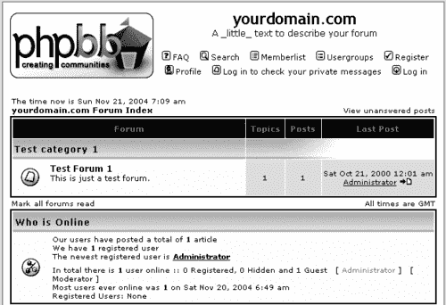

这张截图显示了 phpBB 的发货情况，包括所有默认设置和一个测试论坛中的测试帖子。论坛的唯一注册用户是在安装时创建的管理员用户。在屏幕顶部，紧邻 phpBB 标志旁边，有一组与一些小图标图像一起的链接。这些链接代表论坛的主要导航。其中一个链接是注册并成为社区成员的链接。我们出发吧！

## 注册

注册流程有三个步骤——阅读和接受注册条款、填写用户资料表单，以及（可选的）通过电子邮件进行注册确认。

### 第 1 步

当访客从顶部菜单选择**注册**链接时，他们会看到“注册协议条款”。他们可以选择以下三个选项之一：

+   接受条款并年满 13 岁或以上：此选项触发标准注册流程。

+   接受条款并年龄小于 13 岁：此选项与上面的选项相同，但增加了一个附加条件。根据 1998 年儿童在线隐私保护法（COPPA）的规定，父母或监护人需要通过邮件或电子邮件向你，即论坛管理员，发送一份标准表格。这份表格允许孩子参与论坛。phpBB 会将一份空白 COPPA 表格发送到注册时提供的电子邮件地址。

+   不同意条款：选择此选项将终止注册流程，访客将被重定向到主论坛页面。

### 第 2 步

当访客接受 phpBB 条款时，注册表单会显示出来。这个注册/资料表单中每个字段的确切含义将在稍后描述。现在让我们专注于绝对必需的字段：

+   用户名

+   有效的电子邮件地址

+   密码和密码确认

### 第 3 步

在填写完所有信息后，用户点击**提交**。如果有验证错误，比如电子邮件地址或密码不匹配的语法错误，错误信息将显示在表单的顶部。在没有错误且注册成功的情况下，会显示一个“感谢”页面。根据论坛的配置（见下文*编辑您的个人资料*部分中显示的表格中**电子邮件地址**字段的说明），感谢页面可能会建议用户检查他们的电子邮件，以确认消息以完成注册。

## 登录

注册成功后，用户可以使用论坛首页底部的表单登录。

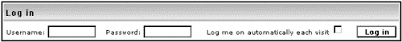

在密码字段旁边有一个复选框，上面写着**每次访问自动登录我**。用户在使用这种便利时应小心，尤其是在共享电脑上。作为管理员，您在使用此选项时应更加小心，因为如果“坏人”接管了您的账户，会发生可怕的事情。想想还有谁可能在使用您的电脑——家人、来访的朋友等。

## 编辑您的个人资料

登录用户可以编辑他们在注册期间创建的原版个人资料。如果他们点击顶部导航菜单中的**个人资料**链接，他们会看到一个个人资料表单，这个表单实际上与注册表单相同，除了两点：

+   用户名不可编辑。管理面板允许用户更改他们的用户名，但这不是默认选项，并且有很好的理由。给用户更改身份的机会意味着，人们将很难在您的社区中分辨出谁是谁。

+   现在有三个密码字段：一个用于旧密码，一个用于新密码，一个用于确认新密码。这些字段通常留空，仅在用户想要更改密码时使用。

好的，让我们通过一个简单的练习来回顾一下我们到目前为止所学的关于用户资料的知识。

##### 行动时间——创建和编辑“The Dude”个人资料

1.  前往论坛的主页，并从顶部导航菜单中选择**注册**。

1.  在**接受条款**页面，选择**我已满 13 岁**

1.  使用用户名**The Dude**、密码**test**和您的电子邮件地址填写表单。其他一切保持不变。

1.  点击**提交**按钮。

1.  到目前为止，注册已成功。再次访问主页。您将在**谁在线**下看到 The Dude，显示为**最新注册用户**。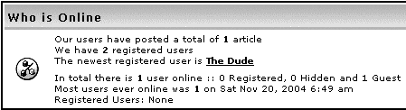

1.  现在转到你的电子邮件收件箱并检查你的电子邮件。你应该会看到一条**欢迎来到 yourdomain.com 论坛**的消息。根据之前讨论的论坛配置，此消息将建议你现在是会员，或者会提供一个链接来激活并完成你的会员申请。欢迎加入！

1.  返回到论坛首页。向下滚动到登录表单。将用户名输入为**The Dude**，密码输入为**test**，然后点击**登录**。登录成功后，你将在在线注册用户列表中看到 The Dude。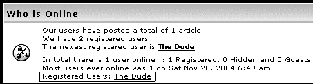

1.  查看顶部的导航链接，并选择**个人资料**。个人资料表单将显示。

1.  在空白签名字段中，输入以下内容：**人类不为其祖先感到自豪，很少邀请他们来参加晚宴。 - 道格拉斯·亚当斯**。其他内容保持不变。

1.  点击**提交**以保存你的修改后的个人资料。

###### 发生了什么？

你已成功注册新个人资料，登录并编辑此个人资料。此用户现在可以开始发帖。

理解用户个人资料字段背后的含义是许多 phpBB 功能的关键，因此这里有一个详细的描述。花时间了解这些字段；你将在论坛的不同区域反复看到它们。

| 字段名称 | 描述 |
| --- | --- |
| *注册信息* |
| 用户名* | 选定的用户名。允许空格和特殊符号，但引号（")除外。最多允许 25 个字符。 |
| 电子邮件地址* | 用户的电子邮件地址。论坛可以配置为通过电子邮件请求注册确认，以便激活用户账户。如果需要此类确认，将发送一封电子邮件到本字段提供的地址。许多 phpBB 管理员选择通过电子邮件确认，以确保用户输入有效的电子邮件地址。这有一个很好的理由——如果你不要求电子邮件确认，而用户使用虚假的电子邮件地址注册，你将开始收到大量退回的邮件到你的管理员电子邮件地址。为什么会有这些退回的邮件？嗯，phpBB 会使用你的账户（你将是发送者）发送电子邮件，用于私信通知、主题关注通知等，如果由于错误的收件人地址导致邮件投递失败，这些邮件会退回给发送者。 |
| 密码* | 密码可以是任何内容，包括单个字母，尽管这种简单的密码实际上**并不**推荐。 |
| 确认密码* | phpBB 要求用户确认密码，以确保他们正确地输入了他们打算输入的密码。关于密码的说明：在保存到数据库之前，使用 MD5 单向加密算法对密码进行加密。用简单的话说：没有方法可以恢复保存的密码；至少现代计算机算法无法做到这一点。这意味着只有用户知道他们的密码。如果用户忘记了密码，有一个创建新密码的程序，但没有恢复旧密码的程序。 |
| *个人资料信息* |
| 正如表格所述，注册的这一部分包含所有社区成员都可以公开查看的信息，即使那些未注册的成员。其中一部分伴随着用户写的每一篇帖子，另一部分只有在有人访问用户个人资料页面时才会显示。本节包含有关用户 ICQ、AOL、MSN 和 Yahoo! Messenger 服务的用户数据以及一些其他个人信息。有一个称为签名的特殊字段。该字段中的文本附加到用户发布的每篇帖子的底部。它可以包含链接、URL 和格式，通常用于添加个人风格。人们出于各种原因使用它，如喜欢的智慧名言、有趣的引言或自我宣传。人们使用它的方式有时会根据社区的主题而有所不同。在罕见的情况下，它实际上可以用于其原始目的——包含发帖者的名字或任何类似真实签名的信息。格式化签名的规则与格式化正常帖子相同，这将在稍后讨论。 |
| *偏好设置* |
| 总是显示我的电子邮件地址 | 选择“是”将在帖子和个人资料中显示用户的电子邮件地址。选择“否”仍然允许其他成员向此用户发送电子邮件，但不知道确切的电子邮件地址。他们可以通过使用特别设计的 phpBB 电子邮件界面来做到这一点。 |
| 隐藏您的在线状态 | 如果选择“是”，当此用户登录时，用户名将不会显示在论坛首页的“谁在线”区域。许多人出于隐私原因选择此选项。尽管如此，当以管理员身份登录时，隐藏的用户仍然会显示。 |
| 总是通知我回复 | 选择“是”时，phpBB 将在有人回复由该用户创建的帖子或该用户已回复的帖子时，向用户发送电子邮件。这可以在每个帖子的基础上取消选中。 |
| 当收到新私人消息时通知 | 选择“是”时，phpBB 将在用户收到私人消息时发送电子邮件。 |
| 在新窗口中弹出弹出窗口 | 当用户当前登录并收到私人消息时，选择“是”，将弹出一个新的浏览器窗口通知用户有新消息。 |
| 总是附加我的签名 | 总是允许 BBCode | 这四个"总是"字段指的是用户在撰写帖子时对应的复选框。如果它们被勾选，相应的复选框将默认勾选，但仍然可以在每个帖子的基础上进行更改。 |
| 总是允许 HTML |   |
| 总是启用表情符号 |   |
| 董事会语言 | 论坛的语言。默认安装中只包含英语，但好消息是还有超过 50 种其他翻译可供选择。第五章解释了如何将新语言添加到您的论坛中。 |
| 论坛风格 | 在这里，用户可以选择论坛将如何显示。默认且唯一的论坛风格是"subSilver"，但很快您就会了解到如何添加更多风格或自定义它们，甚至创建您自己的风格！ |
| 时区 | 用户可以选择他们所在的时区，以便所有在论坛上显示的日期/时间数据都转换为他们的本地时间。 |
| 日期格式 | 用户可以使用`date()` PHP 函数的格式化选项来配置日期/时间数据显示的方式。有相当多的选项：详细信息可以在位于[`www.php.net/date`](http://www.php.net/date)的 PHP 手册条目中找到。默认情况下，日期将显示为"Sat Nov 21, 2004 1:01 pm"，但可以更改为类似"2004-11-21 13:01"或"2004 年 11 月 21 日 01:01 pm"或用户最舒适的方式。 |

## 发布

在公告板上发布消息是主要的活动；其他所有内容都是或多或少额外的功能。因此，了解发布消息的所有细节是个好主意。

### 帖子结构

让我们看看帖子是什么样子，以及它由哪些不同的元素组成：

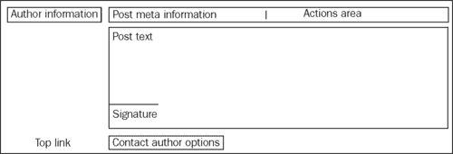

*作者信息*框包括作者的昵称、加入日期、发帖数和位置。它还可以包含头像图像、等级和等级图像，但这些默认情况下是未启用的。等级和头像将在稍后讨论。

*帖子元信息*包括一个小小的帖子图形、日期/时间戳和帖子主题。这个极小的图形 () 非常小，以至于大多数人甚至不会注意到它，即使他们注意到了，也会认为它只是装饰品。但实际上，这是一个功能图形；它是到这个帖子的精确链接。很少有人会想去查看他们正在阅读的帖子，但当你想要提供一个指向特定帖子的链接时，这可以非常有用，而不是指向主题的一般链接。要获取帖子的确切 URL，右键单击这个微型图形并复制它链接到的 URL。这个图形的颜色也可能不同，这有特定的含义。在默认的 phpBB 模板中，橙色框表示这是一篇未读帖子，而白色灰色框表示用户已经阅读了这篇帖子。

*动作区域*包含用户可以对这篇帖子执行的动作的按钮。始终存在的按钮是“引用”按钮，其外观如下：另一个可能可用的动作按钮是“编辑”按钮，其外观如下：“编辑”按钮是否可用取决于用户权限，但在默认的 phpBB 论坛配置中，作者可以编辑自己的帖子，而版主可以编辑所有人的帖子。作者还可以根据权限和特定帖子拥有删除操作。默认的 phpBB 配置允许帖子的作者在之后没有更多帖子的情况下删除帖子。版主可以访问所有动作按钮——引用、编辑、删除以及查看发帖者 IP 地址的按钮。

*帖子文本*区域包含消息的实际文本，而*签名*区域包含用户在其个人资料中的签名。

*顶部链接*只是一个“返回顶部”链接，它将链接到当前页面的开头。

至少，“联系作者选项”区域包含一个访问作者个人资料的按钮和一个发送作者**私人消息**（**PM**）的按钮。此区域还可以包含在个人资料中输入的其他信息：电子邮件地址、ICQ 号码、MSN 信使 ID、网址等。关于 ICQ 按钮的好处是，它将显示作者（在线或离线）的 ICQ 状态，当然前提是作者允许在 ICQ 设置中查看状态。

### 回复

回复是在现有讨论主题中的一项新帖子。它通过点击位于主题列表顶部和底部的“发表回复”(`post reply`)按钮(回复)来发起。回复也可以通过点击之前提到的位于帖子动作区域的“引用”动作按钮来发起。在这种情况下，帖子正文将预先填充引用的帖子内容。

这是发表回复的界面：

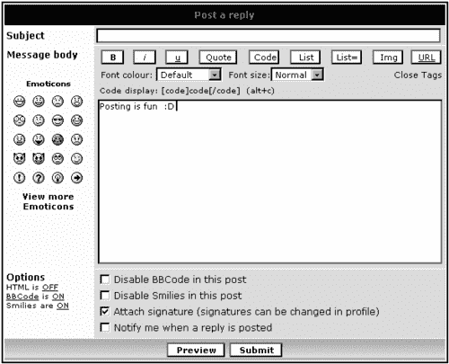

用户真正需要在这个表单上担心的事情只有消息体。其他一切都是可选的。以下是关于帖子界面的更多详细信息：

+   主题（如果填写）将出现在帖子元信息框中（参见 *帖子结构* 部分）

+   有一些使用所谓的 **BB 代码**（**BB 标签**）的格式化选项，其中 BB 代表 **公告板**。格式化选项赋予用户改进帖子外观（有时甚至破坏它）的能力。

+   表情符号（通常被称为笑脸）是那些可爱的小图像，帮助用户在帖子中添加一丝个人化和非正式的风格。点击左侧的这些图形之一，将在消息体字段中插入其文本表示。例如，如果你点击 ，你会在文本框中看到 `:D` 被插入，如前一个屏幕截图所示。

+   蓝色文本 `查看更多表情符号` 实际上是一个链接到新窗口弹出窗口，其中包含更多可供选择的笑脸。这个链接是人们经常错过并开始询问你为什么从他们那里隐藏这个绿色图标 ，而其他人似乎一直在使用。解释是它在那里，但只能通过 `查看更多表情符号` 弹出窗口访问。

+   选项部分位于消息体下方，包含我们之前提到的一些复选框；它们的默认值在用户配置文件中定义。

+   点击 **预览** 按钮将显示消息体在发布时的确切外观。使用此功能总是一个好主意。

+   如果论坛配置允许未注册访客发布，他们将在所有其他字段上方看到一个额外的字段，并且这将是一个必填字段，用于输入用户名。

+   在帖子表单下方，有一份最新先前帖子的列表（在先前的屏幕截图中未显示）。这使得帖子作者更容易回忆起其他人之前说过的话。

### 开始新主题

开始新主题与在现有主题中发表回复非常相似。它通过点击 `新主题`  按钮来启动。表单与我们刚才看到的非常相似，只是 `主题` 是必填字段，并且有字段可以包含与主题一起进行的投票。

关于投票的一些其他有趣话题：

+   当开始新主题时，用户可以设置投票问题、多个答案（至少两个）以及投票到期前的天数。

+   一旦投票到期，访客仍然可以看到投票结果，但不能再投票。

+   将过期天数设置为 **0**（或留空）将使投票始终可供投票（一个 **永恒的投票**）。

+   创建投票需要一项单独的权限，可以从管理员面板中限制，但默认情况下是允许的。

### 格式化帖子

用户可以通过使用一组简短的指令（BB 标签）来格式化帖子。在发布帖子时，您可以在帖子正文中插入这些标签，当您查看帖子时，这些标签会被处理以产生所需的格式。如果您了解一些基本的 HTML 标签，那么您很可能对 BB 标签的工作方式有一个相当好的了解，并且可以立即开始输入它们。

如果您既不知道 HTML 也不知道 BB 标签（而且您的大多数访客也不会知道），请不要担心；您不需要记住这个全新的秘密代码。phpBB 有一个直观的界面，可以像使用文字处理软件一样轻松地引导您完成这个过程。只需看看格式化工具栏，就应该能让大多数选项变得清晰。

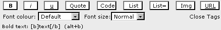

应用格式有两种方式：您可以手动输入标签，或者选择您想要格式化的单词或短语，然后点击工具栏上的相应按钮。不幸的是，由于不同浏览器对 JavaScript 的支持不同，第二种选项在某些浏览器或平台上不可用。但好消息是，大约 95%的互联网用户将能够访问这个功能，因为他们会使用支持它的浏览器。

总是有一个**打开的 BB 标签**来显示格式化的开始位置，以及一个**关闭的 BB 标签**来显示格式化应该结束的位置。打开标签的形式是 `[tag]`，关闭标签的形式是 `[/tag]`。让我们看看加粗标签，因为它可能是使用最频繁的标签。如果您想在句子“帖子是 fun”中加粗单词“fun”，您输入（或使用工具栏产生相同的结果）"`帖子是 [b]fun[/b]`"。这些标签可能看起来很吓人，但如果您习惯了它们，实际上是非常容易的。

您知道可以通过输入句子，选择单词“fun”，然后点击**B**图标来应用这种格式。还有另一种使用工具栏的方法：

1.  输入**帖子是**。

1.  点击**B**图标（这将插入打开的 `[b]`）。

1.  输入**fun**。

1.  再次点击**B**图标（这将插入关闭的 `[/b]`）。

与之前描述的格式化选择方法不同，上述场景几乎在任何知道至少一些 JavaScript 的浏览器中都能工作。在上面的步骤 2 之后，**B**图标将获得一个星号，表示有一个尚未关闭的打开的 `[b]` 标签。在完成步骤 4 后，星号将消失。

您可以通过使用 `[img]` 标签将图片插入到您的帖子中，前提是图片必须可在互联网上访问，也就是说您知道其以类似 `http://` 开头的网址。您还可以使用 `[url]` 标签将网页链接放入帖子中，尽管 phpBB 足够智能，能够猜测到您的帖子中包含网页链接，并将它自动显示为可点击的链接。

你可以查阅 phpBB 用户指南以获取更多关于 BB 标签的详细信息，但让我们先通过一个示例来大致了解这些标签的工作方式。

如果你查看之前的截图，其中显示了格式化工具栏，你会注意到它看起来像三条不同的线（或行），分别包含：

+   格式化命令按钮，如**B**用于粗体，**I**用于斜体等。

+   两个下拉菜单包含字体格式化和**关闭标签**链接。此链接将关闭所有当前打开的标签（假设它们是从工具栏打开的，而不是手动输入的）。例如，如果你输入**发布是**，点击**B**按钮然后是**I**按钮，输入**fun**，最后点击**关闭标签**，你会得到以下结果：**发布是 [b][i]fun[/i][/b]**。点击**关闭标签**与点击**I**然后**B**来关闭已打开的标签具有相同的效果。

+   工具栏的第三行包含有关如何使用 BB 标签的提示。如果你将鼠标悬停在工具栏图标上，你会看到提示行的内容会改变以反映按钮的功能。前面的插图显示了鼠标光标悬停在**B**按钮上。在括号中，提示显示了一个可用于格式化的键盘组合。这个组合与点击工具栏按钮具有相同的效果，并可以帮助你仅使用键盘更快地发布帖子，甚至不必担心将手从键盘移到鼠标，然后再将鼠标移到所需的图标。

    从示例中可以看到，仅使用键盘就能达到相同的结果：输入**发布是**，按住*ALT*键（Mac 用户的 Apple 键），按*B*，按*I*，释放*ALT*，输入*fun*，按住*ALT*，按*I*，然后按*B*。

##### 时间行动——格式化帖子

1.  你已经知道如何使用粗体和斜体格式化标签，但这次让我们也添加**下划线**。使用你喜欢的方 法（工具栏、键盘或直接输入标签）来生成以下 BB 代码：**发布是 [b][i][u]fun[/u][/i][/b]!**。

1.  下一个要讲的是**引用**。通常你会在回复时使用**引用**动作按钮，但了解如何手动操作也无妨：

    ```php
    I can quote other posters like this:
    [quote="The Dude"]For my name is The Dude...[/quote]

    ```

1.  现在我们来看看`[code]`标签，它通常用于人们将编程代码粘贴到他们的帖子中时，但也可以用于其他目的，如以表格样式更好地对齐，因为它使用固定宽度的字体。输入：

    ```php
    I can write "phpBB" using binary:
    [code]01110000 01101000 01110000 01000010 01000010[/code]

    ```

1.  接下来是**列表**。列表使用`[list]`标签标记列表的开始和结束，并使用星号`[*]`作为列表项。列表开始标签可以接受如`1`或`A`之类的参数。尝试这个：

    ```php
    And I can list stuff like this:
    [list][*]one[*]two[/list]
    or even enumerate, like this
    [list=1][*]first[*]second[/list]

    ```

1.  然后使用`[img]`标签和已知图片的网址添加**图片**，如下所示：

    ```php
    I can use images:
    [img]http://www.packtpub.com/images/Packt.png[/img]

    ```

1.  现在是**链接**。链接是通过`[url]`标签插入的，有两种可能的情况。如所示尝试它们：

    ```php
    Links: [url]http://www.packtpub.com[/url], fancy links: [url=http://www.packtpub.com]Packt Publishing[/url]

    ```

1.  最后，是 `[color]` 和 `[size]` 标签。它们的起始标签接受如 `[color=black], [color=blue], [size=7]` 等参数。尝试以下操作以获得更好的理解：

    ```php
    and [color=red]different [/color][color=green]colors [/color]and [size=18]font [/size][size=9]sizes[/size]!

    ```

###### 发生了什么

点击 **预览** 或 **提交** 按钮，您将看到您刚刚所做的。它应该看起来像以下截图。

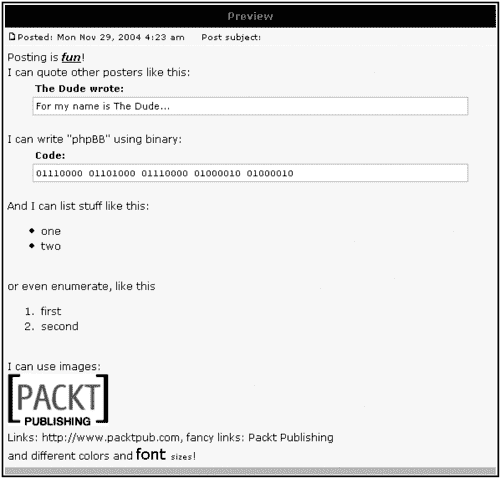

恭喜！您刚刚使用几乎所有的 phpBB 格式化功能来格式化了一个帖子！

### 编辑帖子

用户允许编辑自己的帖子。这同样是 phpBB 的默认配置，可以通过管理面板进行更改。用户通过位于操作区域的 **编辑** 链接来编辑帖子。

在帖子编辑后，帖子底部会出现一条小字消息，通知其他用户该帖子已被修改。消息如下：


这条消息总是出现，只有一个例外。如果帖子在另一个用户在同一主题中发布回复之前被编辑，则不会出现。

### 删除帖子

用户允许删除自己的帖子，但仅限于讨论主题中的最后一个帖子。一旦有回复被发布（即使是同一用户），删除帖子的操作就不再可能。

通过位于帖子操作区域的删除操作图标（）来删除帖子。

## 搜索

很快，您的论坛将充满跨越多个主题列表页面的主题。这将使得定位一个特定的旧主题变得有些困难。phpBB 的搜索功能在这里提供了帮助。它可以通过 **搜索** 顶部导航链接访问。搜索表单提供了许多选项来查找您感兴趣的主题，例如搜索哪个论坛，如何显示结果，等等。

很可能您和您的成员会在搜索中忽略大多数搜索选项。毕竟，我们习惯了像 Google 一样的简单搜索框，所以我们很少寻找其他选项。但这里有一个简单的选项可以帮助您很多。这个选项是 **搜索所有术语**。当您使用多个单词进行搜索时，这很有帮助。与 Google 不同，当您添加更多单词时，结果会缩小，而 phpBB 会搜索每个单独的单词并返回更多结果（相对于缩小搜索范围）。

例如，如果您搜索 **牛奶巧克力**，您将得到所有包含 **牛奶** 和 **巧克力** 的结果，这可能不是您想要的。勾选 **搜索所有术语** 选项将仅返回那些两个单词都能找到的帖子。

您还可以使用通配符 (*) 来搜索单词的一部分。例如 ***late** 将返回包含 **chocolate** 和 **late** 的帖子。

## 发送和接收私密消息（PM）

phpBB 的一个很酷的功能是用户可以在公共论坛区域**之外**通过私信（PM）相互私下交流。（PM 也被用作动词，例如“请给我发私信”。）PM 的工作方式与我们都习惯的正常电子邮件非常相似。写私信的界面与写帖子相同，只是顶部有一个收件人用户名的字段。此外，如果您不确定拼写，您还可以查找用户名。

有以下私信邮箱：

+   **Inbox**：存储所有收到的消息，就像在正常的电子邮件收件箱中一样。

+   **Sentbox**：包含您发送给其他成员的所有消息。

+   **Outbox**：暂时包含您已发送但尚未被收件人阅读的消息。您可以在发件箱中编辑或删除消息。一旦收件人阅读了消息，发件人就无法再修改它。此时，它是最终的。有时可能会发生这样的情况：用户收到一封电子邮件和一个关于新私信的弹出窗口通知，当用户进入收件箱时，却没有新消息。这种情况并不常见，因为编辑或删除发件箱中消息的能力是一个相对隐藏的功能，大多数人并不了解。但无论如何，请准备好回答用户关于为什么他们收到通知但没有消息的疑问。

+   **Savebox**：存储发送或接收的消息。您可以从其他邮箱将消息移动到这个邮箱。这对于存储一些您希望与其他消息分开的重要消息很有用，这样您就不会不小心删除它们。当其他邮箱达到存储限制时，保存箱也可以用来卸载其他邮箱。

当查看消息列表时，您可以点击每条消息旁边的复选框，然后将选中的消息移动到保存箱或通过列表底部的相应操作按钮删除它们。请注意不要混淆**删除所有**按钮和**删除标记**按钮；尽管它们看起来相同（甚至包括**您确定要…**的确认消息），但**删除所有**会清除私聊箱中的所有内容。

##### 行动时间——The Dude 给管理员发送私信

1.  您以 The Dude 的身份登录。点击顶部的“您没有新消息”链接。您现在处于空旷而孤独的收件箱中。

1.  点击**新建帖子**。您将看到写私信的界面；这个界面与写帖子的界面相似。

1.  您想给管理员用户发送私信，即您在第二章中描述的安装过程中创建的用户。假设您不确定它是否被称为管理员或简单地称为 Admin。点击文本框旁边用于收件人用户名的**查找用户名**按钮。会出现一个新窗口。

1.  输入**Admin***（注意星号）并点击**搜索**（*是一个通配符，意味着匹配以"Admin"开头的任何用户名）。

1.  出现一个下拉菜单，显示匹配项；在我们的案例中，只有一个匹配项。点击**选择**。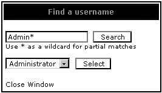

1.  现在用户名字段已预先填写。在主题行中输入**测试 #1**，并在消息正文中输入相同的文本。添加**:)**使其更友好。

1.  点击**预览**。看起来好吗？

1.  点击**提交**发送消息。

1.  使用**测试 #2**作为主题行和消息正文重复上述步骤。

1.  前往您的发件箱。它是空的。

1.  前往您的发件箱。您会看到您刚刚发送的两条消息。勾选**测试 #1**旁边的框。

1.  点击**删除标记**并确认删除。

1.  退出并重新以**管理员**身份登录。通过使用**您有 1 条新消息**的链接进入您的收件箱。

1.  您看到您收到了来自 The Dude 的新 PM，主题为**测试 #2**。点击主题行来阅读消息。

1.  点击**保存消息**将消息移动到保存箱。

###### 发生了什么？

您已成功创建、发送、修改、接收和保存了一条 PM。如果您现在以 The Dude 的身份重新登录，您会看到您的发件箱为空，但发件箱现在包含**测试 #2**的消息。

## 投票

您已经知道在发起新主题时可以创建投票。以下是关于在这些投票中投票的一些注意事项：

+   只有注册用户才能投票。

+   未注册用户只能看到投票结果。

+   投票是保密的；无法知道特定用户是如何投票的。

+   您可以通过选择**查看结果**来查看结果，即使您没有投票。

+   请记住，投票结果并不完全可靠，因为现有用户可以注册为新成员只是为了再次投票。

## 关注主题的最新动态

如您所知，如果您创建或发起了某个主题，有人回复该主题，您会收到通知。您可以通过在发帖时确保勾选了**当有回复时通知我**来**订阅**这个主题。此外，即使您没有在该主题中发帖，您也可以开始关注该主题。

您可以通过使用位于主题底部**关注此主题以获取回复**的链接来实现。您可以在任何时候通过使用您正在关注的主题每页底部的**停止关注此主题**链接来停止接收主题更新的通知。

## 查看其他用户的信息

有几种方法可以了解社区的其他成员。会员列表功能和用户组提供了不同类型的用户列表，而“谁在线”功能提供了有关当前登录用户及其正在做什么的信息。

### 会员列表

如果用户想了解更多关于社区其他成员的信息，他们可以获取成员列表。点击**成员列表**顶部导航链接将显示所有注册用户的列表。此列表顶部有排序选项。例如，如果你想得到一个更“辣味”的列表，比如“嗯，谁发帖最多？”，你可以根据发帖数量进行排序。你可以选择**总发帖数**作为**选择排序方法**，并将**顺序**设置为**降序**。这将显示发帖最多的成员。

好吧，在我们的示例论坛中，只有管理员和 The Dude 的列表并没有什么特别之处，但随着社区的壮大，这可能会变得更有趣。以下是这种类型的**成员列表**报告在 phpBB.com 社区执行时的样子。

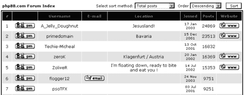

### 用户组

这是一个高级的 phpBB 功能，允许根据某些标准创建用户组。用户组由管理员定义，并分配一个组管理员。默认情况下，不存在任何用户组。用户可以申请加入用户组，并且根据配置（可能需要或不需要组管理员批准用户），会被批准。

### 谁在线

论坛首页的这个部分已经被提到。有趣的是，这里有一个隐藏功能——对于大多数人来说并不明显。那就是**谁在线**标题实际上是一个链接。（论坛分类标题也是如此。）

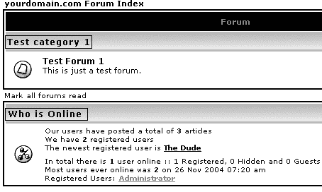

点击**谁在线**将显示一个特殊的“间谍”屏幕，这是公开可用的。这个巧妙的功能允许每个人看到其他人此刻在做什么。


这可能成为所有当前登录用户以及当前浏览网站的访客的长期列表。

# 管理员经验

到目前为止，你对论坛普通成员的视角已经有了相当好的了解。现在让我们看看如何在 phpBB 中如何使用管理员。首先，什么是**管理员**？抛开所有词典定义，管理员是比普通用户拥有更多发帖和话题权限的社区成员。管理员通常是受到尊敬的资深成员，他们自愿贡献时间和精力，使论坛成为符合管理员对社区愿景的讨论场所。

管理员是管理您网站的最佳助手，因此您应该确保您向他们明确任务并对其进行培训，以便他们在路上不会遇到任何技术困难。

为了更好地可视化本章讨论的内容，你需要一个管理员账户。你可以让 The Dude 用户成为管理员，或者你可以创建一个新用户并分配管理员权限。让我们以 The Dude 为例。

##### 行动时间——将管理员权限分配给用户

1.  以管理员身份登录。

1.  前往管理面板。

1.  在左侧菜单中，在**用户管理**下点击**权限**链接。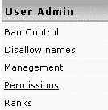

1.  您现在在**用户权限控制**部分。

1.  在文本框中输入**The Dude**并点击**查找用户**。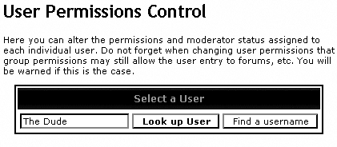

1.  现在您可以看到一个设置 The Dude 权限的表单。

1.  如图中所示，选择**是管理员**并点击**提交**：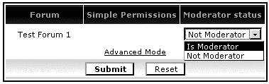

###### 发生了什么？

你已成功更改 The Dude 的授权级别；此用户现在是**Test Forum 1**的管理员。从您的管理员账户注销并作为 The Dude 重新登录，您就可以开始探索管理员能做什么了。

管理员可以承担两组任务；这些与**管理帖子**和**管理主题**相关。

## 管理帖子

现在，您以 The Dude 的身份登录，作为管理员，如果您查看任何帖子并查看帖子的操作区域，您将看到所有管理员可以对帖子执行的操作按钮。


### 编辑和删除

在本章前面已经讨论了从用户的角度编辑帖子并删除它们。对于管理员来说也是一样，只有一个简单但相当重要的区别：在默认的 phpBB 配置中，管理员可以编辑和删除**任何**主题的帖子，而不仅仅是**他们自己的**帖子。

### 编辑主题的第一篇帖子

当管理员编辑讨论中的第一篇帖子时，有一些额外的选项，因为第一篇帖子包含一些与主题相关的信息。例如，更改帖子的主题会更改主题的主题。

还有一些选项可以更改帖子的类型。主题类型的可能选项如下所示：


如果你将主题发布为**公告**或**置顶**，它将保持在主题列表的顶部。这两种类型之间有一个区别是显示在主题标题旁边的图标。另一个（更重要）的区别是，置顶主题显示在主题列表第一页的顶部，而公告则显示在所有列表页的顶部。这意味着，如果你的论坛中有如此多的主题以至于它们跨越了几个页面（默认情况下，每页有 25 个主题），则标记为**公告**的主题将显示在**所有页面**的顶部，而**置顶**主题仅显示在**第一页**的顶部。以下是一个置顶主题和公告的示例。

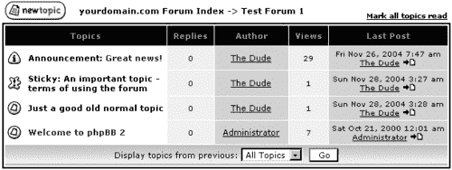

关于编辑主题的第一篇帖子，还有一点具体的是，您在编辑界面有删除它的选项。

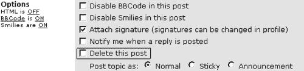

如果帖子包含投票，投票也可以编辑或删除。

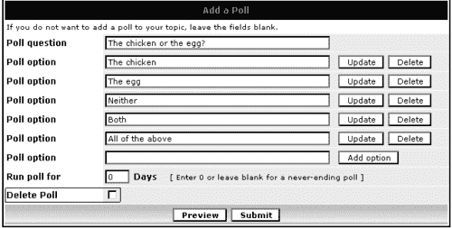

这里有一些关于编辑主题中第一条帖子的其他具体信息。尝试列出的情况是个好主意，只是为了确保你做起来感到舒适。

+   如果这是主题中唯一的帖子，并且你删除了它，主题也会被删除。

+   如果第一条帖子包含投票并且你删除了帖子，投票将保留。

+   如果你删除第一条帖子后还有其他帖子，主题将保留。主题的标题将保留从删除的帖子主题中。

+   投票可以从主题中安全移除，同时保持其他一切不变。

### 查看帖子的 IP 地址

如果你点击 IP 操作图标，你会看到 IP 信息屏幕。

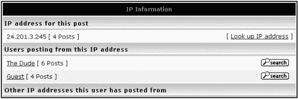

你在这屏幕上看到的是用户的 IP 地址，使用此 IP 地址发布的用户列表，最后是其他 IP 地址列表（如果有）。以下是一些可能对你有用的信息：

+   IP 地址是一个数字标识符，每个连接到互联网的计算机都是唯一的。IP 代表互联网协议。全球的互联网服务提供商（ISP）在每次请求互联网连接时都会为其客户分配 IP 地址。这意味着如果你连接到互联网，断开连接，然后重新连接，第二次分配给你的 IP 地址可能与第一次不同。

+   如果你点击上述截图所示的**查找 IP 地址**链接，phpBB 将尝试解析（以更友好的形式表示）IP 地址。这个功能可能并不总是有效，因为并非所有 IP 地址都可以解析。在上面的例子中，数字 IP 地址将被解析如下：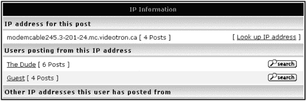

IP 地址的最后部分（`videotron.ca`）提供了关于互联网服务提供商（ISP）的信息。一些公司有自己的 IP 地址，它们表现得就像它们自己的 ISP 一样。解析帖子的 IP 地址有时可以提供关于发帖人雇主或发帖人 ISP 的信息，或者如果没有解析出来，则没有信息。请记住：

+   一个用户可以与多个 IP 地址相关联，这很常见，因为 ISP 会更改分配给其客户的 IP 地址。此外，一个成员可以使用多个计算机和互联网连接来发布帖子（例如，家用电脑和办公电脑）。

+   几个用户可能使用相同的 IP 地址。你可能首先想到的可能性是某个人注册了新的用户名，并从这两个用户名中发帖。尽管这是一个可能的场景，但并不一定总是如此。两个用户可能有相同的 ISP（或者可能在同一家公司工作），因此可能有相同的 IP 地址。另一个解释是两个用户是朋友，其中一个人正在使用另一个人的电脑和互联网连接来发帖。还有另一个情况——两个用户从同一个互联网俱乐部（游戏俱乐部、互联网咖啡馆等）发帖。

+   在 IP 信息界面中，点击用户名会弹出用户个人资料页面。

+   在同一界面中，点击**搜索**按钮将列出特定用户的全部帖子。

## 管理主题

管理主题是版主拥有的、普通用户没有的第二组选项。管理主题的一种方法是通过更改此主题的第一篇帖子。这在本章前面的*管理帖子*部分已经讨论过（你可能想回去看看；这里讨论的其他选项都是与主题相关的）。

在每个主题的底部，版主可以访问四个操作图标，如下所示：


按照它们出现的顺序，它们的意思是：

+   **删除主题**：永久从数据库中删除主题。

+   **移动主题**：将主题从当前论坛移动到另一个论坛。另一个论坛指的是同一公告板中的论坛。

+   **锁定主题**：用户（除版主和管理员外）不能再在此主题中发帖。

+   **拆分主题**：将主题分成两个。

### 删除、锁定和解锁主题

所有这些选项实际上都很简单易用。你只需列出一个主题，然后选择相应的操作图标。phpBB 会要求你确认所选操作。就这样！解锁图标仅在已锁定主题中显示。

### 移动主题

为了测试这个功能，你需要至少两个论坛。所以在你继续之前，让我们首先创建一个新的论坛。

##### 行动时间——创建论坛

1.  以管理员身份（你在安装时创建的用户账户）登录，然后点击**转到管理面板**链接。

1.  在左侧菜单下，在**论坛管理**中点击**管理**。

1.  在第一个字段中输入**新论坛**，然后点击**创建新论坛**。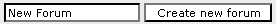

1.  你会看到一个新表单；保持原样，然后点击**创建新论坛**。

1.  点击左上角的 phpBB 图标返回论坛。

###### 发生了什么？

你已经创建了一个新的论坛。不用担心细节；它们将在本章的后面更详细地讨论。好的，回到移动主题。这仅仅涉及将一个主题移动到另一个论坛，这在有人在公告板上发帖位置不合适时通常需要。现在登出并作为 The Dude 重新登录。

主持人通过选择  操作图标来移动主题。以下确认屏幕会显示：

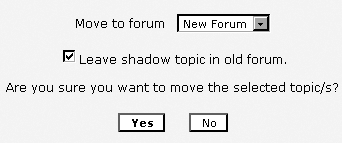

此屏幕允许主持人选择要将主题移动到的论坛。还有一个**在旧论坛中留下阴影主题**的复选框（默认选中）。选择此选项将在旧论坛中留下指向新位置的链接。链接看起来就像一个正常的主题，除了在标题前有**已移动**字样，如下所示：

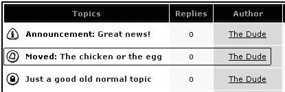

### 拆分主题

有时讨论会偏离原始主题；在其他时候，人们在同一主题中讨论两个不同的问题——帖子开始重叠，难以跟随讨论。为了避免这种情况下产生的混淆，主持人可以将讨论拆分为两个主题。为此，主持人点击拆分图标 。以下是为拆分主题提供的特殊界面：

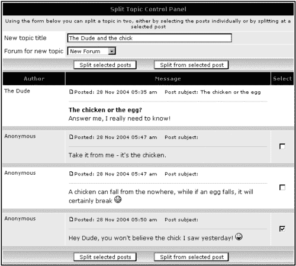

实际上，拆分主题涉及创建一个新主题来容纳一些已经存在的消息，同时从它们最初发布的主题中移除。因此，新主题需要一个标题，一个要居住的论坛，以及至少一个帖子。

**拆分主题控制面板**显示了一个用于标题的文本字段和一个下拉菜单来选择现有的论坛。每个帖子旁边都有一个复选框。有两种拆分选项：

+   要单独选择每个帖子。检查每个单独的帖子很耗时，但在完全重叠的两个单独问题讨论时这是一个选项。

+   选择一个帖子然后将其完整的讨论拆分。这在讨论在某一点上完全转向不同方向时适用。在这种情况下，选中的帖子是*新*主题的开始。

两个小贴士：

+   尤其是在负载很重的论坛上，在拆分主题之前暂时锁定一个主题是个好主意。这给主持人足够的时间重新思考细节，同时防止其他用户同时发帖并增加混乱。

+   请记住，新创建的主题的第一条消息的作者成为新主题的作者。

### 一同完成——主持人控制面板

phpBB 有一个名为**主持人控制面板**的功能，它提供了管理主题的所有上述操作的访问权限。要访问此界面，请点击位于每个论坛页面右下角的**管理此论坛**链接。

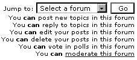

这就引出了“**版主控制面板**”界面（下一页截图）：

+   此界面在每个主题旁边都有一个“**选择**”复选框，底部还有多个操作按钮。它允许您选择多个主题并对它们执行一次性操作。

+   点击主题标题会弹出“**拆分主题**”界面。

+   所有操作（删除、锁定、解锁、移动和拆分）的工作方式与本章前面已经讨论的方式完全相同，只是界面不同，以便一次更改多个主题。

以下截图显示了“**版主控制面板**”：

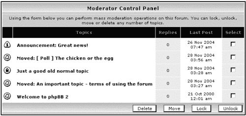

# 管理员体验

就是这个。您已经来到了最重要的部分——管理您的论坛。您已经看到了本章以及第二章中描述的一些之前的功能，但现在您需要采取更系统的方法，确保您了解您的管理选项以及如何使用它们。

本节将随后描述一些您可能比其他功能更频繁使用的 phpBB 管理基本功能。对于更高级和特殊的功能，请确保您阅读第五章，其中详细介绍了与安全相关的问题、表情符号、用户组和其他问题。

为了测试接下来将要描述的内容，您需要登录为具有管理权限的用户。您的论坛可以有多个管理员，但无论如何，至少存在一个管理用户账户——在安装 phpBB 时创建的账户。我们将使用此账户登录，点击“**前往管理面板**”链接，然后开始探索管理选项。

## 管理面板概览

“管理面板”有两个主要区域（在 HTML 术语中称为**框架**）：

+   左侧的导航区域，其中包含指向所有管理选项的链接。它被分为类似选项的组，如**论坛管理、用户管理**等。

+   右侧的内容区域，当您从导航区域点击链接时，会加载适当的内容。

您的“管理面板”首页看起来如下所示：

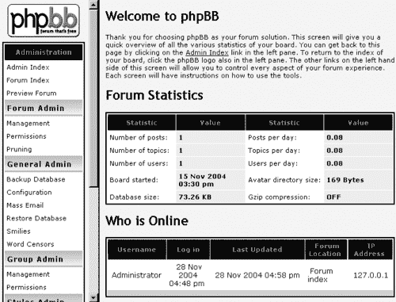

“管理面板”首页还有一些关于论坛使用的通用统计数据，以及一个“**谁在线**”部分，其工作方式与访问者在论坛首页上可以访问的方式类似（参见本章前面的“**访客体验**”部分），只不过这个部分还有一个 IP 地址列。点击 IP 地址会将您重定向到一个第三方网站，该网站提供一些您可能认为有用的 IP 相关工具。

导航菜单的前三个选项相当直接，你可能想尝试一下，以便在浏览管理面板时感觉更舒适。它们实际上不是管理选项，而是指向论坛首页和管理面板的链接。左上角的 phpBB 标志也是一个链接，指向论坛的首页。

现在，让我们更仔细地看看导航菜单上的其他选项组。

## 论坛管理员

正如标题所说，这是一组供你管理论坛的选项，包括创建、编辑、删除或重新排列论坛及其类别，以及设置它们的使用选项和规则（称为**权限**）。

### 论坛管理

点击**论坛管理员**选项组中的**管理**链接会弹出**论坛管理**界面。此界面允许你创建、编辑和删除论坛，并将它们组织到类别中。

#### 创建新论坛和类别

在**版主体验**部分已经简要讨论了创建新论坛的最简单方法。现在让我们更详细地探讨。以下截图显示了在上一节中添加了新论坛后的界面。如果你没有按照**版主体验**部分描述的操作进行，你将看到默认的 phpBB 外观，如下所示，只是没有**新论坛**这一行：

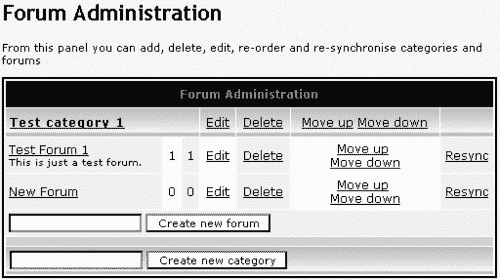

##### 行动时间——创建新类别

1.  在**论坛管理**界面的第二个文本字段中输入**Fun**。

1.  点击**创建新类别**。

1.  在创建类别后，点击**点击此处返回论坛管理**行中的链接。

###### 发生了什么

你已经创建了一个新的空白类别（因为还没有包含任何论坛）。完成上述步骤后，**论坛管理**屏幕将如下所示：

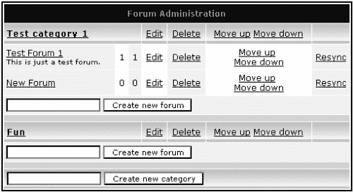

在这一点上，因为新类别仍然是空的，访客看不到对论坛主页所做的任何更改。

现在让我们向新类别添加一些论坛。

##### 行动时间——创建新论坛

1.  在**论坛管理**界面中你刚刚添加的**Fun**类别后面的文本框中输入**Funny pics**。

1.  点击**创建新论坛**。你现在会看到一个以下形式的表单：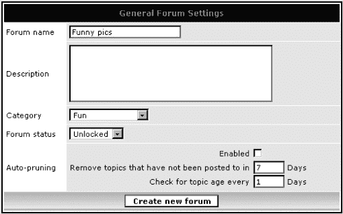

1.  在**描述**字段中，输入**网络上的搞笑图片集合**。

1.  保持**类别**下拉菜单不变。

1.  保持**论坛状态**下拉菜单不变。

1.  在**自动修剪部分**保持默认设置。

1.  点击**创建新论坛**按钮。

1.  点击链接**点击此处返回论坛管理**。在这个时候，我们正在重复练习，但有一些修改。

1.  要开始创建另一个新论坛，输入**Funny quotes**，但这次在**第一个**文本字段中输入。

1.  在**描述**字段中，输入**这里您可以找到管理员觉得有趣的搞笑引言网站链接**。

1.  将**分类**下拉菜单中的值从**测试分类 1**更改为**娱乐**。

1.  将**论坛状态**下拉菜单中的值从**解锁**更改为**锁定**。

1.  在**自动修剪**部分，选择**启用**。

1.  在**自动修剪**部分，将第一个文本值从**7**更改为**30**。

1.  在**自动修剪**部分，将第二个文本值从**1**更改为**7**。

1.  点击**创建新论坛**按钮。

1.  点击**点击此处返回论坛管理**链接。

###### 发生了什么

这里是您刚刚在管理面板中看到的结果：

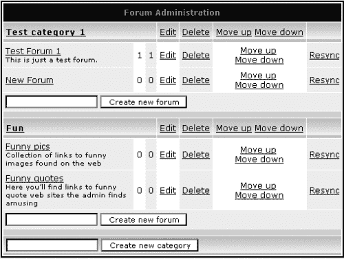

这是您的用户将看到的内容——主页上更改后的版块：

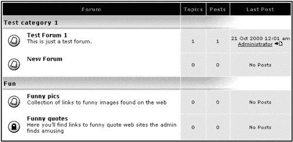

现在，让我们退一步，看看确切发生了什么，使用与前面*行动时间*部分相同的数字：

1.  您为您的新论坛提供了名称。

1.  您启动了创建新论坛的过程。

1.  您为您的论坛提供了描述。

1.  您使用了 phpBB 提出的分类值。

1.  您使用了 phpBB 提出的**锁定/解锁**论坛状态值（在这种情况下，**解锁**）。这意味着用户可以在此论坛中发帖。**锁定**，如您所知，意味着用户不能在论坛中发帖，但管理员和版主仍然可以。

1.  您使用了 phpBB 的默认值**自动修剪**选项，即不使用此选项。如果您启用自动修剪功能，phpBB 将删除所有在指定时间内未活跃的主题。主题的**不活跃**是从最后发布到该主题的时间开始计算的。

1.  您完成了新论坛的创建。

1.  您返回到**论坛管理**界面。

1.  您再次开始创建新论坛的过程并设置了标题。

1.  您指定了论坛描述。

1.  这次您没有使用建议的值，而是更改了论坛分类。这个分类是由 phpBB 提出的，因为您在步骤 9 中将论坛名称输入到**测试分类 1**下，而不是**娱乐**下。

1.  您决定将此论坛锁定，以便用户无法发帖，但您仍然可以。

1.  您已启用自动修剪选项。

1.  您已设置 phpBB 应删除所有超过 30 天的主题，从本主题最后发布日期开始计算。

1.  您已将 phpBB 设置为每七天检查一次主题以进行自动删除。

1.  您完成了新论坛的创建。

1.  您返回到**论坛管理**界面。

#### 精细调整现有论坛和分类

在创建论坛后，可以进一步管理它——编辑、删除或相对于其他论坛在版块中的位置。

##### 编辑

您可以通过点击位于分类/论坛标题旁边的**编辑**链接来编辑现有的分类或论坛。编辑表单看起来与**创建新论坛**的表单完全相同，并且以相同的方式工作。

##### 删除

你可以通过使用它们标题旁边的**删除**链接来删除类别和论坛。这里有一个具体点：当你删除一个已经存在一段时间并且有人在其中发帖的论坛或类别时，你可能不想删除**所有**帖子。为了简化这个过程，phpBB 允许你在删除选定的主题之前，将现有主题移动到另一个论坛或类别。

当你删除一个类别时，你可以选择将所有论坛移动到新的类别，如下所示（此界面显示**删除论坛**和**论坛名称**，但实际上是指删除类别；你会在实际删除论坛的界面中看到区别）：

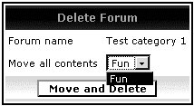

当你想删除一个论坛时，你将有一个选项，可以将所有主题移动到另一个论坛。与类别删除不同，当你删除一个论坛时，你甚至可以选择删除主题和帖子。在使用此选项之前，请再次思考。删除你社区的发帖可能不是一个好主意。

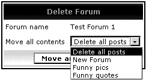

##### 改变显示顺序

你可以通过使用每个论坛或类别旁边的**向上移动**和**向下移动**链接来更改在论坛首页上显示类别和论坛的顺序。

##### 行动时间 - 调整显示顺序

1.  点击**测试类别 1**类别旁边的**向下移动**链接。

1.  点击**新论坛**论坛旁边的**向上移动**链接。

###### 发生了什么

**娱乐**类别现在是用户首先看到的第一个类别。此外，在**测试类别 1**中，你已经更改了论坛的顺序，使得**新论坛**在**测试论坛 1**之前显示。以下是调整后用户将看到的你的论坛。

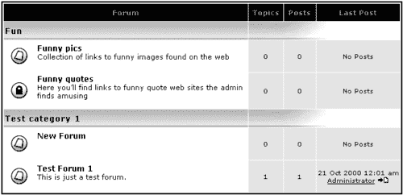

##### **使用 Resync 选项**

如果你发现你的板上出现了奇怪的现象，请首先尝试使用**Resync**选项来恢复。无论出于什么原因，如果存在数据不一致的情况，**Resync**将尝试将数据恢复到一致状态。

Resync 不会对论坛数据造成损害。所以请不要担心，你不会破坏任何东西。（好吧，不要将最后一句话当作挑战。）如果你对是否应该使用此选项有疑问，只需使用它即可。另一方面，如果你发现自己经常使用它，可能存在其他问题；隔离症状，并在 phpBB 社区论坛上寻求解决方案。

### 谁能做什么——设置论坛权限

phpBB 对运行论坛的安全方面非常重视。这就是为什么有一个强大且选项丰富的权限和用户特权系统。你将在第五章中找到有关权限系统的更多详细信息，该章节包含了一些高级 phpBB 特性的细节。你还可以在 phpBB 用户指南中找到更多信息。所以在你开始玩弄权限之前，确保你知道你在做什么。现在，我们只是快速查看一下最常用的权限，并将细节留到以后。

设置论坛权限有两种模式：**简单**和**高级**。使用简单模式，你可以从预设值列表中选择权限模式（一组高级权限组合在一起以便更容易使用）。简单模式的一些示例选项是“公开论坛”、“注册用户论坛”和“隐藏论坛”。

这些简单选项是由 phpBB 团队精心分析和选择的，因此在使用它们而不是高级选项之前，这可能是最安全的事情，直到你能够舒适地管理论坛和用户权限。让这个规则成为你的指导原则：除非你有充分的理由不这样做，并且你知道你在做什么，否则请使用简单模式。

最常用的两种简单模式选项是“注册用户”和“公开”。为了有一个大致的了解，在一个“公开”论坛中，访客不需要是注册用户就可以发帖。在一个“注册用户”论坛中，只有注册用户可以发帖。在这两种情况下，只有版主和管理员可以使用更高级的功能，如指定主题类型（置顶和公告）或编辑和删除其他人的帖子。

默认情况下，phpBB 创建的所有论坛都是公开的。一个良好（且常见）的做法是在创建论坛后将其权限更改为“注册用户”。

##### 时间行动——在简单模式下设置论坛权限

1.  从左侧导航中的**论坛管理**选项中选择**权限**：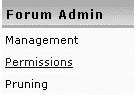

1.  选择**搞笑图片**论坛并点击**查找论坛**按钮。

1.  从**简单模式**选项下拉菜单中选择**注册用户**并点击**提交**。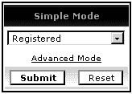

###### 刚发生了什么？

现在，只有注册用户被允许在“搞笑图片”论坛中发帖。你是通过在简单模式下设置 phpBB 权限来做到这一点的。

### 修剪

修剪是一个允许你清理旧的不活跃主题以释放数据库空间的特性。你已经看到了自动修剪功能是如何工作的。修剪与自动修剪的不同之处在于，它是你主动发起的，而不是自动完成的。

在使用此功能之前三思而后行——删除主题是不可逆的！您确定不再需要这些主题了吗？请记住，您的社区成员已经花费了大量时间撰写所有这些帖子。您想扔掉他们的帖子吗？在删除人们的主题之前，考虑购买更多的数据库空间。如果您仍然肯定想要修剪帖子，以下是方法。

##### 行动时间—修剪论坛

1.  从左侧导航菜单中选择**论坛管理员**选项中的**修剪**。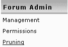

1.  如果您想清理所有论坛，请选择**所有论坛**。您还可以选择修剪单个论坛。

1.  输入**30**作为天数。

1.  点击**执行修剪**。

###### 发生了什么？

您刚刚删除了所有论坛中超过 30 天未活跃的主题。这是此操作的样本结果，这是关于删除了多少主题和帖子的报告。

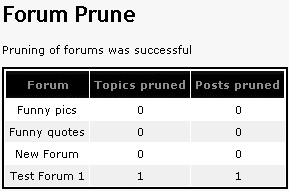

## 使用常规管理员选项进行系统管理

现在让我们转到**常规管理员**选项组，它允许您执行基本的系统管理任务。

### 配置

您可以通过点击左侧导航菜单中的**常规管理员**选项下的**配置**链接来访问常规配置选项。（不用担心跳过**备份数据库**；这个选项的描述稍后会有说明。）

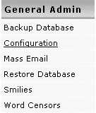

这将打开包含非常基础的论坛设置的“常规配置”表单，例如域名、启用私人消息等。您已经从第二章中了解了这些设置。

### 数据库备份和恢复

做数据备份是个好主意，以防万一出了什么问题。您的托管提供商可能会制作这样的备份副本；您也可以使用 phpMyAdmin 或使用 MySQL 命令行工具进行备份。如果您使用的是不同的数据库系统，您可能有其他选项。如果您可以访问 phpMyAdmin，请使用它。如果您的托管提供商正在制作副本，了解他们的频率和恢复数据库所需的工作量。不要让数据丢失是您的责任，这应该被认真对待。

惊吓到你了吗？很好。现在，让我们看看好消息：如果您担心没有访问数据备份工具的权限，请放心，phpBB 为您提供了数据库备份工具。有时这可能成为您的唯一选择，所以让我们来看看。

##### 行动时间—备份您的论坛数据

1.  从导航菜单中点击**备份数据库**。

1.  在您看到的**备份选项**表单中，点击**开始备份**，保留所有值为默认。您会看到一个**请等待**的消息。

1.  一个文件对话框会询问您如何处理请求下载的`phpbb_db_backup.sql`文件。将此文件保存到您的计算机上的一个选定的文件夹中。

###### 发生了什么

你刚刚创建了一个包含数据库 SQL 指令的备份文件，并将其保存在你的电脑上。妥善保存这些备份文件是个好主意，通过使用合适的文件名和目录来保持它们有序。例如，文件名可以包含备份创建的日期。偶尔，将这些文件烧录到 CD 上；你永远不知道你的电脑何时会崩溃，导致你丢失数据备份。

##### 行动时间——从备份副本恢复数据库

1.  在管理面板的左侧导航菜单中点击 **恢复数据库**。

1.  定位一个现有的备份副本文件（你可以使用在前一个练习中创建的 `phpbb_db_backup.sql` 文件）。

1.  点击 **开始恢复**。

1.  如果一切正常，你会收到一条消息，表明恢复成功。

###### 发生了什么

你已从保存在你电脑上的备份副本中恢复了你的论坛数据库，其中包含所有配置、论坛、主题、用户：简单来说，就是你的论坛运行所需的所有数据。

根据数据库的大小，执行备份和恢复操作所需的时间可能会有所不同。对于非常大的数据库，这些操作可能会因为你的主机提供商施加的一些服务器限制而失败。如果你遇到问题，请务必阅读第五章以获取有关数据库备份和恢复选项的更多信息，并在 phpBB.com 或 phpBBHacks.com 论坛上寻求建议。

### 大规模邮件

你可以使用 phpBB 向所有用户或单个用户组发送电子邮件。这个功能非常容易使用：你只需从左侧菜单中选择 **大规模邮件** 链接，选择收件人，输入主题和消息正文，然后点击 **电子邮件** 按钮。这可能会向所有用户发送电子邮件。

“希望如此”，因为有可能这个功能对你不起作用。由于所有这些发送垃圾邮件（即**垃圾邮件**）的人，互联网提供商和主机公司正在采取措施反对所有看起来像大规模邮件的东西。所以如果你数据库中有大量用户，或者你的主机有严格的邮件使用规则，你可能无法向用户发送大规模邮件。

如果尝试发送邮件而不进行任何配置更改失败，你可以尝试使用你的 ISP 的 SMTP 服务器。邮件设置位于“**配置**”链接下的“**一般管理**”部分。

phpBB 邮件发送器的工作方式是将所有收件人添加到 BCC 中。想象一下你在你最喜欢的电子邮件环境中发送一封普通电子邮件。现在想象你将所有用户添加到 BCC（盲碳拷贝）字段中。结果是：邮件被发送给所有收件人，他们无法看到 BCC 列表上的其他人。

### 表情符号

你知道笑脸，那些可爱的小图标（也称为表情符号），你可以用它们来让你的帖子更加生动，并表达一些情感，同时也可以给读者一个提示，了解如何对你的文本做出反应。好消息是：phpBB 默认自带一套笑脸包，并且足够灵活，允许你添加、编辑和删除成员在帖子中使用的笑脸。

点击**通用管理**选项组中的**笑脸**，将弹出**笑脸编辑工具**。

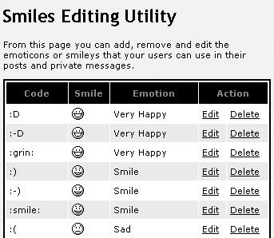

编辑或删除笑脸非常简单。只需使用每个笑脸旁边的相应链接即可。你还可以添加新图标，甚至可以添加包含在特殊文件（`.pak`）中的新图标批量。更多相关信息请参阅第五章。

### 使用词汇屏蔽过滤词汇

phpBB 允许你屏蔽成员在帖子中使用的词汇。屏蔽意味着用一个不那么糟糕的词汇替换一个糟糕的词汇。实际上，这不必是一个单词本身；它可以是一个单词的一部分或一个短语。

##### 行动时间——创建词汇过滤器

1.  点击导航菜单上的**词汇屏蔽**链接。

1.  在新屏幕中，点击**添加新词汇**。将出现一个新的表单：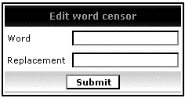

1.  在**词汇**字段中输入**The Dude Sucks**。

1.  在**替换**字段中输入**The Dude Rocks!**。

1.  点击**提交**。

###### 发生了什么

你为发布文本引入了一个新的词汇替换过滤器。现在你可以前往论坛前端测试这个功能的效果。

一些附加信息：

+   你选择屏蔽的词汇不仅会在发布文本中屏蔽，还会在帖子/主题标题、私信、用户名、投票答案和投票问题中屏蔽。

+   词汇替换仅在显示时进行。在数据库中，phpBB 存储原始文本。所以如果你决定移除词汇屏蔽，原始文本将开始显示。

+   你可以使用 ***** 通配符来匹配部分单词。在之前的例子中，如果你选择匹配并替换 **The Dude su***，这将匹配所有类似短语，如 **The Dude sukz, The Dude sux** 等，并且所有这些都将被替换。

## 用户管理简介

管理用户是一项你可能经常做的活动。有时用户会遇到资料问题、忘记密码、不再能访问旧电子邮件账户等问题。这时，你需要介入帮助用户。

如标题所示，本节是一个介绍，只包含你可能会频繁使用或不太常用的功能。更高级和较少使用的功能将在第五章中讨论。

### 编辑用户资料

要编辑用户资料，点击**用户管理**选项中的**管理**链接。

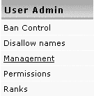

您已经熟悉基于用户名选择用户的屏幕。如果您不确定用户名的拼写，请使用**查找用户名**功能。

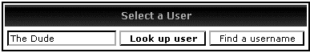

在您输入（或找到）用户名后，点击**查找用户**按钮将显示用户资料。编辑资料的表单与用户在论坛前端看到的相同，只是增加了一个**仅管理员可见的特殊字段**部分：

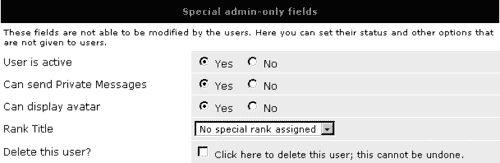

选项相当直观：

+   您可以停用用户，这样用户就无法再登录了。

+   您可以禁止此用户使用私人消息或头像。禁止使用 PM 意味着用户不能发送 PM，但可以接收其他用户的 PM。

+   您可以为用户分配一个等级（等级和头像将在后面进一步讨论）。

+   您可以删除此用户。

### 删除用户

要删除用户，按照上述说明操作，然后在编辑表单底部勾选**删除此用户？**复选框，并点击**提交**。删除用户是永久的；您无法撤销。然而，删除用户并不意味着删除用户发布的所有帖子。当用户被删除时，该用户的所有帖子都变为“访客”帖子。此时，用户名被回收并可用于新的注册。

### 权限

设置用户权限的界面可以通过在**用户管理**导航组中的**权限**链接访问：

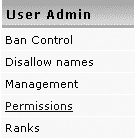

您将再次看到熟悉的**选择用户**表单。选择要编辑的用户后，您将看到**用户权限控制**屏幕：

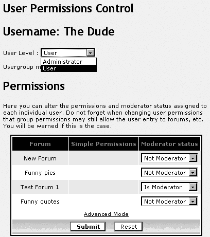

在这里，您可以选择将此用户设为管理员，这将自动给用户访问管理面板的权限，并将用户设为所有论坛的版主。简而言之，这意味着用户将拥有与您完全相同的权限。

另一个选项是按论坛选择性地将用户设置为版主。您已经这样做过了；还记得您是如何在**版主体验**部分开始时将 The Dude 设为版主的吗？

在这里，**简单权限**列是空的。如果您点击**高级模式**，详细权限也是如此。这是因为这些选项仅适用于私人论坛，并且列出的论坛中没有私人论坛。私人论坛和详细权限将在书中进一步描述。

### 禁止用户

是的，这不是一项愉快的任务，淘汰用户。但你能怎么办？这就是生活，事情就是这样发生的。世界上有各种各样的人，有时隐藏在网络的匿名性背后，有些人开始做一些他们通常不会做的事情。比如使用糟糕的语法。或者忘记在星期四发帖。当然，只是开个玩笑。

无论如何，想法是，由你来定义你特定社区的不当行为，但到了最糟糕的时候，你最好知道你的选择。

要访问禁止控制界面，请使用左侧导航菜单中的**用户管理**下的**禁止控制**链接。

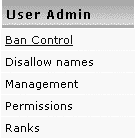

禁止用户的界面一开始可能有些令人困惑，但实际上它有助于快速了解当前定义了哪些类型的禁止。表单由三个包含两个表单字段每组的三组组成。这三组代表禁止用户的三种方式，两个字段分别用于添加和移除禁止。表单本身包含有关可用选项的一些帮助信息。

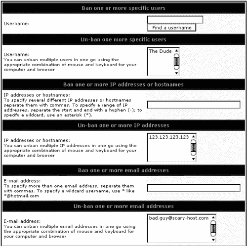

当你使用任何三种方法之一禁止用户，并且用户尝试访问论坛时，他们将看到以下消息：

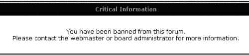

### 禁止用户

虽然你可以在造成损害之后禁止用户，但禁止某些用户名是一种预防措施。当一个用户名（或其一部分）被禁止时，它不能用于注册。因此，这个功能在用户名被占用之前使用，以防止其被占用。禁止用户名的表单包含添加和移除规则的界面。该表单可通过左侧的**禁止名称**链接访问。

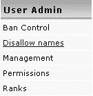

以下示例展示了如何禁止以 Mod（如版主）或 Admin 开头的一切，以防止冒名顶替者使用暗示他们不仅仅是普通用户，而是拥有特殊社区权力的用户名。


# 摘要

概述 phpBB 的基本功能是一项漫长的旅程。这是真的，因为 phpBB 是一个功能丰富的公告板系统，为所有用户类型——普通成员、版主和管理员——提供了很多灵活性。从哲学的角度来看，理论上和实践上都知道，更大的灵活性往往伴随着复杂性的增加。但对于 phpBB 的大多数功能来说，情况并非如此，因为它们真的很直观且易于使用。

如果你完成了本章中的*行动时间*部分，你现在应该对你在新的 BB 上如何运作有一个相当好的了解。如果你没有做练习部分，现在是你回去做它们或者只是把书放一边，开始尝试使用你最喜欢的公告板系统 phpBB 的时候了。
