# 第六章：创建您的模板

制作自己的模板不仅可能非常有趣，也可能非常耗时。有许多小细节正等着被忽视，这就是为什么我建议您不要急于完成它。慢慢来，最终你会得到回报。

就像许多其他与设计相关的项目一样，创建一个吸引人的 phpBB 模板最具挑战性的事情之一就是得到布局的想法。你可能已经有了主页，并希望应用那个布局，但很多时候我看到人们围绕他们的 phpBB 模板布局构建他们网站的其余部分。

因此，在本章中，我们将从头开始，告诉您如何将基本的布局想法转化为构建整个模板。

让我先说，灵感，以及整个创造性过程本身，并不是少数人拥有的珍贵礼物。这是每个人都可以通过练习和耐心在一段时间内学会的东西。找到一些布局想法，并调整它们，直到你对结果满意；你花在这上面的时间越多，你就越会了解自己：你喜欢什么，不喜欢什么。很快，你就会发展出自己的风格，几乎可以把任何东西变成你想要的。

在寻找您未来的 phpBB 模板布局时，有无数的地方可以开始寻找；杂志、报纸、广告、主页、建筑、艺术，甚至基本的壁纸都只是我找到的有用的一些灵感来源。在咖啡店花半小时，用笔在餐巾纸上画线，可能会揭示最吸引人的布局。这完全取决于你愿意走多远，尽管我怀疑没有人能基于像…茶壶这样的东西构建出一个好的模板布局。

对于 phpBB 模板中需要的布局类型，你应该尝试寻找你可以使用的模式。例如，我们需要能够显示主题和帖子，可能还有空间放置一张图片和一个菜单。

本章中我将要构建的模板是基于我从一份报纸上得到的一个想法。实际上并不复杂：只是一张照片、一个标题和一些文字，我在一张纸上画了个草图以免忘记。我喜欢它的简洁、线条和相当大的图像。即使它第一眼看起来可能不像 phpBB 模板，我仍会尝试，同时向您展示如何克服路上必然会遇到的任何障碍：

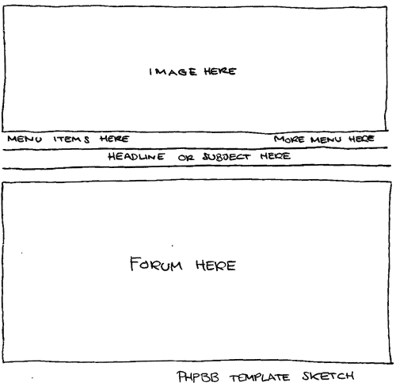

# 绘制布局草图

我要做的第一件事是在 Photoshop 中制作模板的粗略基本布局。它不需要非常精确或准确，但足以获得模板的大致外观。首先需要决定一些重要的事情，从布局的宽度开始。将宽度设置为 100%是 HTML 网站和模板的一个非常流行的选择，但考虑到顶部的图片，这可能不是这个布局的最佳选择。我需要一个固定的大小。此外，为了防止整个布局变得过大，我决定将整个布局的宽度缩小到仅 780 像素。这将给论坛的两侧留下一些“空间”，并且看起来更像基于纸张的布局。在这个宽度下，为那些屏幕分辨率为 800x600 像素的用户分配了 20 像素的滚动条空间。

对于顶部的较大图片，我有一张很久以前为 Photoshop 比赛制作的旧 PSD 图片。我一直想在我的某个项目中使用这张图片，这似乎是一个好机会。图片的格式是 717x231 像素，大小适中，既不太大也不太小。

在图片下方将出现菜单。黑色线条下的论坛表格如果与背景颜色相同看起来不会很好，所以我给它们添加了浅灰色阴影。

由于我的 PSD 图片颜色与模板布局的其他部分不匹配，很难获得良好的色彩感觉。经过尝试新的背景和论坛颜色，以匹配图片，我最终将图片改为一个空白的灰色框，以便与论坛的浅灰色相匹配。然而，我仍然觉得这不是最佳解决方案；它看起来太空了。

通过尝试一些 Photoshop 画笔，我最终找到了一个带有油漆溅洒效果的画笔，用红色颜色我成功地得到了一种看起来像鼻出血的效果。可能有点恐怖，但它看起来相当好，简单且整洁。我用一种我认为适合图片的字体添加了标题“NoseBleed”，使其更具动感。

在这个早期阶段没有必要涉及太多细节；如果你有更好的想法，很容易稍后更改图片和颜色。毕竟，这只是一个草图！

我仍然不确定是否想要一个彩色背景，或者甚至为论坛两侧的白色“空间”添加背景图片，所以我把这个选项留开放。不过，目前我们尽量保持简单；全部为白色。

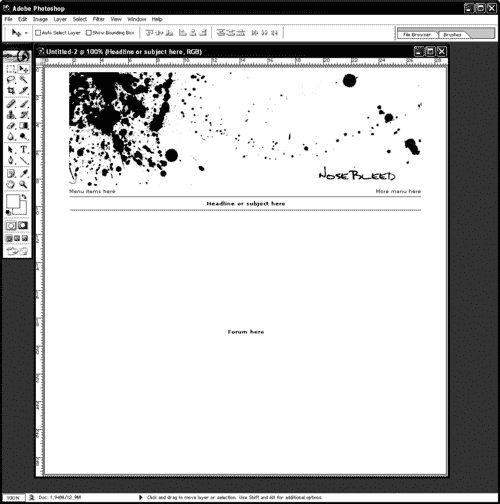

完成草图后，我将图片剪裁出来并保存为`top_image.jpg`，这样我们就可以开始创建模板了。

# TPL 代表模板

浏览器中的每一页都由三个 `.tpl` 文件组成，包括 HTML 代码、层叠样式表代码（CSS）和 phpBB 变量。第一个文件始终是 `overall_header.tpl`，最后一个文件始终是 `overall_footer.tpl`。这三个 `.tpl` 文件的中部显示了我们可以在该特定页面上看到的实际内容。例如，如果我们正在查看论坛的索引页，我们看到的是 `overall_header.tpl`、`index_body.tpl` 和 `overall_footer.tpl` 的代码组合。或者如果我们转到登录页，显示的 .tpl 文件是 `overall_header.tpl`、`login_body.tpl` 和 `overall_footer.tpl`，依此类推。这非常方便，因为我们只需要编辑一个 `.tpl` 文件，即 `overall_header.tpl`，就可以更改浏览器显示的所有页面的顶部部分。

想象一下，如果你要在一张商务信纸上写一封信。信纸的顶部已经印有公司名称、标志和地址（`overall_header.tpl`），也许底部还有一行地址（`overall_footer.tpl`）。你会在中间写上你个人的信息（中间的 `.tpl` 文件）。无论你写了多少封信，无论信的内容有多不同，你都会始终有相同的页眉和页脚。是中间的 `.tpl` 文件让 phpBB 论坛变得生动起来。

然而，在我们开始编辑任何文件之前，我们会在 phpBB 模板目录中的 `subSilver` 文件夹中创建一个副本，并将其命名为 `NoseBleed`。有了副本，如果出现问题，我们总能回到原始的 `.tpl` 文件。 

# 创建模板文件夹

为了让 phpBB 识别新的 `NoseBleed` 文件夹作为一个独特的模板，我们需要编辑一些文件。在文件夹中，有一个名为 `subSilver.cfg` 的文件，我们将其重命名为 `NoseBleed.cfg`。我们还把 `subSilver.css` 重命名为 `NoseBleed.css`，尽管现在这个文件并不需要。最后，我们需要在 `theme_info.cfg` 文件中将每个 `subSilver` 实例替换为 `NoseBleed`。如果你使用 WordPad 来做这个，你可以按 *CTRL+H* 来打开 **替换所有** 窗口，使这个编辑变得快速。

现在，我们可以从管理面板上传和安装新的模板。

# `.tpl` 文档编辑器

在 `.tpl` 文件中使用的代码基本上，如前所述，是 HTML 代码。如果你已经对基本的 HTML 和 CSS 有一些了解，你无需担心，如果你没有，也不要担心。我们将通过详细的解释来逐步完成这个过程。

对于这一章，我们使用记事本来编辑`.tpl`文件。我们也可以使用像 Dreamweaver 这样的 WYSIWYG 编辑器进行编辑。它可能有一些优点，比如在编码时能够看到布局的大致视图。然而，我不建议使用这些编辑器可以自动插入的代码，因为 phpBB 可能会与这类代码冲突。我们也可以使用 Word、WordPad 或任何其他文本编辑器，只要我们记得将文档保存为纯 ASCII 代码，因为 phpBB 不能读取富文本格式的`.tpl`文件。

首先，从`NoseBleed`文件夹中打开`overall_header.tpl`文件；这是包含每个页面顶部布局的文件。记住，如果你是第一次使用 HTML，不要紧张；实际上，它并没有看起来那么困难。在代码的顶部，你会找到一个告诉浏览器这是一个 HTML 文档的部分。然后，我们有页面的标题、CSS 代码，然后在底部，我们有将显示我们布局的 HTML 代码。当 phpBB 加载`.tpl`文件时，它会从数据库中填充 phpBB 变量。这些变量都使用大写字母，并且总是看起来像这样：`{PHPBB_VARIABLE}`。

在`<style type="text/css">`和`</style>`代码标签之间，你会找到所有的 CSS 代码，例如：

```php
/* Name of poster in viewmsg.php and viewtopic.php and other places */
.name { font-size : {T_FONTSIZE2}px; color : {T_BODY_TEXT};}

```

如果你将代码放在 CSS 中的`/*`和`*/`标签之间，浏览器将忽略它。如果你想为自己或他人留下注释，可以使用这个功能。上面特定的 CSS 样式被称为`.name`。在`name`前面的点不是一个类型错误，但当你准备添加自己的样式时，你应该注意这一点。一个名为`.table`的 CSS 样式只会影响你的 HTML 文档中应用了它的区域，例如：

```php
<span class="table">Some text here</span>

```

然而，一个没有点的名为`table`的 CSS 样式将对你的 HTML 文档中的每个表格产生影响。

但让我们开始构建我们的模板！

# 准备，设置，出发！

拿着草图，创建模板的最佳方式是简单地遵循草图，从顶部开始，一直工作到页面底部。如前所述，`overall_header.tpl`总是包含你在浏览器中看到的每个页面的顶部部分，因此这是我们首先需要工作的部分。在`subSilver`中，这个文件已经显示了图像和菜单，这是一个很好的方法，我们将保持我们自己的模板中相同的做法。

打开`overall_header.tpl`文件，并向下滚动到`<body>`标签开始的地方（这个标签之前的部分是 CSS，我们稍后会讨论）。

我们需要做的第一件事是确保模板在浏览器中完全展开。默认情况下，浏览器会在页面的顶部和左侧添加边距，但我们可以通过将`topmargin`和`leftmargin`设置为零来消除这些边距。我们可以通过修改`<body>`标签来实现这一点：

```php
<body bgcolor="{T_BODY_BGCOLOR}" text="{T_BODY_TEXT}"
link="{T_BODY_LINK}" vlink="{T_BODY_VLINK}"
leftmargin="0" topmargin="0">

```

在模板中值得注意的下一件事是`<a name="top"></a>`链接标签。如果我们添加以下链接：

```php
<a href="top">Go to top!</a>

```

...点击链接后，浏览器会将您带到`<a name="top"></a>`，在这种情况下，到页面的顶部，它所在的位置。

然后我们有模板的表格结构。第一个表格从以下内容开始：

```php
<table width="100%" cellspacing="0" cellpadding="10" border="0" align="center">
<tr>
<td class="bodyline">

```

...但它显然没有结束。这不是错误；这是因为这个表格包围了整个论坛，包括在`overall_header.tpl`之后将加载的内容。

您可以在模板的任何其他地方找到这个表格的结尾：

```php
</td>
</tr>
</table>

```

...在`overall_footer.tpl`文件中。

接下来我们改变包围整个论坛的表格的宽度。在 subSilver 模板中，这个宽度设置为 100%，但我们只想让我们的模板宽度为 780 像素。我们还添加了高度 100%，以在浏览器中从上到下拉伸模板：

```php
<table width="780" height="100%" cellspacing="0"
cellpadding="10" border="0" align="center">
<tr>
<td class="bodyline" valign="top">

```

由于`cellpadding`的大小，这个表格将使所有内容距离表格边框 10 像素。我们将宽度改为 780 像素而不是 100%，并添加高度 100%，以防我们稍后决定在论坛的每一边添加背景图片或颜色。由于默认情况下，内容在表格中间水平对齐——现在高度是 100%——我们需要将其对齐，使其出现在顶部。我们可以通过在表格的第一个`<td>`中添加一个`valign`标签来实现这一点。

在进行这些修改后，我们的表格代码应该看起来像这样：

```php
<table width="780" height="100%" cellspacing="0"
cellpadding="10" border="0" align="center">
<tr>
<td class="bodyline" valign="top">

```

## 添加横幅图片

我们现在想要添加`top_image.jpg`——我们之前制作的横幅图片，我们首先将其上传到`NoseBleed/images/`模板文件夹。在没有开始更改和编辑已经存在的表格结构——这可能会变成一个编辑地狱的任务——我们简单地添加一个新的独立表格，直接在上一行下面，一个只包含我们的横幅图片的表格：

```php
<table width="717" height="231" border="0" align="center"
cellpadding="0" cellspacing="0">
<tr>
<td>
<div align="center">
<a href="{U_INDEX}">

</a>
</div>
</td>
</tr>
</table>

```


如您所见，我在图片周围添加了`<a href="{U_INDEX}"></a>`链接标签，这样它就可以作为链接回到论坛的索引页面。这与`subSilver`处理其自己的横幅图片的方式类似。基本上，我只是复制了那部分，使用了已经给出的相同的 phpBB 变量。

在整个模板中，我们可以使用许多这样的变量，所有这些变量的列表可以在[`www.phpbb.com/styles/listvars.php`](http://www.phpbb.com/styles/listvars.php)找到。

注意，并非所有变量都适用于所有`.tpl`文件。大多数是，但有些是为论坛的特定部分设计的，如注册页面、搜索页面等。

## 添加菜单

接下来我们要做的是在`top_image`下面添加菜单。我们再次添加一个新的表格，在我们的横幅图片下方，这次添加了一些临时文本，我们稍后会进行修正。现在添加文本是为了在我们开始添加真正的菜单项时使其更清晰。

```php
<table width="715" height="20" border="0" align="center" cellpadding="0" cellspacing="0">
<tr>
<td align="left">
FAQ
Search
Memberlist
Usergroups
Profile
You have no new messages
</td>
<td align="right">
Log in
Register
</td>
</tr>
</table>

```

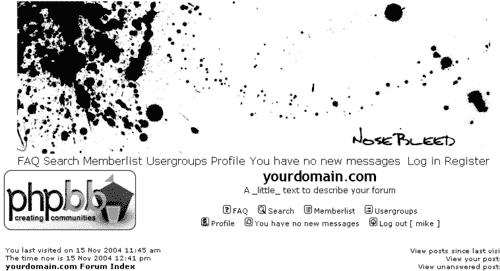

留意观察的眼睛可能会注意到，我制作的这个表格宽度只有 715 像素，而不是我们决定的 717 像素。原因只是这样看起来更好，没有其他原因。我最初尝试使用 717 像素，但看起来文本比图片宽。715 像素让它看起来更一致。

为了使菜单工作，我们需要将菜单的每一部分都转换成链接。例如，为了使`FAQ`成为链接，我们需要在它周围添加`<a href="url">`和`</a>`标签，其中`url`应该替换为我们想要链接到`FAQ`的文件地址。同样的事情也必须对菜单的其他部分做。

```php
<table width="715" height="20" border="0" align="center"
cellpadding="0" cellspacing="0">
<tr>
<td align="left">
<a href="url">FAQ</a>
<a href="url">Search</a>
<a href="url">Memberlist</a>
<a href="url">Usergroups</a>
<a href="url">Profile</a>
<a href="url">You have no new messages</a>
</td>
<td align="right">
<a href="url">Log in</a>
<a href="url">Register</a>
</td>
</tr>
</table>

```

要将`url`替换为我们希望链接指向的实际地址，我们可以简单地查看`subSilver`模板已经使用的方式。通过查看代码，每个`url`都可以替换为正确的 phpBB 变量。我们还可以用变量替换菜单文本；这样，使用其他语言的用户就不必被迫使用英文菜单项。替换文本后，我们的表格现在如下所示：

```php
<table width="715" height="20" border="0" align="center" cellpadding="0" cellspacing="0">
<tr>
<td align="left">
<a href="{U_FAQ}">{L_FAQ}</a>
<a href="{U_SEARCH}">{L_SEARCH}</a>
<a href="{U_MEMBERLIST}">{L_MEMBERLIST}</a>
<a href="{U_GROUP_CP}">{L_USERGROUPS}</a>
<a href="{U_PROFILE}">{L_PROFILE}</a>
<a href="{U_PRIVATEMSGS}">{PRIVATE_MESSAGE_INFO}</a>
</td>
<td align="right">
<a href="{U_LOGIN_LOGOUT}">{L_LOGIN_LOGOUT}</a>
<a href="{U_REGISTER}">{L_REGISTER}</a></td>
</tr>
</table>

```

这里需要注意的一点是，已经登录的用户不应该能够点击**注册**。为了防止这种情况，我们可以使用`<!-- BEGIN switch_user_logged_out -->`和`<!-- END switch_user_logged_out -->`标签。这些标签之间的所有内容只有在用户未登录时才会显示，这正是我们想要的**注册**菜单的效果。如果我们想只显示用户登录时的内容，我们可以使用`<!-- BEGIN switch_user_logged_in -->`和`<!-- END switch_user_logged_in -->`标签代替。

个人认为，未登录的用户不应该看到**个人资料**和**私人消息**菜单，所以我打算使用这些标签来防止访客尝试访问个人资料和私人消息菜单。

### 注意

关于这些标签的一个重要注意事项是，它们只有在代码中单独一行时才起作用；如果它们不在单独一行，phpBB 将无法识别它们。

表格现在应该看起来像这样：

```php
<table width="715" height="20" border="0" align="center" cellpadding="0" cellspacing="0">
<tr>
<td align="left">
<a href="{U_FAQ}">{L_FAQ}</a>
<a href="{U_SEARCH}">{L_SEARCH}</a>
<a href="{U_MEMBERLIST}">{L_MEMBERLIST}</a>
<a href="{U_GROUP_CP}">{L_USERGROUPS}</a>
<!-- BEGIN switch_user_logged_in -->
<a href="{U_PROFILE}">{L_PROFILE}</a>
<a href="{U_PRIVATEMSGS}">{PRIVATE_MESSAGE_INFO}</a>
<!-- END switch_user_logged_in -->
</td>
<td align="right">
<a href="{U_LOGIN_LOGOUT}">{L_LOGIN_LOGOUT}</a>
<!-- BEGIN switch_user_logged_out -->
<a href="{U_REGISTER}">{L_REGISTER}</a>
<!-- END switch_user_logged_out -->
</td>
</tr>
</table>

```

保存文件并上传它们（除非你在本地测试它们），你会看到它看起来相当不错，也许除了临时文本的字体外：

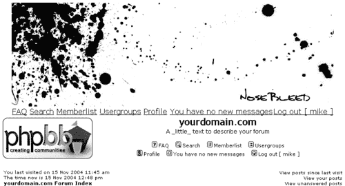

为了更改模板的字体和颜色，我想向您介绍层叠样式表（CSS）。

# CSS

如果你查看原始的 subSilver 菜单，你会注意到所有的链接都被`<span class="mainmenu">`和`</span>`标签包围。这是对 CSS 代码的引用，如果你查看`overall_header.tpl`代码中的 CSS 部分，你可以找到这个（在此重新格式化以供书籍使用）：

```php
/* The register, login, search etc links at the top of the page */
.mainmenu { font-size : {T_FONTSIZE2}px;
color : {T_BODY_TEXT}
}
a.mainmenu { text-decoration: none;
color : {T_BODY_LINK};
}
a.mainmenu:hover { text-decoration: underline;
color : {T_BODY_HLINK};
}

```

在这里，我们可以更改关于菜单显示方式的任何内容。被`/*`和`*/`标签包围的第一行只是一个帮助我们评论的注释，不会被浏览器使用。第二行确定文本（在这个例子中）应该如何显示，最后两行描述了如果文本是链接，应该如何显示。变量是在论坛的管理面板中设置的。我个人喜欢添加链接已被访问时的 CSS 代码，这样我可以确保我不会突然得到不同的颜色或字体大小。这个代码被称为`a.mainmenu:visited`，可以单独一行插入，或者作为已编写代码的一部分，用逗号分隔，如下所示：

```php
/* The register, login, search etc links at the top of the page */
.mainmenu { font-size : {T_FONTSIZE2}px;
color : {T_BODY_TEXT}
}
a.mainmenu,a.mainmenu:visited { text-decoration: none;
color : {T_BODY_LINK};
}
a.mainmenu:hover { text-decoration: underline;
color : {T_BODY_HLINK};
}

```

如果我们想要定义当有人点击链接时链接应该看起来如何，我们也可以为`a.mainmenu:active`添加一个定义。

对于我们的菜单样式定义，表格看起来是这样的：

```php
<table width="715" height="20" border="0" align="center" cellpadding="0" cellspacing="0">
<tr>
<td align="left">
<a href="{U_FAQ}" class="mainmenu">{L_FAQ}</a>
<a href="{U_SEARCH}" class="mainmenu">{L_SEARCH}</a>
<a href="{U_MEMBERLIST}" class="mainmenu">{L_MEMBERLIST}</a>
<a href="{U_GROUP_CP}" class="mainmenu">{L_USERGROUPS}</a>
<!-- BEGIN switch_user_logged_in -->
<a href="{U_PROFILE}" class="mainmenu">{L_PROFILE}</a>
<a href="{U_PRIVATEMSGS}" class="mainmenu">{PRIVATE_MESSAGE_INFO}</a>
<!-- END switch_user_logged_in -->
</td>
<td align="right">
<a href="{U_LOGIN_LOGOUT}" class="mainmenu">{L_LOGIN_LOGOUT}</a>
<!-- BEGIN switch_user_logged_out -->
<a href="{U_REGISTER}" class="mainmenu">{L_REGISTER}</a>
<!-- END switch_user_logged_out -->
</td>
</tr>
</table>

```

我们现在几乎完成了菜单。唯一看起来不太好的是菜单项之间太靠近。在 HTML 中，多个空格只会显示为一个空格，但解决这个问题的一种方法是用`&nbsp;`代码代替，实际上它就是一个空格。它的优点是可以添加任意数量的连续空格。

我们在每个菜单项之间添加两个空格，以及`mainmenu`类，以便使空格的大小与菜单中使用的字体大小相同。

完成的表格看起来是这样的：

```php
<table width="715" height="20" border="0" align="center" cellpadding="0" cellspacing="0">
<tr>
<td align="left" class="mainmenu">
<a href="{U_FAQ}" class="mainmenu">{L_FAQ}</a>
&nbsp;&nbsp;
<a href="{U_SEARCH}" class="mainmenu">{L_SEARCH}</a>
&nbsp;&nbsp;
<a href="{U_MEMBERLIST}" class="mainmenu">{L_MEMBERLIST}</a>
&nbsp;&nbsp;
<a href="{U_GROUP_CP}" class="mainmenu">{L_USERGROUPS}</a>
<!-- BEGIN switch_user_logged_in -->
&nbsp;
<a href="{U_PROFILE}" class="mainmenu">{L_PROFILE}</a>
&nbsp;&nbsp;
<a href="{U_PRIVATEMSGS}" class="mainmenu">{PRIVATE_MESSAGE_INFO}</a>
<!-- END switch_user_logged_in -->
</td>
<td align="right" class="mainmenu">
<a href="{U_LOGIN_LOGOUT}" class="mainmenu">{L_LOGIN_LOGOUT}</a>
<!-- BEGIN switch_user_logged_out -->
&nbsp;
<a href="{U_REGISTER}" class="mainmenu">{L_REGISTER}</a>
<!-- END switch_user_logged_out -->
</td>
</tr>
</table>

```

我们现在完成了`overall_header.tpl`中的表格，可以删除剩余的原始 subSilver 表格代码。

现在是时候进入管理面板了；我们需要修复菜单上的文本颜色，这里事情可能会开始变得有些复杂。

让我先说，我们不需要使用论坛的管理面板设置来更改布局；我们同样可以直接编辑 CSS 代码，而不使用变量。例如，如果我们想要菜单中的文本稍微小一点，黑色，并且当鼠标悬停在其上时，仍然是黑色但带有下划线。实现这一点最简单的方法就是将 CSS 更改为：

```php
/* The register, login, search etc links at the top of the page */
.mainmenu { font-size : 11px;
color : black
}
a.mainmenu { font-size : 11px;
text-decoration: none;
color : black;
}
a.mainmenu:visited { font-size : 11px;
text-decoration: none;
color : black;
}
a.mainmenu:hover { font-size : 11px;
text-decoration: underline;
color : black;
}

```

然而，这样我们每次想要更改内容时，都必须编辑`overall_header.tpl`。这可能对你个人来说是个不错的解决方案，但如果你打算公开发布模板，可能就不是那么好的主意了。并不是每个人都觉得编辑 CSS 代码很舒服，而且，如果我们有从管理面板更改这些选项的选项，我们最好还是这样做。

在管理面板中，通过选择**样式管理**下的模板并编辑它，你会找到 CSS 中使用的变量。例如，`{T_FONTSIZE2}`指的是`字体大小 2:`，设置为`11`。如果你想让`.mainmenu`有更小的字体，在这里将其更改为`10`。然而，这意味着 CSS 中所有其他地方出现的`{T_FONTSIZE2}`都会是字体大小`10`——这并不是我们想要的。

相反，使用 CSS 中的 `{T_FONTSIZE1}` 更容易，它指的是在管理面板中的 `字体大小 1`：已经是字体大小 `10`。

在管理面板中的 `文本颜色:` 被设置为 `000000`，这在像这样的白色背景上可能有点太暗了。因此，我们将它改为 `111111` 的值，以稍微柔和一下。

`链接颜色`: 被设置为 `006699`，我们将它更改为红色，值为 `9F0002`，与 `top_image.jpg` 中的画笔颜色相同。我们还将使用这个值来设置 `'已访问'`、`'激活'` 和 `'悬停'` 链接。

目前我们只需要这些，我们可以保存这些设置并返回论坛。

菜单现在使用红色文本，因为它正在使用管理面板的链接变量。如果我们想让它们始终是黑色，我们需要在 CSS 代码中更改以下内容：

```php
/* The register, login, search etc links at the top of the page */
.mainmenu {
font-size : {T_FONTSIZE2}px;
color : {T_BODY_TEXT}
}
a.mainmenu {
text-decoration: none;
color : {T_BODY_LINK};
}
a.mainmenu:hover {
text-decoration: underline;
color : {T_BODY_HLINK};
}

```

... 到：

```php
/* The register, login, search etc links at the top of the page */
.mainmenu {
font-size : {T_FONTSIZE1}px;
color : {T_BODY_TEXT}
}
a.mainmenu {
font-size : {T_FONTSIZE1}px;
text-decoration: none;
color : {T_BODY_TEXT};
}
a.mainmenu:visited {
font-size : {T_FONTSIZE1}px;
text-decoration: none;
color : {T_BODY_TEXT};
}
a.mainmenu:hover {
font-size : {T_FONTSIZE1}px;
text-decoration: underline;
color : {T_BODY_TEXT};
}

```

菜单现在是所需的黑色文本。注意，我们在所有的链接定义中添加了 `font-size : {T_FONTSIZE1}px;` 代码。这通常不是我们必须做的，因为已经在 `.mainmenu` 中定义了，但我经历过，有时如果用户安装了一个只定义 `.mainmenu` 中字体大小的 CSS 的新模板，该模板将使用之前安装的模板的字体大小。这听起来很奇怪，但我确实见过，而且并不好看。可能还有其他解决方法，但这种方法对我有效。

论坛的灰色背景颜色和周围的边框似乎与其他部分不匹配。将管理面板中的 `背景颜色:` 从 `E5E5E5` 更改为 `FFFFFF` 解决了第一个问题，但还有一些边框需要去除。如果你遇到这样的问题，最好的办法是回到 `.tpl` 文件的代码中，找出导致问题的原因。在这种情况下，边框来自第一个表格中的 CSS，称为 `bodyline`：

```php
<table width="780" height="100%" cellspacing="0" cellpadding="10" border="0" align="center">
<tr>
<td class="bodyline" valign="top">

```

在 CSS 代码中，我们有：

```php
/* This is the border line & background color round the entire page */
.bodyline {
background-color: {T_TD_COLOR2};
border: 1px {T_TH_COLOR1} solid;
}

```

虽然这是一个简单的修复，但只需将边框更改为 `0px` 就可以解决这个问题。


我们现在可以编辑 `index_body.tpl` 文件了，它显示论坛的索引页面。

# 在 `index_body.tpl` 中修改论坛索引

`index_body.tpl` 文件中的第一个表格看起来是这样的：

```php
<table width="100%" cellspacing="0" cellpadding="2" border="0" align="center">
<tr>
<td align="left" valign="bottom"><span class="gensmall">
<!-- BEGIN switch_user_logged_in -->
{LAST_VISIT_DATE}<br />
<!-- END switch_user_logged_in -->
{CURRENT_TIME}<br /></span><span class="nav">
<a href="{U_INDEX}" class="nav">{L_INDEX}</a></span>
</td>
<td align="right" valign="bottom" class="gensmall">
<!-- BEGIN switch_user_logged_in -->
<a href="{U_SEARCH_NEW}" class="gensmall">{L_SEARCH_NEW}</a>
<br />
<a href="{U_SEARCH_SELF}" class="gensmall">{L_SEARCH_SELF}</a>
<br />
<!-- END switch_user_logged_in -->
<a href="{U_SEARCH_UNANSWERED}" class="gensmall">{L_SEARCH_UNANSWERED}</a>
</td>
</tr>
</table>

```

它显示了一系列变量：登录用户上次访问的时间、当前时间、用户尚未阅读的帖子链接以及未回答的帖子。我们不希望在索引页面上显示这些变量，所以我们简单地复制整个表格，删除它，并将其粘贴到 `.tpl` 的底部。这样我们就可以稍后处理它了。

根据布局想法，页面的顶部应该有两条黑色线条，菜单下方有一些文本。这是一个应该在模板中继续的细节，也是我们必须构建到所有 `.tpl` 文件中的内容。

`index_body.tpl` 中的下一个表格看起来是这样的：

```php
<table width="100%" cellpadding="2" cellspacing="1" border="0" class="forumline">
<tr>
<th colspan="2" class="thCornerL" height="25" nowrap="nowrap">
&nbsp;{L_FORUM}&nbsp;
</th>
<th width="50" class="thTop" nowrap="nowrap">
&nbsp;{L_TOPICS}&nbsp;
</th>
<th width="50" class="thTop" nowrap="nowrap">
&nbsp;{L_POSTS}&nbsp;
</th>
<th class="thCornerR" nowrap="nowrap">
&nbsp;{L_LASTPOST}&nbsp;
</th>
</tr>
<!-- BEGIN catrow -->
<tr>
<td class="catLeft" colspan="2" height="28">
<span class="cattitle">
<a href="{catrow.U_VIEWCAT}" class="cattitle">{catrow.CAT_DESC}</a>
</span>
</td>
<td class="rowpic" colspan="3" align="right">
&nbsp;
</td>
</tr>
<!-- BEGIN forumrow -->
<tr>
<td class="row1" align="center" valign="middle" height="50">

</td>
<td class="row1" width="100%" height="50">
<span class="forumlink">
<a href="{catrow.forumrow.U_VIEWFORUM}" class="forumlink">{catrow.forumrow.FORUM_NAME}</a>
<br />
</span>
<span class="genmed">
{catrow.forumrow.FORUM_DESC}
<br />
</span>
<span class="gensmall">
{catrow.forumrow.L_MODERATOR} {catrow.forumrow.MODERATORS}
</span>
</td>
<td class="row2" align="center" valign="middle" height="50">
<span class="gensmall">
{catrow.forumrow.TOPICS}
</span>
</td>
<td class="row2" align="center" valign="middle" height="50">
<span class="gensmall">
{catrow.forumrow.POSTS}
</span>
</td>
<td class="row2" align="center" valign="middle" height="50" nowrap="nowrap">
<span class="gensmall">
{catrow.forumrow.LAST_POST}
</span>
</td>
</tr>
<!-- END forumrow -->
<!-- END catrow -->
</table>

```

这是论坛本身，包括所有主题和分类，这是我们想要出现在顶部的。在第一行，我们可以看到表格有一个`class="forumline"`属性。这就是创建表格边框的原因，也是我们想要修改的。回到`overall_header.tpl`的 CSS 代码，我们可以找到：

```php
/* This is the outline round the main forum tables */
.forumline {
background-color: {T_TD_COLOR2};
border: 2px {T_TH_COLOR2} solid;
}

```

`{T_TD_COLOR2}`变量指的是**表格单元格颜色 2**：在管理面板中，目前设置为`FFFFFF`，一种明亮的白色。`{T_TH_COLOR2}`是**表格标题颜色 2**：设置为`006699`，一种蓝色。我们可以随意更改此代码以适应表格周围的框架，但为了使模板尽可能简单，并使其与布局理念相匹配，我们目前不想有任何边框。最简单的方法就是直接从表格中移除`class="forumline"`属性，但如果以后我们决定无论如何都需要边框，那就意味着我们必须进入所有的`.tpl`文件并手动再次添加属性——太麻烦了！相反，我们更改 CSS 如下：

```php
/* This is the outline round the main forum tables */
.forumline {
/*
background-color: {T_TD_COLOR2};
border: 2px {T_TH_COLOR2} solid;
*/
}

```

现在表格的宽度设置为 100%，我们将它改为 717 以匹配图片。我们还添加了一个`align="center"`属性，使它在页面上居中。

表格的前一部分现在看起来像：

```php
<table width="717" align="center" cellpadding="2" cellspacing="1" border="0" class="forumline">
<tr>
<th colspan="2" class="thCornerL" height="25" nowrap="nowrap">
&nbsp;{L_FORUM}&nbsp;
</th>
<th width="50" class="thTop" nowrap="nowrap">
&nbsp;{L_TOPICS}&nbsp;
</th>
<th width="50" class="thTop" nowrap="nowrap">
&nbsp;{L_POSTS}&nbsp;
</th>
<th class="thCornerR" nowrap="nowrap">
&nbsp;{L_LASTPOST}&nbsp;
</th>
</tr>

```

在代码中，我们可以找到名为`thCornerL, thTop`和`thCornerR`的类。这些是显示表格第一行蓝色背景和橙色文字的类。在我们的 CSS 代码中，我们在这里找到它们：

```php
/* Header cells - the blue and silver gradient backgrounds */
th {
color: {T_FONTCOLOR3};
font-size: {T_FONTSIZE2}px;
font-weight : bold;
background-color: {T_BODY_LINK};
height: 25px;
background-image: url(templates/subSilver/images/{T_TH_CLASS2});
}

```

...这里：

```php
th.thHead,th.thSides,th.thTop,th.thLeft,th.thRight,th.thBottom,th.thCornerL,th.thCornerR {
font-weight: bold;
border: {T_TD_COLOR2};
border-style: solid;
height: 28px;
}

```

...还有这里：

```php
th.thHead,td.catHead {
font-size: {T_FONTSIZE3}px;
border-width: 1px 1px 0px 1px;
}
th.thSides,td.catSides,td.spaceRow {
border-width: 0px 1px 0px 1px;
}
th.thRight,td.catRight,td.row3Right {
border-width: 0px 1px 0px 0px;
}
th.thLeft,td.catLeft { border-width: 0px 0px 0px 1px; }
th.thBottom,td.catBottom { border-width: 0px 1px 1px 1px; }
th.thTop { border-width: 1px 0px 0px 0px; }
th.thCornerL { border-width: 1px 0px 0px 1px; }
th.thCornerR { border-width: 1px 1px 0px 0px; }

```

这听起来确实挺复杂！但别灰心；实际上比看起来要简单。如果我们从表格的左上角部分开始，即`thCornerL`类，我们可以沿着 CSS 代码向下追踪：首先，它是`th`类的一部分，因为我们可以在表格中找到`<th colspan="2" class="thCornerL" height="25" nowrap="nowrap">`。在`th`的 CSS 代码中，我们可以找到字体颜色、字体大小、字体粗细、背景颜色、`th`的高度以及背景图片。

更往下，我们找到了更多关于`th.thCornerL`的定义，包括边框颜色、边框样式和 28 像素的高度。我们还得到了边框如何显示的确切定义，即`th.thCornerL{border-width: 1px 0px 0px 1px; }`，这是每一边的边框大小，从顶部开始按顺时针方向。

要进行更改，最简单的方法是从底部开始。我们知道我们想要在这个部分上下有黑色线条，因此我们可以先从更改 CSS 开始：

```php
th.thCornerL { border-width: 1px 0px 1px 0px; }

```

在 CSS 中向上查找，我们发现 `border: {T_TD_COLOR2};`，在管理员面板中这指的是**表格单元格颜色 2**，目前设置为**FFFFFF**。将此颜色更改为黑色将更改 CSS 中所有使用 `{T_TD_COLOR2}` 的实例。而且，由于我们想要白色表格单元格颜色，我们需要做些不同的事情。将 `border: {T_TD_COLOR2};` 更改为 `border: {T_BODY_TEXT};` 将给我们之前设置为黑色的文字颜色。这是一个解决方案。但这个方案不好的一点是，如果我们稍后想更改字体颜色，但不更改黑色线条，我们必须回来再次编辑 CSS。相反，我们可以在管理员面板中的 **Table Cell Color 3** 字段（尚未使用）中添加 `111111`，并将 CSS 更改为 `border: {T_TD_COLOR3};`。

沿着 CSS 向上查找，我们发现 `th` 部分有一个背景图像。如果我们想在表格的这一部分后面添加一个背景图像，我们应该保留这段代码。然而，对于这个模板，我们决定使用白色背景和黑色文字，所以我们再次添加 `/*` 和 `*/` 标记在背景图像和背景颜色周围。在更改字体颜色和字体大小后，CSS 现在看起来像这样：

```php
/* Header cells - the blue and silver gradient backgrounds */
th {
color: {T_BODY_TEXT};
font-size: {T_FONTSIZE1}px;
font-weight : bold;
/*
background-color: {T_BODY_LINK};
*/
height: 25px;
/*
background-image: url(templates/subSilver/images/{T_TH_CLASS2});
*/
}

```

...以及：

```php
th.thHead,th.thSides,th.thTop,th.thLeft,th.thRight,th.thBottom,th.thCornerL,th.thCornerR {
font-weight: bold;
border: {T_TD_COLOR3};
border-style: solid;
height: 28px;
}

```

...以及：

```php
th.thHead,td.catHead {
font-size: {T_FONTSIZE3}px;
border-width: 1px 1px 0px 1px;
}
th.thSides,td.catSides,td.spaceRow { border-width: 0px 1px 0px 1px; }
th.thRight,td.catRight,td.row3Right { border-width: 0px 1px 0px 0px; }
th.thLeft,td.catLeft { border-width: 0px 0px 0px 1px; }
th.thBottom,td.catBottom { border-width: 0px 1px 1px 1px; }
th.thTop { border-width: 1px 0px 0px 0px; }
th.thCornerL { border-width: 1px 0px 1px 0px; }
th.thCornerR { border-width: 1px 1px 0px 0px; }

```

将 `thTop` 和 `thCornerR` 更改为与 `thCornerL` 类似的黑色线条是目前需要完成的最后一步，并且这可以在以下位置完成：

```php
th.thTop { border-width: 1px 0px 1px 0px; }
th.thCornerL { border-width: 1px 0px 1px 0px; }
th.thCornerR { border-width: 1px 0px 1px 0px; }

```

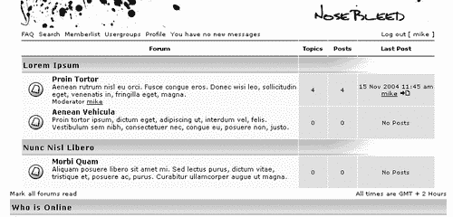

表格的其余部分看起来像这样：

```php
<!-- BEGIN catrow -->
<tr>
<td class="catLeft" colspan="2" height="28">
<span class="cattitle">
<a href="{catrow.U_VIEWCAT}" class="cattitle">{catrow.CAT_DESC}</a>
</span>
</td>
<td class="rowpic" colspan="3" align="right">
&nbsp;
</td>
</tr>
<!-- BEGIN forumrow -->
<tr>
<td class="row1" align="center" valign="middle" height="50">


</td>
<td class="row1" width="100%" height="50">
<span class="forumlink">
<a href="{catrow.forumrow.U_VIEWFORUM}" class="forumlink">{catrow.forumrow.FORUM_NAME}</a>
<br />
</span>
<span class="genmed">
{catrow.forumrow.FORUM_DESC}
<br />
</span>
<span class="gensmall">
{catrow.forumrow.L_MODERATOR} {catrow.forumrow.MODERATORS}
</span>
</td>
<td class="row2" align="center" valign="middle" height="50">
<span class="gensmall">
{catrow.forumrow.TOPICS}
</span>
</td>
<td class="row2" align="center" valign="middle" height="50">
<span class="gensmall">
{catrow.forumrow.POSTS}
</span>
</td>
<td class="row2" align="center" valign="middle" height="50" nowrap="nowrap">
<span class="gensmall">
{catrow.forumrow.LAST_POST}
</span>
</td>
</tr>
<!-- END forumrow -->
<!-- END catrow -->
</table>

```

`catrow` 和 `forumrow` 决定了数据库中找到的分类和论坛主题；它们使用上面的 HTML 代码来显示分类和主题，直到没有更多可找到，就像一个循环。如果我们从第一行表开始，我们会找到分类名称显示的地方：

```php
<tr>
<td class="catLeft" colspan="2" height="28">
<span class="cattitle">
<a href="{catrow.U_VIEWCAT}" class="cattitle">{catrow.CAT_DESC}</a>
</span>
</td>
<td class="rowpic" colspan="3" align="right">
&nbsp;
</td>
</tr>

```

再次，我们在 CSS 代码中查找使用的类，从 `catLeft` 开始：

```php
td.cat,td.catHead,td.catSides,td.catLeft,td.catRight,td.catBottom
{
background-image: url(templates/subSilver/images/{T_TH_CLASS1});
background-color:{T_TR_COLOR3};
border: {T_TH_COLOR3};
border-style: solid;
height: 28px;
}

```

注意，`catLeft` 并不是这一行中唯一的类。如果我们想让所有其他类都像这样显示，除了 `catLeft` 类，最简单的方法就是从列表中移除这个类，并将其变成它自己的类。但由于所有这些类都或多或少只关于显示背景颜色和图像，所以我们保留类在原处，并一次性更改它们。

对于这个模板，我们不会从这些课程中用到很多内容，所以我们将其改为：

```php
td.cat,td.catHead,td.catSides,td.catLeft,td.catRight,td.catBottom
{
/*
background-image: url(templates/subSilver/images/{T_TH_CLASS1});
background-color:{T_TR_COLOR3};
border: {T_TH_COLOR3};
border-style: solid;
*/
height: 28px;
}

```

我们现在保留高度。

我们接下来要查找的类叫做 `rowpic`。它实际上为我们论坛做的只是显示一个除了 `catLeft` 之外的背景图像，所以方法是一样的。如果你想在你分类文字后面有一个不同于 `catLeft` 的图像背景，你可以使用这个。但由于我们不需要任何图像，我们可以从表格中移除这个类。

在完成这些操作后，我们的表格应该看起来像这样：

```php
<tr>
<td class="catLeft" colspan="5" height="28">
<span class="cattitle">
<a href="{catrow.U_VIEWCAT}" class="cattitle">{catrow.CAT_DESC}</a>
</span>
</td>
</tr>

```

分类描述由 `cattitle` 类决定，我们可以在 CSS 这里找到它：

```php
/* Forum category titles */
.cattitle {
font-weight: bold;
font-size: {T_FONTSIZE3}px;
letter-spacing: 1px;
color : {T_BODY_LINK}
}
a.cattitle {
text-decoration: none;
color : {T_BODY_LINK};
}
a.cattitle:hover {
text-decoration: underline;
}

```

这里没有太多需要更改的地方，除了字体稍微有点大；所以单词中每个字母之间的一像素间距必须去掉。我们还可以添加一个 `a.cattitle: visited` 类。

现在这个类看起来是这样的：

```php
/* Forum category titles */
.cattitle {
font-weight: bold;
font-size: {T_FONTSIZE2}px;
color : {T_BODY_LINK}
}
a.cattitle {
text-decoration: none;
color : {T_BODY_LINK};
}
a.cattitle:visited {
text-decoration: none;
color : {T_BODY_LINK};
}
a.cattitle:hover {
text-decoration: underline;
}

```

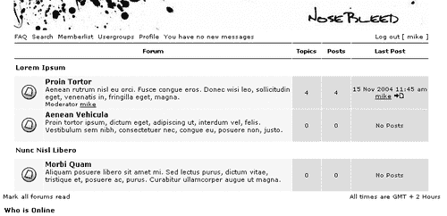

在我们的 `.tpl` 文件中向下移动，我们找到了论坛行。

```php
<!-- BEGIN forumrow -->
<tr>
<td class="row1" align="center" valign="middle" height="50">

</td>
<td class="row1" width="100%" height="50">
<span class="forumlink">
<a href="{catrow.forumrow.U_VIEWFORUM}" class="forumlink">{catrow.forumrow.FORUM_NAME}</a>
<br />
</span>
<span class="genmed">
{catrow.forumrow.FORUM_DESC}
<br />
</span>
<span class="gensmall">
{catrow.forumrow.L_MODERATOR} {catrow.forumrow.MODERATORS}
</span>
</td>
<td class="row2" align="center" valign="middle" height="50">
<span class="gensmall">
{catrow.forumrow.TOPICS}
</span>
</td>
<td class="row2" align="center" valign="middle" height="50">
<span class="gensmall">
{catrow.forumrow.POSTS}
</span>
</td>
<td class="row2" align="center" valign="middle" height="50" nowrap="nowrap">
<span class="gensmall">
{catrow.forumrow.LAST_POST}
</span>
</td>
</tr>
<!-- END forumrow -->

```

CSS 中的 `row1, row2` 和 `row3` 类决定了我们模板的背景颜色。它们由 `{T_TR_COLOR1}, {T_TR_COLOR2}` 和 `{T_TR_COLOR3}` 定义，这些值再次在管理面板中由 **Table Row Color 1, Table Row Color 2** 和 **Table Row Color 3** 定义。根据布局想法，我们已经决定使用浅灰色，以匹配模板的 `top_image`。我们不需要在 CSS 代码中做任何更改，但从管理面板中，我们添加了新的值 `F3F3F3, EBEBEB` 和 `E3E3E3`，第一个颜色与 `top_image.jpg` 中的颜色相同，其他颜色略深。

在我们的表格中接下来是文件夹图像，由 `{catrow.forumrow.FORUM_FOLDER_IMG}` 变量定义。我们这里不想做任何更改。在后面的章节中，我们将看到如何创建新的图标和图像。`forumlink` 类决定了描述论坛的文本的字体应该是什么样子。在 CSS 中，我们找到了以下内容：

```php
/* Forum title: Text and link to the forums used in: index.php */
.forumlink {
font-weight: bold;
font-size: {T_FONTSIZE3}px;
color : {T_BODY_LINK};
}
a.forumlink {
text-decoration: none;
color : {T_BODY_LINK};
}
a.forumlink:hover {
text-decoration: underline;
color : {T_BODY_HLINK};
}

```

这里没有太多需要更改的地方，除了可能将字体大小从 `{T_FONTSIZE3}` 更改为 `{T_FONTSIZE2}`，以及将悬停颜色从 `{T_BODY_HLINK}` 更改为 `{T_BODY_LINK}`。`{T_BODY_HLINK}` 是来自管理面板的链接悬停设置，但这里不需要不同的颜色。更改后的类现在看起来是这样的：

```php
/* Forum title: Text and link to the forums used in: index.php */
.forumlink {
font-weight: bold;
font-size: {T_FONTSIZE2}px;
color : {T_BODY_LINK};
}
a.forumlink {
text-decoration: none;
color : {T_BODY_LINK};
}
a.forumlink:visited {
text-decoration: none;
color : {T_BODY_LINK};
}
a.forumlink:hover {
text-decoration: underline;
color : {T_BODY_LINK};
}

```

如您现在可能已经注意到的，更改 CSS 并不是特别困难，我将尽力在本章的其余部分避免详细描述。

下一步要更改的是将 CSS 中的 `genmed` 类的大小更改为 `{T_FONTSIZE1}`，使其稍微小一些。

我们现在几乎完成了这个表格，但表格行中的文本离边缘真的很近。我对这一点不太满意，解决这个问题的方法之一是将表格的 `cellpadding` 值从 `2` 更改为 `4`。另一种方法是在 CSS 类中添加一个填充定义，甚至可以创建一个新的类并将其添加到表格中。我们在这里选择了第一种解决方案。

最后，为了使论坛更加生动，我们在表格行上添加了一个悬停效果，这意味着当鼠标悬停时，它会改变颜色，同时整个表格行将作为一个链接工作。

我们现在的表格应该看起来是这样的：

```php
<table width="717" align="center" cellpadding="4" cellspacing="1" border="0" class="forumline">
<tr>
<th colspan="2" class="thCornerL" height="25" nowrap="nowrap">
&nbsp;{L_FORUM}&nbsp;
</th>
<th width="50" class="thTop" nowrap="nowrap">
&nbsp;{L_TOPICS}&nbsp;
</th>
<th width="50" class="thTop" nowrap="nowrap">
&nbsp;{L_POSTS}&nbsp;
</th>
<th class="thCornerR" nowrap="nowrap">
&nbsp;{L_LASTPOST}&nbsp;
</th>
</tr>
<!-- BEGIN catrow -->
<tr>
<td class="catLeft" colspan="5" height="28">
<span class="cattitle">
<a href="{catrow.U_VIEWCAT}" class="cattitle">{catrow.CAT_DESC}</a>
</span>
</td>
</tr>
<!-- BEGIN forumrow -->
<tr>
<td class="row1" align="center" valign="middle" height="50">

</td>
<td class="row1" width="100%" height="50"
onmouseover="this.style.backgroundcolor=’{T_TR_COLOR2}’;
this.style.cursor=’pointer’;"
onmouseout=this.style.backgroundcolor=""
onclick="window.location.href=’{catrow.forumrow.U_VIEWFORUM}’">
<span class="forumlink">
<a href="{catrow.forumrow.U_VIEWFORUM}" class="forumlink">{catrow.forumrow.FORUM_NAME}</a>
<br />
</span>
<span class="genmed">
{catrow.forumrow.FORUM_DESC}
<br />
</span>
<span class="gensmall">
{catrow.forumrow.L_MODERATOR} {catrow.forumrow.MODERATORS}
</span>
</td>
<td class="row2" align="center" valign="middle" height="50">
<span class="gensmall">
{catrow.forumrow.TOPICS}
</span>
</td>
<td class="row2" align="center" valign="middle" height="50">
<span class="gensmall">
{catrow.forumrow.POSTS}
</span>
</td>
<td class="row2" align="center" valign="middle" height="50" nowrap="nowrap">
<span class="gensmall">
{catrow.forumrow.LAST_POST}
</span>
</td>
</tr>
<!-- END forumrow -->
<!-- END catrow -->
</table>

```

我们 `index_body.tpl` 文件中的下一个表格显示了“标记所有论坛”的链接以及论坛的时间和时区：

```php
<table width="100%" cellspacing="0" border="0" align="center" cellpadding="2">
<tr>
<td align="left">
<span class="gensmall">
<a href="{U_MARK_READ}" class="gensmall">{L_MARK_FORUMS_READ}</a>
</span>
</td>
<td align="right">
<span class="gensmall">
{S_TIMEZONE}
</span>
</td>
</tr>
</table>

```

看起来相当不错；唯一需要更改的是宽度从 100% 更改为 717 像素；此外，我们希望将 CSS 中的 `gensmall` 类更改为黑色链接，而不是红色，这与我们对 `mainmenu` 类所做的类似。

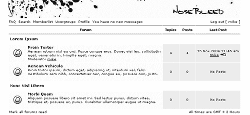

这就处理了论坛的主要部分。

`index_body.tpl` 文件的下一部分是显示谁在线以及其他与论坛用户相关的信息的表格。这个表格只在这个 `.tpl` 文件中，在我看来，它并不是论坛本身的一部分，而更像是一些额外添加的内容。因此，我们将这部分插入到页面底部，并且在这里添加我们从文件顶部移除的所有额外链接。我们可以将它们全部放在一个表格中，给它添加 `thTop` 类，这样它上面和下面就会有黑色线条，就像我们处理菜单时那样。

为了在表格周围添加一点空间，我们在表格的开始和结束处插入一个高度为十像素的额外表格行。

新的表格看起来如下：

```php
<table align="center" width="717" border="0" cellspacing="0" cellpadding="0">
<tr height="10"><td>&nsbp;</td></tr>
<tr>
<th colspan="2" class="thTop" height="25" nowrap="nowrap">
<table width="717" cellspacing="0" cellpadding="2"
border="0" align="center">
<tr>
<td align="left" valign="bottom">
<span class="gensmall">
<!-- BEGIN switch_user_logged_in -->
{LAST_VISIT_DATE}
<br />
<!-- END switch_user_logged_in -->
{CURRENT_TIME}
<br />
</span>
<span class="nav">
<a href="{U_INDEX}" class="nav">{L_INDEX}</a>
</span>
</td>
<td align="right" valign="bottom" class="gensmall">
<!-- BEGIN switch_user_logged_in -->
<a href="{U_SEARCH_NEW}" class="gensmall">{L_SEARCH_NEW}</a>
<br />
<a href="{U_SEARCH_SELF}" class="gensmall">{L_SEARCH_SELF}</a>
<br />
<!-- END switch_user_logged_in -->
<a href="{U_SEARCH_UNANSWERED}" class="gensmall">{L_SEARCH_UNANSWERED}</a>
</td>
</tr>
</table></th>
</tr>
<tr height="10"><td>&nsbp;</td></tr>
</table>

```

现在我们可以删除 `.tpl` 文件底部的表格（我们最初从顶部移动的那个）。

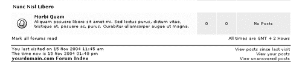

现在我们可以处理下一个表格了，它显示论坛用户的信息。这里只有几个改动：宽度应该是 717 像素而不是 100%，并且我们需要添加一个 `align="center"` 标签。

在这个表格下面还有另一个表格，其中有一个变量显示过去五分钟内的活跃用户数量。改变宽度并像上面的表格那样对齐，也能纠正这个表格。

接下来是登录表格，它被 `<!-- BEGIN switch_user_logged_out -->` 和 `<!-- BEGIN switch_user_logged_out -->` 标签包围，以确保只有未登录的用户才能看到这个表格。如果你想将登录信息显示在网站顶部，只需将其复制粘贴到你想放置的位置即可。对于这个模板来说，它现在所在的位置是合适的，而且再次强调，必要的更改只有宽度和对齐方式。

这里有一点需要注意：`<form...>` 元素。在某些浏览器中，添加一个表单后，该元素也会在上部和下部添加一个边距，几乎让人感觉你已经在 HTML 代码的上部和下部添加了一个换行符。为了防止这种情况，请在 CSS 中添加这个类：

```php
/* Form */
form {
margin: 0px;
padding: 0px;
}

```

现在我们可以手动添加换行符，在表单的上方和下方，并确保它在不同的浏览器中均匀显示。

`index_body.tpl` 文件的最后一部分显示了论坛的图标。我们将在本章的后面部分回到这个问题，现在保持它不变。下面的截图显示了到目前为止所做的更改后我们的论坛看起来是什么样子：

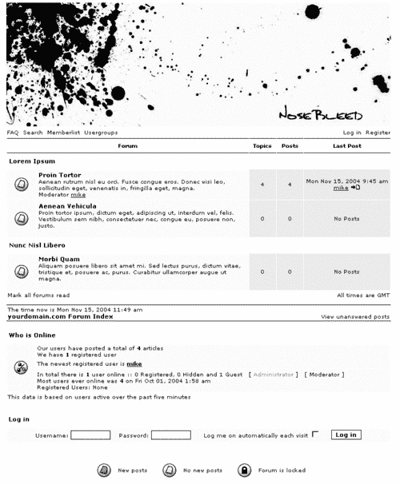

# 修改 viewforum_body.tpl 中的论坛主体

我们接下来要编辑的文件是 `viewforum_body.tpl` 模板。这是显示索引之后的论坛内容的文件。以下是编辑 `.tpl` 文件之前我们的论坛看起来是什么样子：

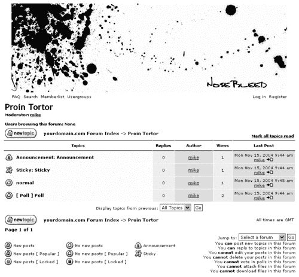

`viewforum.tpl` 中的第一行代码是一个表单对象，我们保持其不变。同样地，与 `index_body.tpl` 一样，我们将第一个表格移动到文件末尾，这样我们就可以在菜单下方出现黑色线条。在代码的开始部分，我们现在有以下表格：

```php
<table border="0" cellpadding="4" cellspacing="1" width="100%" class="forumline">
<tr>
<th colspan="2" align="center" height="25" class="thCornerL" nowrap="nowrap">
&nbsp;{L_TOPICS}&nbsp;
</th>
<th width="50" align="center" class="thTop" nowrap="nowrap">
&nbsp;{L_REPLIES}&nbsp;
</th>
<th width="100" align="center" class="thTop" nowrap="nowrap">
&nbsp;{L_AUTHOR}&nbsp;
</th>
<th width="50" align="center" class="thTop" nowrap="nowrap">
&nbsp;{L_VIEWS}&nbsp;
</th>
<th align="center" class="thCornerR" nowrap="nowrap">
&nbsp;{L_LASTPOST}&nbsp;
</th>
</tr>
<!-- BEGIN topicrow -->
<tr>
<td class="row1" align="center" valign="middle" width="20">

</td>
<td class="row1" width="100%">
<span class="topictitle">
{topicrow.NEWEST_POST_IMG}{topicrow.TOPIC_TYPE}
<a href="{topicrow.U_VIEW_TOPIC}" class="topictitle">{topicrow.TOPIC_TITLE}</a>
</span>
<span class="gensmall">
<br />
{topicrow.GOTO_PAGE}
</span>
</td>
<td class="row2" align="center" valign="middle">
<span class="postdetails">
{topicrow.REPLIES}
</span>
</td>
<td class="row3" align="center" valign="middle">
<span class="name">
{topicrow.TOPIC_AUTHOR}
</span>
</td>
<td class="row2" align="center" valign="middle">
<span class="postdetails">
{topicrow.VIEWS}
</span>
</td>
<td class="row3Right" align="center" valign="middle" nowrap="nowrap">
<span class="postdetails">
{topicrow.LAST_POST_TIME}
<br />
{topicrow.LAST_POST_AUTHOR} {topicrow.LAST_POST_IMG}
</span>
</td>
</tr>
<!-- END topicrow -->
<!-- BEGIN switch_no_topics -->
<tr>
<td class="row1" colspan="6" height="30" align="center" valign="middle">
<span class="gen">
{L_NO_TOPICS}
</span>
</td>
</tr>
<!-- END switch_no_topics -->
<tr>
<td class="catBottom" align="center" valign="middle" colspan="6" height="28">
<span class="genmed">
{L_DISPLAY_TOPICS}:&nbsp;{S_SELECT_TOPIC_DAYS}&nbsp;<input type="submit" class="liteoption" value="{L_GO}" name="submit" />
</span>
</td>
</tr>
</table>

```

同样，我们将宽度从 100% 更改为 717 像素，并使其居中对齐。

在黑色线条下方，论坛开始于灰色行。但为了使其与索引页面更好地匹配，我们添加了一个额外的表格行，包含两个链接：一个用于返回索引页面，另一个用于显示所选论坛的名称。我们不是将第一个链接显示为索引页面的完整名称，而是用 `<` 符号来保持其简短，我们在代码中使用 `&lt;` 来添加它。表格的上部分现在应该看起来如下：

```php
<table border="0" cellpadding="4" cellspacing="1" width="717" class="forumline" align="center">
<tr>
<th colspan="2" align="center" height="25" class="thCornerL" nowrap="nowrap">
&nbsp;{L_TOPICS}&nbsp;
</th>
<th width="50" align="center" class="thTop" nowrap="nowrap">
&nbsp;{L_REPLIES}&nbsp;
</th>
<th width="100" align="center" class="thTop" nowrap="nowrap">
&nbsp;{L_AUTHOR}&nbsp;
</th>
<th width="50" align="center" class="thTop" nowrap="nowrap">
&nbsp;{L_VIEWS}&nbsp;
</th>
<th align="center" class="thCornerR" nowrap="nowrap">
&nbsp;{L_LASTPOST}&nbsp;
</th>
</tr>
<tr>
<th colspan="6" align="left" height="28" class="nav" nowrap="nowrap">
<a href="{U_INDEX}" class="nav">&lt;</a>
&nbsp;&nbsp;
<a class="nav" href="{U_VIEW_FORUM}">{FORUM_NAME}</a>
</th>
</tr>

```

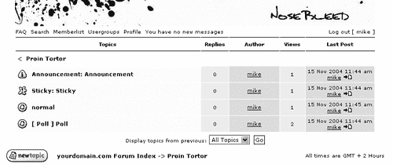

表格的下一段看起来如下：

```php
<!-- BEGIN topicrow -->
<tr>
<td class="row1" align="center" valign="middle" width="20">

</td>
<td class="row1" width="100%">
<span class="topictitle">
{topicrow.NEWEST_POST_IMG}{topicrow.TOPIC_TYPE}<a href="{topicrow.U_VIEW_TOPIC}" class="topictitle">{topicrow.TOPIC_TITLE}</a>
</span>
<span class="gensmall">
<br />
{topicrow.GOTO_PAGE}
</span>
</td>
<td class="row2" align="center" valign="middle">
<span class="postdetails">
{topicrow.REPLIES}
</span>
</td>
<td class="row3" align="center" valign="middle">
<span class="name">
{topicrow.TOPIC_AUTHOR}
</span>
</td>
<td class="row2" align="center" valign="middle">
<span class="postdetails">
{topicrow.VIEWS}
</span>
</td>
<td class="row3Right" align="center" valign="middle" nowrap="nowrap">
<span class="postdetails">
{topicrow.LAST_POST_TIME}
<br />
{topicrow.LAST_POST_AUTHOR} {topicrow.LAST_POST_IMG}
</span>
</td>
</tr>
<!-- END topicrow -->

```

这个部分将为每个主题循环，在 `<!-- BEGIN topicrow -->` 和 `<!-- END topicrow -->` 标签之间。请注意，这些行的背景颜色是 CSS 类 `row1, row2, row3` 和 `row3right`。我们可以更改一些事情，首先是行颜色，其次是主题作者的字体大小。这一行比周围的行要暗，看起来不太好，所以我们将其改为 `row2` 类。至于字体，这一行使用 `name` span 类，我们在 CSS 中将其更改为 `{T_FONTSIZE1}`。

主题的红色和粗体字体看起来也不太好，所以我们将其修改为我们在索引页面中也使用的小号和正常默认黑色字体。

这个类被称为 `topictitle`，在 CSS 中它看起来如下：

```php
/* titles for the topics: could specify viewed link colour too */
.topictitle,h1,h2 {
font-weight: bold;
font-size: {T_FONTSIZE2}px;
color : {T_BODY_TEXT};
}
a.topictitle:link {
text-decoration: none;
color : {T_BODY_LINK};
}
a.topictitle:visited {
text-decoration: none;
color : {T_BODY_VLINK};
}
a.topictitle:hover {
text-decoration: underline;
color : {T_BODY_HLINK};
}

```

... 我们将其更改为：

```php
/* titles for the topics: could specify viewed link colour too */
.topictitle,h1,h2 {
font-size: {T_FONTSIZE1}px;
color : {T_BODY_TEXT};
}
a.topictitle:link {
text-decoration: none;
color : {T_BODY_TEXT};
}
a.topictitle:visited {
text-decoration: none;
color : {T_BODY_TEXT};
}
a.topictitle:hover {
text-decoration: underline;
color : {T_BODY_TEXT};
}

```

我们几乎完成了这个部分。值得一提的是，当一个 **公告、置顶** 或 **投票** 帖子发布时，它将使用名为 `{topicrow.TOPIC_TYPE}` 的变量在主题名称前显示匹配的文本。为了匹配链接颜色，我们希望这段文本是红色而不是黑色，但同时又希望它使用 `topictitle` 类，就像其他文本一样。为了解决这个问题，我们在其周围添加了 `<span style="color: {T_BODY_LINK}">` 和 `</span>` 标签，这将仅更改文本的颜色，而不会更改大小或其他属性。

最后，一旦我们添加了与索引页面相同的悬停效果，这个部分现在应该看起来如下：

```php
<!-- BEGIN topicrow -->
<tr>
<td class="row1" align="center" valign="middle" width="20">

</td>
<td class="row1" width="100%"
onmouseover="this.style.backgroundcolor=’{T_TR_COLOR2}’;
this.style.cursor=’pointer’;"
onmouseOut=this.style.backgroundcolor=""
onclick="window.location.href=’{topicrow.U_VIEW_TOPIC}’">
<span class="topictitle">
{topicrow.NEWEST_POST_IMG}
<span style="color: {T_BODY_LINK}">
{topicrow.TOPIC_TYPE}
</span>
<a href="{topicrow.U_VIEW_TOPIC}" class="topictitle">{topicrow.TOPIC_TITLE}</a>
</span>
<span class="gensmall">
<br />
{topicrow.GOTO_PAGE}
</span>
</td>
<td class="row2" align="center" valign="middle">
<span class="postdetails">
{topicrow.REPLIES}
</span>
</td>
<td class="row2" align="center" valign="middle">
<span class="name">
{topicrow.TOPIC_AUTHOR}
</span>
</td>
<td class="row2" align="center" valign="middle">
<span class="postdetails">
{topicrow.VIEWS}
</span>
</td>
<td class="row3Right" align="center" valign="middle" nowrap="nowrap">
<span class="postdetails">
{topicrow.LAST_POST_TIME}
<br />
{topicrow.LAST_POST_AUTHOR} {topicrow.LAST_POST_IMG}
</span>
</td>
</tr>
<!-- END topicrow -->

```

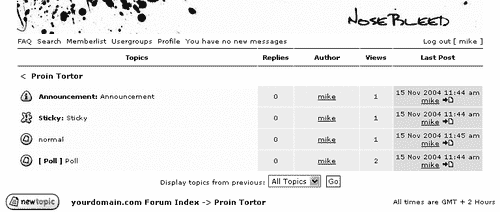

表格的下一段看起来如下：

```php
<!-- BEGIN switch_no_topics -->
<tr>
<td class="row1" colspan="6" height="30" align="center"
valign="middle">
<span class="gen">
{L_NO_TOPICS}
</span>
</td>
</tr>
<!-- END switch_no_topics -->

```

如果论坛中没有主题，将会显示如下内容。再次强调，字体大小有点太大，有两种方法可以更改它；要么将 `<span class="gen">` 改为 `<span class="gensmall">`，要么更改 `gen` 的 CSS 以使用不同的字体大小。在这里，我们选择后者，因为这个模板可能始终需要 `gen` 类使用较小的尺寸。

表格行现在看起来是空的且较窄，因此需要稍微大一点；我们在这里添加一些换行符，这样这个表格部分就完成了：

```php
<!-- BEGIN switch_no_topics -->
<tr>
<td class="row1" colspan="6" height="30" align="center" valign="middle">
<span class="gen">
<br />
{L_NO_TOPICS}
<br />
<br />
</span>
</td>
</tr>
<!-- END switch_no_topics -->

```

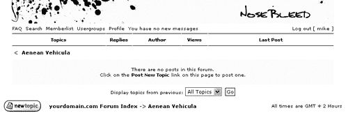

表格的最后部分看起来如下：

```php
<tr>
<td class="catBottom" align="center" valign="middle" colspan="6" height="28">
<span class="genmed">
{L_DISPLAY_TOPICS}:&nbsp;{S_SELECT_TOPIC_DAYS}&nbsp;<input type="submit" class="liteoption" value="{L_GO}" name="submit" />
</span>
</td>
</tr>
</table>

```

表格不是使用`row1`、`row2`或`row3`的灰色背景颜色，而是使用一个名为`catBottom`的类。我们在 CSS 中找到它如下：

```php
td.cat,td.catHead,td.catSides,td.catLeft,td.catRight,td.catBottom {
/*
background-image: url(templates/subSilver/images/{T_TH_CLASS1});
background-color:{T_TR_COLOR3};
border: {T_TH_COLOR3};
border-style: solid;
*/
height: 28px;
}

```

我们在之前移除菜单的背景颜色和图片时已经更改了这段代码。那时我们不需要它，所以我们添加了`/*`和`*/`注释标记。这只是为了我们的`catLeft`和`catRight`类，而现在我们需要为我们的`catBottom`做不同的事情。为了解决这个问题，我们必须从这个区域移除`catBottom`类，并在下面添加它自己的代码：

```php
td.cat,td.catHead,td.catSides,td.catLeft,td.catRight {
/*
background-image: url(templates/subSilver/images/{T_TH_CLASS1});
background-color:{T_TR_COLOR3};
border: {T_TH_COLOR3};
border-style: solid;
*/
height: 28px;
}
td.catBottom { background-color:{T_TR_COLOR3}; }

```

我们将其背景颜色设置为`{T_TR_COLOR3}`，这与`row3`相同，是灰色调中最深的。

## 调整跳转菜单的大小

在这个表格中需要修复的最后一件事情是跳转菜单和旁边的按钮的字体大小。跳转菜单和按钮的属性都在 CSS 中的`select`和`input`下：

```php
/* Form elements */
input,textarea, select {
color : {T_BODY_TEXT};
font: normal {T_FONTSIZE2}px {T_FONTFACE1};
border-color : {T_BODY_TEXT};
}

```

我们只需要更改字体大小为`{T_FONTSIZE1}`。

我们将`td`元素向右对齐，而不是保持居中，以便使菜单出现在右侧。

在`index_body.tpl`文件中，我们在主表之后有一个表格，看起来是这样的：

```php
<table width="717" cellspacing="0" border="0" align="center" cellpadding="2">
<tr>
<td align="left">
<span class="gensmall">
<a href="{U_MARK_READ}" class="gensmall">{L_MARK_FORUMS_READ}</a>
</span>
</td>
<td align="right">
<span class="gensmall">
{S_TIMEZONE}
</span>
</td>
</tr>
</table>

```

我们再次使用这个，但这次我们将`{L_MARK_FORUMS_READ}`变量更改为`{L_MARK_TOPICS_READ}`，然后粘贴在这里。

在`index_body.tpl`中的这个表格之后，是带有上下黑色线条的表格，看起来是这样的：

```php
<table align="center" width="717" border="0" cellspacing="0" cellpadding="0">
<tr height="10"><td></td></tr>
<tr>
<th colspan="2" class="thTop" height="25" nowrap="nowrap"><table width="717" cellspacing="0" cellpadding="2" border="0" align="center">
<tr>
<td align="left" valign="bottom">
<span class="gensmall">
<!-- BEGIN switch_user_logged_in -->
{LAST_VISIT_DATE}
<br />
<!-- END switch_user_logged_in -->
{CURRENT_TIME}
<br />
</span>
<span class="nav">
<a href="{U_INDEX}" class="nav">{L_INDEX}</a>
</span>
</td>
<td align="right" valign="bottom" class="gensmall">
<!-- BEGIN switch_user_logged_in -->
<a href="{U_SEARCH_NEW}" class="gensmall">{L_SEARCH_NEW}</a>
<br />
<a href="{U_SEARCH_SELF}" class="gensmall">{L_SEARCH_SELF}</a>
<br />
<!-- END switch_user_logged_in -->
<a href="{U_SEARCH_UNANSWERED}" class="gensmall">{L_SEARCH_UNANSWERED}</a>
</td>
</tr>
</table></th>
</tr>
<tr height="10"><td></td></tr>
</table>

```

我们将这个表格从`index.tpl`复制过来，并粘贴在这里。我们不再使用那里使用的变量，而是使用我们从原始第一个表格（之前移动到文件末尾的表格）中获得的变量。表格看起来如下：

```php
<table align="center" width="717" border="0" cellspacing="0" cellpadding="2">
<tr height="10"><td></td></tr>
<tr>
<th colspan="2" class="thTop" height="25" nowrap="nowrap">
<table align="left" width="100%" border="0" cellspacing="0" cellpadding="0">
<tr>
<td align="left" valign="top">
<span class="gensmall">
{L_MODERATOR}: {MODERATORS}
<br />
{LOGGED_IN_USER_LIST}
</span>
</td>
<td align="right" valign="top">
<span class="gensmall">
{PAGE_NUMBER}
<br />
{PAGINATION}
</span>
</td>
</tr>
<tr align="left" valign="top">
<td colspan="2">
<span class="nav">
<a href="{U_INDEX}" class="nav">{L_INDEX}</a>
&nbsp;&nbsp;~&nbsp;&nbsp;
<a class="nav" href="{U_VIEW_FORUM}">{FORUM_NAME}</a>
</span>
</td>
</tr>
</table>
</th>
</tr>
<tr height="10"><td></td></tr>
</table>

```

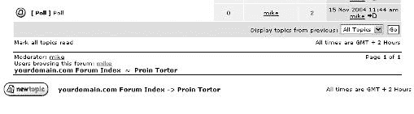

下一个表格看起来如下：

```php
<table width="100%" cellspacing="2" border="0" align="center"
cellpadding="2">
<tr>
<td align="left" valign="middle" width="50">
<a href="{U_POST_NEW_TOPIC}"></a>
</td>
<td align="left" valign="middle" width="100%">
<span class="nav">
&nbsp;&nbsp;&nbsp;
<a href="{U_INDEX}" class="nav">{L_INDEX}</a> -> <a class="nav" href="{U_VIEW_FORUM}">{FORUM_NAME}</a>
</span>
</td>
<td align="right" valign="middle" nowrap="nowrap">
<span class="gensmall">
{S_TIMEZONE}
</span>
<br />
<span class="nav">
{PAGINATION}
</span>
</td>
</tr>
<tr>
<td align="left" colspan="3">
<span class="nav">
{PAGE_NUMBER}
</span>
</td>
</tr>
</table>
</form>

```

这个表格包含**新建主题**按钮和表单的结束标签，但我们实际上并不需要再次使用其他变量，可以将表格缩减为如下：

```php
<table width="715" align="center" border="0" cellspacing="0" cellpadding="0">
<tr>
<td>
<a href="{U_POST_NEW_TOPIC}"></a>
</td>
</tr>
</table>
</form>

```

然后我们有一个带有跳转框的表格。我们只需要更改宽度和对齐方式，但在这里我们再次添加一个高度为十像素的额外表格行，只是为了在不同区域之间获得一些空间。

最后一个表格显示图标和用户可以在该主题中执行的操作列表，我们目前只需要修复宽度。

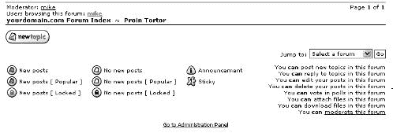

这就带我们来到了`viewforum_body.tpl`文件的末尾。

# 故事继续

其余的`.tpl`文件需要类似的编辑：在 CSS 中定位类，尽可能从先前编辑的文件中复制表格，并使用针对你正在处理的`.tpl`的特定 phpBB 变量。现在你应该对如何做有相当好的了解，因此，我们将在本章的其余部分总结它们的功能。

从`NoseBleed`文件夹的第一个文件开始：

### agreement.tpl

这是当访客想要注册时遇到的第一个页面。它解释了注册协议条款并检查访客的年龄。

### bbcode.tpl

这是 phpBB 用来显示引用和代码、电子邮件链接、帖子中的图片、URL 等文件的文件。例如，如果你不喜欢引用的显示方式，这就是你需要编辑的文件。

### confirm_body.tpl

如果用户需要通过“是”或“否”来确认某些内容，此文件将被显示。

### error_body.tpl

此文件显示错误信息。

### faq_body.tpl

此文件显示**常见问题解答**部分。

### forumIE.css

这是用于附加 CSS 代码，包含针对 IE 的特定格式定义。

### groupcp_info_body.tpl

此文件显示用户组信息和成员。

### groupcp_pending_info.tpl

此文件显示给用户组版主，以便他们允许或禁止待定用户加入用户组。

### groupcp_user_body.tpl

此文件显示所有用户组的概述，以及用户属于哪个用户组。

### index.htm

此文件显示模板设计者制作的一个图像。它被包含并显示，以防止网站访客查看文件夹中的文件。

### index_body.tpl

这是论坛的主页。

### jumpbox.tpl

此文件显示跳转框。

### login_body.tpl

此文件显示当有人想要登录时论坛的外观。

### memberlist_body.tpl

此文件显示论坛的注册用户。

### message_body.tpl

此文件显示 phpBB 向用户显示的确认消息；例如，在更改个人资料并点击提交按钮后，你会看到此文件，以确认你的个人资料已被更新。

### modcp_body.tpl

当版主想要审核一个帖子时，使用此文件。

### modcp_move.tpl

当版主想要移动一个主题时，使用此文件。

### modcp_split.tpl

当版主想要分割一个主题时，使用此文件。

### modcp_viewip.tpl

当版主想要查看所选帖子的用户的 IP 地址时，使用此文件。

### subSilver.tpl

这是模板的配置文件，应重命名为模板的名称，例如`NoseBleed.tpl`。它告诉 phpBB 在哪里可以找到模板的不同图像和图标。

### subSilver.css

这是模板的 CSS 文件，如果您想重新使用它，应将其重命名为模板的名称。默认情况下，它没有被使用；相反，CSS 代码位于`overall_header.tpl`文件的开始处。在本书的“最终润色”部分，您将看到如何将 CSS 移动到其自己的文件中，如果您试图节省带宽，您可能想要这样做。

### overall_footer.tpl

此文件几乎在所有页面的底部显示。它包含指向管理员面板和 phpBB 版权注明的链接。

### overall_header.tpl

此文件几乎在所有页面的顶部显示。默认情况下，它在文件开头包含 CSS 代码。

### posting_body.tpl

当用户发布新帖子时，此文件会显示。它还包含用于弹出窗口的 JavaScript 代码，当用户想要查看他们可以在帖子中使用的所有表情符号时使用。

### posting_poll_body.tpl

此文件显示如何将投票添加到帖子中，并且通过`posting_body.tpl`中的变量`{POLLBOX}`加载。

### posting_preview.tpl

此文件显示帖子预览的外观，并且通过`posting_body.tpl`中的变量`{POST_PREVIEW_BOX}`加载。

### posting_smilies.tpl

此文件在弹出窗口中显示用户可以在其帖子中使用的所有表情符号。此文件使用`simple_header.tpl`和`simple_footer.tpl`而不是`overall_header.tpl`和`overall_footer.tpl`。

### posting_topic_review.tpl

此文件在`posting_body.tpl`中的 iframe 中显示，使用`{TOPIC_REVIEW_BOX}`变量。此文件使用`simple_header.tpl`和`simple_footer.tpl`而不是`overall_header.tpl`和`overall_footer.tpl`。

### privmsgs_body.tpl

此文件显示您所有的私人消息。

### privmsgs_popup.tpl

当用户收到新的私人消息时，当用户访问论坛时，会弹出一个小的弹出窗口告诉他们有关消息的内容。

此文件使用`simple_header.tpl`和`simple_footer.tpl`而不是`overall_header.tpl`和`overall_footer.tpl`。

### privmsgs_preview.tpl

此文件显示您的私人消息预览，通过`posting_body.tpl`中的变量`{POST_PREVIEW_BOX}`加载。

### privmsgs_read_body.tpl

当用户阅读私人消息时，此文件会显示。

### profile_add_body.tpl

当访客注册时，此文件会显示，并用于收集诸如用户名、密码、位置等信息。如果用户想要更改其个人资料设置，此文件也会显示。

### profile_avatar_gallery.tpl

此文件显示用户可以选择添加到其个人资料设置中的头像列表。

### profile_send_email.tpl

当用户向论坛中的另一位用户发送电子邮件时，此文件会显示。

### profile_send_pass.tpl

此文件显示如何找回遗忘的密码。

### profile_view_body.tpl

此文件显示已注册用户的个人资料。

### search_body.tpl

当用户搜索帖子或主题时，此文件会显示。

### search_results_posts.tpl

此文件仅显示包含搜索到的单词或表达式的帖子列表。

### search_results_topics.tpl

此文件仅显示包含搜索到的单词或表达式的主题列表。

### search_username.tpl

此文件在搜索用户名时显示一个弹出窗口。它通过变量`{U_SEARCH_USER}`从`posting_body.tpl`加载。此文件使用`simple_header.tpl`和`simple_footer.tpl`而不是`overall_header.tpl`和`overall_footer.tpl`。

### simple_footer.tpl

此文件替换了弹出窗口和 iframe 中的`overall_footer.tpl`。

### simple_header.tpl

此文件替换了弹出窗口和 iframe 中的`overall_header.tpl`。有时，只需从`overall_header.tpl`复制 CSS 并将其粘贴到`simple_header.tpl`中，就可以使弹出窗口和 iframe 的外观与模板的其余部分相匹配。

### theme_info.cfg

这是模板的配置文件。第一次安装时，模板使用此文件中默认的颜色、字体等值。如果您计划将模板发布给其他人，请确保此文件中有正确的值。您不需要手动输入所有这些值。如果您转到管理员面板，在样式管理下选择**导出**，phpBB 将创建一个新的`theme_info.cfg`文件，其中包含管理员面板中的所有字体和颜色设置。您可以下载并使用此文件。

### viewforum_body.tpl

此文件显示所选论坛中的主题列表。

### viewonline_body.tpl

此文件显示论坛上的用户和访客列表。

### viewtopic_body.tpl

此文件显示您论坛上的主题。

### viewtopic_poll_ballot.tpl

此文件显示主题中的投票表决。它通过`{POLL_DISPLAY}`变量从`viewtopic_body.tpl`加载。

### viewtopic_poll_result.tpl

此文件显示主题中的投票结果。它通过`{POLL_DISPLAY}`变量从`viewtopic_body.tpl`加载。

## 管理员文件夹

模板中`admin`文件夹中的文件控制管理员面板的显示方式。它们使用`page_header.tpl`和`page_footer.tpl`而不是`overall_header.tpl`和`overall_footer.tpl`。有时，只需从`overall_header.tpl`复制 CSS 并将其粘贴到`page_header.tpl`中，就可以使管理员面板与模板的其余部分相匹配。

# 图标和图片

模板中所有的图标和图片都位于`images`文件夹中。此文件夹包含另一个文件夹，其中包含特定语言的图片。这里有一点需要注意：**删除**的图标是通用的，并且仅通过图像中的**X**显示。如果我们想使我们的图像显示实际文本，如**删除**，我们应该将图像放置在特定语言文件夹中，在这种情况下是`lang_english`文件夹。由于 phpBB 不会在语言文件夹中查找**删除**图像，我们需要编辑`NoseBleed.cfg`文件。在代码中向下查找，我们发现如下内容：

```php
$images[‘icon_delpost’] = "$current_template_images/icon_delete.gif";

```

这是 phpBB 使用此图像的路径。添加 `{LANG}` 语言变量，我们可以指定新的路径：

```php
$images[‘icon_delpost’] = "$current_template_images/{LANG}/icon_delete.gif";

```

制作所有新的图片和图标可能会吓跑很多人，但这也有一线希望：我们不必从头开始。

在 [`www.phpbb.com/downloads.php#subSilver`](http://www.phpbb.com/downloads.php#subSilver) 可以下载原始 SDK 文件，然后使用 Photoshop、GIMP、Paint Shop Pro 和其他程序进行编辑。如果我们只想更改字体颜色、字体大小或背景，这是一个简单的解决方案。

对于 `NoseBleed` 模板，此文件被下载，图标字体和背景被更改，但语言按钮的小图标保持不变。

为了进一步简化图标和图像的使用，所有用于**无新主题**的图标都被更改为空白 GIF 文件；只有新主题会有图标。我们还从 `index_body.tpl` 和 `viewforum_body.tpl` 文件说明中移除了**无新主题**图标，因为它们现在只是空白图标。

# 最后的润色

模板现在基本完成，剩下要做的就是测试错误并优化它。请记住检查指向 `subSilver` 目录的链接，因为这些需要更改为我们新的模板文件夹。

我们还可以通过在管理员面板中使用**字体颜色 2**和**字体颜色 3**来更改索引页上的管理员和版主颜色。

优化模板的一种方法是将 CSS 放在自己的文件中，这样我们可以节省带宽并使论坛加载更快。为此，在您的浏览器中打开论坛，在网站上右键单击某个位置，然后选择**查看源代码**（在 IE 中）或**查看 | 源代码**或**源代码**（在其他浏览器中）。复制 `<style type="text/css">` 和 `</style>` 标签之间的所有 CSS 代码，并将其粘贴到模板的 CSS 文件中。上传新的 CSS 文件，并从 `overall_header.tpl` 中删除 CSS 代码。在 `overall_header.tpl` 的顶部，您会找到：

```php
<!-- link rel="stylesheet" href="templates/subSilver/{T_HEAD_STYLESHEET}" type="text/css" -->

```

...需要更改为：

```php
<link rel="stylesheet" href="templates/NoseBleed/{T_HEAD_STYLESHEET}"
type="text/css">

```

`{T_HEAD_STYLESHEET}` 变量使用 CSS 文件的默认名称，在本例中为 `NoseBleed.css`。如果您想将 CSS 文件命名为其他名称，请将此变量替换为您想要使用的 CSS 文件名称。

# 摘要

我们已经介绍了很多内容，但我们才刚刚开始。本章中解释的 HTML、JavaScript 和 CSS 代码仅仅是一个狭窄的介绍。随着持续的工作，您将发现新的技巧并获得更多的知识，从而实现更好的编码。然而，我希望到现在您已经获得了制作自己模板的基本技能和勇气。这可能看起来是一项艰巨的任务，毫无疑问，完成它需要一些时间，但当你开始时，你会发现它并不那么困难。

在几个活跃的模板开发社区中，你总能找到帮助、评论以及测试你模板的人；无论是位于[`www.phpbb.com/phpBB/`](http://www.phpbb.com/phpBB/)的 phpBB 社区，还是[`www.phpbbhacks.com/forums/`](http://www.phpbbhacks.com/forums/)的 phpBBHacks.com 支持论坛，都是充满非常有帮助的人的地方。
