# 第八章。编程 phpBB

我们已经学习了关于安装 phpBB、配置它以及根据我们社区的需求定制它的很多知识。现在是时候阅读本书的最后一章，也是最复杂的一章，描述你需要了解的内容才能编写新的自定义 phpBB 功能。

为了更好地理解本章，需要具备 PHP 编程知识和一些 SQL 知识，但即使你不熟悉 PHP，你仍然可以浏览示例，只是为了激发你的编程兴趣。谁知道呢，你可能喜欢你所看到的东西，并决定学习更多的 PHP。

本章不是对 phpBB 编程体验的全面指南，而是将专注于最常用的 phpBB 库和函数。本章从简单的“Hello phpBB World”脚本开始，逐渐过渡到包含更复杂的示例。在章节的结尾，你将开发一个全新的 phpBB 脚本，名为“What’s Up?”，它会在单个屏幕上显示你论坛中所有论坛的最新主题，同时尊重用户的特定权限。

在本章中，你将学习以下内容：

+   创建“Hello phpBB World!”脚本

+   与数据库一起工作

+   使用 phpBB 消息

+   phpBB 的多语言系统

+   使用 phpBB 模板

+   用户身份验证

+   其他有用的 phpBB 函数和编码标准

+   将所有这些组合起来创建一个新的 phpBB 插件脚本

# Hello phpBB World!

当你开始学习一门新的编程语言或技术时，这是一个传统；你首先学习做的事情是如何编写一个简单的应用程序，它只显示“Hello World!”。让我们看看如何在 phpBB 中做到这一点。

首先，为了给你一个目标的概念，这里是执行 Hello World 脚本的结果，在浏览器中显示。

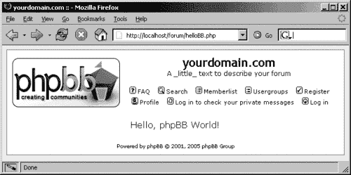

这是生成上述截图结果的代码。

```php
<?php
// set IN_PHPBB constant and include the initialization script
define(‘IN_PHPBB’, true);
$phpbb_root_path = ‘./’;
include($phpbb_root_path . ‘extension.inc’);
include($phpbb_root_path . ‘common.’.$phpEx);
// Start session management
$userdata = session_pagestart($user_ip, PAGE_INDEX);
init_userprefs($userdata);
// include page header
include($phpbb_root_path . ‘includes/page_header.’.$phpEx);
// say hello!
echo ‘<div align="center">Hello, phpBB World!</div>’;
// include page footer
include($phpbb_root_path . ‘includes/page_tail.’.$phpEx);
?>

```

为了在你的论坛上重现这个效果，你只需要创建一个名为，例如，`helloBB.php`的新空白文本文件，将前面的代码输入到文件中，保存它，并将其复制到你的论坛根目录。然后你可以使用你喜欢的浏览器访问新创建的脚本（如果你的论坛位于[`www.yourdomain.com/forum`](http://www.yourdomain.com/forum)，你可以转到[`www.yourdomain.com/forum/helloBB.php`](http://www.yourdomain.com/forum/helloBB.php)来访问此脚本）。

### 注意

本文件的源代码（以及本章中所有示例的源代码）可以从[`www.packtpub.com`](http://www.packtpub.com)下载。

在阅读解释之前，先看看代码；花点时间阅读它，看看你是否能弄清楚脚本中发生了什么。

脚本被分成由空行分隔的*五个代码块*。脚本的实际工作是在*第四个*块中完成的——那就是“Hello”所在的地方：

```php
// say hello!
echo ‘<div align="center">Hello, phpBB World!</div>’;

```

剩余的脚本正在为实际要执行的工作设置 phpBB 环境。你写的每个脚本都应该有相同的流程，因此你可以将此脚本作为所有未来脚本的模板，只需将“工作”部分替换为你需要的功能。话虽如此，你实际上并不需要了解第四个代码块之外发生的事情，但如果你好奇，这里有一些更多信息。

在*第一个*代码块中发生的情况如下：

1.  在第一行，定义了一个名为 `IN_PHPBB` 的常量。这是一项安全措施，将在本章稍后更详细地讨论。

1.  然后定义了 phpBB 的根目录，在这种情况下是当前目录，因为脚本位于 phpBB 根目录中。

1.  然后包含了一个简单的文件 `extension.inc`。它只定义了服务器上 PHP 文件的后缀。很可能是 `.php` 后缀。

1.  在第一个代码块的最后一条线，包含了一个非常重要的文件——`common.php`。这个脚本负责大多数 phpBB 环境的设置和配置。你可以查看其源代码以获取更多详细信息，但为了有一个大致的了解，这个脚本负责初始化论坛配置、建立数据库连接以及包含 phpBB 无法没有的其他库和函数。

*第二个*代码块负责调用两个处理会话数据和用户偏好的函数。*第三个*和*第五个*代码块分别包含 phpBB 图形用户界面的头部和尾部。头部是截图上 `Hello, phpBB World!` 行之前的所有内容，而尾部是之后的所有内容。如果你编写了一个特殊的脚本，例如弹出窗口脚本，你可能不一定需要头部和尾部。

既然我们已经了解了 phpBB 脚本的基本结构，让我们继续前进并从数据库中检索一些数据。

# 与数据库一起工作

phpBB 中的数据库连接是一个重要的话题，因此需要特别注意。本节提供了有关 phpBB 中使用的数据库抽象的背景信息，以及一些从数据库中检索数据的示例。

## 数据库抽象

如你所知，phpBB 可以与不同的数据库一起工作。为了在不重新编码整个系统的情况下实现这一结果，phpBB 采用了一种称为**数据库抽象**的编程技术。这仅仅意味着有几个脚本（类），针对每个支持的数据库系统特定，以不同的方式实现相同的结果。在这种情况下，其他 phpBB 脚本不需要了解特定的数据库系统，它们只需调用数据库抽象类的函数（类方法），然后它会在特定的数据库上完成工作。

例如，要在 MySQL 数据库上执行 SQL 查询，PHP 脚本使用 `mysql_query()` 函数。要在 MS Access 数据库上执行相同的操作，则使用 `odbc_exec()`。因此，作为数据库抽象机制的一部分，phpBB 定义了针对不同数据库系统的独立类：一个用于 MySQL，一个用于 MS Access，以及其他支持的 RDBMS。这些类有不同的实现，但共享相同的“公共接口”，这意味着所有类都有相同的一组函数（方法）。因此，当您想要执行 SQL 查询时，您只需使用 phpBB 数据库抽象层的 `sql_query()` 方法，而无需了解此方法是如何实现的以及使用了哪种底层数据库系统。抽象并关注更重要的事情，同时让其他类负责一些细节——这就是面向对象编程的美丽之处！

在 `common.php` 脚本（我们之前提到过）中，为您建立了数据库连接，并定义了 `$db` 变量，其中包含适当的数据库类的对象。同样，您不必关心使用的是哪种数据库系统；您只需要了解 phpBB 抽象层的编程接口。这听起来可能像是我们在学习更多函数及其工作方式时遇到了更多的麻烦，但实际上这是一件好事，因为这样您只需编写一次代码，然后就可以在 phpBB 支持的任何数据库上重用您的代码。

关于数据库抽象的最后一件事——标准 SQL 命令的使用。如果您使用任何特定于特定 RDBMS 的 SQL 命令或函数，请注意，这种功能可能在其他系统中不存在。通常情况下，这不应该成为问题，因为您不会每天在不同的数据库之间切换，但您仍然应该知道这一点。

## 数据库抽象工作

让我们看看 phpBB 数据库抽象层的一个示例。您将创建一个脚本，显示到目前为止在论坛上使用了多少个单词。phpBB 有一个全文搜索系统，将所有使用的单词存储到数据库表中。因此，为了示例的目的，您只需要计算这个表中的行数。

为了帮助您可视化目标，以下是脚本执行的结果：


这是实现它的源代码：

```php
<?php
// set IN_PHPBB constant and include the initialization script
define(‘IN_PHPBB’, true);
$phpbb_root_path = ‘./’;
include($phpbb_root_path . ‘extension.inc’);
include($phpbb_root_path . ‘common.’.$phpEx);
// Start session management
$userdata = session_pagestart($user_ip, PAGE_INDEX);
init_userprefs($userdata);
// include page header
include($phpbb_root_path . ‘includes/page_header.’.$phpEx);
// the main script work starts here
$sql = "SELECT COUNT(*) FROM " . SEARCH_WORD_TABLE;
$result = $db->sql_query($sql);
if ( !$result )
{
message_die(GENERAL_ERROR, ‘Cannot execute query’, ‘’, __LINE__, __FILE__, $sql);
}
$row = $db->sql_fetchrow();
$word_count = $row[0];
echo ‘<div align="center">Hey, did you know that ‘. $word_count .’ words were used in my board so far!?</div>’;
// end of the script work
// include page footer
include($phpbb_root_path . ‘includes/page_tail.’.$phpEx);
?>

```

将此代码保存到名为 `phpBBdb.php` 的文件中（或从书籍的代码下载中获取），将文件复制到您的 phpBB 根目录，并在浏览器中尝试运行。

如您所见，此脚本遵循了上一个脚本的结构，只是“工作”部分发生了变化。让我们详细讨论一下这部分。

首先，我们从要执行的 SQL 查询开始。

```php
$sql = "SELECT COUNT(*) FROM " . SEARCH_WORD_TABLE;

```

在这个查询中，`SEARCH_WORD_TABLE` 是一个常量，它定义了包含全文搜索数据的表名。如果你还记得，在安装过程中，你可以为数据库中的所有表指定一个表前缀。使用常量（如 `SEARCH_WORD_TABLE, POSTS_TABLE` 等）而不是硬编码的表名允许 phpBB 提供这个功能。你可以通过查看 `includes/constants.php` 脚本来了解所有数据库相关常量（以及其他常量）是如何定义的。默认情况下，表前缀是 `phpbb_`，因此，在将常量替换为其值后，查询将看起来像 `SELECT COUNT(*) FROM phpbb_search_wordlist`;。

现在我们来看看下一行代码。

```php
$result = $db->sql_query($sql);

```

这行代码通过调用适当 DB 抽象类的实例的 `sql_query()` 方法来执行 SQL 查询（你不需要担心这个）。

这之后是：

```php
if ( !$result )
{
message_die(GENERAL_ERROR, ‘Cannot execute query’, ‘’,
__LINE__, __FILE__, $sql);
}

```

这些行检查查询是否成功执行。如果没有，将显示错误消息（你将在稍后了解更多关于这些消息的内容）。查询成功执行后，就是获取执行结果的时候了。（phpBB 抽象层提供了多种方法来实现这一点，稍后将会讨论。）

```php
$row = $db->sql_fetchrow();

```

这行代码将结果行作为数组获取，并将其分配给一个名为 `$row` 的变量。在这种情况下，只返回了一行（记录），实际上只返回了一个字段。因此 `$row[0]` 将包含我们想要的价值。零代表返回结果行中的偏移量为零。

```php
$word_count = $row[0];

```

最后剩下的事情是使用 `echo` 显示值。

```php
echo ‘<div align="center">Hey, did you know that ‘. $word_count .’ words were used in my board so far!?</div>’;

```

## 使用 phpBB 数据库抽象层

我们提到，有几种方法可以从查询执行的结果中检索数据，在执行 `sql_query()` 查询之后。让我们看看选项。

### 选项 1

这里使用的示例是 `sql_fetchrow()` 方法。此方法以枚举和关联数组的形式返回结果。关联数组的键是结果集中的字段名——上面提到的相同结果可以通过使用以下方式实现：

```php
$word_count = $row[‘COUNT(*)’];

```

显然，上面的方式不太方便输入。更好的选择是使用：

```php
$word_count = $row[‘words’];

```

如果将查询稍微修改一下，使用 `words` 作为 `COUNT(*)` 的别名，这将有效：

```php
$sql = "SELECT COUNT(*) AS words FROM " . SEARCH_WORD_TABLE;

```

### 选项 2

从执行查询的结果中获取结果的另一种方式是使用 `sql_fetchrowset()` 方法。它的工作方式类似于 `sql_fetchrow()`，只不过它返回由查询匹配的所有记录的数据。如果你使用 `sql_fetchrow()`，你必须在一个循环中调用此方法，直到达到结果集的末尾，而 `sql_fetchrowset()` 返回所有结果，并且你通过结果数组进行循环。第二个选项相对友好一些，但因为它需要将结果集作为数组复制到内存中，所以消耗更多的内存。因此，不建议与将返回大量结果集的查询一起使用，但对于较小的“日常”查询来说是可以的。

为了说明区别，你可以 `print_r()` 两个函数的结果。从 `sql_fetchrow()`，你会得到类似以下的内容：

```php
Array
(
[0] => 71
[COUNT(*)] => 71
)

```

..并且从 `sql_fetchrowset()`，你会得到：

```php
Array
(
[0] => Array
(
[0] => 71
[COUNT(*)] => 71
)
)

```

### 选项 3

从执行查询的结果中获取结果的另一种方法是使用 `sql_fetchfield()`，它只返回一个字段的值，并且这个字段是通过名称引用的。为了从之前的示例中获得预期的结果，你可以使用：

```php
$word_count = $db->sql_fetchfield(‘COUNT(*)’);

```

如果你不知道字段名称，但知道它在结果集行中的偏移量，你可以使用 `sql_fieldname()` 方法，如下所示：

```php
$word_count = $db->sql_fetchfield($db->sql_fieldname(0));

```

在这里，零是你感兴趣的字段的偏移量。

# 使用 phpBB 消息

在之前的示例中，你已经看到了 phpBB 消息的使用方法。现在，是时候更仔细地查看这些消息并在实际操作中测试它们了。

为了看到 phpBB 消息的实际效果，你可以简单地使用之前的示例，但这次，在 SQL 字符串中引入一个无效命令；例如：

```php
$sql = "HEY, GO AHEAD AND SELECT COUNT(*) FROM " . SEARCH_WORD_TABLE;

```

如果你将刚刚修改的文件保存为 `phpBBmessage.php` 并在浏览器中预览，你会看到一个由无效 SQL 字符串引起的错误消息。

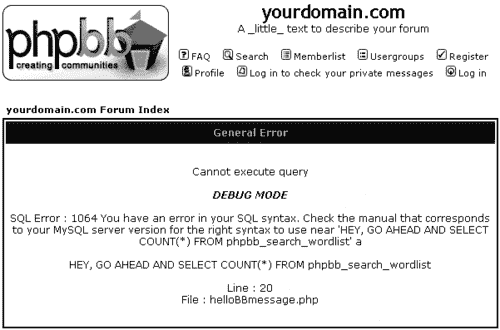

这条消息是由以下示例中的代码引起的：

```php
if ( !$result )
{
message_die(GENERAL_ERROR, ‘Cannot execute query’, ‘’, __LINE__, __FILE__, $sql);
}

```

这里使用了 phpBB 中可用的 `message_die()` 函数。你看到所有错误细节，因为论坛处于调试模式。在生产环境中（当你的论坛上线时），关闭调试模式是个好主意。你可以通过更改 `includes` 文件夹中的 `constants.php` 脚本中的一行来实现这一点。调试设置代码位于 `constants.php` 脚本的顶部。确保 `DEBUG` 常量设置为 `0`，如下所示：

```php
// Debug Level
//define(‘DEBUG’, 1); // Debugging on
define(‘DEBUG’, 0); // Debugging off

```

如果禁用了调试模式，上述消息将不那么冗长：

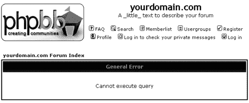

`message_die()` phpBB 函数可以用于除错误消息以外的其他目的。例如，它可以用来显示比之前章节中讨论的数据库示例（`helloBBdb.php`）更友好的结果。在这个数据库示例中，更改以下行：

```php
echo ‘<div align="center">Hey, did you know that ‘. $word_count .’ words were used in my board so far!?</div>’;

```

到：

```php
message_die(GENERAL_MESSAGE,
‘Hey, did you know that ‘. $word_count .’ words were used in my board so far!?’,
‘Word count’);

```

将其保存为 `helloBBmessage2.php` 并在浏览器中查看。结果将是：

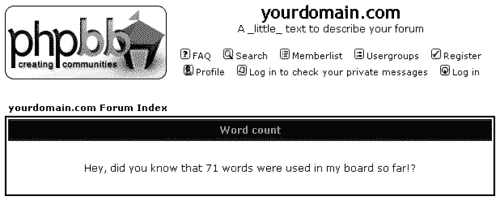

这里有一些关于你可以用于调用 `message_die()` 的六个函数参数的信息：

+   **消息类型**：可以是 `GENERAL_MESSAGE, CRITICAL_MESSAGE, GENERAL_ERROR` 或 `CRITICAL_ERROR`，具体取决于消息的严重性。

+   **消息文本**：可以是你想传达给用户的任何内容。

+   **消息标题**：如果你不提供它，将使用基于消息类型的默认标题。在最后一个示例中，标题是 **单词计数**。

+   **错误行**（仅限调试模式）：这包含脚本中发生错误的行。传递此参数的方法只是使用 PHP 核心常量 `__LINE__`。

+   **错误文件**：（仅用于调试模式）：这是导致错误的脚本的文件名。与前面的参数一样，这里只需使用 `__FILE__`。

+   **SQL**：与错误相关的 SQL 字符串（如果有）。

在所有函数参数中，只有第一个（消息类型）是必需参数：其余的都是可选的。

# 使用 phpBB 的多语言系统

在前面的示例中，显示了一些文本给用户。这些文本的问题在于它们只使用英语，可能不会被使用非英语浏览你论坛的访客理解。为了为你的自定义脚本提供多语言支持，你可以利用 phpBB 的多语言系统。

你的 phpBB 安装的语言文件夹包含每个已安装语言的子文件夹，例如 `lang_english, lang_spanish` 等。这些文件夹包含许多文件，但你最感兴趣的文件是名为 `lang_main.php` 的文件。此文件包含静态文本，定义为名为 `$lang` 的关联数组中的元素。例如：

```php
$lang[‘Guest’] = ‘Guest’;
$lang[‘Post_subject’] = ‘Post subject’;
$lang[‘View_next_topic’] = ‘View next topic’;

```

在此文件末尾（在 "That’s `all, Folks!"` 注释之前）您可以添加您的文本作为新的数组元素。在先前的示例 (`helloBBmessage2.php`) 中使用了两个文本：`Word count` 和 `Hey, did you know that` *(此处为单词数量)* `words were used in my board so far!?`。您可以在 `lang_main.php` 中如下定义它们：

```php
$lang[‘Word_count_title’] = ‘Word count’;
$lang[‘Word_count_message’] = ‘Hey, did you know that <strong>%d</strong> words were used in my board so far!?’;

```

`%d` 用作实际单词数量的占位符，并在你的脚本中替换。你可以使用任何作为可替换占位符的内容，但 phpBB 团队采用了 PHP `printf()` 函数的使用。有关 `printf()` 和 `sprintf()` 如何工作的详细信息，你可以查阅 PHP 手册条目 [`php.net/printf`](http://php.net/printf) 和 [`php.net/sprintf`](http://php.net/sprintf)。

你可能已经注意到了消息文本中有一点点变化。嗯，为了使消息有些不同，同时测试 HTML 的支持情况，单词计数值 `%d` 被包含在 `<strong>` HTML 标签中以强调单词数量。

现在您的文本已位于 `lang_main.php` 文件中，每次访问脚本时它们都会自动初始化。因此，您可以通过将 `message_die()` 的调用更改为以下内容来在脚本中使用它们：

```php
message_die(GENERAL_MESSAGE,
sprintf($lang[‘Word_count_message’], $word_count),
$lang[‘Word_count_title’]);

```

这里是修改后的脚本完整列表。您可以将其保存为 `helloBBlangs.php` 并在您的论坛上测试它。别忘了对 `lang_main.php` 进行更改，如果您的论坛使用多种语言，别忘了您需要将文本翻译并添加到相应语言的目录中的 `lang_main.php` 脚本中。

```php
<?php
// set IN_PHPBB constant and include the initialization script
define(‘IN_PHPBB’, true);
$phpbb_root_path = ‘./’;
include($phpbb_root_path . ‘extension.inc’);
include($phpbb_root_path . ‘common.’.$phpEx);
// Start session management
$userdata = session_pagestart($user_ip, PAGE_INDEX);
init_userprefs($userdata);
// include page header
include($phpbb_root_path . ‘includes/page_header.’.$phpEx);
// the main script work starts here
$sql = "SELECT COUNT(*) FROM " . SEARCH_WORD_TABLE;
$result = $db->sql_query($sql);
if ( !$result )
{
message_die(GENERAL_ERROR, ‘Cannot execute query’, ‘’, __LINE__, __FILE__, $sql);
}
$row = $db->sql_fetchrow();
$word_count = $row[0];
message_die(GENERAL_MESSAGE,
sprintf($lang[‘Word_count_message’], $word_count),
$lang[‘Word_count_title’]);
// end of the script work
// include page footer
include($phpbb_root_path . ‘includes/page_tail.’.$phpEx);
?>

```

这里是执行 `helloBBlangs.php` 的结果：

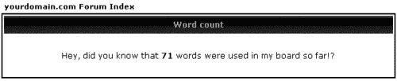

# 使用 phpBB 模板

在之前的示例中，没有涉及太多图形用户界面工作，但通常情况下，如果您正在开发新的 phpBB 脚本或扩展现有的脚本，那么通常会有。将编程代码与用户界面分离通常是一种良好的编程实践，通常被称为“逻辑与展示的分离”。对于像 phpBB 这样的 Web 应用程序，这意味着将 PHP 代码和逻辑与用于向用户展示结果的 HTML 代码分离。

这通常是通过使用所谓的**模板系统**（模板引擎）来实现的，它由两部分组成：

+   包含显示内容规则的静态 HTML 模板文件；“规则”意味着格式、布局等。

+   PHP 逻辑用于在 HTML 模板中“填充空白”。

使用模板引擎可以通过仅更改静态 HTML 文件来完全改变论坛的外观，而不需要处理编程逻辑、数据库访问等。在第四章中详细讨论了创建新模板。

phpBB 有其自己的模板引擎，在这里讨论它是为了让您对如何在脚本中使用它有一个基本的了解。

您可以在 `includes` 文件夹中找到模板库脚本（`template.php`）。此文件包含名为 `Template` 的类的定义（代码），如果您感兴趣，可以查看其实现。对于编写 phpBB 脚本的目的，您只需要知道如何使用库，而不需要知道它是如何编写的（记住，这就是面向对象编程方法的美妙之处）。

为了使用模板类，需要创建该类的一个实例（一个对象）。在 phpBB 环境设置过程中已经为您创建了一个这样的对象。一旦包含页面头部脚本，就会初始化一个名为 `$template` 的变量，它包含 `Template` 类的对象。

## 一个简单示例

现在是时候创建一个新的、简单的模板了。创建（或从书籍代码下载中复制）以下文件（命名为 `wordcount.tpl` 并将其放置在 `templates/subSilver` 目录中）：

```php
<span class="nav"><a href="{U_INDEX}" class="nav">{L_INDEX}</a></span>
<div
align="center"
class="gen"
style="border: solid 2px #006699; padding: 10px; margin-top: 5px;"
>
{WORD_COUNT_MESSAGE}
</div>

```

在继续编写 PHP 代码之前，请看一下下面的截图；它显示了执行示例的结果。


之前指定的模板只负责截图的以下部分：

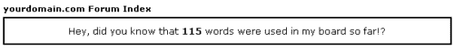

其余内容由默认的头部和尾部显示。

让我们看看如何实现这个结果。在脚本中使用模板功能有三个部分：

+   首先，您需要指定包含静态 HTML 的文件名（或文件名列表），使用 `$template->set_filenames()` 方法。

+   然后你使用 PHP 通过调用`$template->assign_vars()`或`$template->assign_block_vars()`来替换模板变量与数据。在阅读了第四章之后，你已经熟悉了模板变量及其语法；它们被大括号包围并大写，如`{I_AM_A_VAR}`。

+   最后，你调用`$template->pparse()`方法来显示结果。

这是使用前面列出的`wordcount.tpl`模板的 PHP 代码：

```php
// assemble the message text
$message_text = sprintf($lang[‘Word_count_message’], $word_count);
// set template file
$template->set_filenames(array(‘body’ => ‘wordcount.tpl’));
// assign template variables
$template->assign_vars(
array(
‘WORD_COUNT_MESSAGE’ => $message_text,
)
);
// process, parse and display
$template->pparse(‘body’);

```

在结果中显示了两个更多的模板变量，但它们没有使用`$template->assign_vars()`分配值——`U_INDEX`和`L_INDEX`。你不需要担心它们的原因是，它们在处理页面标题时已经被分配了。有关更多信息以及幕后处理变量的完整列表，请打开`includes/page_header.php`脚本，并将文件滚动到接近底部，在那里分配模板变量。

要测试这个例子，创建一个包含以下代码的`helloBBtemplates.php`文件，并在浏览器中导航到它（别忘了也将`wordcount.tpl`模板复制到`templates/subSilver`目录中）：

```php
<?php
// set IN_PHPBB constant and include the initialization script
define(‘IN_PHPBB’, true);
$phpbb_root_path = ‘./’;
include($phpbb_root_path . ‘extension.inc’);
include($phpbb_root_path . ‘common.’.$phpEx);
// Start session management
$userdata = session_pagestart($user_ip, PAGE_INDEX);
init_userprefs($userdata);
// include page header
include($phpbb_root_path . ‘includes/page_header.’.$phpEx);
// the main script work starts here
$sql = "SELECT COUNT(*) FROM " . SEARCH_WORD_TABLE;
$result = $db->sql_query($sql);
if ( !$result )
{
message_die(GENERAL_ERROR, ‘Cannot execute query’, ‘’, __LINE__, __FILE__, $sql);
}
$row = $db->sql_fetchrow();
$word_count = $row[0];
// assemble the message text
$message_text = sprintf($lang[‘Word_count_message’], $word_count);
// set template file
$template->set_filenames(array(‘body’ => ‘wordcount.tpl’));
// assign template variables
$template->assign_vars(
array(
‘WORD_COUNT_MESSAGE’ => $message_text,
)
);
// process, parse and display
$template->pparse(‘body’);
// end of the script work
// include page footer
include($phpbb_root_path . ‘includes/page_tail.’.$phpEx);
?>

```

## 在 phpBB 模板中使用循环

通常，仅分配静态模板变量是不够的；你需要具备在模板中使用循环等动态赋值的能力（例如，列出论坛中的所有主题是在执行循环，列出主题的所有回复也是循环，等等）。让我们通过一个例子来看看你如何使用循环。

这个例子显示了从一到十的数字。要在模板中设置循环，请使用**块变量**语法。

```php
<!-- BEGIN number_loop -->
{number_loop.NUMBER}
<!-- END number_loop -->

```

在这里`number_loop`是块的名字，`NUMBER`是一个变量。注意在循环中引用变量的点状语法，如`{number_loop.NUMBER}`。为了使它更有趣，并理解块内变量与块外变量的区别，添加另一个`{NUMBER}`变量，但这次与循环无关。在循环迭代期间，它将具有一个常量值。

这是模板的列表（将其保存为名为`example2.tpl`的文件，并将其放置在`templates/subSilver`中）：

```php
<span class="nav"><a href="{U_INDEX}" class="nav">{L_INDEX}</a></span>
<div
align="center"
class="gen"
style="border: solid 2px #006699; padding: 10px; margin-top: 5px;"
>
<!-- BEGIN number_loop -->
{NUMBER}{number_loop.NUMBER}
<!-- END number_loop -->
</div>

```

这是解析模板的 PHP 脚本（`helloBBtemplates2.php`）：

```php
<?php
// set IN_PHPBB constant and include the initialization script
define(‘IN_PHPBB’, true);
$phpbb_root_path = ‘./’;
include($phpbb_root_path . ‘extension.inc’);
include($phpbb_root_path . ‘common.’.$phpEx);
// Start session management
$userdata = session_pagestart($user_ip, PAGE_INDEX);
init_userprefs($userdata);
// include page header
include($phpbb_root_path . ‘includes/page_header.’.$phpEx);
// the main script work starts here
// set template file
$template->set_filenames(array(‘body’ => ‘example2.tpl’));
// assign template variables in a loop
for ($i = 1; $i<=10; $i++)
{
$template->assign_block_vars("number_loop",
array(
‘NUMBER’ => $i,
)
);
}
// assign a static variable
$template->assign_vars(
array(
‘NUMBER’ => ‘#’,
)
);
// process, parse and display
$template->pparse(‘body’);
// end of the script work
// include page footer
include($phpbb_root_path . ‘includes/page_tail.’.$phpEx);
?>

```

在浏览器中执行`helloBBtemplates2.php`的结果：

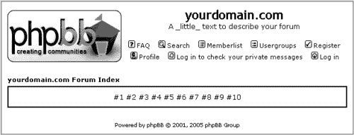

## 在 phpBB 模板中使用条件

有时你可能想根据某些“if”条件（一个“switch”）有条件地向用户显示数据。要使用 phpBB 模板引擎执行此操作，请使用与处理循环时相同的**块变量**。

下一个例子与上一个例子非常相似；它列出了从一到十的数字。但是，它使用了一个“if”条件来显示偶数，以便以粗体字体显示。

这是模板。将其保存为`example3.tpl`在`templates/subSilver`中：

```php
<span class="nav"><a href="{U_INDEX}" class="nav">{L_INDEX}</a> </span>
<div
align="center"
class="gen"
style="border: solid 2px #006699; padding: 10px; margin-top: 5px;"
>
<!-- BEGIN number_loop -->
<!-- BEGIN odd_switch -->
{NUMBER}{number_loop.odd_switch.NUMBER}
<!-- END odd_switch -->
<!-- BEGIN even_switch -->
<strong>{NUMBER}{number_loop.even_switch.NUMBER}</strong>
<!-- END even_switch -->
<!-- END number_loop -->
</div>

```

因为您有嵌套块（一个在循环块内的 switch 块），当您从内部块引用变量时，您需要指定两个块的名字，用点分隔，如`{number_loop.odd_switch.NUMBER}`。此外，请注意，没有为偶数情况进行单独的测试——您只需使用`else`来引入一个替代代码块。

这是 PHP 脚本的列表（将其保存为`helloBBtemplates3.php`在您的根 phpBB 文件夹中）：

```php
<?php
// set IN_PHPBB constant and include the initialization script
define(‘IN_PHPBB’, true);
$phpbb_root_path = ‘./’;
include($phpbb_root_path . ‘extension.inc’);
include($phpbb_root_path . ‘common.’.$phpEx);
// Start session management
$userdata = session_pagestart($user_ip, PAGE_INDEX);
init_userprefs($userdata);
// include page header
include($phpbb_root_path . ‘includes/page_header.’.$phpEx);
// the main script work starts here
// set template file
$template->set_filenames(array(‘body’ => ‘example3.tpl’));
// assign template variables in a loop
for ($i = 0; $i <= 10; $i++)
{
if ( $i % 2 )
{
$template->assign_block_vars("number_loop.odd_switch",
array(
‘NUMBER’ => $i,
)
);
} else {
$template->assign_block_vars("number_loop.even_switch",
array(
‘NUMBER’ => $i,
)
);
}
}
// assign a static variable
$template->assign_vars(
array(
‘NUMBER’ => ‘#’,
)
);
// process, parse and display
$template->pparse(‘body’);
// end of the script work
// include page footer
include($phpbb_root_path . ‘includes/page_tail.’.$phpEx);
?>

```

这是脚本的实际运行情况：


### 注意

为了完善您对 phpBB 模板引擎的知识，有一个全面的知识库文章在[`www.phpbb.com/kb/article.php?article_id=200`](http://www.phpbb.com/kb/article.php?article_id=200)。

# 用户身份验证

当您开发新脚本或扩展现有脚本时，您可能需要一种方式来验证用户的权限（换句话说，检查用户是否允许执行或查看您的脚本提供的内容）；例如，如果您开发一个显示隐藏论坛帖子的脚本，您需要确保只有允许访问此论坛的用户才能看到帖子。

在`includes/auth.php`中定义了一个重要的用户身份验证功能——`auth()`函数。

`auth()`函数返回一个包含已检查权限信息的关联数组。您可以检查单个权限（权限类型），如查看、读取、发布、投票等；您甚至可以一次性检查所有权限类型。您还可以在特定论坛或所有论坛中检查权限。

使用`auth()`函数时需要三个必需的参数：

+   **权限类型**：可能的值是常量`AUTH_VIEW, AUTH_READ, AUTH_POST, AUTH_REPLY, AUTH_EDIT, AUTH_DELETE, AUTH_STICKY, AUTH_ANNOUNCE, AUTH_VOTE, AUTH_POLLCREATE`，或者（为了检查所有权限类型）`AUTH_ALL`。

+   **论坛 ID**：如果您想检查特定论坛的权限，请指定其 ID。要检查所有论坛的权限，请使用`AUTH_LIST_ALL`常量。

+   **用户数据**：用户信息数组。您不需要担心这一点；在每段脚本的开头，在会话管理部分定义了一个`$userdata`变量。因此，您只需将此变量原样传递即可。

`auth()`函数将结果以关联数组的形式返回。让我们看看几个`auth()`如何使用的例子，以便更好地了解返回值。

## 使用身份验证函数

您可以使用以下代码来尝试并测试身份验证功能的工作方式以及它返回的类型值。将此代码保存为`helloBBauth.php`并在浏览器中加载：

```php
<?php
// set IN_PHPBB constant and include the initialization script
define(‘IN_PHPBB’, true);
$phpbb_root_path = ‘./’;
include($phpbb_root_path . ‘extension.inc’);
include($phpbb_root_path . ‘common.’.$phpEx);
// Start session management
$userdata = session_pagestart($user_ip, PAGE_INDEX);
init_userprefs($userdata);
// include page header
include($phpbb_root_path . ‘includes/page_header.’.$phpEx);
// check auth
$user_privileges = auth(AUTH_ALL, AUTH_LIST_ALL, $userdata);
// display the return value
echo ‘<pre>’;
print_r($user_privileges);
echo ‘</pre>’;
// include page footer
include($phpbb_root_path . ‘includes/page_tail.’.$phpEx);
?>

```

此脚本包含对 `auth()` 函数的调用，然后显示执行结果。您可以从更改传递给 `auth()` 函数的参数开始，看看返回值是如何变化的。您还可以以普通用户身份登录，然后以版主或管理员身份登录，然后注销，看看返回值是如何变化的。

假设您的论坛 ID 等于 1，并且这个论坛被设置为**注册**论坛，这意味着在**管理面板 | 论坛管理 | 权限**中，其权限被使用**简单模式**设置为**注册用户**。这意味着用户必须注册并登录才能发帖。在这种情况下，要检查用户权限，您可以将上一个例子中对 `auth()` 函数的调用更改为：

```php
$user_privileges = auth(AUTH_ALL, 1, $userdata);

```

如果您将修改后的脚本保存为 `helloBBauth2.php` 并在浏览器中加载，您将看到以下返回值：

```php
Array
(
[auth_view] => 1
[auth_view_type] => anonymous users
[auth_read] => 1
[auth_read_type] => anonymous users
[auth_post] => 0
[auth_post_type] => registered users
[auth_reply] => 0
[auth_reply_type] => registered users
[auth_edit] => 0
[auth_edit_type] => registered users
[auth_delete] => 0
[auth_delete_type] => registered users
[auth_sticky] => 0
[auth_sticky_type] => moderators
[auth_announce] => 0
[auth_announce_type] => moderators
[auth_vote] => 0
[auth_vote_type] => registered users
[auth_pollcreate] => 0
[auth_pollcreate_type] => registered users
[auth_mod] => 0
)

```

当您未登录时，会显示此结果。您会看到返回值中只有 `auth_view` 和 `auth_read` 索引被设置为 `1`，其余都是 `0`。这意味着当您未登录时，您只有查看该论坛和阅读它的权限。

现在如果您以普通用户身份登录并再次访问 `helloBBauth2.php`，您将看到不同的返回值：

```php
Array
(
[auth_view] => 1
[auth_view_type] => anonymous users
[auth_read] => 1
[auth_read_type] => anonymous users
[auth_post] => 1
[auth_post_type] => registered users
[auth_reply] => 1
[auth_reply_type] => registered users
[auth_edit] => 1
[auth_edit_type] => registered users
[auth_delete] => 1
[auth_delete_type] => registered users
[auth_sticky] => 0
[auth_sticky_type] => moderators
[auth_announce] => 0
[auth_announce_type] => moderators
[auth_vote] => 1
[auth_vote_type] => registered users
[auth_pollcreate] => 1
[auth_pollcreate_type] => registered users
[auth_mod] => 0
)

```

如您所见，现在唯一设置为 `0` 的权限类型是 `auth_mod, auth_sticky` 和 `auth_announce`，因为以普通用户身份登录，您无法管理论坛或发布置顶帖或公告。

## 检查创建投票权限

如果所有这些关联数组返回值都让您头疼，这里有一个更友好的方式来显示对 `auth()` 函数调用的结果。这个例子（`helloBBauth3.php`）告诉您是否可以在论坛 ID 等于 1 的情况下创建投票。在您登录和注销后测试它。

```php
<?php
// set IN_PHPBB constant and include the initialization script
define(‘IN_PHPBB’, true);
$phpbb_root_path = ‘./’;
include($phpbb_root_path . ‘extension.inc’);
include($phpbb_root_path . ‘common.’.$phpEx);
// Start session management
$userdata = session_pagestart($user_ip, PAGE_INDEX);
init_userprefs($userdata);
// include page header
include($phpbb_root_path . ‘includes/page_header.’.$phpEx);
// check auth
$user_privileges = auth(AUTH_POLLCREATE, 1, $userdata);
// display the result of the authentication
$message = ‘’;
if ( $user_privileges[‘auth_pollcreate’] == 1 )
{
$message = ‘Great news! You can create polls in forum id #1!’;
} else {
$message = ‘When you login, you\’ll be able to create polls in forum id #1.’;
}
message_die(GENERAL_MESSAGE, $message, ‘Auth test’);
// include page footer
include($phpbb_root_path . ‘includes/page_tail.’.$phpEx);
?>

```

如果您在访问 `helloBBauth3.php` 时已登录，您将看到以下消息：


当您注销并再次访问同一页面时，您将看到更改后的消息：


### 注意

一些代码注释，用作 `auth()` 函数如何使用的文档；您可以在您的 phpBB 安装中的 `includes/auth.php` 文件定义函数之前找到这些代码注释。

本节描述了一些可能很有用的 phpBB 函数。列出的函数有两种类型：通用函数（主要包含在 `includes/functions.php` 中），以及与处理 BB 代码和表情符号相关的发帖函数（这些函数定义在 `includes/bbcode.php` 中）。本节最后有一些 phpBB 特定的编码指南和标准。

## 其他函数

这些是一些与 phpBB 一起提供的通用功能。

### 获取论坛统计数据

使用此函数检索一些论坛统计数据：

```php
get_db_stat($mode)

```

这个函数返回的数据类型取决于传递给它的参数。这个函数只能接受四个预定义字符串之一作为参数。以下是参数及其从函数返回的值（最后两个选项将给出所有论坛的统计数据，包括隐藏的论坛）：

+   `usercount`：当传递此参数时，函数将返回注册用户的总数。

+   `newestuser`：当传递此参数时，函数将返回一个包含`username`和`user_id`键的数组，包含最近注册的用户。

+   `postcount`：这将返回帖子的总数。

+   `topiccount`：这将返回你在论坛中创建的主题总数。

这里是这个函数的一个示例用法：

```php
<?php
// set IN_PHPBB constant and include the initialization script
define(‘IN_PHPBB’, true);
$phpbb_root_path = ‘./’;
include($phpbb_root_path . ‘extension.inc’);
include($phpbb_root_path . ‘common.’.$phpEx);
// Start session management
$userdata = session_pagestart($user_ip, PAGE_INDEX);
init_userprefs($userdata);
// include page header
include($phpbb_root_path . ‘includes/page_header.’.$phpEx);
// the main script work starts here
$newest_user = get_db_stat("newestuser");
message_die(
GENERAL_MESSAGE,
‘My board has ‘
. get_db_stat("usercount") . ‘ users, ‘
. get_db_stat("postcount") . ‘ postings and ‘
. get_db_stat("topiccount") . ‘ topics. ‘
. ‘Say \’Hi\’ to the newest member - ‘
. $newest_user[‘username’] . ‘!’,
‘Board stats - get_db_stats() demo’
);
// include page footer
include($phpbb_root_path . ‘includes/page_tail.’.$phpEx);
?>

```

输出：

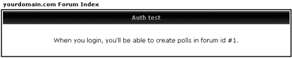

### 获取用户信息

使用此函数来获取关于用户的信息数组：

```php
get_userdata($user, $force_str = false)

```

它将返回数据库表中用户条目的所有字段，作为一个包含关联和枚举值的数组。

将以下代码片段尝试放入脚本中：

```php
echo ‘<pre>’;
print_r(get_userdata(2));
echo ‘</pre>’;

```

这将显示一个数组，其开始如下：

```php
Array
(
[0] => 2
[user_id] => 2
[1] => 1
[user_active] => 1
[2] => Administrator
[username] => Administrator
[3] => 2236c39cda27b2c5535ce82f3a1e28e0
[user_password] => 2236c39cda27b2c5535ce82f3a1e28e0
[4] => 1104479522
[user_session_time] => 1104479522
. . .
)

```

将函数调用中的`2`替换为你喜欢的任何用户 ID 或用户名。此函数可以接受数字 ID 或作为字符串的用户名。

如果你传递第二个参数并设置为`TRUE`，第一个参数应该是`用户名`，而不是`ID`。

### 编码和解码 IP 地址

phpBB 将存储在数据库中的所有 IP 地址进行编码。`encode_ip()`和`decode_ip()`是两个用于此目的的函数。第一个函数接受格式正确的 IP 地址，如`127.0.0.1`，并返回其编码表示形式。第二个函数接受编码字符串并返回原始 IP 地址。

你可以通过以下代码尝试这些函数：

```php
// the main script work starts here
$ip = $_SERVER[‘REMOTE_ADDR’];
$encoded = encode_ip($ip);
$decoded = decode_ip($encoded);
message_die(
GENERAL_MESSAGE,
‘I know you, your IP address is ‘ . $ip
. ‘. This is encoded as ‘ . $encoded
. ‘ and decoded back as ‘ . $decoded,
‘Encode/decode IP demo’
);

```

这将导致类似以下的结果：


你可以在书籍的代码下载中找到显示此输出的脚本，命名为`misc_encode_decode_ip.php`。

### 显示日期

你可以使用以下 phpBB 函数来显示一个格式化的日期：

```php
create_date($format, $unix_timestamp, $timezone)

```

它不仅是对`gmdate` PHP 函数的一个包装（有关详细信息，请参阅[`php.net/gmdate`](http://php.net/gmdate)），而且还负责翻译日期（月份和星期几），并考虑用户在个人资料页面中设置的时区和日期格式偏好。

函数的一个示例用法是打印当前日期和时间，使用用户在个人资料页面中偏好的格式和时间区。你可以通过以下方式实现：

```php
create_date($board_config[‘default_dateformat’], time(), $board_config[‘board_timezone’])

```

这将返回一个类似以下格式的字符串：**Mon Mar 14, 2005 8:56 am**。

书籍的代码下载中有一个名为`misc_create_date.php`的脚本，展示了如何使用此函数。你还可以在章节末尾的定制“What’s Up”脚本中看到函数的使用。

### 获取被审查词汇列表

以下函数检索被审查词汇及其替换词汇的列表：

```php
obtain_word_list(&$original_words, &$replacement_words)

```

该函数接受两个通过引用传递的参数。这基本上意味着你向此函数传递两个空数组，然后它将这些数组填充值。

我们可以使用以下方式进行词库屏蔽：

```php
// the text to be filtered
$some_text = "I may contain naughty words.";
// empty arrays
$orig_word = $replacement_word = array();
// get the word lists
obtain_word_list($orig_word, $replacement_word);
// apply filters if there are ones
if ( !empty($orig_word) )
{
$some_text = preg_replace($orig_word, $replacement_word, $post_text);
// now $some_text is filtered
}

```

不要忘记使用此功能来过滤帖子文本，以及主题标题、投票问题和答案，以及其他任何你觉得需要的地方。

### 在超链接中保留会话

以下函数通过在 URL 中传递会话标识符来帮助保留用户会话，对于禁用了 cookie 的用户：

```php
append_sid($url, $non_html_amp = false)

```

### 注意

每次你在论坛中创建指向其他页面的链接时，都需要调用此函数，否则你将丢失用户访问的会话 ID，phpBB 将为每个访问的页面创建一个新的会话。

函数的第二个参数是可选的；如果它是 `true`，则在构造 URL 参数时，函数将使用 "&" 而不是正确的 HTML 值 "&amp;"。

示例用法：

```php
$url = ‘viewtopic.php?t=12’;
$url = append_sid($url);

```

如果你使用 "#"（命名锚点）在 URL 中，请小心；你需要将其添加到 `append_sid()` 调用之后，否则会话 ID 将无法正确传递。

这是错误的做法：

```php
$url = ‘viewtopic.php?p=21#21’;
$url = append_sid($url);

```

正确的做法如下：

```php
$url = ‘viewtopic.php?p=21’;
$url = append_sid($url) . ‘#21’;

```

如果你对这个函数实现的更多细节感兴趣，请查看源文件 `includes/sessions.php`。

### IN_PHPBB

`IN_PHPBB` 是一个常量，不是一个函数。它之前已经提到过，你可能已经注意到它在每个脚本的顶部定义。

这是一个安全措施，不允许直接通过浏览器访问包含的脚本。在每一个包含脚本中，phpBB 都会检查（并且你的脚本也应该检查）`IN_PHPBB` 是否已定义。如果没有定义，这意味着有人试图直接在浏览器中访问包含的脚本。他们将收到一个显示 **Hack attempt** 的错误消息，并且不会被允许进一步操作。

## 与帖子相关的函数

以下函数有助于你在显示帖子文本时解决问题。

### 自动创建链接

以下函数将接受任何文本，并将看起来像 URL 或电子邮件的所有字符串都转换为可点击的：

```php
make_clickable($text)

```

示例：

```php
$text = "Visit Packt at www.packtpub.com today";
$text = make_clickable($text);
echo $text;

```

此代码片段将输出以下 HTML：

```php
Visit Packt at <a href="http://www.packtpub.com" target="_blank">www.packtpub.com</a> today.

```

### 处理表情符号

`smilies_pass($text)` 函数将替换文本中的所有表情符号代码，并用相应的图像标签的 HTML 代码替换。有关示例，请参阅以下部分。

### 显示帖子正文

为了正确显示帖子文本，你需要：

+   解析 BB 代码并将其转换为 HTML 代码

+   替换表情符号

+   使链接可点击

+   替换过滤的单词

+   将新行转换为 HTML 换行符

看以下示例（它假设你有一个名为 `$row` 的数组，其中包含来自帖子文本表的数据库记录）。注意，你需要 **BB Code UID**，这是将 BB 代码转换为 HTML 的关键。

```php
// start
$post_text = $row[‘post_text’];
// BB code
$post_text = bbencode_second_pass($post_text, $row[‘bbcode_uid’]);
// smilies
$post_text = smilies_pass($post_text);
// clickable links
$post_text = make_clickable($post_text);
// naughty words
$orig_word = $replacement_word = array();
obtain_word_list($orig_word, $replacement_word);
if ( !empty($orig_word) )
{
$post_text = preg_replace($orig_word, $replacement_word, $post_text);
}
$post_text = nl2br($post_text);

```

注意，为了使此代码块正常工作，你需要在脚本中包含 `includes/bbcode.php` 文件。这通常在脚本的开头完成，如下所示：

```php
<?php
define(‘IN_PHPBB’, true);
$phpbb_root_path = ‘./’;
include($phpbb_root_path . ‘extension.inc’);
include($phpbb_root_path . ‘common.’.$phpEx);
include($phpbb_root_path . ‘includes/bbcode.’.$phpEx);

```

## 编码指南

编码标准和指南始终是一件好事，并且值得遵循。因此，熟悉 phpBB 编码标准和按照这些标准编写您的扩展代码是个好主意。虽然这不是强制性的（即使您的代码不遵循标准，它仍然可以运行），但遵循预设标准可以提高您所编写代码的可维护性。根据 Sun Microsystems 的说法，“软件的终身成本中有 80%用于维护”（来源：[`java.sun.com/docs/codeconv/`](http://java.sun.com/docs/codeconv/)中的*Java 编程语言编码规范*），当采用编码规范时，维护工作会变得更加容易。即使您是您自己代码的维护者，这也是正确的。

使用编码规范背后的想法是尽量减少程序员的个人“手写”风格，统一函数和变量的命名方式，代码缩进方式等。当所有参与项目的程序员使用相同的风格时，人们可以很容易地阅读其他程序员编写的代码，因为它们看起来与您自己编写的方式一致。

您可以在 phpBB.com 的开发区域找到当前的 phpBB 编码标准和指南，网址为[`area51.phpbb.com/`](http://area51.phpbb.com)。

# 最近帖子 MOD

本章的最后一节是关于创建一个名为“最近帖子”MOD（或“最新动态”）的自定义 phpBB 脚本。这个脚本使用了本章前面讨论的技术，旨在总结您对 phpBB 编程和模板使用的知识。

## 挑战

我们即将创建的脚本将列出论坛中所有论坛的 15 个最新帖子。对于您和其他论坛爱好者来说，有一个概述页面查看论坛上发生的事情非常有用，而无需逐个浏览每个论坛。对于版主和管理员来说也是如此，他们需要了解论坛上发生的一切。

最近帖子列表将尊重用户权限，这意味着如果用户没有访问某个论坛的阅读权限，那么当该用户查看列表时，这个论坛的帖子将不会出现在列表中。

为了给您一个更直观的概念，以下是脚本运行时的截图：

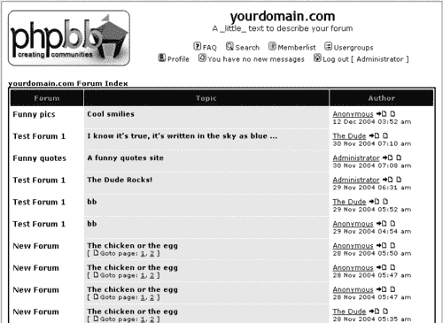

如果某个论坛具有版主权限的用户登录并查看此页面，他们将有一个链接到该论坛的版主控制面板，如下所示：

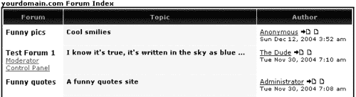

在右侧列的用户名后面有两个图标。点击第一个图标会将用户带到帖子所在的“查看主题”页面（`viewtopic.php`）。点击第二个图标不会加载新页面，而是展开帖子标题下方的区域，并在同一屏幕上显示帖子，同时正确处理了 BB 代码和表情符号。这将在下一幅插图中进行展示。

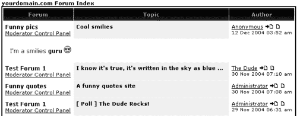

再次点击相同的图标（一旦帖子被展开）会折叠额外的区域并隐藏帖子。

这是一个方便的方法，可以在不离开页面的情况下阅读所有论坛的最新 15 篇帖子。为了保持简单，这个脚本没有引入新的文本或图形。

你即将创建的 Recent Postings MOD 由一个 PHP 脚本和一个模板文件组成。PHP 脚本命名为`whatsup.php`，托管在 phpBB 根目录下，所以如果你的论坛安装在[`www.yourdomain.com/forum/`](http://www.yourdomain.com/forum/)，脚本将在[`www.yourdomain.com/forum/whatsup.php`](http://www.yourdomain.com/forum/whatsup.php)处可访问。

## 模板

脚本的模板命名为`whatsup.tpl`，位于`templates/subSilver`目录中。以下是它的列表：

```php
<span class="nav"><a href="{U_INDEX}" class="nav">{L_INDEX}</a></span>
<table width="100%" cellpadding="5" cellspacing="1" border="0" class="forumline">
<tr>
<th class="thCornerL" height="25" nowrap="nowrap">&nbsp;{FORUM}&nbsp;</th>
<th width="50" class="thTop" nowrap="nowrap">&nbsp;{TOPIC}&nbsp;</th>
<th class="thCornerR" nowrap="nowrap">&nbsp;{POSTER}&nbsp;</th>
</tr>
<!-- BEGIN row -->
<tr>
<td valign="top" class="row1">
<span class="forumlink">
<a class="forumlink" href="{row.U_FORUM}">{row.FORUM_NAME}</a>
</span>
<!-- BEGIN is_mod_switch -->
<span class="name">
<br />
<a href="{row.is_mod_switch.U_FORUM_MODCP}">{row.is_mod_switch.L_MOD}</a>
</span>
<!-- END is_mod_switch -->
</td>
<td valign="top" class="row2">
<span class="topictitle">
{row.TOPIC_TYPE} <a class="topictitle" href="{row.U_TOPIC}">{row.TOPIC_TITLE}</a>
</span>
<br />
<span class="gensmall">{row.GOTO_PAGE}</span>
</td>
<td valign="top" class="row1">
<span class="name"><a href="{row.U_POSTER}">{row.POSTER}</a> {row.IMG_LATEST_POST}
<a href="#" onclick="javascript: document.getElementById(‘{row.POST_ID}’).style.display = (document.getElementById(‘{row.POST_ID}’).style.display == ‘none’) ? ‘’ : ‘none’;">
{row.IMG_VIEW_POST}</a>
</span>
<br />
<span class="postdetails">{row.POST_DATE_TIME}</span>
</td>
</tr>
<tr id="{row.POST_ID}" style="display:none">
<td colspan="3" class="row1">
<div class="postbody" style="padding: 10px;">
{row.POST_TEXT}
</div>
</td>
</tr>
<!-- END row -->
</table>

```

对于模板来说，没有太多具体的要求，它包含一个有三个列的表格，分别对应**论坛**、**主题**和**作者**。一个循环块包围了两个表格行（`<tr> ... </tr>`）；第一个包含论坛名称、主题和作者信息以及链接的行。第二个包含帖子。它默认隐藏（具有`style="display:none"`），通过链接到第二个小图标（）的 JavaScript 在用户请求时显示/隐藏。

在`row`块内部还有一个嵌套的块。它被称为`is_mod_switch`，其目的是处理一个“if”情况。这个情况是，如果用户在当前列出的论坛中具有管理员权限，则显示管理员控制面板的链接。这个模板的部分如下所示：

```php
<!-- BEGIN is_mod_switch -->
<span class="name">
<br />
<a href="{row.is_mod_switch.U_FORUM_MODCP}">{row.is_mod_switch .L_MOD}</a>
</span>
<!-- END is_mod_switch -->

```

## 代码

现在让我们看看`whatsup.php`文件。实现方式与本章讨论的所有其他脚本类似，但有一个小的不同：包含了一个额外的文件`bbcode.php`。它包含了与 BBCode 和表情符号一起工作的必要函数：

```php
<?php
define(‘IN_PHPBB’, true);
$phpbb_root_path = ‘./’;
include($phpbb_root_path . ‘extension.inc’);
include($phpbb_root_path . ‘common.’.$phpEx);
include($phpbb_root_path . ‘includes/bbcode.’.$phpEx);

```

在包含所需的文件之后，是会话管理，这与本章中所有其他脚本类似：

```php
// Start session management
$userdata = session_pagestart($user_ip, PAGE_INDEX);
init_userprefs($userdata);

```

然后是用户授权和权限检查：

```php
// Start auth check
$user_can_read = array();
$user_can_read = auth(AUTH_READ, AUTH_LIST_ALL, $userdata);

```

这个检查验证了用户对所有论坛的阅读权限。在此之后，有一个通过授权结果的循环，以便编译一个包含用户允许阅读的论坛 ID 的数组：

```php
$allowed_forum_ids = array();
foreach ( $user_can_read AS $forum_id => $privileges )
{
if ( !empty($privileges[‘auth_read’]) )
{
$allowed_forum_ids[] = $forum_id;
}
}

```

权限检查完成后，我们需要从数据库中获取一些数据，为此我们需要执行一个 SQL 字符串。它相当长，因为它连接了五个表以检索所需的信息。查询的逻辑如下：

+   从**帖子**表中选择了最近的 15 条帖子。获取最近的方法是按帖子自动递增 ID 降序排序。

+   根据帖子表中的主题 ID，将**主题**表连接起来以检索标题和主题类型等主题数据。

+   根据帖子表中的论坛 ID，将**论坛**表连接起来以检索论坛数据，例如名称，并且使用已编译的`$allowed_forum_ids`数组来过滤允许的论坛。

+   根据帖子表中的帖子 ID，将**帖子文本**表连接起来以检索帖子正文。

+   最后，根据帖子表中的用户 ID，将**用户**表连接起来，因为它包含发帖者的用户名，该用户名在列表中显示。

    ```php
    // start SQL string
    $sql = ‘ SELECT t.topic_title, t.topic_id, t.topic_replies, t.topic_type, t.topic_vote, p.post_id, p.post_time, pt.post_text, pt.bbcode_uid, f.forum_name, f.forum_id, u.username, u.user_id ‘;
    $sql .= ‘ FROM ‘ . POSTS_TABLE . ‘ AS p ‘;
    $sql .= ‘ LEFT JOIN ‘ . TOPICS_TABLE . ‘ AS t ON p.topic_id = t.topic_id ‘;
    $sql .= ‘ LEFT JOIN ‘ . FORUMS_TABLE . ‘ AS f ON t.forum_id = f.forum_id ‘;
    $sql .= ‘ LEFT JOIN ‘ . POSTS_TEXT_TABLE . ‘ AS pt ON p.post_id = pt.post_id ‘;
    $sql .= ‘ LEFT JOIN ‘ . USERS_TABLE . ‘ AS u ON p.poster_id = u.user_id ‘;
    $sql .= ‘ WHERE ‘;
    $sql .= ‘ f.forum_id IN (‘. implode(‘,’, $allowed_forum_ids) .’)’;
    $sql .= ‘ ORDER BY p.post_time DESC ‘;
    $sql .= ‘ LIMIT 0, 15’;
    // end SQL string

    ```

在 SQL 查询组装完成后，执行它：

```php
// execute query
$result = $db->sql_query($sql);
if ( !$result )
{
// check for errors while executing the query
message_die(GENERAL_ERROR, ‘Cannot obtain latest post listing’, ‘’,
__LINE__, __FILE__, $sql);
}

```

在查询执行成功后，现在是时候遍历结果并替换一些模板变量了。在循环之前，我们检索被审查词汇及其替换列表。请记住，过滤器是在管理面板中设置的。

```php
// censored list
$orig_word = $replacement_word = array();
obtain_word_list($orig_word, $replacement_word);

```

结果循环开始：

```php
// The loop through the results
while( $row = $db->sql_fetchrow($result) ) {

```

在循环中要做的第一件事是编译“转到”链接。这些链接就像以下插图中所展示的那样。

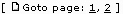

获取这些类型链接的代码是从 phpBB 核心脚本（`search.php`）中借用的，没有进行修改——这是一个很好的例子，说明了你可以从 phpBB 应用程序中学习。

接下来是对一些主题属性进行检查——这个主题是否是粘帖或公告，以及它是否包含投票？将一个值分配给`$topic_type`变量；这个变量的值将在主题名称之前显示。

```php
// check for topic type - announcement or sticky and/or poll
switch ( $row[‘topic_type’] )
{
case POST_ANNOUNCE:
$topic_type = $lang[‘Topic_Announcement’] . " ";
break;
case POST_STICKY:
$topic_type = $lang[‘Topic_Sticky’] . " ";
default:
$topic_type = ‘’;
}
if ( $row[‘topic_vote’] )
{
$topic_type .= $lang[‘Topic_Poll’];
}
// end topic type check

```

接下来是对帖子正文的解析。它包括处理 BB 代码，将表情符号代码替换为图像，替换任何过滤词汇，以及将所有看起来像链接或电子邮件地址的字符串变为可点击：

```php
// parse BBcode, smilies, filters, make links clickable
$post_text = $row[‘post_text’];
$post_text = bbencode_second_pass($post_text, $row[‘bbcode_uid’]);
$post_text = smilies_pass($post_text);
$post_text = make_clickable($post_text);
if ( count($orig_word) )
{
$post_text = preg_replace($orig_word, $replacement_word, $post_text);
$topic_title = preg_replace($orig_word, $replacement_word, $row[‘topic_title’]);
}
$post_text = nl2br($post_text);

```

在这个阶段，所有数据都已检索并按需处理/编译。现在是时候显示它了。所以这就是在`row`模板块内分配模板变量的开始：

```php
// assign row block variables
$template->assign_block_vars("row",
array(
‘U_FORUM’ => append_sid(‘viewforum.’.$phpEx . "?f=" .
$row[‘forum_id’]),
‘FORUM_NAME’ => $row[‘forum_name’],
‘U_TOPIC’ => append_sid(‘viewtopic.’.$phpEx . "?t=" .
$row[‘topic_id’]),
‘TOPIC_TYPE’ => (empty($topic_type)) ? "" : "<strong>" .
$topic_type . "</strong>",
‘TOPIC_TITLE’ => $topic_title,
‘GOTO_PAGE’ => $goto_page,
‘POSTER’ => $row[‘username’],
‘U_POSTER’ => append_sid(‘profile.’.$phpEx . "?mode=viewprofile&amp;u=" . $row[‘user_id’]),
‘IMG_LATEST_POST’ => ‘<a href="’ . append_sid("viewtopic.$phpEx?p=" . $row[‘post_id’]) . "#" . $row[‘post_id’] . ‘"></a> ‘,
‘IMG_VIEW_POST’ => ‘’,
‘POST_DATE_TIME’ => create_date($board_config[‘default_dateformat’], $row[‘post_time’], $board_config[‘board_timezone’]),
‘POST_TEXT’ => $post_text,
‘POST_ID’ => $row[‘post_id’],
)
);

```

你可能会对这个代码片段中使用的 phpBB 函数`append_sid()`（用于在超链接中保持会话 ID）和`create_date()`（用于格式化日期）感兴趣。它们的用法已经在本章的“技巧与窍门”部分中描述过，但在这里你可以看到它们是如何工作的。

接下来是`is_mod_switch`，为版主提供一个链接到论坛的版主控制面板：

```php
// process is_mod_switch block
if ( !empty($user_can_read[$row[‘forum_id’]][‘auth_mod’]) )
{
$template->assign_block_vars("row.is_mod_switch",
array(
‘U_FORUM_MODCP’ => ‘modcp.’.$phpEx . "?f=" . $row[‘forum_id’] . "&amp;sid=" . $userdata[‘session_id’],
‘L_MOD’ => $lang[‘Mod_CP’],
)
);
}

```

结果的循环现在已完成。剩下要做的只是：

+   包含页面头部

+   分配模板文件

+   分配一些全局模板变量（“全局”意味着“在`row`循环之外”）

+   解析并输出编译后的模板

+   包含页面页脚（尾部）

下面是如何操作的：

```php
// header, body and footer
include($phpbb_root_path . ‘includes/page_header.’.$phpEx);
$template->set_filenames(array(
‘body’ => ‘whatsup.tpl’)
);
$template->assign_vars(
array(
‘FORUM’ => $lang[‘Forum’],
‘TOPIC’ => $lang[‘Topic’],
‘POSTER’ => $lang[‘Author’],
)
);
$template->pparse(‘body’);
include($phpbb_root_path . ‘includes/page_tail.’.$phpEx);

```

好了！这就是从头开始构建一个全新的 phpBB 脚本的方法。以下是新 phpBB 功能的完整源代码列表，`whatsup.php`脚本（包含在代码下载中）。将其复制到您的论坛根目录，然后完成！别忘了：`whatsup.tpl`应该复制到`templates/subSilver`。

```php
<?php
define(‘IN_PHPBB’, true);
$phpbb_root_path = ‘./’;
include($phpbb_root_path . ‘extension.inc’);
include($phpbb_root_path . ‘common.’.$phpEx);
include($phpbb_root_path . ‘includes/bbcode.’.$phpEx);
// Start session management
$userdata = session_pagestart($user_ip, PAGE_INDEX);
init_userprefs($userdata);
// Start auth check
$user_can_read = array();
$user_can_read = auth(AUTH_READ, AUTH_LIST_ALL, $userdata);
$allowed_forum_ids = array();
foreach ($user_can_read AS $forum_id => $privileges)
{
if ( !empty($privileges[‘auth_read’]) )
{
$allowed_forum_ids[] = $forum_id;
}
}
// end auth check
// start SQL string
$sql = ‘ SELECT t.topic_title, t.topic_id, t.topic_replies, t.topic_type, t.topic_vote, p.post_id, p.post_time, pt.post_text, pt.bbcode_uid, f.forum_name, f.forum_id, u.username, u.user_id ‘;
$sql .= ‘ FROM ‘ . POSTS_TABLE . ‘ AS p ‘;
$sql .= ‘ LEFT JOIN ‘ . TOPICS_TABLE . ‘ AS t ON p.topic_id = t.topic_id ‘;
$sql .= ‘ LEFT JOIN ‘ . FORUMS_TABLE . ‘ AS f ON t.forum_id = f.forum_id ‘;
$sql .= ‘ LEFT JOIN ‘ . POSTS_TEXT_TABLE . ‘ AS pt ON p.post_id = pt.post_id ‘;
$sql .= ‘ LEFT JOIN ‘ . USERS_TABLE . ‘ AS u ON p.poster_id = u.user_id ‘;
$sql .= ‘ WHERE ‘;
$sql .= ‘ f.forum_id IN (‘. implode(‘,’, $allowed_forum_ids) .’)’;
$sql .= ‘ ORDER BY p.post_id DESC ‘;
$sql .= ‘ LIMIT 0, 15’;
// end SQL string
// execute query
$result = $db->sql_query($sql);
if ( !$result )
{
// check for errors while executing the query
message_die(GENERAL_ERROR, ‘Cannot obtain latest post listing’, ‘’, __LINE__, __FILE__, $sql);
}
// censored list
$orig_word = $replacement_word = array();
obtain_word_list($orig_word, $replacement_word);
// The loop through the results
while( $row = $db->sql_fetchrow($result) )
{
// goto page list
$replies = $row[‘topic_replies’];
$topic_id = $row[‘topic_id’];
// reuse from the search page
if ( ( $replies + 1 ) > $board_config[‘posts_per_page’] )
{
$total_pages = ceil( ( $replies + 1 ) / $board_config[‘posts_per_page’] );
$goto_page = ‘ [ ’ . $lang[‘Goto_page’] . ‘: ‘;
$times = 1;
for($j = 0; $j < $replies + 1; $j += $board_config[‘posts_per_page’])
{
$goto_page .= ‘<a href="’ . append_sid("viewtopic.$phpEx?" . POST_TOPIC_URL . "=" . $topic_id . "&amp;start=$j") . ‘">’ . $times . ‘</a>’;
if ( $times == 1 && $total_pages > 4 )
{
$goto_page .= ‘ ... ‘;
$times = $total_pages - 3;
$j += ( $total_pages - 4 ) * $board_config[‘posts_per_page’];
}
else if ( $times < $total_pages )
{
$goto_page .= ‘, ‘;
}
$times++;
}
$goto_page .= ‘ ] ‘;
}
else
{
$goto_page = ‘’;
}
// goto page list ends
// check for topic type - announcement or sticky and/or poll
switch ( $row[‘topic_type’] )
{
case POST_ANNOUNCE:
$topic_type = $lang[‘Topic_Announcement’] . " ";
break;
case POST_STICKY:
$topic_type = $lang[‘Topic_Sticky’] . " ";
default:
$topic_type = ‘’;
}
if ( $row[‘topic_vote’] )
{
$topic_type .= $lang[‘Topic_Poll’];
}
// end topic type check
// parse BBcode, smilies, filters, make links clickable
$post_text = $row[‘post_text’];
$post_text = bbencode_second_pass($post_text, $row[‘bbcode_uid’]);
$post_text = smilies_pass($post_text);
$post_text = make_clickable($post_text);
if ( count($orig_word) )
{
$post_text = preg_replace($orig_word, $replacement_word, $post_text);
$topic_title = preg_replace($orig_word, $replacement_word, $row[‘topic_title’]);
}
$post_text = nl2br($post_text);
// assign row block variables
$template->assign_block_vars("row",
array(
‘U_FORUM’ => append_sid(‘viewforum.’.$phpEx . "?f=" . $row[‘forum_id’]),
‘FORUM_NAME’ => $row[‘forum_name’],
‘U_TOPIC’ => append_sid(‘viewtopic.’.$phpEx . "?t=" . $row[‘topic_id’]),
‘TOPIC_TYPE’ => (empty($topic_type)) ? "" : "<strong>" . $topic_type . "</strong>",
‘TOPIC_TITLE’ => $topic_title,
‘GOTO_PAGE’ => $goto_page,
‘POSTER’ => $row[‘username’],
‘U_POSTER’ => append_sid(‘profile.’.$phpEx . "?mode=viewprofile&amp;u=" . $row[‘user_id’]),
‘IMG_LATEST_POST’ => ‘<a href="’ . append_sid("viewtopic.$phpEx?p=" . $row[‘post_id’]) . "#" . $row[‘post_id’] . ‘"></a> ‘,
‘IMG_VIEW_POST’ => ‘’,
‘POST_DATE_TIME’ => create_date($board_config[‘default_dateformat’], $row[‘post_time’], $board_config[‘board_timezone’]),
‘POST_TEXT’ => $post_text,
‘POST_ID’ => $row[‘post_id’],
)
);
// process is_mod_switch block
if ( !empty($user_can_read[$row[‘forum_id’]][‘auth_mod’]) )
{
$template->assign_block_vars("row.is_mod_switch",
array(
‘U_FORUM_MODCP’ => ‘modcp.’.$phpEx . "?f=" . $row[‘forum_id’] . "&amp;sid=" . $userdata[‘session_id’],
‘L_MOD’ => $lang[‘Mod_CP’],
)
);
}
}
// header, body and footer
include($phpbb_root_path . ‘includes/page_header.’.$phpEx);
$template->set_filenames(array(
‘body’ => ‘whatsup.tpl’)
);
$template->assign_vars(
array(
‘FORUM’ => $lang[‘Forum’],
‘TOPIC’ => $lang[‘Topic’],
‘POSTER’ => $lang[‘Author’],
)
);
$template->pparse(‘body’);
include($phpbb_root_path . ‘includes/page_tail.’.$phpEx);
?>

```

# 摘要

这最后一章向你介绍了 phpBB 编程的新鲜和激动人心的世界。本章详细介绍了如何使用不同的 phpBB 函数，如何使用 phpBB 数据库抽象层，phpBB 模板引擎，以及如何正确解析和显示帖子。现在你有了开始编写自己扩展 phpBB 核心功能的基本知识。书中给出了许多示例，这些示例都可以在书籍的代码下载中找到。

试着用示例开始实验是个好主意；稍微调整一下，看看结果如何变化。通过这样做，你会更好地理解不同函数的工作方式，也许一些关于如何自定义和扩展 phpBB 功能的想法也会开始成形。祝你在 phpBB 之旅中愉快！
