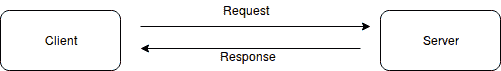
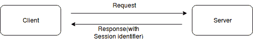
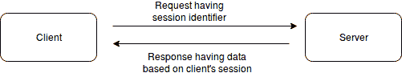

# RESTful 网络服务，介绍和动机

RESTful 网络服务现在被广泛使用。RESTful 是简单的，也是其他网络服务中最广泛使用的。事实上，它的简单性也是它出名的原因。如果你正在阅读这本书，那么你很可能对 RESTful 网络服务有所了解。你可能已经使用过它，或者只是听说过。但即使你对 RESTful 网络服务不太了解，也不用担心，因为我们首先在这里对它进行了定义。所以首先，让我们列出本章将涵盖的高层主题：

+   网络服务，什么是网络服务？

+   REST 架构（REST 的约束）

+   RESTful 网络服务

+   RESTful 网络服务的约定

+   HTTP 动词（方法）

+   为什么要使用 RESTful 网络服务？

+   响应类型和响应代码

+   案例研究-博客的 RESTful 网络服务端点

然而，关于 RESTful 网络服务有很多误解。例如，有些人认为任何返回 JSON 的网络上的东西都是 RESTful 网络服务，而 RESTful 网络服务只返回 JSON。这是不正确的。

事实上，RESTful 网络服务支持多种格式，并不是所有返回 JSON 的东西都是 RESTful 网络服务。为了避免混淆，让我们了解一下什么是 RESTful 网络服务。

基于 REST 架构的网络服务是 RESTful 网络服务。那么，到底什么是网络服务和 REST 架构呢？让我们先了解网络服务，然后再了解 REST 架构。

# 网络服务

网络服务在不同的地方有不同的定义。逐字翻译的定义是，包括网页在内的任何在网上提供的服务都是网络服务，但是如果指的是技术术语*网络服务*，这并不正确。

为了定义网络服务，我们将从 W3C 词汇表中查看网络服务的定义：

“网络服务是一种旨在支持网络上可互操作的机器对机器交互的软件系统。它具有用机器可处理的格式（特别是 WSDL）描述的接口。其他系统按照其描述的方式使用 SOAP 消息与网络服务进行交互，通常使用 HTTP 与其他与 Web 相关的标准一起进行 XML 序列化。”-W3C，网络服务词汇表。

这个定义同样并不完全正确，因为它更具体地适用于基于 SOAP 和 WSDL 的网络服务。事实上，在 2004 年 2 月 11 日的 W3C 工作组说明中，它指出：

“我们可以确定两类主要的网络服务：

*-符合 REST 的网络服务，*其中服务的主要目的是使用一组统一的“无状态”操作来操作 Web 资源的 XML 表示；

-和*任意网络服务*，其中服务可能公开一组任意操作。”

因此，对于网络服务的一个更一般和更好的定义是，来自前面提到的 W3C 网络服务词汇表的定义：

“网络服务是一种旨在支持网络上可互操作的机器对机器交互的软件系统。”

# 为什么要使用网络服务？

现在，我们知道了什么是网络服务。所以在继续讨论 REST 之前，了解网络服务的需求是很重要的。网络服务可以在哪里使用？

正如刚刚定义的，Web 服务是支持网络上机器对机器的可互操作通信的系统。它对于不同系统或设备之间的通信非常有用。在我们的情况下，我们将使用 Web 服务来提供一个接口，通过这个接口，移动应用程序或 Web 应用程序将能够与服务器通信以获取和存储数据。这将使客户端应用程序与服务器端逻辑分离。如今，单页应用程序（SPA）和移动应用程序需要独立，与服务器端逻辑分离，并且只通过 Web 服务与服务器端逻辑交互。因此，Web 服务如今非常重要。然而，Web 服务的使用不仅限于客户端应用程序的使用，而且在服务器之间的通信中也很有用，其中一个服务器充当客户端。

# REST 架构

REST 代表表述性状态转移。这是由 Roy Fielding 在 2000 年创立的架构风格，并在他的博士论文中阐述。他指出 REST <q>“提供了一组架构约束，当作为一个整体应用时，强调组件交互的可扩展性，接口的通用性，组件的独立部署，以及中间组件来减少交互延迟，强制安全性，并封装遗留系统。”</q>。

REST 是基于网络应用的架构风格，而 HTTP 1.1 就是基于它开发的。

一个符合 RESTful 或 REST 的网络服务必须遵守以下六个约束；否则，它将不被视为 RESTful 或 REST 兼容。在阅读和理解以下提到的约束时，可以将现代网络视为 REST 架构的一个例子。

# 客户端服务器

REST 是关于分离客户端和服务器的。这个约束是关于“关注点分离”。这意味着服务器和客户端有各自的责任，因此一个不负责另一个的职责。例如，客户端不负责服务器上的数据存储，因为这是服务器的责任。同样，服务器不需要了解用户界面。因此，服务器和客户端都执行自己的任务并履行自己的责任，这使得他们的工作更容易。因此，服务器可以更具可扩展性，客户端上的用户界面可以是独立的和更具交互性。

# 无状态

客户端服务器通信是无状态的。来自客户端的每个请求都将包含提供请求所需的所有信息。这意味着在这种通信中除了请求中的信息之外，没有其他状态。客户端将收到的响应将基于请求而不查看除请求中的信息之外的任何状态。

如果需要维护会话，会话将基于请求中的令牌或标识符进行存储。因此，如果我们看一个 Web 请求的例子，那么 HTTP 的流程不过是一个请求由**客户端**发送到**服务器**，然后服务器发送一个响应回到**客户端**，如下图所示：



如果需要维护会话，会话数据将存储在服务器上，而会话标识符将发送回客户端。在随后的请求中，客户端将在每个请求中包含该会话标识符，服务器将通过此标识符识别客户端并加载相关会话数据，如下图所示：



在随后的请求中：



因此，REST 是无状态的。为了维护状态，需要传递标识符或任何其他信息，以逻辑上分组不同的请求以在请求中维护会话。如果在请求中没有传递这样的标识符，服务器将永远不知道这两个请求是否来自同一个客户端。

无状态性的优势在于简单性。相同的请求不会产生不同的响应，除非请求参数发生了变化。它将根据不同的请求参数返回不同的结果，而不是由于某种状态。即使状态取决于请求，如前面的例子所示。因此，会话标识符在请求中，这可能导致不同的状态，因此导致不同的响应。

# 可缓存

这个约束规定 RESTful Web 服务的响应必须定义自身是否可缓存，以便客户端知道是否应该缓存。如果正确定义，它可以减少开销并提高性能，因为如果能够使用缓存版本，客户端就不会去服务器。

# 统一接口

统一接口是最具区别性的约束。它基本上解耦了架构，使接口与实现分离，就像任何良好的系统一样。

这类似于面向对象编程中的情况：接口分离了实现和声明。这类似于操作系统将用户界面与复杂的实现逻辑分离开来，以保持软件的运行。

统一接口有四个约束。为了理解统一接口，我们需要理解这些约束。

# 资源标识

资源将在请求中被标识。例如，在基于 Web 的 REST 系统中，资源将由 URI 标识。无论资源在服务器上如何存储，它都将与响应中返回给客户端的内容分开。

实际上，服务器上的资源存储是一种实现，但请求和响应是客户端与之交互的方式，因此它就像是对客户端的接口。客户端可以通过这个接口识别资源。客户端所知道的就是它请求和得到的响应。

例如，客户端通常会向 URI 发送请求，并以 HTML、JSON 或 XML 的形式获得响应。这些格式都不是服务器在数据库内部或其他地方存储数据的方式。但对于客户端来说，重要的是它将要访问的 URI 以及它得到的 HTML、JSON 和 XML。

这是客户端的资源，无论它在服务器上如何存储。这就是好处，因为无论服务器的内部逻辑或表示如何更改，对于客户端来说它都将保持不变，因为客户端将请求发送到 URI 并以 HTML、JSON 或 XML 的形式获得响应，而不是它在服务器上的存储方式。这个约束导致资源标识和表示的松散耦合。

# 通过表示来操作资源

这个约束规定客户端应该持有足够的信息来修改或删除资源的表示。例如，在基于 Web 的 REST 系统中，可以使用 HTTP 方法和 URI 对资源执行任何操作。这使得事情变得容易跟踪，因为 API 开发人员不需要为与资源相关的每个端点提供文档。

# 自描述消息

请注意，根据需要向客户端发送代码是可选的，如果不想扩展客户端的功能，则不需要。

# 超媒体作为应用状态的引擎（HATEOAS）

这个约束规定，基于服务器向 REST 客户端提供的内容，REST 客户端应该能够发现所有可用的操作和资源。换句话说，它指出，如果客户端知道一个入口点，那么从第一个端点开始，它应该能够发现与该资源相关的其他相关端点。例如，如果客户端转到资源的列表端点，那应该包括该列表中资源的链接。如果应用了分页或限制，它应该有链接以转到列表中其余的项目。

如果客户端创建了一个新资源，新资源的链接也应该包含在响应中，这个链接可以用于使用不同的 HTTP 动词进行对该资源的读取、更新和删除操作。对于除了典型的 CRUD 之外的操作，显然会有更多的 URL，因此这些操作的 URL 也应该在响应中，以便从一个入口点发现与资源相关的所有端点。

由于 HATEOAS，一个端点会暴露出与其相关的链接。这减少了对全面 API 文档的需求，尽管不是完全减少，但不需要查看已经暴露的链接的 API 文档。

# 按需发送代码（可选）

这表明服务器可以通过发送可由客户端执行的代码，为 REST 客户端添加更多功能。在网络环境中，一个这样的例子是服务器发送给浏览器的 JavaScript 代码。

让我们举个例子来更好地理解这一点。

例如，Web 浏览器就像一个 REST 客户端，服务器传递 HTML 内容，浏览器呈现。在服务器端，有一些服务器端语言在服务器端执行一些逻辑工作。但是，如果我们想要在浏览器中添加一些逻辑，那么我们（作为服务器端开发人员）将不得不向客户端发送一些 JavaScript 代码，然后执行该 JavaScript 代码。因此，JavaScript 代码是服务器发送给客户端的按需代码，它扩展了 REST 客户端的功能。

由于我们已经定义了 REST 和网络服务，现在我们可以说 RESTful 网络服务是符合 REST 的任何网络服务。

# 分层系统

REST 系统的多层约束

# REST 系统可以有多个层，并且如果客户端请求响应并获得响应，无法区分它是从服务器返回的还是从另一个中间件服务器返回的。因此，如果一个服务器层被另一个替换，除非提供了预期的内容，否则不会影响客户端。简而言之，一个层与其直接交互的下一层之外没有知识。

RESTful 网络服务

现在，我们已经定义了 RESTful 网络服务，我们需要了解 RESTful 网络服务是如何工作的，以及 RESTful 网络服务基于什么，以及为什么它们比其他网络服务（如 SOAP）更受欢迎。

# RESTful 网络服务的约定

RESTful web 服务是基于 RESTful 资源的。RESTful 资源是一个实体/资源，通常存储在服务器上，并且客户端使用 RESTful web 服务请求它。以下是关于 RESTful web 服务中资源的一些特征：

+   它通常被称为 URL 中的名词实体

+   它是唯一的

+   它与数据相关联

+   它至少有一个 URI

如果你还在疑惑什么是资源，可以考虑博客的例子。在博客系统中，**帖子**，**用户**，**类别**或**评论**都可以是资源。在购物车中，**产品**，**类别**或**订单**可以是资源。事实上，任何客户从服务器请求的实体都是资源。

最常见的是，可以对资源执行五种典型操作：

+   列表

+   创建

+   读取

+   更新

+   删除

对于每个操作，我们需要两样东西：URI 和 HTTP 方法或动词。

URI 包含一个名词资源和一个动词 HTTP 方法。要对实体执行某些操作，我们需要一个名词，告诉我们需要执行某些操作的实体是什么。我们还需要指定一个动词，告诉我们要执行什么操作。

对于前面提到的操作，我们使用 HTTP 动词和资源名称的 URL 约定。在下一节中，我们将审查每个操作的 URL 结构和 HTTP 动词。

# HTTP 动词和 URL 结构

以下是如何使用 URI 和 HTTP 动词在资源上执行这些操作的。请注意，在下面提到的操作的 URI 中，您需要用资源名称替换`{resource}`。

# 列表操作

+   **HTTP 方法：**`GET`

+   **URI：**`/{resource}`

+   **结果：**它返回所提到资源类型的列表。在该列表中，它将为资源提供唯一标识符，这些标识符可以用于对特定资源执行其他操作。

# 创建操作

+   **HTTP 方法：**`POST`

+   **URI：**`/{resource}`

+   **参数：**可以在`POST`主体中有多个参数

+   **结果：**这应该在主体中使用参数创建一个新的资源。

+   正如你所看到的，创建和列表的 URI 没有区别，但这两个操作是通过 HTTP 方法区分的，这导致了不同的操作。事实上，HTTP 方法和 URI 的组合告诉我们应该执行哪种操作。

# 读取操作

**HTTP 方法：**`GET`

**URI：**`/{resource}/{resource_id}`

**结果：**这应该根据资源的 ID 返回记录。

这里，`resource_id`将是可以从列表操作结果中找到的资源的 ID。

# 更新操作

可以有两种类型的更新操作：

+   更新特定记录的一些属性

+   用新的完全替换特定记录

执行这两个操作的唯一变化是 HTTP 方法。

使用更新操作，更新资源的一些属性：

**HTTP 方法：**`PATCH`

当要替换整个资源时使用：

**HTTP 方法：**`PUT`

URI 和参数将保持不变：

**URI：**`/{resource}/{resource_id}`

**参数：**可以在查询字符串中有多个参数。最初，人们尝试在主体中传递这些参数，但实际上，使用查询字符串传递`PATCH`和`PUT`参数。

**结果：**这应该根据 HTTP 方法更新或替换资源。

在这里，`resource_id`将是可以从列表操作结果中找到的资源的 ID。实际上，使用`PATCH`或`PUT`不会有任何区别，但基于 REST 标准，应该使用`PATCH`来更新记录的不同属性，而应该使用`PUT`来替换整个资源。

# 删除操作

+   **HTTP 方法：**``DELETE``

+   **URI：**`/{resource}/{resource_id}`

+   **结果：**这应该根据 URI 中的资源 ID 删除资源

如果你现在感到不知所措，不要担心，因为我们刚刚看到了哪种 HTTP 方法和 URI 的组合用于哪些操作。很快，我们将讨论一个案例研究，并看到一些不同资源上的操作以及示例。

在任何其他事情之前，既然我们现在了解了 RESTful 网络服务以及它们的工作原理，现在是了解为什么我们更喜欢使用 RESTful 网络服务而不是其他网络服务的好时机。

# 为什么要使用 RESTful 网络服务？

事实上，RESTful 网络服务并不是我们唯一可以编写的网络服务类型。我们也有其他编写网络服务的方式。还有一些更早的编写网络服务的方式以及一些更近期的方式。我们不会详细讨论其他网络服务，因为这超出了本书的范围，重点在于 RESTful 网络服务以及如何构建它们。

# REST 与 SOAP

REST 的一个旧的替代方案是 SOAP。事实上，当 REST 作为一种替代方案出现时，SOAP 已经存在。一个关键的区别是 SOAP 没有告诉消费者如何访问的特定约定。SOAP 使用 WSDL 来公开其服务。将 WSDL 视为 SOAP 提供的服务的定义。这就是消费者知道 SOAP 基于网络服务提供了什么以及如何消费它们的方式。

另一方面，REST 强调“约定优于配置”。如果你像我们之前所做的那样看 RESTful 网络服务的 URL 结构和 HTTP 动词，你会发现有一个固定的约定。例如，如果你在客户端并且想要创建一个产品，如果你知道它将需要哪些参数，那么你可以通过向`example.com/product`发送`POST`请求来创建它，资源将被创建。如果你想列出所有产品，你可以使用相同的 URL 和`GET`请求。如果你从列表操作中获取产品 ID，你可以简单地使用它们来通过`example.com/product/{product_id}`分别使用`PATCH`和`PUT`或`DELETE`来更新或删除产品。要知道使用哪种 URL 和 HTTP 方法来执行某种操作是如此简单，因为这些是 RESTful 网络服务遵循的一些约定。因此，客户端端只需遵循这些约定，对于简单的任务就不需要大量的文档。

除此之外，无状态性的简单性、关注点的分离和可缓存性是我们已经详细了解的 RESTful 网络服务的其他优点之一。

# HTTP 方法的性质

由于我们将主要处理 HTTP 上的 URL 和使用 HTTP 方法，最好花一些时间了解 HTTP 方法的性质。

我们还应该了解，HTTP 方法实际上并不是通过自身进行任何类型的列举、创建或修改。这只是一种约定，使用特定的 HTTP 方法和 URL 模式进行特定的操作。这些方法本身并不执行任何操作，而是取决于服务器端开发人员。这些方法可以根据开发人员编写的代码进行任何操作。

当我们谈论 HTTP 方法的性质时，这是关于遵循的约定和标准。毕竟，RESTful 网络服务是关于优先选择约定而不是配置。今天的 HTTP 和 REST 的基础就在于这些约定，而在编写 RESTful 网络服务时，我们将遵循这些约定。

# 安全/不安全的 HTTP 方法

HTTP 方法可以是安全的或不安全的。安全的意思是这些方法不会改变服务器上的任何资源，而不安全的意思是这些方法预期会改变服务器上的一些资源。因此，我们有`GET`作为唯一的安全方法，因为它不预期在服务器上做任何改变，而其他方法如`PUT`、`POST`、`PATCH`和`DELETE`被认为是不安全的方法，因为它们预期在服务器上做一些改变。

# 幂等和非幂等方法

有些方法可以实现相同的结果，无论我们重复相同的操作多少次。我们认为`GET`、`PUT`、`PATCH`和`DELETE`是幂等方法，因为无论我们重复调用这些方法多少次，结果总是相同的。例如，如果您使用`GET example.com/books`，它将始终返回相同的书籍列表，无论您用`GET`方法调用这个 URL 多少次。然而，如果用户在数据库中放入其他东西，那么在列出中可能会有不同的结果，但为了声明某些方法是否幂等，我们不考虑由于外部因素而导致结果的变化，而是考虑方法调用本身。同样，如果您使用`PUT`或`PATCH`，比如`PATCH example.com/books/2?author=Ali`，无论您用相同的参数多少次调用这个方法，结果始终相同。

对于`DELETE`也是一样的。无论您多少次在相同的资源上调用`DELETE`，它只会被删除一次。然而，对于`DELETE`，它也可能基于实现而有所不同。这取决于您作为程序员想要如何实现。您可能希望第一次`DELETE`并给出成功的响应，而在后续调用中，您可以简单地给出 404，因为资源已经不存在。

`POST`是非幂等的，因为它在服务器上创建一个新资源，响应至少有一个唯一的属性（通常是资源的 ID），即使在相同的请求参数的情况下，所有其他属性都相同。

到目前为止，我们已经了解了 RESTful web 服务的约定、URL 模式、HTTP 方法和 HTTP 方法的性质。然而，这主要是关于请求。URL 和 HTTP 方法都是与请求相关的点。我们还没有看过响应，所以现在让我们来看一下。

# HTTP 响应

请求的目的是获得响应，否则就没有用处，考虑到我们还需要了解对请求期望的响应类型。在这个上下文中，有两件事情我们将讨论：

+   响应类型

+   响应代码

# 响应类型

在当前世界中，许多人认为 RESTful web 服务的响应必须是 JSON 或包含 JSON 字符串的文本。然而，我们也可以在 RESTful web 服务请求的响应中使用 XML。许多人使用 JSON 作为响应，因为它轻量且易于解析。但与此同时，这只是一种偏好，取决于需求，与 REST 标准无关。

XML 和 JSON 都是格式化数据的方式。XML 代表可扩展标记语言，具有标记语法。而 JSON 代表 JavaScript 对象表示法，具有类似 JavaScript 对象的语法。要更好地理解 JSON，请查看[`www.json.org/`](http://www.json.org/)

我们将很快看一个博客的案例研究，并看到请求和响应的例子。在这本书中，我们将使用 JSON 作为响应类型，因为 JSON 比 XML 更简单。在开发新应用程序时，我们大多使用 JSON，因为它轻量且易于理解。正如您在以下示例中所看到的，JSON 中的相同数据比 XML 简单得多，只包含重要的内容。

在这里，我们试图展示具有一个或多个作者的书籍的数据：

XML：

```php
<books>
  <book>
    <name>Learning Neo4J</name>
    <authors>
      <author>Rik Van Bruggen</author>
    </authors>
  </book>
  <book>
    <name>
     Kali Linux – Assuring Security by Penetration Testing
    </name>
    <authors> 
      <author>Lee Allen</author>
      <author>Tedi Heriyanto</author>
      <author>Shakeel Ali</author>
    </authors>
 </book>
</books>
```

现在，让我们在 JSON 中看同样的例子：

```php
{
books: [
  {
    name:"Learning Neo4J",
    authors:["Rik Van Bruggen"]
  },
  {
    name:"Kali Linux – Assuring Security by Penetration Testing",
    authors:["Lee Allen", "Tedi Heriyanto", "Shakeel Ali"]
  }
 ]
}
```

您可以清楚地从前面的例子中看到，XML 和 JSON 都传达相同的信息。然而，在 JSON 中，这更容易，而且需要更少的词来显示相同的信息。

因此，在本书的其余部分，我们将使用 JSON 作为我们的 RESTful web 服务的响应类型。

# 响应代码

响应代码，更为人所知的是 HTTP 状态代码，告诉我们请求的状态。如果 HTTP 请求成功，HTTP 状态代码是 200，表示 OK。如果有服务器错误，它返回 500 状态代码，表示内部服务器错误。如果请求中有任何问题，HTTP 状态代码是 400 及以上，其中 400 状态代码表示错误的请求。在重定向的情况下，响应代码是 300 及以上。

要查看完整的响应代码列表及其用法，请参见[`en.wikipedia.org/wiki/List_of_HTTP_status_codes`](https://en.wikipedia.org/wiki/List_of_HTTP_status_codes)

我不会详细介绍，因为这将是多余的，因为所有这些信息已经在前面提到的维基百科链接中都可以找到。然而，我们将在后续讨论不同的状态代码。

# 案例研究 - 博客的 RESTful web 服务端点

为了理解 RESTful web 服务，让我们以博客为案例研究，在博客中讨论资源/实体。我们将开始定义博客资源的要求和端点 URL，然后定义我们应该对这些请求做出怎样的响应。因此，这些端点和响应定义将帮助我们理解 RESTful web 服务端点应该是什么样子，以及响应应该是什么样子。在后面的章节中，我们将更多地讨论这些端点的实现，因此这些定义将作为下一章的 API 文档。然而，为了简单起见，我们现在将保持最小限度，并在以后添加更多属性。

尽管基于 HATEOAS，RESTful web 服务应该返回到下一个端点的链接，并且有一些约定告诉我们其他端点的信息，但 API 文档仍然很重要。API 消费者（客户端开发人员）和 API 提供者（服务器端开发人员）应该就此达成一致，以便两者可以并行工作，而不必等待对方。然而，在现实世界中，我们不必为基本的 CRUD 操作编写 API 文档。

在典型的博客中，最常见的资源是文章和评论。还有其他资源，但现在我们将讨论这两个资源，以便理解 RESTful web 服务。请注意，我们不考虑与身份验证相关的内容，但将在后面的章节中进行讨论。

如果客户端和服务器端团队属于同一组织，共同开发一个应用程序，那么由客户端团队创建这样的文档是个好主意，因为服务器端团队只是为客户端提供服务。

# 博客文章

在这里，我们列出了博客文章及其端点的要求。对于这些端点，我们将编写一个请求和一个响应。

# 要求

可以创建、修改、访问和删除博客文章。还应该有一种方法列出所有博客文章。因此，我们将列出博客文章的端点。

# 端点

以下是博客文章的端点：

# 创建博客文章

+   **请求**：`POST /posts HTTP/1.1`

+   **主体参数**：

内容：这是一篇很棒的文章

标题：很棒的文章

+   **回应**：

```php
{id:1, title:"Awesome Post", content:"This is an awesome post", link: "/posts/1" }
```

+   **响应代码**：201 Created

这里`POST`是方法，`/posts`是 URL（服务器名称后的路径），HTTP 1.1 是协议。我们将继续以相同的方式提及后续示例中的请求。因此，请求的第一部分是 HTTP 方法，第二部分是 URL，第三部分是协议。

响应代码告诉客户端资源已成功创建。如果请求参数被错误地省略，响应代码应为**400**，表示错误的请求。

# 阅读博客文章

+   **请求**：`GET /posts/1 HTTP/1.1`

+   **回应**：

```php
{id:1, title:"Awesome Post", content:"This is an awesome post", link: "/posts/1" }
```

+   **响应代码**：200 OK

注意，如果提供的 ID 对应的博客文章不存在（在当前情况下为 1），它应该返回**404**，表示资源未找到。

# 更新博客文章

+   **请求**：`PATCH /posts/1?title=Modified%20Post HTTP/1.1`

+   **回应**：

```php
{id:1, title:"Modified Post", content:"This is an awesome post", link:"posts/1" }
```

+   **响应代码**：200 OK

请注意，如果提供的帖子 ID（在本例中为 1）不存在，应返回响应代码**404**，表示资源未找到。

此外，由于 PATCH 用于修改记录的所有或一些属性，而 PUT 用于修改整个记录，就像用新记录替换旧记录一样。因此，如果我们使用 PUT 并且只传递一个属性，其他属性将变为空。在 PATCH 的情况下，它只会更新传递的属性，其他属性保持不变。

# 删除博客帖子

+   **请求**：`DELETE /posts/1 HTTP/1.1`

+   **响应**：

```php
{success:"True", deleted_id:1 }
```

+   **响应代码**：`200 OK`

请注意，如果提供的博客帖子 ID（在当前情况下为 1）不存在，应返回**404**，表示资源未找到。

# 列出所有博客帖子

+   **请求**：`GET /posts HTTP/1.1`

+   **响应**：

```php
{
data:[
  {
   id:1, title:"Awesome Post", content:"This is an awesome post", link: "/posts/1" 
  },  
  {
   id:2, title:"Amazing one", content:"This is an amazing post", link: "/posts/2"
  }
 ],
total_count: 2,
limit:10,
pagination: {
    first_page: "/posts?page=1",
    last_page: "/posts?page=1",
    page=1
 }
}
```

+   **响应代码**：`200 OK`

在这里，数据是对象数组，因为有多个记录返回。除了`total_count`之外，还有一个分页对象，目前显示第一页和最后一页，因为记录的`total_count`只有 2。因此，没有下一页或上一页。否则，我们还应该在分页中显示下一页和上一页。

正如您所看到的，分页中也有链接，以及帖子对象中的帖子链接。我们在响应中包含了这些链接，以符合 HATEOAS 约束，该约束规定如果客户端知道入口点，那么应该足以发现相关的端点。

在这里，我们探讨了博客帖子的要求，并定义了它们的端点的请求和响应。在下一个实体/资源中，我们将定义评论的端点和响应。

# 博客帖子评论

在这里，我们列出了博客帖子评论的要求，然后是它们的端点。对于这些端点，我们将编写`请求`和`响应`。

# 要求

帖子上可能有一个、多个或没有评论。因此，可以在博客帖子上创建评论。可以列出博客帖子的评论。可以阅读、修改或删除评论。

让我们为这些要求定义端点。

# 端点

以下是帖子评论的端点：

# 创建帖子的评论

+   **请求**：`POST /posts/1/comments HTTP/1.1`

+   **主体参数**：`comment: An Awesome Post`

+   **响应**：

```php
{id:1, post_id:1, comment:"An Awesome Post", link: "/comments/1"}
```

+   **响应代码**：`201 Created`

在评论的情况下，评论是针对某篇博客文章创建的。因此，请求 URL 也包括`post_id`。

# 阅读评论

+   **请求**：`GET /posts/1/comment/1 HTTP/1.1` 或 `GET /comment/1 HTTP/1.1`

第二个看起来更合理，因为只需要有一个评论的 ID，而不用担心评论的帖子 ID。而且由于评论的 ID 是唯一的，我们不需要有帖子的 ID 来获取评论。因此，我们将继续使用第二个 URL，即`GET /comment/1 HTTP/1.1`。

+   **响应**：

```php
{id:1, post_id:1, comment:"An Awesome Post", link: "/comments/1"}
```

+   **响应代码**：`200 OK`

由于任何评论只能存在于某个帖子中，因此响应也包括`post_id`。

# 更新评论

+   **请求**：`PATCH /comment/1?comment="Modified%20Awesome%20Comment' HTTP/1.1`

+   **响应**：

```php
{id:1, post_id:1, comment:"Modified Awesome Comment", link: "/comments/1"}
```

+   **响应代码**：`200 OK`

在这里，我们使用 PATCH，因为我们想要更新评论的单个属性。此外，您可以看到在新评论中传递了`%20`。因此，`%20`只是空格的替换，因为 URL 不能包含空格。因此，在 URL 编码中，空格应始终被`%20`替换。

# 删除帖子评论

+   **请求**：`DELETE /comments/1 HTTP/1.1`

+   **响应**：

```php
{success:"True", deleted_id:1 }
```

+   **响应代码**：`200 OK`

请注意，如果提供的帖子评论 ID（在当前情况下为 1）不存在，应返回**404 Not Found**。

# 列出特定帖子的所有评论

+   **请求**：`GET /posts/1/comments HTTP/1.1`

+   **响应**：

```php
{
data:[
  {
   id:1, comment:"Awesome Post", post_id:1, link: "/comments/1" 
  }, {
   id:2, comment:"Another post comment", post_id:1, link: "/comments/2"
  } 
 ], 
 total_count: 2,
 limit: 10,
 pagination: {
 first_page: "/posts/1/comments?page=1",
 last_page: "/posts/1/comments?page=1",
 page=1 
 } 
}
```

+   **响应代码**：`200 OK`

正如你所看到的，帖子的评论列表与博客帖子的列表非常相似。它以相同的方式显示`total_count`和分页。它现在显示第一页和最后一页，因为记录的`total_count`只有 2。所以没有下一页或上一页。否则，我们还应该在分页中显示下一页和上一页的链接。

通常，在博客上看不到评论的分页，但最好保持一致，在列表中加入分页。因为一篇帖子可能有很多评论，我们应该对其进行一些限制，所以我们需要分页。

# 更多资源

虽然我们已经尝试以实例的方式了解 RESTful 网络服务，但这里还有一些其他有趣的资源。

Roy Fielding 介绍 REST 的论文：

[`www.ics.uci.edu/~fielding/pubs/dissertation/top.htm`](http://www.ics.uci.edu/~fielding/pubs/dissertation/top.htm)

Roy Fielding 的回应的小组讨论：

[`groups.yahoo.com/neo/groups/rest-discuss/conversations/topics/6735`](https://groups.yahoo.com/neo/groups/rest-discuss/conversations/topics/6735)

这是一个关于 REST 与 SOAP 的有趣讨论：[stackoverflow.com](http://stackoverflow.com)

[`stackoverflow.com/questions/19884295/soap-vs-rest-differences`](http://stackoverflow.com/questions/19884295/soap-vs-rest-differences)

Roy Fielding 谈论 REST：

[`www.youtube.com/watch?v=w5j2KwzzB-0`](https://www.youtube.com/watch?v=w5j2KwzzB-0)

REST 的另一种看法：

[`www.youtube.com/watch?v=RY_kMXEJZfk`](https://www.youtube.com/watch?v=RY_kMXEJZfk)

# 总结

在这一章中，我们了解了什么是 RESTful 网络服务。我们看了应该满足的约束条件，才能称为 RESTful 网络服务。然后我们了解到 REST 是一种架构，是一种构建东西的方式，它更青睐约定而不是配置。我们看了 HTTP 动词（方法）并看了 URL 约定。我们了解到这些只是约定。HTTP 动词和 URL 在 RESTful 网络服务中使用；否则，开发人员始终可以提供预期的行为，因为 REST 有约定，这些约定只是被视为标准，但它不提供任何实现。

在这一章中，我们没有讨论 RESTful 网络服务的实现。我们只考虑了一个典型博客的案例研究，并且以博客的两个资源为例，定义了它们的端点和预期的响应。我们还看了 HTTP 响应代码，但我们没有编写实际的代码来实现这些 RESTful 网络服务。我们定义了这些端点，所以我们将在下一章看到它们的实现。

由于这本书是关于在 PHP7 中构建 RESTful 网络服务，下一章我们将看一下 PHP7 中的新功能。PHP7 并没有提供任何特定于 RESTful 网络服务的功能，但我们将利用 PHP7 中的一些新功能来编写更好、更干净的代码来构建 RESTful 网络服务。

如果你已经很了解 PHP7，并且不想此刻深入研究，你可以跳过第二章，*PHP7，编写更好的代码*，并开始第三章，*创建 RESTful 端点*，在那里我们将构建 RESTful 网络服务。
