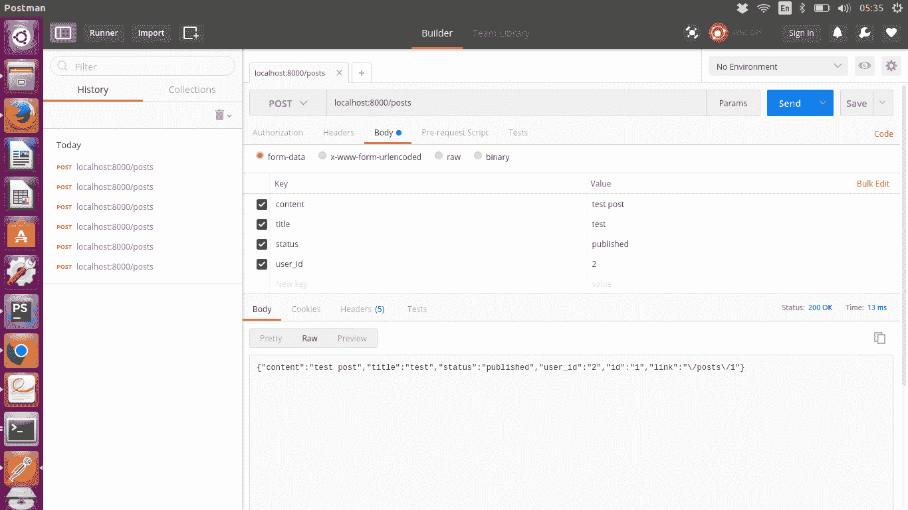

# 第三章：创建 RESTful 端点

到目前为止，我们已经了解了什么是 RESTful 网络服务。我们还看到了 PHP7 中的新功能，这将使我们的代码更好，更清晰。现在，是时候在 PHP 中实现 RESTful 网络服务了。因此，本章就是关于实现的。

我们已经看到了一个具有博客帖子和评论端点的博客示例。在本章中，我们将实现这些端点。以下是我们将涵盖的主题：

+   在 PHP 中为博客创建 REST API

+   创建数据库模式

+   博客用户/作者表模式

+   博客帖子表模式

+   博客帖子评论模式

+   创建 REST API 的端点

+   代码结构

+   常见组件

+   创建博客文章端点

+   要做

+   可见的缺陷

+   验证

+   认证

+   正确的 404 页面

+   摘要

# 在 PHP 中为博客创建 REST API

要为博客创建 REST API 或 RESTful 网络服务，我们首先需要有博客实体。由于我们将在数据库中存储博客实体并从数据库中获取数据，因此我们首先需要为这些实体创建数据库模式。

# 创建数据库模式

我们将为两个资源/实体创建端点，它们是：

+   博客帖子

+   帖子评论

因此，我们将为这两个资源创建数据库模式。

这是我们为具有帖子和评论的博客设计数据库模式的方式。一个帖子可以有多个评论，评论始终属于帖子。在这里，我们有数据库模式的 SQL。您首先需要创建一个数据库，并且需要运行以下 SQL 来拥有帖子和评论表。如果您还没有创建数据库，请立即创建。您可以通过一些 DB UI 工具创建它，或者您可以运行以下 SQL 查询：

```php
create DATABASE blog;
```

这将创建一个名为`blog`的数据库。

在创建博客帖子表和博客帖子评论表之前，我们需要创建一个*用户*表，该表将存储帖子或评论作者的信息。因此，首先让我们创建一个用户表。

# 博客用户/作者表模式

用户表可以具有以下字段：

+   `id`：它将具有整数类型，将是唯一的，并且将具有自动增量值。 `id`将是用户表的主键。

+   `name`：它将具有`VARCHAR`类型，长度为 100 个字符。在`VARCHAR` 100 的情况下，100 个字符是限制。如果一个条目中的标题少于 100 个字符，比如只有 13 个字符，那么它将占用 14 个字符的空间。这就是`VARCHAR`的工作原理。它占用的空间比值中的实际字符多一个。

+   `email`：电子邮件地址将具有`VARCHAR`类型，长度为 50。电子邮件字段将是唯一的。

+   `password`：密码将具有`VARCHAR`类型，长度为 50。我们将拥有`password`字段，因为稍后，在某个阶段，我们将使用户使用`email`和`password`登录。

可能会有更多字段，但为简单起见，我们现在只保留这些字段。

# 用户表的 SQL

以下是`users`表的 SQL。请注意，我们在示例中使用 MySQL 作为 RDBMS。其他数据库的查询可能会有轻微变化：

```php
CREATE TABLE `blog`.`users` (
 `id` INT NOT NULL AUTO_INCREMENT ,
 `name` VARCHAR(100) NOT NULL ,
 `email` VARCHAR(50) NOT NULL ,
 `password` VARCHAR(50) NOT NULL ,
 PRIMARY KEY (`id`), 
 UNIQUE `email_unique` (`email`))
ENGINE = InnoDB;
```

此查询将创建一个如上所述的帖子表。我们尚未讨论的唯一事情是数据库引擎。此查询的最后一行`ENGINE = InnoDB`将数据库引擎设置为`InnoDB`。此外，在第 1 行，``blog``表示数据库的名称。如果您将数据库命名为除 blog 之外的任何其他名称，请将其替换为您的数据库名称。

我们只会为帖子和评论编写 API 的端点，并不会为用户编写端点，因此我们将使用 SQL 插入查询手动向用户表添加数据。

以下是用于填充`users`表的 SQL 插入查询：

```php
INSERT INTO `users` (`id`, `name`, `email`, `password`)
 VALUES 
(NULL, 'Haafiz', 'kaasib@gmail.com', '$2y$10$ZGZkZmVyZXJlM2ZkZjM0Z.rUgJrCXgyCgUfAG1ds6ziWC8pgLiZ0m'), 
(NULL, 'Ali', 'abc@email.com', '$2y$10$ZGZkZmVyZXJlM2ZkZjM0Z.rUgJrCXgyCgUfAG1ds6ziWC8pgLiZ0m');
```

由于我们正在插入两条记录，包括`name`，`email`和`password`，我们将`id`设置为`null`。由于它是自动递增的，它将自动设置。此外，您可以在两条记录中看到一个长随机字符串。这个随机字符串是密码。我们为两个用户设置了相同的密码。但是，用户不会输入这个随机字符串作为密码。这个随机字符串是用户实际密码的加密版本。用户的密码是`qwerty`。这个密码是使用以下 PHP 代码加密的：

```php
password_hash("qwerty", PASSWORD_DEFAULT, ['salt'=>'dfdferere3fdf34dfdfdsfdnuJ$er']);
/* returns $2y$10$ZGZkZmVyZXJlM2ZkZjM0Z.rUgJrCXgyCgUfAG1ds6ziWC8pgLiZ0m
*/
```

`password_hash()` 函数是 PHP 推荐的加密密码函数。第一个参数是`password`字符串。第二个参数是加密算法。而第三个参数是一个选项数组，我们在其中设置一个随机字符串作为盐。您也可以添加不同的盐。

然而，这个盐需要固定以加密密码，因为这种加密是单向加密。这意味着密码无法解密。因此，每次您需要匹配密码时，您都必须加密用户提供的密码，并将其与数据库中的密码进行匹配。为了匹配用户提供的密码和数据库中的密码，我们需要使用相同的密码函数和相同的参数。

我们现在不会制作用户登录功能，但是以后我们会做。

# 博客文章表模式

博客文章可以有以下字段：

+   `id`：它将是整数类型。它将是唯一的，并且具有自动递增的值。`id`将是博客文章的主键。

+   `title`：它将是`varchar`类型，长度为 100 个字符。在`varchar` 100 的情况下，100 个字符是限制。如果一个帖子标题少于 100 个字符，比如说一个帖子的标题只有 13 个字符，那么它将占用 14 个字符的空间。这就是`varchar`的工作原理。它占用的空间比字段中实际字符多一个字符。

+   `status`：状态将是已发布或草稿。我们将使用`enum`。它有两个可能的值，`published`和`draft`。

+   `content`：内容将是帖子的正文。我们将使用`text`数据类型来存储内容。

+   `user_id`：`user_id`将是整数类型。它将是一个外键，并将与用户表中的`id`相关联。这个用户将是博客文章的作者。

为了简单起见，我们只有这五个字段。 `user_id` 将包含发布者的用户信息。

以下是用于创建帖子表的 SQL 查询：

以下是用于帖子表的 SQL。请注意，我们在示例中使用 MySQL 作为 RDBMS。其他数据库的查询可能会有轻微变化：

```php
CREATE TABLE `blog`.`posts` ( 
 `id` INT NOT NULL AUTO_INCREMENT ,
 `title` VARCHAR(100) NOT NULL , 
 `status` ENUM('draft', 'published') NOT NULL DEFAULT 'draft' ,
 `content` TEXT NOT NULL ,
 `user_id` INT NOT NULL ,
 PRIMARY KEY (`id`), INDEX('user_id')
) 
ENGINE = InnoDB;

```

此查询将创建一个如前所述的帖子表。

现在，我们添加外键来限制`user_id`只能有用户表中存在的值。以下是我们将添加该约束的方式：

```php
ALTER TABLE `posts` 
ADD CONSTRAINT `user_id_foreign` FOREIGN KEY (`user_id`) REFERENCES `users`(`id`) ON DELETE RESTRICT ON UPDATE RESTRICT;
```

# 博客文章评论模式

博客文章评论可以有以下字段：

+   `id`：它将是`整数`类型。它将是唯一的，并且将具有自动递增的值。`id`将是博客文章的主键。

+   `comment`：它将是`varchar`类型，长度为`250`个字符。

+   `post_id`：`post_id`将是整数类型。它将是与帖子表中的`id`相关联的外键。

+   `user_id`：`user_id` 将是`整数`类型，它将是外键，并将与用户表中的`id`相关联。

在这里，`user_id`是评论的作者/写作者的 ID，而`post_id`是评论所在的帖子的 ID。

以下是用于创建`comments`表的 SQL 查询：

```php
CREATE TABLE `blog`.`comments` ( 
 `id` INT NOT NULL AUTO_INCREMENT ,
 `comment` VARCHAR(250) NOT NULL ,
 `post_id` INT NOT NULL ,
 `user_id` INT NOT NULL ,
 PRIMARY KEY (`id`), INDEX(`post_id`), INDEX(`user_id`)
) ENGINE = InnoDB;
```

为`user_id`和`post_id`添加外键约束：

```php
ALTER TABLE `comments` ADD CONSTRAINT `post_id_comment_foreign` FOREIGN KEY (`post_id`) REFERENCES `posts`(`id`) ON DELETE RESTRICT ON UPDATE RESTRICT; 

ALTER TABLE `comments` ADD CONSTRAINT `user_id_comment_foreign` FOREIGN KEY (`user_id`) REFERENCES `users`(`id`) ON DELETE RESTRICT ON UPDATE RESTRICT;
```

通过运行所有这些 SQL 查询，您将设置好大部分 DB 结构，以便继续创建 PHP 中的 RESTful API 端点。

# 创建 RESTful API 端点

在创建特定于资源的 RESTful API 端点之前，让我们首先创建我们将放置代码的目录。在某个地方创建一个`blog`目录，你的`home`目录，在 Linux 中更可取。然后，在`blog`目录中创建一个`api`目录。我们将把所有的代码放在`api`目录中。如果你是一个命令行爱好者或一个经验丰富的 Ubuntu 用户，只需运行以下命令来创建这些目录：

```php
$ mkdir ~/blog //create blog directory
$ cd ~/blog //chang directory to blog directory
$ mkdir api //create api directory inside blog directory ~/blog
$ cd api //change directory to api directory
```

因此，`api`是我们将放置代码的目录。正如你所知，我们将编写与两个资源相关的端点的代码：博客文章和文章评论。在继续编写特定于博客文章的代码之前，让我们首先看看我们将如何构建我们的代码结构。

# 代码结构

代码可以以许多方式编写。我们可以创建不同的文件用于文章和评论，比如`posts.php`和`comments.php`，并让用户从 URL 访问它们；例如，用户可以输入：[`localhost:8000/posts.php`](http://localhost:8000/posts.php)，这将执行`posts.php`中的代码。在`comments.php`中也可以做同样的事情。

这是一个非常简单的方法，但它有两个问题：

+   第一个问题是`posts.php`和`comments.php`将有不同的代码。这意味着，如果我们必须在这些不同的文件中使用相同的代码，我们将需要在这两个文件中写入或包含所有共同的东西。实际上，如果将会有更多的资源，那么我们将需要为每个资源创建一个不同的文件，并且在每个新文件中，我们将需要包含所有共同的代码。尽管现在只有两个资源，但我们也需要考虑可扩展性。因此，在这种方法中，我们将需要在所有文件中具有相同的代码。即使我们只是在所有文件中进行包含或需要，我们也需要这样做。但是，通过最小化要包含或需要的文件，可以解决或减轻这个问题。

+   第二个问题与它在 URL 中的显示方式有关。在 URL 中，提到要使用的事实文件，所以如果在完成我们的端点并且将 API 提供给前端开发人员后，我们需要在服务器上更改文件名怎么办？前端应用程序的网络服务将无法正常工作，除非我们在前端应用程序中更改 URL 中的文件名。这指向了关于我们的请求以及服务器上存储的东西的一个重要问题。这意味着我们的代码将紧密耦合。这不应该发生，因为我们在第一章中所述的 REST 的约束中已经说明了。这个`.php`扩展名不仅暴露了我们在服务器端使用 PHP，而且我们的文件结构也暴露给了所有知道端点 URL 的人。

问题一的解决方案可以是包含和需要语句。尽管，所有文件仍然需要包含或需要语句，如果一个包含语句需要在一个文件中更改，我们将需要在所有文件中进行更改。因此，这不是一个好方法，但第一个问题可以解决。然而，第二个问题更为关键。一些使用 Apache 的`.htaccess`文件进行 URL 重写的人可能会认为 URL 重写可以解决问题。是的，它可以解决请求 URL 和文件系统上文件之间的紧密耦合的问题，但只有在我们使用 Apache 作为服务器时才能起作用。

然而，随着时间的推移，你会看到越来越多的用例，你会意识到这种方式并不是非常可扩展的。在这种情况下，我们没有遵循任何模式，除了在所有资源文件中包含相同的代码。此外，使用`.htaccess`进行 URL 重写可能有效，但不建议将其用作完整的路由器，因为它会有自己的局限性。

那么这个问题的解决方案是什么呢？如果我们可以有一个单一的入口点怎么办？如果所有请求都通过同一个入口点，然后路由到适当的代码呢？那将是一个更好的方法。请求将与帖子或评论相关联，它必须通过同一个单一入口点，而在该入口点，我们可以包含任何我们想要的代码。然后，该入口点将路由请求到适当的代码。这将解决两个问题。此外，事情将按照一种模式进行，因为每个资源的代码将遵循相同的模式。我们刚讨论的这种模式也被称为前端控制器。您可以在 wiki 上阅读有关前端控制器的更多信息：[`en.wikipedia.org/wiki/Front_controller`](https://en.wikipedia.org/wiki/Front_controller)。

现在我们知道我们将使用前端控制器模式，因此我们的入口点将是`index.php`文件。因此，让我们在`api`目录中创建`index.php`。现在，让我们放置一个 echo 语句，以便我们可以测试和运行，并至少使用 PHP 内置服务器看到`hello world`。稍后，我们将在`index.php`文件中添加适当的内容。因此，现在将这放入`index.php`中：

```php
<?php

echo "hello World through PHP built-in server";
```

要测试它，您需要运行 PHP 内置服务器。请注意，您不需要 Apache 或 NGINX 来运行 PHP 代码。PHP 有一个内置服务器，尽管这对测试和开发环境很好，但不建议用于生产。因为我们在本地机器上的开发环境中，让我们运行它：

```php
~/blog/api$ php -S localhost:8000
```

这将使您能够通过 PHP 内置服务器访问`http://localhost:8000`，并输出`hello World`。因此，现在我们准备开始编写实际的代码，使我们的 RESTful 端点正常工作。

# 常见组件

在继续处理端点之前，让我们首先确定并解决在服务所有端点时需要的事情。以下是这些事情：

+   错误报告设置

+   数据库连接

+   路由

打开`index.php`，删除旧的 hello world 代码，并将此代码放入`index.php`文件中：

```php
<?php   ini_set('display_errors', 1); error_reporting(E_ALL);   require __DIR__."/../core/bootstrap.php";
```

在前两行，我们基本上是在确保我们能够看到代码中的错误。真正的魔法发生在最后一条语句中，我们在那里需要`bootstrap.php`。

这只是另一个文件，我们将在`~/blog/core`目录中创建。在博客目录中，我们将创建一个核心目录，因为我们将保留与核心目录中代码执行流程和模式相关的代码部分。这将是与 API 的端点或逻辑无关的代码。这个核心代码将被创建一次，我们可以在不同的应用程序中使用相同的核心。

因此，让我们在`blog/core`目录中创建`bootstrap.php`。以下是我们将在`bootstrap.php`中编写的内容：

```php
<?php   require __DIR__.'/DB.php'; require __DIR__.'/Router.php'; require __DIR__.'/../routes.php';
require __DIR__ .'/../config.php';   $router = new Router; $router->setRoutes($routes);   $url = $_SERVER['REQUEST_URI']; require __DIR__."/../api/".$router->direct($url); 
```

基本上，这将加载所有内容并执行。`bootstrap.php`是我们的应用程序运行的结构。所以让我们深入了解一下。

第一条语句从同一目录（即 core 目录）中需要一个`DB`类。`DB`类也是一个核心类，它将负责与数据库相关的事务。第二条语句需要一个路由器，它将把 URL 定向到适当的文件。第三条需要路由，告诉在哪种 URL 情况下提供哪个文件。

我们将逐一查看`DB`和`Router`类，但让我们首先查看指定路由的`routes.php`。请注意，`routes.php`是特定于应用程序的，因此其内容将根据我们的应用程序 URL 而变化。

以下是`blog/routes.php`的内容：

```php
<?php   $routes = [
  'posts' => 'posts.php',
  'comments' => 'comments.php' ]; 
```

您可以看到它只是填充了一个`$routes`数组。在这里，帖子和评论是我们期望的 URL 的一部分，如果 URL 中有帖子，它将提供`posts.php`文件，如果 URL 中有评论，它将提供`comments.php`。

`bootstrap.php`中的第四个要求是具有应用程序配置，例如`DB`设置。以下是`blog/config.php`的示例内容：

```php
<?php /**
 * Config File */ $db = [
  'host' => 'localhost',
  'username' => 'root',
  'password' => '786' ];
```

现在，让我们逐个查看`DB`和`Router`类，这样我们就可以理解`blog/core/bootstrap.php`中到底发生了什么。

# DB 类

这是`blog/core/DB.php`中`DB`类的代码：

```php
<?php   class DB {    function connect($db)
 {  try {
  $conn = new PDO("mysql:host={$db['host']};dbname=blog", $db['username'], $db['password']);    // set the PDO error mode to exception
  $conn->setAttribute(PDO::ATTR_ERRMODE, PDO::ERRMODE_EXCEPTION);    return $conn;
 } catch (PDOException $exception) {
  exit($exception->getMessage());
 } }  }
```

这个类与数据库相关。现在，我们有一个构造函数，实际上是使用`blog/config.php`中定义的`PDO`和`$db`数组连接到数据库。但是，我们以后会在这个类中添加更多内容。

你可以看到我们在这里使用了一个`PDO`对象：**PDO**（**PHP 数据对象**）。它用于与数据库交互，是一个推荐的方法，因为无论我们想使用哪个数据库，我们只需要更改连接字符串，其余的都会正常工作。这个字符串：`"mysql:host=$host;dbname=blog"`是连接字符串。`DB.php`中的这段代码将创建与数据库的连接，并且这个连接将在脚本结束时关闭。我们在这里使用`try catch`，因为当我们的代码外部触发任何东西时，使用异常处理是很好的。

到目前为止，我们已经查看了`DB`类，`routes.php`（路由关联数组）和`config.php`（设置关联数组）的内容。现在我们需要查看`Router`类的内容。

# 路由器类

这是`blog/core/Router.php`中`Router`类的实现：

```php
<?php   class Router {    private $routes = [];    function setRoutes(Array $routes) {
  $this->routes = $routes;
 }    function getFilename(string $url) {
  foreach($this->routes as $route => $file) {
  if(strpos($url, $route) !== false){
  return $file;
 } } } }
```

`Router`有两个方法，`Router::setRoutes(Array $routes)`和`Router::getFilename()`。`setRoutes()`接受一个路由数组并将其存储。然后，`getFilename()`方法负责决定对哪个 URL 提供哪个文件。我们不是比较整个 URL，而是使用`strpos()`来检查`$route`中的字符串是否存在于`$url`中，如果存在，则返回适当的文件名。

# 代码同步

为了确保我们在同一个页面上，这是你的`blog`目录中应该有的内容：

+   `blog`

+   `blog/config.php`

+   `blog/routes.php`

+   `blog/core`

+   `blog/core/DB.php`

+   `blog/core/Router.php`

+   `blog/core/bootstrap.php`

+   `blog/api`

+   `blog/api/index.php`

+   `blog/api/posts.php`

注意，`blog/api/posts.php`到目前为止还没有任何适当的内容，所以你可以保留任何可以在浏览器中查看的内容，这样你就知道这个内容来自`posts.php`。除此之外，如果你缺少任何东西，那么就将它与本书提供给你的`book.boostrap.php`进行比较。

无论如何，你已经看到了`bootstrap.php`中包含的所有文件的内容，所以现在你可以回头看`bootstrap.php`的代码，以更好地理解事情。这些内容再次放在这里，以便你可以看到：

```php
<?php   require __DIR__ . '/DB.php'; require __DIR__.'/Router.php'; require __DIR__.'/../routes.php';   $router = new Router; $router->setRoutes($routes);   $url = $_SERVER['REQUEST_URI']; require __DIR__."/../api/".$router->getFilename($url);
```

正如你所看到的，这只是包含`config`和`routes`文件以及包含`Router`和`DB`类。在这里，它正在设置`$routes`中传入的路由，就像`routes.php`中写的那样。然后，根据 URL，它获取将提供该 URL 的文件名，并要求该文件。我们使用`$_SERVER['REQUEST_URI']`；它是一个超级全局变量，包含主机名之后的 URL 路径。

到目前为止，我们已经完成了制作应用程序结构的通用代码。现在，如果你的`blog/api/posts.php`包含了像我的`posts.php`一样的代码：

```php
<?php   echo "Posts will come here"; 
```

通过说：`php -S localhost:8000`来启动 PHP 服务器，然后在浏览器中输入：`http://localhost:8000/posts`，你应该会看到：*帖子将在这里显示*。

如果你无法运行它，我建议你回去检查你漏掉了什么。你也可以使用本书提供给你的代码。无论如何，现在有必要在这一点上成功地编写和运行这段代码，因为仅仅阅读是不够的，实践会让你变得更好。

# 创建博客文章端点

到目前为止，我们已经完成了大部分通用代码。所以让我们来看看博客文章端点。在博客文章端点中，第一个是博客文章列表。

博客文章列表端点：

+   URI：`/api/posts`

+   方法：`GET`

因此，让我们用适当的代码替换`posts.php`中的先前代码来提供帖子。为了提供这个，将以下代码放入`posts.php`文件中：

```php
<?php   $url = $_SERVER['REQUEST_URI'];

// checking if slash is first character in route otherwise add it if(strpos($url,"/") !== 0){
  $url = "/$url"; }    if($url == '/posts' && $_SERVER['REQUEST_METHOD'] == 'GET') {
  $posts = getAllPosts();
  echo json_encode($posts); }   function getAllPosts() {
  return [
 [  'id' => 1,
  'title' => 'First Post',
  'content' => 'It is all about PHP'
  ],
 [  'id' => 2,
  'title' => 'Second Post',
  'content' => 'RESTful web services'
  ],
 ]; }
```

在这里，我们正在检查方法是否为`GET`，URL 是否为`/posts`，并且我们正在从名为`getAllPosts()`的函数中获取数据。为了简单起见，我们从一个硬编码的数组中获取数据，而不是从数据库中获取数据。但是，实际上我们需要从数据库中获取数据。让我们添加从数据库获取数据的代码。它将如下所示：

```php
<?php   $url = $_SERVER['REQUEST_URI']; // checking if slash is first character in route otherwise add it  if(strpos($url,"/") !== 0){
  $url = "/$url"; }   $dbInstance = new DB();
$dbConn = $dbInstance->connect($db**);**   if($url == '/posts' && $_SERVER['REQUEST_METHOD'] == 'GET') {
  $posts = getAllPosts($dbConn);
  echo json_encode($posts); }   ;;
function getAllPosts($db) {
 $statement = $db->prepare("SELECT * FROM posts");
 $statement->execute();
 $result = $statement->setFetchMode(PDO::FETCH_ASSOC);
 return $statement->fetchAll();
}
```

如果执行此代码，您将以 JSON 格式获得一个空数组，这是可以的。由于目前在帖子表中没有记录，因此显示为空数组。让我们创建并使用添加帖子端点。

博客帖子创建端点：

+   URI：`/api/posts`

+   方法：`POST`

+   参数：`title`，`status`，`content`，`user_id`

现在，我们只是让这些端点在没有用户身份验证的情况下工作，所以我们自己传递`user_id`。因此，它应该是来自用户表的`id`。

为了使其工作，我们需要在`posts.php`中添加。然后新代码以粗体字显示：

```php
<?php   $url = $_SERVER['REQUEST_URI'];  // checking if slash is first character in route otherwise add it  if(strpos($url,"/") !== 0){
  $url = "/$url"; }    $dbInstance = new DB(); $dbConn = $dbInstance->connect($db);   if($url == '/posts' && $_SERVER['REQUEST_METHOD'] == 'GET') {
  $posts = getAllPosts($dbConn);
  echo json_encode($posts); }   if($url == '/posts' && $_SERVER['REQUEST_METHOD'] == 'POST') {
 $input = $_POST;
 $postId = addPost($input, $dbConn);
 if($postId){
     $input['id'] = $postId;
     $input['link'] = "/posts/$postId";
 }

 echo json_encode($input); **}**     function getAllPosts($db) {
  $statement = $db->prepare("SELECT * FROM posts");
  $statement->execute();
  $result = $statement->setFetchMode(PDO::FETCH_ASSOC);
  return $statement->fetchAll(); }  function addPost($input, $db){
 $sql = "INSERT INTO posts 
 (title, status, content, user_id) 
 VALUES 
 (:title, :status, :content, :user_id)";

 $statement = $db->prepare($sql);

 $statement->bindValue(':title', $input['title']);
 $statement->bindValue(':status', $input['status']);
 $statement->bindValue(':content', $input['content']);
 $statement->bindValue(':user_id', $input['user_id']);

 $statement->execute();

 return $db->lastInsertId();
}
```

正如您所看到的，我们已经放置了另一个检查，因此如果方法是`POST`，它将运行`addPost()`方法。在`addPost()`方法中，正在添加`POST`。我们使用了相同的`PDO`准备和执行语句。

但是，这一次我们也使用了`bindValue()`。首先，在`INSERT`语句中添加一个带有冒号的静态字符串，例如`:title, :status`，然后使用绑定语句将变量与这些静态字符串绑定。那么这样做的目的是什么呢？原因是我们不能信任用户输入。直接将用户输入添加到 SQL 查询中可能导致 SQL 注入。因此，为了避免 SQL 注入，我们可以使用`PDO::prepare()`函数与`PDOStatement::bindValue()`。在`prepare()`函数中，我们提供一个字符串，而`bindValue()`将用户输入与该字符串绑定。因此，这个`PDOStatement::bindValue()`不仅会用输入参数替换这些字符串，还会确保不会发生 SQL 注入。

我们还使用了`PDO::lastInsertId()`。这是为了返回刚刚创建的记录的自增`id`。

在`addPost()`方法中，我们反复使用`bindValue()`方法来处理不同的字段。如果有更多字段，那么我们可能需要反复写更多次。为了避免这种情况，我们将`addPost()`方法的代码更改为：

```php
function addPost($input, $db){    $sql = "INSERT INTO posts 
          (title, status, content, user_id) 
          VALUES 
          (:title, :status, :content, :user_id)";    $statement = $db->prepare($sql);   bindAllValues($statement, $input**);**    $statement->execute();    return $db->lastInsertId(); }
```

您可以看到`PDOStatement::bindValue()`调用被替换为一个`bindAllValues()`函数调用，该函数以`PDOStatement`作为第一个参数，以用户输入作为第二个参数。`bindAllValues()`是我们编写的一个自定义函数，因此这是我们将在同一个`posts.php`文件中编写的`bindAllValues()`方法的实现： 

```php
function bindAllValues($statement, $params){
  $allowedFields = ['title', 'status', 'content', 'user_id'];    foreach($params as $param => $value){
  if(in_array($param, $allowedFields)){
  $statement->bindValue(':'.$param, $value);
 } }    return $statement; }
```

由于我们将其编写为一个单独的通用函数，因此我们可以在多个地方使用它。此外，无论在帖子表中有多少字段，我们都不需要在代码中反复调用相同的`PDOStatement::bindValue()`方法。我们只需在`$allowedFields`数组中添加更多字段，`bindValue()`方法将自动调用。

为了测试`POST`请求，我们不能简单地从浏览器中访问 URL。要测试`POST`请求，我们需要使用某种 REST 客户端或创建并提交一个带有`POST`的表单。REST 客户端是一种更好、更简单的方式。

# REST 客户端

非常流行的 REST 客户端之一是 Postman。Postman 是一个谷歌 Chrome 应用程序。如果您使用 Chrome，那么您可以从这里安装此应用程序：[`chrome.google.com/webstore/detail/postman/fhbjgbiflinjbdggehcddcbncdddomop/related?hl=en`](https://chrome.google.com/webstore/detail/postman/fhbjgbiflinjbdggehcddcbncdddomop/related?hl=en)。

一旦您打开 Postman，您就可以选择方法为 POST 或任何其他方法，然后在选择 Body 选项卡时，您可以设置字段名称和值，然后点击发送。检查 Postman 的以下屏幕截图，其中设置了字段和响应。这将让您了解 Postman 如何用于发送请求：



您可以看到通过 Postman 发送了 POST 请求，并且结果成功，正如我们所期望的那样。对于所有端点测试，可以使用 Postman。

在运行基于 POST 的帖子创建端点之后，我们可以再次测试帖子端点的列表，这次它将返回数据，因为现在有一个帖子了。

让我们来看看获取单个帖子、更新帖子和删除帖子的端点。

获取单个帖子端点：

+   URI：`/api/posts/{id}`

+   方法：`GET`

这个带有`GET`方法的 URL 应该根据提供的 ID 返回单个帖子。

为了实现这一点，我们需要做两件事：

+   在这种模式的情况下，添加一个条件和代码，其中方法是`GET`，URL 是这种模式。

+   我们需要编写并调用`getPost()`方法，从数据库中获取单个帖子。

我们需要在`posts.php`中添加以下代码。

首先，我们将添加一个条件和代码来返回单个帖子：

```php
if(preg_match("/posts\/([0-9])+/", $url, $matches) && $_SERVER['REQUEST_METHOD'] == 'GET'){
  $postId = $matches[1];
  $post = getPost($dbConn, $postId);    echo json_encode($post); }
```

在这里，我们正在检查模式是否为`/posts/{id}`，其中`id`可以是任何数字。然后我们调用我们的自定义函数`getPost()`，它将从数据库中获取帖子记录。因此，这是我们将在同一`posts.php`文件中添加的`getPost()`实现：

```php
function getPost($db, $id) {
  $statement = $db->prepare("SELECT * FROM posts where id=:id");
  $statement->bindValue(':id', $id);
  $statement->execute();    return $statement->fetch(PDO::FETCH_ASSOC); }
```

这段代码只是从数据库中获取单个记录作为关联数组，可以从最后一行清楚地看出。除此之外，`SELECT`查询及其执行都足够简单。

更新帖子端点：

+   URI：`/api/posts/{id}`

+   方法：`PATCH`

+   参数：`title`，`status`，`content`，`user_id`

这里的`{id}`将被实际帖子的 ID 替换。请注意，由于我们使用了`PATCH`方法，因此只应更新输入方法中存在的属性。

在这里，我们将`user_id`作为参数传递，但这只是因为我们没有进行身份验证，否则严格禁止将`user_id`作为参数传递。`user_id`应该是经过身份验证的用户的 ID，并且应该在参数中使用而不是获取`user_id`。因为它可以让任何用户通过在参数中传递另一个`user_id`来假装成其他人。

请注意，在使用`PUT`或`PATCH`时，参数应通过查询字符串传递，只有`POST`在正文中有参数。

让我们更新我们的`posts.php`代码以支持更新操作，然后我们将更深入地研究。

以下是要添加到`posts.php`中的代码：

```php
//Code to update post, if /posts/{id} and method is PATCH

if(preg_match("/posts\/([0-9])+/", $url, $matches) && $_SERVER['REQUEST_METHOD'] == 'PATCH'){
  $input = $_GET;
  $postId = $matches[1];
 updatePost($input, $dbConn, $postId);    $post = getPost($dbConn, $postId);
  echo json_encode($post); }

/**
 * Get fields as parameters to set in record * * @param $input
 * @return string
 */ function getParams($input) {
  $allowedFields = ['title', 'status', 'content', 'user_id'];    $filterParams = [];
  foreach($input as $param => $value){
  if(in_array($param, $allowedFields)){
  $filterParams[] = "$param=:$param";
 } }    return implode(", ", $filterParams); }     /**
 * Update Post * * @param $input
 * @param $db
 * @param $postId
 * @return integer
 */ function updatePost($input, $db, $postId){    $fields = getParams($input);    $sql = "
 UPDATE postsSET $fields           WHERE id=':postId'
 ";    $statement = $db->prepare($sql);
 $statement->bindValue(':id', $id); bindAllValues($statement, $input);    $statement->execute();   return $postId;  }
```

首先，它检查 URL 是否符合格式：`/posts/{id}`，然后检查`Request`方法是否为`PATCH`。在这种情况下，它调用`updatePost()`方法。`updatePost()`方法通过`getParams()`方法以逗号分隔的字符串形式获取键值对。然后进行查询，绑定值和`postId`。这与`INSERT`方法非常相似。然后在条件块中，我们回显更新的记录的 JSON 编码形式。这与我们在创建帖子和获取单个帖子的情况下所做的非常相似。

您应该注意的一件事是，我们正在从`$_GET`中获取查询字符串的参数。这是因为在`PATCH`和`PUT`的情况下，参数是通过查询字符串传递的。因此，在通过 Postman 或任何其他 REST 客户端进行测试时，我们需要在查询字符串中传递参数，而不是在正文中传递。

删除帖子端点：

+   URI：`/api/posts/{id}`

+   方法：`DELETE`

这与获取单个博客帖子端点非常相似，但这里的方法是`DELETE`，因此记录将被删除而不是被查看。

以下是要添加到`posts.php`中以删除博客帖子记录的代码：

```php
//if url is like /posts/{id} (id is integer) and method is DELETE

if(preg_match("/posts\/([0-9])+/", $url, $matches) && $_SERVER['REQUEST_METHOD'] == 'DELETE'){
  $postId = $matches[1];
 deletePost($dbConn, $postId);    echo json_encode([
  'id'=> $postId,
  'deleted'=> 'true'
  ]); }

/**
 * Delete Post record based on ID * * @param $db
 * @param $id
 */ function deletePost($db, $id) { $statement = $db->prepare("DELETE FROM posts where id=':id'");
    $statement->bindValue(':id', $id);
    $statement->execute(); }
```

在查看插入、获取和更新帖子端点的代码之后，这段代码非常简单。在这里，主要工作在于`deletePost()`方法，但它也与其他方法非常相似。

有了这个，我们现在已经完成了与端点相关的帖子。然而，现在我们返回的所有数据都不是真正的 JSON，对于客户端（浏览器或 Postman）来说，它仍然被视为字符串，并被视为 HTML。这是因为我们返回的是 JSON，但它仍然是一个字符串。为了告诉客户端将其视为 JSON，我们需要在任何输出之前在标头中指定`Content-Type`。

```php
header("Content-Type:application/json");
```

只是为了确保我们的`posts.php`文件是相同的，这里是`posts.php`的完整代码：

```php
<?php

$url = $_SERVER['REQUEST_URI'];
if(strpos($url,"/") !== 0){
    $url = "/$url";
}
$urlArr = explode("/", $url);

$dbInstance = new DB();
$dbConn = $dbInstance->connect($db);

header("Content-Type:application/json");

if($url == '/posts' && $_SERVER['REQUEST_METHOD'] == 'GET') {
    $posts = getAllPosts($dbConn);
    echo json_encode($posts);
}

if($url == '/posts' && $_SERVER['REQUEST_METHOD'] == 'POST') {
    $input = $_POST;
    $postId = addPost($input, $dbConn);
    if($postId){
        $input['id'] = $postId;
        $input['link'] = "/posts/$postId";
    }

    echo json_encode($input);

}

if(preg_match("/posts\/([0-9])+/", $url, $matches) && $_SERVER['REQUEST_METHOD'] == 'PUT'){
    $input = $_GET;
    $postId = $matches[1];
    updatePost($input, $dbConn, $postId);

    $post = getPost($dbConn, $postId);
    echo json_encode($post);
}

if(preg_match("/posts\/([0-9])+/", $url, $matches) && $_SERVER['REQUEST_METHOD'] == 'GET'){
    $postId = $matches[1];
    $post = getPost($dbConn, $postId);

    echo json_encode($post);
}

if(preg_match("/posts\/([0-9])+/", $url, $matches) && $_SERVER['REQUEST_METHOD'] == 'DELETE'){
    $postId = $matches[1];
    deletePost($dbConn, $postId);

    echo json_encode([
        'id'=> $postId,
        'deleted'=> 'true'
    ]);
}

/**
 * Get Post based on ID
 *
 * @param $db
 * @param $id
 *
 * @return Associative Array
 */
function getPost($db, $id) {
    $statement = $db->prepare("SELECT * FROM posts where id=:id");
    $statement->bindValue(':id', $id);
    $statement->execute();

    return $statement->fetch(PDO::FETCH_ASSOC);
}

/**
 * Delete Post record based on ID
 *
 * @param $db
 * @param $id
 */
function deletePost($db, $id) {
    $statement = $db->prepare("DELETE FROM posts where id=':id'");
    $statement->bindValue(':id', $id);
    $statement->execute();
}

/**
 * Get all posts
 *
 * @param $db
 * @return mixed
 */
function getAllPosts($db) {
    $statement = $db->prepare("SELECT * FROM posts");
    $statement->execute();
    $statement->setFetchMode(PDO::FETCH_ASSOC);

    return $statement->fetchAll();
}

/**
 * Add post
 *
 * @param $input
 * @param $db
 * @return integer
 */
function addPost($input, $db){

    $sql = "INSERT INTO posts 
          (title, status, content, user_id) 
          VALUES 
          (:title, :status, :content, :user_id)";

    $statement = $db->prepare($sql);

    bindAllValues($statement, $input);

    $statement->execute();

    return $db->lastInsertId();
}

/**
 * @param $statement
 * @param $params
 * @return PDOStatement
 */
function bindAllValues($statement, $params){
    $allowedFields = ['title', 'status', 'content', 'user_id'];

    foreach($params as $param => $value){
        if(in_array($param, $allowedFields)){
            $statement->bindValue(':'.$param, $value);
        }
    }

    return $statement;
}

/**
 * Get fields as parameters to set in record
 *
 * @param $input
 * @return string
 */
function getParams($input) {
    $allowedFields = ['title', 'status', 'content', 'user_id'];

    $filterParams = [];
    foreach($input as $param => $value){
        if(in_array($param, $allowedFields)){
            $filterParams[] = "$param=:$param";
        }
    }

    return implode(", ", $filterParams);
}

/**
 * Update Post
 *
 * @param $input
 * @param $db
 * @param $postId
 * @return integer
 */
function updatePost($input, $db, $postId){

    $fields = getParams($input);
    $input['postId'] = $postId;

    $sql = "
          UPDATE posts 
          SET $fields 
          WHERE id=':postId'
           ";

    $statement = $db->prepare($sql);

    bindAllValues($statement, $input);

    $statement->execute();

    return $postId;

}
```

请注意，这段代码非常基础，它有许多缺陷，我们将在接下来的章节中看到。这只是为了给你一个方向，告诉你如何在核心 PHP 中做到这一点，但这并不是最佳方法。

# 要做的事情

由于我们已经完成了 Post CRUD 端点，你需要创建 Comments CRUD 端点。这不应该很困难，因为我们已经在路由中放置了评论，你知道我们将添加`comments.php`类似于`posts.php`。你也可以在`posts.php`文件中查看逻辑，因为`comments.php`将具有相同的操作和类似的代码。所以现在，是你编写`comments.php` CRUD 相关端点的时候了。

# 可见的缺陷

尽管我们在前面的章节中讨论的代码将起作用，但其中存在许多漏洞。我们将在接下来的章节中探讨不同的问题，然而在这里让我们看看其中的三个问题，以及如何解决它们：

+   验证

+   认证

+   404 的情况下没有响应

# 验证

现在在我们的代码中，虽然我们使用了`PDO`准备和`bindValue()`方法，它只是保存了我们免受 SQL 注入的影响。然而，在插入和更新的情况下，我们没有验证所有字段。我们需要验证标题应该是特定限制的，状态应该是草稿或已发布，`user_id`应该始终是用户表中的 ID 之一。

# 解决方案

第一个简单的解决方案是放置手动检查来验证来自用户端的数据。这很简单，但是工作量很大。这意味着它会起作用，但我们可能会漏掉一些东西，如果我们没有漏掉任何检查，那将是很多低级别的细节要处理。

因此，更好的方法是利用社区中已经可用的一些开源包或工具。我们将在接下来的章节中寻找并使用这样的工具或包。我们还将在接下来的章节中使用这样的包来验证数据。

事实上，这不仅仅是关于验证的问题，而且在本章中我们仍然在做很多低级别的工作。因此，我们将看看如何通过使用 PHP 社区中可用的不同工具来最小化我们在低级别工作上的努力。

# 认证

现在，我们让任何人都可以添加、读取、更新和删除任何记录。这是因为没有经过身份验证的用户。一旦有了经过身份验证的用户，我们可以放置不同的约束，比如用户不应该能够删除或更新不同用户的内容等等。

那么为什么我们不简单地使用基于会话的身份验证，将**Session ID**放在 HTTP Only cookie 中呢？这在传统网站上是这样做的。我们启动会话，将用户数据放入会话变量中，会话 ID 存储在 HTTPOnly cookie 中。服务器总是读取那个 HTTP Only cookie，并获取会话 ID 来知道这个用户的会话数据属于哪个用户。这是在 PHP 开发的典型网站中发生的情况。那么为什么在 RESTful web 服务的情况下，我们不简单地使用相同的方法进行身份验证呢？

因为 RESTful web 服务并不仅仅是通过 web 浏览器调用。它可以是任何东西，比如移动设备、另一个服务器，或者可以是 SPA（单页应用）。因此，我们需要一种可以与任何这些东西一起工作的方式。

# 解决方案

一个解决方案是，我们将使用一个简单的令牌，而不是会话 ID。而且，这个令牌将只被发送给客户端，而不是存储在 cookies 中，客户端将始终在每个请求中携带该令牌以识别客户端。一旦客户端在每个请求中携带令牌，无论客户端是移动应用程序、SPA 还是其他任何东西，都不重要。我们将根据令牌简单地识别用户。

现在的问题是如何创建并发送一个令牌？这可以手动完成，但为什么要创建它，如果这已经在开源中可用并由社区测试过呢？事实上，在后面的章节中，我们将使用这样一个包，并使用令牌进行身份验证。

# 适当的 404 页面

现在如果我们要查找的页面或记录不存在，我们没有一个合适的 404 页面。这是因为我们在我们的路由器中没有处理这个问题。路由器非常基础，但同样，这是低级的东西，我们可以在开源中找到这样的路由器。我们在后面的章节中也会使用它。

# 总结

我们创建了一个基本的 RESTful web 服务，并提供了基本的 CRUD 操作。然而，当前代码中存在许多问题，我们将在接下来的章节中看到并解决这些问题。

在本章中，我们编写了 PHP 代码来创建一个基本的 RESTful web 服务，尽管这不是最好的方法--这只是为了给你一个方向。以下是一些资源，你可以从中学习如何编写更好的 PHP 代码。这是 PHP 最佳实践的快速参考：[`www.phptherightway.com/`](http://www.phptherightway.com/)。

为了采用标准的编码风格和实践，你可以阅读 PHP 编码标准和风格：[`www.php-fig.org/`](http://www.php-fig.org/)。

我建议你花一些时间在这两个 URL 上，这样你就可以写出更好的代码。

在下一章中，我们将详细研究这个问题，并识别这段代码中的不同缺陷，包括安全和设计缺陷。同时，我们也会看不同的解决方案。
