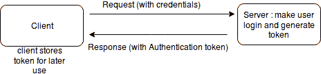
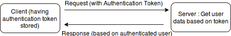
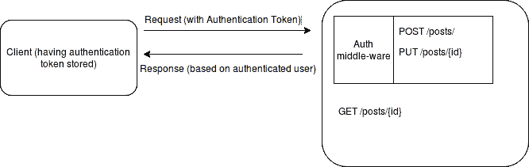

# 审查设计缺陷和安全威胁

在本章中，我们将回顾我们的工作，我们实现的端点，并将探讨我们当前工作可以改进和应该改进的两个不同方面。我们还将看到：

+   我们的代码结构和设计缺陷

+   安全威胁以及我们如何减轻它们

然后，我们将探讨如何继续实现一个 RESTful API，并对前两节讨论的改进进行深入研究。

# 找出当前代码中的问题

到目前为止，我们已经编写了与博客文章端点相关的代码，并且我让你自己来处理评论相关的端点。如果你还没有做到这一点，那么我坚持你首先这样做，或者至少尝试这样做，因为没有实践，知识不会持续很长时间，所以至少在提供一些代码示例或有一些任务要做时保持练习。

无论如何，在上一章中，我们已经编写了实现 RESTful Web 服务端点的代码，我们将深入研究并确定缺少什么以及需要哪些改进。

# 结构和设计缺陷

现在在我们的代码中，有一些明显的缺陷我们可以确定。

# 缺少查询构建器层

尽管我们使用 PDO，但我们仍然需要编写查询并需要执行许多低级操作，比如意识到 SQL 注入（因此我们必须使用准备语句，然后绑定值）来执行与数据库相关的操作。我们应该使用某种查询构建器层，它可以为我们生成查询。因此，一旦我们有了这个层，我们就不需要一遍又一遍地编写 SQL 查询。

尽管 PDO 使得很容易将一个数据库连接换成另一个，但仍然有一些 SQL 查询需要针对不同的数据库进行更改。事实上，不仅对于更改 DBMS 有好处，而且，拥有一种查询构建器也是节省时间的，因为使用查询构建器，我们不总是处理字符串来构建查询，而是可以使用数组或关联数组来构建查询。

# 不完整的路由器

我们实现的路由器只是路由不同的文件，比如`/posts`是通过`posts.php`来提供的。我们的路由器没有指定`posts.php`的哪个函数将处理该请求。我们是根据 URL 模式从`posts.php`内部指定的。提醒一下，这是`posts.php`中的条件部分：

```php
if($url == '/posts' && $_SERVER['REQUEST_METHOD'] == 'GET') {
    $posts = getAllPosts($dbConn);
    echo json_encode($posts);
}
```

这并不难。我们可以简单地在`router.php`中设置这样的条件，并在`posts.php`中调用适当的函数。然而，如果你还记得我们的`routes.php`文件，它是一个非常简单的文件，包含键值对。为了方便起见，我再次放在这里：

```php
<?php

$routes = [
    'posts' => 'posts.php',
    'comments' => 'comments.php'
];
```

正如你所看到的，我们没有在`routes.php`中指定请求方法，所以我们也需要在`routes.php`中指定。除此之外，我们还需要在`routes.php`中使用正则表达式而不是普通的 URL。在`routes.php`中做到这一点很容易，但我们需要添加实现的实际位置将是`core/router.php`。这是可以做到的，但我们不会这样做。我们不会从头开始制作诸如路由器之类的组件，因为这不是世界上第一次做的事情。那我们该怎么办呢？我们可以使用已经可用的开源组件或包中的路由器。稍后，我们将看到如何重用已经存在的开源包或组件。

# 面向对象编程的使用

我们应该使用面向对象的范式，因为这不仅有助于使代码更好、更清晰，而且随着时间的推移，它还可以使开发更快，因为干净的代码减少了我们编写更多功能或修改代码的摩擦。

# 将配置与实现分开

配置应该更好。我们有一个包含数据库连接信息的`config`文件，这很好，但还有许多其他东西应该在配置中，例如，是否显示错误应该通过`config`文件来控制。

因此，经验法则是我们应该将配置与实现分开。这很重要，这样我们就可以随时更改配置，而不必担心与逻辑等代码实现相关的问题。

# 应该写测试

无论您是编写 RESTful Web 服务还是制作网站，编写测试用例都是非常重要的。为此，代码也必须是可测试的。因此，测试（单元测试）不仅测试代码是否符合要求，还检查代码是否足够灵活和松散耦合。与松散耦合的代码相比，紧密耦合的代码不能那么容易地进行测试。

在代码中编写测试用例也使代码更清晰、更灵活，可以轻松修改。在 Web 服务的情况下，API 测试也很方便。

# 输入验证

如上一章所述，尽管我们使用 PDO 的`prepare()`和`bindValue()`方法避免了 SQL 注入，但我们并没有验证来自输入源的数据。这是因为我们在上一章只是为了理解和学习而编写代码。否则，没有输入验证不仅不方便，而且对应用程序也不安全。

要应用验证，我们可以使用手动检查，或者编写一个验证器，我们可以简单地传递输入参数并根据特定规则进行检查。这种类型的验证器非常方便，但编写一个好的验证器也需要时间，因此最好使用已经存在的开源验证器。正如您所看到的，我们试图编写一个路由器，然后发现了问题。这些问题可以解决，但我们需要编写更多的代码，编写更多的代码需要时间。

在后面的章节中，我们将看到如何使用别人编写的验证器，并将其用于创建 RESTful Web 服务端点。我们不仅试图节省编写代码的时间，而且还试图避免有更多的代码，其维护将成为我们的责任。

# 处理 404 和其他错误

现在，如果博客文章或评论的 URL 或 ID 错误，我们还没有处理 404，所以我们需要处理这个问题，不仅发送未找到的错误，还要发送 HTTP 状态码 404。因此，对于不同的响应，我们需要发送不同的 HTTP 状态码。

# 元信息缺失

现在，没有记录计数，也没有分页。所有记录都显示出来了。所以如果有很多记录，比如说几百万条记录，那么返回所有记录就没有意义了。在这种情况下，我们应该应用分页，并且在响应中应该有一个适当的位置显示元信息。

# 数据库字段抽象

目前，从数据库中获取的所有数据都原样显示给用户。如果字段名称发生变化，客户端开发人员正在使用该数据库字段会怎么样？这也会在客户端出现错误。

如果您记得的话，REST 的一个重要约束是服务器返回给客户端的内容与服务器实际存储数据的方式之间的抽象。因此，我们需要保持这种抽象。在接下来的章节中，我们将看到如何保持这种抽象。

# 安全性

正如你所看到的，我们根本没有应用任何类型的安全性。事实上，我们还没有使所有端点都受到登录保护。但是，在现实世界中，不可能没有登录或身份验证。因此，我们需要使一些端点受到登录保护。

在本章中，我们只会看到如何为我们的端点实现安全性，但我们还不会实现，将在后面的章节中实现。现在我们正在研究如何使一些资源受到登录保护，因为基于此，我们将能够识别其他安全风险。因此，在本章的下一节中，我们将看到身份验证的工作原理。

# 保护 API 端点

首先，我们需要了解身份验证和登录的工作原理。客户端应用程序首次发送登录凭据（通常是电子邮件地址和密码）。基于这些凭据，服务器端的登录端点进行用户登录并返回针对经过身份验证的用户的令牌。该令牌存储在客户端。在每个请求中，客户端都会在请求体或请求头中携带该令牌。可以在以下图表中更清楚地看到。

首先，客户端将使用登录凭据访问服务器上的登录端点：



客户端获得令牌后，将其存储以备后用。然后，每次请求时，客户端都会发送相同的令牌，以便服务器可以将客户端视为经过身份验证的：



当服务器发现客户端经过身份验证时，它将返回基于经过身份验证的用户的数据。

如果请求中没有发送令牌，而只允许经过身份验证的用户，则服务器应返回 401 HTTP 状态码，表示未经身份验证或未经授权。

例如，考虑**POST**端点。有一些端点，如创建帖子、修改帖子和删除帖子；这些需要受到保护，因此应该有**Auth 中间件**来保护这些端点，而其他一些**GET**端点，如显示帖子和列出帖子等端点不需要登录保护，因此应该有**Auth 中间件**来保护受保护的端点。具体如下：



正如您在此图表中所看到的，服务器将根据提供的身份验证令牌做出响应，**Auth 中间件**只是为了从身份验证令牌中解析用户。但是，如果**Auth 中间件**无法从身份验证令牌中解析用户，它将简单地返回 401 未经授权的错误。

# 什么是身份验证中间件？

Auth 中间件将不过是一小段代码，用于验证身份验证令牌，并尝试解析该身份验证令牌的用户。它只是一小段代码，将附加到路由中的某些端点或返回端点数据的位置。在任何情况下，它都会在端点的实际代码之前执行，并验证并解析来自请求的`auth`令牌的用户。

在第六章中，*用 Lumen 照亮 RESTful Web 服务*，我们将研究中间件，在第七章中，*改进 RESTful Web 服务*，我们将编写身份验证中间件的代码。

# RESTful Web 服务中的常见安全威胁

既然我们已经看到了当前代码中的问题以及我们将如何在一些端点中实现安全性并使用身份验证中间件，现在是时候看看在构建 RESTful Web 服务时需要考虑的常见安全威胁了。

# 使用 HTTPS

HTTPS 是带有 SSL 的 HTTP。由于我们的数据正在互联网上传输，我们需要确保我们的连接是安全的；因此，我们应该使用 HTTPS。HTTPS 的目的是确保服务器是其所声称的，并且数据以加密形式在客户端和服务器之间的安全连接中传输。

如果您不想购买 SSL 证书，因为对您来说成本太高，那么您可以简单地选择[`letsencrypt.org/.`](https://letsencrypt.org/) Let's Encrypt 是一个免费的证书颁发机构。因此，您可以在不支付 SSL 证书费用的情况下使用它。

# 保护 API 密钥/令牌

由于我们的会话将基于令牌，因此我们需要保护认证令牌。有一些需要做的不同的事情：

1.  不要在 URL 中传递访问令牌。

1.  访问令牌过期。

# 不要在 URL 中传递访问令牌

应该将需要发送到服务器的 API 密钥、令牌或其他敏感信息传递到 POST 主体或请求头中，而不是在 URL 中传递，因为这样可以被 Web 服务器日志捕获。

# 访问令牌过期

访问令牌应该在两种情况下过期。首先，注销时应该过期。其次，访问令牌应该在固定的时间后过期，且这段时间不应该太长。令牌过期的原因是，让访问令牌的有效时间更短更安全。如果我们有许多未使用的访问令牌，那么这些令牌被滥用的可能性就更大。

过期时间大约为两个小时或更短。虽然这取决于您想要如何实现，但较短的过期时间更安全。过期并不意味着用户需要重新登录，而是会有一个令牌刷新端点。将使用最后一个过期的令牌针对特定用户来获取新的令牌。请注意，最后一个令牌应该在有限的时间内可用于刷新令牌端点，之后最后一个令牌不应该可用于刷新令牌。否则，令牌过期有何意义。请记住，两种方式之间存在权衡。每次请求都刷新令牌更安全，但会给服务器带来更多开销。因此，您可以根据自己的情况选择哪种方式。

过期令牌的另一种方法是不通过时间来过期，而是在每次请求时刷新令牌。例如，如果使用一个令牌发送请求，服务器将验证该令牌，刷新令牌，并在响应中发送一个新的令牌。因此，旧令牌将不可用。令牌将在每次请求时刷新。可以用两种方式来实现；这取决于您如何偏好。

# 有限范围的访问令牌

限制访问令牌的范围也是一个好主意，以避免未经授权的人获得令牌时出现问题。此外，如果向客户端应用程序提供的服务不针对特定用户或访问权限，那么它仍应该具有某种 API 密钥，以便我们可以确定谁在请求信息。因此，如果有可疑的尝试使用某个 API 密钥访问 API 端点，我们可以简单地撤销特定的 API 密钥，这样它将不再对未来的请求有效。只有当有多个 API 密钥具有有限的访问级别时才可能实现这一点。

# 公共和私有端点

就像公共网页一样，我们也可以为 RESTful 网络服务设置公共端点。在身份验证之前对用户可用的所有端点都不是公共的。有时，我们创建的端点在登录之前或者无需登录即可使用，但它们只能通过我们的应用程序访问。这些端点不是公共的，因此我们不希望其他应用程序可以访问这些端点。为此，我们将使用一些 API 密钥，如前面讨论的那样。

我们可以使用基于`oauth2`的访问令牌。使用`oauth2`访问令牌的一个重要优势是，如果我们正在创建不同的应用程序来访问相似的端点，那么我们可以为不同的应用程序使用不同的访问令牌。

**示例：**我们可以将在线书店 API 公开为 RESTful 网络服务，并且我们可以有两个应用程序：

+   图书销售`app`。给顾客。

+   图书选择`app.`给老师。

现在通过客户端的应用程序，用户可以浏览不同的书籍，加入购物车并购买。而在教师的应用程序中，用户可以浏览和选择不同的书籍，以便稍后购买书籍的人。这两个不同的应用程序将有一些共同的端点和一些不同的端点。但是，我们不希望任何端点对每个人都是公开的。因此，我们可以有两个不同的访问级别，并制作两个不同的移动应用程序，每个应用程序都有不同的 API 密钥，每个应用程序都有不同的访问级别。当用户登录时，我们将返回一个具有有限访问权限的访问令牌。不同的令牌可以根据用户角色具有不同的访问级别。

假设在教师的应用程序中，有些教师只能选择书籍，而另一些教师，比如**HOD**（系主任）也可以购买书籍。因此，在登录后，这两个用户可以具有不同的访问令牌，转换为不同的访问级别。这个访问级别将基于访问令牌，将被转换为已登录的用户，并且我们将根据用户的角色决定访问级别。

# 公共 API 端点

因此，即使在登录之前，这些端点也是私有的。如果我们有一些公共的 API 端点，比如天气预报向每个人提供预报数据。最好还是有一个 API 密钥来跟踪谁在向服务器获取数据，但如果不是这种情况，我们只是在没有任何 API 密钥的情况下提供数据呢？这是否意味着我们是公开提供这些数据，所以我们不需要担心任何事情？实际上，不是。

如果客户端向服务器传递任何信息，最好使用 TLS 来加密数据。除此之外，我们也不能允许任何人不断地命中一个端点；为了公平使用，我们需要应用节流，这意味着 API 端点只能在特定时间段内被一个客户端命中有限次数。

# 不安全的直接对象引用

不安全的直接对象引用是指根据来自请求的数据获取或提供敏感信息。这不仅是 RESTful Web 服务的问题，也是网站的问题。为了理解这一点，让我们举个例子：

假设我们要更改用户的名字或账单地址。最好是将其引用到一个端点，比如：“PATCH /api/users/me?fist_name=Ali（在标头中具有令牌）”，而不是“PATCH /api/users/2?fist_name=Ali（在标头中具有令牌）”。

为了让用户修改自己的数据，它将在标头中具有一个令牌，服务器将确保该用户可以修改记录。但是，哪条记录？在具有“我”的端点中，它将根据令牌获取用户，并修改其`first_name`。

在第二种情况下，我们有用户的`id=2`，因此可以根据用户`id=2`获取或更新用户，这是不安全的，因为用户可以在 URL 中传递任何用户 ID。因此，问题不在于这种类型的 URL，问题在于根据用户输入或客户端请求直接获取或更新记录。无论提供什么用户 ID，如果我们打算修改已登录用户的名字，那么它应该根据令牌获取或更新用户，而不是 URL 中的用户 ID。

# 限制允许的动词

我们需要限制允许的动词。例如，如果 Web 服务端点仅用于读取目的而不用于修改，则在 URL`/api/post/3`上，我们应该只允许“GET 方法/动词”，而不应该允许“PATCH、PUT”、`DELETE`或`POST`。如果有人使用`PATCH`、`PUT`、`DELETE`或`POST`命中`/api/post/3`，它不应该提供服务，而应该返回“405 方法不允许”错误。

然而，如果他们的客户端有访问令牌，并且基于此，用户只被允许使用`GET`方法（尽管还有其他方法可用），而不是其他方法，那么具有该用户的客户端使用其他方法访问相同的 URL，那么应该出现“403 禁止”错误，因为虽然有允许的方法，但基于其角色或权限，当前用户只是不被允许使用。

# 输入验证

似乎输入验证可能与技术无关，但验证输入非常重要，因为在数据库中拥有干净的数据不仅有益，而且还有助于防范诸如 XSS 和 SQL 注入等不同威胁。

实际上，XSS 预防和不同的输入验证是输入验证的重要部分，而 SQL 注入主要是在向数据库输入数据时防止的。另一种需要防范的威胁是 CSRF，但这将通过 API 密钥或身份验证令牌的使用已经得到防范。然而，也可以使用单独的 CSRF 令牌。

# 可重用的代码

我们没有讨论每一个安全威胁，但我们使用了一些需要注意的东西，以避免与安全相关的问题。我们已经讨论了如何保护我们的端点以及如何为 RESTful Web 服务实施身份验证。我们还讨论了我们在上一章中编写的当前代码中的缺陷。

然而，我们还没有编写代码来使我们的代码更好、更安全。我们可以做到这一点，但我们应该明白，已经有很多东西可以利用，而不是从头开始做一切。因此，我们将使用可用的代码，而不是自己用纯 PHP 编写一切。这不仅是为了节省时间，而且是为了使用社区中可用的东西，经过社区的时间测试。

因此，如果我们已经决定使用第三方代码片段、包或类，那么我们应该明白，在 PHP 中没有一个开发人员组在一个框架中编写代码。有许多 PHP 类作为独立类可用。有些是为某些框架编写的。有些是为 WordPress 等开源 CMS 编写的。还有一些包可在 PEAR（PHP 扩展和应用程序存储库）中找到。因此，一个地方可用的代码可能对其他代码无用或不兼容。

事实上，加载不同的代码片段在一起也可能是一个问题，特别是当有很多依赖关系时。

因此，PHP 社区迎来了革命。这不是一个框架、CMS 或开源类或扩展，而是 PHP 的依赖管理器，称为 Composer。我们可以以标准方式安装 Composer 包，Composer 已成为大多数 PHP 流行框架的标准。我们在这里不会更多地讨论 Composer，因为 Composer 是下一章的主题，所以我们将详细讨论它，因为我们将大量使用 Composer 进行包安装、依赖管理、自动加载等。不仅在本书中，而且如果您要在 PHP 中制作任何适当的应用程序，您都需要一个 composer。因此，我们将主要通过 Composer 包使用可重用的代码。

# 总结

我们已经讨论了当前代码中的问题和缺失部分以及安全威胁，并讨论了我们将如何实施身份验证。我们还讨论了我们将使用可重用组件或代码来节省时间和精力。此外，因为代码将由我们自己编写，我们将负责其维护和测试，因此使用开源的东西，这些东西不仅可用，而且在许多情况下经过测试，以及由社区维护，更有意义。出于这个目的，我们将主要使用 Composer，因为它已成为 PHP 中打包和使用可重用包的标准工具。

在下一章中，您将了解更多关于 Composer 的信息。它是什么，它是如何工作的，以及我们如何将其用于不同的目的。

在本章中，我们已经讨论了安全威胁，但我们并没有详细地涵盖它们，因为我们只有一个章节来讨论。但是，Web 应用程序和 RESTful Web 服务的安全性是一个广泛的话题。关于这个话题还有很多东西需要学习。我建议你去查看[`www.owasp.org/index.php/Category:OWASP_Top_Ten_Project`](https://www.owasp.org/index.php/Category:OWASP_Top_Ten_Project)作为一个起点。那里有很多东西可以学到，你也会从不同的角度学到东西。
