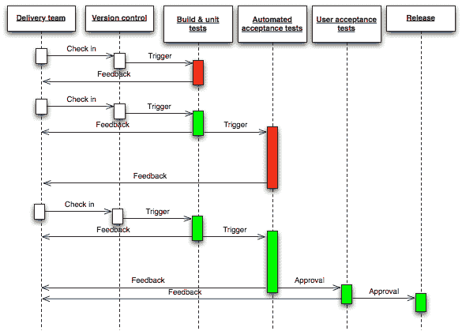

# 微服务

尽管我们在本书中讨论了不同的方面，但我们所做的是为一个简单的博客创建了一个 RESTful web 服务。我们选择了这个例子，以便在业务逻辑方面保持简单，这样我们可以更详细地专注于我们的实际主题。这是有帮助的，但在现实世界中，事情并不那么简单和小。有着不同部分的大型系统很难维护。这些部分也很难调试和扩展。扩展性与仅仅维护和优化以获得更好的性能是不同的。在扩展性方面，代码和部署环境的优化都很重要。可扩展性、可维护性和性能一直是我们面临的挑战。

为了解决这个问题，我们有一种被称为微服务的架构风格。因此，在本章中，我们将讨论这个问题。微服务并不是必须使用的东西。然而，它们解决了我们在为更大的系统创建 RESTful web 服务时经常面临的一些挑战。因此，我们将看到微服务如何解决这些问题，以及微服务架构带来的挑战。

以下是本章将讨论的主题：

+   介绍微服务

+   基于微服务架构的动机

+   它与 SOA（面向服务的架构）有何不同

+   团队结构

+   微服务的挑战

+   微服务实现

# 介绍微服务

首先让我们定义微服务架构，然后深入了解微服务的细节。微服务架构成为一个热门术语，但并没有任何正式的定义。事实上，迄今为止，关于其属性或定义，还没有官方共识。然而，不同的人尝试过定义它。我在 Martin Fowler 的博客上找到了一个定义，非常令人信服。他和 James Lewis 这样定义它：

微服务架构风格是一种将单个应用程序开发为一组小服务的方法，每个服务在自己的进程中运行，并使用轻量级机制进行通信，通常是 HTTP 资源 API。这些服务围绕业务能力构建，并且可以通过完全自动化的部署机制独立部署。这些服务的集中管理最少，可能使用不同的编程语言和不同的数据存储技术。-- James Lewis 和 Martin Fowler

这似乎很正式，所以让我们深入了解这个定义，并尝试理解微服务架构。

首先，你应该知道，在我们为博客创建的 RESTful web 服务的例子中，是一个单体式的 web 服务。这意味着一切都在同一个 web 服务中。一切都在一起，因此需要一起部署为一个代码库。我们也可以对更大的应用程序使用相同的单体式方法，但该应用程序将变得越来越复杂，可扩展性将会减弱。

与此相反，微服务由许多小服务组成。每个小服务被称为微服务，或者我们可以简单地称之为服务。这些服务实现了一个应用程序的目的，但它们是独立的，非常松散耦合的。因此，每个微服务都有一个单独的代码库和一个单独的数据库或存储。由于每个微服务都是独立的，即使我们想要在同一台服务器上或不同的服务器上部署，它也可以独立部署。这意味着所有服务可能是相同的语言或框架，也可能不是。如果一个服务是 PHP，另一个可能是 Node.js，另一个可能是 Python。

# 如何将应用程序划分为微服务？

因此，问题是，“如果我们有一个庞大的应用程序，那么我们如何决定如何将其分成不同的微服务？”在理解如何将一个大系统分成微服务时，我们将考虑不同的因素。这些因素基于马丁·福勒所谓的“微服务的特征”。您可以在[`martinfowler.com/articles/microservices.html`](https://martinfowler.com/articles/microservices.html)上查看马丁·福勒关于微服务特征的完整文章。

因此，在将一个大系统分成小的微服务时，需要考虑以下因素：

+   每个微服务应该独立于其他微服务。如果不是完全独立的（因为这些服务是一个应用程序的一部分，所以它们可能会相互交互），那么依赖关系应该是最小的。

+   我们将应用程序分成不同的组件。所谓组件，是指一个可以独立替换和升级的软件单元。这意味着替换或升级一个组件不应该对应用程序产生任何（或者最小的）影响。一个微服务将基于这样一个单一组件。

+   一个服务应该有一个单一的责任。

+   将应用程序或系统分成几个微系统，可以从业务需求入手。根据业务能力制作组件是一个好主意。事实上，我们的团队应该根据业务能力而不是技术来划分。

+   同时，确保服务不要过于细粒度也很重要。过于细粒度的服务可能会导致开发工作量增加，同时由于相互交互的事物太多而导致性能不佳，因为它们实际上是相互依赖的。

在理想情况下，这些服务总是彼此独立的。然而，这并不总是可能的。有时，一个服务需要另一个服务的某些东西，有时，两个或更多服务有一些共同的逻辑。因此，依赖服务主要通过 HTTP 调用相互交互，共同的逻辑可以在不同服务之间的共享代码库中。然而，这仅在这些服务中使用相同技术时才可能。实际上，这意味着两个或更多服务依赖于共同的代码库。因此，根据前述定义，从理论上讲，这违反了微服务架构，但由于没有正式的理论或官方规范，所以我们考虑任何在现实世界中发生的事情。

# 对微服务的动机

有几个动机支持微服务。然而，我想要开始的是，当我们将其分成具有单一责任的组件时，我们遵守**SRP**（**单一责任原则**）。单一责任实际上是面向对象原则中的前五个之一，也被称为 SOLID（[`en.wikipedia.org/wiki/SOLID_(object-oriented_design)`](https://en.wikipedia.org/wiki/SOLID_(object-oriented_design))）。这个单一责任原则，无论是在架构层面还是低层面，都使事情变得简单和容易。在微服务的情况下，它将不同的组件分离开来。因此，修改一个组件的原因将与一个单一功能相关。系统的其他组件和功能将像以前一样工作。这就是微服务作为独立的组件和功能使它们更容易修改而不影响其他组件的方式。

以下是必须分开微服务的其他原因。

# 维护和调试

告诉大家模块化的代码总是更容易维护并且可以轻松调试，这并不是什么新鲜事。您可以轻松调试它，而且还有什么比不仅是模块化而且还部署为独立模块的组件更模块化的呢？因此，我们从微服务中获得了许多优势，这些优势是我们从模块化代码中获得的。

然而，有一点需要理解。如果我们从一开始就使用微服务架构，应用程序将是模块化的，因为我们正在分开开发服务。然而，如果我们没有从一开始就使用微服务，而是后来想要将其转换为微服务，那么首先，我们需要有模块化的代码，然后我们才能使用微服务架构，因为如果我们没有模块和松散耦合的代码，我们就无法将它们拆分成独立的组件。

总之，微服务的动机很简单，我们可以轻松地调试模块化的代码和组件。在维护的情况下，如果代码在独立的组件中，并且其他服务得到了它们所需的东西，而不用担心修改组件的内部逻辑，那么就不会出现连锁反应。

实际上，这还不是全部；在维护阶段一个非常重要的因素是生产力。在更大的代码库中，随着时间的推移，生产力可能会降低，因为开发人员需要担心整个应用程序。然而，在微服务中，一个团队中的开发人员进行的特定更改不需要担心整个应用程序，而只需要关注那个特定服务内的代码，因为对于那个特定的更改和正在处理它的开发人员来说，这一个微服务就是整个应用程序，其责任远远小于整个应用程序。因此，在维护期间，微服务的生产力可能比单片应用程序要好得多。

# 可扩展性

当系统扩展并且您想要为更多客户提供良好的性能时，经过一段时间，当您也进行了优化后，您需要更好、更强大的服务器。您可以通过向服务器添加更多资源来使服务器更强大。这被称为垂直扩展。垂直扩展有其局限性。毕竟，这是一个服务器。如果我们想要更多的可扩展性呢？实际上，还有另一种扩展方式，即水平扩展。在水平扩展中，您添加更多的小型服务器或服务器实例，而不是将所有资源添加到一个服务器中。在这种情况下，一个单片应用程序将如何部署在多个服务器上？我们可能需要在多个服务器上部署完整的应用程序，然后通过负载均衡器来管理通过多个服务器的流量。

然而，将整个应用程序部署在多个服务器上并不划算。如果我们可以让应用程序的一部分从一个服务器提供，另一部分从另一个服务器提供呢？这怎么可能？我们只有一个应用程序。这就是微服务架构的优势所在。它的好处不仅仅是可扩展性。其关键好处之一是系统中松散耦合的组件。

# 技术多样性

正如我们所见，在微服务中，每个代码库都与其他代码库分开。因此，不同的团队可以使用不同的技术和不同的存储来开发不同的服务。事实上，这些团队完全不需要在不同的服务之间使用相同的技术，除非它们提供的其他服务需要相互交互。然而，如果我们想要使用共享代码的选项来避免在不同技术中重复编写相同的逻辑，那么为了拥有共享的代码库，我们可能需要使用相同的技术。

# 弹性

在微服务中，弹性也是其中一个关键的好处。由于每个服务都是一个独立的组件，如果系统的一个组件因某种原因失败，那么问题可以与系统的其余部分隔离开来。

然而，我们需要确保系统在发生故障时能够正确降级。如果一个服务出现故障，我们可以尝试将其最小化，但可能会再次出现故障。然而，为了最小化其影响，我们应该小心处理，以便最小化其对其他服务和我们应用程序用户的影响。

# 可替换性

如果要替换系统的一部分，那么在单片架构中并不那么简单，因为一切都在同一个代码库中。然而，在微服务中，更容易替换系统的一个组件，因为你所需要做的就是有另一个服务并用它替换现有的服务。显然，你仍然需要有一个替代服务，但不像在同一个代码库中用其他代码替换整个组件那样。

# 并行化

通常，客户希望他们的软件能够早期开发并尽快上市，以便他们可以测试他们的想法或占领更多市场。因此，他们希望有更多的开发人员并行工作在他们的应用程序上。不幸的是，在单片应用程序中，我们可以进行有限的并行工作。实际上，如果我们有非常模块化的代码，我们也可以在单片应用程序中进行并行工作。然而，它仍然不能像基于微服务的应用程序那样独立和模块化。

每个服务都是独立开发和部署的。虽然这些服务彼此通信，但开发可以独立进行，在大多数情况下，我们可以保持几个服务的独立开发。因此，许多开发人员，实际上是开发团队，可以并行工作，这意味着软件可以早期开发。如果多个模块需要解决问题或需要另一个功能，则可以并行进行。

# 与 SOA 的不同之处

SOA 代表面向服务的架构。从名称上看，这种架构依赖于服务，就像微服务一样。服务定位是计算机软件中的一种服务设计范式。其原则强调关注点的分离（与 SRP 相同）。到目前为止，它似乎与微服务相似。在了解差异之前，我们需要知道什么是 SOA。尽管没有一个清晰的官方定义 SOA。所以让我们从维基百科中获取这个基本定义：

面向服务的架构（SOA）是一种软件设计风格，应用组件通过网络上的通信协议向其他组件提供服务。服务导向架构的基本原则与供应商、产品和技术无关。

如果你看这个定义，你会发现 SOA 与微服务非常相似，但它的定义并不那么简洁和清晰。一个原因可能是 SOA 本身是一个广义的架构。或者我们可以更好地说，SOA 是微服务的广义形式。

如 Oracle 的帖子所述：

“过去十年我们一直在谈论的就是微服务的 SOA。”-- *Torsten Winterberg, Oracle ACE Director.*

因此，微服务遵循相同的原则，但它更加专业化，专注于拥有多个独立的服务，其中一个服务是完全不同的组件，独立于其他服务存在。

# 团队结构

根据康威定律：

“设计系统的组织...受限于产生与这些组织的通信结构相同的设计。”

因此，为了基于微服务架构制定设计并获得其好处，我们还需要相应地组织工作的结构化团队。

通常，在单片应用程序中，我们有以下团队：

+   Dev-ops 团队

+   后端开发团队

+   数据库管理员团队

+   移动应用程序开发团队

然而，在分布式架构的情况下，例如微服务（如果我们正在开发电子商务应用程序），我们将有以下团队：

+   产品目录

+   库存

+   订单

+   优惠券

+   愿望清单

所有这些团队都将有成员，包括 Dev-ops、后端开发人员、数据库管理员和移动应用开发人员。因此，在微服务的情况下，我们将为每个服务设立一个团队。

**团队规模：**

没有硬性规定，但建议团队规模应符合杰夫·贝佐斯的“2 披萨规则”：<q>如果一个团队不能靠两块披萨养活，那就太大了。</q>原因是，如果团队变得更大，那么沟通可能会变得糟糕。

# 微服务的挑战

没有免费的午餐。一切都有其不利之处，或者至少有一些需要应对的挑战。如果我们选择微服务，它也有自己的挑战。因此，让我们来看看它们，并讨论如果有权衡的话，如何将它们最小化。

# 基础设施维护

尽管你不必每天更新你的基础设施，但它仍然需要维护，需要更多的努力。微服务带来了技术自由，但并非没有任何代价。你必须使用不同的技术来维护不同的服务器实例。这将需要更好的基础设施和有更多技术经验的人。

实际上，你并不总是需要更好的基础设施和对所有这些不同技术都有了解的人。通常，每个负责不同服务的团队都会有自己的基础设施或与 Dev-ops 相关的人员。然而，在这种情况下，你需要更多的人，因为现在，你不再在不同团队之间共享 Dev-ops 或基础设施相关的人员。事实上，这就是微服务团队的组成方式。团队至少不应该有共享资源。否则，你就无法因为独立服务而获得并行工作的优势。

然而，基础设施不仅意味着服务器设置，还包括部署、监控和日志记录。因此，为了达到这个目的，你不能只使用一种技术来解决问题，而牺牲了你的技术选择。然而，限制你的技术选择也可以让 Dev-ops 变得更容易一些。

另一件事是你需要在持续集成服务器上进行自动部署。它运行你的测试用例，然后，如果一切顺利，就会部署到你的实际服务器上。为此，你需要有 Dev-ops 人员编写脚本来自动化你的部署。有几种方法可以做到这一点。

# 性能

实际上，微服务可以更快地运行的原因是，客户端使用了一个完全独立的微服务。一个明显的原因是，一个请求在一个小的微服务中需要经过的步骤比在一个大型单体应用中要少。

然而，这是一个理想情况，不是所有的微服务都完全独立于彼此。它们相互作用并且相互依赖。因此，如果一个服务需要从另一个服务获取某些东西，它很可能需要进行网络调用，而网络调用是昂贵的。这会导致性能问题。然而，如果服务以最小的依赖方式创建，这种情况可以最小化。如果依赖不是最小的，那就意味着服务不是独立的，在这种情况下，我们可以合并这样的服务并创建一个独立的服务。

另一个选择可以是共享代码；这段代码将被用于不同的服务之间。如果两个或更多服务使用相同的功能，那么我们可以将其作为不同服务依赖的另一个服务，而是将其作为不同服务代码库的一部分共享代码。我们不会重复自己，会尝试将其制作成不同服务可以使用的模块或包。然而，有些人认为这是不好的做法，因为我们会在不同服务之间共享一些代码，这意味着它不会松散耦合。

# 调试和故障排除

正如你所看到的，我们说在微服务中调试和维护会更容易。然而，当这些服务之间进行通信并且一个服务的输出影响另一个服务时，这也会成为一个挑战。

当我们有不同的服务时，我们需要一种服务之间相互通信的方式。服务之间的通信有两种方式：通过 HTTP 调用或通过消息。这里，通过消息我们指的是使用某种消息队列，比如 RabbitMQ 等。在消息传递的情况下，如果出现错误或者发生了一些意外情况，那么这可能会非常困难。因为不只有一个服务，每个服务都是基于前一个服务的输出工作的，所以很难知道问题出在哪里。

因此，解决这个问题的一种方法是彻底编写测试。因为如果确保每个服务的测试用例都被编写并测试它们是否正常工作，那么在部署之前就可以发现问题。

然而，情况并非总是如此。这是因为不只有一个服务。许多服务正在交互，有时，实时环境中会出现问题，你希望进行调试和修复。出于这个目的，日志非常重要。然而，再次强调，这是一个分布式环境。那么，我们能做些什么呢？以下是你需要确保在日志中做的一些事情。

# 日志应该是集中的

你需要在某个集中的地方收集日志。如果你的日志在一个集中的地方，那么查看它们就会更容易，而不是检查每个服务器实例的日志。

这也很重要，因为你应该在实例之外的地方有日志备份。原因是，如果你替换了一个实例，那么你可能希望保留日志的副本以便在调试时使用。这可以是任何地方，包括亚马逊 S3、你的数据库或者磁盘，但你希望它是持久的和可用的。如果你在 AWS 上，你也可以使用他们的监控服务 CloudWatch。

# 日志应该是可搜索的。

拥有日志是好的。但就像互联网上的很多信息一样，如果你不知道哪个链接对你来说有用，那它实际上并不有用。由于搜索引擎告诉我们哪些页面有更相关的内容，这变得更容易。同样，活动应用程序的日志，特别是当有很多服务的日志在一起时，将不会那么有用。会有很多日志。因此，为了使它们可用，你应该以一种可以搜索和在查看时容易理解的方式存储你的日志。

# 跟踪请求链

就像用户在网站上从一个页面转到另一个页面一样，用户的客户端发送请求来执行不同的任务。因此，知道用户在这之前发送了哪些请求是一个好主意，因为在某些情况下，之前的请求可能会影响其他请求。因此，为了跟踪这一点，你可以简单地传递一个标识符，第一次期望在所有其他请求中都能找到相同的标识符。

另一个优点是，它不仅会显示流程，而且如果有人要求你解释为什么出现了某个特定的问题，那么对你来说也会更容易。如果标识符在客户端，相关人员可以在错误报告中给你该标识符作为参考，这样你就可以理解要跟踪哪个请求流程。

# 动态日志级别

通常，对于日志记录，你会使用某种日志框架，典型的日志级别有警告、信息、调试和详细。通常，在生产环境中，会使用信息级别或其他信息，但如果你想要解决一些问题并进行调试，你应该能够动态地更改日志级别。

因此，如果需要的话，你应该能够动态地在运行时设置日志级别。这很重要，因为如果在生产环境中出现问题，你不希望它持续很长时间。

# 实施

由于本章只是微服务的简介，我们不会深入讨论实现的细节。然而，我们将概述如何在微服务中实现不同的事物。我们已经在本书中讨论了 RESTful Web 服务的实现。然而，微服务还有其他一些部分。因此，我们只会了解在实现这些部分时涉及了什么。

# 部署

我们将自动化部署。我们将使用持续交付工具。持续交付是一个过程，其中有短周期的频繁交付，并确保软件可以随时可靠地发布。它旨在更快地发布软件，并通过构建、测试和频繁发布软件的方法来最小化风险。

持续交付从源代码控制一直到生产的自动化。有各种工具或流程可以帮助实现持续交付过程。然而，在其中有两个重要的事情：

+   测试

+   CI（持续集成）

首先，在提交代码之前，开发人员应该在提交 CI 服务器上运行他们的测试（最重要的是单元测试），运行集成测试，并在通过测试时在 CI 服务器上集成。Travis CI 和 Jenkins CI 是流行的 CI 工具。除此之外，Circle CI 也很受欢迎。

在持续集成之后，构建会自动进行并自动部署。由于一图胜千言，为了进一步阐述，我在这里添加了维基百科的这张图片（这张图片来自维基媒体）：

通过这个图表，我们将对 CI 有一些了解。有关持续交付的详细信息，您可以阅读维基百科文章[`en.wikipedia.org/wiki/Continuous_delivery`](https://en.wikipedia.org/wiki/Continuous_delivery)。

# 服务间通信

我们看到服务器之间的通信很重要。服务彼此依赖，有时一个服务的输入是另一个服务的输出，有时一个服务正在使用另一个服务。其中一个重要的事情是这些服务之间的通信。

因此，我们可以将服务间通信分为两种类型：

1.  同步通信

1.  异步通信

# 同步通信

在同步通信中，一个服务与另一个服务通信并等待结果。通常通过简单的 HTTP 调用来完成，使用与最终客户端相同的方法。因此，这些是简单的 HTTP 调用，得到一个响应（通常是 JSON）。一个服务向另一个服务发送 HTTP 请求，等待其响应，并在收到响应后继续。同步通信具有网络开销，并且必须等待响应，但实现简单，有时延迟不是问题。因此，在这种情况下，为了简单起见，我们可以使用同步通信。

# 异步通信

在异步通信中，一个服务不会等待另一个的响应。它基于发布-订阅模型。它使用消息代理向其他消费者/订阅者的服务发送消息。它使用轻量级消息传递工具，通过这些工具，一个服务向另一个服务发送消息。这样的消息传递工具包括但不限于 RabbitMQ、Apache Kafka 和 Akka。

如果您对了解更多关于微服务之间通信的内容感兴趣，那么[`howtocookmicroservices.com/communication/`](http://howtocookmicroservices.com/communication/)上的文章可能会很有趣。

# 共享库或公共代码

正如我们讨论的，可能有一些代码在不同的服务之间是共通的。它既可以是第三方代码，也可以是由团队为同一个应用程序编写的代码。无论哪种情况，我们显然都希望使用这些共通的代码。为了做到这一点，我们不会在我们的应用程序中复制这些代码，因为这违反了 DRY（不要重复自己）原则。但是，请注意，如果我们使用不同的编程语言/技术，我们就无法使用共通的代码。

所以我们做的是，我们打包那些通用代码或共享库，然后上传到某个地方，在部署时可以从那里获取这个包。在 PHP 的情况下，我们会创建 composer 包并上传到 packagist。然后，在服务中，当我们需要那些通用代码时，我们只需安装 composer 的包并从 vendor 目录中使用那些通用代码。

像 composer 这样的包和包管理器不仅仅存在于 PHP 中。在 Node.js 中，有 NPM（Node Package Manager），你可以使用它来创建一个 Node 包来实现相同的目的。因此，在不同的技术中，有不同的方法来创建和使用这样的包。

# 总结

在这一章中，作为本书的最后一章，我试图介绍微服务，这是一种现在备受关注的架构风格。我们研究它是因为我们需要一种架构，可以使用 RESTful Web 服务在复杂和更大的系统中实现更好的性能和可伸缩性。

本书的重点是 PHP7 中的 RESTful Web 服务，我们还研究了与构建 RESTful Web 服务或 PHP7 相关的其他主题。我们详细研究了其中一些主题，而其他一些只是触及了一下。许多这些主题太广泛，无法包含在一个章节中。其中一些主题可以有一本专门的书来专门讨论。这就是为什么我提供了不同的 URL 以供学习材料或建议阅读，如果你感兴趣的话可以参考。

# 接下来

有两件重要的事情：

**实践：**

真正的学习是当你开始实践某些东西时才开始的。当你实践时，有时会遇到问题并学到更多，这是你在没有解决这些问题的情况下无法学到的。

**查阅建议的材料：**

无论我提供了什么建议阅读材料，都请停下来至少看一下建议的材料。如果你觉得有帮助，可以深入了解。谁知道，那些建议的材料可能会教会你比整本书更有价值的东西。毕竟，那些材料提供了比我们在本书中讨论的更多细节。
