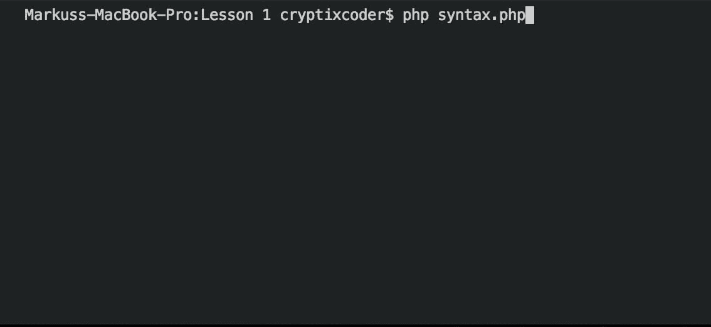
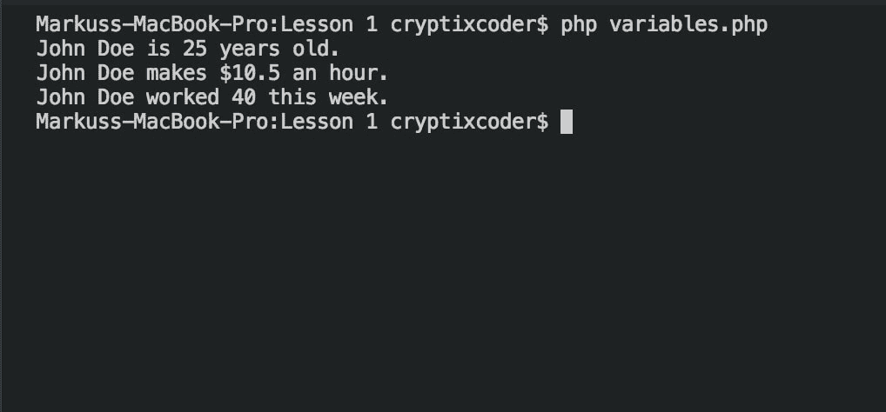
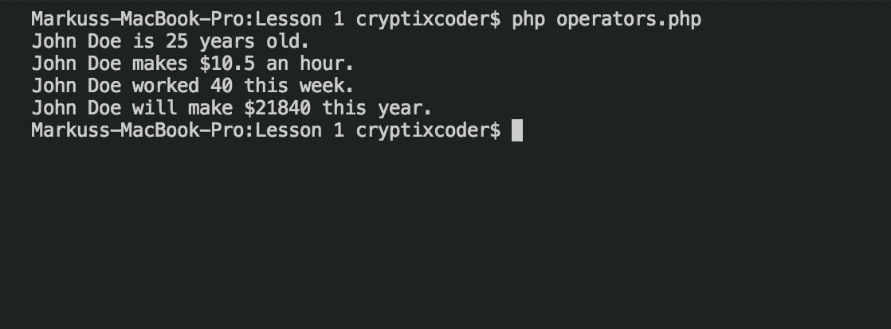
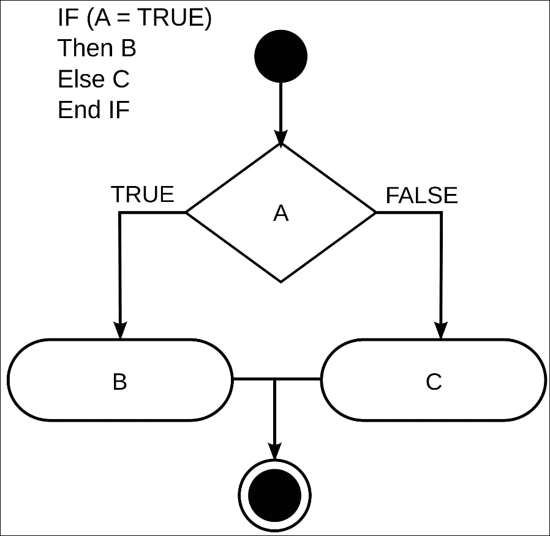
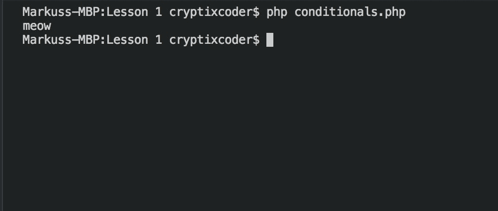
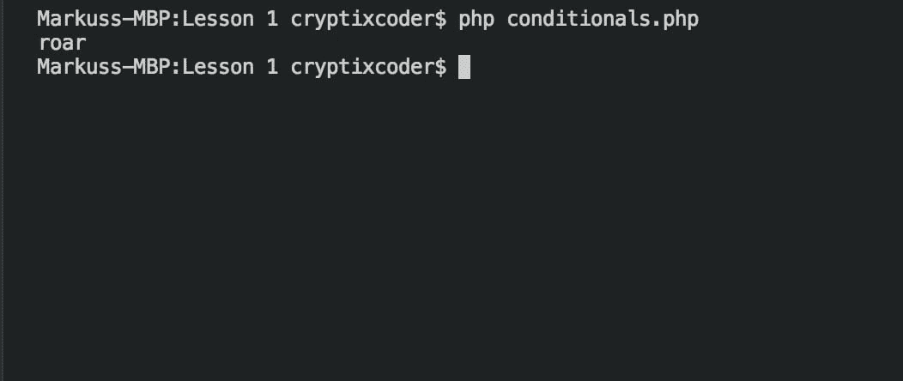

# 第一章. PHP 入门

PHP，或者预处理超文本，是一种用于设计网页应用程序并使网站看起来更直观和有趣的编程语言。多年来，PHP 也在服务器端脚本语言方面获得了很大的流行。PHP 是一种易于使用但功能强大的语言。PHP 可以在多个操作系统上运行，并支持多个服务器。PHP 的所有这些特性使其成为网页设计语言的理想选择。

本书将带你了解 PHP 的基础知识，包括声明语法、声明和使用变量和数据类型、运算符和条件语句。然后，它将涵盖构建 PHP 框架的原则以及构建自己的 PHP 网页应用程序。

在本章中，你将开始学习 PHP 编程语言的基本知识。我们将涵盖语法以及如何在 PHP 中声明和使用变量。我们还将看看如何使用`if`语句控制执行流程。

在本章结束时，你应该能够使用这些元素编写简单的程序。

在本章结束时，你将能够：

+   使用 PHP 的基本语法编写简单的程序

+   使用变量存储不同的数据，并使用不同的运算符进行操作

+   使用条件语句来控制执行流程

# 基础知识

我们将从查看 PHP 语法和执行我们的第一个文件开始。让我们开始吧。

在 PHP 中，语法非常重要；你需要适当的语法让你的服务器知道它应该从哪里开始解析 PHP，并且你必须通过开放和关闭 PHP 标签来显示它，如下所示：

```php
<?php

?>
```

通过使用 PHP 标签，你可以在文档的任何地方添加你的代码。这意味着如果你有一个 HTML 网站，你可以添加标签以及一些 PHP 代码，它就会被处理。除了使用开放和关闭 PHP 标签，你还必须在文件中使用`.php`扩展名。

让我们从一个快速示例开始。

## 使用 PHP 显示"Hello World"

在本节中，我们将利用我们到目前为止学到的知识来向用户显示一个字符串：

1.  打开你的代码编辑器。

1.  创建一个新文件并命名为`syntax.php`。

1.  输入以下内容，并保存你的文档：

```php
    <?php

    ?>
    ```

1.  在**终端**中打开你的工作目录。

1.  输入以下命令：

```php
    php syntax.php
    ```



1.  切换回你的文档并输入以下内容：

```php
    <?php 
         echo "Hello World";
    ?>
    ```

1.  回到终端并输入以下内容：

```php
    php syntax.php
    ```

现在你应该在屏幕上看到字符串"Hello World"被打印出来。

## 变量和数据类型

为了开始学习 PHP，我们必须首先看一下将用于构建每个项目的核心构建块。在我们的应用程序中，我们总是需要一种临时存储数据的方法（在我们的情况下，我们称之为存储方法变量）。

变量定义如下：

```php
$VARIABLENAME = "VALUE";
```

如你在上面的例子中所见，变量以`$`符号开头，后面跟着变量名，使用赋值运算符赋值。在这里，我们有一个名为`VARIABLENAME`的变量，其字符串值为`VALUE`。

### 注意

变量名不能以数字或特殊符号开头，除了用于定义变量本身的`$`符号。

PHP 是少数几种不需要在赋值之前声明数据类型的语言之一。

| **类型** | **示例** |
| --- | --- |
| 字符串 | "Hello World" |
| 数字 | 123 |
| 浮点数 | 1.095 |
| 布尔值 | TRUE 或 FALSE |

我们现在将尝试在 PHP 中实现变量。

## 使用变量

在本节中，我们将举例说明在程序中使用变量的真实例子。我们将首先创建一个变量来存储用户的姓名：

1.  打开你的代码编辑器。

1.  创建一个新文件并命名为`variables.php`。

1.  输入以下内容，并保存你的文档：

```php
    <?php
    	$name = "John Doe";
    	$age = 25;
    	$hourlyRate = 10.50;
    	$hours = 40;
    	echo $name . " is " . $age . " years old.\n";
    	echo $name . " makes $" . $hourlyRate . " an hour. \n";
    	echo $name . " worked " . $hours . " this week. \n";
    ?>

    ```

1.  在终端中打开你的工作目录。

1.  输入以下命令，然后按*Enter*：

### 注意

将变量的值插入字符串的另一种方法是使用特殊的语法：

```php
    <?php
    echo "My name is ${$name}.";
    ?>
    ```

## 运算符

我们现在将看一下 PHP 中可用的各种运算符。

### 比较运算符

在变量部分，我们看到了=符号，在 PHP 中被称为赋值运算符。这个运算符正如其名，允许您给变量赋值。首先是比较运算符。比较运算符允许您在给定的条件情况下比较两个值。

在比较运算符集合中包括等于、相同、不等、不相同、小于和大于运算符。

| 用法 | 名称 | 描述 |
| --- | --- | --- |
| `$a == $b` | 等于 | 如果`$a`等于`$b`，则为 TRUE。 |
| `$a === $b` | 相同 | 如果`$a`等于`$b`，并且它们是相同类型，则为 TRUE。 |
| `$a!= $b` | 不等 | 如果`$a`不等于`$b`，则为 TRUE。 |
| `$a!== $b` | 不相同 | 如果`$a`不等于`$b`，或它们不是相同类型，则为 TRUE。 |
| `$a < $b` | 小于 | 如果`$a`严格小于`$b`，则为 TRUE。 |
| `$a > $b` | 大于 | 如果`$a`严格大于`$b`，则为 TRUE。 |
| `$a <= $b` | 小于或等于 | 如果`$a`小于或等于`$b`，则为 TRUE。 |
| `$a >= $b` | 大于或等于 | 如果`$a`大于或等于`$b`，则为 TRUE。 |

### 逻辑运算符

接下来是逻辑运算符。逻辑运算符用于一次检查多个情况。逻辑运算符集合包括`NOT`、`AND`和`OR`运算符。

| 用法 | 名称 | 描述 |
| --- | --- | --- |
| `! $a` | NOT | 如果`$a`不为 TRUE，则为 TRUE。 |
| `$a && $b` | AND | 如果`$a`和`$b`都为 TRUE，则为 TRUE。 |
| `$a &#124;&#124; $b` | OR | 如果`$a`或`$b`中的一个为 TRUE，则为 TRUE。 |

### 数学运算符

在您的程序中，有时需要进行一些数学运算；这就是数学运算符发挥作用的地方。它们使您能够对两个数进行加法、减法、乘法、除法，并得到两个数相除的余数。

| 用法 | 名称 | 描述 |
| --- | --- | --- |
| `$a + $b` | 加法 | `$a`和`$b`的和 |
| `$a - $b` | 减法 | `$a`和`$b`的差 |
| `$a * $b` | 乘法 | `$a`和`$b`的乘积 |
| `$a / $b` | 除法 | `$a`和`$b`的商 |
| `$a % $b` | 模数 | `$a`除以`$b`的余数 |

让我们尝试在 PHP 中使用这些运算符。

## 组合变量和运算符

在本节中，我们将扩展我们之前的示例，计算用户的年薪。以下是步骤：

1.  打开您的代码编辑器。

1.  创建一个新文件，并将其命名为`operators.php`。

1.  要开始，请复制我们的`variables.php`文档中的内容。

1.  现在，我们将在文档中添加一个额外的变量，用于保存周数：

```php
    $weeks = 52;
    ```

1.  接下来，我们将使用乘法运算符来计算我们的周薪，并将其赋值给一个新变量：

```php
    $weeklyPay = $hourlyRate * $hours;
    ```

1.  现在，有了我们的周薪率，我们可以计算我们的工资：

```php
    $salary = $weeks * $weeklyPay;
    ```

1.  我们的最后一步是显示我们的最终计算：

```php
    echo $name . " will make $" . $salary . " this year.\n";
    ```

您的最终文档应如下所示：

```php
    <?php
    $name = "John Doe";
    $age = 25;
    $hourlyRate = 10.50;
    $hours = 40;
    echo $name . " is " . $age . " years 01d.\n";
    echo $name . " makes $" . $hourlyRate . " an hour. \n";
    echo $name . " worked " . $hours . " this week.\n";
    $weeks = 52;
    $weeklypay = $hourlyRate * $hours;
    $salary = $weeks * $weeklyPay;
    echo $name . " will make $" . $salary . "this year";
    ?>
    ```

1.  接下来，我们将在我们的`终端`中打开我们的目录，并运行以下命令：

```php
    php operators.php
    ```

1.  现在我们应该看到我们的数据被显示出来：

## 条件语句

现在我们已经掌握了运算符的基础，我们可以开始在所谓的条件语句中使用它们。条件语句允许您控制程序的流程，它们采用`if`语句的形式。

基本的`if`语句表示如下：

```php
if (conditional){

}
```

在括号内，您将保存激活大括号内代码所需的条件。

此外，您可以添加一个`else`语句，这将允许您在条件不满足时运行替代代码：

```php
if(conditional){

}
else{
}
```



### 注意

与条件语句一起使用的一个有用的函数是`empty`函数。`empty`函数用于检查变量是否为空

### 使用条件语句

在本节中，我们将实现条件语句，我们将检查动物的名称，如果匹配，我们将打印特定动物的声音。

1.  打开您的代码编辑器。

1.  创建一个新文件并命名为`conditionals.php`。

1.  我们将从添加我们的开放和关闭`php`标签开始：

```php
    <?php
    ?>
    ```

1.  然后，我们将创建一个新函数来保存我们的动物名称：

```php
    <?php
    $animal = "cat";
    ?>
    ```

1.  现在，我们可以编写我们的第一个条件语句；在这里，我们要检查动物是否是猫，如果是，我们将向用户打印 meow：

```php
    <?php
    	$animal = "cat";
    	if($animal == "cat"){
    	echo "meow\n";
    	}
    ?>
    ```

1.  保存文件并在终端中打开您的工作目录。

1.  运行以下命令，查看结果：

```php
    php conditionals.php
    ```



1.  现在，我们将进一步扩展我们的条件语句，添加其他动物的声音，并将我们的动物更改为狮子：

```php
    $animal = "lion";
    if($animal == "cat"){
    echo "meow\n";

    }
    else if ($anima == "dog"){
    echo "woof\n";
    }

    else if($animal == "lion"){
    echo "roar\n";

    }

    else {
    echo "What does the fox say?\n";
    }

    ?>
    ```

1.  现在，让我们再次保存并在终端中运行命令；您应该会得到以下结果：

## 活动：构建员工工资计算器

想象一下，您是一家百货商店连锁店的 PHP 开发人员，该商店正在为即将到来的黑色星期五大甩卖做准备。在大甩卖期间工作的员工将获得加班工资，以及所有销售额的 10%提成。此外，如果他们的总销售额超过 1000 美元，他们将获得 1000 美元的奖金。管理层希望您创建一个计算器，使员工能够轻松计算他们赚了多少钱。

这项活动的目的是帮助您了解变量和条件语句。

按照以下步骤操作：

1.  创建一个新目录并命名为`salary_calculator`。

1.  在新目录中创建一个`index.php`文件。

1.  定义占位符变量：

```php
    <?php

        $hourlyRate = 10.00;
        $hoursWorked = 12;
        $rateMultiplier = 1.5;
        $commissionRate = 0.10;
        $grossSales = 25.00;
        $bonus = 0;
    ```

1.  我们的下一步将是定义我们的计算并将结果分配给它们各自的变量：

```php
    $holidayRate = $hourlyRate * $rateMultiplier;
        $holidayPay = $holidayRate * $hoursWorked;
        $commission = $commissionRate * $grossSales;
    $salary = $holidayPay + $commission;
    ```

1.  接下来，我们需要检查总销售额变量，看看员工是否超过了 1000 美元，以获得奖金：

```php
    if($grossSales >= 1000){
            $bonus = 1000;
    }
    ```

1.  现在我们有了默认费率和计算器，我们可以向用户显示结果：

```php
    echo "Salary $" . $salary . "\n";
        echo "Bonus +\$" . $commission . "\n";
        echo "-------------------------------\n";
        echo "Total  $" . ($salary + $commission) . "\n";
    ```

1.  现在，员工只需更改其小时工资和总销售额的值，并运行程序以获取其总工资金额。

# 总结

我们现在已经到达了本章的结尾。在本章中，我们从 PHP 语法开始。然后，我们转向变量和在 PHP 中使用的不同运算符。最后，我们看到了如何实现条件语句并控制执行流程。

现在，您应该清楚地了解了变量、数据类型和条件语句，以及它们如何一起使用。在下一章中，您将了解 PHP 中如何实现数组和循环。
