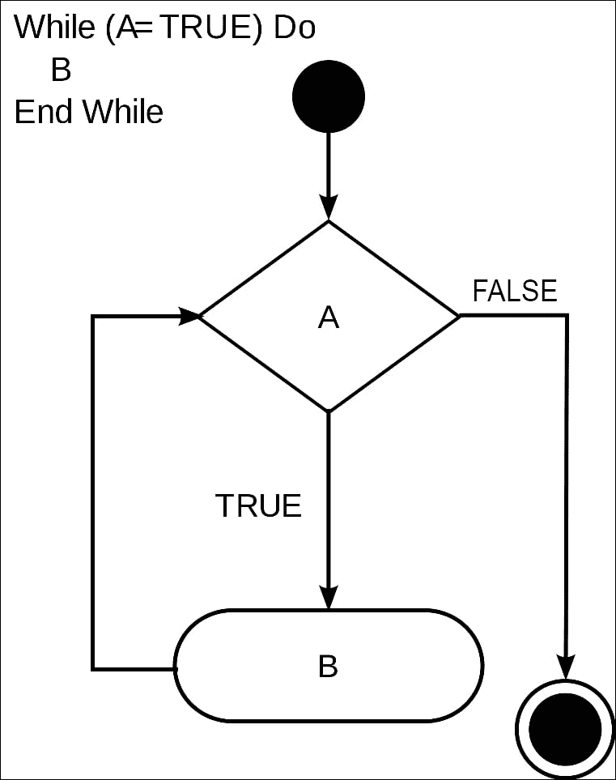

# 第二章。数组和循环

在上一章中，我们讨论了变量和数据类型以及不同的运算符。我们还讨论了如何使用条件控制程序的流程。在本章中，我们将重点讨论如何使用数组存储多个值以及如何使用循环控制流程。数组的基本思想是它是一种变量类型，允许将多个项目存储在一个“容器”中。

例如，如果您想要将公司中所有员工的姓名存储在同一个变量下，数组将帮助您实现这一点。当我们想要多次运行相同的代码块时，使用循环。这通过重用预定义的代码块为开发人员节省了大量工作。这两个概念几乎是今天几乎每个基于 PHP 的 Web 应用程序和网站的核心。

在本章结束时，您将能够：

+   实现一维和多维数组

+   识别索引数组和关联数组之间的区别

+   对数组执行不同的操作

+   实现各种类型的循环

# 数组

在本节中，我们将讨论各种类型的数组，然后查看一些常见的操作。

## 索引数组

索引数组是您将看到的最常见的数组类型，它们可以被定义为预填充或空的。

可以按以下方式定义空数组：

```php
<?php

    $the_array = array();

?>
```

### 注意

请注意，`$the_array`是一个变量。您可以使用任何其他变量。

使用快捷语法的另一种方法：

```php
<?php
    $the_array = [];
?>
```

如果要使用值初始化数组，可以按以下方式执行：

```php
<?php

    $students = array("Jill", "Michael", "John", "Sally");

?>
```

当您使用预填充值初始化数组时，每个元素都会获得一个数字索引，从 0 开始。因此，在前面的例子中，Jill 的索引将为 0，Michael 的索引将为 1，John 的索引将为 2，Sally 的索引将为 3。

要打印`students`数组的第一个索引，可以使用以下代码：

```php
<?php

    echo $students[0];    

?>
```

通常，当您使用数组时，希望在程序运行过程中添加到数组中。可以通过以下两种方式之一完成：

`append`快捷方式：

```php
<?php

    $students[] = "Tom";

?>
```

或`array_push`函数：

```php
<?php

    array_push($students, "Tom", "Joey");

?>
```

通常，开发人员使用快捷方法；如果要一次将多个记录推送到数组中，可以使用`array_push`函数。

有时，您可能需要从数组中删除一个元素。要从数组中删除一个元素，使用`unset`函数。在下面的例子中，我们从数组中删除了“Tom”：

```php
<?php

    unset($students[4]);

?>
```

在继续之前，我们将讨论最后一个部分，即更新一个元素。要这样做，请执行以下操作：

```php
<?php

    $students[0] = "Jessie";

?>
```

## 关联数组

接下来是关联数组，也称为键值对。使用关联数组，您可以使用基于文本的键来存储值，这在特定情况下可能会有所帮助。例如，如果我们从前面的例子中取一个学生（在这种情况下是 Michael），我们可以存储他的`age`，`gender`和`favorite color`，如下所示：

```php
<?php
    $michael = array(
    "age" => 20,
    "gender" => "male",
    "favorite_color" => "blue"
);
?>
```

如果需要访问数组中的特定值，可以使用`key`。例如，如果我们想打印 Michael 的年龄，可以这样做：

```php
<?php

    echo $michael['age'];
?>
```

向`associative`数组添加数据与向索引数组添加数据一样简单。您只需使用键并分配一个值。假设我们要向 Michael 的数组添加一个职业：

```php
<?php
    $michael["occupation"] = "sales associate";
?>
```

要从关联数组中删除一个元素，请按照我们在`indexed`数组中所做的相同步骤，但这次使用键。

让我们删除我们在上一步中添加的职业：

```php
<?php
    unset($michael['occupation']);
?>
```

## 使用数组

在本节中，我们将包括`name`，`age`，`location`和`education level`。请按照以下步骤：

1.  打开您的代码编辑器并创建一个新文件`arrays.php`。

1.  在新文件中，创建您的`php`标签：

```php
<?php
?>
```

1.  现在，我们将创建一个新变量，称为`$myinfo`，并用一个新数组初始化它：

```php
<?php
	$myinfo = array();
?>

```

1.  然后，我们将使用我们的`name`，`age`，`location`和`education level`填充新数组。

1.  接下来，我们将打印我们的数据：

```php
<?php
	$myinfo = array("John", 25, "USA", "College");
	echo "My name is " . $myinfo[0] . "\n";
	echo "I am ". $myinfo[1] . " years old. \n";
    echo "I live in " . $myinfo[2] . "\n";
	echo "My latest education level is " . $myinfo[3];
?>

```

1.  在终端中打开您的工作目录，并键入以下命令：

```php
php arrays.php
```

您将获得如下输出所示的结果：

```php
My name is John.
I am 25 years old.
I live in USA.
My latest education level is College.
```

## 将字符串转换为数组

有时，在构建基于 PHP 的应用程序时，您不会使用预定义的数据集来实例化数组-例如在构建实用程序脚本时。假设您有一个包含文件名字符串版本的变量，并且希望获取不带扩展名的文件名。通过使用`explode`函数，可以轻松完成此任务。`explode`函数接受两个参数：分隔符和要转换为数组的字符串。`Explode`函数接受两个参数：

```php
<?php
    $filename = "myexamplefile.txt";
    $filename_parts = explode(".", $filename);

    echo "Your filename is " . $filename_parts[0];
?>
```

在前面的例子中，我们定义了一个文件名变量，然后使用 explode 函数，使用句点分隔符将字符串分解为其部分。`$filename_parts`变量包含两个元素的数组，第一个是字符串`myexamplefile`，第二个包含字符串`txt`。

知道这一点，我们可以通过访问字符串部分的 0 索引来打印出文件名。

## 将数组合并为字符串

除了`explode`函数之外，PHP 还为我们提供了一个允许我们执行完全相反操作的函数：`implode`函数。当您想要获取现有数组并将其转换为字符串时，可以使用 implode 函数来定义分隔符并将其传递给数组；您将获得一个单个字符串作为结果。

让我们回到`explode`的例子。假设我们有一个文件名，并希望在将其保存回字符串之前在其末尾附加一些其他字符串：

```php
<?php
    $filename = "myexamplefile.txt";
    $filename_parts = explode(".", $filename);
    $filename_parts[0] .= "_v1";

    $filename = implode(".", $filename_parts);
    echo "Your new filename is " . $filename;    

?>
```

在前面的代码示例中，我们首先使用 explode 函数将原始文件名分解为其部分。然后，我们访问文件名部分并在其末尾附加字符串 _v1。使用 implode 函数，我们使用其部分重新组合文件名，最后，我们将其打印回屏幕供用户查看。

## 切片数组

另一个`array_slice`函数；默认情况下，该函数只需要两个参数，但可以接受四个。两个必需的参数是数组本身和新数组的起始点。两个可选参数是新数组的长度（或要包含的元素数）和保留选项。保留选项允许您决定当前数组元素是保持不变还是在拆分后重新排序。以下是一个基本的使用示例：

```php
<?php
    $fruit = array("apples","grapes", "oranges", "lemons","limes");
    $smallerFruitArray = array_slice($fruit, 2);
?>
```

在前面的例子中，当我们通过`array_slice`运行水果数组时，我们将获得一个包含橙子、柠檬和酸橙的数组。

## 对数组进行排序

排序是构建某些类型的程序的另一个重要工具。您经常在 PHP 中看到的排序函数之一是`ksort`函数。`ksort`允许您将数组作为参数传递，然后按升序对其进行排序。

如何使用的示例如下：

```php
<?php

    $people = array("Jessica" => "35", "April" => "37", "John" => "43", "Tom" => 25);
ksort($people);

?>
```

在前面的例子中，我们有一个人的数组。一旦您将人们数组通过`ksort`函数，您应该会看到按字母顺序排列的名称。

## 多维数组

下一个类型是`多维`数组。多维数组只是数组中的数组。在我们之前的数组示例中，我们存储了一个学生的名字。当我们想要为特定学生存储多个详细信息时会发生什么？这就是多维数组发挥作用的地方。让我们看看如何定义一个还存储学生的`性别`和`最喜欢的` `颜色`的学生数组：

### 注意

要查看完整的代码片段，请打开代码文件中的`Lesson 2.php`。

```php
<?php

    $students = array(
    "Jill" => array(
    "age" => 20,
    "gender" => "female",
....
"Amy" => array(
   "age" => 25,
   "gender" => "female",
   "favorite_color" => "green"
),

);
?>
```

如果我们想要访问学生的信息，我们可以使用以下键：

```php
    <?php 

        echo $students['Jill']['age'];

?>
```

前面的例子将打印出 Jill 的年龄。对于多维数组，我们更新元素值的方式基本上与使用一维数组时相同。

例如，如果我们想将 Jill 的年龄更改为`21`，我们执行以下操作：

```php
<?php

        $students['Jill']['age'] = 21;
    ?>
```

## 在我们现有项目中包含一个爱好数组

在这一部分，我们将扩展前面的例子，包括一个爱好数组：

1.  打开你的代码编辑器并创建一个新文件`multidimensional.php`。

1.  在新文件中，创建你的开启和关闭`php`标签。

1.  创建一个名为`$user`的新变量，并用一个新数组进行初始化：

```php
<?php
	?>
<?php
	$user = array();
?>
```

1.  用两个主要部分填充新数组：`info`和`hobbies`。在 info 数组中，存储`name`，`age`，`location`和`education level`，在`hobbies`数组中，我们将存储三个爱好。

### 注意

有关完整的代码片段，请参考代码文件夹中的`Lesson 2.php`文件。

```php
<?php    $user = array(
        "info" => array(
            "name" => "john",
            "age" => 27,
...
        )
    );
?>
```

1.  接下来我们将打印我们的数据：

### 注意

有关完整的代码片段，请参考代码文件夹中的`Lesson 2.php`文件。

```php
<?php$user = array(
        "info" => array(
            "name" => "john",
            "age" => 27,
            "location" => "USA",
.....
   echo "I live in " . $user["info"]['location'] . ".\n";
   echo "My latest education level is " .   
   $user['info']['education_level']. ".\n";

echo "I enjoy " . $user["hobbies"][0] . ", "  . 
$user["hobbies"]

[1] . ", " . $user["hobbies"][2].".\n";

?>
```

1.  在终端中打开你的工作目录，并输入以下命令：

```php
php multidimensional.php
```

你将得到一个基于我们在前面数组中提供的输入的结果。

# 循环

循环是任何编程语言中强大的工具。它们允许你编写可以根据给定条件执行特定次数的代码。在本节中，你将学习到各种可用的循环，如 for 循环、foreach 循环、`while`循环和`do-while`循环。

## for 循环

我们将从`for`循环开始探索循环。它被认为是最复杂的循环结构，当你知道需要一段代码运行多少次时就会使用它。for 循环的结构如下：

```php
<?php

    for(initialized counter; test if true; increment counters){

}

?>
```

创建`for`循环的步骤如下：

1.  初始化起始计数变量 - 通常会从`0`开始。

1.  提供一个解析为`true`或`false`的评估条件。如果条件为`true`，循环将继续，如果条件为`false`，循环将退出（或中断）。

1.  按照特定数字递增值。通常，它会递增`1`。

这里有一个完整的例子：

```php
<?php
        for($i = 0; $i < 5; $i++) {
            echo "Current Count: " . $i; 
}
?>
```

## 结合循环和数组

在这一部分，我们将探索如何结合循环和数组。以下是实现它的步骤：

1.  打开你的代码编辑器并创建一个新文件`forloop.php`。

1.  在新文件中，创建你的开启和关闭`php`标签：

```php
<?php
?>
```

1.  现在，我们创建一个名为`$food`的新变量，并用一个新数组进行初始化：

```php
<?php
	$food = array();
?>
```

1.  然后，我们用食物名称填充新数组：

```php
<?php    $food = array("turkey", "milk", "apples");
?>
```

1.  接下来，我们循环遍历我们的数组并打印我们的数据：

```php
<?php
	$food = array("turkey", "milk", "apples");

           for($i = 0; $i < count($food); $i++){
        echo $food[$i] . "\n";
 }
?>
```

### 注意

count 函数返回数组中的元素数。

在终端中打开你的工作目录，并输入以下命令：

```php
php forloops.php
```

## while 循环

我们将要探索的下一个循环是 while 循环。当你想要循环执行一段代码直到满足特定条件时，就会使用 while 循环。while 循环的定义如下：

```php
<?php

    while(condition) {
}

?>
```

while 循环非常简单，因为它只需要一个条件来运行。循环将一直持续，直到条件为 false。



这里有一个简单的例子：

```php
<?php
    $count = 1;
    while($count < 25){
        echo "Count: " . $count . "\n";

        $count += 1;
}

?>
```

我们取前面的`count`变量并赋值为 1。`while`条件检查`count`变量是否小于 25，并且一旦`counter`变量等于 25，就会中断。在 while 函数内部，我们输出当前计数，然后递增`count`变量 1。

## 使用 while 函数

在这一部分，我们将构建一个`while`函数，它将在`counter`小于 30 的情况下进行迭代。按照以下步骤进行：

1.  打开你的代码编辑器并创建一个新文件`while.php`。

1.  在新文件中，创建你的开启和关闭`php`标签：

```php
<?php
?>
```

1.  接下来，我们定义一个`counter`函数，并用数字 1 进行初始化：

```php
<?php
$count = 1;
?>
```

1.  然后，我们可以创建一个`while`循环，它将输出当前计数，然后将`counter`增加 1：

```php
<?php

        $count = 1;

        while($count <= 30){
            echo "Count " . $count . "\n";
            $count++;
        }
?>
```

1.  在终端中打开你的工作目录，并输入以下命令：

```php
php while.php
```

## do-while 循环

do-while 循环与 while 循环类似，但它不是在循环开始时运行条件，而是在内部代码块运行后检查条件。其思想是，如果你需要至少运行一次代码块，就使用这个循环而不是 while 循环。

### 注意

do-while 循环也称为退出控制循环。

do-while 循环的表示如下：

```php
<?php

    do{

}while(condition);

?>
```

我们将修改之前的 while 循环：

```php
<?php
    $count = 1;
    do{
        echo "Count: " . $count . "\n";

}while($count <= 25);
?>
```

## 将 while 循环转换为 do-while 循环

在本节中，我们将复制前面的示例，但将 while 循环转换为 do-while 循环，以便您可以看到它们的功能差异。按照以下步骤进行：

1.  创建一个新文件并将其命名为`dowhile.php`。

1.  接下来，打开`while.php`文件，并将内容复制到`dowhile.php`文件中。

1.  现在，我们将修改`while`函数以使其类似于以下代码：

```php
<?php

        $count = 1;

        do{
            echo "Count " . $count . "\n";
            $count++;
        }while($count <= 30);
?>
```

1.  在终端中打开您的工作目录，并输入以下命令：

```php
php dowhile.php
```

## foreach 循环

接下来是 foreach 循环。foreach 循环旨在为程序员提供一种简单的方法来遍历数组。这个循环只能用于数组和对象，这些您将在本书后面学习。这个循环有两种语法：

```php
<?php

    foreach($array as $value){

    }

?>
```

第一个语法接受一个给定的数组，并遍历数组中的每个元素，将其分配给次要变量。例如：

```php
<?php
        $students = array("Jill", "John", "Tom", "Amy");

        foreach($students as $student){
            echo $student . "\n";
}
?>
```

在前面的示例中，我们定义了一个填充有学生姓名的数组。然后，我们使用 foreach 循环遍历我们的`students`数组，并`echo`出每个姓名。

第二种语法写成如下：

```php
<?php
    foreach($array as $key => $value){

}
?>
```

在这个版本的`for each`函数中，给定的数组被遍历，但不是给出单个元素，而是同时给出`key`和`element`本身。以下是我们将如何使用它的示例：

### 注意

有关完整的代码片段，请参阅代码文件夹中的`Lesson 2.php`文件。

```php
<?php

    $students = array(
    "Jill" => array(
    "age" => 20,
    "favorite_color" => "blue"
),
.....
);

   foreach($students as $name => $info){
    echo $name . "'s is " . $info['age'] . " years old\n";
}
?>
```

在此示例中，我们定义了一个存储每个学生年龄和最喜欢的颜色的多维数组，并使用学生的姓名作为索引。然后，我们使用`foreach`函数遍历`students`数组，并将每个元素的键分配给`name`变量，将学生的信息分配给`info`变量。在循环内，我们`echo`出学生的姓名，以及他们的年龄。

## 活动：使用 foreach 循环

让我们将对于每个循环的理解付诸实践。

您的经理要求您创建一个 PHP 脚本，根据他们的工资计算每个员工每月赚多少钱。

您要做的是：

1.  创建一个新目录并命名为`monthly_payment`。

1.  在新目录中，创建一个`index.php`文件。

1.  首先，您将定义一个多维数组，用于存储员工的姓名、职称和工资：

```php
<?php

$employees = array(
    array( 
       "name" => "John Doe",
        "title" => "Programmer",
        "salary" => 60000
....
        "title" => "Manager",
        "salary" => 132000
    )
);
?>
```

1.  接下来，定义`foreach`循环，它将遍历`employee`数组：

```php
foreach($employees as $employee){
}
```

1.  最后，添加一个`echo`语句，用于打印姓名、职称和计算出的月薪：

```php
foreach($employees as $employee){
     echo $employee['name'] . "(" . $employee['title'] . ") annual salary is $" .  
     $employee['salary'] . " and earns $" . ($employee['salary'] / 12) . "/mo. \n";
       }
```

计算器脚本现在已经完成。如果您需要添加额外的员工，只需添加一个带有员工信息的额外关联数组即可。

# 总结

我们已经到了第二章的结尾。在这一章中，我们看到了如何声明和定义数组，并涵盖了不同类型的数组。我们看到了可以对数组执行的各种操作。我们还涵盖了诸如 for 循环、while 循环和 do while 循环之类的控制流语句。

在下一章中，我们将学习如何使用函数和类实现代码的可重用性，让您离构建自己的定制应用程序更近一步。
