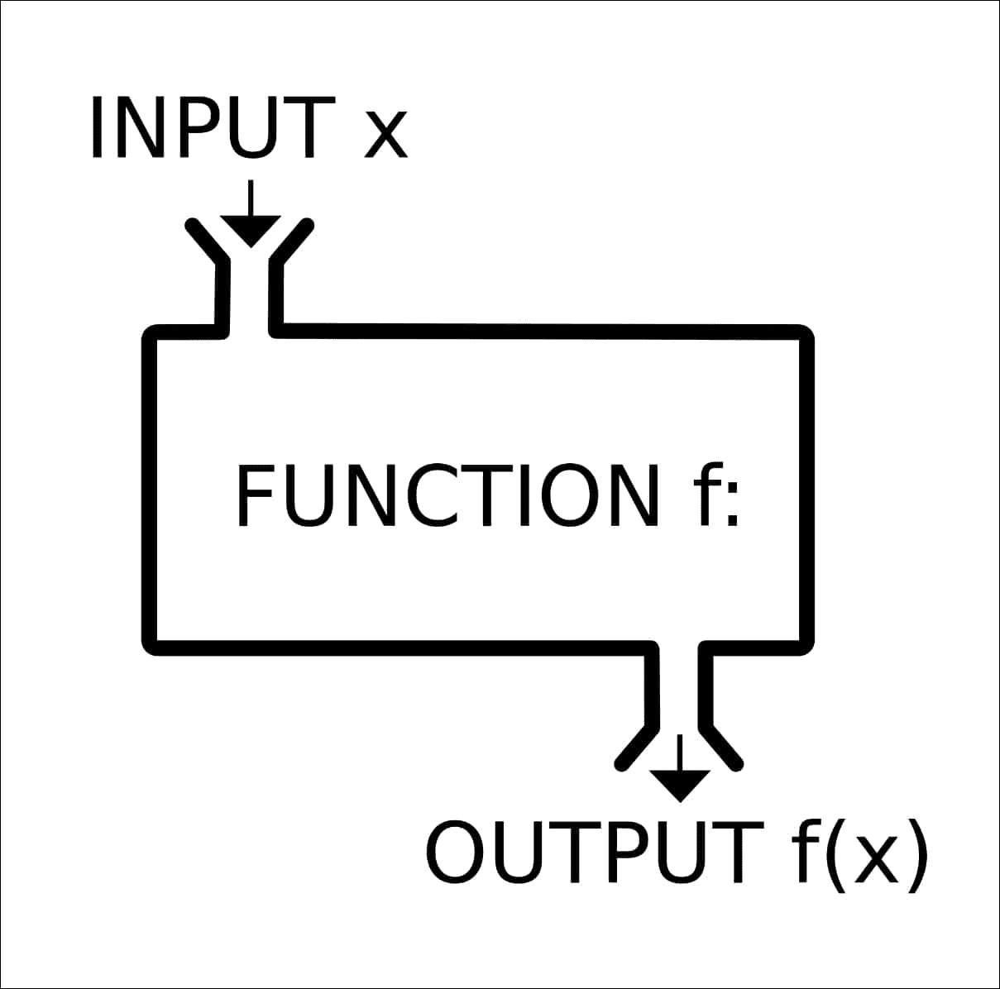

# 第三章。函数和类

在上一章中，我们看到了如何声明和定义数组，并涵盖了多种类型的数组，如索引数组、关联数组等。我们还看到了可以对数组执行的各种操作。

在本章中，我们将了解如何定义和调用函数。我们还将学习如何创建类，以及如何将类和函数一起使用。

函数是打包成可重复使用代码的代码块。函数是一段代码，通过进行一些处理，获取一个或多个输出来返回一个值。

类是对象的蓝图。类形成数据的结构和利用信息创建对象的操作。

在本章结束时，您将能够：

+   定义和调用函数

+   定义类并使用`new`关键字创建类的实例

+   实现和调用`public`和`static`类函数

# 函数

函数就像一个具有固定定义逻辑的机器。在一端，它接受一个参数，对其进行处理，并根据输入和函数定义返回一个值。

函数用于重复使用特定的代码块，而不是在需要时一直定义它：



要定义函数，我们使用关键字`function`，后跟我们要给函数的名称；在花括号内，我们定义函数的操作。例如，如果我们想创建一个打印“Hello World”的函数，我们写如下：

```php
<?php
    function HelloWorld(){
        echo "Hello World";
    }
?>
```

如果我们将这个函数写在一个新文件中并运行它，它不会显示任何内容，这是因为我们还没有调用函数；我们只是定义了它。

要调用函数，我们添加以下代码行：

```php
<?php
HelloWorld();
?>
```

在创建函数时，有时需要将附加参数传递给您的函数；这可以在定义新函数时完成。

让我们修改前面的示例以接受一个`name`参数：

```php
<?php
    function HelloWorld($name){
        echo "Hello World, " . $name;
}
?>
```

要传递名称，我们在函数名后面的括号内定义一个变量。

现在，当我们调用函数时，我们可以通过该变量传递任何值，并且它将被打印出来。

```php
<?php
    HelloWorld("John");
?>
```

有时，当我们创建一个函数时，我们知道会有一些情况下我们不会传递一个值。在这些情况下，我们希望自动传递一个默认值。

要设置默认值，您应该在设置变量时将其分配给指定的变量，如下所示：

```php
<?php
    function displayMessage($message = "World"){
        echo "Hello " . $message;
}
displayMessage();
displayMessage("Greg");
?>
```

函数不仅可以用于将消息打印到屏幕上，还可以返回一个值，该值可以存储在变量中或用于另一个函数。例如，如果您创建一个加法函数，您可能希望返回总和：

```php
<?php
    function addNumbers($a, $b){
        return $a + $b;
}
echo addNumbers(5,6);
?>
```

现在我们有一个可以返回值的函数，让我们看看如何使用它来存储一个值：

```php
<?php
    $sum = addNumbers(1,2);
?>
```

### 注意

在您的程序中，您有时可能需要以高效的方式动态调用函数。PHP 为您提供了一个有用的工具来做到这一点-`call_user_func_array`。`call_user_func_array`函数允许您通过将其名称作为第一个参数传递来调用函数，并通过第二个参数以数组的形式提供参数。

# 创建一个简单的函数

在本节中，我们将创建一个简单的函数，用于计算给定百分比的折扣。要做到这一点，请按照以下步骤进行：

1.  打开您的代码编辑器并创建一个新文件，`function.php`。

1.  在新文件中，创建您的打开和关闭 php 标记：

```php
    <?php
    ?>
    ```

1.  现在，我们将创建两个新变量：`$sweaterPrice`和`$precentOff`。它们将存储产品的原始价格以及折扣百分比。

```php
    <?php
    $sweaterPrice = 50;
    $percentOff = 0.25;
    ?>
    ```

1.  现在我们有了变量，我们可以定义我们的函数。我们的函数很简单；它接受一个价格和折扣百分比。在函数内部，我们将价格乘以折扣百分比并返回乘积。

```php
    <?php
       $sweaterPrice = 50;
        $percentOff = 0.25;

        function couponCode($price, $discount){
            return $price * $discount;
        }
    ?>
    ```

1.  最后，我们可以继续向我们的用户打印关于折扣的消息，使用我们新创建的函数：

```php
    <?php

        $sweaterPrice = 50;
        $percentOff = 0.25;

        function couponCode($price, $discount){
            return $price * $discount;
        }
        echo "The sweater originally costs $" . $sweaterPrice . " with the discount you'll pay $" . ($sweaterPrice - couponCode($sweaterPrice, $percentOff)) . "\n";
    ?>
    ```

现在您已经了解了函数，应该可以轻松地开发可重用的代码并应用它们。在下一节中，我们将学习有关类的知识。类将使我们更好地理解如何将代码和属性结构化为一个整洁的包。

# 类

在本节中，您将学习有关类的知识。类属于一种称为面向对象编程的编程类型，简单地意味着将代码组织成所谓的对象。对象允许您创建一个具有自己变量和方法的基本包，专属于该对象。

### 注意

把类想象成一个对象的蓝图。只有一个类，但可以有许多实例。这可以与房子的蓝图相比。许多新房子可以根据相同的蓝图建造。

假设我们想创建一个保存学生信息的类。我们可以定义如下：

```php
<?php

    class Student {

    }

?>
```

这是基本的学生类，以其最简单的形式。我们首先使用关键字`class`，然后是我们类的名称，这种情况下是`Student`。接下来，我们创建一个带有开放和关闭括号的代码块。在开放和关闭括号内，我们添加我们类的内容。

这导致了类的下一部分：成员变量。我们在本书的第一章中使用变量。作为一个复习，变量充当一个容器，允许您暂时存储数据。成员变量具有相同的功能，但其作用范围仅限于给定类或类实例的边界内。

我们将扩展我们的`Student`类来存储学生的`姓名`、`年龄`和`专业`：

```php
<?php

    class Student {
        public $name;
        public $age;
        public $major;
    }

?>
```

您应该注意到我们在定义变量时使用的`public`关键字。这很重要，因为它告诉程序如何访问数据。`public`关键字简单地表示您可以直接访问这些数据。

现在我们的类已经准备好了，我们可以创建一个类的新实例，并将其赋给一个变量，我们可以用这个变量来与类的属性进行交互：

```php
<?php

    $michael = new Student();

    $michael->name = "Michael John";
    $michael->age = 27;
    $michael->major = "Computer Science";
?>
```

在这个例子中，我们使用`new`关键字创建了一个学生类的新实例，并将其赋给一个我们称之为`Michael`的变量。然后，使用箭头语法，我们可以访问公共值来设置姓名、年龄和专业。

有时候我们想要用值实例化一个类的新实例。我们可以使用一个称为构造函数的函数来实现这一点：

```php
public function __construct(){

}
```

这个函数是使用`new`关键字实例化一个新类时调用的默认函数。要传递值，我们将在构造函数中定义这些值。

例如，如果我们想设置学生的信息，我们可以这样做：

```php
<?php

    class Student {
        public $name;
        public $age;
        public $major;
        public function __construct($name, $age, $major){
            $this->name = $name;
            $this->age = $age;
            $this->major = $major;
        }
    }

?>
```

现在，我们可以提供学生的信息：

```php
    <?php
        $michael = new Student("Michael John", 27, "Computer Science");
    ?> 
```

除了`public`变量，您还可以定义`private`变量。`private`关键字使变量只能由方法本身访问。这意味着您只能通过`constructor`、`getter`函数和`setter`函数访问这些类型的变量，这让我们对类函数有了很好的了解。

类函数允许您为类创建本地功能，以`set`、`get`和改变类本身中保存的数据。例如，如果我们采用先前的类定义，并用`private`变量替换`public`变量，它将如下所示：

```php
<?php

    class Student {
        private $name;
        private $age;
        private $major;

        public function __construct($name, $age, $major){
            $this->name = $name;
            $this->age = $age;
            $this->major = $major;
        }
    }

?>
```

如果我们想要更改这些值，或者将这些值放在程序的其他位置，我们当然要定义函数：

### 注意

有关完整的代码片段，请参考代码文件夹中的`Lesson 3.php`文件。

```php
<?php

    class Student {
        private $name;
        private $age;
        private $major;
....
        }
public function getName(){
            return $this->name;
}

public function getAge(){
    return $this->age;
}
public function getMajor(){
    return $this->major;
}
    }

?>
```

请记住，在函数的名称中使用`set`和`get`并不是必需的；您可以使用任何您想要的名称 - 一些可以让您轻松记住每个函数的作用。正如您在代码示例中所看到的，您可以使用相应的`set`函数更新`private`值，并使用相应的`get`函数检索这些值。

例如，假设 Michael 改变了他的专业：

```php
<?php

    …
    $michael->setMajor("Engineering");

?>
```

如果我们想知道他的专业是什么，我们可以使用以下代码：

```php
<?php

    echo "Michael's major is " . $michael->getMajor();

?>
```

类是任何类型的编程中非常强大的工具，主要是由于继承的概念。继承允许您创建一个定义一般函数和变量的`base`类，并将被类的所有子类使用。

举个简单的例子，让我们定义一个`Animal`类：

```php
<?php

    class Animal{
          public $sound;
          public $name;

          public function speak(){
            echo $this->name . " says " . $this->sound;
        }
    }

?>
```

这个基类有一个变量，保存动物的名称和动物发出的声音。此外，它有一个`public`函数，`speak`，将打印动物发出的声音。

我们可以从`base`类中扩展不同类型的动物。

假设我们想定义一个`Dog`类：

```php
<?php
    class Dog extends Animal {
        public $name = "Dog";
        public $sound = "Woof! Woof!";
}

?>
```

我们只需更改名称和声音变量的值，就可以得到我们的`dog`类：

```php
<?php

    $dog = new Dog();

    $dog->speak();

?>
```

在开发子类时，要记住的一件事是，您可以通过以下方式扩展基类构造函数：

```php
<?php
    class Dog extends Animal {
        public $name = "Dog";
        public $sound = "Woof! Woof!";

        public function __construct(){
            parent::__construct();
        }
}

?>
```

另一个有用的部分，当涉及到类时，是`static`函数。静态函数不需要创建类的实例就可以使用。当您构建一个包含实用函数的类时，这将非常方便。要创建一个`static`函数，您只需使用`static`关键字：

```php
<?php

    class Animal{
        public $sound;
        public $name;
public function speak(){
            echo $this->name . " says " . $this->sound;
        }

        public static function about(){
            echo "This is the animal base class.";
        }
    }

?>
```

在上面的例子中，我们创建了一个静态的 about 函数，当调用时会给出类的简短描述。您可以按照以下方式使用此函数：

```php
<?php
    echo Animal::about();
?>
```

# 活动：计算员工的月工资

您被指派计算员工的月工资。工资应该被计算并显示在屏幕上。

这个活动的目的是让您学会如何从给定的百分比中计算折扣。

按照以下步骤执行此活动：

1.  打开您的代码编辑器并创建一个新文件，`class.php`。

1.  在新文件中，创建您的`php`标签：

```php
    <?php

    ?>
    ```

1.  接下来，定义一个基本的员工类：

### 注意

有关完整的代码片段，请参考代码文件夹中的`Lesson 3.php`文件。

```php
    <?php

        class BaseEmployee {
            private $name;
            private $title;
            private $salary;

            function __construct($name, $title, $salary){
                $this->name = $name;
                $this->title = $title;
                $this->salary = $salary;
     }

            public function setName($name){
                $this->name = $name;
    ......
            }
            public function getTitle(){
                return $this->title;
            }

            public function getSalary(){
                return $this->salary;
            }
        }

    ?>
    ```

1.  从这个基类中，我们可以继续创建一个扩展基类的`employee`类。在这个扩展类中，我们将添加一个额外的函数，用于计算员工的月工资：

### 注意

有关完整的代码片段，请参考代码文件夹中的`Lesson 3.php`文件。

```php
    <?php
        class BaseEmployee {
            private $name;
            private $title;
            private $salary;

            function __construct($name, $title, $salary){
    ...

            public function getSalary(){
            return $this->salary;
            }
        }

        class Employee extends BaseEmployee{
            public function calculateMonthlyPay(){
                return $this->salary / 12;
            }
        }
    ?>
    ```

1.  最后，我们将使用新类来打印月工资：

### 注意

有关完整的代码片段，请参考代码文件夹中的`Lesson 3.php`文件。

```php
    <?php

        class BaseEmployee {
            private $name;
            private $title;
            private $salary;
    ......
        class Employee extends BaseEmployee{
            public function calculateMonthlyPay(){
                return $this->salary / 12;
            }
        }

        $markus = new Employee("Markus Gray", "CEO", 100000);

        echo "Monthly Pay is " . $markus->calculateMonthlyPay();

    ?>
    ```

# 摘要

在本章中，我们学习了函数和类。我们讲解了如何定义和调用函数。我们还讲解了如何定义类并将类和函数一起使用。随着我们开始构建更大更复杂的项目，函数和类将帮助我们创建高度组织的代码并保持最佳实践。

在下一章中，我们将涵盖数据操作，如输入和输出数据，使用错误处理捕获和处理错误，我们还将介绍 MySQL 的基础知识。
