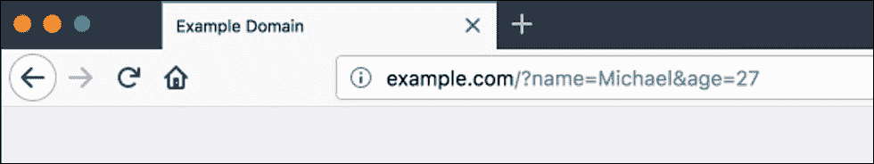

# 第四章。数据操作

在上一章中，我们学习了函数和类。我们讨论了如何定义和调用函数。我们还讨论了如何定义类并将类和函数一起使用。

在本章中，我们将专注于处理用户的输入并将结果打印回给他们，优雅地处理错误，并学习使用 MySQL 数据库的基础知识。

在本章结束时，您将能够：

+   确定如何接受用户输入并将其打印到屏幕上

+   实现使用 MySQL 的基础知识

# 输入和输出数据

能够接受用户输入是从使用 PHP 构建网站转向使用 PHP 构建 Web 应用程序时的一个主要要求。通常，输入来自 HTML 表单。

让我们创建一个简单的联系表单：

```php
<html>
<body>
    <form action="index.php" method="POST">
        <input type="text" name="name" />
        <input type="text" name="email" />
        <textarea name="message"></textarea>
        <button type="submit">Send</button>
    </form>
</body>
</html>
```

在上述联系表单中，我们看到了用户姓名、电子邮件和消息的输入。我们将使用的提交此表单的方法称为`POST`请求。

为了读取正在提交的数据，我们将在表单顶部添加一些 PHP 代码，这些代码将从我们的`POST`请求中读取并呈现数据：

### 注意

有关完整的代码片段，请参考代码文件夹中的`Lesson 4.php`文件。

```php
<?php
    if($_POST){
        echo "Name: " . $_POST['name'] . "\n";
        echo "Email: " . $_POST['email'] . "\n";
......
        <input type="text" name="email" />
        <textarea name="message"></textarea>
        <button type="submit">Send</button>
    </form>
</body>
</html>
```

如您所见，接受应用程序用户的输入很容易。在上面的代码示例中，我们使用了一个特殊变量`$_POST`数组，来访问通过`POST`请求提交的所有数据。`$_POST`变量是一个关联数组，可以通过您在输入元素中指定的名称来访问内容。

您可以使用的另一种请求类型是`GET`请求。`GET`请求比您想象的更常用；当您导航到网站或在 Google 上进行搜索时，就会使用`GET`请求。`GET`请求的输入是通过查询字符串完成的。

查询字符串是附加到 URL 末尾的字符串，以问号开头，如下所示：[`www.example.com?name=Michael&age=12`](https://www.example.com?name=Michael&age=12)：



在上面的例子中，您可以看到我们有两个用和号分隔的键。就像在`POST`方法中一样，`GET`请求也有一个特殊的变量，那就是`$_GET`变量（它是一个关联数组）。

如果我们想要从之前的查询字符串中获取名称，可以使用这行代码：

```php
<?php

    $name = $_GET['name'];

?>
```

您也可以在表单中使用`GET`请求。让我们重新访问之前看到的表单元素：

### 注意

有关完整的代码片段，请参考代码文件夹中的`Lesson 4.php`文件。

```php
<?php
    if($_GET){
        echo "Name: " . $_GET['name'] . "\n";
        echo "Email: " . $_GET['email] . "\n";
......
        <button type="submit">Send</button>
    </form>
</body>
</html>
```

在表单的方法属性中，我们将其更改为`GET`，用`$_GET`变量替换了`$_POST`变量。

### 注意

在接受用户输入时，有时需要在对其进行任何操作之前清理输入。某些输入需要清除开头和结尾的任何空格。这就是 PHP 的`trim`函数发挥作用的地方。`trim`函数将清除用户输入的两侧的空格和其他类似字符。如果要从左侧或右侧删除，可以分别使用`ltrim`和`rtrim`函数。

## 为我们的用户列表构建一个表单

我们将首先构建一个用户列表的表单。在本节结束时，您将拥有一个表单，可以接受您的`firstname`、`lastname`和`email`。它将在最后有一个提交按钮，用于提交信息：

1.  创建一个名为`users_list`的新目录。

1.  在新目录中创建一个`index.php`文件。

1.  在文本编辑器中打开`index.php`文件，并添加表单代码：

### 注意

有关完整的代码片段，请参考代码文件夹中的`Lesson 4.php`文件。

```php
<html>
    <body>
        <form action="index.php" method="post">
......
        </form>
    </body>
</html>
```

1.  现在我们有了表单，我们希望能够查看提交给表单的数据：

### 注意

有关完整的代码片段，请参考代码文件夹中的`Lesson 4.php`文件。

```php
<?php
    if($_POST){
        echo "First Name: " . $_POST['firstname'] . "\n";
        echo "Last Name: " . $_POST['lastname'] . "\n";
......
id="email"/>
            <br>
            <button type="submit">Save</button>
        </form>
    </body>
</html>
```

1.  现在，为了看到我们的表单起作用，我们将在终端中打开工作目录并运行以下命令：

```php
php -S localhost:8000 -t
```

对于任何 Web 应用程序，您都需要一种存储数据的方式。允许您将当前状态持久保存在 MySQL 数据库中的服务称为持久性。如果变量允许您暂时存储数据，持久性允许您长期存储数据在数据库中。

PHP 中主要使用的数据库类型是 MySQL。MySQL 数据库被称为关系型数据库，它们被组织成表格。

在本节中，我们将介绍如何在 PHP 中使用 MySQL 数据库以及如何执行各种操作。

## 连接到数据库

使用数据库的第一步是连接到数据库。在本章中，我们将专注于使用 PDO（PHP 数据对象）风格的用法。

要连接到数据库，请使用以下代码行：

### 注意

有关完整的代码片段，请参考代码文件夹中的`Lesson 4.php`文件。

# MySQL 基础知识

```php
<?php
    $host = "DATABASE_HOST";
    $username = "DATABASE_USERNAME";
    $password = "DATABASE_PASSWORD";
    $database = "DATABASE_NAME";
......

            echo "Connected successfully"; 
        }
    catch(PDOException $e)
        {    

            echo "Connection failed: " . $e->getMessage();
}
?>
```

在上述代码中，您可以看到我们有一大块新代码。我们首先定义四个新变量来保存数据库的凭据值：一个用于主机 URL，一个用于用户名，一个用于密码，最后一个用于我们连接的数据库的名称。接下来，我们将数据库连接代码包装在`try`块中；这将在连接到数据库并运行查询时`catch`任何错误。在`try`块中，我们通过使用我们之前定义的凭据变量来初始化 PDO 类的新实例，将其分配给`$conn`变量。然后，我们设置错误模式以确保如果出现任何错误，它会触发我们的`catch`块。最后，在`try`部分，我们`echo`出一个成功的连接消息。在 try/catch 块的`catch`部分中，我们只是`echo`出触发的错误消息。

## 创建数据库表

我们现在将使用 SQL 查询创建一个表：

### 注意

有关完整的代码片段，请参考代码文件夹中的`Lesson 4.php`文件。

```php
<?php
    $host = "DATABASE_HOST";
    $username = "DATABASE_USERNAME";
    $password = "DATABASE_PASSWORD";
......

    }
    catch(PDOException $e)
    {

        echo "Connection failed: " . $e->getMessage();

    }
    }
?>
```

创建表格时，我们使用`CREATE TABLE`命令，后面跟着表格的名称。然后，在一对括号内，我们定义表格的字段。我们在查询中创建的表将创建一个用户表，其中将保存用户的 ID（此表的主键），并将自动递增用户名称，类型为`varchar`，最多 60 个字符。表还将保存一个电子邮件地址，类型为`varchar`，最多 30 个字符。

## 向数据库插入记录

现在我们的数据库中有一个表，我们可以向其中添加数据。我们使用`insert`查询添加数据。连接到数据库并设置错误模式后，我们可以定义我们的查询。`Insert`查询以`INSERT INTO`命令开始，后面跟着我们要插入数据的表的名称。在一对括号内，我们定义要写入的字段。在字段之后，我们定义要输入表格的值：

### 注意

有关完整的代码片段，请参考代码文件夹中的`Lesson 4.php`文件。

```php
<?php
    $host = "DATABASE_HOST";
    $username = "DATABASE_USERNAME";
    $password = "DATABASE_PASSWORD";
    $database = "DATABASE_NAME";

    try {
        $conn = new PDO("mysql:host=$host;dbname=$database", $username, $password);

    ......

    }
    catch(PDOException $e)
    {

        echo "Connection failed: " . $e->getMessage();

    }
?>
```

## 从数据库表中获取单行数据

如果要从数据库中获取用户，可以使用`SELECT`查询。在这种情况下，我们要获取前一个代码块中插入的新用户。我们将使用以下代码：

### 注意

有关完整的代码片段，请参考代码文件夹中的`Lesson 4.php`文件。

```php
<?php
    $host = "DATABASE_HOST";
    $username = "DATABASE_USERNAME";
    $password = "DATABASE_PASSWORD";
    $database = "DATABASE_NAME";

    try {
        $conn = new PDO("mysql:host=$host;dbname=$database", $username, $password);
......

    }
    catch(PDOException $e)
    {

        echo "Connection failed: " . $e->getMessage();

    }
?>
```

使用`$conn`变量，我们准备一个`SELECT`查询，指示我们要从用户表中提取信息；然后我们使用`WHERE`子句来定义所需信息的条件。最后，我们执行准备好的语句，传递一个带有所需电子邮件地址的`array`。由于我们希望得到一个关联数组返回给我们，我们将获取模型设置为`FETCH_ASSOC`，通过使用 fetch 方法获取单个记录。

渲染用户数组，我们在开放和关闭的`pre`标签之间使用`PRINT`命令。

### 注意

`pre`标签美化了已打印的数组。这通常用于调试数组中包含的内容。

## 从数据库表中获取多行

如果我们想要获取表中的所有用户，我们可以放弃准备好的语句并直接运行查询。这一次，我们去掉了`WHERE`子句。我们不再使用 fetch 函数，而是使用`fetch_all`函数：

### 注意

有关完整的代码片段，请参考代码文件夹中的`Lesson 4.php`文件。

```php
<?php
    $host = "DATABASE_HOST";
    $username = "DATABASE_USERNAME";
    $password = "DATABASE_PASSWORD";
    $database = "DATABASE_NAME";

    try {
        $conn = new PDO("mysql:host=$host;dbname=$database", $username, $password);
......
        echo "</pre>";

    }
<?php
    $host = "DATABASE_HOST";
    $username = "DATABASE_USERNAME";
    $password = "DATABASE_PASSWORD";
    $database = "DATABASE_NAME";

    try {
        $conn = new PDO("mysql:host=$host;dbname=$database", $username, $password);
......
        echo "</pre>";

    }
    catch(PDOException $e)
    {

        echo "Connection failed: " . $e->getMessage();

    }
?>
```

## 更新数据库表中的记录

现在我们了解了如何向数据库表中添加和获取数据，我们可以开始编辑单个记录。在 MySQL 中，我们使用`UPDATE`查询来更新数据。要运行`UPDATE`查询，我们回到我们的准备好的语句，并以`UPDATE`命令开头，后跟表的名称（在本例中为用户表）。接下来，我们使用`SET`命令开始定义需要更新的字段和值的过程，然后我们添加`WHERE`子句来隔离我们希望具有新值的特定记录。为了对查询的执行情况进行一些反馈，通过行计数函数回显计数。

让我们将用户的电子邮件地址更改为`test123@email.com`：

### 注意

有关完整的代码片段，请参考代码文件夹中的`Lesson 4.php`文件。

```php
<?php
    $host = "DATABASE_HOST";
    $username = "DATABASE_USERNAME";
    $password = "DATABASE_PASSWORD";
    $database = "DATABASE_NAME";

    try {
        $conn = new PDO("mysql:host=$host;dbname=$database", $username, $password);
......
          echo $statement->rowCount() . "(s) rows affected.";
    }
    catch(PDOException $e)
    {

        echo "Connection failed: " . $e->getMessage();

    }
?>
```

## 从数据库表中删除记录

我们在 MySQL 中的最后一部分将是从数据库中删除数据。要删除数据，我们使用`DELETE`查询。`DELETE`查询以`DELETE FROM`开头，后跟您要从中删除数据的表的名称；使用`WHERE`子句完成查询，以进一步指定要删除的记录。我们将此查询放在准备好的语句中，然后通过传递`WHERE`子句的值来执行它：

### 注意

有关完整的代码片段，请参考代码文件夹中的`Lesson 4.php`文件。

```php
<?php
    $host = "DATABASE_HOST";
    $username = "DATABASE_USERNAME";
    $password = "DATABASE_PASSWORD";
    $database = "DATABASE_NAME";

    try {
        $conn = new PDO("mysql:host=$host;dbname=$database", $username, $password);
......
          echo $statement->rowCount() . "(s) rows deleted.";
    }
    catch(PDOException $e)
    {
        echo "Connection failed: " . $e->getMessage();

    }
?>
```

## 创建员工表

我们的最终项目将是将我们从用户那里获得的输入存储在数据库表中。在编写将数据添加到数据库的代码之前，我们需要创建一个数据库，如下所示：

1.  打开终端。

1.  使用以下命令连接到 MySQL：

```php
mysql –u root –p
```

1.  接下来，创建`packt_database`数据库：

```php
create database packt_database;
```

1.  告诉 MySQL 使用新创建的数据库：

```php
use packt_database;
```

1.  最后，创建用户表：

```php
CREATE TABLE users (
            id INT(6) UNSIGNED AUTO_INCREMENT PRIMARY,
            firstname VARCHAR(30) NOT NULL,
           lastname VARCHAR(30) NOT NULL,
email VARCHAR(30) NOT NULL
);
```

1.  现在，我们可以关闭我们的终端并开始完成我们的应用程序。

## 向数据库添加用户

在本节中，我们将使用 PHP 向数据库添加用户。然后，我们创建一个表单，接受用户的`INSERT`查询。

要执行此操作，请执行以下步骤：

1.  在文本编辑器中重新打开`users_list`目录。

1.  在第二个`if`语句中，连接到您的数据库：

### 注意

有关完整的代码片段，请参考代码文件夹中的`Lesson 4.php`文件。

```php
<?php

    if($_POST){
        if(!$_POST['firstname'] || !$_POST['lastname'] || !$_POST['email']){
            exit("All fields are required.");
        }

        $host = "DATABASE_HOST";
        $username = "DATABASE_USERNAME";
        $password = "DATABASE_PASSWORD";
        $database = "packt_database";

        try {
            $conn = new PDO("mysql:host=$host;dbname=$database", $username, $password);
......
  <button type="submit">Save</button>
        </form>
    </body>
</html>
```

1.  接下来，继续使用`INSERT`查询将用户输入添加到数据库中：

### 注意

有关完整的代码片段，请参考代码文件夹中的`Lesson 4.php`文件。

```php
<?php

    if($_POST){
        if(!$_POST['firstname'] || !$_POST['lastname'] || !$_POST['email']){
            exit("All fields are required.");
        }

.......
            <br>
            <label>Email</label>
            <input type="text" name="email" id="email"/>
            <br>
            <button type="submit">Save</button>
        </form>
    </body>
</html>
```

1.  现在，您已经准备好测试简单的应用程序。在终端中打开`user_list`目录，并使用以下命令来启动您的应用程序：

```php
php -S localhost:8000 -t .
```

# 总结

我们已经到达了本章的结尾。在本章中，我们学习了如何接受用户的输入，以及如何通过 PHP 访问它。最后，我们学习了使用 MySQL 数据库的基础知识，并将所有原则应用到一个通过 Web 表单向数据库添加用户的迷你应用程序中。

在下一章中，我们将介绍使用面向对象编程原则构建 PHP Web 应用程序的基础知识，例如命名空间、使用语句、访问修饰符等。我们还将介绍如何使用 MVC 设计概念正确地构建应用程序。
