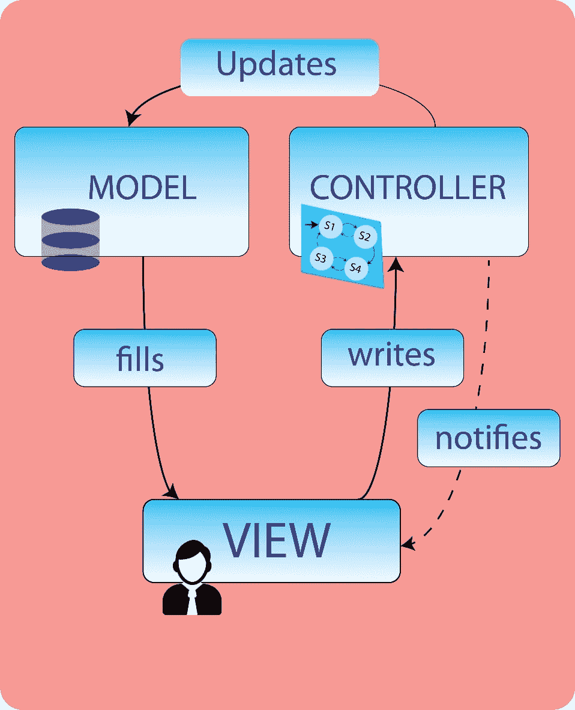
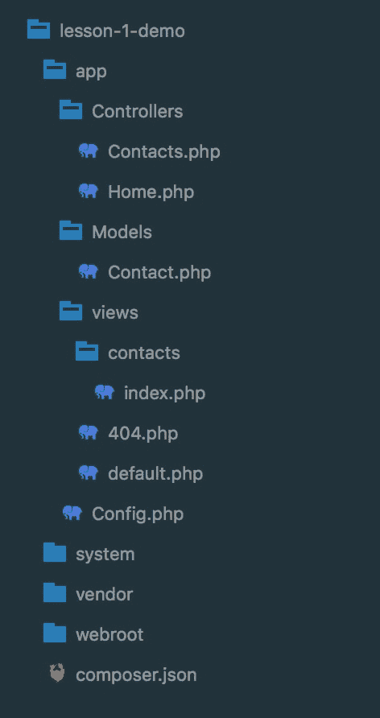
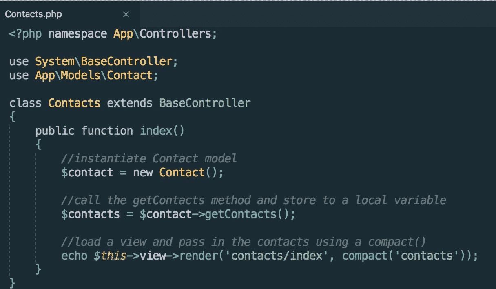
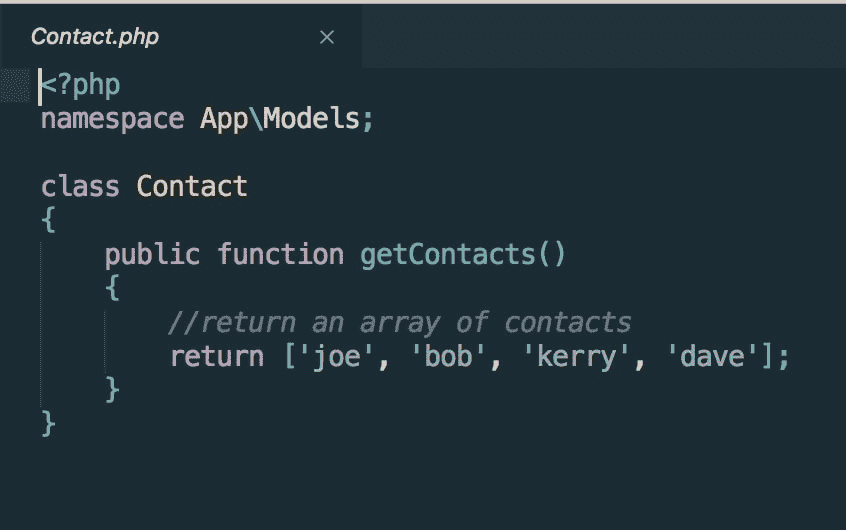
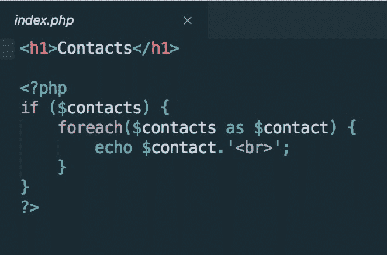
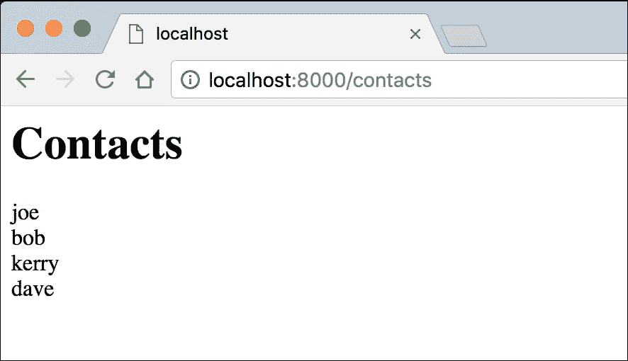
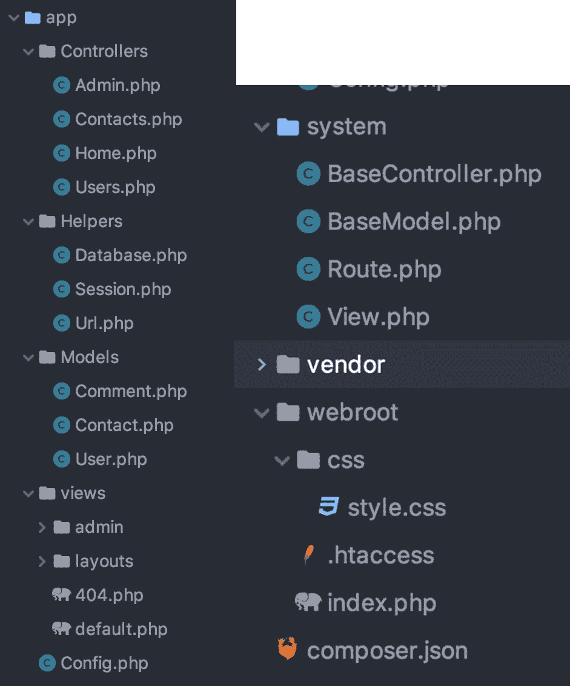

# 第五章：构建 PHP Web 应用程序

在上一章中，我们学习了如何接受用户的输入，以及如何通过 PHP 访问它。我们还学习了使用 MySQL 数据库的基础知识，并将之前章节的原则应用到一个小型应用程序中，通过 Web 表单将用户添加到数据库中。

在本章中，我们将学习并应用框架中的面向对象编程概念。我们将使用 Whoops 库来进行错误报告，并学习如何处理这些错误。我们还将介绍如何在框架中管理和构建我们的应用程序。

在本章结束时，您将能够：

+   在框架环境中应用面向对象编程概念

+   结构文件和文件夹以构建框架

+   描述框架如何与数据源交互

+   使用 MVC 设计模式构建框架

+   构建一个 CRM 应用程序来管理您的框架上的联系人

构建一个应用程序将需要我们了解底层框架以及如何使用 MVC 架构风格来创建应用程序。PHP 框架是一个设计用来促进代码重用组织的文件夹和文件集合；这些文件夹和文件提供了一个通用的代码基础，用于构建应用程序。通过这些章节，您将学习如何构建这样一个框架。

我们将在本书中使用的一个常见设计模式称为 CRUD - 一个缩写，意思是：

+   **创建**：创建一个新的 MySQL 记录

+   **读取**：从数据库中读取记录

+   **更新**：更新 MySQL 记录

+   **删除**：删除 MySQL 记录

CRUD 是在框架中构建的任何实际应用程序的核心。几乎所有内容都可以分解为 CRUD。

CRUD 的示例将涉及创建新内容，读取内容，并提供提示来更新和删除内容。

我们将使用一种称为模型视图控制器（MVC）的设计模式，这是一种用于构建框架的目录和文件结构的方式。将使用 MVC 结构来展示结构和示例：



模型视图控制器（MVC）的表示

PHP 标准建议（PSR）为代码格式设置了一个样式指南，允许与您可能接触到的其他代码最大的兼容性：[`www.php-fig.org/psr/`](http://www.php-fig.org/psr/)。

# 框架环境中的面向对象编程概念

在开始学习框架构建之前，对 PHP 面向对象编程（OOP）概念有一个扎实的理解是一个好主意。所有 PHP 框架共同的一点是，它们首先是建立在 OOP PHP 之上的；本质上，它们只是一种组织文件的方式。

我们将学习以下面向对象编程概念：

+   命名空间

+   使用语句

+   类和对象

+   方法

+   访问修饰符

## 命名空间

命名空间可以与文件夹结构进行比较。命名空间的主要目的是允许类具有相同的名称，但在不同的命名空间下。

命名空间是区分大小写的。命名空间应该以大写字母开头，之后使用驼峰命名法 - 每个单词的开头应该是小写，后面的单词应该是大写。

例如：`mySpace`

例如，如果您有一个名为`Post`的类，并且在另一个文件夹中，您有一个名为`Post`的类。通常情况下，您将无法在同一文件中使用它们，因为这些类会相互冲突；但是，如果每个类都有它们存储的文件夹的命名空间，那么您可以在同一文件中使用它们。

文件 file1.txt 可以存在于目录`/home/packt`和`/home/other`中，但是两个 file1.txt 的副本不能同时存在于同一个目录中。此外，要在`/home/packt`目录之外访问`file1.txt`，我们必须在文件名之前加上目录名，使用目录分隔符来获取`/home/packt/file1.txt`。这个原则在编程世界中也适用于命名空间。

您不能在同一个文件中使用两个类，因为它们会互相冲突。为了解决这个问题，您可以给其中一个类起一个别名。将别名视为该类的昵称。

命名空间是对`app/controllers`目录中的位置的引用：命名空间`App\Controllers`是其位置的路径。注意在编写命名空间时使用反斜杠字符：

```php
//valid namespace
namespace App\Controllers;
```

## 命名空间 App，Controllers 和 Use 语句

`Use`语句是一种导入类的方式，而不是手动包含它们。`use`语句与 composer 一起使用。

作为在类中使用`use`语句的示例，如果我们想要使用`Contact`模型，可以将以下代码放在类的顶部：

```php
use App\Models\Contact;
```

当您有一个名为`Contact`的类，其命名空间为`App\Models`时，要导入它，您可以使用`App\Models\Contact`。然后，您可以通过调用`Contact`来引用这个类；您不必引用其完整的命名空间，因为它已经被导入：

### 注意

我们使用 composer 根据其命名空间自动加载文件，并将在后面的章节中详细介绍这一点。

```php
//start with the namespace
namespace App\Controllers;
//add the use statement
use App\Models\Contact;
//make the call
$contact = new Contact();
```

## 使用命名空间定义类和对象

我们在上一章学习了如何创建类和对象。现在我们将看到如何使用命名空间创建类和对象。

对象是已经实例化的类；例如，如果您看最后一个示例的最后一行，一个名为`contact`的类已经被实例化，使用了`new`运算符，后跟类名。这创建了一个新对象；这意味着新对象可以访问类的所有方法和公共属性：

```php
//start with the namespace
namespace App\Controllers;

//add the use statement
use App\Models\Contact;

//make the call
$contact = new Contact();

//make a call to a getContacts method that exists within the contact class
$contact->getContacts();
```

## 方法

方法是驻留在类内部的函数。实际上，方法和函数之间唯一的区别是命名约定，以及方法碰巧驻留在类内部。

方法用于检索和传递信息到类中，或从类中传递信息到文件中，该文件中实例化了该类：

```php
//start with a namespace
namespace App\Models;

//here is an example of a method being defined, in the previous example the method was being called.
class Contact
{
    public function getContacts()
{
                        //get data here
    }
}
```

## 访问修饰符

访问修饰符是授予和限制类的属性和方法访问权限的一种方式。有三种访问修饰符：`public`，`protected`和`private`。这可以与门卫进行比较，允许数据进入或阻止数据进入：

+   **Public**

将属性或方法定义为`public`意味着类，扩展类和实例化类的文件都可以读取和写入该方法或属性。

+   **Protected**

`protected`方法或属性只能被类或扩展类访问。

+   **Private**

`private`属性或方法只能从定义它的类内部访问。

### 注意

`private`属性无法从该类的外部访问，也无法从扩展类访问。

以下是如何使用各种访问修饰符的示例。在定义名为`$token`的属性时，您将看到`public`，`protected`和`private`属性的使用：

```php
public $token;
protected $token;
private $token;

```



文件夹结构

**解释：**

这里是我们将在接下来的几章中构建的框架的文件结构：

+   **app**文件夹是您的应用程序所在的位置。**app**包含您的控制器，模型和视图。正如先前提到的，这是 MVC 结构的一部分。

+   **config**文件是存储站点名称和数据库凭据的位置。

+   **system**文件夹包含框架的核心文件。

+   **vendor**目录是一个 composer 目录，包含通过 composer 安装的任何第三方包。它还存储了 composer 本身。

+   **webroot**文件夹是您的文档根目录；这是您的浏览器所读取的内容。

在本章的后面，我们将介绍一个名为 MVC 的设计模式。

以下示例使用了这种设计模式，这只是一种组织文件结构的方式。

在此示例中，我们将从已实例化的类中传递单个联系人的详细信息，并在浏览器中显示它们。

目前，请注意每个面向对象编程原则在每个文件中的应用，并看看您是否能识别出来。

### 注意

此代码将无法作为纯 PHP 工作，因为需要框架的结构。本书将教您这些组件如何（以及为什么）以它们目前的方式一起工作。展示此示例的目的是在框架环境中看到面向对象编程概念的实际应用。

以下是一个控制器的示例：



联系人控制器

首先是`namespace`，这是 composer 知道如何加载文件的方式。没有 composer，将需要手动包含，使用`include`或`require`，称为惰性加载，以防止加载不相关的文件并提高性能。

在`namespace`和`use`语句之后是类定义（类的蓝图）。在这里，我们将类命名为`Contacts`，并扩展了已经存在的`BaseController`类的功能：



联系人模型

**解释：**

在这里看到的文件是模型；在前面的示例中实例化了`Contact`模型。

再次，模型包含了`namespace`。

在此示例中，不需要`use`语句，因为数据包含在类定义中。

如果数据存储在数据库或其他数据源中，则该类需要扩展`BaseModel`：



联系人视图

PHP 视图中使用最少的 PHP；数据通常以数组或变量的形式传递给视图，并且样式是由其决定的：



浏览器视图

### 注意

作为开发人员的早期阶段，您可能会发现自己经常忘记使用分号；事实上，我们的一位书籍作者大卫经常回忆起他曾经花了将近两天的时间来解决他的第一个项目中的一个错误，结果发现问题是缺少了一个分号。

在框架环境中工作时，忘记使用正确的大小写可能会像忘记使用分号一样麻烦。

这并非一定要这样；您可以利用软件专家附加组件，即 PHP linters，它们将检查问题，如忘记使用正确的大小写。 PHP linters 在运行脚本之前突出显示代码。您将在诸如 PHP Storm 之类的 IDE 中找到此类附加组件，或者在 Sublime Text 或 Atom 等文本编辑器中找到：

+   [`www.jetbrains.com/phpstorm/`](https://www.jetbrains.com/phpstorm/) 由 Jet Brains 制作

+   [`www.sublimetext.com/`](https://www.sublimetext.com/) 由 Sublime HQ 制作

+   [`atom.io/`](https://atom.io/) 由 Atom 制作

# 框架的结构

在其核心，MVC 是关注点分离，因此所有数据源都来自模型或数据库资源。您的控制器控制应用程序的流程，并驻留在控制器目录中。所有标记都位于所谓的视图中。它们一起形成了模型视图控制器（MVC）设计模式。



框架文件夹和文件结构

如果您需要修改数据源，您知道要去模型进行操作；如果您想要更改外观，您知道要去视图；要更改应用程序的控制，您去控制器。

### 注意

请注意，模型并不局限于从数据库中提取数据；这是一个常见的误解。我们之前的示例突出了这一点。

模型中的其他数据源可能是静态数据或从文件或外部源（如 RSS）读取的数据。

**解释：**

在使用框架时，您的应用程序的大部分将使用 MVC 设计模式构建。

模型和控制器都将从系统目录中存储的`BaseModel`和`BaseController`扩展功能。您可能不经常需要更改这些。建立在框架之上的任何应用程序将主要包含在`App`目录中存储的模型、控制器和视图目录中：


联系人控制器

在这里，控制器正在与模型通信。模型为控制器提供了数据源。控制器是结构的大脑，在这里，它是一系列指令，用于何时提供数据源以及在什么条件下如何行为。

当用户访问特定 URI 时，联系人类将调用一个函数（这是如何工作以及为什么工作将在后面的章节中介绍）；这将启动与模型的联系。

在这个例子中，控制器不关心数据源中包含什么；但是，它可以被编程来检查这些数据。

在控制器获取数据后，数据被存储并传递给视图：


联系人模型

**解释：**

联系人模型具有包含应用程序知识的数据源，但它本身不能利用这些知识。它只能给出管理知识的指示。CRUD 原则在模型中发挥作用，其中有创建、读取、更新和删除模型知识源的方法。

在这种情况下，数据源是一个名字数组：


联系人视图

在视图文件中，您将看到数据是按原样提供的；在这种情况下，视图被提供了一个名字数组。这些名字是详尽的，并且带有任何标记和样式。

在框架中，视图是一个更广泛结构的一部分，它在您的 Web 应用程序中应用全局元素，如标题和页脚，以及 CSS 和 JavaScript 文件。

可以循环遍历数组，但尽可能在控制器中完成所有处理。


浏览器视图

您现在已经确定了如何在 MVC 框架示例中使用面向对象编程原则。

现在，让我们将这些原则付诸实践。

## 活动：向目录添加联系人

您需要将联系人添加到您正在创建的目录中，以名字数组的形式存储。当请求时，应用程序应返回一个联系人数组。

这样做的原因是为了更好地全面了解如何在实际应用中使用面向对象编程。

按照以下步骤执行此活动：

1.  创建一个目录结构。

1.  创建一个名为`Contacts`的目录。

1.  在这个目录中，创建一个名为`App`的目录。

1.  在`App`目录中，创建三个更多的目录：

+   `模型`

+   `视图`

+   `控制器`

1.  在模型目录中，创建一个名为`Contact.php`的文件。

1.  在`Contact.php`文件中，打开 PHP，并创建一个命名空间：

```php
<?php namespace App\Models;
```

1.  定义一个名为`Contact`的类：

```php
class Contact 
{
}
```

1.  在这个类中，定义一个名为`getContacts()`的公共方法；它应该返回一个名字数组：

```php
class Contact
{
    public function getContacts()
{
        return ['joe', 'bob', 'kerry', 'dave'];
    }
}
```

1.  在 Controllers 目录中，创建一个名为`Contacts.php`的文件。

1.  在`Contacts.php`文件中，打开 PHP，并添加一个`namespace`：

```php
<?php namespace App\Controllers;
```

1.  用`use`语句导入联系人模型：

```php
use App\Models\Contact;
```

1.  在这种情况下，可以使用别名，写成如下形式（假设 Contact 的别名为`Name`）：

```php
Use App\Models\Contact as Name;
```

定义一个名为 Contacts 的类：

```php
class Contacts 
{
}
```

1.  创建一个名为`index()`的公共函数，在该方法中，创建一个名为`contacts`的局部变量，并创建`contact`类的一个新实例（这被称为类的实例化）：

```php
class Contacts 
{
    public function index()
    {
        $contact = new Contact();
    }
}
```

1.  使用赋值运算符创建一个名为`contacts`的局部变量，在前一步创建的`contacts`对象实例后调用`getContacts()`方法（这被称为箭头符号）：

```php
public function index()
{
    $contact = new Contact();
    $contacts = $contact->getContacts();
}
```

# 总结

在本章中，我们创建了一个模型和一个控制器，其中控制器`Contacts`类实例化了模型`Contact`类。为了实现这一点，我们创建了一个基本的 MVC 文件夹结构，将控件与数据源分开。我们成功地使用了`namespace`、`use`语句、方法、访问修饰符、对象和类。我们现在见识到了框架的力量。

在下一章中，您将创建自己的工作框架。我们将学习如何设置项目开发环境、优雅的错误报告以及使用 Whoops 库进行处理。我们还将实现配置类、默认类以及如何设置路由。
