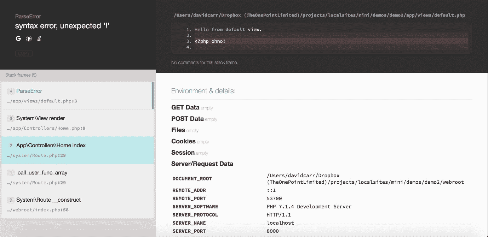
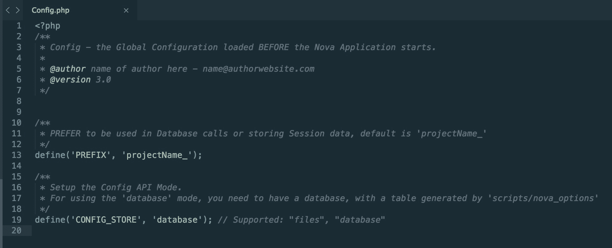
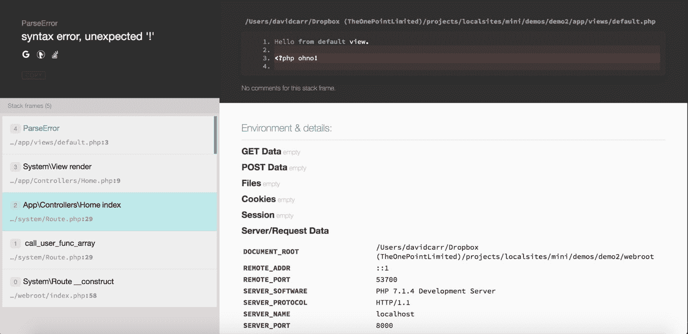

# 第六章。构建 PHP 框架

在上一章中，我们创建了一个模型和一个控制器，其中控制器`Contacts`类实例化模型`Contact`类。我们成功使用了`namespace`，`use`语句，方法，访问修饰符，对象和类。我们在上一章中见证了框架的力量。

在本章中，我们将从头开始构建一个 MVC 框架。框架实际上只是一种组织代码和结构代码的方式。从一个空目录开始，我们将构建一个完整的工作框架，作为更复杂应用程序的起点。

### 注意

在上一章中，我们从数组中检索数据。在本课程中，我们将从数据库中检索数据。

到本章结束时，您将能够：

+   构建一个基本的 PHP MVC 框架

+   实施在以前章节中涵盖的面向对象的概念

+   确定如何将控制器路由到指定的 URI

+   使用 PHP 数据对象（PDO）与数据库交互

+   使用 HTML 构建和创建可重用的页面（视图）

我们还将实施我们在以前章节中涵盖的面向对象的概念，包括但不限于命名空间，`use`语句，对象和类，访问修饰符和方法。

我们将学习如何将控制器路由到指定的 URL，并使用 HTML 构建和创建可重用的页面（视图）。最后，我们将使用 PDO 与数据库交互。

# 设置项目开发环境

本节涉及设置项目开发环境。

这一切都是关于设置索引，`.htaccess`文件，创建 Web 根目录，设置 Composer 和设置`app`目录。

+   **索引**是框架的引导文件；这最终是所有请求接收的地方。例如，当用户在地址栏中输入 URL 时，就会发出请求。

+   **.htaccess**是 mod rewrite 引擎，将所有请求传递给索引文件。

+   **Web 根目录**是公共文件夹，可以被浏览器访问，也用于存储 Web 应用程序的所有资产的索引和.htaccess。这将包括图像，CSS 和 JavaScript 文件。

+   **Composer**是用于管理系统依赖库的包管理器。

+   **应用程序目录**是您的应用程序；这是您的视图，模型，控制器和助手将存储的地方。助手是帮助开发人员经常遇到的单个常见任务的紧凑方法。开发人员可能发现自己重复执行相同的任务，并将创建一个帮助程序类，其中包含一个或多个方法来帮助完成此任务。这可能是格式化日期，执行特定计算等等。

### 注意

引导符号象征着设置框架的过程通常被称为引导。这不应与流行的 CSS Grid 命名为 Bootstrap 混淆。这本质上紧密地将框架的所有核心部分联系在一起。

# 使用 Composer 和 Whoops 进行错误报告

对于这个项目，我们将使用 Whoops 库来处理错误。Whoops 库是用于检查项目中可能发生的错误的工具。这个库已经打包并提供给其他开发人员在他们的项目中使用。

使用 Whoops，当 PHP 发生错误时，您将能够看到显示信息，而不是来自服务器的标准单调的错误报告：



Composer 将管理此依赖的使用，因为它被认为是 PHP 开发人员非常广泛使用和非常受欢迎的包管理器之一。

Composer 是 PHP 中的依赖管理工具。它允许您声明项目所依赖的库，并且会为您管理（安装/更新）它们。要安装 Composer，请访问[`getcomposer.org/download/`](https://getcomposer.org/download/)。

想象一种情况，您必须为 PHP 安装一个依赖项，为了安装该依赖项，您需要安装其他额外的依赖项。Composer 帮助您处理这个问题。它用于为您处理所有工作，以安装一个库，因为它会一起下载所有库和依赖项。

## 设置 Composer

我们将在本节中设置 Composer。要做到这一点，请按照以下步骤操作：

1.  创建一个文件夹来存储框架文件。

### 注意

随意为您的文件夹命名，只要全部小写且没有空格即可。

1.  +   `app`保存应用程序文件

+   `system`保存核心框架文件

+   `webroot`将保存公开访问的文件

1.  接下来，我们将设置 Composer。在框架文件夹的根目录中创建一个名为`composer.json`的文件。

该文件包含一个 JSON 对象，将根据需要自动加载类。我们将使用 PSR-4 自动加载。

### 注意

PSR-4 自动加载将根据其命名空间加载类在使用时。例如，新的`App\Models\Contact()`将告诉 Composer 自动加载名为`Contact`的文件，该文件存储在文件夹`app\Models`中。

1.  打开`composer.json`并创建一个`App`和`System`定义。

1.  这将告诉 Composer，我们称为命名空间的一切，无论是`App`还是`System`，都要在`app`或`system`文件夹中查找类。

1.  我们还加载了一个名为`Whoops`的第三方包。我们通过在`require`块中将其包含为依赖项来加载此包：

```php
    {
        "autoload": {
            "psr-4": {
                "App\\" : "app/",
                "System\\" : "system/"
            }
        },
        "require": {
            "filp/whoops": "².1"
        }
    }
    ```

1.  保存`composer.json`。现在，在`webroot`中，创建两个文件：`index.php`和`.htaccess`。

1.  打开`.htaccess`。

1.  出于安全原因，如果一个文件夹不包含`index`文件，我们不希望其内容显示在浏览器中。要禁用目录浏览，请输入：

```php
    Options –Indexes
    ```

1.  接下来，将检查是否启用了 mod rewrite：

```php
    <IfModule mod_rewrite.c>
    //more code
    </IfModule>
    ```

### 注意

`mod` rewrite 提供了一个基于规则的重写引擎，可以实时重写请求的 URL。它有助于使 URL，因此`index.php?page`可以变成`/`page。

1.  接下来，打开重写引擎并将基础设置为此文件夹的根目录：

```php
    RewriteEngine On
    RewriteBase /
    ```

1.  要强制使用 HTTPS，可以取消下面的`#`，但只能在启用了 HTTP 的服务器上这样做。

1.  接下来，定义重写条件。

### 注意

这是为了忽略尾随斜杠和存在的文件夹和文件。只有动态文件应该被路由，例如，不存在作为物理文件的 URL。

最后的规则将所有请求传递到`index.php?$1`。`$1`是请求 URL 中第一个`/`之后的请求。

`RewriteCond`基本上意味着“只有在这是真的时候才执行下一个`RewriteRule`”。

`RewriteRule`基本上意味着，如果请求匹配`^(.+)$`（匹配除服务器根目录之外的任何 URL），它将被重写为`index.php?$1`，这意味着对联系人的请求将被重写为`index.php?contact:`

RewriteRule ^(.*)$ index.php?$1 [QSA,L]

QSA 表示此标志强制重写引擎将查询字符串部分附加到现有字符串中，而不是替换它。

安全套接字层（SSL）在您的 Web 服务器和 Web 浏览器之间创建加密连接。这样可以阻止任何数据从您的计算机被拦截到 Web 服务器。建议使用 HTTPS。

完整的文件应该如下所示：

```php
    # Disable directory snooping
    Options -Indexes

    <IfModule mod_rewrite.c>

        # Uncomment the rule below to force HTTPS (SSL)
    ………..
        RewriteRule ^(.*)$ index.php?$1 [QSA,L]
    </IfModule>
    ```

### 注意

有关完整的代码片段，请参阅代码文件夹中的 Lesson 6.php 文件。

1.  保存文件。现在，打开`index.php`。

1.  首先，启动 php，然后进行检查以确定`vendor/autoload.php`是否存在（它尚不存在），并要求该文件。

### 注意

这是一个重要的步骤。只有在初始化 Composer 后，autoload.php 文件才会存在。在要求文件之前进行检查是一种预防措施，用于避免致命错误。

1.  我们应该通知用户 Composer 正在请求什么以及去哪里获取它。我们通过使用`else`子句来做到这一点：

```php
    if(file_exists('../vendor/autoload.php')){
        require '../vendor/autoload.php';
    } else {
        echo "<h1>Please install via composer.json</h1>";
        echo "<p>Install Composer instructions: <a href='https://getcomposer.org/doc/00-intro.md#globally'>https://getcomposer.org/doc/00-intro.md#globally</a></p>";
        echo "<p>Once composer is installed navigate to the working directory in your terminal/command prompt and enter 'composer install'</p>";
        exit;
    }
    ```

1.  接下来，我们将设置我们的环境。

1.  我们将定义一个名为`ENVIRONMENT`的常量，并给它一个开发的值。当进入`production`时，将`environment`设置为`production`。

### 注意

在生产环境中，您不希望显示错误。拥有一个环境常量是设置应用程序环境的好方法：

```php
    define('ENVIRONMENT', 'development');
    ```

1.  现在，根据`environment`常量，我们可以设置适当的错误报告级别：

```php
    if (defined('ENVIRONMENT')){
        switch (ENVIRONMENT){
            case 'development':
                error_reporting(E_ALL);
            break;
            case 'production':
                error_reporting(0);
            break;
            default:
                exit('The application environment is not set correctly.');
        }
    }
    ```

### 注意

在开发模式下，将显示所有错误，但在生产模式下，将不显示任何错误。

完整的文件看起来像这样：

```php
    <?php
    if(file_exists('../vendor/autoload.php')){
        require '../vendor/autoload.php';
    } else {
    ……
                error_reporting(0);
            break;
    default:
                exit('The application environment is not set correctly.');
        }

    }
    ```

### 注意

有关完整的代码片段，请参阅代码文件夹中的 Lesson 6.php 文件。

### 注意

现在将创建一个名为 vendor 的新文件夹。这个文件夹是 Composer 安装其所需文件和任何第三方依赖项的位置。

1.  现在您可以返回浏览器并重新加载页面。现在应该看到一个空白页面。

### 注意

这意味着 Composer 正在工作，但我们还没有请求加载任何内容。

当打开 Whoops 包时，视图中的错误将在屏幕上显示代码的完整堆栈跟踪，以显示框架如何执行代码的路径。这可以帮助开发人员通过跟踪其代码的路径来隔离问题。

# 活动：使用 Composer 安装依赖项

假设您正在开发一个 PHP 项目，并且您的项目需要很多依赖项。您有严格的截止日期，但是在添加这些依赖项之前，您无法继续。您发现可以使用 Composer 自动安装依赖项。现在您需要安装 Composer。

这项活动的目的是让您熟悉 Composer 安装。

要执行此活动，请按照以下步骤进行：

1.  通过打开终端或命令提示符来运行框架。

1.  如果在 Windows 上，导航到`framework`文件夹并启动 php 服务器：

```php
    php –S localhost:8000 –t Webroot
    ```

### 注意

`-S`表示运行服务器并使用 localhost:8000 作为其地址，`-t Webroot`将文档`root`设置为`Webroot`文件夹。

终端输出将如下所示（您的系统上的某些细节可能会有所不同）：

```php
    PHP 7.1.4 Development Server started at Wed Nov 29 20:37:27 2017
    Listening on http://localhost:8000
    Document root is /Users/davidcarr/Dropbox /projects/localsites/framework/webroot
    Press Ctrl-C to quit.
    ```

1.  现在，转到`http://localhost:8000`，您将看到我们在`index.php`的`else`语句中编写的 Composer 说明。

1.  这是因为我们还没有设置 Composer。我们可以在终端中输入以下内容来完成这一步：

```php
    composer install

    ```

输出将如下所示：

```php
    Loading composer repositories with package information
    Updating dependencies (including require-dev)
    Package operations: 2 installs, 0 updates, 0 removals
      - Installing psr/log (1.0.2) Loading from cache
      - Installing filp/whoops (2.1.14) Downloading: 100%
    filp/whoops suggests installing symfony/var-dumper (Pretty print complex values better with var-dumper available)
    filp/whoops suggests installing whoops/soap (Formats errors as SOAP responses)
    Writing lock file
    Generating autoload files
    ```

1.  请注意，现在将创建一个名为`vendor`的新文件夹。这个文件夹是 Composer 安装其所需文件和任何第三方依赖项的位置。

1.  现在，返回浏览器并重新加载页面。

### 注意

现在应该看到一个空白页面。

这意味着 Composer 正在工作，但我们还没有请求加载任何内容。

1.  回到编辑器中的 index.php，在文件底部添加以下行：

```php
    //initiate config
    $config = App\Config::get();

    new System\Route($config);
    ```

这将加载我们的`config`类并设置我们的路由。

1.  保存`index.php`并在`app`文件夹中创建一个名为`Config.php`的新文件。

### 注意

请注意将文件命名为`Config`而不是`config`。在基于 Unix 的系统（如 Mac 和 Linux）上，大小写敏感。

我们已经到达了本节的末尾。我们学会了如何引导应用程序，这允许单一入口点，并且学会了如何使用 Composer 自动加载类。我们讨论了如何处理错误，最后，我们讨论了框架的构建过程。

在下一节中，我们将设置配置类并设置路由。

# 配置类、默认类和路由

在本节中，我们将学习`configuration`类，并且我们还将设置路由。

我们将设置`config`类。这将位于`app`文件夹的根目录下。`config`类存储默认控制器，要加载的`default`方法以及数据库凭据。在`index`文件的开头，您将把`config`类传递给`route`类。`route`类控制何时加载以及何时加载。现在的重点是`configuration`类和路由。其他组件将在后面的章节中更详细地讨论。

`configuration`类是框架选项的数组，包括以下内容：

+   数据库源凭据

+   默认控制器的路径

+   默认方法的路径

在本节中，我们还将创建一个负责加载视图的视图类，这使得可以显示表示层的位置。

在设置路由时，我们正在告知框架在文件系统中查找与 URL 匹配的位置。

在加载正确的文件时，这将是所需的控制器类。我们将激活所需的方法、所需的模型和所需的视图。

我们将做所有这些，以便用户可以在他们的浏览器中看到他们通过简单点击链接请求的内容，这又称为向服务器发出请求。

然后，我们将创建`route`类，它从 URL 中获取段，以便知道要加载哪个控制器和方法以及要传递的参数。

例如，URL `http://localhost:8000/contacts/view/2` 表示*转到 contacts 控制器的 view 方法*。在这种情况下，数字 2 表示传递给 view 方法的参数。

### 注意

`configuration`类更常被开发人员称为配置类。

配置是用户可能寻求帮助以了解如何记住其框架项目的重要细节的自然位置。建议开发人员开发一个系统来记住其项目的细节。

如果他们计划将其项目开源，这可能会有所帮助。对于开发人员来说，如果他们需要在以后的某个日期记住项目的细节，这也可能会有所帮助，因为可能会有几个月甚至几年的时间过去，开发人员需要重新访问该项目。

这些可能是什么样的细节？

+   **版本号** - 随着时间的推移，开发人员可能会进行添加和改进，这可能会影响代码基础的核心。知道你正在使用的版本可以帮助你在以后选择适当的编程方法。

+   **鸣谢** - 为使用其他开发人员的工作给予信用是一个好习惯。如果你未能这样做，你可能会收到一个不愉快的未署名开发人员的电子邮件。

+   **作者详情** - 开源项目的用户可能会从原始开发人员的联系方式中受益。不愉快的未署名开发人员需要一个地方发送不愉快的电子邮件。

以下是一个 Config 类的示例

## 加载视图文件

完成本节后，我们将查看一个示例，以演示加载视图文件的能力。但是，在此阶段尚未创建任何视图，因此使用自定义的 404 页面代替。

本节的示例在浏览器中加载了框架。最初，您将在浏览器中看到一个 404 消息，因为找不到视图。这是因为默认控制器不存在。

`views`文件夹中存在一个名为`404.php`的示例文件，其中包含消息“找不到文件”。保存文件并刷新新创建的 404 页面的浏览器。

1.  打开 php 并为文件设置一个`namespace`为 App。

### 注意

该类属于 App 命名空间，因为它存储在**app**文件夹中。

1.  接下来，定义一个名为`Config`的类，并创建一个名为`get`的方法。

### 注意

`get`方法需要返回一个数组。数组的键将是用于路由和数据库凭据的设置：

有关完整的代码片段，请参阅代码文件夹中的`Lesson 6.php`文件。

```php
    <?php namespace App;

    class Config {
    ……
        public static function get()
                'db_name'     => 'mini',
                'db_username' => 'root',
                'db_password' => '',
            ];
        }
    }
    ```

### 注意

前面的命名空间定义保存了`App\Controllers`的路径。请注意双反斜杠 - 这是因为反斜杠经常被转义，因此使用双反斜杠可以阻止其被转义。

当我们编写路由时，命名空间定义、默认控制器和默认方法将变得清晰。

1.  最后，设置数据库属性。

1.  设置要使用的数据库类型及其位置的数据库属性，然后是数据库名称以及访问数据库的用户名和密码。

1.  您需要访问 MySQL 数据库以创建数据库。为了设置本地数据库，建议使用 MariaDB。要下载 MariaDB，请按照[`mariadb.com/downloads/mariadb-tx`](https://mariadb.com/downloads/mariadb-tx)上的说明进行操作。

### 注意

在这个例子中，我们有一个名为 mini 的数据库，我的用户名是 root。我们没有密码，所以我们将其留空。

1.  保存`Config.php`文件。

1.  在`routing`类设置之前，我们需要创建一个`View`类。这个类将负责加载`view`文件，当找不到 URL 时还会显示 404 页面。

1.  在 system 中，创建一个名为`View.php`的新文件。

1.  打开 php 并将命名空间设置为`System.`接下来，定义一个名为`View`的类，并创建一个名为`render`的方法，该方法接受两个参数，`$path`和`$data`。

### 注意

`$path`将保存请求文件的路径。

`$data`将保存要传递给`view`文件的内容。

`$data`是可选的；请注意它的默认值是`false`。这意味着如果只传递一个参数给`render`方法，那么数据将不会被使用。

在方法 ID 内，一个布尔值检查`$data`。如果它是`false`，则忽略；否则，使用`foreach`循环遍历数据。在每次循环中，数据都会提取到一个本地变量中。

1.  循环结束后，设置视图文件将存储的相对路径，本例中为`app/views/`，后跟请求的视图。

1.  最后，进行检查以确保`view`文件存在并且需要它，否则会生成错误：

### 注意

有关完整的代码片段，请参阅代码文件夹中的`Lesson 6.php`文件。

```php
    <?php
    namespace System;

    /*
     * View - load template pages
     *
     */
    class View {
    …….
            } else {
                die("View: $path not found!");
            }

        }
    }
    ```

1.  保存文件并在`system`文件夹内创建一个名为`Route.php`的新文件。

1.  打开 php 并将命名空间设置为`System.`。

1.  我们刚刚创建的`View`类需要对这个类可用。要导入它，请添加：

```php
    use System\View;
    ```

### 注意

这加载了`View`文件。PHP 之所以知道在哪里找到文件，是因为命名空间，这是 Composer 在起作用。以这种方式导入类非常有帮助。

1.  现在，创建一个名为`Route`的类和一个名为`__construct`的方法，该方法期望一个名为`$config`的参数：

```php
    <?php namespace System;

    use System\View;
    class Route
    {
        public function __construct($config)
        {
    ```

1.  现在，设置以下变量：

```php
    $url        = explode('/', trim($_SERVER['REQUEST_URI'], '/'));
    $controller = !empty($url[0]) ? $url[0] : $config['default_controller'];
    $method     = !empty($url[1]) ? $url[1] : $config['default_method'];
    $args       = !empty($url[2]) ? array_slice($url, 2) : array();
    $class      = $config['namespace'].$controller;0
    ```

### 注意

`$url`将保存请求路由的数组形式，如/page/requested。工作原理是：当运行 explode 时，它会在请求的 URI 中找到一个斜杠，$_SERVER 使其可用。

接下来，`$controller`方法使用三元运算符来检查$url 的第 0 个索引是否存在，否则使用 Config 类中定义的 default_controller。

`$method`检查是否存在`$url[1]`，否则从 config 类中读取。

$args 将获取$url 的第一个 2 个索引之后的所有其他索引。

`$class`保存在`Config`类中设置的控制器的路径。

这些参数的作用是从请求的 URL 中获取控制器、方法和参数。例如：

`http://localhost:8000/contacts/view/2`

这导致：

联系人 = 联系人类。

视图 = 联系类内的视图方法。

2 = 传递给方法的参数。

如果请求的 URL 是 http:://localhost:8000/，则不需要请求控制器或方法，因此将使用默认控制器和方法，如在`system\Config.php`中设置的那样。

1.  设置这些变量后，进行检查，即如果类不存在，则调用`Route`类中存在的`not_found`方法（尚未设置）：

```php
    //check the class exists
    if (! class_exists($class)) {
        return $this->not_found();
    }
    ```

1.  接下来，检查方法以确保它存在：

```php
    //check the method exists
    if (! method_exists($class, $method)) {
        return $this->not_found();
    }
    ```

1.  接下来，设置一个类的实例：

```php
    //create an instance of the controller
    $classInstance = new $class;
    ```

1.  通过调用`call_user_func_array`并将类实例和方法的数组以及任何参数作为第二个参数传递来运行该类：

```php
    //call the controller and its method and pass in any arguments
    call_user_func_array(array($classInstance, $method), $args);
    ```

1.  如果调用了一个不存在的`route`，则需要一个`not_found`方法。这将调用`render`方法并将`404`作为参数传递。这将尝试加载`app/view/404.php`，如果存在的话：

```php
    //class or method not found return a 404 view
    public function not_found()
    {
        $view = new View();
        return $view->render('404');
    }
    ```

完整的类如下所示：

### 注意

有关完整的代码片段，请参阅代码文件夹中的`Lesson 6.php`文件。

```php
    <?php namespace System;

    use System\View;

    class Route
    …….
        {
            $view = new View();
            return $view->render('404');
        }
     }
    }
    ```

## 操纵输出

本节向您展示了如何操纵上一个示例的输出。以下是操作步骤：

1.  加载框架`http://localhost:8000`，你会看到以下输出：

```php
    View: 404 not found!
    ```

### 注意

这是因为默认控制器还不存在，app/views/404.php 也不存在。

1.  在`app`文件夹中创建一个`views`文件夹，并创建一个名为`404.php`的文件。输入消息，比如`'文件找不到。'`，然后保存文件。

1.  重新加载框架在你的浏览器中，你现在会看到你的消息。

在本节中，我们涵盖了`configuration`类，我们看到了配置类如何位于`root`文件夹的顶部。我们还看到了如何设置路由，其中我们执行了`view`页面的加载。

在下一节中，我们将介绍基础控制器，它定义了 MVC 框架的主要功能。

### 基础控制器、默认状态和路由

基础控制器类——因为 MVC 框架的性质——需要一个默认状态。

默认视图是由默认控制器类中的默认方法加载的。

从这个默认控制器类中，加载系统中的所有其他控制器。

默认的`Controller`类和默认方法的创建将是我们在本节中构建的重点。

### 注意

模型不一定要包含在控制器中，视图也可以独立于数据源工作。

### 设置基础控制器、默认状态和路由

在本节中，我们将看到如何设置基础控制器、默认状态和路由。以下是步骤：

**视图:**

1.  现在，让我们设置默认视图。在`app\views`中创建一个名为`default.php`的文件，并写入内容``Hello from default view``或其他消息。

这将在框架的主页上显示。

**控制器:**

在我们开始构建应用程序控制器之前，我们需要一个所有其他控制器都可以继承的基础控制器。这样做的原因是控制器可以使用基础控制器中定义的任何属性或方法。

1.  创建一个名为`BaseController.php`的新文件，并将其保存在`system`文件夹中。

1.  打开 php 并将命名空间设置为`System`。定义一个名为`BaseController`的类。

1.  定义两个名为`$view`和`$url`的类属性。这两个属性都将具有公共的访问修饰符，这意味着在使用`BaseController`的任何地方，这些属性都将可用。

1.  接下来，创建一个`construct`方法，然后设置一个`View`类的新实例。这样`$this->view`就可以用来调用`extended`控制器中的`view`的`render`方法。

1.  接下来，将`getUrl()`方法分配给`$this->url`属性。这将调用另一个方法来获取当前的 URL。

1.  现在，对环境模式进行检查。如果设置为开发模式，那么将创建一个新的 Whoops 错误处理程序的实例。这个 Whoops 类是由 Composer 引入的，如 composer.json 文件中所定义的。

当在浏览器中运行代码时，`Whoops`类将提供丰富的错误堆栈跟踪。

1.  最后，定义一个`getUrl`()方法，它将返回请求的 URL：

### 注意

有关完整的代码片段，请参考代码文件夹中的`Lesson 6.php`文件。

```php
    <?php namespace System;

    use System\View;

    class BaseController
    {

      public $view;
    ………
        $url = isset($_SERVER['REQUEST_URI']) ? rtrim($_SERVER['REQUEST_URI'], '/') : NULL;
        $url = filter_var($url, FILTER_SANITIZE_URL);
        return $this->url = $url;
      }

    }
    ```

**Home 控制器:**

1.  在`app/Config.php`中，我们将`default_controller`设置为`home`:

```php
    //set default controller
    'default_controller' => 'Home',

    //set default method
    'default_method' => 'index',
    ```

1.  现在让我们创建它。在`app`文件夹中创建一个`Controllers`文件夹，并创建一个名为`Home.php`的文件。

### 注意

所有类都应该以大写字母开头，每个后续的单词都应该大写。

1.  打开 php 并将命名空间设置为`App\Controllers`。这个命名空间引用了文件夹结构。

1.  接下来，通过调用其命名空间和名称来导入`BaseController`。

1.  定义一个名为`Home`的类，并扩展`BaseController`。

这将允许`Home`控制器访问`$this->view`并加载视图。

1.  创建一个名为`index`的方法，然后返回`$this->view->render`并传递要加载的文件名。

1.  在这种情况下，传递默认值，将加载`app\views\default.php`：

```php
    <?php
    namespace App\Controllers;

    use System\BaseController;

    class Home extends BaseController
    {
      public function index()
      {
        return $this->view->render('default');
      }
    }
    ```

## 活动：探索结果

现在我们将能够看到任务的输出，就像在演示文件中看到的那样。按照以下步骤来做：

1.  在浏览器中打开你的框架`http://localhost:8000`，你将看到你的默认视图文件被加载。

1.  记得那个 Whoops 类吗？好吧，让我们看看它的作用。打开你的`default.php`视图文件，在文件末尾添加这段代码。打开 php 并写点东西，但不是在一个字符串中。代码应该如下所示：

```php
    Hello from default view.
    <?php ohno!
    ```

1.  现在，在浏览器中保存并重新加载页面，你会看到：

这个页面告诉你错误是什么，但也显示了问题所在的代码片段和完整的堆栈跟踪，这样你就可以追踪从执行到失败的过程：

1.  现在，从`default.php`中删除你的修改，使它只包含你的原始内容，保存并重新加载页面。你将再次看到你的页面正常加载。

1.  现在，让我们看看如何访问一个新的方法。在你的 Home 控制器中，创建一个名为`packt`的新方法，加载一个名为`packt`的视图。

1.  在 app\views 中创建一个名为`packt.php`的新视图文件，并输入文本'`Hello from Pack!'`

1.  通过转到`home/packt http://localhost:8000/home/packt`来加载页面。

现在，你将看到你的`packt`视图文件的内容。

在这一部分，我们对默认状态在我们的项目中扮演的角色有了更好的理解。这个项目需要这些基本方法来最初运行和扩展。

我们通过构建默认状态，包括`baseController`和`baseMethod`，获得了经验。

在下一节中，我们将学习 PDO，这是一个轻量级的接口，用于在 PHP 中访问数据库。

# 使用 PDO

在这一部分，我们将创建 PDO 包装器，并使用数据库作为我们模型的数据源。

从这一部分开始，我们将能够在我们的框架项目中使用数据库。

这里将涵盖六种方法。

我们有一个`get`方法——这是用于创建与数据库的连接，并确保它是一个单例实例，这意味着它只能有一个实例：

+   我们有一个`raw`方法来运行原始的、不安全的查询

+   一个`select`方法，用于运行安全查询，从数据库中选择记录

+   一个`insert`方法来创建新的记录

+   一个`update`方法来更新记录

+   一个`delete`方法来删除记录

+   一个`truncate`方法来清空一个表

这样做的目的是让你的 CRUD 工作。没有这个类，CRUD 功能将不可能实现。

基本模型是我们使用数据库助手创建数据库连接的地方。

这将允许其他模型类从这个模型扩展并使用数据库连接。这只包括一个单一的方法：

**构造：**

这个方法负责将配置传递给数据库助手，以创建数据库连接。

现在，我们准备开始使用数据库。

### 注意

数据库访问：如果你发现你没有访问数据库客户端或 PHP 管理网页界面的权限，那么一个备用选项被包括在内，所有学生都可以使用它来创建数据库和插入数据。

接下来的部分是关于在 apps 文件夹中创建第一个模型的。我们将创建模型`contact.php`，并讨论最佳实践和命名约定，以及从之前创建的基本模型中扩展，以及设置一个从数据库中显示记录的方法。

接下来，我们将创建一个`contact`控制器，它继承自基本控制器。在调用索引方法之前导入联系人模型，并将记录从模型传递到视图。在那个视图中，我们将浏览记录并逐行显示它们。

然后我们打开浏览器，转到联系人控制器，看到联系人显示在页面上。

要加载不同的控制器，过程与前一个子主题中描述的相同。创建一个控制器，设置其命名空间，并定义存在于基本控制器中的类，要么有一个在调用控制器名称时加载的索引方法，要么使用不同的名称并通过调用您的控制器名称/方法名称来访问它。

我们几乎已经完成了框架的设置。现在，我们可以创建控制器和方法来加载页面并将数据传递给视图。对于静态站点来说，这很棒 - 它将保持您的代码有组织并且运行速度快 - 但缺少的一个重要组件是使用数据库的能力。

在这一点上，我们将创建一个数据库助手。这是一个存储在名为`helpers`的公共文件夹中的类的花哨名称。助手是不适合控制器或模型的类，而是独立的类来扩展功能。

数据库助手将有六种方法：

+   `get()` - 设置数据库连接

+   `raw()` - 运行原始的、不安全的查询

+   `select()` - 运行查询以从数据库中选择记录

+   `insert()` - 创建新记录

+   `update()` - 更新现有记录

+   `delete()` - 删除现有记录

+   `truncate()` - 清空表

## 创建联系人控制器并查看记录

在本节中，我们将开始创建我们的联系人控制器。按照以下步骤进行操作：

1.  首先，在`app`文件夹内创建一个名为`Helpers`的文件夹，并创建一个名为`Database.php`的新文件。

1.  打开 php 并将命名空间设置为`App\Helpers。`

1.  接下来，我们需要导入 PDO。

### 注意

PDO 是一个数据库抽象层；它是一个支持 12 种不同数据库引擎的包装器，包括 MySQL。这是我们将用来与数据库交互的工具。

1.  要导入 PDO，请使用`use`语句：

```php
    <?php
    namespace App\Helpers;

    use PDO;
    ```

1.  接下来，定义一个名为`Database`的类，它扩展了`PDO`。在类内部创建一个名为`$instances`的属性，并将其设置为数组数据类型。

1.  `$instances`属性将用于确保只有一个数据库连接在使用：

```php
    class Database extends PDO
    {
    protected static $instances = array();
    ```

1.  接下来，创建一个名为`get()`的方法，接受一个名为`$config`的参数。这将是在`app\Config.php`中设置的`Config`。

1.  在这个方法中，设置本地变量以保存数据库凭据。这些值将从`$config`数组中提取。

1.  然后，创建一个名为`$id`的变量。这将保存所有数据库本地变量以创建标识符。接下来，执行一个检查，检查`$instance`属性是否已经有了这个`$id`。

1.  如果`$instances`确实有`$id`，那么它将返回`$instance`，否则将尝试新的 PDO 连接。

### 注意

连接到 PDO 时，传递数据库凭据并将字符集设置为 UTF-8。

1.  在下一行，错误模式设置为异常。这意味着任何异常都将被引发和显示。

1.  现在，将`$instance`设置为当前连接并返回`$instance：`

### 注意

有关完整的代码片段，请参考代码文件夹中的`Lesson 6.php`文件。

```php
    GET method

    public static function get($config)
    {
      // Group information
    …….
      // Setting Database into $instances to avoid duplication
      self::$instances[$id] = $instance;

      //return the pdo instance
      return $instance;

    }
    ```

**RAW 方法**

1.  创建一个名为`raw`的方法。这是一个非常简单的方法。它接受一个参数，即 SQL 语句。`$sql`传递给`$this->query`，然后直接运行查询：

### 注意

这对于执行不需要安全的查询非常有用。如果没有进行检查，查询将按原样执行，并返回结果。

```php
    public function raw($sql)
    {
      return $this->query($sql);
    }
    ```

**SELECT 方法：**

1.  接下来，创建一个名为`select()`的方法。这将接受四个参数：

+   `$sql` - SQL 查询

+   `$array` - 要绑定到查询的任何键（可选）

+   `$fetchMode` - 设置 PDO 提取模式，默认为对象（可选）

+   `$class` - 用于指定与提取模式一起使用的类

### 注意

在方法内部，这样您就不必编写`$this->db->select('SELECT * FROM table') w`e 将向 SQL 查询添加 select，前提是它还没有。这是通过将大小写更改为小写，然后使用`substr`来检查`$sql`的前七个字母。如果不等于 select，则在开头添加 select。

1.  接下来，准备查询。这将设置 SQL 查询而不运行它。接下来，循环遍历$array，并将任何值分配给特定的数据类型。如果值是 INT，则使用 PARAM_INT 数据类型，否则数据类型将使用字符串。

1.  最后，执行运行。这将$SQL 传递到服务器，并将绑定的$array 键分开，这意味着永远不会发生 SQL 注入，从而产生安全的查询。

查询执行后，然后返回响应。默认情况下，返回一个对象：

### 注意

有关完整的代码片段，请参阅代码文件夹中的`Lesson 6.php`文件。

```php
    public function select($sql, $array = array(), $fetchMode = PDO::FETCH_OBJ, $class = '')
    {
    ……
        return $stmt->fetchAll($fetchMode);
      }
    }
    ```

**插入方法**

1.  要向数据库插入新记录，需要插入查询。创建一个名为 insert 的新方法，带有两个参数：

+   $table - 表的名称

+   $data - 要插入到$table 中的键和值的数组

1.  使用 ksort($data)对$data 数组进行排序。

1.  接下来，将所有数组键提取到名为`$fieldNames`的变量中。这是使用 implode 完成的，设置每个键之间的逗号，并对$data 运行`array_keys()`。

1.  现在，再做一次相同的操作，这次添加`,` `:`作为 implode 选项，并将其保存到名为$fieldValues 的变量中。

1.  然后，使用`$this->prepare`，可以编写一个 SQL 命令，将`$fieldNames`设置为`$fieldValues`的值，用于`$table`。循环遍历`$data`并绑定值。

1.  最后，返回最后插入记录的 ID。当您需要主键在记录插入后立即使用时，这将非常有用：

```php
    public function insert($table, $data)
    {
      ksort($data);
      $fieldNames = implode(',', array_keys($data));
      $fieldValues = ':'.implode(', :', array_keys($data));

      $stmt = $this->prepare("INSERT INTO $table ($fieldNames) VALUES ($fieldValues)");

      foreach ($data as $key => $value) {
        $stmt->bindValue(":$key", $value);
      }
      $stmt->execute();
     return $this->lastInsertId();
    }
    ```

**更新方法**

1.  接下来，创建一个名为 update 的方法，带有三个参数：

+   `$table` - 表的名称

+   `$data` - 要更新的数据的数组

+   `$where` - 一个键和值的数组，用于设置条件，例如，['id' => 2]，其中 id 等于 2

1.  对`$data`进行排序，然后提取`$data`。

1.  在循环内，附加到名为`$fieldData`的变量。添加`$key = :$key`。接下来，通过调用`trim()`删除任何右侧的空格。

1.  接下来，循环遍历`$where`数组。在每次循环中，分配`$key = :$key`。这将创建一个占位符列表，以便稍后捕获绑定。

1.  再次，删除任何右侧的空格，然后使用`$this->prepare`并编写更新 SQL，传递表名，后跟`fieldDetails`和`WhereDetails`。

1.  接下来，将键绑定到:`$key`占位符并执行查询。

1.  最后一步是返回`rowCount()`。这是已更新的记录数：

### 注意

有关完整的代码片段，请参阅代码文件夹中的`Lesson 6.php`文件。

```php
    public function update($table, $data, $where)

    {

      ksort($data);

      $fieldDetails = null;
    …….
      }
      $stmt->execute();
      return $stmt->rowCount();
    }
    ```

**删除方法**

1.  创建一个名为 delete 的新方法，带有三个参数：

+   `$table` - 表的名称

+   `$where` - 用于确定 where 条件的键值数组

+   `$limit` - 要删除的记录数，默认值为 1，传递 null 以删除数字限制

1.  在方法内部，对`$where`进行排序循环，并从数组的键和值设置占位符。

1.  准备查询并编写 SQL 命令，传递`$table`，`$where`和`$limit`。

1.  最后一步是返回 rowCount()。这是已删除的记录数：

### 注意

有关完整的代码片段，请参阅代码文件夹中的`Lesson 6.php`文件。

```php
    public function delete($table, $where, $limit = 1)
    {
      ksort($where);

    ……..
      $stmt->execute();
      return $stmt->rowCount();
    }
    ```

**截断方法**

1.  最后要创建的方法称为 truncate，它接受一个参数，$table：

+   `$table` - 表的名称

1.  在方法内部，调用$this->exec 和 SQL 命令 TRUNCATE TABLE $table。这将清空表，导致没有记录。所有主键将被重置为 0，就好像从未使用过表一样：

```php
    public function truncate($table)
    {
      return $this->exec("TRUNCATE TABLE $table");
    }
    ```

完整的类如下所示：

### 注意

有关完整的代码片段，请参阅代码文件夹中的`Lesson 6.php`文件。

```php
    <?php namespace App\Helpers;

    use PDO;
    class Database extends PDO
    {
      /**
       * @var array Array of saved databases for reusing
       */
       */
    ……
      {
        return $this->exec("TRUNCATE TABLE $table");
      }
    }
    ```

1.  保存这个类。这是一个复杂的类，我们将要编写的其余代码要简单得多。在接下来的几页中，我们将使用数据库助手，并且随着使用方法的目的和用途，它们将变得清晰。

**基本模型**

1.  我们的下一个任务是创建一个`basemodel`类，它将使用数据库助手连接到数据库并返回实例。这将允许其他模型类从这个类扩展并使用数据库连接。

1.  在系统文件夹内创建一个名为`BaseModel.php`的文件。

1.  打开 php 并将命名空间设置为 System。

1.  通过调用它们的命名空间在 use 语句中导入 Config 类和 Database 助手类。

1.  定义类并调用 BaseModel，然后创建一个受保护的属性叫做`$db`。这是其他模型将用来与数据库交互的。 

1.  创建一个`__construct()`方法。这将在类被实例化时立即运行。在这个方法内，创建一个名为`$config`的本地变量，并将其赋值为`Config::get()`。

1.  接下来，创建一个 Database 助手的新实例并调用`get`方法并传入`$config`。

这个类看起来像这样：

### 注意

有关完整的代码片段，请参考代码文件夹中的`Lesson 6.php`文件。

```php
    <?php namespace System;
    /*
     * model - the base model
     *
    ……..
    //connect to PDO here.
    $this->db = Database::get($config);
    }
    }
    ```

1.  现在，我们准备开始使用数据库。在继续我们的代码库之前，打开你之前连接的数据库，可以使用 phpmyadmin 或 MySQL 客户端，也可以使用终端。

1.  创建一个数据库——我们将其称为 mini——并创建一个名为`contacts`的表，其中包含两列：ID 和 name。

### 注意

如果你没有 MySQL 客户端，你可以通过终端来使用：

mysql -u root

用你的数据库用户名替换 root。Root 是默认值。我默认安装了 MariaDB。没有密码，但如果你需要输入密码，传递密码标志-p：

mysql -u root -p

1.  创建一个新的数据库。

1.  创建数据库`mini`。

1.  选择那个数据库：

```php
    use mini
    ```

### 注意

现在使用名为 mini 的数据库。

1.  数据库是空的，所以让我们创建一个名为 contacts 的表：

```php
    create table contacts ( `id` int(11) unsigned NOT NULL AUTO_INCREMENT,
    `name` varchar(255) DEFAULT NULL,
    PRIMARY KEY (`id`)
    ) ENGINE=InnoDB DEFAULT CHARSET=latin1;
    ```

要查看你的表的列表：

```php
    show tables;

    +-----------------+
    | Tables_in_mini |
    +-----------------+
    | contacts    |
    +-----------------+
    1 row in set (0.00 sec)

    Insert data into the table
    insert into contacts (name) values('Dave');
    insert into contacts (name) values('Markus');

    this will insert the records to see the contents of the table:
    select * from contacts;

    +----+--------+
    | id | name  |
    +----+--------+
    |  1 | Dave  |
    |  2 | Markus |
    +----+--------+
    2 rows in set (0.00 sec)
    ```

通过这几个命令，数据库已经创建，表也已经被创建，并且已经填充了两条记录。

## 活动：创建和执行模型

我们已经创建了 contact 控制器并查看了结果。现在我们需要为我们的应用程序实现模型。

这个活动的目的是为我们的应用程序实现模型。

回到框架，我们现在准备创建我们的第一个模型。按照以下步骤进行：

1.  在`app`文件夹中，创建一个名为`Models`的新文件夹。这是所有模型将被存储的地方。现在，创建一个名为 Contact.php 的新文件。

### 注意

将你的模型命名为单数记录是最佳实践，所以在这种情况下，Contact 代表一个联系人表。

1.  在`Contact.php`中，打开`php`并将命名空间设置为`App\Models`。

1.  导入`BaseModel`并创建一个名为 Contact 的类，并扩展`BaseModel`。

1.  创建一个名为`getContacts()`的方法。这个方法将用于获取数据库中存储的所有联系人。

1.  调用`$this->db->select()`来调用数据库助手的`select`方法，并编写`SQL * FROM contacts`。

### 注意

最佳实践是将命令如`SELECT`，`FROM`，`WHERE`，`GROUP BY`和`ORDER BY`写成大写，这样在你的代码中清楚地表明这些命令。

这个模型看起来像这样：

```php
    <?php
    namespace App\Models;
    use System\BaseModel;

    class Contact extends BaseModel
    {
      public function getContacts()
      {
        return $this->db->select('* FROM contacts);
      }
    }
    ```

1.  现在，我们需要运行这个模型。这个最好的地方是在一个控制器内。在`app\Controllers`文件夹内创建一个名为`Contacts`的新控制器。

这个类扩展自`BaseController`，并有一个名为`index`的方法：

```php
    <?php
    namespace App\Controllers;

    use System\BaseController;

    class Contacts extends BaseController
    {
      public function index()
      {

      }
    }
    ```

让`index`方法加载一个名为`contacts/index`的视图：

```php
    public function index()
    {
      return $this->view->render('contacts/index');
    }
    ```

1.  在`app\views`中创建一个名为`contacts`的文件夹，并创建一个名为`index.php`的文件。

如果你现在运行这个并转到`localhost:8000/contacts`，你会得到一个空白页面或者看到`contacts/index.php`的内容，只要你输入了一些内容。

1.  回到`contacts` `controller`，我们需要导入`contact`模型。我们通过使用`use`语句并设置命名空间到模型来做到这一点：

```php
    use App\Models\Contact;

    ```

1.  在`index`方法内，创建一个`contact`模型的新实例，并调用`getContacts()`方法。将其赋值给一个名为`$records`的变量：

```php
    $contacts = new Contact();
    $records = $contacts->getContacts();
    ```

1.  接下来，将`$records`传递给`view:`

```php
    return $this->view->render('contacts/index', compact('records'));
    ```

### 注意

使用`compact()`是一个干净的方法来放置一个表示变量的字符串名称。这将读取`$records`并将其传递给视图：

在 app\views\contacts\index.php

1.  打开`php`并检查`$records`是否存在，然后进行`foreach`循环并循环遍历每条记录。从`$row`对象中`echo`出`name`键。添加一个包含`<br>`标签的字符串-这将导致每次循环都在新行上：

```php
    <?php
    if (isset($records)) {
      foreach ($records as $row) {
        echo $row->name.'<br>';
      }
    }
    ```

1.  保存并在浏览器中运行，转到`http://localhost:8000/contacts`。您将看到数据库中存储的`contacts`表中的联系人列表。

# 总结

在本章中，我们对数据库类在项目中的作用有了更好的理解，这在开发人员与数据库交互时被使用。它是 PDO 查询的包装器。他们不需要直接调用它，因为他们是从中扩展的。

我们使用的唯一库叫做 Whoops，它将以可读的格式显示错误。

我们还获得了构建默认状态的经验，包括`baseController`和`baseMethod`。

在下一章中，我们将构建一个登录系统和用户登录和退出的身份验证。这将扩展我们到目前为止所涵盖的内容，并引入新的概念。我们还将在下一章中构建密码恢复系统。
