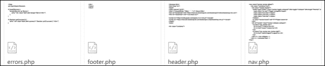
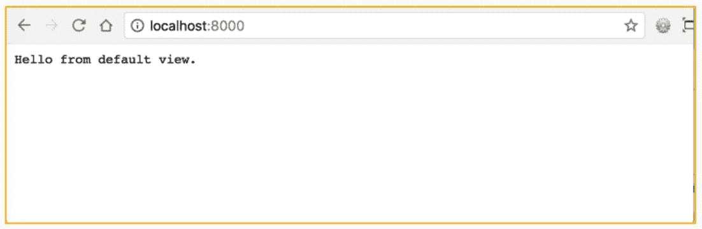
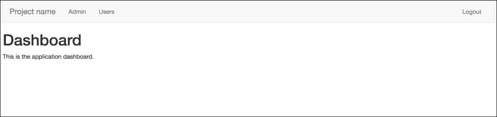
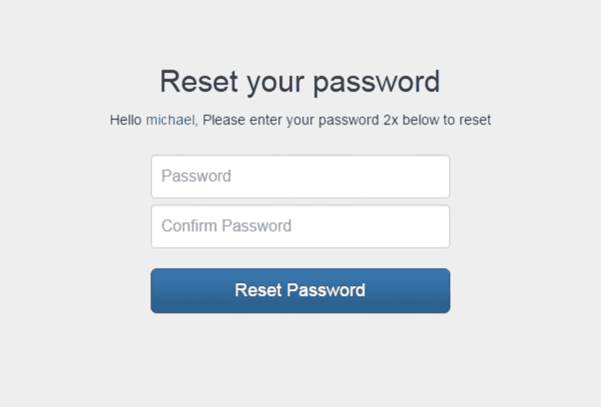
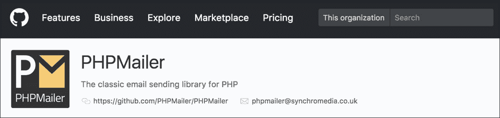
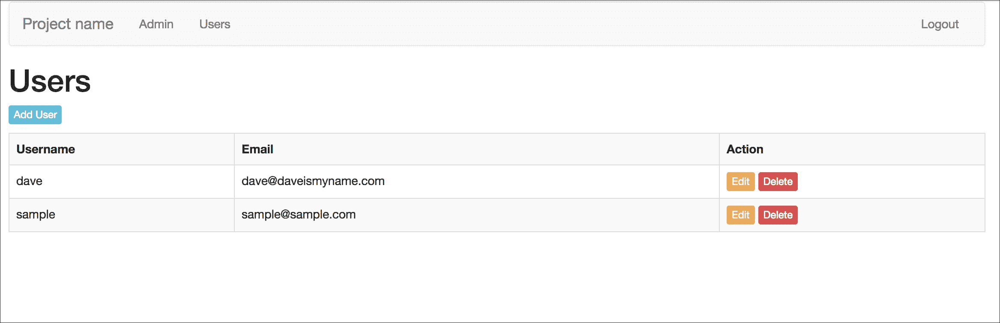

# 第七章。身份验证和用户管理

在上一章中，我们更好地理解了`数据库`类在项目中的作用，这在开发人员与数据库交互时使用。

我们使用的唯一库叫做 Whoops，它将以可读格式显示错误。我们还获得了构建默认状态的经验，包括`baseController`和`baseMethod`。

在本章中，我们将专注于项目的安全方面，即身份验证。我们将构建登录表单，该表单与数据库交互以验证用户的身份。最后，我们将介绍如何在我们的应用程序中设置密码恢复机制。

在本章结束时，您将能够：

+   为他们的应用程序构建默认视图

+   构建密码管理和重置系统

+   为系统应用程序中的模块构建 CRUD

# 设置路径和包含 Bootstrap

在本节中，我们将继续在框架的基础上构建功能。核心框架系统文件已经就位。这个设置用于在此基础上构建有用的功能。

我们将构建身份验证系统并完成应用程序构建。身份验证是必需的，以防止未经授权的用户访问。这确保只有具有有效用户名和密码的用户才能登录到我们的应用程序中。

### 注意

在本章中，我们将涵盖身份验证。请注意，本课程中使用的所有示例的登录用户名和密码如下：

用户名：`演示`

密码：`演示`

## 设置路径和创建文件目录的绝对路径

相对路径是相对于当前文件夹路径的路径，例如，`./css`指向一个相对路径，向上一个文件夹并进入`css`文件夹。

绝对路径是文件或文件夹的完整路径，例如`/user/projects/mvc/css`。

这一点很重要，因为这将允许在框架系统的任何地方使用绝对路径包含文件。这是对系统中现有代码的调整。

例如：

```php
$filepath = "../app/views/$path.php";
```

这变成了：

```php
$filepath = APPDIR."views/$path.php";
```

这在当前概念的基础上构建，并允许视图组织到子文件夹中。没有这种适应，将无法将任何内容组织到子文件夹中，并且会干扰代码的整洁组织。

没有这些更改也可以继续构建系统，但确保代码整洁有序总是一个好主意。

## 创建布局文件

布局文件是必需的，以便显示任何错误。

此外，`页眉`、`页脚`和`导航`需要布局文件。创建后，这些文件将提供应该在整个应用程序中引入的元素。这将包括全局元素。



### 注意

错误用于验证，这将在进一步的子部分中进行介绍，不要与先前看到的错误中的解析错误或类似错误混淆。这些步骤涉及的错误与表单验证相关的错误，其中用户将不正确的信息输入到表单字段中。

## 包含 Bootstrap

Bootstrap 是一个 HTML、CSS 和 JavaScript 库，将在本章中包含，以提供基本的样式。对开发人员很有用，因为它可以帮助他们在设计师添加设计元素到应用程序之前，原型和可视化他们的应用程序将如何看起来。

在这个项目中，Bootstrap 将作为**内容传送网络**（**CDN**）包含在页眉中。CDN 获取在网络上非常常见的资源并对其进行缓存，以帮助提高性能。

### 注意

这很容易与引导框架混淆。

Bootstrap，HTML、CSS 和 JavaScript 库以及引导概念是两个不同的东西，它们有相似的名称。

您可以通过访问以下链接找到有关 Bootstrap 的更多信息：[`getbootstrap.com/`](https://getbootstrap.com/)。

# 引入 Bootstrap 和 HTML 标记

该部分的目的是实现我们已经实现的通用样式，显示了引入 bootstrap 和 HTML 标记：



尚未解决的问题是路径。到目前为止，我们一直在使用相对路径来包括`system/View.php`中的视图文件。让我们解决这个问题：

1.  打开`webroot/index.php`，并在第 9 行后添加以下行：

```php
defined('DS') || define('DS', DIRECTORY_SEPARATOR);
define('APPDIR', realpath(__DIR__.'/../app/') .DS);
define('SYSTEMDIR', realpath(__DIR__.'/../system/') .DS);
define('PUBLICDIR', realpath(__DIR__) .DS);
define('ROOTDIR', realpath(__DIR__.'/../') .DS);
```

这些是可以在框架中的任何地方调用的常量。第一行定义了目录分隔符，例如`/`或`\`，具体取决于机器：

+   `APPDIR` – 指向`app`文件夹

+   `SYSTEMDIR` – 指向`system`文件夹

+   `PUBLICDIR` – 指向`webroot`文件夹

+   `ROOTDIR` – 指向`root`项目路径

每个都创建到其终点的绝对路径。

1.  现在，让我们修复`View`类。打开`system/View.php`，在第 24 行，替换：

```php
$filepath = "../app/views/$path.php";
```

使用：

```php
$filepath = APPDIR."views/$path.php";
```

### 注意

这允许视图从父文件夹或子文件夹中包含其他视图，而不会出现问题。

1.  接下来，在`app/views`文件夹内创建一个名为`layouts`的文件夹。在`app/views/layouts`内创建以下文件：

+   `errors.php`

+   `footer.php`

+   `header.php`

+   `nav.php`

+   `errors.php`

1.  打开`errors.php`并输入以下代码：

```php
<?php
use App\Helpers\Session;

if (isset($errors)) {
    foreach($errors as $error) {
        echo "<div class='alert alert-danger'>$error</div>";
    }
}

if (Session::get('success')) {
    echo "<div class='alert alert-success'>".Session::pull('success')."</div>";
}
```

### 注意

这包括一个 Session 助手，我们将很快创建。

第一个`if`语句检查`$errors`是否存在，如果存在，则退出循环并显示警报。这些类是`Bootstrap`类（我们将在`header.php`中有这些）。

接下来的`if`语句检查是否存在名为`success`的会话，并且如果存在，则显示其内容。这用于向用户提供反馈。

1.  打开`header.php`并输入以下代码：

```php
<!doctype html>
<html lang="en">
<head>
<meta charset="utf-8">
<title><?=(isset($title) ? $title.' - ' : '');?> Demo</
title>
<link rel="stylesheet" href="https://maxcdn.bootstrapcdn.com/bootstrap/3.3.6/css/bootstrap.min.css">
<link rel="stylesheet" href="/css/style.css">

<script src="https://code.jquery.com/jquery-2.2.4.min.js"></script>
<script src="https://maxcdn.bootstrapcdn.com/bootstrap/3.3.6/js/bootstrap.min.js"></script>
</head>
<body>

<div class="container">
```

### 注意

这将设置 HTML 文档，并在必要时使用`$title`，如果存在的话。还包括 Bootstrap CDN CSS 和 JavaScript，以及 jQuery 和位于`webroot/css/style.css`的自定义 style.css 文件 - 创建此文件。

1.  现在，打开`footer.php`，关闭容器`div`和`body`和`html`标签：

### 注意

有关完整的代码片段，请参考代码文件夹中的`Lesson 7.php`文件。

```php
</div>
</body>
</html>
```

1.  现在，打开`nav.php`并输入以下代码：

```php
<nav class="navbar navbar-default">
……
      </div><!--/.nav-collapse -->
    </div><!--/.container-fluid -->
</nav>
```

### 注意

这是 Bootstrap 的导航组件。这是一种为我们的管理页面引入响应式菜单的干净方式。注意两个页面链接，分别是管理和用户。我们还将提供一个注销链接。

1.  现在，打开`app/views/404.php`并包含布局文件：

```php
<?php include(APPDIR.'views/layouts/header.php');?>
404!
<?php include(APPDIR.'views/layouts/footer.php');?>
```

### 注意

这将引入页眉并显示页面内容，并以包括页脚结束。

不要在这里包括`nav`。即使用户未登录，也可以显示 404。

这样可以以非常干净的方式将常见的布局组织到视图中，这样当您需要更改全局元素时，布局视图就是它们存储的地方。

1.  如果框架尚未运行，请在浏览器中打开框架。在根目录时，从终端运行以下命令：

```php
php –S localhost:8000 –t webroot
```

### 注意

您不会注意到任何不同，但您将被重定向到一个不存在的页面：`http://localhost:8000/example`。

1.  您将看到一个包含页眉和页脚布局的 404 页面。查看页面源代码 - 右键单击并单击“查看页面源代码”。您应该看到以下输出：

### 注意

有关完整的代码片段，请参考代码文件夹中的`Lesson 7.php`文件。

```php
<!doctype html>
<html lang="en">
<head>
……
404!
</div>
</body>
</html>
```

随着我们进入本章的深入，这些布局将变得更加明显。

在本节中，我们已经介绍了如何正确设置文件路径。我们介绍了如何正确设置 Bootstrap，并最终为错误和页眉、页脚、导航和错误设置了视图。

在下一节中，我们将介绍如何向我们的应用程序添加安全性并设置密码恢复。

# 向项目添加安全性

在本节中，我们将继续在框架之上构建功能。核心框架系统文件已经就位。

本节的目标是构建功能，以增强项目的安全性。我们将涵盖需要在应用程序中保持良好安全性的各个方面。

## 帮助程序

在本小节中，我们将涵盖`helpers`。

我们将创建一个`URL` `helper`和一个`session` `helper`。这对身份验证以及系统的任何其他方面都很有用，但并不直接相关。

会话助手是 PHP 会话的“包装器”，包括对开发人员有用的各种方法，用于处理会话。

`URL` `helper`在某种意义上与`session`类似，它是处理 URL 的有用方法。但是，在本书中，它要短得多，只限于单个方法。

### 注意

`session`是一种存储临时数据的方法，比如用户是否已登录。

## 身份验证

现在，我们将构建身份验证功能。身份验证是一种只允许具有正确凭据的人访问受限部分的方法。

这将涉及创建一个数据库表和一个模型：

+   在数据库中创建用户表

+   在 app 模型中创建一个用户模型

+   添加插入、更新、删除方法

然后，我们将创建一个管理员控制器，并导入 URL 和`session`帮助程序以及`user`模型。

最后，我们将创建相关的视图。

### 仪表板

项目将需要一个仪表板；这就像一个需要登录的项目的主页，通常包括指向项目经常访问内容的链接。在这个项目中，我们只需要确保仪表板有一个存在的文件，以便可以将其定向到它。您将创建仪表板视图，并包括布局文件以及页眉、页脚、导航和错误。您将为页面结构添加 HTML。

### 登录

创建登录页面也是本节的一部分。

在登录视图中，您将创建一个登录表单，并包括布局文件。

然后，他们将创建一个登录方法来处理登录过程：

+   部分过程是使用密码哈希和 bcrypt 对密码进行哈希处理

+   使用设计用于返回数据的 Get data 方法

+   除了创建视图和登录方法，我们还将创建`logout`方法，并修改配置，以便默认情况下主页将是管理员仪表板

### 密码哈希

密码哈希使用 bcrypt，这是目前最强大的算法。目前，一台普通计算机需要 12 年才能破解一个密码哈希。

部分过程是验证数据，检查用户名和密码是否与数据库中存储的内容匹配。

密码哈希是从您的密码创建一个单向哈希的字符串，没有用户应该能够确定哈希的原始内容。

### 注意

密码哈希不应与加密混淆。区别在于，在密码哈希中，您可以将哈希密码解密为其原始状态。

# 在 PHP 中实现验证

在本节中，我们将看到以下结果。



### 注意

本节展示了如何在 PHP 中实现验证，尽管它目前无法正常工作，因为我们尚未创建和提供构成系统知识的数据源。

为了解决这个部分，我们将手动创建一个用户。

按照以下步骤在 PHP 中实现验证：

**创建帮助程序：**

1.  在我们开始构建身份验证之前，我们需要两个新的帮助程序。在`app/Helpers`中创建一个名为`Url.php`的新文件，并输入：

```php
<?php namespace App\Helpers;

class Url
{
    public static function redirect($path = '/')
   {
        header('Location: '.$path);
        exit();
    }
}
```

### 注意

这提供了一个名为 redirect 的单一方法，默认情况下为/，当没有传递参数时。这是重定向到我们应用程序的另一个页面的简单方法。

在将类包含到页面后，使用：`Url::redirect('url/to/redirect/to')`

要重定向到主页，请使用：

`Url::redirect()`

接下来，我们需要一种使用会话的方法。会话是 PHP 跟踪页面数据的一种方式，这非常适合我们的需求，例如能够通过读取会话数据来检测用户是否已登录。

我们可以使用普通的$_SESSION 调用，但由于我们正在使用 OOP，让我们利用它来构建一个会话助手。

1.  在`app/Helpers`中创建一个名为`Session.php`的文件。

1.  首先，设置命名空间和类定义：

### 注意

需要的第一个方法是确定会话是否已启动。如果更新了`sessionStarted`参数，它将将其设置为`false。这`将告诉`init`方法打开会话：

```php
<?php namespace App\Helpers;

class Session
{
    private static $sessionStarted = false;
/**
 * if session has not started, start sessions
 */
public static function init()
{
    if (self::$sessionStarted == false) {
        session_start();
        self::$sessionStarted = true;
    }
}
```

1.  接下来，创建一个名为`set`的方法，接受两个参数`$key`和`$value`。这用于向会话添加一个`$key`并将`$value`设置为`$key`：

```php
public static function set($key, $value = false)
{
    /**
     * Check whether session is set in array or not
     * If array then set all session key-values in foreach loop
     */
    if (is_array($key) && $value === false) {
        foreach ($key as $name => $value) {
            $_SESSION[$name] = $value;
        }
    } else {
        $_SESSION[$key] = $value;
    }
}
```

1.  接下来，创建一个名为`pull`的方法，带有一个参数。这将从会话中提取`key`并在从会话中删除它后返回它，这对于一次性消息非常有用：

```php
public static function pull($key)
{
    $value = $_SESSION[$key];
    unset($_SESSION[$key]);
    return $value;
}
```

1.  接下来，创建一个 get 方法。这将从提供的键返回一个会话：

```php
public static function get($key)
{
    if (isset($_SESSION[$key])) {
        return $_SESSION[$key];
    }

    return false;
}
```

### 注意

有时，您希望查看会话的内容。创建一个名为`display`的方法，返回`$_SESSION`对象：

```php
public static function display()
{
    return $_SESSION;
}
```

1.  最后一个方法用于在提供`$key`时销毁会话密钥，否则将销毁整个会话：

```php
public static function destroy($key = '')
{
    if (self::$sessionStarted == true) {
        if (empty($key)) {
            session_unset();
            session_destroy();
        } else {
            unset($_SESSION[$key]);
        }
    }
}
```

完整的类如下所示：

### 注意

有关完整的代码片段，请参阅代码文件夹中的`Lesson 7.php`文件。

```php
<?php namespace App\Helpers;

class Session
{
    private static $sessionStarted = false;
……..
    }

}
```

1.  现在，我们需要在应用程序运行时自动设置会话。我们通过在`app/Config.php`中添加`Session::init()`来实现这一点：

### 注意

这使用了一个`Use`语句，并包括对`session's` `helper`类的调用。在这个阶段突出显示这些 OOP 特性可能是有益的。

有关完整的代码片段，请参阅代码文件夹中的`Lesson 7.php`文件。

```php
<?php namespace App;

use App\Helpers\Session;

class Config {
…….
        ];
    }
}
```

**构建身份验证：**

我们现在准备开始构建 admin Controller 和 users Model，这将是用户登录的入口点。

1.  在数据库中创建一个名为 users 的新表：

```php
CREATE TABLE `users` (
  `id` int(11) unsigned NOT NULL AUTO_INCREMENT,
  `username` varchar(255) DEFAULT NULL,
  `email` varchar(255) DEFAULT NULL,
  `password` varchar(255) DEFAULT NULL,
  `created_at` datetime DEFAULT NULL,
  `reset_token` varchar(255) DEFAULT NULL,
  PRIMARY KEY (`id`)
) ENGINE=InnoDB DEFAULT CHARSET=utf8;
```

### 注意

ID 是`primary`键，并将设置为自动递增，这意味着每个记录都将有一个唯一的 ID。

`reset`_token 仅在需要重置密码过程时使用。

1.  让我们从 Model 开始。在`app/Models`中创建一个名为`User.php`的文件。

1.  设置命名空间并导入基本 Model 并设置类定义。

### 注意

随着需要，我们将回到这个模型中添加必要的方法。

1.  添加用于插入、更新和删除记录的方法：

### 注意

有关完整的代码片段，请参阅代码文件夹中的`Lesson 7.php`文件。

```php
<?php namespace App\Models;
…….
    {
        $this->db->delete('users', $where);
    }
}
```

**创建 Admin Controller：**

1.  现在，在`app/Controllers`中创建一个名为`Admin.php`的新文件。

这将是登录和退出 admin 仪表板的入口点。

1.  设置命名空间并导入`baseController`和`Session`和`URL` `helpers`以及`User` Model。

1.  设置类定义并创建一个名为`$user`的属性。然后，在`__construct`方法中，通过调用`new User()`来初始化`User` Model。

### 注意

这意味着可以使用`$this->user`来访问 User Model 的任何方法。

下一个方法是`index()`。只要用户已登录，它就会加载仪表板视图。

1.  为了确保用户已登录，会运行一个`if`语句来检查名为`logged_jn`的会话密钥是否存在，该密钥仅在登录后设置。如果用户未登录，则将其重定向到`login`方法：

### 注意

有关完整的代码片段，请参阅代码文件夹中的`Lesson 7.php`文件。

```php
<?php namespace App\Controllers;

use System\BaseController;
……..
        $this->view->render('admin/index', compact('title'));
    }

}
```

1.  如果用户已登录，则将加载`admin/index`视图。创建视图`app/views/admin/index.php`和入口：

```php
<?php
include(APPDIR.'views/layouts/header.php');
include(APPDIR.'views/layouts/nav.php');
include(APPDIR.'views/layouts/errors.php');
?>

<h1>Dashboard</h1>
<p>This is the application dashboard.</p>

<?php include(APPDIR.'views/layouts/footer.php');?>
```

现在，我们需要创建一个`login`视图。在`app/views/admin`中创建一个名为`auth`的文件夹，并创建`login.php`。

1.  首先，包含`header`布局，然后创建一个调用`wrapper`和`well`的`div`。`well`类是一个 Bootstrap 类，它提供了灰色方形样式。`wrapper`类将用于定位`div`。

1.  接下来，包含`errors`布局以捕获任何错误或消息。

1.  现在，我们将创建一个表单，该表单的方法为`post`，以将其内容发布到`ACTION URL`，在本例中为`/admin/login`。

1.  然后，为`username`和`password`创建两个输入。确保密码的输入类型设置为`password`。

### 注意

将输入类型设置为`password`可以阻止密码在屏幕上显示。

当表单提交时，输入的命名属性是 PHP 如何知道数据是什么的。

还需要一个提交按钮来提交表单。一个好的做法是在用户无法记住他们的登录详细信息时提供重置选项。我们将创建一个指向`/admin/reset`的链接。

1.  最后，关闭表单并包含页脚布局：

### 注意

有关完整的代码片段，请参考代码文件夹中的`Lesson 7.php`文件。

```php
<?php include(APPDIR.'views/layouts/header.php');?>

<div class="wrapper well">

    <?php include(APPDIR.'views/layouts/errors.php');?>
…….
.wrapper h1 {
    margin-top: 0px;
    font-size: 25px;
}
```

1.  现在，回到 admin 控制器并创建一个`login`方法：

### 注意

设置一个检查，如果用户已登录，则重定向用户。当他们已经登录时，他们不应该能够看到登录页面。

1.  在`login`方法中，创建一个空的`$errors`数组，并设置页面的`$title`和`load`一个调用`admin/auth/login`的视图，通过使用`compact`函数传递`$title`和`$errors`变量。

### 注意

`compact()`使得可以通过简单输入它们的名称而使用变量，而不需要`$`：

```php
public function login()
{
    if (Session::get('logged_in')) {
        Url::redirect('/admin');
    }

    $errors = [];

    $title = 'Login';

    $this->view->render('admin/auth/login', compact('title', 'errors'));
}
```

这将加载`login`视图，并在按下提交时实际上不会执行任何操作。我们需要检查表单是否已提交，但在这之前，我们需要向`user`模型添加两个方法：

```php
public function get_hash($username)
{
    $data = $this->db->select('password FROM users WHERE username = :username', [':username' => $username]);
   return (isset($data[0]->password) ? $data[0]->password : null);
}
```

`get_hash($username)`将从`users`表中选择`password`，其中`username`与提供的用户名匹配。

设置`username = :username`创建一个占位符。然后，['`:username' => $username`]将使用该占位符，以便知道值将是什么。

然后，检查`$data[0]->password`是否设置并返回它。否则，返回`null`。

1.  对于`get_data()`，做同样的事情，只是这次返回的是一个数据数组，而不是单个列：

```php
public function get_data($username)
{
    $data = $this->db->select('* FROM users WHERE username = :username', [':username' => $username]);
    return (isset($data[0]) ? $data[0] : null);
}
```

1.  现在，在我们的`login`方法中，我们可以通过检查`$_POST`数组是否包含名为`submit`的对象来检查表单是否已提交。

1.  然后，收集表单数据并将其存储在本地变量中。使用`htmlspecialchars()`是一种安全措施，因为它可以阻止脚本标记能够被执行，并将它们呈现为纯文本。

### 注意

接下来，运行一个`if`语句，调用`password_verify()`，这是一个内置函数，返回`true`或`false`。第一个参数是用户提供的`$password`，第二个是通过调用`$this->user->get_hash($username)`从数据库返回的哈希密码。只要`password_verify`等于`false`，登录检查就失败了。

1.  设置一个`$errors`变量来包含一个`errors`消息。接下来，计算`$errors`，如果等于`0`，这意味着没有错误，所以从`$this->user->get_data($username)`获取用户数据。然后，使用会话助手创建一个名为`logged_in`的会话键，其值为`true`，以及另一个以用户 ID 作为其值的会话键。

1.  最后，将用户重定向到 admin `index`页面：

```php
if (isset($_POST['submit'])) {
            $username = htmlspecialchars($_POST['username']);
           $password = htmlspecialchars($_POST['password']);
           if (password_verify($password, $this->user->get_hash($username)) == false) {
                $errors[] = 'Wrong username or password';
            }
            if (count($errors) == 0) {
                //logged in
                $data = $this->user->get_data($username);
                Session::set('logged_in', true);
                Session::set('user_id', $data->id);

                Url::redirect('/admin');
            }
        }
```

完整的方法看起来像这样：

```php
public function login()
{
    if (Session::get('logged_in')) {
        Url::redirect('/admin');
    }
……
    $this->view->render('admin/auth/login', compact('title', 'errors'));
}
```

1.  如果框架尚未运行，请运行框架：

```php
php –S localhost:8000 –t webroot
```

1.  转到`http://localhost:8000/admin/login`。

### 注意

您将看到一个登录页面。按下登录将显示一个错误消息“`用户名或密码错误`”，无论您输入什么，因为目前数据库中没有用户。

1.  让我们创建我们的登录。我们需要一个哈希密码来存储在数据库中。要在`login`方法中创建一个哈希密码，请输入：

```php
echo password_hash('demo', PASSWORD_BCRYPT);
```

第一个参数是您想要的`密码`，在本例中是`demo`。第二个参数是要使用的`PASSWORD`函数的类型。使用默认的`PASSWORD_ BCRYPT`意味着 PHP 将使用可能的最强版本。

1.  当您刷新页面时，您将看到以下类似的哈希：

```php
$2y$10$OAZK6znqAvV2fXS1BbYoVet3pC9dStWVFQGlrgEV4oz2GwJi0nKtC
```

1.  复制这个并将一个新记录插入到数据库客户端中，并将 ID 列留空。它将自动填充。

1.  创建一个`用户名和电子邮件`，并将它们粘贴到`hash. F`中，对于密码，输入一个有效的`datetime`，例如 2017-12-04 23:04:00。

1.  保存记录。现在，您将能够设置登录。

1.  登录后，您将被重定向到`/admin`。

### 注意

记得注释掉或删除`echo password_hash('demo', PASSWORD_BCRYPT),`，否则哈希将始终显示。

1.  趁热打铁，让我们继续添加注销的功能。注销是销毁已登录和`user_id`会话的情况。在`Admin` Controller 中，创建一个名为`logout`的新方法。

1.  在方法内部，销毁会话`object`，然后重定向到`login`页面：

```php
public function logout()
{
    Session::destroy();
    Url::redirect('/admin/login');
}
```

1.  现在，返回应用程序并点击右上角的`logout`。您将被注销并带回`login`页面。

1.  现在，重新登录。如果您点击`Admin`链接，您将被带到默认页面。在这种情况下，最好在加载应用程序时立即加载管理员。我们可以通过将`Admin` Controller 设置为默认`app/Config.php`来实现这一点。

找到以下内容：

```php
'default_controller' => 'Home'
```

用以下内容替换它：

```php
'default_controller' => Admin,
```

1.  现在，如果您点击`Admin`（重新加载页面后），您将看到管理员仪表板。

### 注意

曾经有一段时间，某些密码哈希标准被认为是互联网安全的最高级别。但是，像大多数技术一样，它不可避免地变得可用，这削弱了其前身的有效性。

### 注意

尽一切可能避免以下哈希系统，因为它们不安全：

+   MD5

+   Shar 1

+   Shar 2 56

这些密码哈希函数很弱，计算机现在如此强大，只需几秒钟就能破解它们。

当开发人员在规划新项目时，建议仔细检查代码，以查找诸如使用这些代码的安全漏洞。

在本节中，我们学习了认证过程。我们已经了解了如何进行登录过程。我们已经学习了密码哈希的过程。现在，我们已经有了构建、配置和路由功能到框架的经验。

在下一节中，我们将介绍密码恢复的概念，在其中我们将设置在我们的应用程序中重置密码的功能。

# 密码恢复

本节是关于设置重置密码的能力。密码重置非常重要，因为可能会出现用户忘记密码的情况。我们现在将构建一个类似以下图片的密码恢复过程：



在网上找到的通用密码恢复示例

我们将在 admin Controller 中创建一个名为 reset 的方法。该过程会加载一个视图，用户将在其中输入他们的电子邮件地址以请求一封电子邮件。当这个过程被处理时，它将验证电子邮件地址是否有效，并且实际上存在于系统中。

这将检查电子邮件，确保它的格式正确，并检查提供的电子邮件地址是否存在于名为 users 的数据库表中。

## 介绍第三方依赖 PHP Mailer



PHP Mailer 的图片：https://github.com/PHPMailer

我们将通过包含 PHP Mailer 来添加第三方依赖，用于发送电子邮件。

PHP Mailer 的工作原理如下：

1.  只要验证通过，我们将使用 PHP Mailer 发送带有令牌的电子邮件。令牌稍后将通过电子邮件接收，并作为表单的一部分输入到隐藏字段中，满足验证过程的要求。

### 注意

令牌只是一串随机的字母和数字。其想法是为该用户生成一个唯一的东西，以识别该请求来自他们。

1.  流程的下一部分是向用户发送电子邮件，当用户点击时，创建一个处理该请求的方法。这涉及创建一个接受电子邮件提供的令牌的更改密码方法，然后在其中显示包含表单的视图。

1.  接下来，在视图中，令牌在一个隐藏字段中重新发送。此外，用户可以输入新密码并确认此密码。提交后，控制器将处理数据并验证数据。这涉及确保令牌与用户帐户匹配，并且密码足够长且两个密码匹配。

1.  创建后，当更新投入实践时，用户将能够自动登录到管理系统，而无需重新输入密码。

这样可以节省用户在重置密码后无需登录。从技术上讲，这是用户体验设计的更新，尽管您可以在这里看到 UX 更改不仅仅局限于设计师领域。

### 注意

PHP Mailer 检查格式是否正确。在电子邮件的情况下，这将期望@符号存在。这只是一个验证检查的例子。PHP 内置了方法，以便它可以确定正确的格式是有效的格式。

# 为我们的应用程序构建密码重置机制

要完成认证系统，我们需要能够重置密码，以防忘记密码。以下是这样做的步骤：

1.  在`Admin`控制器中创建一个名为`reset`的新方法。

1.  再次检查用户是否已登录，如果是，则将其重定向回管理界面。

1.  在加载名为`reset:`的视图之前，设置一个`errors`数组并设置页面标题。

```php
public function reset()
{
    if (Session::get('logged_in')) {
        Url::redirect('/admin');
    }

    $errors = [];

    $title = 'Reset Account';

    $this->view->render('admin/auth/reset', compact('title', 'errors'));
}
```

1.  现在，在`app/views/admin/auth`中创建一个名为`reset.php`的视图并输入：

```php
<?php include(APPDIR.'views/layouts/header.php');?>

<div class="wrapper well">

    <?php include(APPDIR.'views/layouts/errors.php');?>

    <h1>Reset Account</h1>

    <form method="post">
…
…
    </div>

<?php include(APPDIR.'views/layouts/footer.php');?>
```

### 注意

表单将发布到相同的`url /admin/reset`。我们收集的唯一数据是电子邮件地址。电子邮件地址将用于在继续之前验证用户是否存在。

1.  现在，返回到`Admin`控制器上的重置方法。

1.  首先，检查表单是否已使用`isset`提交，并传递提交按钮名称：

```php
if (isset($_POST['submit'])) {
```

1.  接下来，确保电子邮件地址已`isset`，否则默认为`null`。检查电子邮件地址是否处于正确的格式中：

```php
$email = (isset($_POST['email']) ? $_POST['email'] : null);

if (!filter_var($email, FILTER_VALIDATE_EMAIL)) {

    $errors[] = 'Please enter a valid email address';
} else {
    if ($email != $this->user->get_user_email($email)){
        $errors[] = 'Email address not found';
    }
}
```

1.  最后，检查电子邮件地址是否属于现有用户。为此，在用户模型中创建一个名为`get_user_email($email)`的新方法：

### 注意

如果存在，这将返回电子邮件地址，否则将返回`null`。

```php
public function get_user_email($email)
{
    $data = $this->db->select('email from users where email = :email', [':email' => $email]);
    return (isset($data[0]->email) ? $data[0]->email : null);
}
```

在前面的控制器中，我们有：

```php
if ($email != $this->user->get_user_email($email)){
```

### 注意

检查表单中提供的电子邮件地址是否与数据库中的不匹配，如果是，则创建一个新错误。

1.  在验证检查之后，没有错误：

```php
if (count($errors) == 0) {
```

1.  保存文件；到目前为止，该方法看起来像这样：

### 注意

有关完整的代码片段，请参阅代码文件夹中的`Lesson 7.php`文件。

```php
public function reset()
{
…….

    $this->view->render('admin/auth/reset', compact('title', 'errors'));
}
```

此时，除其他事项外，需要发送电子邮件。

### 注意

最佳做法是不使用 PHP 的内置`mail（）`函数，而是使用诸如`phpmailer`（[`github.com/PHPMailer/`](https://github.com/PHPMailer/)）之类的库。

1.  打开`composer.json`和`phpmailer`在要求列表中：

```php
{
    "autoload": {
        "psr-4": {
            "App\\" : "app/",
            "System\\" : "system/"
        }
    },
    "require": {
        "filp/whoops": "².1",
        "phpmailer/phpmailer": "~6.0"
    }
}
```

1.  保存文件并在终端中键入`composer update`。这将拉取`phpmailer`，使其可用于我们的应用程序。

1.  在`Admin`控制器的顶部，导入`phpmailer`：

```php
use PHPMailer\PHPMailer\PHPMailer;
use PHPMailer\PHPMailer\Exception;
```

1.  接下来，转到以下`if`语句内的`reset`方法。这是我们将恢复的地方：

```php
if (count($errors) == 0) {

}
```

1.  现在，我们需要生成一个随机令牌。为此，使用`md5`，`uniqid`和`rand`来生成一个随机令牌。

1.  然后，设置一个`data`和`where`数组。`$data`将指定`reset_token`的值为`$token`，而`$where`将是电子邮件地址。将它们传递给用户模型的`update()`方法以更新用户。

这将在数据库中存储`$token`与用户记录：

```php
$token = md5(uniqid(rand(),true));
$data  = ['reset_token' => $token];
$where = ['email' => $email];
$this->user->update($data, $where);
```

1.  现在，我们通过创建`phpmailer`的新实例来设置要发送的电子邮件，然后设置电子邮件的发送者。根据需要更改这一点。

1.  传递`$email`地址，这将被发送到，并通过将 true 传递给 isHTML()来设置 HTML 模式：

```php
$mail = new PHPMailer(true);
$mail->setFrom('noreply@domain.com');
$mail->addAddress($email);
$mail->isHTML(true);
```

1.  设置主题和电子邮件正文。我们提供两种正文：HTML 和纯文本。纯文本用于用户的电子邮件客户端无法呈现 HTML 的情况。

1.  创建一个指向`admin/change/password_token`的链接，当使用`localhost:`时

### 注意

重要的是要记住`http://localhost:8000`的 URL 只适用于您的计算机。

```php
$mail->Subject = 'Reset you account';
$mail->Body    = "<p>To change your password please click <a 
href='http://localhost:8000/admin/change_password/$token'>this link</a></p>";
$mail->AltBody = "To change your password please go to this address: http://localhost:8000/admin/change_password/$token";
```

1.  现在，一切都设置好了。发送电子邮件：

```php
$mail->send();
```

1.  创建一个会话来通知用户并重定向管理员/重置：

```php
Session::set('success', "Email sent to ".htmlentities($email));
Url::redirect('/admin/reset');
```

完成的方法看起来像这样：

### 注意

有关完整的代码片段，请参考代码文件夹中的`Lesson 7.php`文件。

```php
public function reset()
{
    if (Session::get('logged_in')) {
        Url::redirect('/admin');
    }
…….
    $title = 'Reset Account';

    $this->view->render('admin/auth/reset', compact('title', 'errors'));
}
```

1.  当用户点击电子邮件中的链接时，我们需要处理请求。为此，创建另一个名为`change_password`的方法，接受一个名为`$token`的参数：

### 注意

该方法获取`$token`，将其传递给`users`模型中的一个方法`get_user_reset_token($token)`，并返回用户对象。如果令牌与数据库不匹配，则返回 null。

有关完整的代码片段，请参考代码文件夹中的`Lesson 7.php`文件。

```php
$user = $this->user->get_user_reset_token($token);
if ($user == null) {
       $errors[] = 'user not found.';
}
```

该方法看起来像这样：

### 注意

有关完整的代码片段，请参考代码文件夹中的`Lesson 7.php`文件。

```php
$title = 'Change Password';

    $this->view->render('admin/auth/change_password', compact('title', 'token', 'errors'));
}
```

### 注意

`render`方法将`$title`，`$token`和`$errors`传递给视图。

1.  需要另一个视图。在`app/views/admin/auth`中创建一个名为`change_password.php`的视图：

### 注意

有关完整的代码片段，请参考代码文件夹中的`Lesson 7.php`文件。

```php
<?php include(APPDIR.'views/layouts/header.php');?>

……
    </div>

<?php include(APPDIR.'views/layouts/footer.php');?>
```

### 注意

表单有一个名为`$token`的隐藏输入。它的值是从控制器传递的`$token`，这将用于验证请求。

还有两个输入：`密码`和`确认密码`。这些用于收集所需的密码。

当提交表单并收集表单数据时，再次调用`get_user_reset_token($token)`方法来验证提供的令牌是否有效。

此外，密码必须匹配并且长度必须超过三个字符。

1.  如果没有错误，则通过将数组传递给`$this->user->update`来更新数据库中用户的记录以清除`reset_token`。使用`password_hash()`对密码进行哈希处理，其中 ID 与用户对象匹配，令牌与提供的令牌匹配：

### 注意

有关完整的代码片段，请参考代码文件夹中的`Lesson 7.php`文件。

```php
if (isset($_POST['submit'])) {

    $token = htmlspecialchars($_POST['token']);
……..
    }

}
```

1.  更新后，记录用户并将其重定向到管理员仪表板。

完整的方法看起来像这样：

### 注意

有关完整的代码片段，请参考代码文件夹中的`Lesson 7.php`文件。

```php
public function change_password($token)
{
…….

    $title = 'Change Password';

    $this->view->render('admin/auth/change_password', compact('title', 'token', 'errors'));
}
```

这结束了认证部分。现在我们可以登录、登出，并在忘记密码时重置密码。

我们现在已经到达了本节的结束。在这里，我们学会了如何构建密码重置系统，并进一步学习了使用第三方工具的经验。

在下一节中，我们将看到如何为用户管理添加 CRUD 功能。

# 为用户管理构建 CRUD

## CRUD

`users`部分允许创建和管理应用程序的用户。

我们将创建 CRUD 以启用：

+   创建用户

+   显示现有用户

+   更新现有用户

+   删除不需要的用户

在本节中，我们将创建用户控制器中的不同方法。

我们还将在用户模型中创建更多方法，以便检索所有用户或检索特定用户所需的新查询。

该过程将如下进行：

1.  这个过程的一部分是创建一个`construct`方法，它允许我们保护所有未经授权的用户的方法。这意味着要能够访问部分内的任何方法，您必须首先登录。`index`方法列出所有用户，并提供编辑和删除用户的选项。

1.  在删除时，首先会出现确认。

1.  下一步是创建一个`add`视图。在这个视图中，将有一个表单，供应用程序的用户创建他们的应用程序的新用户记录。在提交表单时，将收集数据并开始验证过程。

1.  这将检查提交的数据是否适合其目的，并且可能是预期的数据。

例如，将检查用户名是否超过三个字符的长度，并且在数据库中不存在。

### 注意

这个过程对于电子邮件也是一样的，在电子邮件的情况下，要确保它是有效的并且不存在。

1.  在验证通过后，用户将被创建，并且成功消息将被记录并显示给用户。应用程序用户然后被重定向到用户视图。

1.  然后我们将创建一个`update`方法和`view`，这与创建用户的方法和视图非常相似。关键区别在于，表单在加载到页面上时会预先填充用户的详细信息，当表单提交时，会更新特定的用户而不是创建新记录。

1.  最后要创建的方法是`delete`方法，它检查用户的 ID 是否为数字，并且不与已登录用户的 ID 相同，以防止他们删除自己。

### 注意

这是开发人员低估用户可能会做的事情。令人惊讶的是，用户可能有意或无意地做的事情，以及如果应用程序不采取措施来防止这种情况，他们可能会删除自己。

在记录被删除后，会创建一个成功消息，并将用户重定向回用户页面。

# 构建用户管理的 CRUD

在这一部分，我们将看到以下输出显示在我们的屏幕上：



### 注意

在读取用户时，要知道在这个表中可以控制显示什么。并不是所有关于该用户的信息都需要显示出来。

在这一部分，我们将构建我们的用户部分来`创建`，`读取`，`更新`和`删除`用户。

按照以下步骤构建用户管理的 CRUD：

1.  首先，我们需要更多的查询。打开`app/Models/User.php.`

1.  创建以下方法：

### 注意

有关完整的代码片段，请参考代码文件夹中的`Lesson 7.php`文件。

```php
get_users() – returns all users ordered by username
    $data = $this->db->select('username from users where username = :username', [':username' => $username]);
    return (isset($data[0]->username) ? $data[0]->username : null);
}
```

1.  现在，在`app/Controllers`中创建一个`Users`控制器。创建`Users.php.`

1.  设置命名空间并导入帮助程序和`User`模型：

```php
use System\BaseController;
use App\Helpers\Session;
use App\Helpers\Url;
use App\Models\User;
class Users extends BaseController
{
```

1.  接下来，创建一个名为`$user`的类属性和一个`__construct`方法。然后，检查用户是否已登录，如果没有，将其重定向到登录页面。

1.  创建一个新的用户实例：

```php
$this->user = new User()
```

### 注意

在构造函数中进行这个检查意味着这个类的所有方法都将受到未经授权用户的保护。

```php
protected $user;

public function __construct()
{
    parent::__construct();

    if (! Session::get('logged_in')) {
        Url::redirect('/admin/login');
    }

    $this->user = new User();
}
```

1.  接下来，创建一个`index`方法。这将调用`get_users()`并加载一个视图并传入用户对象：

```php
public function index()
{
    $users = $this->user->get_users();
    $title = 'Users';

    $this->view->render('admin/users/index', compact('users', 'title'));
}
```

1.  为了视图，创建`app/views/admin/users/index.php.`

1.  包括布局文件并创建一个表格来显示用户列表：

```php
foreach($users as $user)
```

1.  循环遍历所有用户记录。作为安全措施，当从数据库中打印数据时，我们将使用`htmlentities()`。这将把所有标签转换为它们的 HTML 对应项，这意味着如果任何代码被注入到数据库中，它将简单地被打印为文本，使其无用。

### 注意

有关完整的代码片段，请参考代码文件夹中的`Lesson 7.php`文件。

```php
<?php
include(APPDIR.'views/layouts/header.php');
include(APPDIR.'views/layouts/nav.php');
……
    </table>
</div>

<?php include(APPDIR.'views/layouts/footer.php');?>
```

1.  在循环内部，我们有两个用于编辑和删除的操作链接。请注意，用户的 ID 被传递到`href`值的末尾。这是为了将 ID 传递到 URL 中。

1.  此外，我们有一个指向`/users/add`的`添加用户`按钮。让我们创建这个。在你的`Users`控制器中，创建一个名为`add()`的新方法：

```php
public function add()
    {
        $errors = [];

        $title = 'Add User';
        $this->view->render('admin/users/add', compact('errors', 'title'));
    }
```

1.  现在，在`app/views/admin/users`中创建一个名为`add.php`的视图。

1.  包括布局文件并设置页面标题。接下来，创建一个方法设置为`post`的表单。

1.  您需要`username`、`email`、`password`和`confirm password`四个输入。确保每个输入都有一个名称。

### 注意

粘性表单在出现错误时非常有用。

粘性表单是在出现错误时保留其数据的表单。输入仍将显示其中输入的值。

1.  要在用户名和电子邮件上实现粘性表单，使用三元运算符：

```php
(isset($_POST['username']) ? $_POST['username'] : '')
```

这表示如果`$_POST['username']`已设置，则打印它，否则打印空字符串：

### 注意

有关完整的代码片段，请参考代码文件夹中的`Lesson 7.php`文件。

```php
<?php
include(APPDIR.'views/layouts/header.php');
include(APPDIR.'views/layouts/nav.php');
include(APPDIR.'views/layouts/errors.php');
……..
</form>

<?php include(APPDIR.'views/layouts/footer.php');?>
```

1.  提交后，表单数据将被发布到`/users/add`。这需要在`Users`控制器的`add`方法中处理。

1.  检查表单提交：

```php
if (isset($_POST['submit'])) {
```

1.  接下来，收集表单数据：

```php
$username            = (isset($_POST['username']) ? $_POST['username'] : null);
$email                    = (isset($_POST['email']) ? $_POST['email'] : null);
$password            = (isset($_POST['password']) ? $_POST['password'] : null);
$password_confirm    = (isset($_POST['password_confirm']) ? $_POST['password_confirm'] : null);
```

1.  然后，开始验证过程。

1.  检查`username`的长度是否超过 3 个字符：

```php
if (strlen($username) < 3) {
    $errors[] = 'Username is too short';
}
```

1.  接下来，通过将`$username`传递给 Model 上的`get_user_username($username)`方法来检查`$username`是否已经存在于数据库中。如果结果与`$username`相同，则它已经存在，因此创建一个错误：

```php
else {
    if ($username == $this->user->get_user_username($username)){
        $errors[] = 'Username address is already in use';
    }
}
```

1.  对于电子邮件验证，请使用`filter_var`和`FILTER_VALIDATE_EMAIL`检查电子邮件格式是否有效。如果这不返回 true，则创建一个错误。

1.  就像`username`一样，检查`$email`是否已经存在于数据库中：

```php
if (!filter_var($email, FILTER_VALIDATE_EMAIL)) {
    $errors[] = 'Please enter a valid email address';
} else {
    if ($email == $this->user->get_user_email($email)){
        $errors[] = 'Email address is already in use';
    }
}
```

1.  对于密码，检查`$password`是否与`$password_confirm`匹配或创建错误。否则，检查密码的长度是否超过 3 个字符：

```php
if ($password != $password_confirm) {
    $errors[] = 'Passwords do not match';
} elseif (strlen($password) < 3) {
    $errors[] = 'Password is too short';
}
```

1.  如果没有错误，继续并设置一个包含要插入数据库的数据的`$data`数组。

### 注意

注意使用`password_hash()`函数来存储密码。这是使用 PHP 内置的密码函数，默认情况下将使用`bcrypt`，这是编写时最安全的哈希技术。

1.  通过调用`$this->insert($data)`创建用户并在重定向回/users 之前设置消息：

```php
if (count($errors) == 0) {

    $data = [
        'username' => $username,
        'email' => $email,
        'password' => password_hash($password, PASSWORD_BCRYPT)
    ];

    $this->user->insert($data);

    Session::set('success', 'User created');
    Url::redirect('/users');

}
```

完整的方法如下所示：

### 注意

有关完整的代码片段，请参考代码文件夹中的`Lesson 7.php`文件。

```php
public function add()
    {
        $errors = [];
…….
        $title = 'Add User';
        $this->view->render('admin/users/add', compact('errors', 'title'));
    }
```

1.  要编辑用户，URL 结构是`/users/edit/1`。末尾的数字是用户的 ID。

1.  创建一个名为`edit($id)`的方法，接受一个名为`$id`的参数。

1.  首先，检查`$id`是否为数字，否则重定向回`/users`。

1.  通过调用`$this>user->get_user($id)`获取用户数据，并将 ID 传递给`users`模型方法。这将返回一个用户对象或`null`（如果未找到记录）。

1.  如果`$user`等于`null`，则重定向到`404`页面。否则，设置一个`$errors`数组，`$title`，并加载视图，将用户、错误和标题传递给`compact()`：

```php
public function edit($id)
{
    if (! is_numeric($id)) {
 Url::redirect('/users');
    }
    $user = $this->user->get_user($id);
    if ($user == null) {
        Url::redirect('/404');
    }

    $errors = [];

    $title = 'Edit User';
    $this->view->render('admin/users/edit', compact('user', 'errors', 'title'));
}
```

1.  现在，在`app/views/admin/users`中创建一个名为`edit.php`的视图：

### 注意

这几乎与`add.php`视图相同。主要区别在于用户名和电子邮件输入。它们将使用用户对象进行预填充：

<input class="form-control" id="username" type="text" name="username" value="<?=$user->username;?>" required />

`<?=$user->username;?>`是使用`$user`后的`->`操作的用户对象。您可以指定要从中获取的列。

重要的是不要预先填充密码字段；只有在用户想要更改密码时才应填写。因此，放置一条消息通知用户，只有在他们想要更改现有密码时才应输入密码：

有关完整的代码片段，请参考代码文件夹中的`Lesson 7.php`文件。

```php
<?php
include(APPDIR.'views/layouts/header.php');
include(APPDIR.'views/layouts/nav.php');
include(APPDIR.'views/layouts/errors.php');
……
</form>

<?php include(APPDIR.'views/layouts/footer.php');?>
```

### 注意

提交后，`edit($id)`方法将处理请求。

1.  就像`add()`方法一样，检查表单提交，收集表单数据，并完善表单验证。

1.  这次，我们不会检查用户名或电子邮件是否已经存在于数据库中，只会检查它们是否已提供并且有效：

### 注意

有关完整的代码片段，请参考代码文件夹中的`Lesson 7.php`文件。

```php
if (isset($_POST['submit'])) {
    $username            = (isset($_POST['username']) ? $_POST['username'] : null);
……
            $errors[] = 'Password is too short';
        }
    }
```

1.  接下来，检查是否有错误：

```php
if (count($errors) == 0) {
```

1.  将`$data`数组设置为更新用户记录。这次，只提供了用户名和电子邮件：

```php
$data = [
    'username' => $username,
    'email' => $email
];
```

1.  如果密码已更新，则将密码添加到`$data`数组中：

```php
if ($password != null) {
    $data['password'] = password_hash($password, PASSWORD_BCRYPT);
}
```

1.  `where`语句表示 ID 与`$id`匹配。运行`update()`并设置消息并重定向到用户页面：

```php
$where = ['id' => $id];

$this->user->update($data, $where);

Session::set('success', 'User updated');

Url::redirect('/users');
```

完整的`update`方法如下：

### 注意

有关完整的代码片段，请参考代码文件夹中的`Lesson 7.php`文件。

```php
public function edit($id)
{
    if (! is_numeric($id)) {
……
    }
    $title = 'Edit User';
    $this->view->render('admin/users/edit', compact('user', 'errors', 'title'));
}
```

1.  完成用户控制器的最后一步是添加删除用户的功能。

1.  与编辑一样，URL 结构将在 URL 的格式中传递一个`$id`，如`/users/delete/2`。

1.  创建一个名为`delete($id)`的方法。

1.  检查`$id`是否为数字，并检查`$id`是否与会话`$_SESSION['user_id']`匹配，否则终止页面。您不希望允许用户删除自己的记录。

1.  接下来，通过调用`$this->user->get_user($id)`来获取用户，并检查`$user`对象是否不等于`null`。否则，重定向到`404`页面。

1.  接下来，创建一个`$where`数组，指出`$id`与数据库中的 ID 匹配。请注意，我们不使用`$data`数组。在这种情况下，我们只传递一个`$where`。这是因为您不能选择列，只能选择行，所以`$data`将是无意义的。

1.  最后，设置消息并重定向回`/users`：

```php
public function delete($id)
    {
        if (! is_numeric($id)) {
            Url::redirect('/users');
        }
        if (Session::get('user_id') == $id) {
            die('You cannot delete yourself.');
        }
        $user = $this->user->get_user($id);
        if ($user == null) {
            Url::redirect('/404');
        }
        $where = ['id' => $user->id];
        $this->user->delete($where);
        Session::set('success', 'User deleted');
        Url::redirect('/users');
    }
```

1.  现在运行应用程序：

```php
php –S localhost:8000 –t webroot
```

1.  转到`http://localhost:8000/users`，点击`Add User`，然后填写表单。

1.  首先，如果您尝试在没有任何数据的情况下提交表单，您将看到来自在输入上放置了一个必填属性的 HTML 客户端验证。

1.  尝试填写与您已经创建的用户名相同的用户，您将看到服务器验证规则正在运行。

1.  最后，完整填写表单与新用户详细信息，您将被重定向到`/users`，并看到新用户，以及确认消息。

1.  点击要编辑的用户旁边的`Edit`。然后，您将看到带有用户名和电子邮件填写的编辑表单。点击提交将带您返回到用户页面。

1.  点击`delete`将立即删除用户（如果用户不是您），而无需确认。让我们修复这个问题！

1.  我们的要求规定，当用户按下`delete`时，应显示确认窗口。如果点击确定，将调用删除 URL，如果点击取消，则不会发生任何事情。

1.  打开`app/views/admin/users/index.php`，并在`footer.php`代码块之前放置此 JavaScript：

```php
<script language="JavaScript" type="text/javascript">
function del(id, title) {
    if (confirm("Are you sure you want to delete '" + title + "'?")) {
        window.location.href = '/users/delete/' + id;
    }
}
</script>
```

1.  这定义了一个 JavaScript 函数，它接受一个 ID 和一个`username`。当`confirm()`通过`window.location.href`时，它将运行，将页面重定向到删除 URL，然后将 ID `var`传递到 URL 的末尾。

1.  在您看到删除链接的循环中：

```php
<a href="/users/delete/<?=$row->id;?>" class="btn btn-xs btn-danger">Delete</a>
```

替换为：

```php
<a href="javascript:del('<?=$row->id;?>','<?=$row->username;?>')" class="btn btn-xs btn-danger">Delete</a>
```

这调用`javascript:del()`，触发确认弹出窗口并传递用户的`ID`和`username`。

1.  保存文件并运行页面。当您点击删除时，现在将看到一个确认提示。点击确定将允许删除继续进行，而点击取消将阻止重定向运行。

## 可选活动

1.  添加关于用户的其他字段，也许是他们的地址，年龄，爱好，眼睛颜色，或者你选择的任何内容。

1.  确保这些在`Method`和`Controller`中进行处理，并确保数据库表准备好接受它们。

1.  确保这些包含在视图中。

1.  在`index`视图中，学生可以选择他们选择的信息来帮助在表中识别用户。

# 总结

在本课程中，我们已经完成了对框架的功能进行构建，允许对用户进行管理。我们已经执行了引入 Bootstrap，为我们的应用程序提供了一些基本级别的样式。我们还在应用程序中实现了密码恢复机制。

这完成了联系人应用程序的最基本要求。然而，所有这些都涉及到登录到一个包含应用程序的区域，如果没有正确的用户名和密码凭据，是受限制的。目前，这只是一个空的仪表板页面。一切就绪后，我们现在可以继续构建应用程序来存储用户的联系人。

在下一章中，我们将讨论如何在当前应用程序的基础上构建一个联系人管理系统，其中将包括在联系人应用程序中创建、阅读、更新、删除和使用联系人。
