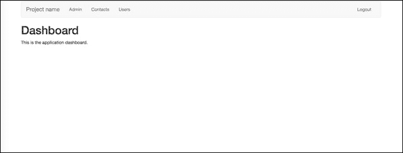
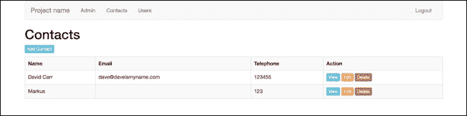
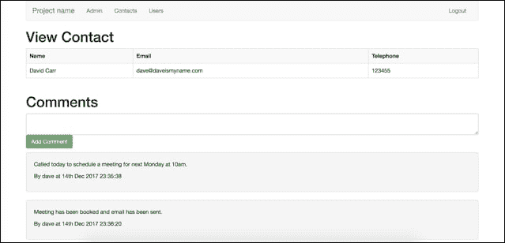
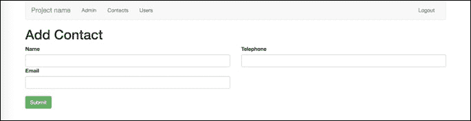
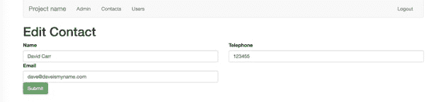
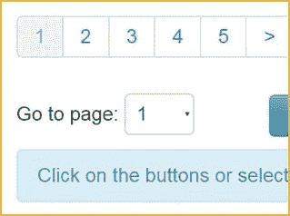
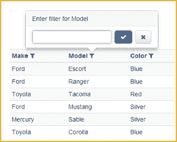
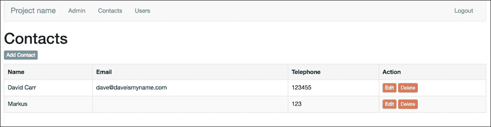
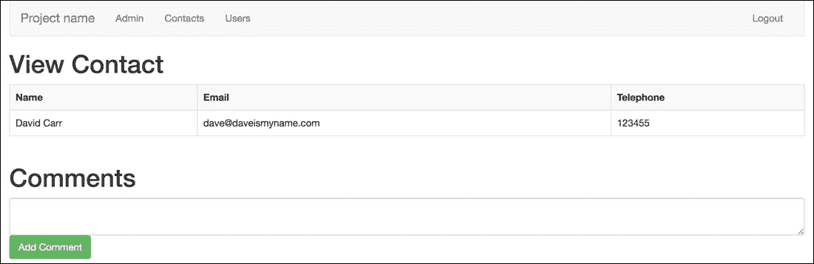

# 第八章。构建联系人管理系统

在上一章中，我们已经完成了在框架上构建功能，允许管理用户。我们已经执行了引入 Bootstrap，为我们的应用程序提供了一些基本级别的样式。我们还在我们的应用程序中实现了密码恢复机制。

在本章中，我们将构建一个联系人 CRUD（创建、读取、更新和删除）部分，其中将有一个查看页面来查看单个联系人。查看页面的评论可以记录在联系人上。我们还将为我们的联系人应用程序构建评论系统。

在本章结束时，您将能够：

+   在我们的联系人应用程序中实现 CRUD 功能

+   在我们的联系人应用程序中构建评论系统

# 概述 CMS

框架是软件中的抽象，通过编写自定义用户代码，可以提供多个软件。框架中的控制流不像其他库中那样被决定：



应用程序的仪表板

这是仪表板-用户登录时着陆的页面。从这里，他们可以导航到应用程序的部分，从而能够管理内容：



联系人索引页面

这是“联系人”索引，用户可以在其中查看联系人表中存储的所有联系人。

这是建立在框架之上的应用程序的知识。

用户可以看到联系人的姓名以及与每个联系人相关的电子邮件地址和电话号码。

用户无法看到联系人 ID，但是该 ID 仍然会生成，并且构成查看、编辑和删除的 URL 的一部分；因此，当通过点击其中一个按钮触发功能时，它已经知道从联系人表中绘制其知识的记录。



查看单个联系人

这是联系人页面。

这个页面显示单个记录中的所有信息。该应用程序中的记录是唯一联系人的数据，由`ID`表示。该`ID`是唯一的，因此只会显示一个单个联系人的信息：

### 注意

**注意**

这里使用“唯一”一词，因为它是一个单独的`ID`。如果它被存储为一个单独的`ID`，那么它被应用程序视为一个唯一的记录。



添加联系人页面

这是显示表单的页面，允许用户添加一个全新的联系人。

这个页面在加载时不需要任何参数，因为它不需要在其字段中加载任何预填充的数据。

提交时，假设没有错误，将添加新的联系人：



编辑联系人页面

这是显示表单的页面，允许用户编辑联系人。

这个页面的不同之处在于与联系人记录相关的数据在表单中是预先填充的。

之所以可能这样做，是因为编辑页面加载时传递了联系人`ID`作为参数。这个`ID`告诉系统应该加载哪个记录到这个页面中。

# CRUD，联系人应用程序

在这一部分，用户将创建 CRUD 联系人应用程序的功能。用户将：

+   创建新的“联系人”记录

+   查看所有“联系人”记录

+   查看单个“联系人”记录

+   更新“联系人”记录

+   删除“联系人”记录

### 注意

您可能会发现这与构建用户管理功能非常相似，并且这样做是正确的。

CRUD 是所有应用程序的核心，功能从那里扩展。



这是分页的例子



这是一个筛选的例子

# 在我们的联系人应用程序中插入 CRUD 功能

在这一部分，我们将尝试在我们的联系人应用程序中插入 CRUD 功能。

看一下以下的屏幕截图：



本节的结果

以下是在我们的联系人应用程序中插入 CRUD 功能的步骤：

1.  在数据库中，我们需要一个`contacts`表（如果您在之前的章节中有一个，请删除它）：

```php
CREATE TABLE `contacts` (
  `id` int(11) unsigned NOT NULL AUTO_INCREMENT,
  `name` varchar(255) DEFAULT NULL,
  `email` varchar(255) DEFAULT NULL,
  `tel` varchar(255) DEFAULT NULL,
  PRIMARY KEY (`id`)
) ENGINE=InnoDB AUTO_INCREMENT=4 DEFAULT CHARSET=utf8;
```

1.  `contacts`表存储每个联系人的唯一`ID`，联系人的姓名，电子邮件地址和电话号码。

1.  接下来，我们需要一个`comments`表：

```php
CREATE TABLE `comments` (
  `id` int(11) unsigned NOT NULL AUTO_INCREMENT,
  `contact_id` int(11) DEFAULT NULL,
  `user_id` int(11) DEFAULT NULL,
  `body` text,
  `created_at` timestamp NULL DEFAULT CURRENT_TIMESTAMP,
  PRIMARY KEY (`id`)
) ENGINE=InnoDB AUTO_INCREMENT=3 DEFAULT CHARSET=utf8;
```

评论必须具有`contact_id`和`user_id`字段。这些是外键，用于将评论链接回联系人和发布评论的用户。

评论将被添加到正文字段中，并且`created_at`列用于记录记录创建的时间。此列设置为带有默认`CURRENT_TIMESTAMP`的时间戳。这意味着在添加新记录时，日期和时间将自动插入：

1.  由于我们在之前的章节中已经尝试过联系人，让我们从一些清理开始。删除`app/views/contacts`文件夹。

1.  打开`app/views/layouts/nav.php`并添加一个指向`/contacts`的联系人菜单项：

```php
<nav class="navbar navbar-default">
    <div class="container-fluid">
…….
    </div><!--/.container-fluid -->
</nav>
```

1.  打开`app/Models/Contacts.php`。

1.  删除这段代码：

```php
public function getContacts()
{
    return $this->db->select('* FROM contacts');
}
```

然后，用这个替换它：

```php
public function get_contacts()
{
    return $this->db->select('* from contacts order by name');
}
```

1.  接下来，我们需要一个加载单个联系人的方法，其中`ID`属于联系人：

```php
public function get_contact($id)
{
    $data = $this->db->select('* from contacts where id = :id', [':id' => $id]);
    return (isset($data[0]) ? $data[0] : null);
}
```

1.  我们还需要`insert`，`update`和`delete`方法：

```php
public function insert($data)
{
    $this->db->insert('contacts', $data);
}
public function update($data, $where)
{
    $this->db->update('contacts', $data, $where);
}
public function delete($where)
{
    $this->db->delete('contacts', $where);
}
```

完整的模型如下：

### 注意

有关完整的代码片段，请参考代码文件夹中的`Lesson 8.php`文件。

```php
<?php
namespace App\Models;

use System\BaseModel;

class Contact extends BaseModel
……
    }
}
```

1.  接下来，打开`app/Controllers/Contacts.php`。

1.  导入`Session`和 URL 助手：

```php
Use App\Helpers\Session;
Use App\Helpers\Url;
```

1.  替换以下代码：

```php
public function index()
{
  $contacts = new Contact();
    $records = $contacts->getContacts();
    return $this->view->render('contacts/index', compact('records'));
}
```

用这个：

```php
protected $contact;
public function __construct()
{
    parent::__construct();
    if (! Session::get('logged_in')) {
        Url::redirect('/admin/login');
    }
    $this->contact = new Contact();
}
public function index()
{
    $contacts = $this->contact->get_contacts();
    $title = 'Contacts';
    return $this->view->render('admin/contacts/index', compact('contacts', 'title'));
}
```

### 注意

与我们的`Users`控制器一样，这将确保您在能够访问联系人之前已登录，并设置`$contact`模型，收集联系人并加载`contacts`视图。

我们还需要`add`，`edit`和`delete`方法。这与设置`Users`方法的方式相同。

1.  如果表单已经提交，收集表单数据，执行验证，并且如果没有错误，将其插入数据库，设置消息，并重定向：

### 注意

有关完整的代码片段，请参考代码文件夹中的`Lesson 8.php`文件。

```php
public function add()
{
……
    Session::set('success', 'Contact deleted');

    Url::redirect('/contacts');
}
```

1.  接下来，我们需要为这些方法创建视图。在`app/views/admin`文件夹内创建一个`contacts`文件夹，并创建这些视图：

### 注意

有关完整的代码片段，请参考代码文件夹中的`Lesson 8.php`文件。

```php
index.php

<?php
include(APPDIR.'views/layouts/header.php');
include(APPDIR.'views/layouts/nav.php');
…….
</form>

<?php include(APPDIR.'views/layouts/footer.php');?>
```

## 活动：执行我们的应用程序

我们已经将 CRUD 功能实现到我们的联系人应用程序中。让我们通过执行我们的应用程序来尝试一下。

这个活动的目的是验证 CRUD 功能在我们的应用程序中是否正常工作。

在这一点上，我们可以列出，添加，编辑和删除联系人：

1.  为了显示这个，打开你的应用程序：

```php
php – S localhost:8000 –t webroot
```

1.  加载`http://localhost:8000/contacts`。

1.  数据库中将列出所有联系人。您可以通过点击“添加联系人”来添加新联系人。提交表单后，您将被带回用户列表，您可以看到新联系人，并显示确认消息。

1.  编辑也会发生同样的事情。删除将确认动作，然后删除联系人。

# 评论，连接和日期格式化

在本节中，我们将学习：

+   如何构建评论系统

+   如何连接存储在两个不同表中的数据

+   如何格式化日期

当前构建的系统可以进行改进。可以通过构建评论功能来实现，以便用户可以记录对联系人的活动。

他们可能想要注意，他们在星期一打电话给联系人，并被要求在星期五再打电话。用户可能正在一起工作来打电话给一系列联系人，了解谁何时做出了评论将是有用的。

系统可以改进的另一种方式是确保日期和时间以易于阅读的格式显示。数据库表以一种不太人性化的方式存储这些信息。

在创建评论时，创建`joins`是至关重要的。用户可以对联系人发布几乎无限量的评论。

在构建联系人字段时，要满足这一点是不可能的，评论将不得不受限制。联系人表中需要有一个字段来满足每条可能的评论，评论是由谁发表的，以及何时发表的。这将极其难以管理，对于开发人员来说构建起来也会非常繁琐。

开发人员不应该限制评论的数量，而应该创建一个单独的表来存储评论的目的。

但是开发人员如何将评论链接到联系人呢？

这就是`joins`变得有用的地方。每个联系人都有一个`ID`。每条评论都有一个评论`ID`。每条评论还有其他信息，比如评论的文本内容，谁发表的评论，以及评论的时间和日期。

当系统发表评论时，需要能够识别它是针对特定联系人发表的，并将该联系人存储在该记录中作为联系人 ID。

例如，如果联系人 David 的 ID 为 1，并且有三条评论，那么每条评论都将存储在具有 ID 为 1 的联系人的表中。它们都有自己的唯一 ID，分别为 1、2 和 3。

同样的方法也适用于用户，以便知道是哪个用户发表了评论。这将是用户 ID。`join`是必需的，因为评论只对创建它的用户和它所属的联系人有限的了解。它只知道与其相关的联系人的联系人 ID 和创建它的用户的用户 ID。

这对于计算机来说是可以的，但是人类用户需要比这更多的信息。他们希望看到该用户的姓名，而不仅仅是系统上的 ID。需要将两个或三个表中的所有相关信息连接在一起才能实现这一点。这是数据库如何向系统提供数据的一个例子。一些简单的 PHP 函数可以轻松地重新格式化这些数据。

提供给系统的数据库：

```php
2017-12-15
```

PHP 可以重新格式化为：

```php
Friday 15th December 2017
```

# 创建一个视图页面并构建评论系统

这一部分的目的是展示 CRUD 操作中的联系人。以下截图展示了我们在本节结束时计划要完成的内容。



评论系统

为了使我们的联系人部分更有用，让我们添加一个`view`页面，可以在该页面中查看单个联系人。`view`页面也是构建评论系统以对联系人进行评论的理想场所：

1.  打开你的`Contacts`控制器并创建一个名为`view($id)`的新方法。

1.  检查`$id`是否为数字，然后从`get_contact($id)`加载联系人。如果`$contact`为空，重定向到 404 页面。

1.  设置页面标题并加载视图：

```php
public function view($id)
{
    if (! is_numeric($id)) {
        Url::redirect('/contacts');
    }

    $contact = $this->contact->get_contact($id);

    if ($contact == null) {
        Url::redirect('/404');
    }

    $title = 'View Contact';
    $this->view->render('admin/contacts/view', compact('contact', 'title'));
}
```

1.  在`app/views/admin/contacts`中创建`view.php`。

1.  加载布局文件，然后创建一个表格来显示内容，确保变量被包裹在`htmlentities()`中：

### 注意

有关完整的代码片段，请参考代码文件夹中的`Lesson 8.php`文件。

```php
<?php
include(APPDIR.'views/layouts/header.php');
include(APPDIR.'views/layouts/nav.php');
include(APPDIR.'views/layouts/errors.php');
……
</div>

<?php include(APPDIR.'views/layouts/footer.php');?>
```

1.  现在，要开始处理评论，首先我们需要一个表单来输入评论并提交它。在表格之后但在页脚布局之前，创建一个名为`Comments`的标题，并创建一个带有单个文本区域的表单。给文本区域一个名为 body 的名称：

```php
<h1>Comments</h1>
<form method="post">
    <div class="control-group">
        <textarea class="form-control" name="body"></textarea>
    </div>
    <p><button type="submit" class="btn btn-success" name="submit"><i class="fa fa-check"></i> Add Comment</button></p>
</form>
```

当提交这个表单时，`view`方法需要处理请求。

在我们继续之前，我们需要一个评论模型来与数据库中的`comments`表进行交互。

1.  在`app/Models`中，创建一个名为`Comment.php`的新模型。目前，它将有一个名为`insert($data)`的方法，当调用时将在评论表中创建一条新记录：

```php
<?php
namespace App\Models;

use System\BaseModel;

class Comment extends BaseModel
{
    public function insert($data)
    {
        $this->db->insert('comments', $data);
    }
}
```

1.  现在，转到你的`Contacts`控制器。

1.  在文件顶部导入新的`Comment`模型：

```php
use App\Models\Comment;
```

1.  在`view($id)`方法中，创建一个 Comment 模型的新实例。

由于这个评论模型只会在这个方法中使用，我们不需要将它分配给一个类属性。在这种情况下，一个局部变量就可以了，比如$comment。

1.  接下来，检查表单提交并收集`$body`提交的数据。

1.  如果评论不为空，则创建一个包含正文但也包含`contact_id`的`$data`数组，这是`$id`，以及`user_id`，这是存储在会话中的已登录用户的 ID。

1.  将`$data`传递给`insert($data)`方法以创建评论，然后设置消息并重定向回联系人的查看页面：

```php
$comment = new Comment();
        if (isset($_POST['submit'])) {
            $body  = (isset($_POST['body']) ? $_POST['body'] : null);
            if ($comment !='') {
                $data = [
                    'body' => $body,
                    'contact_id' => $id,
                    'user_id' => Session::get('user_id')
                ];
                $comment->insert($data);
                Session::set('success', 'Comment created');
                Url::redirect("/contacts/view/$id");
            }
```

## 活动：加载应用程序

我们已经构建了页面并实现了评论系统。我们现在将加载应用程序。加载应用程序后，您会注意到有一个编辑和删除按钮，但没有办法查看联系人。我们将解决这个问题。

我们将通过以下步骤来启用应用程序中联系人的可见性：

1.  加载应用程序：

```php
php –S localhost:8000 –t webroot load http://localhost:8000/contacts
```

1.  您是否注意到每个联系人都有编辑和删除按钮，但没有办法查看联系人？让我们解决这个问题。

1.  打开`app/views/admin/contacts/index.php`。

1.  在编辑链接上方添加一个新链接。在这种情况下，我给按钮一个不同的类`btn-info`，使按钮变蓝，这样它就不同于编辑按钮：

```php
<a href="/contacts/view/<?=$row->id;?>" class="btn btn-xs btn-info">View</a>
```

1.  在浏览器中保存并重新加载页面，您将看到查看按钮。单击查看按钮，您将看到一个显示联系人和输入评论的表单的查看页面。

1.  输入评论并按“添加评论”。页面将重新加载，您将看到一个成功的消息。评论已插入到数据库中，但您还看不到它。

1.  打开您的评论模型。

1.  创建一个名为`get_comments($id)`的新方法。传递的`$id`将是联系人的 ID。

对于这个查询，我们需要做一个`join`。

### 注意

连接是将两个或多个数据库表连接在一起以从中获取信息的地方。

我们需要一个连接来获取添加评论的用户的用户名。在评论表中，我们存储了`user_id`。这可以用于从用户表中获取我们需要的任何内容。

`join`的语法是选择所需的列，以表名为前缀，后跟评论。

因此，用户的用户名说去用户表并获取`username`列。

1.  在`from`部分，指定要加载的表，在 where 部分，指定条件。

1.  我们希望加载所有评论，其中评论的`user_id`列与用户的 ID 列匹配，并且`contact_id`与提供的`$id`匹配：

```php
public function get_comments($id)
{
    return $this->db->select('
        comments.body,
        comments.created_at,
        users.username
    from
        comments,
        users
    where
        comments.user_id = users.id
        and contact_id = :id'
    , [':id' => $id]);
}
```

1.  保存此模型并转到`Contacts`控制器的`view`方法。

1.  表单处理完毕后，调用我们刚刚创建的`get_comments($id)`方法：

```php
$comments = $comment->get_comments($id);
```

1.  这将加载评论；下一步是将评论添加到紧凑功能中：

```php
$this->view->render('admin/contacts/view', compact('contact', 'comments', 'title'));
```

完整的方法如下：

### 注意

有关完整的代码片段，请参阅代码文件夹中的`Lesson 8.php`文件。

```php
public function view($id)
{
    if (! is_numeric($id)) {
        Url::redirect('/contacts');
…….
    $comments = $comment->get_comments($id);

    $title = 'View Contact';
    $this->view->render('admin/contacts/view', compact('contact', 'comments', 'title'));
}
```

1.  最后一步是显示评论。打开`app/views/admin/contacts/view.php`。

1.  在表单之后添加：

```php
<?php foreach($comments as $row) { ?>
    <div class="well">
         <p><?=htmlentities($row->body);?></p>
         <p>By <?=$row->username;?> at <?=date('jS M Y H:i:s', strtotime($row->created_at));?></p>
    </div>
<?php } ?>
```

这将循环遍历评论。每次循环都会创建一个新的带有一些样式的`div`。在 div 内部，它打印出评论。在下一行，用户名被显示。由于我们在评论模型中设置的连接，用户名仅可用。

1.  当评论被添加时，`created_at`字段被填充。默认格式为 YYYY-MM-DD H:M:S，这不太可读，因此我们可以使用 date()指定日期格式，并作为第二个参数使用`strtotime()`并传入`created_at`字段。

### 注意

`strtotime`将时间转换为秒。最终结果是一个用户友好的日期。

1.  现在，返回到浏览器中的联系人并添加评论。然后，您将在页面上看到新评论和任何先前的评论。

# 总结

在本章中，我们已经介绍了如何构建与表单交互的 CRUD 部分，如何在页面之间传递数据和格式化日期。我们还在我们的联系人应用程序中添加了一个评论系统，可以使用户添加评论并记录它们。

我们涵盖了开发良好且安全的 PHP 应用程序所需的所有概念。

这就是本书的结尾。在本书中，我们学习了 PHP 的所有基础知识，如变量、数组、循环等。我们还学习了如何在面向对象编程环境中开发 PHP 框架，同时构建联系人应用程序。我们介绍了框架的结构以及如何使用 Whoops 正确格式化错误报告技术。除了框架开发，我们还介绍了在框架开发环境中的身份验证和用户管理，最后，我们介绍了如何对我们的联系人应用程序进行 CRUD 操作。
