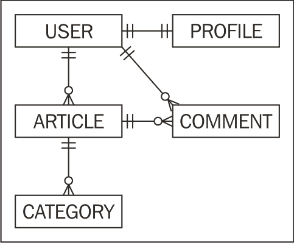

# 第二章. 模型绑定

在本章中，我们将涵盖：

+   将 `Containable` 添加到所有模型中

+   限制查找中返回的绑定

+   修改查找的绑定参数

+   修改查找的绑定条件

+   改变一对一关联的 JOIN 类型

+   定义对同一模型的多个关联

+   动态添加绑定

# 简介

本章讨论了 CakePHP 应用程序最重要的一个方面：模型之间的关系，也称为 **模型绑定** 或 **关联**。

作为任何应用程序逻辑的组成部分，掌握如何操纵模型绑定以获取我们所需数据、所需时刻的所有方面至关重要。

为了做到这一点，我们将通过一系列食谱来展示如何改变绑定获取的方式，哪些绑定和哪些绑定信息被返回，如何创建新的绑定，以及如何构建层次数据结构。

# 将 Containable 添加到所有模型中

`Containable` 行为是 CakePHP 核心的一部分，可能是我们用来处理模型绑定的最重要的行为之一。

几乎所有 CakePHP 应用程序都将受益于其功能，因此在这个食谱中，我们展示了如何为所有模型启用它。

## 如何操作...

创建一个名为 `app_model.php` 的文件，并将其放置在您的 `app/` 文件夹中，内容如下。如果您已经有了这样的文件，请确保您添加了以下所示的 `actsAs` 属性，或者您的 `actsAs` 属性包含了 `Containable`。

```php
<?php
class AppModel extends Model {
public $actsAs = array('Containable');
}
?>

```

## 它是如何工作的...

`Containable` 行为不过是 `bindModel()` 和 `unbindModel()` 方法的包装，这些方法定义在 CakePHP 的 `Model` 类中。它的目的是帮助我们处理关联管理，而无需在调用这些方法时重新定义所有关联的繁琐过程，从而使我们的代码更加可读和可维护。

这是一个非常重要的观点，因为 CakePHP 用户常犯的一个错误是认为 `Containable` 参与了查询制作过程，即在 CakePHP 创建实际 SQL 查询以获取数据的过程中。

`Containable` 为我们节省了一些不必要的查询，并优化了为每个相关模型获取的信息，但它不会作为改变 CakePHP 中查询构建方式的方法。

## 参见

+   *限制查找中返回的绑定*

+   *修改查找的绑定参数*

+   *修改查找的绑定条件*

# 限制查找中返回的绑定

这个食谱展示了如何使用 `Containable` 来指定 `find` 操作的结果中返回哪些相关模型。它还展示了如何限制每个关联获取的字段。

## 准备工作

为了完成这个食谱，我们需要一些样本表来操作。

1.  使用以下 SQL 语句创建一个名为 `families` 的表：

    ```php
    CREATE TABLE `families`(
    `id` INT UNSIGNED AUTO_INCREMENT NOT NULL,
    `name` VARCHAR(255) NOT NULL,
    PRIMARY KEY(`id`)
    );

    ```

1.  使用以下 SQL 语句创建一个名为 `people` 的表：

    ```php
    CREATE TABLE `people`(
    `id` INT UNSIGNED AUTO_INCREMENT NOT NULL,
    `family_id` INT UNSIGNED NOT NULL,
    `name` VARCHAR(255) NOT NULL,
    `email` VARCHAR(255) NOT NULL,
    PRIMARY KEY(`id`),
    KEY `family_id`(`family_id`),
    CONSTRAINT `people__families` FOREIGN KEY(`family_id`) REFERENCES `families`(`id`)
    );

    ```

1.  使用以下 SQL 语句创建一个名为`profiles`的表：

    ```php
    CREATE TABLE `profiles`(
    `id` INT UNSIGNED AUTO_INCREMENT NOT NULL,
    `person_id` INT UNSIGNED NOT NULL,
    `website` VARCHAR(255) default NULL,
    `birthdate` DATE default NULL,
    PRIMARY KEY(`id`),
    KEY `person_id`(`person_id`),
    CONSTRAINT `profiles__people` FOREIGN KEY(`person_id`) REFERENCES `people`(`id`)
    );

    ```

1.  使用以下 SQL 语句创建一个名为`posts`的表：

    ```php
    CREATE TABLE `posts`(
    `id` INT UNSIGNED AUTO_INCREMENT NOT NULL,
    `person_id` INT UNSIGNED NOT NULL,
    `title` VARCHAR(255) NOT NULL,
    `body` TEXT NOT NULL,
    `created` DATETIME NOT NULL,
    `modified` DATETIME NOT NULL,
    PRIMARY KEY(`id`),
    KEY `person_id`(`person_id`),
    CONSTRAINT `posts__people` FOREIGN KEY(`person_id`) REFERENCES `people`(`id`)
    );

    ```

    ### 注意

    即使您不想为表添加外键约束，也请确保为每个引用另一个表中的记录的字段使用 KEY。通过这样做，当引用的表被连接时，您将显著提高 SQL 查询的速度。

1.  添加一些样本数据，使用以下 SQL 语句：

    ```php
    INSERT INTO `families`(`id`, `name`) VALUES
    (1, 'The Does');
    INSERT INTO `people`(`id`, `family_id`, `name`, `email`) VALUES
    (1, 1, 'John Doe', 'john.doe@example.com'),
    (2, 1, 'Jane Doe', 'jane.doe@example.com');
    INSERT INTO `profiles`(`person_id`, `website`, `birthdate`) VALUES
    (1, 'http://john.example.com', '1978-07-13'),
    (2, NULL, '1981-09-18');
    INSERT INTO `posts`(`person_id`, `title`, `body`, `created`, `modified`) VALUES
    (1, 'John\'s Post 1', 'Body for John\'s Post 1', NOW(), NOW()),
    (1, 'John\'s Post 2', 'Body for John\'s Post 2', NOW(), NOW());

    ```

1.  我们需要将`Containable`添加到所有我们的模型中，因此请遵循以下步骤*将 Containable 添加到所有模型*。

1.  我们现在继续创建主模型。创建一个名为`person.php`的文件，并将其放置在您的`app/models`文件夹中，以下是其内容：

    ```php
    <?php
    class Person extends AppModel {
    public $belongsTo = array('Family');
    public $hasOne = array('Profile');
    public $hasMany = array('Post');
    }
    ?>

    ```

1.  在名为`family.php`的文件中创建模型`Family`，并将其放置在您的`app/models`文件夹中，以下是其内容：

    ```php
    <?php
    class Family extends AppModel {
    public $hasMany = array('Person');
    }
    ?>

    ```

### 如何操作...

当`Containable`对我们的模型可用时，我们可以在`find`操作中添加一个名为`contain`的设置。在这个设置中，我们指定一个基于数组的层次结构，返回我们想要的相关数据。`contain`可以接收的特殊值是`false`或一个空数组，这告诉`Containable`不要返回任何相关数据。

例如，要获取不带相关数据的第一个`Person`记录，我们只需这样做：

```php
$person = $this->Person->find('first', array(
'contain' => false
));

```

### 注意

另一种让 CakePHP 不获取相关数据的方法是通过使用`recursive`查找设置。将`recursive`设置为`-1`将产生与将`contain`设置为`false`完全相同的效果。

如果我们想获取第一个`Person`记录及其所属的`Family`，我们这样做：

```php
$person = $this->Person->find('first', array(
'contain' => array('Family')
));

```

使用我们的样本数据，上述查询将产生以下数组结构：

```php
array(
'Person' => array(
'id' => '1',
'family_id' => '1',
'name' => 'John Doe',
'email' => 'john.doe@example.com'
),
'Family' => array(
'id' => '1',
'name' => 'The Does'
)
)

```

假设现在我们还想获取属于`Person`的所有`Post`记录以及该`Person`所属家庭的成员的所有`Post`记录。那么我们就必须这样做：

```php
$person = $this->Person->find('first', array(
'contain' => array(
'Family.Person'
'Post'
)
));

```

上述操作将产生以下数组结构（为了可读性，已移除`created`和`modified`字段）：

```php
array(
'Person' => array(
'id' => '1',
'family_id' => '1',
'name' => 'John Doe',
'email' => 'john.doe@example.com'
),
'Family' => array(
'id' => '1',
'name' => 'The Does',
'Person' => array(
array(
'id' => '1',
'family_id' => '1',
'name' => 'John Doe',
'email' => 'john.doe@example.com'
),
array(
'id' => '2',
'family_id' => '1',
'name' => 'Jane Doe',
'email' => 'jane.doe@example.com'
)
)
),
'Post' => array(
array(
'id' => '1',
'person_id' => '1',
'title' => 'John\'s Post 1',
'body' => 'Body for John\'s Post 1'
),
array(
'id' => '2',
'person_id' => '1',
'title' => 'John\'s Post 2',
'body' => 'Body for John\'s Post 2'
)
)
)

```

我们还可以使用`Containable`来指定从相关模型中获取哪些字段。使用前面的示例，让我们限制`Post`字段，以便我们只返回`title`和`Person`记录的`Family`的`name`字段。我们通过将字段名添加到关联模型层次结构中来实现这一点：

```php
$person = $this->Person->find('first', array(
'contain' => array(
'Family.Person.name',
'Post.title'
)
));

```

返回的数据结构将如下所示：

```php
array(
'Person' => array(
'id' => '1',
'family_id' => '1',
'name' => 'John Doe',
'email' => 'john.doe@example.com'
),
'Family' => array(
'id' => '1',
'name' => 'The Does',
'Person' => array(
array(
'name' => 'John Doe',
'family_id' => '1',
'id' => '1'
),
array(
'name' => 'Jane Doe',
'family_id' => '1',
'id' => '2'
)
)
),
'Post' => array(
array(
'title' => 'John\'s Post 1',
'id' => '1',
'person_id' => '1'
),
array(
'title' => 'John\'s Post 2',
'id' => '2',
'person_id' => '1'
)
)
)

```

您可能会注意到，即使我们为`Family => Person`绑定和`Post`绑定指明了特定的字段，仍然会返回一些额外的字段。这些字段（如`family_id`）是 CakePHP 需要的，被称为外键字段，用于获取相关数据，因此`Containable`足够智能，会将它们包含在查询中。

假设我们还想获取一个人的电子邮件。由于需要多个字段，我们需要使用数组表示法，使用`fields`设置来指定字段列表：

```php
$person = $this->Person->find('first', array(
'contain' => array(
'Family' => array(
'Person' => array(
'fields' => array('email', 'name')
)
),
'Post.title'
)
));

```

### 它是如何工作的...

我们使用`contain`查找设置来指定我们想要在查找操作中使用哪种包含类型。这种包含类型以数组的形式给出，其中数组层次结构模仿模型关系。由于层次结构可能足够深，使得数组表示法难以处理，因此本食谱中使用的点表示法提供了一个有用且更易读的替代方案。

如果我们要引用属于`Family`模型的`Person`模型，该关系的正确`contain`语法是`Person => Family`（我们也可以使用`Person.Family`，这更简洁。）

我们还使用`fields`设置来指定我们想要为绑定获取哪些字段。我们通过指定作为绑定`Containable`设置一部分的字段名数组来实现这一点。

`Containable`在我们对一个模型执行查找操作之前寻找`contain`查找设置。如果找到，它通过在适当的模型上发出`unbindModel()`调用来更改模型绑定，以解除`contain`查找设置中未指定的那些关系的绑定。然后，它将`recursive`查找设置设置为获取关联数据所需的最小值。

让我们用一个实际例子来进一步理解这个包装过程。使用我们的`Person`模型（它具有与`Family`模型的`belongsTo`关系、与`Profile`模型的`hasOne`关系以及与`Post`模型的`hasMany`关系），以下基于`Containable`的查询：

```php
$person = $this->Person->find('first', array( 'contain' => array('Family.Person') ));

```

或者使用数组表示法执行相同的查询：

```php
$person = $this->Person->find('first', array( 'contain' => array('Family' => 'Person') ));

```

等价于以下不使用`Containable`但使用 CakePHP 的`Model`类中内置的`unbindModel()`方法的指令集：

```php
$this->Person->unbindModel(array( 'hasOne' => array('Profile'), 'hasMany' => array('Post') )); $person = $this->Person->find('first', array( 'recursive' => 2 ));

```

不使用`Containable`不仅更加复杂，而且如果我们决定更改一些关系，也可能引发问题。在前面的例子中，如果我们决定删除`Profile`绑定或更改其关系类型，我们就必须修改`unbindModel()`调用。然而，如果我们使用`Containable`，相同的代码适用，我们无需担心此类更改。

#### 包含查找参数的格式

我们已经看到了如何使用`contain`查找参数来限制`find`操作之后返回的绑定。即使其格式看似不言自明，让我们再通过另一个例子来深入理解`Containable`的数组表示法。假设我们有以下图中显示的模型和关系：



将该图转换为`Containable`行为理解的内容，就像使用数组结构编写它一样简单。例如，如果我们正在对`User`模型执行`find`操作，并且想要引用`Profile`关系，一个简单的`array('Profile')`表达式就足够了，因为`Profile`模型直接与`User`模型相关。

如果我们想要引用`Article`记录的`Comment`关系，该记录的`User`是所有者，并且属于一个属于我们`User`模型的`Article`，那么我们就在结构中添加另一个维度，现在它表示为`array('Article' => 'Comment')`。

我们可以预先推断出下一个示例将如何呈现。假设我们想要获取每个`Article`中评论的`User`的`Profile`和`Comment`。结构将如下所示：`array('Article' => array('Comment' => array('User' => 'Profile')))`。

有时我们想要简化可读性，幸运的是，`Containable`行为允许将上述表达式重写为`array('Article.Comment.User.Profile')`，这被称为点表示法。然而，如果你想要更改绑定的其他参数，那么这个语法将必须更改为基于完整数组的表达式（参见本配方中的*参见*部分）。

#### 绑定更改的重置

当你发出一个使用`Containable`行为来改变一些其绑定的查找操作时，一旦查找完成，CakePHP 将重置所有绑定的更改到它们原始状态。这在大多数情况下是通常想要的，但也有一些场景，你希望保留你的更改直到你手动重置它们，例如当你需要发出多个查找操作并且所有这些查找都使用修改后的绑定时。

为了强制我们的绑定更改被保留，我们在`contain`查找参数中使用`reset`选项，将其设置为`false`。当我们准备好重置它们时，我们发出对`Containable`行为为我们模型添加的`resetBindings()`方法的调用。以下示例代码显示了此过程：

```php
$person = $this->Person->find('first', array(
'contain' => array(
'reset' => false,
'Family'
)
));
// ...
$this->Person->resetBindings();

```

实现相同结果的另一种方式是通过调用`contain()`方法（将其第一个参数设置为包含的绑定，并将其第二个参数设置为`false`以指示我们希望保留这些包含），这对于所有使用`Containable`的模型都是可用的，发出查找（无需使用`contain`设置），然后重置绑定：

```php
$this->Person->contain(array('Family'), false);
$person = $this->Person->find('first');
// ...
$this->Person->resetBindings();

```

### 参见

+   *修改查找的绑定参数*

+   *修改查找的绑定条件*

# 修改查找的绑定参数

这个配方展示了如何使用`Containable`来改变影响模型绑定的一些参数。

## 准备工作

为了完成这个配方，我们需要一些示例表来工作。

1.  使用以下 SQL 语句创建一个名为`users`的表：

    ```php
    CREATE TABLE `users`(
    `id` INT UNSIGNED AUTO_INCREMENT NOT NULL,
    `name` VARCHAR(255) NOT NULL,
    `email` VARCHAR(255) NOT NULL,
    PRIMARY KEY(`id`)
    );

    ```

1.  使用以下 SQL 语句创建一个名为`profiles`的表：

    ```php
    CREATE TABLE `profiles`(
    `id` INT UNSIGNED AUTO_INCREMENT NOT NULL,
    `user_id` INT UNSIGNED NOT NULL,
    `website` VARCHAR(255) default NULL,
    `birthdate` DATE default NULL,
    PRIMARY KEY(`id`),
    KEY `user_id`(`user_id`),
    CONSTRAINT `profiles__users` FOREIGN KEY(`user_id`) REFERENCES `users`(`id`)
    );

    ```

1.  使用以下 SQL 语句创建一个名为`articles`的表：

    ```php
    CREATE TABLE `articles`(
    `id` INT UNSIGNED AUTO_INCREMENT NOT NULL,
    `user_id` INT UNSIGNED NOT NULL,
    `title` VARCHAR(255) NOT NULL,
    `body` TEXT NOT NULL,
    `published` TINYINT NOT NULL default 1,
    `created` DATETIME NOT NULL,
    `modified` DATETIME NOT NULL,
    PRIMARY KEY(`id`),
    KEY `user_id`(`user_id`),
    CONSTRAINT `articles__users` FOREIGN KEY(`user_id`) REFERENCES `users`(`id`)
    );

    ```

1.  使用以下 SQL 语句添加一些示例数据：

    ```php
    INSERT INTO `users`(`id`, `name`, `email`) VALUES
    (1, 'John Doe', 'john.doe@example.com'),
    (2, 'Jane Doe', 'jane.doe@example.com');
    INSERT INTO `profiles`(`user_id`, `website`, `birthdate`) VALUES
    (1, 'http://john.example.com', '1978-07-13'),
    (2, NULL, '1981-09-18');
    INSERT INTO `articles`(`user_id`, `title`, `body`, `published`, `created`, `modified`) VALUES
    (1, 'John\'s Post 1', 'Body for John\'s Post 1', 1, NOW(), NOW()),
    (1, 'John\'s Post 2', 'Body for John\'s Post 2', 1, NOW(), NOW()),
    (1, 'John\'s Post 3', 'Body for John\'s Post 3', 0, NOW(), NOW()),
    (1, 'John\'s Post 4', 'Body for John\'s Post 4', 1, NOW(), NOW()),
    (2, 'Jane\'s Post 1', 'Body for Jane\'s Post 1', 1, NOW(), NOW());

    ```

1.  通过遵循配方*将 Containable 添加到所有模型*，将`Containable`行为添加到所有模型中。

1.  现在我们需要创建主模型。创建一个名为`user.php`的文件，并将其放置在`app/models`文件夹中，内容如下：

    ```php
    <?php
    class User extends AppModel {
    public $hasOne = array('Profile');
    public $hasMany = array('Article');
    }
    ?>

    ```

### 如何做到这一点...

如果我们想要获取第一个`User`记录以及该`User`拥有的`Article`记录，但首先按最新文章排序，我们使用`order`绑定设置（我们还将使用`fields`设置来限制每个`Article`返回的字段）：

```php
$user = $this->User->find('first', array(
'contain' => array(
'Article' => array(
'fields' => array('Article.title'),
'order' => array(
'Article.created' => 'desc',
'Article.id' => 'desc'
)
)
)
));

```

使用我们的示例数据，上述查询将导致以下数组结构：

```php
array(
'User' => array(
'id' => '1',
'name' => 'John Doe',
'email' => 'john.doe@example.com',
),
'Article' => array(
array(
'title' => 'John\'s Post 4',
'user_id' => '1'
),
array(
'title' => 'John\'s Post 3',
'user_id' => '1'
),
array(
'title' => 'John\'s Post 2',
'user_id' => '1'
),
array(
'title' => 'John\'s Post 1',
'user_id' => '1'
)
)
)

```

如果我们想要获取相同的数据，但确保我们只获取`User`最新写的一篇`Article`，我们使用`limit`绑定设置：

```php
$user = $this->User->find('first', array(
'contain' => array(
'Article' => array(
'fields' => array('Article.title'),
'order' => array(
'Article.created' => 'desc',
'Article.id' => 'desc'
),
'limit' => 1
)
)
));

```

使用我们的示例数据，上述查询将导致以下数组结构：

```php
array(
'User' => array(
'id' => '1',
'name' => 'John Doe',
'email' => 'john.doe@example.com',
),
'Article' => array(
array(
'title' => 'John\'s Post 4',
'user_id' => '1'
)
)
)

```

在某些场景下，另一个有用的选项是`offset`，适用于`hasMany`和`hasAndBelongsToMany`绑定。使用上面的示例，我们现在想要获取在最新`Article`之后的两个最新`User`创建的文章。

```php
$user = $this->User->find('first', array(
'contain' => array(
'Article' => array(
'fields' => array('Article.title'),
'order' => array(
'Article.created' => 'desc',
'Article.id' => 'desc'
),
'limit' => 2,
'offset' => 1
)
)
));

```

返回的数据结构现在看起来像这样：

```php
array(
'User' => array(
'id' => '1',
'name' => 'John Doe',
'email' => 'john.doe@example.com',
),
'Article' => array(
array(
'title' => 'John\'s Post 3',
'user_id' => '1'
),
array(
'title' => 'John\'s Post 2',
'user_id' => '1'
)
)
)

```

### 它是如何工作的...

`Containable`行为使用在 CakePHP 的`Model`类中定义的内置`bindModel()`方法来更改在`contain`查找设置中定义的绑定设置。

它会遍历定义的绑定，并检查是否存在定义的绑定设置。如果有，它将它们传递给每个指定绑定的`bindModel()`方法。

一些绑定设置仅在某些关系类型上有意义。例如，之前使用的`limit`设置在`belongsTo`或`hasOne`关系上可能没有用。

以下列表包括可以为每种关系类型指定的设置：

+   `belongsTo: className, conditions, foreignKey, order`。

+   `hasOne: className, conditions, foreignKey, order`。

+   `hasMany: className, conditions, finderQuery, foreignKey, limit, offset, order`。

+   `hasAndBelongsToMany: associationForeignKey, className, conditions, deleteQuery, finderQuery, foreignKey, insertQuery, joinTable, limit, offset, order, unique, with`。

### 相关内容

+   *修改查找的绑定条件*

# 修改查找的绑定条件

这个配方展示了如何使用`Containable`来更改通过绑定获取与模型相关数据时使用的条件。

## 准备工作

我们需要将`Containable`添加到我们的模型中，我们还需要一些示例模型和数据来工作。遵循配方，*将 Containable 添加到所有模型中*，以及配方中的*准备工作*部分，*修改查找的绑定参数*。

## 如何做...

如果我们想要获取第一个`User`记录以及该用户拥有的已发布的`Article`记录，但首先按最新文章排序，并限制返回的字段，我们使用`conditions`绑定设置：

```php
$user = $this->User->find('first', array(
'contain' => array(
'Article' => array(
'fields' => array('Article.title'),
'conditions' => array(
'Article.published' => 1
)
)
)
));

```

使用我们的示例数据，前面的查询将导致以下数组结构：

```php
array(
'User' => array(
'id' => '1',
'name' => 'John Doe',
'email' => 'john.doe@example.com',
),
'Article' => array(
array(
'title' => 'John\'s Post 1',
'user_id' => '1'
),
array(
'title' => 'John\'s Post 2',
'user_id' => '1'
),
array(
'title' => 'John\'s Post 4',
'user_id' => '1'
)
)
)

```

## 它是如何工作的...

条件绑定设置是另一个绑定参数，如食谱中所示，*修改查找的绑定参数*。因此，`Containable` 行为使用 CakePHP 的 `Model` 类中定义的内置 `bindModel()` 方法来更改 `contain` 查找操作中定义的绑定条件。

# 更改一对一关联的 JOIN 类型

当我们查询具有其他关联模型的模型时，CakePHP 将发出新的查询以获取关联数据，或者如果关联模型与主模型（通过使用 `belongsTo` 或 `hasOne` 定义的绑定）具有一对一关系，则使用 `LEFT JOIN` SQL 语句。

然而，有时我们需要更改一对一关联的 JOIN 类型，以使用 `RIGHT JOIN` 或 `INNER JOIN`。这个食谱展示了如何更改 `belongsTo` 和 `hasOne` 关联的 JOIN 类型。

## 准备工作

按照食谱中的 *准备工作* 部分，*限制查找中返回的绑定*。

## 如何操作...

1.  编辑 `Person` 模型，并更改 `belongsTo` 和 `hasOne` 关联的绑定定义，如下所示：

    ```php
    <?php
    class Person extends AppModel {
    public $belongsTo = array('Family' => array('type' => 'INNER'));
    public $hasOne = array('Profile' => array('type' => 'RIGHT'));
    public $hasMany = array('Post');
    }
    ?>

    ```

### 它是如何工作的...

当我们向模型添加绑定时，我们可以传递一个设置数组到绑定定义中，以配置绑定的不同方面。其中一个设置是 `type`，仅适用于 `belongsTo` 和 `hasOne` 绑定。

`type` 设置允许我们定义 CakePHP 在获取关联模型时将使用哪种类型的 `JOIN`（仅在查询主模型时适用）。可用的 `JOIN` 类型有：

+   `INNER JOIN`：连接并仅返回与默认连接条件匹配的关联模型的记录。当绑定设置为使用此连接类型时，只有具有绑定记录的记录将被返回。在上面的例子中，只有属于 `Family` 的 `Person` 记录将被返回。

+   `LEFT JOIN`：这是 CakePHP 使用的默认 JOIN 类型。即使没有绑定记录，也会返回所有记录。在上面的例子中，如果 `Family` 绑定类型设置为 `LEFT`，则即使 `Person` 记录不属于 `Family`，也会返回 `Person` 记录。

+   `RIGHT JOIN`：`LEFT JOIN` 的对立面，即使它们与主模型没有关联，也会显示相关模型的全部记录，并且只显示与相关模型链接的主模型的记录。

# 定义多个关联到同一模型

这个食谱展示了如何从一个模型设置多个关联到同一模型，这种需求通常在大多数应用程序中都会出现。

## 准备工作

为了完成这个食谱，我们需要一些样本表来操作。

1.  使用以下 SQL 语句创建一个名为 `addresses` 的表：

    ```php
    CREATE TABLE `addresses`(
    `id` INT UNSIGNED AUTO_INCREMENT NOT NULL,
    `address` TEXT NOT NULL,
    `city` VARCHAR(255) default NULL,
    `state` VARCHAR(255) NOT NULL,
    `zip` VARCHAR(10) NOT NULL,
    `country` CHAR(3) NOT NULL,
    PRIMARY KEY(`id`)
    );

    ```

1.  使用以下 SQL 语句创建一个名为 `users` 的表：

    ```php
    CREATE TABLE `users`(
    `id` INT UNSIGNED AUTO_INCREMENT NOT NULL,
    `billing_address_id` INT UNSIGNED default NULL,
    `home_address_id` INT UNSIGNED default NULL,
    `name` VARCHAR(255) NOT NULL,
    `email` VARCHAR(255) NOT NULL,
    PRIMARY KEY(`id`),
    KEY `billing_address_id`(`billing_address_id`),
    KEY `home_address_id`(`home_address_id`),
    CONSTRAINT `addresses__billing_address_id` FOREIGN KEY(`billing_address_id`) REFERENCES `addresses`(`id`),
    CONSTRAINT `addresses__home_address_id` FOREIGN KEY(`home_address_id`) REFERENCES `addresses`(`id`)
    );

    ```

1.  使用以下 SQL 语句添加一些样本数据：

    ```php
    INSERT INTO `addresses`(`id`, `address`, `city`, `state`, `zip`, `country`) VALUES
    (1, '123 Street', 'Palo Alto', 'CA', '94310', 'USA'),
    (2, '123 Street', 'London', 'London', 'SE10AA', 'GBR');
    INSERT INTO `users`(`billing_address_id`, `home_address_id`, `name`, `email`) VALUES
    (1, 2, 'John Doe', 'john.doe@example.com');

    ```

1.  现在我们需要创建主模型。创建一个名为 `user.php` 的文件，并将其放置在您的 `app/models` 文件夹中，内容如下：

    ```php
    <?php
    class User extends AppModel {
    }
    ?>

    ```

### 如何操作...

编辑`User`模型，并添加绑定定义以包括对`Address`模型的引用：

```php
<?php
class User extends AppModel {
public $belongsTo = array(
'BillingAddress' => array(
'className' => 'Address'
),
'HomeAddress' => array(
'className' => 'Address'
)
);
}
?>

```

如果我们发出一个查找操作来获取`User`，我们会得到以下数据结构：

```php
array(
'User' => array(
'id' => '1',
'billing_address_id' => '1',
'home_address_id' => '2',
'name' => 'John Doe',
'email' => 'john.doe@example.com',
),
'BillingAddress' => array(
'id' => '1',
'address' => '123 Street',
'city' => 'Palo Alto',
'state' => 'CA',
'zip' => '94310',
'country' => 'USA'
),
'HomeAddress' => array(
'id' => '2',
'address' => '123 Street',
'city' => 'London',
'state' => 'London',
'zip' => 'SE10AA',
'country' => 'GBR'
)
)

```

### 还有更多...

在这个例子中，我们用于绑定的命名约定是 CakePHP 用于字段名称的标准约定，其中每个大写字母都由一个下划线符号作为前缀，所有内容都转换为小写，并添加后缀`_id`。因此，绑定的标准字段名称`BillingAddress`是`billing_address_id`。

然而，有时我们需要使用不符合此标准的字段名称。在这种情况下，我们可以使用`foreignKey`绑定设置来指定字段名称。例如，我们可以更改`User`模型定义，使`HomeAddress`的名称变为`Address`，这将使`User`模型看起来像这样：

```php
<?php
class User extends AppModel {
public $belongsTo = array(
'BillingAddress' => array(
'className' => 'Address'
),
'Address' => array(
'className' => 'Address',
'foreignKey' => 'home_address_id'
)
);
}
?>

```

### 注意

当我们使用不同的别名来引用同一个模型时，某些模型回调实现，如`beforeSave`，需要更改以避免直接使用模型名称，而是使用所有模型都有的属性`alias`。更多关于这方面的信息可以从 Nick Baker 的文章中获得，该文章可在[`www.webtechnick.com/blogs/view/230/The_Power_of_CakePHP_aliases`](http://www.webtechnick.com/blogs/view/230/The_Power_of_CakePHP_aliases)找到。

# 动态添加绑定

这个食谱展示了如何在查找操作之前设置新的绑定，包括在操作执行后自动删除的绑定，以及永久添加的绑定。

## 准备就绪

我们需要一些样本模型和数据来工作。按照食谱中的*准备就绪*部分，*修改查找操作的绑定参数*。

## 如何操作...

如果在我们获取`User`时想要获取最新发布的`Article`，我们可以在`User`模型中添加一个永久的绑定。然而，如果我们需要根据需要添加绑定，那么在需要它的查找操作之前添加绑定会更智能，这样可以避免为其他操作带来不必要的开销。

我们可以添加所需的绑定，然后发出`find`操作：

```php
$this->User->bindModel(array(
'hasOne' => array(
'LastArticle' => array(
'className' => 'Article',
'conditions' => array(
'LastArticle.published' => 1
),
'order' => array(
'LastArticle.created' => 'desc',
'LastArticle.id' => 'desc'
)
)
)
));
$user = $this->User->find('first', array(
'conditions' => array(
'User.id' => 1
),
'contain' => array(
'LastArticle' => array('fields' => array('title'))
)
));

```

上述代码会给我们以下数据结构：

```php
array(
'User' => array(
'id' => '1',
'name' => 'John Doe',
'email' => 'john.doe@example.com',
),
'LastArticle' => array(
'title' => 'John\'s Post 4'
)
)

```

如果我们想要在请求结束时使绑定永久，但又不将其添加到`User`模型中，我们只需在`bindModel()`调用中将值`false`作为第二个参数添加（如果操作是`paginate()`调用，则需要这样做，因为这个调用将发出两个`find`操作）：

```php
$this->User->bindModel(array(
'hasOne' => array(
'LastArticle' => array(
'className' => 'Article',
'conditions' => array(
'LastArticle.published' => 1
),
'order' => array(
'LastArticle.created' => 'desc',
'LastArticle.id' => 'desc'
)
)
)
), false);

```

## 它是如何工作的...

当你发出`bindModel()`调用时，CakePHP 会像你指定在模型本身上一样添加绑定。如果你没有将方法第二个参数设置为`false`，那么该绑定将在`find`操作完成后自动删除。如果你设置了它以避免重置，那么它将保留到你的应用程序的脚本实例完成。

通过 `bindModel()` 指定绑定的格式是一个数组，通过绑定类型（`belongsTo, hasOne, hasMany` 和 `hasAndBelongsToMany` 之一）进行索引，每个绑定类型的值是一个关联数组。

你可以在模型中定义每个关联（就像你通常做的那样），通过关联名称（如果它不同于指向的模型名称或如果你有要定义的绑定参数）进行索引，或者，可选地，简单地引用相关模型。
