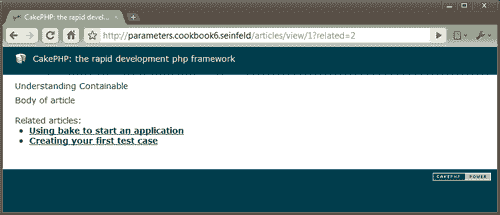
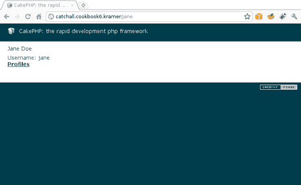
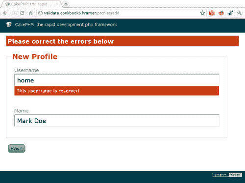

# 第六章。路由魔法

在本章中，我们将介绍：

+   使用 `named` 和 `GET` 参数

+   使用带前缀的路由

+   与路由元素一起工作

+   为个人页面添加通配符路由

+   为通配符路由添加验证

+   创建自定义 `Route` 类

# 简介

几乎每个基于 Web 的应用程序最终都必须开发一种成功的策略，通过一种称为 **搜索引擎优化** 的技术来获得更好的搜索引擎排名。

本章首先通过使用路由参数介绍一些基本的路由概念，然后继续构建优化路由以利用我们的搜索引擎排名。

本章的最后部分展示了如何为我们的用户资料创建高度优化的 URL，以及如何构建自定义 `Route` 类以获得更多灵活性。

# 使用命名和 GET 参数

CakePHP 已经提供了一套非常有用的默认路由，允许将任何一组 URL 元素作为参数发送到控制器操作。例如，一个如 `http://localhost/tags/view/cakephp` 的 URL 被解释为调用 `TagsController::view()` 方法，并将 `cakephp` 作为其第一个参数。

然而，有时在创建带有参数的 URL 时我们需要更多的灵活性，例如省略某些参数或添加在方法签名中未指定的其他参数。`Named` 和 `GET` 参数允许我们拥有这种灵活性，同时不失让 CakePHP 处理其自动 URL 解析的优势。

## 准备工作

为了完成这个食谱，我们需要一个用于工作的示例表。使用以下 SQL 语句创建一个名为 `categories` 的表：

```php
CREATE TABLE `categories`(
`id` INT UNSIGNED AUTO_INCREMENT NOT NULL,
`name` VARCHAR(255) NOT NULL,
PRIMARY KEY(`id`)
);

```

使用以下 SQL 语句创建一个名为 `articles` 的表：

```php
CREATE TABLE `articles`(
`id` INT UNSIGNED AUTO_INCREMENT NOT NULL,
`category_id` INT UNSIGNED NOT NULL,
`title` VARCHAR(255) NOT NULL,
`body` TEXT NOT NULL,
PRIMARY KEY(`id`),
KEY `category_id`(`category_id`),
FOREIGN KEY `articles__categories`(`category_id`) REFERENCES `categories`(`id`)
);

```

使用以下 SQL 语句添加一些示例数据：

```php
INSERT INTO `categories`(`id`, `name`) VALUES
(1, 'Frameworks'),
(2, 'Databases');
INSERT INTO `articles`(`id`, `category_id`, `title`, `body`) VALUES
(1, 1, 'Understanding Containable', 'Body of article'),
(2, 1, 'Creating your first test case', 'Body of article'),
(3, 1, 'Using bake to start an application', 'Body of article'),
(4, 1, 'Creating your first helper', 'Body of article'),
(5, 2, 'Adding indexes', 'Body of article');

```

我们现在继续创建所需模型。在 `app/models` 文件夹中创建名为 `Article` 的模型，文件名为 `article.php`，内容如下：

```php
<?php
class Article extends AppModel {
public $belongsTo = array(
'Category'
);
}
?>

```

在名为 `articles_controller.php` 的文件中创建适当的控制器 `ArticlesController`，并将其放置在 `app/controllers` 文件夹中，内容如下：

```php
<?php
class ArticlesController extends AppController {
public function view($id) {
$article = $this->Article->find('first', array(
'conditions' => array('Article.id' => $id)
));
if (empty($article)) {
$this->cakeError('error404');
}
$articles = $this->Article->find('all', array(
'conditions' => array(
'Category.id' => $article['Category']['id'],
'Article.id !=' => $article['Article']['id']
),
'order' => 'RAND()'
));
$this->set(compact('article', 'articles'));
}
}
?>

```

在你的 `app/views` 文件夹中创建一个名为 `articles` 的文件夹，然后在名为 `view.ctp` 的文件中创建视图，并将其放置在 `app/views/articles` 文件夹中，内容如下：

```php
<h1><?php echo $article['Article']['title']; ?></h1>
<p><?php echo $article['Article']['body']; ?></p>
<?php if (!empty($articles)) { ?>
<br /><p>Related articles:</p>
<ul>
<?php foreach($articles as $related) { ?>
<li><?php echo $this->Html->link(
$related['Article']['title'],
array(
'action'=>'view',
$related['Article']['id']
)
); ?></li>
<?php } ?>
</ul>
<?php } ?>

```

## 如何操作...

1.  我们首先通过一个 `GET` 参数添加更改相关文章数量的可能性。编辑你的 `app/controllers/articles_controller.php` 文件，并对 `view()` 方法进行以下更改：

    ```php
    public function view($id) {
    $article = $this->Article->find('first', array(
    'conditions' => array('Article.id' => $id)
    ));
    if (empty($article)) {
    $this->cakeError('error404');
    }
    $limit = !empty($this->params['url']['related']) ?
    $this->params['url']['related'] :
    0;
    $articles = $this->Article->find('all', array(
    'conditions' => array(
    'Category.id' => $article['Category']['id'],
    'Article.id !=' => $article['Article']['id']
    ),
    'order' => 'RAND()',
    'limit' => $limit > 0 ? $limit : null
    ));
    $this->set(compact('article', 'articles', 'limit'));
    }

    ```

1.  如果我们现在浏览到 `http://localhost/articles/view/1?related=2`，我们应该看到文章内容，以及最多两篇相关文章，如下面的截图所示：

1.  我们现在将使用命名参数来传递一个对搜索引擎友好的文章标题版本，即使显示文章或其相关内容并不需要。编辑你的`ArticlesController`类，并在`view()`方法的末尾添加以下内容：

    ```php
    $slug = !empty($this->params['named']['title']) ?
    $this->params['named']['title'] :
    null;
    $categorySlug = !empty($this->params['named']['category']) ?
    $this->params['named']['category'] :
    null;
    $this->set(compact('slug', 'categorySlug'));

    ```

1.  现在编辑`app/views/articles/view.ctp`文件，并做出以下更改：

    ```php
    <?php if (!empty($slug)) { ?>
    Slug: <?php echo $this->Html->clean($slug); ?><br />
    <?php } ?>
    <?php if (!empty($categorySlug)) { ?>
    Category slug: <?php echo $this->Html->clean($categorySlug); ?><br />
    <?php } ?>
    <h1><?php echo $article['Article']['title']; ?></h1>
    <p><?php echo $article['Article']['body']; ?></p>
    <?php if (!empty($articles)) { ?>
    <br /><p>Related articles:</p>
    <ul>
    <?php foreach($articles as $related) { ?>
    <li><?php echo $this->Html->link(
    $related['Article']['title'],
    array(
    'action'=>'view',
    $related['Article']['id'],
    '?' => array('related' => $limit),
    'category' => strtolower(Inflector::slug($related['Category']['name'])),
    'title' => strtolower(Inflector::slug($related['Article']['title']))
    )
    ); ?></li>
    <?php } ?>
    </ul>
    <?php } ?>

    ```

1.  如果我们悬停在相关文章的链接上，我们会注意到它们包括两个新的参数：`category`和`title`。一个生成的 URL 示例可能是`http://localhost/articles/view/4/category:frameworks/title:creating_your_first_helper`。点击此链接将带我们到文章页面，该页面也显示了指定的参数。

## 它是如何工作的...

`GET`和`named`参数以类似的方式工作，它们作为数组自动在我们的应用程序代码中可用。`GET`参数在`$this->params['url']`中可用，而命名参数在`$this->params['named']`中可用。检查参数的存在就像验证这些给定数组中是否包含一个键是所需参数的值一样简单。

通过指定一个参数（键是参数名，值是其值）的索引数组来创建指定`named`或`GET`参数（或两者）的链接（或两者）。对于`GET`参数，此数组设置在特殊的`?`路由索引键中，而对于命名参数，每个参数都作为实际基于数组的 URL 的一部分指定。

## 还有更多...

我们学习了如何通过在基于数组的 URL 中设置`key => value`对来指定命名参数。然而，我们可能还想指定哪些命名参数应该被解析，并确保它们仅在值匹配某个正则表达式时才被解析。

例如，我们可以为`articles`控制器中的所有操作定义`title`命名参数，使其仅在遵循某个正则表达式时解析，其中标题只能包含小写字母、数字或下划线符号。为此，我们在`app/config/routes.php`文件中添加以下句子：

```php
Router::connectNamed(
array('title' => array('match' => '^[a-z0-9_]+$', 'controller' => 'articles')),
array('default' => true)
);

```

第一个参数是一个数组，按参数名索引，其值包含另一个可能包括以下设置的数组，所有这些设置都是可选的：

| 设置 | 目的 |
| --- | --- |
| `action` | 如果指定，只有对于给定的操作，才会解析命名参数。 |
| `controller` | 如果指定，只有对于给定的控制器，才会解析命名参数。 |
| `match` | 一个正则表达式，用于检查提供的值是否与命名参数匹配。如果指定，只有当值匹配表达式时，才会解析命名参数。 |

`Router::connectNamed()`的第二个参数是一个可选的设置数组，可能包括以下任何一项：

| 设置 | 目的 |
| --- | --- |
| `default` | 如果设置为 `true`，它还将加载使分页工作所需的命名参数。如果您多次调用 `Router::connectNamed()`，这只需要一次，除非您将 `reset` 选项设置为 `true`。默认为 `false`。 |
| `greedy` | 如果设置为 `false`，它将只解析通过 `Router::connectNamed()` 调用显式定义的命名参数。默认为 `true`。 |
| `reset` | 如果设置为 `true`，它将清除在此调用之前定义的任何命名参数。默认为 `false`。 |

为了进一步理解 `greedy` 选项，我们仍然可以允许 URL 包含 `category` 和 `title` 参数，但可能只想解析 `title` 的值。为此，我们可以在定义命名参数时将 `greedy` 设置为 `false`。这样，`$this->params['named']` 将只包含 `title` 的值，即使请求的 URL 中指定了 `category`。我们还想只为 `articles` 控制器的 `view` 动作执行此操作：

```php
Router::connectNamed(
array('title' => array('match' => '^[a-z0-9_]+$', 'controller'=>'articles', 'action'=>'view')),
array('greedy' => false)
);

```

注意我们为什么必须再次指定 `title` 命名参数的正则表达式，尽管我们之前已经指定了它。这是因为我们正在配置一个已存在的名称的命名参数，因此我们的定义将覆盖之前的定义。

## 参见

+   *与路由元素一起工作*

# 使用带有前缀的路由

经常情况下，我们发现我们需要将应用程序的不同区域分开，不仅是在代码和用户界面方面，而且在功能方面。通过使用 CakePHP 的灵活路由系统，我们可以通过使用前缀来实现这一点，并更多，因为前缀为我们提供了一种以不同方式重新实现某些控制器操作的方法，并且根据使用的任何前缀，达到特定的实现。

## 准备工作

为了完成这个配方，我们需要一个用于工作的示例表。使用以下 SQL 语句创建一个名为 `profiles` 的表：

```php
CREATE TABLE `profiles`(
`id` INT UNSIGNED AUTO_INCREMENT NOT NULL,
`name` VARCHAR(255) NOT NULL,
`email` VARCHAR(255) NOT NULL,
`active` TINYINT(1) NOT NULL default 1,
PRIMARY KEY(`id`)
);

```

使用以下 SQL 语句添加一些示例数据：

```php
INSERT INTO `profiles`(`id`, `name`, `email`, `active`) VALUES
(1, 'John Doe', 'john.doe@email.com', 1),
(2, 'Jane Doe', 'jane.doe@email.com', 1),
(3, 'Mark Doe', 'mark.doe@email.com', 0);

```

接下来，在名为 `profiles_controller.php` 的文件中创建所需的 `ProfilesController` 类，并将其放置在您的 `app/controllers` 文件夹中，内容如下：

```php
<?php
class ProfilesController extends AppController {
public function index() {
$profiles = $this->paginate();
$this->set(compact('profiles'));
}
public function edit($id) {
if (!empty($this->data)) {
if ($this->Profile->save($this->data)) {
$this->Session->setFlash('Profile saved');
$this->redirect(array('action'=>'index'));
} else {
$this->Session->setFlash('Please correct the errors');
}
} else {
$this->data = $this->Profile->find('first', array(
'conditions' => array('Profile.id' => $id),
'recursive' => -1
));
}
}
}
?>

```

在您的 `app/views` 文件夹中创建一个名为 `profiles` 的文件夹，然后创建一个名为 `index.ctp` 的视图，并将其放置在 `app/views/profiles` 文件夹中，内容如下：

```php
<p>
<?php echo $this->Paginator->prev(); ?>&nbsp;
<?php echo $this->Paginator->numbers(); ?>&nbsp;
<?php echo $this->Paginator->next(); ?>
</p>
<table>
<thead><tr><th>Name</th><th>Email</th><th>Actions</th></tr></thead>
<tbody>
<?php foreach($profiles as $profile) { ?>
<tr>
<td><?php echo $profile['Profile']['name']; ?></td>
<td><?php echo $profile['Profile']['email']; ?></td>
<td>
<?php echo $this->Html->link('Edit', array('action'=>'edit', $profile['Profile']['id'])); ?>
</td>
</tr>
<?php } ?>
</tbody></table>

```

在名为 `edit.ctp` 的文件中创建 `edit` 动作的视图，并将其放置在您的 `app/views/profiles` 文件夹中，内容如下：

```php
<?php echo $this->Form->create('Profile'); ?>
<?php echo $this->Form->input('name'); ?>
<?php echo $this->Form->input('email'); ?>
<?php echo $this->Form->end('Save'); ?>

```

## 如何操作...

1.  我们首先向 CakePHP 添加两个前缀：`admin` 和 `manager`。编辑您的 `app/config/core.php` 文件，查找定义 `Routing.prefixes` 设置的行。如果该行被注释，取消注释它。然后将其更改为：

    ```php
    Configure::write('Routing.prefixes', array('admin', 'manager'));

    ```

1.  让我们修改`ProfilesController`类，为两个前缀添加重写的`index`和`edit`操作。我们还将添加一个新的操作，以便在通过`admin`前缀访问时，我们可以添加新的配置文件记录。编辑你的`app/controllers/profiles_controller.php`文件，并在`ProfilesController`类的开头添加以下方法：

    ```php
    public function beforeFilter() {
    parent::beforeFilter();
    $prefixes = Configure::read('Routing.prefixes');
    if (!empty($prefixes)) {
    foreach($prefixes as $prefix) {
    $hasPrefix = false;
    if (!empty($this->params['prefix'])) {
    $hasPrefix = ($this->params['prefix'] == $prefix);
    }
    $prefixName = 'is' . Inflector::classify($prefix);
    $this->$prefixName = $hasPrefix;
    $this->set($prefixName, $hasPrefix);
    }
    }
    }
    public function manager_index() {
    $this->setAction('index');
    }
    public function manager_edit($id) {
    $this->setAction('edit', $id);
    }
    public function admin_index() {
    $this->setAction('index');
    }
    public function admin_edit($id) {
    $this->setAction('edit', $id);
    }
    public function admin_add() {
    $this->setAction('edit');
    }
    public function index() {
    $profiles = $this->paginate();
    $this->set(compact('profiles'));
    }

    ```

1.  现在，我们需要更改`edit`操作，使其能够处理新记录的创建。在继续编辑你的`app/controllers/profiles_controller.php`文件时，对`ProfilesController`类的`edit()`方法做出以下更改：

    ```php
    public function edit($id = null) {
    if (!empty($id) && !$this->isAdmin && !$this->isManager) {
    $this->redirect(array('action' => 'index'));
    }
    if (!empty($this->data)) {
    if (empty($id)) {
    $this->Profile->create();
    }
    if ($this->Profile->save($this->data)) {
    $this->Session->setFlash('Profile saved');
    $this->redirect(array('action'=>'index'));
    } else {
    $this->Session->setFlash('Please correct the errors');
    }
    } elseif (!empty($id)) {
    $this->data = $this->Profile->find('first', array(
    'conditions' => array('Profile.id' => $id),
    'recursive' => -1
    ));
    }
    }

    ```

1.  下一步是更改视图。编辑你的`app/views/profiles/index.ctp`视图文件，并在末尾添加以下内容：

    ```php
    <?php
    if ($isAdmin) {
    echo $this->Html->link('Create Profile', array('admin' => true, 'action'=>'add'));
    }
    ?>

    ```

1.  最后，编辑你的`app/views/profiles/edit.ctp`视图文件，并做出以下更改：

    ```php
    <?php echo $this->Form->create('Profile'); ?>
    <?php echo $this->Form->input('name'); ?>
    <?php echo $this->Form->input('email'); ?>
    <?php
    if ($isManager || $isAdmin) {
    echo $this->Form->input('active', array(
    'options' => array(1 => 'Yes', 0 => 'No')
    ));
    }
    ?>
    <?php echo $this->Form->end('Save'); ?>

    ```

### 它是如何工作的...

在配置设置`Routing.prefixes`中指定的任何值都作为路由前缀。在这个例子中，我们添加了两个前缀：`admin`和`manager`。每次我们在 URL 中使用前缀（前缀在正常 CakePHP URL 之前）时，CakePHP 都会将当前前缀设置在`$this->params['prefix']`中，并执行一个操作，其名称与如果不使用前缀，但在同一控制器中使用前缀和下划线符号相同。

在我们的例子中，当我们访问`http://localhost/manager/profiles/index`时，CakePHP 将通过执行位于`ProfilesController`中的`manager_index`操作来处理此请求，并将`$this->params['prefix']`设置为`manager`。了解这一点后，我们可以添加控制器和视图变量来告诉操作和视图，我们是以管理员的身份（当`manager`前缀被设置时）还是以管理员的身份（当`admin`前缀被设置时）访问应用程序。我们通过在`beforeFilter`回调中为每个前缀（`manager`前缀的`isManager`，`admin`前缀的`isAdmin`）创建适当的控制器和视图变量来实现这一点。

### 参见

+   在第一章的*基于角色的访问控制器前缀使用*中，*认证*

# 使用路由元素进行操作

即使`GET`和`named`参数在大多数情况下可能很有用，我们可能还需要进一步优化我们的应用程序 URL 以获得更好的搜索引擎排名。

幸运的是，CakePHP 为我们提供了路由元素，这是一个保持`GET`和命名参数灵活性的解决方案，并改进了应用程序内 URL 的构建方式。

## 准备就绪

我们需要一些样本数据来工作。按照食谱*使用 GET 和命名参数*中的*准备就绪*部分进行操作。

## 如何操作...

1.  我们希望我们的文章 URL 能够进一步优化以适应搜索引擎，所以我们首先创建一个新的路由。编辑你的`app/config/routes.php`文件，并在文件末尾添加以下路由：

    ```php
    Router::connect('/article/:category/:id-:title',
    array('controller' => 'articles', 'action' => 'view'),
    array(
    'pass' => array('id'),
    'id' => '\d+',
    'category' => '[^-]+',
    'title' => '[^-]+'
    )
    );

    ```

1.  由于我们的路由定义了三个元素（`id`、`category` 和 `title`），我们需要修改视图来指定这些元素的价值。编辑您的 `app/views/articles/index.ctp` 视图文件并做出以下更改：

    ```php
    <h1><?php echo $article['Article']['title']; ?></h1>
    <p><?php echo $article['Article']['body']; ?></p>
    <?php if (!empty($articles)) { ?>
    <br /><p>Related articles:</p>
    <ul>
    <?php foreach($articles as $related) { ?>
    <li><?php echo $this->Html->link(
    $related['Article']['title'],
    array(
    'action'=>'view',
    'id' => $related['Article']['id'],
    'category' => strtolower(Inflector::slug($related['Category']['name'])),
    'title' => strtolower(Inflector::slug($related['Article']['title']))
    )
    ); ?></li>
    <?php } ?>
    </ul>
    <?php } ?>

    ```

### 它是如何工作的...

CakePHP 使用 `routes.php` 配置文件中定义的路由来生成 URL，并解析请求的 URL。当我们想要与框架提供的不同 URL 时，我们向此配置文件添加新的路由。

在调用 `Router::connect()` 方法时，通过指定最多三个参数来创建路由：

+   第一个参数是路由 URL，是我们路由的字符串表示。它可以包含通配符和路由元素。

+   第二个参数用于指定默认路由值，这是一个可能包括 `plugin, controller, action` 和操作参数的数组。您可以省略这些默认值的一部分，例如，为特定控制器中的所有操作定义路由。

+   第三个参数定义了路由元素，这是一个可选数组，它定义了路由所使用的路由元素。它还可以包括在调用控制器操作时要发送作为参数的元素列表。

使用 `Router::connect()`，我们定义了一个包含所有这些参数的路由：

+   我们将 `/article/:category/:id-:title` 设置为我们的路由 URL。注意我们是如何通过在名称前加冒号来引用路由元素的。

+   在第二个参数中，我们指定这个路由将匹配指向 `articles` 控制器 `view` 动作的任何链接。同样，如果请求的 URL 与第一个参数中指定的路由 URL 匹配，这将是要执行的操作。

+   在第三个参数中，我们指定了三个路由元素，以及它们各自的正则表达式匹配表达式：`id`（一个数字）、`category`（不包含破折号的任何字符串）和 `title`（也不包含破折号的字符串）。我们使用特殊的 `pass` 选项来指定哪些路由元素作为常规操作参数传递。

当 CakePHP 发现一个 URL 包含与我们的路由第一个参数指定的默认值相同的值，并且也包含其第三个参数指定的路由元素时，它将把路由转换为我们的提供的字符串表示形式。例如，如果我们使用以下语句创建一个链接：

```php
<?php echo $this->Html->link(
'My article',
array(
'controller' => 'articles',
'action' => 'view',
'id' => 1,
'category' => 'my_category',
'title' => 'my_title'
)
); ?>

```

我们将匹配所有我们的路由要求，生成的结果 URL 将看起来像 `http://localhost/article/my_category/1-my_title`。

### 更多...

当我们的控制器操作由使用路由元素的路线触发时，我们可以使用每个控制器都有的 `$this->params` 数组来获取所有指定元素的价值。

在我们的示例中，我们将 `id` 路由元素设置为作为常规操作参数传递，但我们没有对剩余的元素（类别和 `title`）这样做。为了获取 `category` 的给定值，我们会这样做：

```php
$category = $this->params['category']

```

#### 使用反向路由

尽管 CakePHP 允许我们在创建链接时指定基于字符串的 URL，但建议我们除非 URL 是外站绝对引用，否则始终使用数组来定义链接 URL。

使用数组定义的 URL 允许反向路由系统工作，这是框架的一部分，允许我们使用自定义路由。

### 参见

+   *为个人资料页面添加通配符路由*

+   *使用 GET 和命名参数*

# 为个人资料页面添加通配符路由

几个网站包括直接 URL 来访问用户个人资料，并且这些地址与其他大量 URL 并存。例如，Twitter 允许[`twitter.com/mgiglesias`](http://twitter.com/mgiglesias)列出用户`mgiglesias`创建的推文，而像[`twitter.com/about`](http://twitter.com/about)这样的地址将带我们到他们的服务描述。

这个食谱向我们展示了如何为我们的个人资料记录创建直接 URL，允许生成的 URL 与其他我们可能拥有的应用程序路由共存。

## 准备工作

为了完成这个食谱，我们需要一个示例表来操作。使用以下 SQL 语句创建一个名为`profiles`的表：

```php
CREATE TABLE `profiles`(
`id` INT UNSIGNED AUTO_INCREMENT NOT NULL,
`username` VARCHAR(255) NOT NULL,
`name` VARCHAR(255) NOT NULL,
PRIMARY KEY(`id`)
);

```

使用以下 SQL 语句添加一些示例数据：

```php
INSERT INTO `profiles`(`id`, `username`, `name`) VALUES
(1, 'john', 'John Doe'),
(2, 'jane', 'Jane Doe');

```

现在继续创建所需的模型。创建一个名为`profile.php`的文件，并将其放置在`app/models`文件夹中，内容如下：

```php
<?php
class Profile extends AppModel {
}
?>

```

在名为`profiles_controller.php`的文件中创建`ProfilesController`类，并将其放置在`app/controllers`文件夹中，内容如下：

```php
<?php
class ProfilesController extends AppController {
public function index() {
$profiles = $this->Profile->find('all');
$this->set(compact('profiles'));
}
public function view($username) {
$profile = $this->Profile->find('first', array(
'conditions' => array('Profile.username' => $username)
));
if (empty($profile)) {
$this->cakeError('error404');
}
$this->set(compact('profile'));
}
}
?>

```

在你的`app/views`文件夹中创建一个名为`profiles`的文件夹。在`app/views/profiles`文件夹中创建`index`操作的视图，文件名为`index.ctp`，内容如下：

```php
<ul>
<?php foreach($profiles as $profile) { ?>
<li><?php echo $this->Html->link($profile['Profile']['name'], array(
'action' => 'view',
'userName' => $profile['Profile']['username']
)); ?></li>
<?php } ?>
</ul>

```

在`app/views/profiles`文件夹中创建`view`操作的视图，文件名为`view.ctp`，内容如下：

```php
<h1><?php echo $profile['Profile']['name']; ?></h1>
Username: <?php echo $profile['Profile']['username']; ?>
<p><?php echo $this->Html->link('Profiles', array('action'=>'index')); ?></p>

```

## 如何操作...

编辑你的`app/config/routes.php`文件，并在文件末尾添加以下路由：

```php
Router::connect('/:userName',
array('controller' => 'profiles', 'action' => 'view'),
array(
'userName' => '[A-Za-z0-9\._-]+',
'pass' => array('userName')
)
);
Router::connect('/:controller/index/*', array('action' => 'index'));

```

如果你现在浏览到`http://localhost/profiles/index`，你会看到为`jane`用户账户生成的链接是`http://localhost/jane`。点击它应该会显示 Jane 的个人资料页面，如下面的截图所示：



## 它是如何工作的...

我们创建了两个路由。第一个路由使用一个名为`userName`的路由元素来设置 URL 仅由其值组成。使用正则表达式，我们的路由确保只有在`userName`的值为字母、数字、点、破折号或下划线时才使用。使用`controller`和`action`设置，我们将路由链接到`profiles`控制器的`view`操作。最后，将`userName`元素设置为作为常规参数传递给`ProfilesController::view()`方法。

定义此路由后，如果我们使用以下语句创建链接：

```php
<?php echo $this->Html->link('My Profile', array(
'controller' => 'profiles',
'action' => 'view',
'userName' => 'john'
)); ?>

```

生成的 URL 将是 `http://localhost/john`。点击此链接将执行与使用 URL `http://localhost/profiles/view/john` 相同的动作，使用相同的参数。

然而，存在一个明显的问题。CakePHP 为所有我们的控制器提供了索引动作的短 URL。因此，我们可以使用 URL `http://localhost/profiles` 访问 `ProfilesController::index()` 方法，这与 URL `http://localhost/profiles/index` 相当。此默认路由将与我们的自定义路由冲突，因为单词 `profiles` 与我们的正则表达式匹配。

幸运的是，此功能在从基于数组的路由生成 URL 时不会与我们的路由冲突。因为我们已将路由链接到 `profiles` 控制器的 `view` 动作，所以 CakePHP 只会在链接到该动作并指定 `userName` 元素时使用我们的自定义路由。

我们仍然需要修复解析 URL（如 `http://localhost/profiles`）时产生的冲突。为此，我们创建另一个路由，以便在生成链接时不会使用 CakePHP 的内置 `index` 路由。此路由使用特殊的 `:controller` 路由元素（设置为链接指向的控制器），并强制将 `index` 动作作为 URL 的一部分。我们将此路由链接到使用 `index` 动作的所有路由，无论控制器是什么。

### 注意

要了解关于此问题的另一种更有效的方法，请参阅创建自定义 Route 类

在添加此路由后，如果我们创建了一个链接：

```php
<?php echo $this->Html->link('Profiles', array(
'controller' => 'profiles',
'action' => 'index'
)); ?>

```

生成的 URL 将是 `http://localhost/profiles/index`。

## 参见

+   *与路由元素一起工作*

+   *为通配符路由添加验证*

+   *创建自定义路由类*

# 为通配符路由添加验证

在食谱 *为个人资料页面添加通配符路由* 中，我们创建了路由，以便可以通过仅指定 URL 中的用户名来访问个人资料页面。

在本食谱中，我们将学习如何实现自定义验证方法，以便这些用户名不会与其他自定义路由冲突。

## 准备工作

我们需要一些样本数据来工作，并且需要一个通配符路由。遵循整个食谱 *为个人资料页面添加通配符路由*。

我们还需要注册页面，用于创建新的个人资料记录。编辑你的 `app/controller/profiles_controller.php` 文件，并在 `ProfilesController` 类定义中放置以下方法：

```php
public function add() {
if (!empty($this->data)) {
$this->Profile->create($this->data);
if ($this->Profile->save()) {
$this->Session->setFlash('Profile created');
$this->redirect(array(
'action'=>'view',
'userName' => $this->data['Profile']['username']
));
} else {
$this->Session->setFlash('Please correct the errors below');
}
}
}

```

在名为 `add.ctp` 的文件中创建适当的视图，并将其放置在 `app/views/profiles` 文件夹中，内容如下：

```php
<?php
echo $this->Form->create();
echo $this->Form->inputs(array(
'username',
'name'
));
echo $this->Form->end('Save');
?>

```

我们还需要一个自定义路由来尝试验证。编辑你的 `app/config/routes.php` 文件，并在开头添加以下路由：

```php
Router::connect('/home', array(
'controller' => 'pages', 'action' => 'display', 'home'
));

```

## 如何操作...

1.  编辑你的 `app/models/profile.php` 文件，并做出以下更改：

    ```php
    <?php
    class Profile extends AppModel {
    public $validate = array(
    'username' => array(
    'notEmpty',
    'valid' => array(
    'rule' => 'validateUsername',
    'message' => 'This user name is reserved'
    )
    ),
    'name' => 'notEmpty'
    );
    }
    ?>

    ```

1.  在编辑你的 `app/models/profile.php` 文件的同时，向 `Profile` 类添加以下方法：

    ```php
    public function validateUsername($value, $params) {
    $reserved = Router::prefixes();
    $controllers = array_diff(
    Configure::listObjects('controller'),
    (array) 'App'
    );
    if (!empty($controllers)) {
    $reserved = array_merge($reserved, array_map(array('Inflector', 'underscore'), $controllers));
    }
    $routes = Router::getInstance()->routes;
    if (!empty($routes)) {
    foreach($routes as $route) {
    if (!empty($route->template) && preg_match('/^\/([^\/:]+)/', $route->template, $matches)) {
    $reserved[] = strtolower($matches[1]);
    }
    }
    }
    return !in_array(strtolower(array_shift($value)), $reserved);
    }

    ```

如果您现在浏览到 `http://localhost/profiles/add` 并将 **home** 作为用户名，**Mark Doe** 作为姓名，您将得到一个验证错误消息，告知您用户名已被保留，如下面的截图所示：



## 工作原理...

首先，我们为两个字段添加验证规则：`username` 和 `name`。`username` 字段的验证由两个规则组成：内置的 `notEmpty` 规则和一个名为 `validateUsername` 的自定义验证规则。`name` 字段只有一个规则：`notEmpty`。

在我们的 `validateUsername` 规则实现中，我们首先将所有路由前缀存储到保留字列表中。然后我们使用 `Configure::listObjects()` 方法获取所有控制器列表，排除值 `App`，它是我们控制器的基础（因此不能直接访问）。然后我们将每个名称转换为小写和下划线形式。

我们通过获取 `Router` 类的实例并访问其 `routes` 公共属性来获取所有已定义的路由列表，然后我们查找每个路由的 `template` 属性。

这个属性存储了路由的字符串表示。对于我们在 *准备工作* 部分定义的路由，这将是一个 `/home`。我们只对值的起始部分感兴趣（即第一个斜杠之后，第二个斜杠之前的内容），因此我们使用正则表达式来匹配并提取这个值，然后将其添加到保留字列表中。

在我们的例子中，保留字列表将是：`pages, profiles` 和 `home`。前两个来自我们的应用程序控制器列表，最后一个来自我们的自定义路由。

一旦我们有了保留字列表，我们只在该值不在该列表中时将字段设置为有效。

## 参见

+   *为个人页面添加通配符路由*

# 创建自定义路由类

在 *为个人页面添加通配符路由* 的配方中，我们创建了路由，以便可以通过仅指定 URL 中的用户名来访问个人页面。然而，该实现有一个问题：我们必须禁止自动访问 `index` 动作。

这个配方展示了我们个人 URL 生成的一种不同方法，通过创建一个自定义路由实现，不仅克服了这个问题，而且确保该路由仅用于现有的个人记录。

## 准备工作

我们需要一些样本数据来工作。遵循 *准备工作* 部分的 *为个人页面添加通配符路由* 配方。

## 如何操作...

1.  编辑您的 `app/config/routes.php` 文件，并在文件末尾添加以下路由：

    ```php
    App::import('Lib', 'ProfileRoute');
    Router::connect('/:userName',
    array('controller' => 'profiles', 'action' => 'view'),
    array(
    'routeClass' => 'ProfileRoute',
    'pass' => array('userName')
    )
    );

    ```

1.  现在创建一个名为 `profile_route.php` 的文件，并将其放置在您的 `app/libs` 文件夹中，内容如下：

    ```php
    <?php
    App::import('Core', 'Router');
    class ProfileRoute extends CakeRoute {
    public function match($url) {
    if (!empty($url['userName']) && $this->_exists($url['userName'])) {
    return parent::match($url);
    }
    return false;
    }
    public function parse($url) {
    $params = parent::parse($url);
    if (!empty($params) && $this->_exists($params['userName'])) {
    return $params;
    }
    return false;
    }
    protected function _exists($userName) {
    $userNames = Cache::read('usernames');
    if (empty($userNames)) {
    $profiles = ClassRegistry::init('Profile')->find('all', array(
    'fields' => array('username'),
    'recursive' => -1
    ));
    if (!empty($profiles)) {
    $userNames = array_map(
    'strtolower',
    Set::extract('/Profile/username', $profiles)
    );
    Cache::write('usernames', $userNames);
    }
    }
    return in_array($userName, (array) $userNames);
    }
    }
    ?>

    ```

1.  接下来，编辑您的 `app/models/profile.php` 文件，并将以下方法添加到 `Profile` 类中：

    ```php
    public function afterSave($created) {
    parent::afterSave($created);
    Cache::delete('usernames');
    }
    public function afterDelete() {
    parent::afterDelete();
    Cache::delete('usernames');
    }

    ```

您现在可以浏览到`http://localhost/john`来查看约翰的个人资料页面。在 URL 中指定无效的名称（例如`http://localhost/kate`）将产生常规的 CakePHP 错误页面，而浏览到`http://localhost/profiles`将正确地带我们到个人资料索引页面。

## 它是如何工作的...

我们首先导入自定义路由类文件，然后使用自定义的`ProfileRoute`类定义一个用于`profiles`控制器`view`操作的通配路由，并将`userName`路由元素设置为作为常规参数传递。

`ProfileRoute`实现实现了两个最典型的路由类方法：

1.  `match()`：在反向路由期间使用，将基于数组的 URL 转换为它的字符串表示形式。如果该方法返回`false`，那么提供的 URL 不适用于此路由。

1.  `parse()`：当解析请求的 URL 为基于数组的 URL 时使用，指定`controller, action`和其他参数。如果该方法返回`false`，那么这告诉 CakePHP 给定的 URL 不是由这个路由处理的。

我们创建了一个名为`_exists()`的辅助方法来帮助我们，该方法在注册的记录中查找给定的用户名。出于明显的性能原因，我们缓存用户名列表，并在创建、修改或删除记录时通过在`Profile`模型中实现`afterSave`和`afterDelete`回调来使此缓存失效。

我们的`match()`实现首先检查确保提供了`userName`路由元素。如果提供了，并且指定的用户存在，它将使用父实现来返回字符串表示形式。在任何其他情况下（未提供用户名或用户不存在），它将不会处理给定的 URL。

`parse()`实现首先调用其父实现将字符串 URL 转换为基于数组的 URL。如果该调用成功（这意味着它包含`userName`路由元素），并且如果给定的用户名存在，它将返回转换。否则，它返回`false`以不处理给定的 URL。另一个路由处理程序或 CakePHP 的默认路由处理程序将处理它。

## 参见

+   *为个人资料页面添加通配路由*

+   *自定义路由类*
