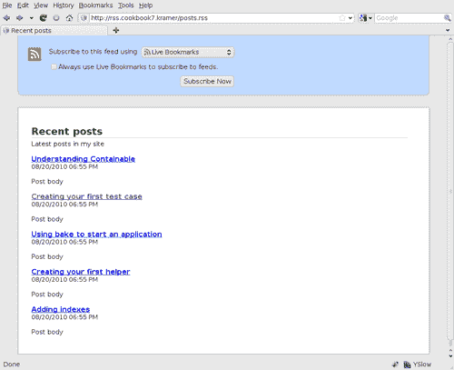
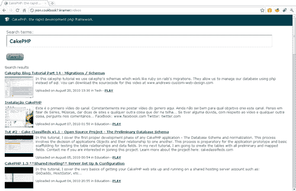
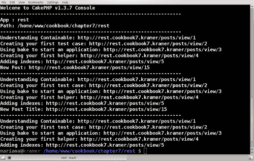
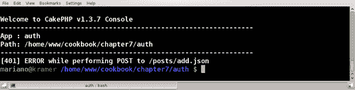

# 第七章。创建和消费网络服务

在本章中，我们将涵盖：

+   创建 RSS 源

+   消费 JSON 服务

+   使用 JSON 构建 REST 服务

+   为 REST 服务添加身份验证

+   为 API 访问实现基于令牌的授权

# 简介

当我们希望向第三方应用程序公开应用程序功能或希望将外部服务集成到我们自己的应用程序中时，网络服务是必不可少的。它们提供了一套广泛的技术和定义，以便使用不同编程语言编写的系统可以相互通信。

本章介绍了一系列菜谱，用于消费网络服务以及将我们应用程序的某些部分公开为网络服务。

# 创建 RSS 源

RSS 源是一种网络服务形式，因为它们通过互联网提供一种服务，使用已知格式来公开数据。由于它们的简单性，它们是介绍我们进入网络服务世界的好方法，尤其是 CakePHP 提供了内置方法来创建它们。

在 第五章 的 *使用数据源消费 RSS 源* 菜谱中，我们学习了如何从外部 RSS 源获取内容。在这个菜谱中，我们将做完全相反的事情：为我们自己的网站生成一个可以被其他应用程序使用的源。

## 准备工作

为了完成这个菜谱，我们需要一个示例表来操作。使用以下 SQL 语句创建一个名为 `posts` 的表：

```php
CREATE TABLE `posts`(posts
`id` INT NOT NULL AUTO_INCREMENT,
`title` VARCHAR(255) NOT NULL,
`body` TEXT NOT NULL,
`created` DATETIME NOT NULL,
`modified` DATETIME NOT NULL,
PRIMARY KEY(`id`)
);

```

使用以下 SQL 语句添加一些示例数据：

```php
INSERT INTO `posts`(`title`,posts `body`, `created`, `modified`) VALUES
('Understanding Containable', 'Post body', NOW(), NOW()),
('Creating your first test case', 'Post body', NOW(), NOW()),
('Using bake to start an application', 'Post body', NOW(), NOW()),
('Creating your first helper', 'Post body', NOW(), NOW()),
('Adding indexes', 'Post body', NOW(), NOW());

```

我们现在继续创建所需的控制器。在 `app/controllers` 文件夹中创建一个名为 `posts_controller.php` 的类 `PostsController`，内容如下：

```php
<?php
class PostsController extends AppController {
public function index() {
$posts = $this->Post->find('all');
$this->set(compact('posts'));
}
}
?>

```

在你的 `app/views` 文件夹中创建一个名为 `posts` 的文件夹，然后在 `app/views/posts` 文件夹中创建一个名为 `index.ctp` 的视图文件，并放置以下内容：

```php
<h1>Posts</h1>
<?php if (!empty($posts)) { ?>
<ul>
<?php foreach($posts as $post) { ?>
<li><?php echo $this->Html->link(
$post['Post']['title'],
array(
'action'=>'view',
$post['Post']['id']
)
); ?></li>
<?php } ?>
</ul>
<?php } ?>

```

## 如何操作...

1.  编辑你的 `app/config/routes.php` 文件，并在末尾添加以下语句：

    ```php
    Router::parseExtensions('rss');

    ```

1.  编辑你的 `app/controllers/posts_controller.php` 文件，并在 `PostsController` 类中添加以下属性：

    ```php
    public $components = array('RequestHandler');

    ```

1.  在编辑 `PostsController` 的同时，对 `index()` 方法进行以下更改：

    ```php
    public function index() {
    $options = array();
    if ($this->RequestHandler->isRss()) {
    $options = array_merge($options, array(
    'order' => array('Post.created' => 'desc'),
    'limit' => 5
    ));
    }
    $posts = $this->Post->find('all', $options);
    $this->set(compact('posts'));
    }

    ```

1.  在你的 `app/views/posts` 文件夹中创建一个名为 `rss` 的文件夹，并在 `rss` 文件夹中创建一个名为 `index.ctp` 的文件，内容如下：

    ```php
    <?php
    $this->set('channel', array(
    'title' => 'Recent posts',
    'link' => $this->Rss->url('/', true),
    'description' => 'Latest posts in my site'
    ));
    $items = array();
    foreach($posts as $post) {
    $items[] = array(
    'title' => $post['Post']['title'],
    'link' => array('action'=>'view', $post['Post']['id']),
    'description' => array('cdata'=>true, 'value'=>$post['Post']['body']),
    'pubDate' => $post['Post']['created']
    );
    }
    echo $this->Rss->items($items);
    ?>

    ```

1.  编辑你的 `app/views/posts/index.ctp` 文件，并在视图末尾添加以下内容：

    ```php
    <?php echo $this->Html->link('Feed', array('action'=>'index', 'ext'=>'rss')); ?>

    ```

    如果你现在浏览到 `http://localhost/posts`，你应该会看到一个包含名为 **Feed** 的链接的帖子列表。点击此链接应该会生成一个有效的 RSS 源，如下面的截图所示：

    

如果你查看生成的响应的源代码，你可以看到 RSS 文档中第一个项目的源代码如下：

```php
<item> <title>Understanding Containable</title> <link>http://rss.cookbook7.kramer/posts/view/1</link> <description><![CDATA[Post body]]></description> <pubDate>Fri, 20 Aug 2010 18:55:47 -0300</pubDate> <guid>http://rss.cookbook7.kramer/posts/view/1</guid> </item>

```

## 工作原理...

我们通过调用`Router::parseExtensions()`方法来告诉 CakePHP 我们的应用程序接受`rss`扩展，这是一个接受任意数量扩展的方法。使用扩展，我们可以创建同一视图的不同版本。例如，如果我们想接受`rss`和`xml`作为扩展，我们会这样做：

```php
Router::parseExtensions('rss', 'xml');

```

在我们的配置中，我们将`rss`添加到了有效扩展列表中。这样，如果通过该扩展访问操作，例如使用 URL `http://localhost/posts.rss`，那么 CakePHP 会识别`rss`为有效扩展，并像平常一样执行`ArticlesController::index()`操作，但使用`app/views/posts/rss/index.ctp`文件来渲染视图。此过程还会使用文件`app/views/layouts/rss/default.ctp`作为布局，或者如果没有该文件，则使用 CakePHP 的默认 RSS 布局。

我们随后修改了`ArticlesController::index()`方法构建帖子列表的方式，并使用`RequestHandler`组件来检查当前请求是否使用了`rss`扩展。如果是的话，我们就利用这一信息来改变帖子的数量和顺序。

在`app/views/posts/rss/index.ctp`视图文件中，我们首先设置一些视图变量。由于控制器视图总是在布局之前渲染，因此我们可以从视图文件中添加或更改视图变量，并在布局中使用它们。CakePHP 的默认 RSS 布局使用`$channel`视图变量来描述 RSS 源。通过使用该变量，我们设置了我们的源标题`title`、链接`link`和描述`description`。

我们继续输出实际的条目文件。有几种不同的方法可以做到这一点，第一种是为每个条目调用`RssHelper::item()`方法，另一种方法只需要调用`RssHelper::items()`，并传递一个包含条目的数组。我们选择了后者，因为它更简单。

当我们构建要包含在源中的条目数组时，我们只指定`title`、`link`、`description`和`pubDate`。查看生成的 XML 源代码，我们可以推断出`RssHelper`使用了我们为`link`元素指定的值作为`guid`（全局唯一标识符）元素的值。

注意，`description`字段与其他字段在数组中的值指定略有不同。这是因为我们的描述可能包含 HTML 代码，因此我们想要确保生成的文档仍然是一个有效的 XML 文档。

通过使用`description`字段的数组表示法，使用`value`索引指定字段的实际值，并通过将`cdata`设置为`true`，我们告诉`RssHelper`（实际上是`XmlHelper`，`RssHelper`是从它派生出来的）该字段应该被包裹在一个不应作为 XML 文档一部分的区域内，该区域由`<![CDATA[`前缀和`]]>`后缀表示。

本食谱中的最后一项任务是向我们的 `index.ctp` 视图文件中添加一个链接。在创建此链接时，我们将特殊的 `ext` URL 设置为 `rss`。这设置了生成链接的扩展名，最终结果是 `http://localhost/posts.rss`。

### 向 RSS 源添加视图缓存

我们的内容源可能被内容搜索爬虫消费。如果我们很幸运，我们可能会收到大量的请求，寻找我们博客的更新。我们不太可能频繁更新我们的博客，以至于每秒都有新的帖子，因此我们的服务器负载可能迫使我们添加一些缓存。

当试图提高性能时，一些开发者只满足于缓存他们的数据库查询。在我们的食谱中，这意味着缓存从我们的 `$this->Post->find('all')` 调用中获得的结果。除非我们的数据库引擎在单独的服务器上运行，并且遭受一些相当大的网络延迟，否则这种类型的缓存可能只会带来很少或没有好处。

一个更好的解决方案是使用视图缓存。也就是说，缓存生成的 RSS 源，并在请求我们的源时使用该缓存文档，前提是我们处于缓存时间内。幸运的是，CakePHP 从调度器直接为我们提供了视图缓存实现，大大加快了请求速度。如果找到缓存的视图文件，则该文件将直接渲染到客户端，无需控制器干预，也不需要加载模型、组件或辅助器。

我们只想在通过 `rss` 扩展访问 `PostsController::index()` 动作时添加缓存。也就是说，我们不想缓存帖子列表，而是其源。因此，我们将确保只在请求源时指定缓存信息。实际上，我们将使用 `rss` 扩展时缓存 `PostsController` 中的所有操作。

我们需要做的第一件事是告诉 CakePHP 考虑视图缓存。编辑你的 `app/config/core.php` 文件，并取消注释以下行：

```php
Configure::write('Cache.check', true);

```

接下来，编辑你的 `app/controllers/posts_controller.php` 文件，并将 `Cache` 辅助器添加到 `PostsController` 类中。没有它，视图缓存将无法正常工作：

```php
public $helpers = array('Cache');

```

在继续编辑 `PostsController` 类的同时，添加以下方法：

```php
public function beforeFilter() {
parent::beforeFilter();
if ($this->RequestHandler->isRss()) {
$this->cacheAction = array($this->action => '1 hour');
}
}

```

在这个 `beforeFilter()` 实现中，我们正在检查当前请求是否使用了 `rss` 扩展。如果是这样，我们将当前操作（无论是什么）添加到缓存操作列表中，并将缓存时间设置为 `1 小时`。

如果我们在一小时内多次访问该源，我们应该看到我们迄今为止一直获得的相同源，但来自缓存而不是实时构建。

## 参见

+   *使用数据源消费 RSS 源* 在 第五章，*数据源*。

+   *使用 JSON 构建 REST 服务*

# 消费 JSON 服务

**JSON**（**JavaScript 对象表示法**）可能是目前公开数据格式中最好的之一，因为它易于阅读的语法大大简化了解析。实际上，PHP（自 5.2.0 版本起）提供了内置方法，可以将数据从 JSON 格式的字符串转换为 PHP 原生数据类型，以及从 PHP 类型转换为 JSON。

在这个菜谱中，我们将学习如何使用`HttpSocket`类从外部网站消费 JSON 服务。这次，我们将使用 YouTube JSON API，允许我们的用户搜索与给定搜索查询匹配的 YouTube 视频。

我们将从 YouTube 消费的 JSON 服务使用一种名为 JSON-C 的 JSON 变体。JSON-C 实际上就是 JSON，但谷歌正在区分 YouTube 过去提供的 JSON 和现在生产的新版本。YouTube 基于 JSON-C 的响应比其 JSON 服务简单得多。因此，谷歌决定在不久的将来弃用 JSON，转而使用 JSON-C。

## 如何实现...

1.  首先在名为`videos_controller.php`的文件中创建主要控制器，并将其放置在`app/controllers`文件夹中，内容如下：

    ```php
    <?php
    class VideosController extends AppController {
    public function index() {
    if (!empty($this->data)) {
    $videos = $this->Video->search($this->data);
    $this->set(compact('videos'));
    }
    }
    }
    ?>

    ```

1.  在名为`video.php`的文件中创建所需的模型，并将其放置在`app/models`文件夹中，内容如下：

    ```php
    <?php
    App::import('Core', 'HttpSocket');
    class Video extends AppModel {
    public $useTable = false;
    protected $_httpSocket;
    public function __construct($id = false, $table = null, $ds = null) {
    parent::__construct($id, $table, $ds);
    $this->_httpSocket = new HttpSocket();
    }
    public function search($data) {
    $query = !empty($data[$this->alias]['q']) ?
    $data[$this->alias]['q'] :
    '';
    $this->_httpSocket->reset();
    $response = $this->_httpSocket->get(
    'http://gdata.youtube.com/feeds/api/videos',
    array(
    'v' => '2',
    'alt' => 'jsonc',
    'q' => $query,
    'orderby' => 'updated'
    )
    );
    $videos = array();
    if (!empty($response)) {
    $response = json_decode($response);
    if (empty($response) || empty($response->data->items)) {
    return $videos;
    }
    foreach($response->data->items as $item) {
    $videos[] = array('Video' => array(
    'url' => $item->player->default,
    'title' => $item->title,
    'uploaded' => strtotime($item->uploaded),
    'category' => $item->category,
    'description' => $item->description,
    'thumbnail' => $item->thumbnail->sqDefault
    ));
    }
    }
    return $videos;
    }
    }
    ?>

    ```

1.  在`app/views`文件夹中创建一个名为`videos`的视图文件夹。然后，创建一个名为`index.ctp`的文件，并将其放置在`app/views/videos`文件夹中，内容如下：

    ```php
    <?php
    echo $this->Form->create();
    echo $this->Form->input('q', array('label'=>'Search terms:'));
    echo $this->Form->end('Search');
    if (!empty($videos)) {
    ?>
    <h1>Search results</h1>
    <?php foreach($videos as $video) { ?>
    <div style="float: left; clear: both; margin-bottom: 10px;">
    <h4><?php echo $this->Html->link($video['Video']['title'], $video['Video']['url']); ?></h4>
    <?php echo $this->Html->image($video['Video']['thumbnail'], array(
    'url' => $video['Video']['url'],
    'align' => 'left',
    'style' => 'margin-right: 10px;'
    )); ?>
    <p><?php echo $video['Video']['description']; ?></p>
    <br />
    <p><small>
    Uploaded on <?php echo date('F d, Y H:i', $video['Video']['uploaded']); ?>
    in <?php echo $video['Video']['category']; ?>
    -
    <strong><?php echo $this->Html->link('PLAY', $video['Video']['url']); ?></strong>
    </small></p>
    </div>
    <?php
    }
    }
    ?>

    ```

    如果你现在浏览到`http://localhost/videos`，你会看到一个搜索表单。输入**CakePHP**并点击**搜索**按钮应该会给你一组类似于以下截图所示的结果：

    

## 它是如何工作的...

控制器类（`ArticlesController`）和视图文件（`index.ctp`）与我们消费的底层 Web 服务没有关联。实际上，如果你仔细查看它们的代码，它们看起来就像一个常规控制器和一个标准视图文件。这是因为我们决定在模型中封装服务逻辑。

这样做允许我们更改与服务提供商的通信方式，而无需修改控制器或视图。这是 MVC（模型-视图-控制器）架构的许多优点之一，它是 CakePHP 的基础。

我们本可以采取更复杂的方法，决定构建一个数据源来与服务器交互。相反，我们选择了一条更简单的路线，通过创建一个模型方法来执行实际的搜索，并以任何 CakePHP 应用程序典型的数据格式返回结果。

这正是`Video`模型存在的原因。由于我们的视频没有底层表，我们将模型`$useTable`属性设置为`false`。我们还导入了`HttpSocket`类，它是 CakePHP 核心的一部分，因为我们将使用它来与服务器通信。

`search()` 方法是魔法发生的地方。我们首先从提交的数据中提取搜索词。然后我们创建一个 `HttpSocket` 实例，并使用其 get 方法执行请求。

`HttpSocket::get()` 接受三个参数：

+   `$uri`: 我们要请求的 URL。这可以是一个字符串，也可以是一个包含 URL 不同元素的数组，例如 `scheme, host, port` 和 `path`。

+   `$query`: 要附加到 URL 的参数数组。该数组的索引是参数名称及其相应值。

+   `$request`: 一个包含要发送到 URL 的任何附加请求信息的数组，例如 `method, header` 和 `body`。

在我们的例子中，我们指定了 YouTube 视频 API 的 URL，并设置了以下查询参数：

+   `v`: 要使用的 API 版本。

+   `alt`: 获取结果时要使用的格式。

+   `q`: 用于搜索的查询。

+   `orderby`: 获取结果时的排序方式。

一旦我们得到响应，我们使用 PHP 的 `json_decode()` 函数对其进行解码，该函数将 JSON 字符串转换为 PHP 对象或 `null`（如果它不是一个有效的 JSON 字符串）。例如，以下 JSON：

```php
{
"name": "Mariano Iglesias",
"profile": {
"url": "http://marianoiglesias.com.ar"
}
}

```

将被评估为具有两个公共属性：`name` 和 `profile` 的 PHP 类。`profile` 属性本身也是一个类，具有一个公共属性：`url`。如果我们有一个名为 `$json` 的变量包含上述 JSON 字符串，以下代码将输出 **Mariano Iglesias 在 http://marianoiglesias.com.ar 有一个网站**：

```php
$user = json_decode($json);
echo $user->name . ' has a website in ' . $user->profile->url;

```

回到 `Video::search()` 方法。一旦我们解码了 JSON 响应，我们检查 `$response->data->items` 属性中是否有可用的结果视频。如果有，我们就遍历它们，并将元素添加到我们的响应数组中，只指定我们获得的数据的子集。

一旦我们准备好了数据，我们就将其返回给控制器，控制器将其发送到视图以渲染结果。

## 参见

+   第五章, *数据源*

+   *使用 JSON 构建 REST 服务*

# 使用 JSON 构建 REST 服务

在 *消费 JSON 服务* 的食谱中，我们了解到 JSON 格式在交换数据时是多么轻量级和方便。如果我们不仅想使用 JSON 公开数据，还允许修改它的可能性，会发生什么？这是 REST 架构存在的原因之一。**REST** 代表 **表征状态转移**，它不过是一组原则，指导描述其正确实现的各个概念。

其中一个主要原则是，REST 请求中作为其一部分的客户端-服务器通信应该是无状态的。这意味着在服务器中不存在特定客户端请求之间的任何上下文。执行操作所需的所有信息都是请求的一部分。

在这个食谱中，我们将学习如何使用 JSON 作为交换格式将 REST 服务添加到应用程序中。这些服务将允许任何外部应用程序从帖子中获取数据，创建新的帖子或删除现有的帖子。

## 准备工作

为了完成这个食谱，我们需要一些样本数据来工作。遵循“创建 RSS 源”食谱中的“准备工作”部分。

在名为`post.php`的文件中创建`Post`模型，并将其放置在你的`app/models`文件夹中，内容如下。通过验证选项`required`，我们告诉 CakePHP 这些字段在创建或修改记录时始终存在：

```php
<?php
class Post extends AppModel {
public $validate = array(
'title' => array('required'=>true, 'rule'=>'notEmpty'),
'body' => array('required'=>true, 'rule'=>'notEmpty')
);
}
?>

```

让我们添加创建、编辑和删除帖子的操作。编辑你的`app/controllers/posts_controller.php`文件，并在`PostsController`类中添加以下方法：

```php
public function add() {
$this->setAction('edit');
}
public function edit($id=null) {
if (!empty($this->data)) {
if (!empty($id)) {
$this->Post->id = $id;
} else {
$this->Post->create();
}
if ($this->Post->save($this->data)) {
$this->Session->setFlash('Post created successfully');
$this->redirect(array('action'=>'index'));
} else {
$this->Session->setFlash('Please correct the errors marked below');
}
} elseif (!empty($id)) {
$this->data = $this->Post->find('first', array(
'conditions' => array('Post.id' => $id)
));
if (empty($this->data)) {
$this->cakeError('error404');
}
}
$this->set(compact('id'));
}
public function delete($id) {
$post = $this->Post->find('first', array(
'conditions' => array('Post.id' => $id)
));
if (empty($post)) {
$this->cakeError('error404');
}
if (!empty($this->data)) {
if ($this->Post->delete($id)) {
$this->Session->setFlash('Post deleted successfully');
$this->redirect(array('action'=>'index'));
} else {
$this->Session->setFlash('Could not delete post');
}
}
$this->set(compact('post'));
}

```

我们现在需要添加它们相应的视图。创建一个名为`edit.ctp`的文件，并将其放置在你的`app/views/posts`文件夹中，内容如下：

```php
<?php
echo $this->Form->create();
echo $this->Form->inputs(array(
'title',
'body'
));
echo $this->Form->end('Save');
?>

```

创建一个名为`delete.ctp`的文件，并将其放置在你的`app/views/posts`文件夹中，内容如下：

```php
<p>Click the <strong>Delete</strong> button to delete
the post <?php echo $post['Post']['title']; ?></p>
<?php
echo $this->Form->create(array('url'=>array('action'=>'delete', $post['Post']['id'])));
echo $this->Form->hidden('Post.id', array('value'=>$post['Post']['id']));
echo $this->Form->end('Delete');
?>

```

修改`app/views/posts/index.ctp`，通过更改整个视图来添加这些操作的链接：

```php
<h1>Posts</h1>
<?php if (!empty($posts)) { ?>
<ul>
<?php foreach($posts as $post) { ?>
<li>
<?php echo $this->Html->link($post['Post']['title'], array(
'action'=>'view',
$post['Post']['id']
)); ?>
:
<?php echo $this->Html->link('Edit', array(
'action'=>'edit',
$post['Post']['id']
)); ?>
-
<?php echo $this->Html->link('Delete', array(
'action'=>'delete',
$post['Post']['id']
)); ?>
</li>
<?php } ?>
</ul>
<?php } ?>
<?php echo $this->Html->link('Create new Post', array('action'=>'add')); ?>

```

## 如何操作...

1.  编辑你的`app/config/routes.php`文件，并在文件末尾添加以下语句：

    ```php
    Router::parseExtensions('json');

    ```

1.  编辑你的`app/controllers/posts_controller.php`文件，并在`PostsController`类中添加以下属性：

    ```php
    public $components = array('RequestHandler');

    ```

1.  在你的`app/views/layouts`文件夹中创建一个名为`json`的文件夹，然后在`json`文件夹内创建一个名为`default.ctp`的文件，内容如下：

    ```php
    <?php
    echo $content_for_layout;
    ?>

    ```

1.  在你的`app/views/posts`文件夹中创建一个名为`json`的文件夹，然后在`json`文件夹内创建一个名为`index.ctp`的文件，内容如下：

    ```php
    <?php
    foreach($posts as $i => $post) {
    $post['Post']['url'] = $this->Html->url(array(
    'action'=>'view',
    $post['Post']['id']
    ), true);
    $posts[$i] = $post;
    }
    echo json_encode($posts);
    ?>

    ```

1.  编辑你的`app/controllers/posts_controller.php`文件，并在`PostsController`类的末尾添加以下方法：

    ```php
    protected function _isJSON() {
    return $this->RequestHandler->ext == 'json';
    }

    ```

1.  编辑`PostsController::index()`方法，并做出以下更改：

    ```php
    public function index() {
    if ($this->_isJSON() && !$this->RequestHandler->isGet()) {
    $this->redirect(null, 400);
    }
    $posts = $this->Post->find('all');
    $this->set(compact('posts'));
    }

    ```

1.  在`PostsController`类的`components`属性声明下方添加以下方法：

    ```php
    public function beforeFilter() {
    parent::beforeFilter();
    if (
    $this->_isJSON() &&
    !$this->RequestHandler->isGet()
    ) {
    if (empty($this->data) && !empty($_POST)) {
    $this->data[$this->modelClass] = $_POST;
    }
    }
    }
    public function beforeRender() {
    parent::beforeRender();
    if ($this->_isJSON()) {
    Configure::write('debug', 0);
    $this->disableCache();
    }
    }

    ```

1.  编辑`PostsController::edit()`方法，并做出以下更改：

    ```php
    public function edit($id=null) {
    if ($this->_isJSON() && !$this->RequestHandler->isPost()) {
    $this->redirect(null, 400);
    }
    if (!empty($this->data)) {
    if (!empty($id)) {
    $this->Post->id = $id;
    } else {
    $this->Post->create();
    }
    if ($this->Post->save($this->data)) {
    $this->Session->setFlash('Post created successfully');
    if ($this->_isJSON()) {
    $this->redirect(null, 200);
    } else {
    $this->redirect(array('action'=>'index'));
    }
    } else {
    if ($this->_isJSON()) {
    $this->redirect(null, 403);
    } else {
    $this->Session->setFlash('Please correct the errors marked below');
    }
    }
    } elseif (!empty($id)) {
    $this->data = $this->Post->find('first', array(
    'conditions' => array('Post.id' => $id)
    ));
    if (empty($this->data)) {
    if ($this->_isJSON()) {
    $this->redirect(null, 404);
    }
    $this->cakeError('error404');
    }
    }
    $this->set(compact('id'));
    }

    ```

1.  编辑`PostsController::delete()`方法，并做出以下更改：

    ```php
    public function delete($id) {
    if ($this->_isJSON() && !$this->RequestHandler->isDelete()) {
    $this->redirect(null, 400);
    }
    $post = $this->Post->find('first', array(
    'conditions' => array('Post.id' => $id)
    ));
    if (empty($post)) {
    if ($this->_isJSON()) {
    $this->redirect(null, 404);
    }
    $this->cakeError('error404');
    }
    if (!empty($this->data) || $this->RequestHandler->isDelete()) {
    if ($this->Post->delete($id)) {
    $this->Session->setFlash('Post deleted successfully');
    if ($this->_isJSON()) {
    $this->redirect(null, 200);
    } else {
    $this->redirect(array('action'=>'index'));
    }
    } else {
    if ($this->_isJSON()) {
    $this->redirect(null, 403);
    } else {
    $this->Session->setFlash('Could not delete post');
    }
    }
    }
    $this->set(compact('post'));
    }

    ```

为了测试这些服务，我们将创建一个小的 CakePHP shell，它将创建一个新的帖子，编辑已创建的帖子，删除它，并在整个过程中显示帖子列表。创建一个名为`consume.php`的文件，并将其放置在你的`app/vendors/shells`文件夹中，内容如下：

```php
<?php
App::import('Core', 'HttpSocket');
class ConsumeShell extends Shell {
protected static $baseUrl;
protected static $httpSocket;
public function main() {
if (empty($this->args) || count($this->args) != 1) {
$this->err('USAGE: cake consume <baseUrl>');
$this->_stop();
}
self::$baseUrl = $this->args[0];
$this->test();
}
protected function test() {
$this->request('/posts/add.json', 'POST', array(
'title' => 'New Post',
'body' => 'Body for my new post'
));
$lastId = $this->listPosts();
$this->hr();
$this->request('/posts/edit/'.$lastId.'.json', 'POST', array(
'title' => 'New Post Title',
'body' => 'New body for my new post'
));
$this->listPosts();
$this->hr();
$this->request('/posts/delete/'.$lastId.'.json', 'DELETE');
$this->listPosts();
}
protected function request($url, $method='GET', $data=null) {
if (!isset(self::$httpSocket)) {
self::$httpSocket = new HttpSocket();
} else {
self::$httpSocket->reset();
}
$body = self::$httpSocket->request(array(
'method' => $method,
'uri' => self::$baseUrl . '/' . $url,
'body' => $data
));
if ($body === false || self::$httpSocket->response['status']['code'] != 200) {
$error = 'ERROR while performing '.$method.' to '.$url;
if ($body !== false) {
$error = '[' . self::$httpSocket->response['status']['code'] . '] ' . $error;
}
$this->err($error);
$this->_stop();
}
return $body;
}
protected function listPosts() {
$response = json_decode($this->request('/posts.json'));
$lastId = null;
foreach($response as $item) {
$lastId = $item->Post->id;
$this->out($item->Post->title . ': ' . $item->Post->url);
}
return $lastId;
}
}
?>

```

要运行此 shell 脚本，使用一个参数调用它：你应用程序的基本 URL。所以将下面的`http://localhost`更改为适合你应用程序的 URL：

+   如果你使用的是 GNU Linux / Mac / Unix 系统：

    ```php
    ../cake/console/cake consume http://localhost

    ```

+   如果你使用的是 Microsoft Windows：

    ```php
    ..\cake\console\cake.bat consume http://localhost

    ```

输出应类似于以下截图所示：



我们可以看到，第一列帖子显示了我们的新创建的帖子，标题为**新帖子**。第二列显示了如何成功将其标题更改为**新帖子标题**，第三列显示了如何删除该帖子。

## 它是如何工作的...

与在*创建一个 RSS 源*菜谱中描述的类似，我们首先指定`json`作为有效扩展，并将`RequestHandler`组件添加到我们的组件列表中。

与`rss`和`xml`扩展不同，CakePHP 没有为`json`提供默认布局，因此我们需要创建一个。通过`beforeRender`回调，我们关闭调试，并在发送 JSON 请求时禁用缓存，以避免任何会破坏 JSON 语法并阻止客户端浏览器缓存 JSON 请求的信息。

### 注意

当向使用`RequestHandler`组件的控制器发送 JSON 请求时，该组件将自动将响应的内容类型设置为`application/json`。

一旦我们有了布局，我们就可以开始实现我们的 JSON 视图了。在这个菜谱中，我们只实现了`index()`作为一个返回 JSON 数据的 JSON 动作。所有其他动作——`add()`、`edit()`和`delete()`——将简单地使用 HTTP 状态码与客户端通信。JSON `index.ctp`视图将简单地为每个帖子添加完整的 URL，并使用`json_encode()`将整个数据结构作为 JSON 格式的字符串回显。

由于我们将根据访问类型（JSON 与正常访问）更改一些控制器逻辑，我们在控制器中添加了一个名为`_isJSON()`的方法。此方法使用`RequestHandler`组件的`ext`属性，该属性设置为请求动作的扩展名。如果没有使用扩展名，则默认为`html`。使用此属性，我们可以检查是否使用`json`扩展名发送了请求。

使用`_isJSON()`，我们还可以在我们的方法中添加一些额外的检查，以确保它们以正确的方式请求。对于我们的`index`动作，我们确保如果请求是使用 JSON 发送的，我们只允许 GET 请求通过。如果请求是使用任何其他方法发送的，例如 POST，则我们返回 HTTP 状态`400`（错误请求），并退出应用程序。

### 注意

当不需要向客户端发送数据时，HTTP 状态码是通知 REST 请求是否成功或失败的好方法。

为了帮助我们的 REST 请求的用户，我们应该允许他们在不了解数据需要如何格式化以便 CakePHP 自动处理的情况下发送数据。因此，我们覆盖了`beforeFilter`回调，如果发送了 JSON 请求（不是 GET 请求），并且 CakePHP 没有找到任何正确格式化的数据（当确实发送了数据时），则我们将发送的内容设置为控制器数据。这样，在创建或修改帖子时，客户端代码可以简单地使用`title`来引用帖子`title`字段，而无需使用`data[Post][title]`作为字段的名称。

然后，我们继续对`edit()`方法进行必要的修改。我们首先确保我们使用的是正确的方法（POST），并更改我们报告成功或失败的方式：当帖子保存时，使用 HTTP 状态`200`（OK），如果帖子无法保存，则使用`403`（禁止），如果尝试编辑一个不存在的帖子，则使用`404`（未找到）。

对`delete()`方法的修改几乎与对`edit()`方法的修改相同。两个主要区别是期望的方法是 DELETED，并且当通过 JSON 访问时，我们不强制提交数据。

为了测试这个配方中的代码，我们构建了一个 shell 脚本来消费我们的 REST 服务。这个脚本使用`HttpSocket`类来获取内容。在这个 shell 脚本中，我们构建了一个通用的`request()`函数，该函数接受一个 URL、一个方法（我们使用 GET、POST 和 DELETE），以及一个可选的数据数组来提交。

我们使用`request()`方法创建一个新的帖子（注意我们如何指定`title`和`body`字段的值），获取应包括我们新创建的帖子的帖子列表，修改创建的帖子，最后删除它。

## 参见

+   *创建一个 RSS 源*

+   *将身份验证添加到 REST 服务*

# 将身份验证添加到 REST 服务

在之前的配方*使用 JSON 构建 REST 服务*中，我们学习了如何启用对我们的动作的 JSON 访问，包括使用简单的 JSON 请求创建、修改或删除帖子的能力。

如果我们不添加某种形式的身份验证，通过 REST 请求修改数据可能会导致敏感数据丢失。这个配方展示了如何通过 HTTP 基本身份验证强制我们的数据更改 REST 服务只被有效用户使用。

## 准备工作

为了完成这个配方，我们需要一些基于 JSON 的 REST 服务实现。请按照*使用 JSON 构建 REST 服务*的整个配方进行操作。

我们还需要为我们的应用程序提供一个有效的身份验证。请按照*身份验证*章节中的整个配方*设置基本身份验证系统*进行操作。

## 如何操作...

编辑你的`app/controller/posts_controller.php`文件，并对`beforeFilter`回调进行以下更改：

```php
public function beforeFilter() {
parent::beforeFilter();
if ($this->_isJSON()) {
$this->Auth->allow($this->action);
$this->Security->loginOptions = array(
'type' => 'basic',
'realm' => 'My REST services,services
'login' => '_restLogin'
);
$this->Security->requireLogin($this->action);
$this->Security->validatePost = false;
}
if (
$this->_isJSON() &&
!$this->RequestHandler->isGet()
) {
if (empty($this->data) && !empty($_POST)) {
$this->data[$this->modelClass] = $_POST;
}
}
}

```

当我们仍在编辑`PostsController`类时，在`beforeFilter()`方法下方添加以下方法：

```php
public function _restLogin($credentials) {
$login = array();
foreach(array('username', 'password') as $field) {
$value = $credentials[$field];
if ($field == 'password' && !empty($value)) {
$value = $this->Auth->password($value);
}
$login[$this->Auth->fields[$field]] = $value;
}
if (!$this->Auth->login($login)) {
$this->Security->blackhole($this, 'login');
}
}

```

如果我们现在浏览到`http://localhost/posts`，我们将看到一个登录界面。由于系统中没有用户，我们需要通过浏览到`http://localhost/users/add`并指定所需的用户名和密码来创建一个用户。

让我们运行测试 shell 脚本（记得将`http://localhost`更改为适合你应用程序的基本 URL）。

+   如果你使用的是 GNU Linux / Mac / Unix 系统：

    ```php
    ../cake/console/cake consume http://localhost

    ```

+   如果你使用的是 Microsoft Windows：

    ```php
    ..\cake\console\cake.bat consume http://localhost

    ```

其输出将告诉我们帖子创建失败，状态码为`401`（未授权），如下面的截图所示：



如果在遵循*设置基本认证系统*食谱的过程中还没有这样做，请通过浏览到 `http://localhost/users/add` 并指定所需的用户名和密码来创建用户帐户。

我们需要修改脚本以指定我们创建的用户和密码。

编辑 `app/vendors/shells/consume.php` 脚本，并将以下两个属性添加到 `ConsumeShell` 类中：

```php
protected static $user;
protected static $password;

```

在继续编辑脚本的同时，对 `main()` 方法进行以下更改：

```php
public function main() {
if (empty($this->args) || count($this->args) != 3) {
$this->err('USAGE: cake consume <baseUrl> <user> <password>');
$this->_stop();
}
list(self::$baseUrl, self::$user, self::$password) = $this->args;
$this->test();
}

```

对 `request()` 方法进行以下更改：

```php
protected function request($url, $method='GET', $data=null) {
if (!isset(self::$httpSocket)) {
self::$httpSocket = new HttpSocket();
} else {
self::$httpSocket->reset();
}
$body = self::$httpSocket->request(array(
'method' => $method,
'uri' => self::$baseUrl . '/' . $url,
'body' => $data,
'auth' => array(
'user' => self::$user,
'pass' => self::$password
)
));
if ($body === false || self::$httpSocket->response['status']['code'] != 200) {
$error = 'ERROR while performing '.$method.' to '.$url;
if ($body !== false) {
$error = '[' . self::$httpSocket->response['status']['code'] . '] ' . $error;
}
$this->err($error);
$this->_stop();
}
return $body;
}

```

我们现在可以运行脚本，指定我们创建的用户名和密码。将 `http://localhost` 更改为匹配您的应用程序的 URL，将 `user` 更改为匹配用户名，将 `password` 更改为匹配创建的密码：

+   如果您使用的是 GNU Linux / Mac / Unix 系统：

    ```php
    ../cake/console/cake consume http://localhost user password

    ```

+   如果您使用的是 Microsoft Windows：

    ```php
    ..\cake\console\cake.bat consume http://localhost user password

    ```

运行脚本应该给出与食谱*使用 JSON 构建 REST 服务*中所示相同的成功输出。

## 它是如何工作的...

我们首先在通过 JSON 请求时添加了一些特殊的逻辑到 `beforeFilter` 回调中。在其中，我们首先告诉 `Auth` 组件所请求的操作是公开的。如果我们不这样做，`Auth` 组件会向客户端渲染登录表单，这显然不是一个有效的 JSON 响应。

### 注意

此食谱使用基于数据库的认证方法。可以通过实现基本的 HTTP 认证来采取更简单的方法，这是一个在 [`book.cakephp.org/view/1309/Basic-HTTP-Authentication`](http://book.cakephp.org/view/1309/Basic-HTTP-Authentication) 中介绍的概念。

一旦我们确定 `Auth` 组件不会处理通过 JSON 请求的任何授权操作，我们需要添加对 HTTP Basic 认证的支撑。我们通过首先配置 `Security` 组件的 `loginOptions` 属性并使用以下设置来实现这一点：

+   `type`: 要使用的 HTTP 认证类型，可以是 `basic` 或 `digest`。我们选择了 `basic`。

+   `realm`: 访问系统的描述性名称。

+   `login`: 当客户端尝试通过 HTTP 认证登录时调用的可选函数。由于我们将使用 `Auth` 组件来验证登录，我们指定自己的自定义函数，命名为 `_restLogin`，以验证用户。

一旦我们配置了 `Security`，我们就使用它的 `requireLogin()` 方法将当前操作标记为需要 HTTP 认证的。

我们还需要考虑 `Security` 组件对某些请求执行的特殊检查。当数据被提交时，组件将寻找一个特殊令牌，该令牌应该保存在会话中，并作为请求的一部分提交。这是一个很棒的功能，因为它可以防止对隐藏字段的操纵，因为令牌包含所有已知表单值的哈希。

自然地，这不应该适用于 REST 请求，因为我们在《使用 JSON 构建 REST 服务》的引言中描述 REST 架构时了解到，REST 请求是无状态的。因此，我们通过将`Security`组件的`validatePost`属性设置为`false`来禁用此功能。

最后一步是实现当`Security`组件尝试进行 HTTP 身份验证登录时被调用的方法。我们将其命名为`_restLogin()`，通过在前面加下划线来防止直接访问它。此方法只接受一个参数，一个包含两个必填键的索引数组：`username`和`password`。

由于`Auth`组件可以配置为使用任何字段名作为`username`和`password`字段，我们需要确保在尝试登录之前使用配置的字段名。`Auth`组件的`fields`属性包含此配置，以数组形式索引，索引为`username`和`password`。

当我们收到对`_restLogin()`的调用时，`password`字段的值是纯文本，因为这是 HTTP 基本身份验证的标准方式。然而，`Auth`组件只接受散列密码，因此我们需要通过使用`Auth`组件的`password()`方法来散列给定的密码。

一旦使用了正确的字段名，并且密码被散列，我们就准备好尝试登录。我们调用`Auth`组件的`login()`方法，如果登录成功则返回`true`，否则返回`false`。如果登录失败，我们使用`Security`组件的`blackHole()`方法，指定失败原因（登录，这对应于 401 HTTP 状态码），这将阻止客户端请求。

# 实现基于令牌的 API 访问授权

在之前的食谱《向 REST 服务添加认证》中，我们为`PostsController`操作构建了一个使用 JSON 的 REST API。有了它，利用我们的 REST 服务的客户端使用用户账户来验证他们的请求。

在不忽视授权所有请求需求的同时，一些公司在发布他们的 API 时采取不同的方法：使用 API 令牌。使用 API 令牌的优势在于我们的用户账户不会在客户端脚本中暴露，因此授权信息不能用来登录网站。

在本食谱中，我们将使用我们的认证 REST 服务系统并启用使用令牌来使用公开的 API。我们还将添加使用限制，以便客户端 API 的使用仅限于一定的时间和次数阈值内。

## 准备工作

为了完成这个食谱，我们需要一些实现了认证的基于 JSON 的 REST 服务，所以请遵循之前的食谱。

## 如何操作...

1.  我们首先向我们的`users`表添加一些字段。执行以下 SQL 语句：

    ```php
    ALTER TABLE `users`users
    ADD COLUMN `token` CHAR(40) default NULL,
    ADD COLUMN `token_used` DATETIME default NULL,
    ADD COLUMN `token_uses` INT NOT NULL default 0,
    ADD UNIQUE KEY `token`(`token`);

    ```

1.  编辑你的`app/controllers/users_controller.php`文件，并将以下方法添加到`UsersController`类中：

    ```php
    public function token() {
    $token = sha1(String::uuid());
    $this->User->id = $this->Auth->user('id');
    if (!$this->User->saveField('token', $token)) {
    $token = null;
    $this->Session->setFlash('There was an error generating this token');
    }
    $this->set(compact('token'));
    }

    ```

1.  在名为 `token.ctp` 的文件中创建其视图，并将其放置在 `app/views/users` 文件夹中，内容如下：

    ```php
    <h1>API access token</h1>
    <?php if (!empty($token)) { ?>
    <p>Your new API access token is: <strong><?php echo $token; ?></strong></p>
    <?php } ?>

    ```

1.  让我们添加定义 API 访问限制的参数。编辑你的 `app/config/bootstrap.php` 文件，并在末尾添加以下内容：

    ```php
    Configure::write('API', array(
    'maximum' => 6,
    'time' => '2 minutes'
    ));

    ```

1.  编辑你的 `app/controllers/posts_controller.php` 文件，并更改 `_restLogin()` 方法，用以下内容替换：

    ```php
    public function _restLogin($credentials) {
    $model = $this->Auth->getModel();
    try {
    $id = $model->useToken($credentials['username']);
    if (empty($id)) {
    $this->redirect(null, 503);
    }
    } catch(Exception $e) {
    $id = null;
    }
    if (empty($id) || !$this->Auth->login(strval($id))) {
    $this->Security->blackhole($this, 'login');
    }
    }

    ```

1.  在名为 `user.php` 的文件中创建 `User` 模型，并将其放置在 `app/models` 文件夹中，内容如下：

    ```php
    <?php
    class User extends AppModel {
    public function useToken($token) {
    $user = $this->find('first', array(
    'conditions' => array($this->alias.'.token' => $token),
    'recursive' => -1
    ));
    if (empty($user)) {
    throw new Exception('Token is not valid');
    }
    $apiSettings = Configure::read('API');
    $tokenUsed = !empty($user[$this->alias]['token_used']) ? $user[$this->alias]['token_used'] : null;
    $tokenUses = $user[$this->alias]['token_uses'];
    if (!empty($tokenUsed)) {
    $tokenTimeThreshold = strtotime('+' . $apiSettings['time'], strtotime($tokenUsed));
    }
    $now = time();
    if (!empty($tokenUsed) && $now <= $tokenTimeThreshold && $tokenUses >= $apiSettings['maximum']) {
    return false;
    }
    $id = $user[$this->alias][$this->primaryKey];
    if (!empty($tokenUsed) && $now <= $tokenTimeThreshold) {
    $this->id = $id;
    $this->saveField('token_uses', $tokenUses + 1);
    } else {
    $this->id = $id;
    $this->save(
    array('token_used'=>date('Y-m-d H:i:s'), 'token_uses'=>1),
    false,
    array('token_used', 'token_uses')
    );
    }
    return $id;
    }
    }
    ?>

    ```

1.  编辑你的 `app/vendors/shells/consume.php` 测试脚本，删除 `$user` 和 `$password` 属性，然后添加以下属性：

    ```php
    protected $token;

    ```

1.  在编辑 shell 脚本的同时，对其 `main()` 方法进行以下修改：

    ```php
    public function main() {
    if (empty($this->args) || count($this->args) != 2) {
    $this->err('USAGE: cake consume <baseUrl> <token>');
    $this->_stop();
    }
    list(self::$baseUrl, self::$token) = $this->args;
    $this->test();
    }

    ```

1.  最后，对 `request()` 方法进行以下修改：

    ```php
    protected function request($url, $method='GET', $data=null) {
    if (!isset(self::$httpSocket)) {
    self::$httpSocket = new HttpSocket();
    } else {
    self::$httpSocket->reset();
    }
    $body = self::$httpSocket->request(array(
    'method' => $method,
    'uri' => self::$baseUrl . '/' . $url,
    'body' => $data,
    'auth' => array(
    'user' => self::$token,
    'pass' => ''
    )
    ));
    if ($body === false || self::$httpSocket->response['status']['code'] != 200) {
    $error = 'ERROR while performing '.$method.' to '.$url;
    if ($body !== false) {
    $error = '[' . self::$httpSocket->response['status']['code'] . '] ' . $error;
    }
    $this->err($error);
    $this->_stop();
    }
    return $body;
    }

    ```

如果你现在浏览到 `http://localhost/users/token`，你将被要求登录。使用你在 *入门* 部分创建的用户账户登录，然后你将获得一个 API 令牌。

现在我们使用以下命令运行测试脚本。将 `http://localhost` 更改为匹配你的应用程序的 URL，并将令牌更改为你刚刚生成的 API 令牌：

+   如果你使用的是 GNU Linux / Mac / Unix 系统：

    ```php
    ../cake/console/cake consume http://localhost token

    ```

+   如果你使用的是 Microsoft Windows：

    ```php
    ..\cake\console\cake.bat consume http://localhost token

    ```

如果我们指定了正确的令牌，我们将得到与 *构建 JSON REST 服务* 脚本中显示的相同成功输出。

如果你再次在距离上次运行 2 分钟内运行脚本，你将得到一个 `503`（服务不可用）HTTP 状态错误，这表明我们过度使用了我们的 API 令牌。我们将不得不等待两分钟才能再次成功运行脚本，因为每次运行都会向 API 发送六次请求，而六次是两分钟内允许的最大请求次数，如 `app/config/bootstrap.php` 中配置的那样。

## 它是如何工作的...

我们首先向 `users` 表添加三个字段：

+   `token`：API 访问令牌，每个用户都是唯一的。这是用户将用来使用我们的 API 服务的东西。

+   `token_used`：API 使用计数器 (`token_uses`) 上次重置的时间。

+   `token_uses`：自 `token_used` 中指定的日期和时间以来的 API 使用次数。

我们然后在 `UsersController` 类中创建一个名为 `token` 的操作，允许用户获取新的 API 访问令牌。此操作将简单地通过散列一个 **UUID**（**全球唯一标识符**）来创建一个新的令牌，并将其保存到 `users` 表记录中。

我们继续在 `bootstrap.php` 中设置应用程序配置，通过定义两个设置来定义 API 访问限制：

+   `maximum`：在给定时帧内允许的最大 API 请求次数。

+   `time`：用于检查 API 过度使用的时帧。允许使用 PHP 函数 `strtotime()` 的任何字符串。

我们将 `time` 设置为 `2` 分钟，将 `maximum` 设置为 `6` 次请求，这意味着我们将允许每个用户每两分钟最多进行六次 API 请求。

由于我们不再使用真实账户来验证我们的 API 用户，我们将`ProfilesController`中的`_restLogin()`方法更改为仅使用提供的`username`字段值。实际上，这个值是一个用户的 API 令牌。因此，`password`字段被忽略，这使得我们的测试客户端脚本可以简单地传递一个空值作为密码。

我们使用`User`模型的`useToken()`方法来检查令牌的有效性。如果该方法抛出`Exception`异常，则表示给定的令牌不存在，因此我们通过调用`Security`组件的`blackhole()`方法，以`401`状态（未授权）结束请求。如果`useToken()`方法返回`false`，则表示令牌被过度使用，因此我们发送回`503`（服务不可用）状态。如果我们得到一个有效的用户 ID，我们将此值转换为字符串，并将其传递给`Auth`组件的`login()`方法，如果指定的参数是字符串，则该方法将使用给定的 ID 登录用户。

如我们所见，整个令牌使用逻辑依赖于`User::useToken()`方法。该方法首先寻找带有给定令牌的用户记录。如果没有找到，它将抛出`Exception`异常。如果正在使用有效的令牌，它会检查该令牌是否已被使用。如果是，我们在`$tokenTimeThreshold`局部变量中设置自令牌使用首次更新以来的时间限制。如果我们处于这个时间范围内，并且令牌的使用次数超过了配置的设置，我们返回`false`。

如果上述条件都不满足，则令牌使用有效，因此我们要么在`$tokenTimeThreshold`在当前时间范围内时增加使用次数，要么将其重置。
