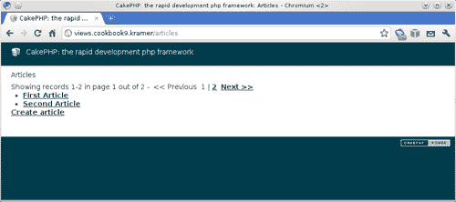
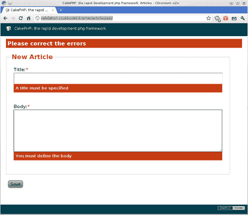
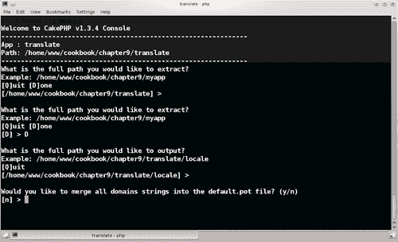
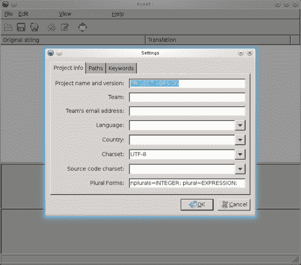
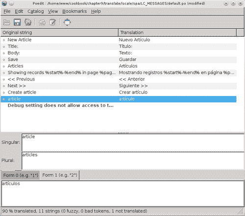
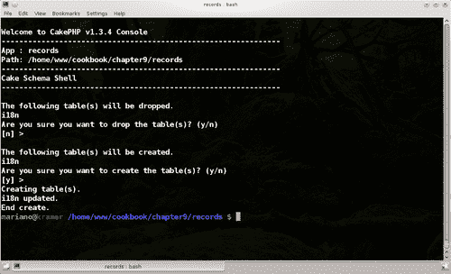
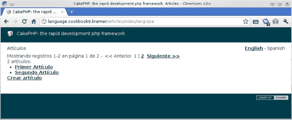

# 第九章。国际化应用程序

在本章中，我们将涵盖：

+   国际化控制器和视图文本

+   国际化模型验证消息

+   翻译包含动态内容的字符串

+   提取和翻译文本

+   使用“翻译行为”翻译数据库记录

+   设置和记住语言

# 简介

本章包含一系列食谱，允许读者国际化他们 CakePHP 应用程序的所有方面，包括静态内容，如视图中的内容，以及动态内容，如数据库记录。

前两个食谱展示了如何允许任何 CakePHP 视图或模型验证消息中的文本准备好翻译。第三个食谱展示了如何翻译更复杂的表达式。第四个食谱展示了如何运行 CakePHP 内置工具提取所有需要翻译的静态内容，然后将该内容翻译成不同的语言。第五个食谱展示了如何翻译数据库记录。最后，最后一个食谱展示了如何允许用户更改当前应用程序的语言。

# 国际化控制器和视图文本

在这个食谱中，我们将学习如何国际化位于我们应用程序视图中的文本，并使该内容准备好翻译。

## 准备工作

为了完成这个食谱，我们需要一些数据来操作。使用以下 SQL 语句创建一个名为 `articles` 的表：

```php
CREATE TABLE `articles`(
`id` INT UNSIGNED AUTO_INCREMENT NOT NULL,
`title` VARCHAR(255) NOT NULL,
`body` TEXT NOT NULL,
`created` DATETIME NOT NULL,
`modified` DATETIME NOT NULL,
PRIMARY KEY(`id`)
);

```

现在用以下语句向此表添加一些示例数据：

```php
INSERT INTO `articles`(`title`, `body`, `created`, `modified`) VALUES
('First Article', 'Body for first article', NOW(), NOW()),
('Second Article', 'Body for second article', NOW(), NOW()),
('Third Article', 'Body for third article', NOW(), NOW());

```

在您的 `app/controllers` 文件夹中创建一个名为 `articles_controller.php` 的控制器文件，内容如下：

```php
<?php
class ArticlesController extends AppController {
public function index() {
$this->paginate['limit'] = 2;
$articles = $this->paginate();
$this->set(compact('articles'));
}
public function add() {
if (!empty($this->data)) {
$this->Article->create();
if ($this->Article->save($this->data)) {
$this->Session->setFlash('Article saved');
$this->redirect(array('action'=>'index'));
} else {
$this->Session->setFlash('Please correct the errors');
}
}
}
public function view($id) {
$article = $this->Article->find('first', array(
'conditions' => array('Article.id' => $id)
));
if (empty($article)) {
$this->cakeError('error404');
}
$this->set(compact('article'));
}
}
?>

```

在您的 `app/models` 文件夹中创建一个名为 `article.php` 的文件，内容如下：

```php
<?php
class Article extends AppModel {
public $validate = array(
'title' => 'notEmpty',
'body' => 'notEmpty'
);
}
?>

```

在您的 `app/views` 文件夹中创建一个名为 `articles` 的文件夹，并在该文件夹内创建一个名为 `index.ctp` 的文件，内容如下：

```php
<h1>Articles</h1>
<p>
<?php echo $this->Paginator->counter(); ?>
&nbsp;-&nbsp;
<?php echo $this->Paginator->prev(); ?>
&nbsp;
<?php echo $this->Paginator->numbers(); ?>
&nbsp;
<?php echo $this->Paginator->next(); ?>
</p>
<p>
<?php echo count($articles) . ' articles: '; ?>
</p>
<ul>
<?php foreach($articles as $article) { ?>
<li><?php echo $this->Html->link(
$article['Article']['title'],
array('action'=>'view', $article['Article']['id'])
); ?></li>
<?php } ?>
</ul>
<p><?php echo $this->Html->link('Create article', array('action'=>'add')); ?></p>

```

在您的 `app/views/articles` 文件夹中创建一个名为 `add.ctp` 的文件，内容如下：

```php
<?php
echo $this->Form->create();
echo $this->Form->inputs(array(
'title',
'body'
));
echo $this->Form->end('Save');
?>

```

在您的 `app/views/articles` 文件夹中创建一个名为 `view.ctp` 的文件，内容如下：

```php
<h1><?php echo $article['Article']['title']; ?></h1>
<?php echo $article['Article']['body']; ?>

```

## 如何做...

1.  编辑位于您的 `app/controllers` 文件夹中的 `articles_controller.php` 文件，并对 `add()` 方法做出以下更改：

    ```php
    public function add() {
    if (!empty($this->data)) {
    $this->Article->create();
    if ($this->Article->save($this->data)) {
    $this->Session->setFlash(__('Article saved', true));
    $this->redirect(array('action'=>'index'));
    } else {
    $this->Session->setFlash(__('Please correct the errors', true));
    }
    }
    }

    ```

1.  编辑位于您的 `app/views/articles` 文件夹中的 `add.ctp` 文件，并做出以下更改：

    ```php
    <?php
    echo $this->Form->create();
    echo $this->Form->inputs(array(
    'legend' => __('New Article', true),
    'title' => array('label' => __('Title:', true)),
    'body' => array('label' => __('Body:', true))
    ));
    echo $this->Form->end(__('Save', true));
    ?>

    ```

1.  最后，编辑位于您的 `app/views/articles` 文件夹中的 `index.ctp` 文件，并做出以下更改：

    ```php
    <h1><?php __('Articles'); ?></h1>
    <p>
    <?php echo $this->Paginator->counter(__('Showing records %start%-%end% in page %page% out of %pages%', true)); ?>
    &nbsp;-&nbsp;
    <?php echo $this->Paginator->prev(__('<< Previous', true)); ?>
    &nbsp;
    <?php echo $this->Paginator->numbers(); ?>
    &nbsp;
    <?php echo $this->Paginator->next(__('Next >>', true)); ?>
    </p>
    <p>
    <?php
    $count = count($articles);
    echo $count . ' ' . __n('article', 'articles', $count, true) . ': ';
    ?>
    </p>
    <ul>
    <?php foreach($articles as $article) { ?>
    <li><?php echo $this->Html->link(
    $article['Article']['title'],
    array('action'=>'view', $article['Article']['id'])
    ); ?></li>
    <?php } ?>
    </ul>
    <p><?php echo $this->Html->link(__('Create article', true), array('action'=>'add')); ?></p>

    ```

如果您现在浏览到 `http://localhost/articles`，您应该会看到一个分页的文章列表，如下面的截图所示：



## 它是如何工作的...

CakePHP 提供了两种主要方法（以及其他方法）来允许开发者指定可翻译的内容：`__()` 和 `__n()`。这些方法的命名可能看起来有点奇怪，但它们在很大程度上受到了 Perl 的 `gettext` 实现的影响，`gettext` 是 GNU 翻译项目的一部分。

`__()` 方法用于翻译静态文本，并接受最多两个参数：

| 参数 | 目的 |
| --- | --- |
| `singular` | 应翻译为当前语言的文本。 |
| `return` | 如果设置为 `true`，则翻译的文本将被返回而不是输出到客户端。默认为 `false`。 |

`__n()` 方法用于翻译可能因某个值是单数还是复数而改变的静态文本，并接受最多四个参数：

| 参数 | 目的 |
| --- | --- |
| `singular` | 如果 `count` 中的给定值为单数时，应使用的文本，并且在使用时将翻译为当前语言。 |
| `plural` | 如果 `count` 中的给定值为复数时，应使用的文本，并且在使用时将翻译为当前语言。 |
| `count` | 一个变量或数值，它包含用于确定是否使用 `singular` 或 `plural` 文本的值。 |
| `return` | 如果设置为 `true`，则翻译的文本将被返回而不是输出到客户端。默认为 `false`。 |

我们首先将 `ArticlesController` 类中的闪存消息更改为使用 `__()` 方法，指定应返回翻译字符串而不是输出到客户端。然后，我们修改 `add.ctp` 视图，以便所有标签和表单标题都可以进行翻译。

类似地，我们在 `index.ctp` 视图中使用翻译函数包裹标题。然后，我们使用 `PaginatorHelper` 类中 `counter()`、`next()` 和 `prev()` 方法的第一个参数来传递适当的分页文本的翻译版本。最后，我们使用 `__n()` 函数根据 `count` 变量的值选择正确的翻译文本。

### 注意

当使用 `__n()` 函数时，您应仅将其第三个参数用作变量。当运行 CakePHP 的提取器外壳时，使用表达式（包括数组索引）可能会产生意外的结果，这在配方 *提取和翻译文本* 中有介绍。

### 域和类别

本配方中使用的翻译函数实际上是 CakePHP 内置 `I18n` 类的 `translate()` 方法的包装器。此方法不仅允许简单的翻译，还允许开发者指定获取翻译文本的域，以及要翻译的文本所属的类别。

域允许您将翻译文本分组到单独的文件中。默认情况下，当未指定域时，CakePHP 假设一个名为 `default` 的域。如果您想指定翻译文本应查找的域，请使用 `__d()` 和 `__dn()` 翻译函数。例如，要在 `my_plugin` 域中查找翻译文本，您将执行以下操作：

```php
$translated = __d('my_plugin', 'Hello World', true);

```

类别允许通过将翻译文件分组到单独的目录中来进一步对翻译文本进行分组，并为翻译文本提供更多的意义。默认情况下，CakePHP 将假设翻译文本属于`LC_MESSAGES`类别。如果你希望更改类别，请使用`__dc()`和`__dcn()`翻译函数，通过设置其倒数第二个参数`return`为所需的类别，这可以是以下定义的任何常量，具有相应的固定值：

+   `LC_ALL: 0`

+   `LC_COLLATE: 1`

+   `LC_CTYPE: 2`

+   `LC_MONETARY: 3`

+   `LC_NUMERIC: 4`

+   `LC_TIME: 5`

+   `LC_MESSAGES: 6`

例如，为了在`default`域和`LC_MESSAGES`类别中查找翻译文本，你会这样做：

```php
$translated = __dc('default', 'Hello World', 6, true);

```

### 注意

当展望使用类别时，始终使用列表中给出的先前给定的类别值，而不是常量名称，因为这个常量是平台相关的。

## 参见

+   *国际化模型验证消息*

+   *提取和翻译文本*

# 国际化模型验证消息

在这个菜谱中，我们将学习不同的方法来实现相同的需求：翻译模型验证消息。

## 准备工作

为了完成这个菜谱，我们需要一个基本的应用骨架来工作。请参阅之前的菜谱。

## 如何操作...

编辑位于你的`app/models`文件夹中的`article.php`文件，并对`validate`属性进行以下更改：

```php
public $validate = array(
'title' => array(
'required' => 'notEmpty'
),
'body' => array(
'required' => 'notEmpty'
)
);

```

有两种方式可以将验证消息翻译成其他语言。第一种方式需要你通过在`app/models/article.php`文件中定义的`Article`类中添加以下实现来覆盖模型构造函数：

```php
public function __construct($id = false, $table = null, $ds = null) {
foreach($this->validate as $field => $rules) {
if (!is_array($rules)) {
$rules = (array) $rules;
}
foreach($rules as $key => $rule) {
if (!is_array($rule)) {
$rules[$key] = compact('rule');
}
}
$this->validate[$field] = $rules;
}
$this->validate = Set::merge($this->validate, array(
'title' => array(
'required' => array('message' => __('A title must be specified', true))
),
'body' => array(
'required' => array('message' => __('You must define the body', true))
)
));
parent::__construct($id, $table, $ds);
}

```

翻译验证消息的另一种方式是将这些消息移动到视图中。而不是在模型构造函数中覆盖并定义消息，编辑你的`app/views/articles/add.ctp`视图文件，并对其进行以下更改：

```php
<?php
echo $this->Form->create();
echo $this->Form->inputs(array(
'title' => array(
'label' => __('Title:', true),
'error' => array(
'required' => __('A title must be specified', true)
)
),
'body' => array(
'label' => __('Body:', true),
'error' => array(
'required' => __('You must define the body', true)
)
)
));
echo $this->Form->end(__('Save', true));
?>

```

这两种方式应该产生相同的结果。如果你现在浏览到`http://localhost/articles/add`并提交表单而不输入任何值，你应该会看到以下截图所示的验证消息：



## 它是如何工作的...

在尝试为每个验证规则提供错误消息之前，我们需要为每个规则命名。我们通过修改`Article`模型来实现这一点，使得每个定义的规则都通过名称索引。在我们的例子中，我们选择`required`作为基于 CakePHP 内置的`notEmpty`规则的验证名称。

我们之前用来指定验证消息的第一种方法，在我们想要在模型中集中所有验证消息时，展示了一种实用的方法。我们覆盖了模型构造函数，以便在这个构造函数内部指定应该翻译的错误消息。我们需要实现构造函数，因为类属性值不能使用除静态赋值之外的任何表达式，所以以下代码块会产生 PHP 语法错误：

```php
public $validate = array(
'title' => array(
'required' => array(
'rule' => 'notEmpty',
'message' => __('Nothing defined!', true) // SYNTAX ERROR
)
)
);

```

在此构造函数实现中，我们首先确保`validate`属性是一个按字段名称索引的规则数组，并且每个规则集本身也是一个按名称索引的数组，其值是另一个数组，其中至少定义了`rule`设置。

一旦我们确认`validate`属性具有正确的格式，我们就使用`__()`翻译函数合并每个规则的验证消息。最后，我们调用父构造函数以确保模型正确构建。

本食谱中描述的第二种方法通过`FormHelper`类`input()`方法的`error`设置将声明每个验证错误消息的责任转移到视图。此设置设置为按验证名称索引的数组，其值设置为在相应的验证失败时显示的错误消息。

## 参见

+   *提取和翻译文本*

# 翻译包含动态内容的字符串

在本食谱中，我们将学习如何允许由非静态部分组成的字符串（如变量值）可翻译。

## 准备工作

为了完成这个食谱，我们需要一个基本的应用程序骨架来工作。完成整个食谱*国际化控制器和视图文本*。

## 如何操作...

1.  编辑位于您的`app/controllers`文件夹中的文件`articles_controller.php`并对`add()`方法做出以下更改：

    ```php
    public function add() {
    if (!empty($this->data)) {
    $this->Article->create();
    if ($this->Article->save($this->data)) {
    $this->Session->setFlash(
    sprintf(__('Article "%s" saved', true), $this->Article->field('title'))
    );
    $this->redirect(array('action'=>'index'));
    } else {
    $this->Session->setFlash('Please correct the errors');
    }
    }
    }

    ```

1.  编辑位于您的`app/views/articles`文件夹中的视图文件`index.ctp`并做出以下更改：

    ```php
    <h1><?php __('Articles'); ?></h1>
    <p>
    <?php echo $this->Paginator->counter(__('Showing records %start%-%end% in page %page% out of %pages%', true)); ?>
    &nbsp;-&nbsp;
    <?php echo $this->Paginator->prev(__('<< Previous', true)); ?>
    &nbsp;
    <?php echo $this->Paginator->numbers(); ?>
    &nbsp;
    <?php echo $this->Paginator->next(__('Next >>', true)); ?>
    </p>
    <p>
    <?php
    $count = count($articles);
    printf(__n('%d article', '%d articles', $count, true), $count);
    ?>
    </p>
    <ul>
    <?php foreach($articles as $article) { ?>
    <li><?php echo $this->Html->link(
    $article['Article']['title'],
    array('action'=>'view', $article['Article']['id'])
    ); ?></li>
    <?php } ?>
    </ul>
    <p><?php echo $this->Html->link(__('Create article', true), array('action'=>'add')); ?></p>

    ```

### 它是如何工作的...

当期待包含动态信息，如变量的值，或者在这种情况下，数据库中表字段的值时，人们可能会简单地诱惑将变量附加到发送给翻译函数的字符串中：

```php
$translated = __('Hello ' . $name, true); // This is wrong

```

这不是一个有效的表达式，因为本食谱中显示的 CakePHP 提取器期望翻译函数的参数仅为静态字符串，并且其他语言可能需要重新排序句子。因此，我们需要使用某种字符串插值方法，所以我们选择了 PHP 提供的最常见的方法：`printf()`和`sprintf()`函数。

这两个函数接受相同数量和类型的参数。第一个参数是必需的，用于指定用于插值的字符串，而任何后续参数都用于生成最终的字符串。`printf()`和`sprintf()`之间的唯一区别是，前者将输出结果字符串，而后者仅返回它。

我们首先更改`ArticlesController`类在创建文章时给出的成功消息。我们使用`sprintf()`，因为我们需要将其发送到`Session`组件的`setFlash()`方法。在这种情况下，我们使用表达式`%s`来插值新创建的文章的`title`字段的值。

类似地，我们最新的更改使用 `%d` 来插值变量 `count` 的十进制值，并使用 `printf()` 输出结果字符串。

#### 重新排序和重用插值参数

当使用 `%s` 或 `%d` 等表达式来告诉 `printf()` 和 `sprintf()` 如何放置参数的值时，我们在值定位方面没有灵活性，也没有重用值的实际方法，因为每个这样的表达式都需要匹配一个特定的参数。让我们假设以下表达式：

```php
printf('Your name is %s and your country is %s', $name, $country);

```

第一个 `%s` 表达式被替换为 `name` 变量的值，而最后一个 `%s` 表达式被替换为 `country` 变量的值。如果我们想在不改变传递给 `printf()` 的参数顺序的情况下改变这些值在字符串中的顺序，怎么办？

我们可以通过引用参数编号（`name` 是参数编号 `1`，`country` 参数编号 `2`）来指定插值表达式使用的参数：

```php
printf('You are from %2$s and your name is %1$s', $name, $country);

```

这也允许我们重用参数，而无需将其作为额外参数添加到 `printf()` 中：

```php
printf('You are from %2$s and your name is %1$s . Welcome %1$s!', $name, $country);

```

### 参见

+   *提取和翻译文本*

## 提取和翻译文本

在本食谱中，我们将学习如何从我们的 CakePHP 应用程序中提取所有需要翻译的字符串，然后使用免费软件执行实际的翻译。

### 准备工作

为了完成这个食谱，我们需要一个基本的应用程序骨架来工作。完成整个食谱 *国际化控制器和视图文本*。

我们还需要在我们的系统中安装 **Poedit**。访问 [`www.poedit.net/download.php`](http://www.poedit.net/download.php) 并下载适合你的操作系统的文件。

### 如何做...

从命令行，并在你的 `app/` 目录中，执行以下命令：

如果你在一个 GNU Linux / Mac / Unix 系统上：

```php
../cake/console/cake i18n extract

```

如果你在 Microsoft Windows 上：

```php
..\cake\console\cake.bat i18n extract

```

你应该接受默认选项，如下面的截图所示：



在回答最后一个问题后，shell 应该遍历你的应用程序文件，并在你的 `app/locale` 文件夹中生成一个名为 `default.pot` 的翻译模板。

打开 Poedit，然后点击菜单 **文件**，选择 **从 POT 文件新建目录**。你现在应该看到一个打开文件对话框。浏览到你的 `app/locale` 文件夹，选择 `default.pot` 文件，然后点击 **打开** 按钮。应该出现一个设置窗口，如下面的截图所示：



在 **设置** 窗口中，输入所需的项目名称和项目信息。在 **复数形式** 字段中，你应该输入一个表达式，告诉 Poedit 如何识别复数翻译。对于大多数语言，如英语、西班牙语、德语和葡萄牙语，你应该输入以下表达式：

```php
nplurals=2; plural=(n != 1);

```

### 注意

关于复数形式以及根据你翻译到的语言应提供哪个值，更多信息可在[`drupal.org/node/17564`](http://drupal.org/node/17564)找到。

一旦你输入了所有所需的详细信息，点击**确定**按钮。现在你将被询问要存储翻译文件的位置。创建一个名为`spa`的文件夹，并将其放置在`app/locale`文件夹中。在`spa`文件夹内，创建一个名为`LC_MESSAGES`的文件夹。然后，在 Poedit 的对话框中，选择文件夹`app/locale/spa/LC_MESSAGES`，点击按钮**保存**，不要更改文件名，文件名应该是`default.po`。

Poedit 现在将显示所有原始字符串，并允许你通过在底部文本区域输入所需的翻译来翻译每个字符串。在你输入翻译后，Poedit 可能看起来像以下截图：



点击菜单**文件**，然后选择**保存**以保存翻译后的文件。现在你的`app/locale/spa/LC_MESSAGES`文件夹中应该有两个文件：`default.po`和`default.mo`。

### 它是如何工作的...

CakePHP 的提取器首先会询问要处理哪些路径。当所有路径都已指定后，它将递归地浏览其目录并查找 PHP 和视图文件中任何翻译函数（`__()`、`__n()`、`__d()`、`__dn()`、`__dc()`、`__dcn()`和`__c()`）的使用。对于每个找到的使用情况，它将提取需要翻译的字符串（在调用`__()`和`__c()`时的第一个参数；在调用`__d()`和`__dc()`时的第二个参数；在调用`__n()`时的第一个和第二个参数；以及在调用`__dn()`和`__dcn()`时的第二个和第三个参数）。

### 注意

在提取器查找的参数上，只应使用静态字符串，避免任何 PHP 表达式。如果你想了解如何在需要翻译的字符串中插入变量值，请参阅食谱*使用动态内容翻译字符串*。

一旦 CakePHP 的提取器获取了所有需要翻译的字符串，它将创建适当的翻译模板文件。如果你使用了指定域的任何翻译函数（`__d()`、`__dn()`、`__dc()`和`__dcn()`），你可以选择将所有字符串合并到一个模板文件中，或者让每个域创建一个单独的模板文件。模板文件具有`pot`扩展名，并使用域名作为其文件名（`default.pot`是默认模板文件）。

如果你用文本编辑器打开`default.pot`，你会注意到它从一个包含几个设置的标题开始，然后为每个需要翻译的字符串包含两行：一行定义`msgid`（要翻译的字符串），另一行对于`msgstr`（翻译的字符串）为空字符串。

我们随后使用 Poedit 打开这个模板文件，翻译字符串，并将其保存到适当的目录（`app/locale/spa/LC_MESSAGES`），在那里 Poedit 将创建两个文件：`default.po` 和 `default.pot`。如果你用文本编辑器打开 `default.po`，你会注意到它几乎与模板文件完全相同，除了头部设置已更改为我们定义的，而 `msgid` 行则填充了我们的翻译。`default.mo` 文件是 `default.po` 文件的二进制版本，也是由 Poedit 生成的，并由 CakePHP 用于加速翻译文件的处理。

## 使用 Translate 行为翻译数据库记录

在这个菜谱中，我们将学习如何通过 CakePHP 的 `Translate` 行为允许翻译数据库记录。

### 准备工作

为了完成这个菜谱，我们需要一个基本的应用程序骨架来工作。完成整个菜谱 *国际化控制器和视图文本*。

### 如何操作...

在命令行中，并在你的 `app/` 目录下，执行以下命令：

如果你使用的是 GNU Linux / Mac / Unix 系统：

```php
../cake/console/cake i18n initdb

```

如果你使用的是 Microsoft Windows：

```php
..\cake\console\cake.bat i18n initdb

```

接受所有默认答案。shell 应该通过创建一个名为 `i18n` 的表来完成，如下截图所示：



编辑你的 `app/models/article.php` 文件，并添加以下属性：

```php
<?php
class Article extends AppModel {
public $validate = array(
'title' => 'notEmpty',
'body' => 'notEmpty'
);
public $actsAs = array(
'Translate' => array('title', 'body')
);
}
?>

```

我们现在需要将 `title` 和 `body` 字段的值从 `articles` 表移动到 `i18n` 表中，然后从 `articles` 表中删除这些字段。执行以下 SQL 语句：

```php
INSERT INTO `i18n`(`locale`, `model`, `foreign_key`, `field`, `content`)
SELECT 'eng', 'Article', `articles`.`id`, 'title', `articles`.`title`
FROM `articles`;
INSERT INTO `i18n`(`locale`, `model`, `foreign_key`, `field`, `content`)
SELECT 'eng', 'Article', `articles`.`id`, 'body', `articles`.`body`
FROM `articles`;
ALTER TABLE `articles`
DROP COLUMN `title`,
DROP COLUMN `body`;

```

通过执行以下 SQL 语句添加我们文章的西班牙语翻译：

```php
INSERT INTO `i18n`(`locale`, `model`, `foreign_key`, `field`, `content`) VALUES
('spa', 'Article', 1, 'title', 'Primer Artículo'),
('spa', 'Article', 1, 'body', 'Cuerpo para el primer Artículo'),
('spa', 'Article', 2, 'title', 'Segundo Artículo'),
('spa', 'Article', 2, 'body', 'Cuerpo para el segundo Artículo'),
('spa', 'Article', 3, 'title', 'Tercer Artículo'),
('spa', 'Article', 3, 'body', 'Cuerpo para el tercer Artículo');

```

最后，编辑你的 `app/config/bootstrap.php` 文件，并在 PHP 结束标签上方添加以下内容：

```php
Configure::write('Config.language', 'eng');

```

如果你现在浏览到 `http://localhost/articles`，你应该看到与第一个截图（菜谱 *国际化控制器和视图文本*）中显示的相同的文章列表。

### 它是如何工作的...

我们首先使用 shell 创建 `Translate` 行为所需的表。默认情况下，此表名为 `i18n`，包含（除了其主键外）以下字段：

| 字段 | 目的 |
| --- | --- |
| `locale` | 正在翻译的特定记录字段所翻译的区域设置（语言）。 |
| `model` | 包含正在翻译的记录的模型。 |
| `foreign_key` | 在 `model` 中标识正在翻译的记录的 ID（主键）。 |
| `field` | 正在翻译的字段。 |
| `content` | 记录字段的翻译值。 |

我们随后将 `Translate` 行为添加到我们的 `Article` 模型中，并将其设置为翻译 `title` 和 `body` 字段。这意味着这些字段将不再是 `articles` 表的一部分，而是存储在 `i18n` 表中。使用 `i18n` 表中的 `model` 和 `foreign_key` 值，`Translate` 行为将在获取到匹配应用程序语言的 `Article` 记录时，为这些字段获取适当的值。

我们将 `title` 和 `body` 字段的值复制到 `i18n` 表中，然后从 `articles` 表中删除这些字段。在我们的 `ArticlesController` 类中使用的 `find()` 调用不需要任何更改。此外，文章的创建将继续透明地工作，因为 `Translate` 行为将在通过 `Article` 模型保存记录时使用当前语言。

最后一步是告诉 CakePHP 默认应用程序语言，通过设置 `Config.language` 配置设置。如果省略此步骤，CakePHP 将通过查看客户端浏览器发送的 `HTTP_ACCEPT_LANGUAGE` 标头来获取当前语言。

#### 使用单独的翻译表

任何使用 `Translate` 行为的模型默认将使用此 `i18n` 表来存储其每个翻译字段的翻译。如果我们有大量记录或大量翻译模型，这可能会很麻烦。幸运的是，`Translate` 行为允许我们配置不同的翻译模型。

例如，假设我们想要将所有文章翻译存储在一个名为 `article_translations` 的表中。创建该表，然后通过以下 SQL 语句从 `i18n` 表中复制翻译记录：

```php
CREATE TABLE `article_translations`(
`id` INT UNSIGNED AUTO_INCREMENT NOT NULL,
`model` VARCHAR(255) NOT NULL,
`foreign_key` INT UNSIGNED NOT NULL,
`locale` VARCHAR(6) NOT NULL,
`field` VARCHAR(255) NOT NULL,
`content` TEXT default NULL,
KEY `model__foreign_key`(`model`, `foreign_key`),
KEY `model__foreign_key__locale`(`model`, `foreign_key`, `locale`),
PRIMARY KEY(`id`)
);
INSERT INTO `article_translations`
SELECT `id`, `model`, `foreign_key`, `locale`, `field`, `content`
FROM `i18n`;

```

创建一个名为 `article_translation.php` 的文件，并将其放置在您的 `app/models` 文件夹中，内容如下：

```php
<?php
class ArticleTranslation extends AppModel {
public $displayField = 'field';
}
?>

```

翻译模型中的 `displayField` 属性告诉 `Translate` 行为在表中哪个字段持有正在翻译的字段名称。

最后，编辑您的 `app/models/article.php` 文件，并做出以下更改：

```php
<?php
class Article extends AppModel {
public $validate = array(
'title' => 'notEmpty',
'body' => 'notEmpty'
);
public $actsAs = array(
'Translate' => array('title', 'body')
);
public $translateModel = 'ArticleTranslation';
}
?>

```

### 参见

+   *设置和记住语言*

# 设置和记住语言

在这个配方中，我们将学习如何允许用户更改当前语言，并通过使用 cookies 记住他们的语言选择。

## 准备工作

要完成这个配方，我们需要一个完全国际化的应用程序来工作。完成整个配方 *使用 Translate 行为翻译数据库记录*。

我们还需要一个可以修改的应用程序布局。将 `cake/libs/view/layouts` 中的 `default.ctp` 文件复制到您的 `app/views/layouts` 目录。

## 如何做...

1.  编辑您的 `app/config/bootstrap.php` 文件，并在 PHP 结束标签上方添加以下内容：

    ```php
    Configure::write('Config.languages', array(
    'eng' => __('English', true),
    'spa' => __('Spanish', true)
    ));

    ```

1.  编辑位于您的 `app/views/layouts` 文件夹中的 `default.ctp` 布局文件，并在您希望包含语言列表的位置（例如在调用 `Session` 组件的 `flash()` 方法之前）添加以下内容：

    ```php
    <div style="float: right">
    <?php
    $links = array();
    $currentLanguage = Configure::read('Config.language');
    foreach(Configure::read('Config.languages') as $code => $language) {
    if ($code == $currentLanguage) {
    $links[] = $language;
    } else {
    $links[] = $this->Html->link($language, array('lang' => $code));
    }
    }
    echo implode(' - ', $links);
    ?>
    </div>

    ```

    ### 注意

    之前使用的 `Config.language` 设置是在通过 *使用 Translate 行为翻译数据库记录* 时在 `app/config/bootstrap.php` 文件中指定的。

1.  创建一个名为 `app_controller.php` 的文件，并将其放置在您的 `app/` 文件夹中，内容如下：

    ```php
    <?php
    class AppController extends Controller {
    public $components = array('Language', 'Session');
    }
    ?>

    ```

1.  最后，创建一个名为 `language.php` 的文件，并将其放置在 `app/controller/components` 文件夹中，内容如下：

    ```php
    <?php
    class LanguageComponent extends Object {
    public $controller = null;
    public $components = array('Cookie');
    public $languages = array();
    public function initialize($controller) {
    $this->controller = $controller;
    if (empty($languages)) {
    $this->languages = Configure::read('Config.languages');
    }
    $this->set();
    }
    public function set($language = null) {
    $saveCookie = false;
    if (empty($language) && isset($this->controller)) {
    if (!empty($this->controller->params['named']['lang'])) {
    $language = $this->controller->params['named']['lang'];
    } elseif (!empty($this->controller->params['url']['lang'])) {
    $language = $this->controller->params['url']['lang'];
    }
    if (!empty($language)) {
    $saveCookie = true;
    }
    }
    if (empty($language)) {
    $language = $this->Cookie->read('language');
    if (empty($language)) {
    $saveCookie = true;
    }
    }
    if (empty($language) && !array_key_exists($language, $this->languages)) {
    $language = Configure::read('Config.language');
    }
    Configure::write('Config.language', $language);
    if ($saveCookie) {
    $this->Cookie->write('language', $language, false, '1 year');
    }
    }
    }
    ?>

    ```

如果你现在浏览到 `http://localhost/articles`，你应该能看到文章列表，在右上角，有一个切换当前语言到**西班牙语**的链接。点击它应该显示文章的西班牙语版本，并将所有可用的文本更改为所选语言，如下面的截图所示：



## 它是如何工作的...

我们首先定义所有可用的语言，这样我们就可以轻松地包含一个切换当前语言的链接。我们使用这个列表来构建链接列表，并将其放置在 `default.ctp` 布局文件中，只允许点击除当前应用程序语言之外的语言。

当前语言在 CakePHP 的配置变量 `Config.language` 中设置，该变量在配置文件 `bootstrap.php` 中被设置为默认语言（在我们的例子中是 `eng`）。当需要更改语言时，应在第一次使用翻译函数之前更改此设置。

为了保持控制器整洁，我们决定创建一个名为 `Language` 的组件来处理语言变更。这个组件将寻找一个名为 `lang` 的命名参数或 URL 参数。如果没有指定语言，组件将通过查看 cookie 来寻找当前语言。

如果没有设置 cookie，或者请求更改语言，组件将把当前语言保存在名为 `language` 的 cookie 中，该 cookie 的有效期为一年。
