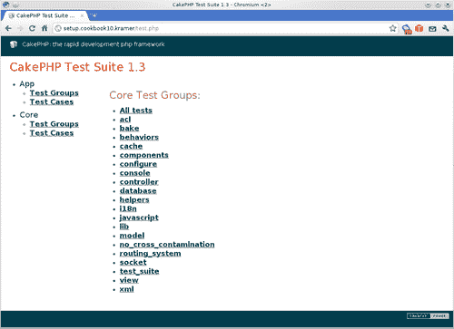
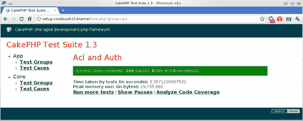
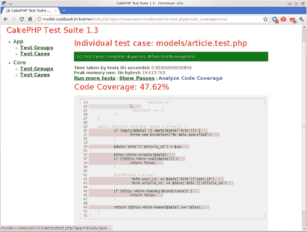
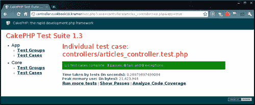
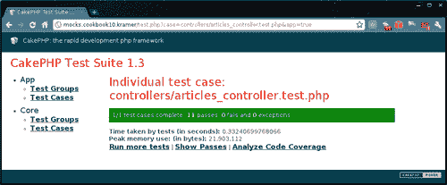
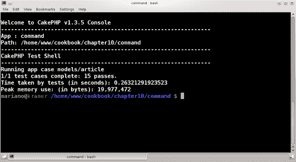

# 第十章。测试

在本章中，我们将涵盖以下内容：

+   设置测试框架

+   创建测试数据（ fixtures）并测试模型方法

+   测试控制器操作及其视图

+   使用模拟来测试控制器

+   从命令行运行测试

# 简介

本章涵盖了应用编程中最有趣的一个领域：通过 CakePHP 内置工具进行单元测试，它提供了一个完整且强大的单元测试框架。

第一个菜谱展示了如何设置测试框架，以便我们可以创建自己的测试用例。第二个菜谱展示了如何创建测试数据（ fixtures）并使用这些数据来测试模型方法。第三和第四个菜谱展示了如何测试控制器操作，以及如何测试我们的视图是否显示了我们期望的内容。最后一个菜谱展示了如何以非普通方式运行测试。

# 设置测试框架

在这个菜谱中，我们将学习如何准备我们的 CakePHP 应用程序，使其包含创建我们自己的单元测试所需的所有元素，为本章其余菜谱的设置打下基础。

## 准备工作

为了完成本章包含的菜谱，我们需要一些数据来工作。通过发出以下 SQL 语句创建以下表：

```php
CREATE TABLE `articles`(
`id`INT UNSIGNED NOT NULL AUTO_INCREMENT,
`title` VARCHAR(255) NOT NULL,
`body` TEXT NOT NULL,
PRIMARY KEY(`id`)
);
CREATE TABLE `users`(
`id` INT UNSIGNED NOT NULL AUTO_INCREMENT,
`username` VARCHAR(255) NOT NULL,
PRIMARY KEY(`id`)
);
CREATE TABLE `votes`(
`id` INT UNSIGNED NOT NULL AUTO_INCREMENT,
`article_id` INT NOT NULL,
`user_id` INT NOT NULL,
`vote` INT UNSIGNED NOT NULL,
PRIMARY KEY(`id`),
FOREIGN KEY `votes__articles`(`article_id`) REFERENCES `articles`(`id`),
FOREIGN KEY `votes__users`(`user_id`) REFERENCES `users`(`id`)
);

```

在名为 `articles_controller.php` 的文件中创建一个控制器，并将其放置在您的 `app/controllers` 文件夹中，内容如下：

```php
<?php
class ArticlesController extends AppController {
public function vote($id) {
if (!empty($this->data)) {
if ($this->Article->vote($id, $this->data)) {
$this->Session->setFlash('Vote placed');
return $this->redirect(array('action'=>'index'));
} else {
$this->Session->setFlash('Please correct the errors');
}
}
}
public function view($id) {
$article = $this->Article->get($id);
if (empty($article)) {
$this->Session->setFlash('Article not found');
return $this->redirect(array('action' => 'index'));
}
$this->set(compact('article'));
}
}
?>

```

创建一个名为 `article.php` 的文件，并将其放置在您的 `app/models` 文件夹中，内容如下：

```php
<?php
class Article extends AppModel
{
public $hasMany = array('Vote');
public function get($id)
{
return $this->find('first', array( 'fields' => array( 'Article.*', 'AVG(Vote.vote) AS vote' ),
'joins' => array(
array(
'type' => 'LEFT',
'table' => $this->Vote->getDataSource()- >fullTableName($this->Vote->table),
'alias' => 'Vote',
'conditions' => array(
'Vote.article_id = Article.id'
)
)
),
'conditions' => array('Article.id' => $id),
'group' => array(
'Article.id'
),
'recursive' => -1
));
}
public function vote($id, $data = array()) {
if (empty($data) || empty($data['Vote'])) {
throw new Exception("No data specified");
}
$data['Vote']['article_id'] = $id;
$this->Vote->create($data);
if (!$this->Vote->validates()) {
return false;
}
$conditions = array(
'Vote.user_id' => $data['Vote']['user_id'],
'Vote.article_id' => $data['Vote']['article_id']
);
if ($this->Vote->hasAny($conditions)) {
return false;
}
return ($this->Vote->save($data) !== false);
}
}
?>

```

创建一个名为 `vote.php` 的文件，并将其放置在您的 `app/models` 文件夹中，内容如下：

```php
<?php
class Vote extends AppModel {
public $belongsTo = array('Article', 'User');
public $validate = array(
'article_id' => array('required' => true, 'rule' => 'notEmpty'),
'user_id' => array('required' => true, 'rule' => 'notEmpty'),
'vote' => array(
'required' => array('required' => true, 'rule' => 'notEmpty'),
'range' => array(
'rule' => array('range', 0, 6),
'allowEmpty' => true
)
)
);
}
?>

```

创建一个名为 `articles` 的文件夹，并将其放置在您的 `app/views` 文件夹中。创建一个名为 `view.ctp` 的文件，并将其放置在您的 `app/views/articles` 文件夹中，内容如下：

```php
<h1><?php echo $article['Article']['title']; ?></h1>
Vote: <span id="vote"><?php echo number_format($article[0]['vote'], 1); ?></span>
<p><?php echo $article['Article']['body']; ?></p>

```

## 如何操作...

1.  从 [`sourceforge.net/projects/simpletest/files/simpletest/simpletest_1.0.1/simpletest_1.0.1.tar.gz/download`](http://https://sourceforge.net/projects/simpletest/files/simpletest/simpletest_1.0.1/simpletest_1.0.1.tar.gz/download) 下载 1.0.1 SimpleTest 版本，并将其解压缩到您的 `app/vendors` 文件夹中。现在您应该在 `app/vendors` 中有一个名为 `simpletest` 的文件夹。

1.  如果您现在浏览到 `http://localhost/test.php`，您应该看到 CakePHP 中可用的测试组列表，如图所示：

1.  点击任何这些组都会执行相应的单元测试。例如，如果您点击 **acl** 测试组，您应该看到一个绿色的条形表示所选组的所有测试都通过了，如图所示：

## 它是如何工作的...

CakePHP 使用 SimpleTest 库作为其单元测试框架的核心。除非我们在应用程序中安装了 SimpleTest，否则我们将无法运行任何单元测试。安装库就像下载适当的版本并将其内容提取到我们的 `app/vendors` 文件夹中一样简单。

框架包括一组广泛的单元测试，几乎涵盖了核心中实现的每个功能。这些单元测试允许开发者报告针对核心功能的错误，解决这些问题，并确保这些错误不会在未来版本中再次出现。

# 创建固定装置和测试模型方法

在这个配方中，我们将学习如何创建测试数据，我们可以使用这些数据来测试我们的应用程序而不更改真实数据，以及如何创建我们自己的单元测试来覆盖模型功能。

## 准备工作

为了完成这个配方，我们需要一个基本的应用程序骨架来工作，并且需要安装 SimpleTest 库。完成整个配方，*设置测试框架*。

## 如何做...

1.  创建一个名为`article_fixture.php`的文件，并将其放置在您的`app/tests/fixtures`文件夹中，内容如下：

    ```php
    <?php
    class ArticleFixture extends CakeTestFixture {
    public $import = 'Article';
    public $records = array(
    array(
    'id' => 1,
    'title' => 'Article 1',
    'body' => 'Body for Article 1'
    ),
    array(
    'id' => 2,
    'title' => 'Article 2',
    'body' => 'Body for Article 2'
    )
    );
    }
    ?>

    ```

1.  创建一个名为`user_fixture.php`的文件，并将其放置在您的`app/tests/fixtures`文件夹中，内容如下：

    ```php
    <?php
    class UserFixture extends CakeTestFixture {
    public $table = 'users';
    public $import = array('table' => 'users');
    public $records = array(
    array(
    'id' => 1,
    'username' => 'john.doe'
    ),
    array(
    'id' => 2,
    'username' => 'jane.doe'
    ),
    array(
    'id' => 3,
    'username' => 'mark.doe'
    )
    );
    }
    ?>

    ```

1.  创建一个名为`vote_fixture.php`的文件，并将其放置在您的`app/tests/fixtures`文件夹中，内容如下：

    ```php
    <?php
    class VoteFixture extends CakeTestFixture {
    public $import = 'Vote';
    public $records = array(
    array(
    'article_id' => 1,
    'user_id' => 1,
    'vote' => 4
    ),
    array(
    'article_id' => 1,
    'user_id' => 3,
    'vote' => 5
    ),
    array(
    'article_id' => 1,
    'user_id' => 2,
    'vote' => 4
    ),
    array(
    'article_id' => 2,
    'user_id' => 2,
    'vote' => 3
    ),
    array(
    'article_id' => 2,
    'user_id' => 3,
    'vote' => 4
    )
    );
    }
    ?>

    ```

1.  创建一个名为`article.test.php`的文件，并将其放置在您的`app/tests/cases/models`文件夹中，内容如下：

    ```php
    <?php
    class ArticleTestCase extends CakeTestCase {
    public $fixtures = array('app.article', 'app.user', 'app.vote');
    public function startTest($method) {
    parent::startTest($method);
    $this->Article = ClassRegistry::init('Article');
    }
    public function endTest($method) {
    parent::endTest($method);
    ClassRegistry::flush();
    }
    public function testGet() {
    $article = $this->Article->get(1);
    $this->assertTrue(!empty($article) && !empty($article['Article']));
    $this->assertTrue(!empty($article[0]) && !empty($article[0]['vote']));
    $this->assertEqual(number_format($article[0]['vote'], 1), 4.3);
    $article = $this->Article->get(2);
    $this->assertTrue(!empty($article) && !empty($article['Article']));
    $this->assertTrue(!empty($article[0]) && !empty($article[0]['vote']));
    $this->assertEqual(number_format($article[0]['vote'], 1), 3.5);
    }
    public function testVote() {
    $result = $this->Article->vote(2, array('Vote' => array(
    'user_id' => 2
    )));
    $this->assertFalse($result);
    $this->assertTrue(!empty($this->Article->Vote->validationErrors['vote']));
    $result = $this->Article->vote(2, array('Vote' => array(
    'user_id' => 2,
    'vote' => 6
    )));
    $this->assertFalse($result);
    $this->assertEqual($this->Article->Vote->validationErrors['vote'], 'range');
    $result = $this->Article->vote(2, array('Vote' => array(
    'user_id' => 2,
    'vote' => 1
    )));
    $this->assertFalse($result);
    $result = $this->Article->vote(2, array('Vote' => array(
    $result = $this->Article->vote(2, array('Vote' => array(
    'user_id' => 1,
    'vote' => 1
    )));
    $this->assertTrue($result);
    $article = $this->Article->get(2);
    $this->assertTrue(!empty($article[0]) && !empty($article[0]['vote']));
    $this->assertEqual(number_format($article[0]['vote'], 1), 2.7);
    $this->expectException();
    $this->Article->vote(2);
    }
    }
    ?>

    ```

### 它是如何工作的...

当测试模型方法时，了解测试期间使用的数据非常重要。即使完全有可能使用真实应用程序数据来测试模型，通常更安全（因此推荐）是指定用于测试的数据。这样，对真实数据的任何修改都不应影响我们的测试，因此运行这些测试不应影响真实数据。

为了这个目的，CakePHP 提供了固定装置的概念，这不过是一些定义用于测试模型的表结构和数据的 PHP 类。这些固定装置应该与它们提供数据的模型同名，应该扩展基本类`CakeTestFixture`，并且应该以`Fixture`结尾。文件名应该是类名的下划线版本，并且应该放置在`app/tests/fixtures`目录中。一个固定装置可以定义以下属性：

+   `name`: 固定装置的名称，用于确定此固定装置创建的表名称。如果可以通过其他方式确定表名称，例如通过设置`table`属性，或者从模型导入结构，那么这个属性是可选的。

+   `table`: 这个固定装置创建的表。如果固定装置从现有模型导入结构，或者指定了`name`属性，那么这个属性是可选的。

+   `import`: 这个属性是可选的，允许从现有源导入结构，和/或数据。如果这个属性被设置为字符串，那么它是一个模型名称，从中导入结构（不是记录。）否则，它应该是一个包含以下设置的数组：

    +   `records`: 一个可选的布尔设置。如果设置为 `true`，则将从指定的来源导入所有记录。默认为 `false`。

    +   `model`: 从哪里导入结构，以及/或数据。如果指定，此模型必须存在。

    +   `table`: 从哪里导入结构，以及/或数据。如果指定了 `model` 设置，则此设置被忽略，因此是可选的。

    +   `fields`: 如果未定义 `import`，则此属性是必需的。它应该是一个数组，其中每个键是字段名，每个值是字段的定义，包含如下设置：`type, length, null, default` 和 `key`。有关这些设置的更多信息，请参阅 [`book.cakephp.org/view/1203/Creating-fixtures`](http://book.cakephp.org/view/1203/Creating-fixtures)。

    +   `records`: 记录的数组，每个记录本身也是一个数组，其中键是字段名，值是相应的值。

我们首先创建以下 fixtures：

+   `ArticleFixture`: 它从 `Article` 模型导入其结构，并定义了两个记录。

+   `UserFixture`: 它从 `users` 表导入其结构，并定义了三个记录（注意我们是如何从表而不是从模型导入的，因为我们没有创建 `User` 模型）。

+   `VoteFixture`: 它从 `Vote` 模型导入其结构，并定义了五个记录。

在创建完 fixtures 后，我们继续构建测试用例。测试用例是一个没有命名限制的 PHP 类，其中包含单元测试。它扩展自 `CakeTestCase`，并保存为以 `.test.php` 为后缀的文件，并放置在 `app/tests/cases` 文件夹的适当子目录中。单元测试是测试用例类的一个方法，但只有以单词 `test` 开头的方法被视为单元测试，因此当执行测试用例时才会运行。

我们的测试用例命名为 `ArticleTestCase`，并定义了 `fixtures` 属性以指定测试用例使用的 fixtures。这些名称应与 fixture 文件名匹配，但不包括 `_fixture.php` 后缀。通过这些 fixtures，我们为整个测试用例中使用的模型提供测试数据。

在任何情况下，当你从单元测试实例化模型，并且除非你通过发送到 `ClassRegistry::init()` 方法的设置指定其他设置，否则 CakePHP 将自动将模型的数据库配置设置为 `test_suite`，这不仅适用于直接实例化的模型，还适用于由于绑定定义而实例化的任何模型。

`test_suite` 数据库配置，除非开发人员明确更改，将使用在 `default` 配置中定义的相同数据库配置，并将 `test_suite_` 设置为表前缀以避免覆盖现有表。这意味着任何实例化的模型及其绑定（包括绑定绑定等）都应该有一个匹配的固定值，并且这些固定值应该添加到测试用例中。如果您想避免为不打算测试的模型定义固定值，请参阅本食谱中的 *扩展模型以避免测试不必要的绑定* 部分。

`ArticleTestCase` 中的前两种方法是父类 `CakeTestCase` 提供的回调的实现。有四个回调可用：

+   `startCase()`：在第一个单元测试方法运行前执行。此方法在每个测试用例中执行一次。

+   `endCase()`：在最后一个单元测试方法运行后执行。此方法在每个测试用例中执行一次。

+   `startTest()`：在每个单元测试方法运行前执行。它接收一个参数，即即将执行的测试方法名称。

+   `endTest()`：在每个单元测试方法运行后执行。它接收一个参数，即测试方法名称。

我们使用 `startTest()` 回调来实例化我们打算测试的模型（在这个例子中是 Article），并使用 `endTest()` 回调来清理注册表，这一步对于这个特定的测试用例不是必需的，但在许多其他场景中很有用。

我们定义了两个单元测试方法：`testGet()` 和 `testVote()`。第一个方法旨在为 `Article::get()` 方法提供测试，而后者则通过 `Article::vote()` 方法测试投票的创建。在这些测试中，我们向正在测试的模型方法发出不同的调用，然后使用一些测试用例断言方法来评估这些调用：

+   `assertTrue()`：断言提供的参数评估为 `true`。

+   `assertFalse()`：断言提供的参数评估为 `false`。

+   `assertEqual()`：断言第一个参数等于第二个参数。

+   `expectException()`：期望下一次调用会产生异常。由于异常的处理方式，这个断言应该在测试方法中最后进行，因为任何在单元测试方法中抛出异常后应该执行的代码都将被忽略。避免这种限制的另一种方法是使用 try-catch 块，并手动调用 `fail()` 或 `pass()` 方法作为结果。

还有其他在其他场景中很有用的断言方法，例如：

+   `assertIsA()`：断言第一个参数是第二个参数中提供的类型的对象。

+   `assertNull()`：断言提供的参数是 `null`。

+   `assertPattern()`：断言第二个参数与第一个参数中定义的正则表达式模式匹配。

+   `assertTags()`: 断言第一个参数与第二个参数提供的 HTML 标签匹配，不考虑标签属性的顺序。请参阅*测试视图*配方以了解此断言方法的示例用法。

### 更多内容...

这个配方向我们展示了如何轻松地创建固定装置。然而，当我们的应用程序中有许多模型时，这可以变成一项相当繁琐的任务。幸运的是，CakePHP 的`bake`命令提供了一个任务来自动创建固定装置：`fixture`。

它可以以交互模式运行，其中它的问题引导我们完成所需的步骤，或者通过使用命令行参数。如果我们想为我们的`Article`模型创建一个包含多达两个记录的固定装置，我们会这样做：

在 GNU Linux / Mac / Unix 系统上：

```php
../cake/console/cake bake fixture article -count 2

```

在 Microsoft Windows 上：

```php
..\cake\console\cake.bat fixture article -count 2

```

这将在正确的位置生成`article_fixture.php`文件，并包含两个准备使用的示例记录。

#### 扩展模型以避免测试不必要的绑定

在这个配方中，我们测试了影响`Article`和`Vote`模型的代码，但没有任何由这些单元测试覆盖的功能需要与`User`模型交互。那么我们为什么还需要添加`user`固定装置呢？简单地从`fixtures`属性中移除这个固定装置将使 CakePHP 抱怨缺少一个表（具体来说，是`test_suite_users`）。

为了避免为不测试的模型创建固定装置，我们可以通过扩展它们并重新定义它们的绑定来创建我们模型类的修改版本，只留下我们打算测试的部分。让我们修改我们的测试用例以避免使用`user`固定装置。

将以下内容添加到`app/tests/cases/models/article.test.php`文件的开始部分：

```php
App::import('Model', array('Article', 'Vote'));
class TestArticle extends Article {
public $belongsTo = array();
public $hasOne = array();
public $hasMany = array(
'Vote' => array('className' => 'TestVote')
);
public $hasAndBelongsToMany = array();
public $alias = 'Article';
public $useTable = 'articles';
public $useDbConfig = 'test_suite';
}
class TestVote extends Vote {
public $belongsTo = array();
public $hasOne = array();
public $hasMany = array();
public $hasAndBelongsToMany = array();
public $alias = 'Vote';
public $useTable = 'votes';
public $useDbConfig = 'test_suite';
}

```

在继续编辑`article.test.php`文件时，修改`ArticleTestCase`类的`fixtures`属性，以便不再加载用户固定装置：

```php
public $fixtures = array('app.article', 'app.vote');

```

最后，通过修改`ArticleTestCase`类的`startTest()`方法，将`Article`模型的实例化改为使用`TestArticle`：

```php
public function startTest($method)
{
parent::startTest($method);
$this->Article = ClassRegistry::init('TestArticle');
}

```

#### 分析代码覆盖率

如果你已经安装了**Xdebug**（有关信息可在[`xdebug.org`](http://xdebug.org)找到），你可以找出你的应用程序代码中有多少被单元测试覆盖。这个信息是理解应用程序哪些部分需要更多测试的极好工具。

一旦运行了测试用例，你会注意到一个名为**分析代码覆盖率**的链接。运行我们的测试用例后，点击此链接。CakePHP 会告诉我们我们已经完全覆盖了（**100%**覆盖率）我们的代码。如果你现在注释掉名为`testVote()`的单元测试方法，然后运行代码覆盖率分析，你会注意到这个数字下降到**47.62**%，CakePHP 也会显示哪些代码部分没有被单元测试覆盖，如下一张截图所示：



当你达到 **100%** 代码覆盖率时，你并不能保证你的代码没有错误，但可以保证你的应用程序代码的所有行至少被一个单元测试访问过。

单元测试无法触及的代码越多，你的应用程序出现错误的可能性就越大。

### 参见

+   *测试控制器操作及其视图*

# 测试控制器操作及其视图

在这个配方中，我们将学习如何测试控制器操作并确保它们的视图产生我们预期的结果。

## 准备工作

为了完成这个配方，我们需要一个基本的应用程序骨架来工作，并且需要安装 SimpleTest 库。请参阅整个配方 *设置测试框架*。

我们还需要测试数据。请参阅配方 *创建固定数据和测试模型方法* 中描述的固定数据的创建过程。

## 如何操作...

创建一个名为 `articles_controller.test.php` 的文件，并将其放置在 `app/tests/cases/controllers` 文件夹中，内容如下：

```php
<?php
class ArticlesControllerTestCase extends CakeTestCase {
public $fixtures = array('app.article', 'app.user', 'app.vote');
public function testView() {
$result = $this->testAction('/articles/view/1', array('return'=>'vars'));
$expected = array(
'Article' => array(
'id' => 1,
'title' => 'Article 1',
'body' => 'Body for Article 1'
),
0 => array(
'vote' => 4.3333
)
);
$this->assertTrue(!empty($result['article']));
$this->assertEqual($result['article'], $expected);
$result = $this->testAction('/articles/view/1', array('return'=>'view'));
$this->assertTags($result, array(
array('h1' => array()),
'Article 1',
'/h1',
'Vote:',
array('span' => array('id'=>'vote')),
'4.3',
'/span',
array('p' => array()),
'Body for Article 1',
'/p'
));
}
?>

```

如果你现在浏览到 `http://localhost/test.php`，点击左侧菜单中的 **App** 部分的 **测试用例** 选项，然后点击 **controllers / ArticlesController** 测试用例，你应该会看到我们的单元测试成功，如下一张截图所示：



## 它是如何工作的...

我们首先在一个名为 `ArticlesControllerTestCase` 的类中创建测试用例，并将其保存在正确的位置（`app/tests/cases/controllers`），使用正确的文件名（`articles_controller.test.php`）。在这个类中，我们指定需要加载哪些固定数据，正如在配方 *创建固定数据和测试模型方法* 中所展示的，它包括所有加载的模型的数据。

我们的测试用例包含一个单独的单元测试方法：`testView()`，它旨在对 `ArticlesController::view()` 操作进行单元测试。在这个单元测试中，我们使用对所有测试用例都可用 `testAction()` 方法。此方法接受两个参数：

+   `url`：这是一个字符串或包含我们打算测试的控制器操作的 URL 的数组。如果它是一个数组，它应该与 CakePHP 解析基于字符串的 URL 使用的格式相同。

+   `parameters`：这是一组可选参数，可以是以下任何一种：

    +   `connection`：如果 `fixturize` 设置为 `true`，则定义从哪里导入数据。

    +   `data`：这是要提交给控制器的数据。

    +   `fixturize`：如果设置为 `true`，则 `connection` 设置中定义的连接的所有数据都将导入到所有使用的模型的固定数据中。默认为 `false`。

+   `method`：这是在 `data` 设置中指定数据时使用的提交方法。可以是 `get` 或 `post`。默认为 `post`。

+   `return`: 这指定了 `testAction()` 调用后应返回的结果类型。如果设置为 `result`，这是默认值，它将返回控制器动作返回的任何内容。如果设置为 `vars`，它将返回从动作分配的视图变量。如果设置为 `view`，它将返回不带布局的渲染视图。最后，如果设置为 `contents`，它将返回包含其布局的渲染视图。

+   `testView()`: `testView()` 方法调用带有适当 ID 的 `view()` 动作，并告诉 `testAction()` 方法返回控制器动作中创建的视图变量。我们确保这个变量被设置为正确的文章信息。然后，我们通过调用 `testAction()` 方法来最终化，使用相同的 URL，但指定我们想要获取渲染的视图。

为了断言视图具有适当的内容，我们使用 `assertTags()` 方法，它提供了一种灵活的方式来检查 HTML 标签。此方法接受一个元素数组，每个元素要么是一个表示静态字符串的字符串，要么是一个以正斜杠开头的闭合标签，或者是一个数组，其中键是 HTML 标签名，值是自身也是一个数组，该数组包含属性（键是属性名称，值是相应的值）。

## 还有更多...

我们已经看到，通过使用 `testAction()`，我们可以轻松地测试我们的控制器动作并对动作的返回值、视图变量或视图内容进行断言。然而，我们还没有涵盖如何测试可能会将用户从当前动作重定向走的动作，或者如何测试会话操作。下一个菜谱将展示如何向刚刚构建的单元测试中添加更复杂的测试。

## 参见

+   *使用模拟测试控制器*

# 使用模拟测试控制器

在这个菜谱中，我们将学习如何通过使用模拟（mocks），这个构建强大测试用例不可或缺的工具，来扩展我们在上一个菜谱中覆盖的内容。

## 准备工作

为了完成这个菜谱，我们需要已经设置好的单元测试。查看上一个菜谱。

## 如何做...

1.  编辑你的 `app/tests/cases/controllers/articles_controller.test.php` 文件，并在类 `ArticlesControllerTestCase` 声明之前放置以下代码：

    ```php
    App::import('Controller', 'Articles');
    class TestArticlesController extends ArticlesController {
    public $name = 'Articles';
    public $testRedirect = false;
    public function __construct() {
    parent::__construct();
    Configure::write('controllers.'.$this->name, $this);
    }
    public function beforeFilter() {
    if (isset($this->Session)) {
    App::import('Component', 'Session');
    Mock::generate('SessionComponent');
    $this->Session = new MockSessionComponent();
    }
    parent::beforeFilter();
    }
    public function redirect($url, $status = null, $exit = true) {
    $this->testRedirect = compact('url', 'status', 'exit');
    if ($exit) {
    $this->autoRender = false;
    }
    }
    }

    ```

1.  在编辑 `articles_controller.test.php` 文件的同时，在 `ArticlesControllerTestCase` 类的声明之后，添加以下代码：

    ```php
    public function testAction($url, $params = array()) {
    $url = preg_replace('/^\/articles\//', '/test_articles/', $url);
    $result = parent::testAction($url, $params);
    $this->Articles = Configure::read('controllers.Articles');
    return $result;
    }

    ```

1.  在 `testView()` 方法的开头添加以下代码：

    ```php
    $result = $this->testAction('/articles/view/0');
    $this->assertTrue(!empty($this->Articles->testRedirect));
    $this->assertEqual($this->Articles->testRedirect['url'], array('action' => 'index'));

    ```

1.  最后，将以下方法添加到 `ArticlesControllerTestCase` 类的末尾：

    ```php
    public function testVote() {
    $result = $this->testAction('/articles/vote/2', array(
    'data' => array(
    'Vote' => array(
    'user_id' => 1,
    'vote' => 1
    )
    )
    ));
    $this->assertTrue(!empty($this->Articles->testRedirect));
    $this->assertEqual($this->Articles->testRedirect['url'], array('action' => 'index'));
    $this->Articles->Session->expectOnce('setFlash', array('Vote placed'));
    $article = $this->Articles->Article->get(2);
    $this->assertTrue(!empty($article) && !empty($article['Article']));
    $this->assertTrue(!empty($article[0]) && !empty($article[0]['vote']));
    $this->assertEqual(number_format($article[0]['vote'], 1), 2.7);
    }

    ```

如果你现在浏览到 `http://localhost/test.php`，点击左侧菜单中的 **App** 部分的 **Test Cases** 选项，然后点击 **controllers / ArticlesController** 测试用例，你应该会看到我们的单元测试成功，如下一张截图所示：



## 它是如何工作的...

我们首先扩展我们要测试的控制器，以便我们可以覆盖其 `redirect()` 方法，这样当该方法作为我们的单元测试的一部分执行时，浏览器不会被重定向，我们可以使用重定向信息来做出断言。

如果调用 `redirect()`，我们将目标存储在一个名为 `testRedirect` 的属性中，并且避免终止执行（这会终止测试用例），而是避免渲染视图。这之所以有效，是因为每次我们从 `ArticlesController` 类调用 `redirect()` 时，我们通过发出返回语句来停止动作执行。

由于没有直接的方法可以从我们的测试用例中获取已执行的控制器实例（请参阅本食谱中的 *还有更多* 部分，以获取替代方法），我们需要保留控制器实例的引用。我们使用 CakePHP 的 `Configure` 类来存储引用，这样就可以轻松获取。

我们还希望避免在单元测试中使用真实的会话数据。这意味着我们需要找到一种方法让 CakePHP 认为，当控制器与其 `Session` 组件交互时，一切行为都如预期，同时实际上并不与浏览器会话交互。我们还想能够断言该组件中特定方法的执行情况。

模拟提供了一种方法，让我们在不实际执行对象底层逻辑的情况下模仿真实对象的行为。在控制器 `beforeFilter` 回调中的以下代码行：

```php
if (isset($this->Session)) {
App::import('Component', 'Session');
Mock::generate('SessionComponent');
$this->Session = new MockSessionComponent();
}

```

我们正在用模拟版本替换 CakePHP 的 `Session` 组件的实例。这个模拟版本将允许控制器使用该组件的所有可用方法（例如 `setFlash()`），而无需实际执行底层调用。`Mock::generate()` 默认会生成一个完全模拟的对象（其所有底层功能都将被忽略）。如果我们只想模拟对象的一部分，我们需要生成一个部分模拟。例如，如果我们只想模拟 `Session` 组件的 `setFlash()` 方法，同时保持其其他原始方法，我们会这样做：

`Mock::generatePartial('SessionComponent', false, array('setFlash'))`;

一旦我们有一个模拟对象以及从我们的单元测试中访问它的方法，我们就可以使用以下任何模拟断言方法来测试模拟对象的某个方法是否按预期调用：

+   `expectAtLeastOnce()`: 其第一个参数是我们期望执行的方法的名称，第二个可选参数是我们期望该方法接收的参数数组。当期望的方法至少被调用一次，但还可以执行更多次时，使用此方法。

+   `expectNever()`: 其第一个强制参数是我们打算确保在模拟对象上未执行的方法的名称。

+   `expectOnce()`: 它的行为与 `expectAtLeastOnce()` 完全相同，但确保该方法只执行一次。

我们通过覆盖 `CakeTestCase` 的 `testAction()` 方法来继续，这样每当请求 `ArticlesController` 类的 URL 时，我们就将那个 URL 更改为使用我们的扩展 `TestArticlesController` 类。一旦执行了适当的动作，我们就获取控制器类的实例，并将其保存在单元测试的 `Articles` 属性中，这样我们就可以引用它。

我们现在准备测试。我们首先修改 `testView()` 方法，以便我们可以测试一个 `redirect()` 调用，通过构建一个测试来强制无效的记录 ID，并断言控制器的 `testRedirect` 属性被设置为 `index` 动作。

我们通过实现 `testVote()` 方法来完成这个食谱，这个方法给我们一个机会来测试提交数据（使用前一个食谱中描述的 `testAction()` 方法的第二个参数），并断言模拟的 `Session` 类收到了对其 `setFlash()` 方法的调用，并带有正确的参数。

这个单元测试的最后部分使用我们控制器的主体模型来获取创建的文章，并确保它与我们的提交数据匹配。

## 还有更多...

虽然这个食谱中展示的方法非常强大，但它绝对不是测试控制器的唯一方法。我们也可以通过实例化控制器类并对我们打算测试的控制动作进行直接调用来执行测试。

然而，这并不是一个简单的操作，因为它需要按照 CakePHP 的 `Dispatcher` 类定义的相同步骤正确初始化我们的控制器。Mark Story 在 [`mark-story.com/posts/view/testing-cakephp-controllers-the-hard-way`](http://mark-story.com/posts/view/testing-cakephp-controllers-the-hard-way) 上发表了一篇详细描述此方法的文章。

Mark Story 还发布了一篇关于控制器手动测试的后续文章，其中他介绍了模拟。这绝对是一篇值得一读的文章，可在[`mark-story.com/posts/view/testing-cakephp-controllers-mock-objects-edition`](http://mark-story.com/posts/view/testing-cakephp-controllers-mock-objects-edition)找到。

# 从命令行运行测试

在这个食谱中，我们将学习如何从命令行运行我们的单元测试，这为自动测试报告打开了可能性。

## 准备工作

为了完成这个食谱，我们需要一个基本的应用程序骨架来与之一起工作，它应该有一套自己的单元测试。请阅读整个食谱“创建固定值和测试模型方法”。

## 如何操作...

使用您的操作系统控制台，切换到您的应用程序目录，并运行：

如果你使用的是 GNU Linux / Mac / Unix 系统：

```php
../cake/console/cake testsuite app case models/article

```

如果你使用的是 Microsoft Windows：

```php
..\cake\console\cake.bat testsuite app case models/article
```

现在 shell 应该运行指定的单元测试，并通知我们所有单元测试都成功了，如下一张截图所示：



## 它是如何工作的...

CakePHP 的`testsuite` shell 允许我们从命令行执行任何测试用例，或一组测试用例。它提供了几种方式来指定要执行哪个单元测试，只需指定至少两个参数。

第一个参数可以是`app`、`core`或插件名称。当你打算从你的应用程序目录中执行单元测试或一组测试时，使用`app`。如果你希望运行 CakePHP 的核心测试，使用`core`。最后，如果你希望从插件中运行测试，将插件名称作为`testsuite` shell 的第一个参数。

第二个参数应指定要运行哪种类型的单元测试。它可以设置为`all`，表示运行所有测试；`group`，表示运行第三参数中指定的测试组；或者`case`，表示运行第三参数中定义的测试用例。
