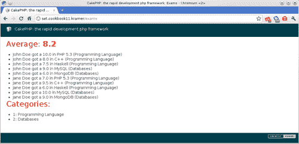
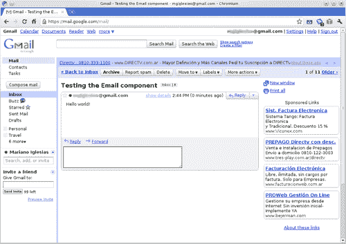
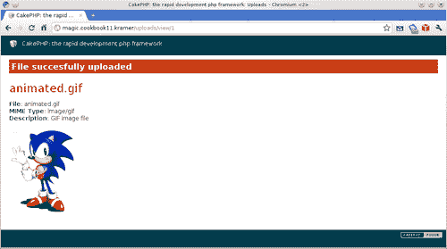
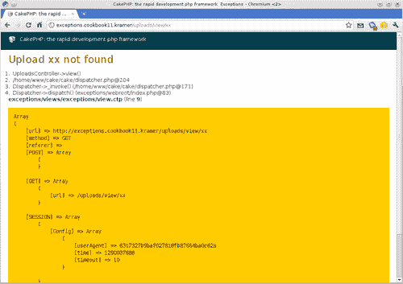

# 第十一章。实用类和工具

在本章中，我们将涵盖：

+   使用 Set 类

+   使用 String 类操作字符串

+   发送电子邮件

+   使用 MagicDb 检测文件类型

+   抛出和处理异常

# 简介

本章介绍了一组实用类和有用的技术，这些技术可以改善 CakePHP 应用的架构。

第一道菜谱展示了如何使用 CakePHP 类优化数组操作。第二道菜谱展示了如何使用 CakePHP 的 **String** 类操作字符串。第三道菜谱展示了如何使用 `Email` 组件发送电子邮件。第四道菜谱展示了如何使用 `MagicDb` 类检测文件的类型。

# 使用 Set 类

CakePHP 做过的最具争议的决定之一是将模型 `find` 操作的结果返回为数组。虽然 ORM 纯粹主义者可能会争论每个返回项都应该是模型类的一个实例，但数组证明自己在操作那些用纯对象方法难以实现的特征时非常实用、快速且灵活。

`Set` 类被引入，以便在处理基于数组的复杂数据结构时，开发者能够拥有更多的权力。通过简单的调用方法，我们可以轻松地操作数组，避免了编写长而复杂的代码块的需要。

这个菜谱展示了如何使用这个类提供的最有用的方法，同时介绍了在其他不同场景下可能有用的其他方法。

## 准备工作

为了完成这个菜谱，我们需要一些数据来操作。创建以下表，并通过发出以下 SQL 语句填充它们：

```php
CREATE TABLE `students`(
`id` INT UNSIGNED AUTO_INCREMENT NOT NULL,
`name` VARCHAR(255) NOT NULL,
PRIMARY KEY(`id`)
);
CREATE TABLE `categories`(
`id` INT UNSIGNED AUTO_INCREMENT NOT NULL,
`name` VARCHAR(255) NOT NULL,
PRIMARY KEY(`id`)
);
CREATE TABLE `exams`(
`id` INT UNSIGNED AUTO_INCREMENT NOT NULL,
`category_id` INT UNSIGNED NOT NULL,
`name` VARCHAR(255) NOT NULL,
PRIMARY KEY(`id`),
FOREIGN KEY `exams__categories`(`category_id`) REFERENCES `categories`(`id`)
);
CREATE TABLE `grades`(
`id` INT UNSIGNED AUTO_INCREMENT NOT NULL,
`student_id` INT UNSIGNED NOT NULL,
`exam_id` INT UNSIGNED NOT NULL,
`grade` FLOAT UNSIGNED NOT NULL,
PRIMARY KEY(`id`),
FOREIGN KEY `grades__students`(`student_id`) REFERENCES `students`(`id`),
FOREIGN KEY `grades__exams`(`exam_id`) REFERENCES `exams`(`id`)
);
INSERT INTO `students`(`id`, `name`) VALUES
(1, 'John Doe'),
(2, 'Jane Doe');
INSERT INTO `categories`(`id`, `name`) VALUES
(1, 'Programming Language'),
(2, 'Databases');
INSERT INTO `exams`(`id`, `category_id`, `name`) VALUES
(1, 1, 'PHP 5.3'),
(2, 1, 'C++'),
(3, 1, 'Haskell'),
(4, 2, 'MySQL'),
(5, 2, 'MongoDB');
INSERT INTO `grades`(`student_id`, `exam_id`, `grade`) VALUES
(1, 1, 10),
(1, 2, 8),
(1, 3, 7.5),
(1, 4, 9),
(1, 5, 6),
(2, 1, 7),
(2, 2, 9.5),
(2, 3, 6),
(2, 4, 10),
(2, 5, 9);

```

在名为 `exams_controller.php` 的文件中创建一个控制器，并将其放置在您的 `app/controllers` 文件夹中，内容如下：

```php
<?php
class ExamsController extends AppController {
public function index() {
}
}
?>

```

创建一个名为 `exam.php` 的文件，并将其放置在您的 `app/models` 文件夹中，内容如下：

```php
<?php
class Exam extends AppModel {
public $belongsTo = array('Category');
public $hasMany = array('Grade');
}
?>

```

创建一个名为 `grade.php` 的文件，并将其放置在您的 `app/models` 文件夹中，内容如下：

```php
<?php
class Grade extends AppModel {
public $belongsTo = array(
'Exam',
'Student'
);
}
?>

```

## 如何做...

1.  编辑您的 `app/controllers/exams_controller.php` 文件，并在其 `index()` 方法中插入以下内容：

    ```php
    $gradeValues = Set::extract(
    $this->Exam->find('all'),
    '/Grade/grade'
    );
    $average = array_sum($gradeValues) / count($gradeValues);
    $categories = $this->Exam->Category->find('all');
    $mappedCategories = Set::combine(
    $categories,
    '/Category/id',
    '/Category/name'
    );
    $gradeRows = $this->Exam->Grade->find('all', array(
    'recursive' => 2
    ));
    $grades = Set::format(
    $gradeRows,
    '%s got a %-.1f in %s (%s)',
    array(
    '/Student/name',
    '/Grade/grade',
    '/Exam/name',
    '/Exam/Category/name'
    )
    );
    $categories = Set::map($categories);
    $this->set(compact('average', 'grades', 'categories'));

    ```

1.  创建一个名为 `exams` 的文件夹，并将其放置在您的 `app/views` 文件夹中。创建一个名为 `index.ctp` 的文件，并将其放置在 `app/views/exams` 文件夹中，内容如下：

    ```php
    <h2>Average: <strong><?php echo $average; ?></strong></h2>
    <ul>
    <?php foreach($grades as $string) { ?>
    <li><?php echo $string; ?></li>
    <?php } ?>
    </ul>
    <h2>Categories:</h2>
    <ul>
    <?php foreach($categories as $category) { ?>
    <li><?php echo $category->id; ?>: <?php echo $category->name; ?></li>
    <?php } ?>
    </ul>

    ```

如果您现在浏览到 `http://localhost/exams`，您应该看到所有考试的平均成绩，每个学生在每个考试中的详细成绩列表，以及所有类别的列表，如下面的截图所示：



## 它是如何工作的...

我们首先使用 `Set::extract()` 方法从从 `Exam` 模型中获取所有行后的结果中提取信息。我们感兴趣的是检索所有成绩的列表。`extract()` 方法最多接受三个参数：

+   `path`: 一个与 X-Path 2.0 兼容的表达式，用于显示应提取信息的路径。

    ### 注意

    `Set` 类仅支持 X-Path 2.0 规范的一部分。在 X-Path 中有效的表达式，如 `//`，在 `Set` 中不可用。继续阅读本食谱以了解支持哪些表达式。

+   `data`：从其中提取信息的数组数据结构。

+   `options`：这些是可选设置。在撰写本文时，只有选项 `flatten`（一个布尔值）可用。将其设置为 `false` 将返回作为结果结构一部分的提取字段。默认为 `true`。

`path` 参数在定义我们感兴趣的信息时提供了一个灵活的方法。为了进一步了解其语法，考虑从获取所有 `Exam` 记录及其 `Category` 信息以及所有相关的 `Grade` 记录得到的数据结构：

```php
$data = $this->Exam->find('all');

```

在 X-Path 2.0 中，路径是一个由正斜杠 (/) 分隔的表达式，而该表达式中的每一部分代表一个子路径（CakePHP 的 `Set::extract()` 方法也强制使用起始斜杠）。因此，表达式 `/children` 指的是只包含名为 `children` 的元素的路径，而表达式 `/children/grandchildren` 将选择名为 `grandchildren` 的项，这些项是名为 `children` 的项的后代。当我们提到一个项的名称时，我们指的是数组结构中的键。

### 注意

更多关于 X-Path 2.0 的信息可以在 [`www.w3.org/TR/xpath20`](http://www.w3.org/TR/xpath20) 获取。

如果我们只想获取 `Exam` 字段（从而丢弃有关 `Category` 和 `Grade` 的信息），我们会使用以下方法：

```php
Set::extract('/Exam', $data);

```

这将返回一个元素数组，每个元素按 `Exam` 索引，其值是 `Exam` 键的所有字段。如果我们只对 `name` 字段感兴趣，我们会在表达式中添加另一个子路径：

```php
Set::extract('/Exam/name', $data);

```

我们还可以通过添加条件表达式进一步限制路径。条件表达式通过将典型的比较运算符（`<, <=, >, >=, =, !=`）应用于与路径匹配的每个元素来过滤元素（使用 `Set::matches()` 方法）。为了获取所有 `grade` 字段值小于 `8` 的 `Grade` 记录，我们会使用以下表达式（注意条件表达式是如何应用于子路径并且被括号包围的）：

```php
Set::extract('/Grade[grade<8]', $data);

```

我们可以使用位置表达式代替比较运算符，这些表达式可以是以下任何一种：

+   `:first`：指的是第一个匹配的元素。

+   `:last`：指的是最后一个匹配的元素。

+   `number`：指的是位于由数字指示的位置的元素，其中 `number` 是大于或等于 `1` 的数字。

+   `start:end`：指的是从位置 `start` 开始，到位置 `end` 结束的所有元素。`start` 和 `end` 都是大于或等于 `1` 的数字。

要过滤数据集，以便只返回所有 `Grade` 记录的第二和第三个元素，使用 `grade` 大于或等于 `8` 的记录子集，并仅获取 `grade` 字段的值，我们将这样做：

```php
Set::extract('/Grade[grade>=8]/grade[2:3]', $data);

```

回到配方，我们首先只提取每个 `Grade` 记录的 `grade` 字段的值。这个 `Set::extract()` 调用返回一个 `grade` 值的数组，然后我们可以使用 PHP 的 `array_sum()` 和 `count()` 函数来计算平均评分。

### 注意

`Set::extract()` 方法和其他 `Set` 方法的几个示例可以从其测试用例中获得。查看您的 CakePHP 核心文件夹中的 `tests/cases/libs/set.test.php` 文件，并查看不同的测试用例。

然后我们使用 `Set::combine()` 方法。此方法最多接受四个参数：

+   `data`：要操作的数据数组。

+   `path1`：用于获取结果数组键的 X-Path 2.0 路径。

+   `path2`：用于获取结果数组值的 X-Path 2.0 路径。如果没有指定，值将被设置为 `null`。

+   `groupPath`：用于将结果项分组以便每个项都是相应组的子项的 X-Path 2.0 路径。

使用 `/Category/id` 表达式作为键，`/Category/name` 作为值，我们获得一个索引数组，其中键是 `Category` ID，值是相应的 `Category` 名称。

`groupPath` 参数在许多场景中非常有用。考虑一下需要按考试类别分组获取特定学生的所有考试成绩的需求。使用以下方法：

```php
$records = $this->Exam->Grade->find('all', array(
'conditions' => array('Student.id' => 1),
'recursive' => 2
));
$data = Set::combine(
$records,
'/Exam/name',
'/Grade/grade',
'/Exam/Category/name'
);

```

我们将获得一个易于导航的数组：

```php
array(
'Programming Language' => array(
'PHP 5.3' => '10',
'C++' => '8',
'Haskell' => '7.5'
),
'Databases' => array(
'MySQL' => '9',
'MongoDB' => '6'
)
)

```

配方继续通过获取所有评分，然后使用 `Set::format()` 方法获取格式化字符串列表。此方法接受三个参数：

+   `data`：要格式化的数据。

+   `format`：包含要使用的格式的 `sprintf()` 基于字符串。

+   `keys`：用于替换包含在 `format` 中的 `sprintf()` 转换规范的 X-Path 2.0 路径数组。

    ### 注意

    要了解更多关于基于 `sprintf()` 的转换规范的信息，请参阅 [`php.net/sprintf`](http://php.net/sprintf)。

`Set::format()` 将 `format` 字符串应用于 `data` 数组中的每个项，并返回一个格式化字符串数组。在配方中，我们使用了字符串 `%s` got `a %-.1f in %s (%s)`。此字符串包含四个转换规范：一个字符串、一个浮点数（我们强制只包含一位小数），以及另外两个字符串。这意味着我们的 `keys` 参数应包含四个路径。每个路径都将按顺序用于替换其相应的转换规范。

配方最后使用 `Set::map()` 方法结束，如果您想处理对象而不是数组，这个方法非常有用。此方法接受两个可选参数：

+   `class`: 创建对象实例时要使用的类名。这个参数通常用于指定数据，而 `tmp` 参数用于指定类名。

+   `tmp`: 如果第一个参数是数组，则此参数的行为类似于 `class` 参数。否则，它将被安全忽略。

只需用要转换的数据调用此方法，就会递归地将该数据转换为一系列通用对象实例。如果使用 `class` 参数，那么在创建相应的对象实例时将使用该参数中指定的类名。

## 更多...

`Set` 类的有用性不仅限于此。还有一些其他方法在本食谱中没有涉及，但可以帮助我们在开发 CakePHP 应用程序时。其中一些方法包括：

+   `merge()`: 作为两个 PHP 方法的组合：`array_merge()` 和 `array_merge_recursive()`，允许在至少两个参数中存在相同的键，并且它们自身是数组时，正确合并数组。在这种情况下，它将对这些元素执行另一个 `Set::merge()`。

+   `filter()`: 从数组中过滤掉空元素，保留评估为空的实值（`0` 和 `'0'`）

+   `pushDiff()`: 将一个数组的差异推送到另一个数组中，从第二个参数中插入到第一个参数中不存在的键，递归地。

+   `numeric()`: 判断数组中的元素是否只包含数值。

+   `diff()`: 计算并返回两个数组之间的不同元素。

+   `reverse()`: 将对象转换为数组。这个方法可以看作是 `Set::map()` 方法的相反。

+   `sort()`: 根据在 X-Path 2.0 兼容路径中指定的值对数组进行排序。

# 使用 String 类操作字符串

字符串操作可能是 PHP 最强大的功能之一，因为它提供了一系列函数来执行各种操作。即使几乎每个需求都可以通过使用 PHP 的核心方法来满足，某些形式的字符串操作可能会变得麻烦。

### 注意

要了解更多关于 PHP 核心字符串方法的信息，请参阅 [`php.net/manual/en/ref.strings.php`](http://php.net/manual/en/ref.strings.php)。

CakePHP 提供了一个名为 `String` 的实用类，帮助我们处理字符串。本食谱介绍了该类及其少量但有用的方法集。

## 准备工作

我们需要一个控制器来作为我们代码的占位符。创建一个名为 `examples_controller.php` 的文件，并将其放置在 `app/controllers` 文件夹中，内容如下：

```php
<?php
class ExamplesController extends AppController {
public $uses = null;
public function index() {
$this->_stop();
}
?>

```

## 如何做到这一点...

编辑 `app/controllers/examples_controller.php` 文件，并在 `index()` 方法的开头添加以下内容：

```php
$lines = array(
'"Doe, Jane", jane.doe@email.com',
'"Doe, John", john.doe@email.com'
);
foreach($lines as $i => $line) {
$line = String::tokenize($line, ',', '"', '"');

```

```php
$line = array_combine(array('name', 'email'), $line);
foreach($line as $field => $value) {
$line[$field] = preg_replace('/^"(.+)"$/', '\\1', $value);
}
$line['id'] = String::uuid();
$lines[$i] = $line;
}
foreach($lines as $line) {
echo String::insert('[:id] Hello :name! Your email is\\: :email', $line) . '<br />';
}

```

如果你现在浏览到 `http://localhost/examples`，你应该会看到以下类似文本输出：

**[4d403ee1-6bbc-48c6-a8cc-786894a56bba] Hello Doe, Jane! Your email is: jane.doe@email.com**

**[4d403ee1-9e84-487f-95cf-786894a56bba] Hello Doe, John! Your email is: john.doe@email.com**

## 它是如何工作的...

`String` 类提供了以下字符串操作方法：

+   `cleanInsert()`: 清理通过 `String::insert()` 方法生成的字符串。

+   `insert()`: 在字符串中用一组值替换变量占位符。

+   `tokenize()`: 使用给定的分隔符将字符串分割成部分，并忽略出现在指定边界字符串之间的分隔符实例。

+   `uuid()`: 返回一个随机的 UUID 字符串。

此菜谱首先定义一个包含两个字符串的数组，每个字符串的格式类似于我们会在 CSV（逗号分隔值）文件中找到的格式。对于这些行中的每一行，我们使用 `String::tokenize()` 方法将 CSV 行分割成一组值。此方法最多接受四个参数：

+   `data`: 要分割的字符串。

+   `separator`: 分隔字符串的标记。默认为 `,.`

+   `` `leftBound`: 指示应忽略 `separator` 字符的区域开始的边界字符串。默认为 `(`。 ``

+   `` `rightBound`: 与 `leftBound` 类似，但标记了该区域的结束。默认为 `)`。 ``

``我们告诉 `String::tokenize()` 分割每一行，考虑到任何用引号括起来的表达式可以包含分隔符字符，在这种情况下应忽略它。然后我们使用 PHP 的 `array_combine()` 函数，使每一行成为一个关联数组，以字段名称为索引，其值对应于相应的字段值。``

``由于 `String::tokenize()` 方法返回的字符串包含了 `leftBound` 和 `rightBound` 参数中定义的边界字符串（如果它们是原始字符串的一部分），我们继续从每一行中删除它们。``

``然后我们使用 `String::uuid()` 方法将一个随机 UUID 字符串作为每行的 `id` 字段值。这个字符串将对于每一行都是唯一的，并且不应该重复，即使在不同的请求之间也不应该重复。``

### `注意`

`更多关于 UUID 的信息可以在 [`en.wikipedia.org/wiki/Universally_unique_identifier`](http://en.wikipedia.org/wiki/Universally_unique_identifier) 获取。`

``最后，我们遍历每一行，并通过 `String::insert()` 方法输出一个动态生成的字符串。此方法最多接受三个参数：``

+   `` `str`: 包含应替换的变量占位符的字符串。 ``

+   `` `data`: 形式为 `variable => value` 的关联数组，用于将变量占位符替换为其相应的值。 ``

+   `` `options`: 定义方法应如何行为的选项集。可用选项：*   `before`: 指示变量占位符开始的字符串。默认为:. *   `after`: 指示变量占位符结束的字符串。默认为 `null`，这意味着占位符从 `before` 中定义的字符串开始，并在单词结束时结束。 ``

+   `` `escape`: 在查找用于 `before` 选项的字符串时使用的字符。默认为 `\`。 ``

+   `` `format`: 用于查找变量占位符的正则表达式。 ``

+   `` `clean`: 如果指定，它将通过 `String::cleanInsert()` 方法清理替换后的字符串。默认为 `false`，这意味着不进行清理。``

``在我们的例子中，我们使用字符串 `[:id] Hello :name! Your email is\\: :email`。这个字符串包含三个变量占位符：`:id, :name` 和 `:email`。这些占位符中的每一个都会被作为 `String::insert()` 方法的第二个参数传递的关联数组中的相应值所替换。``

```php`# Sending an e-mail    If there is one task we can hardly avoid when building web applications it is sending out e-mails. It is such a basic need that CakePHP provides us with a ready-to-go component that can send e-mails, either through SMTP, or using PHP's `mail()` function.    In this recipe we will learn how to use the `Email` component to send out e-mails through SMTP using a Google Mail account, and how to use e-mail layouts to proper render the e-mails.    ## Getting ready    We only need some place to put our code, and that place will be a model-less controller. Create a file named `emails_controller.php` and place it in your `app/controllers` folder, with the following contents:    ``` class EmailsController extends AppController { public $uses = null; public function index() { $this->_stop(); } }  ```php    ## How to do it...    1.  Edit your `app/controllers/emails_controller.php` and add the following property to the `EmailsController` class (right below the `uses` property declaration), replacing the `username` and `password` settings highlighted with your Google Mail account, and password:          ```     public $components = array(     'Email' => array(     'delivery' => 'smtp',     'smtpOptions' => array(     'host' => 'ssl://smtp.gmail.com',     'port' => 465,     'username' => 'email@gmail.com',     'password' => 'password'     )     )     );          ```php           2.  While still editing the controller, add the following code to its `index()` method, right above the call to the `_stop()` method (replace the `to` property highlighted with the e-mail address where you wish to receive the test e-mail):          ```     $this->Email->to = 'Destination <email@gmail.com>';     $this->Email->subject = 'Testing the Email component';     $sent = $this->Email->send('Hello world!');     if (!$sent) {     echo 'ERROR: ' . $this->Email->smtpError . '<br />';     } else {     echo 'Email sent!';     }          ```php           3.  If you now browse to `http://localhost/emails`, you should see the message **Email sent!**, and you should then receive the test e-mail message in your inbox, as shown in the following screenshot:          Let us now continue by sending an HTML e-mail, using layouts and templates.           4.  Make the following changes to the `index()` method in your `app/controllers/emails_controller.php` file (remember to change the highlighted `to` property to your desired destination e-mail):          ```     $this->set(array(     'name' => 'Mariano Iglesias',     'url' => Router::url('/', true)     ));     $this->Email->to = 'Destination <email@gmail.com>';     $this->Email->subject = 'Testing the Email component';     $this->Email->sendAs = 'both';     $this->Email->template = 'test';     $sent = $this->Email->send();     if (!$sent) {     echo 'ERROR: ' . $this->Email->smtpError . '<br />';     } else {     echo 'Email sent!';     }          ```php           5.  Create a file named `default.ctp` and place it in your `app/views/layouts/email/html` folder with the following contents:          ```     <html>     <head><title><?php echo $title_for_layout;?></title></head>     <body>     <?php echo $content_for_layout; ?>     <p><small>This email was sent on: <?php echo date('F d, Y H:i'); ?></small></p>     </body>     </html>          ```php           6.  Create a file named `default.ctp` and place it in your `app/views/layouts/email/text` folder with the following contents:          ```     <?php echo $content_for_layout; ?>     This email was sent on: <?php echo date('F d, Y H:i'); ?>          ```php           7.  Create a file named `test.ctp` and place it in your `app/views/elements/email/html` folder, with the following contents:          ```     <p>Hello <?php echo $name; ?>!</p>     <p>This is a test email from <?php echo $this->Html->link('My Test Application', $url); ?></p>          ```php           8.  Create a file named `test.ctp` and place it in your `app/views/elements/email/text` folder, with the following contents:          ``` Hello <?php echo $name; ?>!     This is a test email from My Test Application: <?php echo $url; ?>          ```php              If you now browse to `http://localhost/emails` you should see the message **Email sent!**, and you should then receive the test e-mail message in your inbox in HTML format, and with a link to your web application.    ## How it works...    We start by adding the `Email` component to our controller's list of components. While adding it, we set the settings required to specify the type of delivery we wish to use. The connection settings available in the `Email` component are:    *   `delivery`: It is the type of delivery to use, and can be either: `mail` (uses PHP's `mail()` function), `smtp` (uses SMTP, and requires proper configuration of the `smtpOptions` setting), and `debug` (which tells the `Email` component to avoid sending the e-mail, and instead create a session flash message with the message contents.) *   `smtpOptions`: If delivery is set to `smtp`, it defines an array of settings to specify the type of SMTP connection to attempt. Available settings for this setting are:          *   `protocol`: Protocol to use when connecting. Defaults to `smtp`.     *   `host`: SMTP host to connect to. Defaults to `localhost`.     *   `port`: Port to use when connecting to `host`. Defaults to `25`.     *   `username`: Username.     *   `password`: Password to use.     *   `client`: What is the client connecting to the SMTP server. Defaults to the `HTTP_HOST` environment variable.     *   `timeout`: How many seconds to wait until the attempt to reach the server times out. Defaults to `30`.              We set delivery to `smtp`, and set the `smtpOptions` to what is required when attempting to send e-mails through Google Mail's SMTP server. Once the `Email` component is added to the controller and properly configured, we are ready to build and send e-mails.    The controller's `index()` method builds the e-mail by setting some properties. The `Email` component takes most of its configuration through public properties, some of which are:    *   `to`: Destination, in the form: `name <email>`, where `email` is a valid e-mail address. It can also simply be an email address. *   `from`: E-mail address that is sending the e-mail. This property uses the same format as the `to` property. Notice that if you use Google Mail's SMTP, only the name part of this setting will be used (as the e-mail address will be set to your Google Mail e-mail address.) *   `replyTo`: Email address to which responses should be sent to. Same format as the `to` property. *   `return`: E-mail address to send any delivery errors, sent by the remote mail server. Same format as the `to` property. *   `readReceipt`: An e-mail address (using the same format as the `to` property) to where to send read receipt e-mails. Defaults to none. *   `cc`: An array containing the e-mail address to where to send copies of this e-mail. Each e-mail address should be specified using the same format as the `to` property. *   `bcc`: An array containing e-mail address to send blind copies of this e-mail. Each e-mail address should be specified using the same format as the `to` property. *   `subject`: Subject for the e-mail. *   `headers`: An array containing additional headers to send with the e-mail; each of those headers will be prefixed with `X-` as per `RFC 2822`. *   `attachments`: An array if paths to files that should be attached to the e-mail.    Using the `to` and `subject` property we specify the destination and subject of the e-mail. We did not have to define the `from` property since Google Mail uses the account specified when connecting to the SMTP server.    We then issue a call to the `send()` method, passing the body of the e-mail as its argument, and based on its boolean response we inform if the e-mail was successfully sent or if it failed, in which case we use the `smtpError` property to show the error.    The next part of the recipe uses templates and layouts to properly build the e-mail in two formats: HTML, and text, and uses replacement variables to show the flexibility of the e-mail component. E-mail layouts and templates are no different than controller layouts and views, as they inherit the controller properties (such as its replacement variables, and available helpers.)    E-mail layouts wrap the contents of e-mail templates, by means of their `content_for_layout` variable, just as controllers layouts do. There are two types of email layouts: HTML layouts, stored in `app/views/layouts/email/html`, and text layouts, stored in `app/views/layouts/email/text`. Similarly, you can define templates for HTML emails by storing them in the folder `app/views/elements/emails/html`, and text email templates in `app/views/elements/emails/text`.    We set the layout of the e-mail through the `layout` property of the `Email` component. If no layout is set, the default is used. Therefore, we start by creating the HTML layout in the file `app/views/layouts/email/html/default.ctp`, and the text layout in `app/views/layouts/email/text/default.ctp`.    We create two versions of the same template, called `test`: its HTML version is stored in `app/views/elements/email/html/test.ctp`, and its text version in `app/views/elements/email/html/test.ctp`.    The recipe continues by modifying the `index()` action. We start by defining two replacement variables: `name` and `url`, which are used in the `test` template. We then use the `sendAs` property of the `Email` component to say we are sending an HTML and text friendly e-mail. This property can be set to: `html`, to send HTML only e-mails; `text`, to send text only e-mails; and `both`, to send emails that support HTML and text e-mail clients.    We use the `template` property of the `Email` component to specify that we wish to use our `test` template, and we finalize with a call to the `send()` method to send out the e-mail.    ## There's more...    A common mistake that web application developers make is sending out e-mails as part of a controller action that is triggered by the visitor. Strictly speaking, e-mail sending is a non-interactive task, and as such should not be tied to the user browsing experience.    It is therefore recommended that the email sending task be performed in a non-interactive manner, which in CakePHP terms means from the console, also known as shell.    To exemplify this solution, consider a subscription website, where users enter their information (including their e-mail address), and, as a result, the application sends out a confirmation e-mail. Instead of sending the e-mail as part of the controller action that is triggered from the submission form, we may set a database field that shows that those users have not yet been sent out the confirmation e-mail, and then have a CakePHP shell periodically check for users that need their confirmation e-mails, sending out those e-mails from the shell.    This means that we find ourselves needing to be able to send e-mails from the shell, a topic covered in the recipe *Sending e-mails from shells* in Chapter 8,    ## See also    *Sending e-mails from shells* in Chapter 8, *Working with Shells*.    # Detecting file types with MagicDb    When handling file uploads, it is often important to determine the type of file being uploaded. While some files may be easily recognizable based on their contents, others may prove to be hard to identify.    `MagicDb` is a file database that consists of specifications for several file formats. This recipe shows us how to use this database, through CakePHP's `MagicDb` class, to properly identify files uploaded by our users.    The license for the `MagicDb` database file allows its use only on open source or freely available software. If you wish to identify files on commercial applications, you will have to find a different approach.    ## Getting ready    As we will be working on files uploaded by our users, we need to build a form to upload files. We will store these uploads in a table, so create this table with the following SQL statement:    ``` CREATE TABLE `uploads`( `id` INT UNSIGNED AUTO_INCREMENT NOT NULL, `file` VARCHAR(255) NOT NULL, `mime` VARCHAR(255) default NULL, `description` TEXT default NULL, PRIMARY KEY(`id`) );  ```php    Create a file named `uploads_controller.php` and place it in your `app/controllers` folder, with the following contents:    ``` class UploadsController extends AppController { public function add() { if (!empty($this->data)) { $this->Upload->create(); if ($this->Upload->save($this->data)) { $this->Session->setFlash('File succesfully uploaded'); $this->redirect(array('action'=>'view', $this->Upload->id)); } else { $this->Session->setFlash('Please correct the errors marked below'); } } } }  ```php    Create a folder named `uploads` in your `app/views` folder. Create the view for the `add()` method in a file named `add.ctp` and place it in your `app/views/uploads` folder, with the following contents:    ``` <?php echo $this->Form->create('Upload', array('type'=>'file')); echo $this->Form->inputs(array( 'file' => array('type'=>'file') )); echo $this->Form->end('Upload'); ?>  ```php    ## How to do it...    1.  Download the latest MagicDb database file from [`www.magicdb.org/magic.db`](http://www.magicdb.org/magic.db) and place it in your `app/vendors` folder. You should now have a file named `magic.db` in your `app/vendors` folder. 2.  Edit your `app/controllers/uploads_controller.php` file and add the following methods right below the `add()` method:          ```     public function view($id) {     $upload = $this->Upload->find('first', array(     'conditions' => array('Upload.id' => $id)     ));     if (empty($upload)) {     $this->cakeError('error404');     }     $this->set(compact('upload'));     }     public function download($id) {     $upload = $this->Upload->find('first', array(     'conditions' => array('Upload.id' => $id)     ));     if (empty($upload)) {     $this->cakeError('error404');     }     $path = TMP . $upload['Upload']['file'];     header('Content-type: '.$upload['Upload']['mime']);     readfile($path);     $this->_stop();     }          ```php           3.  Create the view for the `view()` method in a file named `view.ctp` and place it in your `app/views/uploads` folder with the following contents:          ```     <h2><?php echo $upload['Upload']['file']; ?></h2>     <p>     <strong>File</strong>: <?php echo $upload['Upload']['file']; ?><br />     <strong>MIME Type</strong>: <?php echo $upload['Upload']['mime']; ?><br />     <strong>Description</strong>: <?php echo $upload['Upload']['description']; ?>     </p>     <br />     <p>     <?php if (strpos($upload['Upload']['mime'], 'image/') === 0) { ?>     <?php echo $this->Html->image(array('action'=>'download', $upload['Upload']['id']), array('height'=>200)); ?>     <?php } else { ?>     <?php echo $this->Html->link('Download', array('action'=>'download', $upload['Upload']['id'])); ?>     <?php } ?>     </p>          ```php           4.  Create the model in a file named `upload.php` and place it in your `app/models` folder with the following contents:          ```     <?php     class Upload extends AppModel {     protected $magicDb;     protected function getMagicDb() {     if (!isset($this->magicDb)) {     App::import('Core', 'MagicDb');     $magicDb = new MagicDb();     if (!$magicDb->read(APP . 'vendors' . DS . 'magic.db')) {     return null;     }     $this->magicDb = $magicDb;     }     return $this->magicDb;     }     }     ?>          ```php           5.  While still editing your `app/models/upload.php` file, add the following method to the `Upload` class:          ```     public function beforeValidate($options = array()) {     $result = parent::beforeValidate($options);     $data = $this->data[$this->alias];     if (!empty($data['file'])) {     if (     empty($data['file']) ||     !is_array($data['file']) ||     empty($data['file']['tmp_name']) ||     !is_uploaded_file($data['file']['tmp_name'])     ) {     $this->invalidate('file', 'No file uploaded');     return false;     }     $magicDb = $this->getMagicDb();     if (!isset($magicDb)) {     $this->invalidate('file', 'Can\'t get instance of MagicDb');     return false;     }     $path = TMP . $data['file']['name'];     if (!move_uploaded_file($data['file']['tmp_name'], $path)) {     $this->invalidate('file', 'Could not move uploaded file');     return false;     }     $data['file'] = basename($path);     unset($data['mime']);     $analysis = $magicDb->analyze($path);     if (!empty($analysis)) {     $analysis = $analysis[0];     if (preg_match('/^\[.+?;ext=[^;]+;mime=([^;]+);.*?\](.*)$/i', $analysis[3], $match)) {     $data['mime'] = $match[1];     if (empty($data['description'])) {     $data['description'] = $match[2];     }     }     }     if (empty($data['mime'])) {     $this->invalidate('Can\'t recognize file '.$data['file']);     return false;     }     $this->data[$this->alias] = $data;     } else {     $this->invalidate('file', 'This field is required');     return false;     }     return $result;     }          ```php              If you now browse to `http://localhost/uploads/add`, you will see a form where you can select a file, and then click the button **Upload**. Doing so with a GIF image will produce a result similar to what shown in the following screenshot:    ## How it works...    The recipe starts by downloading the `MagicDb` file and placing it into the `app/vendors` directory. This file is a text file; containing blocks of identifier file signatures, and for each of these file signature definitions, their respective mime type, and description.    Next, we create the `view()` and `download()` controller actions. Both of them are very similar, except that the `download()` action uses the field `mime` to set the `Content-type` header, thus properly informing the client browser the type of data being sent.    The `download()` action simply sends the contents of the file by using PHP's `readfile()` function, then calling the `_stop()` method (available to all CakePHP classes that descend from `Object)` to stop execution. The `view()` action, on the other hand, requires a view, which prints out the `Upload` record information, showing an image if the file is indeed an image, or showing a link to download the file, in any other case.    The `Upload` model defines two methods: `beforeValidate()`, and `getMagicDb()`. The second method creates an instance of the `MagicDb` class provided by CakePHP, populating it with the contents from the `magic.db` file that was saved in the `app/vendors` directory.    The validation callback `beforeValidate()` starts by making sure that a proper file was uploaded. If so, it moves the uploaded file to the application's temporary directory, and then uses the `analyze()` method of the `MagicDb` class to obtain the file information.    This method will return an empty array if the file was not identified, or a set of file identifications that match the file. These file identifications are themselves arrays, containing information that is defined in the `magic.db` file. The fourth element out of this array contains the information we are looking for: a string that includes the file extension, the mime type, and the file type description.    We extract this information, and we set it so it is saved together with the filename. If the file was not identified, we invalidate the `file` field.    # Throwing and handling exceptions    CakePHP 1.3 still offers support for PHP4, yet most CakePHP applications are built exclusively for PHP5\. Therefore, it is only expected that our applications use language features only available in PHP5, such as exceptions.    However, there is no built-in support in CakePHP to handle exceptions. This recipe shows us how to create a base exception class that can be used throughout our application, and how to properly recover the application workflow after an exception is thrown.    ## Getting ready    We need a basic application skeleton to work with. Follow the entire recipe *Detecting file types with MagicDb*.    ## How to do it...    1.  Edit your `app/controllers/uploads_controller.php` file and change the `view()` and `download()` methods, so that where it reads:          ```     $this->cakeError('error404');          ```php                    It now reads:                    ```     throw new AppException('Upload '.$id.' not found');          ```php           2.  Create a file named `app_exception.php` and place it in your `app/` folder, with the following contents:          ```     <?php     class AppException extends Exception {     public function getInfo() {     return array(     'message' => $this->getMessage(),     'trace' => $this->getStackTrace(),     'url' => Router::url(null, true),     'method' => env('REQUEST_METHOD'),     'referer' => env('HTTP_REFERER'),     'POST' => $_POST,     'GET' => $_GET,     'SESSION' => $_SESSION     );     }     public function getStackTrace($array = true, $count = 5) {     if ($array) {     $trace = $this->getTrace();     if (!empty($count)) {     $trace = array_slice($trace, 0, $count);     }     foreach($trace as $i => $row) {     $location = '';     if (!empty($row['class'])) {     $location .= $row['class'] . $row['type'] . $row['function'] . '()';     }     $file = !empty($row['file']) ? str_replace(ROOT.DS, '', $row['file']) : '';     if (!empty($file)) {     if (!empty($location)) {     $location .= ' (' . $file . '@' . $row['line'] . ')';     } else {     $location .= $file . '@' . $row['line'];     }     }     $trace[$i]['location'] = $location;     unset($trace[$i]['args']);     }     return $trace;     }     return $this->getTraceAsString();     }     }     ?>          ```php           3.  Create a file named `exception_handler.php` and place it in your `app/libs` folder, with the following contents:          ```     <?php     App::import(array('type'=>'File', 'name'=>'AppException', 'file'=>APP.'app_exception.php'));     App::import('Core', 'Controller');     class ExceptionHandler extends Object {     public static function handleException($exception) {     self::getInstance();     self::logException($exception);     self::renderException($exception);     self::_stop();     }     }          ```php           4.  While still editing your `app/libs/exception_handler.php` file, add the following methods to the `ExceptionHandler` class:          ```     public function renderException($exception) {     $Dispatcher = new Dispatcher();     $Controller = new Controller();     $Controller->params = array(     'controller' => 'exceptions',     'action' => 'exception'     );     $Controller->viewPath = 'exceptions';     if (file_exists(VIEWS.'layouts'.DS.'exception.ctp')) {     $Controller->layout = 'exception';     }     $Controller->base = $Dispatcher->baseUrl();     $Controller->webroot = $Dispatcher->webroot;     $Controller->set(compact('exception'));     $View = new View($Controller);     if (!file_exists(VIEWS.'exceptions'.DS.'view.ctp')) {     if (Configure::read('debug') > 0) {     echo '<strong>Exception</strong>: ';     echo $exception->getMessage();     echo '<pre>';     echo $exception->getStackTrace(false);     echo '</pre>';     return;     }     return $Controller->redirect(null, 500);     }     echo $View->render('view');     }     public function logException($exception) {     $trace = $exception->getStackTrace();     $message = get_class($exception) . ' thrown in ' . $trace[0]['location'];     $message .= ': ' . $exception->getMessage();     if (is_a($exception, instanceof AppException)) {     $message .= ' | DEBUG: ' . json_encodevar_export($exception->getInfo(), true); }     self::log($message, LOG_ERROR);     }          ```php           5.  Add the following at the end of your `app/config/bootstrap.php` file (right above the closing PHP tag):          ```     App::import('Lib', 'ExceptionHandler');     set_exception_handler(array('ExceptionHandler', 'handleException'));          ```php           6.  Create a folder named `exceptions` in your `app/views` folder. Create a file named `view.ctp` and place it in your `app/views/exceptions` folder, with the following contents:          ```     <h2><?php echo $exception->getMessage(); ?></h2>     <?php if (Configure::read('debug') > 0) { ?>     <ol>     <?php foreach($exception->getStackTrace() as $trace) { ?>     <li><?php echo $trace['location']; ?></li>     <?php } ?>     </ol>     <?php if (is_a($exception, 'AppException')) { ?>     <?php debug(array_diff_key($exception->getInfo(), array('message'=>null, 'trace'=>null))); ?>     <?php } ?>     <?php } else { ?>     <p>An error has been found. It has been logged, and will soon be fixed.</p>     <?php } ?>          ```php              If you now force an error by browsing to `http://localhost/uploads/view/xx`, you will see a page describing the exception, its stack trace, and including relevant information, such as the URL, any POST or GET parameters, and session information, as shown in the following screenshot:    ## How it works...    We start by using exceptions in our `UploadsController` class, instead of using CakePHP's `cakeError()` method, whenever an `Upload` record is not found. These exceptions are actually instances of `AppException`, but we could have as well created custom exceptions that inherit from `AppException`.    The `AppException` class provides us with a base class from where to extend our application exceptions. This class offers us more contextual information through its `getInfo()` method. This information includes not only the exception message and the stack trace (which is simplified by removing the arguments, and limiting the number of items), but also the URL, method, any POST or GET data, and session information, details that can become valuable when working out the exception.    We still have to add the ability to handle any exceptions that are thrown. For that purpose, we create the `ExceptionHandler` class. Through the code added to the `app/config/bootstrap.php` file, which uses PHP's `set_exception_handler()` function, we tell PHP that whenever an exception is thrown and not caught anywhere, the static `handleException()` method of the `ExceptionHandler` class is to be executed.    This method logs the exception, using the `logException()` method, and renders a friendly page by calling the `renderException()` method. This rendering is performed by creating a dummy controller as an instance of `Controller`, using this controller to render the view `app/views/exceptions.ctp` (optionally using a layout named `exception.ctp` if one is available in `app/views/exceptions`), and setting the view variable `exception` to the exception being handled.    This view shows a simple message if the debug level is set to `0`, or a thorough description of the stack trace and any context information that may be relevant.```
