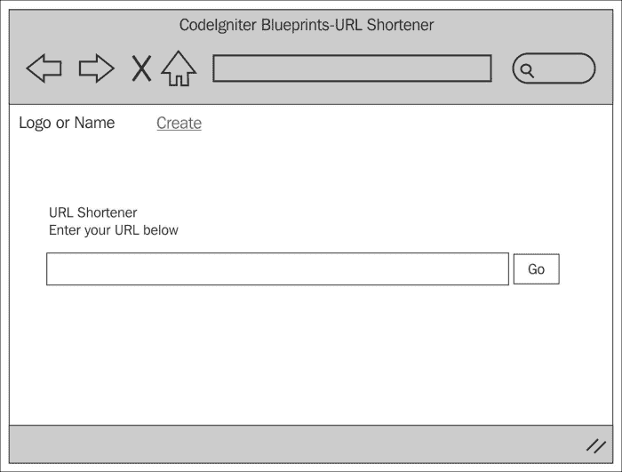

# 第二章. URL 缩短器

互联网上有很多 URL 缩短工具；然而，总有一些空间可以加入一些乐趣，有时个人或公司需要自己的解决方案，而不是仅仅使用外部提供商。本章的项目正是如此——开发一个任何人都可以使用的基于 CodeIgniter 的 URL 缩短器。

要制作这个应用程序，我们需要做一些事情：我们将创建两个控制器，一个用于创建缩短的 URL，另一个用于将缩短的 URL 重定向到其实际的网络位置。

我们将创建语言文件来存储文本，为将来可能实现的多语言支持打下基础。

我们还将修改`config/routes.php`文件——这是为了确保缩短后的 URL 尽可能短。

然而，这个应用程序，以及本书中的其他所有应用程序，都依赖于我们在第一章中做的基本设置，*引言和共享项目资源*；虽然你可以将大量代码块放入你几乎已经拥有的任何应用程序中，但请记住，我们在第一章中做的设置是这个章节的基础。

本章我们将涵盖以下主题：

+   设计和线框图

+   创建数据库

+   调整`routes.php`文件

+   创建模型

+   创建视图

+   创建控制器

+   整合所有内容

所以，无需多言，让我们开始吧。

# 设计和线框图

在我们开始构建之前，我们应该始终看看我们计划构建什么。

首先，简要描述我们的意图：我们计划构建一个应用程序，将显示一个简单的表单给用户。我们将鼓励用户在表单中输入 URL 并提交该表单。

将生成一个唯一代码并将其与用户输入的 URL 关联起来。这个 URL 和唯一代码将被保存到数据库中。

用户将看到一个包含我们刚刚生成的唯一代码的新 URL。这个唯一代码将被附加到我们正在构建的应用程序的 URL 上。如果用户（或任何人）点击这个链接，应用程序将在数据库中查找这个唯一代码。如果唯一代码存在，它将把用户重定向到与该唯一代码关联的原始 URL。

因此，让我们看看一些线框图，以帮助我们理解这可能在屏幕上看起来是什么样子：



这是用户将看到的第一个页面。用户被邀请在文本框中输入 URL 并点击**Go**按钮。

页面将被提交，并将生成代码。这两段代码和原始 URL 都将保存到数据库中。然后，用户将看到我们为他们创建的新 URL。他们可以将该 URL 复制到剪贴板（用于粘贴到电子邮件等）或立即点击它。以下截图显示了这一过程：


## 文件概览

我们将为这个应用程序创建六个文件，如下所示：

+   `/path/to/codeigniter/application/models/urls_model.php`：此文件提供对数据库的访问，并允许我们创建 `url_code`，将记录保存到数据库中，并从数据库中检索原始 URL。

+   `/path/to/codeigniter/application/views/create/create.php`：此文件为我们提供界面，用户界面表单以及任何需要通知用户其操作或系统操作的提示信息。

+   `/path/to/codeigniter/application/views/nav/top_nav.php`：此文件在页面顶部提供导航栏。

+   `/path/to/codeigniter/application/controllers/create.php`：此文件对用户输入的 URL 进行验证检查，调用任何助手等。

+   `/path/to/codeigniter/application/controllers/go.php`：此文件为缩短 URL 提供支持。它从 URI（第一部分）获取唯一的代码参数，将其发送到 `Urls_model`，如果存在，则将用户重定向到相关的 `url_address`。

+   `/path/to/codeigniter/application/language/english/en_admin_lang.php`：此文件为应用程序提供语言支持。

前六个文件的文件结构如下：

```php
application/
├── controllers/
│   ├── create.php
│   ├── go.php
├── models/
│   ├── urls_model.php
├── views/create/
│   ├── create.php
├── views/nav/
│   ├── top_nav.php
├── language/english/
    ├── en_admin_lang.php
```

### 小贴士

**下载示例代码**

您可以从[`www.packtpub.com`](http://www.packtpub.com)下载您购买的所有 Packt 出版物的示例代码文件。如果您在其他地方购买了此书，您可以访问[`www.packtpub.com/support`](http://www.packtpub.com/support)并注册，以便将文件直接通过电子邮件发送给您。

# 创建数据库

好的，您应该已经按照第一章中所述设置了 CodeIgniter 和 Bootstrap，*简介和共享项目资源*。如果没有，那么您应该知道本章中的代码是专门针对第一章中的设置编写的。然而，这并不是世界末日——代码可以轻松应用于其他情况。

首先，我们将构建数据库。将以下 MySQL 代码复制到您的数据库中：

```php
CREATE DATABASE `urls`;
USE `urls`;

CREATE TABLE `urls` (
  `url_id` int(11) NOT NULL AUTO_INCREMENT,
  `url_code` varchar(10) NOT NULL,
  `url_address` text NOT NULL,
  `url_created_at` timestamp NOT NULL DEFAULT CURRENT_TIMESTAMP,
  PRIMARY KEY (`url_id`)
) ENGINE=InnoDB  DEFAULT CHARSET=utf8 AUTO_INCREMENT=1 ;
```

### 小贴士

如果您不想将数据库命名为 `urls`，也可以不这样做。如果您愿意，可以将其重命名为其他名称；只需确保相应地更新 `config/database.php` 文件。

让我们来看看数据库中的每个项目代表什么：

| 元素 | 描述 |
| --- | --- |
| `url_id` | 这是主键。 |
| `url_code` | 这包含由 `urls_model.php` 的 `save_url()` 函数生成的唯一代码。这是附加到缩短 URL 上的代码。 |
| `url_address` | 这是在 `create.php` 视图文件中用户实际输入的 URL。它将是用户将被重定向到的 URL。 |
| `url_created_at` | 这是记录添加时创建的 MySQL 时间戳。这是必要的，这样我们就有了一个关于记录创建时间的概念；此外，它还给我们提供了一个方法，如果您愿意，可以使用 cron 脚本来清除数据库中的旧记录。 |

我们还需要对 `config/database.php` 文件进行修改——即设置数据库访问详情、用户名、密码等。

打开 `config/database.php` 文件并找到以下行：

```php
$db['default']['hostname'] = 'localhost';
$db['default']['username'] = 'your username';
$db['default']['password'] = 'your password';
$db['default']['database'] = 'urls';
```

编辑前几行的值。确保用更适合您设置和情况的值替换这些值——因此输入您的用户名、密码等。

# 调整 routes.php 文件

我们希望有短 URL——实际上越短越好。用户点击的 URL 如果尽可能短会更好；因此，如果我们从 URL 中移除某些内容以使其更短，那将是一个好主意——例如，控制器名称和函数名称。我们将使用 CodeIgniter 的路由功能来实现这一点。这可以按以下方式完成：

1.  打开 `config/routes.php` 文件进行编辑并找到以下行（文件底部附近）：

    ```php
    $route['default_controller'] = "welcome";
    $route['404_override'] = '';
    ```

1.  首先，我们需要更改默认控制器。最初，在 CodeIgniter 应用程序中，默认控制器设置为 `welcome`。然而，我们不需要那个；相反，我们希望默认控制器是 `create`。所以，考虑以下行：

    ```php
    $route['default_controller'] = "welcome";
    ```

    用以下代码替换它：

    ```php
    $route['default_controller'] = "create";
    ```

1.  我们还需要为 `go` 控制器设置路由规则。我们需要移除控制器和函数名称（通常在 URI 中的前两个参数）。以下有两行代码（以粗体突出显示）；将这些两行代码添加到 `404_override` 路由下面，这样文件现在看起来如下所示：

    ```php
    $route['default_controller'] = "create";
    $route['404_override'] = '';

    $route['create'] = "create/index";
    $route['(:any)'] = "go/index";

    ```

现在，那些细心的读者中的一些人可能已经看到了最后一行的 `(:any)` 类型；有些人可能想知道那是什么意思。

CodeIgniter 支持一种简单的正则表达式类型，这使得对未知 URL 的路由变得容易得多。`(:any)` 类型告诉 CodeIgniter，任何未定义的 URI 模式（我们也在定义 `create`）都应该路由到 `go/index`。

# 创建模型

`Urls_model` 包含三个函数；显然它包含我们的 `__construct()` 函数，但我们目前不关注它，因为它没有做任何事情，只是引用了其父类。

相反，让我们看看两个函数 `save_url()` 和 `fetch_url()`。正如它们的名称所暗示的，一个将信息保存到数据库中，另一个从数据库中获取信息。现在，让我们去创建代码，稍后我们将详细讨论每个函数的功能：创建 `urls_model.php` 模型文件，并向其中添加以下代码：

```php
<?php if ( ! defined('BASEPATH')) exit('No direct script access allowed');

class Urls_model extends CI_Model {
  function __construct() {
    parent::__construct();
  }

  function save_url($data) {
    /*
    Let's see if the unique code already exists in 
    the database.  If it does exist then make a new 
    one and we'll check if that exists too.  
    Keep making new ones until it's unique.  
    When we make one that's unique, use it for our url 
    */
    do {
      $url_code = random_string('alnum', 8); 

      $this->db->where('url_code = ', $url_code);
      $this->db->from('urls');
      $num = $this->db->count_all_results();
    } while ($num >= 1);

    $query = "INSERT INTO `urls` (`url_code`, `url_address`) VALUES (?,?) ";
    $result = $this->db->query($query, array($url_code, $data['url_address']));

    if ($result) {
      return $url_code;
    } else {
      return false;
    }
  }

  function fetch_url($url_code) {
    $query = "SELECT * FROM `urls` WHERE `url_code` = ? ";
    $result = $this->db->query($query, array($url_code));
    if ($result) {
      return $result;
    } else {
      return false;
    }
  }
}
```

让我们看看 `save_url()`。注意 PHP 构造 `do...while`；它看起来像以下这样：

```php
do {
// something
} while ('…a condition is not met');
```

这意味着 *在条件不满足的情况下执行某些操作*。

现在，考虑到这一点，思考我们的问题。我们必须将用户在表单中输入的 URL 与一个唯一值关联起来。我们将使用这个唯一值来表示真实的 URL。

现在用连续的数字（1，2，3，… 1000）作为我们的唯一值是没有意义的，因为有人可以遍历这些数字并获取到每个人的 URL。这可能不是如此可怕的安全风险，因为据推测，所有页面都可以从互联网上访问，但这仍然不是一个好主意。因此，唯一值不仅必须是唯一的，还必须是随机的，并且不容易被过路人猜测。此外，这个唯一值必须在数据库中只存在一次。

为了确保这一点，我们必须检查唯一值是否已经存在，如果存在，就生成一个新的唯一代码，并在数据库中再次检查。

因此，让我们更详细地看看 `save_url()` 函数中的 `do while` 构造。以下是代码：

```php
do {
            $url_code = random_string('alnum', 8); 

            $this->db->where('url_code = ', $url_code);
            $this->db->from('urls');
            $num = $this->db->count_all_results();
        } while ($num>= 1);
```

我们使用 CodeIgniter 的 `String` 辅助函数及其 `random_string()` 函数（确保你在控制器构造函数中使用 `$this->load->helper('string');` 包含 `String` 辅助函数）。`random_string()` 函数将创建（正如其名称所暗示的）一个随机字符串，我们将使用它作为唯一代码。

在这种情况下，我们要求 `random_string()` 给我们一个由数字和大小写字母组成的字符串；这个字符串的长度不应超过 8 位数字。

然后，我们查看数据库以查看我们是否已经为 `random_string()` 生成了一个代码。我们将使用 `$this->db->count_all_results();` CodeIgniter 函数来计算匹配结果的数量。

如果唯一字符串已经存在，那么 `$this->db->count_all_results();` 返回的数字将等于 `1`（因为它已经存在）。如果发生这种情况，我们将回到 `do while` 构造的开始，并重新生成一个新代码。

我们会一直这样做，直到找到一个在数据库中不存在的代码。当我们找到时，我们就跳出 `do while` 循环，并将这个唯一代码以及原始 URL 保存到数据库中。

现在让我们看看`fetch_url()`函数。我们想查看数据库中是否有与用户输入的`$url_code`（在这种情况下，他们点击了一个 URL）相对应的记录。`fetch_url()`函数接受由控制器传递给它的函数参数`$url_code`，并在数据库中查找它。如果找到，则将整个记录（表行）返回给控制器；如果没有找到，则返回 false。控制器相应地处理这个 false 结果（显示错误）。

# 创建视图

在本节中，我们将创建两个视图文件，如下所示：

+   `/path/to/codeigniter/application/models/views/create/create.php`

+   `/path/to/codeigniter/application/models/views/nav/top_nav.php`

不要忘记导航文件（`views/nav/top_nav.php`）是本书每个章节独有的。

## 创建视图文件–`views/create/create.php`

`create.php`文件是用户创建短网址时看到的视图文件；它包含用户将输入原始 URL 的 HTML 表单以及任何交互元素，如错误或成功消息。

创建`create/create.php`视图文件，并将以下代码添加到其中：

```php
      <div class="page-header">
        <h1><?php echo $this->lang->line('system_system_name'); ?></h1>
      </div>

      <p><?php echo $this->lang->line('encode_instruction_1'); ?></p>

      <?php if (validation_errors()) : ?>
        <?php echo validation_errors(); ?>
      <?php endif ; ?>

      <?php if ($success_fail == 'success') : ?>
        <div class="alert alert-success">
          <strong><?php echo $this->lang->line('common_form_elements_success_notifty'); ?></strong> <?php echo $this->lang->line('encode_encode_now_success'); ?> 
        </div>
      <?php endif ; ?>

      <?php if ($success_fail == 'fail') : ?>
        <div class="alert alert-danger">
          <strong><?php echo $this->lang->line('common_form_elements_error_notifty'); ?> </strong> <?php echo $this->lang->line('encode_encode_now_error'); ?> 
        </div>
      <?php endif ; ?>

      <?php echo form_open('create') ; ?>
        <div class="row">
          <div class="col-lg-12">
            <div class="input-group">
              <input type="text" class="form-control" name="url_address" placeholder="<?php echo $this->lang->line('encode_type_url_here'); ?>">
              <span class="input-group-btn">
                <button class="btn btn-default" type="submit"><?php echo $this->lang->line('encode_encode_now'); ?></button>
              </span>
            </div><!-- /input-group -->
          </div><!-- /.col-lg-6 -->
        </div><!-- /.row -->
      <?php echo form_close() ; ?>

      <br />

      <?php if ($encoded_url == true) : ?>
        <div class="alert alert-info">
          <strong><?php echo $this->lang->line('encode_encoded_url'); ?> </strong> 
          <?php echo anchor($encoded_url, $encoded_url) ; ?>
        </div>
      <?php endif ; ?>
```

## 创建视图文件–`views/nav/top_nav.php`

本书中的每个项目都在页面顶部有自己的导航栏。这一章也不例外，尽管这个项目的实际导航选项有限——主要是因为我们正在构建的应用程序实际上只做了一件事。因此，创建`nav/top_nav.php`视图文件，并将以下代码添加到其中：

```php
<!-- Fixed navbar -->
<div class="navbarnavbar-inverse navbar-fixed-top" role="navigation">
<div class="container">
<div class="navbar-header">
<button type="button" class="navbar-toggle" data-toggle="collapse" data-target=".navbar-collapse">
<span class="sr-only">Toggle navigation</span>
<span class="icon-bar"></span>
<span class="icon-bar"></span>
<span class="icon-bar"></span>
</button>
<a class="navbar-brand" href="#"><?php echo $this->lang->line('system_system_name'); ?></a>
</div>
<div class="navbar-collapse collapse">
<ul class="navnavbar-nav">
<li class="active"><?php echo anchor('create', 'Create') ; ?></li>
</ul>
</div><!--/.navbar-collapse -->
</div>
</div>

<div class="container theme-showcase" role="main">
```

# 创建控制器

在这个项目中，有两个控制器。第一个`create`控制器负责向用户显示初始表单并验证输入。第二个`go`控制器将用户重定向到原始 URL。

不要忘记控制器扩展了`core/MY_Controller.php`文件，并继承了那里加载的辅助函数。

## 创建控制器文件–`controllers/create.php`

本项目中的`create`控制器负责与用户的初始接触；也就是说，它加载视图文件`views/create.php`（向用户显示表单）并处理输入——验证等。我们将在下一部分查看它，但首先让我们创建控制器：

创建控制器文件`create.php`，并将以下代码添加到其中：

```php
<?php if (!defined('BASEPATH')) exit('No direct script access allowed');

class Create extends MY_Controller {
function __construct() {
        parent::__construct();
            $this->load->helper('string');
            $this->load->library('form_validation');
            $this->form_validation->set_error_delimiters('<div class="alert alert-danger">', '</div>');
        }

public function index() {
        $this->form_validation->set_rules('url_address', $this->lang->line('create_url_address'), 'required|min_length[1]|max_length[1000]|trim');

if ($this->form_validation->run() == FALSE) {
            // Set initial values for the view
            $page_data = array('success_fail'   => null,
                               'encoded_url'    => false);

            $this->load->view('common/header');
            $this->load->view('nav/top_nav');
            $this->load->view('create/create', $page_data);
            $this->load->view('common/footer');
        } else {
            // Begin to build data to be passed to database
            $data = array(
                'url_address' => $this->input->post('url_address'),
            );

            $this->load->model('Urls_model');
if ($res = $this->Urls_model->save_url($data)) {
                $page_data['success_fail'] = 'success'; 
                $page_data['encoded_url'] = $res; 
            } else {
                // Some sort of error, set to display error message
                $page_data['success_fail'] = 'fail'; 
            }

            // Build link which will be displayed to the user
            $page_data['encoded_url'] = base_url() . '/' . $res;

            $this->load->view('common/header');
            $this->load->view('nav/top_nav');
            $this->load->view('create/create', $page_data);
            $this->load->view('common/footer');
        }
    }
}
```

因此，`create`控制器为我们做了以下事情：

+   表单验证，检查输入是否符合预期

+   将`url_address`打包好，以便传递给`Urls_model`

+   处理任何错误和成功消息

让我们通过查看控制器加载时发生的情况来遍历控制器。由于我们使用 CodeIgniter 的表单验证过程，您会知道`($this->form_validation->run() == FALSE)`将触发显示视图文件，如下所示：

```php
if ($this->form_validation->run() == FALSE) {
     // Set initial values for the view
$page_data = array('success_fail'   => null,
                   'encoded_url'    => false);

     $this->load->view('common/header');
     $this->load->view('nav/top_nav');
     $this->load->view('create/create', $page_data);
     $this->load->view('common/footer');
} else {
    ...
```

在我们显示视图文件之前，我们为视图文件`create/create.php`设置了一些变量值。这些值决定了成功和错误消息的显示方式。这些值存储在`$page_data`数组中（参见前面代码中的粗体文本）。

假设表单验证没有错误，我们从 POST 数组中获取`url_address`并将其打包成一个数组，如下所示：

```php
$data = array(
   'url_address' => $this->input->post('url_address'),
);
```

我们随后加载`Urls_model`并将`$data`数组发送到`Urls_model`的`save_url()`函数：

```php
$this->load->model('Urls_model');
if ($res = $this->Urls_model->save_url($data)) {
  $page_data['success_fail'] = 'success'; 
  $page_data['encoded_url'] = $res; 
} else {
  $page_data['success_fail'] = 'fail'; 
}
```

### 注意

我已经移除了注释，以便于解释。

当操作成功时，模型将返回我们存储在`$page_data['encoded_url']`中的`url_code`。

然后将`create/create.php`视图文件传递给它，该文件将向用户显示成功消息和他们的缩短后的 URL。

## 创建控制器文件–控制器/go.php

`go`控制器是流程的另一端。也就是说，`create.php`控制器创建缩短的 URL 并将其保存到数据库中，而`go.php`控制器负责获取一个 URL，在`uri`段中查找`$url_code`，在数据库中查看它是否存在，如果存在，则将用户重定向到与之关联的实际网络地址。听起来很简单，事实上也是如此。

创建`go.php`控制器文件并向其中添加以下代码：

```php
<?php if (!defined('BASEPATH')) exit('No direct script access allowed');

class Go extends MY_Controller {
function __construct() {
        parent::__construct();
            $this->load->helper('string');
        }

public function index() {
if (!$this->uri->segment(1)) {
redirect (base_url());
        } else {
            $url_code = $this->uri->segment(1);
            $this->load->model('Urls_model');
            $query = $this->Urls_model->fetch_url($url_code);

if ($query->num_rows() == 1) {
foreach ($query->result() as $row) {
                    $url_address = $row->url_address;
                }

redirect (prep_url($url_address));
            } else {
                $page_data = array('success_fail'   => null,
                                   'encoded_url'    => false);

                $this->load->view('common/header');
                $this->load->view('nav/top_nav');
                $this->load->view('create/create', $page_data);
                $this->load->view('common/footer');
            }
        }
    }
}
```

`go`控制器实际上只有在以下行之后才开始工作：

```php
if (!$this->uri->segment(1)) {
redirect (base_url());
        } else {
         ...
```

前面的行检查 URL 中是否存在第一个段。通常，第一个和第二个段由控制器和函数名称占用（因为 URL 中的顺序通常是控制器/函数/参数）。然而，因为我们希望 URL 尽可能短（或者至少这是我们的想法），所以我们从第一个参数中获取我们的唯一代码。把它想象成将通常位于第三个参数中的内容向左移动。所以，向上两级意味着原来在第三个段中的内容现在位于第一个段。

我们该如何做呢？我们如何将一个参数（我们的唯一代码）作为第一个参数而不是控制器名称？控制器和函数名称去哪里了，为什么它们被移除后仍然可以正常工作？

我们当然会修改`routes.php`文件；这一点在本章的早期已经解释过了。

无论如何，让我们回到我们的代码。如果 URL 中没有项目，那么这个控制器实际上没有什么可做的。因此，我们将用户重定向到`base_url()`函数，该函数将加载默认控制器（设置为`autoload.php`）；在这种情况下，默认控制器是`create.php`文件。

现在，假设存在一个第一个参数，我们将继续到控制器的下一部分，即计算`$url_code`的部分，如下面的代码所示：

```php
$url_code = $this->uri->segment(1);
$this->load->model('Urls_model');
$query = $this->Urls_model->fetch_url($url_code);

if ($query->num_rows() == 1) {
foreach ($query->result() as $row) {
   $url_address = $row->url_address;
      }

  redirect (prep_url($url_address));
} else {
  ...
```

看一下前面的代码。我们获取第 1 个`uri`段，并将其分配给`$url_code`变量。我们需要检查这个代码是否存在于数据库中，因此我们加载`Urls_model`并调用`Urls_model`的`fetch_url()`函数，将`$url_code`传递给它。

`fetch_url()`方法将在数据库中查找与`$url_code`中的值相对应的记录。如果没有找到任何内容，它将返回`false`，导致控制器加载`create/create.php`视图。

然而，如果找到了记录，`fetch_url()`将返回 Active Record 对象。我们现在遍历对象，挑选出`url_address`，并将其存储为本地变量`$url_address`，如下所示：

```php
   foreach ($query->result() as $row) {
   $url_address = $row->url_address;
      }
```

现在，我们在`$url_address`变量中有了原始 URL。我们只需直接将其传递给`redirect()`CodeIgniter 函数，正如其名称所暗示的，这将把用户重定向到原始 URL。

注意在`redirect()`函数内部使用`prep_url()`CodeIgniter 函数。可以这样做：

```php
redirect (prep_url($url_address)); 
```

`prep_url()`函数将确保 URL 开头有`http://`，如果它还没有的话

# 创建语言文件

从 HTML 中提取文本或将文本存储在其他文件中，如控制器，会使维护应用程序或添加多种语言变得噩梦。始终将语言保存在单独的专用文件中是个好主意。考虑到这一点，我们将为这个应用程序创建一个语言文件。

创建语言文件`en_admin_lang.php`并将其中的以下代码添加到其中：

```php
<?php if (!defined('BASEPATH')) exit('No direct script access allowed');

// General
$lang['system_system_name'] = "URLs a Swinger";

// Encode
$lang['encode_instruction_1']= "Enter a URL in the text box below and we'll shorten it";
$lang['encode_encode_now']= "Shorten Now";
$lang['encode_encode_now_success']= "Your URL was successfully shortened - check it out below";
$lang['encode_encode_now_error']= "We could not shorten your url, see below for why";
$lang['encode_type_url_here']= "Write the URL here";
$lang['create_url_address'] = "Write the URL here";
$lang['encode_encoded_url']= "Hey look at this, your shortenedurl is:";
```

# 将所有这些放在一起

现在我们已经对配置文件进行了所有修改，创建了数据库，并创建了应用程序运行所需的所有文件（控制器、模型、视图等），让我们简要地浏览几个场景，以确保我们知道应用程序的功能。

## 创建缩短 URL

让我们考虑一个例子，其中 Lucy 访问 URL 缩短器应用程序，CodeIgniter 调用`create`控制器，显示`create/create.php`视图文件。以下是一系列事件：

1.  Lucy 在文本输入中输入一个 URL 并点击**立即缩短**。

1.  在提交表单后，控制器验证 URL。URL 验证成功，验证没有返回错误。

1.  Lucy 输入的 URL 随后被发送到`Urls_model`的`save_url()`函数，该函数创建一个唯一的代码。`save_url()`函数使用 PHP 构造`do while`和 Active Record 数据库查询来创建一个在数据库中不存在的唯一代码。

1.  一旦创建了一个不存在的代码，它就会与 MySQL 时间戳一起保存到数据库中。

1.  应用程序随后向 Lucy 显示一条成功消息，通知她 URL 已正确保存。它还显示 URL，供她点击或（更可能的是）复制粘贴到其他地方。

## 获取 URL

让我们考虑一个例子，其中 Jessica 收到来自 Lucy 的电子邮件，其中包含缩短后的 URL。以下是一系列事件：

1.  杰西卡打开电子邮件并点击了其中的网址。

1.  她的电脑打开浏览器并带她来到我们的应用。由于 `create` 控制器不是第一个 `uri` 段，因此运行 `go` 控制器（我们在 `routes.php` 文件中设置了这一点）。

1.  `go` 控制器加载 `Urls_model`，传递 `url_code`（位于 `uri` 的第一个段中）。`Urls_model` 的 `fetch_url()` 函数在数据库中查找代码，如果找到，它将实际与该代码关联的网址返回给 `go` 控制器。

1.  `go` 控制器将浏览器重定向到模型提供的 URL。

1.  杰西卡很高兴，因为她可以看露西给她发的可爱猫咪视频！哎呀！

# 摘要

所以，这就是我们了！我们有一个相当不错的 URL 短链应用。它当然不是功能丰富或最先进的，但它能工作，如果你愿意，可以进一步扩展。也许你可以添加用户账户或为高级功能收费？

目前它使用 Twitter Bootstrap 作为前端，所以可能需要个性化的外观提升，不同的风格、外观和感觉，但目前的界面友好且对移动设备响应良好。

在下一章中，我们将创建一个论坛，允许某人创建讨论，然后让人们评论和回复。

将提供一个简单的管理员审核系统，以帮助防止任何不适当的恶作剧，例如名人裸照或信号情报被发布，或者类似的事情——除非你对此类事情感兴趣，在这种情况下，我听说伦敦的厄瓜多尔大使馆午餐做得非常好；不过，几个月后你可能就会厌倦了！
