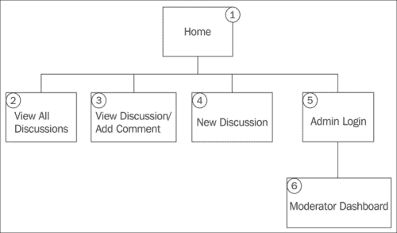
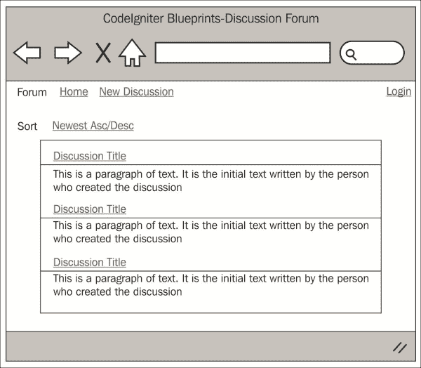
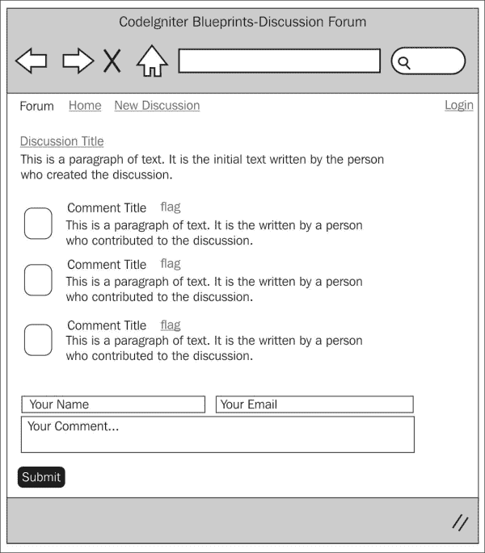
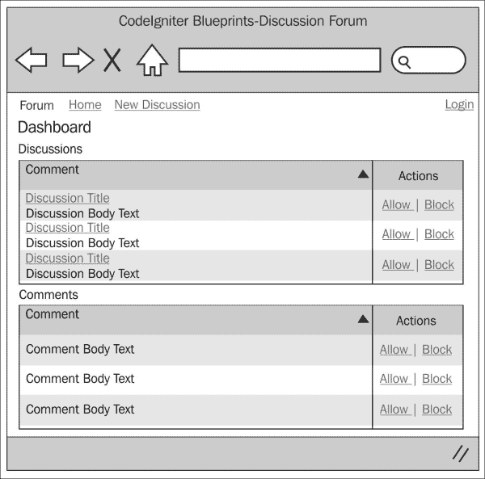

# 第三章。讨论论坛

讨论论坛可以是一个非常有用的内部公司项目资源，或者允许客户在项目上进行互动，例如。

讨论论坛是围绕特定主题或话题创建社区的一种极好方式，它充当一种维基。它们是关于某物或讨论的记录，包含观点和概念的变化历史，并记录围绕主题或主题的思考演变。它们也可以用来谈论猫。

为了创建这个应用程序，我们将创建三个控制器：一个用于处理讨论，一个用于处理评论，以及一个用于处理我们可能需要的任何管理功能，例如管理评论和讨论。

我们将创建一个语言文件来存储文本，以便在需要时提供多语言支持。

我们将对`config.php`文件进行修改，以允许加密支持，这对于会话和密码支持是必要的。

我们将创建所有必要的视图文件，甚至一个`.css`文件来帮助 Bootstrap 处理一些视图。

这个应用程序，以及这本书中的所有其他应用程序，都依赖于我们在第一章中完成的基本设置，*简介和共享项目资源*，尽管你可以将大量代码段放入你可能已经拥有的任何应用程序中；请记住，第一章中完成设置是本章的基础。

值得注意的是应用程序的限制。这个应用程序包含最基本的讨论论坛功能。我们在创建用户的过程中创建用户；然而，没有用户管理——包括这一点将是对应用程序代码的大量扩展，并且稍微超出了讨论论坛的范围。

当有人使用不在`users`表中存储的电子邮件地址创建评论或讨论时，将创建用户。为他们生成一个密码，并基于该密码创建一个哈希值。

由于这个应用程序会自动为它们创建密码，你可能希望告诉他们密码是什么——也许通过发送电子邮件。然而，你可能不希望他们能够登录。这取决于你——如果你愿意，功能都在那里。

在本章中，我们将涵盖：

+   设计和线框图

+   创建数据库

+   创建模型

+   创建视图

+   创建控制器

+   将所有内容整合在一起

因此，无需多言，让我们开始吧。

# 设计和线框图

和往常一样，在我们开始构建之前，我们应该看看我们计划构建的内容。

首先，我们需要简要描述我们的意图；我们计划开发一个应用程序，让用户可以查看任何现有的讨论页面，并且如果他们愿意，可以对该页面进行评论。用户还可以创建新的讨论，其他用户也可以对它们进行评论。

让我们看看一个网站地图：



现在，让我们逐一查看每个项目，并简要了解它们的功能：

+   **首页**：想象一下这是一个索引——路由的起点。用户将访问首页，然后被重定向到第 2 点（查看所有讨论页面）。

+   **查看所有讨论**：这将以列表形式显示所有讨论。我们还将进行一些筛选（例如，最新的首先，最受欢迎的其次，等等）。用户可以点击讨论标题，然后被重定向到查看讨论页面。

+   **查看讨论/添加评论**：此页面显示初始评论（由创建讨论的人撰写）以及所有其他用户添加的后续评论和贡献。用户可以通过在查看讨论页面底部填写表格来加入讨论。

+   **新建讨论**：用户可以创建新的讨论。然后，这个讨论将作为新的讨论出现在查看所有讨论页面。

我们现在开始查看仅管理员可用的功能（主要是讨论和评论审核），具体如下：

+   **管理员登录**：这是一个简单的登录脚本。它与第六章中使用的登录脚本不同，*创建认证系统*。

+   **版主仪表板**：此页面以列表形式显示所有待审阅的讨论和评论以及选项，以便允许或拒绝它们。

现在我们对网站的结构和形式有了相当好的了解，让我们看看每个页面的线框图。

## 查看所有讨论页面

以下截图显示了前一个图中第 2 点（查看所有讨论页面）的线框图。用户可以看到所有当前讨论，讨论创建者撰写的初始文本（这作为讨论主题的简要介绍），迄今为止的总评论数，以及将讨论排序为最新/最旧的排序方法等。



## 查看讨论/添加评论页面

以下截图显示了第 3 点（查看讨论/添加评论页面）的线框图。您可以看到，此页面显示初始讨论文本和所有回复。在回复列表底部有一个表格，允许用户加入讨论。顶部还有一个新建讨论链接；这将用户带到第 4 点（新建讨论页面）。

注意每个评论标题旁边的标记链接。如果用户点击此链接，则评论将被立即标记供管理员审查。例如，假设有人写了一些关于著名好莱坞演员的内容，或者是一些可能被认为是诽谤性的疯狂内容，比如宇宙飞船；这样的评论可以被标记供审查。如果被认为安全，可以将其设置为安全；然而，如果不安全，可以将其删除，以防止评论者被跟随到任何地方，出现在他们的工作场所，与邻居交谈等等——这是一个纯粹假设的、非现实世界、完全虚构的例子，这种情况从未发生过，甚至一次都没有。



## 新讨论页面

以下截图显示了从第 **4** 点（新讨论页面）的线框图。您可以看到用户可以创建新讨论的表单。用户被邀请输入讨论标题、他们的名字和初始讨论文本。一旦用户已将所有相关信息输入到表单中，他们点击 **Go** 按钮，表单将通过 `create()` 讨论控制器函数进行验证。


## 管理员仪表板页面

以下截图显示了从第 **6** 点（管理员仪表板页面）的仪表板截图。从该区域，管理员可以查看任何被标记的讨论和评论，并对它们进行管理，批准或删除。



## 文件概览

我们将为这个应用程序创建 15 个文件；这些文件如下：

+   `/path/to/codeigniter/application/models/discussions_model.php`: 此文件提供对数据库表 `discussions` 的读写访问。

+   `/path/to/codeigniter/application/models/comments_model.php`: 此文件提供对数据库表 `comments` 的读写访问。

+   `/path/to/codeigniter/application/models/admin_model.php`: 此文件提供对数据库的读写访问，使管理员能够管理讨论和评论。

+   `/path/to/codeigniter/application/views/discussions/new.php`: 此文件提供了一个界面，允许用户创建新的讨论；它还向用户显示任何错误或成功消息。

+   `/path/to/codeigniter/application/views/discussions/view.php`: 此文件为我们提供了一个界面，允许用户查看所有活跃的讨论。它还提供了过滤界面选项（例如，排序）。

+   `/path/to/codeigniter/application/views/comments/view.php`: 此文件为我们提供了一个界面，用于显示与用户相关的所有其他用户所写的单个讨论的所有评论。在此视图文件的底部还有一个表单，允许用户通过创建评论来加入讨论。与添加评论相关的任何验证或成功消息也将在此视图文件中显示。

+   `/path/to/codeigniter/application/views/admin/dashboard.php`: 此文件显示需要审核的评论和/或讨论列表。

+   `/path/to/codeigniter/application/views/admin/login.php`: 此文件为管理员提供了一个登录表单。

+   `/path/to/codeigniter/application/views/nav/top_nav.php`: 此文件在页面顶部提供了一个导航栏。

+   `/path/to/codeigniter/application/controllers/discussions.php`: `discussions` 控制器管理新讨论的创建并向普通用户显示讨论列表。

+   `/path/to/codeigniter/application/controllers/comments.php`: `comments` 控制器管理新评论的创建并将它们链接到讨论中。它还向普通用户显示评论列表。

+   `/path/to/codeigniter/application/controllers/admin.php`: `admin` 控制器处理管理员的登录、显示待审核的讨论和评论以及审核这些讨论和评论。

+   `/path/to/codeigniter/application/language/english/en_admin_lang.php`: 此文件为应用程序提供语言支持。

+   `/path/to/codeigniter/application/views/common/login_header.php`: 此文件包含特定的 HTML 标记，用于正确显示登录表单。

+   `/path/to/codeigniter/bootstrap/css/signin.css`: 这是一个包含特定 CSS 代码的 CSS 脚本，用于正确显示登录表单。

前述 15 个文件的文件结构如下：

```php
application/
├── controllers/
│   ├── discussions.php
│   ├── comments.php
│   ├── admin.php
├── models/
│   ├── comments_model.php
│   ├── discussions_model.php
│   ├── admin_model.php
├── views/discussions/
│   ├── view.php
│   ├── new.php
├── views/comments/
│   ├── view.php
├── views/admin/
│   ├── login.php
│   ├── dashboard.php
├── views/nav/
│   ├── top_nav.php
├── views/common/
│   ├── login_header.php
├── language/english/
│   ├── en_admin_lang.php
bootstrap/
├── css/
    ├── signin.css
```

注意列表中的最后一项：“`signin.css`”。它位于`bootstrap/css/`文件夹中，与 CodeIgniter 的`application`文件夹处于同一级别。我们在第一章，*简介和共享项目资源*中安装了 Twitter Bootstrap。在本章中，我们将介绍将`bootstrap`文件夹放置在此文件夹级别和位置的方法。

# 创建数据库

好的，你应该已经按照第一章，*简介和共享项目资源*中描述的方式设置了 CodeIgniter 和 Bootstrap。如果没有，那么你应该知道，本章中的代码是专门针对第一章的设置编写的。然而，如果你没有这样做，也没有关系——代码可以轻松地应用于其他情况。

首先，我们将构建数据库。将以下 MySQL 代码复制到您的数据库中：

```php
CREATE DATABASE 'discuss_forum';
USE 'discuss_forum';

DROP TABLE IF EXISTS 'ci_sessions';
CREATE TABLE 'ci_sessions' (
  'session_id' varchar(40) COLLATE utf8_bin NOT NULL DEFAULT '0',
  'ip_address' varchar(16) COLLATE utf8_bin NOT NULL DEFAULT '0',
  'user_agent' varchar(120) COLLATE utf8_bin DEFAULT NULL,
  'last_activity' int(10) unsigned NOT NULL DEFAULT '0',
  'user_data' text COLLATE utf8_bin NOT NULL,
  PRIMARY KEY ('session_id'),
  KEY 'last_activity_idx' ('last_activity')
) ENGINE=MyISAM DEFAULT CHARSET=utf8 COLLATE=utf8_bin;

DROP TABLE IF EXISTS 'comments';
CREATE TABLE 'comments' (
  'cm_id' int(11) NOT NULL AUTO_INCREMENT,
  'ds_id' int(11) NOT NULL,
  'cm_body' text NOT NULL,
  'cm_created_at' timestamp NOT NULL DEFAULT CURRENT_TIMESTAMP,
  'usr_id' int(11) NOT NULL,
  'cm_is_active' int(1) NOT NULL,
  PRIMARY KEY ('cm_id')
) ENGINE=InnoDB DEFAULT CHARSET=utf8;

DROP TABLE IF EXISTS 'discussions';
CREATE TABLE 'discussions' (
  'ds_id' int(11) NOT NULL AUTO_INCREMENT,
  'usr_id' int(11) NOT NULL,
  'ds_title' varchar(255) NOT NULL,
  'ds_body' text NOT NULL,
  'ds_created_at' timestamp NOT NULL DEFAULT CURRENT_TIMESTAMP,
  'ds_is_active' int(1) NOT NULL,
  PRIMARY KEY ('ds_id')
) ENGINE=InnoDB AUTO_INCREMENT=1 DEFAULT CHARSET=utf8;

DROP TABLE IF EXISTS 'users';
CREATE TABLE 'users' (
  'usr_id' int(11) NOT NULL AUTO_INCREMENT,
  'usr_name' varchar(25) NOT NULL,
  'usr_hash' varchar(255) NOT NULL,
  'usr_email' varchar(125) NOT NULL,
  'usr_created_at' timestamp NOT NULL DEFAULT CURRENT_TIMESTAMP,
  'usr_is_active' int(1) NOT NULL,
  'usr_level' int(1) NOT NULL,
  PRIMARY KEY ('usr_id')
) ENGINE=InnoDB AUTO_INCREMENT=1 DEFAULT CHARSET=utf8;
```

### 小贴士

如果您不想调用数据库`discuss_forum`，也可以不这样做。如果您愿意，可以将其重命名为其他名称；只需确保相应地更新`config/database.php`文件。

您会看到我们创建的第一个表是`ci_sessions`；我们需要这个表来允许 CodeIgniter 管理会话，特别是登录用户。然而，这只是从*CodeIgniter 用户指南*中可用的标准会话表，因此我不会包括表的描述，因为它不是技术特定于这个应用程序的。但是，如果您感兴趣，可以在[`ellislab.com/codeigniter/user-guide/libraries/sessions.html`](http://ellislab.com/codeigniter/user-guide/libraries/sessions.html)找到描述。

好的，让我们逐个查看每个表中的每个条目，看看它的含义。下表描述了`comments`表：

| 表：comments |
| --- |
| **元素** | **描述** |
| `cm_id` | 这是主键。 |
| `ds_id` | 这是来自`discussions`表的外键；它将`comments`表链接到`discussions`表。链接为`discussions.ds_id = comments.cm_id`。 |
| `cm_body` | 这是评论的正文。 |
| `cm_created_at` | 这是记录创建时创建的 MySQL 时间戳。 |
| `usr_id` | 这是来自`users`表的外键。当有人输入一个电子邮件地址（在创建讨论或评论时）且该电子邮件地址在`users`表中不存在时，会创建一个用户。 |
| `cm_is_active` | 这表示评论是否活跃（`1`）或非活跃（`0`）；非活跃表示评论不会在论坛中显示，但会在管理员仪表板中显示给管理员进行审核。 |

下表描述了`discussions`表：

| 表：discussions |
| --- |
| **元素** | **描述** |
| `ds_id` | 这是主键。 |
| `usr_id` | 这是来自`users`表的外键。当有人输入一个电子邮件地址（在创建讨论或评论时）且该电子邮件地址在用户表中不存在时，会创建一个用户。 |
| `ds_title` | 这是讨论论坛的标题。 |
| `ds_body` | 这是讨论论坛的主体元素；它是创建讨论的人为了吸引人们评论而写的初始文本——通常是一个问题。 |
| `ds_created_at` | 这是记录创建时创建的 MySQL 时间戳。 |
| `ds_is_active` | 这表示讨论论坛是否活跃（`1`）或非活跃（`0`）；非活跃表示讨论不会在页面上显示，但会在管理员仪表板中显示给管理员进行审核。 |

下表描述了`users`表：

| 表：users |
| --- |
| **元素** | **描述** |
| `usr_id` | 这是主键。 |
| `usr_name` | 这是在数据库中个人的用户名。 |
| `usr_hash` | 这是他们的密码的哈希值。密码在 `comments_model` 的 `new_comment()` 函数和 `discussions_model` 的 `create()` 函数中生成，并通过 `$this->encrypt->sha1()` CodeIgniter 函数创建哈希值。哈希值存储在数据库的 `users.usr_hash` 中；然而，密码并未存储（正如您所期望的）。 |
| `usr_email` | 这是撰写评论或创建讨论论坛的人的电子邮件。应用程序将在 `users` 表中查找该电子邮件是否已存在。如果已存在，则将该记录的主键（`usr_id`）分配给评论或讨论论坛。如果电子邮件不存在，则在 `users` 表中创建一行，然后将主键分配给评论或讨论。 |
| `usr_created_at` | 这是记录创建时创建的 MySQL 时间戳。 |
| `usr_is_active` | 这表示用户是否活跃（`1`）或非活跃（`0`）。目前，没有处理活跃或非活跃用户的功能；如果您愿意，可以自行实现这一功能。 |
| `usr_level` | 这表示用户的权限级别。标准用户被赋予整数值 1，管理员（即可以登录的人）被赋予整数值 2。没有使用此 `usr_level` 元素的功能；然而，如果您愿意扩展它，它就在那里。 |

在这个早期阶段，讨论这个应用程序中用户的概念非常重要。我们不会真正使用任何详细的用户管理，用户只有在添加评论或创建讨论时输入他们的电子邮件地址时才会被创建。我们在这里创建用户是因为这将使您在您自己的时间里扩展此功能以管理用户变得容易，如果您愿意的话。

我们还需要对 `config/database.php` 文件进行修改——即设置数据库访问详情、用户名和密码等。步骤如下：

1.  打开 `config/database.php` 文件，找到以下行：

    ```php
    $db['default']['hostname'] = 'localhost';
    $db['default']['username'] = 'your username';
    $db['default']['password'] = 'your password';
    $db['default']['database'] = 'urls';
    ```

1.  编辑前述行中的值，确保用更具体于您的设置和情况的值替换这些值。输入您的用户名、密码等。

# 调整 `config.php` 文件

在此文件中，我们需要配置一些内容以支持会话和加密。因此，打开 `config/config.php` 文件，并根据本节描述进行更改。

我们需要设置一个加密密钥。会话以及 CodeIgniter 的加密功能都需要在 `$config` 数组中设置一个加密密钥，因此请执行以下步骤：

1.  找到以下行：

    ```php
    $config['encryption_key'] = '';
    ```

    更改为以下内容：

    ```php
    $config['encryption_key'] = 'a-random-string-of-alphanum-characters';
    ```

    ### 小贴士

    现在，实际上不要将此值更改为一个随机的字母数字字符序列，而是改为，嗯，一个随机的字母数字字符序列——如果这说得通。是的，你知道我的意思。

1.  找到以下行：

    ```php
    $config['sess_cookie_name'] = 'ci_session';
    $config['sess_expiration'] = 7200;
    $config['sess_expire_on_close'] = FALSE;
    $config['sess_encrypt_cookie'] = FALSE;
    $config['sess_use_database'] = FALSE;
    $config['sess_table_name'] = 'ci_sessions';
    $config['sess_match_ip'] = FALSE;
    $config['sess_match_useragent'] = TRUE;
    $config['sess_time_to_update'] = 300;
    ```

    将它们更改为以下内容：

    ```php
    $config['sess_cookie_name'] = 'ci_session';
    $config['sess_expiration'] = 7200;
    $config['sess_expire_on_close'] = TRUE;
    $config['sess_encrypt_cookie'] = TRUE;
    $config['sess_use_database'] = TRUE;
    $config['sess_table_name'] = 'ci_sessions';
    $config['sess_match_ip'] = TRUE;
    $config['sess_match_useragent'] = TRUE;
    $config['sess_time_to_update'] = 300;
    ```

# 调整`routes.php`文件

我们希望将用户重定向到`discussions`控制器而不是默认的 CodeIgniter `welcome`控制器。为此，我们需要修改`routes.php`文件中的默认控制器设置以反映这一点，可以按照以下方式操作：

1.  打开`config/routes.php`文件进行编辑，并找到以下行（文件底部附近）：

    ```php
    $route['default_controller'] = "welcome";
    $route['404_override'] = '';
    ```

1.  首先，我们需要更改默认控制器。最初在一个 CodeIgniter 应用程序中，默认控制器设置为`welcome`；然而，我们不需要这个。我们希望默认控制器是`discussions`。所以，找到以下行：

    ```php
    $route['default_controller'] = "welcome";
    ```

    将其更改为以下内容：

    ```php
    $route['default_controller'] = "discussions";
    ```

# 创建模型

我们将为这个应用程序创建三个模型；具体如下：

+   `discussions_model.php`：这有助于管理与`discussions`表的交互

+   `comments_model.php`：这有助于管理与`comments`表的交互

+   `admin_model.php`：这有助于管理与`users`表的交互

## 创建模型文件 - models/discussions_model.php

`discussions_model.php`模型文件有三个函数；这些是`fetch_discussions()`、`fetch_discussion()`和`flag()`。`fetch_discussions()`函数获取多个讨论，`fetch_discussion()`函数获取单个讨论，而`flag()`函数将讨论设置为需要管理员审核的讨论。

创建此模型文件的步骤如下：

创建`/path/to/codeigniter/application.models/discussion_model.php`文件，并将以下代码添加到其中：

```php
<?php if ( ! defined('BASEPATH')) exit('No direct script access allowed');

class Discussions_model extends CI_Model {
  function __construct() {
    parent::__construct();
  }
```

让我们先看看`fetch_discussions()`函数。`fetch_discussions()`函数将返回对`discussions`控制器`index()`函数的数据库查询结果。它接受两个默认设置为`null`的参数。这些是`$filter`和`$direction`，它们用于向查询字符串添加过滤和排序。

以下查询将仅返回活跃的讨论——也就是说，任何`ds_is_active`值未设置为`0`的讨论。`discussions_model`（稍后讨论）的`flag()`函数将一个讨论设置为非活动状态：

```php
function fetch_discussions($filter = null, $direction = null) {
  $query = "SELECT * FROM 'discussions', 'users' 
            WHERE 'discussions'.'usr_id' = 'users'.'usr_id'
            AND 'discussions'.'ds_is_active' != '0' ";
```

如果`filter`变量最初为`null`，那么我们需要将结果排序为升序。在以下代码中，我们测试`$filter`是否等于`null`；如果不等于，则`$dir = 'ASC'`将方向设置为升序。如果`$filter`不是`null`，那么我们将进入 PHP `if`语句并查看`$direction`的值。我们执行 PHP `switch case`过程以快速确定`$direction`的值是`ASC`还是`DESC`，并相应地将`$dir`的值写入`ASC`或`DESC`：

```php
if ($filter != null) {
  if ($filter == 'age') {
    $filter = 'ds_created_at';
    switch ($direction) {
      case 'ASC':
        $dir = 'ASC';
        break;
      case 'DESC':
        $dir = 'DESC';
        break;
      default:
        $dir = 'ASC';
    }
  }
} else {
  $dir = 'ASC';
}
```

接下来，执行查询并分析其返回值。如果查询成功，则`$result`返回到`discussions`控制器的`index()`函数。`discussions`控制器的`index()`函数然后将此查询结果存储在`$page_data['query']`数组项中，并将其传递给`discussions/view.php`视图文件。这在这里显示：

```php
$query .= "ORDER BY 'ds_created_at' " . $dir;
$result = $this->db->query($query, array($dir));

if ($result) {
  return $result;
} else {
  return false;
}
}

function fetch_discussion($ds_id) {
  $query = "SELECT * FROM 'discussions', 'users' WHERE 'ds_id' = ?
            AND 'discussions'.'usr_id' = 'users'.'usr_id'";
  return $result = $this->db->query($query, array($ds_id));
}
```

现在，让我们看看`create($data)`函数。该函数接受一个数组（命名为`$data`）作为其唯一参数。`$data`数组包含以下项：

+   `usr_email`：这是从`views/discussions/new.php`中的表单中填充的

+   `usr_id`：这是由模型本身通过在数据库中查找来填充的

+   `usr_name`：这是从`views/discussions/new.php`中的表单中填充的

+   `ds_title`：这是从`views/discussions/new.php`中的表单中填充的

+   `ds_body`：这是从`views/discussions/new.php`中的表单中填充的

我们希望将这个讨论论坛与一个用户关联起来。尽管在这个应用程序中我们并不真正管理用户，但我们仍然想这样做，因为这可能在将来对我们有用。要将讨论与用户关联起来，我们需要找到一个现有的用户 ID（`users.usr_id`）或者创建一个新的用户并分配该 ID。

这个函数首先查看`users`表，看看`$data['usr_email']`中的电子邮件地址是否已经在数据库中存在。如果存在，则从`users`表中提取`usr_id`并写入到`$data['usr_id']`；这将一直存储到我们更新到`discussions`表：

```php
function create($data) {
  // Look and see if the email address already exists in the users 
  // table, if it does return the primary key, if not create them 
  // a user account and return the primary key.
  $usr_email = $data['usr_email'];
  $query = "SELECT * FROM 'users' WHERE 'usr_email' = ? ";
  $result = $this->db->query($query,array($usr_email));

  if ($result->num_rows() > 0) {
    foreach ($result->result() as $rows) {
      $data['usr_id'] = $rows->usr_id;
    }
  } else {
```

如果电子邮件地址在`users`表中不存在，则创建一个记录。使用`random_string()` CodeIgniter 函数生成密码。密码存储在`$password`变量中，并传递给`sha1` CodeIgniter 函数以生成哈希字符串：

```php
$password = random_string('alnum', 16);
$hash = $this->encrypt->sha1($password);
```

用户提交的`$hash`值以及`usr_email`和`usr_name`被添加到`$user_data`数组中。还添加到`$user_data`数组中的一些管理员标志，如`usr_is_active`和`usr_level`。

默认情况下，`usr_is_active`标志设置为`1`；如果您想添加用户管理功能，可以将其设置为任何其他您希望的价值。默认情况下，`usr_level`标志设置为`1`；如果您想添加用户管理功能，可以将其设置为任何其他您希望的价值：

```php
$user_data = array('usr_email' => $data['usr_email'],
                   'usr_name' => $data['usr_name'],
                   'usr_is_active' => '1',
                   'usr_level' => '1',
                   'usr_hash' => $hash);
```

`$user_data`数组被插入到数据库中。如果您愿意，您可以发送一封包含用户密码的电子邮件；这仅因为您想添加用户管理功能。新创建的用户 ID 通过`$this->db->insert_id()`返回并存储在`$data['usr_id']`中。这在这里显示：

```php
  if ($this->db->insert('users',$user_data)) {
    $data['usr_id'] = $this->db->insert_id();
    // Send email with password???
  }
}
```

一旦用户 ID 存储在`$data`数组中，我们创建一个新的数组`$discussion_data`。`$discussion_data`数组包含创建讨论所需的所有数据，如下所示：

+   `ds_title`：这是从`views/discussions/new.php`中的表单中填充的

+   `ds_body`：这是从`views/discussions/new.php`中的表单中填充的

+   `usr_id`：这是通过数据库查找填充的

+   `ds_is_active`：这是在创建`$discussion_data`数组时设置的

一旦创建`$discussion_data`数组，我们就将其记录写入讨论表：

```php
$discussion_data = array('ds_title' => $data['ds_title'],
                         'ds_body' => $data['ds_body'],
                         'usr_id' => $data['usr_id'],
                         'ds_is_active' => '1');
```

如果插入成功，我们返回`TRUE`；如果未成功，我们返回`FALSE`。

此模型还包含`flag()`函数。`flag()`函数使用`UPDATE`命令将`ds_is_active`列设置为`0`。这意味着讨论将不会显示给用户，因为`discussions_model`的`fetch_discussions()`函数只会返回`ds_is_active`设置为`1`的讨论。如下所示：

```php
  if ($this->db->insert('discussions',$discussion_data) ) {
    return $this->db->insert_id();
  } else {
    return false;
  }
}
```

`flag()`函数接受一个参数——即由`discussions`控制器传递的讨论的主键。当用户点击`views/discussions/view.php`文件中讨论标题旁边的**flag**链接时，会调用`discussions`控制器的`flag()`函数。**flag**链接的第三个`uri`段是讨论的主键。

我们使用 CodeIgniter 的 Active Record 功能来更新数据库中的讨论记录，将`ds_is_active`设置为`0`。将`ds_is_active`设置为`0`将立即阻止讨论在`views/discussions/view.php`中显示，并使其出现在管理员部分以供审核：

```php
  function flag($ds_id) {
    $this->db->where('ds_id', $ds_id);
    if ($this->db->update('discussions', array('ds_is_active' => '0'))) {
      return true;
    } else {
      return false;
    }
  }
}
```

## 创建模型文件——comments_model.php

`comments_model.php`模型文件包含三个函数；这些是`fetch_comments()`、`new_comment()`和`flag()`。`fetch_comments()`函数获取属于讨论论坛的所有活动评论。`new_comment()`函数通过外键将评论添加到与讨论论坛关联的数据库中。最后，`flag()`函数将评论设置为需要审核的评论。

创建`/path/to/codeigniter/application/models/comments_model.php`文件，并将以下代码添加到其中：

```php
<?php if ( ! defined('BASEPATH')) exit('No direct script access allowed');

class Comments_model extends CI_Model {
    function __construct() {
        parent::__construct();
    }
```

此模型中有三个函数。具体如下：

+   `fetch_comments()`: 这将从`comments`表中获取与当前讨论相关联的所有活动评论。

+   `new_comments()`: 这将在`comments`表中创建一个新的记录。评论与`users.usr_id`和`discussions.ds_id`相关联。

+   `flag()`：这通过将`comments.cm_is_active`设置为`0`来设置一个评论为需要审核的评论。

`fetch_comments()`函数接受一个参数——`$ds_id`——这是数据库中讨论的主键。我们取这个主键，在数据库中查找属于该讨论的评论和属于评论的用户，如下所示：

```php
function fetch_comments($ds_id) {
    $query = "SELECT * FROM 'comments', 'discussions', 'users' 
              WHERE 'discussions'.'ds_id' = ?
               AND 'comments'.'ds_id' = 'discussions'.'ds_id' 
               AND 'comments'.'usr_id' = 'users'.'usr_id' 
               AND 'comments'.'cm_is_active' = '1' 
               ORDER BY 'comments'.'cm_created_at' DESC " ;

        $result = $this->db->query($query, array($ds_id));
```

这些评论随后作为 Active Record 数据库结果对象返回。或者，如果发生错误，则返回布尔值`false`，如下所示：

```php
    if ($result) {
        return $result;
    } else {
        return false;
    }
}
```

`new_comment()`函数接受一个参数，即`$data`数组。这个数组在`comments`控制器中填充，如下所示：

```php
function new_comment($data) {
    // Look and see if the email address already exists in the users 
    // table, if it does return the primary key, if not create them 
    // a user account and return the primary key.
```

首先，我们检查评论者使用的电子邮件地址是否已经在数据库中存在；我们这样做是因为我们可能想要以后添加禁止特定用户的功能，删除特定用户的帖子，或者甚至开发允许用户登录并查看他们以前帖子的功能：

```php
        $usr_email = $data['usr_email'];
        $query = "SELECT * FROM 'users' WHERE 'usr_email' = ? ";
        $result = $this->db->query($query,array($usr_email));

        if ($result->num_rows() > 0) {
```

如果我们在代码中到达这里，那么显然电子邮件地址已经在数据库中，所以我们抓取用户的主键并将其存储在 `$data['usr_id']` 中；稍后，我们将将其保存到评论中：

```php
    foreach ($result->result() as $rows) {
        $data['usr_id'] = $rows->usr_id;
    }
} else {
```

如果我们到达这里，那么该用户不存在，所以我们将在 `users` 表中创建他们，并使用 `$this->d->insert_id()` CodeIgniter 函数返回主键：

```php
    $password = random_string('alnum', 16);
    $hash = $this->encrypt->sha1($password); 

    $user_data = array('usr_email' => $data['usr_email'],
                       'usr_name' => $data['usr_name'],
                       'usr_is_active' => '1',
                       'usr_level' => '1',
                       'usr_hash' => $hash);

    if ($this->db->insert('users',$user_data)) {
        $data['usr_id'] = $this->db->insert_id();
    }
}

$comment_data = array('cm_body' => $data['cm_body'],
                      'ds_id' => $data['ds_id'],
                      'cm_is_active' => '1',
                      'usr_id' => $data['usr_id']);
```

现在，我们使用 CodeIgniter Active Record 函数 `$this->db->insert()` 将评论保存到 `comments` 表中。如下所示：

```php
        if ($this->db->insert('comments',$comment_data) ) {
            return $this->db->insert_id();
        } else {
            return false;
        }
    }

  function flag($cm_id) {
    $this->db->where('cm_id', $cm_id);
    if ($this->db->update('comments', array('cm_is_active' => '0'))) {
      return true;
    } else {
      return false;
    }
  } 
}
```

## 创建模型文件 – admin_model.php

`admin_model.php` 模型中有四个函数，具体如下：

+   `dashboard_fetch_comments()`：从数据库中检索已标记为待审核的评论。

+   `dashboard_fetch_discussions()`：从数据库中检索已标记为待审核的讨论。

+   `update_comments()`：根据版主的决策更新评论，如果评论被批准则将 `cm_is_active` 的值更改为 `1`，如果不批准则删除它。

+   `update_discussions()`：根据版主的决策更新讨论，如果批准则将 `cm_is_active` 的值更改为 `1`，如果不批准则删除它。如果删除讨论，则与该讨论关联的所有评论也将被删除。

创建 `/path/to/codeigniter/application/models/admin_model.php` 文件，并将以下代码添加到其中：

```php
<?php if ( ! defined('BASEPATH')) exit('No direct script access allowed');

class Admin_model extends CI_Model {
    function __construct() {
        parent::__construct();
    }
```

以下函数将从数据库中检索所有待审核的评论。如果 `comments.cm_is_active` 设置为 `0`，则评论需要审核。数据库被查询，所有待审核的评论将返回给 `admin` 控制器。这个结果最终将在 `views/admin/dashboard.php` 文件中循环遍历：

```php
function dashboard_fetch_comments() {
    $query = "SELECT * FROM 'comments', 'users' 
              WHERE 'comments'.'usr_id' = 'users'.'usr_id'
              AND 'cm_is_active' = '0' ";

    $result = $this->db->query($query);

    if ($result) {
        return $result;
    } else {
        return false;
    }
}
```

以下函数将从数据库中检索所有待审核的讨论。如果 `discussions.ds_is_active` 设置为 `0`，则讨论需要审核。数据库被查询，所有待审核的讨论将返回给 `admin` 控制器。这个结果最终将在 `views/admin/dashboard.php` 文件中循环遍历：

```php
function dashboard_fetch_discussions() {
    $query = "SELECT * FROM 'discussions', 'users' 
             WHERE 'discussions'.'usr_id' = 'users'.'usr_id'
             AND 'ds_is_active' = '0' ";

    $result = $this->db->query($query);

    if ($result) {
        return $result;
    } else {
        return false;
    }
}

function does_user_exist($email) {
    $this->db->where('usr_email', $email);
    $query = $this->db->get('users');
    return $query;
} 
```

当管理员审核评论时，由 `admin` 控制器函数调用的以下函数。如果评论被认为是可以的，则更新 `comments.cm_is_active` 并将其设置为 `1`。然而，如果它不可行，则从 `comments` 表中删除该评论：

```php
function update_comments($is_active, $id) {
    if ($is_active == 1) {
        $query = "UPDATE 'comments' SET 'cm_is_active' = ? WHERE 'cm_id' = ? " ;
        if ($this->db->query($query,array($is_active,$id))) {
            return true;
        } else {
            return false;
        }
    } else {
        $query = "DELETE FROM 'comments' WHERE 'cm_id' = ?  " ;
        if ($this->db->query($query,array($id))) {
            return true;
        } else {
            return false;
        } 
    } 
}
```

当管理员正在管理讨论时，以下函数会被`admin`控制器函数调用。如果讨论被认为是可以的，那么`discussions.ds_is_active`会被更新并设置为`1`。然而，如果它不可行，那么讨论将从`discussions`表中删除。属于该讨论的所有评论也将从`comments`表中删除：

```php
    function update_discussions($is_active, $id) {
        if ($is_active == 1) {
            $query = "UPDATE 'discussions' SET 'ds_is_active' = ? WHERE 'ds_id' = ? " ;
            if ($this->db->query($query, array($is_active,$id))) {
                return true;
            } else {
                return false;
            } 
        } else {
            $query = "DELETE FROM 'discussions' WHERE 'ds_id' = ?  " ;
            if ($this->db->query($query,array($id))) {
                $query = "DELETE FROM 'comments' WHERE 'ds_id' = ?  " ;
                if ($this->db->query($query,array($id))) {
                    return true;
                }
            } else {
                return false;
            } 
        } 
    }
}
```

# 创建视图

这个应用程序中有六个视图文件，具体如下：

+   `discussions/view.php`：这个文件显示所有活跃的讨论

+   `discussions/new.php`：这个文件向用户显示一个表单，允许他们创建一个讨论

+   `comments/view.php`：这个文件显示讨论中的所有活跃评论

+   `nav/top_nav.php`：这个文件包含顶部导航链接

+   `admin/login.php`：这个文件显示用户的登录表单；别忘了添加`signin.css`脚本，你可以在本章后面找到它

+   `common/login_header.php`：`views/admin/login.php`视图需要与应用程序其余部分不同的资源，这由这个头部支持

## 讨论区

`discussions/view.php`视图文件显示所有活跃讨论的列表以及排序选项。

创建`/path/to/codeigniter/views/discussions/view.php`文件，并向其中添加以下代码：

```php
SORT: <?php echo anchor('discussions/index/sort/age/' . (($dir == 'ASC') ? 'DESC' : 'ASC'),'Newest ' 
            . (($dir == 'ASC') ? 'DESC' : 'ASC'));?>

<table class="table table-hover">
  <thead>
    <tr>
      <th><?php echo $this->lang->line('discussions_title') ; ?></th>
    </tr>
  </thead>
  <tbody>

    <?php foreach ($query->result() as $result) : ?>
      <tr>
        <td>
          <?php echo anchor('comments/index/'.$result->ds_id,$result->ds_title) . ' '
                . $this->lang->line('comments_created_by') . $result->usr_name; ?>

          <?php echo anchor('discussions/flag/'.$result->ds_id,
          $this->lang->line('discussion_flag')) ; ?>
          <br />
          <?php echo $result->ds_body ; ?>
        </td>
      </tr>
    <?php endforeach ; ?>

  </tbody>
</table>
```

看看前几行。我们以 CodeIgniter 的`anchor()`语句开始。让我们更仔细地看看链接的代码：

```php
SORT: <?php echo anchor('discussions/index/sort/age/' . (($dir == 'ASC') ? 'DESC' : 'ASC'),'Newest ' . (($dir == 'ASC') ? 'DESC' : 'ASC'));?>
```

让我们将这个内容分解成更小的部分：

+   `anchor('discussions/index/age/sort/' .`：这设置了`discussions`控制器`index()`函数的链接，并按年龄（创建日期——`discussions.ds_created_at`）进行排序，但方向是什么？嗯…

+   `(($dir == 'ASC') ? 'DESC' : 'ASC'),`：`$dir`的值来自`discussions`控制器的`index()`函数。它是当前排序的方向。然后我们使用 PHP 三元运算符在方向之间切换。它有点像 if/else 语句，但更紧凑。它的工作方式是这样的：*如果变量等于（或不等于）另一个变量，则执行 A，否则执行 B*。例如，作为一个 if/else 语句，代码将是如下所示：

    ```php
    if ($dir == 'ASC') {
      return 'DESC';
    } else {
      return 'ASC';
    }
    ```

    因此，链接的第二部分将根据`$dir`中保存的值在`ASC`和`DESC`之间切换。现在，让我们看看其余的部分。

+   `'Newest ' . (($dir == 'ASC') ? 'DESC' : 'ASC'));?>`：这是用户将看到的链接文本。您可以看到我们再次使用了三元运算符来显示文本，在`Newest ASC`和`Newest DESC`之间切换。

视图的其余部分相当简单；我们只是遍历来自讨论`index()`函数的数据库结果，在遍历过程中显示所有活跃的讨论。

## 评论

评论视图向用户显示所选讨论的所有有效评论列表。

创建`/path/to/codeigniter/application/views/comments/view.php`文件，并向其中添加以下代码：

```php
<!-- Discussion - initial comment -->
<?php foreach ($discussion_query->result() as $discussion_result) : ?>
  <h2>
      <?php echo $discussion_result->ds_title; ?><br />
      <small><?php echo $this->lang->line('comments_created_by') . $discussion_result->usr_name . $this->lang->line('comments_created_at') . $discussion_result->ds_created_at; ?></small>
  </h2>
  <p class="lead"><?php echo $discussion_result->ds_body; ?></p>
<?php endforeach ; ?>

<!-- Comment - list of comments -->
<?php foreach ($comment_query->result() as $comment_result) : ?>
  <li class="media">
    <a class="pull-left" href="#">
      
    </a>
    <div class="media-body">
      <h4 class="media-heading"><?php echo $comment_result->usr_name . anchor('comments/flag/'.$comment_result->ds_id . '/' . $comment_result->cm_id,$this->lang->line('comments_flag')) ; ?></h4>
      <?php echo $comment_result->cm_body ; ?>
    </div>
  </li>
<?php endforeach ; ?>

<!-- Form - begin form section -->
<br /><br />
<p class="lead"><?php echo $this->lang->line('comments_form_instruction');?></p>

<?php echo validation_errors(); ?>
<?php echo form_open('comments/index','role="form"') ; ?>
    <div class="form-group col-md-5">
      <label for="comment_name"><?php echo $this->lang->line('comments_comment_name');?></label>
      <input type="text" name="comment_name" class="form-control" id="comment_name" value="<?php echo set_value('comment_name'); ?>">
    </div>
    <div class="form-group col-md-5">
      <label for="comment_email"><?php echo $this->lang->line('comments_comment_email');?></label>
      <input type="email" name="comment_email" class="form-control" id="comment_email" value="<?php echo set_value('comment_email'); ?>">
    </div>
    <div class="form-group  col-md-10">
      <label for="comment_body"><?php echo $this->lang->line('comments_comment_body');?></label>
      <textarea class="form-control" rows="3" name="comment_body" id="comment_body"><?php echo set_value('comment_body'); ?></textarea>
    </div>
    <div class="form-group  col-md-11">
      <button type="submit" class="btn btn-success"><?php echo $this->lang->line('common_form_elements_go');?></button>
    </div>
  <?php echo form_hidden('ds_id',$ds_id) ; ?>
<?php echo form_close() ; ?> 
```

注意表单中的以下行：

```php
<button type="submit" class="btn btn-success"><?php echo $this->lang->line('common_form_elements_go');?></button>
```

你会注意到我们使用了一个不在代码示例中的`lang`文件中的行；这是因为`common_form_elements_go`行可以在第一章中找到，*引言和共享项目资源*。

## 新讨论

新讨论视图向用户显示一个表单以及可能需要传达的任何验证错误信息。

创建`/path/to/codeigniter/application/views/discussions/new.php`文件，并向其中添加以下代码：

```php
<!-- Form - begin form section -->
<br /><br />
<p class="lead"><?php echo $this->lang->line('discussion_form_instruction');?></p>

<?php echo validation_errors(); ?>
<?php echo form_open('discussions/create','role="form"') ; ?>
    <div class="form-group col-md-5">
      <label for="usr_name"><?php echo $this->lang->line('discussion_usr_name');?></label>
      <input type="text" name="usr_name" class="form-control" id="usr_name" value="<?php echo set_value('usr_name'); ?>">
    </div>
    <div class="form-group col-md-5">
      <label for="usr_email"><?php echo $this->lang->line('discussion_usr_email');?></label>
      <input type="email" name="usr_email" class="form-control" id="usr_email" value="<?php echo set_value('usr_email'); ?>">
    </div>
    <div class="form-group col-md-10">
      <label for="ds_title"><?php echo $this->lang->line('discussion_ds_title');?></label>
      <input type="text" name="ds_title" class="form-control" id="ds_title" value="<?php echo set_value('ds_title'); ?>">
    </div>
    <div class="form-group  col-md-10">
      <label for="ds_body"><?php echo $this->lang->line('discussion_ds_body');?></label>
      <textarea class="form-control" rows="3" name="ds_body" id="ds_body"><?php echo set_value('ds_body'); ?></textarea>
    </div>
    <div class="form-group  col-md-11">
      <button type="submit" class="btn btn-success"><?php echo $this->lang->line('common_form_elements_go');?></button>
    </div>
<?php echo form_close() ; ?>
```

注意表单中的以下行：

```php
<button type="submit" class="btn btn-success"><?php echo $this->lang->line('common_form_elements_go');?></button>
```

你会注意到我们使用了一个不在代码示例中的`lang`文件中的行；这是因为`common_form_elements_go`行可以在第一章中找到，*引言和共享项目资源*。

我们向用户提供创建新讨论的选项。我们显示表单元素，让他们输入用户名、电子邮件、讨论标题以及他们的讨论文本。

表单提交给`discussion`控制器的`create()`函数，在那里它将进行验证，并显示任何验证错误。

## `top_nav`文件

本书中的每个项目都有自己的导航文件，这也不例外。`top_nav`文件是标准的 Bootstrap 导航代码；然而，有几个 Codeigniter 的`anchor()`函数提供了 URL 链接和文本。

创建`/path/to/codeigniter/application/views/common/top_nav.php`文件，并向其中添加以下代码：

```php
<!-- Fixed navbar -->
<div class="navbar navbar-inverse navbar-fixed-top" role="navigation">
  <div class="container">
    <div class="navbar-header">
      <button type="button" class="navbar-toggle" data-toggle="collapse" data-target=".navbar-collapse">
        <span class="sr-only">Toggle navigation</span>
        <span class="icon-bar"></span>
        <span class="icon-bar"></span>
        <span class="icon-bar"></span>
      </button>
      <a class="navbar-brand" href="#"><?php echo $this->lang->line('system_system_name'); ?></a>
    </div>
    <div class="navbar-collapse collapse">
      <ul class="nav navbar-nav">
        <li <?php if ($this->uri->segment(1) == '') {echo 'class="active"';} ; ?>><?php echo anchor('/', $this->lang->line('top_nav_view_discussions')) ; ?></li>
        <li <?php if ($this->uri->segment(1) == 'discussions') {echo 'class="active"';} ; ?>><?php echo anchor('discussions/create', $this->lang->line('top_nav_new_discussion')) ; ?></li>
      </ul>

      <ul class="nav navbar-nav navbar-right">
        <li><?php echo anchor('admin/login', $this->lang->line('top_nav_login')) ; ?></li>
      </ul>
    </div><!--/.nav-collapse -->
  </div>
</div>

<div class="container theme-showcase" role="main">
```

## 登录视图

登录视图在管理员想要登录时向其显示表单和任何错误信息。

创建`/path/to/codeigniter/application/views/admin/login.php`文件，并向其中添加以下代码：

```php
<?php if (isset($login_fail)) : ?>
  <div class="alert alert-danger"><?php echo $this->lang->line('admin_login_error') ; ?></div>
<?php endif ; ?>
<?php echo validation_errors(); ?>

<div class="container">
  <?php echo form_open('admin/login', 'class="form-signin" role="form"') ; ?>
    <h2 class="form-signin-heading"><?php echo $this->lang->line('admin_login_header') ; ?></h2>
    <input type="email" name="usr_email" class="form-control" placeholder="<?php echo $this->lang->line('admin_login_email') ; ?>" required autofocus>
    <input type="password" name="usr_password" class="form-control" placeholder="<?php echo $this->lang->line('admin_login_password') ; ?>" required>
    <button class="btn btn-lg btn-primary btn-block" type="submit"><?php echo $this->lang->line('admin_login_signin') ; ?></button>
  <?php echo form_close() ; ?>
</div>
```

这里没有太多要说的——一切如你所预期。我们向用户显示一个表单，让他们输入他们的电子邮件地址和密码，错误信息显示在表单上方。

表单提交给`admin`控制器的`login()`函数，该函数将处理用户的登录技术过程。如果登录成功，用户将被重定向到`admin`控制器的`dashboard()`函数。

## 登录头文件

`admin/login.php`文件需要与讨论论坛应用的其他部分不同的文件和资源。因此，我们将创建一个特定于登录页面的头文件。

创建`/path/to/codeigniter/application/common/login_header.php`文件，并向其中添加以下代码：

```php
<!DOCTYPE html>
<html lang="en">
  <head>
    <meta charset="utf-8">
    <meta http-equiv="X-UA-Compatible" content="IE=edge">
    <meta name="viewport" content="width=device-width, initial-scale=1">
    <meta name="description" content="">
    <meta name="author" content="">
    <link rel="shortcut icon" href="<?php echo base_url('bootstrap/ico/favicon.ico'); ?>">

    <title><?php echo $this->lang->line('system_system_name'); ?></title>

    <!-- Bootstrap core CSS -->
    <link href="<?php echo base_url('bootstrap/css/bootstrap.min.css'); ?>" rel="stylesheet">
    <!-- Bootstrap theme -->
    <link href="<?php echo base_url('bootstrap/css/bootstrap-theme.min.css'); ?>" rel="stylesheet">

    <!-- Custom styles for this template -->
    <link href="<?php echo base_url('bootstrap/css/signin.css');?>" rel="stylesheet">

    <!-- Just for debugging purposes. Don't actually copy this line! -->
    <!--[if lt IE 9]><script src="img/ie8-responsive-file-warning.js"></script><![endif]-->

    <!-- HTML5 shim and Respond.js IE8 support of HTML5 elements and media queries -->
    <!--[if lt IE 9]>
      <script src="img/html5shiv.js"></script>
      <script src="img/respond.min.js"></script>
    <![endif]-->
  </head>

  <body>
```

## 仪表板

仪表板视图能够向管理员用户（在这种情况下，是一个版主）显示所有等待审核的讨论论坛和评论。这些内容以列表形式显示在表格中，每个项目都为版主提供两个选项：允许和禁止。

点击允许将设置讨论（`discussions.ds_is_active`）或评论（`comments.cm_is_active`）的活跃状态为 `1`，使它们再次对普通用户可见。但是，禁止将它们从数据库中删除。如果禁止的是讨论论坛，则与该讨论相关联的所有评论也将被删除。

创建 `/path/to/codeigniter/application/views/admin/dashboard.php` 文件，并将以下代码添加到其中：

```php
  <h1 id="tables" class="page-header">Dashboard</h1>

<table class="table">
    <thead>
        <tr>
          <th>#</th>
          <th>Name</th>
          <th>Email</th>
          <td>Actions</td>
        </tr>
    </thead>
    <tbody>
        <?php if ($discussion_query->num_rows() > 0) : ?>
            <?php foreach ($discussion_query->result() as $row) : ?>
                <tr>
                  <td><?php echo $row->ds_id ; ?></td>
                  <td><?php echo $row->usr_name ; ?></td>
                  <td><?php echo $row->usr_email ; ?></td>
                  <td><?php echo anchor('admin/update_item/ds/allow/'.
                    $row->ds_id,$this->lang->line('admin_dash_allow')) .
                    ' ' . anchor('admin/update_item/ds/disallow/'.
                    $row->ds_id,$this->lang->line('admin_dash_disallow')) ; ?>
                  </td>
                </tr>
                <tr>
                  <td colspan="3"><?php echo $row->ds_title; ?></td>
                  <td></td>
                </tr>
                <tr>
                   <td colspan="3"><?php echo $row->ds_body; ?></td>
                  <td></td>
                </tr>
            <?php endforeach ; ?>
        <?php else : ?>
            <tr>
              <td colspan="4">No naughty forums here, horay!</td>
            </tr>
        <?php endif; ?>
    </tbody>
</table>

<table class="table">
    <thead>
        <tr>
          <th>#</th>
          <th>Name</th>
          <th>Email</th>
         <td>Actions</td>
        </tr>
    </thead>
    <tbody>
        <?php if ($comment_query->num_rows() > 0) : ?>
            <?php foreach ($comment_query->result() as $row) : ?>
                <tr>
                  <td><?php echo $row->cm_id ; ?></td>
                  <td><?php echo $row->usr_name ; ?></td>
                  <td><?php echo $row->usr_email ; ?></td>
                  <td><?php echo anchor('admin/update_item/cm/allow/'.
                    $row->cm_id,$this->lang->line('admin_dash_allow')) . 
                    ' ' . anchor('admin/update_item/cm/disallow/'.
                    $row->cm_id,$this->lang->line('admin_dash_disallow')) ; ?>
                  </td>
                </tr>
                <tr>
                  <td colspan="3"><?php echo $row->cm_body; ?></td>
                  <td></td>
                </tr>
            <?php endforeach ; ?>
        <?php else : ?>
                <tr>
                  <td colspan="4">No naughty comments here, horay!</td>
                </tr>
        <?php endif; ?>
    </tbody>
</table>
```

## `signin.css` 文件

`signin.css` 文件是正确显示登录表单所必需的；这是与从 Twitter Bootstrap 资源中可用的 `signin.css` 文件相同的文件。

创建 `/path/to/codeigniter/bootstrap/css/signin.css` 文件，并将以下代码添加到其中：

```php
body {
  padding-top: 40px;
  padding-bottom: 40px;
  background-color: #eee;
}

.form-signin {
  max-width: 330px;
  padding: 15px;
  margin: 0 auto;
}
.form-signin .form-signin-heading,
.form-signin .checkbox {
  margin-bottom: 10px;
}
.form-signin .checkbox {
  font-weight: normal;
}
.form-signin .form-control {
  position: relative;
  height: auto;
  -webkit-box-sizing: border-box;
     -moz-box-sizing: border-box;
          box-sizing: border-box;
  padding: 10px;
  font-size: 16px;
}
.form-signin .form-control:focus {
  z-index: 2;
}
.form-signin input[type="email"] {
  margin-bottom: -1px;
  border-bottom-right-radius: 0;
  border-bottom-left-radius: 0;
}
.form-signin input[type="password"] {
  margin-bottom: 10px;
  border-top-left-radius: 0;
  border-top-right-radius: 0;
}
```

# 创建控制器

我们将为这个应用程序创建三个控制器。这些是：

+   `discussions.php`: 这从数据库中的 `discussions` 表中获取讨论，并允许用户创建新的讨论

+   `comments.php`: 这从数据库中的 `comments` 表中获取评论，并允许用户通过在讨论论坛中添加评论来加入讨论

+   `admin.php`: 这包含基本的行政功能、登录功能和审核选项

## 讨论控制器

`discussions.php` 控制器负责显示所有有效的讨论，处理新讨论的创建，并对任何讨论进行标记以供审核。`discussions` 控制器包含三个函数，如下所示：

+   `index()`: 这显示所有有效的讨论

+   `create()`: 这将创建一个新的讨论，并处理任何表单验证

+   `flag()`: 这通过调用 `discussions_model.php` 中的 `flag()` 函数，将 `discussions.ds_is_active` 设置为 `0` 来处理讨论的审核

创建 `/path/to/codeigniter/application/controllers/discussions.php` 文件，并将以下代码添加到其中：

```php
<?php if (!defined('BASEPATH')) exit('No direct script access allowed');

class Discussions extends MY_Controller {
    function __construct() {
        parent::__construct();
        $this->load->helper('string');
        $this->load->library('encrypt');
        $this->load->model('Discussions_model');
        $this->load->library('form_validation');
        $this->form_validation->set_error_delimiters('<div class="alert alert-danger">', '</div>');
    }

    public function index() {
        if ($this->uri->segment(3)) {
            $filter = $this->uri->segment(4);
            $direction = $this->uri->segment(5);
            $page_data['dir'] = $this->uri->segment(5);
        } else {
            $filter = null;
            $direction = null;
            $page_data['dir'] = 'ASC';
        }

        $page_data['query'] = $this->Discussions_model->fetch_discussions($filter,$direction);

        $this->load->view('common/header');
        $this->load->view('nav/top_nav');
        $this->load->view('discussions/view', $page_data);
        $this->load->view('common/footer');
    }

    public function create() {
    public function create() {
        $this->form_validation->set_rules('usr_name', $this->lang->line('discussion_usr_name'), 'required|min_length[1]|max_length[255]');
        $this->form_validation->set_rules('usr_email', $this->lang->line('discussion_usr_email'), 'required|min_length[1]|max_length[255]');
        $this->form_validation->set_rules('ds_title', $this->lang->line('discussion_ds_title'), 'required|min_length[1]|max_length[255]');
        $this->form_validation->set_rules('ds_body', $this->lang->line('discussion_ds_body'), 'required|min_length[1]|max_length[5000]');

        if ($this->form_validation->run() == FALSE) { 
            $this->load->view('common/header');
            $this->load->view('nav/top_nav');
            $this->load->view('discussions/new');
            $this->load->view('common/footer');
        } else {
            $data = array('usr_name' => $this->input->post('usr_name'),
                          'usr_email' => $this->input->post('usr_email'),
                          'ds_title' => $this->input->post('ds_title'),
                          'ds_body' =>  $this->input->post('ds_body')
                          );

            if ($ds_id = $this->Discussions_model->create($data)) {
                redirect('comments/index/'.$ds_id);
            } else {
                // error
                // load view and flash sess error
            }
        }
    }
    public function flag() {
        $ds_id = $this->uri->segment(3);
        if ($this->Discussions_model->flag($ds_id)) {
            redirect('discussions/');
        } else {
            // error
            // load view and flash sess error
        }
    }
}
```

逐个函数进行考虑，我们首先从 `index()` 函数开始。`index()` 函数负责向用户显示所有活跃的讨论。

代码首先检查第三个 `uri` 段中是否有值。

如果存在值，则表示用户已点击排序的升序或降序链接；我们将在稍后讨论这一点，但在此期间，我们假设第三部分没有值。

由于没有值，我们将 `$filter` 和 `$direction` 设置为 `NULL`，但将 `$page_data['dir']` 设置为 `ASC`（代表升序）。这是因为在最初，讨论论坛按创建日期的降序显示；然而，排序链接需要写成与当前显示相反的方向。将 `$page_data['dir']` 设置为 `ASC`（升序）将使排序链接中的 URL 准备就绪，以便我们可能需要点击它。

然后，我们要求 `discussions_model.php` 中的 `fetch_discussions()` 函数获取所有活跃讨论，并将两个变量作为参数传递给它：`$filter` 和 `$direction`。这两个变量默认设置为 `null`。`fetch_discussions()` 函数将知道不要应用这些过滤器。

排序链接的方向将在升序和降序之间翻转——始终与当前显示的相反。这种翻转是在视图文件中完成的（如果你非常严格，这可能不是最佳位置，但我认为这是一个你会觉得明显的地方，所以就这样吧）。

### 提示

查看本章前面关于 `discussions/view.php` 视图文件的代码和解释，以全面了解翻转功能。

现在，让我们看看 `create()` 函数；我们最初设置验证规则并检查表单是否已提交（或已提交带有错误）。假设它已无错误地提交，我们将帖子数据保存到 `$data` 数组中：

```php
$data = array('usr_name' => $this->input->post('usr_name'),
              'usr_email' => $this->input->post('usr_email'),
              'ds_title' => $this->input->post('ds_title'),
              'ds_body' =>  $this->input->post('ds_body'));
```

一旦所有表单元素都打包到 `$data` 数组中，我们就将其发送到 `discussions_model` 的 `create()` 函数以写入数据库。

如果插入操作成功，模型将返回新讨论的主键，如果出现错误，则返回 `false`。

我们测试插入操作返回值。如果插入成功，我们将用户重定向到 `comments` 控制器的 `index()` 函数，并传递模型返回的 `$ds_id` 值。用户然后可以看到他们的讨论，这已经准备好供评论：

```php
if ($ds_id = $this->Discussions_model->create($data)) {
    redirect('comments/index/'.$ds_id);
} else {
   ...
```

如果出现错误，则我们没有新的主键，因此无法重定向用户。在这个项目中，这已被留空；你可以实现自己的策略来处理这种行为；也许你可以通过电子邮件通知他们，或者将错误写入屏幕。

## `comments` 控制器

`comments` 控制器管理所有与标记（用于审核）和创建用户讨论评论相关的事项。`comments` 控制器有两个功能，具体如下：

+   `index()`: 这将显示特定讨论论坛的所有评论，并处理提交——即验证用户的评论。

+   `flag()`: 这允许用户标记一条评论供管理员审核。数据库中的 `comments.cm_is_active` 值对该特定评论设置为 `0`。

创建 `/path/to/codeigniter/application/controllers/comments.php` 文件，并向其中添加以下代码：

```php
<?php if (!defined('BASEPATH')) exit('No direct script access allowed');

class Comments extends MY_Controller {
    function __construct() {
        parent::__construct();
        $this->load->helper('string');
        $this->load->library('form_validation');
        $this->load->model('Discussions_model');
        $this->load->model('Comments_model');
        $this->form_validation->set_error_delimiters('<div class="alert alert-danger">', '</div>');
    }

    public function index() {
        if ($this->input->post()) {
            $ds_id = $this->input->post('ds_id');
        } else {
            $ds_id = $this->uri->segment(3);
        }

        $page_data['discussion_query'] = $this->Discussions_model->fetch_discussion($ds_id);
        $page_data['comment_query'] = $this->Comments_model->fetch_comments($ds_id);
        $page_data['ds_id'] = $ds_id;

        $this->form_validation->set_rules('ds_id', $this->lang->line('comments_comment_hidden_id'), 'required|min_length[1]|max_length[11]');
        $this->form_validation->set_rules('comment_name', $this->lang->line('comments_comment_name'), 'required|min_length[1]|max_length[25]');
        $this->form_validation->set_rules('comment_email', $this->lang->line('comments_comment_email'), 'required|min_length[1]|max_length[255]');
        $this->form_validation->set_rules('comment_body', $this->lang->line('comments_comment_body'), 'required|min_length[1]|max_length[5000]');

        if ($this->form_validation->run() == FALSE) { 
            $this->load->view('common/header');
            $this->load->view('nav/top_nav');
            $this->load->view('comments/view', $page_data);
            $this->load->view('common/footer');
        } else {
            $data = array('cm_body' => $this->input->post('comment_body'),
                          'usr_email' => $this->input->post('comment_email'),
                          'usr_name' => $this->input->post('comment_name'),
                          'ds_id' =>  $this->input->post('ds_id')
                          );

            if ($this->Comments_model->new_comment($data)) {
                redirect('comments/index/'.$ds_id);
            } else {
                // error
                // load view and flash sess error
            }
        }
    }

    public function flag() {
        $cm_id = $this->uri->segment(4);
        if ($this->Comments_model->flag($cm_id)) {
            redirect('comments/index/'.$this->uri->segment(3));
        } else {
            // error
            // load view and flash sess error
        }
    }
}
```

让我们从 `index()` 函数开始。`index()` 函数将首先显示特定讨论的所有评论。为此，它需要知道要查看哪个讨论。所以，让我们回顾一下。`discussions` 控制器将显示活跃讨论的列表。

以下是从我们之前更详细地查看的 `discussions/view.php` 文件中的代码段。此代码将遍历一组数据库结果，以表格行显示每个活跃的讨论。

查看以下用粗体突出显示的行：

```php
<!-- Comment - list of comments -->
<?php foreach ($comment_query->result() as $comment_result) : ?>
  <li class="media">
    <a class="pull-left" href="#">
      
    </a>
    <div class="media-body">
      <h4 class="media-heading"><?php echo $comment_result->usr_name . anchor('comments/flag/'.$comment_result->ds_id . '/' . $comment_result->cm_id,$this->lang-
>line('comments_flag')) ; ?></h4>
      <?php echo $comment_result->cm_body ; ?>
    </div>
  </li>
<?php endforeach ; ?>
```

这行显示了用户可以通过点击讨论标题链接查看讨论及其相关评论的 URL，该链接看起来如下：

```php
comments/index/id-of-discussion
```

我们可以将 `id-of-discussion` 作为链接的第三个参数传递给 `comments` 控制器的 `index()` 函数。这就是我们接手故事的地方。`comments` 控制器的 `index()` 函数检查是否存在第三个 `uri` 段（如果没有，则可能是创建评论的表单已被提交，而不会存在于 `uri` 段中）。

它将获取讨论的 ID 并将其存储为 `$ds_id` 变量：

```php
if ($this->input->post()) {
    $ds_id = $this->input->post('ds_id');
} else {
    $ds_id = $this->uri->segment(3);
}
```

然后，我们为 `comments/view.php` 文件底部的“添加评论”表单定义了一些验证规则，以便 CodeIgniter 应用。

`comments/view.php` 文件不仅包含一个用于显示选定讨论当前评论的 `foreach()` 循环，还包含一个带有姓名和电子邮件文本字段以及正文文本区域的表单。这是用户可以输入他们的姓名、电子邮件和评论文本，然后提交评论的地方。

此外，还有一个名为 `ds_id` 的隐藏字段，其中包含选定讨论的主键。我们需要在表单中将其作为隐藏元素，因为当表单提交时，第三个 `uri` 段将消失。将讨论 ID 作为隐藏表单元素将允许 `index()` 在提交新评论表单时保持评论与讨论之间的关系。

假设表单没有错误，并且无需报告需要用户注意的事项即可提交，`index()` 函数将尝试将评论写入数据库中的 `comments` 表。

在此之前，我们需要将所有数据打包成一个数组，该数组将被传递给 `Comments_model`。请看以下代码：

```php
$data = array('cm_body' => $this->input->post('comment_body'),
              'usr_email' => $this->input->post('comment_email'),
              'usr_name' => $this->input->post('comment_name'),
              'ds_id' =>  $this->input->post('ds_id')
    );
```

在这里，你可以看到我们已经包含了所有帖子元素，包括 `ds_id`（用粗体突出显示）。现在它已准备好发送到 `new_comment()` 模型函数以将其插入数据库：

```php
if ($this->Comments_model->new_comment($data)) {
     redirect('comments/index/'.$ds_id);
} else {
     // error
     // load view and flash sess error
}
```

`new_comment()` 模型函数在成功插入时将返回 `true`，否则返回 `false`。如果成功，则将用户重定向到 `comments` 控制器的 `index()` 函数，并将 `$ds_id` 作为第三个参数传递，`index()` 函数将从那里开始，显示与选定讨论相关的所有活跃评论。

现在，让我们继续到 `flag()` 函数。`flag()` 函数将使用户能够表明评论需要管理员进行审核。

回到 `discussions` 控制器，`discussions` 控制器将显示活跃讨论的列表。

以下是从`comments/view.php`中提取的代码片段，我们之前已经详细查看过。这段代码将遍历一组数据库结果，以表格形式显示每条活跃的评论：

```php
<!-- Comment - list of comments -->
<?php foreach ($comment_query->result() as $comment_result) : ?>
  <li class="media">
    <a class="pull-left" href="#">
      
    </a>
    <div class="media-body">
      <h4 class="media-heading"><?php echo $comment_result->usr_name . anchor('comments/flag/'.$comment_result->ds_id . '/' . $comment_result->cm_id,$this->lang-
>line('comments_flag')) ; ?></h4>
      <?php echo $comment_result->cm_body ; ?>
    </div>
  </li>
<?php endforeach ; ?>
```

看一下加粗的行：

```php
anchor('comments/flag/'.$comment_result->ds_id . '/' . $comment_result->cm_id,$this->lang->line('comments_flag'))
```

这一行包含一个 CodeIgniter 的`anchor()`语句，带有`comments/flag/id-of-comment` URL。正是这一行代码在每条评论旁边创建了**标记**链接。

看看第三个和第四个参数。第三个参数是讨论 ID（`discussions.ds_id`），第四个是评论 ID（`comments.cm_id`）；这两个都在`comments_model`的`flag()`函数中使用。这段代码看起来如下：

```php
public function flag() {
    $cm_id = $this->uri->segment(4);
    if ($this->Comments_model->flag($cm_id)) {
        redirect('comments/index/'.$this->uri->segment(3));
    } else {
        // error
        // load view and flash sess error
    }
}
```

如果插入操作返回`true`，则我们将用户重定向到`comments`控制器的`index()`函数，并附带讨论论坛 ID。

## 管理控制器

`admin`控制器包含运行评论和讨论审核以及登录用户所需的所有函数。它包含以下函数：

+   `index()`：每个控制器都需要一个索引函数，这就是它。`index()`函数将检查用户是否已登录，如果没有，则将其重定向到其他地方。

+   `login()`：`login()`函数处理用户登录系统的过程。

+   `dashboard()`：这个函数负责显示所有需要审核的评论和讨论。

+   `update_item()`：这个函数负责应用管理员的决策，即是否批准或删除评论或讨论。

创建`/path/to/codeigniter/application/controllers/admin.php`文件，并向其中添加以下代码：

```php
<?php if (!defined('BASEPATH')) exit('No direct script access allowed');

class Admin extends MY_Controller {
    function __construct() {
        parent::__construct();
        $this->load->helper('string');
        $this->load->library('form_validation');
        $this->load->model('Admin_model');
        $this->form_validation->set_error_delimiters('<div class="alert alert-danger">', '</div>'); 
    }

    public function index() {
        if ($this->session->userdata('logged_in') == FALSE) {
            redirect('admin/login');
        } 

        redirect('admin/dashboard');
    }

    public function login() {
        $this->form_validation->set_rules('usr_email', $this->lang->line('admin_login_email'), 'required|min_length[1]|max_length[255]');
        $this->form_validation->set_rules('usr_password', $this->lang->line('admin_login_password'), 'required|min_length[1]|max_length[25]');

        if ($this->form_validation->run() == FALSE) {
            $this->load->view('common/login_header');
            $this->load->view('nav/top_nav');
            $this->load->view('admin/login');
            $this->load->view('common/footer');
        } else {
            $usr_email = $this->input->post('usr_email');
            $usr_password = $this->input->post('usr_password');

            $query = $this->Admin_model->does_user_exist($usr_email);

            if ($query->num_rows() == 1) { // One matching row found
                foreach ($query->result() as $row) {
                    // Call Encrypt library
                    $this->load->library('encrypt');

                    // Generate hash from a their password
                    $hash = $this->encrypt->sha1($usr_password);

                    // Compare the generated hash with that in the database
                    if ($hash != $row->usr_hash) {
                        // Didn't match so send back to login
                        $page_data['login_fail'] = true;
                        $this->load->view('common/login_header');
                        $this->load->view('nav/top_nav');
                        $this->load->view('admin/login',$page_data);
                        $this->load->view('common/footer'); 
                    } else {
                        $data = array(
                            'usr_id' => $row->usr_id,
                            'usr_email' => $row->usr_email,
                            'logged_in' => TRUE
                        );

                        // Save data to session
                        $this->session->set_userdata($data);
                        redirect('admin/dashboard');
                    }
                }
            }
        }
    }

    public function dashboard() {
        if ($this->session->userdata('logged_in') == FALSE) {
            redirect('admin/login');
        } 

        $page_data['comment_query'] = $this->Admin_model->dashboard_fetch_comments();
        $page_data['discussion_query'] = $this->Admin_model->dashboard_fetch_discussions();

        $this->load->view('common/header');
        $this->load->view('nav/top_nav');
        $this->load->view('admin/dashboard',$page_data);
        $this->load->view('common/footer');
    }

    public function update_item() {
        if ($this->session->userdata('logged_in') == FALSE) {
            redirect('admin/login');
        } 

        if ($this->uri->segment(4) == 'allow') {
            $is_active = 1;
        } else {
            $is_active = 0;
        }

        if ($this->uri->segment(3) == 'ds') {
            $result = $this->Admin_model->update_discussions($is_active, $this->uri->segment(5));
        } else {
            $result = $this->Admin_model->update_comments($is_active, $this->uri->segment(5));
        }

        redirect('admin');
    }
}
```

让我们先从`index()`函数开始解决这个问题。由于`admin`控制器仅供已登录用户使用，`index()`函数将检查会话中是否存在名为`logged_in`的项目。如果`logged_in`等于`FALSE`，则表示用户未登录，因此他们将被重定向到`login()`函数。

这非常简单，我们不会在上面花费更多时间；然而，更复杂的函数是`login()`。正如其名称所示，`login()`函数负责管理管理员管理员的登录过程。

`login()`函数的第一步是定义`usr_email`和`usr_pwd`表单元素的验证规则。这些规则将决定在`admin/login.php`视图文件中用户提交的数据如何进行验证。

我们立即测试以查看表单是否已提交：

```php
if ($this->form_validation->run() == FALSE) {
  ...
```

如果表单未提交，我们将加载视图文件以显示登录表单，并等待用户的响应。

然而，如果已经提交，则表单将根据验证标准进行验证；如果验证通过，我们尝试确定用户是否目前在数据库中存在：

```php
$query = $this->Admin_model->does_user_exist($usr_email);
  if ($query->num_rows() == 1) {
    ...
```

如果恰好找到一个匹配的电子邮件地址，那么我们将尝试确定用户的密码是否正确。我们使用 `$this->load->library('encrypt')` 加载 CodeIgniter 库，并从用户在登录表单中提供的密码生成一个哈希值：

```php
$hash = $this->encrypt->sha1($usr_password);
```

我们然后将该哈希值与数据库中属于用户的哈希值进行比较：

```php
if ($hash != $row->usr_hash) {
   ...
```

如果不匹配，则我们加载登录表单并显示错误消息。然而，如果匹配，则用户必须已经输入了正确的密码；因此，我们通过为他们创建一个 CodeIgniter 会话来登录他们：

```php
$data = array(
     'usr_id' => $row->usr_id,
     'usr_email' => $row->usr_email,
     'logged_in' => TRUE
);

// Save data to session
$this->session->set_userdata($data);
redirect('admin/dashboard');
```

用户随后被重定向到仪表板。仪表板将显示任何需要审核的评论和讨论。

# 创建语言文件

与本书中的所有项目一样，我们正在使用语言文件来向用户提供服务。这样，你可以启用多区域/多语言支持。

创建 `/path/to/codeigniter/application/language/english/en_admin_lang.php` 文件，并将其中的以下代码添加到该文件中：

```php
<?php if (!defined('BASEPATH')) exit('No direct script access allowed');

// General
$lang['system_system_name'] = "Forum";

// Top Nav
$lang['top_nav_view_discussions'] = "Home";
$lang['top_nav_new_discussion'] = "New Discussion";
$lang['top_nav_login'] = "Login";

// Discussions
$lang['discussions_title'] = "Discussions";
$lang['discussions_num_comments'] = 'Comments';

// Comments
$lang['comments_form_instruction'] = "Join in, add your comment below.";
$lang['comments_flag'] = ' [Flag]';
$lang['comments_created_by'] = 'Created by ';
$lang['comments_created_at'] = ' at ';
$lang['comments_comment_name'] = 'Your name';
$lang['comments_comment_email'] = 'Your email';
$lang['comments_comment_body'] = 'Comment';

// Discussions
$lang['discussion_form_instruction'] = "Create your own discussion, fill in the form below";
$lang['discussion_flag'] = ' [Flag]';
$lang['discussion_usr_name'] = 'Your name';
$lang['discussion_usr_email'] = 'Your email';
$lang['discussion_ds_title'] = 'Discussion title';
$lang['discussion_ds_body'] = 'Your question, point etc';

// Admin - login
$lang['admin_login_header'] = "Please sign in";
$lang['admin_login_email'] = "Email";
$lang['admin_login_password'] = "Password";
$lang['admin_login_signin'] = "Signin...";
$lang['admin_login_error'] = "Whoops!  Something went wrong - have another go!";
$lang['admin_dash_allow'] = "Allow";
$lang['admin_dash_disallow'] = "Disallow";
```

# 将所有这些放在一起

现在我们已经创建了应用所需的所有文件和资源，让我们通过几个场景来运行，以便我们可以很好地了解它们是如何一起工作的。

## 用户创建一个讨论论坛

让我们考虑一个例子，David 在他的浏览器中访问讨论论坛。以下是一系列步骤：

1.  David 点击顶部导航栏中的 **New Discussion** 链接。

1.  CodeIgniter 在 `discussions` 控制器中加载了 `create()` 函数。

1.  `create()` 函数显示 `discussions/new.php` 视图文件，该文件向用户显示一个表单，使他们能够输入他们的姓名、电子邮件、讨论标题和讨论正文文本。

1.  David 点击 **Go** 按钮提交表单。表单被提交到 `discussion` 控制器的 `create()` 函数。

1.  `discussion` 控制的 `create()` 函数验证表单。假设没有错误，`create()` 函数将帖子数据打包成一个数组，并将其发送到 `discussions_model` 的 `create()` 函数。

1.  `create()` 模型函数会在 `users` 数据库表中查找电子邮件地址是否已存在。如果已存在，则返回用户的主键并将其添加到讨论的 Active Record 插入中。然而，如果电子邮件地址不存在，则模型函数会创建它。相反，返回这个插入的主键。

1.  创建一个密码并从它生成一个哈希值。然而，密码不会被存储，David 也不会被告知密码是什么；这可能是一个你可能不希望的功能，但你可以轻松添加代码通过电子邮件发送 David 他的密码，如果你希望的话。

## 用户在讨论论坛上发表评论

让我们考虑一个例子，Ed 在他的浏览器中访问讨论论坛。以下是一系列事件：

1.  CodeIgniter 加载默认控制器——在这种情况下，是 `discussion` 控制器。

1.  `discussion`控制器使用`discussions_model`的`fetch_discussions()`函数从`discussions`数据库表获取最新的讨论，并将它们传递到`discussions/view.php`视图文件中显示。

1.  Ed 喜欢其中一个讨论论坛的声音，点击了论坛的名称。

1.  CodeIgniter 加载了`comments`控制器的`index()`函数。`index()`函数获取第三个`uri`段（讨论论坛 ID—`discussions.ds_id`），并将其传递给`comments_model`的`fetch_comments()`函数。

1.  评论在`comments/view.php`视图文件中显示。

1.  Ed 阅读了评论历史，并认为世界会从他的观点中受益。

1.  Ed 滚动到页面底部，那里有添加评论的表单。Ed 输入了他的名字、电子邮件和评论，然后点击了**Go**。

1.  表单提交到`comments`的`create()`函数。`create()`函数将验证表单。假设没有错误，`create()`函数将把表单数据打包成一个数组，并将其发送到`comments_model`的`create()`函数。

1.  `create()`模型函数检查`users`数据库表，看电子邮件地址是否已经存在。如果存在，则返回用户的主键并将其添加到评论的 Active Record 插入中。然而，如果电子邮件地址不存在，则模型函数会创建它。在这种情况下，返回插入的主键。

1.  创建了一个密码，并从它生成了一个哈希值。但是，密码不会被存储，Ed 也不会被告知密码是什么；这可能是一个你可能不希望的功能，但如果你希望，你可以轻松地添加代码通过电子邮件发送 Ed 他的密码。

1.  Ed 被重定向到讨论论坛，在那里他可以看到他的评论。

## 一个用户不喜欢一条评论并将其标记为需要审核

让我们考虑一个例子，其中 Nigel 正在查看一个讨论，并看到一条他认为有必要进行审核的评论。步骤如下：

1.  他非常愤怒，按下了评论旁边的**flag**链接。

1.  CodeIgniter 加载了`comments`的`flag()`函数。用于访问此函数的 URL 是`comments/flag/id-of-discussion/id-of-comment`。

1.  CodeIgniter 将`id-of-comment`传递给`comments_model`的`flag()`函数，这将把`comments.cm_is_active`设置为`0`。这将从讨论中移除评论并将其放入审核仪表板。

1.  如果评论更新成功，CodeIgniter 将重定向 Nigel 到他所查看的讨论。

## 一个审核员审查等待审核的评论

让我们考虑一个例子，其中 Nick 登录到他的管理员账户。步骤如下：

1.  `admin`控制器加载了`dashboard()`函数。

1.  `dashboard()`函数加载了等待审核的评论和讨论列表。

1.  Nick 看到了评论和讨论的全文，以及两个选项：**允许**和**禁止**。

1.  尼克看到有两个评论需要审核。

1.  尼克阅读了第一条评论并决定它是可以接受的；他点击了**允许**链接。链接的结构是 `admin/update_item/cm/allow/id-or-comment`。

1.  CodeIgniter 加载了 `admin` 的 `update_item()` 函数。

1.  `update_item()` 函数获取需要更新的项目类型（评论：`cm` 和讨论：`ds`）；在这种情况下，尼克正在更新 `uri` 中的第一个段落的评论，即 `cm`。第二个 `uri` 段落是 `allow`，第三个 `uri` 段落是评论的 ID (`comments.cm_id`)。

1.  `admin_model` 的 `update_comments()` 函数被调用，将 `comments.cm_is_active` 设置为 `1`。这允许评论再次显示。

1.  尼克还注意到还有一条待审核的评论。他阅读了评论并认为这或许不是最好的评论，他希望将其删除。

1.  他点击了**拒绝**链接。链接的结构是 `admin/update_item/cm/disallow/id-or-comment`。

1.  CodeIgniter 加载了 `admin` 的 `update_item()` 函数。

1.  `update_item()` 函数获取需要更新的项目类型（评论：`cm` 和讨论：`ds`）；在这种情况下，尼克正在更新 `uri` 中的第一个段落的评论，即 `cm`。第二个 `uri` 段落是 `disallow`，第三个 `uri` 段落是评论的 ID (`comments.cm_id`)。

1.  `admin_model` 的 `update_comments()` 函数被调用。由于 `$is_active` 被设置为 `0`，我们不会允许评论显示，而是将其删除。PHP 的 if/else 语句计算出 `$is_active` 的值，执行 else 部分，并调用 MySQL 的 `DELETE` 命令，永久地从数据库中删除评论。

# 摘要

我们在本章中做了很多工作；我们创建了多个文件，有很多内容需要吸收。然而，这个项目为你提供了一个讨论论坛的基础系统。你可能希望添加用户管理（尤其是当涉及到发送用户密码时），假设你希望人们登录？一旦他们登录后，他们会做什么？这些都是由你来定义的，但现在你已经有了基础系统；这允许你构建更多。
