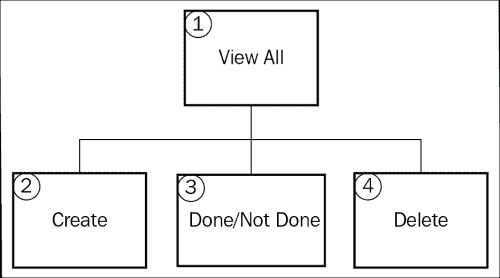
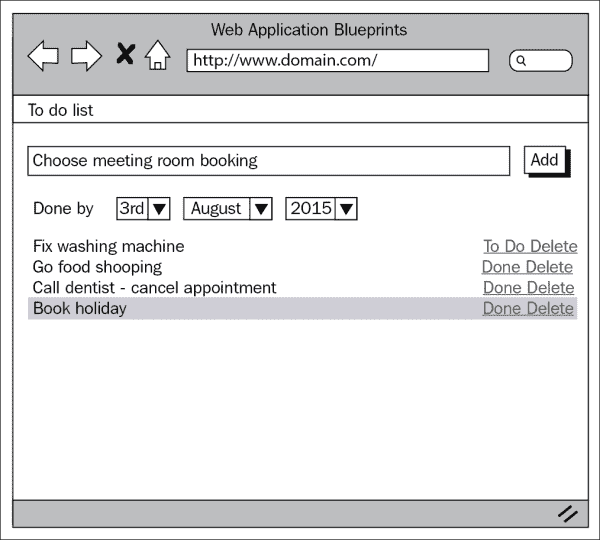
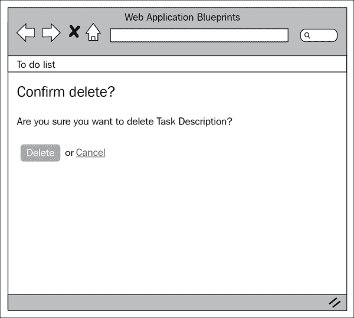

# 第八章。创建待办事项列表

这是一个很好的小项目；这是每个人在日常工作中可能都需要的东西：待办事项列表。这个项目将为你提供一个创建任务并将它们标记为完成的小应用程序。你还可以在项目中扩展范围，真正使其成为你自己的。

在本章中，我们将涵盖以下主题：

+   设计和线框图

+   创建数据库

+   创建模型

+   创建视图

+   创建控制器

+   整合所有内容

# 简介

对了；在这个项目中，我们将创建一个允许用户创建任务并以列表形式查看这些任务的应用程序。任务也可以有截止日期；晚于截止日期的任务将以红色显示，这样你知道需要尽快执行该任务。

要创建这个应用程序，我们将创建一个控制器；这将处理任务的显示、创建这些任务、将这些任务标记为完成或未完成，以及处理这些任务的删除。

我们将创建一个语言文件来存储文本，以便在需要时提供多语言支持。

我们将创建所有必要的视图文件和一个模型来与数据库接口。

然而，这个应用以及本书中的其他应用，都依赖于我们在第一章中完成的基本设置，*简介和共享项目资源*；尽管你可以将大量代码片段放入你几乎已经拥有的任何应用中，但请记住，第一章中完成的设置是这个章节的基础。

所以，我们不再拖延，让我们开始吧。

# 设计和线框图

和往常一样，在我们开始构建之前，我们应该看看我们计划构建什么。

首先，简要描述我们的意图：我们计划构建一个应用程序，让人们能够添加他们需要完成的任务。它还将允许用户以列表形式查看这些任务并将它们标记为完成。如果他们愿意，他们还可以删除旧的或不再需要的任务。

总之，为了更好地了解正在发生的事情，让我们看一下以下网站地图：



因此，这是网站地图；首先要注意的是网站是多么简单。这个项目只有四个主要区域。让我们逐一了解每个项目，并简要了解它们的功能：

+   **查看全部**：这显示了一个创建任务的表单，并显示列表中的所有任务

+   **创建**：这处理将任务保存到数据库中的创建过程

+   **完成/未完成**：这将为任务设置完成或未完成的标记

+   **删除**：这将从数据库中删除任务

现在我们对网站的结构和形式有了相当好的了解，让我们看一下每个页面的线框图。

## 查看全部/创建

以下截图显示了网站地图中前述的 **1** 点（查看所有项）和 **2** 点（创建项）的线框。最初，用户会看到一个任务列表。他们能够点击 **已完成** 或 **待办** 按钮进入网站地图中的第 **3** 点（已完成/未完成项）。



## 删除

以下截图显示了网站地图中第 **4** 点（删除项）的线框。用户查看任务描述（`tasks.task_desc`）并被提供删除（从数据库中处理删除任务）或取消以返回网站地图中的第 **1** 点（查看所有项）的选项。



## 文件概览

这是一个相对较小的项目，总的来说，我们只需要创建六个文件；这些文件如下：

+   `/path/to/codeigniter/application/models/tasks_model.php`: 这提供了对 `tasks` 数据库表的读写访问。

+   `/path/to/codeigniter/application/views/tasks/delete.php`: 这向用户显示一个表单，要求他们确认删除任务。

+   `/path/to/codeigniter/application/views/tasks/view.php`: 这是 `tasks` 控制器的 `index()` 函数的视图。它向用户显示任务列表。

+   `/path/to/codeigniter/application/views/nav/top_nav.php`: 这在页面顶部提供了一个导航栏。

+   `/path/to/codeigniter/application/controllers/tasks.php`: 这包含三个主要函数：`index()`、`apply()` 和 `create()`。

+   `/path/to/codeigniter/application/language/english/en_admin_lang.php`: 这为应用程序提供语言支持。

前六个文件的文件结构如下：

```php
application/
├── controllers/
│   ├── tasks.php
├── models/
│   ├── tasks_model.php
├── views/tasks/
│   ├── view.php
│   ├── delete.php
├── views/nav/
│   ├── top_nav.php
├── language/english/
│   ├── en_admin_lang.php
```

# 创建数据库

好的，你应该已经按照第一章中所述设置了 CodeIgniter 和 Bootstrap，*简介和共享项目资源*。如果没有，那么你应该知道，本章中的代码是专门针对第一章中的设置编写的。然而，如果你还没有这样做，也不是世界末日——代码可以轻松地应用于其他情况。

首先，我们将构建数据库。将以下 MySQL 代码复制到你的数据库中：

```php
CREATE DATABASE `tasksdb`;
USE DATABASE `tasksdb`;

CREATE TABLE `ci_sessions` (
  `session_id` varchar(40) COLLATE utf8_bin NOT NULL DEFAULT '0',
  `ip_address` varchar(16) COLLATE utf8_bin NOT NULL DEFAULT '0',
  `user_agent` varchar(120) COLLATE utf8_bin DEFAULT NULL,
  `last_activity` int(10) unsigned NOT NULL DEFAULT '0',
  `user_data` text COLLATE utf8_bin NOT NULL
) ENGINE=MyISAM DEFAULT CHARSET=utf8 COLLATE=utf8_bin;

CREATE TABLE `tasks` (
  `task_id` int(11) NOT NULL AUTO_INCREMENT,
  `task_desc` varchar(255) NOT NULL,
  `task_due_date` datetime DEFAULT NULL,
  `task_created_at` timestamp NOT NULL DEFAULT CURRENT_TIMESTAMP,
  `task_status` enum('done','todo') NOT NULL,
  PRIMARY KEY (`task_id`)
) ENGINE=InnoDB AUTO_INCREMENT=1 DEFAULT CHARSET=utf8;
```

### 提示

现在，看看最后那段 SQL 代码，它相当大且复杂。不要慌张；所有 SQL 代码都可以从 Packt 网站上这本书的支持页面在线获取。

你会看到我们创建的第一个表是`ci_sessions`，我们需要允许 CodeIgniter 管理会话，特别是已登录的用户。然而，这只是从*CodeIgniter 用户指南*中可用的标准会话表，所以我不包括对该表的描述，因为它不是技术特定于这个应用程序的。但是，如果你感兴趣，可以在[`ellislab.com/codeigniter/user-guide/libraries/sessions.html`](http://ellislab.com/codeigniter/user-guide/libraries/sessions.html)找到描述。

对，让我们逐个查看每个表中的每个条目，看看它们代表什么：

| 表：tasks |
| --- |
| **元素** | **描述** |
| `task_id` | 这是主键。 |
| `task_desc` | 我们的任务没有标题字段或正文，只有需要完成的简要描述；这就是那个描述。 |
| `task_due_date` | 这是任务需要完成的日期。如果任务延迟，我们将用红色突出显示表格行的背景，以表示有特定的任务尚未完成且已延迟。 |
| `task_created_at` | 如此 MySQL 时间戳，表示行在数据库中创建的日期。 |
| `task_status` | 这表示任务是否仍然需要完成。这是一个`enum`字段，有两个值：`done`和`todo`。如果任务设置为`done`，则我们将使用`<strike>`HTML 标记划掉文本；如果设置为`todo`（默认情况下就是这样），则任务不会被划掉，仍然需要完成。 |

我们还需要对`config/database.php`文件进行修改，具体是设置数据库访问详情，用户名、密码等。

打开`config/database.php`文件并找到以下行：

```php
$db['default']['hostname'] = 'localhost';
$db['default']['username'] = 'your username';
$db['default']['password'] = 'your password';
$db['default']['database'] = 'tasksdb';
```

编辑上一行的值，确保用更具体于你的设置和情况的值替换这些值；因此，输入你的用户名、密码等。

# 调整 config.php 文件

在这个文件中，我们需要配置一些内容以支持会话和加密。因此，打开`config/config.php`文件并做出以下更改：

1.  我们需要设置一个加密密钥——会话和 CodeIgniter 的加密功能都需要在`$config`数组中设置加密密钥，所以找到以下行：

    ```php
    $config['encryption_key'] = '';
    ```

    将上一行替换为以下内容：

    ```php
    $config['encryption_key'] = 'a-random-string-of-alphanum-characters';
    ```

    ### 小贴士

    现在，显然，实际上不要将上一值直接更改为一个随机的字母数字字符序列，而是更改为，嗯，一个随机的字母数字字符序列——如果这说得通？是的，你知道我的意思。

1.  找到以下行：

    ```php
    $config['sess_cookie_name'] = 'ci_session';
    $config['sess_expiration'] = 7200;
    $config['sess_expire_on_close'] = FALSE;
    $config['sess_encrypt_cookie'] = FALSE;
    $config['sess_use_database'] = FALSE;
    $config['sess_table_name'] = 'ci_sessions';
    $config['sess_match_ip'] = FALSE;
    $config['sess_match_useragent'] = TRUE;
    $config['sess_time_to_update'] = 300;
    ```

    将上一行替换为以下内容：

    ```php
    $config['sess_cookie_name'] = 'ci_session';
    $config['sess_expiration'] = 7200;
    $config['sess_expire_on_close'] = TRUE;
    $config['sess_encrypt_cookie'] = TRUE;
    $config['sess_use_database'] = TRUE;
    $config['sess_table_name'] = 'ci_sessions';
    $config['sess_match_ip'] = TRUE;
    $config['sess_match_useragent'] = TRUE;
    $config['sess_time_to_update'] = 300;
    ```

# 调整 routes.php 文件

我们希望将用户重定向到`tasks`控制器而不是默认的 CodeIgniter`welcome`控制器。为此，我们需要修改`routes.php`文件中的默认控制器设置：

1.  打开`config/routes.php`文件进行编辑，找到以下行（文件底部附近）：

    ```php
    $route['default_controller'] = "welcome";
    $route['404_override'] = '';
    ```

1.  首先，我们需要更改默认控制器。在 CodeIgniter 应用程序中，默认控制器最初设置为 `welcome`；然而，我们不需要这个——相反，我们希望默认控制器是 `tasks`。所以找到以下行：

    ```php
    $route['default_controller'] = "welcome";
    ```

    更改为以下内容：

    ```php
    $route['default_controller'] = "tasks";
    $route['404_override'] = '';
    ```

# 创建模型

在这个项目中只有一个模型，即 `tasks_model.php`，它包含特定于搜索和将任务写入数据库的函数。

这是本项目唯一的模型。让我们简要地回顾其中的每个函数，以了解其一般功能，然后我们将更详细地讨论代码。

在这个模型中有五个主要函数，如下所示：

+   `get_tasks()`：这个函数有两个作用：首先，显示所有任务——例如，当用户首次访问网站或用户在表单中输入新任务时。

+   `change_task_status()`：这个函数将数据库中的 `tasks.task_status` 值从 `todo` 或 `done` 中更改。设置为 `done` 的任务在列表中会被划掉，而设置为 `todo` 的任务则不会被划掉，并正常显示；这样，用户可以轻松地判断出哪些已完成，哪些尚未完成。

+   `save_task()`：当用户从网站地图的 **3**（创建项目）点提交表单时，这个函数将任务保存到数据库中。

+   `get_task()`：这个函数从 `tasks` 表中检索一个单独的任务。

+   `delete()`：这个函数从 `tasks` 表中删除一个任务。

这只是一个简要概述，所以让我们创建模型并讨论其功能。

创建 `/path/to/codeigniter/application/models/tasks_model.php` 文件，并向其中添加以下代码：

```php
<?php if ( ! defined('BASEPATH')) exit('No direct script access allowed');

class Tasks_model extends CI_Model {
  function __construct() {
    parent::__construct();
  }
```

`get_tasks()` 函数不接受任何参数。它从数据库返回所有任务，并将其返回给 `tasks` 控制器的 `index()` 函数。`tasks/view.php` 视图文件将遍历数据库结果对象，并在 HTML 表格中显示任务：

```php
function get_tasks() {
  $query = "SELECT * FROM `tasks` ";

  $result = $this->db->query($query);
  if ($result) {
    return $result;
  } else {
    return false;
  }
}
```

`change_task_status()` 函数将任务的状态从 `todo` 或 `done` 中更改。

它接受两个参数：`$task_id` 和 `$save_data`。`$task_id` 和 `$save_data` 的值由 `tasks` 控制器的 `status()` 函数传递。

`$task_id` 的值在用户点击 `views/tasks/view.php` 视图文件中的 **It's Done** 或 **Still Todo** 时设置；任一选项的 `uri` 段落的第四个参数是 `tasks` 表中任务的键（`tasks.task_id`），通过使用 CodeIgniter 函数 `$this->uri->segment(4)`，我们获取该值并将其存储在 `$task_id` 本地变量中。

`$save_data` 值在 `tasks` 控制器中填充。它只包含一个项目，即 `task_status`，该值在 `status()` 函数中使用 `uri` 段落的第三个参数填充：

```php
function change_task_status($task_id, $save_data) {
  $this->db->where('task_id', $task_id);
  if ($this->db->update('tasks', $save_data)) {
    return true;
  } else {
    return false;
  }
}
```

`save_task()` 函数接受一个参数——一个数据数组。这些数据由 `tasks` 控制器的 `index()` 函数提供。该函数会将一个任务保存到 `tasks` 表中，如果成功则返回 `true`，如果发生错误则返回 `false`：

```php
function save_task($save_data) {
  if ($this->db->insert('tasks', $save_data)) {
    return true;
  } else {
    return false;
  }
}
```

`get_task()` 函数接受一个参数——`$task_id`（即数据库中任务的唯一键）。它由 `tasks` 控制器的 `delete()` 函数提供，该函数使用它来提供删除确认表单中关于任务的信息。

用户在 `views/tasks/view.php` 文件中点击 **删除** 按钮，该文件的第三个参数是任务的唯一键。然后 `tasks` 控制器的 `delete()` 函数将使用 `$this->uri->segment(3)` CodeIgniter 函数从 URI 中获取该 ID。这个 ID 被传递给 `get_task()` 模型函数，该函数将返回数据库中任务的详细信息或 `false` 如果没有找到 ID：

```php
function get_task($id) {
  $this->db->where('task_id', $id);
  $result = $this->db->get('tasks');
  if ($result) {
    return $result;
  } else {
    return false;
  }
}
```

`delete()` 函数在数据库上执行操作以删除任务。它接受一个参数——任务的 ID，即该任务的唯一键：

```php
  function delete($id) {
    $this->db->where('task_id', $id);
    $result = $this->db->delete('tasks');
    if ($result) {
      return true;
    } else {
      return false;
    }
  }
}
```

# 创建视图

在这个项目中，有三个视图，具体如下：

+   `/path/to/codeigniter/application/views/tasks/view.php`: 这段代码向用户显示当前任务列表以及一个允许用户创建新任务的表单。

+   `/path/to/codeigniter/application/views/tasks/delete.php`: 这段代码向用户显示一个确认消息，询问他们是否真的想要删除任务。

+   `/path/to/codeigniter/application/views/nav/top_nav.php`: 这段代码显示顶层菜单。在这个项目中，这非常简单；它包含一个项目名称和一个链接，可以跳转到 `tasks` 控制器。

这些是我们的三个视图文件。现在让我们逐一查看它们，构建代码，并讨论它们的功能。

创建 `/path/to/codeigniter/application/views/tasks/view.php` 文件，并向其中添加以下代码：

```php
<div class="page-header">
    <?php echo form_open('tasks/index') ; ?>
      <div class="row">
        <div class="col-lg-12">
          <?php echo validation_errors() ; ?>
          <div class="input-group">
            <input type="text" class="form-control" name="task_desc" placeholder="<?php echo $this->lang->line('tasks_add_task_desc'); ?>">
            <span class="input-group-btn">
              <button class="btn btn-default" type="submit"><?php echo $this->lang->line('tasks_add_task'); ?></button>
            </span>
          </div><!-- /input-group -->
        </div><!-- /.col-lg-6 -->
      </div><!-- /.row -->

      <div class="row">
        <div class="form-group">
          <div class="col-md-2">
            <?php echo form_error('task_due_d'); ?>
            <select name="task_due_d" class="form-control">
              <option></option>
              <?php for ( $i = 1; $i <= 30; $i++) : ?>
                  <option value="<?php echo $i ; ?>"><?php echo date('jS', mktime($i,0,0,0, $i, date('Y'))) ; ?></option>
              <?php endfor ; ?>
            </select>
          </div>

          <div class="col-md-2">
            <?php echo form_error('task_due_m'); ?>
            <select name="task_due_m" class="form-control">
              <option></option>
              <?php for ( $i = 1; $i <= 12; $i++) : ?>
                  <option value="<?php echo $i ; ?>"><?php echo date('F', mktime(0,0,0,$i, 1, date('Y'))) ; ?></option>
              <?php endfor ; ?>
            </select>
          </div>

          <div class="col-md-2">
            <?php echo form_error('task_due_y'); ?>
            <select name="task_due_y" class="form-control">
              <option></option>
              <?php for ($i = date("Y",strtotime(date("Y"))); $i <= date("Y",strtotime(date("Y").' +5 year')); $i++) : ?>
                <option value="<?php echo $i;?>"><?php echo $i;?></option>
              <?php endfor ; ?>
            </select>
          </div> 
        </div>
      </div> 
    <?php echo form_close() ; ?>
</div>
```

上述代码块是用户可以用来创建新任务的表单。同时在这个代码块中还有验证错误代码（`validation_errors()`），我们将在这里显示从表单提交的数据中出现的任何错误：

```php
<table class="table table-hover">
  <?php foreach ($query->result() as $row) : ?> 
  <?php if (date("Y-m-d",mktime(0, 0, 0, date('m'), date('d'), date('y'))) > $row->task_due_date) {echo ' <tr class="list-group-item-danger">';} ?>
  <?php if ($row->task_due_date == null) {echo ' <tr>';} ?>
    <td width="80%"><?php if ($row->task_status == 'done') {echo '<strike>'.$row->task_desc.'</strike>' ;} else {echo $row->task_desc;} ?>

    </td>
    <td width="10%">
      <?php if ($row->task_status == 'todo') {echo anchor ('tasks/status/done/'.$row->task_id, 'It\'s Done');} ?>
      <?php if ($row->task_status == 'done') {echo anchor ('tasks/status/todo/'.$row->task_id, 'Still Todo');} ?>
    </td>
    <td width="10%"><?php echo anchor ('tasks/delete/'.$row->task_id, $this->lang->line('common_form_elements_action_delete')) ; ?>
    </td>
  </tr>
<?php endforeach ; ?>
</table>
```

上述表格输出了数据库中的任何任务。操作也在此代码块中，即 PHP 的三元运算符，它将状态从 **已完成** 切换到 **待办**，以及 **删除** 链接。

创建 `/path/to/codeigniter/application/views/tasks/delete.php` 文件，并向其中添加以下代码：

```php
<h2><?php echo $page_heading ; ?></h2>
<p class="lead"><?php echo $this->lang->line('delete_confirm_message');?></p>
<?php echo form_open('tasks/delete'); ?>
    <?php if (validation_errors()) : ?>
        <h3>Whoops! There was an error:</h3>
        <p><?php echo validation_errors(); ?></p>
    <?php endif; ?>
    <?php foreach ($query->result() as $row) : ?>
        <?php echo $row->task_desc; ?>
        <br /><br />
        <?php echo form_submit('submit', $this->lang->line('common_form_elements_action_delete'), 'class="btn btn-success"'); ?>
        or <?php echo anchor('tasks',$this->lang->line('common_form_elements_cancel'));?>
        <?php echo form_hidden('id', $row->task_id); ?>
    <?php endforeach; ?>
<?php echo form_close() ; ?>
```

上述代码块包含一个询问用户是否真的希望删除任务的表单。

创建 `/path/to/codeigniter/application/views/nav/top_nav.php` 文件，并向其中添加以下代码：

```php
<!-- Fixed navbar -->
<div class="navbar navbar-inverse navbar-fixed-top" role="navigation">
  <div class="container">
    <div class="navbar-header">
      <button type="button" class="navbar-toggle" data-toggle="collapse" data-target=".navbar-collapse">
        <span class="sr-only">Toggle navigation</span>
        <span class="icon-bar"></span>
        <span class="icon-bar"></span>
        <span class="icon-bar"></span>
      </button>
      <?php echo anchor('tasks', $this->lang->line('system_system_name'),'class="navbar-brand"') ; ?>
    </div>
    <div class="navbar-collapse collapse">
      <ul class="nav navbar-nav navbar-right">
      </ul>
    </div><!--/.nav-collapse -->
  </div>
</div>

<div class="container theme-showcase" role="main">
```

这个视图非常基础，但仍然发挥着重要作用。它显示了一个返回到 `tasks` 控制器的 `index()` 函数的选项。

# 创建控制器

在这个项目中，我们只创建一个控制器，即 `/path/to/codeigniter/application/controllers/tasks.php`。

现在让我们来看看那个控制器，查看代码，并讨论其功能。

创建 `/path/to/codeigniter/application/controllers/tasks.php` 文件，并向其中添加以下代码：

```php
<?php if (!defined('BASEPATH')) exit('No direct script access allowed');

class Tasks extends MY_Controller {
  function __construct() {
  parent::__construct();
    $this->load->helper('string');
    $this->load->helper('text');
    $this->load->model('Tasks_model');
    $this->load->library('form_validation');
    $this->form_validation->set_error_delimiters('<div class="alert alert-danger">', '</div>');
  }
```

`index()`函数执行两项任务：显示任务列表和处理表单提交（验证、错误检查等）。

初始时，我们为表单设置验证规则，如下所示：

```php
public function index() {
  $this->form_validation->set_rules('task_desc', $this->lang->line('tasks_task_desc'), 'required|min_length[1]|max_length[255]');
  $this->form_validation->set_rules('task_due_d', $this->lang->line('task_due_d'), 'min_length[1]|max_length[2]');
  $this->form_validation->set_rules('task_due_m', $this->lang->line('task_due_m'), 'min_length[1]|max_length[2]');
  $this->form_validation->set_rules('task_due_y', $this->lang->line('task_due_y'), 'min_length[4]|max_length[4]');
```

如果表单中存在错误或这是第一次访问页面，那么我们将构建表单元素，定义它们的设置并准备好在视图中绘制它们：

```php
if ($this->form_validation->run() == FALSE) {
  $page_data['job_title'] = array('name' => 'job_title', 'class' => 'form-control', 'id' => 'job_title', 'value' => set_value('job_title', ''), 'maxlength' => '100', 'size' => '35');
  $page_data['task_desc'] = array('name' => 'task_desc', 'class' => 'form-control', 'id' => 'task_desc', 'value' => set_value('task_desc', ''), 'maxlength' => '255', 'size' => '35');
  $page_data['task_due_d'] = array('name' => 'task_due_d', 'class' => 'form-control', 'id' => 'task_due_d', 'value' => set_value('task_due_d', ''), 'maxlength' => '100', 'size' => '35');
  $page_data['task_due_m'] = array('name' => 'task_due_m', 'class' => 'form-control', 'id' => 'task_due_m', 'value' => set_value('task_due_m', ''), 'maxlength' => '100', 'size' => '35');
  $page_data['task_due_y'] = array('name' => 'task_due_y', 'class' => 'form-control', 'id' => 'task_due_y', 'value' => set_value('task_due_y', ''), 'maxlength' => '100', 'size' => '35');
```

接下来，我们将从数据库中检索所有任务并将它们存储在`$page_data['query']`数组中。我们将此数组发送到`tasks/view.php`文件，在那里将使用`foreach($query->result as $row)`进行循环——每个任务将连同**已完成**、**待办**和**删除**选项一起以表格形式输出：

```php
  $page_data['query'] = $this->Tasks_model->get_tasks();

  $this->load->view('common/header');
  $this->load->view('nav/top_nav');
  $this->load->view('tasks/view', $page_data);
  $this->load->view('common/footer');
} else {
```

如果表单没有错误，那么我们尝试在数据库中创建任务。首先，我们查看用户是否尝试为任务设置截止日期。我们通过在`post`数组中查找日期字段来完成此操作。

我们需要所有三个（日、月、年）项来创建截止日期，因此我们检查是否所有三项都已设置。如果所有三项都已设置，那么我们将构建一个字符串，该字符串将是日期。这被保存在`$task_due_date`变量中。如果所有三个日期项尚未设置（可能只有两个），那么我们只需将`$task_due_date`的值设置为`null`：

```php
if ($this->input->post('task_due_y') && $this->input->post('task_due_m') && $this->input->post('task_due_d')) {
  $task_due_date = $this->input->post('task_due_y') .'-'. $this->input->post('task_due_m') .'-'. $this->input->post('task_due_d');
} else {
  $task_due_date = null;
}
```

然后，我们创建一个数组并将其传递给`Tasks_model`的`save_task()`函数。`$save_data`数组包含任务描述、可能已应用（或`null`值）的任何日期以及`task_status`的默认值；这最初设置为`todo`：

```php
$save_data = array(
  'task_desc' => $this->input->post('task_desc'),
  'task_due_date' => $task_due_date,
  'task_status' => 'todo'
);
```

然后，将`$save_data`数组发送到`Tasks_model`的`save_task()`函数。如果保存操作成功，该函数将返回`true`；如果发生错误，则返回`false`。无论结果如何，我们都会使用 CodeIgniter 的`$this->session->set_flashdata()`函数设置一条消息（成功消息或错误消息，这些消息的内容在语言文件中），并重定向到`tasks`控制器的`index()`函数，该函数将向用户显示所有任务（并希望显示刚刚创建的任务）：

```php
    if ($this->Tasks_model->save_task($save_data)) {
      $this->session->set_flashdata('flash_message', $this->lang->line('create_success_okay'));
    } else {
      $this->session->set_flashdata('flash_message', $this->lang->line('create_success_fail'));
    }
    redirect ('tasks'); 
  }
}
```

`status()`函数用于将任务状态从`done`更改为`todo`。如果您将鼠标悬停在**已完成**或**待办**链接上，您将看到 URI。其格式看起来像`http://www.domain.com/tasks/status/todo/1`（如果任务在数据库中设置为`done`）或`http://www.domain.com/tasks/status/done/1`（如果任务在数据库中设置为`todo`）。第三个参数始终是任务当前状态的相反，因此如果任务设置为`done`，URI 将显示`todo`，如果设置为`todo`，URI 将显示`done`。

第四个参数是主键（在前面的示例中，这是`1`）。

当用户点击**已完成**或**待办**时，`status()`函数获取第三个和第四个参数并将它们发送到`Tasks_model`的`status()`函数：

```php
public function status() {
  $page_data['task_status'] = $this->uri->segment(3);
  $task_id = $this->uri->segment(4);
```

我们取第三个和第四个参数并发送给`Tasks_model`的`change_task_status()`函数。如果更新成功，`change_task_status()`函数将返回`true`，如果有错误，则返回`false`。我们使用 CodeIgniter 的`$this->session->set_flashdata()`函数设置用户消息，并重定向到`tasks`控制器的`index()`函数：

```php
  if ($this->Tasks_model->change_task_status($task_id, $page_data)) {
    $this->session->set_flashdata('flash_message', $this->lang->line('status_change_success'));
  } else {
    $this->session->set_flashdata('flash_message', $this->lang->line('status_change_fail'));
  }
  redirect ('tasks');
}
```

`delete()`函数做两件事。它向用户显示有关任务的详细信息，以便他们能够决定是否真的想删除任务，并且如果用户确认，它还会处理该任务的删除。首先，我们设置表单的验证规则。这是用户用来确认删除的表单：

```php
public function delete() {
  $this->form_validation->set_rules('id', $this->lang->line('task_id'), 'required|min_length[1]|max_length[11]|integer|is_natural');
```

由于该函数可以通过点击**删除**或提交表单被用户访问，因此任务 ID 可以来自 URI（在**删除**的情况下）或表单中的隐藏表单元素。因此，我们检查表单是否正在提交或首次访问，并从`post`或`get`中获取 ID：

```php
if ($this->input->post()) {
  $id = $this->input->post('id');
} else {
  $id = $this->uri->segment(3);
}

$data['page_heading'] = 'Confirm delete?';
if ($this->form_validation->run() == FALSE) {
```

然后我们将 ID 发送到`Tasks_model`的`get_task()`函数，该函数将返回作为数据库对象的任务详情。这被保存在`$data['query']`中，并发送到`tasks/delete.php`视图文件，其中用户被要求确认他们是否真的想删除该任务：

```php
  $data['query'] = $this->Tasks_model->get_task($id);
  $this->load->view('common/header', $data);
  $this->load->view('nav/top_nav', $data);
  $this->load->view('tasks/delete', $data);
  $this->load->view('common/footer', $data);
} else {
```

如果表单提交没有错误，那么我们调用`Tasks_model`的`delete()`函数，以便删除任务：

```php
      if ($this->Tasks_model->delete($id)) {
        redirect('tasks');
      }
    }
  }
}
```

# 创建语言文件

与本书中的所有项目一样，我们正在使用语言文件为用户提供文本。这样，您可以启用多区域/多语言支持。让我们创建语言文件。

创建`/path/to/codeigniter/application/language/english/en_admin_lang.php`文件，并向其中添加以下代码：

```php
<?php if (!defined('BASEPATH')) exit('No direct script access allowed');

// General
$lang['system_system_name'] = "Todo";

// Tasks - view.php
$lang['tasks_add_task'] = "Add";
$lang['tasks_add_task_desc'] = "What have you got to do?";
$lang['tasks_task_desc'] = "Task Description";
$lang['tasks_set_done'] = "Mark as done";
$lang['tasks_set_todo'] = "Mark as todo";
$lang['task_due_d'] = "Due Day";
$lang['task_due_m'] = "Due Month";
$lang['task_due_y'] = "Due Year";
$lang['status_change_success'] = "Task updated";
$lang['status_change_fail'] = "Task not updated";
```

# 将所有内容组合在一起

好的，这里有一些示例，将有助于将所有内容组合在一起。

## 用户添加任务

添加任务的顺序如下：

1.  用户访问网站，CodeIgniter 将其路由到`tasks`控制器。

1.  `tasks`控制器默认加载`index()`函数。`index()`函数检查表单验证是否为假：

    ```php
    if ($this->form_validation->run() == FALSE) {
    ...
    ```

1.  由于这是第一次加载，表单尚未提交，因此它将等于`false`。然后`index()`函数定义`task_desc`文本字段的设置，调用`Tasks_model`的`get_tasks()`函数（该函数从数据库返回所有任务），然后加载视图文件，将数据库对象传递给`views/tasks/view.php`文件。

1.  用户输入`Chase meeting room booking`字符串，选择未来三天的日期，然后点击**添加**提交表单。

1.  表单已提交，`index()`验证了`task_desc`表单元素和三个日期下拉框的值。验证现在已通过。

    三个日期字段被连接起来形成一个日期字符串，将其输入到数据库并保存为`$task_due_date`：

    ```php
    $task_due_date = $this->input->post('task_due_y') .'-'. $this->input->post('task_due_m') .'-'. $this->input->post('task_due_d');
    ```

1.  这些`$task_due_date`和`task_desc`值被保存到一个名为`$save_data`的数组中。同时保存的是`tasks`表中`task_status`字段的默认值。此值设置为`todo`。

1.  在数据库成功保存操作后，用户被重定向到`index()`，在那里显示他们的新任务。

## 用户更改任务状态

用户更改任务状态时执行的事件如下：

1.  用户访问网站，CodeIgniter 将他们路由到`tasks`控制器。

1.  `tasks`控制器默认加载`index()`函数。`index()`函数检查表单验证是否为 false：

    ```php
    if ($this->form_validation->run() == FALSE) {
    ...
    ```

1.  由于这是第一次加载且表单尚未提交，它将等于 false。然后`index()`函数定义`task_desc`文本字段的设置，调用`Tasks_model`的`get_tasks()`函数（该函数从数据库返回所有任务），然后加载视图文件，将数据库对象传递给`views/tasks/view.php`文件。

1.  用户看到任务“追逐会议室预订”并且（知道这个任务已完成）点击了**已完成**。

1.  CodeIgniter 加载`status()`任务函数。

1.  `status()`函数获取 URI 的第三个参数（`todo`或`done`）和第四个参数（任务的唯一键）并将它们设置为`$page_data['task_status']`和`$task_id`局部变量。

1.  这两个变量被发送到`Tasks_model`的`change_task_status()`函数。

1.  `change_task_status()`函数接受`$task_id`值和新状态，并对该任务执行 Active Record 更新，如果成功或发生错误则返回 true 或 false 值。

1.  `status()`函数查看返回值并根据情况设置会话闪存消息：如果成功则显示成功消息，如果不成功则显示错误消息。

1.  然后，用户被重定向到`index()`，在那里他们可以看到更新的任务状态。

# 摘要

所以，这是一个相当小的应用程序——可能是在书中最小的一个——但它绝对不是没有用。您可以用这个待办事项列表作为管理您可能有的任何任务的简单方式；然而，总有改进的空间。您可以通过以下方式添加更多功能到项目中，包括以下内容：

+   **添加排序功能**：您可以添加排序函数，仅显示逾期（超期）、已完成或待办的任务。

+   **添加分类**：你可以在创建任务的表单中添加一个下拉菜单。这个下拉菜单可以（例如）包含红色、绿色、蓝色、黄色、橙色等颜色选项。一个任务可以被分配一个颜色，并且这个颜色可以在显示每个任务的表格中显示出来。你可以使用 Bootstrap 标签标记；例如，警告标签的`span`（`<span class="label label-warning">警告</span>`）会给你一个很大的颜色块——不过，请改变一下“警告”这个词！

+   **添加进度和进度条**：你可以在 HTML 下拉菜单中添加预设的百分比值：25%，50%，75%，100%等，这样你可以定义任务完成了多少。
