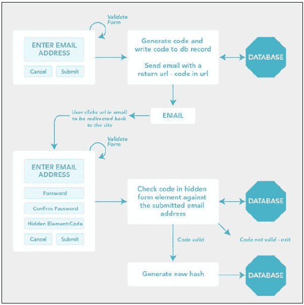

# 第二章：用户管理

在本章中，我们将涵盖以下内容：

+   查看用户

+   创建用户

+   编辑用户

+   删除用户

+   使用 CodeIgniter 生成密码

+   使用 CodeIgniter 生成密码 – 基础

+   忘记密码？ – 使用 CodeIgniter 重置密码

# 简介

很有可能，你用 CodeIgniter 构建的许多网站和应用都需要用户，并且需要直接管理他们及其详细信息，也就是说创建、更新、编辑和删除他们。

在本章中，我们将探讨基本用户管理，并构建一个简单的 CRUD 界面来管理和维护数据库中的这些用户。稍后，在 第七章，*创建安全用户环境* 中，我们将探讨使用登录和会话功能来保护用户信息，但就目前而言，我们将专注于构建用户管理界面。

在开始之前，我们需要在 `application/config` 文件夹中的几个配置文件中更改一些设置。我们将编辑以下文件：

+   `path/to/codeigniter/application/config/config.php`

+   `path/to/codeigniter/application/config/database.php`

在 `path/to/codeigniter/application/config/config.php` 文件中找到以下配置值，并修改它们以反映以下内容：

| 配置项 | 更改为 | 描述 |
| --- | --- | --- |
| `$config['sess_cookie_name']` | `ci_session` | 这应该是写入用户计算机的 cookie 的名称。 |
| `$config['sess_expiration']` | `7200` | 这是在会话在一段时间内没有活动后变为无效之前应保持活跃的秒数。 |
| `$config['sess_expire_on_close']` | `TRUE` | 这指定了如果用户关闭浏览器，会话将变为无效。 |
| `$config['sess_encrypt_cookie']` | `TRUE` | 这指定了如果 cookie 应在用户的计算机上加密；出于安全考虑，应将其设置为 `TRUE`。 |
| `$config['sess_use_database']` | `TRUE` | 这指定了是否将会话存储在数据库中。出于安全考虑，应将其设置为 `TRUE`。你还需要创建会话表，该表可以在 *数据库模式* 部分找到。 |
| `$config['sess_table_name']` | `sessions` | 这指定了用于存储会话数据的数据库表名称。 |
| `$config['sess_match_ip']` | `TRUE` | 这指定了 CodeIgniter 应该监控请求的 IP 地址与 `session_id` 的对比。如果传入请求的 IP 地址与之前的值不匹配，则不允许会话。 |
| `$config['sess_match_useragent']` | `TRUE` | 这指定了 CodeIgniter 应该监控请求的用户代理地址与 `session_id` 的对比。如果传入请求的用户代理地址与之前的值不匹配，则不允许会话。 |

在 `path/to/codeigniter/application/config/database.php` 文件中找到以下配置值，并修改它们以反映以下内容：

| 配置项 | 更改为值 | 描述 |
| --- | --- | --- |
| `$db['default']['hostname']` | `localhost` | 数据库的主机名；这通常是 `localhost` 或 IP 地址 |
| `$db['default']['username']` | ? | 您希望用于连接数据库的用户名 |
| `$db['default']['password']` | ? | 连接到数据库使用的密码 |
| `$db['default']['database']` | ? | 您希望连接到的数据库名称，例如，`users` |

## 数据库模式

使用您选择的方法（命令行、phpmyadmin 等）将以下代码输入到您的数据库中：

```php
CREATE TABLE IF NOT EXISTS `sessions` (
  `session_id` varchar(40) COLLATE utf8_bin NOT NULL DEFAULT '0',
  `ip_address` varchar(16) COLLATE utf8_bin NOT NULL DEFAULT '0',
  `user_agent` varchar(120) COLLATE utf8_bin DEFAULT NULL,
  `last_activity` int(10) unsigned NOT NULL DEFAULT '0',
  `user_data` text COLLATE utf8_bin NOT NULL,
  PRIMARY KEY (`session_id`),
  KEY `last_activity_idx` (`last_activity`)
) ENGINE=InnoDB DEFAULT CHARSET=utf8 COLLATE=utf8_bin;

CREATE TABLE `users` (
  `id` int(11) NOT NULL AUTO_INCREMENT,
  `first_name` varchar(125) NOT NULL,
  `last_name` varchar(125) NOT NULL,
  `email` varchar(255) NOT NULL,
  `created_date` int(11) NOT NULL COMMENT 'unix timestamp',
  `is_active` varchar(3) NOT NULL COMMENT 'yes or no',
  PRIMARY KEY (`id`)
) ENGINE=InnoDB  DEFAULT CHARSET=latin1 AUTO_INCREMENT=1;

INSERT INTO `users` (`id`, `first_name`, `last_name`, `email`, `created_date`, `is_active`) VALUES
(5, 'First Name', 'Last name', 'first@last.com', 0, '0');
```

列是什么以及我们将存储什么类型的数据？以下表格是先前数据库模式的指南：

| 项目名称 | 属性 | 描述 |
| --- | --- | --- |
| `user_id` | `INTEGER(11)` | 表的主键。 |
| `user_first_name` | `VARCHAR(125)` | 用户的第一个名字。 |
| `user_last_name` | `VARCHAR(125)` | 用户的姓氏。 |
| `user_email` | `VARCHAR(255)` | 用户的电子邮件地址，例如，`<name@example.org>`。 |
| `user_created_date` | `INTEGER(11)` | 用户在数据库中创建的日期的 Unix 时间戳。 |
| `user_is_active` | `INTEGER(1)` | 以 `0` 或 `1` 表示的布尔值，如果用户是活跃的。此变量指定用户是否在系统中活跃。活跃用户可以登录，而不活跃用户则不能。 |

### 小贴士

如果您已经创建了会话表，则可以省略该表。

# 查看用户

我们开始的好地方是显示我们用户的列表。我们将创建一个模型、视图和控制台，以提供执行此操作的功能。

## 如何操作...

我们将创建以下三个文件：

+   `path/to/codeigniter/application/models/users_model.php`: 此文件为我们提供数据库的 CRUD 支持

+   `path/to/codeigniter/application/views/users/view_all_users.php`: 此文件包含一个 `foreach` 循环，遍历结果数组，将所有用户写入表格

+   `path/to/codeigniter/application/controllers/users.php`: 此文件包含处理 CRUD 功能所需的代码

1.  将以下代码复制到 `path/to/codeigniter/application/controllers/users.php` 文件中：

    ```php
    <?php if (! defined('BASEPATH')) exit('No direct script access allowed');

    class Users extends CI_Controller {
        function __construct() {
            parent::__construct();
            $this->load->helper('form');
            $this->load->helper('url');
            $this->load->helper('security');
            $this->load->model('Users_model');
            $this->load->database();
        }

        public function index() {
            redirect('users/view_users');
        }

        public function view_users() {
            $data['query'] = $this->Users_model->get_all_users();
            $this->load->view('users/view_all_users', $data);
        }
    }
    ```

1.  将以下代码复制到 `path/to/codeigniter/application/models/users_model.php` 文件中：

    ```php
    <?php if ( ! defined('BASEPATH')) exit('No direct script access allowed');

    class Users_model extends CI_Model {
        function __construct() {
            parent::__construct();
        }

        public function get_all_users() {
            return $this->db->get('users');
        }
    }
    ```

1.  将以下代码复制到 `path/to/codeigniter/application/views/users/view_all_users.php` 文件中：

    ```php
    <?php if ($query->num_rows() > 0 ) : ?>
    <table border="0">
      <tr>
          <td>ID</td>
          <td>First Name</td>
          <td>Last Name</td>
          <td>Created Date</td>
          <td>Is Active</td>
          <td colspan="2">Actions</td>
      </tr>
      <?php foreach ($query->result() as $row) : ?>
      <tr>
          <td><?php echo $row->id; ?></td>
          <td><?php echo $row->first_name; ?></td>
          <td><?php echo $row->last_name; ?></td>
          <td><?php echo date("d-m-Y", $row->created_date); ?></td>
          <td><?php echo ($row->is_active ? 'Yes' : 'No'); ?></td>
          <td><?php echo anchor('users/edit_user/'.$row->id, 'Edit') ; ?></td>
          <td><?php echo anchor('users/delete_user/'.$row->id, 'Delete') ; ?></td>
      </tr>
      <?php endforeach ; ?>
    </table>
    <?php endif ; ?>
    ```

## 它是如何工作的...

这相当标准，没有复杂的事情发生。我们有一个控制器正在运行显示，它加载了一些有用的辅助函数来支持诸如`redirect()`、其他安全函数以及构造函数中的`Users_model`等功能。`public function index()`将重定向到`public function view_users()`，然后通过`$this->Users_model->get_all_users()`语法连接到`Users_model`模型中的`get_all_users()`函数，以返回一个活动记录结果集。然后，这个结果集被传递到`users/view_all_users`视图，在其中通过`foreach`循环在表格中显示。看...我告诉过你这是多么简单！

# 创建用户

你总是需要一种方法从应用程序内部创建用户，并且需要手动输入他们的数据，而不是让用户自己输入数据。我们将构建允许你逐个创建用户的功能。

## 如何做...

我们需要创建一个文件：

+   `path/to/codeigniter/application/views/users/new_user.php`

并且修改以下两个文件：

+   `path/to/codeigniter/application/controllers/users.php`

+   `path/to/codeigniter/application/models/users_model.php`

1.  将以下代码复制到`path/to/codeigniter/application/views/users/new_user.php`文件中：

    ```php
    <?php echo form_open('users/new_user') ; ?>
      <?php if (validation_errors()) : ?>
        <h3>Whoops! There was an error:</h3>
        <p><?php echo validation_errors(); ?></p>
      <?php endif; ?>
      <table border="0">
      <tr>
        <td>User First Name</td>
        <td><?php echo form_input($first_name); ?></td>
      </tr>
      <tr>
        <td>User Last Name</td>
        <td><?php echo form_input($last_name); ?></td>
      </tr>
      <tr>
        <td>User Email</td>
        <td><?php echo form_input($email); ?></td>
      </tr>
      <tr>
        <td>User Is Active?</td>
        <td><?php echo form_checkbox($is_active); ?></td>
      </tr>
    </table>
        <?php echo form_submit('submit', 'Create'); ?>
        or <?php echo anchor('users/index', 'cancel'); ?>
    <?php echo form_close(); ?>
    ```

1.  修改`path/to/codeigniter/application/controllers/users.php`文件，添加以下代码：

    ```php
        public function new_user() {
            // Load support assets
            $this->load->library('form_validation');
            $this->form_validation->set_error_delimiters('', '<br />');

            // Set validation rules
            $this->form_validation->set_rules('first_name', 'First Name', 'required|min_length[1]|max_length[125]');
            $this->form_validation->set_rules('last_name', 'Last Name', 'required|min_length[1]|max_length[125]');
            $this->form_validation->set_rules('email', 'Email', 'required|min_length[1]|max_length[255]|valid_email');
            $this->form_validation->set_rules('is_active', 'Is Active', 'min_length[1]|max_length[1]|integer|is_natural');

            // Begin validation
            if ($this->form_validation->run() == FALSE) {
                // First load, or problem with form
                $data['first_name'] = array('name' => 'first_name', 'id' => 'first_name', 'value' => set_value('first_name', ''), 'maxlength'   => '100', 'size' => '35');
                $data['last_name'] = array('name' => 'last_name', 'id' => 'last_name', 'value' => set_value('last_name', ''), 'maxlength'   => '100', 'size' => '35');
                $data['email'] = array('name' => 'email', 'id' => 'email', 'value' => set_value('email', ''), 'maxlength'   => '100', 'size' => '35');
                $data['is_active'] = array('name' => 'is_active', 'id' => 'is_active', 'value' => set_value('is_active', ''));

                $this->load->view('users/new_user',$data);
            } else { // Validation passed, now escape the data
                $data = array(
                    'first_name' => $this->input->post('first_name'),
                    'last_name' => $this->input->post('last_name'),
                    'email' => $this->input->post('email'),
                    'is_active' => $this->input->post('is_active'),
                );

                if ($this->Users_model->process_create_user($data)) {
                   redirect('users');
               }
            }
        }
    ```

1.  修改`path/to/codeigniter/application/models/users_model.php`文件，添加以下代码：

    ```php
        public function process_create_user($data) {
            if ($this->db->insert('users', $data)) {
              return true;
            } else {
              return false;
            }
        }
    ```

## 它是如何工作的...

在这里发生的事情比前面的`view_users`代码要稍微复杂一些，但仍然简单直接。`public function new_user()`执行多个功能，例如加载视图文件、验证提交后输入的任何数据，以及显示视图。

如果`public function new_user()`是第一次被调用（即，它不是由表单提交调用的），那么验证检查（`$this->form_validation->run()`）将等于`FALSE`，并且括号内的代码将被执行。在这种情况下，代码将加载`cust/new_user`视图。

然而，如果函数是作为表单提交的结果加载的，那么 CodeIgniter 将开始检查用户输入。函数的第一行加载必要的库以启用检查用户的输入：`$this->library('form_validation')`，并且我们的错误分隔符通过函数`set_error_deimiters()`设置。然后，表单中的每个项目都会与我们指定的标准进行核对。完整的验证标准选项列表可在：[`ellislab.com/codeigniter/user-guide/libraries/form_validation.html`](http://ellislab.com/codeigniter/user-guide/libraries/form_validation.html)找到

我们还将在第五章*管理输入和输出*中更详细地讨论表单验证。

如果验证未通过（用户的输入未满足我们设定的要求），则 `$this->form_validation->run()` 将返回 `FALSE`，表单将再次显示。视图中的表单元素能够显示用户的输入（因此他们不需要从头开始重新输入一切）。

一旦验证通过（`$this->form_validation->run()` 返回 `TRUE`），然后我们将输入打包成一个数组：`$data`。由于我们使用 Active Record 与数据库交互，`$data` 数组的键必须与我们的数据库表列名匹配。然后，`$data` 数组被发送到 `Users_model` 以使用以下语法写入数据库：`$this->Users_model->get_all_users()`。

# 编辑用户

您始终需要一些方法来从应用程序内部自行编辑用户。在本节中，我们将查看创建执行此操作的功能：更新和编辑用户详细信息。

## 如何做到这一点...

我们需要创建一个文件：

+   `path/to/codeigniter/application/views/users/edit_user.php`

修改以下两个文件：

+   `path/to/codeigniter/application/controllers/users.php`

+   `path/to/codeigniter/application/models/users_model.php`

1.  将以下代码复制到 `path/to/codeigniter/application/views/users/edit_user.php` 文件：

    ```php
    <?php echo form_open('users/edit_user') ; ?>
        <?php if (validation_errors()) : ?>
            <h3>Whoops! There was an error:</h3>
            <p><?php echo validation_errors(); ?></p>
        <?php endif; ?>
        <table border="0" >
          <tr>
             <td>User First Name</td>
             <td><?php echo form_input($first_name); ?></td>
          </tr>
          <tr>
             <td>User Last Name</td>
             <td><?php echo form_input($last_name); ?></td>
          </tr>
          <tr>
             <td>User Email</td>
             <td><?php echo form_input($email); ?></td>
          </tr>
          <tr>
              <td>User Is Active?</td>
              <td><?php echo form_checkbox($is_active); ?></td>
          </tr>
          <?php echo form_hidden($id); ?>
        </table>
        <?php echo form_submit('submit', 'Update'); ?>
        or <?php echo anchor('users/index', 'cancel'); ?>
    <?php echo form_close(); ?>
    ```

1.  修改 `path/to/codeigniter/application/controllers/users.php` 文件，使用以下代码：

    ```php
        public function edit_user() {
            // Load support assets
            $this->load->library('form_validation');
            $this->form_validation->set_error_delimiters('', '<br />');

            // Set validation rules
            $this->form_validation->set_rules('first_name', 'First Name', 'required|min_length[1]|max_length[125]');
            $this->form_validation->set_rules('last_name', 'Last Name', 'required|min_length[1]|max_length[125]');
            $this->form_validation->set_rules('email', 'Email', 'required|min_length[1]|max_length[255]|valid_email');
            $this->form_validation->set_rules('is_active', 'Is Active', 'min_length[1]|max_length[1]|integer|is_natural');

            if ($this->input->post()) {
                $id = $this->input->post('id');
            } else {
                $id = $this->uri->segment(3); 
            }

            // Begin validation
            if ($this->form_validation->run() == FALSE) {
              // First load, or problem with form
                    $query = $this->Users_model->get_user_details($id);
                    foreach ($query->result() as $row) {
                        $first_name = $row->first_name;
                        $last_name = $row->last_name;
                        $email = $row->email;
                        $is_active= $row->is_active;
                    }

                    $data['first_name'] = array('name' => 'first_name', 'id' => 'first_name', 'value' => set_value('first_name', $first_name), 'maxlength' => '100', 'size' => '35');
                    $data['last_name'] = array('name' => 'last_name', 'id' => 'last_name', 'value' => set_value('last_name', $last_name), 'maxlength'   => '100', 'size' => '35');
                    $data['email'] = array('name' => 'email', 'id' => 'email', 'value' => set_value('email', $email), 'maxlength' => '100', 'size' => '35');
                    $data['is_active'] = array('name' => 'is_active', 'id' => 'is_active', 'value' => set_value('is_active', $is_active), 'maxlength'   => '100', 'size' => '35');
                    $data['id'] = array('id' => set_value('id', $id));

                    $this->load->view('users/edit_user', $data);

            } else { // Validation passed, now escape the data
                $data = array(
                    'first_name' => $this->input->post('first_name'),
                    'last_name' => $this->input->post('last_name'),
                    'email' => $this->input->post('email'),
                    'is_active' => $this->input->post('is_active'),
                );

                if ($this->Users_model->process_update_user($id, $data)) {
                    redirect('users/view_users');
                }
            }
        }
    ```

1.  修改 `path/to/codeigniter/application/models/users_model.php` 文件，使用以下代码：

    ```php
        public function process_update_user($id, $data) {
            $this->db->where('id', $id);
            if ($this->db->update('users', $data)) {
              return true;
            } else {
              return false;
            }
        }

        public function get_user_details($id) {
            $this->db->where('id', $id);
            return $this->db->get('users');
        }
    ```

## 它是如何工作的...

这与创建新用户（前面提到过）的功能类似，但不同之处在于，我们不是向用户表写入一行，而是基于用户的唯一键删除一行。

首先，我们需要获取用户的 ID。此时，用户的 ID 可能来自 URL，但也可能来自 post 数组（例如，如果返回 `FALSE`）。以下代码确定 `$id` 变量是如何进入的（无论是 post 还是 URL），并将其存储在 `$id` 变量中，以便稍后处理：

```php
if ($this->input->post()) {
    $id = $this->input->post('id');
} else {
    $id = $this->uri->segment(3); 
}
```

我们随后验证编辑后的用户数据——如果数据通过验证，我们将将传入的表单数据打包成一个关联数组（称为 `$data`）。我们使用数组键作为映射到我们数据库列名的映射器——也就是说，数组中的键与数据库列匹配——请查看以下代码：

```php
    $data = array(
        'first_name' => $this->input->post('first_name'),
        'last_name' => $this->input->post('last_name'),
        'email' => $this->input->post('email'),
        'is_active' => $this->input->post('is_active'),
    );
```

您可以看到关联数组的键与数据库表中的列名匹配；因此，数组中的 `first_name` 键将映射到表中的 `first_name` 列。数组中的 `last_name` 键将映射到表中的 `last_name` 列。

接下来，我们将用户编辑后的信息写入数据库。我们通过将刚刚创建的 `$data` 数组（以及 `$id` 变量）发送到我们的 `Users_model` 函数 `process_update_user()` 来完成此操作，该函数将执行更新任务。

```php
    if ($this->Users_model->process_update_user($id, $data)) {
        redirect('users/view_users');
    }
```

# 删除用户

总是有一个好主意能够从界面上删除用户，而不是直接从数据库中删除他们，或者根本不删除他们。我们将创建一个 CRUD 界面，以便我们可以从数据库中删除用户。下面是如何做到这一点。

## 如何做到这一点...

我们需要创建一个文件：

+   `path/to/codeigniter/application/views/users/delete_user.php`

1.  将以下代码添加到`views/users/delete_user.php`文件中：

    ```php
    <?php echo form_open('users/delete_user'); ?>
        <?php if (validation_errors()) : ?>
            <h3>Whoops! There was an error:</h3>
            <p><?php echo validation_errors(); ?></p>
        <?php endif; ?>
        <?php foreach ($query->result() as $row) : ?>
            <?php echo $row->first_name . ' ' . $row->last_name; ?>
            <?php echo form_submit('submit', 'Delete'); ?>
            or <?php echo anchor('users/index', 'cancel'); ?>
            <?php echo form_hidden('id', $row->id); ?>
        <?php endforeach; ?>
    </form>
    ```

1.  修改以下两个文件：

    +   `path/to/codeigniter/application/controllers/users.php`

    +   `path/to/codeigniter/application/models/users_model.php`

1.  修改`controllers/users.php`文件，添加以下代码：

    ```php
       public function delete_user() {
            // Load support assets
            $this->load->library('form_validation');
            $this->form_validation->set_error_delimiters('', '<br />');

            // Set validation rules
            $this->form_validation->set_rules('id', 'User ID', 'required|min_length[1]|max_length[11]|integer|is_natural');

            if ($this->input->post()) {
                $id = $this->input->post('id');
            } else {
                $id = $this->uri->segment(3);
            }

            if ($this->form_validation->run() == FALSE) {
              // First load, or problem with form

                $data['query'] = $this->Users_model->get_user_details($id);

                $this->load->view('users/delete_user', $data);
            } else {
                if ($this->Users_model->delete_user($id)) {
                    redirect('users/view_users');
                }
            }
        }
    ```

1.  修改`controllers/users_model.php`文件，添加以下代码：

    ```php
        public function delete_user($id) {
            $this->db->where('id', $id);
            if ($this->db->delete('users')) {
                return true;
            } else {
                return false;
            }
        }
    ```

## 它是如何工作的...

这与创建新用户（前面已解释）的功能类似，但不同之处在于，我们不是向用户表写入一行，而是根据用户的唯一键删除一行。

首先，我们需要获取用户的 ID。在这个时候，用户的 ID 可能来自 URL，但也可能来自 POST 数组。

以下代码确定了`$id`变量是如何进入的（无论是通过 POST 还是通过 URL），并将其存储在`$id`变量中，以便稍后处理：

```php
if ($this->input->post()) {
  $id = $this->input->post('id');
} else {
  $id = $this->uri->segment(3);  
}
```

如果`public function delete_user()`是第一次被调用（即，它不是由表单提交调用的），那么用户的唯一键将从 URL 传递给`public function delete_user()`。它通过`$this->uri->segment(3)`被拾取，并通过将`$data['id']`分配给`$this->load->view('user/delete_user', $data['id'])`发送到`users/delete_user.php`视图。在视图中，`$id`值被写入一个隐藏的 HTML 表单元素。

必须将用户的 ID 作为隐藏元素分配到表单中，因为当表单提交时，`public function delete_user()`将需要用户的 ID。如果表单是提交而不是首次加载，则 ID 将无法从`$this->uri->segment(3)`中获取。

`public function delete_user()`执行了与`public function new_user()`类似的多项功能。这些功能包括加载视图文件、验证提交后的任何数据输入，并显示视图。

如果`public function delete_user()`是作为表单提交的结果被调用的，CodeIgniter 将开始检查和验证用户输入；在这种情况下，提交的输入仅包括用户 ID，它作为隐藏表单元素在视图中写入。函数的第一行加载必要的库以启用检查用户输入：`$this->library('form_validation')`，并且我们的错误定界符通过函数`set_error_deimiters()`设置。然后，用户 ID 将与我们指定的标准进行核对。完整的验证标准选项列表可在以下位置找到：

[`ellislab.com/codeigniter/user-guide/libraries/form_validation.html`](http://ellislab.com/codeigniter/user-guide/libraries/form_validation.html)。我们还将更详细地讨论表单验证，见第五章，*管理输入和输出*。

如果验证未通过（用户的输入没有满足我们设定的要求），那么`$this->form_validation->run()`将返回`FALSE`，表单将再次显示。

一旦验证通过（`$this->form_validation->run()`返回`TRUE`），然后我们将输入打包到一个数组中：`$data`。由于我们使用 Active Record 与数据库交互，`$data`数组的键必须匹配我们数据库表的列名。

然后，使用以下语法将`$data`数组发送到`Users_model`以从数据库中删除用户：`$this->Users_model->delete_user($id)`。

# 使用 CodeIgniter 生成密码

有两种方法可以解释这一点。由于这是一本食谱书，我将给出用户注册的结构（这个过程的一部分是从用户提供的密码创建哈希），以及登录表单（这个过程的一部分是验证密码与哈希）。但我意识到您可能不需要所有以下文件，以下示例中专注于密码哈希的行。这样，您可以快速了解这个过程是如何工作的，并将其应用于您的情况。

## 准备工作

首先，让我们创建数据库模式以支持食谱。如果您已经有了自己的表并且只是寻找哈希代码，您可能可以跳过这部分。否则，将以下代码复制到您的数据库中：

```php
CREATE TABLE IF NOT EXISTS `register` ( 
  `user_id` int(11) NOT NULL AUTO_INCREMENT, 
  `user_first_name` varchar(125) NOT NULL, 
  `user_last_name` varchar(125) NOT NULL, 
  `user_email` varchar(255) NOT NULL, 
  `user_hash` text NOT NULL, 
  PRIMARY KEY (`user_id`) 
) ENGINE=InnoDB  DEFAULT CHARSET=latin1 AUTO_INCREMENT=1 ;
```

### 提示

**下载示例代码**

您可以从您在[`www.packtpub.com`](http://www.packtpub.com)的账户下载您购买的所有 Packt 书籍的示例代码文件。如果您在其他地方购买了这本书，您可以访问

注册表描述如下：

| 项目名称 | 属性 | 描述 |
| --- | --- | --- |
| `user_id` | `INTEGER(11)` | 表的主键 |
| `user_first_name` | `VARCHAR(125)` | 用户的姓名 |
| `user_last_name` | `VARCHAR(125)` | 用户姓氏 |
| `user_email` | `VARCHAR(255)` | 用户的电子邮件地址，例如，`<name@example.org>` |
| `user_hash` | `TEXT` | 由`$this->encrypt->sha1($string_to_hash [, $key])`生成的密码哈希 |

您还必须创建一个会话表，并确保配置文件已设置以处理数据库存储的会话。有关如何操作的说明，请参阅

数据库设置完成！我们将使用 CodeIgniter 的 **encrypt** 库来为我们处理密码哈希的重负载，具体来说，`$this->encrypt->sha1($string_to_hash [, $key])`，其中 `$key` 是可选的。我们首先需要设置一些事情。您需要决定要使用的加密密钥：这可以是您在 `config.php` 中的 `$config['encryption_key']` 中设置的加密密钥，或者您可以将新密钥作为第二个参数传递给 CodeIgniter。第二个参数的存在会覆盖 `$config['encryption_key']` 中设置的值。

在下面的菜谱中，我们使用 `$config['encryption_key']` 中的值作为我们的加密密钥；因此，我们不会传递第二个参数。

### 小贴士

在创建密钥时，尽量不要只使用单个单词，因为这可能会被彩虹表破解；相反，使用一个相当长的随机字母数字字符串。

## 如何操作...

在这个菜谱中，我们将创建以下七个文件：

+   `/path/to/codeigniter/application/controllers/register.php`: 此文件包含一个允许用户注册的表单，然后记录被添加到数据库表（在 *准备阶段* 部分的 SQL）

+   `/path/to/codeigniter/application/models/register_model.php`: 此文件与控制器交互以与数据库进行交互

+   `/path/to/codeigniter/application/views/register/register.php`: 此文件用于注册表单

+   `/path/to/codeigniter/application/controllers/signin.php`: 此文件处理登录过程，包括将密码与哈希值进行比较

+   `/path/to/codeigniter/application/models/signin_model.php`: 此文件与控制器交互以与数据库进行交互

+   `/path/to/codeigniter/application/views/signin/signin.php`: 此文件用于登录表单

+   `/path/to/codeigniter/application/views/signin/loggedin.php`: 此文件显示一个表示成功登录的页面

1.  将以下代码复制到 `/path/to/codeigniter/application/controllers/register.php` 文件中：

    ```php
    <?php if (!defined('BASEPATH')) exit('No direct script access allowed');

    class Register extends CI_Controller {
        function __construct() {
            parent::__construct();
            $this->load->helper('form');
            $this->load->helper('url');
            $this->load->helper('security');
            $this->load->model('Register_model');
            $this->load->library('encrypt');
            $this->load->database();
        }

        public function index() {
            redirect('register/register_user');
        }

        public function register_user() {
            // Load support assets
            $this->load->library('form_validation');
            $this->form_validation->set_error_delimiters('', '<br />');

            // Set validation rules
            $this->form_validation->set_rules('first_name', 'First Name', 'required|min_length[1]|max_length[125]');
            $this->form_validation->set_rules('last_name', 'Last Name', 
                'required|min_length[1]|max_length[125]');
            $this->form_validation->set_rules('email', 'Email', 
              'required|min_length[1]|max_length[255]|valid_email');
            $this->form_validation->set_rules('password1', 
              'Password', 'required|min_length[5]|max_length[15]');
            $this->form_validation->set_rules('password2', 'Confirmation Password', 'required|min_length[5]|max_length[15]|matches[password1]');

            // Begin validation
            if ($this->form_validation->run() == FALSE) {
                // First load, or problem with form
                $data['page_title'] = "Register";
                $this->load->view('register/register',$data);
            } else {
                // Create hash from user password
                $hash = $this->encrypt->sha1($this->input->post('password1'));

                $data = array(
                    'user_first_name' => $this->input->post('first_name'),
                    'user_last_name' => $this->input->post('last_name'),
                    'user_email' => $this->input->post('email'),
                    'user_hash' => $hash
                );

                if ($this->Register_model->register_user($data)) {
                    redirect('signin');
                } else {
                    redirect('register');
                }
            }
        }
    }
    ```

1.  将以下代码复制到 `/path/to/codeigniter/application/models/register_model.php` 文件中：

    ```php
    <?php if (! defined('BASEPATH')) exit('No direct script access allowed');

    class Register_model extends CI_Model {
        function __construct() {
            parent::__construct();
        }

        public function register_user($data) {
            if ($this->db->insert('register', $data)) {
                return true;
            } else {
                return false;
            }
        }

        public function update_user($data, $email) {
            $this->db->where('user_email', $email);
            $this->db->update('register', $data);
        }
    }
    ```

1.  将以下代码复制到 `/path/to/codeigniter/application/views/register/register.php` 文件中：

    ```php
    <?php echo form_open('register/register_user') ; ?>
        <?php if (validation_errors()) : ?>
            <h3>Whoops! There was an error:</h3>
            <p><?php echo validation_errors(); ?></p>
        <?php endif; ?>
        <table border="0" >
            <tr>
                <td>First Name</td>
                <td><?php echo form_input(array('name' => 'first_name', 'id' => 'first_name','value' => set_value('first_name', ''), 'maxlength' => '100', 'size' => '50', 'style' => 'width:100%')); ?></td>
            </tr>
            <tr>
                <td>Last Name</td>
                <td><?php echo form_input(array('name' => 'last_name', 'id' => 'last_name', 
                    'value' => set_value('last_name', ''), 'maxlength' => '100', 'size' => '50', 'style' => 'width:100%')); ?></td>
            </tr>
            <tr>
                <td>User Email</td>
                <td><?php echo form_input(array('name' => 'email', 'id' => 'email', 'value' => set_value('email', ''), 'maxlength' => '100', 'size' => '50', 'style' => 'width:100%')); ?></td>
            </tr>
            <tr>
                <td>Password</td>
                <td><?php echo form_password(array('name' => 'password1', 'id' => 'password1', 
                    'value' => set_value('password1', ''), 'maxlength' => '100', 'size' => '50', 
                        'style' => 'width:100%')); ?></td>
            </tr>
            <tr>
                <td>Confirm Password</td>
                <td><?php echo form_password(array('name' => 'password2', 'id' => 'password2', 'value' => set_value('password2', ''), 'maxlength' => '100', 'size' => '50', 'style' => 'width:100%')); ?></td>
            </tr>
        </table>
        <?php echo form_submit('submit', 'Submit'); ?>
        or <?php echo anchor('form', 'cancel'); ?>
    <?php echo form_close(); ?>
    ```

1.  将以下代码复制到 `/path/to/codeigniter/application/controllers/signin.php` 文件中：

    ```php
    <?php if (!defined('BASEPATH')) exit('No direct script access allowed');

    class Signin extends CI_Controller {

      function __construct() {
        parent::__construct();
        $this->load->helper('form');
        $this->load->helper('url');
        $this->load->helper('security');
      }

      public function index() {
        redirect('signin/login');
      }

        public function login() {
        if ($this->session->userdata('logged_in') == TRUE) {
          redirect('signin/loggedin');
        } else {
          $this->load->library('form_validation');

          // Set validation rules for view filters
          $this->form_validation->set_rules('email', 'Email', 'required|valid_email|min_length[5]|max_length[125]');
          $this->form_validation->set_rules('password', 'Password ', 'required|min_length[5]|max_length[30]');

          if ($this->form_validation->run() == FALSE) {
            $this->load->view('signin/signin');
          } else {
            $email = $this->input->post('email');
            $password = $this->input->post('password');

            $this->load->model('Signin_model');
            $query = $this->Signin_model->does_user_exist($email);

            if ($query->num_rows() == 1) {
              // One matching row found
              foreach ($query->result() as $row) {
                // Call Encrypt library
     $this->load->library('encrypt');

                // Generate hash from a their password
                $hash = $this->encrypt->sha1($password);

                // Compare the generated hash with that in the // database
     if ($hash != $row->user_hash) {
     // Didn't match so send back to login
     $data['login_fail'] = true;
     $this->load->view('signin/signin', $data);
     } else {
     $data = array(
     'user_id' => $row->user_id,
     'user_email' => $row->user_email,
     'logged_in' => TRUE
     );

     // Save data to session
     $this->session->set_userdata($data);
     redirect('signin/loggedin');
     }
              }
            } 
          }
        }
      }

      function loggedin() {
        if ($this->session->userdata('logged_in') == TRUE) {
          $this->load->view('signin/loggedin');
        } else {
          redirect('signin');
        }       
      }
    }
    ```

1.  将以下代码复制到 `/path/to/codeigniter/application/models/signin_model.php` 文件中：

    ```php
    <?php if ( ! defined('BASEPATH')) exit('No direct script access allowed');

    class Signin_model extends CI_Model {
        function __construct() {
            parent::__construct();
        }

        public function does_user_exist($email) {
            $this->db->where('user_email', $email);
            $query = $this->db->get('register');
            return $query;
        }
    }
    ```

1.  然后将以下代码复制到 `/path/to/codeigniter/application/views/signin/signin.php` 文件中：

    ```php
    <?php echo form_open('signin/login') ; ?>
        <?php if (validation_errors()) : ?>
            <h3>Whoops! There was an error:</h3>
            <p><?php echo validation_errors(); ?></p>
        <?php endif; ?>

        <?php if (isset($login_fail)) : ?>
            <h3>Login Error:</h3>
            <p>Username or Password is incorrect, please try again.</p>
        <?php endif; ?>

        <table border="0" >
            <tr>
                <td>User Email</td>
                <td><?php echo form_input(array('name' => 'email', 'id' => 'email', 'value' => set_value('email', ''), 'maxlength' => '100', 'size' => '50', 'style' => 'width:100%')); ?></td>
            </tr>
            <tr>
                <td>Password</td>
                <td><?php echo form_password(array('name' => 'password', 'id' => 'password', 
                    'value' => set_value('password', ''), 'maxlength' => '100', 'size' => '50', 
                        'style' => 'width:100%')); ?></td>
            </tr>
        </table>
        <?php echo form_submit('submit', 'Submit'); ?>
        or <?php echo anchor('signin', 'cancel'); ?>
    <?php echo form_close(); ?>
    ```

1.  然后将以下代码复制到 `/path/to/codeigniter/application/views/signin/loggedin.php` 文件中：

    ```php
    Success!  Logged in as <?php echo $this->session->userdata('user_email'); ?>
    ```

## 它是如何工作的...

好的，这个例子中有很多内容，但实际上相当简单。再次看看前面的代码——特别是那些被突出显示的行，因为这些行是密码特定的。前面章节中创建的文件显示了创建用户和登录该用户的过程。当然，你的代码会有所不同；但让我们专注于那些突出显示的行。

他们展示了执行密码哈希和比较的代码（一个简化的版本可以在下面的菜谱中找到）。

首先，让我们看看注册用户的过程。注册控制器从 `/path/to/codeigniter/application/views/register/register.php` 视图中接受用户提交的信息。在成功通过以下验证行后：

```php
$hash = $this->encrypt->sha1($password);
```

将使用用户提供的密码生成一个哈希值，这个哈希值存储在 `$hash` 变量中（很明显吧？）。

然后，将 `$hash` 添加到 `$data` 数组中，以便将其插入数据库，如下所示：

```php
// Create hash from user password
$hash = $this->encrypt->sha1($this->input->post('password1'));

$data = array(
     'user_first_name' => $this->input->post('first_name'),
     'user_last_name' => $this->input->post('last_name'),
     'user_email' => $this->input->post('email'),
     'user_hash' => $hash
);
```

现在我们来了解一下登录过程。`public function login()` 函数接收用户提供的电子邮件地址和密码（来自 `/path/to/codeigniter/application/views/signin/signin.php` 视图），在成功通过验证后，我们按照以下方式在注册表中查找用户提供的电子邮件地址：

```php
        $this->load->model('Signin_model');
        $query = $this->Signin_model->does_user_exist($email);

        if ($query->num_rows() == 1) {
          // One matching row found
          foreach ($query->result() as $row) {
          ..
        }
```

如果电子邮件存在，我们将从用户提供的密码生成一个哈希值。这个过程与注册过程中的功能相同，如下所示：

```php
            // Call Encrypt library
            $this->load->library('encrypt');

            // Generate hash from a their password
            $hash = $this->encrypt->sha1($password);

            // Compare the generated hash with that in the // database
 if ($hash != $row->user_hash) {
              // Didn't match so send back to login
              $data['login_fail'] = true;
              $this->load->view('signin/signin', $data);
            } else {
              $data = array(
                  'user_id' => $row->user_id,
                  'user_email' => $row->user_email,
                  'logged_in' => TRUE
              );

              // Save data to session
              $this->session->set_userdata($data);
              redirect('signin/loggedin');
            }
```

现在，看看前面代码中突出显示的行。我们正在将用户提供的密码生成的哈希值与从注册表中提取的记录中的 `user_hash` 进行比较。如果两个哈希值不匹配，那么用户可能没有提供正确的密码，因此我们将他们送回登录表单并等待另一次尝试。然而，如果两个哈希值匹配，那么用户必须已经提供了正确的密码，因此我们将为他们启动一个会话并将他们重定向到 `public function loggedin()`。在这种情况下，这是一个简短的消息，表明他们已成功登录。然而，在你的应用程序中，这可能是某种受密码保护的会员区域，可能是仪表板。

# 使用 CodeIgniter 生成密码 – 简洁版

好的，这只是一个简洁的过程。如果你想看一个完整的例子，那么前面的菜谱就是为你准备的。这个菜谱是为那些已经有创建用户过程，但希望将一些密码保护集成到现有过程中的用户准备的。

## 如何操作...

如果你不需要前面的菜谱，只需要哈希/比较的简洁版；请参考以下步骤：

### 生成哈希值

要生成一个哈希值，请执行以下步骤：

1.  使用 `$config['encryption_key']` 中的关键字生成哈希值，如下所示：

    ```php
    // Call Encrypt library
    $this->load->library('encrypt');

    $hash = $this->encrypt->sha1($text_to_be_hashed);
    ```

1.  使用除 `$config['encryption_key']` 之外的关键字生成哈希值，如下所示：

    ```php
    // Call Encrypt library
    $this->load->library('encrypt');

    $key = "This-is-the-key";
    $hash = $this->encrypt->sha1($text_to_be_hashed, $key);
    ```

    ### 小贴士

    在生产环境中，将 `$key` 值（`This-is-the-key`）替换为真实的值。使其成为一个由字母数字字符组成的较长字符串；越随机越好！

### 比较哈希值

哈希值比较如下：

```php
// Call Encrypt library
$this->load->library('encrypt');

// Generate hash from a their password
$hash = $this->encrypt->sha1($password);

// Compare the generated hash with that in the database
if ($hash != $row->user_hash) {
    // Didn't match so send back to login
    redirect('signin/login');
} else { 
    // Did match so log them in if you wish
}
```

## 它是如何工作的...

**使用 $config['encryption_key'] 值生成哈希**：首先，我们使用 `$this->load->library('encrypt')` 加载加密库，然后调用加密库中的 `sha1` 函数，并将 `$text_to_be_hashed` 变量传递给它。用于加密 `$text_to_be_hashed` 字符串的密钥来自配置数组项 `$config['encryption_key']`，在 `config.php` 文件中设置。`$this->encrypt->sha1($text_to_be_hashed)` 将返回一个字符串，我们将将其存储在 `$hash` 变量中。

**不使用 $config['encryption_key'] 值生成哈希（即添加第二个参数）**：首先，我们使用 `$this->load->library('encrypt')` 加载加密库，然后调用加密库中的 `sha1` 函数，并将 `$text_to_be_hashed` 和一个加密密钥作为第二个参数传递给它：

```php
$this->encrypt->sha1($text_to_be_hashed, $key)
```

将此密钥作为第二个参数（`$key`）添加将导致 CodeIgniter 使用该密钥而不是 `$config['encryption_key']` 中设置的任何值。`$this->encrypt->sha1($text_to_be_hashed, $key)` 将返回一个字符串，我们将将其存储在变量 `$hash` 中。

在使用 `$this->load->library('encrypt')` 加载加密支持库后，一个文本字符串（在这种情况下，在 `$password` 变量中）被传递到加密库中的 `sha1` 函数，并将其结果存储在 `$hash` 变量中。我们现在可以使用这个变量来比较存储的值，例如来自数据库选择结果。在这个例子中，我们比较 `$hash` 与 `$row->user_hash` 中的值。如果它们不匹配，我们将发送 `redirect()` 到登录屏幕，但你可以轻松地编写任何操作，例如记录事件或显示消息而不是重定向。如果 `$hash` 和 `$row->user_hash` 的值匹配，那么你可以根据这个确认执行操作；一个例子就是登录用户。

# 忘记密码？ – 使用 CodeIgniter 重置密码

每个人有时都会忘记他们的密码，用户可能希望被提醒他们的密码。然而，我们不能发送他们的密码，因为我们没有它；我们只存储它的哈希值——密码实际上并没有存储在数据库中。用户将不得不重置他们的密码；在这样做时生成一个新的哈希值。

## 准备工作

我们想要确保用户确实请求了新的密码，因此，我们将在注册表中添加一个列来支持这一点。新列名为 `forgot_password`，它将包含一个代码，当请求新密码时我们将生成这个代码；当用户从电子邮件中的 URL 被重定向回网站时，我们将检查这个代码，我们也会将这个电子邮件发送给他们。将以下代码复制到您的数据库中：

```php
ALTER TABLE register ADD forgot_password INT(11) AFTER user_hash;
```

## 如何操作...

我们将创建以下两个文件：

+   `/path/to/codeigniter/application/views/signin/forgot_password.php`

+   `/path/to/codeigniter/application/views/signin/new_password.php`

并且修改以下三个文件：

+   `/path/to/codeigniter/application/controllers/signin.php`

+   `/path/to/codeigniter/application/models/signin_model.php`

+   `/path/to/codeigniter/application/views/signin/signin.php`

1.  将以下代码复制到`/path/to/codeigniter/application/views/signin/forgot_password.php`文件中：

    ```php
    <?php echo form_open('signin/forgot_password') ; ?>
        <?php if (validation_errors()) : ?>
            <h3>Whoops! There was an error:</h3>
            <p><?php echo validation_errors(); ?></p>
        <?php endif; ?>
        <?php if (isset($submit_success)) : ?>
            <h3>Email Sent:</h3>
            <p>An email has been sent to the address provided.</p>
        <?php endif; ?>
        <table border="0" >
            <tr>
                <td>User Email</td>
                <td><?php echo form_input(array('name' => 'email', 'id' => 'email', 'value' => set_value('email', ''), 'maxlength' => '100', 'size' => '50', 'style' => 'width:100%')); ?></td>
            </tr>
        </table>
        <?php echo form_submit('submit', 'Submit'); ?>
        or <?php echo anchor('form', 'cancel'); ?>
    <?php echo form_close(); ?>
    ```

1.  将以下代码复制到`/path/to/codeigniter/application/views/signin/new_password.php`文件中：

    ```php
    <?php echo form_open('signin/new_password') ; ?>
        <?php if (validation_errors()) : ?>
            <h3>Whoops! There was an error:</h3>
            <p><?php echo validation_errors(); ?></p>
        <?php endif; ?>
        <h2>Reset your password</h2>

        <table border="0">
            <tr>
                <td>User Email</td>
                <td><?php echo form_input(array('name' => 'email', 'id' => 'email', 'value' => set_value('email', ''), 'maxlength' => '100', 'size' => '50', 'style' => 'width:100%')); ?></td>
            </tr>
            <tr>
                <td>Password</td>
                <td><?php echo form_password(array('name' => 'password1', 'id' => 'password1', 'value' => set_value('password1', ''), 'maxlength' => '100', 'size' => '50', 'style' => 'width:100%')); ?></td>
            </tr>
            <tr>
                <td>Confirm Password</td>
                <td><?php echo form_password(array('name' => 'password2', 'id' => 'password2', 'value' => set_value('password2', ''), 'maxlength' => '100', 'size' => '50', 'style' => 'width:100%')); ?></td>
            </tr>

            <?php echo form_hidden('code', $code) ; ?>
        </table>
        <?php echo form_submit('submit', 'Submit'); ?>
        or <?php echo anchor('form', 'cancel'); ?>
    <?php echo form_close(); ?>
    ```

1.  修改`/path/to/codeigniter/application/controllers/signin.php`文件，添加以下代码：

    ```php
    public function forgot_password() {
        $this->load->library('form_validation');
        $this->form_validation->set_rules('email', 'Email', 'required|valid_email|min_length[5]|max_length[125]');

        if ($this->form_validation->run() == FALSE) {
          $this->load->view('signin/forgot_password');
        } else {
          $email = $this->input->post('email');

          $this->db->where('user_email', $email);
          $this->db->from('register');
          $num_res = $this->db->count_all_results();

          if ($num_res == 1) {
            // Make a small string (code) to assign to the user // to indicate they've requested a change of // password
            $code = mt_rand('5000', '200000');
            $data = array(
              'forgot_password' => $code,
            );

            $this->db->where('user_email', $email);
            if ($this->db->update('register', $data)) {
              // Update okay, send email
              $url = "http://www.domain.com/signin/new_password/".$code;
              $body = "\nPlease click the following link to reset your password:\n\n".$url."\n\n";
              if (mail($email, 'Password reset', $body, 'From: no-reply@domain.com')) {
                $data['submit_success'] = true;
                $this->load->view('signin/signin', $data);
              }
            } else {
              // Some sort of error happened, redirect user // back to form
              redirect('singin/forgot_password');
            }
          } else {
            // Some sort of error happened, redirect user back // to form
            redirect('singin/forgot_password');
          }
        }
      }

      public function new_password() {
        $this->load->library('form_validation');
        $this->form_validation->set_rules('code', 'Code', 'required|min_length[4]|max_length[7]');
        $this->form_validation->set_rules('email', 'Email', 'required|valid_email|min_length[5]|max_length[125]');
        $this->form_validation->set_rules('password1', 'Password', 'required|min_length[5]|max_length[15]');
        $this->form_validation->set_rules('password2', 'Confirmation Password', 'required|min_length[5]|max_length[15]|matches[password1]');

        // Get Code from URL or POST and clean up
        if ($this->input->post()) {
          $data['code'] = xss_clean($this->input->post('code'));
        } else {
          $data['code'] = xss_clean($this->uri->segment(3));
        }

        if ($this->form_validation->run() == FALSE) {
          $this->load->view('signin/new_password', $data);
        } else {
          // Does code from input match the code against the // email
          $this->load->model('Signin_model');
          $email = xss_clean($this->input->post('email'));
          if (!$this->Signin_model->does_code_match($data['code'], $email)) {
            // Code doesn't match
            redirect ('signin/forgot_password');
          } else {// Code does match
            $this->load->model('Register_model');
            $hash = $this->encrypt->sha1($this->input->post('password1'));

            $data = array(
              'user_hash' => $hash
            );

            if ($this->Register_model->update_user($data, $email)) {
              redirect ('signin');
            }
          }
        }
      }
    ```

1.  然后，修改`/path/to/codeigniter/application/models/signin_model.php`文件，添加以下代码：

    ```php
        public function update_user($data, $email) {
            $this->db->where('user_email', $email);
            $this->db->update('register', $data);
        }

        public function does_email_exist($email) {
          $this->db->where('user_email', $email);
          $this->db->from('register');
          $num_res = $this->db->count_all_results();
            if ($num_res == 1) {
              return TRUE;
          } else {
              return FALSE;
          }
        }

        public function does_code_match($code, $email) {
          $this->db->where('user_email', $email);
          $this->db->where('forgot_password', $code);
          $this->db->from('register');
            $num_res = $this->db->count_all_results();

            if ($num_res == 1) {
              return TRUE;
          } else {
              return FALSE;
          }
        }
    ```

1.  然后，修改`/path/to/codeigniter/application/views/signin.php`文件，添加以下代码：

    ```php
    <?php echo form_open('signin/login') ; ?>
        <?php if (validation_errors()) : ?>
            <h3>Whoops! There was an error:</h3>
            <p><?php echo validation_errors(); ?></p>
        <?php endif; ?>

        <?php if (isset($login_fail)) : ?>
            <h3>Login Error:</h3>
            <p>Username or Password is incorrect, please try again.</p>
        <?php endif; ?>

        <table border="0" >
            <tr>
                <td>User Email</td>
                <td><?php echo form_input(array('name' => 'email', 'id' => 'email', 'value' => set_value('email', ''), 'maxlength' => '100', 'size' => '50', 'style' => 'width:100%')); ?></td>
            </tr>
            <tr>
                <td>Password</td>
                <td><?php echo form_password(array('name' => 'password', 'id' => 'password', 'value' => set_value('password', ''), 'maxlength' => '100', 'size' => '50', 'style' => 'width:100%')); ?></td>
            </tr>
        </table>
        <?php echo form_submit('submit', 'Submit'); ?>
        or <?php echo anchor('signin', 'cancel'); ?>
     <?php echo anchor('signin/forgot_password', 'Forgot Password'); ?>
    <?php echo form_close(); ?>
    ```

    ### 小贴士

    我们只更改了此文件中的一行：高亮显示的行是一个`anchor()`语句，它显示了一个指向忘记密码表单的链接。

## 它是如何工作的...

首先，看一下下面的流程图：



现在，让我们假设一个用户忘记了他们的密码并希望被提醒。用户将点击修改后的登录表单中的忘记密码链接（`/path/to/codeigniter/application/views/signin/signin.php`），这将他们重定向到签到控制器中的`public function forgot_password()`。`forgot_password()`函数立即显示`/path/to/codeigniter/application/views/signin/forgot_password.php`视图。用户输入电子邮件地址并使用**提交**按钮提交表单。

接下来，`forgot_password()`函数将验证用户提供的输入，如果该输入通过了验证规则，则`forgot_password()`函数将在数据库中查找是否存在一个在注册表中的行，其电子邮件与表单提交中提供的电子邮件匹配。如果找到匹配项，则生成一个跟踪代码（这用于表单视图文件中的隐藏表单元素），并将其分配给`$data`数组。然后，将此代码写入我们刚刚查找的数据库行中，并向与该账户（或行）关联的电子邮件地址发送电子邮件。在这种情况下，我们使用 PHP 的`mail()`函数而不是 CodeIgniter 的邮件功能；当然，您当然可以使用 CodeIgniter 发送电子邮件而不是 PHP 的`mail()`函数——无论如何，我们将在第四章中讨论如何在 CodeIgniter 中发送电子邮件，*电子邮件、HTML 表格和文本库*——回到故事中。

接下来，轮到我们的用户了。他们应该在他们的电子邮件收件箱中查找我们刚刚发送给他们的电子邮件，如果他们找到了，他们会看到一封电子邮件中的链接，该链接将他们引导回我们的系统，并到`public function new_password()`。点击该链接将打开`/path/to/codeigniter/application/views/signin/new_password.php`视图，该视图将显示重置密码表单。

记得我们生成的`$code`吗？`$code`是第三个 URL 参数，现在被设置为隐藏表单元素。用户输入他们的电子邮件和密码（两次以确认）然后点击**提交**。表单随后提交到`public function new_password()`，该函数用于验证表单。

通过验证后，电子邮件地址和代码在注册表中查找。如果找到（并且它们匹配），就会创建一个新的`$hash`数组并将其保存到数据库中的记录中。最后，他们被重定向到登录表单，在那里他们可以使用新密码进行 log()in。
