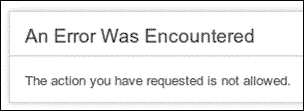
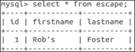
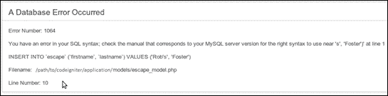

# 第七章。创建一个安全用户环境

在本章中，我们将介绍：

+   避免用户输入

+   防止跨站请求伪造

+   避免数据库中的数据转义

+   在 CodeIgniter 中使用 HTTPS

# 简介

首先，一个免责声明：没有任何方法或系统可以永远完全无懈可击且始终保持安全，你应该了解在编程任务或你正在编码的上下文中应该应用的正确安全措施。我将在本章末尾提供一些其他信息资源的链接。话虽如此，CodeIgniter 提供了一些有用的技术来降低出错的可能性，例如，在本章中提供了一些可以帮助降低意外发生概率的食谱——然而，你始终应该保持警惕，并确保你正在安全地构建。

# 避免用户输入

CodeIgniter 安全类函数 `xss_clean()` 尝试清理 `POST` 或 `COOKIE` 数据，以减轻允许向网站注入代码的技术。例如，它会试图防止用户提交的博客文章中包含的 JavaScript 代码被执行，或者检查文本输入字段中提交的数据并转义不允许的字符。

## 准备工作

你可以将此应用于你创建的任何控制器，或者如果你已经通过 `MY_Controller` 扩展，你可以根据需要将其添加到其中。你还可以通过在 `/path/to/codeigniter/application/config/autoload.php` 文件中将它添加到 `$autoload['helper'] = array()` 来自动加载安全助手。为了明确起见，这里我们是在控制器的构造函数中加载安全助手（即任何你拥有的控制器）：

```php
    function __construct() {
        parent::__construct();
 $this->load->helper('security');
    }
```

## 如何操作...

有两种方法可以实现这一点，全局的（CodeIgniter 每次遇到 `POST` 或 `COOKIE` 数据时都会这样做），以及单独的（CodeIgniter 允许你定义何时调用清理后的 `COOKIE` 或 `POST` 数据）。

### 全局

1.  CodeIgniter 可以在每次遇到 POST 或 COOKIE 数据时自动调用 xss_clean()，而无需你显式调用 xss_clean()。为此，你需要修改以下文件：

    `/path/to/codeigniter/application/config/config.php`

1.  将 `$config['global_xss_filtering']` 的值更改为 `TRUE`，如下所示：

    ```php
    $config['global_xss_filtering'] = TRUE;
    ```

    然而，请注意，这样做会有计算开销，并且不一定总是需要你一直运行它。

### 单独

确保将 `$config['global_xss_filtering']` 设置为 `FALSE`，如下所示：

```php
$config['global_xss_filtering'] = FALSE
```

这将关闭全局 XSS 过滤。当你希望使用 `xss_clean()` 时，请将以下代码输入到你的控制器或模型中：

```php
$cleaned_data = $this->security->xss_clean($data_to_be_cleaned);
```

## 它是如何工作的...

在任何示例中，你都在调用相同的 CodeIgniter 方法；一个方法是自动调用的，另一个是逐个调用的。相关代码可以在 `/path/to/codeigniter/system/core/Security.php`（找到函数 `xss_clean()`）中找到。

# 防止跨站请求伪造

跨站请求伪造是指攻击者假装成网站识别的用户（例如已登录用户），然后攻击者能够像真正的用户一样访问已登录用户的个人资料。关于这种情况的详细信息，如网站、书籍等，有很多技术信息，因此我们在这里不会深入研究。相反，我们将探讨 CodeIgniter 如何减轻跨站请求伪造的影响。

## 如何操作...

我们将通过以下步骤修改一个文件并创建两个文件：

1.  首先，我们需要修改一些配置项。为此，我们需要打开以下文件：`/path/to/codeigniter/application/config/config.php`

    找到以下配置选项，并根据表格中的说明进行修改：

    | 配置项 | 默认值 | 修改为/描述 |
    | --- | --- | --- |
    | `$config['csrf_protection']` | `TRUE` | 指定是否开启请求伪造保护 |
    | `$config['csrf_token_name']` | `csrf_test_name` | 指定在表单中使用的隐藏表单元素的名称（见 *工作原理...* 部分） |
    | `$config['csrf_cookie_name']` | `csrf_cookie_name` | 指定在用户机器上设置的 cookie 的名称 |
    | `$config['csrf_expire']` | `7200` | 单个令牌允许存在的秒数；在此时间后，如果提交表单，CodeIgniter 将抛出错误 |

1.  接下来，我们创建以下两个文件：

    +   `/path/to/codeigniter/application/controllers/csrf.php`

    +   `/path/to/codeigniter/application/views/csrf/csrf.php`

1.  将以下代码添加到 `csrf.php` 控制器中。此控制器将加载所需的辅助函数并在 `views/csrf/csrf.php` 文件中显示简单的表单：

    ```php
    <?php if (! defined('BASEPATH')) exit('No direct script access allowed');

    class Csrf extends CI_Controller {
        function __construct() {
            parent::__construct();
            $this->load->helper('form');
            $this->load->helper('security');
        }

        public function index() {
            $this->load->view('csrf/csrf');
            if ($this->input->post()) {
                var_dump($this->input->post());
            }
        }
    }
    ```

1.  将以下代码添加到 `csrf.php` 视图文件中。此视图将创建 HTML 表单。我们使用 CodeIgniter 的 `form_open()` 功能来为我们完成工作，这样我们就不必手动完成：

    ```php
    <?php echo form_open('csrf') ; ?>
      What's your name? <input type="text" name="firstname" />
      <input type="submit" value="Submit" />
    <?php echo form_close() ; ?>
    ```

## 工作原理...

如果你将控制器加载到网页浏览器中并查看页面的 HTML 源代码，你应该会看到以下代码片段：

```php
<form action="http://path/to/codeigniter/csrf" method="post" accept-charset="utf-8"><div style="display:none">
<input type="hidden" name="csrf_test_name" value="577052974b00424157586e40b4c09756" />
</div>What's your name? <input type="text" name="firstname" />
  <input type="submit" value="Submit" />
</form>
```

仔细查看高亮行。CodeIgniter 添加了一个名为 `csrf_test_name` 的隐藏表单元素。我们在配置文件 `config.php` 中设置了名称（详情见前文）。此字段的实际值每次运行都会不同。

那么，当你点击 **提交** 按钮时会发生什么？嗯，CodeIgniter 会将用户机器上的 cookie 中设置的值（在 `config.php` 中设置为 `csrf_cookie_name`）与隐藏表单元素中设置的值（在 `config.php` 中设置为 `csrf_test_name`）进行比较。如果这两个值不匹配，CodeIgniter 假设存在问题并抛出错误，如下面的截图所示：



您可以通过调整 `csrf_exipre` 值从默认的 `7200` 秒到一个更容易等待的时间，例如 `10` 秒来自己查看。然后在浏览器中加载控制器，等待新的秒数设置，然后点击**提交**按钮。您将看到前面的错误。请记住，在完成操作后，将此值恢复到 `7200`（或您希望的任何值）。

此 CSRF 检查使 CodeIgniter 能够减轻 CSRF 攻击，因为设置在用户机器上的 cookie 不太可能被另一台机器上的攻击者猜测和模仿，然后攻击者可以在 `csrf_cookie_name` 和 `csrf_test_name` 中设置该值。

### 小贴士

CodeIgniter 中的 CSRF 保护不适合 AJAX 表单。

# 数据转义 – 用于数据库

信任来自用户的信息或数据从来都不是一个好主意；您应该始终认为来自用户的数据是不可信的，并且可能具有潜在的危险性。强烈建议您确保对来自用户的数据进行转义，并且除非您已经通过各种应该使数据足够安全以供使用的过程处理了这些数据，否则不要信任任何来自用户的数据。这些技术之一是**数据转义**。这个配方演示了在数据库查询中转义变量的过程。

## 准备工作

首先，我们需要创建一个数据库表。在这个例子中，让我们假设数据库表名为 `escape`。将以下 SQL 语句输入到您的数据库中：

```php
CREATE TABLE  `escape` (
`id` INT NOT NULL AUTO_INCREMENT PRIMARY KEY ,
`firstname` VARCHAR( 25 ) NOT NULL ,
`lastname` VARCHAR( 25 ) NOT NULL
) ENGINE = INNODB;
```

## 如何操作...

现在我们已经创建了数据库表，我们将开始对用户输入进行转义。我们将创建以下三个文件：

+   `/path/to/codeigniter/application/controllers/escape.php`

+   `/path/to/codeigniter/application/models/escape_model.php`

+   `/path/to/codeigniter/application/views/escape/escape.php`

1.  创建文件 `/path/to/codeigniter/application/controllers/escape.php`，并将以下代码添加到该文件中：

    ```php
    <?php if (!defined('BASEPATH')) exit('No direct script access allowed');

    class Escape extends CI_Controller {
        function __construct() {
            parent::__construct();
            $this->load->helper('form');
            $this->load->helper('security');
            $this->load->helper('url');
            $this->load->database();
        }

        public function index() {
            redirect('escape/display_form');
        }

        public function display_form() {
            $this->load->view('escape/escape');
        }

        public function escape_post() {
            $data = array(
                'firstname' => $this->input->post('firstname'),
                'lastname'  => $this->input->post('lastname')
            );

            $this->load->model('Escape_model');
            if ($this->Escape_model->insert_data($data)) {
                echo 'Success';
          } else {
                echo 'Did not write to database';
          }
        }
    }
    ```

1.  创建文件 `/path/to/codeigniter/application/views/escape/escape.php`，并将以下代码添加到该文件中。`escape.php` 控制器将向用户显示一个简单的表单，要求他们输入他们的名字和姓氏，如下所示：

    ```php
    <p>Please enter your first and last names.</p>
    <?php echo form_open('escape/escape_post') ; ?>
        <p>First Name</p>
        <?php echo form_input(array('name' => 'firstname', 'id' => 'firstname', 'value' => set_value('firstname', ''))); ?>
        <p>Last Name</p>
        <?php echo form_input(array('name' => 'lastname', 'id' => 'lastname', 'value' => set_value('lastname', ''))); ?>
        <br />
        <?php echo form_submit('submit', 'Submit'); ?>
    <?php echo form_close(); ?>
    ```

1.  创建文件 `/path/to/codeigniter/application/models/escape_model.php`，并将以下代码添加到该文件中。由于我们正在显式地编写查询，我们将使用 `$this->db->escape()` 来为我们执行转义，如下所示：

    ```php
    <?php if ( ! defined('BASEPATH')) exit('No direct script access allowed');
    class Escape_model extends CI_Model {

        function __construct() {
            parent::__construct();
        }

        function insert_data($data) {
            $query = "INSERT INTO `escape` (`firstname`, `lastname`) VALUES ( ".$this->db->escape($data['firstname']).", ".$this->db->escape($data['lastname']).") ";
            if ($this->db->query($query)) {
                return true;
            } else {
                return false;
            }
        }
    }
    ```

## 工作原理...

好的，如果你在浏览器中加载控制器，你会看到表单。这个表单要求用户输入他们的第一个文件名和最后一个()名字，所以让我们以`Rob's`作为第一个名字，以`Foster`作为最后一个名字。你会注意到单词*Rob*的末尾有一个撇号，接下来点击**提交**按钮。表单应该提交到`escape.php`控制器，该控制器将表单的输入封装成一个数组并发送到模型。这就是工作的开始；看看前面模型脚本中突出显示的文本，检查以下行，`$this->db->escape($data['firstname'])`和`$this->db->escape($data['lastname'])`，CodeIgniter 函数正在将其传递给它的输入进行转义，并安全地插入到数据库中。你可以通过查看数据库来看到这一点；要这样做，运行以下命令：

```php
select * from escape
```

你应该会看到以下截图类似的内容：



为了演示，你可以从模型查询中移除`$this->db->escape()`，看看会发生什么。修改模型中的代码以反映以下内容：

```php
 function insert_data($data) {
        $query = "INSERT INTO `escape` (`firstname`, `lastname`) VALUES ('".$data['firstname']."', '".$data['lastname']."') ";
        if ($this->db->query($query)) {
            return true;
        } else {
            return false;
        }
    }
```

你会看到一个数据库错误，如下面的截图所示：



从前面的错误中可以看出，第一个名字和最后一个名字的值还没有被正确转义。实际上，*Rob*（`Rob's`）中的撇号被当作 SQL 查询语法处理，而不是一个实际的变量。你可以看到`$this->db->escape()`是如何为你工作，使查询更安全、更简单的。

## 还有更多...

你应该还知道另外两个转义函数，这些是`escape_str()`和`escape_like_str()`。它们的使用与`escape()`相同；然而，你需要分别使用`$this->db->escape_str()`和`$this->db->escape_like_str()`来调用每个函数。

它们是做什么用的？`escape_str()`仍然会像`escape()`函数一样转义传递给它的数据，但它还可以转义除了字符串之外的数据（`escape()`仅限于字符串）。`escape_like_str()`可以在你依赖通配符来缩小查询结果时使用。有关更多信息，请访问[`ellislab.com/codeigniter/user-guide/database/queries.html`](http://ellislab.com/codeigniter/user-guide/database/queries.html)。

# 在 CodeIgniter 中使用 HTTPS

使用 SSL 是一个很大的话题，在线安全也是如此；因此，我强烈建议你广泛阅读有关网络安全的资料（因为这篇食谱并不是真正的安全入门指南）。然而，如果你特别希望使用 SSL 证书保护某些页面，有一个简单的方法可以做到。我们可以创建一个 CodeIgniter 辅助文件来切换 SSL 支持的开或关。让我们看看如何做到这一点。

## 准备工作

我相信您知道要求网站上的某些页面使用 SSL 证书进行保护的好处。看到那个绿色的地址栏和小的锁头可以大大减轻用户在网站上输入数据的担忧。CodeIgniter 并未内置 SSL 支持；然而，使用简单的辅助函数实现它非常容易。显然，SSL 支持并不是网站安全的全部，应始终与其他安全措施一起实施，以减轻不受欢迎的访问者。

## 如何做到这一点...

我们将创建一个菜谱，允许用户查看一个不受 HTTPS 连接保护的页面，并让他们点击一个链接，该链接将把他们重定向到一个受 HTTPS 连接保护的页面。实现 HTTPS 连接和检查页面是否通过 HTTPS 观看的代码部分被突出显示，这样您可以快速了解正在发生的事情的核心。

我们将创建以下五个文件：

+   `/path/to/codeigniter/application/views/https/with_https.php`

+   `/path/to/codeigniter/application/views/https/without_https.php`

+   `/path/to/codeigniter/application/controllers/with_https.php`

+   `/path/to/codeigniter/application/controllers/without_https.php`

+   `/path/to/codeigniter/application/helpers/ssl_helper.php`

1.  创建文件 `/path/to/codeigniter/application/views/https/with_https.php`，并将以下代码添加到该文件中：

    ```php
    <?php
    echo '<p>This page is being viewed with HTTPS.</p>';

    echo anchor ('without_https','Click here to view a page without HTTPS') ;
    ?>
    ```

1.  创建文件 `/path/to/codeigniter/application/views/https/without_https.php`，并将以下代码添加到该文件中：

    ```php
    <?php
    echo '<p>This page is being viewed without HTTPS.</p>';

    echo anchor('with_https', 'Click here to view a page with HTTPS');
    ?>
    ```

1.  创建文件 `/path/to/codeigniter/application/controllers/with_https.php`。此控制器将加载 `ssl_helper` 并将支持设置为 `on`。它还将显示一个链接到 `without_https` 控制器的链接。将以下代码添加到 `With_https` 控制器中：

    ```php
    <?php if ( ! defined('BASEPATH')) exit('No direct script access allowed');

    class With_https extends CI_Controller {
        function __construct() {
            parent::__construct();
            $this->load->helper('url');
     $this->load->helper('ssl_helper');

     toggle_ssl("on");
        }

        public function index() {
            $this->load->view('https/with_https');
        }
    }
    ```

1.  创建文件 `/path/to/codeigniter/application/controllers/without_https.php`，并将以下代码添加到该文件中。此控制器将加载 `ssl_helper` 并将 SSL 支持设置为 `off`。它还将显示一个链接到 `with_https` 控制器的链接。将以下代码添加到 `Without_https` 控制器中：

    ```php
    <?php if ( ! defined('BASEPATH')) exit('No direct script access allowed');

    class Without_https extends CI_Controller {
        function __construct() {
            parent::__construct();
            $this->load->helper('url');
     $this->load->helper('ssl_helper');

     toggle_ssl("off");
        }

        public function index() {
            $this->load->view('https/without_https');
        }
    }
    ```

1.  创建文件 `/path/to/codeigniter/application/helpers/ssl_helper.php`。此辅助函数将接受由调用控制器传递给它的一个函数参数，并根据我们是否需要 SSL 支持来更改 `base_url` 的值。将以下代码添加到辅助函数 `ssl_helper` 中：

    ```php
    <?php if (! defined('BASEPATH')) exit('No direct script access allowed');

    function toggle_ssl($action) {
        $CI =& get_instance();

        if ($action == "on") {
            $CI->config->config['base_url'] = str_replace('http://', 'https://', $CI->config->config['base_url']);

            if ($_SERVER['SERVER_PORT'] != 443) {
                redirect($CI->uri->uri_string());
            }
        } elseif ($action == "off") {
            $CI->config->config['base_url'] = str_replace('https://', 'http://', $CI->config->config['base_url']);

            if ($_SERVER['SERVER_PORT'] != 80) {
                redirect($CI->uri->uri_string());
            }
        } else { // if neither turn https support off
            $CI->config->config['base_url'] = str_replace('https://', 'http://', $CI->config->config['base_url']);

            if ($_SERVER['SERVER_PORT'] != 80) {
                redirect($CI->uri->uri_string());
            }
        }
    }
    ```

    ### 小贴士

    端口 443 是默认的 HTTPS 端口；然而，这并不总是如此，SSL 端口可能根据您的环境配置不同，或者您正在开发或为的系统上可能是另一个数字。请记住在您的环境中使用正确的端口。

## 它是如何工作的...

无论我们加载哪个控制器（`with_https` 或 `without_https`），构造函数中首先执行的操作之一是加载辅助函数 `ssl_helper`，如下所示：

```php
$this->load->helper('ssl_helper')
```

你可以在每个控制器中看到这一行被突出显示。然后我们需要调用辅助函数`toggle_ssl(string)`，向其传递一个`on`或`off`的字符串。显然，`on`将强制执行 SSL，而`off`将移除它。当调用`ssl_helper`时，它立即通过引用（使用`&`来通过引用复制）调用主 CodeIgniter 超级对象。我们可以通过在 PHP 函数`get_instance()`之前包含符号`&`来看到它是通过引用被调用的。然后对象被存储起来，供我们在辅助函数中使用，变量为`$CI`，如下所示：

```php
$CI =& get_instance()
```

根据传递给它的值，辅助函数将执行以下三个操作之一：

+   如果值是`on`，那么我们希望开启 SSL 支持。使用 PHP 函数`str_replace`，我们将`base_url`值中的`http://`部分替换为`https://`，并在飞行中保存为 CodeIgniter 的新`base_url`值，如下所示：

    ```php
    $CI->config->config['base_url'] = str_replace('https://', 'http://', $CI->config->config['base_url']);
    ```

+   如果值是`off`，我们做完全相同的事情，但方向相反。我们将当前`base_url`值中的`https://`部分替换为`http://`，如下所示：

    ```php
    $CI->config->config['base_url'] = str_replace('https://', 'http://', $CI->config->config['base_url']);
    ```

    +   在进行上述两次`str_replace`之后，我们测试`$_SERVER`数组元素`SERVER_PORT;`的当前值，并相应地进行重定向。

+   如果传递给`toggle_ssl`的值既不是`on`也不是`off`，则默认操作将 SSL 支持设置为`off`。

## 还有更多...

一些人对在他们的机器上设置 SSL 可能不太熟悉。设置 SSL 超出了这本书的范围；然而，它相当简单。在以下部分有一个 Apache 基金会提供的非常棒的链接，详细说明了如何设置 SSL 证书。

### 在本地主机上设置 HTTPS

在本地主机上设置 HTTPS 是可能的（假设你正在开发的是这个）。我找到了一个特别有用的 URL，它有助于在本地主机上获得自签名的 SSL 证书。

自签名的 SSL 证书只是你自己制作的 SSL 证书。它将和购买的一样好；然而，如果你将其推送到实际的生产环境并且有真实用户访问，他们的浏览器会告诉他们颁发机构是未知的（因为你自己制作的），用户可能会认为这意味着该网站是危险的并离开。因此，对于实际网站，你需要从认可的颁发机构获取证书，而在测试时，你可以自己制作一个。以下链接将帮助你制作一个：

[`httpd.apache.org/docs/2.2/ssl/ssl_faq.html`](http://httpd.apache.org/docs/2.2/ssl/ssl_faq.html)

[`www.verisign.com`](https://www.verisign.com)

[`www.globalsign.co.uk/`](https://www.globalsign.co.uk/)

或者，如果你管理了很多托管服务，你从提供服务的公司那里获得的套餐或产品将包含一个 SSL 证书，或者很可能是托管提供商能够为你设置一个（检查合同的条款）。
