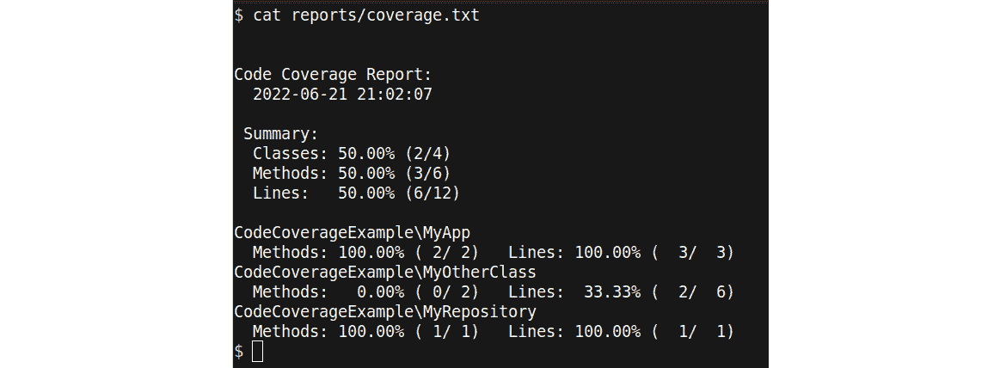
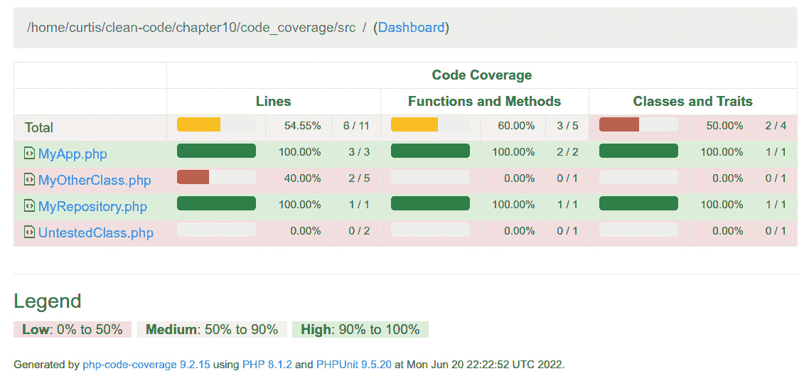
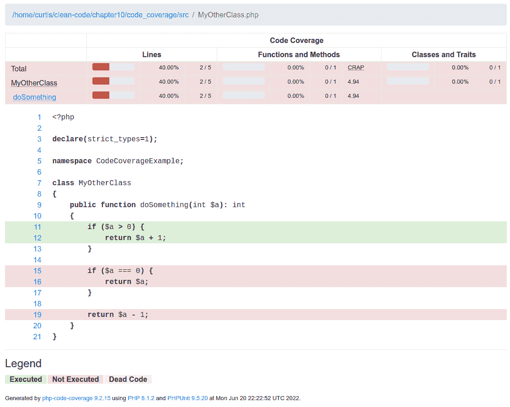

# 第十章：自动化测试

如果你从这本书的第一章开始就阅读了所有的章节，你不仅会有一个理论背景的概念，而且还会手头有一套很好的工具，这些工具将帮助你编写出色的**PHP：超文本预处理器**（**PHP**）代码。当然，你也可以直接去重构现有的所有代码，可能使用我们工具提供的某些自动化代码操作功能。

你不可能第一次就写出完美的代码——通常需要多次迭代才能让你满意。而且由于你永远不会停止学习，你甚至几个月或几年后还会重构你的代码。然而，即使是最复杂的代码质量工具也无法阻止你不得不进行一项繁琐的任务：在你对代码进行更改后，确保它仍然按预期工作。这就是为什么在本章中，我们想向你介绍**自动化测试**。

通过自动化测试，你将能够快速且可靠地验证你的代码改进没有破坏其功能。这是编写干净代码的一个基石，因为它使你能够有信心地重构代码。

自动化测试这个话题值得一本或两本书来讨论，所以我们只能触及表面。然而，既然我们确信你将在日常工作中从中受益匪浅，我们希望这一章能让你想要了解更多关于这个令人兴奋的话题。

以下几节将为你提供一个良好的概述：

+   为什么你需要自动化测试

+   自动化测试的类型

+   关于代码覆盖率

# 技术要求

除了前几章的技术要求之外，你还需要安装**Xdebug** PHP 扩展。我们将在本章后面的相应部分，*关于代码覆盖率*，提供更多关于这个主题的信息。

本章的代码文件可以在以下位置找到：[`github.com/PacktPublishing/Clean-Code-in-PHP`](https://github.com/PacktPublishing/Clean-Code-in-PHP)

# 为什么你需要自动化测试

尽管 PHP 的标准单元测试框架**PHPUnit**自 2006 年以来就已经存在，但时至今日，并非所有 PHP 项目都使用自动化测试。在这里，许多潜力都被浪费了，因为自动化测试具有许多好处，例如以下这些：

+   **速度和可靠性**：想象一下，你需要反复执行相同的测试步骤。很快，你可能会犯错，或者在某些时候跳过测试。然而，自动化测试会以更快、更可靠的方式为你完成这些枯燥的工作——而且它们不会抱怨。

+   **文档**：通过断言，您可以使用自动化测试间接记录代码的功能，这些断言解释了代码预期要做什么。与注释或维基百科中的文章相比，当某些内容发生重大变化时，您会立即通过失败的测试得到通知。我们将在*第十三章*“创建有效的文档”中再次讨论这个主题，当我们讨论创建有效的文档时。

+   **入职**：一个覆盖我们代码的良好测试套件将帮助新开发者更快地在一个项目中变得高效。测试不仅作为额外的文档，还让开发者有信心进行更改或添加功能。他们可以在将更改部署到任何预发布或生产环境之前验证他们的更改不会破坏任何东西。

+   **持续集成/持续部署（CI/CD）**：无论是 CI 还是 CD，如果您的测试是自动化的，您就可以通过构建管道信任合并的代码没有错误，这使您能够更快地将代码推送到生产环境，从而更频繁地推送。我们将在下一章深入探讨这个主题。

+   **更好的代码**：您不必严格遵循臭名昭著的**测试驱动开发**（**TDD**）方法，就可以从开发中的测试中受益。编写可单元测试的代码甚至可以提高您的代码质量。为了能够独立测试代码（例如，在没有后台运行真实数据库的情况下），您需要考虑代码的分离。如果使用**依赖注入**（**DI**）注入外部依赖项，它们比在类函数中实例化它们更容易用测试对象替换。我们将在*第十二章*“团队合作”中更详细地探讨**DI 模式**。此外，长而复杂的函数与短函数一样难以测试（例如，考虑一下我们在这里讨论的**NPath 复杂性**，它出现在*第八章*中），因此您很快就会开始编写更短的函数，以减少代码中的决策路径数量。

+   **更简单的重构**：当您想根据我们在*第七章*中介绍过的静态代码分析器的结果重构项目时，自动化测试是无价之宝。您可以使用它们的建议或甚至自动化的代码修复，只需运行测试后，您就会知道这是否引入了任何副作用。由于重构是我们在这本书的上下文中最重要的用例，我们将在下一节中更详细地讨论它。

TDD

TDD 是一种同时编写测试和实际代码的编码方式。基本思想很简单，通常被称为**红/绿/重构**：在为新的功能或甚至是一个错误修复编写任何代码之前，第一步是编写一个检查预期结果的测试。由于你还没有编写任何实际代码，测试将失败（用红色表示）。在第二步中，你编写代码，不必过于关注使其完美，直到测试通过（绿色）。既然你现在已经有了工作的测试，你可以轻松地改进（重构）代码，直到你满意。

TDD 范式确保你的所有代码都将被测试覆盖，并且代码已经以完全可测试的方式编写。不过，不要过于认真：有时你只是想在没有明确目标的情况下进行实验——例如，当你玩一个新的**应用程序编程接口**（**API**）时。在这种情况下，你不需要遵循 TDD。

## 带有测试的简化重构

如果你从**绿色**开始一个项目（也就是说，从头开始编写），你可以在开始编写代码时立即从代码质量工具中获得反馈的舒适感。这是一个很大的帮助，但即使是最好的工具也无法阻止你做出错误的决定，并编写你将来想要撤销的代码。

这对每个人来说都是常态，而且绝对不应该让你气馁。你每天都在学习新东西，随着你个人技能的发展，你的代码也会发展。如果你看看你一年前的代码，你可能会想立即重构它。

当然，不仅仅是你的技能，整个 PHP 生态系统也在不断进步。今天被认为是标准的东西，在以前可能根本不存在。新的包或语言特性不断被引入，你希望在项目中使用它们，而不是永远停留在旧的技术上。

因此，代码随着时间的推移而改变——这是完全正常的，我们作为开发者应该接受变化；我们代码的任何部分永远不会是最终的。我们将更改现有代码称为**重构**。关于重构有趣的部分是代码被更改了，但软件对用户来说看起来没有变化。所有的工作都在“引擎盖下”完成。例如，如果你更新了项目的框架到最新版本，而用户没有注意到任何直接的变化，那么你就做得很好。

重构有好处；否则，我们不会去做。如果做得正确，它可以带来——例如——性能改进、安全性提高，或者通常允许应用程序在云中可扩展。然而，重构往往带有负面含义。特别是管理者往往认为重构意味着仅仅因为网络开发世界中又有新的炒作，工程师们想要追随，宝贵的工时就被浪费了。

让我们坦诚地说：当然，这种情况也会发生。界限往往难以划分。例如，假设你的职责是维护一个老旧但运行完美的 PHP 应用程序，该应用程序使用**单例模式**进行对象实例化。如果你只是偶尔需要做些小改动，实际上没有必要将其重构为使用依赖注入。然而，如果你需要实施持续性的改动，比如添加新模块和测试，那么这样做可能是个不错的选择。

通常，你将不得不为你的重构工作提供合理的解释。这时，将代码的维护称为**系统健康维护**可能更有帮助。每个人对机器需要维护的事实都感到完全正常：部件需要更换，润滑剂必须更新，等等。然而，不知何故，我们的软件似乎应该永远工作。

在现在有了良好的重构理由之后，我们想要了解测试如何帮助我们。为了实现这一点，让我们在下一节中更详细地看看存在哪些不同的测试类型。

# 自动化测试类型

尽管单元测试可能是最广为人知的自动化测试类型，但其中还有更多值得探索的内容。在本节中，我们将介绍最常见（且最重要的）测试类型。一个著名的测试概念是**测试金字塔**，如下所示：


图 10.1：测试金字塔

这个概念基本上展示了三种测试类型——即**端到端测试**（简称**E2E 测试**）、**集成测试**和**单元测试**。我们将在接下来的章节中解释每种测试类型及其在测试金字塔中的位置。

## 单元测试

正如其名所示，**单元测试**是关于测试代码的小单元。最佳实践是为一个对象的功能编写一个测试；否则，测试将变得更大，更难以理解和维护。这也使得测试保持小巧，这也是为什么通常会有很多测试。根据项目规模的不同，拥有数百或数千个单元测试是完全正常的，因此保持它们尽可能快速执行非常重要。通常，它们不应该每个测试超过几微秒。

单元测试应在隔离状态下运行，这意味着在测试中，被测试的对象不会与任何其他外部服务交互，例如数据库或 API。这是通过模拟外部依赖项来实现的，在单元测试术语中称为**模拟**。简单来说，我们用**模拟对象**（或简称**mocks**）替换了外部对象——例如，在测试对象内部使用的服务或存储库。这些对象在单元测试的运行时模拟了它们所替代的依赖项的行为。这确保了测试不会因为——例如——数据库中某些数据（我们的测试所依赖的数据）发生了变化而突然失败。

由于这种类型的测试很小、速度快，且不依赖于外部依赖，因此为它们创建测试设置相对容易。它们非常有帮助，因为它们可以在几秒钟内告诉你你的代码的最后更改是否导致了任何问题。这就是为什么它们是测试金字塔的基础。

如果你刚开始接触测试，从 **PHPUnit** 开始是有意义的，因为它是 PHP 世界的行业标准。如果你开始一个新的项目，很可能 PHPUnit 将会被使用。还有其他具有独特优势的测试框架，例如 **Pest** ([`pestphp.com`](https://pestphp.com))。一旦你掌握了使用 PHPUnit 进行单元测试的概念，我们鼓励你也尝试一下它们。

单元测试的一个缺点是它们之间不交互。这甚至可能导致所有测试都通过，而你的应用程序却出了问题，仅仅是因为类之间的交互没有经过适当的测试。

为了说明这个问题，我们创建了一个基本的演示应用程序。让我们看看它的最重要的部分。

演示应用程序源代码

你可以在本书的 GitHub 仓库中找到完整的源代码：

https://github.com/PacktPublishing/Clean-Code-in-PHP

首先，我们创建一个基本的类，称为 `MyApp`，如下所示：

```php
<?php
class MyApp
{
    public function __construct(
        private myRepository $myRepository
    ) {
    }
    public function run(): string
    {
        $dataArray = $this->myRepository->getData();
        return $dataArray['value_1'] .
          $dataArray['value_2'];
    }
}
```

`MyRepository` 方法通过构造函数注入。唯一的方法 `run` 使用仓库来获取数据并将其连接起来。需要注意的是，`MyClass` 期望 `MyRepository` 返回一个特定的数组结构。这并不推荐这样做，但你仍然会发现这在“野外”很常见。因此，它完美地作为一个演示。

`MyRepository` 看起来是这样的：

```php
<?php
class MyRepository
{
    public function getData(): array
    {
        return [
            'value_1' => 'some data...',
            'value_2' => 'and some more data'
        ];
    }
}
```

在现实生活中，`MyRepository` 会从外部数据源，如数据库中获取数据。在我们的例子中，它返回一个硬编码的数组。如果 `MyClass` 的 `run` 方法被执行，它将返回一个 `some data...and some more data` 字符串。

当然，我们也为前面的类添加了测试（使用 PHPUnit）。为了简洁，我们只会在以下代码片段中展示测试案例，而不是整个测试类：

```php
public function testRun(): void
{
    // Arrange
$repositoryMock = 
      $this->createMock(MyRepository::class);
    $repositoryMock
        ->expects($this->once())
        ->method('getData')
        ->willReturn([
            'value_1' => 'a',
            'value_2' => 'b'
        ]);
    // Act
    $appTest = new MyApp($repositoryMock);
    $result = $appTest->run();
    // Assert
    $this->assertEquals('ab', $result);
}
public function testGetDataReturnsAnArray(): void
{
    // Arrange
    $repositoryTest = new MyRepository();
    // Act
    $result = $repositoryTest->getData();
    // Assert
    $this->assertIsArray($result);
    $this->assertCount(2, $result);
}
```

安排-行动-断言（AAA）模式

你可能已经注意到，我们在两个测试案例中都添加了三行注释：`Arrange`、`Act` 和 `Assert`。我们这样做是为了演示编写单元测试最常用的模式：**AAA 模式**。即使你从未自己编写过任何单元测试，它也能帮助你理解它们是如何工作的。

首先，准备测试对象和所需的先决条件，如模拟对象（`Arrange`）。其次，执行被测试对象的实际工作（`Act`）。最后，我们确保测试结果符合我们的预期（`Assert`）。如果任何一个断言未满足，整个测试将失败。

这里有两点值得注意，如下所述：

1.  在`testRun()`中，我们创建一个`$repositoryMock`模拟对象而不是使用实际的`MyRepository`方法。这是因为我们假设`MyRepository`通常会从外部数据源获取数据，我们不希望编写具有外部依赖的单元测试。

1.  `testGetDataReturnsAnArray()`并没有很好地测试仓库。我们只是检查结果是否为数组，并且它有两个条目，但没有检查返回的数组键。

现在，假设由于某种原因，一位开发人员决定`value_1`和`value_2`数组键名太长，并将它们重命名为`val1`和`val2`。如果我们现在运行我们的应用程序，它当然会崩溃，如下所示：

```php
$ php index.php 
PHP Warning:  Undefined array key "value_1" in
  /home/curtis/clean-
  code/chapter10/unit_tests_fail/src/MyApp.php on line 18
PHP Warning:  Undefined array key "value_2" in
  /home/curtis/clean-
  code/chapter10/unit_tests_fail/src/MyApp.php on line 18
```

然而，如果你执行这些测试，它们仍然会通过，如下所示：

```php
$ vendor/bin/phpunit tests
PHPUnit 9.5.20 #StandWithUkraine

..                                         2 / 2 (100%)

Time: 00:00.008, Memory: 6.00 MB

OK (2 tests, 4 assertions)
```

这说明拥有单元测试很重要，但这并不意味着我们不会再引入错误，因为它们可能存在缺陷或测试了错误的内容，就像我们的例子中那样。

经常情况下，像**仓库**这样的与外部系统交互的对象根本不会被测试，因为这需要更复杂的测试设置——例如，使用带有伪造数据的附加测试数据库。如果我们只是用一个模拟对象替换这样的对象，测试将正确执行。如果原始对象后来有重大变化，而模拟对象没有更新以反映这些变化，我们可能会陷入我们刚才描述的情况。

为了克服这个问题，我们需要一种方法来额外测试我们的类，而无需用模拟对象替换依赖。为此，我们将在下一节介绍测试金字塔的第二个测试类型——集成测试。

## 集成测试

我们接下来要查看的第二种测试类型是**集成测试**。与单元测试不同，单元测试不应该使用任何外部依赖，而在这个测试类型中，我们想要做相反的事情：我们想要测试代码的正常运行，而不用模拟对象替换任何内容。

你可能已经见证过使用测试数据库或某些外部 API 的单元测试套件。从技术上讲，这些测试不再是单元测试，而是集成测试（或者也称为**功能测试**）。理论上，我们也可以使用 PHPUnit 进行这些测试，或者使用特定的测试工具，这些工具为我们处理了很多基础工作。

以下代码片段展示了集成测试的一个示例：

```php
public function productIsSaved(Tester $tester)
{
    $product = new Product();
    $product->setId(123);
    $product->setName('USB Coffee Maker');
    $product->save();

   $this->tester->seeInDatabase(
        'products',
        ['id' => 123, 'name' => 'USB Coffee Maker' ]
    );
}
```

前面的函数展示了如果我们使用了`$tester`，一个传递给测试的`Helper`对象，它提供了我们执行测试所需的功能——例如，数据库检查。在执行`$product`测试对象的`save`方法之后，我们使用这个`Helper`对象来验证我们预期写入数据库的数据实际上是否已经写入。

Codeception

Codeception ([`codeception.com`](https://codeception.com)) 结合了多种测试类型，如单元测试、集成测试，甚至端到端测试，在一个工具中。在底层，它基于现有的工具，如 PHPUnit。它为所有主要框架提供模块，因此可以很好地集成到大多数 PHP 项目中。

使用集成测试使得测试设置更加复杂，因为我们必须确保我们使用的所有外部依赖始终处于可靠状态。例如，如果你需要依赖于数据库中的某个特定用户，你必须确保它始终具有相同的数据，例如你测试的用户**标识符（ID**）；否则，你的测试将会失败。这通常需要在每次测试运行之前创建一个新的测试数据库，以确保之前的测试运行留下的任何残留物不会干扰我们的测试。此外，我们需要运行**数据库迁移**，以确保测试数据库模式是最新的。最后，我们必须填充测试数据，这被称为**播种（seeding**）。

这种测试类型的主要缺点是执行速度。数据库事务速度慢（与使用模拟对象相比），并且我们需要在每次测试运行时准备测试数据库。集成测试也更容易出错，或者变得不可靠（不稳定），因为与其他依赖项的交互很快变得非常复杂：如果上一个测试以下一个测试未预料到的方式更改了数据库，你的测试运行将会失败，尽管代码没有变化。

例如，测试套件中添加了一个新的测试，用于检查一个类是否以某种方式更新数据集。由于这是一个集成测试，它将使用测试数据库进行操作并更改特定的数据集。然而，在执行此测试之后，更改后的数据仍然保留在测试数据库中。如果另一个在新的测试之后运行的测试依赖于之前的数据，它将会失败。尽管测试设置增加了复杂性，但集成测试确保了测试对象在应用程序上下文中的集成工作正常。这就是为什么它们应该是测试策略的一个组成部分，成为测试金字塔的第二层。

当涉及到测试仓库、模型或控制器时，你会找到大量的集成测试。然而，它们无法测试 PHP 和浏览器之间的交互。由于我们主要使用 PHP 来构建 Web 应用程序，这是一个我们不应该忘记的方面。幸运的是，测试金字塔中的最后一种测试类型正好解决了这个问题。

## 端到端测试

对于这种测试类型，我们将暂时离开 PHP 领域。使用**端到端测试（E2E tests**），我们想要确保从服务器到客户端（例如，浏览器）以及再次返回服务器的整个流程运行良好。我们基本上模拟一个坐在电脑前点击我们应用程序的用户。

要实现这一点，我们首先需要一个可重复的测试环境。就像集成测试一样，我们必须确保我们想要测试的应用程序始终处于相同的状态。这意味着我们需要确保在每次测试运行中都可用相同的集合数据（例如，博客文章或商店中的文章）。

其次，我们需要自动化用户与我们的测试环境之间的交互。这里事情变得有趣：我们不仅需要一个应用程序，还需要一个本地 Web 服务器和一个浏览器来运行它并模拟用户交互。Web 服务器增加了测试设置的复杂性，但通常不会成为障碍。对于用户交互，我们需要使用所谓的**无头浏览器**。这样的浏览器可以在不打开浏览器窗口的情况下与服务器交互。这是一个极其有用的功能，因为我们可以在命令行中使用它，而无需安装带有**图形用户界面**（**GUI**）的完整操作系统，例如 Ubuntu 桌面或 Windows。这为我们节省了大量安装时间，并帮助我们不会进一步增加复杂性。

在撰写本文时，**Google Chrome**是首选选择，因为它不仅是当今最广泛使用的浏览器引擎，还提供了**无头**模式，换句话说，它可以像无头浏览器一样工作。使用现代框架如**Cypress**，自动化与我们的应用的用户交互变得轻而易举。把它想象成一个脚本，告诉浏览器打开哪个**统一资源定位符**（**URL**），点击哪个按钮等等。以下是一个简化的 Cypress 测试示例：

```php
describe('Application Login', function () {
    it('successfully logs in', function () {
        cy.visit('http://localhost:8000/login')
        cy.get('#username')
            .type('test@test.com')
        cy.get('#password')
            .type('supersecret')
        cy.get('#submit')
            .click()
        cy.url()
            .should('contain',
              'http://localhost:8000/home')
    })
})
```

Cypress

Cypress 测试框架([`www.cypress.io/`](https://www.cypress.io/))使得编写端到端测试变得非常容易，因为它为您处理了无头浏览器的设置和通信。是的——测试将用 JavaScript 编写，但这不应该阻止你尝试一下。

`cy`对象代表测试者，它执行某些步骤。在先前的代码示例中，它首先打开一个虚构应用的登录页面，填写登录表单中的`#username`和`#password`字段，并通过点击**#submit**按钮提交。作为最后一步，它检查登录是否成功以及测试者是否被转发到主页。所有这些操作都是在后台运行的实时浏览器中执行的。使用这项技术，我们可以编写测试套件，这些套件可以像人类一样逐字点击我们的应用。它们不仅测试 PHP 代码，还测试前端代码——例如，一个 JavaScript 错误会迅速中断测试。即使你自己无法修复错误，你仍然可以向团队中的前端工程师报告存在问题。

现代框架使得编写测试比使用旧技术，如 Selenium，要容易得多。事实上，现在它非常舒适，甚至不是开发者但拥有坚实的专业技术基础的人，如**质量保证**（**QA**）工程师，也可以轻松编写他们自己的测试套件。这种方法从团队中减轻了压力，因为开发者需要编写的测试更少，QA 人员可以按照需要设置测试，而无需等待开发者。

当然，端到端测试有一些缺点，这也是为什么它们只是测试金字塔的第三层：测试环境更复杂，需要更多的工作来设置，尤其是在使用数据库或任何外部 API 的情况下。这种测试类型也是最快的，因为它除了前一种测试类型的设置外，还涉及到浏览器。最后，这些测试很容易出错，因为通常测试框架使用`id`和`class`属性，甚至**文档对象模型**（**DOM**）选择器来在 DOM 中导航并找到要与之交互的元素。因此，DOM 上的微小变化可能会迅速破坏你的整个测试套件。

页面对象

如果你感兴趣于创建可维护的端到端测试，你应该检查**页面对象**的概念（[`www.martinfowler.com/bliki/PageObject.html`](https://www.martinfowler.com/bliki/PageObject.html)）。

## 实践中的测试金字塔

通过单元测试、集成测试和端到端测试，你现在知道了三种最重要的测试类型，以及它们的优缺点。建议的方法是将单元测试作为巨大的基础，适量的集成测试，最后是一些端到端测试，这是一个好的起点。

然而，你不必始终严格遵循它，因为每个项目都是不同的：例如，如果你想开始测试一个尚未完全测试的应用程序，引入单元测试将需要大量的重构工作来使类可测试。这种重构在开始时可能会引入比解决的问题更多的错误。

在这种情况下，从良好的端到端测试覆盖率开始将更快、更安全。一旦应用程序的主要部分可以自动测试，你就可以安全地开始重构并引入单元测试和/或集成测试。如果你的应用程序因为必要的重构而崩溃，你的端到端测试会为你提供保障。

在本章结束之前，我们将列出一些更多的测试类型供你评估，如果你感兴趣的话。现在，本章中我们讨论的三个测试类型是最重要的，应该足以让你开始。

有一个重要的问题我们还没有真正涉及，那就是：你真正需要测试多少代码？我们将在下一节讨论这个问题。

# 关于代码覆盖率

现在我们已经探讨了不同的测试类型，你可能想立即开始编写测试。但在你把这本书收起来开始编码之前，让我们以这样一个问题结束本章：你应该测试多少代码？

部分答案在于代码覆盖率的概念，我们已经在*第八章**代码质量指标*中简要提到了，当我们讨论代码质量指标时。现在让我们更深入地了解一下。

## 理解代码覆盖率

**代码覆盖率**衡量的是被测试覆盖的代码比例。覆盖率越高，越好——如果有更多的测试，软件中包含的 bug 就越少，而且更难在不被发现的情况下引入新的 bug。更高的代码覆盖率也可能是更好的代码质量的指标——正如我们在本章前面的一个部分所讨论的，经过测试的代码必须以某种方式编写，这通常会导致更好的质量。

通常，覆盖率程度简单地用测试代码的百分比来表示——也就是说，从 0%（完全未测试）到 100%（完全代码覆盖率）。但我们如何衡量代码覆盖率？为此，我们将使用 PHPUnit，因为它可以为我们生成代码覆盖率报告。然而，它需要一个额外的 PHP 扩展来实现代码覆盖率功能。对于本章，我们决定使用**Xdebug**，这是标准的 PHP**调试器**和**性能分析器**。

### 设置 Xdebug

Xdebug 是一个 PHP 扩展，因此需要将其作为模块加载。由于其安装相对复杂，主要取决于你运行 PHP 的操作系统，请参阅[`xdebug.org`](https://xdebug.org)上的官方文档，了解如何安装和配置它。互联网上也有大量的教程。

如果你重构了代码，你可能想知道这些更改的性能影响是什么。你的执行时间是否有所改善，或者变得更糟？使用所谓的**性能分析器**，你可以详细测量每个函数的执行时间，并查看瓶颈隐藏在哪里。

我们无法在我们的书中涵盖这个主题，但既然在本章的过程中我们已经使用了 Xdebug，你可能还想检查它的性能分析功能：[`xdebug.org/docs/profiler`](https://xdebug.org/docs/profiler)。其他提供更多便利的商业服务包括——例如——**Tideways** ([`tideways.com`](https://tideways.com))或**Blackfire** ([`www.blackfire.io`](https://www.blackfire.io))。

Xdebug 替代方案

请注意，你可以使用其他扩展来完成这项工作，例如**PCOV** ([`github.com/krakjoe/pcov`](https://github.com/krakjoe/pcov))，如果你只想做代码覆盖率报告，它的性能会更好。然而，Xdebug 是一个极其有用的调试器，你应该了解它——如果你不了解，我们鼓励你查看一些关于它的教程。

## 如何生成代码覆盖率报告

为了演示如何创建代码覆盖率报告，我们将使用本章前一部分中的小演示应用程序。为了跟进这个例子，请从 GitHub 上检出它，运行 `composer install`，并确保你已经安装了 `mode` 设置为 `coverage` 的 Xdebug。

在我们开始生成报告之前，让我们看看 PHPUnit 提供哪些报告格式。它可以生成各种格式的报告，你可能现在不需要，例如 `Clover`、`Cobertura`、`Crap4J` 或 `PHPUnit` XML 格式。然而，当你开始将 PHPUnit 与其他工具集成时，它们可能会变得更加相关。

然而，我们不想在这本书中这样做，所以我们只对两种最易访问的格式感兴趣：文本和 HTML。文本格式可以直接在命令行上打印，这在你想立即得到结果或集成 PHPUnit 到你的构建管道时非常有用，而 HTML 格式提供了更多信息。

对于我们的示例，我们希望将两种报告格式都写入项目根目录下名为 `reports` 的新文件夹中。虽然你可以使用许多 PHPUnit 运行时选项来生成它们，但我们希望使用 `phpunit.xml` 配置文件来定义每次测试运行时要生成的内容。以下代码片段显示了一个最小版本，为了可读性进行了简化。在我们的 GitHub 仓库中，你可以找到完整的 `phpunit.xml` 文件：

```php
<?xml version="1.0" encoding="UTF-8"?>
<phpunit bootstrap="vendor/autoload.php">
    <testsuites>
        <testsuite name="default">
            <directory>tests</directory>
        </testsuite>
    </testsuites>
    <coverage>
        <include>
            <directory suffix=".php">src</directory>
        </include>
        <report>
            <html outputDirectory="reports/coverage" />
            <text outputFile="reports/coverage.txt" />
        </report>
    </coverage>
</phpunit>
```

除了基本的配置之外，这包括定义我们需要的 `tests` 文件夹以进行常规测试运行，我们还添加了 `<coverage>` 节点。这个节点包含两个子节点：`<includes>` 和 `<report>`。在使用 `<includes>` 节点时，指定用于收集代码覆盖率信息的目录和文件扩展名非常重要。否则，PHPUnit 不会生成任何报告，也不会对缺失的信息提出抱怨。这有时可能会相当令人困惑。

此外，我们还需要告诉 PHPUnit 将哪些报告写入何处。我们使用 `<report>` 节点来完成这项工作，正如你所看到的，我们指定了 HTML 和文本报告都应写入项目根目录下的 `reports` 文件夹中，如果它不存在，将会被创建。

PHPUnit 预期配置文件命名为 `phpunit.xml` 并位于项目根目录。如果已经完成，你可以通过运行以下命令快速执行报告的生成，无需任何其他选项或参数：

```php
$ vendor/bin/phpunit
```

在执行前面的命令之后，你将在项目根目录下找到一个名为 `reports` 的文件夹。它应该包含两样东西：首先，一个包含文本格式报告的 `coverage.txt` 文件，其次，一个包含 HTML 报告的 `coverage` 文件夹。

代码覆盖率是昂贵的

使用 Xdebug 生成代码覆盖率报告将减慢你的测试套件的执行速度，因为 Xdebug 需要收集大量数据，而且它并不是为了性能而构建的。因此，我们建议仅在必要时启用 Xdebug 和报告生成，但在常规测试运行期间保持禁用。

文本报告虽然简短，但已经告诉你你的测试如何覆盖你的应用程序，如下面的截图所示：



图 10.2：文本代码覆盖率报告

要获取更多详细信息，请打开浏览器中的`reports/coverage/index.html`文件。它应该看起来像这样：



图 10.3：HTML 代码覆盖率报告

你可以在那里找到相同的文本报告信息，但可视化效果更好。此外，报告是交互式的。例如，如果你点击左侧的`MyOtherClass.php`链接，你将被带到该类的详细报告，如下面的截图所示：



图 10.4：HTML 代码覆盖率报告 – 类视图

这里有两点值得关注：首先，在**函数和方法**部分，你可能已经认出了我们在*第八章**，代码质量指标*中引入的 CRAP 指标。在这里，你终于可以看到它在实际中的应用。

其次，报告详细显示了在测试期间哪些行被访问过（绿色背景），哪些没有被访问过（红色背景）。如果有任何行完全无法访问（例如，在最后一个`return`语句之后的另一个语句），它将显示为**死代码**（黄色背景）。死代码可以安全地删除。

现在，你对项目的代码覆盖率有了很好的概述。如果文件以红色条形图显示，这意味着在测试运行期间根本没有执行，所以你可以在那里改进你的测试套件。

## 使用@covers 注解

代码覆盖率存在一个问题：它告诉你测试期间哪些代码已被*执行*，但这并不意味着执行的代码也已被*测试*（即使用断言）。这是 PHPUnit 无法自动确定的事情。这意味着即使你的代码覆盖率报告显示 100%并且到处都是绿色条形图，这也并不意味着你的代码得到了良好的测试。它只是在测试套件的运行过程中被执行了。

为了克服这个问题，建议在类级别使用`@covers`注解，如下所示：

```php
/**
 * @covers MyRepository
 */
class MyRepositoryTest extends TestCase
{
    public function testGetDataReturnsAnArray(): void
    {
        // ...
    }
}
```

这提高了我们测试的准确性，因为我们通过使用 `@covers` 注解，明确声明了我们的测试要测试哪些代码。例如，假设我们要测试的类使用了一个外部服务。你只想测试这个类，而不是它所使用的服务，因此你只编写检查要测试的类的断言。然而，如果没有 `@covers` 注解，PHPUnit 仍然会将外部服务包含在代码覆盖率报告中，因为它是测试过程中执行的一部分。

你也可以在方法级别上使用 `@covers`；然而，如果你——例如——重构一个类并将方法提取到另一个类中，这可能会引起问题。如果你忘记调整这里方法级别的 `@covers` 注解，覆盖率报告将不再准确。

要强制使用 `@covers` 注解，请在 `phpunit.xml` 文件中使用 `forceCoversAnnotation` 选项。如果它设置为 `true`，则未使用注解的测试将被标记为有风险；它们不会失败，但在报告中会单独列出，作为需要改进的内容。这样，你的同事（以及你自己）就不会忘记使用它。

## 需要测试的内容

我们现在知道了如何获取有关我们代码测试程度的详细信息。那么，你现在是否应该追求完整的代码覆盖率？是否应该将 100% 作为目标？

如我们在本章前面部分对示例应用程序的测试中看到的，为一个类编写测试并不意味着你真的测试了它的每个方面。在这里，遗憾的是，即使测量代码覆盖率也无法帮助。然而，它可以帮助你识别那些没有测试任何内容的测试。特别是在测试用例中使用了大量模拟时，可能会发生只有模拟被测试，而没有“真实代码”的情况。考虑以下测试用例，这是一个有效的测试，将会通过：

```php
public function testUselessTestCase(): void
{
    $repositoryMock = 
      $this->createMock(MyRepository::class);
    $repositoryMock
        ->method('getData')
        ->willReturn([
            'value_1' => 'a',
            'value_2' => 'b'
        ]);
    $this->assertEquals(
        [ 
           'value_1' => 'a',
           'value_2' => 'b'
        ],
        $repositoryMock->getData()
    );
}
```

这个例子虽然简化了，但它说明了代码覆盖率报告如何有助于我们，因为这个测试不会为我们的代码覆盖率比率增加任何已测试的行。不幸的是，目前还没有任何工具能告诉你哪些测试写得很好，哪些应该改进，甚至是有用的，就像我们的例子一样。

根据**帕累托法则**，目标是 80% 的代码覆盖率应该已经极大地改善了你的代码库，而且这可以通过合理的努力实现。将你的重点放在使你的应用程序特殊的那部分代码上——通常被称为**业务逻辑**。这是需要你大部分注意力的代码。

帕累托法则

帕累托法则指出，80% 的结果是通过 20% 的总努力实现的。剩下的 20% 的结果需要量化的最大工作量，占用了 80% 的总努力。

还有那些实际上并不需要测试的简单代码。一个常见的例子是测试获取器和设置器。如果这些方法包含进一步的逻辑，当然有测试它们的道理。但如果它们只是设置或返回属性值的简单函数，为它们编写测试就是浪费时间。尽管如此，如果你想要追求 100%的代码覆盖率，你仍然需要这样做。

其他例子包括配置文件、工厂或路由定义。使用端到端（E2E）或集成测试就足够了，这些测试确保应用程序总体上能正常工作。它们隐式地（即，不使用具体的断言）测试了所有**粘合代码**，这些代码是保持你的应用程序在一起的所有代码，但测试起来却很繁琐。

尤其是端到端（E2E）测试通常不计入代码覆盖率指标，因为技术上很难做到这一点。尽管如此，如果你有这些测试，它们将增加一个额外的测试覆盖率层，这是无法测量的。你不能吹嘘 100%的代码覆盖率，但你清楚所有不同的测试类型都在支持你，而这应该是我们的首要目标。

# 摘要

在本章中，我们讨论了为什么你应该使用自动化测试以及它是如何提高你的代码质量的。我们涵盖了主要的三个测试类型，即单元测试、集成测试和端到端（E2E）测试，包括它们的优缺点、潜在陷阱以及我们关于如何使用它们的建议。最后，你了解了代码覆盖率的概念，以及如何在你的项目中使用它。

结合前一章关于代码质量工具及其组织方式的知识，在下一章中，我们终于可以开始将这些工具组合成一个流程，帮助以结构化和可靠的方式运行所有这些工具——构建管道。

# 进一步阅读

本章中涵盖的测试类型远多于我们所能讨论的范围。如果你觉得自动化测试的世界像作者们一样迷人，你可能还想了解其他测试类型，例如以下这些：

+   **突变测试**涉及对要测试的代码进行微小的更改（所谓的突变）。如果你的测试能够捕捉到这些突变，它们通常写得很好；否则，它们将让突变逃逸。**Infection**是目前 PHP 世界中这个测试类型最知名的工具体([`infection.github.io`](https://infection.github.io))。

+   **视觉回归测试**字面上比较测试期间生成的应用程序截图与原始截图，以捕捉**层叠样式表**（**CSS**）中的问题。虽然这并不是直接与 PHP 相关，但如果你想保持你的 Web 项目的样式完美，这可能会对你很有趣。一个值得检查的好选择是**BackstopJS**([`github.com/garris/BackstopJS`](https://github.com/garris/BackstopJS))。

+   **API 测试**可以被视为端到端测试，但仅限于您应用程序可能提供的 API。由于测试基于**超文本传输协议**（**HTTP**）请求，因此不需要无头浏览器，这使得设置更加简单。开始 API 测试的一个好选择是**Codeception**（https://codeception.com）。

+   **行为驱动开发**（**BDD**）是一个非常有趣的方法，因为它关注利益相关者（例如，项目经理）、QA（如果有）和开发者之间的沟通。这是通过在名为**Gherkin**的语言中以特殊方式编写测试来实现的，这基本上使非技术人员能够编写测试套件。PHP 的 BDD 工具称为**Behat**（[`github.com/Behat/Behat`](https://github.com/Behat/Behat)）。
