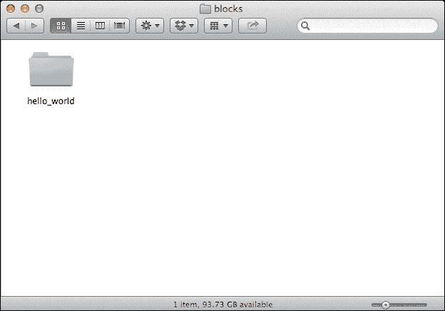
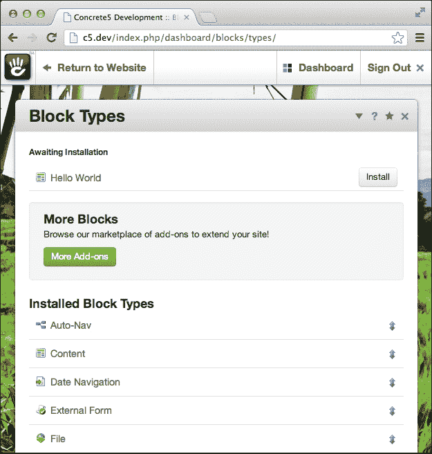
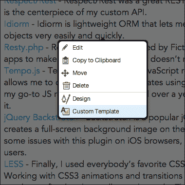
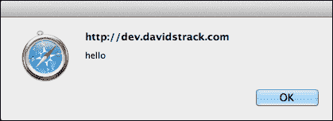
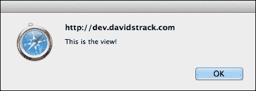

# 第二章. 与块一起工作

在本章中，我们将介绍以下食谱：

+   创建自定义块类型

+   使用块控制器回调函数

+   从控制器向视图发送变量

+   从块控制器向页面页眉和页脚添加项目

+   创建自定义块模板

+   在块表单中包含 JavaScript

+   在块视图中包含 JavaScript

+   在块视图中包含 CSS

+   通过其句柄加载块类型

+   将块添加到页面

+   从区域获取块

# 简介

concrete5 中的块是小型、模块化的视觉展示组件，可以几乎添加任何类型的内容到您的网站。块可以包含文本内容、HTML 代码、图片、视频、交互式地图或您能想到的任何其他内容。当您编辑 concrete5 网站的页面内容时，您正在编辑内容块类型的一个实例。块被添加到页面的特殊区域，这些区域在主题布局中指定。concrete5 默认附带了许多不同的块类型，并且创建您自己的自定义块类型很容易，这使您能够为您的网站添加无限的可能性。

在本章中，我们将从头开始创建一个自定义块类型。此块类型将仅显示一些用户可以通过 **CMS** 界面编辑的文本，并将作为一个基本的 "Hello World" 示例。

# 创建自定义块类型

创建块类型是向网站添加自定义功能的好方法。这是添加像日历、经销商定位器或任何其他在网站前端可见且可重复的内容的首选方式。

## 准备工作

该食谱的代码可以从本书的网站上免费下载。我们将创建一个完全功能性的块类型，该类型将在我们的网站上显示内容。

## 如何操作...

创建自定义块类型的步骤如下：

1.  首先，您需要在您网站的根目录 `/blocks` 中创建一个目录。目录的名称应该是下划线，并且将在整个代码中用来引用块。在这种情况下，我们将创建一个名为 `/hello_world` 的新目录。

1.  一旦您创建了 `hello_world` 目录，您需要创建以下文件：

    +   `controller.php`

    +   `db.xml`

    +   `form.php`

    +   `add.php`

    +   `edit.php`

    +   `view.php`

    +   `view.css`

1.  现在，我们将为每个文件添加代码。首先，我们需要设置 `controller` 文件。`controller` 文件是驱动块的动力所在。由于这是一个非常基础的块，我们的控制器将只包含一些信息，以告诉 concrete5 关于我们块的一些细节，例如它的名称和描述。

1.  将以下代码添加到 `controller.php` 文件中：

    ```php
    class HelloWorldBlockController extends BlockController {
      protected $btTable = "btHelloWorld";
      protected $btInterfaceWidth = "300";
      protected $btInterfaceHeight = "300";
      public function getBlockTypeName() {
        return t('Hello World');
      }
      public function getBlockTypeDescription() {
        return t('A basic Hello World block type!');
      }
    }
    ```

1.  注意，类名是`HelloWorldBlockController`。concrete5 约定规定，你应该使用与`block`目录相同的名称来命名你的块控制器，并以驼峰式（例如：CamelCase）形式，后面跟`BlockController`。`btTable`类变量很重要，因为它告诉 concrete5 应该使用哪个数据库表来处理此块。重要的是，这个表在数据库中尚未存在，所以给它取名为`bt`（代表“块类型”）加上块名称的驼峰式版本是一个好主意。

1.  现在控制器已设置，我们需要设置`db.xml`文件。此文件基于 ADOXMLS 格式，该格式在[`phplens.com/lens/adodb/docs-datadict.htm#xmlschema`](http://phplens.com/lens/adodb/docs-datadict.htm#xmlschema)有文档说明。此 XML 文件将告诉 concrete5 应该为新的块类型创建哪些数据库表和字段（以及当您的块类型更新时，哪些表和字段应该更新）。

1.  将以下 XML 代码添加到您的`db.xml`文件中：

    ```php
    <?xml version="1.0"?>
    <schema version="0.3">
      <table name="btHelloWorld">
        <field name="bID" type="I">
          <key />
          <unsigned />
        </field>
          <field name="title" type="C" size="255">
          <default value="" />
        </field>
          <field name="content" type="X2">
          <default value="" />
        </field>
      </table>
    </schema>
    ```

1.  concrete5 块通常都有`add.php`和`edit.php`文件，这两个文件通常做同样的事情：显示包含块设置的表单。由于我们不希望重复代码，我们将我们的表单 HTML 输入到第三个文件`form.php`中，并在`add.php`和`edit.php`中包含该文件。

    ```php
    <?php 
      $form = Loader::helper('form');
    ?>
    <div>
      <label for="title">Title</label>
      <?php echo $form->text('title', $title); ?>
    </div>
    <div>
      <label for="content">Content</label>
      <?php echo $form->textarea('content', $content); ?>
    </div>
    ```

1.  一切准备就绪后，将以下代码行添加到`add.php`和`edit.php`中，以便在用户添加和编辑块时显示此 HTML 代码：

    ```php
    <?php include('form.php') ?>
    ```

1.  将以下 HTML 添加到您的`view.php`文件中：

    ```php
    <h1><?php echo $title ?></h1>
    <div class="content">
       <?php echo $content ?>
    </div>
    ```

1.  最后，为了增加一点视觉吸引力，将以下代码添加到`view.css`中：

    ```php
    content {
      background: #eee;
      padding: 20px;
      margin: 20px 0;
      border-radius: 10px;
    }
    ```

1.  现在所有文件都已填充了使我们的 Hello World 块工作的代码。现在我们需要在 concrete5 中安装此块，以便我们可以将其添加到我们的页面上。

1.  要安装新块，您需要登录到您的 concrete5 网站，并导航到`/dashboard/blocks/types/`。如果您在这里遇到 PHP 致命错误，请通过访问`/dashboard/system/optimization/clear_cache`来清除您的 concrete5 缓存（在 concrete5 中开发时禁用缓存总是一个好主意）。

1.  在**块类型**屏幕的顶部，您应该看到您的**Hello World**块，准备安装。点击**安装**按钮。

1.  现在块已安装并准备好添加到您的网站中！

## 它是如何工作的...

让我们一步一步地回顾一下我们刚才编写的代码。

在`controller.php`中，类顶部有几个受保护的变量。`$btTable`变量告诉 concrete5 数据库中哪个表包含此块类型的数据。`$btInterfaceWidth`和`$btInterfaceHeight`变量确定当用户将您的块添加到他们网站上的页面时出现的对话框窗口的初始大小。

我们将块描述和名称放入特殊的`getter`函数中，原因之一是为了支持未来的翻译。将任何出现在 concrete5 中的字符串包装在全局`t()`函数中是最佳实践。

`db.xml`文件告诉 concrete5 在安装此块时应创建哪些数据库表。此文件使用 ADOXMLS 格式生成表和字段。在此文件中，我们告诉 concrete5 创建一个名为`btHelloWorld`的表。该表应包含三个字段，一个`ID`字段，一个`title`字段和一个`content`字段。应记录这些字段的名称，因为 concrete5 将需要它们与 HTML 表单中的字段名称匹配。

在`form.php`中，我们正在设置用户将填写以保存块内容的设置表单。我们使用表单助手生成各种字段的 HTML。注意我们如何能够在变量尚未声明的情况下使用`$title`和`$content`变量。concrete5 会自动将这些变量暴露给表单，无论何时添加或编辑块。然后我们在`add.php`和`edit.php`文件中包含这个表单。

`view.php`文件是一个模板文件，其中包含最终用户将在网站上看到的 HTML。我们只是在`<h1>`标签中包装标题，并在具有`.content`类的`<div>`中包装内容。

如果它们存在于你的块目录中，concrete5 将自动包含`view.css`（如果存在，还包括`view.js`）。此外，如果你包含一个`auto.js`文件，它将在块处于编辑模式时自动包含。我们向`.content`类添加了一些基本样式，concrete5 会负责将此 CSS 文件添加到你的网站的`<head>`标签中。

## 参见

+   从控制器向视图发送变量的食谱

+   从块控制器添加项目到页面页眉和页脚的食谱

+   在块视图中包含 CSS 的食谱

+   在块视图中包含 JavaScript 的食谱

# 使用块控制器回调函数

块控制器类包含一些在页面加载过程中的不同点自动调用的特殊函数。你可以查看这些回调来为你的块类型提供不同的功能。

## 准备工作

要开始，你需要创建并安装一个块类型。查看前面的食谱，了解创建自定义块类型的课程。我们将向`controller.php`添加一些方法。

## 如何做到这一点...

使用块控制器回调函数的步骤如下：

1.  打开你的块的`controller.php`文件。

1.  添加一个名为`on_start()`的新函数：

    ```php
    public function on_start() {
    }
    ```

1.  编写一个在控制器加载时触发的`die`语句。

    ```php
    die('hello world');
    ```

1.  刷新包含块类型的任何页面。页面应该在完成之前停止渲染，显示你的调试信息。

1.  一定要删除`die`语句，否则你的块将不再工作！

## 它是如何工作的...

concrete5 会在页面加载过程中的不同点调用各种回调函数。`on_start()` 函数是第一个被调用的。这是一个在块渲染之前放置你想要发生的事情的好地方。

下一个被调用的函数取决于你如何与块交互。如果你只是在页面上查看它，则调用 `view()` 函数。如果你正在添加或编辑块，则将根据情况调用 `add()` 或 `edit()` 函数。这些函数是向视图发送变量的好地方，我们将在下一个菜谱中展示如何做到这一点。`save()` 和 `delete()` 函数也会在这个时候自动调用，如果块正在执行这些功能之一。

之后，concrete5 将调用 `on_before_render()` 函数。这是一个在 concrete5 为页面渲染 HTML 之前添加页面页眉和页脚的好时机。我们将在本章后面做这件事。

最后，调用 `on_page_view()` 函数。这实际上是在页面渲染后运行的，所以这是你在块控制器中执行代码的最后一个地方。当向页面添加 HTML 项目时，这很有帮助。

## 更多内容...

以下函数可以添加到你的控制器类中，它们将在块加载过程中的不同点自动被调用。

+   `on_start`

+   `on_before_render`

+   `view`

+   `add`

+   `edit`

+   `on_page_view`

+   `save`

+   `delete`

要获取可用回调函数的完整列表，请查看位于 `/concrete/core/libraries/block_controller.php` 的块控制器库的源代码。

## 参见

+   *从控制器向视图发送变量* 菜谱

+   *从块控制器向页面页眉和页脚添加项目* 菜谱

# 从控制器向视图发送变量

MVC 编程中的一个常见任务是控制器到视图设置变量的概念。在 concrete5 中，块遵循相同的原理。幸运的是，将变量设置到视图相当简单。

## 准备工作

这个菜谱将使用本章第一个菜谱中创建的块类型。你可以自由地调整这段代码以在任何块控制器中工作。

## 如何做到...

在你的块控制器中，使用 `controller` 类的 `set()` 函数将变量和值发送到视图。注意，视图不一定是你的块的 `view.php` 模板。你也可以将变量发送到 `add.php` 和 `edit.php`。在这个菜谱中，我们将向 `view.php` 发送一个变量。步骤如下：

1.  打开你的块的 `controller.php` 文件。

1.  如果不存在，添加一个名为 `view()` 的函数：

    ```php
    public function view() {
    }
    ```

1.  将一个名为 `name` 的变量设置到视图中。

    ```php
    $this->set('name', 'John Doe');
    ```

1.  在你的块的目录中打开 `view.php`。

1.  输出名称变量的值。

    ```php
    <div class="content">
      <?php echo $name ?>
    </div>
    ```

## 参见

+   *使用块控制器回调函数* 菜谱

# 从块控制器向页面页眉和页脚添加项目

块开发的一个重要部分是能够在适当的位置向页面添加 JavaScript 和 CSS 文件。考虑一个使用 jQuery 插件创建幻灯片小部件的块。为了使其工作，您需要包含插件的 JavaScript 和 CSS 文件。

在此配方中，我们将向页面`<head>`元素添加一个 CSS `<link>`标签，并在页面底部（在关闭`</body>`标签之前）添加一个 JavaScript `<script>`标签。

## 准备工作

此配方将继续使用本章第一个配方中创建的块。如果您需要下载该块的副本，它包含在此书的网站上的代码示例中。

此配方还引用了 CSS 文件和 JavaScript 文件。这些文件可以在本书的网站上提供的代码中下载。

## 如何操作...

从块控制器向页面页眉和页脚添加项的步骤如下：

1.  打开你的块的`controller.php`文件。

1.  在`/css`目录下创建一个名为`test.css`的 CSS 文件。

1.  设置规则以将网站的背景颜色更改为黑色。

    ```php
    body {
      background: #000 !important;
    }
    ```

1.  在`/js`目录下创建一个名为`test.js`的 JavaScript 文件。

1.  在 JavaScript 文件中创建一个警告消息。

    ```php
    alert('Hello!');
    ```

1.  在`controller.php`中创建一个名为`on_page_view()`的新函数。

    ```php
    public function on_page_view() {
    }
    ```

1.  加载 HTML 辅助工具：

    ```php
    $html = Loader::helper('html');
    ```

1.  将 CSS 文件添加到页面页眉：

    ```php
    $this->addHeaderItem($html->css('testing.css'));
    ```

1.  将 JavaScript 文件添加到页面页脚：

    ```php
    $this->addFooterItem($html->javascript('test.js'));
    ```

1.  访问包含此块的网站页面。你应该能看到你的 JavaScript 警告以及黑色背景。

## 它是如何工作的...

如在*使用块控制器回调函数*配方中所述，将项添加到页眉（页面的`<head>`标签）和页脚（在关闭`</body>`标签之前）的理想位置是`on_before_render()`回调函数。`addHeaderItem`和`addFooterItem`函数用于在 Web 文档的这些位置放置文本字符串。我们不会在 PHP 中键入`<script>`和`<link>`标签，而是将使用内置的 HTML 辅助工具生成这些字符串。这些文件应位于网站的根目录`/css`和`/js`目录中。

由于通常最佳实践是首先加载 CSS 文件，最后加载 JavaScript 文件，因此我们将每个项目放置在页面中最合理的位置。

## 相关内容

+   第四章，*使用核心辅助工具*

+   *使用块控制器回调函数*配方

# 创建自定义块模板

所有块都附带一个默认视图模板，`view.php`。concrete5 还支持替代模板，用户可以通过 concrete5 界面启用这些模板。您也可以通过自定义 PHP 代码启用这些替代模板。

## 准备工作

您需要已经创建并安装了一个块类型。在此配方中，我们将向本章开头创建的块类型添加一个模板。

## 如何操作...

创建自定义块模板的步骤如下：

1.  打开你的块目录。

1.  在您的块目录中创建一个名为`templates/`的新目录。

1.  在`templates/`中创建一个名为`no_title.php`的文件。

1.  将以下 HTML 代码添加到`no_title.php`：

    ```php
    <div class="content">
      <?php echo $content ?>
    </div>
    ```

1.  通过访问包含此块的页面来激活模板。

1.  在页面上进入编辑模式并点击块。

    ```php
    Click on "Custom Template".
    ```

    

1.  选择“无标题”并保存您的更改。

## 更多...

您可以直接在块控制器中指定替代模板，因此您可以根据某些设置、条件或几乎任何您能想到的东西自动渲染不同的模板。只需在视图渲染之前被调用的回调中使用`render()`函数即可。

```php
public function view() {
  $this->render('templates/no_title');
}
```

这将使用`no_title.php`文件而不是`view.php`来渲染块。请注意，添加`.php`文件扩展名不是必需的。就像块的常规`view.php`文件一样，开发人员可以在他们的模板目录中包含`view.css`和`view.js`文件，以便自动将这些文件包含在页面上。

## 相关内容

+   *使用块控制器回调函数* 的配方

+   *创建自定义块类型* 的配方

# 在块表单中包含 JavaScript

在添加或编辑块时，通常希望以客户端 JavaScript 的形式包含更高级的功能。concrete5 使自动将 JavaScript 文件添加到块的编辑表单变得极其简单。

## 准备工作

我们将使用本章第一个配方中创建的块进行工作。如果您需要赶上进度，请随时从本书的网站上下载代码。

## 如何操作...

在块表单中包含 JavaScript 的步骤如下：

1.  打开您的块目录。

1.  创建一个名为`auto.js`的新文件。

1.  将基本警报函数添加到`auto.js`：

    ```php
    alert('Hello!');
    ```

1.  访问包含您的块的页面。

1.  进入编辑模式并编辑块。

1.  您应该会看到您的警报消息如以下截图所示：

## 工作原理...

concrete5 在进入块的添加或编辑模式时会自动查找`auto.js`文件。开发人员可以利用这一点来包含块编辑模式特有的客户端功能。

## 相关内容

+   *在块视图中包含 JavaScript* 的配方

+   *在块视图中包含 CSS* 的配方

# 在块视图中包含 JavaScript

除了能够在块的添加和编辑表单中包含 JavaScript 之外，开发人员还可以在块在前端查看时自动包含一个 JavaScript 文件。在这个配方中，我们将创建一个简单的 JavaScript 文件，每当块被查看时都会创建一个警报。

## 准备工作

我们将继续使用本章第一个配方中创建的块进行工作。

## 如何操作...

在块视图中包含 JavaScript 的步骤如下：

1.  打开您的块目录。

1.  创建一个名为`view.js`的新文件。

1.  将警报添加到`view.js`：

    ```php
    alert('This is the view!');
    ```

1.  访问包含您的块的页面。

1.  你应该看到新的警告出现。

## 它是如何工作的...

就像在先前的配方中讨论的 `auto.js` 文件一样，如果存在，concrete5 将自动包含 `view.js` 文件。这允许开发者非常容易地将 jQuery 插件或其他客户端逻辑嵌入到他们的块中。

## 参见

+   *在块表单中包含 JavaScript* 的配方

+   *在块视图中包含 CSS* 的配方

# 在块视图中包含 CSS

开发者和设计师在自定义 concrete5 块类型上工作时，可以自动包含一个 CSS 文件。在这个配方中，我们将自动包含一个 CSS 文件，将我们的背景变为黑色。

## 准备工作

我们仍在处理本章早期创建的块。请确保该块存在，或者根据你的 concrete5 环境调整此配方。

## 如何操作...

在块视图中包含 CSS 的步骤如下：

1.  打开你的块目录。

1.  如果不存在，创建一个名为 `view.css` 的新文件。

1.  添加一个规则来更改网站的背景颜色为黑色：

    ```php
    body {
      background: #000 !important;
    }
    ```

1.  访问包含你的块的页面。

1.  背景现在应该是黑色的！

## 它是如何工作的...

就像对 JavaScript 所做的那样，如果存在于你的块目录中，concrete5 将自动在页面的头部包含 `view.css`。这是一个节省时间的好方法，因为只有你的块需要这些样式。

## 参见

+   *在块表单中包含 JavaScript* 的配方

+   *在块视图中包含 JavaScript* 的配方

# 通过其句柄加载块类型

块类型在 concrete5 中是对象，就像大多数事物一样。这意味着它们在数据库中有 ID，以及可读的句柄。在这个配方中，我们将加载我们在本章第一个配方中创建的块类型的实例。

## 准备工作

我们需要一个运行一些任意代码的地方。我们将再次依靠 `/config/site_post.php` 来执行一些随机代码。这个配方还假设在你的 concrete5 网站中存在一个句柄为 `hello_world` 的块。请随意根据需要调整该句柄。

## 如何操作...

通过句柄加载块类型的步骤如下：

1.  在你偏好的代码编辑器中打开 `/config/site_post.php`。

1.  定义要加载的块的句柄：

    ```php
    $handle = 'hello_world';
    ```

1.  通过句柄加载块：

    ```php
    $block = BlockType::getByHandle($handle);
    ```

1.  输出块的内容以确保它已正确加载：

    ```php
    print_r($block);
    exit;
    ```

## 它是如何工作的...

concrete5 将在提供句柄时简单地查询数据库。然后，它将返回一个包含几个在开发中可能有用的方法和属性的 `BlockType` 对象。

# 将块添加到页面中

用户可以使用直观的 concrete5 界面将块添加到网站页面的各个区域。你还可以使用 concrete5 API 以编程方式将块添加到页面。

## 准备工作

本章中的代码可以在你想要创建块的地方运行。为了保持简单，我们将使用 `/config/site_post.php` 文件来运行一些任意代码。

此示例假设在你的 concrete5 网站上存在一个路径为 `/about` 的页面。你可以自由创建该页面，或者根据你的需求调整此菜谱。同样，此菜谱假设 `/about` 有一个名为 `content` 的内容区域。再次根据你自己的网站配置进行调整。

我们将使用本章开头创建的块。

## 如何操作...

将块添加到页面的操作步骤如下：

1.  在你的代码编辑器中打开 `/config/site_post.php`。

1.  加载你想要添加块的页面：

    ```php
    $page = Page::getByPath('/about');
    ```

1.  通过句柄加载块：

    ```php
    $block = BlockType::getByHandle('hello_world');
    ```

1.  定义将发送到块的 数据：

    ```php
    $data = array(
      'title' => 'An Exciting Title',
      'content' => 'This is the content!'
    );
    ```

1.  将块添加到页面的内容区域：

    ```php
     $page->addBlock($block, 'content', $data);
    ```

## 它是如何工作的...

首先，你需要获取目标页面。在这个菜谱中，我们通过其路径获取它，但你可以在任何 `Page` 对象上使用这个函数。接下来，我们需要加载我们正在添加的块类型。在这种情况下，我们使用本章早期创建的一个。块类型句柄与块的目录名相同。

我们使用 `$data` 变量传递块的配置选项。如果没有选项，你需要传递一个空数组，因为 concrete5 不允许该参数为空。最后，你需要知道内容区域的名称；在这种情况下，内容区域名为 "content"。

## 相关内容

+   *创建自定义块类型* 菜单

+   *通过句柄加载块类型* 菜单

+   第一章中的 *通过路径获取页面* 菜单，*页面和页面类型*

# 从区域获取块

concrete5 页面可以有多个不同的区域，可以在其中添加块。开发者可以编程方式获取一个区域中所有块对象的数组。在这个菜谱中，我们将加载一个页面并获取其主内容区域中所有块列表。

## 准备工作

我们将使用 `/config/site_post.php` 在这里运行一些任意代码。尽管如此，你可以将此代码放置在认为合适的位置。

此示例假设存在一个路径为 `/about` 的页面，并且有一个名为 `content` 的内容区域。根据需要，在代码中进行必要的调整。

## 如何操作...

从区域获取块的操作步骤如下：

1.  在你的代码编辑器中打开 `/config/site_post.php`。

1.  通过路径加载页面：

    ```php
    $page = Page::getByPath('/about');
    ```

1.  获取页面内容区域中的块数组。

    ```php
    $blocks = $page->getBlocks('content');
    ```

1.  遍历数组，打印每个块的句柄。

    ```php
    foreach ($blocks as $block) {
      echo $block->getBlockTypeHandle().'<br />';
    }
    ```

1.  退出进程。

    ```php
    exit;
    ```

## 它是如何工作的...

concrete5 将为每个包含在内容区域内的块返回一个块对象数组。开发者可以遍历这个数组来操作或读取块对象。
