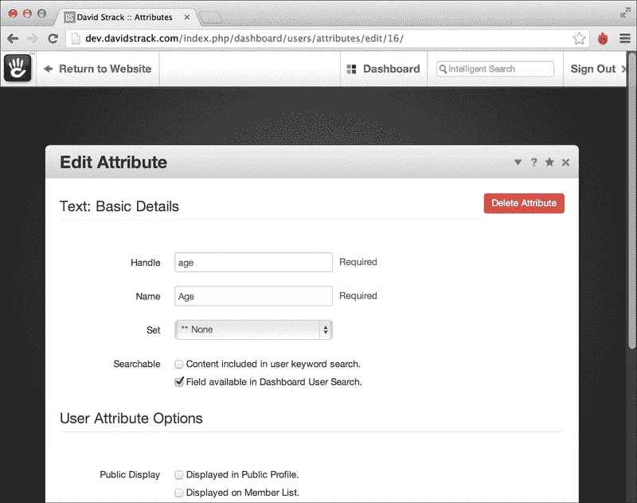

# 第七章. 与用户和权限协作

本章我们将涵盖以下内容：

+   检查当前用户是否登录

+   获取当前登录用户

+   通过 ID 加载用户

+   通过用户名加载用户

+   获取用户信息

+   设置用户的属性

+   获取用户的属性

+   通过 ID 加载一个组

+   通过名称加载一个组

+   将用户添加到组中

+   从一个组中获取所有用户

+   检查用户是否是某个组的成员

+   从组中移除用户

+   用户登出

+   删除用户

+   获取权限对象

+   检查用户是否可以写入页面

+   检查用户是否有编辑页面的权限

+   检查用户的文件权限

# 简介

concrete5 最伟大的属性之一是围绕用户和权限的功能。concrete5 使得控制哪些用户和用户组可以访问特定页面变得容易。在 concrete5 中，用户可以是网站编辑者、管理员、社区成员或网站所有者可以设定的任何其他角色。

在本章中，我们将探讨几个配方，允许开发者与用户对象、组和它们相关的权限进行交互和操作。本章中的配方将赋予 concrete5 开发者将强大的用户和权限模型纳入他们自己的自定义应用程序和网站的能力。

# 检查当前用户是否登录

concrete5 开发中最常见的任务之一是找出用户是否登录到网站上。在这个配方中，如果用户已登录，我们将输出一些 HTML 来向登录用户打招呼。如果他们未登录，我们将输出一个指向登录页面的链接。

## 如何操作...

检查当前用户是否登录的步骤如下：

1.  检查当前用户是否已登录。

    ```php
    $isLoggedIn = User::isLoggedIn();
    ```

1.  如果他们已登录，显示欢迎信息。

    ```php
    if ($isLoggedIn) {
      echo '<p>Thanks for logging in!</p>';
    }
    ```

1.  否则，显示登录页面的链接。

    ```php
    else {
      echo '<a href="/login">Login</a>';
    }
    ```

## 它是如何工作的...

用户模型包含一个名为`isLoggedIn`的静态函数，它将简单地返回一个布尔结果。这不会将任何类型的权限检查混合其中，只是检查查看页面的人是否已登录。

# 获取当前登录用户

concrete5 使得获取当前登录用户的对象变得非常容易。在这个配方中，我们将输出当前登录用户的用户名。

## 准备工作

在尝试显示用户名之前确保用户已登录是一个好主意。我们将使用前一个配方中的技能来确保用户首先登录。

## 如何操作...

获取当前登录用户的步骤如下：

1.  检查用户是否登录。

    ```php
    $isLoggedIn = User::isLoggedIn();
    ```

1.  如果用户已登录，创建`User`类的新实例。

    ```php
    $user = new User();
    ```

1.  输出`user`对象的用户名。

    ```php
    echo $user->getUsername();
    ```

## 它是如何工作的...

concrete5 使得获取当前登录用户变得极其容易。本质上，我们只需要实例化`User`类，它将返回一个代表当前登录用户的对象。

## 参见

+   *检查当前用户是否已登录* 食谱

+   *获取用户信息* 食谱

# 通过 ID 加载用户

开发者也可以通过唯一的 ID 加载用户。在本食谱中，我们将加载 ID 为 1 的用户，并输出其用户名。

## 如何操作...

通过 ID 加载用户的步骤如下：

1.  确定要加载的用户的 ID。在本例中，我们将加载 ID 为 1 的用户。

    ```php
    $userId = 1;
    ```

1.  通过 ID 加载用户。

    ```php
    $user = User::getByUserID($userId);
    ```

1.  输出用户的用户名。

    ```php
    echo $user->getUserName();
    ```

## 工作原理...

concrete5 将在数据库的`Users`表中查找并返回一个包含相应记录数据的用户对象。

## 相关内容

+   *通过用户名加载用户* 食谱

# 通过用户名加载用户

除了能够通过 ID 加载用户外，开发者还可以通过用户名加载用户。在本食谱中，我们将加载用户名为 admin 的用户，并输出其数值 ID。

## 如何操作...

通过用户名加载用户的步骤如下：

1.  确定要加载的用户的用户名。

    ```php
    $username = 'admin';
    ```

1.  通过用户名加载用户。

    ```php
    $user = UserInfo::getByUserName($username);
    ```

1.  输出用户的 ID。

    ```php
    echo $user->getUserID();
    ```

## 工作原理...

嘿，这很简单！`UserInfo`类包含通过用户名而不是 ID 加载用户的方法。`UserInfo`类还有一个获取用户数值 ID 的方法。

## 相关内容

+   *通过 ID 加载用户* 食谱

+   *获取当前登录用户* 食谱

# 获取用户信息

用户对象携带大量信息，包括用户的用户名、电子邮件和几个其他属性。在本食谱中，我们将运行几个函数来检索与用户关联的数据。

## 准备工作

本章的代码不一定属于 concrete5 的任何特定位置。本食谱的步骤是基本的单行函数，用于展示从用户对象获取数据的不同方法。如果您需要一个可以写入任意代码并由 concrete5 评估的地方，`config/`目录下的`site_post.php`文件是一个不错的选择。

## 如何操作...

获取用户信息步骤如下：

1.  首先，我们将加载当前登录的用户。

    ```php
    $user = new User();
    ```

1.  获取用户的 ID。

    ```php
    $userId = $user->getUserID();
    ```

1.  获取用户的用户名。

    ```php
    $username = $user->getUserName();
    ```

1.  检查用户是否在该网站上注册。

    ```php
    $isRegistered = $user->isRegistered();
    ```

1.  检查用户的账户是否活跃。

    ```php
    $isActive = $user->isActive();
    ```

1.  检查用户是否是超级管理员。

    ```php
    $isSuper = $user->isSuperUser();
    ```

1.  加载包含更多用户信息的`UserInfo`对象。

    ```php
    $userInfo = UserInfo::getByID($userId);
    ```

1.  获取用户的电子邮件地址。

    ```php
    $email = $userInfo->getUserEmail();
    ```

1.  获取用户的加密密码。

    ```php
    $password = $userInfo->getUserPassword();
    ```

1.  获取用户登录次数。

    ```php
    $loginCount = $userInfo->getNumLogins();
    ```

1.  查询用户是否已验证他们的电子邮件地址。

    ```php
    $verifiedEmail = $userInfo->isValidated();
    ```

1.  获取用户上次登录的 Unix 时间戳。

    ```php
    $previousLogin = $userInfo->getPreviousLogin();
    ```

1.  查询用户是否已上传头像到网站。

    ```php
    $hasAvatar = $userInfo->hasAvatar();
    ```

1.  查询用户何时被添加到网站上。

    ```php
    $dateAdded = $userInfo->getUserDateAdded();
    ```

## 工作原理...

`User`类包含一些检索基本用户数据的方法，例如用户的 ID 和用户名。当开发者想查看更多关于用户的信息时，他们需要使用`UserInfo`类。

## 相关内容

+   *获取当前登录用户* 菜谱

# 设置用户属性

concrete5 的用户可以拥有自定义属性，这些属性通过界面定义。想象一下一个你想知道用户年龄的网站。concrete5 默认不提供用户年龄字段，但可以通过属性轻松添加。

## 准备工作

首先，在尝试设置属性之前，您需要确保该属性存在于 concrete5 网站中。请访问 `http://example.com/dashboard/users/attributes`（当然，用您自己的域名替换 `example.com`），并确保您创建的属性存在。页面看起来类似于以下截图：



在这个菜谱中，我们将使用名为年龄的属性，所以请随意创建该属性以跟随操作。

## 如何操作...

设置用户属性的分步如下：

1.  加载当前登录用户。

    ```php
    $user = new User();
    ```

1.  加载该用户的 `UserInfo` 对象。

    ```php
    $userInfo = UserInfo::getByUserID($user->getUserID());
    ```

1.  将年龄属性设置为 `35`。

    ```php
    $userInfo->setAttribute('age', 35);
    ```

## 工作原理...

`UserInfo` 类包含一个名为 `setAttribute` 的函数，该函数可以接受一个表示属性键处理的字符串，或者一个实际的 `AttributeKey` 对象实例。在这个菜谱中，我们选择了更简单的方法，即在字符串中提供属性处理。

## 相关链接

+   *检索用户属性* 菜谱

+   *获取当前登录用户* 菜谱

+   *获取用户信息* 菜谱

# 检索用户属性

除了设置属性外，我们还可以检索它们。在这个菜谱中，我们将检索用户年龄的属性，这是我们之前设置的。

## 准备工作

与之前的菜谱一样，您需要确保您正在检索的任何属性实际上存在于 concrete5 中。在这种情况下，我们将引用一个名为 `age` 的属性。如果您的 concrete5 系统中没有名为年龄的用户属性，请根据您的需求调整此菜谱。

## 如何操作...

检索用户属性的分步如下：

1.  加载当前登录用户。

    ```php
    $user = new User();
    ```

1.  获取用户的 `user info` 对象。

    ```php
    $userInfo = UserInfo::getByID($user->getUserID());
    ```

1.  获取用户年龄属性的值。

    ```php
    $age = $userInfo->getAttribute('age');
    ```

## 工作原理...

concrete5 提供了一个简单的 API 来从用户中检索属性。在数据库中，属性键和值分布在几个表中，手动查询比较困难。这种方法是检索用户属性的首选方式。

## 更多内容...

concrete5 还使用“魔法方法”来检索用户属性。本质上，调用一个以属性处理 camelCase 版本为名称的函数，前面加上单词 `get`。在这个菜谱中，要获取用户的年龄，我们可以简单地编写以下代码：

```php
$age = $userInfo->getAge();
```

## 相关链接

+   *设置用户属性* 菜谱

+   *获取当前登录用户* 菜谱

+   *获取用户信息* 菜谱

# 通过其 ID 加载组

concrete5 中的组是按用户在网站上的角色组织用户的方式。组可以接收权限设置，就像用户可以一样。在这个配方中，我们将加载 ID 为 3 的组（在大多数 concrete5 安装中是管理员组）。

## 如何操作...

按 ID 加载组的步骤如下：

1.  确定我们想要加载的组的 ID。

    ```php
    $groupId = 3;
    ```

1.  按 ID 加载组。

    ```php
    $group = Group::getByID($groupId);
    ```

1.  输出组变量的名称以确保它已正确加载。

    ```php
    echo $group->gName;
    exit;
    ```

## 它是如何工作的...

concrete5 将简单地查询数据库中的`Groups`表以找到与提供的 ID 相对应的组记录。

## 参见

+   按名称加载组配方

# 按名称加载组

组可以通过其名称加载，这在您不知道组的数字 ID 时可能很有用。

## 如何操作...

按名称加载组的方法如下：

1.  定义您要加载的组的名称。

    ```php
    $groupName = 'Administrators';
    ```

1.  按名称加载组。

    ```php
    $group = Group::getByName($groupName);
    ```

1.  输出组变量以确保正确加载了组。

    ```php
    var_dump($group);
    ```

## 它是如何工作的...

concrete5 查询数据库以找到与您提供给`getByName`函数的名称相同的组。组名称可以通过 concrete5 仪表板随时更改，因此在您的应用程序中硬编码组名称时要小心。

## 参见

+   按 ID 加载组配方

# 向组中添加用户

虽然 concrete5 仪表板提供了一个简单的界面来向不同的组添加用户，但有时您可能需要以编程方式执行此操作。在这个配方中，我们将向 ID 为 3 的管理员组（在大多数 concrete5 安装中是管理员组）添加 ID 为 1 的用户。

## 如何操作...

添加用户到组的步骤如下：

1.  定义您要加载的用户的 ID。

    ```php
    $userId = 1;
    ```

1.  按 ID 加载用户。

    ```php
    $user = User::getByID($userId);
    ```

1.  定义您想要添加用户到的组的 ID。

    ```php
    $groupId = 3;
    ```

1.  按 ID 加载组。

    ```php
    $group = Group::getByID($groupId);
    ```

1.  将用户添加到组中。

    ```php
    $user->enterGroup($group);
    ```

## 它是如何工作的...

当调用用户模型的`enterGroup`函数时，用户将被添加到作为第一个参数传递的组中。现在，该用户将继承与该组关联的所有权限。

## 参见

+   按 ID 加载用户配方

+   按 ID 加载组配方

+   从组中删除用户配方

# 从组中获取所有用户

一旦加载了组对象，您可以轻松地遍历该组的成员。在这个配方中，我们将加载一个组，然后输出组内每个成员的用户名。

## 如何操作...

获取组中所有用户的步骤如下：

1.  定义您要加载的组的 ID。

    ```php
    $groupId = 3;
    ```

1.  按 ID 加载组。

    ```php
    $group = Group::getByID($groupId);
    ```

1.  获取组成员数组。

    ```php
    $members = $group->getGroupMembers();
    ```

1.  遍历成员数组，回显用户名。

    ```php
    foreach ($members as $member) {
      echo $member->getUserName().'<br />';
    }
    ```

## 它是如何工作的...

如同往常，concrete5 在这里负责查询数据库以找到所有已加载的组成员的用户账户。`getGroupMembers`函数返回一个`UserInfo`对象的数组，可以用来读取和修改组成员。

## 参见

+   *通过 ID 加载组* 的配方

+   *获取用户信息* 的配方

# 检查用户是否是组成员

concrete5 自带了一个强大的权限模型，但有时开发者可能希望在自己的代码中执行简单的权限和访问控制任务。在这个配方中，我们将检查用户是否在管理员组中。然后，我们将显示一个消息，指示他们是否是管理员。

## 如何操作...

检查用户是否是组成员的步骤如下：

1.  加载当前登录用户。

    ```php
    $user = new User();
    ```

1.  确定您要加载的组的 ID（在这个例子中，是 ID 为 3 的管理员组）。

    ```php
    $groupId = 3; // administrators
    ```

1.  通过其 ID 加载组。

    ```php
    $group = Group::getByID($groupId);
    ```

1.  检查用户是否是组成员。

    ```php
    $isAdmin = $user->inGroup($group);
    ```

1.  向用户显示消息，确认或否认他们是否是管理员组的成员。

    ```php
    if ($isAdmin) {
      echo 'You\'re an administrator!';
    }
    else {
      echo 'You are not an administrator.';
    }
    ```

## 它是如何工作的...

concrete5 会检查用户是否是特定组对象的成员，并返回一个布尔值。

## 参见

+   *通过 ID 加载组* 的配方

+   *获取当前登录用户* 的配方

# 从组中删除用户

除了能够将用户添加到组中，concrete5 还允许开发者执行相反的任务：从组中删除用户。在这个配方中，我们将从管理员组中删除一个用户。

## 如何操作...

从组中删除用户的步骤如下：

1.  加载当前登录用户。

    ```php
    $user = new User();
    ```

1.  定义您要加载的组的 ID。

    ```php
    $groupId = 3; // administrators
    ```

1.  通过其 ID 加载组。

    ```php
    $group = Group::getByID($groupId);
    ```

1.  检查此用户是否是组成员。

    ```php
    $inGroup = $user->inGroup($group);
    ```

1.  如果用户是成员，则从组中移除他们。

    ```php
    if ($inGroup) {
      $user->exitGroup($group);
    }
    ```

## 它是如何工作的...

在这种情况下，concrete5 将简单地删除用户和组之间的关联。用户将失去从组继承的所有权限。

## 参见...

+   *将用户添加到组中* 的配方

+   *通过 ID 加载组* 的配方

+   *获取当前登录用户* 的配方

+   *检查用户是否是组成员* 的配方

# 注销用户

concrete5 还包含程序化注销用户的函数。在这个配方中，我们将注销当前登录的用户。

## 如何操作...

注销用户的步骤如下：

1.  检查用户是否已登录。

    ```php
    $loggedIn = User::isLoggedIn();
    ```

1.  加载登录用户。

    ```php
    $user = new User();
    ```

1.  注销用户。

    ```php
    if ($loggedIn) {
      $user->logout();
    }
    ```

## 它是如何工作的...

concrete5 删除当前会话，实际上注销了用户。

## 参见

+   *检查当前用户是否已登录* 的配方

+   *获取当前登录用户* 的配方

# 删除用户

在这个配方中，我们将加载 ID 为 3 的用户，并将其从 concrete5 中删除。

## 如何操作...

删除用户的步骤如下：

1.  定义您要删除的用户的 ID。

    ```php
    $userId = 3;
    ```

1.  加载该用户的`UserInfo`对象。

    ```php
    $user = UserInfo::getByID($userId);
    ```

1.  删除用户。

    ```php
    $user->delete();
    ```

## 它是如何工作的...

concrete5 将从数据库中删除用户及其所有属性。此操作是不可逆的，除非恢复数据库备份。

## 相关内容

+   获取用户信息的食谱

# 获取权限对象

验证和修改页面权限，主要围绕权限对象展开。在本食谱中，我们将加载页面的权限对象。

## 如何操作...

获取权限对象步骤如下：

1.  指定您要检查权限设置的页面路径。

    ```php
    $path = '/about';
    ```

1.  通过路径加载页面。

    ```php
    $page = Page::getByPath($path);
    ```

1.  加载该页面的`permissions`对象。

    ```php
    $permissions = new Permissions($page);
    ```

1.  将`permissions`对象导出以验证其内容。

    ```php
    var_dump($permissions);
    ```

## 它是如何工作的...

concrete5 将返回一个`permissions`对象，可以进一步用来确定用户是否有权在该页面上执行各种操作。

## 更多内容...

您还可以获取内容区域和块的`permissions`对象，只需将块或区域对象传递给`Permissions`构造函数，而不是`Page`对象。

## 相关内容

+   在第一章的*获取页面对象路径*中，*页面和页面类型*

# 检查用户是否有阅读页面权限

您可能会发现有时您需要手动确定用户是否有权阅读特定的页面。在本食谱中，我们将通过路径加载页面，获取其`permissions`对象，然后确定用户是否有权查看该页面。

## 如何操作...

检查用户是否有阅读页面权限的步骤如下：

1.  确定要加载的页面的路径。

    ```php
    $path = '/about';
    ```

1.  通过路径加载页面。

    ```php
    $page = Page::getByPath($path);
    ```

1.  加载该页面的`permissions`对象。

    ```php
    $permissions = new Permissions($page);
    ```

1.  查看用户是否有权阅读该页面。

    ```php
    $canRead = $permissions->canRead();
    var_dump($canRead);
    exit;
    ```

## 它是如何工作的...

concrete5 将检查该`Page`对象的全部权限，包括组和用户权限，以确定当前用户是否有权查看该页面。`canRead`函数返回一个布尔值。

## 更多内容...

可以通过简单地向`Permissions`构造函数提供一个区域或块对象，而不是`Page`对象来检查内容区域和块的读取权限。

## 相关内容

+   在第一章的*获取页面对象路径*中，*页面和页面类型*

+   获取权限对象的食谱

# 检查用户是否有编辑页面的权限

除了能够检查用户是否可以查看页面外，开发者还可以手动检查登录用户是否有编辑页面的能力。在本食谱中，我们将通过路径加载页面，获取该页面的`permissions`对象，然后确定用户是否有权编辑它。

## 如何操作...

检查用户是否有编辑页面权限的步骤如下：

1.  指定要加载的页面路径。

    ```php
    $path = '/about';
    ```

1.  加载页面。

    ```php
    $page = Page::getByPath($path);
    ```

1.  加载页面的`permissions`对象。

    ```php
    $permissions = new Permissions($page);
    ```

1.  查看用户是否有编辑页面的权限。

    ```php
    $canEdit = $permissions->canWrite();
    var_dump($canEdit);
    exit;
    ```

## 它是如何工作的...

concrete5 将查看用户的个人权限设置以及它所属的任何组的设置，并确定用户是否有能力编辑或写入指定的页面。

## 更多内容...

与读取权限一样，内容区域和块权限也可以使用此方法进行检查。只需提供一个区域或块的实例而不是页面，权限将针对这些项目进行检查。

## 相关内容

+   通过路径获取页面对象的配方

+   获取权限对象的配方

# 检查用户的文件权限

concrete5 允许网站所有者指定文件管理器的权限。在本配方中，我们将查看用户是否被允许将文件上传到文件管理器。

## 如何操作...

检查用户文件权限的步骤如下：

1.  加载 `FilePermissions` 全局对象。

    ```php
    $permissions = FilePermissions::getGlobal();
    ```

1.  检查用户是否可以查看 `文件管理器` 界面。

    ```php
    $canUpload = $permissions->canAddFiles();
    ```

1.  检查用户是否可以上传到文件管理器。

    ```php
    $canViewFileManager = $permissions->canAccessFileManager();
    ```

## 它是如何工作的...

`FilePermissions` 类扩展了 `Permissions` 类，并允许用户检查文件管理器的全局设置。

## 更多内容...

concrete5 还允许开发者检查用户是否被允许上传特定类型的文件。

```php
$canUploadMp3 = $permissions->canAddFileType('mp3');
```
