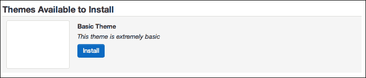
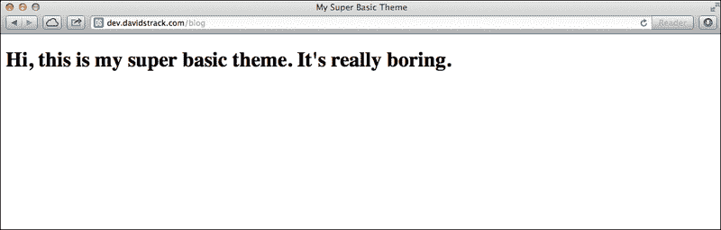
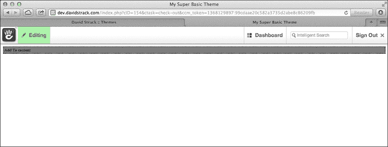
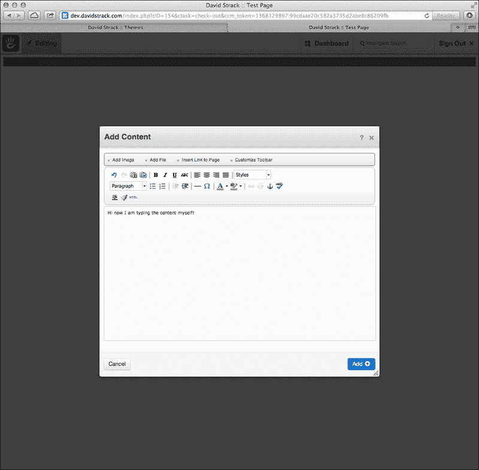
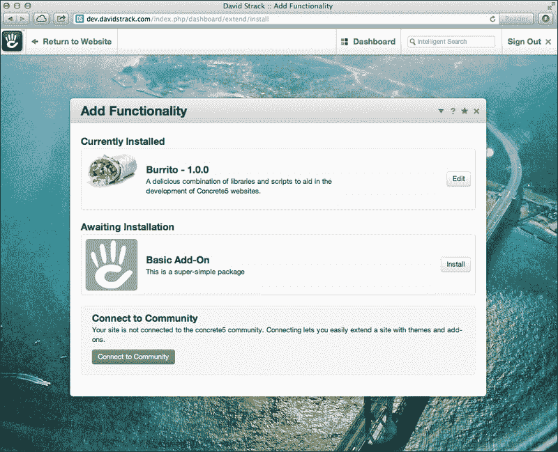
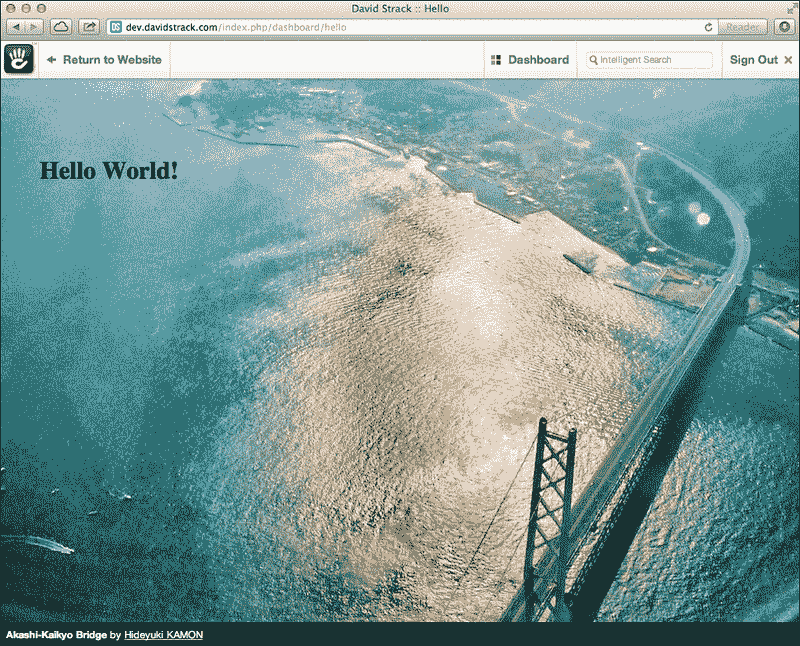

# 第八章. 使用主题和附加包

在本章中，我们将涵盖以下内容：

+   创建一个自定义主题

+   包含 concrete5 所需的脚本和样式

+   定义可编辑的内容区域

+   创建页面类型模板

+   使用元素重复 HTML 的某些部分

+   自定义系统页面

+   创建一个自定义的附加包

+   使用包控制器执行自定义代码

# 简介

concrete5 与其他内容管理系统略有不同。当然，它拥有世界级的内联编辑功能和强大的开发框架，但它也非常容易创建自定义主题和附加包。开发者和设计师甚至可以在 concrete5 市场中销售他们的作品。在本章中，我们将学习如何创建一个非常基本的主题，以及如何创建一个简单的附加包。尽管每个食谱都有其自己的目的，但对于初学者来说，按照顺序运行这些食谱以确保获得所有必需的知识可能是有用的。

# 创建一个自定义主题

主题是任何内容管理系统的一个基本组成部分，这是有充分理由的。没有人希望他们的网站看起来和其他所有网站一样。concrete5 附带了一些看起来不错的主题，但很多时候您或您的客户可能希望开发一个自定义主题。实际上，创建主题的主题可以相当长，甚至有整本书专门介绍这个话题（由 Remo Laubacher 所著，Packt Publishing 出版的《Creating concrete5 Themes》一书强烈推荐）。在本食谱中，我们将仅演示在 concrete5 中创建自定义主题的最基本要求。

## 准备工作

本食谱的完整基本主题代码可在本书的网站上免费获取。

## 如何操作...

创建自定义主题的步骤如下：

1.  在`/themes`目录下创建一个名为`basic_theme`的新目录。

1.  在`basic_theme`目录下创建一个名为`description.txt`的文件。

1.  在描述文件的第一个位置放置主题的标题。

    ```php
    Basic Theme
    ```

1.  在文本文件的第二行放置对主题的简要描述。

    ```php
    This theme is extremely basic
    ```

1.  保存`description.txt`文件。

1.  在`/themes/basic_theme`目录下创建一个名为`default.php`的新文件。

1.  在文件中输入以下基本的 HTML 代码：

    ```php
    <!DOCTYPE html>
    <html>
      <head>
        <title>My Super Basic Theme</title>
      </head>
      <body>
        <h1>Hi, this is my super basic theme. It's really boring.</h1>
      </body>
    </html>
    ```

1.  保存`default.php`。

1.  创建一个名为`view.php`的文件并保持它为空。

1.  访问您网站仪表板的主题区域，网址为`http://example.com/dashboard/pages/themes`。

1.  点击您新主题的**安装**按钮。页面将看起来像以下截图：

1.  点击**激活**然后点击**确定**以将主题应用到您网站的所有页面。

1.  您的网站现在应该看起来像以下截图：



## 它是如何工作的...

concrete5 只要求主题中存在`description.txt`、`default.php`和`view.php`这三个文件。`description.txt`文件包含主题的标题和描述。

## 更多内容...

显然，这对于实际使用来说将是不可用的。没有地方可以放置内容！concrete5 的编辑栏在哪里？接下来的几个菜谱将在此基础上扩展这个简单主题，使其成为一个真正的 concrete5 主题。

## 参见

+   **包括 concrete5 所需的脚本和样式** 菜谱

+   **使用元素为 HTML 的重复部分** 菜谱

+   **定义可编辑的内容区域** 菜谱

# 包括 concrete5 所需的脚本和样式

您可能已经注意到，在上一道菜谱中创建的极其简单的主题之后，通常出现在屏幕顶部的 concrete5 编辑栏已经消失了。这是因为该主题没有包括 concrete5 需要执行其工作的必需的 JavaScript 和 CSS 文件集合。在本菜谱中，我们将添加必要的代码，将这些组件包含到我们的简单主题中。

## 准备工作

本菜谱将在前一道菜谱中的简单主题代码基础上进行构建。您可以自由地从本书的网站上下载源代码以跟上进度，或者调整这个菜谱以适应您自己的主题。

## 如何做...

包括 concrete5 所需脚本和样式的步骤如下：

1.  打开存储我们主题 HTML 的 `/themes/basic_theme/default.php` 文件。

1.  删除 `<title>` 标签，因为我们不再需要它。

1.  在关闭 `</head>` 标签之前，将以下代码添加到文件中：

    ```php
    <?php Loader::element('header_required') ?>
    ```

1.  在关闭 `</body>` 标签之前，将以下代码添加到文件中：

    ```php
    <?php Loader::element('footer_required') ?>
    ```

1.  刷新网站。

## 它是如何工作的...

通过调用 `Loader::element`，我们实际上是将 PHP 代码的部分模板注入到我们的主题中。此代码包含 JavaScript 和 CSS 文件，以及额外的标记。

## 还有更多...

现在我们已经使编辑栏可见，但仍没有方法向我们的简单主题添加内容。下一道菜谱将展示如何向主题添加可编辑区域。

## 参见

+   **创建自定义主题** 菜谱

+   **定义可编辑的内容区域** 菜谱

# 定义可编辑的内容区域

concrete5 的主题约定中的一个伟大功能是能够指定站点编辑员可以编辑内容的精确位置。这防止了用户破坏网站的设计和结构，但仍然使他们能够编辑所有必要的内容。在本菜谱中，我们将向我们在本章早期创建的简单主题中添加一个可编辑区域。

## 准备工作

我们将在前几道菜谱中创建的主题基础上进行扩展。如果您想赶上进度，本章的源代码可以在本书的网站上免费获取。如果您愿意，也可以根据您自己的主题调整这个菜谱。

## 如何做...

定义可编辑内容区域的步骤如下：

1.  在您偏好的代码编辑器中打开 `/themes/basic_theme/default.php` 文件。

1.  将当前的 `<h1>` 标签替换为以下代码：

    ```php
    <?php $a = new Area('content'); $a->display($c); ?>
    ```

    屏幕将显示如下两个截图所示：

    

## 它是如何工作的...

在本菜谱中添加的代码片段本质上告诉 concrete5 这是我们添加块的地方。

## 更多内容...

定义内容区域的代码片段可以放置在您网站 HTML 的`<body>`标签之间的任何位置。想象一下添加一个用于侧边栏的区域，以及另一个用于页面页眉的区域。需要注意的是，区域名称（在本例中为`content`）在页面上的每个使用位置都需要不同。

## 相关内容

+   **创建自定义主题**菜谱

+   **包含所需的 concrete5 脚本和样式**菜谱

# 创建页面类型模板

concrete5 允许设计师为网站中的页面创建无限数量的页面模板。这些模板允许不同的布局，例如侧边栏或三列布局。在本菜谱中，我们将向现有的基本主题添加一个新的页面类型模板，该模板显示带有版权声明的页脚。

## 准备工作

我们将在此基础上构建本章第一道菜谱中创建的基本主题。本章的代码在本书网站上免费提供，因此您可以随时下载作为起点。或者，像往常一样，您可以将菜谱适应到您自己的网站和主题需求中。

## 如何操作...

创建页面类型模板的步骤如下：

1.  在您的主题目录中（对于我们当前的示例，是`/themes/basic_theme`）创建一个名为`with_footer.php`的新文件。

1.  打开新文件，粘贴`default.php`的内容。

    ```php
    <!DOCTYPE html>
    <html>
    <head>
      <?php Loader::element('header_required') ?>
    </head>
    <body>
      <?php $a = new Area('content'); $a->display($c); ?>
      <?php Loader::element('footer_required') ?>
    </body>
    </html>
    ```

1.  在页面上添加页脚，显示版权符号、当前年份和版权所有者。

    ```php
    <footer>
      &copy; <?php echo date('Y') ?> Somebody
    </footer>
    ```

## 工作原理...

concrete5 将使用此模板为所有具有`with_footer`处理器的页面类型。

### 小贴士

如果页面类型未通过 concrete5 控制台界面添加，则无法使用此模板（可以通过访问`/dashboard/pages/types`添加页面类型）。

## 更多内容...

现在，我们有一个新的模板，但我们违反了编程中最重要的一条规则之一：**不要重复自己**（DRY）。我们从默认模板中复制了完整的 HTML 并将其粘贴到新模板中。如果模板中有所更改，并且我们希望更改反映在这两个模板上，开发者需要记住更新两个位置。下一个菜谱将介绍解决这个问题的方法。

## 相关内容

+   **创建自定义主题**菜谱

+   **使用元素重复 HTML 的部分**菜谱

# 使用元素重复 HTML 的部分

编写良好代码的基本规则之一可以用缩写 DRY（不要重复自己）来概括。在创建主题时，开发者和设计师会认识到某些代码会在每个页面上重复出现，例如页眉或页脚。在本菜谱中，我们将学习如何使用元素在页面之间安全地重复代码。

## 准备工作

我们正在继续完善本章第一道菜谱中创建的非常基础的主题。如果您想将其作为起点，本书网站上可以免费获取本章的代码。

## 如何操作...

使用元素重复 HTML 部分步骤如下：

1.  在您的`themes`文件夹中创建一个名为`elements`的新目录。

1.  在`elements/`目录下创建一个名为`header.php`的新文件。

1.  将以下代码插入到`header.php`中：

    ```php
    <!DOCTYPE html>
    <html>
    <head>
      <?php Loader::element('header_required') ?>
    </head>
    <body>
    ```

1.  在`elements/`目录下创建一个新文件，命名为`footer.php`。

1.  将以下代码插入到`footer.php`中：

    ```php
    <?php Loader::element('footer_required') ?>
    </body>
    </html>
    ```

1.  从`themes`目录中打开`default.php`。

1.  将页眉和页脚代码替换为以下代码片段，使整个文件看起来如下所示：

    ```php
    <?php $this->inc('elements/header.php'); ?>
      <?php $a = new Area('content'); $a->display($c); ?>
    <?php $this->inc('elements/footer.php'); ?>
    ```

1.  对任何已创建的页面类型模板重复前面的步骤。

## 工作原理...

通过将页眉和页脚的 HTML 存储在单独的文件中，我们就可以告诉 concrete5 将这些文件包含在所有使用它们的模板中。这使我们能够在仅一个地方对这些元素进行编辑，并保持我们的模板代码整洁。

## 参见

+   *创建自定义主题* 菜谱

# 定制系统页面

concrete5 使创建主题变得容易，但默认情况下它不会将主题应用于系统页面，如登录页面。对于大多数网站来说，这是可以的，因为只有网站编辑者会看到登录页面。在网站读者可以登录并发表评论，或在论坛中发帖的网站上，登录页面与其它页面保持一致会更好。在这个菜谱中，我们将使登录页面使用与网站其余部分相同的主题。

## 准备工作

我们将继续使用本章开头构建的自定义主题。像往常一样，这个菜谱的代码可以从本书的网站上免费下载。

## 如何操作...

定制系统页面的步骤如下：

1.  在您首选的代码编辑器中打开`/config/site_theme_paths.php`。

1.  在`site_theme_paths.php`文件中输入以下代码：

    ```php
    $v = View::getInstance();
    $v->setThemeByPath('/login', "basic_theme");
    ```

1.  在您的代码编辑器中打开`/themes/basic_theme/view.php`。

1.  在`view.php`中输入以下代码：

    ```php
    <?php $this->inc('elements/header.php'); ?>
      <?php print $innerContent ?>
    <?php $this->inc('elements/footer.php'); ?>
    ```

## 工作原理...

concrete5 附带`site_theme_paths.php`配置文件，但默认情况下所有配置设置都被注释掉了。此文件允许您设置网站上任何页面的主题，在这个例子中，我们告诉它为登录页面使用我们的基本主题。

您还会注意到，在我们的主题中，直到这一点，`view.php`页面都是空的。这个文件是 concrete5 用于没有定义自己模板的单页模板。`$innerContent`变量包含单页的所有 PHP 和 HTML。

## 参见

+   *创建自定义主题* 菜谱

# 创建自定义附加包

concrete5 允许开发者创建可重用和可安装在任何 concrete5 网站上的模块化组件。这些模块被称为插件，类似于其他内容管理系统中的插件和模块。在本菜谱中，我们将创建一个基本的插件，该插件将安装一个单页到 concrete5 仪表板。

## 准备工作

此菜谱的完整代码可在书籍网站上免费获取。

## 如何操作...

创建自定义插件包的步骤如下：

1.  在`/packages`中创建一个名为`basic_addon`的新目录。

1.  在`/packages/basic_addon`中创建一个名为`controller.php`的文件。

1.  在`controller.php`中定义包类。

    ```php
    class BasicAddonPackage extends Package {}
    ```

1.  将成员变量添加到类中。

    ```php
    protected $pkgHandle = 'basic_addon';
    protected $appVersionRequired = '5.5.0';
    protected $pkgVersion = '1.0.0';
    ```

1.  定义一个函数以返回包的名称。

    ```php
    public function getPackageName() {
      return 'Basic Add-On';
    }
    ```

1.  定义一个函数以返回包的描述。

    ```php
    public function getPackageDescription() {
      return 'This is a super-simple package';
    }
    ```

1.  覆盖`install`函数，告诉包控制器还要在仪表板上安装一个新的单页。

    ```php
    public function install(){
      Loader::model('single_page');
      $pkg = parent::install();
      $page = SinglePage::add('/dashboard/hello', $pkg);
    }
    ```

1.  在`basic_addon/`中创建一个名为`single_pages`的目录。

1.  在`single_pages/`中创建一个名为`dashboard`的目录。

1.  在`/packages/basic_addon/single_pages/dashboard`中创建一个名为`hello.php`的文件。

1.  在`hello.php`中输入以下代码。

    ```php
    <h1>Hello World!</h1>
    ```

1.  在你的网络浏览器中，访问 concrete5 的插件安装页面，地址为`/dashboard/extend/install/`。页面将类似于以下截图：

1.  点击你创建的新插件旁边的**安装**按钮。

1.  在你的网络浏览器中访问`/dashboard/hello`以查看由包安装器创建的单页。页面将类似于以下截图：

## 它是如何工作的...

包中唯一的必需文件是`controller.php`。此文件包含一个类，它为 concrete5 提供获取插件名称和描述的方法。我们还通过让包安装器添加一个新的单页到仪表板来修改包安装器。通过访问`http://example.com/dashboard/hello`，我们将看到我们创建的单页的 HTML。

## 更多...

包目录的结构与正常 concrete5 网站的总体目录非常相似。由于我们想要将单页与我们的包捆绑在一起，我们只需创建它并将其存储在一个目录中，就像我们在 concrete5 中通常做的那样。你可以看到如果包必须包含块、控制器、助手或其他任何 concrete5 使用的文件类型，它将如何被结构化。

## 参见

+   *使用包控制器执行自定义代码*菜谱

# 使用包控制器执行自定义代码

包控制器的一个独特且高级的功能是能够在页面访问时自动运行代码。这可以为插件开发者提供巨大的潜力，以利用系统事件、挂钩到网站 HTTP 请求等。在这个菜谱中，我们将展示如何通过将包含特殊参数的所有请求重定向到主页，轻松地从我们的包中自动运行代码。

## 准备工作

我们将使用在前一个菜谱中创建的简单插件包来演示这个例子。本菜谱及所有其他菜谱的代码都可以在本书的网站上下载。

## 如何操作...

使用包控制器执行自定义代码的步骤如下：

1.  打开位于 `/packages/basic_addon/controller.php` 的包控制器文件。

1.  添加一个名为 `on_start` 的函数，该函数将重定向任何在 URL 中输入参数 `redirect_me` 的人。

    ```php
    public function on_start() {
    if (isset($_GET['redirect_me'])) {
        header('Location: /');
      }
    }
    ```

1.  通过在 URL 中添加 `?redirect_me` 来测试它。

## 它是如何工作的...

concrete5 在页面加载时自动运行函数 `on_start`，因此你将包中放置的任何代码都会自动运行。在这个例子中，我们的示例相当无用，但你可以看到开发者几乎有无限的机会（自动解析页面请求、拦截表单提交、向页面添加 CSS 或 JavaScript 等）。

## 参见

+   *创建自定义插件包* 菜谱
