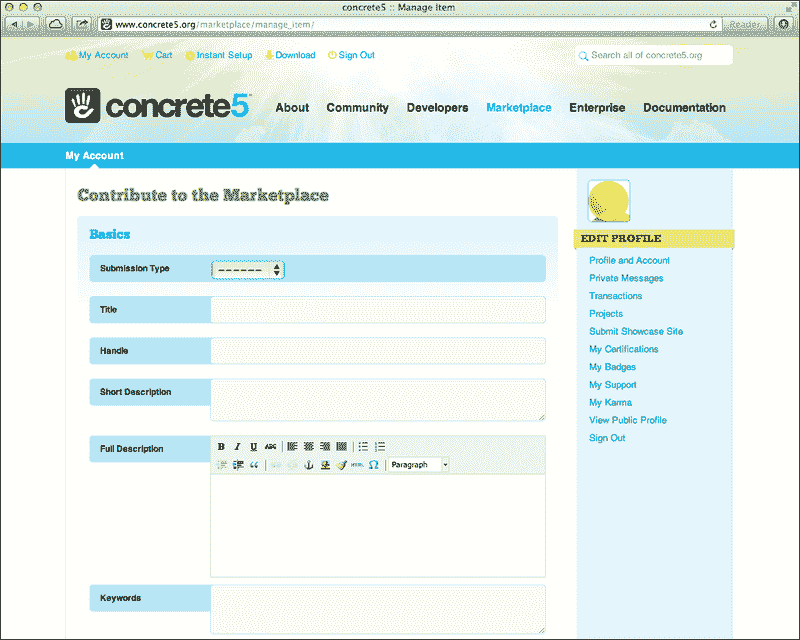

# 附录 C. 提交 concrete5 市场附加组件包

大多数内容管理系统都有某种插件或模块。concrete5 相对独特，因为它附带了一个完整的附加组件和主题生态系统。这允许附加组件开发者通过为 concrete5 创建的包赚取一些收入，同时也支持 concrete5 团队，因为 concrete5 从每个销售的附加组件中获得一定比例的收益。

# 规则

你的附加组件必须遵守一些规则。首先，你的附加组件必须能够工作。在安装或使用附加组件时不应出现任何错误。此外，请确保你拥有附加组件中包含的所有代码和资产的权利，或者你已经从代码作者那里获得了包含其代码在附加组件中的适当许可。

一些其他规则包括在每个 PHP 文件顶部使用 `defined or die` 语句，包括一个图标，并确保将所有字符串包装在全局 `t()` 函数中。附加组件开发者还预期将支持他们的附加组件并发布更新以修复错误和解决客户投诉。

concrete5 网站上发布了更多提示和规则，请参阅 [`www.concrete5.org/developers/marketplace-submission-rules/`](http://www.concrete5.org/developers/marketplace-submission-rules/)。

# 流程

当向 concrete5 市场提交包时，首先你需要在 [www.concrete5.org](http://www.concrete5.org) 上有一个账户。一旦你创建了账户，你必须填写一个表格（位于 [`www.concrete5.org/marketplace/manage_item/`](http://www.concrete5.org/marketplace/manage_item/)），其中包含有关你的包的信息：

你将填写所有将在市场列表中出现的营销副本，以及一些关于你的附加组件的内部元数据。

一旦你提交了附加组件，将对其进行一些自动化测试，以查看它是否符合资格要求。一旦附加组件通过这些测试，**同行评审委员会**（**PRB**）的成员将审查你的附加组件。

## 同行评审委员会

**PRB** 是来自 concrete5 社区的一组志愿者。这些志愿者负责测试提交给市场的每个附加组件和主题。他们将在自己的 concrete5 版本上安装你的包并进行全面测试，以确保它不会遇到困难，并确保你的附加组件遵守规则。

## 销售你的附加组件

concrete5 允许开发者销售他们的附加组件。你可以为附加组件设定的最低价格（除了免费）是 15 美元。concrete5 将保留你附加组件收入的 25%，但他们在市场中将你的附加组件作为特色推荐所提供的曝光通常值得一小笔佣金。

如果你在大理石 5 市场中销售插件，你将需要支持它。如果你的插件无法正常工作，而你又没有提供支持，大理石 5 将退还客户并对你收取 15%的罚款。确保你已经准备好投入时间来支持你的插件。

## 一旦插件获得批准...

如果你的插件通过了审查委员会并获得批准，它将在大理石 5 市场中列出为可用。务必注意客户咨询或支持请求。此外，如果你正在销售你的插件，请记住定期请求下载付款。

# 官方资源

以下链接推荐给有兴趣销售其主题和插件的开发者：

+   市场规则可以在 [`www.concrete5.org/developers/marketplace-submission-rules/`](http://www.concrete5.org/developers/marketplace-submission-rules/) 找到。

+   在 PRB 获得插件批准的技巧可以在 [`www.concrete5.org/documentation/how-tos/developers/why-do-marketplace-submissions-take-time-to-get-through-the-prb/`](http://www.concrete5.org/documentation/how-tos/developers/why-do-marketplace-submissions-take-time-to-get-through-the-prb/) 找到。

+   concrete5 编码风格指南可以在 [`www.concrete5.org/documentation/developers/system/coding-style-guidelines`](http://www.concrete5.org/documentation/developers/system/coding-style-guidelines) 找到。
