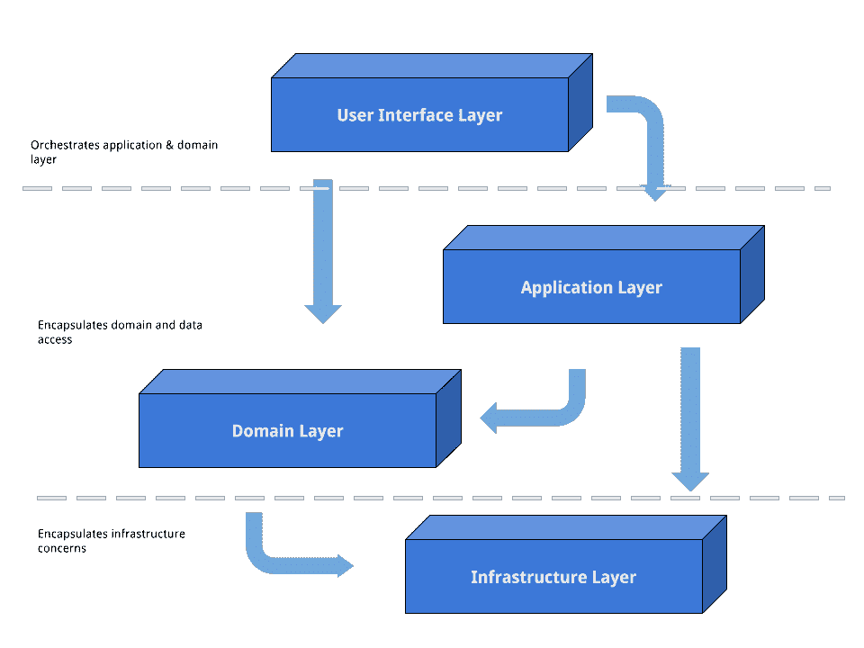
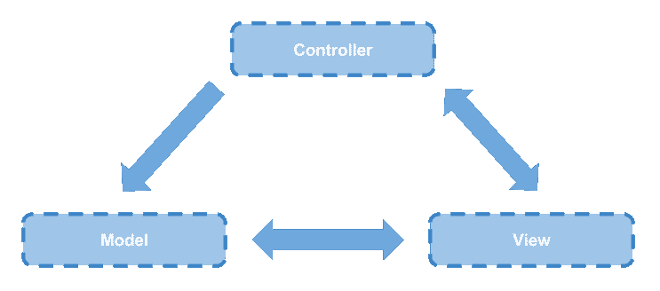

# 第二章：架构风格

为了能够构建复杂的应用程序，一个关键要求是拥有适合应用程序需求的架构设计。领域驱动设计（Domain-Driven Design）的一个优点是它不依赖于任何特定的架构风格。相反，我们可以自由选择最适合核心领域内每个边界上下文需求的架构。这为每个特定的领域问题提供了多样化的架构选择。

例如，一个订单处理系统可以使用事件溯源（Event Sourcing）来跟踪所有不同的订单操作；一个产品目录可以使用 CQRS（Command Query Responsibility Segregation）来向不同的客户端暴露产品详情；一个内容管理系统可以使用纯六边形架构（Hexagonal Architecture）来暴露如博客、静态页面等需求。

本章介绍了 PHP 领域所有相关的架构风格，从传统的老式 PHP 代码到更复杂的架构进行演变。请注意，尽管存在许多其他现有的架构风格，如数据编织或服务导向架构（SOA），但我们发现其中一些从 PHP 的角度来看过于复杂，难以介绍。

# 旧时光

在 PHP 4 发布之前，该语言并没有拥抱面向对象范式。那时，编写应用程序的通常方式是使用过程和全局状态。像**关注点分离（SoC**）和**模型-视图-控制器（MVC**）这样的概念在 PHP 社区中是陌生的。以下是一个以这种方式编写的应用程序示例，其中应用程序由许多前端控制器与 HTML 代码混合组成。在这段时间里，基础设施层、表示层、UI 层和领域层代码都纠缠在一起：

```php
include __DIR__ . '/bootstrap.php';

$link = mysql_connect('localhost', 'a_username', '4_p4ssw0rd');

if (!$link) {
    die('Could not connect: ' . mysql_error());
}

mysql_set_charset('utf8', $link);
mysql_select_db('my_database', $link);

$errormsg = null ;
if (isset($_POST['submit'] && isValid($_POST['post'])) {
    $post = getFrom($_POST['post']);
    mysql_query('START TRANSACTION', $link);
    $sql = sprintf(
        "INSERT INTO posts (title, content) VALUES ('%s','%s')",    
        mysql_real_escape_string($post['title']),
        mysql_real_escape_string($post['content']
    ));

    $result = mysql_query($sql, $link);
    if ($result) {
        mysql_query('COMMIT', $link);
    } else {
        mysql_query('ROLLBACK', $link);
        $errormsg = 'Post could not be created! :(';
    }
}

$result = mysql_query('SELECT id, title, content FROM posts', $link);
?>
<html>
    <head></head>
    <body>
        <?php if (null !== $errormsg) : ?>
            <div class="alert error"><?php echo $errormsg; ?></div>
        <?php else: ?>
            <div class="alert success">
                Bravo! Post was created successfully!
            </div>
        <?php endif; ?>
        <table>
            <thead><tr><th>ID</th><th>TITLE</th>
            <th>ACTIONS</th></tr></thead>
            <tbody>
            <?php while($post = mysql_fetch_assoc($result)) : ?>
                <tr>
                    <td><?php echo $post['id']; ?></td>
                    <td><?php echo $post['title']; ?></td>
                    <td><?php editPostUrl($post['id']); ?></td>
                </tr>
            <?php endwhile; ?>
            </tbody>
        </table>
   </body>
 </html>
 <?php mysql_close($link); ?>

```

这种编程风格通常被称为我们在第一章中提到的*大泥球（Big Ball of Mud*）。然而，在这种风格中看到的一个改进是将网页的页眉和页脚封装在自己的单独文件中，这些文件被包含在页眉和页脚文件中。这避免了重复并促进了重用：

```php
include __DIR__ . '/bootstrap.php';

$link = mysql_connect('localhost', 'a_username', '4_p4ssw0rd');

if (!$link) {
    die('Could not connect: ' . mysql_error());
}

mysql_set_charset('utf8', $link);
mysql_select_db('my_database', $link);

$errormsg = null;

if (isset($_POST['submit'] && isValid($_POST['post'])) {
    $post = getFrom($_POST['post']);
    mysql_query('START TRANSACTION', $link);
    $sql = sprintf(
        "INSERT INTO posts(title, content) VALUES('%s','%s')", 
        mysql_real_escape_string($post['title']),
        mysql_real_escape_string($post['content'])
    );

    $result = mysql_query($sql, $link);
    if ($result) {
        mysql_query('COMMIT', $link);
    } else {
        mysql_query('ROLLBACK', $link);
        $errormsg = 'Post could not be created! :(';
    }
}

$result = mysql_query('SELECT id, title, content FROM posts', $link);
?>
<?php include __DIR__ . '/header.php'; ?>
<?php if (null !== $errormsg) : ?>
    <div class="alert error"><?php echo $errormsg; ?></div>
<?php else: ?>
    <div class="alert success">
        Bravo! Post was created successfully!
    </div>
<?php endif; ?>
<table>
    <thead>
        <tr>
            <th>ID</th>
            <th>TITLE</th>
            <th>ACTIONS</th>
        </tr>
    </thead>
    <tbody>
    <?php while($post = mysql_fetch_assoc($result)): ?>
        <tr>
            <td><?php echo $post['id']; ?></td>
            <td><?php echo $post['title']; ?></td>
            <td><?php editPostUrl($post['id']); ?></td>
        </tr>
    <?php endwhile; ?>
    </tbody>
</table>
<?php include __DIR__ . '/footer.php'; ?>

```

现在，尽管这种方法被高度禁止，但仍有一些应用程序使用这种过程式编程方式。这种架构风格的主要缺点是没有真正的关注点分离——以这种方式开发的应用程序在维护和成本方面与其它知名且经过验证的架构相比急剧增加。

# 分层架构

从代码的可维护性和重用性角度来看，使这段代码更容易维护的最佳方法是通过分割概念，即为每个不同的关注点创建层。在我们之前的例子中，塑造不同的层很容易：一个用于封装数据访问和处理，另一个用于处理基础设施问题，最后一个用于封装前两个层的编排。分层架构的一个基本规则是，每一层必须与它下面的层紧密耦合，如下面的图片所示：



SoC 的分层架构

分层架构真正寻求的是将应用程序的不同组件分离。例如，就之前的例子而言，博客文章的表示必须完全独立于作为概念实体的博客文章。相反，作为概念实体的博客文章可以与一个或多个表示相关联，而不是与特定的表示紧密耦合。这通常被称为关注点分离。

另一个寻求相同目的的架构模式和范例是模型-视图-控制器模式。它最初是为了构建桌面 GUI 应用程序而构思和广泛使用的，现在它主要应用于 Web 应用程序，这得益于像 Symfony、Zend Framework 和 CodeIgniter 这样的流行 Web 框架。

# 模型-视图-控制器

模型-视图-控制器是一种架构模式和范例，它将应用程序分为三个主要层，以下是一些描述：

+   **模型**：捕获并集中所有领域模型的行为。这一层独立于数据表示管理所有数据、逻辑和业务规则。据说**模型层是每个 MVC 应用程序的核心和灵魂**。

+   **控制器**：协调其他层之间的交互，触发模型上的操作以更新其状态，并刷新与模型关联的表示。此外，控制器可以向视图层发送消息，以改变特定的模型表示。

+   **视图**：展示模型层的不同表示，并提供一种触发模型状态变化的方式。



MVC 模式

# 分层架构示例

### 模型

继续上一个例子，我们提到应该将不同的关注点分开。为了做到这一点，我们需要在我们的原始混乱代码中识别出所有层。在整个过程中，我们需要特别注意符合模型层的代码，它将成为应用程序的核心：

```php
class Post
{
    private $title;
    private $content;

    public static function writeNewFrom($title, $content)
    {
        return new static($title, $content);
    }

    private function __construct($title, $content)
    {
        $this->setTitle($title);
        $this->setContent($content);
    }

    private function setTitle($title)
    {
        if (empty($title)) {
            throw new RuntimeException('Title cannot be empty');
        }

        $this->title = $title;
    }

    private function setContent($content)
    {
        if (empty($content)) {
            throw new RuntimeException('Content cannot be empty');
        }

        $this->content = $content;
    }
}

class PostRepository
{
    private $db;

    public function __construct()
    {
        $this->db = new PDO(
            'mysql:host=localhost;dbname=my_database',
            'a_username',
            '4_p4ssw0rd',
            [
                PDO::MYSQL_ATTR_INIT_COMMAND => 'SET NAMES utf8mb4',
            ]
        );
    }

    public function add(Post $post)
    {
        $this->db->beginTransaction();

        try {
            $stm = $this->db->prepare(
                'INSERT INTO posts (title, content) VALUES (?, ?)'
            );

            $stm->execute([
                $post->title(),
                $post->content(),
            ]);

            $this->db->commit();
        } catch (Exception $e) {
            $this->db->rollback();
            throw new UnableToCreatePostException($e);
        }
    }
}

```

模型层现在由 `Post` 类和 `PostRepository` 类定义。`Post` 类代表一篇博客文章，而 `PostRepository` 类代表所有可用的博客文章集合。此外，模型内部还需要另一个层——一个协调和编排领域模型行为的层——那就是应用程序层：

```php
class PostService
{
    public function createPost($title, $content)
    {
        $post = Post::writeNewFrom($title, $content);

        (new PostRepository())->add($post);

        return $post;
    }
}

```

`PostService` 类被称为应用程序服务，其目的是协调和组织领域行为。换句话说，应用程序服务是使事情发生的服务，它们是领域模型直接客户端。其他类型的对象不应能够直接与模型层的内部层进行通信。

# 视图

视图是一个可以发送和接收来自模型层和/或控制器层的消息的层。其主要目的是在用户界面级别代表模型，以及每次模型更新时在用户界面中刷新表示。一般来说，视图层接收一个对象——通常是 **数据传输对象（DTO**）而不是模型层的实例——从而收集所有需要成功表示的信息。对于 PHP，有几个模板引擎可以帮助将模型表示与模型本身和控制器本身分离。最受欢迎的一个叫做 [Twig](http://twig.sensiolabs.org/)。让我们看看使用 Twig 的视图层将如何看起来。

DTOs 而不是模型实例？这是一个老生常谈且活跃的话题。为什么创建一个 DTO 而不是将模型实例提供给视图层？主要原因和简短的回答是，又是关注点的分离。让视图检查和使用模型实例会导致视图层和模型层之间的紧密耦合。实际上，模型层的变化可能会破坏所有使用更改后的模型实例的视图。

```php



    
        <div class="alert error">{{ errormsg }}</div>
    
        <div class="alert success">
            Bravo! Post was created successfully!
        </div>
    
    <table>
        <thead>
            <tr>
                <th>ID</th>
                <th>TITLE</th>
                <th>ACTIONS</th>
            </tr>
        </thead>
        <tbody>
        
            <tr>
                <td>{{ post.id }}</td>
                <td>{{ post.title }}</td>
                <td><a href="{{ editPostUrl(post.id) }}">Edit Post</a></td>
            </tr>
        
        </tbody>
    </table>


```

大多数时候，当模型触发状态变化时，它也会通知相关的视图，以便刷新用户界面。在典型的网络场景中，由于客户端-服务器性质，模型与其表示之间的同步可能有点棘手。在这些环境中，通常需要一些 JavaScript 定义的交互来维护这种同步。因此，近年来，像以下这样的 JavaScript MVC 框架变得非常流行：

+   [AngularJS](https://angularjs.org/)

+   [Ember.js](http://emberjs.com/)

+   [Marionette.js](http://marionettejs.com/)

+   [React](https://facebook.github.io/react/)

# 控制器

控制层负责组织和协调视图和模型。它从视图层接收消息，并触发模型行为以执行所需操作。此外，它向视图发送消息以显示模型表示。这两个操作都得益于应用层，应用层负责协调、组织和封装领域行为。

在 PHP 的 Web 应用程序中，控制器通常包含一组类，为了实现其目的，它们“说 HTTP”。换句话说，它们接收 HTTP 请求并返回 HTTP 响应：

```php
class PostsController
{
    public function updateAction(Request $request)
    {
        if (
            $request->request->has('submit') &&
            Validator::validate($request->request->post)
        ) {
            $postService = new PostService();

            try {
                $postService->createPost(
                    $request->request->get('title'),
                    $request->request->get('content')
                );

                $this->addFlash(
                    'notice',
                    'Post has been created successfully!'
                );
            } catch (Exception $e) {
                $this->addFlash(
                    'error',
                    'Unable to create the post!'
                );
            }
        }

        return $this->render('posts/update-result.html.twig');
    }
}

```

# 反转依赖：六边形架构

遵循分层架构的基本规则，在实现包含基础设施关注点的领域接口时存在风险。

例如，在 MVC 中，上一个例子中的`PostRepository`类应该放在领域模型中。然而，将基础设施细节直接放在我们的领域中间违反了关注点分离。这可能是个问题；如果领域层知道技术实现，就难以避免违反分层架构的基本规则，这会导致一种代码风格，如果领域层知道技术实现，就难以测试。

# 依赖倒置原则（DIP）

我们如何解决这个问题？由于领域模型层依赖于具体的基础设施实现，可以通过将基础设施层放置在其他三个层之上来应用依赖倒置原则（[Dependency Inversion Principle](https://en.wikipedia.org/wiki/Dependency_inversion_principle)），或 DIP。

依赖倒置原则

高层模块不应依赖于底层模块。两者都应依赖于抽象。

抽象不应依赖于细节。细节应依赖于抽象。*罗伯特·C·马丁*

通过使用依赖倒置原则，架构模式发生变化，基础设施层——可以称为底层模块——现在依赖于 UI、应用层和领域层，这些是高层模块。依赖关系已经反转。

但什么是六边形架构，它是如何适应所有这些的？六边形架构（也称为端口和适配器）由 Alistair Cockburn 在他的书中定义，[六边形架构](http://alistair.cockburn.us/Hexagonal+architecture)。它将应用程序描绘成一个六边形，其中每一边代表一个带有一个或多个适配器的端口。端口是一个具有可插拔适配器的连接器，它将外部输入转换为内部应用程序可以理解的东西。在 DIP（依赖倒置原则）的术语中，端口将是一个高级模块，而适配器将是一个低级模块。此外，如果应用程序需要向外部发送消息，它也将使用带有适配器的端口来发送并转换成外部可以理解的东西。因此，六边形架构提出了应用程序中的对称概念，这也是架构模式变化的主要原因。它通常被表示为六边形，因为不再有意义讨论顶层或底层。相反，六边形架构主要从外部和内部的角度来讨论。

YouTube 上有许多由*Matthias Noback*制作的关于六边形架构的优秀视频，他讨论了六边形架构。你可能想看看其中之一以获取更多[详细信息](https://www.youtube.com/watch?v=K1EJBmwg9EQ)。

# 应用六边形架构

继续使用博客示例应用程序，我们需要的第一概念是外部世界可以与应用程序通信的端口。在这种情况下，我们将使用 HTTP 端口及其相应的适配器。外部将通过端口向应用程序发送消息。博客示例使用数据库来存储整个博客文章集合，因此为了允许应用程序从数据库检索博客文章，需要一个端口：

```php
interface PostRepository
{
    public function byId(PostId $id);
    public function add(Post $post);
}

```

此接口公开了应用程序将通过它检索有关博客文章信息的端口，它将位于域层。现在需要为这个端口创建一个适配器。适配器负责定义使用特定技术检索博客文章的方式：

```php
class PDOPostRepository implements PostRepository
{
    private $db;

    public function __construct(PDO $db)
    {
        $this->db = $db;
    }

    public function byId(PostId $id)
    {
        $stm = $this->db->prepare(
            'SELECT * FROM posts WHERE id = ?'
        );

        $stm->execute([$id->id()]);

        return recreateFrom($stm->fetch());
    }

    public function add(Post $post)
    {
        $stm = $this->db->prepare(
            'INSERT INTO posts (title, content) VALUES (?, ?)'
        );

        $stm->execute([
            $post->title(),
            $post->content(),
        ]);
    }
}

```

一旦我们定义了端口和适配器，最后一步就是重构`PostService`类，使其使用它们。这可以通过使用[依赖注入](http://www.martinfowler.com/articles/injection.html)轻松实现：

```php
class PostService
{
    private $postRepository;

    public function __construct(PostRepositor $postRepository)
    {
        $this->postRepository = $postRepository;
    }

    public function createPost($title, $content)
    {
        $post = Post::writeNewFrom($title, $content);

        $this->postRepository->add($post);

        return $post;
    }
}

```

这只是一个简单的六边形架构示例。它是一个灵活的架构，它促进了关注点的分离，就像分层架构一样。它还通过拥有一个与外部通过端口通信的内部应用程序来促进对称性。从现在开始，这将是构建和解释 CQRS 和事件源的基础架构。

关于此架构的更多示例，您可以查看附录，*使用 PHP 的六边形架构*。对于更详细的示例，您应该跳转到第十一章，*应用程序*，其中解释了事务性和其他横切关注点等高级主题。

# 命令查询责任分离（Command Query Responsibility Segregation, CQRS）

六边形架构是一个良好的基础架构，但它有一些局限性。例如，复杂的 UI 可能需要以不同形式显示的聚合信息（**第八章**，*聚合*），或者它们可能需要从多个聚合中获得数据。在这种情况下，我们可能会在仓储中拥有大量的查找方法（可能和应用程序中存在的 UI 视图一样多）。或者，我们可能决定将这种复杂性移至应用程序服务，使用复杂结构从多个聚合中积累数据。以下是一个例子：

```php
interface PostRepository 
{ 
    public function save(Post $post);
    public function byId(PostId $id);
    public function all(); 
    public function byCategory(CategoryId $categoryId); 
    public function byTag(TagId $tagId); 
    public function withComments(PostId $id); 
    public function groupedByMonth(); 
    // ... 
}

```

当这些技术被滥用时，UI 视图的构建可能会变得非常痛苦。我们应该评估在使应用程序服务返回领域模型实例和返回某种类型的 DTO 之间的权衡。后者选项可以避免领域模型和基础设施代码（Web 控制器、CLI 控制器等）之间的紧密耦合。

幸运的是，还有另一种方法。如果问题是存在多个且不同的视图，我们可以将它们从领域模型中排除，并开始将它们视为纯粹的基础设施关注点。这个选项基于一个设计原则，即**命令查询分离**（Command Query Separation, **CQS**）。这个原则由贝特朗·梅耶定义，反过来，它催生了一个新的架构模式，即**命令查询责任分离**（Command Query Responsibility Segregation, **CQRS**），由格雷格·杨定义。

命令查询分离（Command Query Separation, CQS）

*提问不应改变答案* - 贝特朗·梅耶

这个设计原则指出，每个方法应该是执行动作的命令，或者返回数据的查询，但不能两者兼而有之，[维基百科](https://en.wikipedia.org/wiki/Command%E2%80%93query_separation)

CQRS 寻求更激进的关注点分离，将模型分为两部分：

+   **写模型**：也称为**命令模型**，执行写入操作并负责真正的领域行为。

+   **读模型**：负责应用程序内的读取操作，并将它们视为应该从领域模型中分离出来的内容。

每次有人触发对写模型的命令时，都会执行对所需数据存储的写入操作。此外，它还会触发读模型更新，以便在读模型上显示最新的更改。

这种严格的分离导致另一个问题：最终一致性。读取模型的一致性现在取决于写模型执行的命令。换句话说，读取模型是最终一致的。也就是说，每次写模型执行命令时，都会启动一个负责根据写模型上的最后更新来更新读取模型的过程。在一段时间内，UI 可能会向用户展示过时的信息。在 Web 场景中，这种情况经常发生，因为我们受到当前技术的限制。

想象一下在 Web 应用程序前面有一个缓存系统。每次数据库更新新信息时，缓存层上的数据可能已经过时，因此每次更新时，都应该有一个更新缓存系统的过程。缓存系统是最终一致的。

这些类型的流程，用 CQRS 术语来说，被称为写模型投影，或简称投影。我们将写模型投影到读取模型上。这个过程可以是同步的或异步的，取决于您的需求，并且可以通过另一个有用的战术设计模式——章节领域事件——来实现，这在本书后面的章节中将详细解释。写模型投影的基础是收集所有发布的领域事件，并使用事件中来的所有信息更新读取模型。

# 写模型

这是领域行为的真正持有者。继续我们的例子，仓库接口将被简化为以下内容：

```php
interface PostRepository
{ 
    public function save(Post $post); 
    public function byId(PostId $id); 
}

```

现在，`PostRepository`已经从所有的读取关注点中解放出来，除了一个：`byId`函数，它负责通过 ID 加载聚合体，以便我们可以对其进行操作。一旦完成这项工作，所有查询方法也从帖子模型中移除，只留下命令方法。这意味着我们将有效地去除所有获取方法以及任何其他暴露帖子聚合体信息的其他方法。相反，将通过发布领域事件来触发，以便能够通过订阅它们来触发写模型投影：

```php
class AggregateRoot
{
    private $recordedEvents = [];

    protected function recordApplyAndPublishThat(
        DomainEvent $domainEvent
    ) {
        $this->recordThat($domainEvent);
        $this->applyThat($domainEvent);
        $this->publishThat($domainEvent);
    }

    protected function recordThat(DomainEvent $domainEvent)
    {
        $this->recordedEvents[] = $domainEvent;
    }

    protected function applyThat(DomainEvent $domainEvent)
    {
        $modifier = 'apply' . get_class($domainEvent);

        $this->$modifier($domainEvent);
    }

    protected function publishThat(DomainEvent $domainEvent)
    {
        DomainEventPublisher::getInstance()->publish($domainEvent);
    }

    public function recordedEvents()
    {
        return $this->recordedEvents;
    }

    public function clearEvents()
    {
        $this->recordedEvents = [];
    }
}

class Post extends AggregateRoot
{
    private $id;
    private $title;
    private $content;
    private $published = false;
    private $categories;

    private function __construct(PostId $id)
    {
        $this->id = $id;
        $this->categories = new Collection();
    }

    public static function writeNewFrom($title, $content)
    {
        $postId = PostId::create();

        $post = new static($postId);

        $post->recordApplyAndPublishThat(
            new PostWasCreated($postId, $title, $content)
        );
    }

    public function publish()
    {
        $this->recordApplyAndPublishThat(
            new PostWasPublished($this->id)
        );
    }

    public function categorizeIn(CategoryId $categoryId)
    {
        $this->recordApplyAndPublishThat(
            new PostWasCategorized($this->id, $categoryId)
        );
    }

    public function changeContentFor($newContent)
    {
        $this->recordApplyAndPublishThat(
            new PostContentWasChanged($this->id, $newContent)
        );
    }

    public function changeTitleFor($newTitle)
    {
        $this->recordApplyAndPublishThat(
            new PostTitleWasChanged($this->id, $newTitle)
        );
    }
}

```

所有触发状态变化的操作都通过领域事件来实现。对于每个发布的领域事件，都有一个负责反映状态变化的应用方法：

```php
class Post extends AggregateRoot
{
    // ...

    protected function applyPostWasCreated(
        PostWasCreated $event
    ) {
        $this->id = $event->id();
        $this->title = $event->title();
        $this->content = $event->content();
    }

    protected function applyPostWasPublished(
        PostWasPublished $event
    ) {
        $this->published = true;
    }

    protected function applyPostWasCategorized(
        PostWasCategorized $event
    ) {
        $this->categories->add($event->categoryId());
    }

    protected function applyPostContentWasChanged(
        PostContentWasChanged $event
    ) {
        $this->content = $event->content();
    }

    protected function applyPostTitleWasChanged(
        PostTitleWasChanged $event
    ) {
        $this->title = $event->title();
    }
}

```

# 读取模型

读取模型，也称为查询模型，是一个从领域关注点提升的纯反规范化数据模型。实际上，在 CQRS 中，所有的读取关注点都被视为报告过程，一个基础设施关注点。一般来说，当使用 CQRS 时，读取模型受 UI 需求和构成 UI 的视图复杂性的影响。在读取模型以关系数据库为定义的情况下，最简单的方法是在数据库表和 UI 视图之间设置一对一的关系。这些数据库表和 UI 视图将使用从写入端发布的领域事件触发的写入模型投影进行更新：

```php
-- Definition of a UI view of a single post with its comments
CREATE TABLE single_post_with_comments (
    id INTEGER NOT NULL,
    post_id INTEGER NOT NULL,
    post_title VARCHAR(100) NOT NULL,
    post_content TEXT NOT NULL,
    post_created_at DATETIME NOT NULL,
    comment_content TEXT NOT NULL
) ENGINE=InnoDB DEFAULT CHARSET=utf8mb4 COLLATE=utf8mb4_unicode_ci;

-- Set up some data
INSERT INTO single_post_with_comments VALUES
    (1, 1, "Layered" , "Some content", NOW(), "A comment"),
    (2, 1, "Layered" , "Some content", NOW(), "The comment"),
    (3, 2, "Hexagonal" , "Some content", NOW(), "No comment"),
    (4, 2, "Hexagonal", "Some content", NOW(), "All comments"),
    (5, 3, "CQRS", "Some content", NOW(), "This comment"),
    (6, 3, "CQRS", "Some content", NOW(), "That comment");

-- Query it
SELECT * FROM single_post_with_comments WHERE post_id = 1;

```

这种架构风格的一个重要特性是读取模型应该是完全可丢弃的，因为应用程序的真实状态由写入模型处理。这意味着读取模型可以在需要时通过写入模型投影进行删除和重建。

在这里，我们可以看到博客应用中可能的一些视图示例：

```php
SELECT * FROM
    posts_grouped_by_month_and_year 
ORDER BY month DESC,year ASC;

SELECT * FROM
    posts_by_tags 
WHERE tag = "ddd";

SELECT * FROM
    posts_by_author 
WHERE author_id = 1;

```

需要指出的是，CQRS 并不限制读取模型的定义和实现必须使用关系数据库。它完全取决于正在构建的应用程序的需求。它可以是关系数据库、面向文档的数据库、键值存储，或者任何最适合您应用程序需求的数据库。在博客应用博客文章之后，我们将使用 [Elasticsearch](https://en.wikipedia.org/wiki/Elasticsearch) ——一个面向文档的数据库——来实现读取模型：

```php
class PostsController
{
    public function listAction()
    {
        $client = new ElasticsearchClientBuilder::create()->build();

        $response = $client-> search([
            'index' => 'blog-engine',
            'type' => 'posts',
            'body' => [
                'sort' => [
                    'created_at' => ['order' => 'desc']
                ]
            ]
        ]);

        return [
            'posts' => $response
        ];
    }
}

```

读取模型代码已经被大大简化为对 Elasticsearch 索引的单个查询。

这表明读取模型实际上并不需要一个对象关系映射器，因为这可能是过度设计。然而，写入模型可能从使用对象关系映射器中受益，因为这将允许您根据应用程序的需求组织和结构化读取模型。

# 同步写入模型与读取模型

接下来是棘手的部分。我们如何同步读取模型与写入模型？我们之前已经说过，我们将通过使用写入模型事务中捕获的领域事件来实现。对于捕获的每种类型的领域事件，将执行一个特定的投影。因此，领域事件与投影之间将建立一对一的关系。

让我们看看配置投影的一个例子，以便我们更好地理解。首先，我们需要为投影定义一个框架：

```php
interface Projection 
{ 
    public function listensTo(); 
    public function project($event); 
}

```

因此，为 `PostWasCreated` 事件定义一个 `Elasticsearch` 投影将像这样简单：

```php
namespace Infrastructure\Projection\Elasticsearch;

use Elasticsearch\Client;
use PostWasCreated;

class PostWasCreatedProjection implements Projection
{
    private $client;

    public function __construct(Client $client)
    {
        $this->client = $client;
    }

    public function listensTo()
    {
        return PostWasCreated::class;
    }

    public function project($event)
    {
        $this->client->index([
            'index' => 'posts',
            'type' => 'post',
            'id' => $event->getPostId(),
            'body' => [
                'content' => $event->getPostContent(),
                // ...
            ]
        ]);
    }
}

```

投影器实现是一种专门的领域事件监听器。与默认的领域事件监听器相比，主要区别在于投影器对一组领域事件做出反应，而不仅仅是单个事件：

```php
namespace Infrastructure\Projection;

class Projector
{
    private $projections = [];

    public function register(array $projections)
    {
        foreach ($projections as $projection) {
            $this->projections[$projection->eventType()] = $projection;
        }
    }

    public function project( array $events)
    {
        foreach ($events as $event) {
            if (isset($this->projections[get_class($event)])) {
                $this->projections[get_class($event)] 
                    ->project($event);
            }
        }
    }
}

```

以下代码显示了投影器和事件之间的流程：

```php
$client = new ElasticsearchClientBuilder::create()->build();

$projector = new Projector();
$projector->register([
    new Infrastructure\Projection\Elasticsearch\
        PostWasCreatedProjection($client), 
    new Infrastructure\Projection\Elasticsearch\
        PostWasPublishedProjection($client),
    new Infrastructure\Projection\Elasticsearch\
        PostWasCategorizedProjection($client),
    new Infrastructure\Projection\Elasticsearch\
        PostContentWasChangedProjection($client),
    new Infrastructure\Projection\Elasticsearch\
        PostTitleWasChangedProjection($client),
]);

$events = [
    new PostWasCreated(/* ... */),
    new PostWasPublished(/* ... */),
    new PostWasCategorized(/* ... */),
    new PostContentWasChanged(/* ... */),
    new PostTitleWasChanged(/* ... */),
];

$projector->project($event);

```

这段代码有点同步，但如果需要，过程可以是异步的。您可以通过在视图层放置一些警报来让客户意识到这种不同步的数据。

在下一个示例中，我们将结合使用`amqplib` PHP 扩展和[ReactPHP](https://github.com/GeniusesOfSymfony/ReactAMQP)：

```php
// Connect to an AMQP broker
$cnn = new AMQPConnection();
$cnn->connect();

// Create a channel
$ch = new AMQPChannel($cnn);

// Declare a new exchange
$ex = new AMQPExchange($ch);
$ex->setName('events');

$ex->declare();

// Create an event loop
$loop = ReactEventLoopFactory::create();

// Create a producer that will send any waiting messages every half a second
$producer = new Gos\Component\React\AMQPProducer($ex, $loop, 0.5);

$serializer = JMS\Serializer\SerializerBuilder::create()->build();

$projector = new AsyncProjector($producer, $serializer);

$events = [
    new PostWasCreated(/* ... */),
    new PostWasPublished(/* ... */),
    new PostWasCategorized(/* ... */),
    new PostContentWasChanged(/* ... */),
    new PostTitleWasChanged(/* ... */),
];

$projector->project($event);

```

为了使这可行，我们需要一个异步投影器。以下是一个简单的实现：

```php
namespace Infrastructure\Projection;

use Gos\Component\React\AMQPProducer;
use JMS\Serializer\Serializer;

class AsyncProjector
{
    private $producer;
    private $serializer;

    public function __construct(
        Producer $producer,
        Serializer $serializer
    ) {
        $this->producer = $producer;
        $this->serializer = $serializer;
    }

    public function project(array $events)
    {
        foreach ($events as $event) {
            $this->producer->publish(
                $this->serializer->serialize(
                    $event, 'json'
                )
            );
        }
    }
}

```

并且 RabbitMQ 交换上的事件消费者看起来可能像这样：

```php
// Connect to an AMQP broker
$cnn = new AMQPConnection();
$cnn-> connect();

// Create a channel
$ch = new AMQPChannel($cnn);

// Create a new queue
$queue = new AMQPQueue($ch);
$queue->setName('events');
$queue->declare();

// Create an event loop
$loop = React\EventLoop\Factory::create();

$serializer = JMS\Serializer\SerializerBuilder::create()->build();

$client = new Elasticsearch\ClientBuilder::create()->build();

$projector = new Projector();
$projector->register([
    new Infrastructure\Projection\Elasticsearch\
        PostWasCreatedProjection($client),
    new Infrastructure\Projection\Elasticsearch\
        PostWasPublishedProjection($client),
    new Infrastructure\Projection\Elasticsearch\
        PostWasCategorizedProjection($client),
    new Infrastructure\Projection\Elasticsearch\
        PostContentWasChangedProjection($client),
    new Infrastructure\Projection\Elasticsearch\
        PostTitleWasChangedProjection($client),              
]);

// Create a consumer
$consumer = new Gos\Component\ReactAMQP\Consumer($queue, $loop, 0.5, 10);

// Check for messages every half a second and consume up to 10 at a time.
$consumer->on(
    'consume',
    function ($envelope, $queue) use ($projector, $serializer) {
        $event = $serializer->unserialize($envelope->getBody(), 'json');
        $projector->project($event);
    }
);

$loop->run();

```

从现在开始，这可能只需要让所有必要的仓库消费一个投影器实例，然后让它们调用投影过程：

```php
class DoctrinePostRepository implements PostRepository
{
    private $em;
    private $projector;

    public function __construct(EntityManager $em, Projector $projector)
    {
        $this->em = $em;
        $this->projector = $projector;
    }

    public function save(Post $post)
    {
        $this->em->transactional(
            function (EntityManager $em) use ($post)
            {
                $em->persist($post);

                foreach ($post->recordedEvents() as $event) {
                    $em->persist($event);
                }
            }
        );

        $this->projector->project($post->recordedEvents());
    }

    public function byId(PostId $id)
    {
        return $this->em->find($id);
    }
}

```

`Post`实例和记录的事件在同一事务中被触发和持久化。这确保了不会丢失任何事件，因为如果事务成功，我们将它们投影到读取模型。因此，写入模型和读取模型之间不会存在不一致性。

**是使用 ORM 还是不使用 ORM**

在实现 CQRS 时，最常见的疑问之一是是否真的需要**对象关系映射器（ORM**）。我们坚信，对于写入模型使用 ORM 是完全可以接受的，并且具有使用工具的所有优点，这将在我们使用关系数据库时帮助我们节省大量工作。但我们不应忘记，我们仍然需要在关系数据库中持久化和检索写入模型的状态。

# 事件溯源

CQRS 是一种强大且灵活的架构。它在收集和保存领域事件（在聚合操作期间发生）方面提供了额外的优势，这为您提供了对领域内部发生情况的详细高级度。由于它们在领域中的重要性，领域事件是关键战术模式之一，因为它们描述了过去发生的事情。

**注意不要记录过多的事件**

事件数量不断增长是一个信号。它可能揭示了在领域中对事件记录的依赖，这很可能是由于业务激励的。作为经验法则，请记住保持简单。

通过使用 CQRS，我们已经能够记录在领域层发生的所有相关事件。领域模型的状态可以通过重现我们之前记录的领域事件来表示。我们只需要一个工具来以一致的方式存储所有这些事件。我们需要一个事件存储库。

事件溯源背后的基本思想是将聚合的状态表示为一系列事件的线性序列

通过 CQRS，我们部分实现了以下目标：`Post`实体通过使用领域事件来改变其状态，但它被持久化，如前所述，因此将对象映射到数据库表。

事件溯源将这一概念进一步发展。如果我们使用数据库表来存储所有博客文章的状态，另一个来存储所有博客文章评论的状态，依此类推，使用事件溯源将允许我们使用单个数据库表：一个单一的追加——只存储域模型内所有聚合体发布的所有域事件的数据库表。是的，你读得对。一个**单一**的数据库表。

在这个模型下，不再需要对象关系映射器等工具。所需的唯一工具是一个简单的数据库抽象层，通过它可以追加事件：

```php
interface EventSourcedAggregateRoot
{
    public static function reconstitute(EventStream $events);
}

class Post extends AggregateRoot implements EventSourcedAggregateRoot
{
    public static function reconstitute(EventStream $history)
    {
        $post = new static($history->getAggregateId());

        foreach ($events as $event) {
            $post->applyThat($event);
        }

        return $post;
    }
}

```

现在，`Post`聚合体有一个方法，当给定一组事件（或者说，一个事件流）时，能够逐步回放状态直到达到当前状态，所有这些都在保存之前完成。下一步将是构建一个`PostRepository`端口的适配器，该适配器将从`Post`聚合体中检索所有已发布的事件并将它们附加到所有事件都附加的数据存储中。这就是我们所说的事件存储：

```php
class EventStorePostRepository implements PostRepository
{
    private $eventStore;
    private $projector;

    public function __construct($eventStore, $projector)
    {
        $this->eventStore = $eventStore;
        $this->projector = $projector;
    }

    public function save(Post $post)
    {
        $events = $post->recordedEvents();

        $this->eventStore->append(new EventStream(
            $post->id(),  
            $events)
        );
        $post->clearEvents();

        $this->projector->project($events);
    }
}

```

这是我们使用事件存储来保存`Post`聚合体发布的所有事件的`PostRepository`实现方式。现在我们需要一种方法来从其事件历史中恢复聚合体。`Post`聚合体实现了一个`reconstitute`方法，并用于从触发事件中重建博客文章状态，这在实际操作中非常有用：

```php
class EventStorePostRepository implements PostRepository
{
    public function byId(PostId $id)
    {
        return Post::reconstitute(
            $this->eventStore->getEventsFor($id)
        );
    }
}

```

事件存储是执行所有与保存和恢复事件流相关的责任的工作马。其公共 API 由两个简单的方法组成：它们是`append`和`getEventsFrom`。前者将事件流追加到事件存储中，后者加载事件流以允许聚合体重建。

我们可以使用键值实现来存储所有事件：

```php
class EventStore
{
    private $redis;
    private $serializer;

    public function __construct($redis, $serializer)
    {
        $this->redis = $redis;
        $this->serializer = $serializer;
    }

    public function append(EventStream $eventstream)
    {
        foreach ($eventstream as $event) {
            $data = $this->serializer->serialize(
                $event, 'json'
            );

            $date = (new DateTimeImmutable())->format('YmdHis');

            $this->redis->rpush(
                'events:' . $event->getAggregateId(),
                $this->serializer->serialize([
                    'type' => get_class($event),
                    'created_on' => $date,
                    'data' => $data
                ],'json')
            );
        }
    }

    public function getEventsFor($id)
    {
        $serializedEvents = $this->redis->lrange('events:' . $id, 0, -1);

        $eventStream = [];
        foreach($serializedEvents as $serializedEvent){
            $eventData = $this->serializerdeserialize(
                $serializedEvent, 
                'array',
                'json'
           );

            $eventStream[] = $this->serializer->deserialize(
                $eventData['data'],
                $eventData['type'],
                'json'
            );
        }

        return new EventStream($id, $eventStream);
    }
}

```

此事件存储实现建立在广泛使用的键值存储[Redis](http://redis.io)之上。事件通过前缀 events:附加到列表中。此外，在持久化事件之前，我们会提取一些元数据，如事件类别或创建日期，因为它们在以后会很有用。

显然，从性能角度来看，聚合体每次都要遍历其完整的事件历史以到达最终状态是非常昂贵的。这尤其适用于事件流包含数百甚至数千个事件的情况。克服这种情况的最佳方法是从聚合体中获取快照，并仅重新播放快照之后发生的事件流中的事件。快照只是聚合体在任何给定时刻状态的简单序列化版本。它可以基于聚合体事件流的数量，或者基于时间。在第一种方法中，每*n*个触发事件（例如每 50、100 或 200 个事件）将获取一个快照。在第二种方法中，每*n*秒获取一个快照。

为了遵循示例，我们将使用快照的第一种方式。在事件的元数据中，我们存储一个额外的字段，版本号，我们将从它开始重新播放聚合的历史：

```php
class SnapshotRepository
{
    public function byId($id)
    {
        $key = 'snapshots:' . $id;
        $metadata = $this->serializer->unserialize(
            $this->redis->get($key)
        );

        if (null === $metadata) {
            return;
        } 

        return new Snapshot(
            $metadata['version'],
            $this->serializer->unserialize(
                $metadata['snapshot']['data'],
                $metadata['snapshot']['type'],
                'json'
            )
        );
    }

    public function save($id, Snapshot $snapshot)
    {
        $key = 'snapshots:' . $id;
        $aggregate = $snapshot->aggregate();

        $snapshot = [
            'version' => $snapshot->version(),
            'snapshot' => [
                'type' => get_class($aggregate),
                'data' => $this->serializer->serialize(
                    $aggregate, 'json'
                )
            ]
        ];

        $this->redis->set($key, $snapshot);
    }
}

```

现在我们需要重构`EventStore`类，使其开始使用`SnapshotRepository`以可接受的性能时间加载聚合：

```php
class EventStorePostRepository implements PostRepository
{
    public function byId(PostId $id)
    {
        $snapshot = $this->snapshotRepository->byId($id);

        if (null === $snapshot) {
            return Post::reconstitute(
                $this->eventStore->getEventsFrom($id)
            );
        }

        $post = $snapshot->aggregate();

        $post->replay(
            $this->eventStore->fromVersion($id, $snapshot->version())
        );

        return $post;
    }
}

```

我们只需要定期进行聚合快照。我们可以通过负责监控事件存储的过程同步或异步地完成这项工作。以下代码是一个简单的示例，展示了聚合快照的实现：

```php
class EventStorePostRepository implements PostRepository
{
    public function save(Post $post)
    {
        $id = $post->id();
        $events = $post->recordedEvents();
        $post->clearEvents();
        $this->eventStore->append(new EventStream($id, $events));
        $countOfEvents =$this->eventStore->countEventsFor($id);
        $version = $countOfEvents / 100;

        if (!$this->snapshotRepository->has($post->id(), $version)) {
            $this->snapshotRepository->save(
                $id,
                new Snapshot(
                    $post, $version
                )
            );
        }

        $this->projector->project($events);
    }
}

```

是否使用 ORM

从这种架构风格的使用案例中可以看出，仅仅为了持久化/检索事件而使用 ORM 会过度设计。即使我们使用关系数据库来存储它们，我们也只需要从数据存储中持久化/检索事件。

# 总结

由于有大量的架构风格选项，你可能会在本章中感到有些困惑。你必须考虑每个选项的权衡，以便明智地选择。有一点是明确的：巨大的泥球方法不是一个选择，因为代码会很快腐烂。分层架构是一个更好的选择，但它有一些缺点，比如层与层之间的紧密耦合。可以说，最平衡的选项是六边形架构，因为它可以用作基础架构，并促进应用内外部的高度解耦和对称。这是我们推荐在大多数场景下的做法。

我们还看到了 CQRS 和事件溯源作为相对灵活的架构，它们将帮助你应对严重的复杂性。CQRS 和事件溯源都有它们的位置，但不要让*酷炫因素*分散你对它们提供的价值的注意力。由于它们都带来了一些开销，你应该有一个技术理由来证明它们的使用是合理的。这些架构风格确实非常有用，而开始使用它们的启发式方法可以在 CQRS 的存储库中的查找器数量和事件溯源触发事件的量中找到。如果查找方法开始增加，并且存储库变得难以维护，那么是时候考虑使用 CQRS 来分割读/写关注点。然后，如果每个聚合操作的事件量趋于增长，并且业务对更细粒度的信息感兴趣，那么可以考虑的一个选择是转向事件溯源可能会带来回报。

摘自布赖恩·福特和约瑟夫·约德的一篇论文：

*一个巨大的泥球结构混乱、杂乱无章、粘土和铁丝网粘合*，[意大利面代码丛林](http://www.laputan.org/mud/mud.html#BigBallOfMud)。
