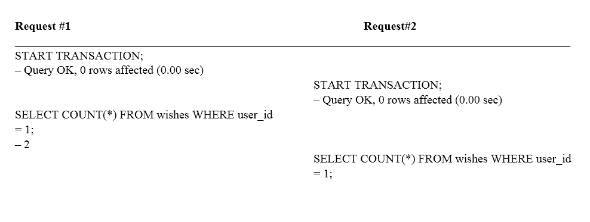
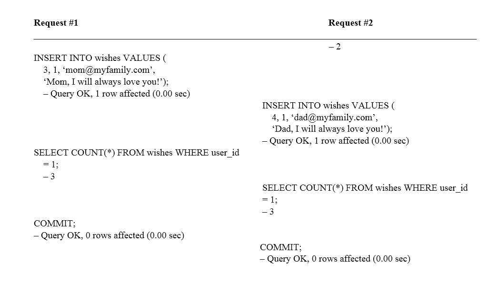
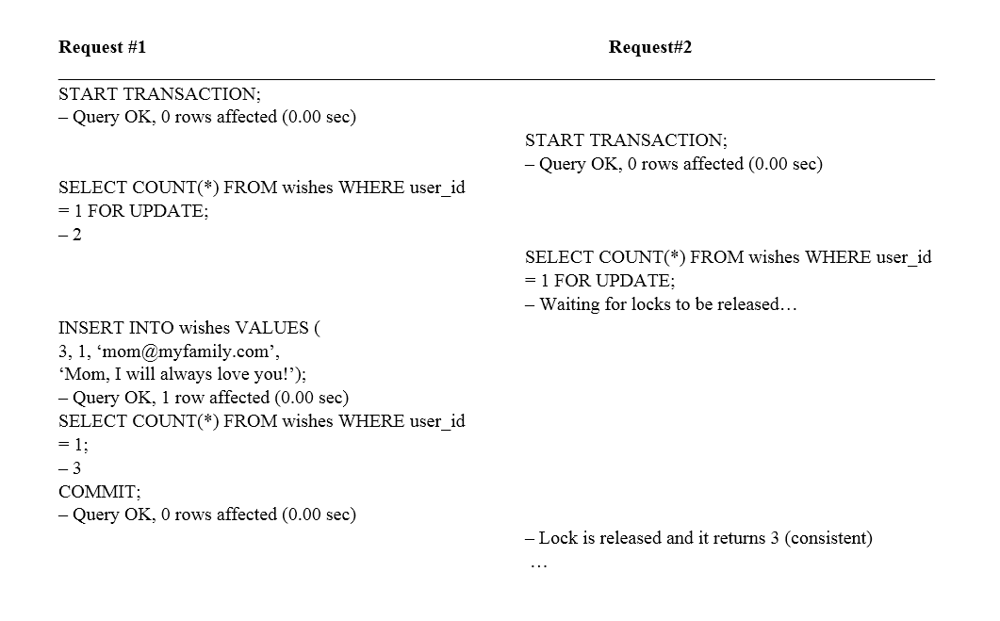

# 第八章：聚合（Aggregates）

聚合（Aggregates）可能是领域驱动设计（Domain-Driven Design）中最难构建的模块。它们难以理解，而且设计起来更加困难。但别担心；我们在这里帮助你。然而，在深入研究聚合之前，我们需要先了解一些关键概念：事务和并发策略。

# 简介

如果你曾与电子商务应用程序合作，那么你很可能遇到过与数据库中数据不一致相关的错误。例如，考虑一个总金额为$99.99 的购物订单，而这个金额并不等于订单中每行金额的总和，$89.99。那额外的$10 是从哪里来的？

或者，考虑一个销售电影票的网站。有一个电影院有 100 个可用座位，在成功的电影推广之后，每个人都登录网站等待购票。一旦开始销售，一切发生得很快，你不知怎么就卖出了 102 张票。你可能已经指定只有 100 个座位，但不知何故你超过了这个限制。

你甚至可能有过使用 JIRA 或 Redmine 等跟踪系统的经验。想想一个由开发者、质量保证（QAs）和产品负责人组成的团队。如果在规划会议期间每个人都对用户故事进行排序和移动，然后保存，会发生什么？最终的待办事项列表或冲刺优先级将是最后保存的团队成员的。

通常，当我们以非原子方式处理持久化机制时，会出现数据不一致。一个例子是当你向数据库发送三个查询时，其中一些成功而另一些失败。数据库的最终状态是不一致的。有时，你希望这三个查询全部成功或全部失败，这可以通过事务来解决。然而，请注意，正如你将在本章中看到的，并非所有的不一致性都可以通过事务来解决。实际上，有时其他数据不一致需要锁定或并发策略。这类工具可能会影响你的应用程序性能，因此请注意，这里存在权衡。

你可能认为这类数据不一致只发生在数据库中，但这并不正确。例如，如果我们使用文档型数据库，如 Elasticsearch，我们可能会在两个文档之间出现数据不一致。此外，大多数 NoSQL 持久化存储系统不支持 ACID 事务。这意味着你无法在一次操作中持久化或更新多个文档。因此，如果我们向 Elasticsearch 发送不同的请求，其中一个可能会失败，导致 Elasticsearch 中持久化的数据不一致。

保持数据一致性是一个挑战。不让基础设施问题渗透到领域模型中是一个更大的挑战。聚合（Aggregates）旨在帮助你解决这两个问题。

# 关键概念

持久性引擎——特别是数据库——有一些用于对抗数据不一致性的功能：ACID、约束、引用完整性、锁定、并发控制和事务。在处理聚合之前，让我们回顾这些概念。

这些概念中的大多数都可以在互联网上找到，对公众开放。我们想感谢 Oracle、PostgreSQL 和 Doctrine 团队，他们为他们的文档做了惊人的工作。他们仔细定义并解释了这些重要术语，我们不想重复造轮子，所以我们收集了一些这些官方解释与您分享。

# ACID

如前所述，**ACID**代表**原子性**、**一致性**、**隔离性**和**持久性**。根据[MySQL 术语表](http://dev.mysql.com/doc/refman/5.7/en/glossary.html#glos_acid)：

这些属性在数据库系统中都是可取的，并且都与事务的概念紧密相关。例如，MySQL InnoDB 引擎的事务功能遵循 ACID 原则。

事务是可以提交或回滚的工作的**原子**单元。当事务对数据库进行多项更改时，要么在事务提交时所有更改都成功，要么在事务回滚时所有更改都被撤销。

数据库在每次提交或回滚后，以及事务进行期间，始终保持**一致**状态。如果相关数据正在多个表中更新，查询将看到所有旧值或所有新值，而不是旧值和新值的混合。

在进行过程中，事务是**隔离**的，彼此之间不会相互干扰或看到对方未提交的数据。这种隔离是通过锁定机制实现的。经验丰富的用户可以在确信事务之间不会相互干扰的情况下，调整隔离级别，以牺牲较少的保护来换取更高的性能和并发性。

事务的结果是**持久**的：一旦提交操作成功，该事务所做的更改就安全免受电源故障、系统崩溃、竞态条件或其他许多非数据库应用程序易受其害的潜在危险的影响。持久性通常涉及写入磁盘存储，并在写入操作期间具有一定的冗余来防止电源故障或软件崩溃。

# 事务

根据[PostgreSQL 8.2.23 文档](https://www.postgresql.org/docs/8.2/static/tutorial-transactions.html)：

事务是所有数据库系统的基本概念。事务的基本点是它将多个步骤捆绑成一个单一的全有或全无的操作。步骤之间的中间状态对其他并发事务不可见，如果发生某些故障阻止事务完成，则没有任何步骤会影响数据库。

例如，考虑一个包含各种客户账户余额以及分支总存款余额的银行数据库。假设我们想要记录从爱丽丝账户到鲍勃账户的 100.00 美元的付款。极度简化地，这个操作的 SQL 命令可能如下：

```php
UPDATE accounts
    SET balance = balance - 100.00
WHERE name = 'Alice';

UPDATE branches
    SET balance = balance - 100.00
WHERE name = (SELECT branch_name FROM accounts WHERE name ='Alice');

UPDATE accounts
    SET balance = balance + 100.00
WHERE name = 'Bob';

UPDATE branches
    SET balance = balance + 100.00
WHERE name = (SELECT branch_name FROM accounts WHERE name ='Bob');

```

这些命令的细节在这里并不重要。重要的是，涉及几个单独的更新来完成这个相对简单的操作。我们的银行官员将希望得到保证，要么所有这些更新都发生，要么一个都不发生。如果系统故障导致鲍勃收到本应从爱丽丝账户扣除的 100.00 美元，那就绝对不行。如果爱丽丝在没有为鲍勃贷记的情况下被扣除，她也不会长期成为满意的客户。我们需要保证，如果在操作过程中出现问题，到目前为止执行的任何步骤都不会生效。将更新分组到事务中给我们这个保证。一个事务被称为原子性的：从其他事务的角度来看，它要么完全发生，要么根本不发生。

我们还希望有一个保证，一旦交易完成并被数据库系统确认，它确实已经被永久记录，即使在之后不久发生崩溃也不会丢失。例如，如果我们正在记录鲍勃的现金取款，我们不希望在他走出银行大门后，他的账户扣除发生崩溃，导致扣除消失。事务型数据库保证在事务报告完成之前，所有由事务做出的更新都记录在永久存储（即磁盘）中。

事务型数据库的另一个重要属性与原子更新的概念密切相关：当多个事务同时运行时，每个事务都不应该能够看到其他事务做出的不完整更改。例如，如果一个事务正在忙于汇总所有分支余额，它不应该包括爱丽丝分支的借记，但不包括鲍勃分支的贷记，反之亦然。因此，事务必须在数据库的永久影响以及它们发生时的可见性方面都是全有或全无。一个打开事务到目前为止做出的更新对其他事务是不可见的，直到事务完成，此时所有更新将同时可见。

例如，在 PostgreSQL 中，通过将事务的 SQL 命令用 `BEGIN` 和 `COMMIT` 命令包围来设置事务。因此，我们的银行交易实际上看起来可能如下：

```php
BEGIN;
UPDATE accounts 
    SET balance = balance - 100.00 
WHERE name = 'Alice';
-- etc etc
COMMIT;

```

如果在事务进行过程中我们决定不想提交（也许我们只是注意到爱丽丝的余额变成了负数），我们可以发出 `ROLLBACK` 命令而不是 `COMMIT`，我们到目前为止的所有更新将被取消。

PostgreSQL 实际上将每个 SQL 语句都视为在事务中执行。如果你没有发出`BEGIN`命令，那么每个单独的语句都有一个隐式的`BEGIN`和（如果成功）`COMMIT`包围它。由`BEGIN`和`COMMIT`包围的一组语句有时被称为事务块。

所有这些操作都在事务块内进行，因此对其他数据库会话不可见。当你提交事务块时，提交的操作作为一个单元对其他会话可见，而回滚的操作永远不会可见。

# 隔离级别

根据[MySQL 术语表](http://dev.mysql.com/doc/refman/5.7/en/glossary.html#glos_isolation_level)，事务隔离是：

数据库处理的基础之一。隔离是 ACID 缩写中的“I”。隔离级别是调整多个事务同时进行更改和执行查询时性能与可靠性、一致性和结果可重复性之间平衡的设置。

从最高的一致性和保护程度到最低，InnoDB 支持的隔离级别，例如，有：`SERIALIZABLE`、`REPEATABLE READ`、`READ COMMITTED`和`READ UNCOMMITTED`。

在 InnoDB 表中，许多用户可以将所有操作的默认隔离级别设置为`REPEATABLE READ`。专家用户可能会选择`READ COMMITTED`级别，因为他们通过 OLTP 处理推动可扩展性的边界，或者在数据仓库操作期间，其中轻微的不一致性不会影响大量数据的汇总结果。边缘级别（`SERIALIZABLE`和`READ UNCOMMITTED`）会改变处理行为，以至于它们很少被使用。

# 参照完整性

根据[MySQL 术语表](http://dev.mysql.com/doc/refman/5.7/en/glossary.html#glos_referential_integrity)，参照完整性是：

保持数据始终处于一致格式的技术，是 ACID 哲学的一部分。特别是，通过使用外键约束来保持不同表中数据的一致性，这可以防止更改发生或自动将更改传播到所有相关表中。相关的机制包括唯一约束，它可以防止错误地插入重复值，以及`NOT NULL`约束，它可以防止错误地插入空值。

# 锁定

根据[MySQL 术语表](http://dev.mysql.com/doc/refman/5.7/en/glossary.html#glos_locking)，锁定是：

保护事务免受其他事务查询或更改的数据查看或更改的系统。锁定策略必须在数据库操作的可靠性、一致性（ACID 哲学的原则）和良好并发性所需性能之间取得平衡。微调锁定策略通常涉及选择一个隔离级别，并确保所有数据库操作都适用于该隔离级别，且安全可靠。

# 并发

根据[MySQL 术语表](http://dev.mysql.com/doc/refman/5.7/en/glossary.html#glos_concurrency)，并发性是：

多个操作（在数据库术语中称为事务）能够同时运行，而不相互干扰的能力。并发性也与性能有关，因为理想情况下，对多个同时进行的事务的保护应具有最小的性能开销，并使用高效的锁定机制。

# 悲观并发控制（PCC）

由克林顿·戈姆利和扎卡里·汤格合著的[《Elasticsearch: The Definitive Guide》](https://github.com/elastic/elasticsearch-definitive-guide/blob/master/030_Data/40_Version_control.asciidoc)一书讨论了 PCC，说：

在关系型数据库中广泛使用的方法，它假设冲突更改很可能发生，因此阻止对资源的访问以防止冲突。一个典型的例子是在读取数据之前锁定一行，确保只有放置锁的线程能够更改该行中的数据。

# 在 Doctrine 中

根据[Doctrine 2 ORM 文档](http://doctrine-orm.readthedocs.io/projects/doctrine-orm/en/latest/reference/transactions-and-concurrency.html#locking-support)中对锁定支持的解释：

Doctrine 2 本地支持悲观锁定和乐观锁定策略。这允许对应用程序中实体的锁定类型进行非常细粒度的控制。

根据[Doctrine 2 ORM 文档](http://doctrine-orm.readthedocs.io/projects/doctrine-orm/en/latest/reference/transactions-and-concurrency.html#pessimistic-locking)中对悲观锁的解释：

Doctrine 2 在数据库级别支持悲观锁定。没有尝试在 Doctrine 内部实现悲观锁定，而是使用供应商特定的和 ANSI-SQL 命令来获取行级锁。每个 Doctrine 实体都可以成为悲观锁的一部分，无需特殊元数据即可使用此功能。

然而，为了使悲观锁定工作，您必须禁用数据库的自动提交模式，并在使用悲观锁的场景周围启动一个事务，使用*显式事务界定*。如果您尝试获取悲观锁而没有正在运行的事务，Doctrine 2 将抛出异常。

Doctrine 2 当前支持两种悲观锁定模式：

+   悲观写 `Doctrine\DBAL\LockMode::PESSIMISTIC_WRITE`，锁定底层数据库行以进行并发读和写操作。

+   悲观读 `Doctrine\DBAL\LockMode::PESSIMISTIC_READ`，锁定其他尝试以写模式更新或锁定行的并发请求。

您可以在三种不同的场景中使用悲观锁：

+   使用 `EntityManager#find($className, $id, \Doctrine\DBAL\LockMode::PESSIMISTIC_WRITE)` 或 `EntityManager#find($className, $id, \Doctrine\DBAL\LockMode::PESSIMISTIC_READ)`

+   使用 `EntityManager#lock($entity, \Doctrine\DBAL\LockMode::PESSIMISTIC_WRITE)` 或 `EntityManager#lock($entity, \Doctrine\DBAL\LockMode::PESSIMISTIC_READ)`

+   使用 `Query#setLockMode(\Doctrine\DBAL\LockMode::PESSIMISTIC_WRITE)` 或 `Query#setLockMode(\Doctrine\DBAL\LockMode::PESSIMISTIC_READ)`

# 悲观并发控制

根据 [维基百科](https://en.wikipedia.org/wiki/Optimistic_concurrency_control)：

**乐观并发控制** (**OCC**) 是一种应用于事务系统（如关系数据库管理系统和软件事务内存）的并发控制方法。OCC 假设多个事务可以频繁完成而不会相互干扰。在运行过程中，事务使用数据资源而不锁定这些资源。在提交之前，每个事务都会验证是否有其他事务修改了它所读取的数据。如果检查发现冲突修改，提交事务将回滚并可以重新启动。乐观并发控制最初由 H.T. Kung 提出。

OCC 通常用于数据竞争较低的环境。当冲突很少时，事务可以在不管理锁和事务等待其他事务的锁释放的情况下完成，从而比其他并发控制方法具有更高的吞吐量。然而，如果数据资源竞争频繁，重复重启事务的成本会显著损害性能；通常认为在这些条件下，其他并发控制方法具有更好的性能。然而，基于锁定的“悲观”方法也可能导致性能不佳，因为即使避免了死锁，锁定也会极大地限制有效并发。

# 使用 Elasticsearch

根据 [Elasticsearch: The Definitive Guide](https://github.com/elastic/elasticsearch-definitive-guide/blob/master/030_Data/40_Version_control.asciidoc)，当 Elasticsearch 使用 OCC 时：

此方法假设冲突不太可能发生，不会阻止操作尝试。然而，如果在读取和写入之间底层数据已被修改，更新将失败。然后应用程序需要决定如何解决冲突。例如，它可以重新尝试更新，使用新鲜的数据，或者它可以向用户报告这种情况。

Elasticsearch 是分布式的。当文档被创建、更新或删除时，文档的新版本必须复制到集群中的其他节点。Elasticsearch 也是异步和并发的，这意味着这些复制请求是并行发送的，并且可能以错误的顺序到达目的地。Elasticsearch 需要一种确保旧版本的文档永远不会覆盖新版本的方法。

每个文档都有一个 _ 版本号，每当文档被更改时都会递增。Elasticsearch 使用这个 _ 版本号来确保更改按正确的顺序应用。如果一个旧版本的文档在新的版本之后到达，它可以直接被忽略。

我们可以利用 _ 版本号来确保我们的应用程序所做的冲突更改不会导致数据丢失。我们通过指定我们希望更改的文档的版本号来实现这一点。如果该版本已不再是最新的，我们的请求将失败。

让我们创建一个新的博客文章：

```php
    PUT /website/blog/1/_create
    { 
       "title": "My first blog entry",
       "text": "Just trying this out..." 
    } 

```

响应体告诉我们这个新创建的文档的 _ 版本号是 1。现在想象一下，如果我们想编辑这个文档：我们将它的数据加载到一个网页表单中，进行更改，然后保存新的版本。

首先，我们检索文档：

```php
    GET /website/blog/1

```

响应体包含相同的 _ 版本号 1：

```php
{ 
    "index": "website", 
    "type": "blog", 
    "id": "1", 
    "version": 1, 
    "found": true, 
    "_source": { 
        "title": "My first blog entry", 
        "text": "Just trying this out..." 
    } 
}

```

现在，当我们尝试通过重新索引文档来保存我们的更改时，我们指定了更改应该应用到的版本。我们希望这次更新只在我们索引中此文档的当前 _ 版本是版本 1 的情况下成功：

```php
   PUT /website/blog/1?version=1
   { 
      "title": "My first blog entry", 
      "text": "Starting to get the hang of this..."  
   }

```

这个请求成功了，响应体告诉我们 _ 版本号已经增加到 2：

```php
   { 
      "index": "website", 
      "type": "blog", 
      "id": "1", 
      "version": 2,
      "created": false 
   }

```

然而，如果我们重新运行相同的索引请求，仍然指定 `version=1`，Elasticsearch 将会响应一个 `409` 冲突 HTTP 响应代码，以及如下所示的响应体：

```php
{
    "error": {
        "root_cause": [{ 
             "type": "version_conflict_engine_exception",
             "reason":
                 "[blog][1]: version conflict,current[2],provided [1]",   
             "index": "website",
             "shard": "3"
        }],
        "type": "version_conflict_engine_exception" ,
        "reason":
            "[blog][1]:version conflict,current [2],provided[1]",
        "index": "website",
        "shard": "3"
    },
    "status": 409
}

```

这告诉我们，在 Elasticsearch 中的文档当前 _ 版本号是 2，但我们指定了我们在更新版本 1。

我们现在所做的一切都取决于我们的应用程序需求。我们可以告诉用户，其他人已经对文档进行了更改，在尝试再次保存之前需要审查这些更改。或者，就像之前 `stock_count` 小部件的情况一样，我们可以检索最新的文档并尝试重新应用更改。

所有更新或删除文档的 API 都接受一个版本参数，这允许你仅在你代码的合理部分应用乐观并发控制。

# 使用 Doctrine

根据 [Doctrine 2 ORM 文档](http://doctrine-orm.readthedocs.io/projects/doctrine-orm/en/latest/reference/transactions-and-concurrency.html#optimistic-locking)中关于乐观锁的说明：

数据库事务在单个请求期间的并发控制中是可行的。然而，数据库事务不应跨越请求，即所谓的“用户思考时间”。因此，跨越多个请求的长时间运行的“业务事务”需要涉及多个数据库事务。因此，仅靠数据库事务本身已无法在如此长时间运行的业务事务中控制并发。并发控制变成了应用程序自身的部分责任。

Doctrine 通过版本字段集成了对自动乐观锁的支持。在这种方法中，任何在长时间运行的业务事务期间应防止并发修改的实体都会获得一个版本字段，该字段可以是简单的数字（映射类型：`integer`）或时间戳（映射类型：`datetime`）。当在长时间对话结束时持久化对这种实体的更改时，会将实体的版本与数据库中的版本进行比较，如果它们不匹配，则会抛出 `OptimisticLockException` 异常，表明实体已被其他人修改。

你可以在实体中指定一个版本字段，如下所示。在这个例子中，我们将使用整数：

```php
   class User
   { 
       // ... 
       /** @Version @Column(type="integer") */ 
       private $version; 
       // ... 
   }

```

当在 `EntityManager#flush()` 过程中遇到版本冲突时，会抛出 `OptimisticLockException` 异常，并回滚（或标记为回滚）活动事务。这个异常可以被捕获和处理。对 `OptimisticLockException` 的潜在响应包括向用户展示冲突，或者在新的事务中刷新或重新加载对象，然后重试事务。

随着 PHP 推崇无共享架构，从显示更新表单到实际修改实体之间的时间，在最坏的情况下可能长达你的应用程序会话超时时间。如果在那个时间段内实体发生了变化，你希望在检索实体时直接知道你会遇到乐观锁异常：

你可以在请求期间验证实体的版本，无论是调用 `EntityManager#find()`：

```php
use Doctrine\DBAL\LockMode; 
use Doctrine\ORM\OptimisticLockException;

$theEntityId = 1; 
$expectedVersion = 184;
try{
   $entity = $em->find(
       'User',
       $theEntityId,
       LockMode::OPTIMISTIC,
       $expectedVersion
   );
   // do the work
   $em->flush();
} catch (OptimisticLockException $e){
    echo
        'Sorry, someone has already changed this entity.' .
        'Please apply the changes again!';
}

```

或者，你可以使用 `EntityManager#lock()` 来找出：

```php
use DoctrineDBALLockMode; 
use DoctrineORMOptimisticLockException;

$theEntityId = 1;
$expectedVersion = 184;
$entity = $em->find('User', $theEntityId);
try {
    // assert version em−>lock(entity, LockMode::OPTIMISTIC,
    $expectedVersion);
} catch (OptimisticLockException $e){
    echo
        'Sorry, someone has already changed this entity.' .
        'Please apply the changes again!';
}

```

根据 [Doctrine 2 ORM](http://doctrine-orm.readthedocs.io/projects/doctrine-orm/en/latest/reference/transactions-and-concurrency.html#important-implementation-notes) [文档](http://doctrine-orm.readthedocs.io/projects/doctrine-orm/en/latest/reference/transactions-and-concurrency.html#important-implementation-notes)[的](http://doctrine-orm.readthedocs.io/projects/doctrine-orm/en/latest/reference/transactions-and-concurrency.html#important-implementation-notes)重要实现说明：

如果你比较了错误的版本，很容易出错。比如说，Alice 和 Bob 正在编辑一个假设的博客文章：

+   Alice 在乐观锁版本 1 (`GET` 请求) 时阅读了标题为 "Foo" 的博客文章

+   Bob 在乐观锁版本 1 (`GET` 请求) 时阅读了标题为 "Foo" 的博客文章

+   Bob 将标题更新为"Bar"，将乐观锁定版本升级到 2（表单的`POST`请求）

+   Alice 将标题更新为"Baz"，...（表单的`POST`请求）

在此场景的最后阶段，在 Alice 应用标题之前，必须再次从数据库中读取博客文章。此时，你将想要检查博客文章是否仍然是版本 1（在这个场景中它不是）。

正确使用乐观锁定，你必须将版本作为额外的隐藏字段添加（或者为了更安全地将其放入`SESSION`）。否则，你无法验证版本是否仍然是 Alice 执行博客文章`GET`请求时从数据库中最初读取的那个。如果发生这种情况，你可能会看到你想要通过乐观锁定防止丢失的更新。

查看示例代码，表单（`GET` 请求）：

```php
$post = $em->find('BlogPost', 123456);
echo '<input type="hidden" name="id" value="' .
         $post->getId() . '"/>';
echo '<input type="hidden" name="version" value="' .
         $post->getCurrentVersion() . '" />';

```

以及更改标题的动作（`POST` 请求）：

```php
$postId = (int) $_GET['id']; 
$postVersion = (int) $_GET['version'];                
$post = $em->find(
    'BlogPost',
    $postId,
    DoctrineDBALLockMode::OPTIMISTIC,
    $postVersion
);

```

哇——这真是太多信息要吸收了。然而，如果你不完全理解一切，请不要担心。你与聚合和领域驱动设计工作得越多，你将越会遇到在设计应用程序时必须考虑事务性的时刻。

总结来说，如果你想保持数据的一致性，请使用事务。然而，要注意不要过度使用事务或锁定策略，因为这些可能会减慢你的应用程序速度或使其无法使用。如果你想拥有一个真正快速的应用程序，乐观并发可以帮助你。最后但同样重要的是，某些数据最终可能是一致的。这意味着我们允许我们的数据在特定的时间窗口内不一致。在这段时间内，一些不一致是可以接受的。最终，异步进程将执行最终任务以消除这种不一致。

# 什么是聚合？

聚合是包含其他实体和值对象以帮助保持数据一致的实体。从 Vaughn Vernon 的[实现领域驱动设计](https://www.amazon.com/Implementing-Domain-Driven-Design-Vaughn-Vernon/dp/0321834577)：

聚合是精心设计的用于聚集实体和值对象的一致性边界。

另一本你绝对应该购买并阅读的精彩书籍是 Pramod J. Sadalage 和 Martin Fowler 合著的[NoSQL Distilled: A Brief Guide to the Emerging World of Polyglot Persistence](https://www.amazon.com/NoSQL-Distilled-Emerging-Polyglot-Persistence/dp/0321826620?)。这本书说：

在领域驱动设计中，聚合是我们希望将其视为单一实体的相关对象的集合。特别是，它是数据操作和一致性管理的一个单元。通常，我们喜欢使用原子操作更新聚合，并以聚合的形式与我们的数据存储进行通信。

# 马丁·福勒怎么说...

来自[`martinfowler.com/bliki/DDD_Aggregate.html`](http://martinfowler.com/bliki/DDD_Aggregate.html)：

集合是领域驱动设计中的一个模式。DDD 集合是一组可以被视为单一单元的领域对象。一个例子可能是一个订单及其行项目，这些将是单独的物体，但将订单（及其行项目）作为一个单一集合来处理是有用的。

一个集合将有一个组件对象作为集合根。来自集合外部的任何引用都应该只指向集合根。因此，根可以确保整个集合的完整性。

集合是您请求加载或保存整个集合的数据存储传输的基本元素。事务不应跨越集合边界。

DDD 集合有时会与集合类（列表、映射等）混淆。DDD 集合是领域概念（订单、诊所访问、播放列表），而集合是通用的。一个集合通常会包含多个集合，以及简单的字段。术语“集合”是一个常见的术语，在不同的上下文中使用（例如：UML），在这种情况下，它并不指代与 DDD 集合相同的概念。

# 维基百科上是这样说的...

来自 [`en.wikipedia.org/wiki/Domain-driven_design#Building_blocks_of_DDD`](https://en.wikipedia.org/wiki/Domain-driven_design#Building_blocks_of_DDD):

集合：一组通过根实体（也称为集合根）绑定在一起的物体。集合根通过禁止外部对象持有其成员的引用来保证集合内更改的一致性。

例如：当你开车时，你不必担心如何让车轮向前移动，让发动机通过火花和燃料燃烧等；你只是在开车。在这个背景下，汽车是几个其他物体的集合，并作为所有其他系统的集合根。

# 为什么需要集合？

热心的读者可能会想知道所有这些与集合和集合设计有什么关系。实际上，这是一个很好的问题。它们之间有直接的关系，所以让我们来探讨一下。关系模型使用表来存储数据。这些表由行组成，其中每一行通常代表应用程序感兴趣的概念的一个实例。此外，每一行可以指向同一数据库中其他表的行，这种关系的一致性可以通过使用引用完整性来保持。这个模型是好的；然而，它缺少一个非常基本的词：*对象*这个词。

事实上，当我们谈论关系模型时，我们实际上是在谈论表、行以及行之间的关系。而当我们谈论面向对象模型时，我们主要是在谈论对象的组合。所以每次我们从关系型数据库中检索数据——一组行——时，我们都会运行一个转换过程，负责构建一个我们可以操作的内存表示。同样的情况也适用于相反的方向。每次我们需要在数据库中存储一个对象时，我们都应该运行另一个转换过程，将该对象转换为一个特定的行集或表。这种从对象到行或表的转换意味着你可能需要对数据库运行不同的查询。因此，不使用任何特定的工具，如事务，不可能保证数据的一致性。这个问题就是所谓的**阻抗不匹配**。

阻抗不匹配

对象关系阻抗不匹配是一组概念和技术困难，当使用面向对象编程语言或风格的程序编写时，尤其是在对象或类定义直接映射到数据库表或关系模式时，经常会遇到这些问题。

提取自 [维基百科](https://en.wikipedia.org/wiki/Object-relational_impedance_mismatch)

阻抗不匹配[不是一个容易解决的问题](http://martinfowler.com/bliki/OrmHate.html)，所以我们强烈建议不要自己尝试解决它。这将是一项巨大的任务，而且根本不值得付出努力。幸运的是，有一些库可以处理这个转换过程。它们通常被称为对象关系映射器（我们在前面的章节中讨论过），它们的主要关注点是简化从关系模型到面向对象模型以及相反方向的转换过程。

这是一个也会影响 NoSQL 持久化引擎，而不仅仅是数据库的问题。大多数 NoSQL 引擎使用文档。实体被转换为一个文档表示，如 JSON、XML、二进制等，然后进行持久化。与 RDBMS 数据库的主要区别在于，如果一个主实体（如`Order`）有其他相关实体（如`OrderLines`），你可以更容易地设计一个包含所有信息的单一 JSON 文档。采用这种方法，通过向你的 NoSQL 引擎发送一个单一请求，你不需要事务。

然而，如果你使用 NoSQL 或 RDBMS 来检索和持久化你的实体，你需要一个或多个查询。为了确保数据一致性，这些查询或请求需要作为一个单一操作执行。作为一个单一操作执行可以保证数据的一致性。

一致性意味着什么？这意味着所有持久化到我们数据库中的数据都必须符合所有业务规则，也称为不变量。一个业务不变量的例子可能是 GitHub 上，一个用户能够拥有无限数量的公共仓库但没有私有仓库。然而，如果这个用户每月支付 12 美元，那么他们可以拥有多达 10 个私有仓库。

关系数据库提供了三个主要工具来帮助我们实现数据一致性：* **引用完整性**：外键、可空性检查等。* **事务**：将多个查询作为一个单一操作运行。事务的问题与你的代码仓库中的分支和合并相同。保持分支有性能成本（内存、CPU、存储、索引等）。如果太多人（并发）正在接触相同的数据，将发生冲突，事务提交将失败。* **锁定**：阻塞行或表。围绕相同表和行的其他查询必须等待锁定被移除。锁定对你的应用程序性能有负面影响。

假设我们有一个电子商务应用程序，我们希望将其扩展到其他国家地区，并且假设发布进展顺利，销售额增加。发布的一个明显副作用是数据库应该能够处理额外的负载增加。如前所述，有两种扩展方法：向上或向外。

扩展意味着我们改进我们已有的硬件基础设施（例如：更好的 CPU、更多的内存、更好的硬盘）。扩展意味着添加更多的机器，这些机器将组织成集群以执行特定的工作。在这种情况下，我们可能有一个数据库集群。

但关系数据库并不是为了横向扩展而设计的，因为我们无法配置它们将一组行保存到一台机器上，而另一组行保存到另一台机器上。关系数据库很容易向上扩展，但**关系模型无法横向扩展**。

在 NoSQL 世界中，数据一致性要困难一些：事务和引用完整性通常不支持，而锁定是支持的，但通常不鼓励。

NoSQL 数据库不会受到阻抗不匹配的严重影响。它们与聚合设计完美匹配，因为它们使我们能够轻松地原子性地存储和检索单个单元。例如，当使用像 Redis 这样的键值存储时，一个聚合可以被序列化并存储在特定的键上。在一个面向文档的存储，如 Elasticsearch 上，一个聚合会被序列化为 JSON 并作为文档持久化。正如之前提到的，问题出现在必须同时更新多个文档时。

因此，当持久化具有单一表示（一个文档，因此不需要多个查询）的任何对象时，很容易将这些单一单元分布到多个机器上，这些机器被称为节点，构成了一个 NoSQL 数据库集群。众所周知，这些数据库易于分布，这意味着数据库的风格易于横向扩展。

# 一点历史

大约在 21 世纪初，像亚马逊和谷歌这样的公司迅速增长。为了巩固他们的增长，他们使用了聚类技术：他们不仅拥有更好的服务器，而且依赖更多的服务器协同工作。

在这样的场景中，决定如何存储你的数据是关键。如果你将一个实体分散到多个服务器，多个集群节点中，控制事务所需的工作量就很高。如果你想要获取一个实体，也是如此。所以，如果你能以某种方式设计你的实体，使其在集群的节点中持久化，那么事情就会容易得多。这就是为什么聚合设计如此重要的原因之一。

如果你想了解关于聚合设计在领域驱动设计之外的更多历史，请查看[《NoSQL 精粹：多语言持久性新兴世界的简要指南》](https://www.amazon.com/NoSQL-Distilled-Emerging-Polyglot-Persistence/dp/0321826620?).

# 聚合的解剖

聚合是一个可能包含其他实体和值对象的实体。父实体被称为根实体。

一个没有子实体或值对象的单一实体本身也是一个聚合。这就是为什么在某些书中，使用聚合这个词而不是实体这个词。当我们在这里使用它们时，实体和聚合意味着同一件事。

聚合的主要目标是保持你的领域模型一致。聚合集中了大部分业务规则。聚合在你的持久化机制中原子性地持久化。无论根实体内部有多少子实体和值对象，它们都将作为一个单一单元原子性地持久化。让我们看看一个例子。

考虑一个电子商务应用程序、网站等。用户可以下订单，订单包含多个行，定义了购买的产品、价格、数量和行总金额。订单也有一个总金额，它是所有行金额的总和。

如果你更新了行金额但没有更新订单金额会发生什么？数据不一致。为了解决这个问题，对聚合内任何实体或值对象的任何修改都通过根实体执行。我们合作过的大多数 PHP 开发者更习惯于先构建对象，然后从客户端代码中处理它们的关系，而不是将业务逻辑推入实体中：

```php
$order = ...
$orderLine = new OrderLine(
    'Domain-Driven Design in PHP', 24.99
);
$order->addOrderLine($orderLine);

```

如前一个代码示例所示，新手甚至普通开发者通常会先构建子对象，然后使用设置器将它们与父对象相关联。考虑以下方法：

```php
$order = ...
$orderLine = $order->addOrderLine(
    'Domain-Driven Design in PHP', 24.99
);

```

或者，考虑这种方法：

```php
$order = ...
$order->addOrderLine(
    'Domain-Driven Design in PHP', 24.99
);

```

这些方法非常有趣，因为它们遵循两个软件设计原则：告诉而非询问（Tell-Don't-Ask）和迪米特法则（Law of Demeter）。

根据 [Martin Fowler](http://martinfowler.com/bliki/TellDontAsk.html)：

告诉而非询问（Tell-Don't-Ask）是一个原则，它帮助人们记住面向对象是关于将数据与其操作数据的功能捆绑在一起。它提醒我们，而不是询问一个对象数据并对其数据进行操作，我们应该告诉一个对象要做什么。这鼓励将行为移动到对象中，以与数据一起。

根据 [Wikipedia](https://en.wikipedia.org/wiki/Law_of_Demeter)：

**迪米特法则（LoD**）或最小知识原则是软件开发的设计指南，尤其是面向对象程序的开发。在其一般形式中，LoD 是松耦合的一个特例...并且可以用以下方式简洁地总结：

+   每个单元应该只对其他单元有有限的知识：只有与当前单元“紧密”相关的单元。

+   每个单元应该只与其朋友交流；不要和陌生人说话。

+   只和你的直接朋友交流。

基本概念是，给定的对象应该尽可能少地假设其他任何东西的结构或属性（包括其子组件），这符合“信息隐藏”的原则。

让我们继续以订单为例。你已经学会了如何通过根实体运行操作。现在让我们更新订单中某行的产品数量。这增加了数量、行总额和订单总额。太棒了！现在，是时候将更改后的订单持久化了。

如果你正在使用 MySQL，你可以想象我们需要两个 `UPDATE` 语句：一个用于订单表，另一个用于 `order_lines` 表。如果这两个查询不在一个事务中执行，可能会发生什么？

假设更新行订单的 `UPDATE` 语句正常工作。然而，由于网络连接问题，对订单总额的 `UPDATE` 失败。在这种情况下，你会在你的领域模型中遇到数据不一致。事务可以帮助你保持这种一致性。

如果你正在使用 Elasticsearch，情况略有不同。你可以使用一个包含内部订单行的 JSON 文档来映射订单，因此只需要一个请求。然而，如果你决定用一个 JSON 文档来映射订单，并为每个订单行使用另一个 JSON 文档，那么你将遇到麻烦，因为 Elasticsearch 不支持事务。哎呀！

聚合是通过其自己的第十章，*存储库*来检索和持久化的。如果两个实体不属于同一个聚合，它们各自都会有自己的存储库。如果存在真实业务不变量，并且两个实体属于同一个聚合，你将只有一个存储库。这个存储库将是根实体的存储库。

聚合的缺点是什么？处理事务时的问题在于可能出现性能问题和操作错误。我们将在不久的将来深入探讨这个问题。

# 聚合设计规则

在设计聚合时，有一些规则和考虑事项需要遵循，以便获得所有好处并最大限度地减少负面影响。如果你现在不理解一切，请不要担心；作为一个例子，我们将向你展示一个小型应用程序，我们将在这个应用程序中引用我们向你介绍的规则。

# 基于业务真实不变量设计聚合

首先，什么是不变量？不变量是在代码执行期间必须始终为真且一致的规则。例如，[栈](https://en.wikipedia.org/wiki/Stack_(abstract_data_type))是一个**后进先出**（LIFO）的数据结构，我们可以向其中*推送*项目，并从中*弹出*项目。我们还可以询问栈中有多少个项目；这就是所谓的栈的大小。考虑一个不使用任何特定 PHP 数组函数（如 `array_pop`）的纯 PHP 实现：

```php
class Stack 
{   
    private $data;

    public function __construct()
    {
        $this->data = [];
    }

    public function push($value)
    {
        $this->data[] = $value;
    }

    public function size()
    {
        $size = 0;
        for ($i = 0; $i < count($this->data); $i++) {
            $size++;
        }

        return $size;
    }

    /**
     * @return mixed
     */
    public function pop()
    {
        $topIndex = $this->size() - 1;
        $top = $this->data[$topIndex];
        unset($this->data[$topIndex]);
        return $top;
    }
}

```

考虑之前的 `size` 方法实现。它远非完美，但它是可行的。然而，如上代码所示，它是一个 CPU 密集型且成本高昂的调用。幸运的是，有一个选项可以改进这个方法，通过引入一个私有属性来跟踪内部数组中的元素数量：

```php
class Stack 
{ 
    private $data; 
    private $size;

    public function __construct()
    {
        $this->data = [];
        $this->size = 0;
    }

    public function push($value)
    {
        $this->data[] = $value;
        $this->size++;
    }

    public function size()
    {
       return $this->size;
    }

    /**
     * @return mixed
     */
    public function pop()
    {
        $topIndex = $this->size--;
        $top = $this->data[$topIndex];
        unset($this->data[$topIndex]);

        return $top;
    }
}

```

通过这些更改，`size` 方法现在是一个快速操作，因为它只是返回 `size` 字段的值。为了实现这一点，我们引入了一个新的整数属性，称为 `size`。当创建一个新的 `Stack` 时，`size` 的值为 `0`，栈中没有元素。当我们使用 `push` 方法向栈中添加新元素时，我们也会增加 `size` 字段的值。同样，当我们使用 `pop` 方法从栈中移除值时，我们会减少 `size` 的值。

通过增加和减少 `size` 的值，我们使其与 `Stack` 中实际元素的数量保持一致。在调用 `Stack` 类中的任何公共方法之前和之后，`size` 值都是一致的。因此，`size` 值始终等于 `Stack` 中的元素数量。这是一个不变量！我们可以将其写成 `$this->size === count($this->data)`。

真实的业务不变性是一个必须始终为真并且在聚合体中事务一致的业务规则。通过事务一致，我们指的是更新聚合体必须是一个原子操作。聚合体内部包含的所有数据都必须原子性地持久化。如果我们不遵循这个规则，我们可能会持久化表示非有效聚合体的数据。

根据[Vaughn Vernon](https://www.amazon.com/Implementing-Domain-Driven-Design-Vaughn-Vernon/dp/0321834577)的说法：

一个设计得当的聚合体是可以按照业务需求进行修改的，其不变性在单个事务中保持完全一致。而一个设计得当的边界上下文在所有情况下每次事务只修改一个聚合体实例。更重要的是，如果不应用事务分析，我们无法正确地推理聚合体的设计。

如引言中所述，在一个电子商务应用中，订单的金额必须与该订单中每行金额的总和相匹配。这是一个不变性，或业务规则。我们必须在同一个事务中将`Order`及其`OrderLines`持久化到数据库中。这迫使我们让`Order`和`OrderLine`成为同一个聚合体的一部分，其中`Order`是聚合根。因为`Order`是根，所以所有与`OrderLines`相关的操作都必须通过`Order`进行。因此，不再在`Order`之外实例化`OrderLine`对象，然后使用 setter 方法将`OrderLines`添加到`Order`中。相反，我们必须使用`Order`上的工厂方法。

采用这种方法，我们有一个单一的入口点来对聚合体执行操作：`Order`。这意味着没有机会调用一个方法来违反这样的规则。每次你通过`Order`添加或更新一个`OrderLine`时，`Order`的金额都会在内部重新计算。让所有操作都通过根进行有助于我们保持聚合体的一致性。这样，就更加难以破坏任何不变性。

# 小聚合体与大型聚合体

在我们参与的大多数网站和项目中，几乎 95%的聚合体都是由一个单一的根实体和一些值对象组成的。不需要其他实体存在于同一个聚合体中。因此，在大多数情况下，没有真正的业务不变性需要保持一致。

在处理那些不一定使两个实体成为同一个聚合体（其中一个为根实体）的 has-a/has-many 关系时，要小心。正如我们将看到的，这些关系可以通过引用实体标识来处理。

如介绍中所述，聚合（Aggregate）是一个事务边界。边界越小，在提交多个并发事务时发生冲突的机会就越少。在设计聚合时，你应该努力使它们尽可能小。如果没有真正的不变量来保护，这意味着所有单个实体（Entity）本身就是一个聚合。这很好，因为这是实现最佳性能的最佳场景。为什么？因为锁定问题和事务失败问题都得到了最小化。

如果你决定采用大的聚合，保持数据一致性可能更容易，但可能不太实用。当具有大聚合的应用程序在生产环境中运行时，当多个用户执行操作时，它们开始遇到问题。当使用乐观并发时，主要问题是事务失败。当使用锁定时，问题是速度慢和超时。

让我们考虑一些极端的例子。当使用乐观并发（optimistic concurrency）时，想象一下整个领域（Domain）被版本化了，并且对任何实体的任何操作都会为整个领域创建一个新的版本。在这种情况下，如果有两个用户在完全不同的实体上执行不同的操作，第二个请求会因为版本不同而经历事务失败。另一方面，当使用悲观并发（pessimistic concurrency）时，想象一下在每个操作上锁定数据库的场景。这将阻止所有用户直到锁被释放。这意味着许多请求会等待，并且可能在某个时刻超时。这两个例子都保持了数据的一致性，但应用程序不能被多个用户使用。

最后但同样重要的是，当设计大聚合时，因为它们可能持有实体的集合，所以考虑在内存中加载此类集合的性能影响是很重要的。即使使用像 Doctrine 这样的 ORM（对象关系映射），它可以延迟加载集合（仅在需要时加载集合），如果集合太大，它可能无法适应内存。

# 通过身份引用其他实体

当两个实体不形成聚合但相关时，最佳选项是通过使用*身份（Identities）*使实体相互引用。身份已经在第四章，*实体*中解释过了。

考虑一个`用户`和他们的`订单`，并假设我们还没有找到任何真正的不变量。`用户`和`订单`不会是同一个聚合的一部分。如果你需要知道哪个`用户`拥有特定的`订单`，你可能会询问`订单`它的`UserId`是什么。`UserId`是一个值对象（Value Object），它持有`用户`的身份。我们通过使用它的存储库，即`UserRepository`来获取整个`用户`。这段代码通常位于应用程序服务（Application Service）中。

作为一般解释，每个聚合都有自己的仓储。如果你已经获取了一个特定的聚合，并且需要获取另一个相关的聚合，你将在你的应用程序服务或领域服务中这样做。应用程序服务将依赖于仓储来获取所需的聚合。

从一个聚合跳转到另一个聚合通常被称为遍历或导航你的领域。使用对象关系映射（ORMs），通过映射你实体之间所有的关系来做这件事很容易。然而，这也非常危险，因为你很容易在特定的功能中运行无数个查询。作为规则，你不应该这样做。不要映射你实体之间所有的关系，因为你可以。相反，如果你的 ORM 中两个实体构成一个聚合，只映射聚合内部实体之间的关系。如果不是这种情况，你将使用仓储来获取引用的聚合。

# 每个事务和请求修改一个聚合

考虑以下场景：你发起一个请求，它进入你的控制器，并打算更新两个不同的聚合。每个聚合在其内部保持数据的一致性。然而，如果请求在第一个聚合更新之后顺利执行，但突然停止（服务器重启、重新加载、内存不足等），而第二个聚合没有更新，这会是一个数据一致性的问题吗？可能是的。让我们考虑一些解决方案。

来自 Vaughn Vernon 的[实现领域驱动设计](https://www.amazon.com/Implementing-Domain-Driven-Design-Vaughn-Vernon/dp/0321834577)：

在一个设计良好的边界上下文中，在所有情况下每个事务只修改一个聚合实例。更重要的是，没有应用事务分析，我们无法正确地推理聚合设计。将修改限制为每个事务一个聚合实例可能听起来过于严格。然而，这是一个经验法则，在大多数情况下应该是目标。它解决了使用聚合的真正原因。

如果在一个单独的请求中，你需要更新两个聚合，那么这两者可能实际上是一个单一的聚合，并且它们需要在同一个事务中同时更新。如果不是这样，你可以将整个请求包裹在一个事务中，但我们不推荐这样做，因为这样做会涉及性能问题和事务错误。

如果不同聚合上的更新不需要包裹在一个事务中，这意味着我们可以假设一次更新和另一次更新之间存在一些延迟。在这种情况下，一个更领域驱动的设计方法是使用领域事件。这样做时，第一个聚合更新将触发一个领域事件。该事件将与聚合更新保存在同一个事务中，然后发布到我们的消息队列。稍后，一个工作进程将从队列中取出事件并执行第二个聚合的更新。这种方法推动最终一致性，减少了事务边界的规模，提高了性能，并减少了事务错误。

# 示例应用服务：用户和愿望

现在你已经知道了聚合设计的基本规则。

了解聚合的最佳方式是通过查看代码。所以让我们考虑一个网络应用程序的场景，用户可以提出愿望，如果发生某些事情，这些愿望将被实现，类似于遗嘱。例如，我想要给我妻子发一封邮件，解释如果我发生可怕的事故，应该如何处理我的 GitHub 账户，或者我可能想要发一封邮件告诉她我有多么爱她。检查我是否仍然活着的方法是回答平台发送给我的邮件。（如果你想了解更多关于[这个应用程序](https://github.com/dddinphp/last-wishes)的信息，你可以访问我们的[GitHub](https://github.com/dddinphp)账户。因此，我们有用户和他们的愿望。让我们考虑一个用例：“作为一个`User`，我想提出一个愿望。”我们该如何建模呢？在设计和聚合时使用良好的实践，让我们尝试推动小型聚合。在这种情况下，这意味着使用两个不同的聚合，每个聚合包含一个实体，`User`和`Wish`。对于它们之间的关系，我们应该使用一个标识符，例如`UserId`。

# 无不变性，两个聚合

我们将在接下来的章节中讨论应用服务，但就目前而言，让我们检查实现愿望的不同方法。对于初学者来说，第一个方法可能类似于以下内容：

```php
class MakeWishService
{
    private $wishRepository;

    public function __construct(WishRepository $wishRepository)
    {
        $this->wishRepository = $wishRepository;
    }

    public function execute(MakeWishRequest $request)
    {
        $userId = $request->userId();
        $address = $request->address();
        $content = $request->content();

        $wish = new Wish(
            $this->wishRepository->nextIdentity(),
            new UserId($userId),
            $address,
            $content
        );

        $this->wishRepository->add($wish);
    }
}

```

这段代码可能允许实现最佳性能。你几乎可以看到幕后发生的`INSERT`语句；对于此类用例，所需的最小操作数是一个，这是好的。根据业务需求，我们可以创建尽可能多的愿望，这也是好的。

然而，可能存在一个潜在问题：我们可以为可能不在域中存在的用户创建愿望。无论我们使用什么技术来持久化聚合，这都是一个问题。即使我们使用内存实现，我们也可以创建一个没有对应用户的愿望。

这是错误的企业逻辑。当然，这可以通过在数据库中使用外键来修复，从`wish (user_id)`到`user(id)`，但如果我们不使用带有外键的数据库呢？如果它是一个如 Redis 或 Elasticsearch 这样的 NoSQL 数据库呢？

如果我们想要修复这个问题，使得相同的代码可以在不同的基础设施中正常工作，我们需要检查用户是否存在。最简单的方法可能是在同一个应用服务中：

```php
class MakeWishService
{
    // ...
    public function execute(MakeWishRequest $request)
    {
        $userId = $request->userId();
        $address = $request->address();
        $content = $request->content();

        $user = $this->userRepository->ofId(new UserId($userId));
        if (null === $user) {
            throw new UserDoesNotExistException();
        }

        $wish = new Wish(
            $this->wishRepository->nextIdentity(),
            $user->id(),
            $address,
            $content
        );

        $this->wishRepository->add($wish);
    }
}

```

这可能可行，但在应用服务中进行检查时存在一个问题：这个检查在委托链中位置较高。如果任何其他代码片段（如域服务或另一个实体）想要为不存在的用户创建一个`Wish`，它可以做到。看看下面的代码：

```php
// Somewhere in a Domain Service or Entity
$nonExistingUserId = new UserId('non-existing-user-id');
    $wish = new Wish(
        $this->wishRepository->nextIdentity(),
        $nonExistingUserId,
        $address,
        $content
);

```

如果你已经阅读了第九章工厂，那么你已经有了解决方案。工厂帮助我们保持业务不变量，这正是我们在这里需要的。

有一个隐含的不变量表示，我们不允许在没有有效用户的情况下做出愿望。让我们看看工厂如何帮助我们：

```php
abstract class WishService
{
    protected $userRepository;
    protected $wishRepository;

    public function __construct(
        UserRepository $userRepository,
        WishRepository $wishRepository
    ) {
        $this->userRepository = $userRepository;
        $this->wishRepository = $wishRepository;
    }

    protected function findUserOrFail($userId)
    {
        $user = $this->userRepository->ofId(new UserId($userId));
        if (null === $user) {
            throw new UserDoesNotExistException();
        }

        return $user;
    }

    protected function findWishOrFail($wishId)
    {
        $wish = $this->wishRepository->ofId(new WishId($wishId));
        if (!$wish) {
            throw new WishDoesNotExistException();
        }

        return $wish;
    }

    protected function checkIfUserOwnsWish(User $user, Wish $wish)
    {
        if (!$wish->userId()->equals($user->id())) {
            throw new \InvalidArgumentException(
                'User is not authorized to update this wish'
            );
        }
    }
}

class MakeWishService extends WishService
{
    public function execute(MakeWishRequest $request)
    {
        $userId = $request->userId();
        $address = $request->address();
        $content = $request->content();

        $user = $this->findUserOrFail($userId);

        $wish = $user->makeWish(
            $this->wishRepository->nextIdentity(),
            $address,
            $content
        );

        $this->wishRepository->add($wish);
    }
}

```

如你所见，`Users`创建`Wishes`，我们的代码也是如此。`makeWish`是一个工厂方法，用于构建愿望。该方法返回一个使用所有者的`UserId`构建的新`Wish`：

```php
class User
{
    // ...

    /**
     * @return Wish
     */
    public function makeWish(WishId $wishId, $address, $content)
    {
        return new Wish(
            $wishId,
            $this->id(),
            $address,
            $content
        );
    }

    // ...
}

```

为什么我们返回一个`Wish`而不是像使用 Doctrine 那样仅仅将新的`Wish`添加到内部集合中呢？总结来说，在这种情况下，`User`和`Wish`并不符合聚合体的定义，因为没有真正的业务不变量需要保护。`User`可以添加和删除他们想要的任意数量的`Wishes`。如果需要，`Wishes`及其`User`可以在不同的事务中独立地在数据库中更新。

遵循之前解释的聚合设计规则，我们应该追求小的聚合体，这就是结果。每个实体都有自己的仓库。愿望使用身份引用其拥有的`User`——在这种情况下是`UserId`。可以通过`WishRepository`中的查找器执行获取用户的全部愿望，并且可以轻松分页而不会出现任何性能问题：

```php
interface WishRepository
{
    /**
     * @param WishId $wishId
     *
     * @return Wish
     */
    public function ofId(WishId $wishId);

    /**
     * @param UserId $userId
     *
     * @return Wish[]
     */
    public function ofUserId(UserId $userId);

    /**
     * @param Wish $wish
     */
    public function add(Wish $wish);

    /**
     * @param Wish $wish
     */
    public function remove(Wish $wish);

    /**
     * @return WishId
     */
    public function nextIdentity();
}

```

这种方法的一个有趣方面是，我们不需要在我们的首选 ORM 中映射`User`和`Wish`之间的关系。因为我们使用`UserId`从`Wish`引用`User`，所以我们只需要仓库。让我们考虑一下使用 Doctrine 映射此类实体可能看起来如何：

```php
Lw\Domain\Model\User\User:
    type: entity
    id:
        userId:
            column: id
            type: UserId
    table: user
    repositoryClass:
        Lw\Infrastructure\Domain\Model\User\DoctrineUser\Repository
    fields:
        email:
            type: string
        password:
            type: string

Lw\Domain\Model\Wish\Wish:
    type: entity
    table: wish
    repositoryClass:
        Lw\Infrastructure\Domain\Model\Wish\DoctrineWish\Repository
    id:
        wishId:
            column: id
            type: WishId
    fields:
        address:
            type: string
        content:
            type: text
        userId:
            type: UserId
        column: user_id

```

没有定义任何关系。在创建一个新的愿望之后，让我们编写一些代码来更新现有的一个：

```php
class UpdateWishService extends WishService
{
    public function execute(UpdateWishRequest $request)
    {
        $userId = $request->userId();
        $wishId = $request->wishId();
        $email = $request->email();
        $content = $request->content();

        $user = $this->findUserOrFail($userId);
        $wish = $this->findWishOrFail($wishId);
        $this->checkIfUserOwnsWish($user, $wish);

        $wish->changeContent($content);
        $wish->changeAddress($email);
    }
}

```

由于`User`和`Wish`不构成一个聚合体，为了更新`Wish`，我们首先需要使用`WishRepository`检索它。一些额外的检查确保只有所有者才能更新愿望。正如你可能已经看到的，`$wish`已经是我们的领域中的一个现有实体，因此没有必要再次使用仓库添加它。然而，为了使更改持久化，我们的 ORM 必须知道更新的信息，并在工作完成后将任何剩余的更改刷新到数据库中。不用担心；我们将在第十一章应用中更详细地探讨这一点。为了完成这个例子，让我们看看如何删除一个愿望：

```php
class RemoveWishService extends WishService
{
    public function execute(RemoveWishRequest $request)
    {
        $userId = $request->userId();
        $wishId = $request->wishId();

        $user = $this->findUserOrFail($userId);
        $wish = $this->findWishOrFail($wishId);
        $this->checkIfUserOwnsWish($user, $wish);

        $this->wishRepository->remove($wish);
    }
}

```

正如你可能看到的，你可以重构一些代码部分，比如构造函数和所有权检查，以便在应用程序服务中重用。请随意考虑你将如何做。最后但同样重要的是，我们如何能够获取特定用户的全部愿望：

```php
class ViewWishesService extends WishService
{
    /**
     * @return Wish[]
     */
    public function execute(ViewWishesRequest $request)
    { 
        $userId = $request->userId();
        $wishId = $request->wishId();

        $user = $this->findUserOrFail($userId);
        $wish = $this->findWishOrFail($wishId);
        $this->checkIfUserOwnsWish($user, $wish);

        return $this->wishRepository->ofUserId($user->id());
     }
}

```

这相当直接。然而，我们将在相应的章节中更深入地探讨如何在应用程序服务中渲染和返回信息。现在，返回一个愿望集合就能完成这项工作。

让我们总结一下这种非聚合方法。我们找不到任何真正的业务不变量来将`User`和`Wish`视为一个聚合体，这就是为什么它们各自都是一个聚合体。`User`有自己的存储库，即`UserRepository`。`Wish`也有自己的存储库，即`WishRepository`。每个`Wish`都持有指向所有者`User`的`UserId`引用。即便如此，我们也没有要求进行事务处理。这是在性能和可扩展性方面最好的情况。然而，生活并不总是如此美好。考虑一下在真正的业务不变量下可能会发生什么。

# 每个用户不超过三个愿望

我们的应用程序取得了巨大的成功，现在是时候从中获取一些收益了。我们希望新用户最多只能有三个愿望。作为一个用户，如果你想拥有更多的愿望，你将来可能需要支付一个高级账户的费用。让我们看看我们如何修改代码以遵循关于最大愿望数量的新业务规则（在这个例子中，不考虑高级用户）。

考虑以下代码片刻。除了上一节中解释的将逻辑推入我们的实体之外，以下代码能工作吗？

```php
class MakeWishService
{
   // ...

    public function execute(MakeWishRequest $request)
    {
        $userId = $request->userId();
        $address = $request->email();
        $content = $request->content();

        $count = $this->wishRepository->numberOfWishesByUserId(
            new UserId($userId)
        );
        if ($count >= 3) {
            throw new MaxNumberOfWishesExceededException();
        }

        $wish = new Wish(
            $this->wishRepository->nextIdentity(),
            new UserId($userId),
            $address,
            $content
        );

        $this->wishRepository->add($wish);
    }
}

```

它看起来可以。这很简单——可能太简单了。而且我们遇到了不同的问题。第一个问题是应用程序服务必须协调，但不应该包含业务逻辑。相反，更好的地方是将检查最大三个愿望的逻辑放入`User`中，这样我们就可以更好地控制`User`和`Wish`之间的关系。然而，对于这里展示的方法，代码似乎可以工作。

第二个问题是它**在竞争条件下无法工作**。暂时忘记领域驱动设计。在重负载下，这段代码有什么问题？思考一下。是否有可能打破一个`User`拥有超过三个愿望的规则？为什么在运行一些压力测试后，你的质量保证（QA）人员会如此高兴？

你的质量保证（QA）人员尝试两次制作愿望功能，结果是一个用户有两个愿望。这是正确的。你的质量保证（QA）人员继续测试这个功能。想象一下，他们同时在浏览器中打开两个标签页，在每个标签页中填写每个表单，并设法同时提交两个按钮。突然，在两个请求之后，用户在数据库中有四个愿望。这是错误的！发生了什么？

以调试器的角度思考，考虑两个不同的请求同时获取到`if ($count > 3) {`这一行。这两个请求都会返回 false，因为用户只有两个愿望。所以这两个请求都会创建一个`Wish`，并且两个请求都会将其添加到数据库中。结果是，一个`User`有四个愿望。这是不一致的！

我们知道你在想什么。那是因为我们遗漏了将所有内容放入事务中。想象一下，用户 ID 为 1 的用户已经有两个愿望，所以还剩下一个。两个创建不同愿望的 HTTP 请求同时到达。我们对每个请求启动一个数据库事务（我们将在第十一章，*应用*）中回顾如何处理事务和请求）。考虑之前 PHP 代码将要运行的所有查询。记住，如果你使用任何可视数据库工具，你需要禁用任何自动提交标志：





用户 ID 为`1`有多少个愿望？没错，四个。这是怎么发生的？如果你将这个 SQL 块在不同的连接中逐行执行，你会看到愿望表在两次执行结束时都将有四行。所以看起来这并不是关于用事务保护的问题。我们如何解决这个问题？如介绍中所述，并发控制可以帮助解决这个问题。

对于那些在数据库技术方面更为高级的开发者，调整隔离级别可能有效。然而，我们认为这个选项过于复杂，因为问题可以用其他方法解决，而且我们并不总是处理数据库。

# 悲观并发控制

在放置锁时有一个重要的考虑因素：任何尝试更新或查询相同数据的其他连接都将挂起，直到锁被释放。锁很容易产生大部分的性能问题。例如，在 MySQL 中，放置锁有不同的选项：显式锁定表 `UN/LOCK tables`，以及锁定读取 `SELECT ... FOR UPDATE and SELECT ... LOCK IN SHARE MODE`。

正如我们在一开始就分享的那样，根据克林顿·戈姆利和扎卡里·汤的书籍 *Elasticsearch:* [《 definitive guide》](https://github.com/elastic/elasticsearch-definitive-guide/blob/master/030_Data/40_Version_control.asciidoc)：

广泛应用于关系型数据库，这种方法假设冲突性更改很可能会发生，因此会阻止对资源的访问以防止冲突。一个典型的例子是在读取数据之前锁定一行，确保只有放置锁的线程能够更改该行中的数据。

我们可以 `LOCK` 表，但我们认为这种方法复杂且风险较大。在使用锁时，你必须小心，因为你可能会陷入两个线程或请求都在等待对方释放锁的情况。这就是所谓的死锁。

根据我们的经验，一些开发者使用 `SELECT ... FOR UPDATE` 方法。让我们看看使用这个选项的相同两个请求场景：



如您所见，在第一个请求的`COMMIT`之后，第二个请求的愿望数量为三。这是一致的，但第二个请求在锁未释放时等待。这意味着在一个有很多请求的环境中，它可能会产生性能问题。如果第一个请求花费太多时间释放锁，第二个请求可能会因为超时而失败：

```php
ERROR 1205 (HY000): Lock wait timeout exceeded; try restarting transaction

```

上述看起来像是一个有效的选项，但我们需要意识到可能存在的性能问题。有没有其他替代方案？

# 乐观并发控制

另一个替代方案：完全不使用锁。考虑给我们的聚合添加一个版本属性。当我们持久化它们时，持久化引擎将 1 设置为持久化聚合的版本。稍后，我们检索相同的聚合并对其进行一些更改。我们持久化聚合。持久化引擎检查我们拥有的版本是否与当前持久化的版本相同，即版本 1。持久化引擎以新状态持久化聚合并更新其版本为 2。如果有多个请求检索相同的聚合，对其进行一些更改，然后尝试持久化，第一个请求将成功，第二个请求将尝试并出错。最后一个请求只是更改了一个过时的版本，因此持久化引擎抛出错误。然而，第二个请求可以再次尝试检索聚合，合并新状态，尝试执行更改，然后持久化聚合。

根据[Elasticsearch: The Definitive Guide](https://github.com/elastic/elasticsearch-definitive-guide/blob/master/030_Data/40_Version_control.asciidoc)：

这种方法假设冲突不太可能发生，并且不会阻止尝试操作。然而，如果在读取和写入之间底层数据已被修改，更新将失败。然后应用程序必须决定如何解决冲突。例如，它可以重新尝试更新，使用新鲜的数据，或者它可以向用户报告这种情况。

这个想法之前已经讨论过，但值得再次强调。如果你尝试将乐观并发应用于我们检查应用程序服务中最大愿望的场景，它将不会工作。为什么？我们正在创建一个新的愿望，所以两个请求将创建两个不同的愿望。我们如何让它工作？嗯，我们需要一个对象来集中添加愿望。我们可以在该对象上应用乐观并发技巧，所以看起来我们需要一个将持有愿望的父对象。有什么想法吗？

总结一下，在审查并发控制后，有一个悲观选项正在工作，但关于性能影响有一些担忧。有一个乐观选项，但我们需要找到一个父对象。让我们考虑最终的`MakeWishService`，但进行一些修改：

```php
class WishAggregateService
{
    protected $userRepository;

    public function __construct(UserRepository $userRepository)
    {
        $this->userRepository = $userRepository;
    }

    protected function findUserOrFail($userId)
    {
        $user = $this->userRepository->ofId(new UserId($userId));
        if (null === $user) {
            throw new UserDoesNotExistException();
        }

        return $user;
    }
}

class MakeWishService extends WishAggregateService
{
    public function execute(MakeWishRequest $request)
    {
        $userId = $request->userId();
        $address = $request->address();
        $content = $request->content();

        $user = $this->findUserOrFail($userId);

        $user->makeWish($address, $content);

        // Uncomment if your ORM can not flush
        // the changes at the end of the request
        // $this->userRepository->add($user);
    }
}

```

我们没有传递 `WishId`，因为它应该是用户内部的东西。`makeWish` 也不返回一个 `Wish`；它将新的愿望内部存储。在应用程序服务的执行之后，我们的 ORM 将将 `$user` 上执行的所有更改刷新到数据库。根据我们的 ORM 多么好，我们可能需要再次使用存储库显式地添加我们的 `User` 实体。`User` 类需要哪些更改？首先，应该有一个可以容纳用户内部所有愿望的集合：

```php
class User
{
    // ...

    /**
     * @var ArrayCollection
     */
    protected $wishes;

    public function __construct(UserId $userId, $email, $password)
    {
        // ...
        $this->wishes = new ArrayCollection();
        // ...
    }

    // ...
}

```

`wishes` 属性必须在 `User` 构造函数中初始化。我们可以使用一个普通的 PHP 数组，但我们选择了使用 `ArrayCollection`。`ArrayCollection` 是一个带有 Doctrine Common Library 提供的一些额外功能的 PHP 数组，并且可以独立于 ORM 使用。我们知道有些人可能认为这可能是边界泄漏，并且不应该有任何对基础设施的引用在这里，但我们真的相信这不是问题。事实上，相同的代码使用普通的 PHP 数组也能工作。让我们看看 `makeWish` 实现是如何受到影响的：

```php
class User
{
    // ...

    /**
     * @return void
     */
    public function makeWish($address, $content)
    {
        if (count($this->wishes) >= 3) {
            throw new MaxNumberOfWishesExceededException();
        }

        $this->wishes[] = new Wish(
            new WishId,
            $this->id(),
            $address,
            $content
        );
    }

    // ...
}

```

到目前为止，一切顺利。现在，是时候回顾其他操作是如何实现的。

**推动最终一致性**

看起来业务逻辑不希望用户拥有超过三个愿望。这将迫使我们考虑将 `User` 作为包含 `Wish` 的根聚合。这将影响我们的设计、性能、可扩展性问题等等。考虑一下如果我们允许用户添加超过限制的愿望会发生什么。我们可以检查谁超出了这个限制，并通知他们需要购买高级账户。允许用户超过限制并在之后通过电话警告他们，将是一个非常好的商业策略。这甚至可能让你们团队的开发者避免将 `User` 和 `Wish` 设计为同一个聚合的一部分，以 `User` 作为其根。你已经看到了不设计单个聚合的好处：最大性能。

```php
class UpdateWishService extends WishAggregateService
{
    public function execute(UpdateWishRequest $request)
    {
        $userId = $request->userId();
        $wishId = $request->wishId();
        $email = $request->email();
        $content = $request->content();

        $user = $this->findUserOrFail($userId);

        $user->updateWish(new WishId($wishId), $email, $content);
    }
}

```

因为 `User` 和 `Wish` 现在形成了一个聚合，所以需要更新的 `Wish` 已不再通过 `WishRepository` 获取。我们使用 `UserRepository` 来获取用户。更新 `Wish` 的操作是通过根实体来执行的，在这个例子中是 `User`。为了识别我们想要更新的哪个 `Wish`，`WishId` 是必要的：

```php
class User
{
    // ...

    public function updateWish(WishId $wishId, $email, $content)
    {
        foreach ($this->wishes as $wish) {
            if ($wish->id()->equals($wishId)) {
                $wish->changeContent($content);
                $wish->changeAddress($address);
                break;
            }
        }
    }
}

```

根据你框架的特性，这个任务可能更便宜或更贵。遍历所有愿望可能意味着执行太多的查询，或者更糟糕的是，获取太多的行，这将对内存产生巨大影响。实际上，这是拥有大型聚合的主要问题之一。所以，让我们考虑如何删除一个愿望：

```php
class RemoveWishService extends WishAggregateService
{
    public function execute(RemoveWishRequest $request)
    {
        $userId = $request->userId();
        $wishId = $request->wishId();

        $user = $this->findUserOrFail($userId);

        $user->removeWish($wishId):
    }
}

```

如前所述，`WishRepository`不再必要。我们使用其 Repository 获取`User`并执行移除`Wish`的操作。为了移除一个`Wish`，我们需要从内部集合中移除它。一个选择是遍历所有元素并匹配具有相同`WishId`的一个：

```php
class User
{
    // ...

    public function removeWish(WishId $wishId)
    {
        foreach ($this->wishes as $k => $wish) {
            if ($wish->id()->equals($wishId)) {
                unset($this->wishes[$k]);
                break;
            }
        }
    }

    // ...
}

```

这可能是可能的最不依赖于 ORM 的代码。然而，在幕后，Doctrine 正在检索所有愿望并遍历它们。要获取所需实体而不那么不依赖于 ORM 的更具体的方法如下：

为了使所有魔法按预期工作，必须更新 Doctrine 映射。虽然愿望映射保持不变，但`User`映射有了新的单向`oneToMany`关系：

```php
Lw\Domain\Model\Wish\Wish:
    type: entity
    table: lw_wish
    repositoryClass:
        Lw\Infrastructure\Domain\Model\Wish\DoctrineWish\Repository
    id:
        wishId:
            column: id
            type: WishId
     fields:
         address: 
             type: string
         content:
             type: text
         userId:
             type: UserId
             column: user_id

Lw\Domain\Model\User\User:
    type: entity
    id:
    userId:
        column: id
        type: UserId
    table: user
    repositoryClass:
        Lw\Infrastructure\Domain\Model\User\DoctrineUser\Repository
    fields:
        email:
            type: string
        password:
            type: string
    manyToMany:
        wishes:
            orphanRemoval: true
            cascade: ["all"]
            targetEntity: Lw\Domain\Model\Wish\Wish
            joinTable:
                name: user_wishes
                joinColumns:
                    user_id:
                        referencedColumnName: id
                inverseJoinColumns:
                    wish_id:
                        referencedColumnName: id
                        unique: true

```

在上面的代码中，有两个重要的配置：`orphanRemoval`和级联。根据 Doctrine 2 ORM 文档中的[孤儿移除](http://doctrine-orm.readthedocs.io/projects/doctrine-orm/en/latest/reference/working-with-associations.html#orphan-removal)和[传递性持久化/级联操作](http://doctrine-orm.readthedocs.io/projects/doctrine-orm/en/latest/reference/working-with-associations.html#transitive-persistence-cascade-operations)：

如果类型 A 的实体包含对私有实体 B 的引用，那么如果从 A 到 B 的引用被移除，实体 B 也应该被移除，因为它不再被使用。`OrphanRemoval`与一对一、一对多和多对多关联一起工作。当使用`orphanRemoval=true`选项时，Doctrine 假设实体是私有拥有的，并且`不会`被其他实体重用。如果你忽略了这一假设，你的实体可能会被 Doctrine 删除，即使你将孤儿实体分配给了另一个实体。

持久化、删除、分离、刷新和合并单个实体可能会变得相当繁琐，尤其是在涉及高度交织的对象图时。因此，Doctrine 2 提供了一种通过级联这些操作来实现传递性持久化的机制。每个关联到另一个实体或实体集合的关联都可以配置为自动级联某些操作。默认情况下，没有操作被级联。

更多信息，请仔细阅读 Doctrine 2 ORM 2 文档中的[关联操作](http://doctrine-orm.readthedocs.io/projects/doctrine-orm/en/latest/reference/working-with-associations.html)。

最后，让我们看看如何从用户那里获取愿望：

```php
class ViewWishesService extends WishService
{
    /**
     * @return Wish[]
     */
    public function execute(ViewWishesRequest $request)
    {
        return $this
            ->findUserOrFail($request->userId())
            ->wishes();
    }
}

```

如前所述，特别是在使用聚合的这种场景中，返回一个愿望集合（Wishes）并不是最佳解决方案。你永远不应该返回领域实体，因为这会阻止应用程序服务之外（如控制器或你的 UI）意外地修改它们。使用聚合，这一点更加明显。非根实体——即属于聚合但不是根的实体——应该对其他外部人员保持私有。

我们将在第十一章应用中更深入地探讨这一点。现在，为了总结，你有不同的选择：

+   应用程序服务返回通过访问聚合信息构建的 DTO。

+   应用程序服务返回由聚合返回的 DTO。

+   应用程序服务使用一个输出依赖项来写入聚合。这种输出依赖项将处理转换为 DTO 或其他格式的转换。

将愿望数量渲染为练习，考虑我们想要在用户账户页面上渲染用户所提出的愿望数量。你会如何实现这个功能，考虑到用户和愿望不形成一个聚合？如果用户和愿望形成一个聚合，你会如何实现它？考虑最终一致性如何帮助你解决问题。

# 事务

我们在示例中没有展示`beginTransaction`、`commit`或`rollback`。这是因为事务是在应用程序服务级别处理的。现在不用担心；你将在第十一章应用中找到更多关于这个问题的细节。

# 总结

聚合（Aggregates）的核心是持久性和事务。实际上，在设计聚合时，你必须考虑它们如何被持久化。设计合适的聚合的基本规则是：使它们保持小巧，找到真正的业务不变量，通过领域事件推动最终一致性，通过标识符引用其他聚合，并且每个请求只修改一个聚合。回顾一下，如果两个实体形成一个单一的聚合，代码会有怎样的变化。使用工厂来丰富你的实体。最后，放松一下。在我们所见到的大多数 PHP 应用程序中，只有大约五分的实体是由两个或更多实体组成的聚合。在设计实现聚合时，与你的同事讨论。
