# 第一章。Drupal 简介

直到最近，新来者为了准备构建网站，最重要的事情是购买一本关于如何学习编程的书，无论是 PHP 还是 Perl 等主要网络语言。然后，学习所选语言的细微差别，达到可尊敬的程度，将消耗相当多的时间和耐心。一旦我们不幸的新手对基础知识有了足够的掌握，将那些知识应用于高效可靠地编程，坚持不懈地完成工作直到网站开发完成，可以说是一项艰巨的成就。

这种情况，对于像您这样的人来说，是完全不可接受的！这就像强迫律师学习建筑、施工和砌筑的复杂性，仅仅因为他们需要一个工作场所。很明显，将网站软件的*开发*技术任务与该网站的功能*职能*分开是一个非常明智的做法，主要原因是它允许人们专注于他们擅长的事情，而无需花费时间和精力成为优秀的软件开发者。

因此，近年来，开源社区一直在努力通过为我们提供构建基于网络的企业的灵活框架，将编程世界从软件黑暗时代中拉出来。这些框架解除了网站创建者学习软件开发思想和概念的精神负担，使他们能够更多地专注于以目标/业务为导向的配置和定制任务。

Drupal 是软件开发演变的一个结果，本书旨在为您提供使用它来满足您需求所需的基本信息。由于本书更多地关注 Drupal 管理的入门级方面，您可能会很高兴地知道，其中涉及到的编码将非常少——例如，您不需要学习如何开发自己的 Drupal 扩展模块。但这并不意味着您的入门会很简单；相反，本书将以一种方式教授您，使您能够自信地将您的知识应用于解决超出本材料范围的问题。

在我们开始实际构建任何类似网站的东西之前，我相信您对 Drupal 的如何、什么、哪里和为什么有很多疑问。因此，本章不仅将为本书的其余部分提供背景，还将作为对整个技术的介绍，包括以下讨论：

+   Drupal——概述

+   Drupal 的起源

+   Drupal 提供的内容

+   Drupal 的用途

+   构建 Drupal 网站

+   Drupal 社区

+   Drupal 许可证

上面的列表中提到的一条是 *构建 Drupal 网站—这一部分* 包含了对演示网站的查看，该网站作为我们所有实践示例的基础。这一点在这里是必要的，因为，在整本书中，我们将系统地基于每一章的新信息来构建一个功能齐全的网站。以这种方式做事将有助于将你学到的课程与你可以在网站上期望的结果联系起来。这反过来又有助于培养良好的管理、配置和定制方法，这些方法将帮助你发展自己的 Drupal 技能。

让我们开始吧…

# Drupal—概述

对 Drupal 最简洁的描述是它是一个 **开源内容管理系统**。如果你对计算机和 Drupal 都是新手，那么这也许并没有让你更清楚。让我们快速分析这个短语，以获得更好的理解。首先，术语 *开源* 用于描述 *软件的源代码可供用户或其他开发人员使用或修改，通常受某些条件约束*。Drupal 可用的具体条件将在本章后面的 *Drupal 许可证* 部分进行更详细的审查。

此外，对于打算使用 Drupal 的人来说，开源意味着你不必为这款无可争议的软件付费。你还将加入一个大型社区（本章稍后讨论），其中包括 Drupal 用户、开发人员和管理员，他们都订阅了开源理念——换句话说，如果遇到困难，外面的人可能会愿意花时间帮助你。

如果你仔细想想，对于那些还没有完全确信开源技术整体的人来说，这确实是一笔不错的交易——我们不仅不需要自己开发整个网站，而且还能利用成千上万人集体智慧。关于开源，我们还能说什么呢？当然，有一点可以肯定，像 Drupal 这样的活跃社区，开发进步迅速且灵活，因为任何问题都可以及早发现并有效解决。这意味着你可以期待你的网站具有高度的稳定性、安全性和性能。

*到目前为止一切顺利，但内容管理系统（CMS）部分究竟是什么意思呢？* 我们需要更仔细地研究这意味着什么，以便充分理解我们所要面对的内容。我们可以将内容管理系统定义为*一种软件，它促进了以图像、文档、脚本、纯文本（或任何其他形式）的形式创建、组织、操作和删除信息*。如果你需要组织和展示相当大量的信息，尤其是当内容可能来自各种不同的来源时，那么内容管理系统无疑是你所需要的。

这基本上就是你需要知道的所有内容。Drupal 提供了一个免费的平台，以及其伴随的社区，以满足各种内容管理需求。确切地说，一个人可以达成什么样的成就，是本章后面标题为*Drupal 能提供什么*的部分的主题。然而，现在让我们回到过去，看看我们是如何发展到今天所知道的 Drupal 的。

# Drupal 是如何诞生的

正如许多现代成功故事一样，这个故事始于一个宿舍房间，有几名学生需要实现一个特定的目标。在这种情况下，安特卫普大学的 Dries Buytaert 和 Hans Snijder 希望共享一条 ADSL 调制解调器连接到互联网。他们通过使用无线桥实现了这一点，但不久之后，Dries 决定开发一个新闻网站，除了学生已经共享的简单连接外，还允许他们共享新闻和其他信息。

随着时间的推移，网站逐渐增长和变化，Dries 扩展了应用程序并尝试了新事物。然而，直到 2001 年稍后，当决定将代码公开发布，希望这能鼓励其他人进行开发时，Drupal 才成为开源软件。显然，将源代码公开发布是正确的选择，因为如今 Drupal 拥有一个组织良好、充满活力的社区，从经过批准的贡献者、论坛、安全团队到全球范围内的存在，以及众多用户，他们通过定期提交错误报告和建议做出了宝贵的贡献。

在短短五年内，Dries 和其他人将一个小型的宿舍房间应用程序转变为一种技术，这种技术正在影响着全球社会通过互联网进行交流的方式。这体现在他们的简短使命声明中，内容如下：

> 通过建立在相关标准和开源技术的基础上，Drupal 支持和增强了互联网作为媒介的潜力，使不同地理位置的个人和团体能够共同生产、讨论和分享信息和思想。Drupal 对社区和协作的关注和重点使其能够灵活地协作生产在线信息系统和社区。

最终，Drupal 的发展方向以及它是如何形成的，也受到那些负责开发这项技术的人所秉持的哲学的驱动。正如你在本书的整个过程中将会看到的，可以说 Drupal 社区迄今为止已经成功地实现了其宏伟的目标。

# Drupal 能提供什么

从你的角度来看，到目前为止，本节的主题是我们需要覆盖的最重要的话题。作为技术和软件的用户，我们绝不应该对我们所依赖的技术要求放松。因此，在这个阶段讨论我们对 Drupal 的期望，以确保它能够满足我们的需求是合适的。

在考虑 Drupal 是否是一般情况下使用的*良好*技术时，我们需要考虑 Drupal 的三个不同方面。它将是：

+   **可靠且稳健：***代码中有很多错误吗？如果我必须永远添加补丁或获取有缺陷代码的更新，这会影响我的网站吗？***

+   **高效：***代码是否明智地使用了我的服务器资源？我是否可能会在早期遇到并发问题或速度问题？***

+   **灵活：***如果我改变了我对网站的需求，我是否能够在不从头开始重做一切的情况下实施这些更改？***

在 Google 上快速搜索将证实，关于 Drupal 性能的大量好评以及大量赞扬其易用性和灵活性的文章。虽然 Drupal 始终是一个持续改进的项目，但可以肯定的是，你将用于构建网站的源代码已经被精心制作，并且设计得很好。事实上，前面列出的点被 Drupal 的开发者如此重视，以至于它们被写入他们的原则中，你可以在[`drupal.org/node/21945`](http://drupal.org/node/21945)上阅读这些原则。

虽然目前它对我们影响不大，但以下内容值得关注：

### 备注

Drupal 的一个巨大优势是代码本身写得非常好，这使得修改它变得容易。这意味着当你尝试更高级的任务时，Drupal 的编写方式将为你带来比其他平台的优势。

我们接下来需要考虑的是*作为管理员，Drupal 对我们来说是什么样的？*当然，我们希望事情尽可能简单，这样我们就不至于被问题或复杂的设置所困扰，或者更糟糕的是，不得不定期修改源代码来满足我们的需求。理想情况下，我们希望有一个系统：

+   **易于设置和运行：**我能否以最少的麻烦开始创建我的网站？在使用 Drupal 之前，我是否必须了解一大堆其他技术？

+   **易于使用：**一旦我开始熟悉环境，学习新事物会容易吗？如果我不是一个特别技术型的人，我会不会在管理我的网站时遇到困难？

+   **灵活且易于扩展：**我知道我可以创建一个基本的网站，但我真的想创建一个独特而复杂的行业领先者——这可以用 Drupal 实现吗？

再次强调，这正是 Drupal 被人熟知的特点。以下每个项目后面的问题都是每个特性回答的问题示例。如果你对 Drupal 有其他问题，这里没有具体提到，那么尝试将它们与项目点联系起来。如果你仍然有困难，尝试浏览论坛或通过 Google 搜索来找到答案。

最后，也许在某些方面最重要的是，你需要考虑 Drupal 是否为你的网站用户创造了一个良好的环境。显然，一个设计良好、易于管理的科技，如果使用过于复杂，那么即使如此也不会很有帮助。要了解 Drupal 可以提供什么样的环境，最好的办法是直接查看 Drupal 的主页 [`drupal.org`](http://drupal.org)。你可能需要注册一个账户并积极参与社区（相信我，从长远来看这将对你大有裨益）。所以，也许你可以将注册过程视为快速简单地了解网站的一种方式。

如果你可以轻松地使用在 Drupal 中开发的网站，那么反过来，你将能够为你的社区或博客（也称为博客）创建一个易于使用的网站。

# Drupal 的用途

从纯粹理论的角度来看，你可能会相信利用 Drupal 的源代码来帮助你创建网站是一个非常好的选择。当然，知道这一点并不能帮助你从实际的角度发现它能做什么。你仍然需要知道通常使用 Drupal 创建哪些类型的网站。如前所述，任何需要大量处理内容的公司都可能是 Drupal 的合适人选。

由于其可扩展性和灵活性，你在决定如何使用 Drupal 时实际上并没有太多的限制。以下列表显示了目前最常用的用途，并来自 Drupal 网站上的案例研究页面（[`drupal.org/cases`](http://drupal.org/cases)）：

+   **社区门户网站**（术语*门户*指的是一个网站，它应该是互联网用户的网络入口）：如果你想建立一个由观众提供故事的新闻网站，Drupal 非常适合你的需求。新故事会自动由观众投票，最好的故事会浮到首页。坏故事和评论在获得足够负面投票后会自动隐藏。

+   **个人网站：** Drupal 非常适合那些只想建立一个个人网站的用户，在这个网站上他们可以保持一个博客，发布一些照片，也许还可以保持一个有组织的链接收藏。

+   **爱好者网站：** 当 Drupal 作为门户网站运行时，它能够蓬勃发展，因为一个人可以在这里分享他们对某个主题的专业知识和热情。

+   **内联网/企业网站：** 公司使用 Drupal 维护其内部和外部网站。Drupal 在这里表现良好，因为它具有灵活的权限系统，以及易于基于网络的发布。你不再需要等待网站管理员批准你最新的项目。

+   **资源目录：** 如果你需要一个特定主题的中心目录，Drupal 是你正确的工具。用户可以注册并建议新的资源，而编辑可以筛选他们的投稿。

+   **国际网站：** 当你开始使用 Drupal 时，你就加入了一个庞大的国际用户和开发者社区。多亏了 Drupal 内置的本地化功能，许多 Drupal 网站都实现了多种语言的实施。

+   **教育：** Drupal 可以用来创建动态的学习社区，以补充面对面的课堂，或者作为远程教育课程的平台。学术专业组织从其交互式功能和提供公共内容、会员专属资源和会员订阅管理的能力中受益。

+   **艺术、音乐和多媒体：** 当涉及到社区艺术网站时，Drupal 是一个极佳的选择。没有其他平台能提供制作多媒体丰富网站所需的稳固基础，这些网站允许用户与他人分享、分发和讨论他们的作品。随着时间的推移，Drupal 将只会对音频、视频、图像和播放列表内容在多媒体应用中的使用提供更强的支持。

我想我应该明确指出，虽然你可以用 Drupal 做很多事情，但你可能应该限制你使用它的范围，只限于那些与其设计相辅相成的事情——就像前面列表中提到的那些。如果你想从你的社区网站零售大量商品，那么你可能希望考虑使用像 osCommerce 这样的专门为此目的设计的软件，即使使用贡献模块从 Drupal 网站上零售产品也是可能的。

# 构建 Drupal 网站

与建造房屋不同，网站的开发是在网站的**副本**上进行的，而不是在真实网站上。这意味着在网站建设期间，它对公众在互联网上查看和使用是不可用的。稍加思考，这应该是有道理的。任何遇到你网站的潜在社区成员可能会因为一些不工作的小部件、错误信息、杂乱无章的展示或其他任何可能让人望而却步的东西而感到沮丧。

一些读者可能会在此时 wonder（想知道）如何处理他们已经购买的域名，假设一个域名已经被购买。最佳的解决方案是建立一个所谓的**占位符页面**，向访问者传达一个简单的信息，即这是正确的网站，工作站点正在开发中，并且建议潜在成员在不久的将来再次访问。

如果你想在进一步学习之前了解如何将页面添加到你的互联网网站上，那么请查看附录 A 中的*部署*部分，它概述了将一个完全功能性的网站移动到一个实时网络域名的过程。整个网站和单个页面的过程大致相同，但自然地，移动单个页面要简单得多。

## 规划你的网站

在我们查看演示网站将是什么样子之前，重要的是作为新网站的创建者，你花一些时间收集你试图服务的社区的需求信息。这样做将有助于你长远的发展，因为对网站需求的深入了解让你能够有针对性地开发网站。这反过来又让你对网站的开发有一个更专注和协调的方法。

确定你需要什么最好的方法之一是列出网站必须能够执行的任务清单（我指的是书面清单，而不是心理清单）。实际上，在创建了一系列你需要的东西的清单之后，网站的管理员（很可能是你自己）应该对需求有足够清晰的认识，以便开始工作。不幸的是，仅仅坐下来写下来往往很难准确预测需要什么。一个好的开始是查看类似的网站。你应该继续记录下其他网站上所有有用和期望看到的东西，并将这些添加到你的清单中。

如果你遇到了困难，或者想法用尽，尝试以下的小思考练习可能会有所帮助。将自己分成两个人：

+   那个知道他或她需要什么的社区成员

+   需要知道如何构建网站的 Drupal 管理员

使用管理员角色来询问社区成员需要做什么。从两个角度来处理问题通常有助于模仿现实世界中的情况，软件开发者通过在开始工作之前提出探询性问题来试图了解他们的客户到底需要什么。

如果你能够达到一个阶段，感到自己至少理解了网站所需内容的 80%，那么继续前进并开始创建网站可能更有效率，而不是浪费时间去挖掘更多信息。由于 Drupal 设计得非常好，可扩展且灵活，如果你需要，稍后很容易对其进行修改。

*我应该关注哪些类型的需求？*你可能想知道。以下是一些你需要决定的重要主题列表：

+   网站的类型——论坛、投票或其他事物

+   你将如何运行网站——统计信息、日志记录或性能问题

+   涉及的安全、角色和权限

+   集成的需求——内容分发、聚合或警报

除了你网站的功能性，你也应该开始考虑你希望网站看起来如何。显然，一个吸引人且独特的用户界面是你的最终目标。使用主题创建一个视觉上吸引人的网站是一个相当重要的主题，我们将在本书的第八章中讨论，但请尽早考虑这个方面。

当然，你不仅想要设计一个看起来很漂亮的界面，你还希望使其直观且易于使用。这一点非常重要，因为研究表明，用户通常会根据网站的使用难度来评价网站，而不仅仅基于其他标准，比如速度。人们常常认为，如果一个网站运行得慢，但用户能够更容易地完成任务，那么这个网站实际上运行得更快。

在本章稍后的“演示网站”部分，本书将简要介绍将要构建的网站的规范。通过观察类似网站并预测你网站用户的需要，你可以为你的 Drupal 网站制定一个规范。在网站开发的世界里，有一个网站大纲或规范去努力是非常有价值的——即使 Drupal 减轻了我们需要自己编写代码的需求。

## 分析拟议的解决方案

一旦有了可以工作的规范，我们就知道*需要什么*。现在是时候考虑*如何实现它*了。凭直觉，你可能觉得一个人只是坐下来，一点一点地按照规范清单工作，直到所有的事项都被勾选。从一个角度来看，这绝对是可行的，并且在某个阶段，所有的事项都应该被勾选。但如果我们稍微仔细一点，画面开始变得有些模糊，因为我们实际上需要回顾所有列出的点，并找出完成每一个点所涉及的*内容*。了解前方的情况是预防问题的最佳方式！

我们接下来需要讨论的三个主要关注领域。

### 可行性

拥有一个愿望清单是决定您想要什么的好方法，但这并不意味着它是可行的。为了可行，标准不应涉及与它将带来的收益不成比例的大量努力。例如，如果网站规范要求一个需要一百小时残酷、令人沮丧的编程的功能，那么如果它不会对您的社区产生重大影响，那么浪费时间去实现它可能不是您的利益所在。

最终，可能更好的做法是在众多贡献或第三方软件提供商中寻找一个既便宜又优雅的替代方案。一条古老的编程格言，“做事情不止一种方法！”在这里同样适用。

### 求助于朋友

仔细审视您的需求。*您确定您能提供所有所需的东西吗？* 如果不能，花些时间查阅这本书和 Drupal 网站，看看您是否能学到什么新东西。如果您完全卡住了，那么就上论坛和列表请求帮助。Drupal 的一个伟大之处在于它是一个社区驱动的项目，这大致可以翻译为：“通常总有一些人愿意提供帮助”。记住，这不仅仅是一厢情愿的关系，一旦您有一些经验和知识可以分享，总有人会感激您的帮助之手。

### 临界与期望标准

为了确定您网站开发阶段任务优先级，将所有需求分为两类是一个好主意——那些对您网站成功基本必要的，比如找到服务提供商，以及那些不是的，比如决定您的超链接颜色是深蓝色还是浅蓝色。

这有几个原因：

+   这样做将帮助您将时间和资源分配给某些任务，同时将其他任务暂时搁置。

+   您知道那些在时间紧迫的情况下可能根本不需要包含在内的功能。

在这两种情况下，了解什么必须完成，什么可以或许留到另一天或者省略掉是很重要的。考虑到所有这些，让我们来看看演示网站是什么，以及它打算如何满足其社区的需求…

## 演示网站

为了做一些相对独特的事情，在这本书的整个过程中，我们将建立一个野生动物和保护区社区网站，称为*The Contechst Wildlife Community*，或 CWC，它将满足从保护与恢复到研究及政策制定等各方面参与者的需求。这个网站的目的在于成为志同道合的人们的中心聚会点，他们希望激发讨论和交流想法及信息，这些可以以几乎任何形式进行。

该网站不仅将通过创建定期的通讯和发布重要事件的信息来培养社区感，而且还将鼓励在论坛中开展公开辩论。希望论坛能成为一个受欢迎的聚会场所，但这绝对不是网站提供的唯一设施。将定期进行民意调查，以收集关于各种重要主题的信息，并邀请行业专家成为网站的博主。

当然，我们自然需要为网站设计一个引人注目且令人愉悦的外观和感觉，最终结果将像这样（实际上，网站还有很多内容，但为了在一页内展示所有内容，它已经被简化了一些）：

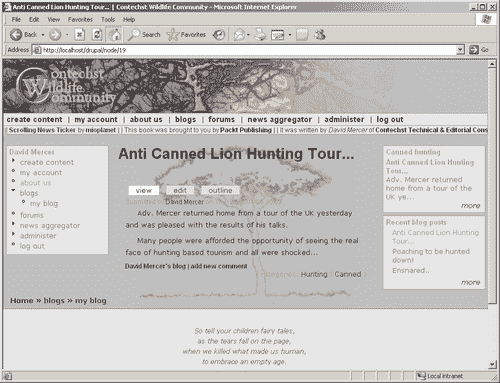

令人遗憾的是，即使这个社区网站非常受欢迎，我们仍然需要从中赚钱来支付有人管理或监督它的成本。我们如何在不向会员收费的情况下做到这一点呢？对于拥有大型关联社区的大多数网站来说，有两种方法可供选择：捐赠和广告。因此，CWC 将利用一些第三方软件和可下载模块来筹集资金。

CWC 旨在展示 Drupal 的大部分默认行为，您将很快看到以下功能将从默认发行版中启用：

+   **博客：** 博客，或网络日志，几乎就像一本日记，由一个人维护。在演示网站的情况下，将有一群博客作者定期在网站上发布帖子，以便让公众了解他们在特定关注领域的动向和发展。

+   **书籍：** 广泛的用户可以使用几乎任何类型的内容创建书籍。民意调查、页面、网络日志和其他内容都可以轻松添加到书籍中。这是 Drupal 的一个非常有趣的功能，因为它允许创建一本真正独特的在线书籍，利用基于网络的动态内容的力量，为您的故事带来超现代的感觉。

+   **评论：** 在任何社区中，人们都会感到有必要对感兴趣的话题进行评论。正因为如此，Drupal 的评论功能允许用户在他们喜欢的任何内容后面添加或附加评论（取决于管理员设置的权限）。实际上，论坛是基于评论的使用，这些评论被添加到网站上已发布的特定论坛主题中。

+   **论坛：** 论坛是讨论和表达观点的媒介。在演示网站的情况下，将设置各种不同的论坛，为用户提供一个讨论重要主题和互动的区域。正如您将看到的，如果您愿意，您将能够非常容易地控制论坛的内容——实际上，Drupal 允许您检查试图进入您网站的任何和所有内容。

+   **地区设置：** 这允许您以多种不同的语言展示您的网站，以创建一个真正国际化的网站。事实上，Drupal 更进一步，允许单个用户选择他们偏好的语言，以便在登录时自动以该语言查看。

+   **投票：** 投票内容类型允许管理员（或拥有足够权限的任何人）创建一个包含问题以及几个选项的内容类型，投票用户可以从中选择他们偏好的答案。这是一个收集各种信息的有用工具，从您用户希望看到您网站上的哪些功能，到人们是否相信在其他星球上存在生命等。

实际上还有许多其他功能将被利用，以便使我们的网站完全运行，但我们不需要在这里详细说明它们，因为其中一些相对简单，而其他一些将在本书后面的部分详细解释。请相信我，还有很多工作要做！

从前面的列表中您可以知道，Drupal 管理员已经有一套强大的功能可用，我们实际上将探讨如何启用、修改和使用所有这些功能以及更多，在适当的时候。

我们不仅限于使用 Drupal 默认提供的功能。Drupal 被设计成让除了开发者之外的人也能轻松地通过更多功能来增强它。Drupal 的模块化设计意味着创建全新的功能通常只需要将几个文件复制到您的 Drupal 文件夹中——尽管，诚然，这可能更复杂，我们还将探讨需要修改数据库等修改的贡献。

CWC 将利用包括但不限于以下一系列贡献模块：

+   **分类访问权限：** 允许管理员对谁可以做什么以及可以在哪种类型的内容上操作进行非常细致的控制。正如您稍后将会看到的，将会有一些用户需要他们的帮助来管理论坛，但他们不应拥有任何其他广泛的权力。使用这个贡献使得根据您希望他们处理的内容类型为任何用户概述权限变得容易。

+   **Flexinode：** 为管理员提供创建自定义内容类型的能力。如果存在无法使用标准内容类型（如页面或博客）轻松满足的特定需求，这将特别有用。

+   **广告服务：** 允许管理员整合来自谷歌的广告。通过这种方式，您网站上的流量可以被引导到相关网站，以获得一小笔报酬。如果您网站上的流量足够多，那么这些小额报酬可以累积起来，为您提供一个不错的收入来源。

我们不仅满足于简单地利用各种模块来增加网站的功能，还会通过确保使用 Drupal 提供的分类系统合理地构建网站内容来“亲自动手”。我们还将探讨如何使用第三方脚本甚至 AJAX 为网站添加一些动态内容。

# Drupal 社区

在接下来的几天、几周、几个月和几年中，你将需要的重要资源之一是 Drupal 在线社区。与其他有时因缺乏连贯和深入的支撑结构而受到批评的开源项目不同，你会发现 Drupal 做得非常好，而且相当容易学习。有众多类别，从信息、投票、论坛和新闻到支持，都可以在主页上找到：[`drupal.org`](http://drupal.org)。

### 注意

在本书的其余部分，我们将假设你已经花了一些时间熟悉网站的工作方式。

强烈建议你定期使用[drupal.org](http://drupal.org)，并不断使用不同的元素和部分，以便熟练地提取你运行企业所需的信息和软件——特别是由于 Drupal 网站会不时发生变化！正因为如此，你也可能注意到这本书与 Drupal 本身之间有一些细微的差异。

网站中包含的所有信息都组织得很好，并且可以从页面顶部的**主导航栏**轻松访问，如下所示：

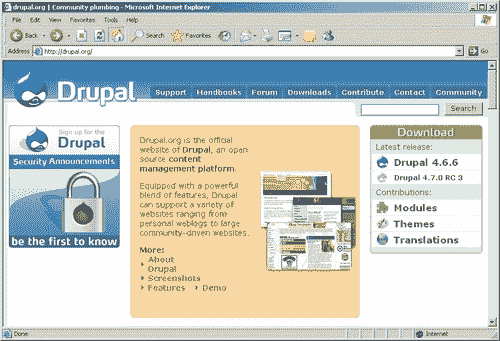

导航栏中的每个标签页都有自己的链接和页面，尽管有些类别包含相互关联的主题。你应该注意，当我们在这本书中提到**社区**时，我们是在谈论整个 Drupal 社区，包括所有支持结构、开发者、用户等等——不要与首页上的**社区**标签混淆，它更多地指的是世界各地的不同 Drupal 社区（稍后将有更多讨论）。

无论如何，让我们快速浏览每一个，看看它们能提供什么。

## 支持

首先，**支持**部分可以被视为一种万能页面，实际上包含了许多链接到各种其他社区页面，其中许多页面也可以通过主导航栏中的标签打开。例如，如果你需要查找有关 Drupal 的一些基本信息，可以从**在线文档**部分导航到**Drupal 手册**（稍后讨论），如下所示：

简而言之，在本节中：

+   在**在线文档**部分提供了文档和帮助设施，包括一些常见问题的帮助以及安装和一般信息。

+   在**安全**部分提供了链接到安全警告和公告，以及订阅安全公告邮件列表或 RSS 源的选择。

+   在**论坛和支持**部分提供了链接，以防你需要帮助，以及存档和**发布到 Drupal 论坛的技巧链接**。

+   如果你不是英语语言使用者，或者你的社区主要使用其他语言，那么查看**其他语言**部分下的其他语言网站是值得的，其中包括德语、法语、西班牙语和南非荷兰语。

+   在**专业服务和托管**部分提供了与 Drupal 相关的多种专业服务的链接，包括托管和咨询。

+   可以通过访问**错误报告**部分提交错误报告。请注意，在提交自己的报告之前，你应该始终检查是否已经报告了该错误。任何提交都会因为有人需要检查而消耗人力，如果每个人都反复报告相同的错误，时间浪费可能会很大。

+   **功能请求**部分给你提供了一个查看其他人希望集成到 Drupal 中的功能的机会，如下所示：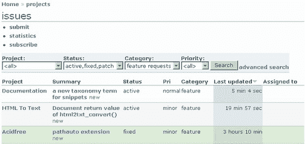

    当然，你也可以提交自己的请求。

+   还有一个有趣的选项，可以通过**IRC 频道**获得支持。IRC，或称互联网中继聊天，允许在互联网上进行实时、文本讨论。加入这样的群体显然是一个巨大的优势，因为它立即让你能够接触到许多其他 Drupal 用户。

+   有一个你可以加入的**邮件列表**部分，一个**开发者支持**部分，以及一个在**Drupal.org 问题**部分下提出关于实际 Drupal 网站问题的论坛。最近，还增加了一个名为**关于 Drupal 的书籍**的新部分。

如果不确定去哪里，**支持**页面可能是你应该开始的地方。然而，通常情况下，你会有一个相当明确的需求，并且可以直接前往。

## 手册

这个部分是一个信息丰富的宝库，满足各种不同的需求。内容被收集到五个主要部分，如下所示：

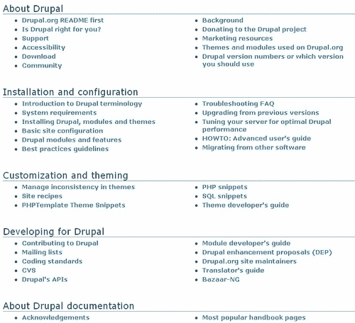

每个这些类别都包含一系列链接到信息页面（这些页面通常还包含到其他页面的链接），它们很好地解释了各自的主题。值得注意的是，在这些页面的左侧出现了一个块，其中包含链接到同一类别标题下的相关主题，以便你轻松地浏览信息。以下截图显示了**Drupal 适合你吗？**页面：

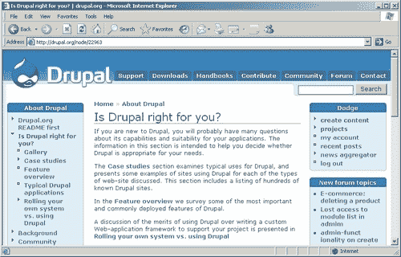

建议您在继续阅读下一章之前至少浏览一下第一部分，以便尽可能多地了解 Drupal。同时使用这些手册与本书结合使用也是一个好主意，这样您就可以将在这里获得的实用建议和经验与网站上提供的参考型材料相补充。

## 论坛

论坛可能是您解决单个最大问题的资源和信息资产。与其他网站上的信息类型（除 Freenode Drupal IRC 外）相比，这些信息大多是静态的、书面答案或指南，而论坛为您提供了一个互动环境，您可以在这里学习和扩展您的知识。当然，它们也为您提供了一个分享您所学内容的平台。

在撰写本文时，仅支持相关的帖子就有大约 100,000 篇。这应该能给您一个很好的印象，这些论坛是多么广泛地被使用。以下截图显示了**论坛**主页以及前几个论坛类别。从大量的帖子中可以看出，这已经是一个相当大的知识库，希望您能抽出时间自己添加内容。

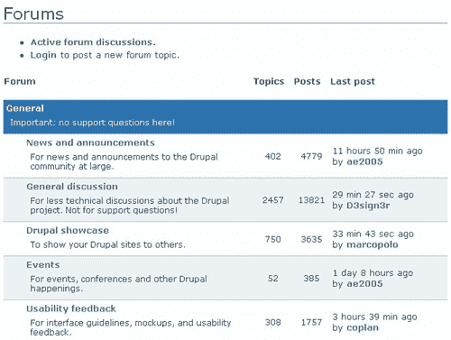

观察整个页面，有三个主要的论坛类别——**通用、支持和开发**——它们各自有多个子类别，使得导航结构相对容易。您还会注意到，在页面的右侧有一个包含最新帖子列表的块。此外，您还可以使用位于页面右上角的搜索工具，或通过[`drupal.org/search/node`](http://drupal.org/search/node)来搜索相关信息或用户。

最后，假设您是注册（并已登录）的 Drupal 用户，您还可以使用页面主标题下给出的链接来在论坛中发布新主题，如下所示：

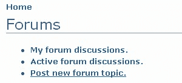

在您开始发布大量问题和问候语之前，请务必了解使用这些论坛的某些礼仪，并且应始终遵循。在您开始在该网站上发布任何帖子之前，请先查看以下页面：[`drupal.org/forum-posting`](http://drupal.org/forum-posting)。简要总结如下：

+   确保您已经搜索了论坛中类似的主题。使用这些帖子而不是创建重复的信息。

+   请确保您的论坛帖子标题具有信息性和意义。

+   确保在您的支持查询中提交足够多的系统特定信息——例如，提及您正在使用的 Drupal 版本以及数据库和数据库版本。

+   请记住，并不是所有使用论坛的人都是英语母语者；因此，即使并非有意为之，某些帖子也可能被视为粗鲁或唐突。

+   保持礼貌和理性——即使您对某个特定问题感到沮丧。

+   捐赠一些时间来回复和帮助其他发帖者。

+   如果您愿意，启用您的联系标签，以便人们可以通过电子邮件提供支持。您可以通过编辑您的联系信息来完成此操作，如下所示：

一些读者可能已经注意到了上一张截图中的标题为**活跃论坛讨论**的链接。点击此链接会弹出一个列表，显示最近有帖子的话题，如下所示：

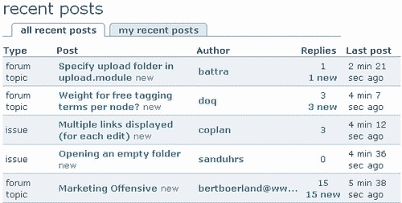

如果您想查看您个人参与讨论的讨论，请点击**我的论坛讨论**链接。

## 下载

在我们开始为您的网站开发设置一切之前，我们将在下一章再次访问这个部分。然而，在我们到达那里之前，有几个有趣的观点需要注意。首先，您需要非常小心地选择您下载的 Drupal 版本，或者确实的模块和主题，因为每个后续版本都会在之前版本的基础上进行更改和改进，但有时也会破坏与其他功能的兼容性。

例如，您可以从以下屏幕截图看到，下载页面为我们提供了一些关于 PHP 兼容性的有趣信息：

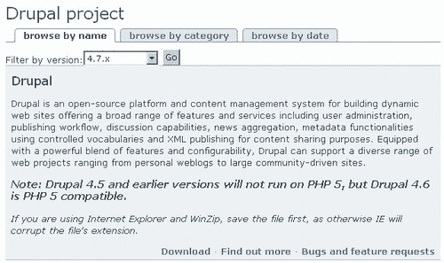

正如您所看到的，Drupal 4.5 无法与 PHP 5 兼容。现在，这本身并不是什么大问题，因为您的托管服务很可能在一段时间内仍然使用 PHP 4。然而，在某个阶段，大多数服务提供商将升级到 PHP 5 支持，因为 PHP 5 比其前身要复杂得多。了解这一点后，您可能会立即说这不会让我们担心，因为 Drupal 4.6（以及 4.7）都是可用的。

这完全正确，但如果您决定添加一个模块（我指的是在某个阶段您*将*想要添加一个模块），那么查看[`drupal.org/project`](http://drupal.org/project)的项目页面，或者点击**下载**标签会得到：

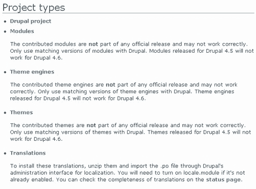

您可以从此页面上提供的说明中看到，如果您偶然需要为 Drupal 4.5 开发的模块，并且您正在使用 4.6 版本，那么您很快就会体验到不小的挫败感——这一点在此时期尤其有效，因为 4.7 是全新的，因此许多模块尚未更新。

这种问题可能发生，因为模块是独立于核心开发的，这意味着保持与主开发团队任何变化的同步取决于单个模块开发者。

自然地，并不是每个人都会及时更新模块，因为这些开发者通常没有报酬，也没有义务完成这项工作。他们只是在能够提供时，提供他们能提供的最佳代码，我们显然应该为此感到感激。

关于如何使用下载页面，值得注意的是，每个可下载项目框的右下角都提供了三个链接。这些是**下载**、**了解更多**和**错误和功能请求**。显然，第一个选项相当直观，但在下载任何内容之前，你应该始终查看**了解更多**选项，以确保你得到你确切想要的东西。

例如，**Acidfree**项目的**了解更多**页面包含了关于**已知限制**、**更新历史**以及大量关于**发布、资源、支持**和**开发**的材料——如果你一开始不确定 Acidfree 能做什么，这些信息非常有用。

除了这些，本节的目的在于，在开始下载一切之前，你应该仔细思考你想要从你的网站上得到什么。在下一章中，我们将把理论付诸实践，并利用这一部分来获取 Drupal 的副本。

## 贡献

初看可能会觉得，在你学习软件的过程中，你几乎无法对 Drupal 社区做出有意义的贡献。虽然这并不完全正确，但了解我们有什么可以利用的东西是值得的：

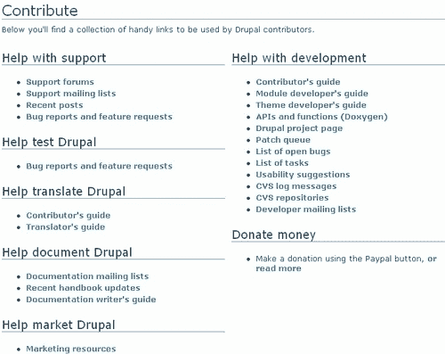

首先，支持 Drupal 最简单的方式是通过捐款——我几乎能听到你阅读这段话时的叹息和呻吟，但请记住，你得到的是绝对免费的。你还可以通过撰写评论、在你的网站上整合 Druplicon 等方式帮助推广 Drupal。此外，总有需要人们帮助测试、翻译、支持和记录 Drupal 的需求。

最后，一旦你积累了一些经验并感到自信，你就可以开始考虑帮助 Drupal 的开发工作了。无论你选择做什么，你都会发现，为了在社区中变得积极主动，你需要的信息或帮助在**贡献**部分都可以轻松找到。

## 联系与社区

这两个部分相当直观，所以我将它们合并在一起。**联系**页面只是允许你向 Drupal 团队发送电子邮件，你需要记住，这里不会解决任何技术支持查询——你必须使用支持论坛。只需确保从提供的下拉列表中选择最相关的类别，然后就可以开始了。这里有一个示例：

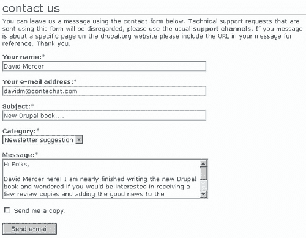

这很简单！接下来是**社区**页面，你可以看到，这为你提供了访问各种国际 Drupal 社区以及一些你可能感兴趣的聚合资源和标签服务：

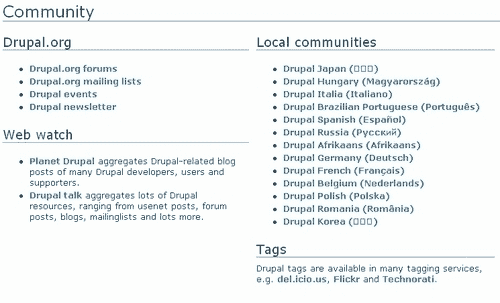

顺便说一句，标签服务只是将各种关键词关联到一系列页面上。这使得根据用户定义的分类查找内容变得容易——这样做也非常灵活，因为你不再需要将内容限制在预定义的分类中。你可以在 del.icio.us 网站上找到有关标签和标签化的更多信息：[`del.icio.us/help/tags`](http://del.icio.us/help/tags)。

关于 Drupal 社区的介绍就到这里。你应该对自己能够高效地使用该网站并能在需要时找到帮助感到相当自信。然而，在我们继续下一章之前，还有一个重要的问题需要讨论……

# Drupal 许可证

自然地，你应当了解在使用他人开发的软件时，你所承担的所有法律义务和责任。为此，你会发现，当你下载 Drupal 的副本时，它将包含一个供你阅读的许可证文件——实际上，这是许可证的一部分，要求包含此副本。

如果你像我一样，面对阅读许可证和其他法律文件的前景时可能会觉得难以保持清醒。因此，为了避免让你逐字逐句地复述整个许可证，我将提供一种释义版本，旨在向你提供关于许可证意图的精髓，特别是它如何适用于 Drupal。

### 注意

请记住，我这里所说的绝对不是一份法律文件。如果你希望遵循法律条文，**你必须**亲自阅读整个许可证。

虽然听起来可能有些奇怪，但使用 GNU GPL（通用公共许可证）的一个基本原因是为了保护和帮助你——使用软件的人们。GPL 在本质上与专有软件的许可证不同，后者在很大程度上是为了保护开发和创建软件的企业的权利。

顺便提一下，GPL 并非专门与 Drupal 相关联；相反，Drupal 使用了 GPL，这是一种用于分发开源软件的通用许可证。你可以查看 GNU 主页以获取有关这一运动的更多信息：[`www.gnu.org/home.html`](http://www.gnu.org/home.html)。

事物运作的方式是，软件首先被版权保护，然后允许每个人自由使用。一开始这可能会让你觉得有点奇怪，因为**如果你只是让任何人都可以使用它，那么版权保护的意义在哪里呢**？这样做的原因是，版权保护和软件许可赋予开发者权力，要求使用该软件的人（无论是否进行了修改）向他们分发的每个人提供与原始软件相同的权利。

这意味着，实际上，任何使用此软件的人都不能从中创建专有软件。所以，如果你决定自己构建并改进 Drupal 以将其作为自己的产品出售，那么你将受到相同的条款约束，并将不得不向任何要求的人发布你的源代码。但请记住，GPL 的目标不是通过强迫你以 GPL 的形式发布它来获取你自己的工作的信用。如果你已经开发出可以识别的程序或代码，这些程序或代码完全是你的，并且独立于提供的原始源代码，那么 GPL 不一定适用于你的工作。

许可证中的一些主要要点总结如下：

+   你可以自由地复制受 GPL 保护的软件以及以你认为合适的方式分发这些副本。最重要的事情是确保你不移除许可证。

+   你可以修改源代码并创建你想要的任何类型的派生产品。再次强调，你必须传递相同的许可证（正如你收到的），但这次你必须确保你也非常清楚地说明你所做的更改。（这是为了在你引入可能破坏互联网的病毒的情况下保护原始程序员。）

+   你在任何阶段都不得违反 GPL 的条款，否则你会发现你当前使用该软件的许可证将被终止。

+   你不必接受许可证的条件。（你可以从你不需要签署任何东西这一事实中看出这一点。）然而，如果你不接受许可证的条款，你就不能使用该软件。

+   如果你决定自行重新分发软件，那么你不能添加任何限制或以任何方式修改许可证。你也不必确保你分发的软件的各方遵守它。

+   如果你被法院判决（或任何其他法律程序）强制执行不符合 GPL 要求的条件，那么你根本不能分发该软件。

+   注意与软件一起分发的许可证版本。如果存在一个版本，那么你必须使用该版本或更高版本，但不能使用更早的版本。

+   该软件没有任何保修，根据 GPL 修改或分发软件的任何人不对任何事负责——特别是损害或无法运行等问题。

最后，如果你只是打算用 Drupal 来构建网站，你真正需要知道的是，它在价格上和谁可以访问其源代码方面都是免费的。你们中的悲观主义者可能会说：*这听起来像是一堆废话。你甚至不能提供保修或保证软件会工作，因为没有人有钱支付真正的开发费用*。好吧，你不必担心这一点。开源软件正是世界上最优秀、最可靠的软件之一，正是因为世界上每个人都可以看到代码并对其进行改进。

你唯一需要担心 GPL 精细之处的时候，就是当你决定设立一家企业，用金钱来安装、配置和定制 Drupal 网站，或者修改和重新分发原始源代码的时候。

# 摘要

本章既为 Drupal 世界提供了一个介绍，也是本书其余部分的一个背景。这里讨论了几个重要的事情，这些事情在你发展技能和知识的过程中将扮演重要的角色。

毫无疑问，成为一名成功的 Drupal 管理员最重要的方面之一是能够高效地利用社区。到现在为止，你应该已经在 Drupal 网站上注册，并且粗略地浏览了大部分内容。随着时间的推移，你可能会与其他成员建立关系，并最终成为整个社区的一大财富。

此外，本章花了一些时间来查看将在本书其余部分构建的演示网站。这表明，即使在入门级别，我们也能创建一个极其强大的基于网络的程序，可以用来驱动整个社区——而且根本不需要学习任何编程。这并不是说没有工作要做——毫无疑问，你发现研究和决定你的网站需要什么相当乏味。但请记住，你现在投入的任何背景工作都将带来回报；所以这绝对值得。

在介绍性材料完成之后，现在是时候开始着手工作了，下一章我们将设置开发环境以及获取和安装 Drupal 的最新版本。
