# 第三章。基础知识 I：网站配置

当人们刚开始接触时最常陷入的陷阱是，他们假设*基础知识*很容易掌握，因此不需要太多思考。在现实中事情并不那么简单明了，因为虽然你的网站基本设置通常很容易实施，但更微妙的问题在于知道*你想要实现什么*，以及*你最初想要如何实现它*。发现你需要从你的网站中获得什么对于这个原因尤为重要，这也是为什么我们在第一章一开始就讨论了它。

*这意味着你只有在确切知道你想要什么的情况下才开始直接在网站上工作吗？* 并非如此；就像大多数事情一样，在开始开发 Drupal 网站时，这是一个权衡。这是因为在你使用了一段时间之后，几乎不可能确切地知道你的网站需要什么，以及其功能应该如何提供。通常，你会发现自己根据用户的反馈修改网站的行为。

总之，为了使事情顺利进行，我们需要讨论以下 Drupal 网站配置主题：

+   通用设置

+   错误处理

+   缓存和文件系统设置

+   RSS 源设置

+   日期设置

+   网站维护

+   字符串处理

假设你已经密切关注了你想要你的网站如何运行，以及你如何设想它的使用方式，那么一旦你的基本设置完成，你应该会发现你需要做出的更改数量保持在最低。但记住，Drupal 中的更改相对容易实施。如果你需要根据用户反馈或网站的一般更改回过头来更改东西，请不要担心。

# 在我们开始之前

在我们动手之前，记下一些重要的事情是有道理的。例如，你应该养成检查在 Drupal 中更改设置如何影响网站的习惯。了解哪个设置做什么以及它如何改变网站的行为，实际上是本章的目标，虽然我们不会对每个小细节都进行详尽的介绍，但你会看到足够的，以对你网站的一般配置有信心。

本章中我们处理的设置实际上只以最广泛的意义影响网站，因为它们修改了其默认行为——比如显示什么错误页面，或者你的网站将使用什么返回电子邮件地址。对于特定关注领域的更复杂或更具体的设置，例如输入格式、访问权限或模块激活，将在接下来的章节中更详细地讨论。

话虽如此，这里的一些主题可能并不适用于你此刻的需求。例如，你可能不太想一开始就处理 RSS 订阅（尽管你可能在稍后想要处理它们）。如果你觉得某些部分对你当前没有直接价值，请随意跳过，因为当你需要时，你总是可以回过头来查看。

此外，有些人可能对不得不逐个设置以获得理想效果的前景感到沮丧。当然，创建一个闪亮的新主题可能会更有趣，但花时间查看并尝试所有可用的设置是成为一名合格 Drupal 管理员的重要步骤。这不仅会教会你如何完成任务，还会让你了解实际上可以完成的事情。相信我，像 Drupal 这样灵活强大的软件，提供的选项多得令人惊讶。

*那么我们将精确地查看什么？* 如果你以管理员身份登录，并导航到**管理**，然后**设置**，你应该会看到如下页面：

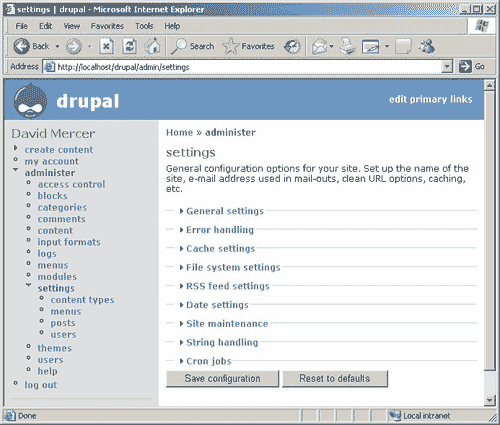

如你所见，这里有大量的选项可供处理（从页面上呈现的链接数量就可以看出），在本章中，我们将从页面右侧提供的链接开始逐一介绍。在整个书籍过程中，我们将涵盖**管理**主菜单链接下的每一个项目。

一些读者可能已经意识到，尽管在设置页面中如上图所示 cron 作业确实存在，但它们并未在引言中提及，本章节也没有涵盖。原因是处理 cron 作业或计划任务更多的是一个网站管理任务，而不是专门针对 Drupal 的任务。因此，关于 cron 作业的所有必要信息都包含在第十章的“运行您的网站”部分中。

现在，我们并不总是能够按顺序讨论每个设置，因为通常 Drupal 需要我们在几个不同的地方进行设置，以便实现某些更改。然而，一旦我们走过了整个菜单，并且你对如何工作更加熟悉，这一切都会显得不那么令人畏惧。

# 常规设置

此页面包含了一系列设置，其中一些相当直观，而其他一些则需要我们仔细思考我们需要做什么。首先，我们看到了几个文本框，它们控制着诸如站点名称、使命宣言等事项。对于演示站点，前六个选项的设置如下：

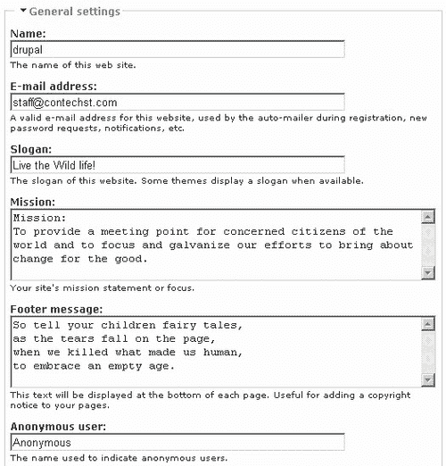

表面上看，我们在这里已经做得差不多了。这些设置并不复杂，我们可以继续进行下一批设置；或者我们应该先检查一下？重要的是要记住，在我们继续之前，总是明智的做法是使用网站来确保所做的任何修改都达到了预期的效果。

保存上述更改后，演示网站现在看起来是这样的：

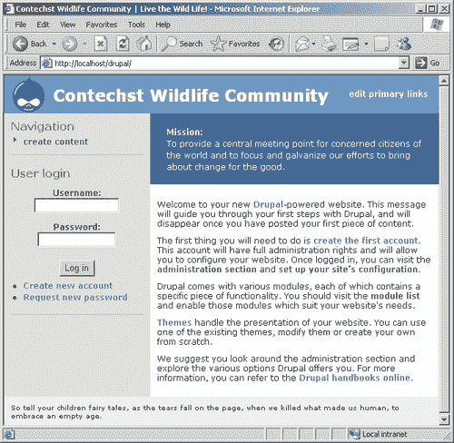

嗯，这并不理想！首先，我们似乎完全丢失了我们的标语，我们在**页脚信息**部分添加的强有力的诗歌也没有按照我们想要的格式显示。发生了什么事？正如你所见，事情并不总是像看起来那么简单。标语没有显示的原因是某些主题根本不显示标语（或者默认情况下禁用了标语），页脚没有以诗歌格式出现的原因是因为我们没有告诉 Drupal 将其格式化为这种格式。

哎呀，看起来我们已经遇到了一些问题，凭借我们手头的这些信息，这些问题并不能轻易解决。这里的答案是保持耐心，等待我们详细处理了各种其他配置设置和主题之后，这将帮助我们更好地理解如何以更高级的复杂度修改网站的真正展示。

这并不意味着我们没有任何技巧。记住，如果你将 HTML（超文本标记语言）输入到文本框中，Drupal 会对其进行格式化。所以，如果我们不是输入原始的**页脚信息**文本，而是输入如下内容：

```php
<p align="center"><i>
So tell your children fairy tales,<br />
as the tears fall on the page,<br />
when we killed what made us human,<br />
to embrace an empty age.
</i></p>

```

页脚信息将在网站上显示如下：


这对我们的目的来说更加合适，因为文本既是诗歌，也是一首名为《消失》的诗的引用（因此使用了斜体）。

对于一些人来说，这可能会带来一些问题，因为你对 HTML 不熟悉。如果你在这个阶段对 HTML 知之甚少，那么在你继续之前，自学一点 HTML 可能是有益的——如果是这样，请跳转到第七章中的*HTML、PHP 和内容发布*部分，了解更多相关信息。

继续前进，我们看到我们还有为匿名用户定义名称的选项。目前这样很好，但如果你有充分的理由想要更改，请随意更改。这唯一会改变的是，将发帖的信用名称从**匿名**更改为你设置的名称（假设你允许匿名用户在网站上发布任何内容）。在我们进入对这些设置的说明之前，让我们先看看这一节中剩余的设置：

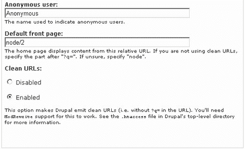

如你所见，我们已经将**默认主页**更改为**node/2**。*但改变这个设置会做什么呢？* 好吧，让我们假设有一个你希望作为网站默认页面的内容页面——在任何人查看其他内容之前。例如，如果你想显示某种促销信息或介绍页面，你可以通过这个设置告诉 Drupal 显示它。在这种情况下，第二个节点已被指定为默认主页——记住，你必须首先创建这个帖子的内容，然后确定其 ID，然后才能告诉 Drupal 使用它。

可能最好暂时保持原样，直到我们讨论了如何添加内容。如果你急于将内容发布到网站上，只需使用菜单顶部的**创建内容**链接并遵循那里的说明。你应该能够相当容易地使内容上线。然而，与本节相关的内容的重要之处在于，你需要知道你想要指定为默认主页的节点的 ID。

如果你记住以下几点，这会变得简单：

### 注意

无论何时编辑内容，正在编辑的节点的 ID 都会出现在 URL 中。

我们还没有完成，因为你可以根据需要指定几个选项。在这种情况下，具有身份编号`2`的特定节点已被选择，但如果你更喜欢你的网站博客显示，你可以用**blog**替换**node/2**（以 node/ID 格式），默认情况下将显示博客列表。

确定你想要显示的前页的确切方式是实际浏览你网站上想要访问的页面。这可能是你博客页面，你的聚合新闻源（本书后面会详细介绍源），或者任何其他页面。一旦你看到了你想要的内容，就注意记录下**相对 URL 路径**，然后简单地将其输入到提供的文本框中。

相对 URL 路径是页面地址中标准域名之后的部分，该域名由整个网站共享。例如，在这种情况下，设置`node/2`是有效的，因为 Drupal 将这个相对路径映射到：

```php
http://localhost/drupal/node/2

```

这个地址的第一部分`http://localhost/drupal/`是**基本 URL**（回想一下，你在上一章配置 Drupal 时指定了它），之后的一切都是相对 URL 路径。

然而，在继续之前，请确保一切都能正常工作。设置文件路径有时可能很痛苦，因为很容易出错，在这里或那里添加错误的斜杠——如果你像我一样的话。

你也可以通过简单地输入正确的相对 URL 路径以及类别的 ID 号来按类别显示内容——这需要我们在本节有用之前学习如何处理类别，所以它被留作练习。目前，网站的默认页面看起来是这样的：

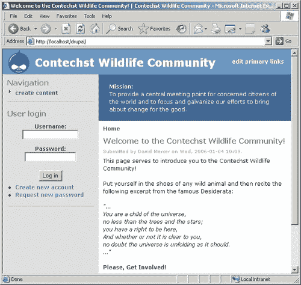

到目前为止一切顺利，但最终的设置意味着什么呢？你们中的许多人可能已经注意到，每次您向 Drupal 发出请求时，您被带到页面的 URL 看起来像这样：

```php
http://localhost/drupal/?q=node/add

```

这是 Drupal 中 URL 的默认形式，这很不幸，因为显然`?q=`并不吸引人。更糟糕的是，它可能会干扰搜索引擎对您网站的索引。因此，您可以通过启用**清洁 URL**选项来从 URL 中删除它。为了使这生效，您必须启用 Apache 的`mod_rewrite`模块（这可以在您的 Apache 安装中的`httpd.conf`文件中设置）。如果您已经安装了 Apache2Triad，那么这应该已经完成，但当您将网站部署到您的实时主机时，您必须确保他们也已启用，否则您将不得不禁用**清洁 URL**。

# 错误处理

本节允许您广泛处理可能出现的错误问题（希望不会太频繁）。特别是，您可能希望创建几个定制的错误页面，以便在出现*页面未找到或访问被拒绝*问题时显示给您的用户。请记住，已经有一些相当简洁的页面，这些页面是默认提供的，但如果您希望进行任何更改，那么过程与上一节中定义网站默认页面的过程相同。创建将要显示的内容——以下是一个*页面未找到*错误的示例：

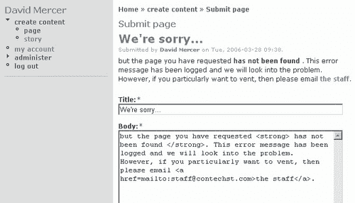

现在，我们只需通过点击**提交**来确定这篇帖子的唯一 ID，然后查看下一页地址栏中显示的 URL——在这种情况下，页面的 ID 是 5。为*访问被拒绝*错误创建一个类似的页面，并为 Drupal 提供其 ID，就完成了错误页面的处理。所以每当出现问题，用户都会收到一条友好消息，并有机会直接给工作人员发邮件。

请记住，虽然我们将在第六章和第七章中详细讲解添加、删除和操作内容，但您可能会发现，在当前阶段了解您可以通过在内容添加页面上的此下拉列表中选择**输入格式**来选择**输入格式**是有用的（如果您需要使用您的帖子进行一些相当高级的操作）：

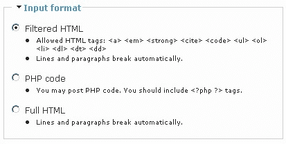

如您所见，我选择了默认的**过滤 HTML**选项，允许我输入一些 HTML 代码，但不能输入 PHP 代码。“他们为什么会有这么多选项？”您可能会问。我们将在稍后详细讨论这样做的原因。现在，除非您有特定的需要添加 PHP 代码或 HTML 标签（否则不允许），否则最好坚持使用**过滤 HTML**。

下一个选项，**错误报告**，允许你决定是否将错误写入屏幕以及错误日志。当你忙于构建网站时，你可能会发现选择**将错误写入日志和屏幕**很有用，这样你可以确定出了什么问题以及何时出现问题。然而，一旦到了上线的时间，你应该将其更改为**将错误写入日志**（在下拉列表中可见），因为你不希望每个人都能够阅读系统的各种错误，因为这可能会向恶意用户泄露信息，他们可能会利用这些信息对你的网站进行攻击。

**错误处理**部分现在看起来像这样：

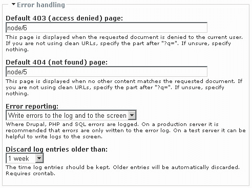

屏幕截图显示的最后一个选项允许你决定保留登录消息的时间长度。在做出这个选择时，你可能需要边走边摸索，因为这实际上取决于你有多忙，以及网站有多忙。如果有疑问，请将其保留为默认设置，因为这是一个普遍合理的选项。

你需要使用 crontab 来强制执行此设置，如果此时提到 cron 作业使事情变得模糊不清，那么理解以下内容很重要：

### 备注

Cron 作业（在 Windows 上，这些被称为计划任务）只是根据你设置的运行频率在特定时间运行的命令批处理。crontab 允许你指定各种作业以及它们执行的间隔。

一旦你需要处理控制你 Drupal 网站上所有 cron 相关任务的`cron.php`脚本，就转到第十章中的**cron 和计划任务**部分第十章。

一旦你确认已经适当地设置了 cron 作业，你就可以确信你的自动化任务将由 cron 脚本处理。除此之外，让我们来看看这个部分的新设置是如何实际应用的。例如，我尝试访问一个不存在的页面。正如预期的那样，以下友好的信息出现了：


需要注意的一个重要点是，你应该记得定期检查日志，作为你确保网站平稳运行的整体策略的一部分。错误信息、警告等实际上是对网站操作的窗口，并且是不可或缺的工具。

为了查看你的日志，只需在**管理**菜单项下点击**日志**，你将看到你网站上发生的所有事件的列表。你可以通过在**按消息类型筛选**标题下的下拉列表中选择一个选项来筛选这些事件，然后点击**筛选**。如果你想查看任何错误报告的详细信息，只需点击**消息**列下找到的链接，日志报告的详细信息将像这样显示：

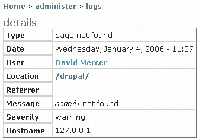

这就完成了当前的错误处理。当然，重要的是要认识到这种类型的错误处理并不处理可能存在于你网站实际源代码或文件系统中的错误或缺陷。换句话说，这种类型的*错误处理*不应与应用程序中的*缺陷*混淆，它只是用来处理与提供页面相关的网站功能。如果你在系统中遇到缺陷，你需要尝试修复问题，如果失败，你可以寻求 Drupal 社区的帮助。

# 缓存和文件系统设置

缓存是一个存储位置，其中可以存储网页以便服务器快速访问，而无需每次都从头开始构建。显然，如果网站提供需要每次都进行大量数据检索的页面，这可以显著加快网站的速度。问题是缓存页面提供的是页面的旧版本，而不是最新版本。如果你正在处理偶尔才更改一次的页面，这没问题，但如果用户每次请求页面时都希望看到最新版本，那么你不应该使用缓存。

*那么我们什么时候不需要缓存呢？* 首先，在你构建网站的过程中，没有必要使用缓存，因为你设置过程中所做的任何更改可能需要等到缓存刷新后才会显示——当你期待更改在页面上体现时，这可能会导致相当多的困惑。因此，你实际上只应该在网站准备上线之前启用页面缓存，以测试其是否正确工作。

**缓存设置**部分的第二个设置，**最小缓存生存期**，决定了 Drupal 在缓存中保留页面多长时间。这实际上取决于你内容的特点，你应该能够根据内容更改的速度以及使用频率来决定对你网站最好的设置。如果你将缓存设置为每分钟刷新一次，那么你可以确信你网站上所有内容最多只有一分钟的历史，因为每次调用后页面都会每分钟刷新一次。设置为一天意味着内容可能已经一天没有更新了。缓存保留时间越长，网站的性能越好，但内容就越陈旧。显然，对于注册用户或网站管理员来说，能够查看每个页面的最新版本是很重要的，所以：

### 注意

只有由*匿名*用户访问的页面才会被缓存！

你如何处理文件系统设置实际上取决于你打算用你的网站展示哪种类型的内容。建议你立即将**下载方法**设置为**私有**，这样你就可以从一开始就正确控制文件下载。如果你知道所有文件都将始终可供任何人下载，那么就保持原样。

假设你确实想要使你的下载方法私密，那么你需要将`files`目录从文档根目录移出，以便它不能直接通过 Web 访问。如果你这样做，你需要输入该文件夹的**完全限定**文件路径，而不是**相对**路径，否则 Drupal 会尝试在正常位置找到它。例如，在演示网站的开发机器上，选择了**私有下载方法**后，输入了以下文件路径：

```php
C:\apache2triad\files

```

此外，确保设置的`temp`目录是合理的，在演示网站上，它是`C:\apache2triad\temp`。

在我们继续之前，我们应该确保我们可以无任何问题地将文件上传到网站上。为了做到这一点，前往**管理**下的**模块**部分，启用**上传**选项（位于模块列表底部），然后点击**保存配置**。现在当你尝试**创建内容**时，你会看到一个与实际内容相对应的以下**文件附件**选项：

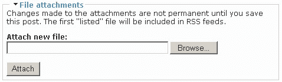

文件上传完成后，你会看到如下确认信息：

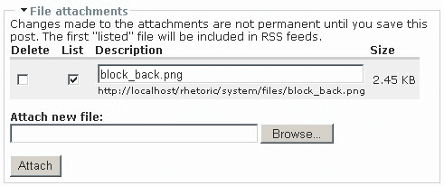

在上一幅图中**文件附件**下方显示的新表格有四列：

+   **删除**，它为你提供了从帖子中删除附件的选项

+   **列表**，它列出了上传的附件文件

+   **描述**，这是文件的名字

+   **大小**，这是上传文件的大小

在这种情况下，上传的文件是一个图像，大小为 2.45KB。如果你是为了在页面中显示文件而附加文件，你需要确保它们相对较小。顺便说一下，如果你选择列出你的附件，通过选择**列表**选项，那么它将像下面这样出现在帖子中：

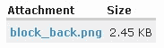

用户可以简单地点击链接来上传文件。显然，如果你是将文件附加到你的帖子中以便在页面内显示，那么你可能想要禁用**列表**选项。有关文件附件的更多信息，请参阅第七章，它涉及**高级内容**。

# RSS 订阅源设置

在未来的某个时候，你可能希望利用网络上可用的众多 RSS 订阅源。当这个时刻到来时，你将需要做出一些选择，关于这些订阅源如何在你的网站上呈现。本节中提供的选项允许你控制每页显示多少个订阅源，以及你是否想只显示标题、标题加摘要，还是显示整个订阅源。这些选项相当直观，目前不会影响任何内容。

当我们在第六章（基本内容）中与内容聚合器一起工作时，我们将更详细地了解 RSS 订阅源（包括讨论它们是什么）。

# 日期设置

本节中的所有内容都相当直接，涉及网站上的日期和时间值以及格式。请根据您的本地时间选择默认时区——例如，演示网站比 GMT 快两个小时。

在此之后，您可以决定是否允许用户根据他们的位置设置自己的时区。默认情况下，这是设置为**启用**的，这在大多数用户来自相对较小的地理区域的情况下是相当合理的。例如，如果您在怀俄明州运行一个当地 SPCA 的社区网站，那么该网站不太可能有金沙萨的成员，因此可以禁用**可配置时区**选项。

在此基础上，有一组与网站显示的日期和时间格式相关的选项，您应该选择与大多数网站预期用户或网站所在地相符的选项。其中没有什么太危险的内容，如果需要，您可以在以后进行修改。

# 网站维护

Drupal 的开发者应该得到表扬，因为他们通过提供网站维护功能，使你的生活比大多数其他网站管理员的生活更加轻松。不过在我们讨论这个功能之前，我需要明确以下观点：

### 注意

所有主要开发或对您网站的更改都应该在开发机器上执行，并在实施或移植到实时网站之前进行彻底测试。

然而，有时您可能必须直接对实时网站进行一些更改——即使只是实施已经在开发服务器上测试过的升级。如果这种情况发生，那么与其让用户在维护状态下工作，您可以直接将**网站状态**切换为**离线**，然后继续您的工作。

您还可以添加一条简单的消息，解释网站目前离线的原因，这样当用户尝试访问网站时，他们会看到如下内容：

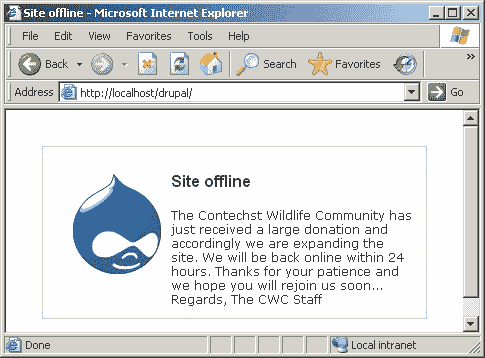

如果您确实需要在网站上执行某种重大工作，这个功能将使您的生活变得容易。但在工作时一定要非常小心，因为如果您注销，那么您就将自己锁出了网站。这是因为只有用户 1（即管理员用户）在网站离线时才能进行任何操作。如果您注销并尝试再次登录，您就不再是管理员用户；相反，您是匿名用户。

如果你恰好是网站管理员，这并不很有帮助；所以 Drupal 允许登录页面以正常方式访问。导航到`http://localhost/drupal/user`，你将能够以管理员身份登录并无障碍地使用网站。非常重要：

### 注意

确保你在将网站状态设置为**离线**时不要忘记管理员的密码！

直到网站状态返回到**在线**，其他人都将被锁定。

# 字符串处理

目前这里没有其他选项可供考虑，除了了解现有的 Unicode 字符串处理功能。Drupal 使用了**PHP mbstring 扩展**，这个扩展默认情况下并未启用。只要你确保实时主机已启用此扩展，Drupal 将忠实支持多字节 Unicode 操作，使你的网站能够适应任何你喜欢的语言中的非常规字符。

# 摘要

本章在设置网站方面已经涵盖了相当多的内容。我们首先查看了一些重要的通用配置设置，这些设置对于使网站的基本功能正常运行至关重要。随着网站的发展，以及你变得更加大胆，许多这些设置将需要重新审视。

然而，你已经学到了一些关于去哪里以及在你需要处理网站整体健康时有什么可用的重要信息。从错误处理到网站维护，你现在应该能够有信心地使用 Drupal。

值得注意的是，在标准的 Drupal 配置中，还有一些相关的技术知识是值得了解的。在这个例子中，花点时间学习一点 HTML 将肯定有助于将你的内容组织得井井有条，并在网站上展示出来。这不仅现在（以及在开发阶段稍后）会有好处，而且当你在一般工作中与网络打交道时，这是一个重要的工具。

当然，如果你愿意，对 PHP 有良好的理解也会有所帮助！花些时间去浏览[`www.php.net`](http://www.php.net)上的 PHP 网站，了解更多关于这门语言的信息。
