# 第四章：基础 II：添加功能

在完成了一般的配置任务之后，我相信你一定非常渴望开始为网站布局和功能工作。但这并不意味着我们马上就要讨论涉及主题的布局类型，因为在考虑字体、颜色和图像等问题之前，还有很多工作要做。虽然我们不会处理像新图像或闪亮的图形那样令人兴奋的事情，但你将发现，本节中我们讨论的很多东西都是关于个人品味的，你可以相当有创意。

*那么我们如何构建一个功能齐全的网站呢？* 答案是使用被称为模块的独立代码块，这些模块要么是标准 Drupal 下载的一部分，要么是由 Drupal 社区的好心人提供的。模块只是静静地等待，直到你需要它们，这时，Drupal（知道如何使用它们）将调用模块文件（s）提供的所有功能，以满足其所需完成的任务。

在 Drupal 的语境中，术语*模块*和*功能*是同义的，从模块提供功能的角度来看。你也有可能直接将你自己的功能添加到你的页面上，但这是一个稍微不同的问题，我们将在稍后讨论。现在，关于你网站功能的讨论实际上是对模块的讨论。

因此，在本章中，我们将仔细研究以下内容：

+   添加模块

+   第三方模块

+   配置模块

+   菜单和主要链接

+   使用模块

+   与块一起工作

请注意，我们不会深入讨论一些与内容相关的模块，因为我们在第六章和第七章中将详细讨论内容这一主题。虽然本章的重点是让基本功能投入使用，但我们也会探讨如何将 Drupal 网站中的其他模块包含进来，以展示其强大和灵活的能力。这也会揭示拥有一个完整的开发社区在手以提供帮助的巨大优势。

# 添加模块

通过启用某些模块，你将能够实现一个多样化、更重要的是，功能丰富的网站。由于有大量的模块可供选择，我无法期望通过详细介绍每一个模块的细节来让你感到厌烦。相反，我们将启用并简要地处理演示网站所需的每个模块，因为这些模块很可能是任何情况下最受欢迎的。

如果你发现你的网站需要某个模块，而这个模块在这里没有涵盖，那么请不要慌张，只需按照本章中你将看到的相同方法来启用和测试模块，并将其应用于特定的模块。你将很快就能投入使用！

在我们开始讨论每个单独的模块之前，前往**管理**菜单项下的**模块**部分，根据您网站的预期需求决定您最初想启用哪些模块。请记住，稍后很容易回来添加或删除模块——这是像 Drupal 这样的系统美丽和强大的一个部分。为了演示网站的目的，我们目前需要以下模块（随着我们继续构建网站，我们还需要更多模块）：

+   **博客**

+   **论坛**

+   **地区**

+   **投票**

+   **搜索**

+   **上传**

一旦您做出了选择，点击**保存配置**，然后就可以开始了。不幸的是，事情并没有那么简单，对于至少这些模块中的几个，我们实际上在网站上实施它们之前必须认真思考。特别是，**论坛**和**地区**需要深入讨论。在我们这样做之前，让我们看看 Drupal 社区为我们提供了什么其他东西。

# 第三方模块

Drupal 最伟大的事情之一就是它遵循开源范式。这促进了社区发展，反过来又促进了任何给定项目的多样性和增长。由此产生的一个副产品是，克服某些障碍或创造出新颖且有用的事物社区成员可以，并且经常花时间与他人分享。这是大多数，如果不是所有开源项目的一个极其宝贵的特性。

这意味着我们可以悠闲地浏览由他人制作、他人改进或改变成其他事物的各种模块，并挑选出我们最喜欢的内容。当然，反过来，当时机成熟时，你也可以将自己的开发成果供其他人使用。

目前，使用我们即将整合到我们网站中的贡献模块等存在某些问题。重要的是要理解，人们在不强制支付的情况下提供有用的软件。希望您会不时地给开发者发条信息，感谢他们花时间精力为您提供了可能受益的功能。

其次，因为大多数情况下只有一个或一小群开发者，你需要理解没有巨大的预算，有很多计算机专家日夜不停地敲击。这意味着贡献，就像任何软件一样，都可能出现错误或错误，你应该在实施任何更改之前确保你的网站，包括数据库，通过备份得到保护。（有关正确备份网站的更多信息，请参阅第十章) 这与处理软件时的最佳实践是一致的——如果某物破坏了你的代码，那么责任在你，而不是贡献者。

在解决了这两个相当严肃的问题之后，让我们开始吧。

## 下载模块

Drupal 网站在**下载**页面的**模块**标签下提供了一个可供你添加的贡献列表([`drupal.org/project/modules`](http://drupal.org/project/modules))。在**模块**页面的顶部，你可以选择 Drupal 的版本，然后按名称、分类或日期浏览模块，如这里所示：

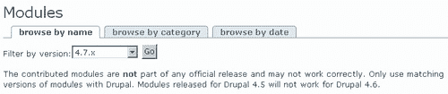

正如我们在第一章中看到的，获取正确的版本非常重要，因为你不能假设为**4.6.x**系列开发的模块将与最新的**4.7.x**系列兼容。事实上，这现在可能比一年后的问题更大，因为 Drupal 刚刚达到**4.7.x**系列。不幸的是，贡献的升级并不一定与核心开发同时进行；所以可能有些模块只能在 Drupal 的旧版本中实现——希望在你阅读这本书的时候，大多数模块，如果不是所有模块，都将与**4.7.x**兼容。

为了演示网站的目的，我们很快就需要一个贡献，那就是**分类访问控制**，你可以在**分类**部分找到它，假设你是按分类搜索的。前往那里，点击**下载**，并将压缩文件保存到你的电脑上。你可能发现创建一个目录，比如`drupal_downloads`，来保存这些文件会更方便。当然，一旦模块安装完毕，你就不再需要 zip 文件了。保留一个副本可能是有用的，但如果你确定不再需要它，一旦一切运行正常，就将其删除。

下载模块就这么简单。在我们继续之前，查看所有可用的模块列表，看看你可以用 Drupal 实现什么功能是个好主意。例如，*你知道吗？你可以使用 Drupal 作为一个电子商务网站，包括产品或服务以及购物车*。你可以实现所有类型的支付方式，如 PayPal、信用卡以及其他任何完整的在线商店可能需要的或一旦**电子商务**模块升级到与 4.7 兼容时将能够实现的功能。

现在了解你可以轻松使用 Drupal 模块实现什么，真的可以减少你在开发或寻找问题解决方案上花费的时间。

## 安装模块

每个模块的下载可能都不同，这取决于它需要如何更改系统才能运行。了解如何安装模块的最佳方式就是直接去做。既然我们已经下载了一个，我们就继续安装它。

打开你保存在机器上的`.gz`文件（参考上一节）。根据所涉及的模块，你将有一到几十个文件。由于许多文件中可能包含许可信息，确保在使用它们之前花时间阅读这些信息。除此之外，你需要做的第一件事是打开`readme`文件，因为它很可能包含有关你可以从模块中期待什么以及它是如何工作的详细信息。

假设你满意你找到了适合工作的正确模块，下一个要打开的文件是安装文件，通常像`INSTALL.txt`这样的东西。这将给你一个列表，你需要遵循这些指示来正确设置。通常情况下，这涉及到对你的数据库进行某种调整，以及将相关的`.module`文件添加到 Drupal 主目录下的`modules`文件夹中。

有时候，模块的开发者会添加注释来指导你如何使用贡献。例如，在分类访问控制模块的情况下，我们被建议不要与其他访问相关模块（如**OG**或**node_privacy_by_role**）一起使用。这并不意味着你不能这样做——只是你应该确保在违反像这个模块提供的建议这样的建议之前，你确切地知道你在做什么。

另一条可能在未来的某个阶段为你节省很多麻烦的建议是在使用模块之前备份你的数据库或任何重要文件。原因在于 Drupal 正在转向一个更用户友好的、即插即用的设置，你只需将模块文件提取到`modules`文件夹中，就可以继续操作。模块本身会自动处理对数据库所需进行的任何更改。这使得安装它变得更加容易，因为你不再需要发出如下命令：

```php
$ mysql u<username> p drupal <C:\apache2triad\htdocs\drupal\modules\taxonomy_access\taxonomy_access.mysql>

```

为了让事情运转起来。当然，并非所有模块都像这样工作，所以使用这里显示的命令来执行安装的任何其他模块所需的任何脚本。请记住，要根据您系统和安装的模块的具体情况更改用户名以及文件路径。

由于一些贡献自动执行自己的数据库修改，现在安装模块变得更容易，但同时也更容易“自食其果”。这是因为这些更改是在幕后进行的，你没有直接控制它们。诚然，这些更改通常是无害的，但你永远不知道。

为了让事情开始运转，我们只需将下载的内容提取到`modules`文件夹中。一旦完成，现在在`modules`目录下就有一个名为`taxonomy_access`的文件夹。

### 注意

在`modules`文件夹中为每个额外的贡献模块维护单独的文件夹是一个好习惯。这样做可以让你跟踪哪些模块文件已被添加，哪些是核心文件。

背后场景中要做的事情基本上就这些，但我们仍然需要确保我们可以从管理员的角度使用这个模块。

以管理员身份登录您的网站，并转到**管理**菜单项下的**模块**部分。向下滚动可用的模块列表，你应该会找到你的新**taxonomy_access**模块，如下所示：

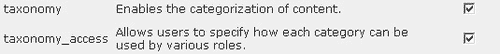

启用模块并点击**保存配置**。就这样，全部完成！

自然地，我们仍然需要测试这个模块并将其投入使用。然而，它将在下一章中使用，所以我们在这里不再进一步讨论。你应该有信心现在可以选择、下载和安装任何你喜欢的模块。让我们继续，看看如何配置我们之前启用的标准模块。

# 配置模块

显然，每个模块的设置性质可能与其他模块大相径庭。这是因为模块可以提供几乎任何你可以想象的功能，从简单的投票到搜索引擎，或任何其他东西。相应地，每个模块都与一系列不同的设置相关联。

你还应该记住，由于模块与功能相关的内在广泛性，每个模块的配置和使用也可能有很大差异。这意味着一开始可能会很困惑，不知道去哪里更改设置或简单地使用它们。

我们将从**论坛**和**地区设置**开始，然后是其他模块，因为这两个模块稍微复杂一些。

## 论坛

在我们开始查看论坛之前，你应该确保你已经启用了**评论**和**分类**模块，因为这些是**论坛**模块正常工作所必需的（这可能会自动完成）。一旦这些都被启用，你就可以转到**管理**菜单项下的**论坛**链接，开始使用它。你将看到一个页面，它将立即提出一些有趣的问题：

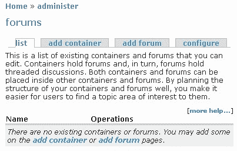

"我该如何组织我的论坛（们）？" 可能是你现在正在问的问题。这个答案实际上取决于讨论主题的范围有多广，将有多少人使用论坛，以及讨论的主题性质。你追求的是一个直观、逻辑、易于使用的结构，它将通过允许用户轻松找到信息来促进和鼓励讨论——而不是通过一个糟糕的结构来让他们感到沮丧，这个结构实际上隐藏了主题。

让我们来看看如何组织演示网站的论坛。*我们从哪里开始呢？* 一个好主意是在开始创建或删除论坛之前先绘制出你的结构，这样你可以看到一切是如何相互关联的，并在开始之前做出修改。例如，根据地理位置划分论坛似乎是有逻辑的，这样美国的人可以直接进入北美论坛，非洲的人可以直接进入非洲论坛。

不幸的是，这有几个缺点，因为你最终会在每个大陆上得到很多重复的主题（因为野生动物问题是全球性的）。更糟糕的是，如果你住在美国，关心南非的猎杀，你将去哪里讨论这个问题，非洲还是北美？看起来，在这个例子中，根据地理位置划分论坛可能不是一个好主意。*那么我们使用什么标准来分类我们的论坛内容呢？*

最好的方法是按问题来组织。人们想要讨论问题或主题，因此他们自然会寻找基于这些标准的内容。从这个角度来看，**添加容器**标签的含义变得清晰，因为现在我们可以根据它们共同的问题来组织论坛主题。

例如，野生动物今天关注的重大问题之一就是保护。这反过来又有很多方面，所有这些无疑都会引起演示网站目标受众的兴趣。环境也是一个应该讨论的问题，而且现在每个人都对研究感兴趣。这些都似乎是可以接受的容器，因为它们逻辑上封装了人们使用这个网站将讨论的大部分内容。

沿着这个思路继续前进，每个潜在的容器都有独特的子类别，用户会直观地将其理解为辩论的主题——我们稍后将看到我实际想出的结构。一旦你在纸上记下了良好的结构，就是实际在网站上实施论坛的时候了。让我们先创建容器开始。点击**添加容器**，将弹出一个页面，允许你指定容器的名称、简短描述、父级和权重。

由于你应该已经决定了结构，所以很容易看出哪个容器或论坛属于哪个父级。顶层容器或论坛显然应该将父级设置为**<root>**。如果你想以非字母顺序显示它们，可以设置容器或论坛的权重——权重越小，它将越接近顶部。

继续添加容器和论坛，以及有用的描述，直到你完成整个结构。以下截图显示了演示网站最终的样子（毫无疑问，还可以添加或更改更多主题，但这对目前来说已经足够了）：

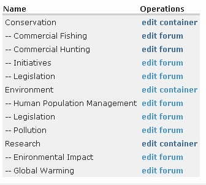

在这里有几个需要注意的事项。首先，在概念层面上，类别之间的重叠是存在的。例如，**全球变暖**在逻辑上应该出现在**环境影响**类别下，那么*为什么它有自己的论坛呢？* 答案是，你需要考虑哪些问题可能最为重要。由于全球变暖是一个重大问题，它值得提升到自己的论坛。

其次，我只添加了一个父级层级的容器，论坛出现在这个下面。理论上可以在容器内添加容器，等等，但为了便于找到主题，你应该尽可能保持扁平结构，而不是在可能的情况下创建深层导航结构。这是因为人们搜索列表比导航深层层次结构更容易。

最后，有一些配置选项，在完成之前你应该查看一下。大多数默认设置都很合理，但你可能希望点击**配置**标签，决定诸如你希望将多少帖子视为**热门**，或者是否按日期或活动顺序排列帖子等问题。完成设置后，点击**保存配置**，你的论坛就基本可以使用了。

在我们查看如何使用其中一个模块之前，让我们继续设置其他模块。实际上，你应该尝试每个模块，确保它们能让你满意，尽管我们在这里没有足够的空间来做这件事。

## 地区

启用**地区**后，你现在可以点击**管理**下的**本地化**链接，查看提供的选项。这样做将弹出一个以下页面：

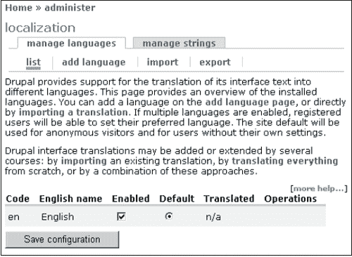

由于有许多欧洲机构和组织处理保护和环境问题，我们希望将意大利语添加到我们的网站上。为了做到这一点，我们只需点击**添加语言**，从下拉语言列表中选择相关语言，然后点击下方的**添加语言**按钮。

下一步是将语言实际导入到网站上，以便进行翻译。为了实现这一点，去 Drupal 的**翻译**页面[`drupal.org/project/translations`](http://drupal.org/project/translations)找到相关的语言文件。搜索直到找到相关文件，然后下载并解压缩文件到你的文件系统。完成这些后，点击**导入**标签页，然后从 Drupal 页面浏览到`.po`文件——你应该会有类似这样的内容（取决于导入的语言）：

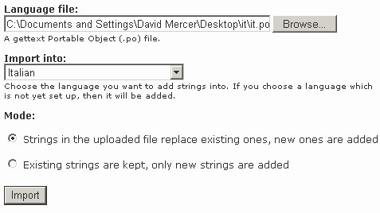

一旦你确认你已经有了正确的`.po`语言文件，并且你正在将其导入正确的语言，点击**导入**。从之前的屏幕截图你可以看出，我们足够合理地将`it.po`文件（意大利语语言文件）导入到我们网站的**意大利语**。由于这是一个新的导入，我们不需要担心在**模式**部分替换任何字符串。如果你正在修改你的语言翻译，那么你可能考虑保留现有的内容，并且只通过选择第二个选项添加新的字符串。

完成后，在弹出的页面上勾选**启用**复选框，然后点击**保存配置**。现在你已经在网站上启用了一种新的语言。你可以为用户需要的任何可下载语言重复此过程。

我们接下来应该简要讨论的是如何管理字符串。你可能发现导入的语言翻译并没有像你希望的那样翻译所有内容，在这种情况下，你需要手动进行。点击**管理字符串**标签页，你将看到一个搜索页面，你可以使用它来定位你想要更改的字符串。同时还有一个选项列表来控制你的搜索。一旦找到你想要的内容，你可以简单地根据需要进行编辑。

请记住，你可以创建一个自定义语言文件，并通过在**管理字符串**标签页下使用字符串管理工具并手动输入翻译来构建该语言文件的翻译列表——尽管，这项工作相当繁琐。

如果你获得了一套相当完整的翻译，或者对语言文件进行了改进，那么社区普遍会感激你使用**导出**链接与大家分享你的翻译文件。一旦你通过选择导出语言并点击**导出**按钮将文件导出为`.po`格式，你就可以着手将其上传到 Drupal 网站上（在 Drupal 网站的**贡献**标签页下查看更多信息以获取更多信息）。

## 评论

由于这个模块默认需要，与论坛模块一起，我们不妨在这里简要讨论一下。正如其名所示，评论允许用户对他们在网站上找到的内容发表评论——就这么简单。如何确定谁可以评论以及评论什么，是*用户、角色和权限*这一章第五章的主题。

你可以在**管理**菜单项下找到**评论**，点击它将显示你网站上所有评论的列表。以下截图显示了在特定帖子中添加了一些评论后的典型评论页面：

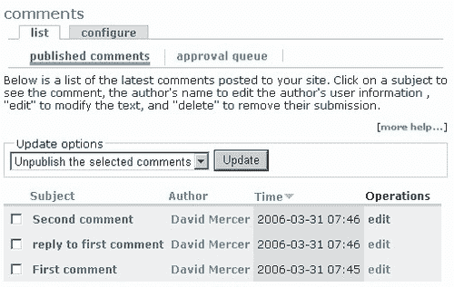

从这里你可以看到，我们有一个用于处理评论的综合界面。有几个**更新选项**可用，这些选项允许我们删除或取消发布评论。如果你永远不想在网站上再次看到某个评论，那么**删除选定的评论**就是你要采取的方式。如果你只想防止评论显示，而不完全删除，那么**取消发布选定的评论**是正确的更新选项。

假设你出于某种原因决定取消发布一个评论，你将不得不在**审批队列**标签页下而不是主页上寻找它。审批队列允许你搜索和编辑因各种原因而出现在这里的帖子——可能是因为你已取消发布，或者可能是因为你决定强制所有评论进入审批队列进行审核。无论评论如何出现在这里，你都会发现有两个更新选项可用，这一次你可以选择删除评论或发布它。

点击**配置**标签页，你会找到与评论相关的两个重要类别，即**查看选项**和**发布设置**。浏览可用的选项，并做出任何你想要的更改。例如，在**查看选项**部分，**默认显示模式**已更改为“折叠的线程列表”，以便将相关的评论聚集在一起，而不显示每个评论的正文。默认显示顺序也已更改为“按日期最早优先”，以便从页面顶部向下查看评论作为对话。

使用这些设置，页面上的评论现在看起来像这样：

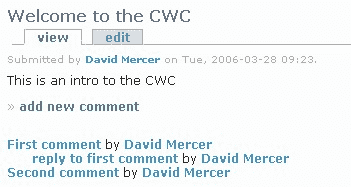

如您所见，较早的评论出现在堆栈的顶部，对这些评论的回复则位于其下方并缩进。当然，这可能不符合您的喜好，这些评论也可能像这样显示：

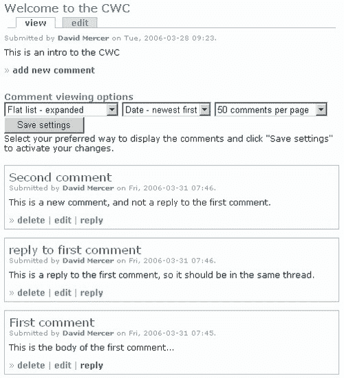

要弄清楚为了使评论看起来像这样所做的更改可能并不太难（尤其是由于它们在之前的屏幕截图中被显示），所以这被留作您的练习。您决定如何显示评论完全取决于您，并且所做的任何决定都应考虑网站上的评论使用情况。

**发布设置**部分提供了关于用户如何实际创建评论的一些选项。再次强调，您应该真正考虑您正在工作的网站类型。例如，强制用户预览他们的评论可能看起来很合理，但如果您发现您有一群经常发表评论的常规社区用户，那么每次检查他们的帖子将变得令人厌烦。

假设您打算允许匿名用户发表评论，您必须决定他们是否需要在评论中留下联系方式。从保持您网站评论标准的角度来看，将匿名用户的评论发送到审核队列可能是个好主意，这样您就不会成为垃圾邮件攻击或廉价广告的受害者。这可以通过在**管理**下的**访问控制**部分，仅选择**评论模块**中的**发表评论**选项来实现，如下所示：

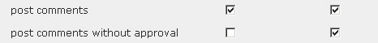

就像任何事物一样，这是一个权衡，因为您通过坚持要求所有匿名用户的评论都经过审核，实际上给自己增加了很多工作。您可能会发现，从长远来看，坚持要求希望成为活跃社区成员的人注册会更好。

## 内容类型

一些人在此时可能会皱眉，因为评论不是内容类型吗？嗯，是的，它们是，但它们的配置与其他内容略有不同，所以它们被单独分开。我们在上一节中启用的三个内容类型模块具有类似的配置设置，因此在这里一起介绍是有意义的。如果您导航回**管理**下的**设置**部分，然后点击**内容类型**，您将看到所有可用的类型列表，如下所示，这取决于您启用了哪些：

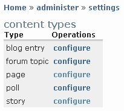

点击**配置**将显示相关的配置页面，由于它们都是相同的，我们这里只详细查看一个。出于兴趣，我们将打开投票配置页面。

此配置页面上的选项分为两个部分：第一部分允许您输入一些解释性文本并选择使内容类型有效的最小单词数；第二部分，**工作流程**，如下所示：

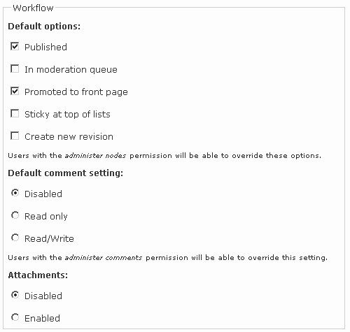

如您所见，评论以及附件已被禁用，因为我们并不真正希望对投票帖子的反馈，而且我们也不介意将文件附加到投票中——它们应该仅仅是直接的问答工具。您需要根据您希望如何利用内容来为每种内容类型做出这样的选择。

您还可以决定某些内容帖子是否应该保持在列表的顶部，以及处理一些稍微复杂一些的选项，如**创建新修订版**或**在审核队列中**——这些将在第六章基本内容中稍后讨论。目前，您可能最好将这些设置保持原样，并在您拥有所有必要信息后回来修改它们。

## 搜索

这是一个有趣的配置模块，因为有一些微妙的问题需要考虑，当调整设置时您应该考虑这些因素。首先，用于在数据库中构建搜索的索引过程依赖于 cron（在第十章运行您的网站中讨论）。如果您打算实施搜索功能，您需要确保您的实时站点上 cron 运行正确。有关 cron 作业和与 Drupal 一起提供的`cron.php`脚本的更多信息，您还可以访问**帮助**部分下的**系统**。

您可以通过点击搜索页面顶部的**重新索引网站**按钮手动重新索引您的网站，位于**设置**菜单项下。这将导致 Drupal 遍历网站的内容并更新其索引，以便任何您特别希望包含在任何搜索中的新内容都将被包括在内。

本节中的大多数其他设置都与系统的性能有关。例如，您选择的每个 cron 运行要索引的项目数量也会影响 cron 作业的速度，如果您遇到超时问题，您可能需要将此设置稍微降低。此外，索引较短的单词会给您的系统增加负载，因为它必须在内容中索引更多的单词。

最后，可以根据三个标准来决定如何权衡站内搜索，即**关键词相关性、最近发布**和**评论数量**。您需要确定哪个标准更重要，哪个可以安全地降低其重要性。在演示站点的案例中，使用了以下设置：

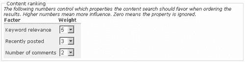

这里给出的权重原因是因为我们确实希望搜索结果与搜索词和内容之间存在强烈的关联。实际上，我们是在说，仅仅因为帖子是新的，并不意味着它更有价值，而且仅仅因为某篇内容被广泛评论，并不意味着它更有相关性。根据您的标准，您可能选择完全不同的内容——底线是确保搜索结果尽可能与网站用户的相关性。

## 上传

假设您将允许将文件上传到网站，那么还有一些设置值得关注。点击**管理**下的**设置**中的**上传**选项，以打开上传的配置页面。在这里，您将能够确定**上传图像的最大分辨率**，以及是否默认**列出文件**。

根据您使用的 Drupal 版本，您也可能决定允许哪些类型的文件上传到网站。请记住，一些文件可能包含有害或恶意代码，如间谍软件、病毒或特洛伊木马。您可能不希望允许`.exe`或其他可执行文件被提供，从而冒风险传播它们。此外，您需要考虑有多少磁盘空间可用。您最不希望的是允许人们上传占用大量空间的整个电影文件；因此，确保**最大文件大小**和**每个用户的总文件大小**保持在合理的限制内。

# 菜单和主要链接

在我们继续介绍新内容之前，查看网站并确认迄今为止所做的更改是否达到预期效果非常重要。记住：始终以这种方式测试新修改是至关重要的。*我们如何测试新模块？*最好的方法实际上是在网站上尝试使用它们；因此，导航到主页并查看当前的网站状态。目前我们有一些类似的东西（假设您已登录为管理员）：

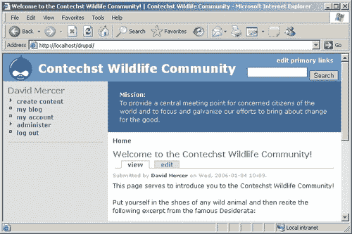

这当然不是我们希望看到的结果。首先，没有直接的方法可以导航到论坛，甚至查看投票。我们已经启用了这些模块，甚至配置了它们；*那么为什么它们没有显示在网站上？*答案在于我们还没有编辑我们的菜单或配置主要链接。

您可能已经注意到了屏幕右上角的**主要链接**链接。点击它以开始操作。以下截图显示了在新页面上拉起的列表的一部分：

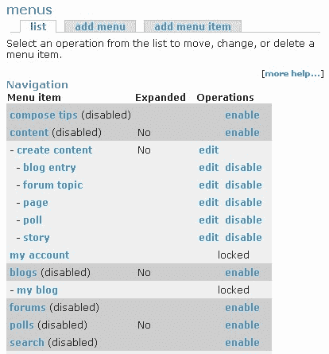

上图截图中的高亮部分告诉我们哪些菜单项已被禁用。默认情况下，我们已启用的所有新模块，例如**论坛、博客**和**搜索**，在**菜单项**列表中不可用。让我们通过启用**论坛**（或如果您愿意，所有这些）来纠正这个问题。您将注意到在它们启用之前，您有几个选项需要处理。您可以就这些选项做出一些相当符合常识的决定，以下截图显示了**论坛**菜单项是如何设置的：

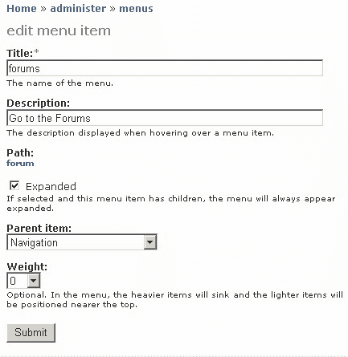

请仔细选择**父项**，因为您可能并不总是希望菜单项显示在顶级。例如，屏幕右上角（目前）有一个**搜索**框，因此您可能不希望**搜索**菜单项与其他主要菜单项并列显示，因为这将是相当冗余的。

**路径**选项允许您检查此菜单项是否指向正确的内容，允许您点击下面的链接（在本例中，**论坛**）以查看哪个页面被打开。如果菜单项是手动添加的，并且您不确定项目的目标 URL 是否正确输入，这将非常有用。

完成后，您会发现您已启用的项目现在在左侧菜单中可用。

有可能您需要在某个阶段创建自己的菜单——可能是为了提供一个更集中的可导航区域。在这种情况下，使用**菜单**页面上的**添加菜单**标签页输入新菜单的名称，如下所示：

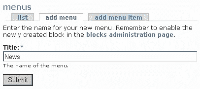

提交此操作后，使用**添加菜单项**标签页添加新菜单项就变得容易了：

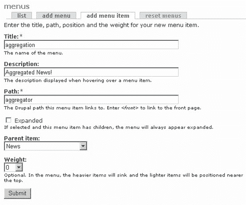

从上图可以看到，我们正在将一个名为**聚合**的菜单项添加到**新闻**父项中。我们选择的**路径**是将菜单项链接到**聚合器**，这样就会显示网站上可用的所有聚合新闻（假设已设置）。如果您现在还没有启用**聚合器**，可以将其链接到其他任何内容！一旦完成，您可以在菜单页面的底部查看新的菜单：

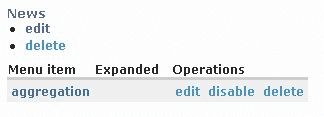

如果您希望将此菜单显示在您的网站上某个位置，那么在**管理**下的主菜单的**块**部分启用它就很简单了。块将在本章后面的**与块一起工作**部分详细讨论，所以我们不会在这个特定主题上进一步讨论，除了向您展示这个（添加**新闻**菜单及其左侧边栏的**聚合器**菜单项的结果）：

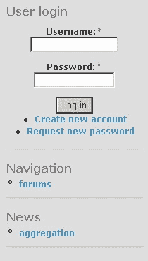

在处理完这些之后，我们需要看看如何配置主要链接，这些链接默认出现在每个页面的右上角。我们已经点击了这个链接，以便显示我们在本节中使用的**菜单**部分，但我们还没有查看主要链接可用的配置选项。

直接转到主菜单中**设置**菜单项下的**菜单**链接。你会注意到页面分为两部分。第一部分提供了一个下拉列表，用于显示与主要和二级链接相关的菜单选项，如下所示：

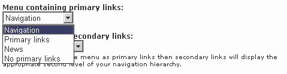

如你所见，最新添加到可用菜单中的**新闻**出现在这个列表中，这应该给你一些关于这个页面如何使用的线索。实际上，我们可以选择我们想在这里显示的任何菜单项。在这种情况下，**导航**是我们的选择，在保存这些设置后，**导航**菜单项将显示在每个页面的顶部，如下所示：


现在，回想一下，我们在这个部分的早期已经启用了**论坛**菜单项，所以它现在与这个菜单项中的所有其他主要链接一起出现。Drupal 并没有就此止步，因为就在第一个下拉列表下面，我们还有一个可以用来显示二级链接的下拉列表。

如下图所示，选择**导航**：

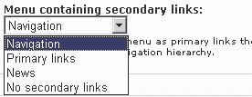

将导致给定菜单项中的所有二级链接显示出来。在这种情况下，**管理**主要链接与大量二级链接相关联；因此，现在的页眉部分看起来有点拥挤：

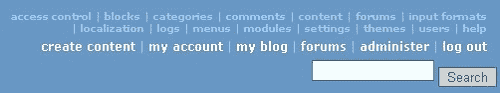

能够创建你喜欢的任何菜单，并在任何你想的地方显示它们，是一个非常强大的工具。有无数的不同组合供你尝试。例如，你可能希望创建一个包含你网站上所有不同类型内容的菜单——博客、论坛、故事、投票等等。然后你可以将这个菜单附加到主要链接上，作为用户的一种*快速导航*工具。非常强大且非常灵活；我相信你会同意的！

# 使用模块

现在我们有一大堆配置好的模块，正等着被使用。与内容相关的模块应该出现在主菜单中（或者至少是**论坛**），因为我们已经编辑了主要链接，允许它们显示（或者，你可能已经创建了自己的菜单，以便导航内容）。我们仍然需要快速查看这里的其中一个模块，只是为了证明一切都在正轨上。如何定制 Drupal 的一个更强大的例子，可以通过**locale**模块非常优雅地展示，让我们来看看它。

假设你是一个注册用户，并且网站配置为允许本地化（通过在**管理**下的**本地化**页面中启用多种语言），你可以简单地登录，点击**我的账户**链接，然后在该页面上选择**编辑**标签。向下滚动，现在可以找到选择界面语言的选择，如下所示：

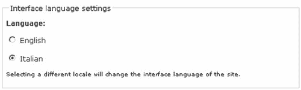

在选择语言后，例如**意大利语**，点击页面底部的**提交**按钮，你会发现，根据翻译的好坏，你的网站或多或少会以你选择的语言呈现。现在，无论何时你注销网站，它都会回到默认语言，在这个例子中是**英语**，但在登录时，网站会重新渲染为**意大利语**，如下所示：

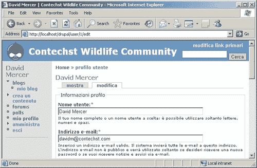

这是 Drupal 相当令人印象深刻且强大的功能之一，希望无论你是否需要这个特定的模块，你都会对即将到来的许多可能性感到兴奋。

强烈建议你在继续之前，与所有已启用的模块一起工作，并了解幕后发生的事情。你迟早会问自己一个问题*我该如何在网站上展示所有我的模块？* 这是一个显然相当重要的问题；所以我们现在就处理它…

# 使用块

正如我们在第二章中简要提到的，块包含在网站各个地方可见的信息或相关数据——这取决于你选择在哪里显示它们。块通常由模块生成，但也可以手动创建。由于许多模块会自动生成块，因此每当启用新模块时，访问**块**部分总是明智的，因为很可能你有一些新的设置可以尝试。

好的，我们知道什么是块，那么*我们在本节讨论什么？* 嗯，当我们谈论与块一起工作时，我们真正想说的是*"我们希望如何向用户展示网站的功能？"* 自然，每个人都应该努力打造一个引人注目且独特的网站，布局配置是其中的重要部分——尤其是在它决定了网站界面上功能如何组织的情况下。

请时刻记住，主导你设置网站展示方式的因素都是关于可用性的。确保网站直观易用，并且永远不要为了艺术原因而牺牲清晰度和易用性。

幸运的是，Drupal 默认布局已经相当合理，但这并不意味着没有太多事情要做。你拥有极大的控制权，可以决定一切显示的位置和方式，相应地，也有很多工作要做。

目前，我们只关心功能将在页面上呈现的位置。换句话说，我们正在处理与网站功能直接相关的界面设计部分。例如，主题将与颜色和字体等事物一起工作，甚至背景图像和布局等其他事物（主题的范围实际上非常广泛，但就目前而言，以这种方式看待事物是完全可以的），而无论我们使用什么模板/主题，我们仍然需要启用并添加块到网站的某些部分。

*但我们从哪里开始呢？* 好吧，了解你想要如何完成事情的最佳方法之一是上网查看其他人如何制作出效果良好的网站。如果你喜欢某样东西，看看它是否可以在你的网站上模仿。

了解你最终如何设置网站的一种方法是实际操作并看看什么有效。本节将专注于这种方法，并将第一种方法留给你去研究。

## 添加块

在**管理**菜单项下，点击**块**以显示当前网站可用的块列表。请记住，随着你在网站上添加和更改内容，此列表将发生变化——你可能需要多次访问它。查看块页面，你会看到可用的块列表以及每个块的几个选项。Drupal 允许你在页面的任何位置放置这些选项，但你的选择不应如此随意。

努力使网站易于使用。为了做到这一点，将相关信息分组到网站上的同一位置是一个好主意，这样用户就可以感受到他们可能在何处寻找特定类型的内容。为了演示网站的目的，目前做出了以下设置（记住，随着网站的发展，这可能会发生变化）：

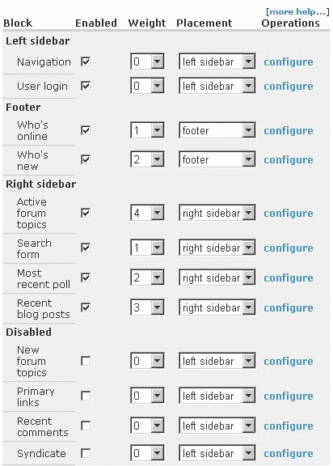

有一个关于**权重**设置的有趣点需要注意。如果你查看之前的截图，你会看到**右侧边栏**中的块权重为**1**到**4**。如果我想要在这两个块上方添加两个新的块怎么办？幸运的是，**权重**下拉列表（在**块**下）有负数，这允许你给出小于**0**的权重，这样你就不必重新调整所有权重来插入一个块。因此，如果你想在上面的右侧边栏中添加两个额外的块，你可以给它们权重为**1**和**0**，而无需更改其他任何内容。

继续往下看，注意在上一张截图的页面底部区域，有关其他用户的信息，如**新用户**和**在线用户**，都被限制在这个区域。这显然是因为网站的主要关注点不是谁在线，而是与野生动物相关的内容。因此，这些信息被分配到页面底部，这样对周围的人感兴趣的人可以麻烦一下去查看，而不会影响网站的主要内容。将所有这类信息放在页面底部是个不错的想法。

还有什么吗？所有与内容相关的问题都被分组到右侧边栏中。这意味着如果人们想快速查看网站上新增了哪些内容，他们可以通过这里找到。此外，信息结构被组织得如此之好，以至于调查出现在所有其他信息之上（因为我们通常希望鼓励人们花时间回答调查），但我们把搜索表单留在了页面的顶部，因为我们预计这将是内容量增加后最有用的工具。

当然，一些块目前仍然是禁用的，因为网站目前不需要它们。以后随时都可以轻松地添加或删除块。只要你确保各种块有一个良好的逻辑布局，你就可以根据需要随时更改显示的内容。但尽量不要频繁更改，因为这会损害网站的可用性，并且一旦网站上线，可能会使用户感到沮丧。

保存这些更改（通过点击**保存块**）后，查看你的主页，你会看到各种块已经按照你的要求插入到你的网页中。移动这些内容直到你对页面的外观完全满意是很简单的。

一些用户可能也注意到了，在**块**页面的顶部有一个**添加块**标签。点击这个标签会弹出一个页面，可以用来将你自己的块插入到网站上，如下所示：

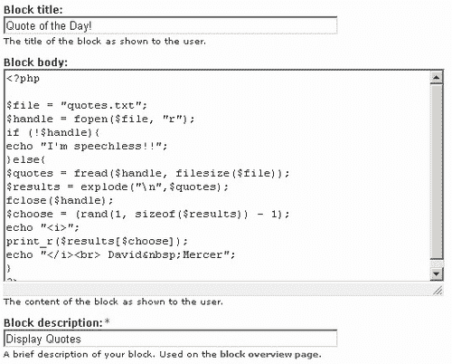

在这个例子中，我们添加了一小段 PHP 代码，这段代码从文件系统中的`drupal`文件夹下的（quotes.txt）文件中提取引文，将其拆分成行数组，随机选择一行，然后以特殊字体显示。目前不必担心理解 PHP 代码。这只是为了给你一个将来可能希望向网站添加块的想法。如果你然后查看网站上的新块，你应该会得到类似这样的结果（取决于你添加到`quote.txt`文件中的引文）：


添加愚蠢的引言当然是一件很有趣的事情，但希望您能欣赏到在您的页面上包含新块是多么容易。当我们开始考虑是否应该允许某些人访问一个块，或者块是否应该显示在所有页面上或仅在某些页面上时，情况变得更加复杂。为了了解如何处理这些问题，我们必须详细查看块配置。

## 配置块

Drupal 允许我们通过列表中每个块的右侧的“配置”链接来控制块何时显示。这个配置页面被分成三个部分，分别处理：

+   **块特定设置**

+   **用户特定可见性设置**

+   **页面特定可见性设置**

结合这三个部分提供了一种复杂的方法来控制何时显示块以及显示给谁。当然，一些模块可能不需要任何特定的设置；因此，您可能会发现，您通常需要更频繁地做出关于用户和页面的具体决定。

一个配置块的优秀示例可以通过“谁在线”页面来展示。这个页面允许我们决定用户在不再被视为在线之前可以不活跃多久，以及在任何时候显示的最大人数。这很容易处理，实际上取决于网站的需求。接下来的两个选项则给我们带来了一些思考：

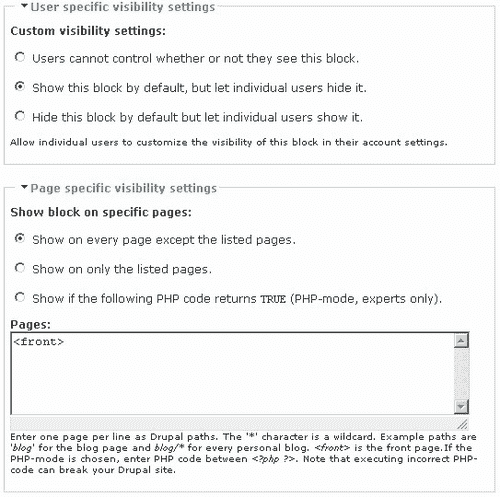

如您所见，上面的设置允许用户编辑他们是否可以看到“谁在线”块的偏好——尽管，它默认是可见的。虽然您可能会发现大多数普通用户并不介意，但经常用户通常会欣赏能够对他们的页面设置有所控制。

在这些设置到位后，编辑账户信息的用户会看到一个复选框，允许他们启用或禁用该块：

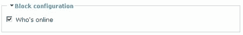

*允许用户自己做出选择是一回事，但如果我们不想在某个页面上显示某个块怎么办呢？* 好吧，下一节允许我们做到这一点，如果您查看倒数第二个截图，您会看到“除了以下列出的页面外显示”选项已被选中，并且在“页面”文本区域中输入了文本**<front>**。这意味着无论何时有人访问网站，都不会显示谁在线。只有当他们登录或通过查看内容或添加材料开始使用网站时，这些信息才会变得可用。

更高级的用户可以添加一些代码来决定是否显示该块。这可能的形式是：

```php
if (some_condition_is_true){
return TRUE;
}else{
return FALSE;
}

```

你可能会发现，你只有在有特定原因显示或不显示信息时才需要回到这一部分。一如既往，建议你尝试在某个页面上显示一个模块，但在其他页面上不显示。*例如，你能否只在有人使用论坛时显示一个区块？* 答案当然是选择**仅显示在列表页面上**选项，然后输入**forum**或**forum/**到文本区域中。确保这是正确的，通过在自己的机器上尝试来实现。

现在你已经知道了如何配置一个区块。这只是一个简单的过程，你需要逐一查看你已启用的每个区块，并做出适当的决定，关于它们何时、何地以及向谁显示。

# 概述

在完成了一般的配置任务之后，我们着手于添加功能并组织网站上的功能这一至关重要的主题。这是你在开发阶段将要承担的最重要任务之一。选择和实施正确的功能是一项微妙的工作，但希望你已经发现，一旦你决定了在哪里放置什么，Drupal 就会使实施变得相当容易。

此外，我们还体验了拥有一个完整的开发社区来借鉴的感觉，当我们下载并安装了一个贡献模块时。贡献模块是扩展网站功能的无价资源。这个宝贵的设施附带明确的警告，即在实施任何更改之前，你需要通过备份来保护你网站的安全。

当我们谈论如何轻松地自定义网站的菜单和导航时，Drupal 的强大和优雅表现得淋漓尽致。拥有一个强大的工具，结合菜单系统的灵活性，在创建一个设计良好且易于使用的网站时，将提供极大的帮助。希望，在章节的后半部分，你对菜单的创建方式以及它们与模块提供的功能之间的关系有了更清晰的认识。

你可能从本章中学到的一个重要事情是，由于 Drupal 非常灵活和可定制，因此有大量的设置分布在不同的地方。一开始跟踪所有这些可能看起来相当令人畏惧，但随着你在 Drupal 中工作，你会越来越熟悉它们。最终，你将能够轻松地找到自己的方向。

然而，现在请坐下来，快速休息一下，因为你知道你已经完成了任务。在下一章中，我们将开始探讨如何与用户和权限合作——这是作为 Drupal 管理员成功的关键话题之一。
