# 第八章。Drupal 的界面

为了使你的网站界面独特且吸引人，不仅需要一些关于 Drupal 的技术知识，而且像任何设计类任务一样，也需要一些创造力。目前你的网站功能齐全，外观也不算糟糕——它有点单调，但能完成任务！然而，正如你将看到的，只要付出一些努力，创造全新的东西并非遥不可及，而且正如你所预期的那样，Drupal 提供了一系列功能来简化我们的工作。

如果你像我一样，喜欢从事网站更具创造性的方面，那么这真的是你一直在等待的章节。是时候设计、规划和实施用户将*沉浸其中*的视觉环境了——如果你能成功创造一个令人愉悦的互动氛围，那么你无疑已经为确保用户对你的网站满意做了很多工作。

然而，就像这本书中的其他内容一样，我们不可能一开始就一头扎进去，一旦开始工作就学会游泳。在我们开始定制 Drupal 界面之前，有很多有趣的事情需要思考和了解。

你还有这样的便利，即网站已经为你搭建好了，这让你可以自由地在这里那里进行修改以达到你的设计目标，而不是从头开始开发 HTML。在某种程度上，这种便利实际上限制了你的选择，因为如果不是对页面进行彻底的重写，你的网站将保留一些 Drupal 的*风味*。但这绝非坏事，对吧？

为了达到这个目的，本章将讨论以下内容：

+   规划基于网络的界面

+   Drupal 界面的工作原理

+   CSS

+   主题

我应该提醒你，为网站设计一个全新、令人愉悦且独特的视觉风格涉及很多内容。有许多细节需要你仔细调整，因此你应该准备好在这个部分投入一些时间，因为毕竟，你的网站的外观和感觉是你向社区展示的面貌，同时也是社区对外界展示的面貌。

另一件需要记住的事情是，你应该花些时间看看已经存在的东西。在设计网站时，你可能会遇到的问题，已经在整个行业中得到了成功的解决，而且不仅仅是 Drupal 用户。此外，不要害怕将你的设计视为一个持续的过程——虽然每周大幅度改变你的网站并不好，但定期调整或升级你的界面可以保持其现代感和光鲜的新面貌。

# 规划基于网络的界面

“形式追随功能”这一原则在人类知识的许多领域得到广泛应用，从进化到生物动力学和工程学。这是一个易于理解的概念，其基本含义是，某物建造或制作的方式必须反映其被制作的目的。这是一个非常明智的想法，将其应用于您网站的设计将为您提供一把衡量您设计得有多好的尺子。如果您，或者最好是您询问的每个人，都能诚实地说出您的网站看起来就像是为了做您正在做的事情，那么您就做得很好。

这并不是说您的网站应该看起来像其他执行相同功能的网站。事实上，如果可能的话，您希望尽可能使它与众不同，同时不要越过您认为您的目标用户会认为的*良好品味*或*常识*的界限。

*您是如何做到这一点的？* 关键在于将您作为网站所拥有的或做的事情与您的特定目标受众联系起来。如果您提供的内容对所有年龄、所有国籍、所有种族或宗教的男女都有吸引力，那么显然您应该选择每个人都可用的东西。实际上，这可能是一个略微无味的网站，因为您不想通过明确使您的网站对另一组用户友好来边缘化任何用户群体。幸运的是，尽管如此，您的目标受众在一定程度上将比这更容易定义，因此您可以一般性地为特定类型的用户提供一些妥协。

请记住，尽管以下章节涉及*视觉*或*功能*设计，您真正思考的是*交互*设计的视觉或功能方面，这包括所有视觉和功能设计。交互设计是您如何看待您的受众如何使用和与您的网站互动。这是一个重要的区别，因为从用户的角度思考一切将有助于您在前进过程中定义您的选择。

## 视觉设计

在这个问题上，没有必要拐弯抹角。尽可能使网站在视觉上简单，同时不要隐藏任何关键或有用的信息。我的意思是，如果您认为列表上的所有项目都是有用的，并且会被（或正在）频繁使用，那么您不应该害怕在页面上留下相当长的项目列表。隐藏一个重要的东西给用户——无论在其他页面上找到它看起来有多容易——都会让他们感到沮丧，您的受欢迎程度可能会受到影响。这一点的后果是，您不应该害怕有相当长的页面，用户必须向下滚动——而不是有一个复杂的导航结构，让信息在页面底部可用。

你的网站外观也会对用户如何理解网站的工作方式产生重大影响。例如，如果你有几种不同的字体适用于不同的链接，那么用户完全可能不会因为不同的字体样式而考虑点击不同类型的链接。你自己想想这个问题！如果你正在阅读一页文本，所有的链接都使用与正文相同的字体，你将如何知道点击哪些单词？这可以总结为：

### 注意

确保您的网站在视觉上保持一致，并且页面之间没有风格差异。

有很多所谓的视觉设计规则，你可以应用到你的网站上。这些规则大多是理论性的，你可能愿意也可能不愿意进一步了解这些规则——我可以建议你用谷歌搜索一些好的阅读材料。可能适用于你的有：三分法规则，即垂直或水平分割成三部分的事物比其他设计更具有视觉吸引力；视觉中心规则，即页面的视觉中心（眼睛最容易被吸引的地方）位于页面的实际中心上方和右侧。

## 语言

现在这是您网站设计中的一个真正有趣的部分，而网络写作的艺术远不止于表达你的意图。之所以如此，是因为你不再仅仅是为人类读者写作，还要为机器读者写作。由于机器在解释页面时只能遵循一定数量的规则，因此，作者（如果他们希望他们的网站在搜索引擎上排名靠前）必须对所使用的语言做出妥协。

在你担心如何使你的网站文本高度优化以供搜索之前，还有一些更基本的事情你需要做对。首先，确保你的语言清晰简洁！这是最重要的；如果平淡无奇的文本能更好地阐明你的重要观点，那么就牺牲一些时髦、风格化的文案吧。

除了你语言的实际内容外，文案的视觉和结构外观也很重要。使用粗体或更大的字体来强调标题或重要观点，并确保你合理地安排文本间距，使页面更容易看，因此也更容易阅读和理解——我们在上一章中通过发布一个格式良好、布局合理的“关于我们”页面看到了这个例子。

## 图片

在网络上处理图片非常像一门艺术！这里所说的艺术并不是指你一般应该很有艺术感才能制作出漂亮的图片。我的意思是，实际上管理和处理图片文件本身就是一个艺术过程。对于有志于拥有一个令人愉悦且富有意义的视觉环境的网站所有者来说，有很多工作要做。这是因为网络是唯一一个最依赖视觉图像来影响用户的环境，因为目前互联网只针对两种感官——视觉和听觉。

为了有自由按照网站需求操作图片，你真的需要使用一个功能强大的图片编辑器。Photoshop 或 Paint Shop Pro 是好的图片编辑环境的例子，但任何允许你以多种不同格式保存文件并提供调整大小功能的软件都应该是足够的。当然，如果你必须自己拍摄数码照片，那么你需要确保照片尽可能统一，背景不会分散对主题的注意力——将图片编辑成完全去除背景可能最好。

在处理图片时，有几个需要注意的领域，所有这些都需要仔细检查，如果你希望产生一个整合且令人愉悦的视觉环境（有趣的是，其中一些并不直接关系到你的客户实际看到的内容）：

+   图片最大的问题之一是它们占用的内存比文本或代码多得多。因此，你需要有一个有效的方法来处理你网站上需要的大图片——简单地将大图片压缩成缩略图会减慢一切，因为服务器仍然需要将整个大文件上传到用户的机器上。

+   人们处理图片时常见的错误之一是在处理过程中没有尽早工作，以使图片尽可能统一大小和类型。如果你的所有图片都是同一尺寸和相同维度，那么你将比大多数人更容易。事实上，这应该是你在做任何涉及网站的事情之前的目标——确保你的图片都是统一的。

+   从众多可用的图片中选择你真正想要的图片类型也可能是一个问题，因为某些图片类型占用的空间比其他类型多，而且某些类型可能在浏览器中无法正确显示。总的来说，实际上只有三种图片类型最常用——GIF、PNG 和 JPG。

+   图片的预期用途在决定如何创建、大小和格式化文件时也是一个重要因素。例如，图标和标志应该真正保存为 PNG 或 GIF 文件，而照片、大图片或复杂图片应该保存为 JPG 格式。

列表中提到了三种类型的图片文件。让我们在这里快速看一下。

**GIF**，或称图形交换格式，以其压缩能力和能够存储和显示多个图像而闻名。GIF 的主要缺点是图像只能显示最多 256 种不同的颜色。对于摄影质量的图像来说，这是一个重大的障碍。然而，您应该使用 GIF：

+   带有透明背景的图像

+   动画图形

+   需要不超过 256 色的较小、较简单的图像

**PNG**，或称可移植网络图形，实际上被设计为 GIF 文件的替代品。一般来说，它可以实现更大的文件压缩，提供更广泛的颜色深度，以及其他更多功能。PNG 文件与 GIF 文件不同，不支持动画。您可以使用 PNG 文件来替代 GIF 文件用于任何其他用途，除了动画。

顺便说一下，还有一种 MNG 格式，它允许动画——您可能想将其作为动画 GIF 的替代品进行检查。

**JPG**，或称 JPEG（联合图像专家小组），在展示逼真图像时应使用。JPG 可以在保持整体摄影质量的同时压缩大型图像。JPG 文件可以使用任意数量的颜色，因此对于需要大量颜色的图像来说，这是一个非常方便的格式。JPG 应用于：

+   照片

+   较大、复杂的图像，需要超过 256 色才能正确显示

这就涵盖了您网站界面开发规划阶段的大部分内容。在我们开始深入探讨主题之前，主题负责您网站的外观和感觉的几乎所有方面，我们需要看看 Drupal 如何将各种网络技术结合起来，为您的网站提供界面。

# Drupal 界面如何工作

了解创建吸引人的网站背后的理论是一回事；在 Drupal 网站的环境中应用这种知识则是另一回事。正因为如此，我们花些时间来确切了解所有这些是如何联系在一起的是非常重要的。您已经看到 HTML 和 PHP 可以并且确实构成了网站界面的一部分，但许多人可能已经注意到在**管理**菜单项下的**主题**链接，并想知道那是什么。

此外，一些人可能还在想，主题引擎究竟是什么，以及主题和主题引擎如何与您的 Drupal 网站相关。以下两个定义应该能澄清一些问题：

+   **主题**：一个文件，或一组 PHP 文件，用于定义和控制 Drupal 网页的布局。这些页面的外观和感觉反过来由**CSS**（层叠样式表）文件控制，这些文件也由主题提供。各种标准图像也可能包含在主题中，供网站使用。

+   **主题引擎**：提供创建您自己独特主题的功能，这反过来又为您提供了对 Drupal 网站所有方面的良好控制，从页面中包含哪些功能，到如何呈现单个页面元素。

使用主题引擎需要一些编程知识，因为主题是使用代码构建的。修改主题则相对容易，一旦找到了合适的基主题，创建你自己的独特网站就只需要相应地修改主题。以下图表应该能帮助你理解所有组件是如何协同工作的，并将本章的主题内容置于上下文中：

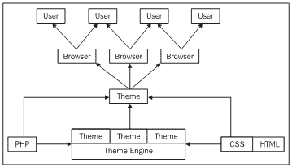

这个图表显示了一种倒置的水瀑布，图表中每一层之间的箭头代表了对上一层的一种贡献。换句话说，我们可以将 PHP、HTML 和 CSS 视为提供基础技术，这些技术为主题引擎和主题提供了向浏览器提供 HTML 的基座。一旦主题向浏览器提供了 HTML，浏览器就会将其渲染到屏幕上供用户查看。

在这里有几个需要注意的事项。首先，并非所有主题引擎都是基于纯 PHP 的。例如，Drupal 中有一个 Smarty 主题引擎，供熟悉 Smarty 模板的人使用。其次，市面上有各种各样的浏览器，而且它们并不完全相同。这意味着一个在某个浏览器上渲染得很好的页面，在另一个浏览器上可能看起来很糟糕，甚至无法正常工作。因此，你应该*使用几个不同的浏览器来测试你的网站！*

Drupal 帮助站点关于浏览器的说明如下：

> 建议你使用带有开发者工具栏和查看格式化源代码扩展的 Firefox 浏览器。

如果你希望使用除 Internet Explorer 以外的浏览器，可以在[`www.mozilla.com/firefox/`](http://www.mozilla.com/firefox/)获取 Firefox 浏览器的副本。

现在，就我们当前的情况而言，我们将限制自己选择一个基主题，并将其修改以提供网站的界面。这意味着现在你不需要担心主题引擎的复杂性。*我们现在可以继续并直接查看主题了吗？* 还不行；注意在之前的图表中有一个包含 CSS 术语的框。这在开发我们的界面方面非常重要，因为我们已经看到了 HTML 和 PHP 的实际应用，所以在继续之前，让我们先了解一下 CSS。

# CSS

Drupal 网站中的页面从关联的样式表中获取其样式相关信息，这些样式表存储在网站的基主题中。使用样式表为设计师提供了对网页外观的出色、精细的控制，甚至可以产生一些很好的效果。几乎可以控制网站的所有方面的外观，只需要一点关于字体、颜色和样式表语法的知识。

在我们继续之前，如果你有一个现成的列表，列出你应该使用样式表设置的类型的事情，这将使生活更加容易。以下是最常见的区域（由 HTML 元素定义）的列表，在这些区域中，样式表可以用来确定网站的样式和感觉：

+   背景

+   文本

+   字体

+   颜色

+   图片

+   边框

+   页边距

+   填充

+   列表

除了能够改变所有这些 HTML 方面，你还可以根据是否满足某些条件（如鼠标悬停在指定区域上）应用不同的效果——这将在稍后演示。你还可以为某些 HTML 标签指定属性，然后可以使用这些属性将这些特定标签的样式表样式应用到这些标签上，而不是创建应用范围的变化。例如，如果你有一个设置了`class`属性的段落样式，如下所示：

```php
<p class="center"></p>

```

你可以在样式表中明确指定这种类型的段落，例如：

```php
p.center { color: green; }

```

分析这一行突出了标准样式表代码块的结构，它以以下形式出现：

+   **选择器：**在这种情况下 `p.center`

+   **属性：**在这种情况下 `color`

+   **分隔符：**总是 `:`

+   **值：**在这种情况下 `green`

注意，所有的属性/值对都包含在大括号内，并且每个都以分号结束。这个 CSS 简介非常简短，而且有大量的优秀资源可供参考。如果你想了解更多关于这个（强烈推荐），那么请访问：

+   **CSS 讨论：**[`css-discuss.incutio.com/`](http://css-discuss.incutio.com/)

+   **HTML 狗：** [`www.htmldog.com/`](http://www.htmldog.com/)

现在你已经了解了 Drupal 的界面是如何通过使用 HTML、PHP、CSS 和主题创建的，以及你对样式表的工作原理有了了解，我们准备开始查看…

# 主题

主题的使用使得 Drupal 在处理网站界面时非常灵活。因为网站的功能在很大程度上与网站的表现是分离的，所以很容易改变外观，而不必担心会影响功能。这显然是一个非常有用的方面，因为它让你可以随意实验，知道如果最坏的情况发生，你可以重置默认设置并从头开始。 

你可以将主题视为你网站的**模板**，你可以对其进行修改以达到你想要的外观和感觉。当然，不同的主题具有非常不同的属性；因此，找到最接近你寻找的主题以减少你需要完成的工作量是很重要的。

因此，我们需要完成的第一项任务是…

## 选择基础主题

默认情况下，Drupal 附带了一些默认主题，在 Drupal 网站的**下载**部分还有更多可供选择。

### 注意

一些主题需要使用主题引擎，在这种情况下，您在尝试使用该主题之前，还需要下载并安装适当的引擎。

查看 Drupal 中**主题**页面上的现有内容，我们可以看到以下：

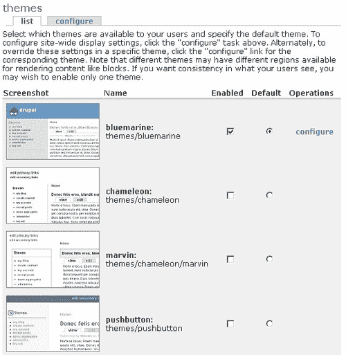

您可能想知道为什么可以启用任意数量的主题，但只能选择一个作为默认主题。这样做的原因是，如果您启用了多个选项，那么这些选项将可供用户选择（假设他们有足够的权限），通过编辑**我的账户**页面上的**编辑**选项卡中的**主题配置**偏好设置，如这里所示：

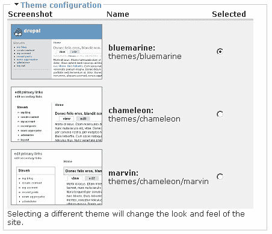

在这个例子中，**蓝海**、**变色龙**和**马文**主题都已启用，其中**蓝海**被选为默认主题。用户可以自行选择他们希望查看网站的方式。

返回可用的主题列表！启用**按钮式**主题并将其设置为默认主题，导致之前以标准蓝海主题呈现的网站看起来像这样：

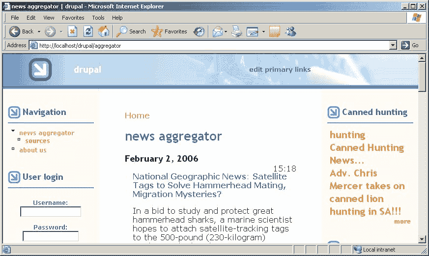

这与蓝海主题提供的先前外观有相当大的变化；然而，您应该能够注意到通用布局并没有太大变化——仍然有三列，有一个包含网站名称和标志的标题部分，有一个导航部分和几个框，等等。发生变化的是字体、颜色和一些图像——特别是请注意，这个主题的标题部分现在有一个背景图像。

### 注意

您应该花时间查看默认可用的每个主题，以便了解提供的选项。

这还不是故事的结尾，因为 Drupal 网站还有一大堆主题供我们探索，所以让我们转到[`drupal.org/project/Themes`](http://drupal.org/project/Themes)的主题页面，并选择相关版本选项卡以显示适用于您的 Drupal 安装的主题。请注意，其中一些主题需要您下载主题引擎——**Box_grey_smarty**贡献就是一个需要 Smarty 主题引擎才能工作的主题的例子。

您已经看到了如何下载和安装其他模块，安装主题的过程也没有不同——只需下载并解压缩所需主题的内容到您的`themes`文件夹。例如，**box_grey**主题已被下载，并在我们的主题列表中提供了两个新选项，如这里所示：


启用**box_grey**选项并将其设置为默认主题，导致网站看起来像这样：

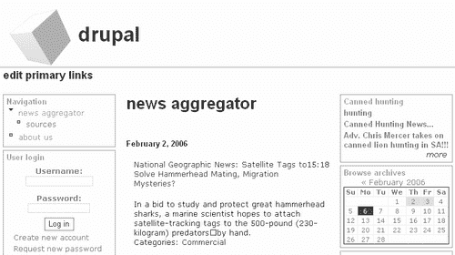

现在，您可以选择一系列默认主题，以及一些贡献的主题进行查看。一旦您决定喜欢其中一个，在进入下一阶段之前，您需要处理一些事情。正如您可能预料的，我们可以通过简单地点击**主题**页面上的**配置**链接来配置主题，所以让我们来看看这一点。

## 配置您的主题

点击主题页面顶部的**配置**标签页会显示全局主题选项，这将影响每个主题，无论使用的是哪个主题——如果您知道您始终希望启用某些功能，这将非常有用（使用**配置**页面顶部的链接在全局和主题特定设置之间导航也很容易）。

我们在这里将专注于**全局设置**页面，因为这个页面代表了所有主题配置页面，所以你单独处理每个页面时不会遇到任何问题。记住，你可以通过在特定主题的**配置**页面工作来覆盖这些设置。

第一部分允许您使用主题提供的默认标志，或者指定您自己的标志路径，或者上传一个新的标志到网站上：

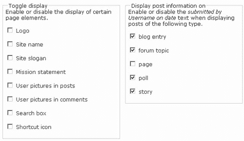

在演示网站的情况下，我们将使用背景图像来显示标志和名称；因此，这可以取消选中。如果您有网站标志，或者计划拥有一个，那么只需在这里上传它。

Drupal 还为我们提供了指定哪些内容类型需要显示帖子信息的能力。现在，我们已经看到，对于某些类型的页面，我们不需要显示此类信息——例如，*关于我们*页面应该以原样呈现，而不需要告知用户确切是谁创建了它。

上一个截图中所显示的设置原因在于，识别出博客帖子是由哪个人发布的，以及论坛主题也是如此，这是非常重要的。然而，当涉及到像投票、页面、书籍页面或故事这样的内容时，这样做的重要性就小得多——通常因为这些内容将由网站管理员处理。目前，我已将**页面**类型作为唯一不提供帖子信息的类型。

请记住，您需要考虑对您的网站有意义的事情，并应用反映您**特定需求**的设置。例如，识别出哪些书籍页面是由谁贡献的可能是非常重要的，这样作者就可以在需要查询或修改书籍页面内容的情况下被联系（尤其是由于书籍通常是协作努力的结果）。

以下部分允许您指定**Logo 图像设置**以及将在网站地址栏和任何书签中显示的图标。再次强调，您在这里使用的内容完全取决于您。就我们网站的目的而言，我们不需要创建一个特定的图标，我们还没有要上传的 Logo；因此，我们可以暂时留空。

因此，**配置**页面的其余部分看起来是这样的：

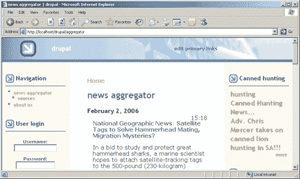

如您所猜测的，一切都被留空，因为我们没有指定任何新内容，我们也不想显示默认的 Logo 或图标。

### 注意

您需要确保在这里设置的任何内容都不会在单个主题的**配置**页面中意外地被覆盖。

## 定制您的主题

到目前为止，您所做的任何设置或更改都相当通用。随着我们开始实施一些更激进的修改，这些修改将需要修改样式表以获得正确的结果，事情即将发生变化。在演示网站的情况下，我选择使用**box_grey**主题，因为它最接近我们设想的外观，并且具有适合学习目的的功能。

下面是从他们的`readme`文件中关于**box_grey**的一些信息：

> *`box_`旨在对 CSS 定位不熟练的人相对容易修改。它不是完全使用 CSS 进行布局，而是一种所谓的混合布局——它使用 CSS 与非常简单的表格相结合*。
> 
> *这是一个标准的三个列布局，使用表格来表示中央三个列，表格上方有页眉，下方有页脚。这减少了可访问性并增加了一点点代码膨胀，但具有某些优点：*

+   *如果用户插入宽内容，内容列不会重叠*。

+   *内容在模板（page.tpl.php）中的顺序与它在页面上的顺序相同*。

+   *您可以添加任何尺寸的 Logo 图像；页眉应该扩展以适应*。

这些功能从学习如何使用样式表的角度来看是有用的，这不仅将为您提供一种有效的方法来定制您网站的外观，而且还可以为您提供一个平台，当您准备好时，可以在其他主题上尝试一些更高级的定制。

### 注意

如果您还没有找到，现在就是时候找到一个相当好的代码编辑器了，因为您将从此处开始查看各种代码文件。

导航到您的 Drupal 安装中的`themes`文件夹，并复制`box_grey`文件夹，将其命名为`box_grey_dev`。这使我们能够在不危及原始文件的情况下对主题的开发版本进行工作。返回到 Drupal 的**管理**部分中的**主题**，启用新的**box_grey_dev**主题，将其设置为默认主题。您这样做非常重要，这样您在检查您所做的任何更改对网站外观的影响时，就能知道您正在查看正确的主题。

现在，打开`box_grey_dev`文件夹，您会注意到有几个`.tpl.php`文件，具体如下：

+   `node.tpl.php`

+   `page.tpl.php`

+   `image_gallery.tpl.php`

这些代码负责其名称对应的布局。例如，`page.tpl.php`中的代码片段如下所示：

```php
<table id="content">
<tr>
<?php if ($sidebar_left != ""): ?>
<td class="sidebar" id="sidebar-left">
<?php print $sidebar_left ?>
</td>
<?php endif; ?>
<td class="main-content" id="content-<?php print $layout ?>">
<?php if ($title != ""): ?>
<h2 class="content-title"><?php print $title ?></h2>
<?php endif; ?>
<?php if ($tabs != ""): ?>
<?php print $tabs ?>
<?php endif; ?>
<?php if ($mission != ""): ?>
<div id="mission"><?php print $mission ?></div>
<?php endif; ?>
<?php if ($help != ""): ?>
<p id="help"><?php print $help ?></p>
<?php endif; ?>
<?php if ($messages != ""): ?>
<div id="message"><?php print $messages ?></div>
<?php endif; ?>
<!-- start main content -->
<?php print($content) ?>
<!-- end main content -->
</td><!-- mainContent -->
<?php if ($sidebar_right != ""): ?>
<td class="sidebar" id="sidebar-right">
<?php print $sidebar_right ?>
</td>
<?php endif; ?>
</tr>
</table>

```

如您所见，它使用 HTML 创建一个表格，定义了每个页面的内容。它使用一系列 PHP `if`语句来检查是否显示诸如左侧边栏或使命宣言等内容。PHP 代码嵌入在具有某些属性的 HTML 标签中——例如`id="mission"`或`id="message"`。不用担心这些 PHP 变量是如何填充的；我们不想改变网站的功能方式，我们只是查看它的布局方式。

*但为什么他们要为 HTML 页面不同部分设置类和 id 属性呢？* 这就是 CSS 发挥作用的时刻。我们已经知道我们想要为我们的网站创建一个一致的外观。这意味着每种相关内容都应该有相同的外观和感觉——换句话说，每个页面的内容都应该以相似的方式呈现。在这种情况下，我们可以将内容的一个`class`或`id`分类为某种类型，然后，使用该属性标签，指定它应在样式表中如何布局。

您应该要求证明，现在它就在这里…

在`box_grey_dev`主题中打开`style.css`文件，并搜索以下代码片段：

```php
body {
color: #000;
background: #fff;
font-family: Verdana, Helvetica, Arial, Lucida, sans-serif;
font-size: 84%;
padding: 0;
margin: 0;
}

```

将其更改为：

```php
body {
color: #000;
background: #8E6C63;
font-family: Verdana, Helvetica, Arial, Lucida, sans-serif;
font-size: 84%;
padding: 0;
margin: 0;
}

```

保存这些更改，并在浏览器中刷新您的 Drupal 网站视图。您现在应该会发现您页面的内容已经改变，您的页面看起来可能如下所示：

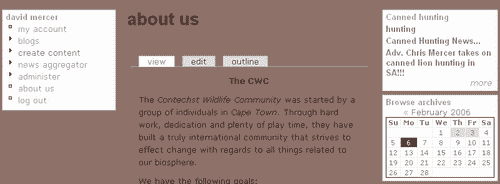

在样式表中仅对`body`标签进行单个更改，就改变了整个网站每个页面的背景颜色。这是样式表的一个非常强大且有用的特性，这也是为什么现在每个人都这么喜欢使用它们的原因。您可以将其改回原始设置，或者保持不变——目前这没有区别，因为一旦您为网站选择了颜色方案，它无疑会发生变化。

现在您已经知道如何实施更改并查看这些更改对您网站的影响，您就可以继续修改样式表，以反映您希望网站的外观。在接下来的章节中，我们将讨论几种不同的修改类型，而不会逐个详述——相信我，与网页相关联的特性有很多！一旦您掌握了在一个区域进行更改的方法，将其应用到其他地方就很容易了，因此您应该会发现这里的覆盖范围足以让您有信心开始操作。

对于演示网站来说，第一个任务之一是创建和上传一个将作为网站页眉部分的标志和标题的图片。

## 图片

图片和背景图片可能很难处理，因为它们通常具有固定的宽度，而网页则可以调整大小。如果图片停止在页面大小之前或位于错误的位置，看起来会很糟糕，因此我们需要找出如何使我们的图片融入网站，这样在不同屏幕上工作的观众就不会看到不整洁的图片。

在演示网站的情况下，我想要一个粗糙而相当生动的自然场景，还有什么比通过非洲灌木丛展示的日落更好的选择呢（注意，网站的名称/标志实际上是这张图片的一部分，这就是为什么我们放弃了标准的网站名称和标志）：


然而，为了在网站上展示这个，我们需要对样式表做一些工作。此外，我们希望它紧挨着页面的左上角展示，因此这实际上将成为我们网站的标志图片。将此作为网站标志添加是一个简单的过程，只需在主题的**配置**页面上传它，如下所示：

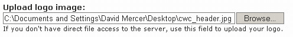

并确保为这个特定的主题启用了**标志**选项。由于你有文件系统的访问权限，你也可以直接将图片复制到`files`文件夹中，然后从位于**上传标志图片**框直接上方的**自定义标志路径**文本框中引用它：

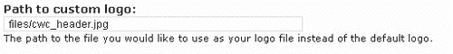

你也可以简单地保存新的标志图片覆盖旧的原始图片，它也会正常显示。

如果你发现你在查看这张图片时遇到问题，那么最可能的原因是你的**管理员菜单**中的**设置**部分的**文件系统设置**有问题。检查它们以确保你将文件保存到正确的位置，并且你正在尝试从正确的位置访问它们。

完成这些后，我们现在可以查看网站，看看这产生了什么效果：

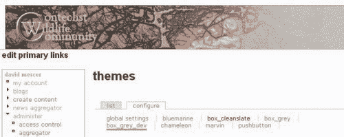

哎呀！目前看起来不太好，因为如果你仔细看，新的图片向右偏移了（尽管在截图中这可能不是很明显，向下偏移也是如此）。为了纠正这个问题，我们需要查看偏移的原因。为此，我们需要找出负责显示这个页面区域的代码。

在`page.tpl.php`文件的顶部附近查看，我们看到以下内容：

```php
<div id="header">
<?php if ($search_box): ?>
<form action="<?php print $search_url ?>" method="post">
<div id="search">
<input class="form-text" type="text" size="15" value="" name="edit[keys]" /><input class="form-submit" type="submit" value="<?php print $search_button_text ?>" />
</div>
</form>
<?php endif; ?>

<?php if ($logo) : ?>
<a href="<?php print url() ?>" title="Index Page">" alt="Logo" /></a>
<?php endif; ?>

```

这段代码片段底部高亮的代码负责显示网站的标志（取决于`$logo`）。正如你所见，这个部分使用`header`作为`<div>`标签的`id`属性，因此我们应该能够通过查看样式表来找出发生了什么。果然，我们找到了以下两个与标题相关的标签，它们影响了我们图片的位置：

```php
#header {
position: relative;
padding: 1em 0 0 0;
margin: 0;
}
#header img {
margin: 0 0.75em 0 1em;
float: left;
}

```

这两个都可以修改，以移除导致不希望偏移的填充和边距，如下所示：

```php
#header {
position: relative;
padding: 0 0 0 0;
margin: 0;
}
#header img {
margin: 0 0.75em 0 0;
float: left;
}

```

保存这些更改后，你会发现图像显示在期望的位置。显然，你可以根据需要添加填充或更改与图像相关的边距。

在这一点上认识到，这种变化可能不仅限于你打算改变的区域。可能发生的情况是，为了纠正一个区域而进行的改变实际上伤害了另一个区域——在这种情况下，如果我们使用了任何填充，那么填充的丢失可能会使标题的其他区域的图像看起来很糟糕。*如何解决这个问题？* 你已经知道，我们可以在页面上的某些标签上添加某些属性。为了解决这个问题，你会在要更改的区域添加自己的自定义标签，并从样式表中引用它，给它赋予你需要的属性。

当然，你可能也想在你的网站上添加背景图像。如果你确实打算使用背景图像，确保它们不会影响网站的可用性。不要以任何方式分散或阻碍用户查看内容。如果你确定你的背景图像不会以任何方式造成损害，那么使用 `background` 属性是前进的方向。

例如，我按照以下方式修改了样式表中的 `body` 块：

```php
body {
color: #000;
font-family: Verdana, Helvetica, Arial, Lucida, sans-serif;
font-size: 84%;
padding: 0;
margin: 0;
background: url(http://localhost/drupal/files/block_background.png) no-repeat top;
}

```

从这个例子中你可以看出，`background` 属性实际上可以做很多不仅仅是指定要使用的颜色——我们目前甚至没有指定背景颜色，因为我们很快就会处理颜色。在这种情况下，它还设置了一个背景图像的位置。它强制浏览器不要重复图像（我们不希望背景中重复的图像图案使网站显得杂乱），最后告诉浏览器在主体区域的顶部渲染图像。假设你实际上创建了一个你想要使用的图像（在这种情况下，图像名为 `block_background.png`）并确保它很小，你最终会得到如下所示的结果：

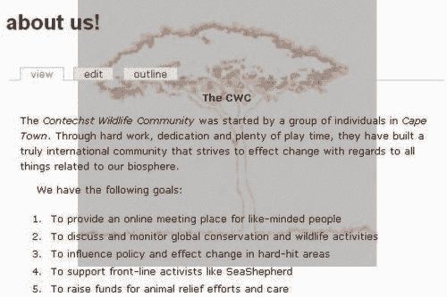

如你 hopefully 能告诉的，这个背景图像相当不显眼，不会使阅读任何内容变得特别困难，尽管很明显，它还不是背景的颜色。当然，你不仅限于将背景图像添加到网站的正文部分——你还可以在其他地方添加它们。只需首先检查哪些 HTML 标签支持 `background` 或 `background-image` 选项。

在我们继续查看颜色之前，重要的是要意识到这里有一个不幸的问题。你能发现吗？想想当这些更改部署到你的实时网站时会发生什么。*那个域的 URL 是什么？*它肯定不是`http://localhost/drupal`；所以当你的样式表开始搜索背景图片，寻找`http://localhost/drupal/files/ block_background.png`时，它将会失败。

### 注意

考虑将所有主题相关的图片添加到实际的`theme`文件夹中，而不仅仅是上传到标准的`files`文件夹。

让我们在`box_grey_dev`下创建一个`images`文件夹来试一试。将你的背景图片插入这个文件夹，然后将绝对 URL `http://localhost/drupal/files/block_background.png`更改为相对 URL `images/block_background.png`，并确认你得到了预期的结果。

现在，当部署你的网站时，你不会遇到丢失图片的问题，因为相对 URL 路径被保留——改变的是绝对路径。

## 颜色

在放置了新的图片之后，你可能已经注意到它们与网站的其他部分并不很好地搭配，因为它们目前默认是白色的。为了纠正这个问题，我们将把网站`body`标签的背景颜色更改为以下颜色：

```php
body {
color: #000;
background: #BEBEBE url(images/block_background.png) no-repeat top;
font-family: Verdana, Helvetica, Arial, Lucida, sans-serif;
font-size: 84%;
padding: 0;
margin: 0;
}

```

通过这次修改，网站看起来好一些了。背景图片无缝集成，页眉图片现在逐渐过渡到正确的颜色，这样当用户扩大浏览器宽度时，图片和页面其他部分之间会有自然的过渡。

然而，随着背景颜色的改变，需要对其他颜色进行大量修改，尤其是用于超链接的颜色。当然，甚至没有必要改变背景颜色！我本可以将页眉图片与默认颜色混合，或者使背景图片的背景透明，但让我们继续进行一些修改，以了解可以做什么。

现在，你可以根据喜好对网站的颜色进行多少或多少的更改。你已经看到，改变像`background`或`color`这样的属性的属性颜色，只是将新的颜色代码插入到正确的位置；现在我们将列出一些更有趣的更改，如下所示。

*超链接：*

```php
a, a:link { color: #3A3730; }
a:visited { color: #111111; }
a:hover, a:focus { color: #888888; }
a:active { color: #444444; }
.sidebar .block a:hover { color: #444444; }
#primary a:hover { color: #777; }

```

*侧边栏：*

```php
.sidebar .block {
background: #E5E5E5;
border: solid 1px #999;
margin: 0 5px 5px 5px;
padding: 0 5px 5px 5px;
}

```

*输入：*

```php
input, textarea {
background: #E5E5E5;
color: inherit;
border: 1px solid #777;
}

```

*页脚：*

```php
#footer {
color: #666;
background: #E5E5E5;
border-top: solid 1px #777;
padding: 1em 1em 1em 1em;
font-size: 0.9em;
text-align: center;
}

```

*主要：*

```php
#primary {
font-size: 1.2em;
border-top: solid 1px #999;

                            border: solid 1px #999;
background: #E5E5E5;    

}

```

一旦完成所有颜色更改，一个标准页面可能看起来像这样：

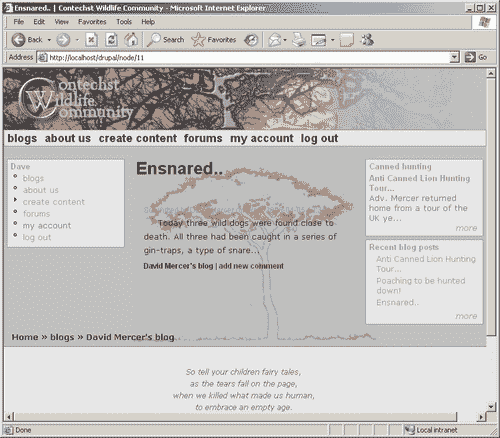

现在的网站易于使用，希望你会同意颜色搭配至少是容易让人接受的。记住在调整自己的设置时，样式表中有很多与颜色相关的设置，所以你真的需要仔细检查你的网站，以确保在链接因为颜色与背景非常相似而消失时不会出现任何令人不快的惊喜。

## 页面修改

完全有可能页面的实际布局并不符合你的喜好。在这种情况下，当你想要进行更改时，有两个选择。你可以使用样式表进行有限的更改。例如，如果你发现侧边栏对于网站来说太窄了，它们可以被扩展（或者如果需要的话，可以缩小）到固定的像素宽度，通过修改以下代码块：

```php
td.sidebar {
vertical-align: top;
padding: 0;
    width: 200px;                            

}

```

*但是，如果你需要对网站进行更彻底的修改怎么办？* 假设，例如，你想要在每个页面上添加一个额外的列，以便插入一些广告，希望从网站上产生一些收入。为了做到这一点，我们需要查看`page.tpl.php`文件，因为这是控制每个页面布局的地方。根据你的冒险精神，你可以在特定时间只显示带有广告的列中添加一些条件 PHP 代码。对我们来说，简单地添加新列就足够了。

顺便说一下，我们将用于演示的广告直接来自亚马逊联盟网站，如果你对使用这种类型的广告感兴趣，确保你查看 Drupal 网站上与亚马逊相关的各种贡献。目前，重要的是看到如何添加列——你可以随时查看贡献或亚马逊联盟。

假设我们想要列出现在页面的最右侧，在右侧边栏之后，这样它就不会以任何明显的方式影响网站的使用。如果是这样的话，我们需要找到代码中添加右侧边栏的位置，并在那里添加新列。在`page.tpl.php`文件中寻找以下代码片段：

```php
<td class="sidebar" id="sidebar-right">
<?php print $sidebar_right ?>
</td>

```

如你所见，这负责添加一个包含右侧边栏的表格单元格。简单地在这个单元格之后添加另一个单元格应该就可以了，所以让我们继续尝试。对文件进行以下更改：

```php
<?php if ($sidebar_right != ""): ?>
<td class="sidebar" id="sidebar-right">
<?php print $sidebar_right ?>
</td>
<?php endif; ?>
   <td valign="top" width="120">
<iframe src="img/cm?t=**************&o=1& p=11&l=ez&f=ifr&f=ifr" width="120" height="600" scrolling="no" border="0" frameborder="0" style="border:none;"></iframe>
</td>                             
</tr>
</table>

```

这里有几个重要的要点需要注意。首先，新的单元格，被`<td>`标签包围，被放置在 PHP `if`语句之后，因为我们不希望它受到与右侧边栏相同的条件（它应该简单地显示在每个页面上）。

其次，除了内容在单元格顶部垂直对齐外，单元格的宽度被设置为 120 像素，因为我们从亚马逊的代码中知道广告的宽度始终是 120 像素（这是因为我们选择了特定尺寸的广告）。最后，添加的广告代码由亚马逊提供，如果你希望获得这样的广告，那么在某个阶段你将需要注册亚马逊以获取你的 ID（在之前的代码中用`*`符号遮挡）。

现在查看网站可以看到，广告正如预期那样显示：

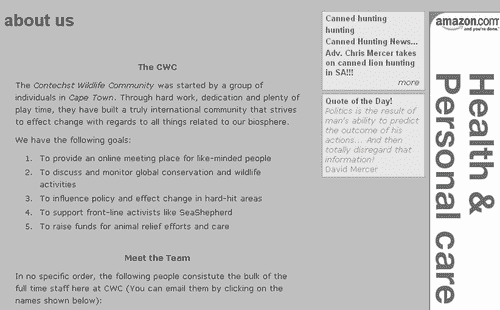

当然，你可能在页面上想要实现很多不同的功能，所以花些时间玩弄代码将有助于你以后在需要对网站进行更重大更改时。你甚至可能想在页眉部分添加横幅广告。回想一下，我们通过将网站的标志空间变成整个页眉来稍微作弊。这样做意味着页眉中仍然预留了空间供其他内容使用（即使这是不可见的），作为一个练习，你可能想看看是否可以利用这个空间。

这让我想起要重申……

### 注意

在多个浏览器上测试你对网站所做的任何更改是极其重要的！

测试你的布局不仅仅是检查所有内容是否在正确的位置。确保 CSS 和 HTML 有效且正确是非常重要的，而为了实现这一点，`box_grey`中自动提供了资源。只需滚动到页面底部，直到你看到这个：

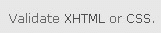

一旦你的网站在互联网上的公共域名上运行，点击这些链接将帮助你确保你的布局代码是有效的。如果报告了任何问题，那么责任在于你确保你的网站尽可能符合要求。不幸的是，如果你尝试从你的开发机器上这样做，你很可能会收到错误消息，因为这些服务只能在公共域名上工作。

# 摘要

从了解在规划网站外观和感觉时必须考虑的因素，到对代码进行修改，本章为你提供了在 Drupal 界面工作的基础知识。

个性化网站外观最重要的方面之一是了解 Drupal 是如何设置的，以便利用主题的强大功能。正如我们所见，主题提供了一种模板，你可以从中工作以创建自己的独特网站。这为我们节省了大量的时间和精力，因为我们不再需要从头开始工作。我们还简要提到了从主题引擎生成主题的可能性，希望你一旦获得更多经验，将能够自信地更详细地研究这一点。

关于构建您网站界面的问题，经验非常重要。您需要花时间与以下三种主要技术一起工作：HTML、CSS 和 PHP。在本章中，我们在开始修改我们选择的基主题提供的样式表之前，对 CSS 进行了详细的研究。无论您选择什么作为您网站的基础主题，您面临的任务在本质上将与本章中讨论的任务相似，并且您可能会发现 CSS 是您武器库中最强大和最有用的武器之一。

从处理图像和 HTML 中获得的知识，以及应用所讨论的设计考虑因素，将不仅有助于您的 Drupal 网站，而且有助于您最终工作的任何其他基于 Web 的应用程序。对各种不同类型设计的欣赏，以及必须与图像和代码一起工作，将使您在未来能够创建更具雄心的图形用户界面。
