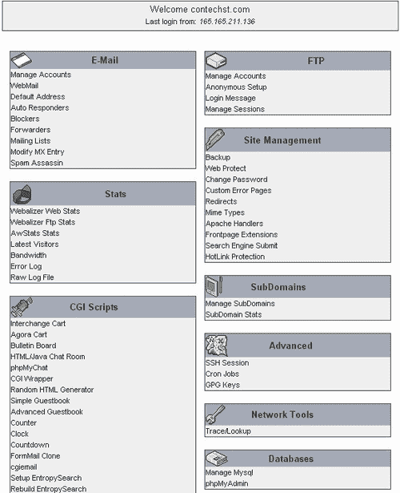

# 第十章。运行您的网站

到现在为止，新网站的开发工作已经基本完成！你也应该有信心，从开发角度来看，你可以应对网站提出的任何要求，并且能够熟练地与 Drupal 一起工作。然而，就像计算世界中的所有事物一样，仅仅构建某物然后让创造物自行运行是远远不够的。总有工作要做，以确保一切运行顺畅。

通常，你会发现有些工作需要不时进行，这些工作与 Drupal 没有直接关系，但与一般网站工作本质上是相关的。这些任务在性质上可能有很大的不同，但这里讨论的所有任务都将在你网站的某个阶段变得有用，即使你现在不需要它们。

在展示这样一章时，我们不可能希望涵盖 Drupal 可以运行的庞大平台阵列中的每一个细微差别。互联网服务提供商（ISPs）提供的服务包差异很大，可能完全缺乏任何有用的功能，或者装满了所有最新的小工具——大多数 ISPs 在同一个屋檐下提供大量不同的服务包。

因此，我们将查看常用的功能，并在你无法访问相同软件的情况下，清楚地展示你需要执行的任务，以便你仍然可以使用你拥有的软件成功操作。例如，通过使用 Apache2Triad 包，我们已经在开发机器上拥有某些有用的技术，例如 phpMyAdmin。

### 注意

在选择托管套餐之前（假设您还没有）阅读本章可能会有所帮助，这样您可以了解未来需要的功能类型。

Drupal 还有一些其他与网络相关的活动是固有的，我们应该花时间快速浏览一下。因此，本章将讨论：

+   制作备份

+   Cron 和计划任务

+   节流

+   补丁

+   网站活动——包括搜索引擎优化和用户维护

拥有本最终章节所提供的信息，你将是一名完全装备的 Drupal 网站管理员。然而，从运营一个真实网站中获得的经验本身应该比这本谦逊的书籍更有价值。希望你能发现整个经历非常有益，并在未来与社区分享你辛苦获得的知识。

我们已经接近终点，所以让我们继续前进。

# 备份

备份文件系统和数据库有很多原因。正如本书中多次提到的，每次修改代码、添加新模块或升级 Drupal 版本时，都应该备份任何可能受损的内容。听起来做这件事真的很痛苦，因为绝大多数时候，应用程序都没有问题。然而，迟早，由于某种无法理解的原因，如果你不做备份，你 *确实* 会在这个最痛苦的地方受到打击。

尤其是损坏或破坏数据库，这反过来又导致宝贵数据的丢失，可能会在应用程序的后端造成真正的痛苦！所以，虽然通过简单地复制相关目录或确实复制整个 `drupal` 文件夹（无论你给它取了什么名字）来备份文件系统相对容易，但学习如何备份数据库至关重要，因为这并不简单——虽然随着练习会变得容易。

在继续之前，制定一个备份文件、文件夹和数据的 *策略* 非常重要。定期备份整个站点以及更频繁地备份数据库是个好主意。这些备份应该有清晰的标记，以便你知道它们是在何时制作的，这样在发生某种灾难时可以轻松确定使用哪一个。你也可以考虑将这些备份放在主文件系统之外，比如在 CD 上，这样如果发生真正糟糕的事情，你不必依赖托管商的灾难恢复策略；你拥有自己的备份。

在这里，我们将考虑两种备份数据库（或其任何部分）的方法。一种方法是利用 phpMyAdmin，它是 Apache2Triad 包的一部分。让我们从那开始。

## phpMyAdmin

phpMyAdmin 是一个特别受欢迎且常见的工具，通过 Web 与 MySQL 进行交互。它不需要我们学习如何使用 MySQL 命令行客户端，phpMyAdmin 为我们提供了一个图形界面，这使得查看和维护数据库表和内容变得容易得多。通过界面执行命令也使得许多常见的数据相关任务变得简单。

可以按照以下步骤使用 phpMyAdmin 创建备份：

1.  登录 phpMyAdmin 并选择相关的 Drupal 数据库。

1.  点击页面顶部的 **导出** 选项卡，并设置选项，如这里所示：

    +   在屏幕截图中，选择了所有要备份的表，为了防止我们手动删除损坏的数据库，所有结构复选框都被选中，并提供了一个有用的名称（一旦生成备份文件，它将自动包含数据库名称）——像这样附加日期是个好主意，因为它将帮助你跟踪哪个备份是哪个。

1.  一旦你对选项满意，点击**Go**，这将创建一个 SQL 文件（尽管还有其他格式可供选择，如 LaTeX 或 XML），如果需要，你可以从该文件重新创建数据库。

一旦你有了备份文件，只需让 MySQL 运行其内容即可重新创建数据库。为了做到这一点，点击页面顶部的**SQL**标签，并输入你想要在数据库上运行的`.sql`文件名，如下所示：


这使得生活相当简单，但并非只有这一种方法。如果你已经习惯了使用命令行，或者只是更喜欢它，那么我们已经看到了如何做到这一点，当我们发出加载原始数据库的命令时：

```php
C:\ mysql -udrupal -p drupal < C:/apache2triad/htdocs/drupal-4.6.4/ database/database.mysql

```

你只需修改路径和文件名以反映你新的备份文件的详细信息，如下所示：

```php
C:\ mysql -uroot -p drupal < C:/backups/drupal_13_04_06.sql

```

创建备份的另一种方法是使用命令行中的`mysqldump`工具。

## mysqldump 工具

花些时间使用这个工具可能是值得的，因为它提供了更大的灵活性，以防你将来需要执行任何非同寻常的操作。然而，我必须承认，对于大多数数据库相关任务，phpMyAdmin 的表现都非常出色。如果你无法访问托管网站上的 phpMyAdmin，或者你热衷于了解`mysqldump`，那么请继续使用它……

要创建一个备份，只需在命令行中输入类似以下的内容：

```php
C:\ mysqldump drupal > drupal_13_04_06.sql

```

这将在当前目录中创建一个名为`drupal_06_11_05.sql`的备份文件。然后你可以通过查看文件内容来确保备份成功，文件将包含大量的 SQL 语句。你可以使用多种不同的选项来获取不同类型的备份文件；你可以简单地输入：

```php
C:\ mysqldump help

```

为了获得可用列表。`mysqldump`是一个强大且灵活的工具，了解它是如何工作的，如果你打算尝试一些更高级的备份选项，这将对你长期有益。

再次强调，定期备份数据库是一个好的做法，无论你是否需要这样做来升级，因为这样做可以在数据库或其信息丢失的情况下防止数据完全丢失。

# Cron 和计划任务

为了使网站运行顺畅并保持最新，需要定期执行各种任务。例如，我们在本书中较早提到，聚合模块需要定期运行，以便更新所有其源和等等。Drupal 开发者非常清楚需要处理的任务；因此，他们将所有内容打包成一个方便的脚本——cron.php。

您需要设置**crontab**或**计划任务**以执行位于您的 Drupal 安装主文件夹中的`cron.php` 脚本，以便它可以执行所有必要的任务。cron 脚本基本上会搜索整个站点并执行适用于模块或其他事物（如日志处理）的任务，以确保它们都保持更新。

让我们看看如何控制 crontab，然后为 Windows 用户设置计划任务。

## Crontab

如果您不是特别想学习如何在托管站点上使用 crontab，那么您可以自由地跳到本章稍后提到的名为*Poormanscron*的部分。尽管如此，建议您学习如何使用 crontab，因为它无疑会在您的 Drupal 站点不可立即访问时派上用场。

crontab 中设置的变量都是数值常数，除了星号字符，它是一个通配符，允许任何值。每个字段允许的范围如下：

+   分钟：0-59

+   小时：0-23

+   月份中的日期：1-31

+   月份：1-12

+   星期：0-7（星期日是 0 或 7）

您可以通过用逗号分隔每个值来为每个条目包含多个值。您希望发出的命令可以是任何 shell 命令，并且可以用来执行网页，如`cronfeed.php` 文件。许多托管公司都将有一个如下所示的界面，它允许您轻松地使用 crontab：


在最后的条目中，您可以看到（希望如此）`cron.php` 脚本被设置为每天午夜运行，使用以下命令：

```php
/usr/bin/lynx source http://www.cwc.com/cron.php

```

例如，第一个任务被设置为每小时运行一次（记住用您自己的站点 URL 替换上一个片段中突出显示的代码）。注意，`php` 命令没有用于执行 cron 脚本，就像用于其他两个脚本一样——这是因为`cron.php` 文件需要作为网页访问，以便正确设置某些环境变量。

### 小贴士

将您的 cron 作业设置为定期运行，以确保您的站点尽可能保持最新！建议每天运行`cron.php` 几次。

## Windows 计划任务

如果您正在使用基于 Windows 的服务器，或者希望在开发过程中在 Windows PC 上启用计划任务，您可以使用**计划任务向导**。以下说明来自 Drupal 网站，详细解释了如何完成此操作：

1.  前往**开始 | 程序 |附件 | 系统工具 | 计划任务**。

1.  双击**添加计划任务**。

1.  **计划任务向导**将出现。点击**下一步**。

1.  选择要运行的程序。从列表中选择您的**浏览器**（例如，Internet Explorer 或 Firefox）。点击**下一步**。

1.  给任务一个**名称**，例如**Drupal 计划任务**，并选择执行任务的**频率**（例如，**每日**）。点击**下一步**。

1.  选择具体的**日期和时间选项**（这一步将根据前一步选择的选项而变化）。完成后点击**下一步**。

1.  如果需要，输入你的**密码**。如果需要（例如，如果你希望任务在具有较少权限的用户下运行以出于安全原因），更改**用户名**。点击**下一步**。

1.  在最后一页，选择复选框**当我点击完成时为这个任务打开高级属性**，然后点击**完成**。

1.  您可以通过勾选最后一步末尾的复选框或双击任务来进入任务的设置页面。

1.  在**运行**框中，在现有的文本之后（例如，**C:\PROGRA~1\MOZILL~1\firefox.exe**），输入一个空格，然后使用双引号输入你网站`cron.php`页面的地址（例如，**C:\PROGRA~1\MOZILL~1\**firefox.exe **"http://localhost/drupal/cron.php"**）。

1.  要设置高于**每日**（例如，**每小时**）的频率，点击**计划**选项卡，然后点击**高级**。在这里，你可以设置诸如**重复**任务，每**1 小时**重复**23 小时**等选项。完成后点击**确定**。

1.  将任务的**开始时间**设置为**从当前时间起一分钟**。这将允许你测试任务并确保它正在运行。

1.  当所有设置都按照你的喜好配置好后，点击**应用**和**确定**（注意，你可能需要输入密码）。

如果你发现你无法在你的主机网站上设置 cron 作业在网站上线后运行，那么你可以使用一个巧妙的技巧，并按照以下说明将你的 Windows 计划任务设置为直接从你的家用 PC 访问`cron.php`脚本，而不是使用上述指令。这意味着 cron 脚本将根据你的设置，在 PC 在线且能够访问网页时执行，频率取决于你的设置。

这最后一点突出了 Drupal 在执行定期必要任务方面使事情变得多么简单。你所需要的只是一个浏览器应用程序来访问`cron.php`脚本，Drupal 网站需要运行的任何任务都将被执行。你可以从自己的浏览器访问这个脚本，或者设置你的 PC 在启动时执行它，或者任何其他数量的事情。

## Poormanscron

毫不奇怪，有一个贡献可以让生活变得更加简单。**Poormanscron**是一个贡献模块，它消除了设置 crontab 或计划任务的需求。

它的工作原理是在每次浏览网页时检查 cron 脚本是否在上一个时间单位（无论你设置为多久；默认为每小时）内运行过。如果发现有一个 cron 任务即将执行，它将在页面被服务后触发这个任务（这样用户在查看页面之前不需要等待任务完成）。

通俗来说，Poormanscron 意味着您无需学习任何关于 cron 作业的知识。这很方便，但也是一把双刃剑！很可能您还需要使用 cron 作业来完成其他任务，如果您使用 Poormanscron 来管理 Drupal，那么您实际上只是在推迟必须坐下来学习如何使用 crontab 或计划任务的时间。无论如何，您已经看到了如何使用所有选项的示例；所以剩下的就是让我们看看如何与 Poormanscron 一起工作：

1.  从 Drupal 网站下载 Poormanscron 模块。

1.  将文件提取到您的`modules`文件夹中。

1.  在**administer**下的**modules**部分启用该模块。

这就是全部内容——只要您的网站有规律的使用，cron 任务将顺利运行，您无需担心手动访问`cron.php`脚本或设置 crontab。

然而，过了一段时间后，您可能会对不断看到记录的 cron 消息感到厌烦。如果您想管理 Poormanscron 模块，那么请转到管理区域中的**settings**下的**poormanscron**，以显示以下页面：


如您所见，有多个选项可供控制 cron 作业应该多久运行一次，错误后应该等待多长时间再重试，以及您的日志策略应该是什么。在这种情况下，日志已被禁用，因为目前没有紧急需要手动验证的内容（暂且如此）。如果您添加了新的软件并需要确认它是否被`cron.php`脚本正确执行，那么您可能需要考虑重新启用日志。

# 节流

有时候，有人会创建一个网站，这个网站会变得非常受欢迎。大量的人访问一个网站可能会对服务器的资源造成严重的压力，并在拥堵时引发各种问题。即使一个网站并不特别受欢迎，它也可能遭到来自某处的**拒绝服务**攻击。

在考虑在网站上设置节流机制之前，了解您可用的资源非常重要：

### 注意

如果您已经确保有设施来处理**大量流量**，那么实际上您已经使节流模块变得多余。

如果您不确定您的网站上有什么资源可用，请咨询托管服务并了解他们提供了什么。

假设你预计会有某种拥塞控制的需求，处理流量或带宽使用激增的一个好方法是启用 Drupal 附带的自带节流机制，即上述节流模块。通过在管理工具的**模块**部分启用它，这很容易实现。一旦完成，你可以通过导航到管理区域设置下的**节流**页面来配置模块在网站上的总体行为。这将显示以下页面：


此页面从使用该网站的人数的角度处理拥塞。在这种情况下，Drupal 被指示在有**300**人或更多在线匿名用户时启用自动节流，对于有超过**100**个在线认证用户的情况也是如此。最后一个选项涉及实际限制节流机制必须完成的工作量，以便它本身不会成为资源消耗者。

*但如果你知道是某个特定模块消耗了超过其应得份额的资源呢？*在这种情况下，你只需在管理工具的**模块**部分为该特定模块启用自动节流，如图所示：


这也可以按块块进行，通过导航到**块**部分并执行相同操作。*但节流块最终意味着什么？*基本上，如果你的服务器承受压力，并且你设置了一个自动节流的块，它将被禁用，不会对服务器的负载做出贡献。

你可以通过查看日志消息来确定在任何给定时间节流模块正在做什么。例如，我将节流机制设置为仅在一位用户访问网站后启动。然后创建了以下日志消息：


这并不多，但至少它清楚地表明了何时启用节流。一旦负载足够降低，将发送一条相应的消息，表明可以解除节流，事情可以恢复正常。

虽然以下这一点与节流没有直接关系，但了解你网站的性能以及你可以做什么来确保它是好的是很重要的。查看[`drupal.org/node/2601`](http://drupal.org/node/2601)了解如何：

+   分析你网站的性能

+   通过使用`robot.txt`文件阻止各种类型的网络爬虫访问你网站的某些部分，以减少你服务器的负载

+   了解 Apache 性能以及 PHP 和 MySQL 调优

你现在获得的知识可以预先用来防止可能在未来阻碍用户的性能问题——即使你不太可能在早期注意到任何与性能相关的问题。

# 补丁

不时地，人们会清楚地发现 Drupal 模块或其他方面存在一个 bug。这在软件进行重大改版时尤其令人担忧，因为每个人都疯狂地工作以保持进度——鉴于 Drupal 在撰写本文时刚刚升级到 4.7 版本，这一点现在比以往任何时候都更加重要。当这种情况发生时，人们通常会去论坛看看是否有人遇到过相同的问题。通常情况下，就像 bug 一样，其他人也可能遇到了同样的问题，也许有人已经能够解决这个问题。

如果有人在自己的机器上解决了这个问题，那么他们很可能会提交一个**补丁**文件到论坛，以便其他人可以使用它来修复自己的代码。在这个时候，重要的是要意识到以下几点：

+   如果您不想遇到任何问题，请确保您只下载经过良好测试和稳定的软件用于您的网站。通常，模块的 CVS 版本仍然包含 bug 或错误，因此最好等到模块发布并针对您的 Drupal 特定版本进行测试后再使用。

+   补丁文件并非特定于 Drupal。它们只是解释了一组应该添加或删除的代码行的文件，这样补丁工具就可以在不需人工干预的情况下实施这些更改。

+   补丁工具不是 Windows 机器的本地工具——它们与基于 Unix 的操作系统（如 Linux）一起提供。

如果 Linux 用户发现需要实施补丁，他们需要花一些时间学习如何使用补丁工具。Windows 用户需要更进一步，首先下载一个补丁工具。幸运的是，[`unxutils.sourceforge.net/`](http://unxutils.sourceforge.net/) 提供了常见的 Unix 工具的下载。这其中包括补丁工具，您需要将内容提取到一个文件夹中——`patch.exe` 文件将位于您提取文件的目录中的 `usr\local\wbin` 文件夹内。

`patch.exe` 文件现在可以像任何其他命令行工具一样使用。我们已经多次使用过 `mysql` 命令工具，所以您对此有一些经验。使用补丁的一般语法如下：

```php
C:\ patch [options] [originalfile [patchfile]]

```

在这种情况下，`originalfile` 是应该应用更改的文件，而 `patchfile` 显然是包含要实施更改的补丁文件。有许多选项可以查看，因此在处理它之前请查看补丁的 man 页面。您可以在[`www.hmug.org/man/1/patch.php`](http://www.hmug.org/man/1/patch.php)找到它。一个典型的命令可能看起来像这样（当然，如果您不在一个目录中工作，您需要确保输入正确的文件路径）：

```php
C:\patch buggy_code.php buggy_code.patch

```

现在有一个重要的路径相关的问题需要解决。如果你想在命令行的任何位置使用`patch`，你需要将其文件路径添加到你的**Path**系统变量中——否则，你每次使用`patch`之前都必须在命令行中导航到`usr\local\wbin`文件夹（你也可以选择将`patch.exe`添加到已经存在于你的**Path**中的文件夹，但可能更好的做法是将所有内容分开）。

要这样做：

1.  打开**控制面板**并点击**系统**。

1.  点击**高级**选项卡并点击**环境变量**

1.  将`patch.exe`文件的路径添加到**系统变量**部分的**Path**环境变量中，如图所示：

1.  完成后，点击**确定**。

注意，**Path**环境变量中设置的每个路径都是由分号分隔的。你必须确保除了添加单个路径之外，不要更改任何内容；否则，你可能会破坏其他重要的应用程序。

完成这些操作后，你现在可以从命令行的任何位置访问补丁实用程序。现在的重要问题变成了是否使用补丁文件。*你怎么知道你需要补丁呢？*这个答案实际上在于在 Drupal 中搜索任何可能遇到的问题的答案——通常在模块的下载页面上提交了补丁，所以请确保你也搜索了这个页面，并浏览论坛以获取更多信息。

最后，即使已经提供了补丁，也不一定意味着它将修复问题。通常，你会发现补丁本身可能会创建其他问题。例如，查看 Flexinode 模块的问题页面会显示以下内容：


在撰写本文时，有几个补丁可用于解决几个不同的问题。根据你需要完成的工作，你会：

1.  找到相关的补丁文件。

1.  下载到您的机器上。

1.  使用补丁实用程序实施补丁。

1.  尝试使用更新的代码。

确保你下载的是补丁文件，而不是作为替代的整个文件。补丁文件通常以`.patch`扩展名结尾。如前所述，避免问题的最佳方法是只使用经过验证的可靠代码，否则，你很可能需要练习实施补丁——享受这个过程吧！

# 网站活动

一旦你开发了你的网站，并且它在实时服务器上运行，你会发现你的 ISP 可能为你提供相当多的玩具来玩耍。其中一些对于初学的网站管理员非常有用。*但是，现在整个网站都建好了，我们可能还需要什么呢？*

您面前还有许多不同的任务。例如，您确定外面那些恶意的人不能通过热链接到您的网站并减少您的带宽吗？*什么是热链接？什么是带宽？*这些问题只是开发完成后必须关注的关注点类型中的一小部分。我必须承认，虽然这本书的主题是*建立网站*，但这只是硬币的一面！

在演示网站的情况下，以下管理面板由托管服务提供商提供：



显然，这里有很多玩具可以玩，建议您花些时间了解您可以使用什么以及如何使用它们。了解您有什么可用非常重要，因为这意味着您能更好地规划*您的工作方式*。例如，演示网站的托管商提供了一种自动化的**搜索引擎提交**功能，允许新网站提交给所有主要搜索引擎进行索引——这比简单地等待网站开始出现在它们上面要好得多。

在这里需要注意的另一件重要的事情是，大多数托管服务都会为您的网站提供一系列完整的统计数据。例如，人们来自哪里，有多少人访问了网站，访问了哪些页面等等。Drupal 自带了一些模块，可以做到类似的事情，所以请检查网站的原生统计是否足够，或者您是否需要考虑安装一个新的模块——例如**GraphStat、Tracker、Watchdog**或**Recorder**模块可能更符合您的想法。

由于您在托管网站上可能有完全不同的选项集可用，我们在这里不再进一步讨论这个问题，但还有一些其他问题值得注意。让我们从最常请求的一个开始：**搜索引擎优化**，或**SEO**。

## 搜索引擎优化

对于一个网站来说，最常见的目标之一是出现在大型搜索引擎的高排名中。正如您所知，良好的排名增加了潜在用户在众多网站中找到您的网站的机会。*那么，您能做些什么来使您的网站尽可能高地排名，而不必真的付钱让别人为您做这件事呢？*

很遗憾，这个问题没有直接的答案，很多人会给你同样多的不同答案。然而，有一组核心任务你可以承担，这些任务已知有助于提高排名——它们的重要性可能有所不同，但执行所有这些任务可能值得。以下表格突出了最重要的优化或任务，您应该考虑执行（如果可能的话）：

| 优化 | 说明 |
| --- | --- |
| 编写增强网页的副本 | 重要提示：考虑你的目标用户会如何找到你的网站。*他们会使用什么类型的词语来找到像你这样的网站？* 一旦你列出了一系列关键词和短语，请确保你的网站在可能的情况下使用这些短语。如果你使用谷歌 AdWords，那么你可以自己检查各种搜索术语的流行度——只需将它们作为潜在的目标关键词提出，并检查它们的统计数据，这是在它们被添加之前谷歌提供的。例如，如果你有一个处理移动设备的网站，并且你希望将短语**手机**作为一个你希望排名很高的术语，那么你应该这样写：**这款 G1 超级手机，无论你在哪里，都可以拨打任何其他手机**。诚然，你无法控制他人的评论和页面内容，但这一点仍然适用于你写的任何标准页面——例如，*简介*页面、*关于我们*、*常见问题解答*，甚至是你自己的个人博客。 |
| 使用有意义的文件名 | 虽然这一点不如第一个要点重要，但确实，拥有有意义的文件名会大有裨益，因为搜索引擎确实会查看文件名。不要将页面命名为`19`，而应该命名为类似`awesome_webpage.html`这样的名称。不过，也不要过分追求这一点，因为它并不是特别重要。如果你对此感兴趣，可以查看带有重命名文件帮助的可用模块——例如，**关键词（key）**应该能解决问题。 |
| 使用有意义的锚文本 | 重要提示：搜索引擎，尤其是谷歌，非常重视链接中使用的锚文本。因此，请确保所有链接都与有意义的文本相关联。例如，你会将以下句子重写为：`Donate to the Wildlife community <a href ="<yourlink>">here</a>`为：`Donate to the <a href ="<yourlink>">Wildlife community</a> here`。这样做的原因是，尽管人类可以轻松地建立联系，但单词**这里**对搜索引擎来说并不特别有意义。为了你的排名，简单地将链接移动到关键词**野生动物社区**，以便在搜索引擎上对其给予更多重视。 |
| 编写有意义的元标签 | 正如许多人会告诉你的那样，随着时间的推移，元标签的重要性越来越低。然而，它们仍然是有用的，你至少应该努力正确填写它们。你应该考虑使用的两个元标签是`keyword`和`description`标签。例如，以下是一个可能的标签示例:`<meta name="keywords" content="CWC wildlife conservation biosphere">`元标签已经成为一些滥用的对象，你应该查看 W3C 联盟关于它们使用的指南：`http://www.w3.org`。为了进行这些更改，你将不得不与你的主题合作——很可能是`page.tpl`文件，或者它的等效文件！ |
| 管理你的链接 | 重要：网站的可感知知名度被赋予了很高的重视。搜索引擎可以通过查看有多少链接指向该网站以及链接到该网站的网站有多受欢迎来判断网站的知名度。因此，你应该确保你只链接到和从你认为合适的合作伙伴网站链接。实际上，你应该尽可能多地搜索相关链接页面，或者实际上与相关网站交谈，以确定你是否可以提供互惠链接。来自知名网站的链接越多，你的排名就越好。你还可以尝试获取指向你网站的单向链接——这些也被搜索引擎高度评价。 |
| 为图像编写有意义的`alt`标签 | 搜索引擎不像人类那样看待图片，所以你无法对图片做任何事情……*或者有吗？*与其将你的图片命名为`02_03.jpg`，你可能会考虑给它们起名如`cruel_hunter.jpg`。也不要就此止步。与其添加这样的图片:``，你应该这样写:`` |
| 将你的网站提交给搜索引擎和在线目录 | 确保你的网站尽可能被列出。大多数托管套餐都提供自动 SE 提交功能，这将自动将你的网站转发给搜索引擎进行索引。否则，寻找其他 SE 网页提交工具，或者寻找你自己的列表和目录以成为其中一员。 |
| 阅读有关列表、论坛和在线教程的内容 | 这里有很多有用的信息。确保你进行自己的研究，并制定出适合你的 SEO 策略。 |

你会发现，如果你愿意投入时间来开发你的链接并不断升级你的网站，你最终会回收随着时间的推移而积累的收益。然而，不要期望一切都会一夜之间发生——获得知名度可能是一个繁琐的过程！

## 维护用户

很可能有些人注册时本意是定期使用您的网站，但他们可能会继续前进，而他们的账户却悬挂在那里，实际上并没有做什么。在早期添加**用户维护**模块可能是明智的，以便跟踪用户的活动情况，以及他们是否满足某些标准，这样您就可以移除那些不符合标准的人。

请继续从网站上下载该模块。准备就绪需要一点工作：

1.  将文件解压到您的`modules`文件夹中。

1.  使用以下命令在数据库上运行`.sql`脚本（请记住要有备份可用）：

    ```php
    C:\ mysql udrupal p drupal <
    C:\apache2triad\htdocs\drupal\modules\user_maintenance\user_maintenance.sql

    ```

    +   确保在需要的情况下，将高亮显示的文件路径替换为您自己的设置。

1.  在**管理**下的**模块**部分启用该模块。

启用模块后，请转到**管理**下的**设置**部分。在菜单中的下拉列表中，您会注意到现在有一个新的**用户维护**菜单项可用。点击它将显示以下页面：


如您所见，尽管用户在注册后没有登录，但现在选择您愿意保留活跃账户的时间变得相当容易。尽快启用此贡献的原因是它不能追溯工作。换句话说，如果您在收集了三年的无效账户之后遇到这个问题，这个贡献无法告诉您应该删除哪些账户；它只能对在启用时创建的账户起作用。

# 摘要

本章通过查看您将不得不承担的一些最重要的网站相关任务，完成了前几章所描绘的画面。知道如何一键备份，或者能够告诉谁在使用您的网站以及他们为何目的何时使用，这使您能够高效且尽可能少地麻烦地维护和管理您的网站。

随着本章的结束，我们来到了本书的结尾。对于那些现在需要上传您的新网站到实际域名的人，附录中包含了进一步的部署说明。

恭喜您完成这本书，并祝您在未来的网络事业中一切顺利。请记住，花些时间回馈 Drupal 社区，以便它能够继续繁荣发展并帮助他人。
