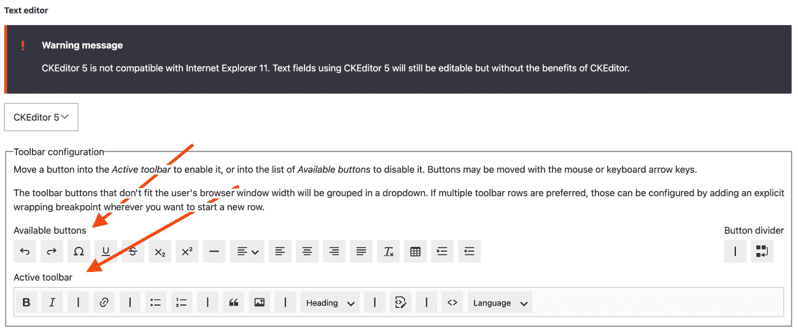
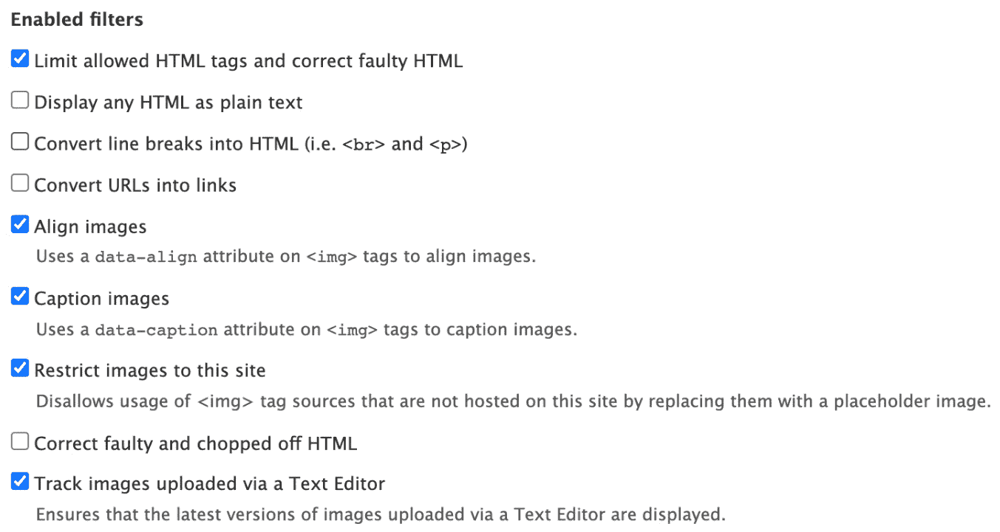
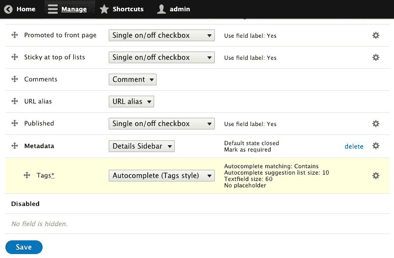

# 第二章：内容构建体验

如您所知，Drupal 是一个在编辑能力和内容建模方面表现卓越的内容管理系统。在本章中，我们将介绍如何设置您的编辑体验并添加编辑审查工作流程。

本章将深入探讨创建自定义类型并利用不同字段创建高级结构化内容。我们将逐步了解用于创建内容的表单的自定义方法，并学习如何自定义内容的显示。接下来，我们将学习如何使用 `Layout Builder` 模块构建自定义落地页面。我们还将学习如何添加和管理内容，并利用菜单链接到内容。在本章结束时，您将为您的 Drupal 网站创建一个自定义的创作体验。

那么，让我们看看本章将涵盖哪些主题：

+   配置 WYSIWYG 编辑器

+   使用内容审查创建编辑工作流程

+   创建具有自定义字段的自定义内容类型

+   自定义编辑内容的表单显示

+   自定义内容的显示输出

+   使用布局构建落地页面

+   创建菜单和链接内容

+   使用工作区创建内容预览区域

# 配置 WYSIWYG 编辑器

Drupal 集成了 `Editor` 模块，它提供了一个 API 以集成 WYSIWYG 编辑器，尽管 CKEditor（默认编辑器）的贡献模块可以提供与其他 WYSIWYG 编辑器的集成。

文本格式控制内容的格式化和内容作者的 WYSIWYG 编辑器配置。标准的 Drupal 安装配置文件提供了一个完全配置的文本格式，其中启用了 CKEditor。我们将逐步介绍重新创建此文本格式的步骤。

在这个菜谱中，我们将使用自定义 CKEditor WYSIWYG 配置创建一个新的文本格式。

## 准备工作

在开始之前，请确保已安装 `CKEditor` 模块。此模块随 Drupal 的标准安装自动安装。

## 如何操作...

让我们创建一个具有自定义 CKEditor WYSIWYG 配置的新文本格式：

1.  从管理工具栏中的 **配置** 进入，然后在 **内容** **创作** 标题下找到 **文本格式和编辑器**。

1.  点击 **添加文本格式** 开始创建下一个文本格式。

1.  为文本格式输入一个名称，例如编辑器格式。

1.  选择哪些角色可以访问此格式 – 这允许您对用户在创作内容时可以使用的内容进行细粒度控制。

1.  从 **文本编辑器** 选择列表中选择 **CKEditor**。然后，将加载 **CKEditor** 的配置表单。

1.  您现在可以使用内联编辑器将按钮拖放到提供的工具栏中，以配置您的 **CKEditor** 工具栏：



图 2.1 – 文本格式编辑表单

1.  选择任何 **已启用过滤器** 选项，如图 *图 2**.2* 所示，除了 **显示任何 HTML 为纯文本**。这会与使用 WYSIWYG 编辑器的目的相悖：



图 2.2 – 启用的过滤器复选框

1.  一旦您满意，请点击 **保存配置** 以保存您的配置并创建文本过滤器。现在，当用户向富文本字段添加内容时，它将可供用户使用。

## 它是如何工作的…

`Filter` 模块提供控制如何向用户展示富文本字段的文本格式。Drupal 将根据字段定义的文本格式渲染保存在文本区域中的富文本。标题中包含“*格式化*”的文本字段将遵守文本格式设置；其他将以纯文本形式渲染。

重要提示

文本格式和编辑器屏幕会警告由于配置不当而存在的安全风险。这是因为您可能授予匿名用户访问允许完整 HTML 或允许图像来源来自远程 URL 的文本格式的权限。这可能会使您的网站容易受到 **跨站脚本攻击（XSS**） 的攻击。跨站脚本攻击是指攻击者可以将恶意客户端脚本注入到您的网站中。

`Editor` 模块提供了一个连接到 WYSIWYG 编辑器和文本格式的桥梁。它修改了文本格式表单和渲染，以允许集成 WYSIWYG 编辑器库。这使得每个文本格式都可以为其 WYSIWYG 编辑器配置。

默认情况下，`Editor` 模块本身不提供编辑器。`CKEditor` 模块与 Editor API 一起工作，以启用 WYSIWYG 编辑器的使用。

贡献的模块可以为其他 WYSIWYG 编辑器提供支持。例如，`TinyMCE` 模块 ([`www.drupal.org/project/tinymce`](https://www.drupal.org/project/tinymce)) 将 Drupal 与 `TinyMCE` 编辑器（https://www.tiny.cloud/tinymce）集成。

## 还有更多…

Drupal 以细粒度方式提供对富文本渲染的控制，并以可扩展的方式，我们将在后面进一步讨论。

### 过滤器模块

当将字符串数据添加到支持文本格式的字段时，数据将被保存并保留为原始输入时的状态。对于文本格式的启用过滤器将在内容查看时才应用。Drupal 以这种方式工作，即保存原始内容，仅在显示时进行过滤。

在 `Filter` 模块启用的情况下，您可以指定根据创建文本的用户角色如何渲染文本。了解使用 WYSIWYG 编辑器的文本格式所应用的过滤器非常重要。例如，如果您选择了 **显示任何 HTML 为纯文本** 选项，则当查看时，WYSIWYG 编辑器所做的格式化将被删除。

### 改进的链接

WYSIWYG 编辑的一个主要组成部分是能够将链接插入到其他内容或外部网站上。与 CKEditor 集成的默认链接按钮允许进行基本的链接嵌入。这意味着内容编辑必须在事先知道他们的内部内容 URL 才能链接到它们。解决此问题的方案是位于 https://www.drupal.org/project/linkit 的 `Linkit` 模块。

可以使用以下 Composer 和 Drush 命令安装 `LinkIt` 模块：

```php
dd  /path/to/drupal
composer require drupal/linkit
php vendor/bin/drush en linkit –yes
```

`Linkit` 模块提供了对默认链接功能的直接替换。它添加了自动完成搜索内部内容，并为显示字段添加了额外的选项。`Linkit` 通过创建不同的配置文件来实现，这些配置文件允许您控制可以引用的内容、可以管理的属性以及哪些用户和角色可以使用 `Linkit` 配置文件。

### CKEditor 插件

`CKEditor` 模块提供了一个名为 **CKEditorPlugin** 的插件类型。插件是 Drupal 中的可交换功能的小块。插件和插件开发将在第 *8 章*，*使用插件即插即用* 中介绍。此类型提供了 CKEditor 和 Drupal 之间的集成。

图片和链接功能是在 `CKEditor` 模块内部定义的插件。额外的插件可以通过贡献项目或自定义开发提供。

参考类 `\Drupal\ckeditor5\Annotation\CKEditor5Plugin` ([`git.drupalcode.org/project/drupal/-/blob/10.0.x/core/modules/ckeditor5/src/Annotation/CKEditor5Plugin.php`](https://git.drupalcode.org/project/drupal/-/blob/10.0.x/core/modules/ckeditor5/src/Annotation/CKEditor5Plugin.php)) 以获取插件定义，以及 `\Drupal\ckeditor5\Plugin\CKEditor5Plugin\ImageUpload` 类 (https://git.drupalcode.org/project/drupal/-/blob/10.0.x/core/modules/ckeditor5/src/Plugin/CKEditor5Plugin/ImageUpload.php) 作为工作示例。

## 参考以下内容

参考第 *8 章*，*使用插件即插即用*，以获取 CKEditor 5 文档（https://www.drupal.org/docs/core-modules-and-themes/core-modules/ckeditor-5-module）。

# 创建带有内容审查的编辑工作流程

许多组织在内容可以在网站上发布之前必须遵循编辑工作流程。`Content Moderation` 模块允许在 Drupal 中创建的内容在发布之前经过编辑过程。在这个菜谱中，我们将创建一个内容审查工作流程，将内容置于草稿状态，然后进行审查、批准和发布。内容将保持草稿状态，直到发布之前对网站访客隐藏。

## 准备工作

在这个菜谱中，我们将使用标准安装，它提供了文章内容类型。任何内容类型都足够使用。

## 如何做到这一点...

1.  首先安装 `Content Moderation` 模块及其依赖模块 `Workflows`：

    ```php
    php vendor/bin/drush en content_moderation –yes
    ```

1.  访问 **配置** 然后是 **工作流程**。此页面列出了所有配置的内容审查工作流程。点击 **添加工作流程** 创建一个新的工作流程。

1.  在 **标签** 字段中，给它一个标签为 **审批工作流程** 并选择 **内容审查** 作为 **工作流程类型**。

1.  工作流有两个默认状态：**草稿**和**已发布**。我们需要添加**审查**和**批准**状态。为我们的每个新状态，点击**添加新状态**链接。填写**状态**标签并按**保存**。不选中**已发布**和**默认修订**复选框。那些应该只用于发布状态。

1.  调整状态的顺序，使其为**草稿**、**审查**、**批准**、**已发布**。在表单底部按**保存**，以便保存我们的顺序。

1.  接下来，我们需要创建一个将**草稿**移动到**审查**的转换。点击**添加新转换**。将**转换**标签设置为**准备审查**。选择**草稿**作为**起始状态**。然后，选择**审查**作为**目标状态**并按**保存**。

1.  现在，我们将创建从“审查”到“批准”的转换。点击**添加新转换**。将**转换**标签设置为**需要批准**。选择**审查**作为**起始状态**。然后，选择**批准**作为**目标状态**并按**保存**。

1.  我们必须编辑默认的发布转换。取消选中**从**复选框中的**草稿**，并选择**批准**。

1.  最后，我们必须将此工作流分配给内容实体。在**此工作流适用于**下，查找**内容类型**。按**选择**，将打开一个对话框。选中**文章**，然后在对话框中按**保存**。

1.  在表单底部按**保存**。我们的内容审查工作流现在已完成！

## 它是如何工作的...

没有使用`Content Moderation`，可发布的内容实体只有两种状态：未发布或已发布。也没有权限来控制谁可以将未发布的内容发布或反之亦然。`Content Moderation`解决了这个问题。

`Workflows`模块提供了一个定义状态和转换的 API。模块如`Content Moderation`负责提供工作流类型插件以实现有意义的函数。`Content Moderation`模块与 Drupal 内容实体的修订功能集成。

当编辑使用`Content Moderation`的内容实体时，将有一个**审查状态**字段。此字段包含基于当前用户权限，内容可以转换到的状态。

## 参考信息

+   [Drupal.org](https://Drupal.org)上的`Content Moderation`模块文档：https://www.drupal.org/docs/8/core/modules/content-moderation/overview

+   `Drupal.org`上的 Workflows 模块文档：[`www.drupal.org/docs/8/core/modules/workflows/overview`](https://www.drupal.org/docs/8/core/modules/workflows/overview)

# 创建带有自定义字段的自定义内容类型

Drupal 在内容管理领域表现出色，它允许不同类型的内容。在本教程中，我们将向您展示如何创建一个自定义内容类型。我们将创建一个包含一些基本字段并可用于强调公司提供服务的场景的“服务”类型。

您还将学习如何在本食谱中将字段添加到内容类型中，这通常与在 Drupal 网站上创建新的内容类型相辅相成。

## 如何操作…

1.  前往**结构**然后**内容类型**。点击**添加内容类型**以开始创建新的内容类型。

1.  输入`服务`作为名称，以及可选的描述。

1.  选择**显示设置**，取消勾选**显示作者和日期信息**复选框。这将隐藏作者和提交时间从服务页面。

1.  点击**保存和管理字段**按钮以保存新的内容类型并管理其字段。

1.  默认情况下，新内容类型会自动添加一个**正文**字段。我们将保留此字段。

1.  我们将添加一个字段，为服务提供输入营销标题的方式。点击**添加字段**。

1.  从下拉菜单中选择**文本（纯文本）**，并将标签设置为**营销标题**。

重要提示

**文本（纯文本）**选项是一个常规文本字段。**文本（格式化）**选项将允许您在字段中显示的文本上使用文本格式。

1.  在下一个表单上点击**保存字段设置**。在随后的表单上，点击**保存设置**以完成字段的添加。

1.  字段已添加，现在可以创建此类内容。

## 工作原理…

在 Drupal 中，内容实体可以有不同的包。包指的是该实体类型的不同类型。这个词“包”来源于它是一组字段，因为每个内容实体类型的包都可以有不同的字段。当处理节点时，它们与内容同义，节点的包被称为内容类型。

当创建内容类型时，会为其创建一个默认的正文字段。这是通过在`node.module`文件中调用`node_add_body_field()`函数来完成的。对于那些希望在用户界面之外程序定义包字段的人来说，这是一个很好的参考点。

只有启用`Field UI`模块，才能管理或添加字段。`Field UI`模块为实体，如**节点**、**块**和**分类术语**，公开了**管理字段**、**管理表单显示**和**管理显示**选项。

# 自定义编辑内容的表单显示

表单模式允许网站管理员在修改内容实体时自定义编辑表单。在节点的情况下，您可以重新排列字段的顺序并更改用于字段节点编辑表单的表单元素。还有一个名为`Field Group`的模块。`Field Group`模块允许您将字段分组到字段集中。

在本食谱中，我们将安装`Field Group`模块并修改表单显示以创建`文章`内容类型。

## 如何操作…

1.  首先，我们必须使用 Composer 将`Field Group`模块添加到 Drupal 站点，然后使用 Drush 安装它：

    ```php
    composer require drupal/field_group
    ```

    ```php
    php vendor/bin/drush en field_group –yes
    ```

1.  要自定义表单的显示模式，请前往**结构**然后**内容类型**。

1.  我们将修改文章内容类型的表单。点击并展开**操作**按钮，然后选择**管理****表单显示**。

1.  点击**添加字段组**以开始添加新的字段组。

1.  从**添加新组**中选择**详细信息侧边栏**，给这个一个**标签**为**元数据**，然后点击**保存**并继续。

1.  在下一个表单上点击**创建组**，并使用默认值来完成创建组。

1.  将新创建的**元数据**组（如图*图 2**.3*所示）从**禁用**部分拖动到**启用**。直接在**禁用**标签上方即可。

1.  将**标签**字段拖动，使其位于**元数据**组下面——在其下方，并且稍微向右：



图 2.3 – 管理显示表单，将标签小部件移动到元数据字段组组件下面

1.  点击页面底部的**保存**按钮以保存您的更改。

1.  前往**创建新文章**；您将在侧边栏中找到**元数据**标签，其中包含**标签**字段：


图 2.4 – 文章编辑表单，标签元素在侧边栏中

## 如何工作...

当构建内容实体表单时，表单会知道要使用的显示模式。然后，它调用显示模式，使用指定的字段小部件为每个字段构建组件。

这允许您在不替换整个表单的情况下自定义表单的特定部分。开发者可以创建新的字段小部件或利用贡献模块中的小部件来增强表单的功能。

`字段组`不会创建字段小部件，而是在表单显示内部创建一个新的结构。然后，它将字段小部件排列成组。这提供了更组织化的内容编辑体验。

## 更多内容...

在下一节中，我们将讨论更多关于管理内容实体表单的内容。

### 管理表单显示模式

通过访问**结构**下的**显示模式**，可以在**表单模式**中添加额外的表单显示模式。每个内容实体类型都有一个隐藏的默认表单模式，它始终存在。可以通过显示管理表单添加和配置额外的表单显示模式。

这些表单及其配置的字段小部件本身并不直接与 Drupal 集成。使用自定义代码，甚至贡献的项目，它们可以用于嵌入特殊用途。

例如，有用户注册表单模式。用户注册表单是使用此显示模式和配置的小部件构建的，而不是在编辑现有用户时通常可用的内容。

# 自定义内容显示输出

Drupal 提供了显示视图模式，允许您自定义附加到实体的字段和其他属性。在本教程中，我们将调整`文章`内容类型的摘要显示模式。每个字段或属性都有用于显示标签、显示信息的格式以及格式的额外设置的控件。

利用视图显示可以让您完全控制内容在您的 Drupal 网站上如何被查看。

## 如何操作...

1.  现在，是时候通过导航到**结构**然后**内容类型**来定制表单显示模式了。

1.  我们将修改`文章`内容类型的显示。点击下拉按钮箭头并选择**管理显示**。

1.  点击**摘要视图模式**选项来修改它。**摘要视图模式**用于节点列表，例如默认主页。

1.  将**标签**字段拖到隐藏部分。在查看**摘要** **视图模式**时，文章上的标签将不再显示。

1.  点击`600`到`300`的设置齿轮图标。

1.  点击**保存**以保存您所做的所有更改。

1.  查看主页并审查已生效的更改。

## 它是如何工作的...

实体的默认渲染系统使用视图显示。视图显示模式是配置实体。由于视图显示模式是配置实体，因此可以使用配置管理进行导出。

当内容实体被渲染时，视图显示会遍历显示中配置的每个字段格式化器。字段格式化器是从**管理显示**表单的**格式**属性中选择的选项，它标识了用于渲染字段值的代码。字段值从实体中检索出来，并传递给已使用提供给视图显示的配置实例化的字段格式化器插件。然后，将此渲染数据集合传递给 Drupal 的其余渲染管道。

## 更多...

在下一节中，我们将讨论更多关于管理内容实体形式的项目。

### 管理视图显示模式

可以通过访问**结构**下的**显示模式**来添加额外的表单显示模式。每个内容实体类型都有一个隐藏的默认视图模式，它始终存在。可以通过显示管理表单添加和配置额外的视图显示模式。

这些视图模式可以在使用视图显示内容、实体引用的渲染实体字段格式化器或使用自定义代码渲染实体时被利用。

# 使用布局构建落地页

`布局构建器`模块允许内容创建者使用拖放界面来自定义页面上的内容显示方式。与在视图显示模式中使用字段格式化器不同，这不需要开发者，并且可以为单个内容项进行自定义。使用`布局构建器`，内容创建者从系统中可用的不同布局中选择，并在其中放置块以构建页面内容。在本教程中，我们将介绍安装`布局构建器`并设置`文章`内容类型的布局。

## 准备工作

在本教程中，我们将使用标准安装，它提供了`文章`内容类型。任何内容类型都适用。

## 如何操作…

1.  首先，安装`布局构建器`模块及其依赖模块`布局发现`：

    ```php
    php vendor/bin/drush en layout_builder –yes
    ```

1.  我们必须选择使用`布局构建器`来显示我们内容类型的显示模式。访问**结构**然后**内容类型**，使用**文章**的下拉按钮点击**管理显示**。

1.  找到标记为**布局选项**的部分并勾选**使用布局构建器**复选框。

1.  点击**保存**以启用**布局构建器**。

1.  现在，**管理显示**表单应显示**管理布局**按钮。

1.  点击`布局构建器`用户界面来自定义**文章**布局。

1.  默认情况下，**显示内容预览**复选框是勾选的。取消勾选此复选框以关闭生成的示例预览内容。

1.  点击**添加部分**以创建新部分并选择**两列布局**。

1.  选择**33%/67%**作为**列宽**并点击**添加部分**，保留管理标签为空。

1.  现在我们已经添加了两个列的部分，我们可以将字段移动到这些布局部分。将**图片**字段拖到新部分的左侧，将**正文**字段拖到新部分的右侧。

1.  点击**保存布局**以保存更改。

1.  不使用代码，我们现在已为文章创建了一个布局，将图片放置在文章内容的侧边栏中。

## 它是如何工作的…

`布局构建器`模块为实体类型提供了一种替代渲染系统。使用`布局构建器`是内容实体类型每个显示模式的可选过程。如果实体类型的显示模式不由`布局构建器`管理，则回退到使用字段格式化器的常规渲染系统。

布局由布局插件提供，这些插件具有匹配的 Twig 模板。模块和主题可以定义新的模板供使用。`布局构建器`利用块来显示内容。`布局构建器`中可以嵌入的块类型基于系统可用的块。

`布局构建器`还将内容实体上的每个字段暴露为块，允许您将每个字段放置在不同的部分。

如同自定义节点或其他实体模板，如果你在未更新布局对应的 Twig 模板的情况下修改布局插件或嵌套元素，你可能会看到渲染不正确的内容。在做出此类更改时，务必相应地审查 Twig 模板。

## 更多内容…

当`布局构建器`首次加入 Drupal 时，它是一个令人兴奋的补充，并且具有许多更多功能和定制，远超本指南所涵盖的内容。

### 可访问性

`布局构建器`用户界面经过了严格的可访问性测试。整个`布局构建器`用户界面可以使用键盘或其他辅助设备进行导航。

### 为每块内容定制布局

在配置布局选项时，使用`布局构建器`用户界面。

布局覆盖也存储在附加到内容实体的字段数据中，这使得它随着修订版进行跟踪！这意味着可以为布局更改的内容创建新的草稿，并且可以通过`内容``审核`工作流程进行发布。 

### 扩展布局构建器的附加模块

有许多模块可以扩展`布局构建器`，以定制其体验并提供默认布局。例如，如果你使用 Bootstrap 前端框架，**Bootstrap Layout Builder** ([`www.drupal.org/project/bootstrap_layout_builder`](https://www.drupal.org/project/bootstrap_layout_builder))模块提供了一个用于构建使用 Bootstrap 样式的布局的用户界面。

扩展`布局构建器`的模块列表可以在`Drupal.org`上找到：[`www.drupal.org/docs/8/core/modules/layout-builder/additional-modules`](https://www.drupal.org/docs/8/core/modules/layout-builder/additional-modules)。

## 相关内容

+   `Drupal.org`上的布局构建器模块文档：[`www.drupal.org/docs/8/core/modules/layout-builder`](https://www.drupal.org/docs/8/core/modules/layout-builder)

# 创建菜单和链接内容

Drupal 允许你将正在编写的链接内容链接到网站上的指定菜单，通常是主菜单。然而，你可以创建自定义菜单以提供内容的链接。在本指南中，我们将向你展示如何创建自定义菜单并将内容链接到它。然后，我们将菜单作为一个块放置在页面的侧边栏中。

## 准备工作

本指南假设你已经安装了标准安装配置文件，并且有默认的节点内容类型可供使用。你应该有一些内容创建以创建链接。

## 如何操作…

1.  访问**结构**并点击**菜单**。

1.  点击**添加菜单**。

1.  提供一个**侧边栏菜单**的标题，以及可选的摘要，然后点击**保存**。

1.  保存菜单后，点击**添加**链接按钮。

1.  输入链接标题，然后输入内容的标题。表单将提供可链接内容的自动完成建议。

1.  点击**保存**以保存菜单链接。

1.  保存菜单链接后，转到**结构**，然后**块布局**。

1.  点击 `侧边栏菜单` 并点击 **放置块**。

1.  在以下表单中，点击 **保存块**。

1.  通过点击管理菜单中的 **首页** 来查看您的 Drupal 网站。

## 工作原理…

菜单和链接是 Drupal 核心的一部分。创建自定义菜单和菜单链接的能力是通过 `Menu UI` 模块提供的。此模块在标准安装中已启用，但在其他安装中可能未启用。

菜单链接表单的链接输入允许您开始键入内容标题，并轻松地将它们链接到现有内容。它将自动将标题转换为内部路径。链接输入还接受常规路径，例如 `/node/1` 或外部路径。您可以使用 `<front>` 链接到主页，使用 `<nolink>` 渲染非链接的锚点标签，以及使用 `<button>` 创建键盘可访问的纯文本链接。

## 更多内容…

链接可以通过内容编辑表单本身进行管理，这将在下一部分介绍。

### 从其表单管理内容菜单链接

您可以从添加或编辑表单将内容添加到菜单中。菜单设置部分允许您切换菜单链接的可用性。菜单链接标题将默认反映内容的标题。

父项目允许您决定它将出现在哪个菜单以及哪个项目下。默认情况下，内容类型仅允许主菜单。编辑内容类型可以允许使用多个菜单或仅选择自定义菜单。

这允许您在不访问菜单管理屏幕的情况下填充主菜单或辅助菜单。

# 使用 Workspaces 创建内容预览区域

`Workspaces` 模块提供了一种在 Drupal 网站上处理内容的新方法。它允许您拥有网站内容的实时版本和并行草稿版本。常规的内容工作流程涉及多个内容片段，这些内容可能在不同时间被草稿和发布。`Workspaces` 模块提供了一种创建和准备同时发布的草稿的方法。

例如，在大型体育赛事期间，文章是根据获胜的队伍准备的。一旦宣布获胜者，该版本网站的内容就可以发布。在这个菜谱中，我们将安装 `Workspaces` 模块并介绍如何使用网站版本。

重要提示

在撰写本文时，`Workspaces` 模块是一个 `实验性` 模块。标记为实验性的模块正在积极开发中，并不被认为是稳定的。实验性模块提供了一种更轻松地向 Drupal 核心添加新功能的方法。您可以在 `Drupal.org` 上了解更多关于实验性模块政策的信息：[`www.drupal.org/about/core/policies/core-change-policies/experimental/policy-and-list`](https://www.drupal.org/about/core/policies/core-change-policies/experimental/policy-and-list)。

## 准备工作

在这个菜谱中，我们将使用标准安装，它提供了 `基本页面` 内容类型。任何内容类型都适用。

## 如何操作…

1.  首先安装 `Workspaces` 模块：

    ```php
    php vendor/bin/drush en workspaces --yes
    ```

1.  访问您的 Drupal 网站；您会在工具栏的右侧注意到**Live**标签；这是当前工作区的标识符。

1.  点击**Live**以打开**工作区**菜单。

1.  点击“Stage”工作区的名称，然后在弹出的模态窗口中点击**确认**，询问我们是否想要激活并切换到“Stage”工作区。

1.  在使用“Stage”工作区的同时创建三到四个新基本页面，并确保在**推广****选项**组中勾选**推广到首页**。

1.  当您访问 Drupal 网站的首页时，您应该会看到您在首页列表中创建的页面。

1.  现在，在另一个浏览器或私密模式下打开您的 Drupal 网站，您将看到主页显示**尚未创建任何首页内容**。这表明内容仅发布在“Stage”工作区，而不是在实时网站上。

1.  回到您的 Drupal 网站，点击工具栏中的**Stage**标签以打开工作区菜单。

1.  点击**发布内容**以开始将您的 Stage 内容发布到 Live 网站。

1.  将会弹出一个确认表单。点击**将项目发布到 Live**以完成此过程。

1.  如果您在其他浏览器或私密模式下再次测试您的网站，您将看到主页现在列出了您所有的新页面！

## 它是如何工作的...

`Workspace`模块使用内容实体现有的修订功能。修订随后会跟踪到工作区，直到它们发布到 Live 工作区。`Workspace`模块还增加了安全措施。除非在 Live 工作区中，否则无法保存修改网站配置的表单；该模块显示警告并禁用`Workspace`模块，只允许在一个工作区中编辑一个内容项。

工作区还与用户账户相关联。这允许为特定用户创建分段工作区。这允许内容创建者创建新的工作区，但不能查看或修改其他内容创建者的工作区。

## 还有更多...

`Workspaces`模块提供了本食谱中未涵盖的其他用户界面，并且还有另一种使用工作区的方法，而不仅仅是内容。

### 工作区何时将成为一个稳定的模块？

正在努力使`Workspaces`模块变得稳定。这些问题已在 Drupal 核心问题队列中标记为**WI critical**（即**工作流倡议关键**）。问题列表可在此处找到：[`www.drupal.org/project/issues/search/drupal?status%5B%5D=Open&issue_tags_op=%3D&issue_tags=WI+critical`](https://www.drupal.org/project/issues/search/drupal?status%5B%5D=Open&issue_tags_op=%3D&issue_tags=WI+critical)。

### 在工作区中管理内容更改

当工作区菜单在工具栏中打开时，您可以点击**管理工作区**链接以查看工作区中的所有活动更改。这使得内容管理员更容易审查工作区中已修改的内容。它还允许删除这些更改以恢复到原始内容。

本概述有助于回顾可能发布到实时工作空间的所有更改。

### 创建子工作空间

工作空间也可能有一个父工作空间。这允许您维护一个集中的预演工作空间，但迫使内容创建者在预演下拥有他们的子工作空间。所有内容修改都可以合并到预演，而不是每个贡献者的工作空间发布到实时。

### 使用工作空间测试新的站点重新设计

Drupal 有一个确定活动主题的机制，默认情况下是默认主题。可以编写代码根据特定条件覆盖当前主题。`工作空间主题`模块([`www.drupal.org/project/workspace_theme`](https://www.drupal.org/project/workspace_theme))正是如此。

它为工作空间添加了一个新字段，允许您指定在激活该工作空间时使用不同的主题。这允许您使用新主题预览站点的重新设计，而无需将其设置为生产站点的默认主题，或者仅仅依赖于测试服务器。

## 参见

+   `Drupal.org`上的工作空间模块文档：[`www.drupal.org/docs/8/core/modules/workspace/`](https://www.drupal.org/docs/8/core/modules/workspace/)
