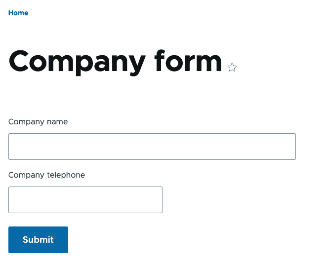
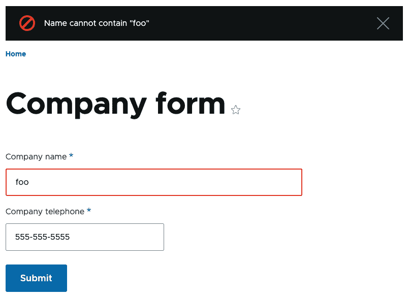
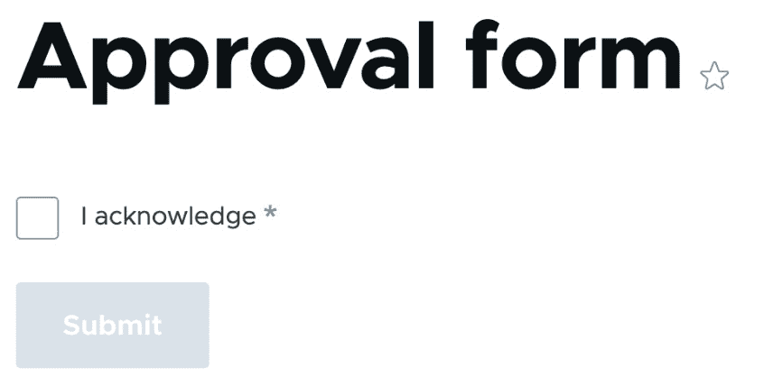
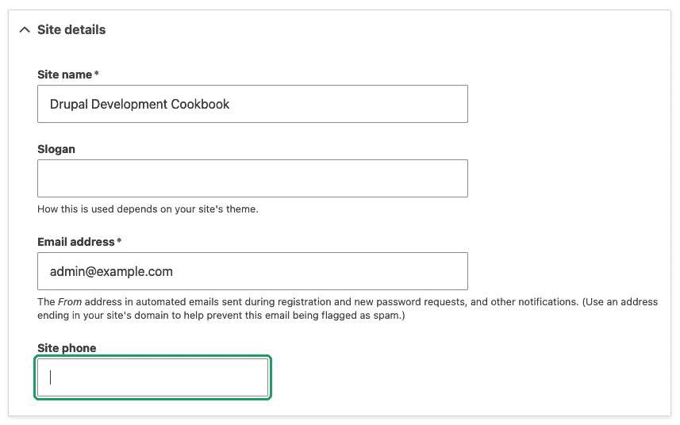

# 第七章：使用 Form API 创建表单

本章将介绍 Form API 的使用，该 API 用于在 Drupal 中创建表单而无需编写任何 HTML！本章将指导您创建一个表单来管理具有验证的自定义配置项。您还将学习如何使用`states`属性实现条件性表单字段，以控制元素是隐藏的、可见的、必需的还是其他。我们还将演示如何在 Drupal 表单中实现 AJAX 以提供动态表单元素。最后，您将学习如何修改 Drupal 中的其他表单以自定义它们的应用。

在本章中，我们将介绍以下菜谱：

+   创建自定义表单并保存配置更改

+   验证表单数据

+   指定条件性表单元素

+   在 Drupal 表单中使用 AJAX

+   自定义 Drupal 中的现有表单

# 技术要求

本章需要安装一个自定义模块。在以下菜谱中，模块名称为`mymodule`。请适当替换。您可以在 GitHub 上找到本章中使用的完整代码：[`github.com/PacktPublishing/Drupal-10-Development-Cookbook/tree/main/chp07`](https://github.com/PacktPublishing/Drupal-10-Development-Cookbook/tree/main/chp07)

# 创建自定义表单并保存配置更改

在这个菜谱中，我们将创建一个表单，允许将公司名称和电话号码保存到配置中。表单被定义为实现`\Drupal\Core\Form\FormInterface`的类。`\Drupal\Core\Form\FormBase`作为表单的标准基类。我们将扩展这个类来创建一个新的表单，用于保存自定义配置。

## 如何操作...

1.  首先，我们需要在模块目录中创建`src/Form`目录。我们将把我们的表单类放在这个目录中，这将为我们的表单类提供`Form`命名空间：

    ```php
    mkdir -p src/Form
    ```

1.  在`Form`目录下创建一个名为`CompanyForm.php`的文件。这个文件将包含我们的`CompanyForm`表单类。

1.  我们的`CompanyForm`类将扩展由 Drupal 核心提供的`FormBase`类：

    ```php
    <?php
    ```

    ```php
    namespace Drupal\mymodule\Form;
    ```

    ```php
    use Drupal\Core\Form\FormBase;
    ```

    ```php
    use Drupal\Core\Form\FormStateInterface;
    ```

    ```php
    class CompanyForm extends FormBase {
    ```

    ```php
      public function getFormId() {}
    ```

    ```php
      public function buildForm(array $form,
    ```

    ```php
        FormStateInterface $form_state) {}
    ```

    ```php
      public function submitForm(array &$form,
    ```

    ```php
        FormStateInterface $form_state) {}
    ```

    ```php
    }
    ```

遵循 PSR-4 自动加载约定，我们的类位于`\Drupal\mymodule\Form`命名空间中，Drupal 可以将其确定为我们的模块中的`src/Form`目录。根据 PSR-4，文件名和类名也必须相同。

`\Drupal\Core\Form\FormBase`类提供了处理表单的内部逻辑。它只需要我们实现`getFormId`、`buildForm`和`submitForm`方法，这些方法将在以下步骤中解释和实现。

1.  所有表单都必须有一个唯一的字符串来标识表单。让我们通过更新`getFormId`方法来给我们的表单分配 ID `company_form`：

    ```php
      public function getFormId() {
    ```

    ```php
        return 'company_form';
    ```

    ```php
      }
    ```

1.  `buildForm`方法返回表单结构作为表单元素的数组。我们提供了一个文本字段用于公司名称和电话：

    ```php
      public function buildForm(array $form,
    ```

    ```php
        FormStateInterface $form_state) {
    ```

    ```php
        $form['company_name'] = [
    ```

    ```php
          '#type' => 'textfield',
    ```

    ```php
          '#title' => 'Company name',
    ```

    ```php
        ];
    ```

    ```php
        $form['company_telephone'] = [
    ```

    ```php
          '#type' => 'tel',
    ```

    ```php
          '#title' => 'Company telephone',
    ```

    ```php
        ];
    ```

    ```php
        return $form;
    ```

    ```php
      }
    ```

`buildForm` 方法传递 `$form` 数组参数，这是我们的表单结构被添加的地方。在 `$form` 数组中，`company_name` 和 `company_telephone` 都被调用为 `#type`（用于指定元素是什么）和 `#title`（用作标签）。

1.  接下来，我们想要加载现有的配置并将它的值传递给元素：

    ```php
      public function buildForm(array $form,
    ```

    ```php
        FormStateInterface $form_state) {
    ```

    ```php
        $company_settings = $this->config
    ```

    ```php
             ('company_settings');
    ```

    ```php
        $form['company_name'] = [
    ```

    ```php
          '#type' => 'textfield',
    ```

    ```php
          '#title' => 'Company name',
    ```

    ```php
          '#default_value' => $company_settings->
    ```

    ```php
            get('company_name'),
    ```

    ```php
        ];
    ```

    ```php
        $form['company_telephone'] = [
    ```

    ```php
          '#type' => 'tel',
    ```

    ```php
          '#title' => 'Company telephone',
    ```

    ```php
          '#default_value' => $company_settings->
    ```

    ```php
            get('company_telephone'),
    ```

    ```php
        ];
    ```

    ```php
        return $form;
    ```

    ```php
      }
    ```

我们使用 `config` 方法加载一个名为 `company_settings` 的配置对象，它将存储我们的值。`#default_value` 属性允许指定一个初始值，该值应用于元素。

1.  然后，我们必须添加一个提交按钮：

    ```php
      public function buildForm(array $form,
    ```

    ```php
        FormStateInterface $form_state) {
    ```

    ```php
        $company_settings = $this->
    ```

    ```php
            config('mymodule.company_settings');
    ```

    ```php
        $form['company_name'] = [
    ```

    ```php
          '#type' => 'textfield',
    ```

    ```php
          '#title' => 'Company name',
    ```

    ```php
          '#default_value' => $company_settings->
    ```

    ```php
            get('company_name'),
    ```

    ```php
        ];
    ```

    ```php
        $form['company_telephone'] = [
    ```

    ```php
          '#type' => 'tel',
    ```

    ```php
          '#title' => 'Company telephone',
    ```

    ```php
          '#default_value' => $company_settings->
    ```

    ```php
            get('company_telephone'),
    ```

    ```php
        ];
    ```

    ```php
        $form['actions']['#type'] = 'actions';
    ```

    ```php
        $form['actions']['submit'] = [
    ```

    ```php
          '#type' => 'submit',
    ```

    ```php
          '#value' => 'Submit',
    ```

    ```php
        ];
    ```

    ```php
        return $form;
    ```

    ```php
      }
    ```

我们提供了一个带有 `submit` 类型的提交按钮作为表单元素。最佳实践是将提交按钮和其他按钮放置在 `actions` 渲染元素中。

1.  填写 `submitForm` 并将其保存到 `mymodule.company_data` 对象中：

    ```php
      public function submitForm(array &$form,
    ```

    ```php
        FormStateInterface $form_state) {
    ```

    ```php
        $config = $this->configFactory()->
    ```

    ```php
            getEditable('mymodule.company_settings');
    ```

    ```php
        $config->set('company_name', $form_state->
    ```

    ```php
            getValue('company_name'));
    ```

    ```php
        $config->set('company_telephone', $form_state->
    ```

    ```php
            getValue('company_telephone'));
    ```

    ```php
        $config->save();
    ```

    ```php
        $this->messenger()->addStatus('Updated company
    ```

    ```php
            information');
    ```

    ```php
      }
    ```

为了保存我们的配置，我们必须使用 `getEditable` 方法从配置工厂中获取它。这允许我们保存对配置对象的更改。

1.  添加一个新的路由，使表单可在 `/company-form` 路径下访问：

    ```php
    mymodule.company_form:
    ```

    ```php
      path: /company-form
    ```

    ```php
      defaults:
    ```

    ```php
        _form: Drupal\mymodule\Form\CompanyForm
    ```

    ```php
        _title: Company form
    ```

    ```php
      requirements:
    ```

    ```php
        _access: 'TRUE'
    ```

1.  重建你的 Drupal 网站的缓存以使其意识到新的路由：

    ```php
    php vendor/bin/drush cr
    ```

1.  现在，你可以访问 `/company-form` 并访问你的表单：



图 7.1 – 公司表单的输出

## 它是如何工作的...

此配方创建了一个可以通过路由访问的表单，使用 `_form` 属性代替 `_controller` 属性。`_form` 属性包含表单类名。当 Drupal 的路由系统构建时，添加了一个 `_controller` 条目，由 `\Drupal\Core\Controller\HtmlFormController::getContentResult` 处理。此添加是通过 `\Drupal\Core\Routing\Enhancer\FormRouteEnhancer` 增强器完成的。`HtmlFormController` 将 `_form` 中的类名传递给表单构建器，并返回完整的表单渲染数组。

表单构建器负责确定表单是正在渲染还是如果请求是 HTTP `GET` 或 HTTP `POST`，它正在处理提交。

注意

表单 API 自 Drupal 4.7 版本以来就存在于 Drupal 中。实际上，渲染数组系统是从表单 API 中诞生的，并在 Drupal 7 中创建。

当表单构建器处理表单提交时，表单结构也将从 `buildForm` 中构建。这样做是为了防止提交额外的无效值。传入的输入数据被映射到表单中的元素，并推送到表单的 `state` 值，这些值可以通过 `getValue` 用于特定元素值或 `getValues` 用于所有值来检索。一旦值已设置在表单状态中，表单构建器将调用表单验证服务。表单验证将在下一个配方 *验证表单数据* 中处理。

如果表单没有错误，那么表单构建将调用表单提交服务并调用表单的 `submitForm` 方法。

## 还有更多...

许多组件构成了通过 Drupal 的表单 API 创建的表单。我们将深入探讨其中的一些。

### 表单状态

`\Drupal\Core\Form\FormStateInterface` 对象表示表单及其数据的当前状态。表单状态包含用户提交给表单的数据以及构建状态信息。它还可以在表单构建和提交之间存储任意信息。表单状态还处理表单提交后的重定向。在接下来的菜谱中，您将与表单状态进行更多交互。

### 表单缓存

Drupal 使用缓存表来存储表单。这个表包含由表单构建标识符识别的构建表，这使得 Drupal 能够在 AJAX 请求期间验证表单，并在需要时轻松构建它们。保持表单缓存在持久存储中非常重要；否则，可能会产生不良后果，例如丢失表单数据或使表单无效。我们将在 *在 Drupal 中使用 AJAX 的表单* 菜谱中介绍 AJAX 表单。

### ConfigFormBase 类

Drupal 提供了一个基础表单类来简化修改配置对象的表单。这是 `\Drupal\Core\Form\ConfigFormBase` 类。这个类防止在检索配置对象时从配置工厂调用 `getEditable`。它还在表单提交时添加了默认提交按钮和消息。

这里是我们使用 `ConfigFormBase` 的表单类的更新版本。`getEditableConfigNames` 方法包含我们的配置对象名称，并允许在加载时对其进行编辑：

```php
<?php
namespace Drupal\mymodule\Form;
use Drupal\Core\Form\ConfigFormBase;
use Drupal\Core\Form\FormStateInterface;
class CompanyForm extends ConfigFormBase {
  public function getFormId() {
    return 'company_form';
  }
  protected function getEditableConfigNames() {
    return ['mymodule.company_settings'];
  }
  public function buildForm(array $form, FormStateInterface
    $form_state) {
    $company_settings = $this->
        config('mymodule.company_settings');
    $form['company_name'] = [
      '#type' => 'textfield',
      '#title' => 'Company name',
      '#default_value' => $company_settings->
        get('company_name'),
    ];
    $form['company_telephone'] = [
      '#type' => 'tel',
      '#title' => 'Company telephone',
      '#default_value' => $company_settings->
        get('company_telephone'),
    ];
    return parent::buildForm($form, $form_state);
  }
  public function submitForm(array &$form,
    FormStateInterface $form_state) {
    parent::submitForm($form, $form_state);
    $this->config('mymodule.company_settings')
      ->set('company_name', $form_state->
        getValue('company_name'))
      ->set('company_telephone', $form_state->
        getValue('company_telephone'))
      ->save();
  }
}
```

## 参见

+   表单和渲染元素文档：[`www.drupal.org/docs/drupal-apis/form-api/form-render-elements`](https://www.drupal.org/docs/drupal-apis/form-api/form-render-elements)

+   可用表单和渲染元素列表：[`api.drupal.org/api/drupal/elements/10.0.x`](https://api.drupal.org/api/drupal/elements/10.0.x)

# 验证表单数据

我们将在上一个菜谱中创建的表单基础上添加验证。我们将在公司表单的表单元素中添加验证信息。还有一个 `validateForm` 方法，可以用来程序化地识别错误并防止表单提交。

## 准备工作

这个菜谱将使用在 *创建自定义表单并保存配置更改* 菜谱中创建的表单类。

## 如何操作...

1.  首先，我们将使表单元素成为 `required`。这将防止在未提供值的情况下提交表单。更新 `buildForm` 中的表单元素以匹配以下内容：

    ```php
        $form['company_name'] = [
    ```

    ```php
          '#type' => 'textfield',
    ```

    ```php
          '#title' => 'Company name',
    ```

    ```php
          '#required' => TRUE,
    ```

    ```php
          '#default_value' => $company_settings->
    ```

    ```php
            get('company_name'),
    ```

    ```php
        ];
    ```

    ```php
        $form['company_telephone'] = [
    ```

    ```php
          '#type' => 'tel',
    ```

    ```php
          '#title' => 'Company telephone',
    ```

    ```php
          '#required' => TRUE,
    ```

    ```php
          '#default_value' => $company_settings->
    ```

    ```php
            get('company_telephone'),
    ```

    ```php
        ];
    ```

这是通过向表单元素添加 `'#required' => TRUE` 来实现的。当表单元素被标记为 `required` 时，Drupal 将自动验证该字段是否有非空值。它还指定了 HTML5 的 `required` 属性，添加了客户端验证。

1.  其次，我们将向电话表单元素添加输入约束。尽管我们有 HTML5 的 `tel` 元素，但它并不验证输入字符：

    ```php
        $form['company_telephone'] = [
    ```

    ```php
          '#type' => 'tel',
    ```

    ```php
          '#title' => 'Company telephone',
    ```

    ```php
          '#required' => TRUE,
    ```

    ```php
          '#pattern' => '^[0-9-+\s()]*$',
    ```

    ```php
          '#default_value' => $company_settings->
    ```

    ```php
            get('company_telephone'),
    ```

    ```php
        ];
    ```

`#pattern`属性允许指定渲染的`input`元素的 HTML5 `pattern`属性。此模式表达式允许输入数字、破折号和括号，但不能输入常规的字母字符。

1.  接下来，我们将覆盖`validateForm`方法，这允许进行程序性验证：

    ```php
      public function validateForm(array &$form, FormStateInterface $form_state) {
    ```

    ```php
        $company_name = $form_state->
    ```

    ```php
            getValue('company_name');
    ```

    ```php
        if (str_contains($company_name, 'foo')) {
    ```

    ```php
          $form_state->setErrorByName(
    ```

    ```php
            'company_name',
    ```

    ```php
            'Name cannot contain "foo"'
    ```

    ```php
          );
    ```

    ```php
        }
    ```

    ```php
      }
    ```

我们使用表单状态的`getValue`方法来获取`company_name`的提交值。使用`str_contains`，我们检查公司名称是否包含单词`foo`。如果是，我们使用`setErrorByName`方法在`company_name`输入上设置错误。

1.  当表单提交时，公司名称不能包含单词`foo`：



图 7.2 – 包含验证错误的公司名称字段

## 它是如何工作的…

当表单提交时，表单构建器根据传入的用户输入和表单元素创建表单状态值作为映射。表单构建器调用表单验证服务。表单验证从内到外进行。表单验证服务遍历每个表单元素，然后为表单类调用`validateForm`方法。

当元素被验证时，这是评估`#required`属性的时候。如果表单状态缺少元素的值，则将其标记为有错误。对于`#pattern`也是如此。后端仍然验证传入的输入以确保它与提供的模式匹配。

## 参见

+   表单和渲染元素验证的附加属性文档：[`www.drupal.org/docs/drupal-apis/form-api/form-render-elements`](https://www.drupal.org/docs/drupal-apis/form-api/form-render-elements)

# 指定条件表单元素

表单 API 提供了一种定义表单元素状态的方法。这些状态映射到可以控制元素是否必需、可见等 JavaScript 交互。在这个例子中，我们将演示一个在复选框被选中之前禁用提交按钮的表单。

## 如何做到这一点…

1.  在您的模块的`src/Form`目录中创建一个名为`ApprovalRequiredForm.php`的文件，以保存`ApprovalRequiredForm`表单类。

1.  我们将定义具有表单 ID `mymodule_approval_form`的`ApprovalRequiredForm`类：

    ```php
    <?php
    ```

    ```php
    namespace Drupal\mymodule\Form;
    ```

    ```php
    use Drupal\Core\Form\FormBase;
    ```

    ```php
    use Drupal\Core\Form\FormStateInterface;
    ```

    ```php
    class ApprovalRequiredForm extends FormBase {
    ```

    ```php
      public function getFormId() {
    ```

    ```php
        return 'mymodule_approval_form';
    ```

    ```php
      }
    ```

    ```php
      public function buildForm(array $form,
    ```

    ```php
        FormStateInterface $form_state) {
    ```

    ```php
        return $form;
    ```

    ```php
      }
    ```

    ```php
      public function submitForm(array &$form,
    ```

    ```php
        FormStateInterface $form_state) {
    ```

    ```php
      }
    ```

    ```php
    }
    ```

1.  在`buildForm`方法中，我们将首先创建一个`checkbox`元素，该元素对于提交表单和控制提交按钮的状态是必需的：

    ```php
      public function buildForm(array $form,
    ```

    ```php
        FormStateInterface $form_state) {
    ```

    ```php
        $form['approval'] = [
    ```

    ```php
          '#type' => 'checkbox',
    ```

    ```php
          '#title' => 'I acknowledge',
    ```

    ```php
          '#required' => TRUE,
    ```

    ```php
        ];
    ```

    ```php
        return $form;
    ```

    ```php
      }
    ```

我们添加一个复选框并将其标记为`#required`，这样表单就有客户端验证和后端验证。

1.  接下来，我们添加我们的提交按钮。这将包含基于复选框控制其状态的逻辑：

    ```php
        $form['actions']['#type'] = 'actions';
    ```

    ```php
        $form['actions']['submit'] = [
    ```

    ```php
          '#type' => 'submit',
    ```

    ```php
          '#value' => 'Submit',
    ```

    ```php
          '#states' => [
    ```

    ```php
            'disabled' => [
    ```

    ```php
              ':input[name="approval"]' => ['checked' =>
    ```

    ```php
                FALSE],
    ```

    ```php
            ],
    ```

    ```php
          ],
    ```

    ```php
        ];
    ```

元素的`#states`属性允许您通过元素选择器指定状态及其触发条件。我们希望如果我们的复选框`approval`未被选中，按钮处于`disabled`状态。

1.  添加一个新的路由，使表单可通过 `/approval-form` 路径访问：

    ```php
    mymodule.approval_form:
    ```

    ```php
      path: /approval-form
    ```

    ```php
      defaults:
    ```

    ```php
        _form: Drupal\mymodule\Form\ApprovalRequiredForm
    ```

    ```php
        _title: Approval form
    ```

    ```php
      requirements:
    ```

    ```php
        _access: 'TRUE'
    ```

1.  重建您的 Drupal 网站的缓存，使其了解新的路由：

    ```php
    php vendor/bin/drush cr
    ```

1.  现在，您可以访问 `/approval-form` 并使用该表单。提交按钮将在复选框被选中之前被禁用：



图 7.3 – 在复选框被选中之前禁用提交按钮的审批表单

## 它是如何工作的…

表单 API 通过其元素状态功能将 PHP 代码与 JavaScript 代码桥接。当表单被处理时，`#states` 属性的值被 JSON 编码并添加到渲染的元素作为 `data-drupal-states` 属性。

这是表单提交按钮上的 `data-drupal-states` 的结果：

```php
data-drupal-states="{&quot;disabled&quot;:{&quot;:input
  [name=\u0022approval\u0022]&quot;:{&quot;checked&quot;
    :false}}}"
```

当一个表单有状态时，`core/misc/states.js` JavaScript 文件被添加到页面中。此文件使用 `[data-drupal-states]` CSS 选择器来查找所有具有状态数据的元素。然后，这些数据被解析为 JSON 并进行评估。如果提供给元素的状态没有为控制其状态的元素提供正确的 CSS 选择器，则这些状态将不会在元素上工作。

状态的文档提供了有关可用状态和条件的信息：[`api.drupal.org/api/drupal/core%21lib%21Drupal%21Core%21Form%21FormHelper.php/function/FormHelper%3A%3AprocessStates/10.0.x`](https://api.drupal.org/api/drupal/core%21lib%21Drupal%21Core%21Form%21FormHelper.php/function/FormHelper%3A%3AprocessStates/10.0.x).

# 在 Drupal 表单中使用 AJAX

表单 API 有一种机制可以在不编写任何 JavaScript 的情况下执行 AJAX 请求。在这个例子中，我们将创建一个带有增加和减少按钮的计数器。

## 如何做到这一点…

1.  在您的模块的 `src/Form` 目录中创建一个名为 `CounterForm.php` 的文件，以保存 `CounterForm` 表单类。

1.  我们将定义一个名为 `CounterForm` 的类，其表单 ID 为 `mymodule_counter_form`：

    ```php
    <?php
    ```

    ```php
    namespace Drupal\mymodule\Form;
    ```

    ```php
    use Drupal\Core\Form\FormBase;
    ```

    ```php
    use Drupal\Core\Form\FormStateInterface;
    ```

    ```php
    class CounterForm extends FormBase {
    ```

    ```php
      public function getFormId() {
    ```

    ```php
        return 'mymodule_counter_form';
    ```

    ```php
      }
    ```

    ```php
      public function buildForm(array $form,
    ```

    ```php
        FormStateInterface $form_state) {
    ```

    ```php
        return $form;
    ```

    ```php
      }
    ```

    ```php
      public function submitForm(array &$form,
    ```

    ```php
        FormStateInterface $form_state) {
    ```

    ```php
      }
    ```

    ```php
    }
    ```

1.  在 `buildForm` 方法中，我们将首先创建一个用于显示我们的计数器值的元素。该元素将在每次 AJAX 请求后替换并更新为当前计数：

    ```php
      public function buildForm(array $form,
    ```

    ```php
        FormStateInterface $form_state) {
    ```

    ```php
        $count = $form_state->get('count') ?: 0;
    ```

    ```php
        $form['count'] = [
    ```

    ```php
          '#markup' => "<p>Total count: $count",
    ```

    ```php
        ];
    ```

    ```php
        return $form;
    ```

    ```php
      }
    ```

我们将使用表单状态存储来维护 `count` 值。`get` 方法允许从表单状态存储中检索值。我们使用 `?:` 运算符确保在表单首次加载时默认值为零。否则，值将是 `null`，这不是一个整数。`count` 的表单状态值将在我们的 AJAX 回调中更新。

1.  为了让 Drupal 在每次 AJAX 请求后正确更新我们的元素，我们需要将其包裹在一个具有 HTML ID 的元素中，我们可以针对该 ID：

    ```php
        $form['count'] = [
    ```

    ```php
          '#markup' => "<p>Total count: $count",
    ```

    ```php
          '#prefix' => '<div id="counter">',
    ```

    ```php
          '#suffix' => '</div>',
    ```

    ```php
        ];
    ```

我们使用 `#prefix` 和 `#suffix` 键用 HTML 标记包裹我们的表单元素。这为我们提供了一个包装元素，我们可以针对该元素进行 AJAX 更新。

1.  接下来，我们将添加一个将触发 AJAX 调用来增加我们的计数器的按钮：

    ```php
        $form['increment'] = [
    ```

    ```php
          '#type' => 'submit',
    ```

    ```php
          '#value' => 'Increment',
    ```

    ```php
          '#ajax' => [
    ```

    ```php
            'callback' => [$this, 'ajaxRefresh'],
    ```

    ```php
            'wrapper' => 'counter',
    ```

    ```php
          ],
    ```

    ```php
        ];
    ```

`#ajax` 属性允许一个元素执行 AJAX 请求以与表单交互。`#ajax` 属性需要指定一个回调，该回调包含一个方法来调用，用于指定要返回的表单部分，我们将在下一节中实现它。`wrapper` 属性包含应更新的元素的目标 HTML ID。

1.  现在，我们将实现我们为 `#ajax` 回调指定的类中的 `ajaxRefresh` 方法：

    ```php
      public function ajaxRefresh(array $form,
    ```

    ```php
        FormStateInterface $form_state) {
    ```

    ```php
        return $form['count'];
    ```

    ```php
      }
    ```

`#ajax` 属性的回调负责返回应替换的表单子集。

1.  然后，我们必须更新 `submitForm` 方法，以便在按下增加按钮时增加我们的计数器：

    ```php
      public function submitForm(array &$form,
    ```

    ```php
        FormStateInterface $form_state) {
    ```

    ```php
        $count = $form_state->get('count') ?: 0;
    ```

    ```php
        $count++;
    ```

    ```php
        $form_state->set('count', $count);
    ```

    ```php
        $form_state->setRebuild();
    ```

    ```php
      }
    ```

我们从表单状态存储中检索 `count` 值，然后在增加值后再次设置它。然后我们在表单状态上调用 `setRebuild`。这指示 Drupal 重建表单，以便更新的 `count` 值显示出来。

1.  添加一个新的路由，使表单可通过 `/counter-form` 路径访问：

    ```php
    mymodule.counter_form:
    ```

    ```php
      path: /counter-form
    ```

    ```php
      defaults:
    ```

    ```php
        _form: Drupal\mymodule\Form\CounterForm
    ```

    ```php
        _title: Counter form
    ```

    ```php
      requirements:
    ```

    ```php
        _access: 'TRUE'
    ```

1.  重建您的 Drupal 网站的缓存，使其了解新的路由：

    ```php
    php vendor/bin/drush cr
    ```

1.  现在，您可以访问 `/counter-form` 并使用该表单：


图 7.4 – 计数表单

## 它是如何工作的...

表单元素上的 `#ajax` 属性由 `\Drupal\Core\Render\Element\RenderElement::preRenderAjaxForm` 处理。它在构建表单的每个元素时被调用。它附加了将触发 AJAX 调用的默认事件。对于按钮，使用的是 `mousedown` JavaScript 事件。`mousedown` 事件用于按钮的辅助功能，因为在其他元素中按下 *Enter* 键可能会触发表单按钮的点击。输入文本字段处于 `blur` 事件。单选按钮、复选框、选择列表和日期字段处于 `click` 事件。

当在表单上触发 AJAX 按钮时，它会提交。调用表单的 `submitForm` 方法。然后，调用元素的 `#ajax` 回调以返回表单。然而，如果 `submitForm` 方法要求重建表单，就像我们在表单状态上的 `setRebuild` 所做的那样，则在 `#ajax` 回调之前调用 `buildForm` 方法。这允许返回的表单元素与当前表单状态值和存储相匹配。

## 还有更多...

在以下章节中，我们将探讨如何使用表单 API 的 AJAX 功能。

### 指定触发 AJAX 时的事件

可以更改触发 AJAX 时的 JavaScript 事件。这是通过在 `#ajax` 中指定 `type` 属性来实现的。例如，以下代码会在文本元素每次按键时触发 AJAX，而不是在文本元素失去焦点时：

```php
$element['#ajax']['type'] = 'keyup';
```

在自定义模板中使用 AJAX

如果您在一个使用模板输出的页面上使用 AJAX，请注意您必须在模板中将表单渲染为 `{{ form|without(IDs of named form elements using` `AJAX) }}`。

## 参见

+   AJAX 表单文档：[`www.drupal.org/docs/drupal-apis/javascript-api/ajax-forms`](https://www.drupal.org/docs/drupal-apis/javascript-api/ajax-forms)

# 自定义 Drupal 中的现有表单

表单 API 不仅提供创建表单的方法。还有通过自定义模块中的钩子修改现有表单的方法。通过使用这种技术，可以添加新元素，更改默认值，甚至可以隐藏元素以简化用户体验。

表单的修改不会在自定义类中发生；这是一个在模块文件中定义的钩子。在这个菜谱中，我们将使用 `hook_form_FORM_ID_alter()` 钩子向站点配置表单添加电话字段。

## 如何操作…

1.  确保您的模块有一个 `.module` 文件来包含钩子，例如 `mymodule.module`。

1.  我们将为 `system_site_information_settings` 表单实现 `hook_form_FORM_ID_alter`：

    ```php
    <?php
    ```

    ```php
    use Drupal\Core\Form\FormStateInterface;
    ```

    ```php
    function mymodule_form_system_site_information
    ```

    ```php
      _settings_alter(array &$form, FormStateInterface
    ```

    ```php
        $form_state) {
    ```

    ```php
      // Code to alter form or form state here
    ```

    ```php
    }
    ```

Drupal 将调用此钩子，并传递当前表单数组及其表单状态对象。表单数组是通过引用传递的，允许我们的钩子修改数组而不返回任何值。这就是为什么 `$form` 参数前面有 ampersand (`&`) 的原因。在 PHP 中，所有对象都是通过引用传递的，这就是为什么在 `$form_state` 前面没有 ampersand。

可以通过检查表单类的 `getFormId` 方法找到表单 ID。

1.  接下来，我们将我们的电话字段添加到表单中，以便它可以显示和保存：

    ```php
    <?php
    ```

    ```php
    use Drupal\Core\Form\FormStateInterface;
    ```

    ```php
    function mymodule_form_system_site_information_
    ```

    ```php
      settings_alter(array &$form, FormStateInterface
    ```

    ```php
        $form_state) {
    ```

    ```php
      $form['site_information']['site_phone'] = [
    ```

    ```php
        '#type' => 'tel',
    ```

    ```php
        '#title' => 'Site phone',
    ```

    ```php
        '#default_value' => \Drupal::config('system.site')
    ```

    ```php
            ->get('phone'),
    ```

    ```php
      ];
    ```

    ```php
    }
    ```

我们从 `system.site` 配置对象中检索当前电话值，以便如果已经设置，则可以对其进行修改。

1.  我们需要向表单添加一个提交处理程序，以便保存我们新字段的配置：

    ```php
    <?php
    ```

    ```php
    use Drupal\Core\Form\FormStateInterface;
    ```

    ```php
    function mymodule_form_system_site_information
    ```

    ```php
      _settings_alter(array &$form, FormStateInterface
    ```

    ```php
        $form_state) {
    ```

    ```php
      $form['site_information']['site_phone'] = [
    ```

    ```php
        '#type' => 'tel',
    ```

    ```php
        '#title' => 'Site phone',
    ```

    ```php
        '#default_value' => \Drupal::config('system.site')
    ```

    ```php
            ->get('phone'),
    ```

    ```php
      ];
    ```

    ```php
      $form['#submit'][] = 'mymodule_system_site_
    ```

    ```php
        information_phone_submit';
    ```

    ```php
    }
    ```

    ```php
    function mymodule_system_site_information_phone_submit
    ```

    ```php
      (array &$form, FormStateInterface $form_state) {
    ```

    ```php
      $config = Drupal::configFactory()->
    ```

    ```php
        getEditable('system.site');
    ```

    ```php
      $config ->set('phone', $form_state->
    ```

    ```php
        getValue('site_phone'));
    ```

    ```php
    }
    ```

`$form['#submit']` 修改将我们的回调添加到表单的提交处理程序中。这允许我们的模块在表单提交后与之交互。

`mymodule_system_site_information_phone_submit` 回调传递了表单数组和表单状态。我们加载当前的配置工厂以接收可以编辑的配置。然后我们加载 `system.site` 配置对象，并根据表单状态中的值保存 `phone`。

1.  重建您的 Drupal 站点的缓存，使其了解新的钩子，以便在查看站点设置表单时调用：

    ```php
    php vendor/bin/drush cr
    ```

1.  访问位于 `/admin/config/system/site-information` 的站点设置配置表单：



图 7.5 – 修改后的站点设置表单

## 它是如何工作的…

在这个菜谱中，我们针对特定的 `hook_form_FORM_ID_alter()` 修改钩子。还有一个通用的 `hook_form_alter()` 钩子，它在所有表单上调用，允许在渲染时修改每个表单。这允许模块在需要时通用地修改所有表单，或者在一个钩子中修改多个不同的表单 ID。它还允许更明确的钩子目标。

形式数组是通过引用传递的，允许在这个钩子中做出修改并改变原始数据。这使我们能够添加元素或修改现有项，例如标题和描述。
