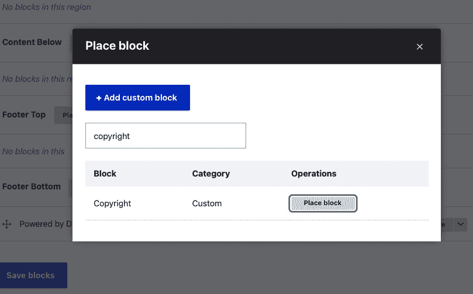
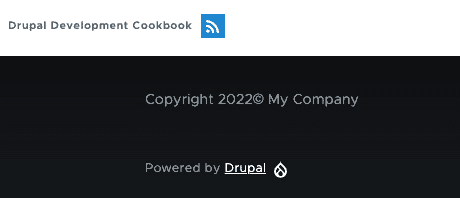
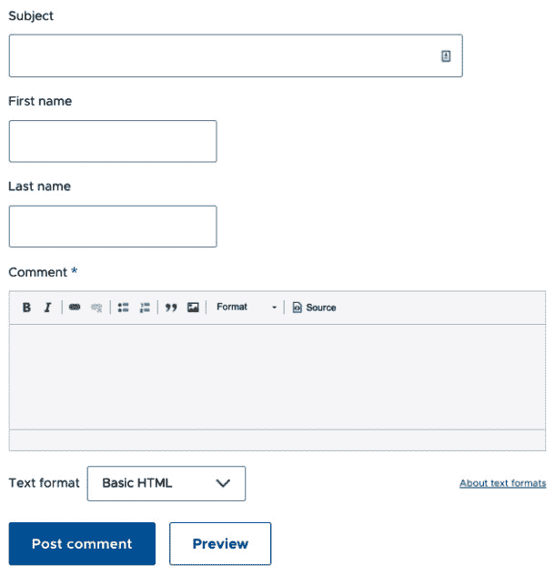
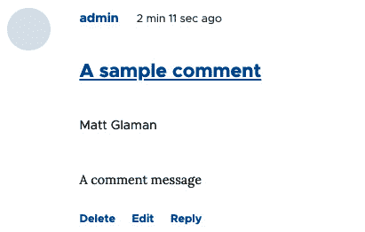

# 第八章：插件即插即用

插件为 **Drupal** 中的许多项目提供动力，例如块、字段类型和字段格式化器。插件和插件类型由模块提供。它们提供可交换的特定功能。

在本章中，我们将实现一个 **块插件**。我们将使用插件 API 来提供自定义字段类型以及字段的组件和格式化器。最后一个菜谱将向您展示如何创建和使用自定义插件类型。

Drupal 小版本中插件系统的即将到来的变化

**PHP 8** 提供了一个名为 **PHP 属性** 的功能 ([`www.php.net/manual/en/language.attributes.overview.php`](https://www.php.net/manual/en/language.attributes.overview.php))。随着 **Drupal 10** 对 **PHP 8.1** 的采用，考虑采用 PHP 属性来替代本章中使用的代码文档注解。

在 **Drupal 10.1** 中，可能支持使用 PHP 属性而不是注解。这是 Drupal 10 的第一个小版本。注解将在 Drupal 10 中得到支持，但可能会被弃用。关于弃用注解以使用 PHP 属性的讨论可以在以下问题中找到：[`www.drupal.org/project/drupal/issues/3252386`](https://www.drupal.org/project/drupal/issues/3252386)。

在本章中，我们将通过以下菜谱深入了解 Drupal 提供的插件 API：

+   使用插件创建块

+   创建自定义字段类型

+   创建自定义字段组件

+   创建自定义字段格式化器

+   创建自定义插件类型

# 技术要求

本章将需要一个自定义模块的安装。在以下菜谱中，模块名称为 `mymodule`。请适当替换。您可以在 GitHub 上找到本章使用的完整代码：[`github.com/PacktPublishing/Drupal-10-Development-Cookbook/tree/main/chp08`](https://github.com/PacktPublishing/Drupal-10-Development-Cookbook/tree/main/chp08)

# 使用插件创建块

在 Drupal 中，**块**是可以在主题提供的区域中放置的内容。块用于展示特定类型的内容，例如用户登录表单、一段文本，以及更多。

块是注解插件。注解插件使用文档块来提供插件详情。它们在模块的 `Plugin` 类命名空间中被发现。`Plugin/Block` 命名空间中的每个类都将由 `Block` 模块的插件管理器发现。

在这个菜谱中，我们将定义一个块，它将显示版权片段和当前年份，并将其放置在页脚区域。

## 如何做到这一点…

1.  首先，我们需要在模块目录中创建 `src/Plugin/Block` 目录。这将转换 `\Drupal\mymodule\Plugin\Block` 命名空间并允许块插件发现：

    ```php
    mkdir -p src/Plugin/Block
    ```

1.  在新创建的目录中创建一个名为 `Copyright.php` 的文件，以便我们可以为我们的块定义 `Copyright` 类。

1.  `Copyright` 类将扩展 `\Drupal\Core\Block\BlockBase` 类：

    ```php
    <?php
    ```

    ```php
    namespace Drupal\mymodule\Plugin\Block;
    ```

    ```php
    use Drupal\Core\Block\BlockBase;
    ```

    ```php
    class Copyright extends BlockBase {
    ```

    ```php
    }
    ```

我们将扩展 `BlockBase` 类，该类实现了 `\Drupal\Core\Block\BlockPluginInterface` 并为我们提供了接口几乎所有方法的实现。

1.  接下来，我们将在类文档块中编写插件注释。我们将提供块的标识符、管理标签和类别作为注释标签：

    ```php
    <?php
    ```

    ```php
    namespace Drupal\mymodule\Plugin\Block;
    ```

    ```php
    use Drupal\Core\Block\BlockBase;
    ```

    ```php
    /**
    ```

    ```php
     * @Block(
    ```

    ```php
     *   id = "copyright_block",
    ```

    ```php
     *   admin_label = @Translation("Copyright"),
    ```

    ```php
     *   category = @Translation("Custom"),
    ```

    ```php
     * )
    ```

    ```php
    */
    ```

    ```php
    class Copyright extends BlockBase {
    ```

    ```php
    }
    ```

注释提供在代码注释中，并以 `@` 为前缀。`@Block` 中的 `@` 符号指定这是一个 `Block` 注释。Drupal 将解析此并基于提供的属性创建一个插件定义。`id` 是内部机器名，`admin_label` 在块列表页上显示，而 `category` 则出现在块选择列表中。

1.  我们需要实现 `build` 方法以满足 `\Drupal\Core\Block\BlockPluginInterface` 接口。这返回要显示的输出：

    ```php
    <?php
    ```

    ```php
    namespace Drupal\mymodule\Plugin\Block;
    ```

    ```php
    use Drupal\Core\Block\BlockBase;
    ```

    ```php
    /**
    ```

    ```php
     * @Block(
    ```

    ```php
     * id = "copyright_block",
    ```

    ```php
     * admin_label = @Translation("Copyright"),
    ```

    ```php
     * category = @Translation("Custom")
    ```

    ```php
     * )
    ```

    ```php
     */
    ```

    ```php
    class Copyright extends BlockBase {
    ```

    ```php
      /**
    ```

    ```php
       * {@inheritdoc}
    ```

    ```php
       */
    ```

    ```php
      public function build() {
    ```

    ```php
        $date = new \DateTime();
    ```

    ```php
        return [
    ```

    ```php
          '#markup' => t('Copyright @year&copy; My
    ```

    ```php
            Company', [
    ```

    ```php
            '@year' => $date->format('Y'),
    ```

    ```php
          ]),
    ```

    ```php
        ];
    ```

    ```php
      }
    ```

    ```php
    }
    ```

`build` 方法返回一个渲染数组，使用 Drupal 的 `t` 函数将 `@year` 替换为格式化为完整年份的 `\DateTime` 对象的输出。

1.  重新构建你的 Drupal 网站缓存以重建块插件定义缓存，这将导致插件定义的重新发现：

    ```php
    php vendor/bin/drush cr
    ```

1.  从管理菜单中的 **结构** 转到 **块布局** 页面。在页脚第四个区域中，点击 **放置块**。

1.  查看块列表并将自定义块添加到你的区域中，例如页脚区域。找到 **版权** 块并点击对话框表单中的 **放置块**：



图 8.1 – 版权块放置对话框

1.  取消选择 **显示标题** 复选框，以便只渲染我们的块内容。点击 **保存块** 并接受所有其他默认设置。

1.  访问你的 Drupal 网站，并验证版权声明是否显示了当前年份：



图 8.2 – Drupal 网站页脚中的版权块

## 它是如何工作的...

插件系统由多个可实例化的类组成，这些类具有类似接口。使用注释和插件管理器，Drupal 使这些类可被发现。这允许与插件交互并执行其功能。

`\Drupal\Core\Block\BlockManager` 类指定了块插件必须位于 `Plugin\Block` 命名空间中。它还定义了需要实现的基接口，以及用于解析类文档块的 `Annotation` 类。

在检索插件定义时，插件管理器首先检查是否已经发现并缓存了定义。如果没有缓存的插件定义，插件管理器将扫描 Drupal 中注册的可用的命名空间中的`\Drupal\{extension}\Plugin\Block`命名空间下的插件。然后，发现的类将与包含注释数据的类文档一起处理，并将其作为可用的插件定义缓存。

当在`\Drupal\Core\Block\BlockBase`中调用`label`方法时，会显示插件注释中定义的可读名称。当一个块在渲染的页面上显示时，会调用`build`方法，并将其传递给主题层以输出。

## 还有更多...

在创建块插件时，可以使用更多深入的项目。我们将在接下来的章节中介绍这些内容。

### 修改块

块可以通过三种不同的方式修改：可以修改**插件定义**、**构建数组**或**视图数组输出**。

一个模块可以在其`.module`文件中实现`hook_block_alter`，从而修改所有发现块的注释定义。这将允许模块将默认的`user_login_block`从**用户登录**更改为**登录**：

```php
/**
 * Implements hook_block_alter().
 */
function mymodule_block_alter(&$definitions) {
  $definitions['user_login_block']['admin_label'] =
    t('Login');
}
```

一个模块可以实现`hook_block_build_alter`并修改块的构建信息。钩子通过构建数组和当前块的实例传递。模块开发者可以使用此功能添加缓存上下文或更改缓存元数据的缓存性：

```php
/**
 * Implements hook_block_build_alter().
 */
function mymodule_block_build_alter(
  array &$build,
  \Drupal\Core\Block\BlockPluginInterface $block
) {
  // Add the 'url' cache the block per URL.
  if ($block->id() == 'myblock') {
    $build['#cache']['contexts'][] = 'url';
  }
}
```

您可以通过更改此配方中创建的块以输出时间戳而不是年格式来测试缓存元数据的修改。启用缓存后，您将看到值在相同的 URL 上保持不变，但每个页面的值将不同。

最后，一个模块可以实现`hook_block_view_alter`以修改要渲染的块的输出。模块可以添加要渲染的内容或删除内容。这可以用来删除`contextual_links`项，允许在网站的首页上进行内联编辑：

```php
/**
 * Implements hook_block_view_alter().
 */
function mymodule_block_view_alter(
  array &$build,
  \Drupal\Core\Block\BlockPluginInterface $block
) {
  // Remove the contextual links on all blocks that provide
    them.
  if (isset($build['#contextual_links'])) {
    unset($build['#contextual_links']);
  }
}
```

### 块设置表单

块可以提供设置表单。此配方为版权文本提供了文本*我的公司*。而不是在代码中设置，这可以通过块设置表单中的文本字段来定义。

让我们重新审视包含我们块类的`Copyright.php`文件。我们将覆盖基类提供的方法。以下方法将添加到本配方中编写的类中。

一个块可以覆盖默认的`defaultConfiguration`方法，该方法返回设置键及其默认值的数组。然后可以覆盖`blockForm`方法以返回表示设置表单的`Form` API 数组：

```php
  /**
   * {@inheritdoc}
   */
  public function defaultConfiguration() {
    return [
      'company_name' => '',
    ];
  }
  /**
   * {@inheritdoc}
   */
  public function blockForm($form,
    \Drupal\Core\Form\FormStateInterface $form_state) {
    $form['company_name'] = [
      '#type' => 'textfield',
      '#title' => t('Company name'),
      '#default_value' => $this->configuration
         ['company_name'],
    ];
    return $form;
  }
```

然后，必须实现`blockSubmit`方法，该方法更新块的配置。以下代码从表单的状态中检索`company_name`值，该状态包含提交的值，并将其设置为`configuration`属性中的`company_name`键：

```php
  /**
   * {@inheritdoc}
   */
  public function blockSubmit($form, \Drupal
    \Core\Form\FormStateInterface $form_state) {
    $this->configuration['company_name'] =
    $form_state->getValue('company_name');
  }
```

最后，可以将`build`方法更新为使用新的配置项：

```php
  /**
   * {@inheritdoc}
   */
  public function build()
  {
    $date = new \DateTime();
    return [
      '#markup' => t('Copyright @year&copy; @company', [
        '@year' => $date->format('Y'),
        '@company' => $this->configuration['company_name'],
      ]),
    ];
  }
```

您现在可以返回到`版权`块。新的设置将在块实例的配置表单中可用。

### 定义块的访问权限

默认情况下，块为所有用户渲染。默认访问方法可以被覆盖。这允许块仅对认证用户或基于特定权限显示：

```php
/**
 * {@inheritdoc}
 */
protected function blockAccess(AccountInterface $account) {
  $route_name = $this->routeMatch->getRouteName();
  if ($account->isAnonymous() && !in_array($route_name,
     ['user.login', 'user.logout'])) {
    return AccessResult::allowed()
      ->addCacheContexts(['route.name',
        'user.roles:anonymous']);
  }
  return AccessResult::forbidden();
}
```

上述代码来自`user_login_block`。它允许在用户未登录且不在登录或注销页面时访问该块。访问权限基于当前路由名称和用户当前的角色为匿名者进行缓存。如果没有传递这些值，则返回的访问权限被禁止，并且块不会被构建。

其他模块可以实现`hook_block_access`来覆盖块的访问权限：

```php
/**
 * Implements hook_block_access().
 */
function mymodule_block_access(
  \Drupal\block\Entity\Block $block,
  $operation,
  \Drupal\Core\Session\AccountInterface $account
) {
  // Example code that would prevent displaying the
    Copyright' block in
  // a region different from the footer.
  if ($operation == 'view' && $block->getPluginId() ==
    'copyright') {
    return
      \Drupal\Core\Access\AccessResult::forbiddenIf($block-
        >getRegion() != 'footer');
  }
  // No opinion.
  return \Drupal\Core\Access\AccessResult::neutral();
}
```

实现上述钩子的模块将拒绝访问我们的`版权`块，如果它没有被放置在页脚区域。如果块操作不是`view`，并且块不是我们的`版权`块，则传递一个`neutral`访问结果。`neutral`结果允许系统处理其他访问结果。否则，`AccessResult::forbiddenIf`将根据传递给它的布尔值返回`neutral`或`forbidden`。

## 参见

+   参考本章的*创建自定义插件类型*配方

+   基于注解的插件文档：[`www.drupal.org/docs/drupal-apis/plugin-api/annotations-based-plugins`](https://www.drupal.org/docs/drupal-apis/plugin-api/annotations-based-plugins)

+   关于`Block`模块提供的钩子信息：[`api.drupal.org/api/drupal/core%21modules%21block%21block.api.php/10`](https://api.drupal.org/api/drupal/core%21modules%21block%21block.api.php/10)

# 创建自定义字段类型

**字段类型**是通过插件系统定义的。每种字段类型都有自己的类和定义。可以通过一个自定义类来定义新的字段类型，该类将提供模式和信息属性。

字段类型定义了通过**字段**API 在实体上存储和处理数据的方式。字段小部件提供在用户界面中编辑字段类型的方法。字段格式化程序提供向用户显示字段数据的方法。两者都是插件，将在后面的配方中介绍。

在本例中，我们将创建一个简单的字段类型，称为`realname`，用于存储姓名和姓氏，并将其添加到`评论`类型中。

## 准备工作

此配方向`评论`类型添加一个字段，这需要安装`评论`模块。`评论`模块默认与标准 Drupal 安装一起安装。

## 如何做到这一点…

1.  首先，我们需要在模块目录中创建 `src/Plugin/Field/FieldType` 目录。`Field` 模块在 `Plugin\Field\FieldType` 命名空间中查找字段类型：

    ```php
    mkdir -p src/Plugin/Field/FieldType
    ```

1.  在新创建的目录中创建一个名为 `RealName.php` 的文件，以便我们可以定义 `RealName` 类。这将为我们提供用于姓氏和名字的 `realname` 字段类型。

1.  `RealName` 类将扩展 `\Drupal\Core\Field\FieldItemBase` 类：

    ```php
    <?php
    ```

    ```php
    namespace Drupal\mymodule\Plugin\Field\FieldType;
    ```

    ```php
    use Drupal\Core\Field\FieldItemBase;
    ```

    ```php
    use Drupal\Core\Field\FieldStorageDefinitionInterface;
    ```

    ```php
    use Drupal\Core\TypedData\DataDefinition;
    ```

    ```php
    class RealName extends FieldItemBase {
    ```

    ```php
    }
    ```

我们将扩展 `FieldItemBase` 类，它满足 `FieldType` 插件类型继承接口定义的方法，除了 `schema` 和 `propertyDefinitions` 方法。

1.  接下来，我们将在类文档块中编写插件注释。我们将提供字段类型的标识符、标签、描述、类别、默认小部件和格式化器：

    ```php
    <?php
    ```

    ```php
    namespace Drupal\mymodule\Plugin\Field\FieldType;
    ```

    ```php
    use Drupal\Core\Field\FieldItemBase;
    ```

    ```php
    use Drupal\Core\Field\FieldStorageDefinitionInterface;
    ```

    ```php
    use Drupal\Core\TypedData\DataDefinition;
    ```

    ```php
    /**
    ```

    ```php
     * Plugin implementation of the 'realname' field type.
    ```

    ```php
     *
    ```

    ```php
     * @FieldType(
    ```

    ```php
     *   id = "realname",
    ```

    ```php
     *   label = @Translation("Real name"),
    ```

    ```php
     *   description = @Translation("This field stores a
    ```

    ```php
            first and last name."),
    ```

    ```php
     *   category = @Translation("General"),
    ```

    ```php
     *   default_widget = "string_textfield",
    ```

    ```php
     *   default_formatter = "string"
    ```

    ```php
     * )
    ```

    ```php
     */
    ```

    ```php
    class RealName extends FieldItemBase {
    ```

    ```php
    }
    ```

`@FieldType` 注释告诉 Drupal 这是一个 `FieldType` 插件。以下属性被定义：

+   `id`: 这是插件的机器名称

+   `label`: 这是字段的可读名称

+   `description`: 这是字段的可读描述

+   `category`: 这是字段在用户界面中显示的类别

+   `default_widget`: 这是用于编辑的默认表单小部件

+   `default_formatter`: 这是默认的格式化器，您可以使用它来显示字段

1.  `RealName` 类需要实现 `\Drupal\Core\Field\FieldItemInterface` 中定义的 `schema` 方法。这个方法返回一个数据库 API 架构信息的数组。请将以下方法添加到您的类中：

    ```php
      /**
    ```

    ```php
       * {@inheritdoc}
    ```

    ```php
       */
    ```

    ```php
      public static function schema(FieldStorage
    ```

    ```php
        DefinitionInterface $field_definition)  {
    ```

    ```php
        return [
    ```

    ```php
          'columns' => [
    ```

    ```php
            'first_name' => [
    ```

    ```php
              'description' => 'First name.',
    ```

    ```php
              'type' => 'varchar',
    ```

    ```php
              'length' => '255',
    ```

    ```php
              'not null' => TRUE,
    ```

    ```php
              'default' => '',
    ```

    ```php
            ],
    ```

    ```php
            'last_name' => [
    ```

    ```php
              'description' => 'Last name.',
    ```

    ```php
              'type' => 'varchar',
    ```

    ```php
              'length' => '255',
    ```

    ```php
              'not null' => TRUE,
    ```

    ```php
              'default' => '',
    ```

    ```php
            ],
    ```

    ```php
          ],
    ```

    ```php
          'indexes' => [
    ```

    ```php
            'first_name' => ['first_name'],
    ```

    ```php
            'last_name' => ['last_name'],
    ```

    ```php
          ],
    ```

    ```php
        ];
    ```

    ```php
      }
    ```

`schema` 方法定义了字段数据表中的数据库列。我们定义一个列来存储 `first_name` 和 `last_name` 的值。

1.  我们还需要实现 `propertyDefinitions` 方法。这个方法返回在 `schema` 方法中定义的值的定义。请将以下方法添加到您的类中：

    ```php
      /**
    ```

    ```php
       * {@inheritdoc}
    ```

    ```php
       */
    ```

    ```php
      public static function propertyDefinitions
    ```

    ```php
         (FieldStorageDefinitionInterface
    ```

    ```php
            $field_definition) {
    ```

    ```php
        $properties['first_name'] =
    ```

    ```php
            DataDefinition::create('string')
    ```

    ```php
          ->setLabel(t('First name'));
    ```

    ```php
        $properties['last_name'] =
    ```

    ```php
            DataDefinition::create('string')
    ```

    ```php
          ->setLabel(t('Last name'));
    ```

    ```php
        return $properties;
    ```

    ```php
      }
    ```

此方法返回一个数组，其键与在架构中提供的相同列名。它返回数据定义来表示字段类型中的属性。

1.  我们将覆盖另一个方法，即 `mainPropertyName` 方法，以指定 `first_name` 是主要属性：

    ```php
      /**
    ```

    ```php
       * {@inheritdoc}
    ```

    ```php
       */
    ```

    ```php
      public static function mainPropertyName() {
    ```

    ```php
        return 'first_name';
    ```

    ```php
      }
    ```

此方法允许在存在多个值时指定用于自动检索字段值的主要属性。

1.  重建您的 Drupal 网站的缓存以构建字段类型插件定义缓存，这将导致插件定义的重新发现：

    ```php
    php vendor/bin/drush cr
    ```

1.  字段现在将出现在字段类型管理屏幕上。要使用它，请转到 **结构**，然后转到 **评论类型**。现在您可以转到 **管理字段** 并点击 **添加字段**，为您的评论添加一个真实姓名条目：


图 8.3 – 在“添加新字段”列表中出现的字段

## 它是如何工作的…

字段类型的插件管理器是`plugin.manager.field.field_type`服务。此插件管理器定义字段类型插件必须在`Plugin\Field\FieldType`命名空间中，并实现`\Drupal\Core\Field\FieldItemInterface`。

当向实体类型添加新字段时，定义从字段类型管理器检索以填充字段类型列表。当向实体类型添加字段时，该实体类型的数据库存储将根据字段在`propertyDefinitions`中提供的属性以及`schema`方法中的模式进行更新。

## 更多内容...

字段类型可以实现一个方法来定义值是否为空。我们将在下一节中介绍这一点。

### 定义字段是否为空

字段类型类有一个`isEmpty`方法，用于确定字段是否没有值。

字段类型扩展了`Drupal\Core\TypedData\Plugin\DataType\Map`，这是 Drupal 的`\Drupal\Core\TypedDate\ComplexDataInterface`接口中关联数组的类表示，它提供了`isEmpty`方法。

默认功能是，只要有一个属性有值，字段就不会被视为为空。例如，如果我们的真实姓名字段中第一个或最后一个名称有值，则不会被视为为空。

字段类型可以提供它们自己的实现以提供更健壮的验证。

# 创建自定义字段小部件

**字段小部件**为实体表单中的字段提供表单组件。这些与表单 API 集成，以定义字段如何被编辑以及数据在保存之前如何格式化。字段小部件通过表单显示界面进行选择和定制。

在本食谱中，我们将创建一个用于本章中*创建自定义字段类型*食谱中创建的字段的控件。该字段小部件将为输入第一个和最后一个名称项提供两个文本字段。

## 准备工作

本食谱提供了一个字段小部件，用于上一节中创建的字段类型，*创建自定义* *字段类型*。

## 如何实现...

1.  首先，我们需要在模块目录中创建`src/Plugin/Field/FieldWidget`目录。`Field`模块在`Plugin\Field\FieldWidget`命名空间中查找字段小部件：

    ```php
    mkdir -p src/Plugin/Field/FieldWidget
    ```

1.  在新创建的目录中创建一个`RealNameDefaultWidget.php`文件，以便我们可以定义`RealNameDefaultWidget`类。这将提供一个自定义表单元素来编辑字段的第一个和最后一个名称值。

1.  `RealNameDefaultWidget`类将扩展`\Drupal\Core\Field\WidgetBase`类：

    ```php
    <?php
    ```

    ```php
    namespace Drupal\mymodule\Plugin\Field\FieldWidget;
    ```

    ```php
    use Drupal\Core\Field\FieldItemListInterface;
    ```

    ```php
    use Drupal\Core\Field\WidgetBase;
    ```

    ```php
    use Drupal\Core\Form\FormStateInterface;
    ```

    ```php
    class RealNameDefaultWidget extends WidgetBase {
    ```

    ```php
    }
    ```

1.  我们将扩展`WidgetBase`类，它满足继承接口为`FieldWidget`插件类型定义的方法，除了`formElement`方法。

1.  我们将在插件的注释中提供字段小部件的标识符、标签和支持的字段类型：

    ```php
    <?php
    ```

    ```php
    namespace Drupal\mymodule\Plugin\Field\FieldWidget;
    ```

    ```php
    use Drupal\Core\Field\FieldItemListInterface;
    ```

    ```php
    use Drupal\Core\Field\WidgetBase;
    ```

    ```php
    use Drupal\Core\Form\FormStateInterface;
    ```

    ```php
    /**
    ```

    ```php
     * Plugin implementation of the 'realname_default'
    ```

    ```php
        widget.
    ```

    ```php
     *
    ```

    ```php
     * @FieldWidget(
    ```

    ```php
     *   id = "realname_default",
    ```

    ```php
     *   label = @Translation("Real name"),
    ```

    ```php
     *   field_types = {
    ```

    ```php
     *     "realname"
    ```

    ```php
     *   }
    ```

    ```php
     * )
    ```

    ```php
     */
    ```

    ```php
    class RealNameDefaultWidget extends WidgetBase {
    ```

    ```php
    }
    ```

`@FieldWidget`告诉 Drupal 这是一个字段小部件插件。它定义`id`来表示机器名，可读名称为`label`，以及小部件交互的字段类型作为`field_types`属性。

1.  我们需要实现`formElement`方法，以满足在扩展`\Drupal\Core\Field\WidgetBase`后的剩余接口方法。将以下方法添加到您的类中：

    ```php
      /**
    ```

    ```php
       * {@inheritdoc}
    ```

    ```php
       */
    ```

    ```php
      public function formElement(
    ```

    ```php
        FieldItemListInterface $items,
    ```

    ```php
        $delta,
    ```

    ```php
        array $element,
    ```

    ```php
        array &$form,
    ```

    ```php
        FormStateInterface $form_state
    ```

    ```php
      ) {
    ```

    ```php
        $element['first_name'] = [
    ```

    ```php
          '#type' => 'textfield',
    ```

    ```php
          '#title' => t('First name'),
    ```

    ```php
          '#default_value' => '',
    ```

    ```php
          '#size' => 25,
    ```

    ```php
          '#required' => $element['#required'],
    ```

    ```php
        ];
    ```

    ```php
        $element['last_name'] = [
    ```

    ```php
          '#type' => 'textfield',
    ```

    ```php
          '#title' => t('Last name'),
    ```

    ```php
          '#default_value' => '',
    ```

    ```php
          '#size' => 25,
    ```

    ```php
          '#required' => $element['#required'],
    ```

    ```php
        ];
    ```

    ```php
        return $element;
    ```

    ```php
      }
    ```

`formElement`方法返回表单 API 数组结构，该结构应添加到每个字段项的实体表单中。元素项的名称 - `first_name`和`last_name` - 映射到字段属性名称，以便正确保存。

1.  接下来，我们需要修改我们的原始`RealName`字段类型插件类，以使用我们创建的默认小部件。修改`src/Plugin/FieldType/RealName.php`文件，并更新`default_widget`注解属性为`realname_default`：

    ```php
    /**
    ```

    ```php
     * Plugin implementation of the 'realname' field type.
    ```

    ```php
     *
    ```

    ```php
     * @FieldType(
    ```

    ```php
     *   id = "realname",
    ```

    ```php
     *   label = @Translation("Real name"),
    ```

    ```php
     *   description = @Translation("This field stores a
    ```

    ```php
            first and last name."),
    ```

    ```php
     *   category = @Translation("General"),
    ```

    ```php
     *   default_widget = "realname_default",
    ```

    ```php
     *   default_formatter = "string"
    ```

    ```php
     * )
    ```

    ```php
     */
    ```

    ```php
    class RealName extends FieldItemBase {
    ```

1.  重建您的 Drupal 站点的缓存以更新字段类型定义和新字段小部件插件发现：

    ```php
    php vendor/bin/drush cr
    ```

1.  添加到**评论类型**的字段现在将使用字段小部件：



图 8.4 – 评论表单上的真实姓名小部件

## 它是如何工作的...

字段类型的插件管理器是`plugin.manager.field.widget`服务。此插件管理器定义字段类型插件必须在`Plugin\Field\FieldWidget`命名空间中，并实现`\Drupal\Core\Field\WidgetInterface`。

实体表单显示系统使用插件管理器将字段定义作为选项加载到表单显示配置表单上。当使用表单显示配置构建实体表单时，表单构建过程将`formElement`方法返回的元素添加到实体表单中。

## 还有更多...

字段小部件有额外的提供更多信息的方法；它们将在下一节中介绍。

### 字段小部件设置和摘要

`\Drupal\Core\Field\WidgetInterface`接口定义了三个可覆盖的方法，以提供设置表单和当前设置的摘要：

+   `defaultSettings`: 这返回一个设置键和默认值的数组

+   `settingsForm`: 这返回一个用于设置表单的表单 API 数组

+   `settingsSummary`: 这允许返回并显示在字段管理显示表单上的字符串数组

可以使用小部件设置来更改用户看到的表单。可以创建一个设置，允许字段元素仅通过一个文本字段输入第一个或最后一个名字。

# 创建自定义字段格式化器

**字段格式化器**定义了字段类型将被呈现的方式。这些格式化器返回要由主题层处理的渲染数组信息。字段格式化器在显示模式接口上进行配置。

在本配方中，我们将创建一个格式化器，用于在本章的 *创建自定义字段类型* 配方中创建的字段。字段格式化器将显示姓氏和名字的值，作为全名。

## 准备工作

此配方提供了一个字段格式化器，用于在先前的配方中创建的字段类型，*创建自定义* *字段类型*。

## 如何做到这一点...

1.  首先，我们需要在模块目录中创建 `src/Plugin/Field/FieldFormatter` 目录。`Field` 模块在 `Plugin\Field\FieldFormatter` 命名空间中查找字段格式化器：

    ```php
    mkdir -p src/Plugin/Field/FieldFormatter
    ```

1.  在新创建的目录中创建一个 `RealNameFormatter.php` 文件，以便我们可以定义 `RealNameFormatter` 类。这将提供一个自定义格式化器来显示字段的值。

1.  `RealNameFormatter` 类将扩展 `\Drupal\Core\Field\FormatterBase` 类：

    ```php
    <?php
    ```

    ```php
    namespace Drupal\mymodule\Plugin\Field\FieldFormatter;
    ```

    ```php
    use Drupal\Core\Field\FormatterBase;
    ```

    ```php
    use Drupal\Core\Field\FieldItemListInterface;
    ```

    ```php
    class RealNameFormatter extends FormatterBase {
    ```

    ```php
    }
    ```

我们扩展了 `FormatterBase` 类，这满足了 `FieldFormatter` 插件类型继承接口定义的方法，除了 `viewElements` 方法。

1.  我们将在插件的注解中提供字段小部件的标识符、标签和支持的字段类型：

    ```php
    <?php
    ```

    ```php
    namespace Drupal\mymodule\Plugin\Field\FieldFormatter;
    ```

    ```php
    use Drupal\Core\Field\FormatterBase;
    ```

    ```php
    use Drupal\Core\Field\FieldItemListInterface;
    ```

    ```php
    /**
    ```

    ```php
     * Plugin implementation of the 'realname_one_line'
    ```

    ```php
        formatter.
    ```

    ```php
     *
    ```

    ```php
     * @FieldFormatter(
    ```

    ```php
     *   id = "realname_one_line",
    ```

    ```php
     *   label = @Translation("Real name (one line)"),
    ```

    ```php
     *   field_types = {
    ```

    ```php
     *     "realname"
    ```

    ```php
     *   }
    ```

    ```php
     * )
    ```

    ```php
     */
    ```

    ```php
    class RealNameFormatter extends FormatterBase {
    ```

    ```php
    }
    ```

`@FieldFormatter` 告诉 Drupal 这是一个字段格式化插件。它定义了 `id` 来表示机器名，可读名称为 `label`，以及格式化器交互的字段类型作为 `field_types` 属性。

1.  我们需要实现 `viewElements` 方法以满足 `\Drupal\Core\Field\FormatterInterface` 接口。这用于渲染字段数据。将以下方法添加到您的类中：

    ```php
      /**
    ```

    ```php
       * {@inheritdoc}
    ```

    ```php
       */
    ```

    ```php
      public function viewElements(
    ```

    ```php
        FieldItemListInterface $items,
    ```

    ```php
        $langcode
    ```

    ```php
      ) {
    ```

    ```php
        $element = [];
    ```

    ```php
        foreach ($items as $delta => $item) {
    ```

    ```php
          $element[$delta] = [
    ```

    ```php
            '#markup' => $this->t('@first @last', [
    ```

    ```php
              '@first' => $item->first_name,
    ```

    ```php
              '@last' => $item->last_name,
    ```

    ```php
            ]),
    ```

    ```php
          ];
    ```

    ```php
        }
    ```

    ```php
        return $element;
    ```

    ```php
      }
    ```

字段值作为 `FieldItemListInterface` 可迭代对象提供给 `viewElements` 方法，其中包含每个字段项。Drupal 中的字段可以包含单个值，也可以包含无限数量的值。我们遍历每个值，创建一个模板字符串，将姓氏和名字的值在一行中显示为全名。

1.  接下来，我们需要修改我们原始的 `RealName` 字段类型插件类，以使用我们创建的默认格式化器。打开 `src/Plugin/FieldType/RealName.php` 文件，并将 `default_formatter` 注解属性更新为 `realname_one_line`：

    ```php
    /**
    ```

    ```php
     * Plugin implementation of the 'realname' field type.
    ```

    ```php
     *
    ```

    ```php
     * @FieldType(
    ```

    ```php
     *   id = "realname",
    ```

    ```php
     *   label = @Translation("Real name"),
    ```

    ```php
     *   description = @Translation("This field stores a
    ```

    ```php
            first and last name."),
    ```

    ```php
     *   category = @Translation("General"),
    ```

    ```php
     *   default_widget = "realname_default",
    ```

    ```php
     *   default_formatter = "realname_one_line"
    ```

    ```php
     * )
    ```

    ```php
     */
    ```

    ```php
    class RealName extends FieldItemBase {
    ```

1.  重建您的 Drupal 网站的缓存以更新字段类型定义和新字段格式化插件发现：

    ```php
    php vendor/bin/drush cr
    ```

1.  添加到 **评论类型** 的字段现在将使用字段格式化器：



图 8.5 – 实名格式化器的输出

## 它是如何工作的...

字段类型插件管理器是 `plugin.manager.field.formatter` 服务。此插件管理器定义字段类型插件必须在 `Plugin\Field\FieldFormatter` 命名空间中，并实现 `\Drupal\Core\Field\FormatterInterface`。

实体视图显示系统使用插件管理器来加载字段定义作为视图显示配置表单上的选项。当使用视图显示配置构建实体时，该过程遍历实体上的每个字段并调用配置的格式化器的 `viewElements` 方法。最终结果用于渲染实体的显示。

## 还有更多...

字段格式化器有额外的提供更多信息的方法；它们将在下一节中介绍。

### 格式化器设置和摘要

`\Drupal\Core\Field\FormatterInterface` 接口定义了三个可以重写的方法，以提供设置表单和当前设置的摘要：

+   `defaultSettings`：这返回一个设置键和默认值的数组

+   `settingsForm`：这返回一个用于设置表单的 Form API 数组

+   `settingsSummary`：这允许返回并显示在字段的 manage 显示表单上的字符串数组

设置可以用来改变格式化器显示信息的方式。例如，可以实现这些方法来提供设置以隐藏或显示姓名的首字母或最后一个字母。

# 创建自定义插件类型

**插件系统**提供了一种在 Drupal 中创建不需要实体系统数据存储功能的专业对象的方法。正如我们通过块和字段插件所看到的，每种插件类型都服务于特定的目的，并允许扩展性。

在本食谱中，我们将创建一个名为 `GeoLocator` 的新插件类型，该类型将返回给定 IP 地址的国家代码。我们将创建一个插件管理器、默认插件接口、插件注释定义和插件实现。**内容分发网络**（**CDN**）通常提供带有访问者国家代码的 HTTP 头。我们将提供针对 **Cloudflare** 和 **AWS CloudFront** 的插件。

## 如何做到这一点...

1.  所有插件都需要一个充当插件管理器的服务。在您的模块的 `src` 目录中创建一个名为 `GeoLocatorManager.php` 的文件。这将包含 `GeoLocatorManager` 类。

1.  通过扩展 Drupal 核心提供的 `\Drupal\Core\Plugin\DefaultPluginManager` 类来创建 `GeoLocatorManager` 类：

    ```php
    <?php
    ```

    ```php
    namespace Drupal\mymodule;
    ```

    ```php
    use Drupal\Core\Plugin\DefaultPluginManager;
    ```

    ```php
    use Drupal\Core\Cache\CacheBackendInterface;
    ```

    ```php
    use Drupal\Core\Extension\ModuleHandlerInterface;
    ```

    ```php
    class GeoLocatorManager extends DefaultPluginManager {
    ```

    ```php
    }
    ```

`DefaultPluginManager` 提供了插件管理器的基本功能，要求实现者只需重写其构造函数。

1.  接下来，我们需要重写 `DefaultPluginManager` 类中的 `__construct` 方法来定义有关我们的插件类型的信息。注意，它将引用以下步骤中创建的代码：

    ```php
    <?php
    ```

    ```php
    namespace Drupal\mymodule;
    ```

    ```php
    use Drupal\Core\Plugin\DefaultPluginManager;
    ```

    ```php
    use Drupal\Core\Cache\CacheBackendInterface;
    ```

    ```php
    use Drupal\Core\Extension\ModuleHandlerInterface;
    ```

    ```php
    class GeoLocatorManager extends DefaultPluginManager {
    ```

    ```php
      public function __construct(
    ```

    ```php
        \Traversable $namespaces,
    ```

    ```php
        CacheBackendInterface $cache_backend,
    ```

    ```php
        ModuleHandlerInterface
    ```

    ```php
        $module_handler
    ```

    ```php
      ) {
    ```

    ```php
        parent::__construct(
    ```

    ```php
          'Plugin/GeoLocator',
    ```

    ```php
          $namespaces,
    ```

    ```php
          $module_handler,
    ```

    ```php
          'Drupal\mymodule\Plugin\GeoLocator
    ```

    ```php
            \GeoLocatorInterface',
    ```

    ```php
          'Drupal\mymodule\Annotation\GeoLocator'
    ```

    ```php
        );
    ```

    ```php
      }
    ```

    ```php
    }
    ```

`Plugin/GeoLocator`的父构造函数的第一个参数指定`GeoLocator`插件必须位于一个模块中。第四个参数`Drupal\mymodule\Plugin\GeoLocator\GeoLocatorInterface`标识了`GeoLocator`插件必须实现的接口。第五个参数`Drupal\mymodule\Annotation\GeoLocator`指定了注释类，以便插件可以通过`@GeoLocator`注释进行注册。

1.  在我们创建`GeoLocator`插件接口和注释之前，我们将创建服务定义以注册我们的插件管理器。创建一个`mymodule.services.yml`文件并添加以下内容：

    ```php
    services:
    ```

    ```php
      plugin.manager.geolocator:
    ```

    ```php
        class: Drupal\mymodule\GeoLocatorManager
    ```

    ```php
        parent: default_plugin_manager
    ```

虽然不是必需的，但命名插件管理器服务时使用`plugin.manager.`然后是插件类型名称是一种模式。我们可以使用父定义来告诉服务容器在构建我们的类时使用与`default_plugin_manager`定义相同的参数。

1.  所有基于注释的插件都必须提供一个注释类。在`src/Annotation`中创建`GeoLocator.php`以提供`GeoLocator`注释类，正如我们在插件管理器中指定的那样：

    ```php
    <?php
    ```

    ```php
    namespace Drupal\mymodule\Annotation;
    ```

    ```php
    use Drupal\Component\Annotation\Plugin;
    ```

    ```php
    /**
    ```

    ```php
     * @Annotation
    ```

    ```php
     */
    ```

    ```php
    class GeoLocator extends Plugin
    ```

    ```php
    {
    ```

    ```php
      /**
    ```

    ```php
       * The human-readable name.
    ```

    ```php
       *
    ```

    ```php
       * @var \Drupal\Core\Annotation\Translation
    ```

    ```php
       *
    ```

    ```php
       * @ingroup plugin_translatable
    ```

    ```php
       */
    ```

    ```php
      public $label;
    ```

    ```php
    }
    ```

每个属性都是可以在插件注释中定义的项目。对于我们的插件，注释定义将是`@GeoLocator`，因为注释的类名是`GeoLocator`。

1.  接下来，我们将定义在插件管理器中定义的插件接口。插件发现过程验证`GeoLocator`插件实现了此接口。在我们的模块的`src/Plugin/GeoLocator`目录中创建一个`GeoLocatorInterface.php`文件以保存接口：

    ```php
    <?php
    ```

    ```php
    namespace Drupal\mymodule\Plugin\GeoLocator;
    ```

    ```php
    use Symfony\Component\HttpFoundation\Request;
    ```

    ```php
    interface GeoLocatorInterface {
    ```

    ```php
      /**
    ```

    ```php
       * Get the plugin's label.
    ```

    ```php
       *
    ```

    ```php
       * @return string
    ```

    ```php
       *   The geolocator label
    ```

    ```php
       */
    ```

    ```php
      public function label();
    ```

    ```php
      /**
    ```

    ```php
       * Performs geolocation on an address.
    ```

    ```php
       *
    ```

    ```php
       * @param Request $request
    ```

    ```php
       *   The request.
    ```

    ```php
       *
    ```

    ```php
       * @return string|NULL
    ```

    ```php
       *   The geolocated country code, or NULL if not
    ```

    ```php
            found.
    ```

    ```php
       */
    ```

    ```php
      public function geolocate(Request $request):
    ```

    ```php
        ?string;
    ```

    ```php
    }
    ```

我们提供了一个接口，以确保在处理`GeoLocator`插件时，我们可以保证有这些预期的方法。`geolocate`方法接收一个请求对象并返回一个国家代码，如果找不到则返回`null`。

1.  现在我们已经设置了插件类型，我们将创建第一个插件以支持 Cloudflare 国家代码头。为`Cloudflare`插件类创建`src/Plugin/GeoLocator/Cloudflare.php`文件：

    ```php
    <?php
    ```

    ```php
    namespace Drupal\mymodule\Plugin\GeoLocator;
    ```

    ```php
    use Drupal\Core\Plugin\PluginBase;
    ```

    ```php
    use Symfony\Component\HttpFoundation\Request;
    ```

    ```php
    /**
    ```

    ```php
     * @GeoLocator(
    ```

    ```php
     *   id = "cloudflare",
    ```

    ```php
     *   label = "Cloudflare"
    ```

    ```php
     * )
    ```

    ```php
     */
    ```

    ```php
    class Cloudflare extends PluginBase implements
    ```

    ```php
        GeoLocatorInterface {
    ```

    ```php
      public function label() {
    ```

    ```php
        return $this->pluginDefinition['label'];
    ```

    ```php
      }
    ```

    ```php
      public function geolocate(Request $request): ?string {
    ```

    ```php
        return $request->headers->get('CF-IPCountry');
    ```

    ```php
      }
    ```

    ```php
    }
    ```

Cloudflare 通过一个名为`CF-IPCountry`的 HTTP 头提供访问者的国家代码。此插件返回该头的值，如果不存在则返回`null`。

1.  接下来，我们创建一个插件以支持 AWS CloudFront 的国家代码头。为`CloudFront`插件类创建`src/Plugin/GeoLocator/CloudFront.php`文件：

    ```php
    <?php
    ```

    ```php
    namespace Drupal\mymodule\Plugin\GeoLocator;
    ```

    ```php
    use Drupal\Core\Plugin\PluginBase;
    ```

    ```php
    use Symfony\Component\HttpFoundation\Request;
    ```

    ```php
    /**
    ```

    ```php
     * @GeoLocator(
    ```

    ```php
     *   id = "cloudfront",
    ```

    ```php
     *   label = "CloudFront"
    ```

    ```php
     * )
    ```

    ```php
     */
    ```

    ```php
    class CloudFront extends PluginBase implements
    ```

    ```php
        GeoLocatorInterface {
    ```

    ```php
      public function label() {
    ```

    ```php
        return $this->pluginDefinition['label'];
    ```

    ```php
      }
    ```

    ```php
      public function geolocate(Request $request): ?string {
    ```

    ```php
        return $request->headers->get('CloudFront-Viewer-
    ```

    ```php
            Country');
    ```

    ```php
      }
    ```

    ```php
    }
    ```

AWS CloudFront 通过一个名为`CloudFront-Viewer-Country`的 HTTP 头提供访问者的国家代码。此插件返回该头的值，如果不存在则返回`null`。

1.  最后，我们将创建一个演示插件，该插件从查询参数中读取国家代码。为`RequestQuery`插件类创建`src/Plugin/GeoLocator/RequestQuery.php`文件：

    ```php
    <?php
    ```

    ```php
    namespace Drupal\mymodule\Plugin\GeoLocator;
    ```

    ```php
    use Drupal\Core\Plugin\PluginBase;
    ```

    ```php
    use Symfony\Component\HttpFoundation\Request;
    ```

    ```php
    /**
    ```

    ```php
     * @GeoLocator(
    ```

    ```php
     *   id = "request_query",
    ```

    ```php
     *   label = "Request query"
    ```

    ```php
     * )
    ```

    ```php
     */
    ```

    ```php
    class RequestQuery extends PluginBase implements
    ```

    ```php
        GeoLocatorInterface {
    ```

    ```php
      public function label() {
    ```

    ```php
        return $this->pluginDefinition['label'];
    ```

    ```php
      }
    ```

    ```php
      public function geolocate(Request $request): ?string {
    ```

    ```php
        return $request->query->get('countryCode');
    ```

    ```php
      }
    ```

    ```php
    }
    ```

与其他插件不同，此插件返回 URL 中`countryCode`查询参数的值。

1.  以下是一个示例，它将在每个页面上设置国家代码消息，如果插件可以检测到国家代码：

    ```php
    <?php
    ```

    ```php
    /**
    ```

    ```php
     * Implements hook_page_top().
    ```

    ```php
     */
    ```

    ```php
    function mymodule_page_top() {
    ```

    ```php
      $request = \Drupal::request();
    ```

    ```php
      /** @var \Drupal\mymodule\GeoLocatorManager $manager
    ```

    ```php
        */
    ```

    ```php
      $manager = \Drupal::service
    ```

    ```php
        ('plugin.manager.geolocator');
    ```

    ```php
      foreach ($manager->getDefinitions() as $plugin_id =>
    ```

    ```php
        $definition) {
    ```

    ```php
        /** @var \Drupal\mymodule\Plugin\GeoLocator
    ```

    ```php
            \GeoLocatorInterface */
    ```

    ```php
        $instance = $manager->createInstance($plugin_id);
    ```

    ```php
        $country_code = $instance->geolocate($request);
    ```

    ```php
        if ($country_code) {
    ```

    ```php
          \Drupal::messenger()->addStatus("Country:
    ```

    ```php
            $country_code");
    ```

    ```php
          break;
    ```

    ```php
        }
    ```

    ```php
      }
    ```

    ```php
    }
    ```

我们从插件管理器获取定义，并为每个插件创建一个实例。然后我们检查插件是否返回结果。如果插件返回国家代码，国家代码将被添加为消息，然后循环停止。

## 它是如何工作的…

插件和插件类型是将具有特定功能操作的类分组的一种方式。插件管理器提供了一种发现这些类和实例化的方法。在这个食谱的最后一步中，我们使用了插件管理器来查找每个定义，创建插件的实例，然后调用`geolocate`方法从请求对象中找到一个国家代码。

插件管理器使用发现方法来查找插件类。默认情况下，使用`\Drupal\Core\Plugin\Discovery\AnnotatedClassDiscovery`发现方法。子目录用于查找插件，我们在插件管理器的`__construct`方法中指定为`Plugin/GeoLocator`。注释类发现随后遍历命名空间到其目录的映射。它发现所需目录中的 PHP 文件。然后检查这些类是否具有正确的`@GeoLocator`注释并确保它们实现了`GeoLocatorInterface`接口。发现的类随后被注册为插件定义。

## 还有更多…

创建自定义插件类型有许多附加项；我们将在以下章节中讨论其中的一些。

### 指定一个修改钩子

插件管理器能够定义一个修改钩子。以下代码行将被添加到`GeoLocatorManager`类的构造函数中，以提供`hook_geolocator_plugins_alter`修改钩子。这被传递给模块处理服务以进行调用：

```php
  public function __construct(
    \Traversable $namespaces,
    CacheBackendInterface $cache_backend,
    ModuleHandlerInterface
    $module_handler
  ) {
    parent::__construct(
      'Plugin/GeoLocator',
      $namespaces,
      $module_handler,
      'Drupal\mymodule\Plugin\GeoLocator
        \GeoLocatorInterface',
      'Drupal\mymodule\Annotation\GeoLocator'
    );
    // Specify the alter hook.
    $this->alterInfo('geolocator_info');
  }
```

在`.module`文件中实现`hook_geolocator_plugins_alter`的模块具有修改所有发现的插件定义的能力。它们还具有删除定义的插件条目或修改为注释定义提供的任何信息的能力。

### 使用缓存后端

插件可以使用缓存后端来提高性能。这可以通过在插件管理器的构造函数中指定缓存后端通过`setCacheBackend`方法来完成。以下代码行将允许`GeoLocator`插件定义被缓存，并且仅在缓存重建时被发现：

```php
$this->setCacheBackend($cache_backend,
    'geolocator_plugins');
```

没有指定缓存后端，Drupal 将扫描文件系统以查找由模块提供的任何注释过的`GeoLocator`插件。`$cache_backend`变量传递给构造函数。第二个参数提供缓存键。缓存键将添加当前语言代码作为后缀。

有一个可选的第三个参数，它接受一个字符串数组，表示将导致插件定义被清除的缓存标签。这是一个高级功能，插件定义通常应通过管理器的`clearCachedDefinitions`方法清除。缓存标签允许在相关缓存被清除时同时清除插件定义。

### 通过管理器访问插件

插件通过管理器服务加载。插件管理器有各种用于检索插件定义的方法，如下所示：

+   `getDefinitions`: 此方法将返回一个插件定义数组。它首先尝试检索缓存的定义（如果有），然后在返回之前设置已发现的定义的缓存。

+   `getDefinition`: 这个方法接受一个预期的插件 ID，并返回其定义。

+   `createInstance`: 这个方法接受一个预期的插件 ID，并返回该插件的初始化类。

+   `getInstance`: 这个方法接受一个充当插件定义的数组，并从定义中返回一个初始化的类。
