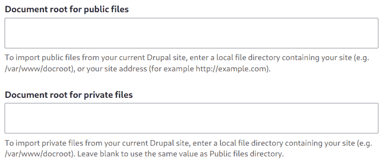

# 第十四章：将外部数据迁移到 Drupal 中

无论您已经开发了一段时间还是刚开始您的职业生涯，您都会遇到一个非常常见的情况，那就是需要从外部来源引入数据。这可能包括从旧版本的 Drupal 迁移，从非 Drupal 网站迁移，不同的数据库引擎，静态 HTML 文件，或者从 CSV 或 HTTP API 中整合 JSON 或 XML 数据。

无论哪种场景，Drupal 都包含几个强大的工具，通过核心 Migrate 模块解决这些需求。在底层，它还包含一个强大的插件系统，允许您扩展和定义自己的数据源或处理插件，以及一个健康的贡献模块生态系统，以增强 Drupal 中的迁移体验。

在本章中，我们将探讨 Drupal 10 中的 Migrate 模块，您将学习如何实现以下内容：

+   从旧版本的 Drupal 迁移

+   从逗号分隔值（CSV）文件迁移数据

+   从远程 HTTP API 迁移数据

+   编写自定义迁移源插件

+   为迁移编写自定义处理插件

# 技术要求

您可以在 GitHub 上找到本章中使用的完整代码：[`github.com/PacktPublishing/Drupal-10-Development-Cookbook/tree/main/chp14`](https://github.com/PacktPublishing/Drupal-10-Development-Cookbook/tree/main/chp14)

# 从旧版本的 Drupal 迁移

Drupal 随带了一些核心模块，可以帮助您将网站从 Drupal 6 或 7 更新到 Drupal 10。在版本 8 之前的 Drupal 旧版本之间的架构在设计上有着根本的不同，您不能像从 8 或 9 版本那样升级。

为了减轻从 Drupal 6 或 7 升级的挑战，Migrate Drupal 模块帮助为您的旧 Drupal 数据库准备一个新的迁移环境，并包含在 Drupal 10 的核心版本中。

自定义模块、自定义主题和自定义 Drush 命令

关于从版本 8 之前的 Drupal 版本升级的一个重要注意事项是，您将需要**手动**移植您可能创建的自定义模块、自定义主题和自定义 Drush 命令。没有工具可以自动化此过程，并且它们**不会工作**，直到您将它们移植以与 Drupal 10 兼容。这必须在升级之前完成，否则在尝试迁移或审查您的进度时可能会遇到多个错误。

## 准备工作

在您从旧版本的 Drupal 执行任何迁移之前，准备以下内容是很重要的：

+   运行 Drupal 10 的工作环境

+   用于升级的 Drupal 6/7 数据库副本

+   您要迁移的网站上使用的模块和主题清单

+   一个数据库服务器，其中既有 Drupal 10 数据库，也有旧 Drupal 6/7 数据库

+   连接到您服务器上的 Drupal 6/7 数据库所需的数据库凭据

+   从旧网站复制所有公共和私有文件到新网站可访问的位置

+   在您的 Drupal 10 网站中启用 Migrate Drupal 和 Migrate Drupal UI 模块

+   对当前 Drupal 10 安装的 *数据库备份*

我们将在下一节中逐步介绍这些步骤。

在迁移完成之前，你可能需要迭代这个过程，尤其是对于老旧、复杂的网站。因此，在继续之前，请确保您备份了 Drupal 10 网站的 *数据库备份*。这样，如果在迁移过程中出现问题，您可以恢复数据库，进行更改，并再次尝试。这比完全重新安装 Drupal 10 来重新开始迁移要快得多。始终保持一个干净的数据库备份可用。让我们开始吧！

## 如何操作……

在您的 Drupal 10 网站安装并准备就绪后，您需要采取的第一步是审查您在 Drupal 6/7 网站上使用的模块。您应该登录到您要迁移的网站，并转到管理后台的模块列表部分。如果您更喜欢使用 Drush 命令行工具，您也可以获取此列表。

记录下在旧 Drupal 网站中使用中的贡献模块和主题列表。您将不得不针对每个模块评估以下问题：

+   我是否还需要在 Drupal 10 上使用此模块？

+   贡献模块是否已迁移到核心？

+   贡献模块是否有 Drupal 10 版本可用？如果没有，我是否还需要它？是否有具有类似功能的替代模块？

+   此模块是否提供升级路径和迁移集成，以将数据从之前的 Drupal 版本迁移过来？

在从版本 8 之前的 Drupal 版本升级时，需要保持这样的清单

在回答列表中的每个问题的时候，您可以通过 Composer 选择所需的模块来更新您的 Drupal 10 网站。想法是首先通过使之前 Drupal 网站中使用的模块和主题可用，来准备好 Drupal 10 环境。

一些模块，如 views，已被移入 Drupal 核心，并且没有贡献版本可用。其他模块，如 Pathauto，为 Drupal 提供了更新的版本，并且还包括迁移插件。这些迁移插件在迁移您的旧网站时由 Migrate Drupal 模块自动使用。

不幸的是，并非所有模块都有与 Drupal 10 兼容的版本。这可能发生在它们被竞争性模块（例如，Field Collections 与 Paragraphs）取代，或者维护者决定不将模块迁移到 Drupal 7 以外。如果您发现您的 Drupal 6/7 网站中有一个您绝对需要在 Drupal 10 网站上使用的模块，在这种情况下您的选择有限。您可以执行以下操作：

+   检查模块问题队列，以查看是否已经对较新版本进行了工作

+   您自己和您的开发团队检查该模块，以评估迁移的难度

+   查看是否存在与 Drupal 10 类似的替代模块，并做出您需要的配置更改（可能还可以提供迁移路径）

+   使用像 Drupal Module Upgrader（[`www.drupal.org/project/drupalmoduleupgrader`](https://www.drupal.org/project/drupalmoduleupgrader)）这样的工具来帮助您了解如何移植模块

+   咨询官方 Drupal Slack 频道、Drupal Stack Exchange 网站，或开发机构以帮助您将功能移植到 Drupal 10，如果您或您的团队无法完成此操作

是否选择移植模块？

如果您最终将模块移植到 Drupal 10，请确保将工作贡献回社区在 [Drupal.org](https://Drupal.org)。这不仅是一个很好的学习经验，了解如何开发模块和学习 Drupal 10 的新 API，而且将知识传递下去也有助于其他可能遇到困难的人。您可以申请成为模块的维护者，确保错误修复和功能增强被发布。

现在您已经通过了模块列表，请使用 Composer 将您需要的模块添加到您的 Drupal 10 网站中：

```php
composer require drupal/(module_name):^VERSION
```

一旦您拥有了所有必需的模块和主题，请确保启用它们。不必担心配置所有新增的模块；迁移过程会为您处理这些。如果它们未被启用，迁移过程将无法看到或使用它们可能拥有的任何迁移插件，并且您可能无法迁移所有数据。

如果这些模块包含 Drupal 6/7 的迁移插件，它们将在运行迁移到您的 Drupal 10 网站时自动合并。

### 运行 Drupal 迁移

现在我们已经准备好了环境，并且拥有了所有需要的模块，让我们开始迁移过程。

导航到 `/upgrade`。您将看到以下屏幕：


图 14.1 – 升级屏幕提供了一个从旧版本升级的向导

Migrate Drupal UI 模块提供了这个界面，帮助您在管理部分内执行迁移。再次审查准备步骤，然后点击**继续**。

在下一屏幕上，我们需要设置要迁移的 Drupal 版本，以及连接到旧数据库所需的数据库凭据。如果您不确定数据库主机或凭据应该输入什么，请检查平台文档了解如何连接到第二个数据库（Lando、DDEV、Docksal 等）。


图 14.2 – 迁移向导将提示输入先前版本 Drupal 的数据库凭据

哪里可以找到 Drupal 8 或 9 的选项？

如果您是从 Drupal 8 或 9 更新，您不需要利用 Migrate Drupal 或此界面。相反，您应该继续使用 Drupal 的常规更新过程，从 Drupal 8 或 9 升级到 Drupal 10。如果您正在从 Drupal 8 或 9 站点迁移部分数据并在 Drupal 10 中重新开始，您将需要编写自己的迁移脚本。请参阅本章后面的部分以获取示例。

### 设置公共/私有文件源

在上一屏幕的底部，您可以设置上传到旧站点的任何公共和私有文件的源。



图 14.3 – 您可以指定上传的文件在旧站点上的位置，以便迁移可以找到它们

您可以选择设置文件的本地路径或添加到公共网站的 URL。

迁移将从旧路径源文件，因此如果您的文件之前上传到 `sites/default/files`，您需要在该位置提供它们。对于公共文件的值，您然后输入 `/var/www/web`，这是您网站 web 根目录的位置。

文档根目录

注意，在某些情况下，webroot 可以命名为 `docroot` 而不是 `web`。这取决于您的 Lando、DDEV、Docksal 等设置，以及/或如果您使用 Acquia、Pantheon 或 **Platform.sh** 等托管主机提供商，可能会有所不同。如果您不确定，请检查适用于您情况的文档。

您也可以对私有文件做同样处理。

如果您选择使用网址，这也会起作用。然而，运行从互联网拉取文件的迁移可能会导致迁移所需的时间比您预期的要长得多。此外，您可能会因为多个文件请求而使您的实时网站离线。虽然您可以选择这条路线，但对于较大的迁移来说，通常不建议这样做。

当您已添加所有适用的设置后，点击 **审查升级**。此屏幕将显示将要升级的项目列表，这是执行迁移前的最后一步。

### 运行迁移

在这个阶段，系统正在从旧版本的 Drupal 迁移到 Drupal 10。批处理过程将一直运行，直到完成（或遇到错误）。根据您旧站点的规模和构建，这可能需要一段时间。您可以离开电脑休息一下；只需确保浏览器窗口保持打开即可。

如果迁移出现错误，则过程将不会完成。虽然不幸，但这可能会发生，具体取决于您之前站点的复杂程度。在这种情况下，您应该检查站点日志以查看错误是什么。这些问题可以解决，然后可以再次执行迁移。您可能需要调整一些迁移设置，可能需要为模块（以支持迁移）提供补丁，或者可能是其他类型的错误。

记得我们为准备 Drupal 10 站点所做的数据库备份吗？在处理了你在站点日志中找到的问题之后，继续恢复数据库。你应该能够回到第一个升级界面并重新开始迁移，这比从头开始设置 Drupal 10 要快。

如果一切顺利，迁移将完成，你将成功将你的旧 Drupal 站点迁移到 Drupal 10！

### 迁移完成！

当它完成时，环顾一下你的管理界面。你应该会看到熟悉的项目，例如内容类型、分类法、媒体类型、用户角色、上传的文件、重定向以及其他来自你之前站点的项目，以及所有你的内容和用户账户都已恢复。

请注意，某些项目，如视图配置，无法自动迁移。这是由于视图本身的复杂性质。幸运的是，在管理界面中构建视图非常容易，一旦你验证迁移成功，你总是可以处理这个问题。

## 它是如何工作的……

Drupal 核心包含数十个插件和迁移路径，用于从旧版本的 Drupal 6 或 7 安装迁移。这些帮助解释了新版本的 Drupal 如何访问、转换并在迁移过程中将数据保存到新系统中。

例如，核心的过滤器模块在 Drupal 的几个版本中都存在。然而，它的模式、配置和数据结构在多年中发生了变化。它并不与 Drupal 10 一一对应。如果你查看`core/modules/filter`模块目录，你会注意到一个名为`migrations`的目录。这里有一些文件帮助 Drupal 理解如何将旧过滤器从 Drupal 6 和 7 映射到你的新 Drupal 10 安装中。你可以在`d7_filter_format.yml`中看到这个示例：

```php
id: d7_filter_format
label: Filter format configuration
migration_tags:
  - Drupal 7
  - Configuration
source:
  plugin: d7_filter_format
process:
  format: format
  status: status
  name: name
  cache: cache
  weight: weight
  filters:
    plugin: sub_process
    source: filters
    key: '@id'
    process:
      id:
        plugin: filter_id
        bypass: true
        source: name
        map:
          editor_caption: filter_caption
          editor_align: filter_align
      settings:
        plugin: filter_settings
        source: settings
      status:
        plugin: default_value
        default_value: true
      weight: weight
destination:
  plugin: entity:filter_format
```

在深入细节之前，这个定义有助于迁移过程理解如何转换和移动即将进入 Drupal 10 的过滤器和过滤设置。这些文件在使用迁移 Drupal 模块时自动加载和使用，你可以在 Drupal 核心中看到它们的几个示例。

贡献模块也可以提供这些功能。这就是我们能够从旧版本的 Drupal 迁移而不丢失数据的原因。大多数流行的贡献模块都能顺利迁移且没有问题，但有些模块不包括文件。你可以检查问题队列以获取帮助，但也可以在自定义模块中编写自己的代码。

在后面的章节中，我们将探讨自定义迁移源和迁移过程插件。

# 从 CSV 文件迁移数据

有时，你需要将数据迁移到 Drupal 中，这些数据以各种格式存在。其中一种流行的格式是**CSV**，或称为**逗号分隔值**。CSV 文件可以从各种数据库客户端和电子表格软件中导出，是迁移的优秀数据源候选者。

## 准备工作

从这里，我们需要添加两个模块来从 CSV 文件进行迁移。使用 Composer，下载以下模块：

+   迁移增强 ([`www.drupal.org/project/migrate_plus`](https://www.drupal.org/project/migrate_plus))

+   迁移工具 ([`www.drupal.org/project/migrate_tools`](https://www.drupal.org/project/migrate_tools))

+   迁移源 CSV ([`www.drupal.org/project/migrate_source_csv`](https://www.drupal.org/project/migrate_source_csv))

你还需要创建一个自定义模块，我们将在这里放置迁移定义、源插件和过程插件类。到这一点，你应该熟悉创建自定义模块。如果需要刷新，请参考前面的章节。

## 如何做到这一点...

当你必须执行无法使用 Migrate Drupal 的 Drupal 迁移时，你必须在一个自定义模块中编写自己的迁移 YAML 配置文件。这是因为 Migrate Drupal 模块专门用于从旧版本 Drupal 迁移，将那个旧版本 Drupal 视为*源*。

在这个例子中，CSV 文件将是迁移的*源*。每次迁移都由三个主要部分组成：

+   **源**：这是为迁移提供数据的提供者。

+   **目标**：这是每个记录将被迁移到并存储的地方——通常是一个实体（节点、用户、媒体、分类法等）。

+   **过程**：此管道定义了源数据如何转换和保存为迁移项。在这里，你可以定义`目标`上的各种字段和属性，并使用多个`过程`插件来使`源`数据适合你想要的字段（或 Drupal 可能要求的方式）。

在我们继续之前，让我们看看一个从 CSV 文件迁移的迁移定义的快速示例：

```php
id: redirects
migration_tags: {}
migration_dependencies: {}
migration_group: default 
label: Old website redirects.
source:
  plugin: csv
  path: data/redirects.csv
  ids: [id]
  constants:
    uid: 1
    status: 301
destination:
  plugin: 'entity:redirect'
process:
  redirect_source: old_path
  redirect_redirect: new_path
  uid: constants/uid
  status_code: constants/status
```

假设我们需要使用 CSV 文件将旧网站的 URL 迁移到 Drupal，并使用重定向贡献模块([`www.drupal.org/project/redirect`](https://www.drupal.org/project/redirect))将它们存储为重定向。通过这样做，我们可以确保旧网站上存在的 URL 可以成功重定向到 Drupal 中的新 URL，这样我们就不会失去访客。

为了做到这一点，我们在自定义模块的`config/install`目录中定义了一个名为`migrate_plus.migration.redirects.yml`的迁移定义文件。这是为需要 Migrate Plus 贡献模块来执行迁移（如 Migrate Source CSV）的迁移。

在这里，你可以清楚地看到`源`、`目标`和`过程`部分。

`源`部分告诉迁移我们将使用 CSV 插件（由 Migrate Source CSV 模块提供），CSV 文件的路径，ID 键（Migrate 将使用它来跟踪唯一行值），以及在过程管道中使用的某些常量值。

`目标`部分告诉迁移我们想要使用`entity:redirect`插件来保存数据。此插件确保迁移的值被保存为重定向实体。

`process`部分将实体上的字段和属性映射到迁移源中的数据值。在这种情况下，`redirect_source`、`redirect_redirect`、`uid`和`status_code`被映射到 CSV 文件中的`old_url`和`new_url`，而`uid`和`status_code`使用常量值（在先前的源部分定义）。

模块下的`/data/redirects.csv` CSV 文件包含迁移的所有数据。文件包含以下内容：

| **ID** | **old_path** | **new_path** |
| --- | --- | --- |
| 1 | `/``foo` | `/``node/1` |
| 2 | `/``foo/bar` | `/``node/2` |
| 3 | `/``foo/bar/baz` | `/``node/3` |

表 14.1 – `/data/redirects.csv`下的 CSV 文件

CSV 文件包含了几百条与前面类似的记录。

别名怎么办？

当将重定向的 URL 迁移到 Drupal 时，目的地（在这种情况下，`new_path`）需要是 Drupal 实体路径（例如`/node/1`）。Drupal 将正确保存重定向。如果您已安装 Pathauto 自动别名模式，它们将在迁移保存每行数据时生成。安装了重定向贡献模块后，将自动创建一个 301 重定向并将其与我们要重定向到的节点相关联。

当我们启用我们的自定义模块时，迁移将出现在**结构** | **迁移**下的管理部分迁移列表中。您定义的任何迁移都将出现在此部分。您可以从此界面运行迁移，或者您可以使用 Drush 从命令行运行，这是由于**Migrate Tools**贡献模块的恩赐。


图 14.4 – Migrations 屏幕列出了 Drupal 中所有注册的迁移以及您可以执行的任务

然后，我们可以执行迁移：


图 14.5 – 在管理界面中运行的迁移，显示进度条

我们可以看到，现在在 Drupal 中显示的重定向是从 CSV 文件迁移过来的：


图 14.6 – 迁移创建了从我们的 CSV 文件中预期的所有 URL 重定向

### 从 CSV 迁移到节点

假设我们还有一个包含我们想要迁移到 Drupal 节点类型中的数据的 CSV 文件。迁移定义可能看起来会怎样？实际上并没有太大的不同！

```php
id: chapter14csvnodes
label: Old website articles.
source:
  plugin: csv
  path: /data/articles.csv
  ids: [id]
  constants:
    uid: 1
destination:
  plugin: 'entity:node'
  default_bundle: article
process:
  title: old_title
  body/value: old_body
  body/format:
    plugin: default_value
    default_value: full_html
  uid: constants/uid
  field_one: old_field_one
  field_two: old_field_two
  created:
    plugin: format_date
    from_format: 'Y-m-d\TH:i:sP'
    to_format: 'U'
    source: created_date
```

再次使用 CSV 源插件，我们进行了一些修改，现在我们定义了另一个可以使用的迁移。在`destination`部分，我们将`entity:redirect`替换为`entity:node`，并提供了我们想要保存迁移数据的节点类型（`bundle`）。

在`过程`部分，我们添加了从文章节点类型中映射迁移数据所需的具体节点属性和字段。这里也有关于如何处理数据的配置附加到过程插件的示例。

你将在迁移文件中看到如下映射：

```php
field_one: old_field_one
```

这是对 Migrate 模块提供的`get`插件的简写。`get`插件直接使用源提供的值存储在 Drupal 中。使用`get`插件的长写方式如下：

```php
field_one:
  plugin: get
  source: old_field_one
```

创建的属性展示了另一个过程插件`format_date`。`format_date`过程插件允许你在保存到 Drupal 之前对日期进行格式化。在上面的示例中，它将日期时间值转换为时间戳，这是 Drupal 在节点上存储创建和更改日期的方式。

它是如何工作的...

*Migrate Source CSV*模块提供了一个 CSV 源插件，它会为你解析和读取提供的 CSV 文件，解析出标题和记录。这使得创建迁移定义并快速将记录映射到 Drupal 中的目的地成为可能。

有数十个类似这些的迁移过程插件，你可以在迁移中使用它们来简化过程。有关你可以使用的插件的完整列表，请查阅在线文档：

+   迁移过程插件([`www.drupal.org/docs/8/api/migrate-api/migrate-process-plugins/list-of-core-migrate-process-plugins`](https://www.drupal.org/docs/8/api/migrate-api/migrate-process-plugins/list-of-core-migrate-process-plugins))

+   Migrate Plus 过程插件([`www.drupal.org/docs/8/api/migrate-api/migrate-process-plugins/list-of-core-migrate-process-plugins`](https://www.drupal.org/docs/8/api/migrate-api/migrate-process-plugins/list-of-core-migrate-process-plugins))

有其他贡献的模块添加了更多的过程插件，但在这两者之间，核心的 Migrate 和贡献的 Migrate Plus 模块几乎涵盖了你需要做的所有迁移。当没有过程插件满足在迁移过程中转换数据的需求时，你可以自己创建。请参阅本章后面的创建过程插件部分。

# 从 HTTP API 迁移数据

CSV 文件和 SQL 数据库并不是迁移中唯一可以使用的数据源。**Migrate Plus**贡献模块附带了一个 URL 源插件。通过使用 URL 插件作为迁移源，迁移可以获取并解析以下格式的数据：

+   JSON

+   XML

+   SOAP

这意味着你可以从任何互联网 API 迁移数据，这使得 Migrate Plus 在需要通过线迁移数据时成为一个不可或缺的工具。

让我们看看如何使用它从 HTTP API 迁移数据。

## 如何做...

到目前为止，我们已经在本章中给出了两个迁移定义的示例。尽管我们是从不同类型的源迁移，但迁移定义本身的格式不会改变太多。我们仍然有我们的 `source`、`destination` 和 `process` 部分。

假设我们想要从返回 JSON 响应的公共 API 中抓取数据并将其保存为 Drupal 中的节点。本例中的 JSON 响应看起来像这样：

```php
{
   "data":[
      {
         "id": 1,
         "title": "Item One",
         "body": "Lorem ipsum dolor sit amet",
         "archived": false
      },
      {
         "id": 2,
         "title": "Item Two",
         "body": "Lorem ipsum dolor sit amet",
         "archived": true
      },
      {
         "id": 3,
         "title": "Item Three",
         "body": "Lorem ipsum dolor sit amet",
         "archived": false
      }
   ]
}
```

我们需要消费该响应并为 `data` 下的每个项目插入节点。我们的迁移定义看起来如下：

```php
id: chapter14httpjson
label: Migrates external API data.
migration_tags: {}
migration_dependencies: {}
source:
  plugin: url
  urls:
    - 'http://example.com/api/v1/content'
  data_fetcher_plugin: http
  data_parser_plugin: json
  item_selector: data
  fields:
    -
      name: id
      label: 'ID'
      selector: id
    -
      name:  title
      label: 'Title'
      selector: title
    -
      name: body
      label: 'Body content'
      selector: body
    -
      name: archived
      label: 'Archived status'
      selector: archived
  ids:
    id:
      type: integer
destination:
  plugin: entity:node
  default_bundle: article
process:
  title: title
  body/value: body
  body/format:
    plugin: default_value
    default_value: basic_html
  status: archived
  uid:
    plugin: default_value
    default_value: 1
```

目标和过程部分与本章开头其他迁移相同。到现在为止，你应该看到一种模式——迁移定义总是看起来很相似，无论源或目标如何。每个源插件都有不同的配置值。让我们分析一下 `Url` 插件正在做什么。

## 它是如何工作的...

`Url` 插件有一些可设置的配置属性。其中最重要的有 `urls`、`data_fetcher_plugin` 和 `data_parser_plugin`。在使用 `Url` 插件时，这些属性必须始终设置。

`urls` 属性接受一个或多个用于迁移的 URL。每个 URL 将逐个迁移其内容。如果你有一个多个位置且需要将数据迁移到同一位置的场景（假设响应格式相同），这很有用。

`data_fetcher_plugin` 和 `data_parser_plugin` 属性是 Migrate Plus 模块的独特属性。Migrate Plus 引入了 `DataFetcher` 和 `DataParser` 插件类型以及它们的插件管理器。它还包括 `File` 和 `Http` 数据获取插件，以及 `Json`、`Xml` 和 `Soap` 数据解析插件。

当迁移执行时，配置被读取。这加载了 `Url` 插件，其中包含以下内容：

```php
  /**
   * Returns the initialized data parser plugin.
   *
   * @return \Drupal\migrate_plus\DataParserPluginInterface
   *   The data parser plugin.
   */
  public function getDataParserPlugin() {
    if (!isset($this->dataParserPlugin)) {
      $this->dataParserPlugin = \Drupal::service
        ('plugin.manager.migrate_plus.data_parser')->
          createInstance($this->configuration[
            'data_parser_plugin'], $this->configuration);
    }
    return $this->dataParserPlugin;
  }
  /**
   * Creates and returns a filtered Iterator over the
       documents.
   *
   * @return \Iterator
   *   An iterator over the documents providing source rows
           that match the
   *   configured item_selector.
   */
  protected function initializeIterator() {
    return $this->getDataParserPlugin();
  }
```

任何迁移源插件都必须提供 `initializeIterator` 方法。这告诉迁移如何解析数据，并将其传递给 `Json` 插件。然后 `Json` 插件从迁移定义中获取 `data_fetcher_plugin` 值，我们将其设置为 `http`。`Xml` 和 `Soap` 数据解析器有类似的实现。当你结合这些时，这就是迁移知道如何通过互联网调用以获取数据以及如何解析这些数据以准备迁移的方式。

一旦数据被检索和解析，它需要知道如何 *访问* 响应中的项目。有时，你会得到 API 响应，其中你想要的结果是深度嵌套的。

我们源定义中的 `item_selector` 属性通知解析器如何读取和从响应中提取项目。由于示例 JSON 结构简单，我们只需为项目选择器提供 `data`。如果我们想要的项目以某种方式嵌套，我们会输入结果的路径，例如 `foo/bar/data`。

在 `source` 部分下的字段描述了我们要映射的字段，以及我们希望在过程部分如何引用这些字段。对于 CSV 迁移来说这不是必要的，因为标题记录会自动成为在过程管道映射中使用的参考字段。在这种情况下，我们需要映射它们：

```php
      Name:  title
      label: 'Title'
      selector: title
```

`name` 属性是我们希望在过程部分中如何引用这个属性的。`label` 属性是它的名称（在 Drupal 迁移源区域中可见），而 `selector` 属性是我们 JSON 结果中的实际名称。你可以将 `name` 和 `label` 设置为你想要的任何内容，但 `selector` 必须与 API 返回的响应字段匹配。

再次，我们可以导航到 Drupal 管理中的 **结构** | **迁移** 来查看这个新的迁移并执行它。

## 还有更多…

关于使用 `Url` 插件的一个最后的注意事项。之前，我们提到 Migrate Plus 包含两个数据提取插件。我们介绍了 `Http`；另一个是 `File`。如果你想从磁盘上的 JSON 或 XML 文件中迁移数据，你可以这样做。如果你将 `data_fetcher_plugin` 从 `http` 更改为 `file`，`Url` 插件将找到它并将其用作迁移源。

# 编写自定义迁移源插件

到目前为止，你已经看到了 Drupal 使用可用的源插件进行数据迁移的几种强大方式。当没有插件满足你的需求时会发生什么？当然，你可以编写一个迁移源插件！

考虑以下场景。你需要从 MySQL 数据库迁移数据到 Drupal 的节点中。虽然 Drupal 的迁移系统可以理解如何连接到数据库，但它并不理解如何查询你试图获取的数据。在这些情况下，你可以编写一个源插件。

## 如何操作...

假设数据库中有一个名为 `articles` 的表，我们在迁移中需要从中提取数据，它有 `id`、`title`、`body`、`is_published` 和 `published_on` 等字段。在我们能够编写源插件之前，我们首先需要建立连接以访问这个数据库。

在你的 `settings.php` 文件中，添加以下 MySQL 数据库连接：

```php
$databases['migrate']['default'] = array (
  'database' => 'DATABASE_NAME',
  'username' => 'DATABASE_USERNAME',
  'password' => 'DATABASE_PASSWORD',
  'prefix' => '',
  'host' => 'DATABASE_HOSTNAME',
  'port' => '',
  'namespace' => 'Drupal\\Core\\Database\\Driver\\mysql',
  'driver' => 'mysql',
);
```

注意 `$databases` 数组中的 `migrate` 键名。这个条目将用于我们的源插件以建立连接。这个键可以是任何你想要的名字，除了 `default`，这是 Drupal 用于其默认数据库连接的名称。如果你选择使用除 `migrate` 之外的其他键名，请确保记住它，因为它将在你的迁移定义中被引用。

在你的自定义模块中，回到 `src/Plugin/migrate/source` 目录，创建一个新的目录。然后，在这个目录中创建一个名为 `ArticlesSource.php` 的文件。这将是我们为迁移提供数据检索功能的源插件。

我们需要满足我们的源插件三个方法——一个 `query` 方法，一个 `fields` 方法和一个 `id` 方法。对于你创建的每个 SQL 源插件，这三个方法是必需的：

+   `query` 方法将包含我们实际用于检索数据的 SQL 查询

+   `fields` 方法将返回一个数组，包含源上的可用字段，以它们的机器名称和描述为键

+   `id` 方法定义了用于唯一标识源行的源字段

在我们的新文件 `ArticlesSource.php` 中，我们可以开始定义我们的源插件：

```php
<?php
namespace Drupal\chapter14\Plugin\migrate\source;
use Drupal\migrate\Plugin\migrate\source\SqlBase;
/**
 * Get the article records from the legacy database.
 *
 * @MigrateSource(
 *   id = "legacy_articles",
 *   source_module = "chapter14",
 * )
 */
class ArticlesSource extends SqlBase {
```

我们的插件类扩展了 `SqlBase`，这是一个核心迁移插件，用于处理数据库源连接。在我们提供上述三个方法之后，它将完成大部分繁重的工作。

我们的插件类也具有 `@MigrateSource` 注解。这是**必需的**。如果没有这个注解，Drupal 将不会发现这个类作为可用的源插件，迁移将无法执行任何操作。

注解的 `id` 属性定义了插件 ID。`source_module` 属性标识了提供源插件将从中读取数据的系统。对于贡献的源，这几乎总是它们定义的模块。

接下来，我们提供 `query` 方法。如果你以前在 Drupal 中使用过数据库 API，这将很熟悉。它使用相同的 API。它看起来像任何其他 Drupal SQL 查询；唯一的区别是它将在另一个数据库中执行——即我们在之前的 `settings.php` 文件中定义的那个。

填充这部分很简单：

```php
  /**
   * {@inheritdoc}
   */
  public function query() {
    $query = $this->select('articles', 'art');
    $query->fields('art', [
        'id',
        'title',
        'body',
        'is_published',
        'published_on',
      ]);
    $query->orderBy('art.id');
    $query->orderBy('art.published_on');
    return $query;
  }
```

## 它是如何工作的…

Drupal 的数据库 API 比较容易使用。这里的 `query` 方法选择所有文章及其字段，按它们的 ID 和发布日期排序。这个查询的结果将在这个部分的后面为我们的迁移提供动力。

对于 `fields` 方法，我们需要列出我们在迁移中使用的字段：

```php
  /**
   * {@inheritdoc}
   */
  public function fields() {
    return [
      'id' => $this->->t('The article id.'),
      'title' => $this->->t('The article title.'),
      'body' => $this->->t('The article body content.'),
      'is_published' => $this->->t('The published state.'),
      'published_on' => $this->->t('The published date.'),
    ];
  }
```

最后，对于 `id` 方法，我们需要指定哪个字段是迁移的唯一标识符：

```php
  /**
   * {@inheritdoc}
   */
  public function getIds() {
    return [
      'id' => [
        'type' => 'integer',
        'alias' => 'art',
      ],
    ];
  }
```

在这种情况下，它只是 `id`，来自旧数据库文章表的唯一字段。

### 在迁移中使用自定义源插件

在我们的源插件就绪后，我们现在可以专注于迁移本身。

就像我们的其他示例一样，我们需要定义一个迁移定义 YAML 文件：

```php
id: articles
label: Migrates articles from the legacy database.
Migration_tags: {}
migration_dependencies: {}
source:
  plugin: legacy_articles
  key: migrate
destination:
  plugin: entity:node
  default_bundle: article
process:
  title: title
  body/value: body
  body/format:
    plugin: default_value
    default_value: basic_html
  status: is_published
  created: published_on
  uid:
    plugin: default_value
    default_value: 1
```

Drupal 中迁移的最好部分之一是 API 定义得很好，所以无论你如何获取或处理数据，定义总是遵循相同的模式。

在这个迁移中，我们指定了我们的新源插件 `legacy_articles`，这是我们在 `ArticlesSource` 类中提供的插件 ID。源部分中的 `key` 属性与我们在 `settings.php` 中添加的数据库键同名。由于我们扩展了 `SqlBase`，键属性用于在执行查询时建立数据库连接。如果你好奇，可以查看 `SqlBase` 的 `getDatabase` 方法，看看它是如何使用 `key` 属性的。

由于我们在源插件的`fields`方法中定义了我们的字段，我们可以在迁移定义中完全跳过字段部分，并按提供的方式使用它们。在这种情况下，迁移已经知道字段是什么。对于`ids`属性也是如此；源插件已经定义了它，所以我们不需要像本章中的其他迁移那样在这里列出它。

从这里开始，迁移的其余部分看起来与本章中其他示例中的相同。`destination`部分通知迁移创建`article`节点，而`process`部分定义了如何将我们的源字段映射到节点字段。

再次提醒，你可以在管理界面中的**结构** | **迁移**下查看此迁移并运行它。你可以自由地创建一个与 Drupal 数据库并行的数据库来实验源插件——一旦你知道如何操作，你就能将任何内容拉入 Drupal，并成为一名真正的迁移大师。

# 为迁移编写自定义流程插件

到目前为止，我们已经涵盖了从 CSV、JSON 和数据库源迁移数据的情况，但如果是这些源中的数据并不完全符合在 Drupal 中存储的方式，该怎么办呢？

迁移可能是一件棘手的事情。虽然 Drupal 提供了多个途径来获取迁移所需的数据源，但仍然会有许多情况需要你操纵这些传入的数据，以便将其处理到满意的状态，无论是为了存储还是清理目的。幸运的是，创建流程插件非常简单，你很快就能在迁移中操纵数据。

## 如何做到这一点...

让我们看看编写流程插件的示例。使用之前的示例，一个从数据库表获取数据的自定义源插件，假设我们现在需要为迁移拉取一个额外的字段`no_index`。虽然查询数据很容易，但数据本身不适合存储在元标签字段中（[`www.drupal.org/project/metatag`](https://www.drupal.org/project/metatag)），因为其值要么是 0 要么是 1。当值为 1（`true`）时，作者表示他们不希望搜索引擎抓取此页面。在之前的系统中，此值的出现会在页面头部添加额外的元标签。

贡献的 Metatag 模块能够复制这种功能。然而，元标签字段以序列化的方式在数据库中存储这些数据。我们不能直接使用源数据中的值，但我们可以添加一个流程插件来*转换*数据为我们所需的形式。

假设你在 Drupal 中为文章内容类型添加了一个 Metatag 字段，你可以通过以下步骤进行数据迁移。

首先，让我们更新我们的源插件以考虑一个新字段：

```php
    $query->fields('art', [
        'id',
        'title',
        'body',
        'is_published',
        'published_on',
        'no_index',
      ]);
```

然后，我们将它添加到我们的`fields`列表中：

```php
  public function fields() {
    return [
      'id' => $this→t('The article id.'),
      'title' => $this→t('The article title.'),
      'body' => $this→t('The article body content.'),
      'is_published' => $this→t('The published state.'),
      'published_on' => $this→t('The published date.'),
      'no_index' => $this→t('Indicates this article should
          not be crawled.'),
    ];
  }
```

现在它已经被添加到源插件中，迁移正在接收每条记录的值。

在我们的迁移定义中，让我们映射元标签字段，并设置好编写自定义流程插件：

```php
  field_metatags:
    - plugin: set_no_index
      _source: no_index
```

在这里，我们将 `no_index` 字段的值通过管道传递到一个 ID 为 `set_no_index` 的插件。现在，我们可以在迁移过程中开始操作数据，以确保它能够正确存储。

在自定义模块中，我们在 `src/Plugin/migrate/process` 目录下创建一个目录。在这个目录中，我们将创建一个名为 `SetNoIndex.php` 的文件。这是我们新的自定义处理插件。

自定义处理插件至少需要实现 `transform` 方法。该方法负责处理并返回管道中此步骤的数据。

过程插件代码看起来如下：

```php
<?php
namespace Drupal\chapter14\Plugin\migrate\process;
use Drupal\migrate\ProcessPluginBase;
use Drupal\migrate\MigrateExecutableInterface;
use Drupal\migrate\Row;
/**
 * @MigrateProcessPlugin(
 *   id = "set_no_index",
 * )
 */
class SetNoIndex extends ProcessPluginBase {
  /**
   * {@inheritdoc}
   */
  public function transform($value, MigrateExecutableInter
      face $migrate_executable, Row $row, $destination
          _property) {
    return (bool) $value ? ['robots' => 'noindex, nofollow,
        noarchive, nosnippet'] : [];
  }
}
```

与自定义源插件一样，注意类顶部的注释。这是必需的，以便插件能够被 Drupal 发现。`id` 值与我们在迁移定义中使用的是相同的。

## 它是如何工作的……

当迁移运行时，如果传入的值是 1，我们将返回一个值数组。这正是我们所需要的！然而，在成功保存到 Drupal 之前，我们还需要做一件事。

记得我们之前提到数据是以序列化数组的形式存储的吗？仅从我们的自定义处理插件传递一个普通的 PHP 数组是不够的。在迁移中，你可以在字段映射中使用多个处理插件。它们按照列表中的顺序运行，这提供了一种可组合的方式来转换源数据。

幸运的是，核心 Migrate 模块提供了一个将帮助我们处理的过程插件，即 `callback` 过程插件。`callback` 过程插件使用来自先前过程插件（我们 `set_no_index` 的结果）的值调用 PHP 函数，并返回回调提供的值。

在管道中将这两个结合起来看起来如下：

```php
  field_metatags:
    - plugin: set_no_index
      _source: no_index
    - plugin: callback
      _callable: serialize
```

更新迁移定义后，我们需要将这些更改引入 Drupal。这可以通过 Drush 完成：

```php
php vendor/bin/drush config-import --partial --source=/var/www/
html/web/modules/custom/chapter14/config/install -y
```

此命令将重新导入 `chapter14` 模块 `config/install` 目录中的配置文件。这是一个很好的方法，可以在你逐步处理迁移定义的同时持续引入定义的更改。

迁移定义是配置

迁移 YAML 文件配置方式与任何其他 Drupal 配置文件相同。当你对迁移 YAML 文件进行更新并使用上述命令导入更改时，确保在准备部署或提交工作到仓库时执行 `config-export`。

当我们运行迁移时，我们将在元标签字段中有新的数据。在这个例子中，你可以通过两种方式验证它是否工作：

+   首先，你可以在管理界面中查看你网站上迁移的内容，编辑一个迁移节点，并看到元标签字段在节点表单上有正确的数据：


图 14.7 – 节点表单上的元标签字段

+   其次，你可以在数据库中检查元标签字段，看看原始数据是否在那里：


图 14.8 – 数据库中的元标签表反映了我们要迁移的值

如果你还记得上一章的内容，我们讨论了使用单元测试来*知道*我们编写的代码实际上是否工作的重要性。处理插件编写测试相对简单。我们可能正在从迁移中查看 Drupal 中的数据，但让我们 100%确信我们的处理插件正在做正确的事情。

我们为`set_no_index`插件编写的单元测试看起来像这样：

```php
<?php
namespace Drupal\Tests\chapter14\Unit\Plugin\migrate\
    process;
use Drupal\chapter14\Plugin\migrate\process\SetNoIndex;
use Drupal\Tests\migrate\Unit\process\
    MigrateProcessTestCase;
/**
 * Tests the set_no_index process plugin.
 */
class SetNoIndexTest extends MigrateProcessTestCase {
  /**
   * {@inheritdoc}
   */
  protected function setUp(): void {
    $this->plugin = new SetNoIndex([], 'set_no_index', []);
    parent::setUp();
  }
  /**
   * Data provider for testPluginValue().
   *
   * @return array
   *   An array containing input values and expected output
         values.
   */
  public function valueProvider() {
    return [
      [1, ['robots' => 'noindex, nofollow, noarchive,
        nosnippet']],
      [0, []],
      [NULL, []],
    ];
  }
  /**
   * Test set_no_index plugin.
   *
   * @param $input
   *   The input values.
   *
   * @param $expected
   *   The expected output.
   *
   * @dataProvider valueProvider
   */
  public function testPluginValue($input, $expected) {
    $output = $this->plugin->transform($input, $this->
        migrateExecutable, $this->row,
            'destinationproperty');
    $this->assertSame($output, $expected);
  }
}
```

`valueProvider`方法为我们的测试方法提供值，以及当评估时我们期望`set_no_index`插件返回的结果。现在我们确信我们的迁移将始终提供正确的数据，并且没有迁移的文章会被搜索引擎错误地抓取。有关 Drupal 中的单元测试的更多信息，请务必参考*第十三章*，*使用 Drupal*运行和编写测试。

## 参见

在本章中，我们展示了 Drupal 的 Migrate 和 Migrate Plus 模块的强大功能和灵活性。掌握这两个模块将使你能够从几乎任何来源迁移数据并相应地处理它。我们还展示了如何编写自定义源和自定义处理插件来实现这一目标。

请务必检查[Drupal.org](http://Drupal.org)上 Migrate 的模块贡献生态系统。这里有几个模块提供了无数的数据源和处理插件，覆盖了各种数据源，例如 CSV、JSON、XML、XLS、HTML 和 HTTP API。
