# 第一章. 设置 Drupal 开发环境

*在本章中，我们将设置 Drupal 框架的开发环境。我们还将从开发者的角度安装和探索 Drupal 8，并了解虚拟开发环境*。

在本章中，我们将介绍：

+   为本地开发安装 Drupal

+   为 Drupal 开发设置 PHPStorm IDE

+   在 Drupal 8 中使用 Drush 7 进行安装、配置和使用

+   安装 Drupal 8

+   GitHub 用于 Drupal 开发

+   使用 PuPHPet 安装 Vagrant

# 为本地开发安装 Drupal

您可以使用不同的 Web 服务器和数据库来安装 Drupal。最常用的组合是 Apache、MySQL 和 PHP，通常被称为*AMP 栈*。

针对 Drupal，你可以通过两种主要方式来完成这项工作：

+   Acquia Dev Desktop（仅适用于 Mac 和 Windows）

+   AMP：Apache MySQL PHP 的手动安装

这两种方法有以下最低系统要求：

+   **磁盘空间**: 最小安装需要 15 兆字节。安装包含许多贡献模块和主题的网站需要 60 MB。

+   **Web 服务器**: Apache、Nginx、Microsoft IIS 或任何具有适当 PHP 支持的其它 Web 服务器。

+   **数据库**:

    +   MySQL 5.5.3/MariaDB 5.5.20/Percona Server 5.5.8 或更高版本，需支持 PDO 和 InnoDB 兼容的主存储引擎

    +   PostgreSQL 9.1.2 或更高版本，需支持 PDO

    +   SQLite 3.6.8 或更高版本

# 使用 Acquia Dev Desktop 安装 Drupal 的行动时间

如果你使用 Mac 或 Windows，Acquia Dev Desktop 是开发 Drupal 最简单的方法：

1.  访问[`www.acquia.com/downloads`](https://www.acquia.com/downloads)并下载所需的安装程序。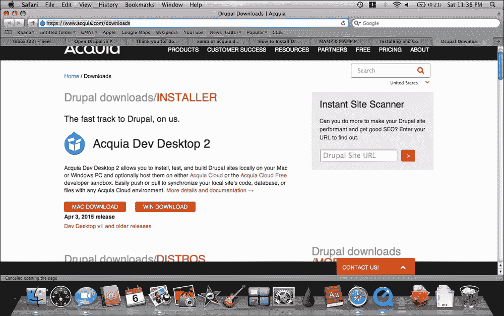

1.  打开`Acquia Dev Desktop`文件并开始安装过程。如果你是 Windows 用户，找到你保存 Acquia Dev Desktop 下载的文件夹，双击`.exe`安装文件。

1.  如果你使用 Mac，找到你保存 Acquia Dev Desktop 下载的文件夹。将文件移动到`Application`文件夹，双击`.dmg`安装文件。会出现一个新文件夹，上面有一个写着**Acquia Dev Desktop Stack Installer**的图标。点击它。允许安装程序在您的 Mac 或 PC 上运行。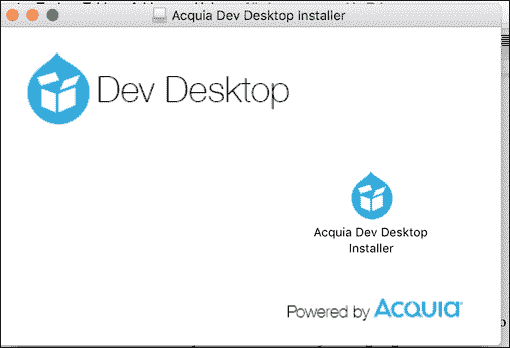

1.  读取并同意条款和条件后，让安装程序运行并点击每个步骤的**下一步**。接下来，你可以选择安装应用程序堆栈（Apache、MySQL 和 PHP）的位置以及安装你的第一个 Drupal 网站的位置。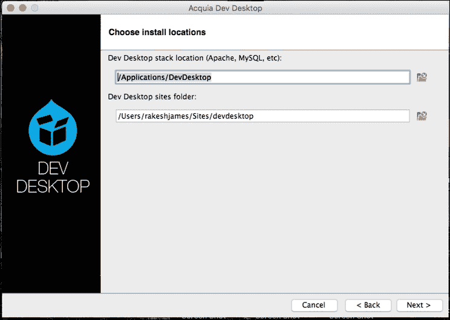

1.  在此安装过程中，我们不会直接使用我们的 Drupal 站点，但在其他章节中，如果你决定使用 Dev Desktop 进行开发工作，你也可以从硬盘上的其他位置导入站点。保持默认设置并点击**下一步**。在下一页，你必须选择 Apache 和 MySQL 的端口号。在大多数情况下，它将无需任何冲突即可工作，但如果你正在使用多个 AMP 堆栈，你可以继续并做出更改。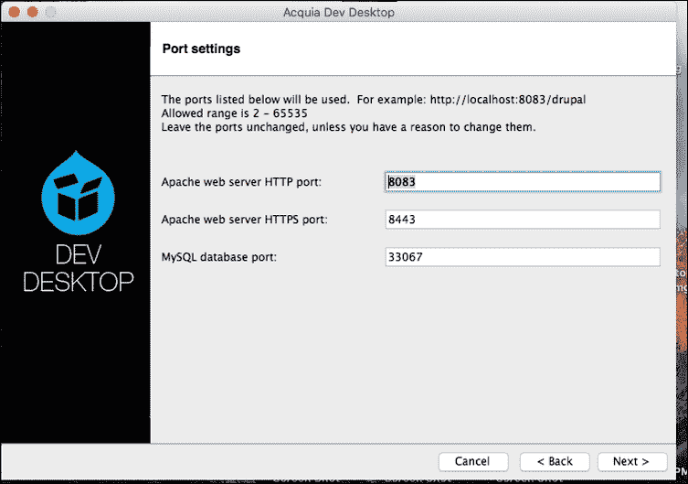

1.  在下一屏，我们设置我们第一个 Drupal 站点的默认值。填写完毕后，点击**下一步**。确保你记下用户名和密码。你需要这些信息来登录你的 Drupal 站点。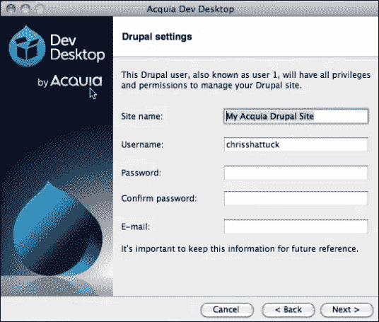

    为第一个 Drupal 站点创建凭证

1.  点击**下一步**开始安装过程。一旦安装完成，点击**完成**，这将打开**Acquia Dev Desktop 控制面板**。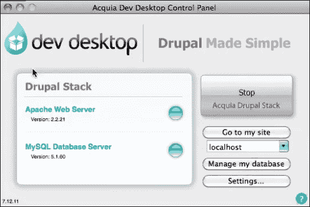

    Acquia Dev Desktop 控制面板

1.  点击**访问我的站点**来访问你的新站点。使用**管理我的数据库**浏览到**PHPMyAdmin**。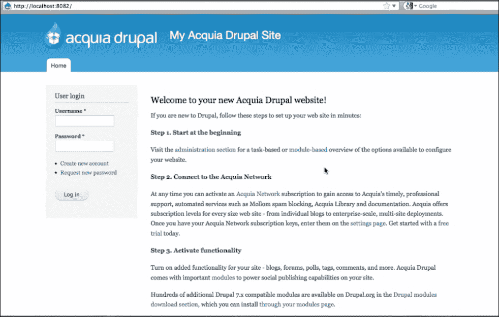

    设置站点的登录页面

## *发生了什么？*

你已经使用 Acquia Dev Desktop 安装了 Drupal。从这里，你可以开始在你的新 Drupal 站点上工作。

注意，该站点正在使用 Acquia Drupal 运行，这略有不同，因为你将从中下载[`www.drupal.org/`](https://www.drupal.org/)。在 Windows 上安装 Acquia Dev Desktop 几乎相似。

## 本地主机方式安装 Drupal

现在我们将介绍 Mac OS X 和 Windows 操作系统的 AMP 包的安装步骤。

# 操作时间 – 安装 Mac OS X AMP 堆栈

对于 Mac OS X，我们将使用 MAMP 包来安装 AMP 堆栈。

1.  首先，从[`www.mamp.info/en`](https://www.mamp.info/en)下载最新的 MAMP 版本。一旦 MAMP 下载完成，双击下载的`.pkg`文件。将文件移动到应用程序文件夹，并双击 MAMP 的`.pkg`文件。这将启动 MAMP 安装程序。系统安装程序将引导你完成安装过程。

1.  完成安装过程后，启动你的本地服务器。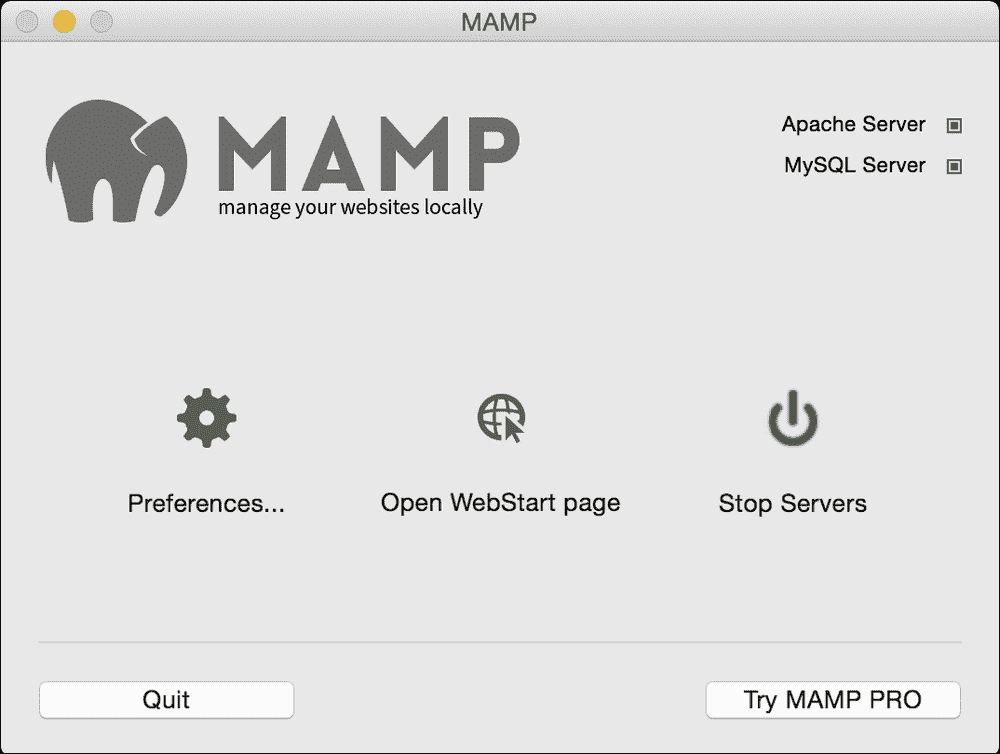

1.  启动 MAMP 并点击**启动服务器**按钮。你将在右上角看到服务器状态。点击**打开 WebStart 页面**按钮。你将看到默认的 MAMP 起始页面，其中包含访问如 phpMyAdmin、phpInfo、SQLite Manager、phpLiteAdmin、FAQ、MyFavoriteLink 和 MAMP 网站的链接。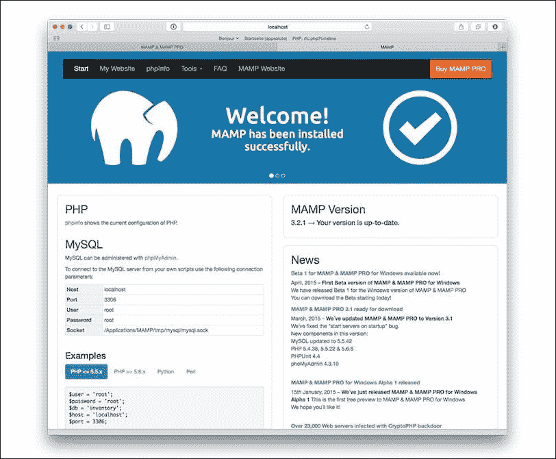

    默认的 MAMP 起始页面

1.  安装成功后，你可以启动你的本地服务器。启动 MAMP 并点击 **启动服务器** 按钮。在右上角的状态显示中，会显示服务器的启动状态。如果需要，你将需要输入你的管理员密码。

    ### 小贴士

    在 Mac OS X 上设置开发环境的过程与为 Linux 发行版设置开发环境非常相似。它们都是基于 Unix 的操作系统。如果你还没有绑定到特定的 Linux 发行版，并想在 Linux 上设置开发环境，那么我强烈推荐 Ubuntu。有关设置 Drupal 开发环境的优秀指南可在 [`help.ubuntu.com/community/Drupal`](https://help.ubuntu.com/community/Drupal) 找到。

## *发生了什么？*

恭喜！你现在已经在你的 Mac 上安装了一个可工作的 AMP 栈。

# 行动时间 – 安装 Windows AMP 栈

对于 Windows，我们将使用 XAMP：

### 小贴士

我的大部分 Drupal 开发都是在 Mac OS 或 Ubuntu 上进行的。基于 Unix 的操作系统更适合 Drupal 开发，因为 Drupal 有许多以 Unix 为中心的开发方面。从 cron 到基于 .`htaccess` 的干净 URL，[`drupal.org/`](http://drupal.org/) 上的大量文档都会偏向于 Unix 操作系统。

1.  从 [`www.apachefriends.org/download.html`](https://www.apachefriends.org/download.html) 下载 XAMPP 的最新版本。下载完成后，双击 `.exe` 文件来安装程序。接受默认设置并完成安装过程。你可以在任何时候通过编辑配置文件来更改设置。

1.  完成安装过程后，启动 XAMPP 控制面板。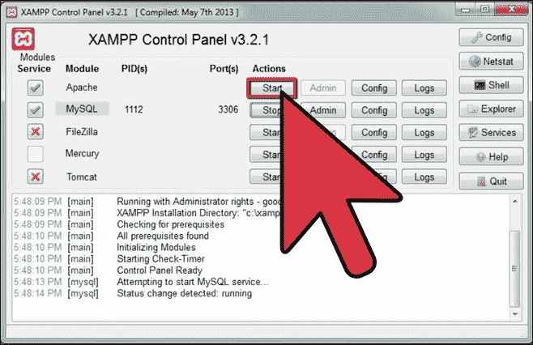

    XAMPP 控制面板

1.  在 XAMPP 控制面板应用程序中，点击 Apache 和 MySQL 旁边的 **启动** 按钮。现在打开您喜欢的网页浏览器，导航到 `http://localhost`，你应该会看到以下截图类似的内容：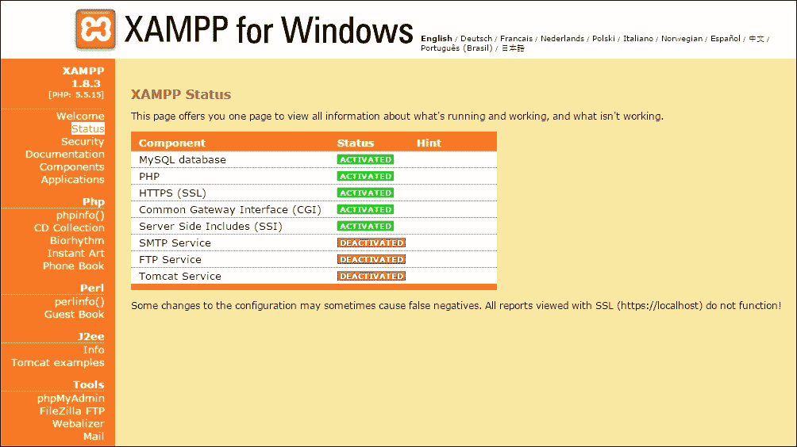

1.  XAMPP 不适用于生产使用，仅适用于开发环境。在发布任何内容到线上之前，请确保 XAMPP 的安全性。你应该访问 URL `http://localhost/security/`。使用安全控制台，你可以为 MySQL 用户 `root` 和 `phpMyAdmin` 设置密码。

## *发生了什么？*

恭喜！你现在已经在你的 Windows PC 上安装了一个可工作的 AMP 栈。而且你也在你的 Mac 上安装了一个可工作的 AMP 栈！

## PHP 配置

Drupal 8 推荐使用 PHP 版本 5.4 或更高版本，并带有 CURL 扩展。MAMP 的最新版本包含 PHP 版本 5.5（它还包含一个较旧的 PHP 版本，并允许你在它们之间切换）。Windows 版本的 XAMPP 最新版本包含 PHP 版本 5.。尽管这个版本的 PHP 满足 Drupal 7 的要求，但在我们安装 Drupal 之前，需要调整一些与 PHP 相关的设置，以确保一切运行顺畅。PHP 的要求列表来自 Drupal 8，网址为 `https://www.drupal.org/requirements/php`。

# 行动时间 - 修改 php.ini 设置

要修改 Mac OS X 和 Windows 中的 `php.ini` 设置：

+   **Mac OS X**：使用你喜欢的文本编辑器打开位于 `/Applications/MAMP/bin/php/php5.4.6/conf` 的 `php.ini` 文件。

+   **Windows**：使用你喜欢的文本编辑器打开位于 `C:\xampp\php` 的 `php.ini` 文件。我喜欢 Notepad++。

在 Mac OS X 和 Windows 中导航到相应的文件夹位置，并编辑设置以匹配以下值：

```php
max_execution_time = 60;
max_input_time = 120;
memory_limit = 128M;
error_reporting = E_ALL & ~E_NOTICE
```

## *发生了什么？*

恭喜！你已在 Mac OS X 和 Windows 系统中成功修改了 `php.ini` 文件。

## 修改 MySQL my.cnf 设置

要修改 Mac OS X 和 Windows 中的 MySQL `my.cnf` 设置：

+   **Mac OS X**：MAMP 默认不使用 `my.cnf` 文件。因此，你必须将位于 `/Applications/MAMP/Library/support-files/my-medium.cnf` 的文件复制到 `/Applications/MAMP/conf/my.cnf`（注意文件的新名称）。

+   **Windows**：对于 XAMPP，打开位于 `C:\xampp\mysql\bin` 的 `my.ini` 文件。

    ### 小贴士

    在开始编辑此文件之前，你可能想要备份一份。

# 行动时间 - 为 Drupal 设置 MySQL

在你的文本编辑器中打开 `my.cnf`/`my.ini` 文件，找到并编辑以下设置以匹配这些值：

```php
# * Fine Tuning
#
key_buffer = 16M
key_buffer_size = 32M
max_allowed_packet = 16M
thread_stack = 512K
thread_cache_size = 8
max_connections = 300
```

Drupal MySQL 配置的一个真正目标是 `max_allowed_packet` 设置。这过去一直是我和其他许多我知道的 Drupal 开发者遇到令人困惑的错误的原因，并且这个设置在 [`drupal.org/requirements#database`](http://drupal.org/requirements#database) 页面的数据库服务器部分被特别提及。

当你准备好将你的网站上线时，在 [`drupal.org/node/2601`](http://drupal.org/node/2601) 可以找到一些优秀的性能调整技巧。

## *发生了什么？*

恭喜！你已在 Mac OS X 和 Windows 系统中成功更新了 MySQL 设置。

# 行动时间 - 创建一个空 MySQL 数据库

在我们安装 Drupal 之前，我们需要创建一个新的空 MySQL 数据库。

MAMP 和 XAMPP 都包含 phpMyAdmin - 一个基于 Web 的 MySQL 管理工具。我们将使用 phpMyAdmin 为 Drupal 创建一个空数据库。

+   **Mac OS X**：当 MAMP 运行时，打开你喜欢的网页浏览器并转到 `http://localhost:8888/phpMyAdmin`。

+   **Windows**：当 XAMPP 运行时，打开你喜欢的网页浏览器并转到 `http://localhost/phpmyadmin/`。

你将看到以下屏幕：


## *刚才发生了什么？*

您已安装了一个专门为 Drupal 配置的完全功能的 AMP 堆栈，并且您已经创建了一个空的 MySQL 数据库作为安装 Drupal 的初步步骤。

# 安装 Git

Git 是一款免费的源代码控制和版本管理软件，在过去的几年中变得非常流行。2011 年 2 月，Drupal（[`www.drupal.org/`](https://www.drupal.org/)）从过时的 CVS 版本控制系统迁移到 Git。迁移到 Git 为 Drupal 开发者与 Drupal（[`www.drupal.org/`](https://www.drupal.org/)）的交互开辟了全新的方式，我们将在整本书中强调这种增强的交互。然而，我们也将立即开始使用 Git 来简化 Drupal 开发环境的设置。所以，如果您电脑上还没有安装 Git，让我们来设置它。

# 执行动作 – 安装 Mac OS X 版本的 Git

要为 Mac 安装 Drush，我们将使用 Homebrew（一个 Mac OS X 的开源软件包管理器），安装说明可在[`brew.sh/`](http://brew.sh/)找到。

一旦安装了 Homebrew，安装 Git 就像打开终端应用程序（在`/Applications/Utilities`中）并输入以下命令一样简单：

```php
brew install git

```

# 执行动作 – 安装 Windows 版本的 Git

从[`git-scm.com/downloads`](http://git-scm.com/downloads)下载 Windows 的安装程序。双击`.exe`文件来安装程序。

1.  点击下载的文件链接以开始安装过程。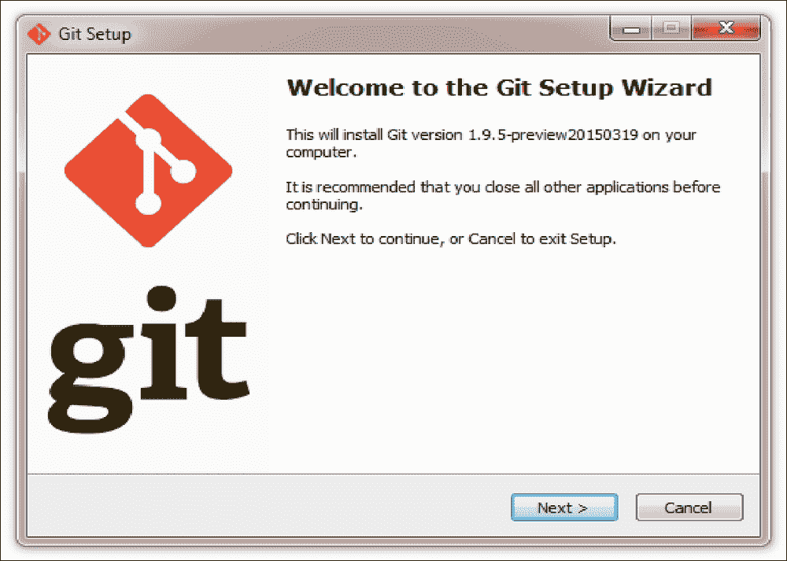

    Git 设置向导

1.  点击**下一步**，然后在**GNU 通用公共许可证**屏幕上再次点击**下一步**。

1.  在**选择目标位置**屏幕上，点击**下一步**以接受默认的目标位置。

1.  在**选择组件**屏幕上，再次接受默认设置并点击**下一步**。

1.  在**调整您的 PATH 环境**屏幕上，选择**从 Windows 命令提示符使用 Git 和可选的 Unix 工具**，因为这将允许 Git 与 Drush 一起工作，我们将在下一章中介绍。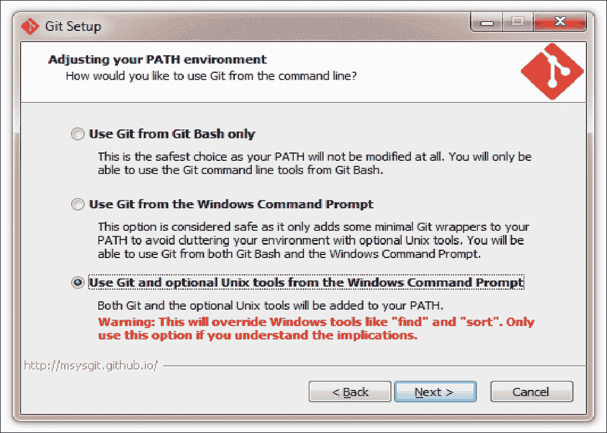

    从命令行选择如何使用 Git

## *刚才发生了什么？*

您已安装了 Git 版本控制系统——这是一个将极大地简化与 Drupal（[`www.drupal.org/`](https://www.drupal.org/)）现有贡献代码交互的工具。

# 安装 Drush

Drush 是由 Drupal 和 shell 两个词组合而成的，是一个命令行工具，它可以从您喜欢的 shell（Mac OS X 和 Ubuntu 上的终端应用程序，以及 Windows 上的命令提示符应用程序）中方便地管理 Drupal 环境。例如，在 Drupal 上安装一个贡献模块（[`www.drupal.org/`](https://www.drupal.org/））可以通过在命令行运行以下命令变得非常简单：

```php
drush dl modulename
drush en modulename -y

```

# 安装 Drush for Mac OS X 的行动时间

要在 Mac 上安装 Drush，我们将再次使用 Homebrew，详情请见 [https://www.drupal.org/node/954766](https://www.drupal.org/node/954766)。

在终端中输入以下命令：

```php
brew install drush

```

# 安装 Drush for Windows 的行动时间

要在 Windows 上安装 Drush，我们需要使用提供类似 Linux 环境的 Cygwin。

我们现在将使用 Composer 在 Cygwin 中安装 Drush：

1.  下载并安装 Cygwin

1.  在包部分安装以下包：

    +   `ncurses`：这是一个用于显示基于文本的用户界面的库。

    +   `git`：这是一个版本控制包

    +   `bsdtar`：这是用于解压缩 tar 文件的工具。

    +   `curl`：这是一个客户端 URL 传输包。

1.  现在安装 Composer，这是一个 PHP 依赖项包管理工具，使用 Composer 安装程序。

1.  从 Cygwin 终端，输入以下命令来安装 Drush 8：

    ```php
     composer global require drush/drush:8.*

    ```

### 注意

在 [`www.cygwin.com/`](http://www.cygwin.com/) 了解更多关于 Cygwin 项目的信息。有关安装 Drush 的更多信息，请查看在 Windows 上安装 Drush 的简单方法：https://[www.drupal.org/node/594744](http://www.drupal.org/node/594744)

# 安装 Drupal 8

好的，现在我们正在取得进展。现在我们已经创建了数据库，安装了 Git，并安装了 Drush，我们已经为安装 Drupal 8 准备好了一切。

# 安装 Drupal 8 的行动时间

我们将使用 Drush 和 Git 的组合来安装 Drupal：

1.  **Mac OS X**: 打开终端应用程序，并输入以下命令：

    ```php
    cd /Applications/MAMP/htdocs

    ```

    **Windows**: 打开命令提示符并输入以下命令：

    ```php
    cd C:\xampp\htdocs

    ```

1.  现在，我们将使用 Git 将 Drupal 核心 Git 仓库本地克隆到新的 `d8dev` 文件夹中（这需要几分钟，具体取决于您的网络带宽）：

    ```php
    $ git clone --branch 8.1.x http://git.drupal.org/project/drupal.git d8dev
    Cloning into 'd8dev'...
    remote: Counting objects: 456756, done.
    remote: Compressing objects: 100% (95412/95412), done.
    remote: Total 456756 (delta 325729), reused 445242 (delta 316775)
    Receiving objects: 100% (456756/456756), 100.04 MiB | 8.60 MiB/s, done.
    Resolving deltas: 100% (325729/325729), done.
    cd d8dev

    ```

1.  接下来，我们想使用 Git 切换到最新的 Drupal 8 版本。首先，我们将列出所有可用的版本：

    ```php
    8.0-alpha1
    8.0-alpha10
    8.0-alpha11
    8.0-alpha12
    8.0-alpha13
    8.0-alpha2
    8.0-alpha3
    8.0-alpha4
    8.0-alpha5
    8.0-alpha6
    8.0-alpha7
    8.0-alpha8
    8.0-alpha9
    8.0.0
    8.0.0-alpha14
    8.0.0-alpha15
    8.0.0-beta1
    8.0.0-beta10
    8.0.0-beta11
    8.0.0-beta12
    8.0.0-beta13
    8.0.0-beta14
    8.0.0-beta15
    8.0.0-beta16
    8.0.0-beta2
    8.0.0-beta3
    8.0.0-beta4
    8.0.0-beta5
    8.0.0-beta6
    8.0.0-beta7
    8.0.0-beta8
    8.0.0-beta9
    8.0.0-rc1
    8.0.0-rc2
    8.0.0-rc3
    8.0.0-rc4
    8.0.1
    8.0.2
    8.0.3
    8.0.4
    8.0.5
    8.0.6
    8.1.0
    8.1.0-beta1
    8.1.0-beta2
    8.1.0-rc1
    8.1.1
    8.1.2
    8.1.3

    ```

1.  您将看到最新版本是 `8.1.3`，但您应该用您最新的版本替换它，并在以下 Git 命令中使用它：

    ```php
    git checkout 8.1.3
    Note: checking out '8.1.3'.
    You are in the detached HEAD state. You can look around, make experimental changes, and commit them, and you can discard any commits you make in this state without impacting any branches by performing another checkout.
    If you want to create a new branch to retain commits you create, you may do so (now or later) by using -b with the checkout command again. Example:
    git checkout -b new_branch_name
    HEAD is now at 079a52b. Revert Issue #2457653 by Gábor Hojtsy: System.site langcode is both used as a file language code and a site language code.

    ```

    ### 提示

    通过使用 Git，我们将我们的 Drupal 下载链接到 Drupal 的 Git 仓库，以便于我们本地核心 Drupal 安装。这将简化未来 Drupal 核心更新的更新过程。

    Drupal 8 使用 Symfony 组件，这些组件通过供应商目录进行管理，并需要使用 Composer 在 Drupal 仓库中下载。对于通过 Git 克隆的 Drupal 仓库，您需要运行 composer install，这将下载供应商目录。

    接下来，我们将通过基于网页的安装过程来设置 Drupal：

    +   **Mac OS X**: 在您的网页浏览器中打开 `http://localhost:8888/d8dev/`

    +   **Windows**: 在您的网页浏览器中打开 `http://localhost/d8dev/`

1.  您应该看到以下屏幕：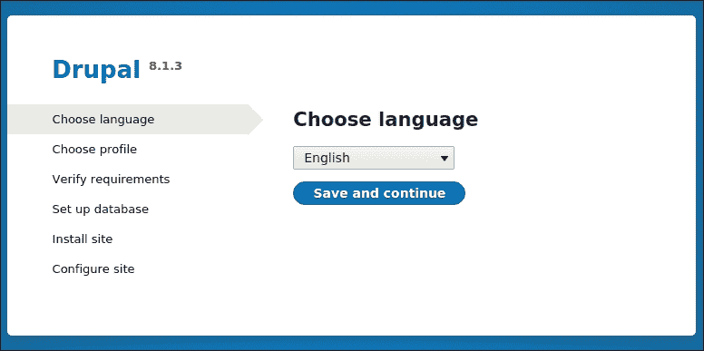

    选择您的语言并点击 **保存并继续**。

1.  选择**标准**配置文件，然后点击**保存并继续**。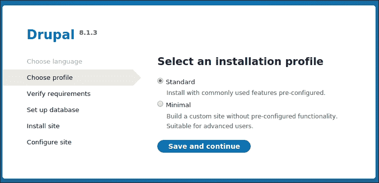

1.  在**数据库配置**屏幕上，选择**MySQL**。将数据库名称输入为`d7dev`，将数据库用户名和密码输入为`root`。点击**保存并继续**。您将看到网站安装屏幕。

    对于本地开发网站，使用根 MySQL 用户相当方便。然而，对于实时/生产网站，您应该始终为您的 Drupal 数据库创建一个唯一的 MySQL 用户和密码。

1.  在**配置网站**屏幕上，输入以下值（电子邮件地址不必是真实的，但必须看起来有效）：

    +   **网站名称**：`d8dev`

    +   **网站电子邮件地址**：一个有效的电子邮件地址

    +   **用户名**：`admin`

    +   **密码**和**确认密码**：`admin`（这只是一个开发环境，所以让它简单一些）

    +   **电子邮件地址**：与**网站电子邮件地址**相同

    填写表单的其余部分并点击**保存并继续**。您的 Drupal 网站安装已完成。因此，点击**访问您的网站**链接查看网站。

    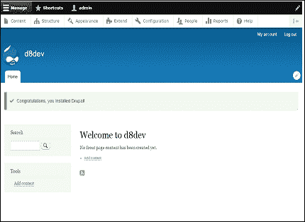

## *发生了什么？*

您使用 Git 将全新的 Drupal 8 网站搭建并运行起来。在接下来的章节中，您将看到 Git 以及 Drush 对于日常 Drupal 开发是多么有用。

# 安装 PHPStorm IDE

PHPStorm 已经成为开发 Drupal 模块和主题时最友好的 IDE 之一，详情请见[`confluence.jetbrains.com/display/PhpStorm/Drupal+Development+using+PhpStorm`](https://confluence.jetbrains.com/display/PhpStorm/Drupal+Development+using+PhpStorm)。

# 行动时间 - 安装 PHPStorm IDE

前往 [`www.jetbrains.com/phpstorm/download/`](https://www.jetbrains.com/phpstorm/download/)，下载适用于您操作系统的 PHPStorm IDE 正确版本的免费 30 天试用版。下载完成后，双击（Windows 和 Mac）文件，并按照页面上的说明按照文档安装 PHPStorm。

### 小贴士

您绝对不必觉得您必须使用 PHPStorm。市面上有许多其他优秀的 IDE，您可能已经在使用不同的 IDE，或者可能只是喜欢使用您最喜欢的文本编辑器。然而，本书将使用 PHPStorm，如果您也在使用 PHPStorm，可能会更容易跟随。

PHPStorm 默认激活了 Drupal 开发插件。否则，您可以在设置对话框中启用它。

# 行动时间 - 创建新的 PHPStorm 项目

当您第一次打开 PHPStorm 时，您应该看到以下屏幕：

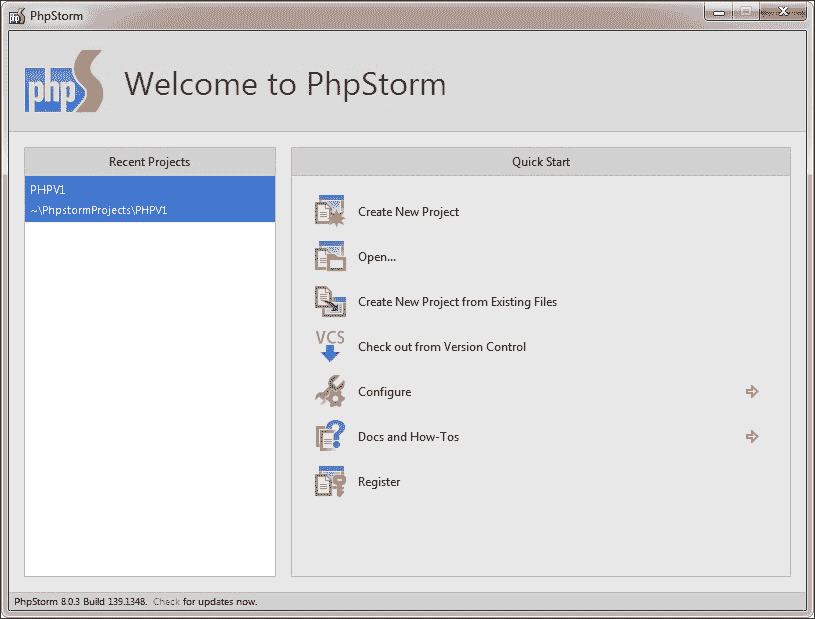

1.  点击**创建新项目**按钮，选择**PHP 项目**，然后点击**下一步**。此时，您将看到**新 PHP 项目**窗口：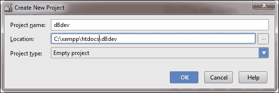

1.  浏览到您的新 Drupal 8 项目。对于 Windows，它是`C:\xampp\htdocs\d7dev`，对于 Mac OS X，它是`/Applications/MAMP/htdocs/d7dev`。在您选择了新 Drupal 7 安装的位置后，点击**完成**。

# Drupalize PHPStorm IDE

一旦在 PHPStorm 中为现有项目或新 Drupal 模块设置了一个项目，IDE 就会检查开发环境是否已配置为 Drupal。它将通过弹出窗口和事件日志中的事件建议您启用 Drupal 支持。


点击**启用 Drupal 支持**链接将打开配置对话框。您可以更改 Drupal 项目安装路径，并选择版本号**8**用于 Drupal 8。

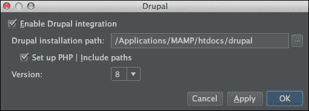

您还可以通过打开**首选项**对话框来稍后更改 Drupal 集成设置。

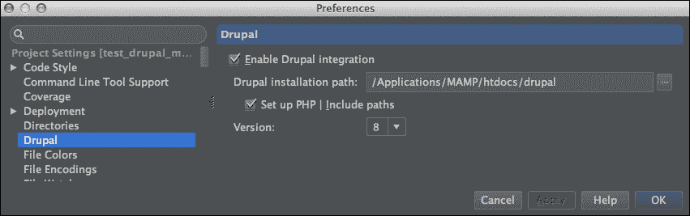

要获取关于 Drupal 与最新版 PHPStorm 集成的最新信息，请访问[`confluence.jetbrains.com/display/PhpStorm/Drupal+Development+using+PhpStorm`](https://confluence.jetbrains.com/display/PhpStorm/Drupal+Development+using+PhpStorm)。

# 从开发者的角度看 Drupal

如果您是 Drupal 开发的初学者，您首先应该理解的是，成为一名优秀的 Drupal 开发者意味着成为 Drupal 社区的一部分。Drupal 开发是一个非常开放源代码的过程，因此它是一个社区驱动的过程。

Drupal 拥有众多资源来帮助所有经验水平的开发者。然而，在您能够利用所有这些资源之前，您需要成为 Drupal（[`www.drupal.org/`](https://www.drupal.org/)）的会员。所以，如果您还没有加入 Drupal，现在是时候在[`drupal.org/user/register`](http://drupal.org/user/register)注册了。一旦您成为会员并登录到 Drupal（[`www.drupal.org/`](https://www.drupal.org/)），您将看到以下屏幕：

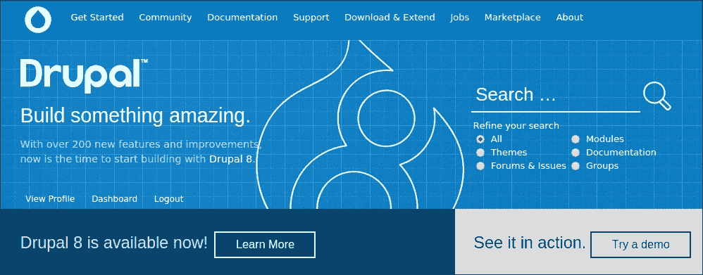

随着我们继续进行 Drupal 8 开发，我们将多次回到您的 Drupal（[`www.drupal.org/`](https://www.drupal.org/)）仪表板，以跟踪我们使用的贡献模块的问题。我们还将利用 Drupal 在迁移到 Git 时添加的新沙盒开发功能。

# 安装 Vagrant

作为开发者，很多时候我们需要设置一个与生产 Web 服务器类似的本地 AMP 堆栈版本。Vagrant 允许开发者一次性构建虚拟化环境，并可以持续共享。

Vagrant 是用 Ruby 编写的，所以如果你不熟悉 Ruby，编写 Vagrant 文件可能会很有挑战性。这就是 PuPHPet 发挥作用的地方。使用 PuPHPet，我们可以生成包来创建一个虚拟机，就像我们在 PuPHPet 网站上指定的那样。我们只需配置它即可。

# 行动时间 - 安装 Vagrant

要安装 Vagrant，从 [`www.virtualbox.org/wiki/Downloads`](https://www.virtualbox.org/wiki/Downloads) 下载适用于您的系统适当的 Vagrant 包和 VirtualBox：

1.  **创建位置**：选择您希望保存虚拟机的地方。此位置与您保存虚拟机配置和文件的地方无关。创建一个文件夹，您决定在哪里存储您的虚拟机。例如，在 Windows 中，我们可以使用 `C:/drupalvm`。

1.  **安装 VirtualBox**：从 [`www.virtualbox.org/wiki/Downloads`](https://www.virtualbox.org/wiki/Downloads) 下载并安装适用于您的操作系统包的最新版本的 VirtualBox。

1.  **安装 Vagrant**：安装 Vagrant 很简单。只需从 [`www.vagrantup.com/downloads.html`](https://www.vagrantup.com/downloads.html) 下载您操作系统特定的包。遵循操作系统特定的正常安装过程。

1.  **在 PuPHPet 中创建您的虚拟机**：到目前为止，我们已经安装了 Vagrant 和 VirtualBox。现在让我们在 PuPHPet 中创建我们的虚拟机配置。打开 URL [`puphpet.com/`](https://puphpet.com/)。在这里，我们将从我们的虚拟机中选择所需的内容。

1.  **虚拟机设置**：在第一页，点击 **立即开始**。这将引导您到以下页面。在这里，我选择了 **Ubuntu Trusty 14.04 LTS x64** 作为发行版。您可以根据您的服务器选择选择您的发行版和其他配置。如果您不了解它们，可以保留其他设置为默认值。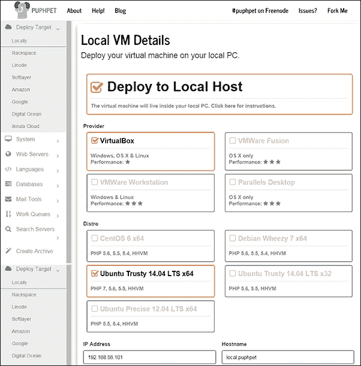

    选择适合您的机器的发行版

一旦您选择了您喜欢的软件包，请点击 **系统软件包** 按钮。

在接下来的四个步骤中，您只需保持设置不变，然后点击右侧的按钮继续前进。

您应该会得到 **Nginx** 选项。现在我不想用 Nginx 作为 Web 服务器。相反，我选择了 Apache。

只需浏览到页面顶部并取消选择 **安装 Nginx**。这将折叠 Nginx 配置表单，并将按钮带到 Apache 配置页面。

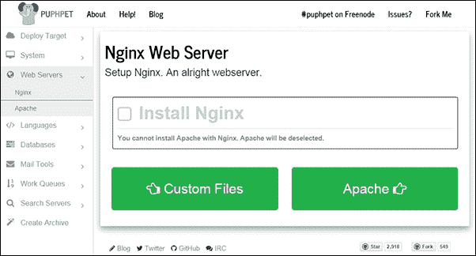

选择您偏好的 Web 服务器

您可以选择您的 Web 服务器配置，然后点击下一步以选择 PHP 配置。在这里，我选择了 **安装 Xdebug**，这是一个用于调试器的良好工具，以及 PHP 的性能分析工具。

之后，我只是点击了其他语言配置而没有做任何更改，然后继续到 MySQL。

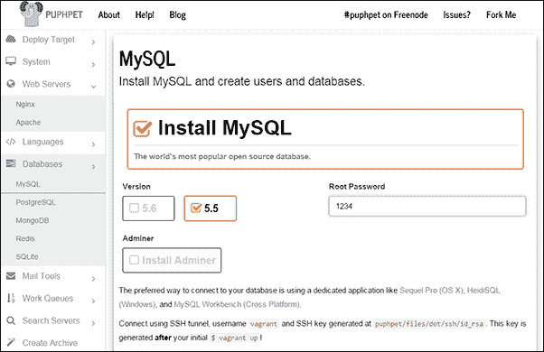

选择数据库

在这里，您可以选择 MySQL 版本和 root 密码，添加更多用户，并创建新的数据库。如果您喜欢，还可以探索其他数据库。

再次，继续前进，直到您到达 **创建存档**，您就完成了。下载您的自定义服务器配置！这将下载一个包含您自定义虚拟机配置的 ZIP 文件。

1.  **设置你的虚拟机**：解压缩你刚刚下载的 ZIP 文件，并导航到解压缩 ZIP 文件的位置。

    在 Mac OS X 或 Ubuntu 中打开终端。在 Windows 中，你应该以管理员权限打开命令行。

    在终端中，浏览到文件夹位置并输入以下内容：

    ```php
    vagrant up

    ```

    按*Enter*键。这可能需要几分钟，你应该会看到一个消息，表示一切安装完成。

1.  **设置主机**：在我们开始使用虚拟机之前，这是设置主机名的最后一步。对于 Drupal 来说，始终使用正确的域名更好。为了创建虚拟主机，我们需要更改计算机上的主机文件。根据操作系统浏览以下文件夹：

    +   **Windows**：`C:\windows\system32\drivers\etc\hosts`

    +   **Linux (Ubuntu)**：`/etc/hosts`

    +   **Mac**：`/private/etc/hosts`

        ```php
        192.168.1.32 drupal8.dev  www.drupal8.dev
        ```

    你可以使用具有管理员权限的喜欢的编辑器来更改主机文件。我选择使用`drupal8.dev`作为我的域名。所以让我们将以下行添加到主机文件中：

    我们在 PuPHPet 上创建虚拟机配置文件时使用了这个 IP 地址。如果你现在不记得它，你可以通过在记事本中打开`config.yaml`来找到它。`config.yaml`文件位于你之前放置在虚拟机文件夹中的`puphet`文件夹内。你应该会在`private_network`旁边看到 IP 地址。

我们刚刚在我们的计算机上完成了一个虚拟机的配置。你可以打开浏览器并输入你的域名—`drupal8.dev`。

## *发生了什么？*

你刚刚为项目开发安装了 Vagrant。现在你可以构建一个虚拟机，这是你的实际生产服务器。你可以根据不同的项目需求切换到不同的虚拟机。你需要安装一个新的虚拟机的是 PuPHPet 的配置文件。

# 摘要

你已经到达了本章的结尾！你现在应该有一个可以工作的 Drupal 8 网站和 PHPStorm IDE，可以开始定制 Drupal 开发。我们还没有编写实际的代码，所以我非常期待开始一些开发示例。然而，这一章已经为我们提供了开发过程中所需的工具和配置系统，使开发过程更加容易和愉快。现在，我们准备好开始认真地开发 Drupal 了。在下一章中，我们将创建一个新的内容类型和一个基本的自定义模块，以更改我们内容类型中的一个字段。
