# 第二章. 自定义模块开发

*我们在第一章中设置了我们的开发环境，*设置 Drupal 开发环境*。现在让我们开始创建一个新的内容类型，并创建一个基本的自定义模块来更改内容类型上的一个字段。我们还将探讨测试驱动开发作为良好的编程实践的概念。*

在本章中，我们将学习以下内容：

+   定义自定义内容类型（Recipe）

+   Drupal 8 面向对象编程的基础

+   Drupal 8 与 Symfony 的介绍

+   Drupal 8 模块开发的基础

+   字段格式化 API

+   **测试驱动开发**（**TDD**）

+   使用内置的 PHPUnit 测试框架编写和运行自定义模块功能的测试

+   在 PHPStorm IDE 中配置和运行单元测试，并生成代码覆盖率报告

# 创建自定义 Recipe 内容类型

在上一章中，我们在系统中安装了 Drupal 8。现在我们将创建我们的自定义食谱内容类型。在此之前，我们将讨论 Drupal 8 中新增的五个字段：

+   **日期**：日期字段是 Drupal 7 中的日期模块。我们可以选择记录**日期和时间**或**仅日期**作为选项。

+   **电子邮件**：日期模块很简单，但**电子邮件**字段更简单。电子邮件字段没有任何设置。

+   **链接**：链接字段允许内部和外部链接，以及链接文本选项。

+   **电话**：电话字段在 Drupal 8 中默认禁用，因此我们需要启用模块才能使用它。它没有设置。它实际上只是一个添加`<a href="tel:`将文本转换为电话链接的文本字段。

+   **引用**：引用模块是最强大的字段。我们可以链接到任何实体，这意味着我们可以链接到评论、内容、块、文件、术语和用户。

现在登录到您的 Drupal 8 网站。您应该看到一个新管理工具栏。

# 动手实践 – 创建自定义内容类型

让我们按照以下步骤创建一个自定义内容类型：

1.  点击管理工具栏中的**结构**，然后点击**内容类型**。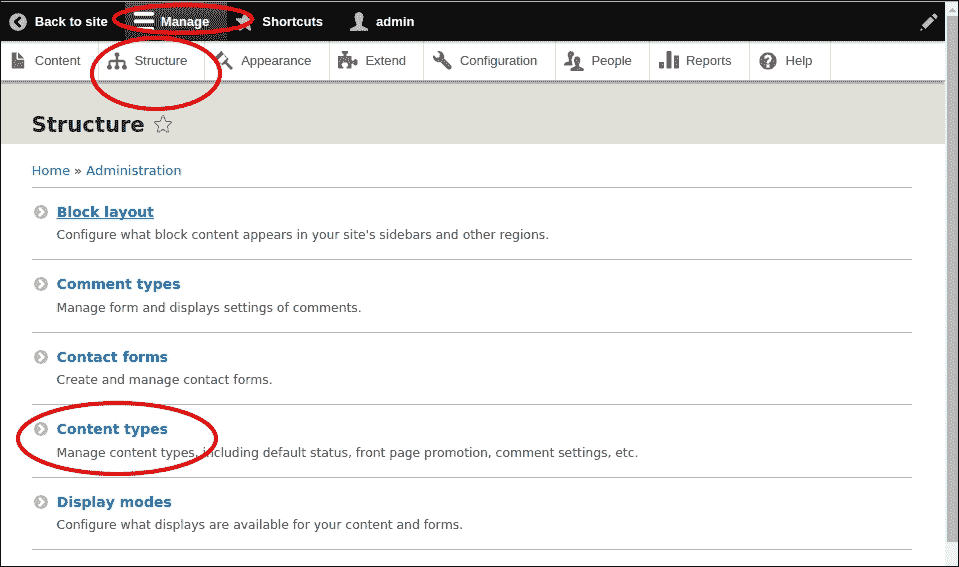

1.  在**内容类型**屏幕上，点击**添加内容类型**链接。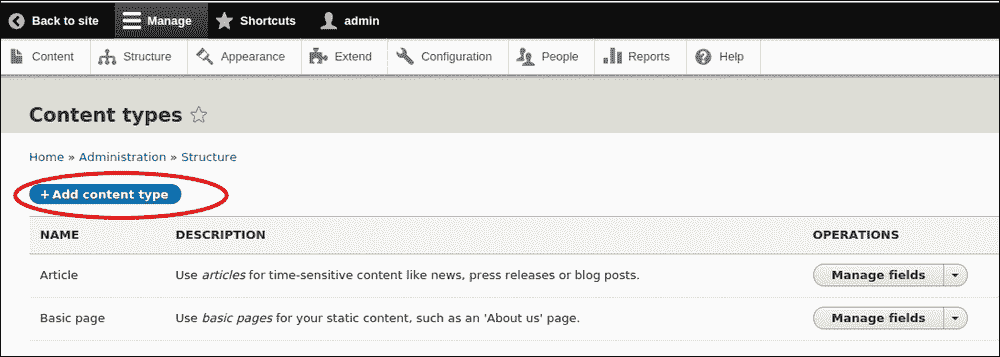

1.  在**名称**文本字段中写入`Recipe`。

1.  在描述中输入此文本`基于 schema.org base HTML5 Microdata schema 的简单食谱内容类型，位于：http://schema.org/Recipe/`。

1.  对于**标题**字段标签，输入`name`。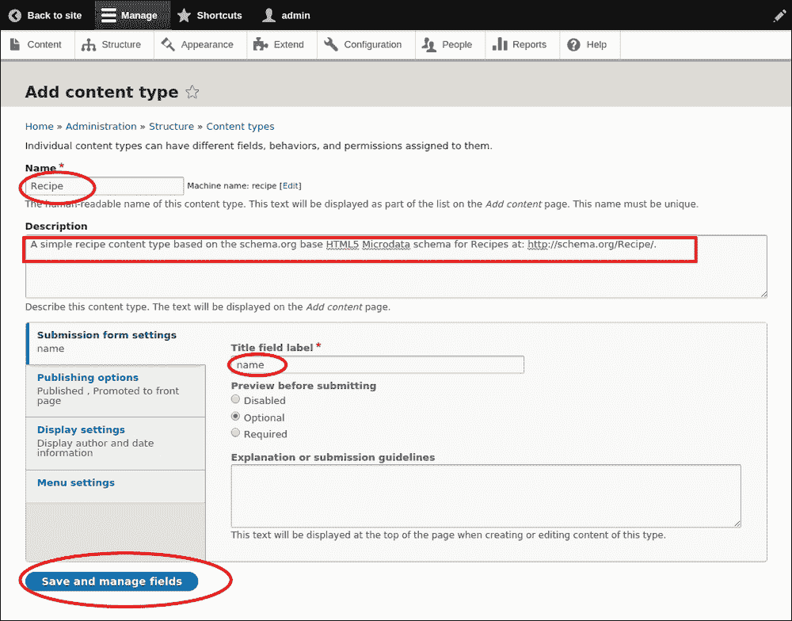

1.  点击**保存和管理字段**按钮。目前我们将使用默认的内容类型配置来配置其他所有内容。

1.  接下来，通过点击**删除**链接，然后确认点击下一屏幕上的**删除**按钮，删除自动添加到我们的内容类型中的**正文**字段。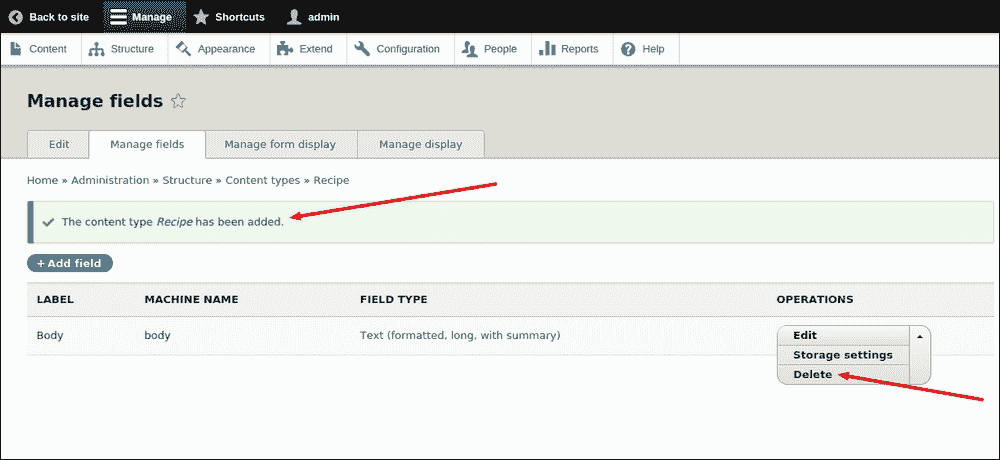

1.  现在，我们将向我们的食谱内容类型添加一些新的字段。我们将使用食谱模式属性名称作为字段名称。在`http://schema.org/Recipe/`表格中列出的第一个属性是**description**。一旦您点击**添加字段**按钮，您将获得一个选项**添加新字段**选择框。在那里您需要选择**文本（格式化，长文本，带摘要**）。在标签上，您需要写上`description`。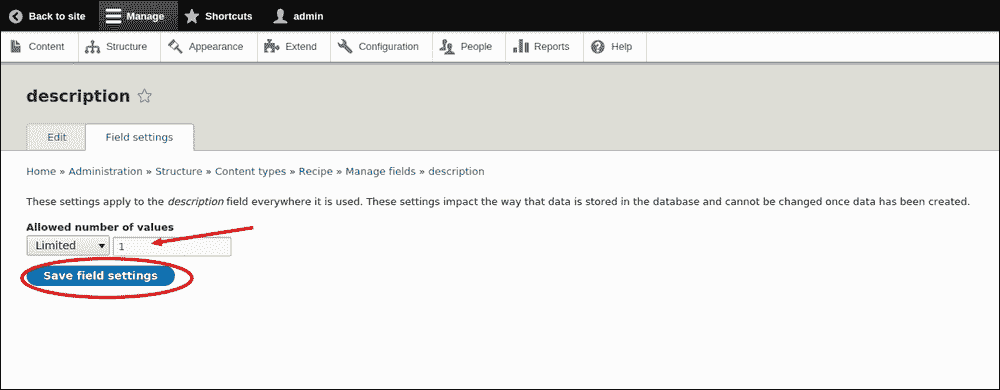

1.  然后点击**保存并继续**。在下一屏幕上，将**允许的值数**限制为`1`，并点击**保存字段设置**按钮。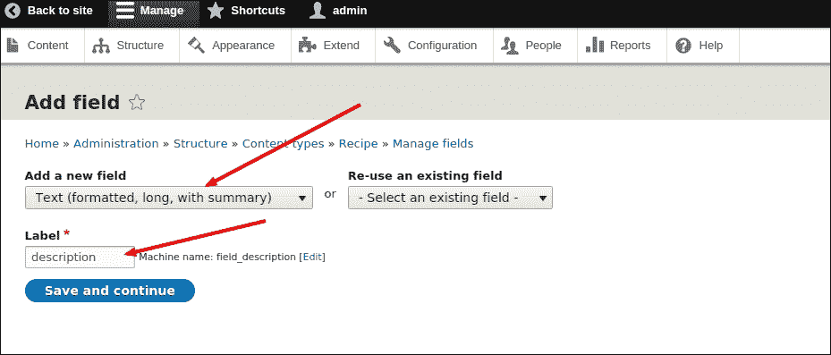

1.  在**食谱描述设置**页面，将`A short description of the item`作为**帮助文本**输入。接受其余的默认设置，然后点击页面底部的**保存设置**按钮：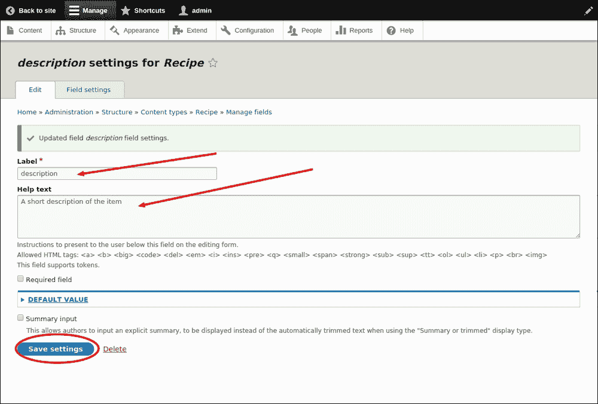

1.  现在，我们将继续到图像属性。我们将为此属性使用一个现有的字段。在**重用现有字段**部分，选择**Image: field_image (Image)**。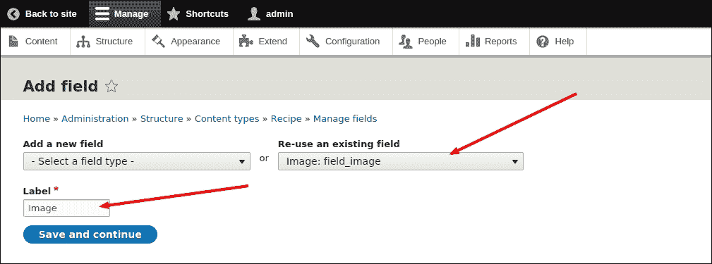

1.  点击**保存并继续**按钮以接受**字段设置**页面上的默认设置。

1.  在下一页，点击**保存设置**按钮以接受食谱的**图像**设置和**图像字段设置**。

1.  **DatePublished**和**Author**属性将由核心 Drupal 节点属性捕获。我们暂时将**CreativeWork 属性**的其余部分跳过。

1.  现在，添加一个新的数字字段`cookTime`，**标签**为`cookTime`，字段类型为**整数**，从下拉菜单中选择。

1.  点击**保存并继续**按钮以接受**字段设置**页面上的默认设置。

1.  在下一页，将`The time it takes to actually cook the dish in minutes.`作为**帮助文本**输入。在**cookTime 设置**页面下，将`minute|minutes`作为**后缀**输入，并点击**保存设置**按钮。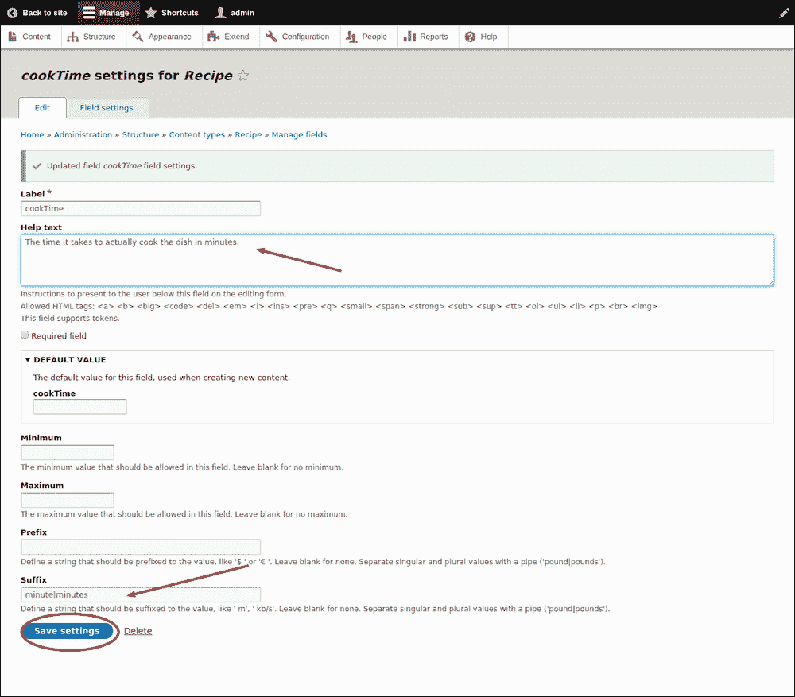

1.  除了**cookingMethod**之外，我们还将暂时跳过**nutrition**、**recipeCategory**、**recipeCuisine**和**totalTime**属性。我们将在本书的后面添加这些属性。

1.  对于**ingredients**属性，设置将是**标签：ingredients**，从**添加新字段**下拉菜单中，你可以选择**字段类型：文本（纯文本）**。点击**保存并继续**按钮。在下一屏幕中，接受最大长度为 255 的默认设置和**允许的值数量**为**无限**，然后点击**保存字段设置**。

1.  在**食谱的成分设置**页面，输入`食谱中使用的成分`作为**帮助文本**。接受其余的默认设置，并点击页面底部的**保存设置**按钮。

1.  对于**prepTime**属性，设置将是**标签：prepTime**，从**添加新字段**下拉菜单中，你可以选择**字段类型：数字（整数）**。点击**保存并继续**按钮以接受**字段设置**页面的默认设置。在下一页，输入准备食谱所需的时间（分钟）作为**帮助文本**，在**prepTime 设置**页面下输入`minute|minute`作为**后缀**，然后点击**保存设置**按钮。

1.  接下来添加**recipeInstructions**属性。点击**添加字段**按钮。在下一屏幕中，选择**字段类型**为**文本（格式化，长文本）**和**标签**为**recipeInstructions**。然后点击**保存并继续**按钮。在下一页，保留所有设置默认并点击**保存**按钮。在下一设置页面，输入`制作菜肴的步骤。`作为**帮助文本**，并保留其余设置，然后点击**保存**按钮。

1.  对于**recipeYield**属性，设置将是**标签：recipeYield**，从**添加新字段**下拉菜单中，你可以选择**字段类型：文本（纯文本）**。点击**保存并继续**按钮。在下一屏幕中，接受**最大长度**为 255 和**允许的值数量**为**限制**到**1**的默认设置，然后点击**保存字段设置**。

1.  在**食谱的 recipeYield 设置**页面，输入`该食谱产生的数量（例如，服务人数，份量等）。`作为**帮助文本**。接受其余的默认设置，并点击页面底部的**保存设置**按钮。

1.  您现在应该有一个类似于以下截图的**管理字段**屏幕，用于我们的食谱内容类型：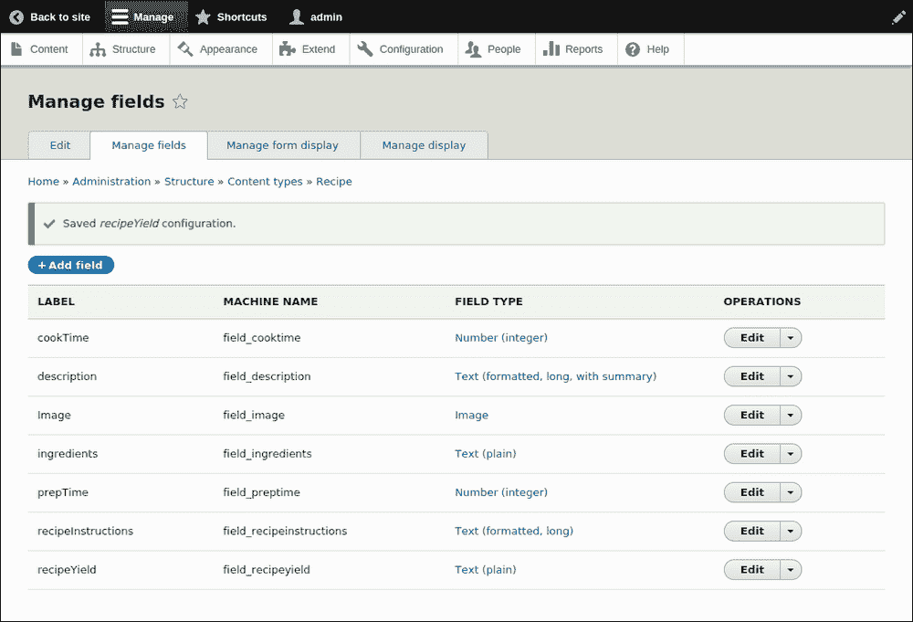

## *发生了什么？*

您已创建新的食谱内容类型并添加了新字段。

# 行动时间 – 添加新食谱

现在我们已经创建了新的食谱内容类型并修改了其字段，让我们通过点击快捷栏中的**添加内容**链接来创建一个新的食谱，然后点击食谱链接。

前往路径**管理** | **内容**并点击以下截图所示的**添加内容**按钮：

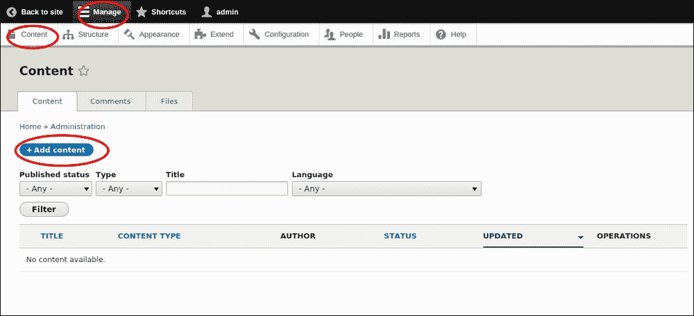

这里是我的 Awesome Sauce 食谱，你可以使用它，但欢迎你添加任何你喜欢的食谱：

1.  **名称**：`Awesome Sauce`

1.  **描述**：`一种美味甜辣酱，让你的任何食物都变得更加出色。一点就能走得很远...`

1.  **配料**:

    +   `一个鬼椒（可选）`

    +   `两个哈瓦那辣椒`

    +   `三个泰国辣椒`

    +   `四个墨西哥辣椒`

    +   `四个大蒜瓣`

    +   `三杯米醋`

    +   `一茶匙鱼露`

    +   `一杯糖`

1.  **食谱说明**：

    +   `1. 剥去辣椒的茎。`

    +   `2. 将辣椒和大蒜加入食品加工机中，搅拌至成泥。`

    +   `3. 将醋、糖、鱼露和果泥加入一个小锅中，用低温煮沸。`

    +   `4. 煮酱 20 到 30 分钟，直到糖完全溶解。`

    +   `5. 将锅从炉子上取下，静置 10 分钟。`

    +   `6. 你的 Awesome Sauce 已经准备好供食用，或者可以冷藏长达三周。`

    泰国辣椒和鱼露通常在大多数亚洲市场都有售。鬼椒通常被认为是世界上最辣的辣椒，对于那些对辣味不太耐受的人或者找不到它们的情况下可以省略。

1.  **产量**：`12 份`

1.  **准备时间**：**10 分钟**

1.  **烹饪时间**：**30 分钟**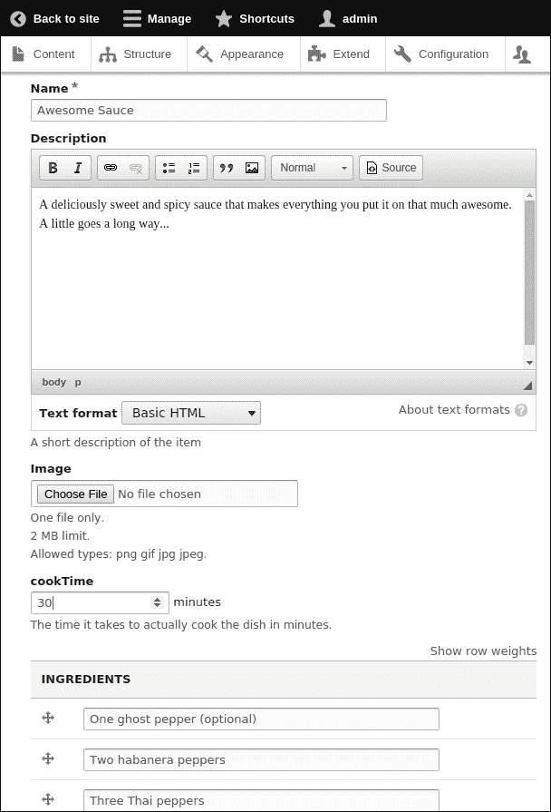

当你完成时，保存它以查看你的新食谱页面。

## *刚才发生了什么？*

我们已经将我们的食谱添加到了网站上。

## Drupal 中的 OOP 概念

在我们深入开发第一个自定义模块之前，让我们了解现代**面向对象编程**（**OOP**）的基础，这是 Drupal 8 采用的，以便让使用其他纯 PHP 框架的开发者更加熟悉。面向对象的设计模式已被用于实现各种 Drupal 概念，如字段、视图、实体和节点。

虽然 OOP 的学习曲线很陡峭，包括掌握诸如继承和多态等关键编程技术，但与过程式程序相比，它被发现更容易扩展、重构和维护，从长远来看，这让你可以专注于编程部分，而不是浪费时间在维护问题上。依赖注入是 Drupal 8 中广泛使用的 OOP 设计模式之一。对这个概念的基本理解对于访问和使用一些核心 API 至关重要。以下是它们：

+   **对象**：一个**对象**是一个由类定义的数据结构的单个实例。一个类只定义一次，然后你创建一个对象使其属于一个类。换句话说，一个类可以表示为一种对象类型。它是一个蓝图，你可以从中创建一个单独的对象。一个类由三个主要组件组成：属性、名称和操作。以下是一个小的 PHP 示例：

    ```php
    <?php
    class foo
    {
        function call_foo()
        {
            echo "Calling foo."; 
       }
    }
    $bar = new foo;
    $bar->call_foo();
    ?>
    ```

+   **抽象**：面向对象编程的核心原则之一，**抽象**指的是以任何类型的数据表示，你可以保持实现的细节抽象或隐藏。它允许你编写与列表、数组和其他数据类型等抽象数据结构无缝工作的代码。由于代码在处理不同数据类型时保持不变，你可以编写一个新的数据类型，并使其与程序一起工作，而无需对其进行更改。以下是一个小的 PHP 示例：

    ```php
    <?php
    abstract class AbstractClass
    {
        // Force Extending class to define this method
        abstract protected function getVal();
        abstract protected function prefixVal($prefix);

        // Common method
        public function printOut() {
            print $this->getVal() . "\n";
        }
    }

    class ConcreteClass1 extends AbstractClass
    {
        protected function getVal() {
            return "ConcreteClass1";
        }

        public function prefixVal($prefix) {
            return "{$prefix}ConcreteClass1";
        }
    }

    $class1 = new ConcreteClass1;
    $class1->printOut();
    echo $class1->prefixVal('FOO_') ."\n";
    ?>
    ```

+   **封装**：也等同于信息隐藏，封装基本上是将对象功能所需的全部资源合并在一起的过程，包括方法和数据。这个过程是通过创建帮助您公开方法和属性的类来实现的。一个类被视为一个胶囊或容器，它封装了属性和属性以及一组方法，以便为其他类提供特定的功能。以下是一个小的 PHP 示例：

    ```php
    <?php
    class Application {
         private static $_user;
         public function User( ) {
              if( $this->_user == null ) {
                   $this->_user = new UserData();
              }
              return $this->_user;
         }
    }

    class UserData {
         private $_name;
         public function __construct() {
              $this->_name = "Krishna kanth";
         }
         public function GetUserName() {
              return $this->_name;
         }
    }
    $app = new Application();
    echo $app->UserData()->GetUserName();
    ?>
    ```

+   **多态**：多态的名字来源于**多种形状**，指的是请求可以由不同类型的事物执行的同一种操作的功能。有三种主要技术可以用来实现多态：方法重载、方法覆盖和运算符重载。以下是一个小的 PHP 示例：

    文件`ShpeInterface.php`的内容：

    ```php
    <?php
    // Create Shape interace with calculateArea() method.
    interface Shape {
      public function calculateArea();
    }
    ?>
    ```

    文件`Circle.php`的内容：

    ```php
    <?php
    require ShapeInterface.php;

    // Create Circle class that implement Shape interface.
    class Circle implements Shape {
      private $radius;

      public function __construct($radius)
      {
        $this -> radius = $radius;
      }

      // calcArea calculates the area of circles 
      public function calculateArea()
      {
        return $this -> radius * $this -> radius * pi();
      }
    }
    ?>
    ```

+   **继承**：你可以通过扩展现有类来创建一个新的类，这个过程被称为**继承**。在对象之间使用的关键关系之一是**特殊化**，它是通过继承原则实现的。以下是一个小的 PHP 示例：

    ```php
    <?php
    // Declare the interface 'iTemplate'
    interface iTemplate
    {
        public function setVariable($name, $var);
        public function getHtml($template);
    }

    // Implement the interface
    // This will work
    class Template implements iTemplate
    {
        private $vars = array();

        public function setVariable($name, $var)
        {
            $this->vars[$name] = $var;
        }

        public function getHtml($template)
        {
            foreach($this->vars as $name => $value) {
                $template = str_replace('{' . $name . '}', $value, $template);
            }

            return $template;
        }
    }

    ?>
    ```

现在，我们将通过开发我们新的自定义模块来展示前面提到的概念。

# 动手实践 – 在 Drupal 8 中开发自定义模块

在这里，我们将创建一个自定义模块，该模块将在路径`mypage/page`下的页面上打印`Hello World`。在讨论 Drupal 根目录结构之前，我们将讨论在 Drupal 8 中自定义模块开发的基本步骤。

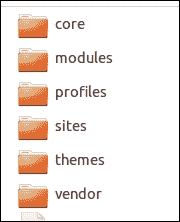

查看前面的截图。我们将看到每个目录包含的内容：

+   `/core`：所有由核心提供的文件，没有明确理由放在/目录下。

+   `/modules`：所有自定义和贡献模块放入的目录。将它们分成子目录 contrib 和 custom 可以使跟踪模块更容易。

+   `/profiles`：这个文件夹包含贡献的和自定义的配置文件。

+   `/themes`：- 贡献的和自定义的（子）主题。

+   `/sites/[domain OR default]/{modules,themes}`：可以将特定站点的模块和主题移动到这些目录中，以避免它们在所有站点上显示。

+   `sites/[domain OR default]/files`: 站点特定的文件通常会放在这里。这可能包括用户上传的文件，如图片，也包括配置文件，包括活动配置和暂存配置。配置由 Drupal 读取和写入，并且应该具有最小的权限，仅允许 Web 服务器读取和修改它们。

+   `/vendor`: 这个文件夹包含 Drupal 核心所依赖的所有后端库。

现在，让我们开始：

1.  让我们先添加您的模块文件夹名称。与 Drupal 7 不同，我们曾经将模块文件夹放在 `site/all` 内，在 Drupal 8 中，我们必须将我们的自定义或贡献模块保存在根目录下的模块中。

    ```php
    modules/contrib/
    modules/custom/
    ```

    ### 注意

    在多站点配置的情况下，我们需要使用不同的文件结构如下。

    ```php
    sites/ site_name_a/modules/
    sites/ site_name_b/modules/
    ```

    让我们的模块命名为 `d8dev`，并在 `modules/custom` 目录下创建一个名为 `d8dev` 的文件夹。

1.  创建 `.info.yml` 文件。在 Drupal 7 中，我们曾经使用过 `.info` 文件。在 Drupal 8 中，这已经被改为 `.info.yml`。现在，我们不再使用 `.info` 解析器，而是使用 Symfony YML 组件。新的扩展 `.info.yml` 适用于模块、主题和配置文件。

    ### 注意

    Drupal 使用了一些 Symfony 组件来支持这个版本。通过使用 HTTP Kernel 组件，Drupal 和 Symfony 项目变得更加互操作。我们将能够轻松地将自定义 Symfony 应用程序与 Drupal 集成，反之亦然。您可以了解更多关于 Symfony 结构以及 Drupal 如何使用它的信息。请点击此链接 [`symfony.com/projects/drupal`](http://symfony.com/projects/drupal)。

    **YAML**: 与 PHP 类似，YML 是一种简单的语言，并且有简单类型的语法；例如整数、字符串、浮点数或布尔值。

    在 Drupal 8 中，新的 `info.yml` 文件是必需的，用于更新 Drupal 核心关于不同的模块、主题或任何安装配置文件。这也提供了额外的标准来管理模块以及版本兼容性。

1.  在第一步中创建的 `d8dev` 目录下创建一个 `d8dev.info.yml` 文件：

    ```php
    name: Drupal 8 custom module d8dev
    type: module
    description: 'Example for Drupal 8 modules.'
    package: Custom
    version: 8.1
    core: 8.x
    ```

    在 `d8dev.info.yml` 中我们添加了什么：

    +   `name`: 如同显而易见，`name` 字段是我们模块的标识符，将在 `模块` 页面上显示。我们应该遵循大写和 Symantec 命名约定。

    +   `description`: 我们添加了一条简短的一行描述，以帮助管理员了解此模块的功能。

    +   `package`: 如果这将成为其他模块的一部分，我们应该使用包的名称。由于我们正在开发一个自定义模块，我们保留了 `Custom`，或者如果您不确定，可以使用 `Other`。

    +   `type`: 这是一个必需的属性，用于让 Drupal 知道它是一个模块、一个主题还是一个安装配置文件。

    +   `version`: 我们应该指定我们正在开发的模块的版本号。

    +   `core`: 我们需要指定此模块将要使用的 Drupal 版本，`8.x`。这是一个强制属性。

1.  创建 `.routing.yml`

    +   **路由系统**：路由是指为 Drupal 定义的路径，用于返回某种内容。例如，默认的前页 /node 就是一个路由。当 Drupal 收到一个请求时，它会尝试将请求的路径与它所知道的某个路由进行匹配。如果找到路由，则使用该路由的定义来返回内容。否则，Drupal 将返回 404 错误。

    +   **路由和控制器**：Drupal 的路由系统与 Symfony HTTP 内核协同工作。对 Symfony 的了解将有所帮助。对 Symfony HTTP 内核的基本了解就足以进行一般的路由操作。以下图表解释了不同组件之间的关系：

        ```php
        d8dev.my_page:
          path: '/mypage/page'
          defaults:
            _controller: '\Drupal\d8dev\Controller\d8devController::myPage'
            _title: 'My first page in Drupal8'
            requirements:
            _permission: 'access content'
        ```

    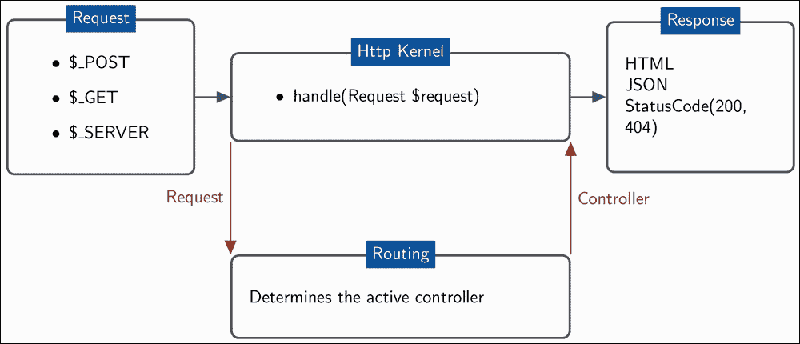

    我们将在`.routing.yml`文件中编写路径。同样，这里我们将使用 Symfony2 组件来处理路由。以下是我们`d8dev.routing.yml`代码，它包括定义路由作为配置，并在控制器中管理回调，控制器是控制器类的一个方法：

    在前面的代码中，第一行`d8dev.my_page`是路由，这是一个将 Drupal 中的 HTTP 请求映射到一组配置变量的 Symfony 组件。路由被定义为机器名，作为`module_name.route_name`。

    接下来是路径，我们在这里指定我们想要此路由注册的 URL 路径。不要忘记添加一个前置的正斜杠。

    在默认设置下，我们有两种配置：`_controller`，它引用了`d8devController`类上的一个方法，以及`_title`，在这里我们添加默认页面标题，例如`My first page in Drupal 8`。

    作为要求配置的一部分，我们指定了权限，谁可以访问页面。

    你可以在[`www.drupal.org/node/2092643`](https://www.drupal.org/node/2092643)了解更多关于路由文件的信息。

1.  创建路由控制器类。我们必须根据已经在 Drupal 8 中实施的 PSR-4 命名标准创建我们的`ModuleController.php`文件，该标准由 PHP 框架互操作性小组用于基于包的 PHP 命名空间自动加载。

    ### 注意

    PSR 描述了从文件路径编写自动加载类的规范。它还描述了根据规范放置将被自动加载的文件的位置。有关 PSR-4 命名空间和自动加载的更多信息，请参阅[`www.php-fig.org/psr/psr-4/`](http://www.php-fig.org/psr/psr-4/)。

    创建一个名为`modules/custom/d8dev/src/Controller`的文件夹。在这个文件夹内，创建一个名为`d8devController.php`的文件，内容如下：

    ```php
    <?php
    /**
     * @file
     * @author My Name
     * Contains \Drupal\d8dev\Controller\d8devController.
     * Please include this file under your 
     * d8dev(module_root_folder)/src/Controller/
     */
    namespace Drupal\d8dev\Controller;
    /**
     * Provides route responses for the d8dev module.
     */
    class d8devController {
      /**
       * Returns a simple page.
       *
       * @return array
       *   A simple renderable array.
       */
      public function myPage() {
        $element = array(
    '#type' => 'markup',
    '#markup' => 'Hello world!',
    );
        return $element;
      }
    }
    ?>
    ```

    控制器是我们添加的 PHP 函数，它从 HTTP 请求中获取信息，构建并返回 HTTP 响应。

    控制器包含了我们的应用程序需要显示页面内容的所有逻辑。根据匹配的路由，执行特定的控制器，并创建并返回一个响应对象。

    例如，如果浏览器请求路径为`/mypage/page`的页面，它将执行`d8devController::myPage()`控制器，并显示一个简单地打印`Hello world!`的页面。

1.  启用模块。转到路径`admin/modules`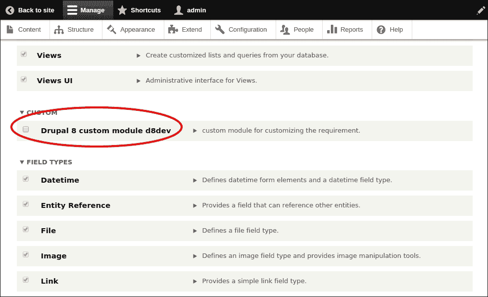

一旦您启用了模块并在您最喜欢的浏览器中打开了路径`http://localhost/d8dev/mypage/page`，您将看到从我们的模块打印出的**Hello world!**文本。

## *发生了什么？*

我们完成了我们的第一个自定义模块，并在自定义页面 URL 上显示了**Hello World!**消息。在深入模块开发和介绍 Drupal API 之前，给自己一杯热咖啡作为奖励。

# 行动时间 - 开发自定义字段格式化器

让我们打开我们在开发自定义模块之前创建的食谱页面。在我们的食谱页面上，我们使用自定义内容类型创建，所有时间字段（**cookTime**和**prepTime**）的值都以分钟显示，例如，60 分钟和 90 分钟。如果 60 分钟显示为 1 小时，90 分钟显示为 1 1⁄2 小时，那就更好了。

我们可以实现的其中一种方式是开发一个自定义模块来创建一个自定义字段格式化器，该格式化器将**cookTime**和**prepTime**相关字段以小时而不是分钟的形式显示。

创建新插件或创建自定义字段格式化器涉及以下基本步骤：

1.  创建自定义格式化器类。这个类在其注解块中定义了其元信息，包括格式化器的 ID、标签和字段类型。

    核心模块定义在`Drupal\Core\Field\Plugin\Field\FieldFormatter`中，而命名空间插件放置在我们的模块的`src/Plugin/`文件夹中。在字段格式化器的案例中，这将是在`src/Plugin/Field/FieldFormatter`目录中。

    为了创建格式化器，您需要遵循以下步骤：

    创建`RecipeFormatter.php`。将其复制到我们的模块文件夹中的`d8dev/src/Plugin/Field/FieldFormatter/RecipeFormatter.php`，并添加以下行：

    ```php
    <?php
    /**
     * @file
     * Contains \Drupal\ d8dev\Plugin\field\formatter\RecipeFormatter.
     */

    namespace Drupal\d8dev\Plugin\Field\FieldFormatter;

    use Drupal\Core\Field\FormatterBase;
    use Drupal\Core\Field\FieldItemListInterface;
    ```

    在 Drupal 7 中，我们曾经使用`hook_field_formatter_info`。在 Drupal 8 中，我们引入了一个新的注解系统。现在，我们需要使用注解来定义格式化器。

    将以下行添加到我们在步骤 1 中创建的`RecipeFormatter.php`文件中：

    ```php
    /**
     * Plugin implementation of the 'recipe_time' formatter.
     *
     * @FieldFormatter(
     *   id = "recipe_time",
     *   label = @Translation("Duration"),
     *   field_types = {
     *     "integer",
     *     "decimal",
     *     "float"
     *   }
     * )
     */
    ```

    ### 注意

    在您的格式化器类之前使用`@FieldFormatter`注解的 PHP 注释 docblock 非常重要：

    `class RecipeFormatter extends FormatterBase { }`

    注解属性相当直观。我们所做的就是定义了一个 ID、标签以及此格式化器应在哪种字段类型上可用。`field_types`属性是最重要的部分，如果您不添加`integer`、`decimal`或`float`，则此格式化器将不会出现在管理显示页面上。

    我们将在格式化器上进行的最后一点工作是添加`viewElements()`方法。这个方法将用于显示实际的格式化器，如果格式化器类扩展了`FormatterBase`，则这是唯一需要的方法。

    将以下行追加到`RecipeFormatter.php`类中：

    ```php
    public function viewElements(FieldItemListInterface $items) {
            $elements = array();

            foreach ($items as $delta => $item) {

                //$hours = $item->value;
                $hours = floor($item->value / 60); 

    //divide by minutes in 1 hour and get floor
                $minutes = $item->value % 60; 
    //remainder of minutes
                //get greatest common denominator of minutes to convert to fraction of hours
                $minutes_gcd = gcd($minutes, 60);

                //&frasl; is the html entity for the fraction separator, and 
    // we use the sup and sub html element to give the 
    // appearance of a  fraction.

                //$minutes_fraction = '<sup>' . $minutes/$minutes_gcd .'</sup>&frasl;<sub>' . 60/$minutes_gcd . '</sub>';
                $minutes_fraction = $minutes/$minutes_gcd ."/" . 60/$minutes_gcd ;

                $markup = $hours > 0 ? $hours . ' and ' . $minutes_fraction . ' hours' : $minutes_fraction . ' hours';
                $elements[$delta] = array(
                    '#theme' => 'recipe_time_display',
                    '#value' => $markup,
                );
            }

            return $elements;
        }
    ```

    我们在这里所做的就是将处理过的值传递到一个自定义模板中，该模板将用于显示嵌入的 HTML 代码。

    我们还需要创建一个辅助函数来处理值。

    将以下行追加到`RecipeFormatter.php`类中：

    ```php
    **
     * Simple helper function to get gcd of minutes
     */
    function gcd($a, $b) {
        $b = ( $a == 0) ? 0 : $b;
        return ( $a % $b ) ? gcd($b, abs($a - $b)) : $b;
    }
    ```

    最后，我们的`RecipeFormatter.php`类看起来像以下代码：

    ```php
    <?php
    * @file
     * Contains \Drupal\d8dev\Plugin\field\formatter\RecipeFormatter.
     */

    namespace Drupal\d8dev\Plugin\Field\FieldFormatter;

    use Drupal\Core\Field\FormatterBase;
    use Drupal\Core\Field\FieldItemListInterface;

    /**
     * Plugin implementation of the 'number_decimal' formatter.
     *
     * The 'Default' formatter is different for integer fields on the one hand, and
     * for decimal and float fields on the other hand, in order to be able to use
     * different settings.
     *
     * @FieldFormatter(
     *   id = "recipe_time",
     *   label = @Translation("Duration"),
     *   field_types = {
     *     "integer",
     *     "decimal",
     *     "float"
     *   }
     * )
     */
    class RecipeTimeFormatter extends FormatterBase {
        /**
         * {@inheritdoc}
         */
        public function viewElements(FieldItemListInterface $items) {
            $elements = array();

            foreach ($items as $delta => $item) {

                //$hours = $item->value;
                $hours = floor($item->value / 60); //divide by minutes in 1 hour and get floor
                $minutes = $item->value % 60; //remainder of minutes
                //get greatest common denominator of minutes to convert to fraction of hours
                $minutes_gcd = gcd($minutes, 60);

                //&frasl; is the html entity for the fraction separator, and we use the sup and sub html element to give the appearance of a  fraction.

                //$minutes_fraction = '<sup>' . $minutes/$minutes_gcd .'</sup>&frasl;<sub>' . 60/$minutes_gcd . '</sub>';
                $minutes_fraction = $minutes/$minutes_gcd ."/" . 60/$minutes_gcd ;

                $markup = $hours > 0 ? $hours . ' and ' . $minutes_fraction . ' hours' : $minutes_fraction . ' hours';
                $elements[$delta] = array(
                    '#theme' => 'recipe_time_display',
                    '#value' => $markup,
                );
            }

            return $elements;
        }
    }

    /**
     * Simple helper function to get gcd of minutes
     */
    function gcd($a, $b) {
        $b = ( $a == 0) ? 0 : $b;
        return ( $a % $b ) ? gcd($b, abs($a - $b)) : $b;
    }
    ```

1.  创建模板。到目前为止，我们已经创建了格式化器。现在我们需要创建一个自定义模板来完成这个模块的开发。该模板将被称为`recipe_time_display`，它将接受`value`作为单个参数。为了创建模板，我们将遵循以下下一步：

    1.  打开`d8dev.module`并添加以下函数：

        ```php
        /**
         * Implements hook_theme().
         */
        function d8dev_theme() {
            return array(
                'recipe_time_display' => array(
                    'variables' => array('value' => NULL),
                    'template' => 'recipe-time-display',
                 ),
              );
           }
        ```

    1.  在模块中创建一个名为`templates`的文件夹和一个名为`recipe-time-display.html.twig`的文件。路径是：`d8dev/templates/recipe-time-display.html.twig`。

        ```php
        {{ value }}
        ```

    ### 备注

    你可以简要了解 Twig 在[`symfony.com/doc/current/book/templating.html`](http://symfony.com/doc/current/book/templating.html)。

    在这里，我们只是直接打印值。如果你想，你可以通过这个文件向值中添加更多的 HTML。将以下内容添加到`recipe-time-display.html.twig`：

1.  在保存上一步骤中所有文件后，打开浏览器中的你的网站，并从路径`admin/config/development/performance`中**清除所有缓存**。

1.  清除缓存后，你可以转到路径`admin/structure/types/manage/recipe/display`，并将**格式**字段**cookTime**和**prepTme**从**默认**更改为**持续时间**。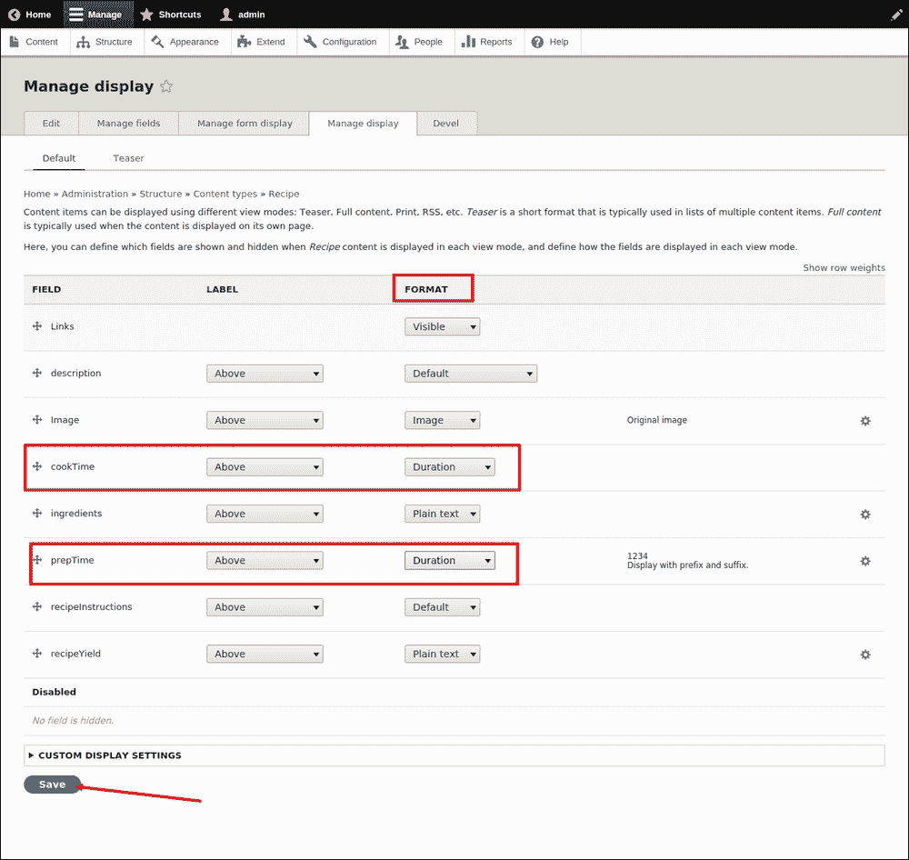

1.  然后，你点击**管理显示**页面上的**保存**按钮。现在查看我们之前创建的食谱内容项，你应该看到新的时间格式。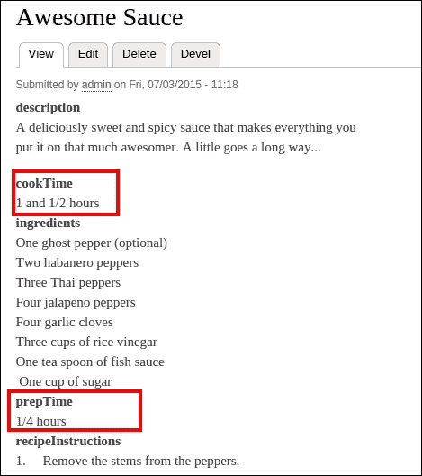

## *发生了什么？*

我们创建了一个自定义模块，允许我们以我们想要的方式格式化我们的食谱内容持续时间字段——整数转换为小时和小时的分数。

# 测试驱动开发（TDD）

很多次我们听到 Drupal 不适合编写复杂的 Web 应用程序。其中一个主要原因是 Drupal 不支持 TDD 或自动化测试。但在 Drupal 8 中，核心中包含了 PHPUnit 测试和 Simpletest 测试。

Drupal 8 的开发考虑到自动化测试的使用，包括单元测试以及功能测试。单元测试处于较低级别，主要用于测试类的功能，而功能测试则处于较高级别，用于检查 Web 输出。

在对现有 Drupal 系统进行任何更改之前，对大多数我们开发的功能运行这两种类型的测试非常重要，以确保不会破坏现有功能。我们也将此称为回归测试。


要遵循 TDD，我们需要遵循以下两个过程：

+   每当你修复一个错误或更改现有功能时，确保编写一个在更改代码之前失败的测试，并在你更改代码后通过测试。这个测试的目的是帮助审阅者理解他/她遇到的错误，突出显示编写的代码已修复预期的错误，并确保它不会在代码的任何新更改中出现。

+   类似地，在编写代码以实现新功能的情况下，确保在代码中包含单元测试和/或功能测试。这将确保审阅者知道你编写的代码是有效的，并且更改不会破坏新功能。

## PHPUnit 测试用例用于 Drupal 类

我们将使用行业标准 PHPUnit 框架来编写我们的 Drupal 类的测试。通常，当我们不需要 Drupal 环境（数据库、设置等）和浏览器时，我们编写 PHPUnit 测试用例来测试类的功能。

要编写 PHPUnit 测试，请遵循以下步骤：

1.  定义一个扩展 `\Drupal\Tests\UnitTestCase` 的类。确保类名以单词 `test` 结尾。

1.  将你的测试类文件放置在 `ind8dev/tests/src/Unit` 目录下。

1.  包含一个 phpDoc 注释，提供有关测试的描述信息。

1.  开始编写你的测试类，类名应以 `test` 开头。每个测试类应包括要测试的功能的一部分。

    ### 注意

    在 [`www.drupal.org/phpunit`](https://www.drupal.org/phpunit) 上了解更多关于 PHPUnit 的信息。有关如何为 Drupal 编写 PHPUnit 测试的完整文档，请访问 [`phpunit.de`](http://phpunit.de)，以及有关 PHPUnit 框架、面向对象编程主题的通用信息，更多关于 PSR-4、命名空间以及放置类的地方。

## 功能测试

我们使用内建的 Simpletest 作为 Drupal 核心的一部分来编写功能测试用例。与单元测试用例不同，我们使用功能测试来测试 Drupal 不同的系统功能，当它依赖于数据库以及配置或测试浏览器输出时。

# 执行时间 – 从我们的 d8dev 自定义模块编写和测试功能测试

1.  从路径 `admin/modules` 启用模块 **Testing**：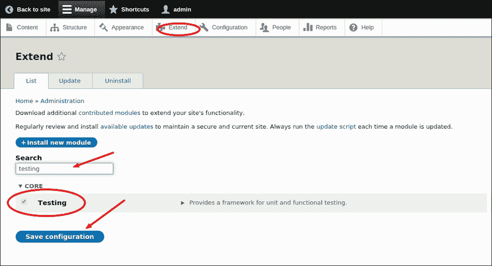

1.  在 `d8dev/src/tests/` 目录下的 `D8devTest.php` 文件中创建 `D8devTest` 类，并添加以下代码行：

    ```php
    <?php
    /**
     * Created by PhpStorm.
     * User: Neeraj
     * Date: 8/7/15
     * Time: 10:59 AM
     */
    namespace Drupal\d8dev\Tests;

    use Drupal\simpletest\WebTestBase;

    /**
     * Tests the d8dev module functionality
     *
     * @group d8dev
     */
    class D8devTest extends WebTestBase {

        /**
         * Tests that the 'mypage/page' path returns the right content
         */
        public function testCustomPageExists() {

            $this->drupalGet('mypage/page');
            $this->assertResponse(200);
        }
    }
    ```

    ### 注意

    在 `Test` 类的 phpDoc 注释块中，必须有这个带有 `@group` 注解的块。

    ```php
           /**
             * Tests the d8dev module functionality
             *
             * @group d8dev
             */
    ```

    **测试用例**: 在 `D8devTest` 类中，我们使用函数 `testCustomPageExists()` 检查由我们的 d8dev 模块创建的自定义页面 `mypage/page`。

1.  从路径 `admin/config/development/performance` 清除缓存。

1.  您可以从路径 `admin/config/development/testing` 打开测试模块用户界面，或者您可以通过 **配置** | **测试** 导航到。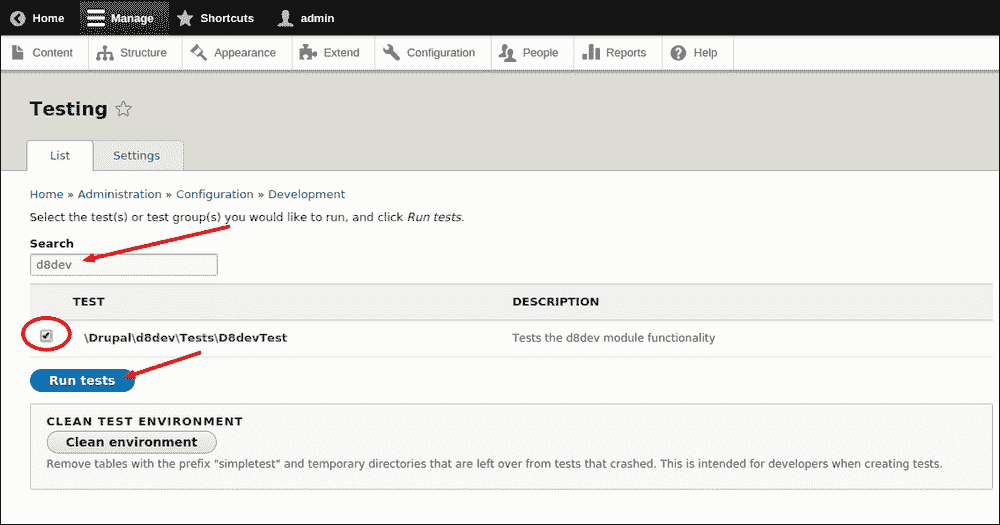

1.  选择 **\Drupal\d8dev\Tests\D8devTest** 并点击 **运行测试** 按钮。您将看到以下截图中的结果：

## *发生了什么？*

恭喜！您现在应该熟悉了 Drupal 8 中测试驱动开发（TDD）方法的实现。我们学习了如何为我们的自定义模块功能编写功能测试用例。我们还学习了如何在 Drupal 8 中通过测试模块用户界面来编写和运行测试。

# 摘要

在本章中，我们学习了如何在 Drupal 中创建新的内容类型，并开发我们的自定义模块以使用字段格式化器 API 修改其中一个字段。我们还探讨了测试驱动开发（TDD）是如何被纳入新 Drupal 核心的。

在下一章中，我们将学习更多关于 Drupal 8 中新引入的配置管理以及如何使用已作为核心模块移动的视图。
