# 第三章。Drupal Views 和配置管理

*在上一个章节中，我们学习了如何创建基本的自定义模块以及创建新的内容类型。现在让我们探索 Drupal 8 中引入的新配置管理，以实现更好的版本控制。我们将学习如何使用 Devel 模块生成内容以进行测试，同时学习新和改进的视图的基础知识。*

在本章中，我们将学习以下主题：

+   使用内置的 Drupal 8 视图

+   Drupal 中的新配置管理是什么？

+   使用配置管理模块通过用户界面导出和导入网站配置

+   使用 Devel 模块自动生成内容以进行测试目的

# Views 的快速介绍

Drupal 7 中的 Views 是安装和使用最广泛的贡献模块。使用 Views，您可以轻松创建列出网站上各种内容的页面和块。您可以创建一个照片画廊或事件日历，或者列出登录到您网站的用户。以下是我们需要 Views 时列出的一些要点：

+   我们喜欢默认的前页视图，但希望以不同的方式排序它

+   我们希望提供一个“未读论坛帖子”选项

+   我们喜欢默认的分类/术语视图，但希望以不同的方式排序它，例如按字母顺序

+   我们希望有一种方式来显示包含特定类型最近五篇帖子的块

在 Drupal 8 中，Views 已被移动到核心模块系统。在 Drupal 8 中创建视图的过程与 Drupal 7 中遵循的过程相似。现在，Views 模块将作为默认核心模块安装的一部分进行安装。

# 动手实践时间 – 使用视图创建食谱列表块

我们将看到新的 Views 模块如何使在网站上显示食谱列表变得多么简单：

1.  如果您还没有登录到您的网站，请以管理员身份登录并导航到`http://yourdrupal8site.com/admin/structure`的**管理** | **结构**。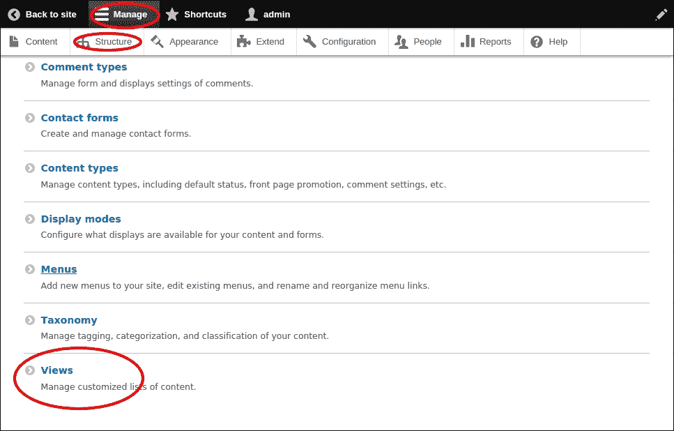

1.  选择**Views**链接创建一个新的视图。它将带您到**Views**配置页面，`http://yourdrupal8site.com/admin/structure/views`。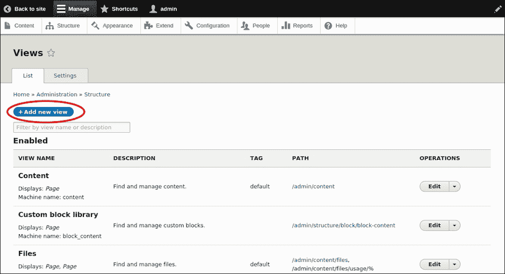

    在这里，您会发现与 Drupal 7 Views 配置页面在风格上的细微差别。有许多默认视图。根据您的需求，您可以选择复制或编辑并使用这些预定义视图。或者，您可以点击**添加新视图**按钮创建一个全新的视图。

1.  现在我们将创建自己的视图来列出文章内容类型。转到此路径：`http://yourdrupal8site.com/admin/structure/views/addorhttp://yourdrupal8site.com/admin/structure/views`。点击**添加新视图**按钮。

1.  您将获得一个类似于下面所示的形式。填写**视图名称**字段。在这个例子中，我给视图命名为`Recipe List`。对于**显示**和**类型**字段，我分别选择了**内容**和**食谱**。

1.  选中**创建一个块**复选框。

1.  点击**保存并编辑**按钮。接受创建块的所有默认值，您的页面应该看起来类似于这个：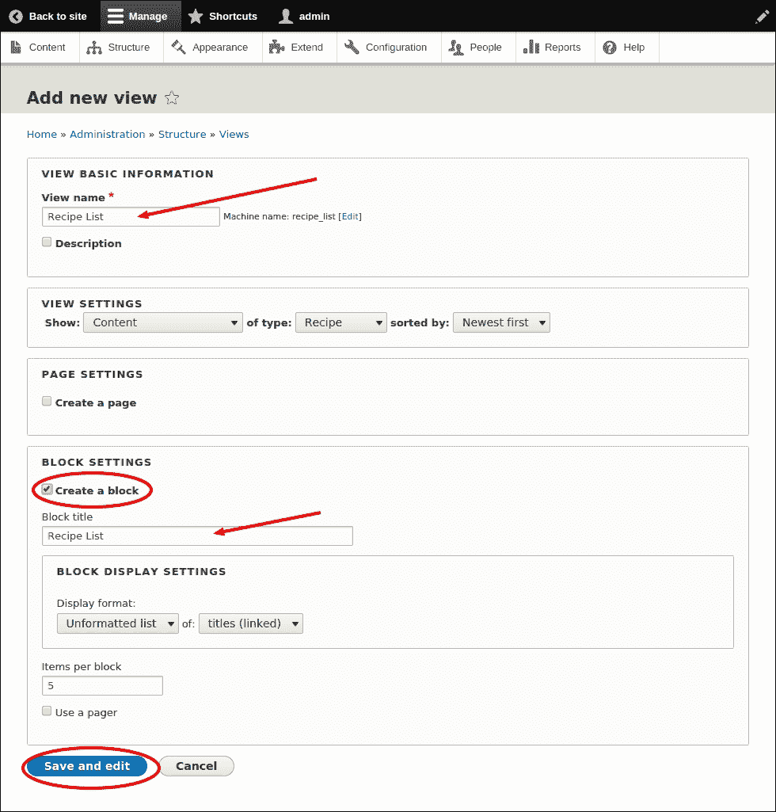

1.  这将带您进入`http://yourdrupal8site.comadmin/structure/views/view/recipe_list`的视图配置页面。在那里，您需要在页面底部点击**保存**按钮：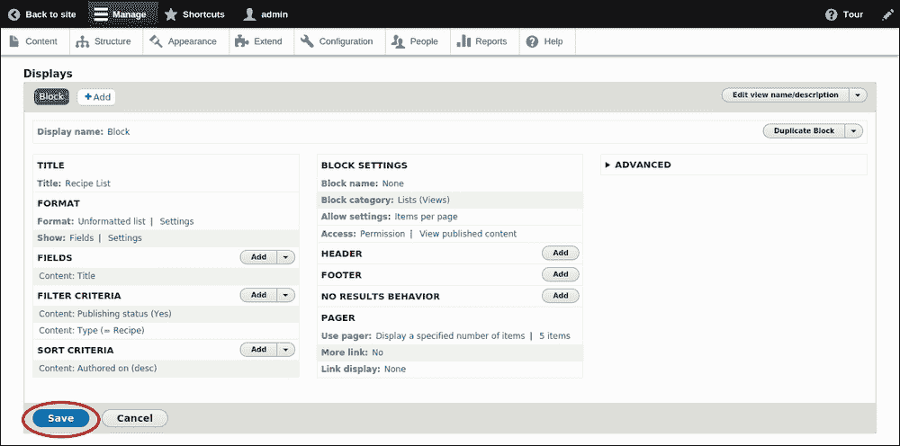

    现在，我们需要配置我们的 d8dev 站点，以便我们的基于 Recipe List 视图的块显示在首页上。

1.  点击**管理**工具栏中的**结构**链接，并选择**块布局**：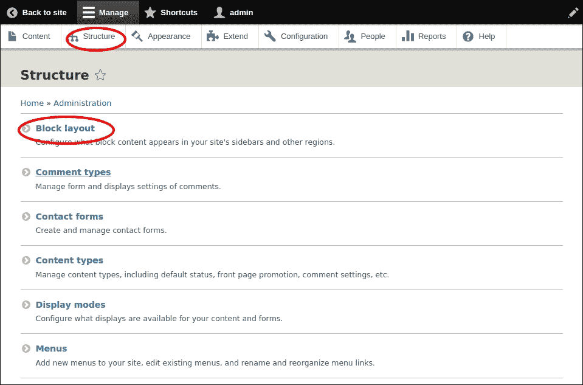

1.  在下一页，点击页面右侧**列表（视图）**下的+**食谱列表**：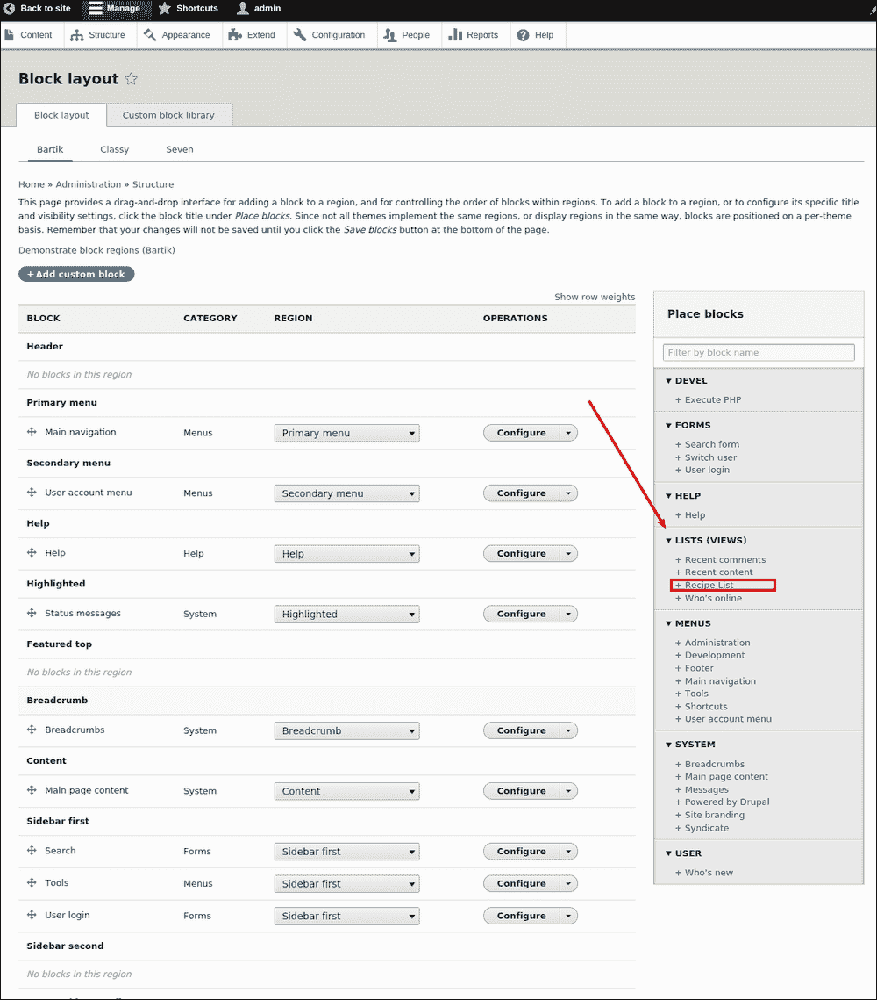

1.  在下一页，将**块标题**字段留空，因为这样标题将默认为我们之前在视图创建向导中添加的标题。

1.  在**区域**设置下，从下拉菜单中选择**侧边栏第二**：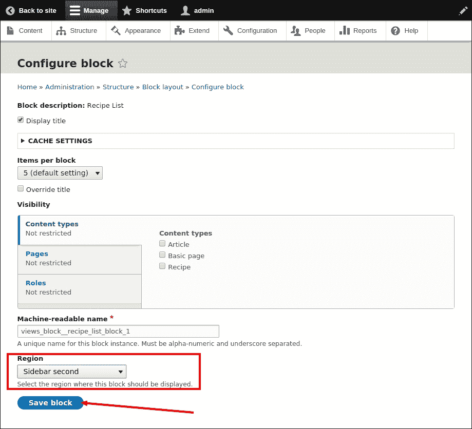

## *发生了什么？*

您现在已经创建了一个基于视图的食谱块，并配置了它，以便它只会在首页上显示。现在，当您访问 d8dev 网站的首页时，您将在页面的右侧看到一个漂亮的**食谱列表**块：

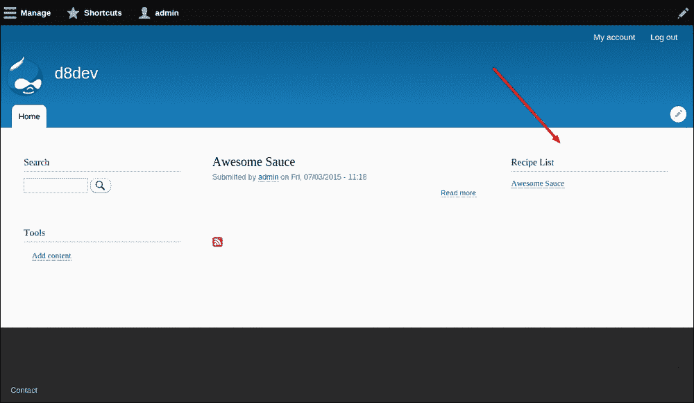

# Drupal 8 的配置管理

作为开发者，我们一直面临如何进行增量开发或解决 Drupal 项目中预演和部署问题的挑战。更大的挑战是，“什么应该归类为内容，什么应该归类为配置？”虽然我们有配置作为一个独立的菜单来识别这个问题，但关于视图、分类法或主题配置怎么办呢？

并非我们没有在 Drupal 7 中找到解决方案。为了解决这个问题，在 Drupal 6 时代引入了 Features & Strongarm 模块，在过去几年中它取得了很大的改进。这在大多数情况下都是一个救星。尽管如此，我们仍然不得不手动重新创建一些配置，这使得它容易出错。

但是，当定期添加用户生成内容，并且有多个团队在同一项目上工作，有时在不同的时区时，记录特征导出所需的配置始终是一个挑战。我们不能从一台安装导出完整的站点配置。

此外，还有许多贡献的模块以自己的方式存储特定的配置，这使得以增量方式合并功能导出变得更加困难。

为了提高开发过程，Drupal 8 启动了一个新的配置管理倡议。现在，由于这个原因，我们有了在 Drupal 网站上管理配置的更简单方法。我们将整个配置保存在文件中而不是数据库表中。这使得真正遵循版本控制系统变得更容易。现在，如果需要，我们可以存储历史记录并回滚更改。

让我们先了解在 Drupal 项目中什么被定义为内容，什么被定义为配置：

+   **内容**：我们在网站前端显示的所有内容都是内容，例如，文章、基本页面、博客文章、图片、视频和音频

+   **会话**：会话存储有关特定用户在登录并与其 Drupal 网站交互时的信息

+   **状态**：这包含有关网站在不同场景中的信息，这些场景本质上是临时的，例如，在重建网站权限之前或运行 cron 作业之前的状态

+   **配置**：这是所有不是内容且特定于您网站的信息，例如，网站名称、使用的内容类型、字段、词汇表、图像样式、文本格式、菜单、菜单链接、权限系统，甚至您创建的视图

    最好使用版本控制系统，例如 `git` 或 `svn`，以充分利用配置管理，尤其是在与分布式团队协作时。

    除了在文件中添加配置外，您还可以手动添加配置。但最好避免这样做，因为您将不得不记住在从预发布到部署迁移过程中需要重新创建的每个步骤。您甚至无法使用任何版本控制系统。

    ### 注意

    避免使用手动配置管理。

# 使用配置管理界面

在 Drupal 8 中，我们有一个配置管理模块，它提供了一个简单的界面来导出和导入网站配置，并在项目的不同环境之间共享，例如开发、预发布和部署。您可以使用此模块轻松验证生产环境中的更改。

此模块假定您的不同环境；例如，dev、预发布、测试和生产是同一个网站。每个网站都使用**通用唯一标识符**（**UUID**）进行标识。只有当 UUID 与目标网站匹配时，模块才会允许在不同网站之间导入配置。

默认情况下，Drupal 8 将所有网站配置保存在数据库中。在安装新的 Drupal 网站时，它会在 `sites/default/files` 中创建一个新的文件夹，命名为 `config_HASH`。在这里，HASH 是一个随机生成的长数字和字母字符串。请参考以下截图：


这是保存网站不同状态配置的地方。

让我们使用模块 UI 在下一节中导出我们在上一章创建的配置。

# 操作时间 - 导入、导出和同步配置

Drupal 8 中配置系统的目标是使复制网站配置变得容易，以便设置一个开发站点，在那里你可以进行更改。然后，将这些更改导入到其他站点也变得简单。

要导出 Recipe 内容类型，请按照以下步骤操作：

1.  在第二章中，我们创建了“自定义模块开发”的 Recipe 内容类型。我们将使用配置管理来导出此内容类型。浏览到模块页面 `http://yourdrupal8site.com/admin/config/development/configuration` 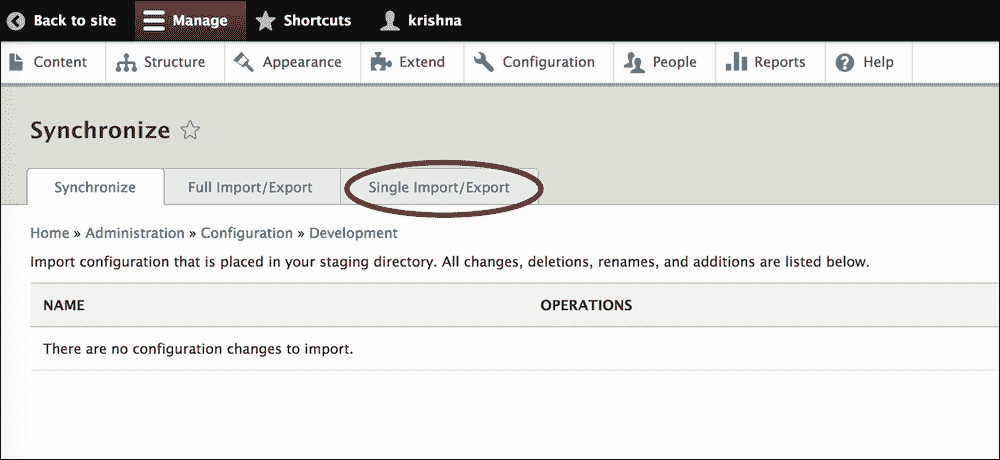

1.  点击**单个导入/导出**选项卡，然后点击**导出**。

    在配置管理模块 UI 中，第一个选项卡是**同步**。当你第一次使用此功能时，你会看到：**没有配置更改要导入**。这意味着你的开发站点正在使用数据库本身的配置。

    你会看到没有配置更改，这意味着你的网站正在使用数据库中的配置文件，并且没有对网站进行任何更改。

1.  选择**配置类型**为**内容类型**，**配置名称**为**Recipe**。你将在文本区域框中看到 YAML 格式的配置。将这些 YAML 配置保存在一个单独的文件中，`node.type.recipe.yml`。此文件包含与我们内容类型相关的所有配置。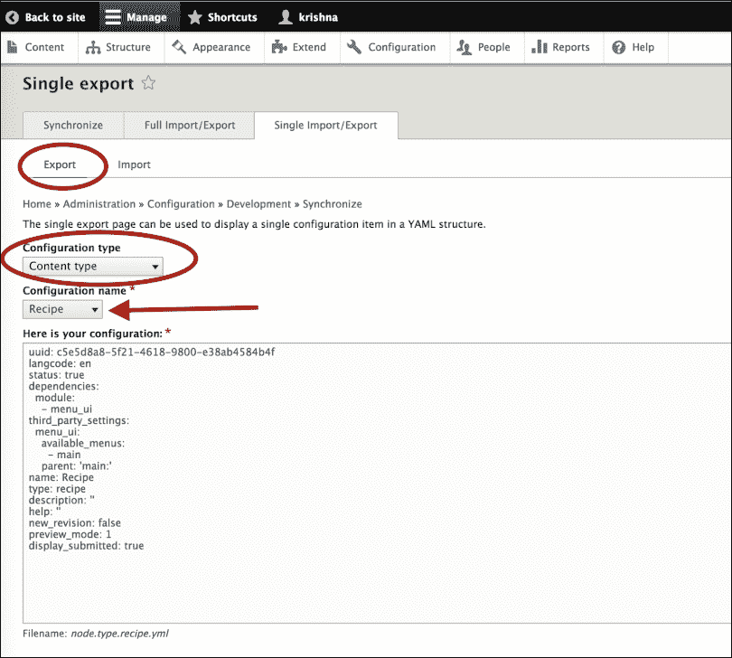

    然而，`node.type.recipe.yml`不包含任何在相同内容类型中使用的字段。我们还需要导出它们。

1.  要导出，从同一页面的下拉菜单中选择**字段**。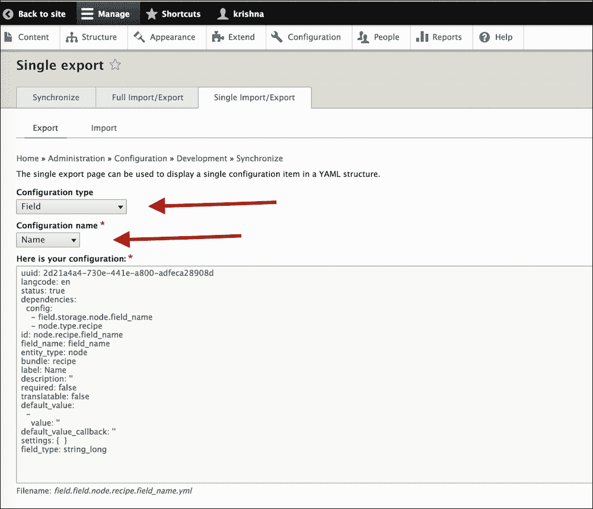

1.  以同样的方式，导出 Recipe 内容类型的表单显示。选择**配置类型**为**实体表单显示**，**配置名称**为**node.recipe.default**。将 YAML 配置保存到`core.entity_form_display.node.recipe.default.yml`。

1.  导出 Recipe 内容类型的默认视图摘要。选择**配置类型**为**实体视图显示**，**配置名称**为**node.recipe.teaser**。将 YAML 配置保存到`core.entity_view_display.node.recipe.default.yml`。

1.  导出 Recipe 列表视图。选择**配置类型**为**视图**，**配置名称**为**Recipe List**。将 YAML 配置保存到`views.view.recipe_list.yml`。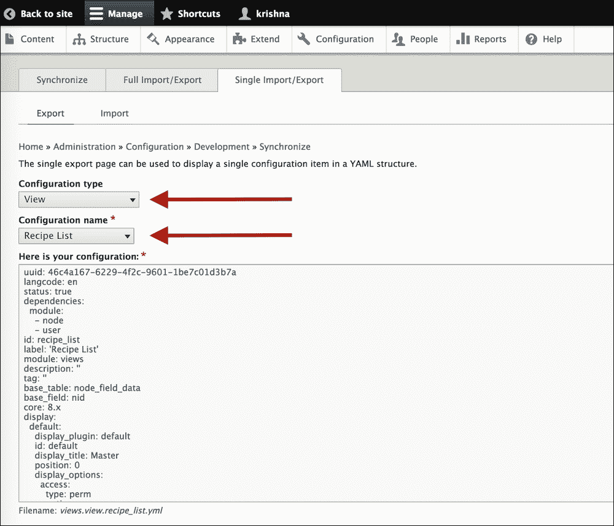

**在其他开发站点导入配置**

在您的本地机器上安装另一个 Drupal 网站，我们将将其用作目标网站以导入所有功能。现在从配置管理中导入内容类型 Recipe：

1.  请访问 `http://yourstagingsite.com/admin/config/development/configuration/single/import` 中的 **管理** | **配置** | **开发** | **同步** | **导入**。选择 **配置类型** 为 **内容类型**，粘贴 `node.type.recipe.yml` 中的 YAML，然后点击 **导入**。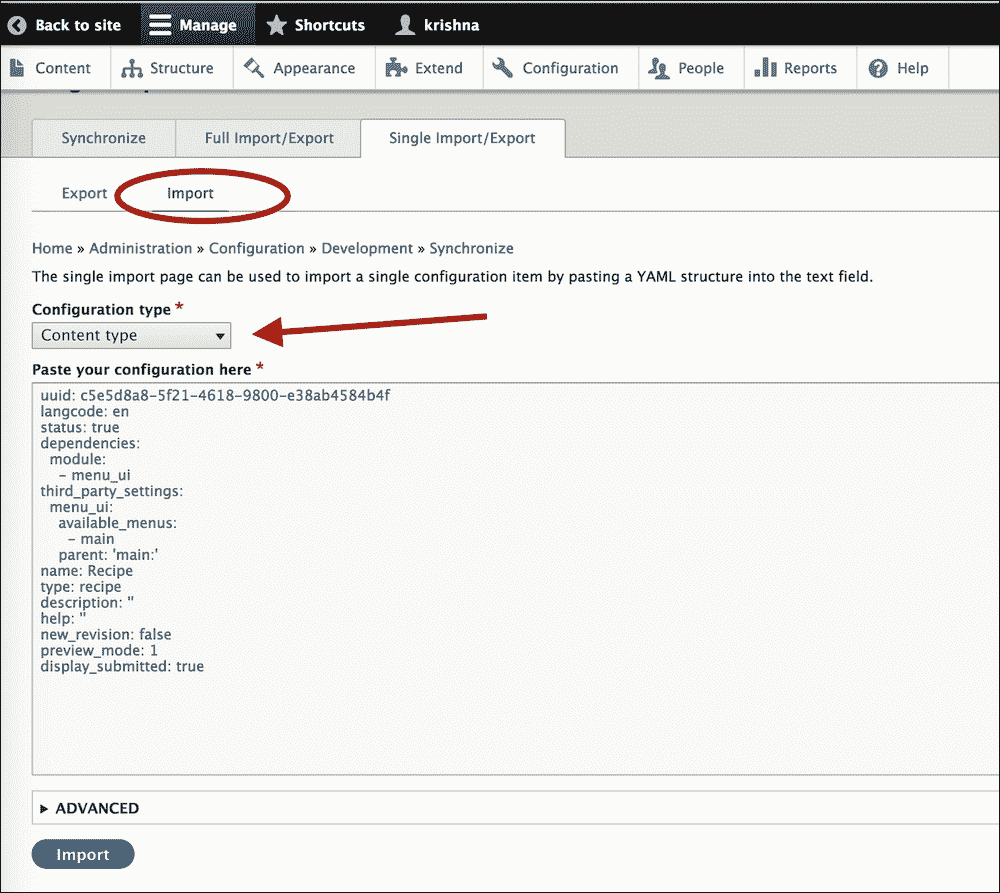

    您将获得一个确认页面，要求您创建一个新的内容类型。

    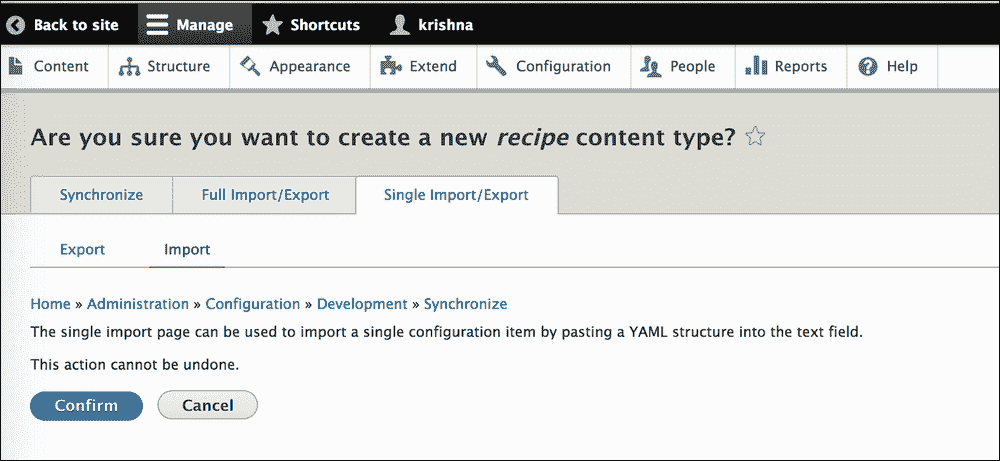

    成功导入后，您应该看到以下屏幕：

    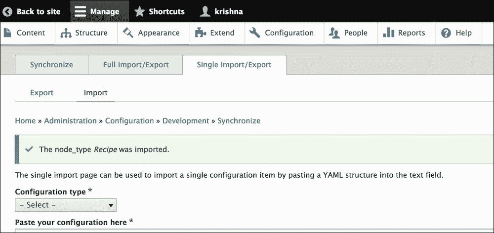

1.  以类似的方式，导入 Recipe 内容类型的字段。选择 **配置类型** 为 **字段**，粘贴 YAML 配置，然后点击 **导入**。

1.  使用我们从初始开发网站导出后保存的文件导入视图模式和表单模式。

在前面的步骤中，我们看到了 **单个导入/导出** 的工作方式。让我们探索 **完整导入/导出** 的其他选项：

1.  再次浏览到模块配置页面：`http://yourdrupal8site.com/admin/config/development/configuration`。这次我们将关注第三个选项卡 **完整导入/导出**。与之前一样，有两个选项，**导入** 和 **导出**。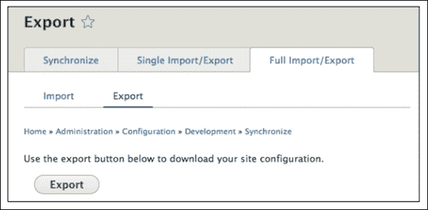

1.  通过点击选项导出您的网站配置。这将创建一个 `config.tar.gz` 文件，并提示您在您的机器上下载。

1.  下一步将是创建另一个 Drupal 8 网站（如果您还没有创建的话），我们将在此网站上导入 `config.tar.gz` 文件。

1.  浏览到 `http://yourstagingsite.com/admin/config/development/configuration/full/import`。选择 `config.tar.gz` 并按照此截图所示上传：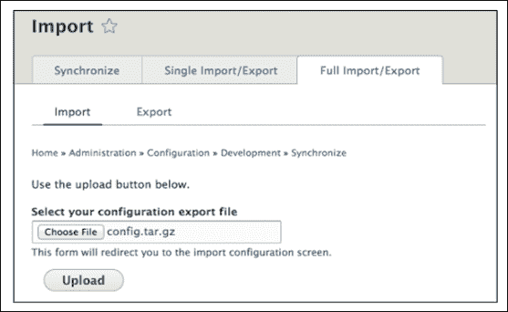

1.  现在我们已将网站配置导入到新网站，让我们再次查看第一个选项卡 **同步**。访问 `http://yourstagingsite.com/admin/config/development/configuration`。现在它应该显示如下：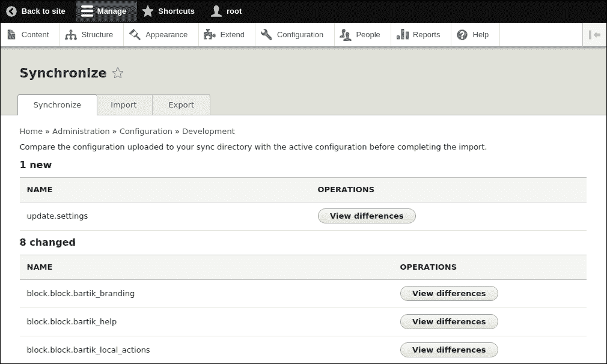

    此页面基本上显示所有配置更改。这有助于我们验证所有内容是否按预期导入。

    您可以点击 **查看差异**，这将打开一个弹出窗口，列出已导入/更改的各种配置。在确认一切如预期后，关闭弹出窗口并选择 **导入全部**。

    这将根据任务量花费几分钟时间。

    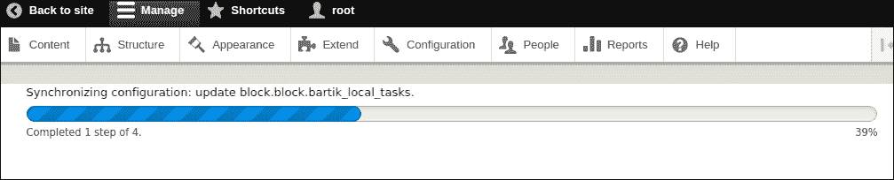

1.  一旦导入完成，您应该回到配置页面，第一个标签页，并显示成功消息。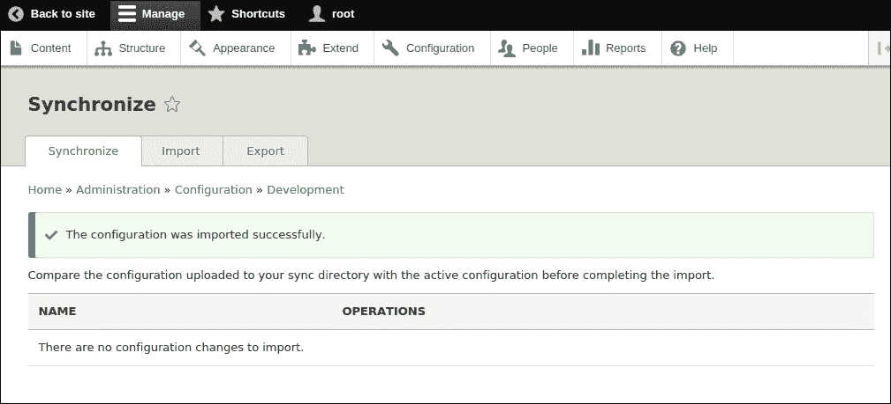

现在，只需验证新配置是否已实施。

## *刚才发生了什么？*

您已使用易于使用的配置管理模块用户界面，从您的开发站点将食谱内容类型导入到 Drupal 站点的全新实例中，而没有使用数据库导入或功能模块。

# Drupal 8 中的配置管理工作原理

作为开发者，让我们探索 Drupal 8 中配置管理是如何工作的。如本章前面所述，默认情况下，Drupal 将所有配置保存在数据库中。在安装过程中，它会在`/sites/default/files`中创建一个名为`config_HASH`的文件夹，其中`HASH`是一个由数字和字母组成的随机生成的长字符串。随机生成的 HASH 为网站提供了额外的保护。

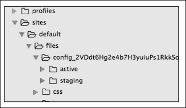

在`Config`文件夹中，有两个额外的文件夹：`active`和`staging`。默认情况下，它们都是空的，只包含`.htaccess`和`README.txt`。

通常，Drupal 8 使用数据库来存储活动配置，除非我们更改它。如果我们更改默认行为，`active`文件夹将包含默认 Drupal 安装的配置。

另一个目录`staging`用于存储从您的开发环境导入的 Drupal 站点的配置。

默认情况下，Drupal 和相关模块在安装期间将配置存储在活动存储中。这些配置是一组文件，用于维护运行您的 Drupal 站点所需的配置。这些配置以 YAML 格式存储。

如果您在您的机器上探索 Drupal 安装文件夹，您会发现每个模块和配置文件下都有一个`config`文件夹。这个文件夹包含两个或多个文件夹，`install`和`schema`。

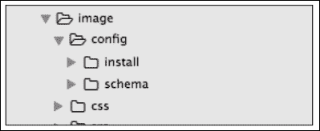

这两个文件夹都包含一组`.yml`文件，这些文件保存了模块或配置文件的相应配置。

在站点安装过程中，这些文件中存储的值将被复制到您的 Drupal 站点的活动配置中。如果我们使用默认的 Drupal 配置存储，这些值将被复制到配置表中，如果我们选择了基于文件的存储，这些配置值将被复制到活动目录中的相应目录。

# 更改活动配置存储

尽管不建议将默认的活动配置存储从数据库更改为文件，但您可以在`settings.php`文件中执行此更改。

### 小贴士

您只能在安装您的 Drupal 站点之前进行此更改。安装过程完成后，您将无法更改配置存储。

在您的编辑器中打开`settings.php`并搜索活动配置设置。现在您只需取消注释行`$settings['bootstrap_config_storage']`以启用基于文件的系统用于活动配置。除此之外，您还必须将`default.services.yml`复制到`services.yml`并启用基于文件的配置存储：

```php
services: 
   # Override configuration storage. 
  config.storage: 
    class: Drupal\Core\Config\CachedStorage
    arguments: ['@config.storage.active', '@cache.config']
  config.storage.active:
    # Use file storage for active configuration.
    alias: config.storage.file
```

这将使 Drupal 能够将默认的配置存储设置从数据库更改为基于文件的系统，并使用`config.storage.file`作为活动存储。

在更改配置存储设置后，按照相同的标准步骤安装您的 Drupal 8 站点。现在让我们看看`sites/default/files`下的`active`文件夹。

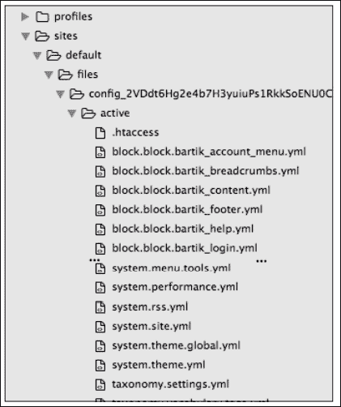

现在活动目录包含整个站点的站点配置。这些文件在安装过程中被复制到这里。现在，每次您更改站点配置时，这些文件也会进行更改。您可以使用版本控制系统来跟踪您的站点配置的更改。

但更改存储系统不会改变我们导出/导入站点配置的方式。

### 注意

在[`www.drupal.org/documentation/administer/config`](https://www.drupal.org/documentation/administer/config)了解更多关于配置管理的知识。

# 介绍 Devel 模块

因此，在前一节中，我们看到了创建一个基于视图的自定义块以在首页显示食谱列表是多么容易。您会立即注意到，只有一个食谱显示出来，因为我们到目前为止只创建了一个。

你可能还记得，当我们使用视图创建食谱列表块时，我们保留了每页项目数量的默认值 5。现在，能够测试这个设置而不需要手动创建四个更多的食谱项目会很好。进入 Devel 模块的[`drupal.org/project/devel`](http://drupal.org/project/devel)。

Devel 模块包含一些子模块，使 Drupal 开发更容易；而我们感兴趣的是帮助我们在开发目的下创建内容的`devel_generate`模块。

## 安装 Devel 模块

这应该是一个简单的步骤。只需下载模块并启用**扩展**页面。

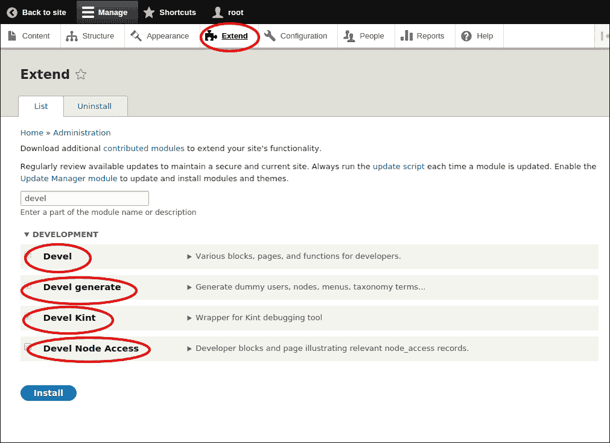

Devel 已安装并准备好进行一些魔法操作。

# 使用 devel_generate 模块生成虚拟内容的时间

现在，随着`devel_generate`模块的启用，我们将生成一些食谱内容，以便我们可以测试我们的食谱列表块中的项目数量：

1.  首先，点击管理工具栏中的**配置**链接，然后点击**开发**部分下的**生成内容**链接。

1.  在**生成内容**页面，取消选中除了**食谱**之外的所有**内容类型**复选框。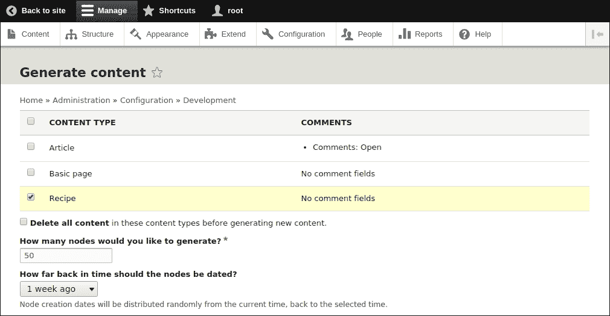

1.  对于所有其他设置，请保持默认值，并在页面底部点击**生成**按钮。

1.  现在，导航到主页，你会看到**食谱列表**块已经完全填充。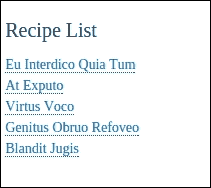

## *发生了什么事？*

尽管这是一个使用`devel_generate`模块的非常简单的例子，但在测试需要多个内容项的自定义代码时，能够生成内容可以节省大量时间。我们只是使用了`devel_generate`模块来生成一些基于我们自定义的食谱内容类型的虚拟内容，现在主页上的**食谱列表**块已经完全填充了五个食谱。

# 摘要

在本章中，我们学习了如何使用视图模块创建视图块，该模块现在是 Drupal 8 核心的一部分。我们还探索了为我们的 Drupal 站点提供更好版本控制的全新配置管理。现在我们可以分别设置开发、测试和生产环境，并逐步向站点添加新功能。我们探讨了如何使用 Devel 模块生成大量内容以供测试目的。

在下一章中，我们将学习 HTML5，这是 Dries 为 Drupal 8 概述的五大主要倡议之一。
