# 第五章：Drupal 8 的主题化

*在上一个章节中，我们学习了字段类型 API 以及如何开发自定义字段模块。现在让我们通过创建自定义主题并了解 Drupal 8 主题层的全新功能来探索前端。*

在本章中，我们将学习以下内容：

+   主题是什么以及如何创建子主题

+   Drupal 8 中主题的新特性是什么

+   移动优先和响应式这两个术语的含义以及为什么 D8 基础主题是这样构建的

+   如何安装 Drush

+   如何将资源添加到你的主题中

+   Twig 模板语言的介绍

+   理解贡献模块的好处以及何时使用它们

# 什么是主题？

**主题**调整或覆盖了你的 Drupal 网站的默认外观。它通过给我们改变标记（使用模板）、功能（使用 JavaScript）和外观（使用 CSS）的能力来实现这一点。主题化是用户查看工作之前的最后开发层。是点睛之笔！

默认情况下，Drupal 8 在核心中包含了许多主题。让我们来看看它们。

在 PhpStorm 中，前往你项目的根目录，然后导航到`core` | `themes`。在这个目录中，你可以找到五个主题：Bartik、Classy、Seven、Stable 和 Stark。它们是什么，为什么它们在这里？

让我们讨论一下我们默认可用的核心主题，因为它们各自有独特的用途：

+   Bartik 一直是 Drupal 7 和 Drupal 8 的默认主题。它有很好的文档记录，维护得很好，并包含一些有用的主题功能。

+   Seven 一直是 Drupal 7 和 8 的默认管理主题。它包含的样式应用于管理界面。

+   Stark 没有任何 CSS，旨在演示来自 Drupal 的默认 HTML 和 CSS。

+   如果没有定义，Stable 将作为后备基础主题存在。

+   Classy 是一个基础主题，旨在提供 Drupal 的标准类，如果你与 Drupal 7 合作过，你会很熟悉这些类。Bartik 是 Classy 的子主题。

Classy 的描述提到它是一个基础主题。这是什么意思？基础主题的存在是为了给你提供一个更快的起点，通过为你做一些基础工作来定制你网站的样式。它们提供了一个符合标准的起点，一些有用的文档，以及如何执行某些主题任务的良好参考，例如创建新的模板文件或添加新的 CSS。如果需要，可以将多个主题链接在一起以继承功能。

虽然这些主题在 Drupal 的多个版本中存在，但 Drupal 8 的主题系统有一些显著的变化。这包括语义 HTML5 标记，Twig 模板系统（我们将在本章后面讨论），默认包含的更多 JavaScript 库，以及 CSS 类从预处理移动到模板。访问[`www.drupal.org/node/2356951`](https://www.drupal.org/node/2356951)以获取更完整的列表。

你可以下载并用作基础主题的许多许多主题。访问 [`www.drupal.org/project/project_theme`](https://www.drupal.org/project/project_theme) 以查找列表。

重要的是要注意，核心中的主题不是为了调整而存在的。通过保持它们不变，我们可以在未来（如果需要）更新它们，而不会丢失任何工作。所以如果我们不能调整它们，我们如何定制我们网站的外观？

# 行动时间 - 创建子主题

我们需要做的是设置一个主题，以便继承我们从所选主题获得的好处，然后我们可以调整以满足我们的需求。这被称为**子主题**。让我们开始吧，使用 Bartik 作为父主题。

回到 PhpStorm，导航到项目的根目录，进入 `themes` 目录。目前这个目录除了一个 README 文件外是空的。我们将首先创建一个目录来放置我们的子主题。将自定义主题放在名为 `custom` 的文件夹中，将贡献的主题放在名为 `contrib` 的子文件夹中是一种良好的做法（关于贡献主题的更多内容将在后面介绍）。在新建的 `custom` 文件夹内，我们将开始创建我们的子主题。我们需要遵循一些命名规则：它必须以字母开头，并且只能使用小写字母数字和下划线。我们将命名为 recipes：

1.  创建一个名为 `recipes` 的目录。

1.  在其中，我们将定义我们的主题。如果你之前使用过 Drupal 7，你可能习惯于使用 `.info` 文件。在 Drupal 8 中，我们现在使用 `.info.yml` 文件来定义主题。除了其他事情之外，`.info.yml` 文件可以定义元数据、样式表和块区域。这是主题中唯一必需的文件。创建文件，命名为 `recipes.info.yml`，然后打开它。

1.  将以下内容复制到您的 `recipes.info.yml` 文件中并保存：

    ```php
    name: Recipes
    type: theme
    base theme: bartik
    description: A theme for styling up some delicious recipes!
    core: 8.x
    ```

1.  将名为 `logo.svg` 的文件从 `/core/themes/bartik` 复制到 `/themes/recipes`。

1.  现在回到我们的网站，点击快捷栏中的**外观**按钮。这将带您到 `/admin/appearance`。这是我们启用或禁用主题的地方。滚动到**未安装的主题**部分，找到我们的 Recipes 主题。点击**安装并设置为默认**按钮：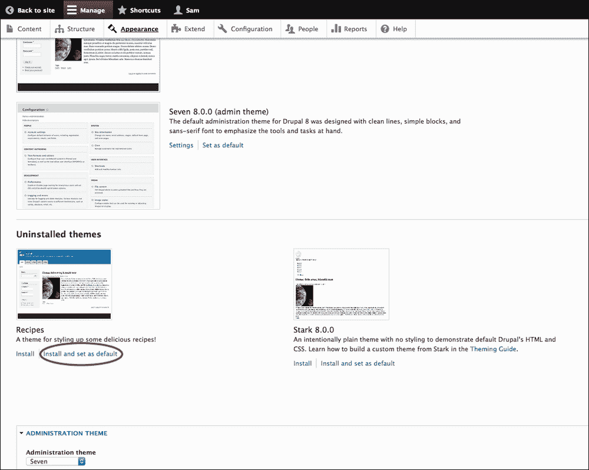

1.  页面刷新后，通知您 Recipes 是我们的默认主题，然后点击管理员菜单左上角的**返回网站**按钮。

## *发生了什么？*

我们创建了一个使用 Bartik 作为父主题的子主题。但是 Bartik 主题内部是什么？接下来，我们将查看 Bartik 的内部工作原理，以了解主题是如何组合在一起的。

## Bartik 概述

让我们看看 Bartik 目录内部有什么，并了解每个文件的作用（通过导航到 `core/themes/bartik` 来跟随）。该目录包括：

+   `bartik.info.yml`: 与我们的 `recipes.info.ml` 文件类似，此文件定义了主题所需的元数据，例如其名称、其父主题以及描述。此文件还描述了一些库、样式表和主题区域。您可以在[`www.drupal.org/documentation/themes/bartik`](https://www.drupal.org/documentation/themes/bartik)找到有关包含区域的信息以及更多关于主题定制的信息。

+   `bartik.libraries.yml`: 此文件定义了可以加载到主题中的 CSS 库（如果 Bartik 默认有 JavaScript，它也会定义）。有关更多信息和实践示例，请参阅 *添加资产到您的主题* 部分。

+   `bartik.breakpoints.yml`: 此文件包含 Breakpoints 模块的配置（[`www.drupal.org/project/breakpoints`](https://www.drupal.org/project/breakpoints)）。这允许主题管理断点，以便其他模块可以利用响应式断点功能。例如，Picture ([`www.drupal.org/project/picture`](https://www.drupal.org/project/picture)) 可以根据浏览器的大小提供调整大小的图片。有关该模块的更多信息，请参阅 *移动优先，响应式主题* 部分。

+   `bartik.theme`: 此文件包含一些支持主题化的有用函数。这些包括向标记中添加表示侧边栏或区域使用的类，向某些系统元素添加 clearfix 类，以及向表单元素添加类。

+   `logo.svg`: 这是默认在页眉中显示的库存标志。标志也可以在 `/appearance/settings` 中上传。

+   `screenshot.png`: 此图片显示在 `/admin/appearance` 页面上，在切换主题时可用于快速识别主题。

+   `color` 目录：此目录包含 Bartik 与 `Color` 模块的集成预览功能。此模块允许您在不更改 CSS 的情况下更改主题的颜色方案。

+   `css` 目录：此目录包含多个模块化 CSS 文件，包含主题所有组件的样式，如按钮、表单和页眉。然后根据其目的，这些文件要么组合到 `bartik.libraries.yml` 中的库中，要么直接导入到 `batik.info.yml` 中。

+   `config` 目录：此目录包含 Bartik 配置文件的架构。

+   `images` 目录：此目录包含主题使用的图片。

+   `templates` 目录：此目录包含主题用于结构化网站不同区域输出的模板。模板提供 HTML 结构和一些条件逻辑。模板针对网站的具体区域，范围从相对较小的独立部分如 `status-messages.html.twig`，到具有更广泛影响的部分，如 `page.html.twig`，它为所有页面提供结构。您将在本章的后面部分学到更多关于模板及其编写语言（Twig）的知识。

我们现在可以开始对 Bartik 默认外观进行一些更改，因此在下节中我们将添加一些自定义 CSS 来测试我们是否在业务中。在到达那里之前，让我们讨论响应式主题和移动优先原则。

# 移动优先，响应式主题

Drupal 8 主题默认既支持移动优先又支持响应式设计。这些术语的含义是什么，为什么主题会这样设置？

2000 年 4 月，约翰·奥尔斯普在 [`alistapart.com/`](http://alistapart.com/) 上发表了一篇名为 *《网络设计之道》* 的文章。这篇文章描述了一个新兴的网络设计问题——设计师和开发者希望尽可能严格地控制用户的体验，就像在印刷品中一样。他们希望网站在功能和布局方面尽可能相似，无论用户的设置如何。文章提倡一种新的方法：

|   | *"制作可适应的页面。制作无论读者选择或必须使用的浏览器、平台或屏幕都能访问的页面。" |   |
| --- | --- | --- |
|   | --*约翰·奥尔斯普* |

今天，这一概念得到了进一步扩展，因为我们还必须考虑不同的屏幕分辨率和互联网连接速度，尤其是对于移动设备。网站必须适应其用户的各种需求，并且最好提供卓越的体验，无论使用何种设备。

两种试图解决布局/屏幕尺寸问题的方法开始变得流行：自适应设计和响应式设计。自适应设计基于一系列静态布局，在检测到屏幕尺寸后向用户交付。响应式设计基于布局的流动性，能够灵活地适应设备。

如果用户调整了浏览器窗口大小，自适应网站会在静态布局之间跳转，而响应式网站则会平滑缩放。这两种方法都有其优点：自适应设计在布局控制方面提供了一种有时无法通过响应式设计实现的程度，但响应式设计在不同设备上运行得更加无缝，因此现在变得更加流行。

从历史上看，设计师和开发者首先关注桌面体验，有时使用在移动设备上效果不佳的布局和功能。这种情况偶尔还会发生，设计师将移动设计视为次要问题。有很好的理由要摒弃这种做法：在 2015-2016 年，全球大约有 45 亿手机用户。其中相当一部分将拥有互联网接入能力，当我们考虑到所有平板电脑、游戏机、手表、车载设备，甚至具有浏览网页功能的厨房电器时，仅仅关注桌面体验是短视的。

为了解决某些设备功能降低的问题，两种方法已经变得流行：优雅降级和渐进增强。结果是相同的；较老或功能较弱的设备提供较低的用户体验，但重要的是，一个可以工作的网站。然而，实现这一点的起点是相反的。优雅降级从在现代设备上提供高水平体验的起点开始，当较老设备无法提供支持时，功能会优雅地降级。渐进增强采取的方法是首先创建一个较低级别用户体验的网站，如果设备支持，则逐步增强功能。两种方法都有其优点，这两种实践的优秀例子可以在[`www.w3.org/wiki/Graceful_degradation_versus_progressive_enhancement`](https://www.w3.org/wiki/Graceful_degradation_versus_progressive_enhancement)找到。

这里的重要点是提供能够适应任何设备的网站，我们将讨论 Drupal 8 如何帮助您实现这一点。

移动优先是一种意味着在较小设备上智能布局内容的方法。小屏幕上的内容通常需要单列布局，因此是线性顺序，最重要的内容位于页面顶部。这并不总是如此，但这是一个有助于网络专业人士首先考虑较小设备最佳体验的心态，这通常也会导致大屏幕体验的改善。

Drupal 8 可以帮助您创建一个响应式、以移动优先的网站，无论是通过渐进增强还是优雅降级。首先，在您的浏览器中查看主页——尝试调整页面大小，看看元素是如何调整的。在移动端，我们的管理菜单使用图标而不是文本显示链接，以确保布局适应。我们网站的主要菜单位于一个可点击（或可触摸）的下拉菜单中。内容是单列布局，侧边栏位于主要内容区域下方。当浏览器窗口扩大时，管理菜单包含文本，主菜单从下拉菜单中消失，侧边栏位于主要内容区域的两侧。这是一个响应式、以移动优先行为的良好例子。这是通过 CSS 实现的。例如，查看**核心** | **主题** | **bartik** | **css** | **components** | **header.css**中的样式。您可以看到默认样式在文件顶部设置，然后文件进一步深入，出现媒体查询，为布局在更大尺寸下继续良好工作提供必要的更改。如果您不熟悉媒体查询，可以在[`developer.mozilla.org/en-US/docs/Web/CSS/Media_Queries/Using_media_queries`](https://developer.mozilla.org/en-US/docs/Web/CSS/Media_Queries/Using_media_queries)找到良好的文档。

通过提供响应式、移动优先样式的良好示例，Drupal 8 为你开始自己的工作提供了帮助。

Drupal 8 现在在核心中包含了更多的 JS 库，我们稍后会讨论。目前，只需知道 Modernizr 现在可用，这是一个检测浏览器功能并提供相应调整功能性和样式的强大工具。更多信息请见[`modernizr.com/`](https://modernizr.com/)。

Drupal 核心现在还附带了一个名为**Breakpoint**的模块。这允许你根据主题定义你想要进行功能更改的浏览器宽度。这些设置与任何你可能使用的 CSS 媒体查询无关。Breakpoint 设置有助于配置其他模块，例如 Responsive Images，另一个现在在核心中的模块。这两个模块的组合允许你在网站上切换图片。你可以为小屏幕设备提供低分辨率图片，然后为更大的屏幕交换高分辨率图片。这对网站性能有很大帮助，尤其是对于移动互联网用户来说非常重要。断点设置位于主题的根目录中。Bartik 的可以在`bartik.breakpoints.yml`中找到。

我们现在已经了解了“移动优先”和“响应式”这两个术语的含义，以及 Drupal 8 如何为你提供开始遵循这些实践所需的工具。

在我们开始使用主题之前，我们将安装一个名为**Drush**的工具，这是一个用于 Drupal 的命令行工具。它将帮助我们快速通过接下来的几个部分。

# 行动时间 - 安装 Drush

以下部分需要具有 Unix 或 Unix-like 功能的命令行。如果你是 Mac 或 Linux 用户，Bash 将预先安装，但如果你是 Windows 用户，你需要安装 Cygwin，可以从[`www.cygwin.com`](https://www.cygwin.com)下载。网上有许多教程可以帮助你安装和使用它。

你还需要了解一些使用终端编辑器编辑和保存文档的知识，例如`nano`或`vi`。

### 注意

如果你刚开始接触命令行，请注意，美元符号表示新的一行代码（也就是说，不要输入美元符号），并且每一行都需要按回车键结束。

我们将使用 Composer 安装 Drush。如果你有 Drupal 7 的先前经验并且已经安装了 Drush，请使用你首选的方法进行升级。

1.  首先，我们将全局安装 Composer。在你的终端中运行以下命令：

    ```php
    $ curl -sS https://getcomposer.org/installer | php
    $ mv composer.phar /usr/local/bin/composer

    ```

1.  现在，使用终端编辑器打开你的`.bash_profile`（如果你使用 ZSH，则为`.zshrc`），并添加以下内容：

    ```php
    $ export PATH="$HOME/.composer/vendor/bin:$PATH"

    ```

1.  重新加载文件（或重新加载你的终端）：

    ```php
    $ source ~/.bash_profile

    ```

1.  安装 Composer 后，我们可以快速轻松地安装 Drush：

    ```php
    $ composer global require drush/drush:dev-master

    ```

    ### 注意

    Composer 使得更新 Drush 或根据需要回滚到特定版本变得非常容易。它在网上有很好的文档。

Drush 有很多有用的功能。请访问[`www.drush.org/en/master/`](http://www.drush.org/en/master/)获取文档。

# 操作时间 – 将资产添加到您的主题

在 Drupal 7 中，CSS 和 JS 资产通过`.info`文件添加到主题中。在 Drupal 8 中，资产管理已被分离出来，我们有了资产库的概念。这些库包含我们想要附加的 CSS 和 JS。它们可以应用于全局或特定页面。让我们先创建一个全局样式资产库：

1.  在您的主题目录中，创建一个名为`recipes.libraries.yml`的文件。

1.  将以下内容复制到您的文件中并保存：

    ```php
    global-styling:
      version: 1.0
      css:
        theme:
          css/style.css: {}
    ```

    ### 注意

    在`.yml`文件中，缩进具有意义，因此请确保前面代码中的缩进与您的文件匹配。

1.  我们现在需要将我们的库附加到网站上。这可以通过两种方式完成。如果我们想将库附加到特定页面，我们可以在我们的模板中这样做。我们将在本章后面讨论这个问题。但是，当我们想将库附加到使用我们的主题的所有页面上时，我们可以将其添加到我们的 info 文件中。在`recipes.info.yml`中，在文件底部复制并保存以下内容：

    ```php
      - recipes/global-styling
    ```

    您的 info 文件现在应该看起来像这样：

    ```php
    name: Recipes
    type: theme
    base theme: bartik
    description: A theme for styling up some delicious recipes!
    core: 8.x
    libraries:
      - recipes/global-styling
    ```

1.  我们的库已经就位，并通过 info 文件全局应用，现在让我们创建一些 CSS 并测试它。在您的 recipes 目录中，创建一个名为`css`的新目录。

1.  在`css`目录中，创建一个名为`style.css`的文件。

1.  在`style.css`中，复制并保存以下内容：

    ```php
    .main-content h2 {
      font-size: 50px;
    }
    ```

1.  我们现在需要清除缓存。Drush 使这变得简单。打开您的终端并导航到网站的根目录。我们可以输入以下命令来重建所有缓存：

    ```php
    $ drush cr

    ```

    这将等同于访问`/admin/config/development/performance`并点击以下截图所示的“**清除所有缓存**”按钮：

    

1.  作为最后一步，让我们回到主页，看看我们的样式是否生效：

## *发生了什么？*

我们通过创建一个新的库并添加一个 CSS 文件来进行样式调整，以检查其是否工作。

好的，我们的标题变大了，这告诉我们我们的食谱主题正在工作。太棒了！

接下来，在开发过程中，通过禁用 Drupal 的一个默认性能功能，让我们尽可能简化调整我们的资产。

Drupal 使用一个名为聚合的站点性能工具。一个站点的性能可能会因为添加多个 CSS 或 JS 文件而受到影响，每个文件都需要向服务器发送一个 HTTP 请求。Drupal 为了避免这种情况，会将多个文件压缩成一个，同时进行丑化（uglification）和压缩（minification）。这意味着发出的 HTTP 请求更少，请求的文件尽可能小。然而，聚合文件不会在每次更改 CSS 或 JavaScript 时重新创建，因为它们被缓存了。这对性能很好，但在我们开发时并不那么有用。我们可以在每次更改时清除缓存，但更快的方法是暂时禁用聚合。

让我们回到`/admin/config/development/performance`并取消选择**聚合 CSS 文件**和**聚合 JavaScript 文件**选项。然后，点击**保存配置**按钮，如图所示：

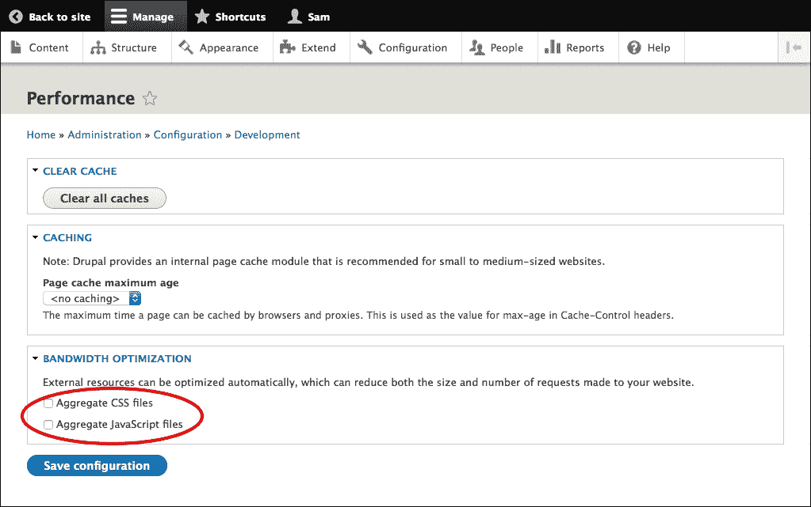

关闭聚合功能后，我们可以进行更改，并且刷新浏览器时它们将立即可见。但请记住，对于生产站点，务必启用聚合功能！

# 行动时间 - 在特定页面上调用资产

让我们更深入地探讨资产库依赖。我们将添加一小段依赖于 jQuery 的 JavaScript 代码；当用户点击食谱描述字段时，将触发一个警告框告诉他们这是美味的。我们将设置它只在我们的食谱完整视图模式下加载（即不在我们的主页列表中）。这也将是我们对 Twig 的第一个介绍。让我们开始：

1.  在 PhpStorm 中，在我们的`recipes`主题中，创建一个名为`js`的目录。

1.  在`js`目录下，创建一个名为`delicious.js`的文件。

1.  虽然这个 JS 文件的内容只是为了演示概念，但我们将使用良好的实践创建并记录它，这样你就可以将其作为你自己的工作的基础。我们将从定义文件、设置描述，然后创建我们的函数开始：

    ```php
    /**
    * @file
    *  A delicious notification alert
    */
    var delicious = (function ( ) {
    })();
    ```

1.  在函数之后，我们将告诉 jQuery 在页面加载事件上加载这个函数：

    ```php
    jQuery(delicious.onPageLoad);
    ```

1.  现在，我们将开始添加函数的内容。我们将在函数内部调用时创建一个将被返回的对象：

    ```php
    /**
    * Pubic object.
    * @type {{}}
    */
    var self = {};
    ```

1.  在我们的`self`对象之后，我们将创建我们的 jQuery 选择器，选择我们想要绑定`click`函数的内容：

    ```php
    /**
    * The delicious recipe content.
    *
    * @type {jQuery}
    */
    var $deliciousContent = jQuery('.delicious-content');
    ```

1.  接下来，我们将绑定内容点击事件并创建我们的警告函数，我们将使其可翻译：

    ```php
    /**
    * Bind the recipe content click event.
    */
    var bindRecipeContentEvent = function () {
       $deliciousContent.on('click', function () {
           deliciousAlert();
       });
    };

    /**
    * Alert the user that this is delicious.
    */
    var deliciousAlert = function () {
       window.alert(Drupal.t("This is delicious!"));
    };
    ```

1.  最后，我们将设置`self`对象的属性为一个匿名函数，该函数在页面加载时调用`bindRecipeContentEvent`函数。然后我们将返回该对象：

    ```php
    /**
    * Page load event.
    */
    self.onPageLoad = function () {
       bindRecipeContentEvent();
    };

    return self;
    ```

    `delicious.js`的内容现在应该是：

    ```php
    /**
    * @file
    *  A delicious notification alert
    */
    var delicious = (function ( ) {
       /**
        * Pubic object.
        * @type {{}}
        */
       var self = {};

       /**
        * The delicious recipe content.
        *
        * @type {jQuery}
        */
       var $deliciousContent = jQuery('.delicious-content');

       /**
        * Bind the recipe content click event.
        */
       var bindRecipeContentEvent = function () {
           $deliciousContent.on('click', function () {
               deliciousAlert();
           });
       };

       /**
        * Alert the user that this is delicious.
        */
       var deliciousAlert = function () {
           window.alert(Drupal.t("This is delicious!"));
       };

       /**
        * Page load event.
        */
       self.onPageLoad = function () {
           bindRecipeContentEvent();
       };

       return self;
    })();

    jQuery(delicious.onPageLoad);
    ```

1.  在`delicious.js`就位后，我们现在需要将其添加为资产库。在 PhpStorm 中打开`recipes.libraries.yml`。在全局样式资产库下方，我们将创建另一个，命名为`delicious`。这个库将包括我们刚刚创建的 JS 文件，并且还将指定我们对 jQuery 的依赖，其中有一个版本位于核心中供我们使用。（在 Drupal 8 中，核心包含许多用于依赖的库，包括 jQuery UI、Modernizr 和 Backbone 等。有关完整列表，请参阅`core` / `core.libraries.yml`）：

    ```php
    delicious:
     version: 1.0
     js:
       js/delicious.js: {}
     dependencies:
       - core/jquery
    ```

1.  最后一个步骤是将资产库添加到网站上。这次，我们不想它全局应用，因为我们只想在需要它们的特定页面上加载`delicious.js`和 jQuery。为此，我们将创建一个非常具体的 Twig 模板。现在我们先不深入细节，因为它们将在本章后面的部分进行讲解。在`recipes`目录下，创建一个名为`templates`的新目录，然后在其中创建一个名为`field`的目录。

1.  在`recipes` | `templates` | `field`内部，创建一个名为`field--node--field-description--recipe.html.twig`的文件。

1.  在该文件中，粘贴以下代码。如前所述，我们现在先不深入讲解 Twig，但请注意，我们正在为我们的 JS 应用一个名为`delicious-content`的类，并且我们使用`attach_library`函数附加资产库。这意味着资产库只会在包含特定食谱描述字段的页面上加载：

    ```php
    
    

    {{ attach_library('recipes/delicious') }}
    
       
           <div{{ attributes.addClass(classes, 'field__items') }}>
               
                   <div{{ item.attributes.addClass('field__item') }}>{{ item.content }}</div>
               
           </div>
       
           
               <div{{ attributes.addClass(classes, 'field__item') }}>{{ item.content }}</div>
           
       
    
       <div{{ attributes.addClass(classes) }}>
           <div{{ title_attributes.addClass(title_classes) }}>{{ label }}</div>
           
           <div class='field__items'>
               
               
                   <div{{ item.attributes.addClass('field__item') }}>{{ item.content }}</div>
               
               
           </div>
           
       </div>
    
    ```

1.  使用 Drush 清除我们的缓存：

    ```php
    $ drush cr

    ```

好的，让我们测试一下它是否工作！在你的浏览器的主页上，点击列表中的一项食谱的标题，进入完整的节点。当你点击描述部分中的任何文本时，我们的警告应该会出现：

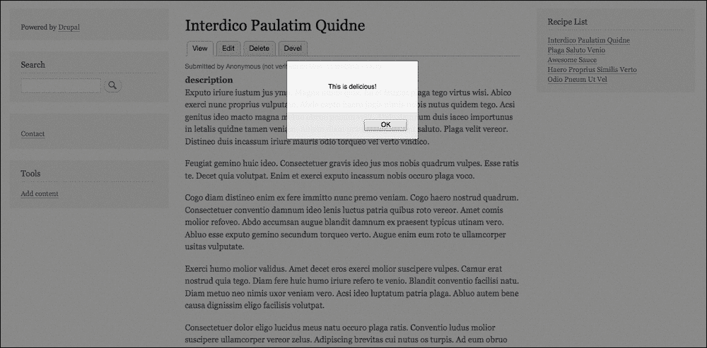

太棒了！现在，让我们测试一下`delicious.js`是否只在我们期望的页面上加载。如果我们查看当前页面的源代码并搜索它，我们显然会找到它：

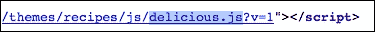

在主页上执行相同的搜索，将找不到任何结果。这正是我们希望的。

## *这究竟发生了什么？*

我们创建了一个简单的 JS 代码，将其作为一个带有 jQuery 依赖的资产库添加，并使用 Twig 模板确保资产库只会在包含正确字段的页面上加载。

# 模板化和 Twig 简介

我们在上一节中跳过了模板和 Twig，所以让我们更深入地讨论它们。

模板将成为你在主题化 Drupal 体验中的主食。它们是我们逻辑过滤数据并创建所需 HTML 结构的方式。Drupal 网站上标准页面的构建是由一组嵌套模板组成的。在嵌套结构的每个级别，都有不同的变量可供你使用，允许你渲染所需的内容。提到的任何模板都可以复制到你的主题中，无论是从 Drupal 核心还是父主题。所有模板的基版本都位于核心中，但你的父主题可能已经有一些模板可以复制，这些模板的结构可以帮助你达到目标的大部分，或者可能已经使用了一个特定命名的模板，你想覆盖它。

这里有一些我们主页上使用的模板示例：

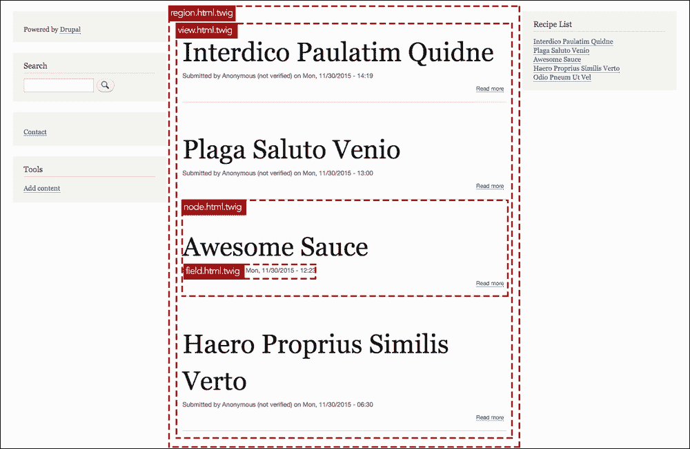

对于从 Drupal 7 迁移到 Drupal 8 的用户，这里有一个快速提示——你可能想知道主题函数——它们已经不再存在了。所有可主题化的输出都通过模板运行。

模板嵌套层次结构从定义 HTML 页面基本结构的模板开始，包括`<head>`和`<body>`标签。执行此操作的基模板是`html.html.twig`，位于`core/modules/system/templates/html.html.twig`。阅读这些基文件中提供的注释，了解模板的用途以及可用变量的列表是非常有价值的。

之后，是页面模板。这些模板的基模板是`page.html.twig`，位于`core/modules/system/templates/page.html.twig`。这是定义诸如`<header>`、`<main>`和`<footer>`等元素的地方。

很常见的是想要创建页面模板的特定实例；例如，一个具有与网站默认页面不同结构的自定义首页。我们通过使用主题钩子建议来实现这一点。

## 主题钩子建议

主题钩子建议是你可以创建的替代模板，用于覆盖默认模板文件。它们允许你通过使用特定的命名约定在你的主题中实现有针对性的覆盖。

当渲染一个元素时，Drupal 会查找模板的特定性——它会使用它能找到的最具体的模板。例如，当它渲染你的页面时，如果你在你的主题中创建了一个名为`page-front.html.twig`的模板，它就会使用这个模板来渲染你的首页。如果没有找到这样的文件，它会寻找下一个最具体的模板，并继续这样做，直到达到默认的`page.html.twig`。

在下一节中，我们将继续介绍 Twig 调试，你将学习如何找出你的网站当前正在使用的模板，以及发现一些模板命名建议以覆盖它们。

对于更多信息示例，请参考以下内容：

+   [`api.drupal.org/api/drupal/core%21lib%21Drupal%21Core%21Render%21theme.api.php/function/hook_theme_suggestions_HOOK/8`](https://api.drupal.org/api/drupal/core%21lib%21Drupal%21Core%21Render%21theme.api.php/function/hook_theme_suggestions_HOOK/8)

+   [`api.drupal.org/api/drupal/core%21lib%21Drupal%21Core%21Render%21theme.api.php/function/hook_theme_suggestions_alter/8`](https://api.drupal.org/api/drupal/core%21lib%21Drupal%21Core%21Render%21theme.api.php/function/hook_theme_suggestions_alter/8)

+   [`api.drupal.org/api/drupal/core%21lib%21Drupal%21Core%21Render%21theme.api.php/function/hook_theme_suggestions_HOOK_alter/8`](https://api.drupal.org/api/drupal/core%21lib%21Drupal%21Core%21Render%21theme.api.php/function/hook_theme_suggestions_HOOK_alter/8)

目前，让我们继续探讨模板及其层次结构。在`html.html.twig`模板定义了最高级别的`<html>`、`<head>`和`<body>`标签，以及`page.html.twig`定义了`<header>`、`<main>`和`<footer>`区域之后，我们嵌套模板树中的下一级是区域模板。这些模板能够渲染网站的各个区域（例如，Bartik 主题中的区域示例有`sidebar_first`、`sidebar_second`和`footer_first`，这些在它的`.info.yml`文件中定义）。基本区域模板`region.html.twig`位于`core/modules/system/templates/region.html.twig`。

在我们的区域中，可以渲染任意数量的节点、块或字段。有很多 Drupal 术语需要学习，如果你对此感到陌生，最好的开始方法是彻底阅读位于[`www.drupal.org/node/2186401`](https://www.drupal.org/node/2186401)的主题指南中的模板部分。在那里，你可以找到更多关于模板类型、它们的基本位置以及如何覆盖它们的信息。

当我们最初查看核心主题时，你可能已经注意到还有一个名为`engines`的其他目录。这个目录包含了 Twig 模板引擎，它取代了 Drupal 7 中的默认 PHPTemplate（尽管不推荐，但仍然可以使用 PHPTemplate）。如果你是 Drupal 的新手，模板引擎，有时也称为主题引擎，是结合我们的数据和主题模板的软件组件，并输出 HTML。

PHPTemplate 有什么问题？有很多：

+   模板拥有过多的权限。例如，如果主题开发者忘记对用户提交的文本进行清理，这会使网站面临安全漏洞（跨站脚本）。甚至有可能从模板文件中删除网站的数据库！想要随意删除`users`表吗？`<?php db_query('DROP TABLE {users}'); ?>`

+   它很复杂。有很多模板和更多的`theme()`函数。它为不同的数据结构提供了不同的语法。总的来说，学习曲线陡峭，这使得许多开发者望而却步。

+   标记语言并不美观，也不便于人类阅读。

+   它是针对 Drupal 特定的。

那为什么选择 Twig？

+   它更安全。PHP 函数，如`db_query`，根本不可用，并且默认启用自动转义，因此跨站脚本攻击不再是问题。

+   语法非常易于阅读和使用。`<?php print render($content); ?>`变为`{{ content }}`。更多语法示例将在后续部分中提供。

+   模板是可扩展的，多亏了它的`include`功能。

+   Twig 不是 Drupal 特定的，因此我们学习可转移的技能。

+   它有很好的文档记录。请参阅[`twig.sensiolabs.org/documentation`](http://twig.sensiolabs.org/documentation)。

转向 Twig 可能是 Drupal 8 中最激进的前端变化。无论你是 Drupal 新手还是从 Drupal 7 转移过来，你都需要学习一些新内容。但正如你将看到的，语法清晰且易于阅读，你投入学习它的努力很快就会在编写模板时得到回报！在我们使用它之前，让我们先看看它的功能和语法。如果你是 Drupal 新手，以下部分可能一开始会感到困惑，但当你开始使用 Twig 时，它将作为一个很好的参考点。

## 文件和函数名

+   PHPTemplate 文件名语法：`block--search-form-block.tpl.php`

+   Twig 文件名语法：`block--search-form-block.html.twig`

+   PHPTemplate 函数：`theme_node_links()`

+   Twig 文件：`node-links.html.twig`

## 括号语法

Twig 有三种括号类型：

+   `{# #}`：这用于注释。这些括号内的文本永远不会被输出。

+   `{{ }}`：这用于渲染。我们将在后续部分中看到一些示例。

+   ``：这用于控制结构，如`for`循环或条件语句。我们将在后续部分中看到一些示例。

## 渲染

变量的渲染是通过在打印括号语法中输入变量名来完成的：`{{ car }}`

让我们用一个 PHP 中的多维`car`数组示例：

```php
$car = array(
  'maxSpeed' => 200,
  'gearbox' => 'six-speed',
  'optionalUpgrades' => array(
    'engine' => array(
        'upgrade' => 'turbo-charged engine',
        'price' => 500,
    ),
    'windows' => array(
        'upgrade' => 'tinted windows',
        'price' => 150
    ),
  ),
);
```

要打印变量的属性，使用强大的“点”符号。`{{ car.maxSpeed }}`返回`200`。

这个点语法检查了`maxSpeed`的多种可能情况。以下是其处理过程：

+   检查`car`是否是一个数组，`maxSpeed`是否是一个有效的元素

+   如果不是，并且`foo`是一个对象，请检查`maxSpeed`是否是一个有效的属性

+   如果不是，并且`foo`是一个对象，请检查`maxSpeed`是否是一个有效的函数（即使`maxSpeed`是构造函数——请使用`__construct()`代替）

+   如果不是，并且`foo`是一个对象，请检查`getMaxSpeed`是否是一个有效的函数；

+   如果不是，并且`foo`是一个对象，请检查`isMaxSpeed`是否是一个有效的函数；

+   如果不是，则返回一个空值

它是多维的：`{{ car.optionalUpgrades.engine.upgrade }}`返回`turbo-charged engine`。

在撰写本文时，渲染数组中的 hashkeys 无法使用点语法进行定位。为此有一个活跃的问题：[`www.drupal.org/node/2160611`](https://www.drupal.org/node/2160611)，但到目前为止，需要使用语法`['#haskey']`，即`{{ item.property['#markup'] }}.`

## 过滤器

使用 Twig，我们可以在渲染之前通过一个过滤器推送一个变量：`{{ car.gearbox |capitalize }}` 返回 `Six-speed`。除了 Twig 的默认过滤器外，Drupal 还包括了一些额外的过滤器，例如翻译：`{{ item |t }}`。

在 [`twig.sensiolabs.org/doc/filters/index.html`](http://twig.sensiolabs.org/doc/filters/index.html) 查看默认 Twig 过滤器的完整列表。

你可以在 `core/lib/Drupal/Core/Template/TwigExtension.php` 中的 `getFilters()` 内找到 Drupal 的额外过滤器的列表。

## 控制结构

以下是不用的控制结构：

+   `if` 语句：

    ```php
    
      <div class="max-speed">This car will reach {{ car.maxSpeed }} kph!</div>
    
    ```

+   `for` 循环：

    ```php
    
      <li class="item-list upgrades"> {{ item.upgrade }} </li>
    
    ```

+   变量创建：

    ```php
    
    ```

+   数组创建：

    ```php
    
    ```

# Twig 调试

Twig 默认提供了一款出色的调试工具。在 Drupal 8 中，它得到了进一步的扩展。我们将在下一节中启用它并开始使用它，但现在，让我们看看它为我们提供了哪些能力。

## 标记中的 HTML 注释

Drupal 8 在这里扩展了默认的 Twig 调试工具，为我们提供了模板建议的信息，以及显示当前标记来自哪个模板：

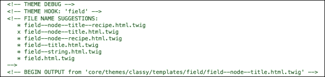

在前面的屏幕截图中，我们可以看到主页上食谱标题字段的注释。我们可以看到当前使用的模板来自 Classy 主题。如果我们需要创建更具体或更不具体的模板来满足我们的需求，我们还可以看到模板名称建议。

## 调试变量

要打印模板文件中所有可用的变量，我们可以使用 `dump()` 函数。

我们可以打印所有可用的变量：

```php
{{ dump() }}
```

Twig 模板中有几个全局变量：

+   `_context`：这包含传递给模板文件的所有变量，例如由 preprocess 准备的变量、来自 `theme()` 的变量或在模板内设置的变量

+   `{{ dump() }}`：这相当于 `{{ dump(_context) }}`

+   `{{ dump(\_context|keys) }}`：要打印可用的键

+   `_charset`：这引用了（当前）字符集

但请注意，`{{ dump() }}` 可能会导致白屏死机。该过程递归地移动并通过打印一个可能非常长的变量列表，这可能导致内存损失。如果是这种情况，你可以做如下操作：

```php
<ol>
    
        <li>{{ key }}</li>
    
</ol>
```

要打印特定变量的内容，例如 `$car`：

```php
{{ dump($car) }}
```

要打印出 `$car` 和 `$truck` 变量的内容：

```php
{{ dump($car, $truck) }}
```

## Kint

`{{ dump() }}` 是一个出色的工具，但如果它应用到的元素包含大量信息，输出可能难以解释。用于为网站创建虚拟内容的 Devel 模块包含一个名为 Kint 的子模块。此模块可以使用 Drush 启用：

```php
$drush en kint

```

启用后，所有 `{{ dump() }}` 命令都可以替换为 `{{ kint() }}`，这将提供更友好的输出。

# 行动时间 – Twig 实践

好的，让我们将上一节中学到的一些知识应用到实践中。将我们的食谱中的准备阶段与烹饪阶段分开将是个不错的选择。我们将通过将两种类型的字段分别放入单独的包装 `div` 标签中来实现这一点，然后应用一些样式来帮助我们区分它们：

1.  我们将通过启用 Twig 调试来找出当前正在使用的模板。在 PHPStorm 中，导航到 **sites** / **default**。如果你有一个名为 `services.yml` 的文件，打开它。如果没有，复制 `default.services.yml`，将其重命名为 `services.yml`，然后打开它。

1.  查找名为 `twig.config` 的部分。在这个部分中，你会找到一个当前设置为 debug: **false** 的选项。将该值更改为 **true** 并保存。就像 CSS 和 JS 的聚合一样，这将改善你的开发条件，但确保在网站上线前将其关闭。

1.  如果在步骤 3 中遇到了权限错误，你将需要在 **sites** / **default** 目录中重置权限。在终端中，导航到 sites 目录，然后输入以下命令：

    ```php
    $ chmod 755 default

    ```

1.  我们还将启用 Kint 来帮助我们进行调试：

    ```php
    $ drush en kint

    ```

    启用调试后，让我们查看之前提到的 HTML 输出。在你的浏览器中，点击进入一个完整的食谱页面（我将使用 Awesome Sauce 食谱，并在图片字段中添加了一张图片），然后使用你选择的检查器检查 HTML。（右键点击或 *cmd* + 点击一些内容，然后根据你的浏览器和工具，你会找到一个 **Inspect** 选项。）注意：如果你使用 Firebug，确保已开启注释：

    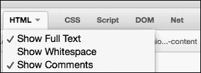

    在这个阶段，你将有很多信息可供参考，但很快你会发现你可以相对容易地找到你需要的信息。找到具有 `node--type-recipe` 类的 `<article>` 元素。这是所有元素都被包裹在一个包含 div 中的结构点，因此这是我们需要的分割点：

    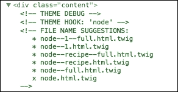

    元素的相关模板信息位于其上方。正如我们从绿色注释中可以看到的，当前使用的模板是 `core/themes/bartik/templates/node.html.twig`。我们还可以看到一些文件名建议，我们可以从中选择以获得额外的具体性。我们将使用 `node--recipe--full.html.twig` 建议的文件名，正如其名，它仅适用于完整视图模式。

1.  在 PHPStorm 中，在你的主题模板目录内，创建一个名为 content 的目录。请注意，目录名称不会影响 Drupal 查找模板的能力。它们的存在是为了帮助开发者保持工作有序。在 content 目录内，创建一个名为 `node--recipe--full.html.twig` 的文件。

1.  现在，我们将把 `core/themes/bartik/templates/node.html.twig` 的内容复制到我们新创建的 `node--recipe--full.html.twig` 中，这样我们就可以开始覆盖它。之后，你的文件内容应该如下所示（不包括长度注释）：

    ```php
    {#
    
    {{ attach_library('classy/node') }}
    <article{{ attributes.addClass(classes) }}>
       <header>
           {{ title_prefix }}
           
               <h2{{ title_attributes.addClass('node__title') }}>
                   <a href="{{ url }}" rel="bookmark">{{ label }}</a>
               </h2>
           
           {{ title_suffix }}
           
               <div class="node__meta">
                   {{ author_picture }}
                   <span{{ author_attributes }}>
             Submitted by {{ author_name }} on {{ date }}
           </span>
                   {{ metadata }}
               </div>
           
       </header>
       <div{{ content_attributes.addClass('node__content', 'clearfix') }}>
           {{ content }}
       </div>
    </article>
    ```

    在对文件进行任何操作之前，看看你是否能发现我们一直在讨论的一些内容：数组创建、条件逻辑和变量渲染。

1.  我们感兴趣的是 `{{ content }}` 变量，因为我们需要深入挖掘这个变量以找到我们想要拆分到两个单独的包装 `div` 标签中的不同字段。我们将使用 Kint 来调试其内容。将 `{{ content }}` 调整为 `{{ kint(content) }}`，然后使用以下命令清除缓存：

    ```php
    $ drush cr.

    ```

1.  当你重新加载页面时，内容将消失（因为它不再被渲染），取而代之的是调试信息。打开数组，然后关闭每个默认打开的内部数组项，这样你将剩下以下内容：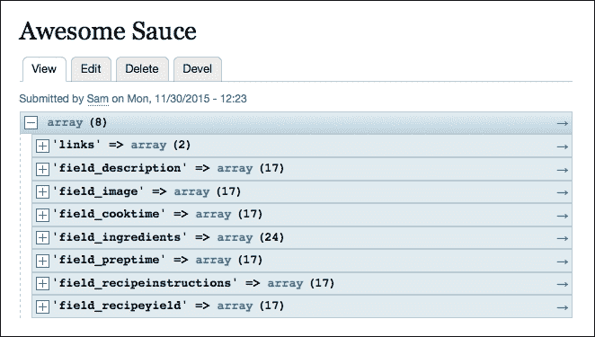

    我们可以看到内容数组包含八个项目，其中七个具有我们页面上不同字段的名称作为键。我们将使用这些来打印我们的自定义输出。

1.  有些字段既不是准备也不是烹饪相关的，我们希望这些字段保持正常渲染。例如描述和图片。但我们想排除其他所有内容，以便单独打印。我们将使用一个名为 `without` 的 Drupal Twig 过滤器，它可以在不渲染特定内部项目的情况下渲染一个元素。回到模板中，将 `{{ kint(content) }}` 替换为 `{{ content|without('field_cooktime', 'field_preptime', 'field_ingredients', 'field_recipeinstructions') }}`。现在我们的页面将只包括我们仍然希望以正常方式渲染的项目：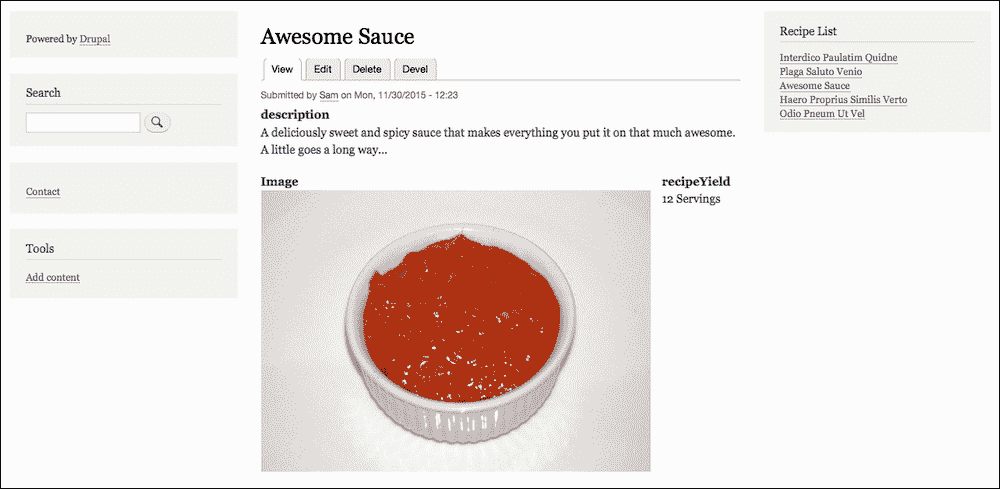

1.  现在我们将在单独的 `div` 标签中渲染字段。直接在最后一个 Twig 语句下面，粘贴以下内容：

    ```php
    <div class="preparation recipe-phase">
       {{ content.field_preptime }}
       {{ content.field_ingredients }}
    </div>
    <div class="cooking recipe-phase">
       {{ content.field_cooktime }}
       {{ content.field_recipeinstructions }}
    </div>
    ```

1.  现在，我们将回到主题的 `style.css` 文件，在 `css` 目录中添加一些样式。在现有样式下面粘贴并保存以下内容：

    ```php
    /* Override default image float on the recipe node */
    .node--type-recipe .field--name-field-image {
       float: none;
    }

    .recipe-phase {
       padding: 20px;
       margin-bottom: 20px;
    }

    .preparation {
       background-color: #e7e7e7;
    }

    .cooking {
       background-color: #b0fbad;
    }
    ```

    让我们再次查看页面：

    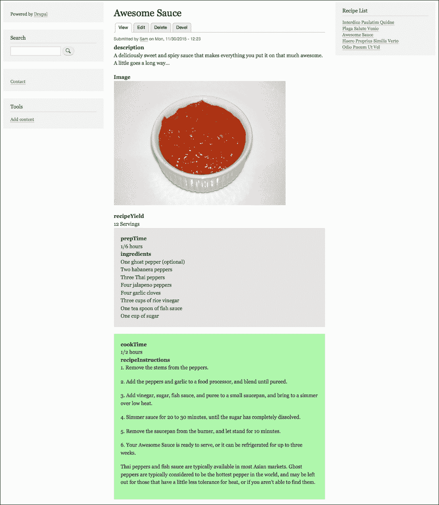

## *发生了什么？*

我们使用 Kint 和 Twig 调试来确定所需的模板以及我们可用的变量。我们使用一个特定的 Drupal Twig 过滤器来渲染内容并排除一些项目，然后在自定义的结构中单独渲染这些项目。

我们使用这种方法得到了我们想要的结果，但我们需要将数组拆分。对于具有更多字段的大型内容类型，这将变得繁琐。还有一种方法，需要使用贡献模块。让我们看看那个方法。

# 行动时间 – 理解贡献模块的好处

让我们尝试实现之前章节中得到的相同结果，但这次是通过使用名为`field_group`的贡献模块：

1.  在**recipes** / **templates** / **content**中删除`node--recipe--full.html.twig`（或者如果你希望保留工作副本，可以将文件移出项目外）并清除你的缓存。

1.  在命令行中，导航到你的 Drupal 项目内部任何位置，并输入以下命令：

    ```php
    $ drush en field_group -y

    ```

    如果你已经下载了`field_group`模块，此命令将启用该模块。如果没有，它将为你下载最新的稳定版本并启用它。

1.  现在回到浏览器，导航到`/admin/structure/types/manage/recipe/display`，这是食谱内容类型的显示设置所在位置。你会在页面底部看到一个新功能：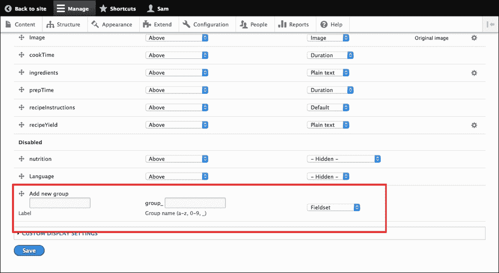

1.  在两个文本输入中输入`preparation`，从下拉菜单中选择**Html 元素**，然后点击**保存**。

1.  页面重新加载后，你会看到准备组现在位于**禁用**标签上方。在准备组项的右侧有一个齿轮图标。点击它。

1.  组的设置现在将打开。除了**额外 CSS 类**文本输入外，其他所有内容保持默认，你可以在这里输入`preparation recipe-phase`，然后点击**更新**按钮。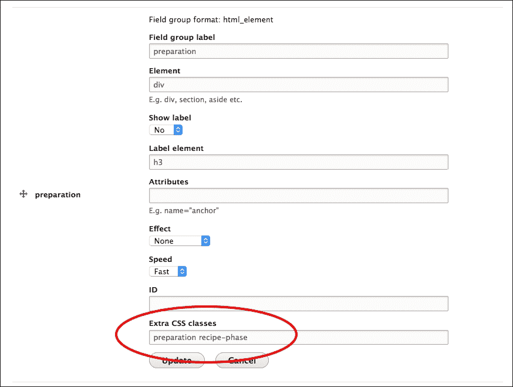

1.  再次执行这些步骤，这次将`preparation`替换为`cooking`。完成后，你应该有两个组被启用。

1.  现在进行一些拖放操作。将组字段拖到**recipeYield**字段下方，然后抓住**prepTime**字段并将其拖到准备组项上方。你会看到图标自动向右移动，好像缩进了。将字段放在那里，然后将**ingredients**字段拖到准备项区域，并在**prepTime**下方放下。接着将**cookTime**和**recipeInstructions**拖到烹饪组区域。完成后，你的项目应该看起来像这样：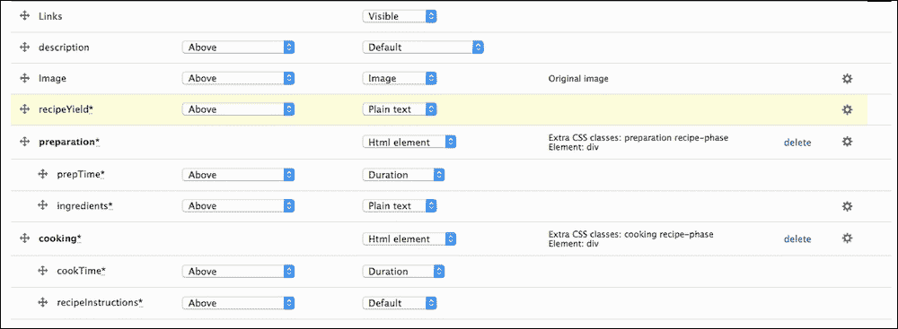

1.  点击**保存**按钮。页面刷新后，你可以看到一个如下通知：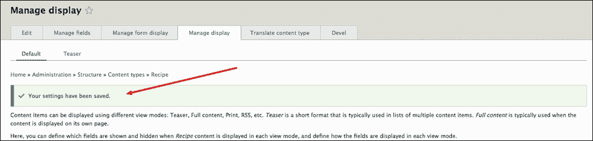

1.  点击管理菜单左上角的**返回网站**按钮。我们已经实现了相同的结果：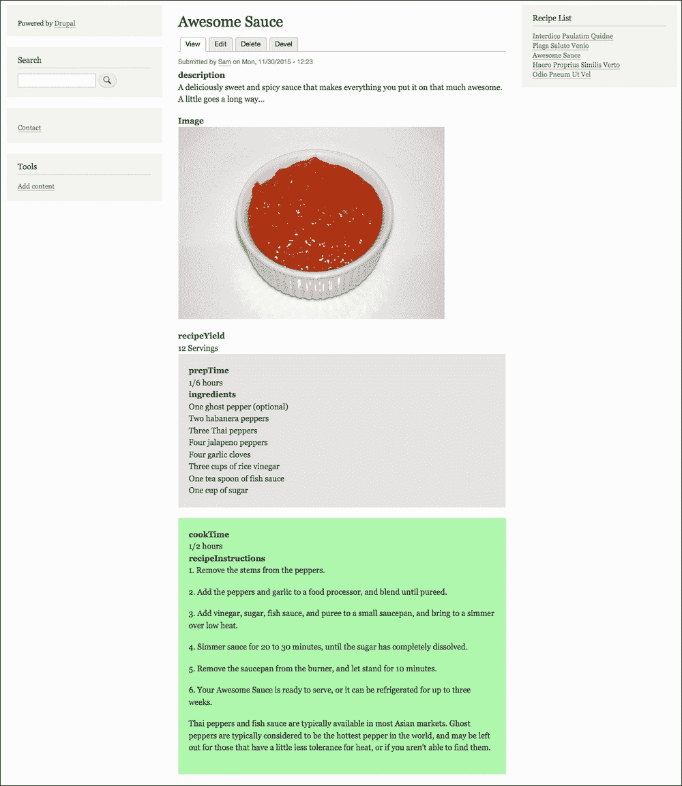

## *发生了什么？*

我们移除了使用 Twig 模板所做的模板，然后使用`field_group`模块复制了该功能。

我们能够如此迅速和轻松地实现对标记的控制，这确实很 neat。更重要的是，这种方法不仅适用于网站构建者，也适用于开发者，如果添加更多字段，它将继续是更新内容类型的一种更快捷的方法。在这种情况下，我们应该如何决定是否在我们的网站上使用贡献模块呢？

# 贡献模块是什么？

贡献模块，或称为 contrib 模块，是 Drupal 功能的组成部分，由社区贡献并由开发者社区维护，有时由热衷于支持开源的公司赞助。您可以在 Drupal 的模块部分找到所有 contrib 模块，网址为 [`www.drupal.org/project/project_module`](https://www.drupal.org/project/project_module) 。`field_group` 模块可以在 [`www.drupal.org/project/field_group`](https://www.drupal.org/project/field_group) 找到。

## 我如何知道一个模块是否安全使用？

如果没有事先的知识，随机选择和选择模块使用确实存在风险，但 Drupal ([`www.drupal.org/`](https://www.drupal.org/)) 上关于模块的大量信息可以在使用前为您提供信息。这些包括：

+   维护项目的开发者数量。代码被查看得越多，它就越有可能质量好。

+   提交的数量以及提交的时间。活跃的维护意味着模块更有可能受到任何最近的安全问题的保护。

+   问题与错误队列。这更多关乎对问题的响应程度，而不仅仅是错误或问题的数量。

+   依赖于它的模块数量。如果一个模块很出色，越来越多的开发者会对其作为依赖项感到自信。许多核心模块就是这样开始的。

+   模块是否具有良好的文档？

+   下载量和报告的安装量。同样，查看得越多，越好，用户越多，越有可能在早期发现错误。

所有这些都可以在模块的 Drupal ([`www.drupal.org/`](https://www.drupal.org/)) 页面上探索。

## 使用贡献模块还是自定义代码更好？

对于这个问题，没有绝对的答案。贡献模块的好处包括以下方面：

+   安全性。如果许多其他开发者正在使用它，这可以给您在代码质量和安全修复方面的信心。

+   您不需要维护（除非您选择将其贡献回去）。

+   易用性。就像 `field_group` 的例子一样，它允许那些开发经验较少的人配置一个功能强大的网站。

+   是一个好的学习机会。深入模块，探索它是如何编码的。

+   通常更具可扩展性。

自定义代码的好处包括：

+   对独特问题的简洁、非臃肿的解决方案。

+   网站性能。具有大量额外功能的大型 contrib 模块会对网站性能产生负面影响，而简洁、编写良好的代码只会解决单个问题。

+   它为你提供了一个提高和测试你的开发技能的机会。

# 摘要

在本章中，我们探讨了 Drupal 8 的主题化，从什么是主题以及如何创建一个主题，到加载和使用 CSS 和 JS 资产，以及模板化，以及何时以及为什么使用贡献模块。

在下一章中，我们将探索 CKEditor，并介绍 Drupal 8 的 Block API。
