# 第八章.味道如何？ – 获取反馈

*本章将逐步介绍在联系模块中添加 HTML 表单元素占位符的代码。我们还将回顾上一章中安装的 Colorbox 模块。我们将对代码进行一些增强（一个高级的实战示例），并讲解使用补丁的过程。我们还将使用评论类型和视图配置实现带有食谱内容类型的评论和点赞系统。*

# Drupal 联系表单简介

Drupal 核心包含一个非常简单的联系表单，默认启用。核心联系表单为我们网站提供了一个良好的起点，可以引入一些交互式功能。

# 操作时间 – 启用和配置核心联系表单

我们将配置核心联系表单，以便我们的网站匿名访客能够提供关于网站的反馈：

1.  在 Drupal 8 中，联系模块默认启用。我们只需设置**匿名**和**认证**角色的权限即可使用反馈表单。

1.  现在，在您最喜欢的浏览器中打开 d8dev 网站，并点击**管理**工具栏中的**扩展**链接。滚动到**核心**组下的名为**联系**的模块；您会注意到该模块已启用。然后，点击**权限**链接：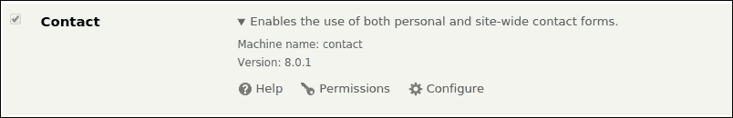

1.  在**权限**页面上，您会注意到**使用全局联系表单**权限默认为**管理员**、**匿名**和**认证**角色启用。因此，匿名用户可以使用联系表单。

1.  接下来，注销并导航到 `http://localhost/contact/feedback`。您将看到一个简单的联系表单，如下面的截图所示：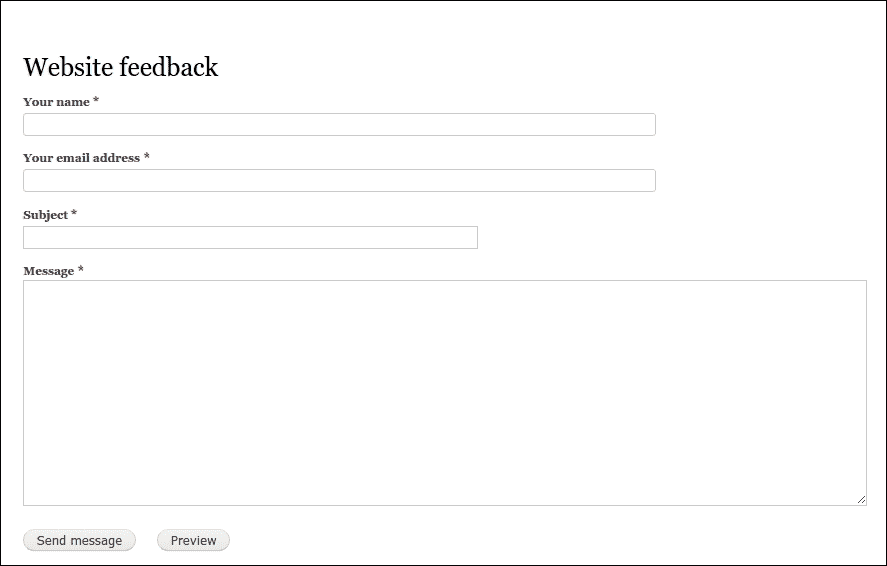

## *刚才发生了什么？*

我们启用了一个简单的联系表单，以便从我们的 d8dev 网站访客那里获取反馈。

# 向我们的联系表单添加占位文本

核心联系模块为我们网站提供了一个不错的默认联系表单。但如果我们想对其进行一些定制呢？比如说，我们想添加一些占位文本来解释用户为什么应该填写表单。正如我们在前面的章节中看到的，通常有多种方式使用 Drupal 完成此类定制。

## 使用配置向联系表单添加占位文本

我们将配置核心联系表单以启用占位符，向用户解释他们为什么应该填写表单。

# 操作时间 – 向我们的网站联系表单添加占位文本

核心联系模块为我们网站提供了一个不错的默认联系表单。核心还提供了可配置的字段占位符。因此，我们为表单字段添加占位符，以显示占位符并解释用户为什么应该填写表单：

1.  在您最喜欢的浏览器中打开 d8dev 网站，并点击 **管理** 工具栏中的 **结构** 链接。在下一页，您可以看到列出的 **网站反馈**。

1.  现在，点击 **操作** 列中的 **管理表单显示**，针对 **网站反馈** 表单：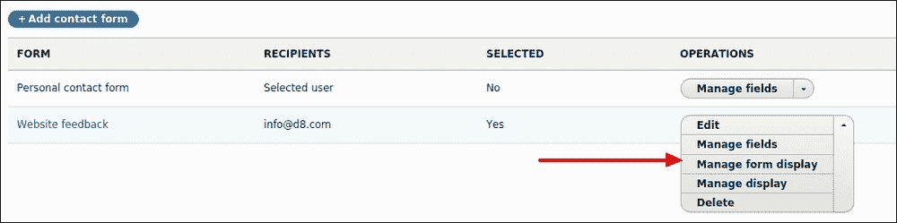

1.  在下一屏，您可以看到**主题**和**消息**字段是可以配置的：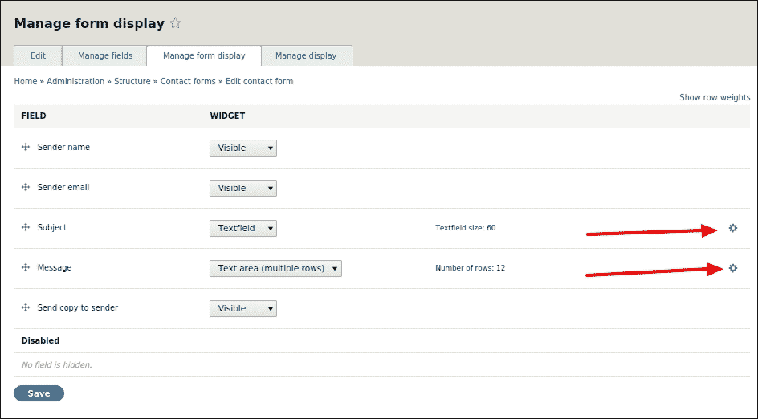

1.  现在，点击 **主题** 字段的设置图标，填写 **占位符** 为 `请在此处输入您的主题！`，然后点击 **更新** 按钮：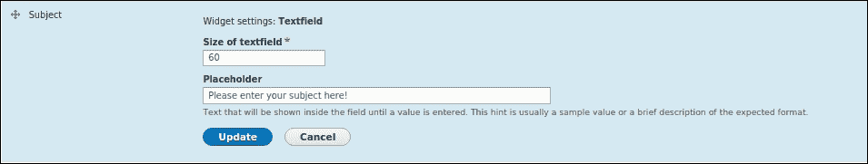

1.  接下来，点击 **消息** 字段的设置图标，填写 **占位符** 为 `请在此处输入您的消息！`，将 **行数** 值从 `12` 更改为 `8`，然后点击 **更新** 按钮：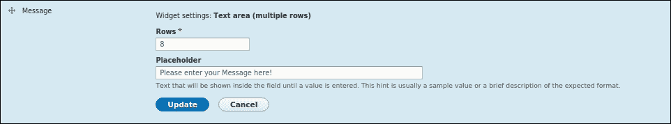

1.  接下来，以**匿名**用户身份注销并导航到 `http://localhost/contact/feedback`。您将看到一个简单的联系表单，如下面的截图所示：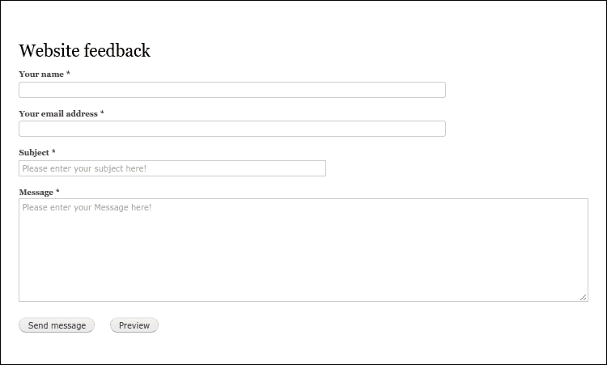

### 注意

您还可以尝试 Contact Storage 模块，该模块为联系消息提供存储；这些是 Drupal 8 中的完整实体。此模块提供消息存储、编辑消息和删除消息等功能。有关更多详细信息，请参阅 [`www.drupal.org/project/contact_storage`](https://www.drupal.org/project/contact_storage)。

## *发生了什么？*

我们在联系表单的 **管理表单显示** 页面上配置了 **主题** 和 **消息** 字段的 **占位符** 文本。

# 使用自定义代码向姓名和电子邮件字段添加占位文本

Drupal 为**主题**和**消息**字段提供了可配置的占位符，但不是为**姓名**和**电子邮件**字段，因此我们使用自定义代码在我们的 d8dev 模块中为它们添加占位符。

# 操作时间 – 向姓名和电子邮件字段添加占位文本

我们将利用核心 `hook_form_alter` 钩子来修改核心联系表单，以显示姓名和电子邮件字段的占位符。我们将添加以下代码到 `d8dev.module` 文件中：

1.  在 PhpStorm 中，打开位于 `/modules` 下的自定义模块中的 `d8dev.module` 文件。

1.  接下来，切换到已加载核心联系表单的浏览器，并找到表单元素的 `form_id`。在页面上右键单击并选择 **查看源代码**。在下一页，您可以看到 HTML 代码。现在搜索 `form_id`，您将找到所需的表单 ID 为 `contact_message_feedback_form`。

1.  另一种方法是使用 `drupal_set_message()` 核心函数来查找 `form_id`。为此，我们需要在 `d8dev.module` 文件顶部添加以下代码：

    ```php
    use Drupal\Core\Form\FormStateInterface;

    /**
     * Implements hook_form_alter().
     */
    function d8dev_form_alter(&$form, FormStateInterface $form_state, $form_id) {
      drupal_set_message($form_id);
    }
    ```

1.  现在，以登录用户重新加载`http://localhost/contact/feedback`页面，你会看到一个显示`form_id`的消息，如下所示：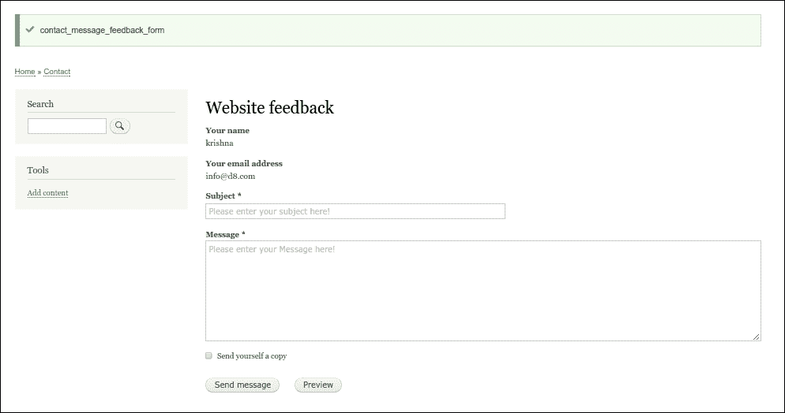

1.  接下来，我们需要向`name`和`mail`表单元素添加一个占位符 HTML 属性，如下所示：

    ```php
      $form['name']['#attributes'] = array('placeholder' => array('Please enter your first and last name.'));
      $form['mail']['#attributes'] = array('placeholder' => array('Please enter your e-mail address.'));
    ```

1.  只为联系人表单添加前面的占位符代码。现在我们的`d8dev_form_alter()`函数看起来是这样的：

    ```php
    /**
     * Implements hook_form_alter().
     */
    function d8dev_form_alter(&$form, FormStateInterface $form_state, $form_id) {
      if ($form_id == 'contact_message_feedback_form') {
        $form['name']['#attributes'] = array('placeholder' => array('Please enter your first and last name.'));
        $form['mail']['#attributes'] = array('placeholder' => array('Please enter your e-mail address.'));
      }
    }
    ```

1.  接下来，通过访问**管理** | **配置** | **开发** | **性能**来清除缓存。现在以**匿名**用户重新加载联系人页面。然后你会看到以下表单：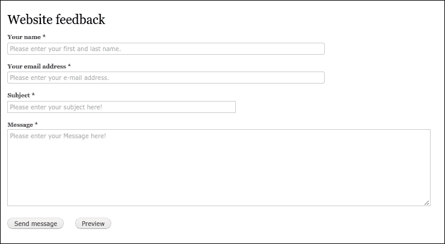

## *发生了什么？*

我们使用了`hook_form_alter`钩子向核心联系人表单的**名称**和**电子邮件**字段添加占位文本。

# 是时候再做一个菜谱了！

就算你开始饿了，我们也会添加一个新的菜谱。现在就加进来，这样我们就可以在完成这个具有挑战性的章节的剩余部分时享受一些美味的食物！这一章的菜谱是印度风蒜香鸡。享受吧！

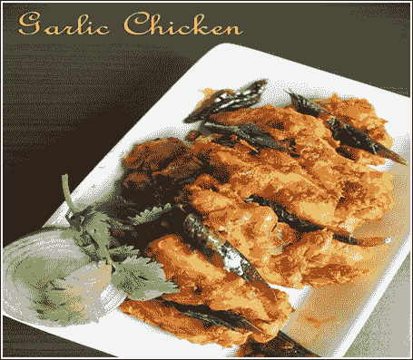

+   **名称**：印度风蒜香鸡

+   **描述**：印度风蒜香鸡菜谱，学习如何在 20 分钟内制作蒜香鸡，包括餐厅风格和家庭风格的开胃菜、咖喱、比拉尼等。这道蒜香鸡可以在 20 分钟内准备完成（不包括腌制时间）。它是一个完美的开胃菜或配菜，可以让你的餐点更加异国风味。

+   **recipeYield**：四份

+   **prepTime**：20 分钟

+   **cookTime**：20 分钟

+   **配料**：

    +   300 克鸡肉条或去骨块

    +   4 汤匙酸奶/达希/凝乳（不要使用酸酸奶）

    +   盐——非常少

    +   适量胡椒

    +   两个汤匙油

    +   一枝咖喱叶

    +   ¼茶匙孜然

    +   一个切碎的洋葱

    +   五个红辣椒或¾茶匙红辣椒粉

    +   五瓣捣碎的大蒜

    +   ¾汤匙醋

    +   ¼茶匙糖（可选）

    +   根据口味加盐

    +   水——15 至 30 毫升（越少越好）以制作糊状物

    +   几片香菜叶

    +   洋葱楔或圈

    +   柠檬

+   **说明**：

    1.  将酸奶、盐和胡椒与半杯至¾杯水混合。充分搅拌后放置一旁。

    1.  洗净鸡肉，将其浸泡在这准备好的黄油牛奶中，放入冰箱冷藏 2 小时至过夜。

    1.  建议至少浸泡 6 小时以获得柔软的鸡肉。

    1.  将用于辣椒蒜香酱的配料搅拌并制成糊状。

    1.  倒掉酸奶油，加入准备好的酱汁。

    1.  搅拌均匀，静置 5 分钟。如果你想稍后准备，可以将其放回冰箱。

    1.  用油加热平底锅。加入孜然和咖喱叶。炒至孜然开始噼啪作响。

    1.  加入洋葱，炒至金黄色。

    1.  将鸡肉加入，用大火煎 2 到 3 分钟。当你看到鸡肉变白时，盖上盖子，降低火力，煮至鸡肉变嫩。如果你使用的是条状鸡肉，这几乎只需要 5 分钟。

    1.  取下盖子，煎至水分蒸发，酱汁开始粘附在鸡肉上。煎得越久，酱汁越香，越美味，但鸡肉往往会失去其嫩滑。

    1.  所以，在你喜欢的时候，从炎热中解脱出来。小心不要烧焦；大蒜烧得更快。

# Colorbox 文件增强

在上一章中，我们将 Colorbox 模块添加到我们的 d8dev 网站中，用于显示叠加中的图片。目前，Colorbox 模块将菜谱的标题作为所有在 Colorbox 叠加中显示的菜谱图片的标题，如图下所示。但是，它与标题和 alt 值等图片属性不兼容。

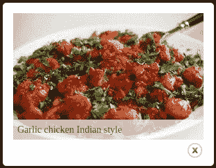

因此，我们在 第七章，*向我们的网站添加媒体*中，在 Colorbox 问题队列中提出了一个问题 ([`www.drupal.org/node/264516`](https://www.drupal.org/node/264516)0)。Colorbox 维护者 `@frjo` 如下回复：

> *"文件实体模块是一个贡献模块，所以你真正需要的是 Colorbox 支持它。更改标题以便清晰。我从未使用过该模块，但如果有人提交补丁，我会查看。"*

在我们开始创建补丁之前，我们需要清楚地了解为什么在 `title` 或 `alt` 属性的情况下没有显示。我查看了 Colorbox 模块，并对所有渲染图片字段属性的预处理函数进行了调试。我发现 `template_preprocess_colorbox_formatter()` 函数是正确加载图片字段所有属性的函数。但是，当文件实体模块启用时，它不会加载，因为文件已经变成了实体，Colorbox 不知道如何从图片文件中渲染。因此，我们将为这个问题创建一个补丁，并在上一章中创建的 Colorbox 问题中提交它。

# 行动时间 - 增强 Colorbox 模块以包含图片标题和 alt 标题

那么，我们应该从哪里开始实施这个建议的方法并完成相关的功能请求呢？我们将从调试 `template_preprocess_colorbox_formatter()` 函数中可用的处理过的 `$variable` 开始，以便我们可以修改或添加到图片字段中所需属性：

1.  在 PhpStorm 中，打开 `/modules` 文件夹中的贡献模块的 `colorbox.inc` 文件。

1.  在我们开始修改或添加代码之前，让我们先了解 `colorbox.inc` 文件中的 `template_preprocess_colorbox_formatter()` 函数中的代码。首先，我们需要知道标题设置在哪里保存。有一个 `$settings` 变量已经被声明；在 `$settings` 变量旁边添加以下代码（第 35 行）：

    ```php
    var_dump($settings); die;
    ```

1.  从**性能**页面清除缓存并重新加载菜谱内容；你将看到以下内容：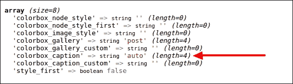

1.  我们注意到自动是此内容类型的 colorbox 标题。为了确认这一点，转到**结构** | **内容类型**，然后点击菜谱内容类型的**管理显示**。接下来，点击**菜谱图像**字段的设置图标，你会注意到**标题**设置为**自动**：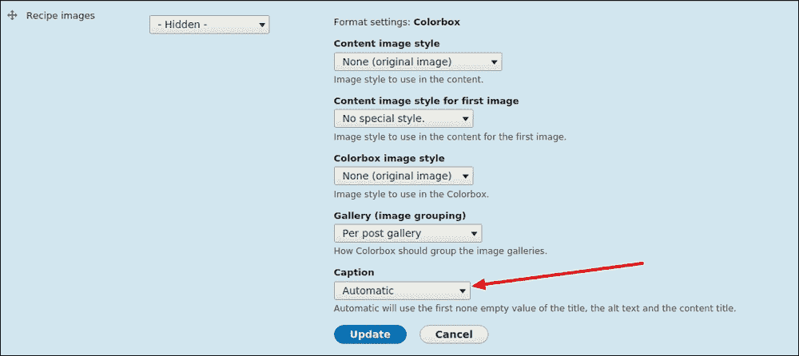

1.  你的设置可能不同，所以最后一步中你可以相对地看到。

1.  在接下来的几行中，我们可以看到一个`switch`语句的声明，如下设置`$caption`变量，它将作为 Colorbox 覆盖层的标题显示：

    ```php
      switch ($settings['colorbox_caption']) {
         case 'auto':
          // If the title is empty use alt or the entity title in that order.
          if (!empty($item->title)) {
            $caption = $item->title;
          }
          elseif (!empty($item->alt)) {
            $caption = $item->alt;
          }
          elseif (!empty($entity_title)) {
            $caption = $entity_title;
          }
          else {
            $caption = '';
          }
          break;
        case 'title':
          $caption = $item->title;
          break;
        case 'alt':
          $caption = $item->alt;
          break;
        case 'entity_title':
          $caption = $entity_title;
          break;
        case 'custom':
          $token_service = \Drupal::token();
          $caption = $token_service->replace($settings['colorbox_caption_custom'], array($entity_type => $entity, 'file' => $item), array('clear' => TRUE));
          break;
        default:
          $caption = '';
      }
    ```

1.  因此，我们可以理解`$caption`变量需要修改为设置 alt 或标题文本作为标题。为了确认这一点，当`$caption`在 colorbox 覆盖层中加载时；我们只需向其中设置一些占位符文本，我们就会在菜谱内容中看到效果。在添加占位符文本之前，删除你在上一步添加的`var_dump($settings); die;`行。

1.  接下来，在`switch`语句旁边添加以下行：

    ```php
    $caption = 'This is test caption!';
    ```

1.  从**性能**页面清除缓存。重新加载菜谱内容并点击任何图像以检查标题；你将看到以下截图：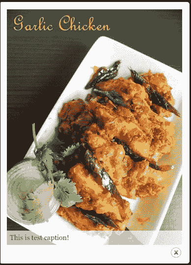

1.  在进行下一步之前，删除你在上一步添加的占位符标题代码：`$caption = 'This is test caption!';`。

1.  接下来，预处理`attributes`变量的标题，该变量需要从图像文件实体中加载。在`template_preprocess_colorbox_formatter()`函数末尾的`$variables['attributes']['title'] = $caption;`行之前添加以下代码：

    ```php
      // if File Entity module is enabled, load attribute values from file entity.
      if(\Drupal::moduleHandler()->moduleExists('file_entity')) {
        // file id of the save file.
        $fid = $item->target_id;
        // load file object
        $file_obj = file_load($fid);
        $file_array = $file_obj->toArray();
        // populate the image title
        if (Unicode::strlen($file_array['field_image_title_text'][0]['value']) != 0 && empty($item->title) && $settings['colorbox_caption'] == 'title') {
          $caption = $file_array['field_image_title_text'][0]['value'];
        }
        // populate the image alt text.
        if (!empty($file_array['field_image_alt_text'][0]['value']) && empty($item->alt) && $settings['colorbox_caption'] == 'alt') {
          $caption = $file_array['field_image_alt_text'][0]['value'];
        }
      }
    ```

1.  首先，我们检查了`file_entity`模块是否启用，因为这个模块不依赖于 colorbox 模块。`file_entity`模块的目的是提供管理文件以及将文件作为实体字段化的接口，因此图像文件的属性可以渲染为对象。接下来，我们添加了加载文件对象的代码，并通过验证来自`$file`对象的标题和 alt 文本属性来设置`$caption`变量。

1.  为了在菜谱内容中看到这个效果，在确保你的图像已更新了 alt 和标题文本之前，从性能页面清除缓存并重新加载菜谱内容。

1.  接下来，转到“食谱内容类型管理显示页面”，点击“食谱图像”字段的设置图标，并将**标题**更新为**标题文本**。在“管理显示”页面的底部点击**保存**按钮，并重新加载食谱内容页面以查看更改。点击任何图像。哇！现在它正在显示标题文本作为字幕（见下一张截图）。或者，在设置中将**字幕**更新为**Alt 文本**并检查食谱内容；它将工作：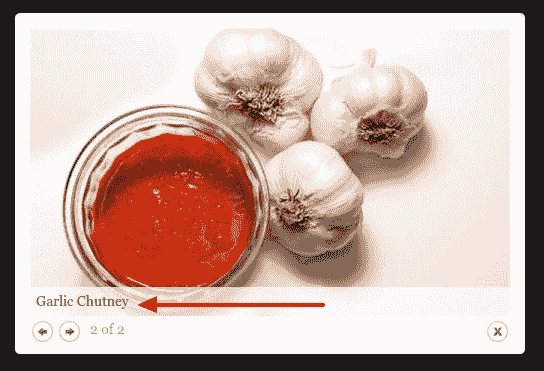

## *发生了什么？*

我们使用自定义代码更新了 colorbox 模块，使其能够与图像的标题和 alt 文本属性一起工作。

# 将我们的代码贡献给 Drupal

现在我们有了将在 colorbox 模块中通用的代码。但是，我们如何将此代码传递给其他 Drupal 用户，并且最好是将它作为 colorbox 模块的一部分进行维护？为了共享此代码，我们将创建一个补丁。

# 行动时间 – 创建补丁并将其上传到 Drupal 问题队列

在我们能够使用 Drupal 8/Git 方式创建补丁之前，我们需要使用 Git 将 colorbox 模块项目检出到一个新目录：

1.  前往 [`www.drupal.org/project/colorbox/git-instructions`](https://www.drupal.org/project/colorbox/git-instructions)。在顶部，你可以看到 **从哪个版本开始工作** 选择框。选择 **8.x-1.x** 并点击 **显示** 按钮：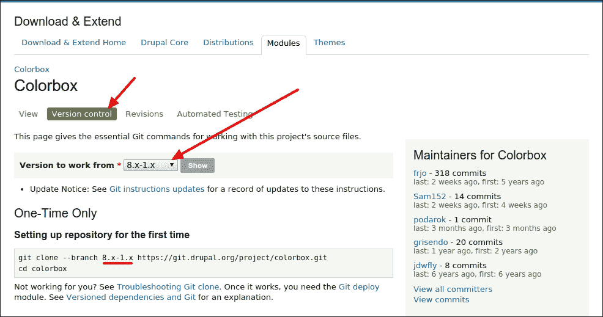

1.  现在打开终端并转到你希望克隆 colorbox 模块的任何位置（使用 `cd <path/to/go>` 命令），然后运行以下命令来克隆 colorbox Git 仓库：

    ```php
    $ git clone --branch 8.x-1.x https://git.drupal.org/project/colorbox.git
    Cloning into 'colorbox'...
    remote: Counting objects: 2082, done.
    remote: Compressing objects: 100% (1545/1545), done.
    remote: Total 2082 (delta 1253), reused 661 (delta 410)
    Receiving objects: 100% (2082/2082), 1.84 MiB | 27.00 KiB/s, done.
    Resolving deltas: 100% (1253/1253), done.
    Checking connectivity... done.

    ```

1.  接下来，我们需要将我们刚刚为 d8dev 网站所做的更改应用到 `colorbox.inc` 文件中，以及我们刚刚使用 Git 克隆的代码中。

1.  现在我们已经更新了代码，我们准备创建我们的补丁。按照 Drupal 指南 [`drupal.org/node/707484`](http://drupal.org/node/707484) 在 colorbox 根目录下运行此命令：

    ```php
    $ git diff > 2645160-6.patch

    ```

1.  接下来，我们将在 [`drupal.org/node/2645160`](http://drupal.org/node/2645160) 的问题上进行评论，并上传我们的补丁以及我们的评论，确保问题状态设置为需要审查：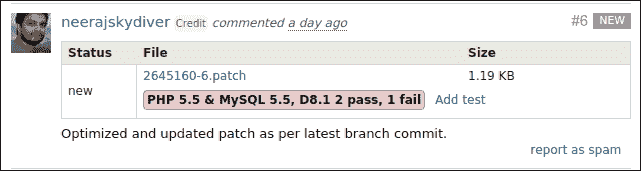

    如果我们想应用刚刚显示的补丁，我们使用以下 `git` 命令：

    ```php
    git apply -v [patchname.patch]

    ```

    如果想撤销最后应用的补丁，那么我们使用以下 git 命令：

    ```php
    git checkout [filename]
    git reset --hard

    ```

## *发生了什么？*

我们不仅更新了代码，使其能够在 Colorbox 模块和任何数量的 Drupal 网站上工作，我们还帮助了 Drupal 社区。我们学习了如何创建补丁。我们将回到 [`drupal.org/node/2645160`](http://drupal.org/node/2645160) 的 Colorbox 问题，看看 Drupal 社区如何对我们的补丁做出回应。

# 带有评论的食谱审查

现在我们已经增强了 Colorbox 模块的可配置标题，我们将把注意力转回到增强网站的用户交互。让访客能够评审和点赞/不喜欢内容是吸引他们与网站互动的一个很好的方法，在这种情况下，是菜谱。

# 操作时间 – 配置评论为菜谱评审

我们现在将设置评论，以便我们的 d8dev 网站的访客能够评审菜谱：

1.  我们将配置我们的菜谱内容类型以使用评论。在您喜欢的浏览器中打开 d8dev 网站，点击**管理**工具栏中的**结构**链接，然后点击**评论类型**链接，最后点击为您的菜谱内容类型添加的**添加内容类型**链接。

1.  在下一屏，将`菜谱评审`作为**标签**字段的值，将**内容**作为`目标实体类型`字段的值。点击**保存**按钮：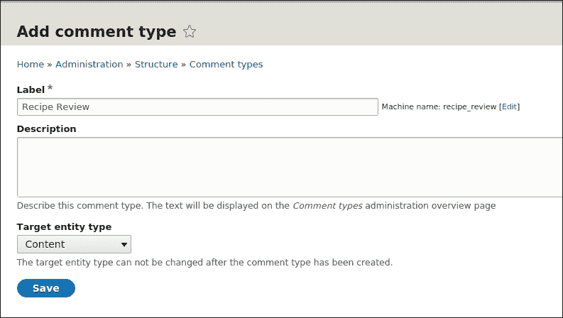

1.  我们添加了一个新的评论类型，并且它可以在任何内容类型中使用。点击**管理**工具栏中的**结构**链接，然后点击**内容类型**链接，最后点击您的菜谱内容类型的**管理字段**链接。

1.  接下来，点击**添加字段**链接。在下一屏，选择**评论**作为**添加新字段**，输入`菜谱评审`作为**标签**，然后点击**保存并继续**按钮：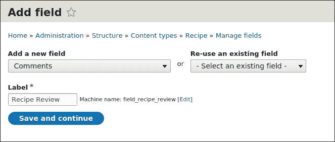

1.  在下一屏，选择**菜谱评审**作为**评论类型**，然后点击**保存字段设置**按钮。接下来，保留所有字段为默认设置，并点击**保存设置**按钮：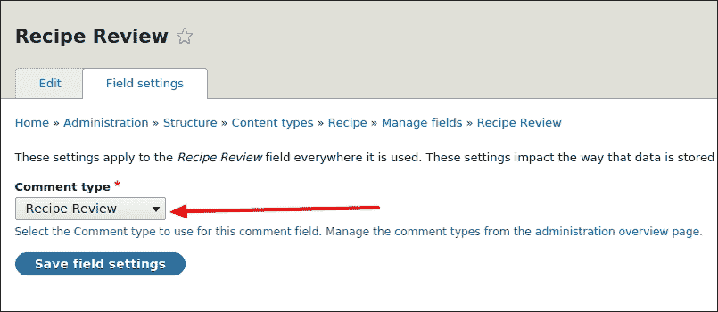

1.  我们已经为菜谱内容类型启用了评论。现在我们以**匿名**用户重新加载菜谱内容，以查看默认的评论表单。但由于权限问题，我们看不到表单。要设置权限，请转到**人员** | **权限**，为**匿名**用户检查**发表评论**权限，滚动到页面底部，然后点击**保存权限**按钮。再次以**匿名**用户重新加载菜谱内容，您将看到如下截图：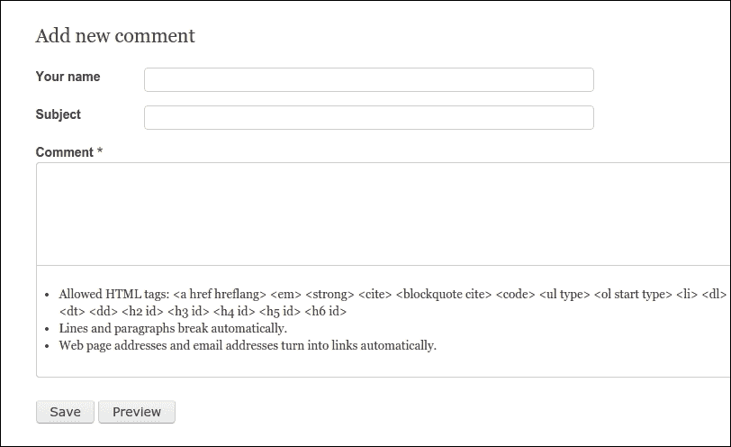

1.  我们不需要默认提供的名称、主题和评论字段。我们将删除它们并添加**电子邮件**和**味道如何？**字段。现在点击**管理**工具栏中的**结构**，然后点击**评论类型**链接。

1.  现在，点击**菜谱评审评论类型**的操作中的**管理字段**。您可以看到只有**评论**字段。点击**操作**中的**评论**字段的**删除**链接。在下一屏，点击**删除**按钮来删除此字段：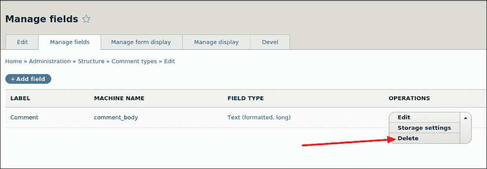

1.  接下来，点击**添加字段**，选择**添加新字段**为**电子邮件**，输入**标签**为`E-mail`，然后点击**保存并继续**按钮：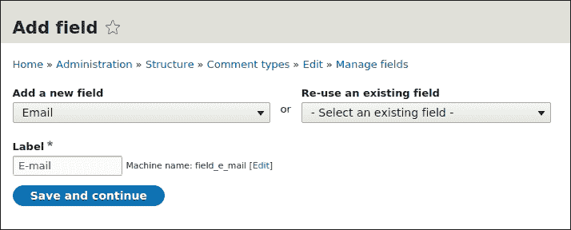

1.  在下一屏幕上，保留默认值**限制**、**1**，然后点击**保存字段设置**按钮。接下来，勾选**必填字段**并点击**保存设置**按钮。

1.  现在，点击**添加字段**链接。选择**文本（纯文本，长文本）**作为**添加新字段**，并将**标签**设置为**口感如何？**。点击**保存并继续**按钮。

1.  在下一屏幕上，保留默认设置**1**，然后点击**保存字段设置**按钮。再次在下一屏幕上，保留所有字段为默认值，然后点击**保存设置**按钮。

1.  接下来，以**匿名**用户重新加载食谱内容。我们可以看到以下截图所示的形式：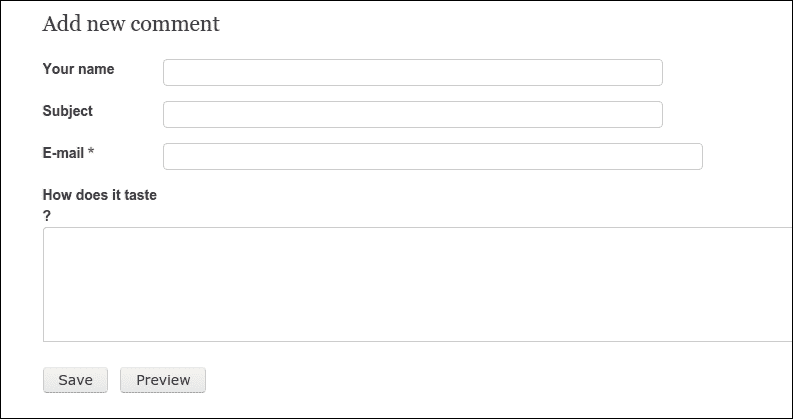

1.  但是我们仍然可以看到**您的姓名**和**主题**字段，这些字段不是必需的。因此，我们将从**管理表单显示**页面禁用它们。现在，点击**管理表单显示**以访问食谱评论类型。在下一屏幕上，将**作者**和**主题**字段的值设置为**隐藏**，然后点击**保存**按钮。请参阅以下截图：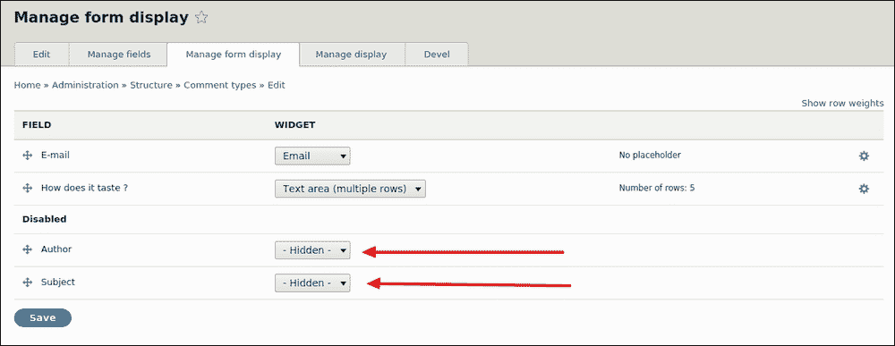

1.  现在，我们重新加载食谱内容，我们可以看到以下评论表单：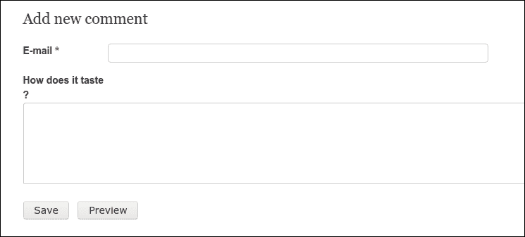

1.  由于我们需要显示食谱内容的点赞数，我们需要限制**匿名**和**认证**用户角色的评论查看权限。要设置权限，请转到**人员** | **权限**。取消勾选**匿名**和**认证**用户的**查看评论**权限，滚动到页面底部，然后点击**保存权限**按钮。

## **发生了什么？**

我们创建了一个新的评论类型，食谱评论，并在食谱内容类型中启用了它。此外，我们在食谱评论评论类型中配置了新的字段。

# 操作时间 – 使用评论和视图增强点赞系统

现在，我们将设置一个点赞/不喜欢按钮，以便我们的 d8dev 网站的访客能够点赞/不喜欢食谱。此外，我们将展示有多少人喜欢了每个食谱内容：

1.  首先，我们将在食谱评论类型中添加**你喜欢它吗？**按钮，以便我们的 d8dev 网站的访客能够点赞/不喜欢食谱。在你的浏览器中打开 d8dev 网站，点击**管理**工具栏中的**结构**链接。然后点击**评论类型**链接，最后在**操作**下拉菜单中点击为你的食谱评论**管理字段**链接。

1.  点击**添加字段**链接以添加新字段。在下一屏幕上，选择**列表（整数）**作为**添加新字段**，并将**你喜欢它吗？**作为**标签**。点击**保存并继续**按钮：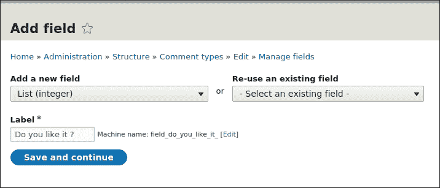

1.  现在，在**允许的值列表**字段中输入以下文本，保留其他设置默认，然后点击**保存字段设置**按钮：

    ```php
    1|Yes
    0|No
    ```

1.  对于这一步，请检查**必填字段**按钮，选择**默认值**为**是**，然后点击**保存设置**按钮。

1.  现在，点击**管理表单显示**链接。将**你喜欢它吗？**字段小部件更改为**复选框/单选按钮**小部件，然后点击**保存**按钮：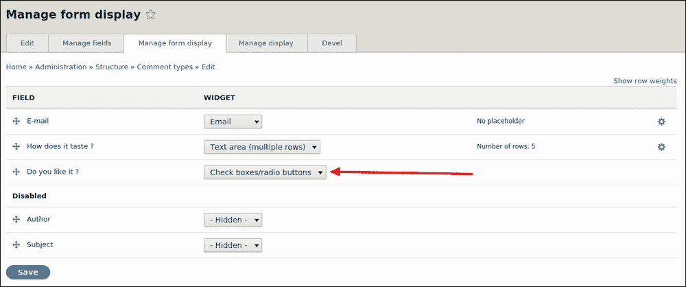

1.  接下来，重新加载食谱内容，您可以看到以下评论表单：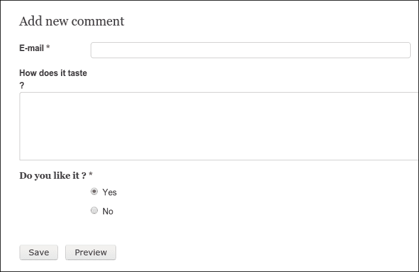

1.  我们已经启用了**喜欢**按钮。接下来，我们需要展示有多少人喜欢了食谱内容。我们将创建一个视图块来显示每个食谱内容的点赞数。在您喜欢的浏览器中打开 d8dev 网站。点击**管理**工具栏中的**结构**链接，然后点击**视图**链接，最后点击**添加新视图**链接。

1.  在**添加新视图**页面，输入视图名称为`Recipe likes count`。在**视图设置**部分，选择**显示**字段为**评论**，**类型**字段为**食谱评论**。在**块设置**部分，勾选**创建块**并点击**保存并编辑**按钮。

1.  接下来，在**格式**部分，点击**显示：评论**链接。然后，将出现一个弹出窗口。将**行**字段值评论更改为字段，并点击**应用（所有显示）**按钮：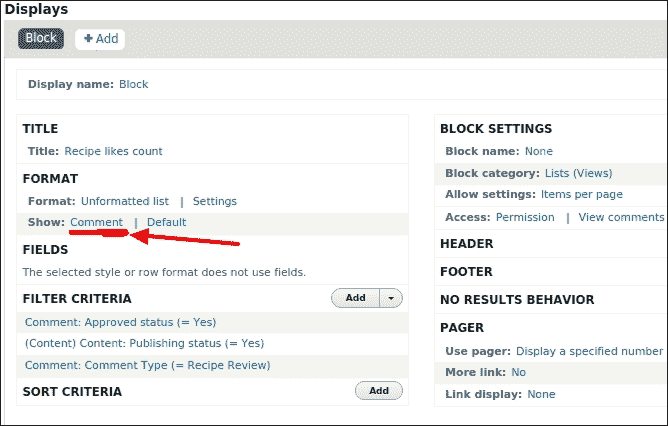

1.  接下来，在**高级**部分和**其他**组下，点击**使用聚合：否**链接。然后，将出现一个弹出窗口。勾选**聚合**并点击**应用（所有显示）**按钮：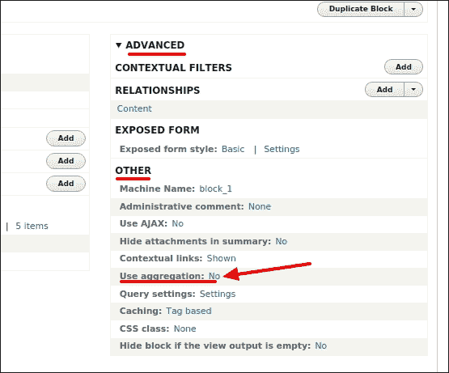

1.  现在，在**字段**部分，点击**添加**链接。在弹出的窗口中，搜索关键词`do you like`。然后勾选**你喜欢它吗？(field_do_you_like_it_)**复选框，并点击**应用（所有显示）**按钮：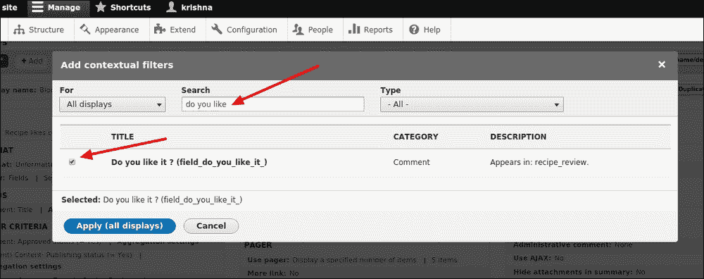

1.  在下一屏幕上，选择**求和**作为**聚合类型**字段，并点击**应用并继续**按钮：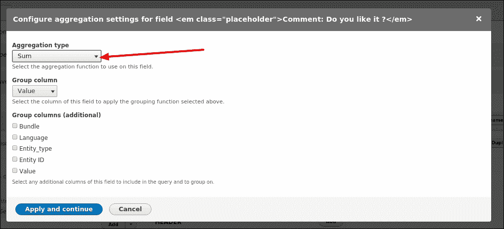

1.  在下一屏幕上，向下滚动到**重写结果**部分并点击它。勾选**用自定义文本覆盖此字段的输出**复选框，并在**文本**字段中输入以下文本：

    ```php
    {{ field_do_you_like_it_ }} likes 
    ```

1.  接下来，在**样式设置**部分，勾选**自定义字段 HTML**复选框。选择**HTML 元素**为**STRONG**，并点击**应用(所有显示)**按钮。

1.  现在，在**高级**部分，点击**添加**链接以添加**上下文过滤器**。在弹出的窗口中，搜索关键词`node id`。然后勾选**节点 ID**复选框，并点击**应用(所有显示)**按钮。在下一屏幕上，保持设置默认，并点击**应用并继续**按钮。

1.  在下一屏幕的**当过滤器值不可用**部分，选择**提供默认值**单选按钮。选择**类型**为**从 URL 获取内容 ID**，并点击底部的**应用(所有显示)**按钮：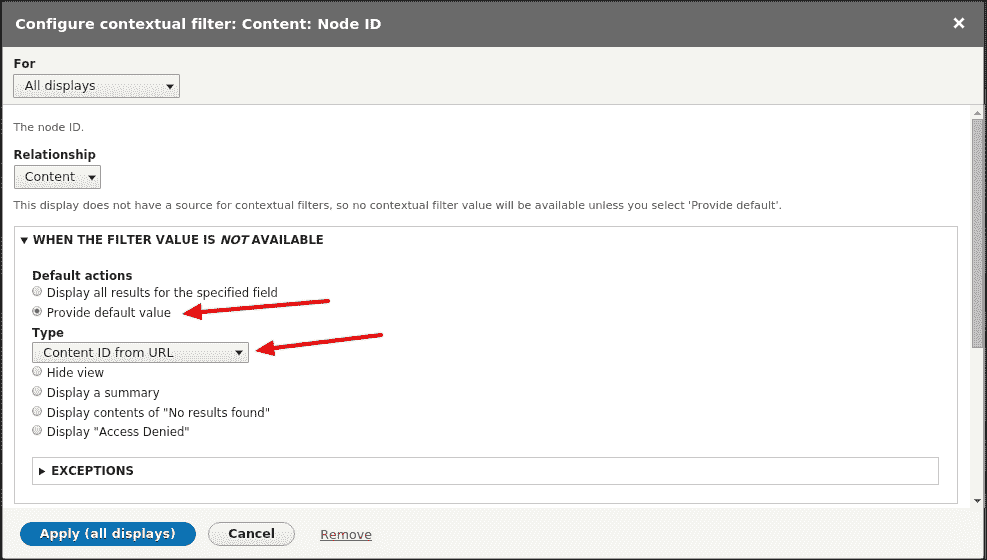

1.  接下来，在**字段**部分，点击**评论：标题**链接。在弹出的窗口中，点击**删除**链接。在相同的**字段**部分，点击**添加**链接。在弹出的窗口中，搜索`title`，并将**类型**选择为**内容**。勾选**标题**复选框，并在底部点击**应用(所有显示)**按钮。

1.  在下一屏幕上，保持默认设置，并点击**应用并继续**按钮。

1.  在下一屏幕上，勾选**排除显示**复选框，并在底部点击**应用(所有显示)**按钮。然后，向下滚动并点击**保存**按钮以保存视图设置。

1.  我们已经完成了块视图的创建。现在我们需要将此块放置在食谱内容页面上。点击**管理**工具栏中的**结构**链接，然后点击**块布局**链接。

1.  向下滚动到**内容**部分，并点击**放置块**按钮。接下来，在弹出的窗口中，搜索`Recipe likes count`，并点击此**放置块**按钮：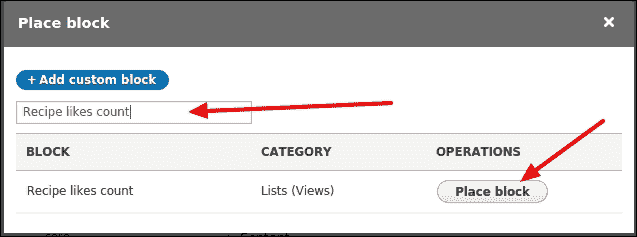

1.  在下一屏幕上，取消勾选**显示标题**。在**内容类型**部分，勾选**食谱**，并保持其他设置默认。点击**保存块**按钮：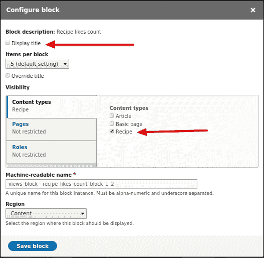

1.  接下来，在**块布局**页面，将**食谱点赞数**块移动到**主页内容**块上方，并向下滚动到页面底部。点击**保存块**按钮：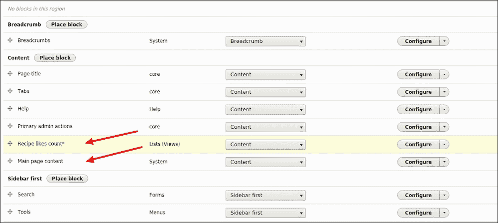

1.  现在我们已经完成了所有配置。现在我们需要检查菜谱内容页面，看看点赞数是如何显示的。我们将使用 Devel 模块生成示例内容和评论。使用 Drush 下载并启用 Devel 模块。在 d8dev 根目录下运行以下命令：

    ```php
    $ drush en devel -y
    devel was not found.
    [warning]
    The following projects provide some or all of the extensions not found:
    [ok]
    devel
    Would you like to download them? (y/n): y
    Project devel (8.x-1.x-dev) downloaded to /usr/share/nginx/html/drupal-8.0.2//modules/devel.
    [success]
    Project devel contains 5 modules: webprofiler, kint, devel_node_access, devel_generate, devel.
    The following extensions will be enabled: devel
    Do you really want to continue? (y/n): y
    devel was enabled successfully.
    [ok]
    devel defines the following permissions: access devel information, execute php code, switch users 

    $ drush en devel_generate -y
    devel_generate is already enabled.
    [ok]
    There were no extensions that could be enabled.
    [ok]
    ```

1.  要生成示例内容，请打开您喜欢的浏览器中的 d8dev 网站，点击**管理**工具栏中的**配置**链接，然后点击**开发**部分下的**生成内容**链接。

1.  在下一屏上，检查**菜谱**内容类型，在**每个节点最大评论数**字段中输入`10`，然后点击**生成**按钮。这将生成 50 个带有 10 条评论的菜谱内容：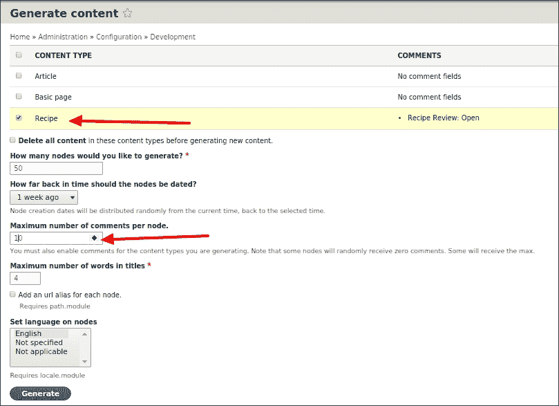

1.  打开由 devel 模块在**管理内容**页面创建的任何菜谱内容。我们可以看到下一张截图所示的点赞数。如果我们检查这个菜谱的所有评论，我们可以从**你喜欢它吗？**字段中找到只有**4**（或多少个**是**值）的点赞：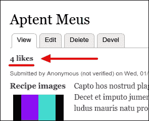

1.  只有经过批准的评论的点赞会被计算，所以如果我们收到任何评论，管理员必须将它们更新为**已发布评论**。为此，我们必须转到`http://localhost/admin/content/comment/approval`：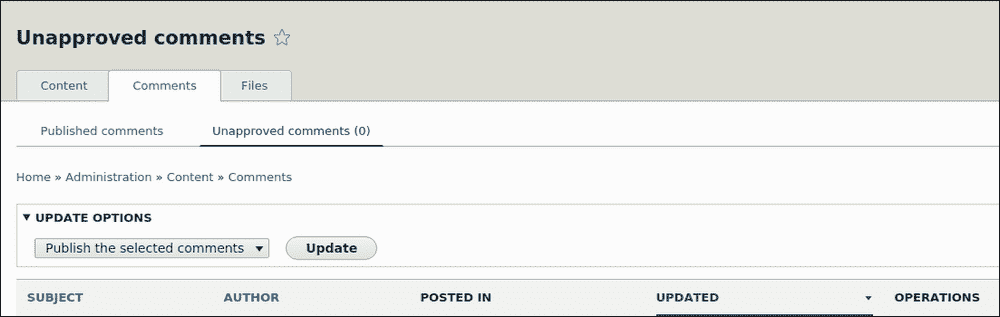

## *发生了什么？*

我们创建了一个**视图**块，并配置了评论设置，用于在 d8dev 网站上对评论和点赞/踩赞菜谱进行设置。整个过程简单直接，表明有时给 Drupal 网站添加独特的亮点并不需要太多的开发工作。

# 摘要

在本章中，我们添加了一些新功能，为访客提供了与我们的 d8dev 网站互动的方式，我们还通过评论和视图增强了其中一些互动功能。我们还回顾了上一章中引入的 Colorbox 文件模块，并对它进行了一些修改，以便更好地控制如何在 Colorbox 覆盖层中显示标题。

在下一章中，我们将更深入地探讨视图模块。我们将探索高级配置和开发一个自定义视图插件，该插件利用自定义 jQuery 插件以语义化和渐进增强的方式显示视图输出。
