# 第九章。高级 Views 开发

*本章将深入介绍 Views 模块，并介绍一些 Views 插件架构。我们将深入了解 Views UI 中的一些高级功能，包括基于分类的 Views 介绍。我们将开发一个 Views 风格插件，以显示我们的新 Recipes 视图作为语义标签。我们还将把 Views 语义标签模块作为沙盒项目贡献给 Drupal。*

在本章中，我们将涵盖以下主题：

+   高级 Views 配置

+   Views 插件开发

+   创建 Drupal 沙盒项目

# 重访 Views – 高级配置

在最后几章，自定义内容类型和模块开发简介中，我们快速介绍了 Views，并看到了使用新的 Views 向导的用户界面创建视图是多么简单。基于向导的新视图创建使得开始使用 Views 变得容易，但它不包括许多更高级的 Views 配置选项。即使在标准的 Views 编辑页面上，高级配置选项也被隐藏起来，以免让初学者感到不知所措。本章的开始将探讨许多 Views 提供的高级配置选项。Views 配置可能会很快变得复杂。所以，从某种意义上说，高级 Views 配置并不比我们编写的某些 PHP 代码简单。

# 随机高评价食谱块

首页仍然有点单调乏味。我们将使用 Views 创建一个块，随机展示网站上的一篇高评价食谱。这将涉及使用 Views 过滤器和排序设置。

# 动手实践时间 – 使用 Views 构建随机高评价食谱块

我们将超越基本的 Views 向导视图创建用户界面，并学习一些更多高级功能和 Views 的配置。

1.  在浏览器中打开我们的 d8dev 网站，点击 **管理** 工具栏中的 **结构** 链接，然后点击 **Views** 链接。

1.  点击 **Views** 页面顶部的 **添加新视图** 链接。

1.  将 `Random Top Rated Recipe` 作为 **视图名称** 输入。

1.  为 **类型** 选项选择 **Recipe**。

1.  打勾 **创建一个块** 复选框。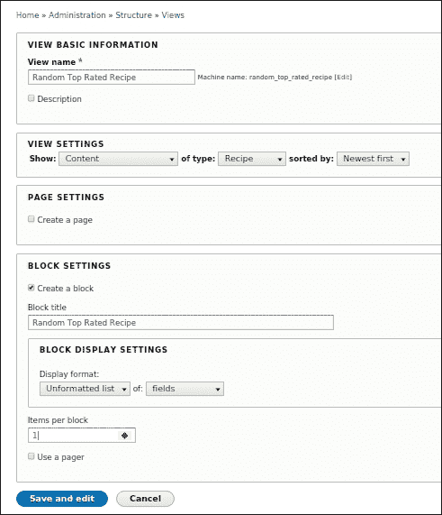

1.  接下来，点击 **保存并编辑** 按钮，因为我们想配置一些基本块创建向导中不可用的更多高级选项。

    现在，我们将添加我们想要在此块中显示的 Recipe 内容字段。记住，这个块将显示在我们的 d8dev 网站的前页面上，所以我们要让它看起来视觉上吸引人。注意，**标题** 字段默认已经包含在内。

1.  点击**字段**的**添加**按钮，搜索`image`，并选择**内容：图像**的复选框，然后点击**应用（所有显示）**按钮。注意，视图会显示字段关联的节点或内容类型。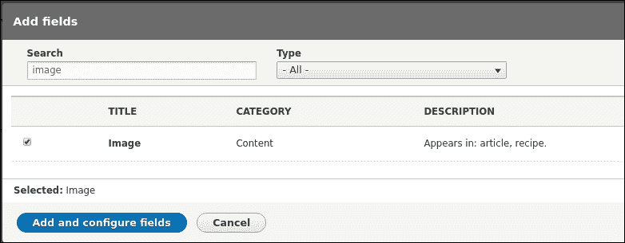

1.  对于图像字段的**配置字段**设置，选择**中等（220*220）**作为**图像样式**，然后点击**应用（所有显示）**按钮。

1.  点击**字段**的**添加**按钮，搜索`Comment count`，并选择**评论统计：评论计数**的复选框。然后点击**应用（所有显示）**按钮。

1.  对于**评论计数**的**配置字段**设置，选择**总计数**作为**前缀**，**评论**作为**后缀**值。在**样式设置**部分，勾选**自定义字段 HTML**复选框，选择**STRONG**作为**HTML 元素**字段，然后点击**应用（所有显示）**按钮。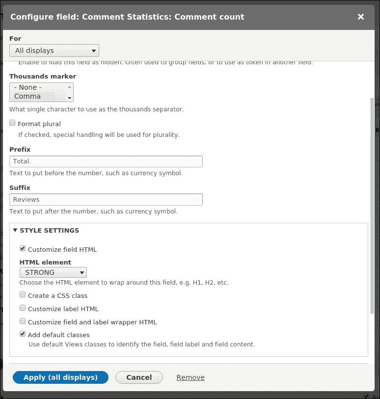

1.  接下来，在**排序标准**部分，点击**添加**按钮，搜索`Comment count`，并选择**评论统计：评论计数**的复选框。然后点击**应用（所有显示）**按钮。

1.  对于**评论计数**的**配置排序标准**设置，选择**降序**作为**顺序**字段，然后点击**应用（所有显示）**按钮。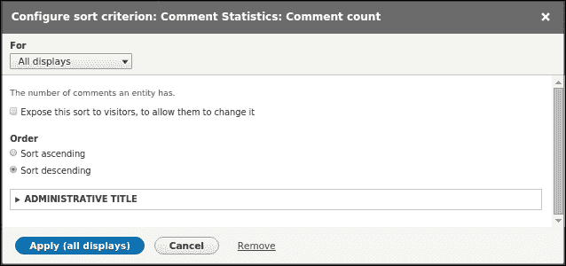

1.  接下来，在**排序标准**部分，点击**添加**按钮，搜索`Random`，并选择**随机**的复选框。然后点击**应用（所有显示）**按钮。

1.  在下一屏幕上，点击**应用（所有显示）**按钮。然后保存视图，我们可以看到此块的预览如下截图所示：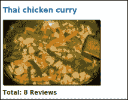

1.  现在您的视图配置应该类似于以下截图所示：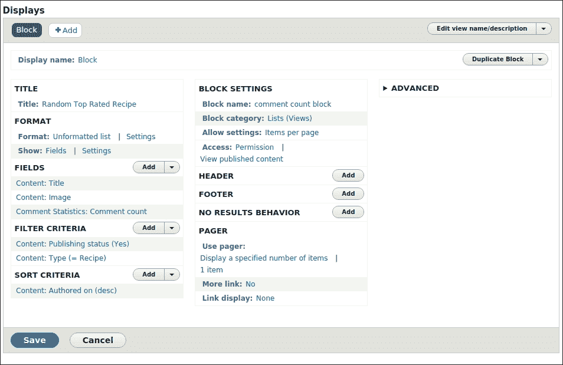

1.  现在我们需要配置这个基于视图的新块，使其显示在首页上。点击**管理**工具栏中的**结构**，然后点击**块布局**链接。

1.  向下滚动到**侧边栏第一个区域**，点击**放置块**链接。在弹出窗口中，搜索`Random top`，然后点击**放置块**按钮，为**随机高评分菜谱**块放置。

1.  在下一屏幕上，勾选**覆盖标题**复选框，输入`Top Recipe`作为**标题**，然后点击**保存块**按钮。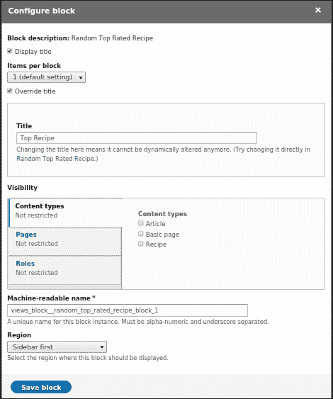

## *发生了什么？*

我们使用了视图并利用了一些高级配置选项来显示最新食谱的图片和标题，并学习了如何通过添加基于视图的动态块使我们的 d8dev 网站更加有趣。

# 基于分类的视图带标签

在本节中，我们将向我们的首页添加另一个基于视图的块。然而，这将是一个基于分类的视图，而不是我们迄今为止创建的内容视图。分类是指信息的组织。正如我们在上一章中学到的，分类是一个可字段的实体。分类模块是一个核心模块，它允许您创建术语词汇，以关联到其他实体类型，以便它们可以组织。因此，在此之前，我们需要创建一个包含分类词汇和术语的视图，并将这些术语关联到我们的食谱内容。我们将添加一个用于按菜系类型组织食谱的词汇。

# 操作时间 – 创建用于组织食谱的菜系词汇

在我们能够创建基于分类的视图之前，我们需要创建一个 Drupal 分类词汇：

1.  在您的浏览器中打开我们的 d8dev 网站，点击**管理工具栏**中的**结构**链接，然后点击**分类**链接。

1.  在**分类配置**页面，点击**添加词汇**链接。

1.  将`菜系类型`作为**名称**输入并点击**保存**按钮。现在我们将为我们新的词汇添加一些术语。

1.  点击我们新的**菜系类型**词汇的**添加术语**链接（确保您在`admin/structure/taxonomy/manage/type_of_cuisine/overview`页面）：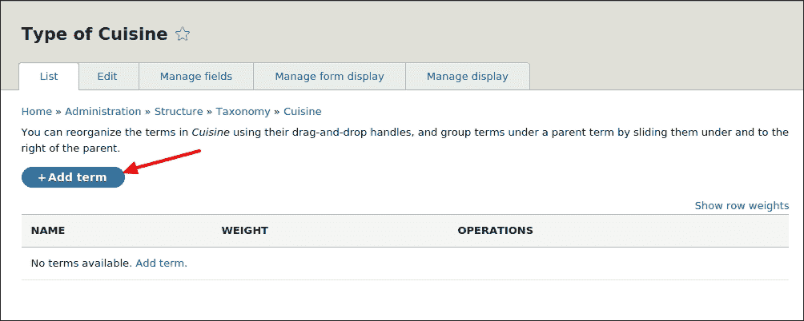

1.  将`美国`作为我们第一个术语的**名称**并点击**保存**按钮。

1.  重复此过程并添加术语`亚洲`和`泰国`。现在我们将为我们的食谱内容类型添加一个分类字段。

1.  点击**管理工具栏**中的**结构**链接，点击**内容类型**链接，然后点击我们食谱内容类型的**管理字段**链接。

1.  点击**添加字段**链接。在下一屏幕中，选择**分类术语**作为**添加新字段**，并将`recipeCuisine`作为**标签**。点击**保存并继续**按钮。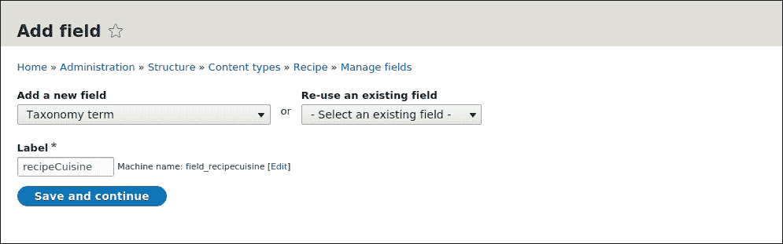

1.  在下一屏幕中，选择**无限制**作为**允许的值数**，并点击**保存字段设置**按钮。在下一屏幕中，检查**参考类型**下的**词汇**中的**菜系类型**，并点击**保存设置**按钮。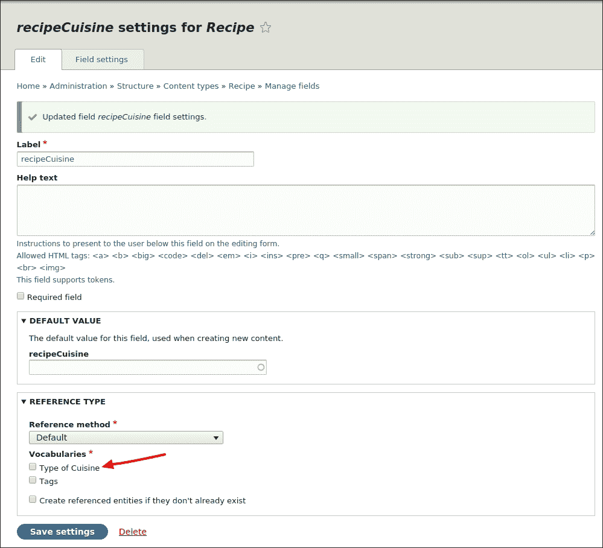

1.  点击 **管理** 栏中的 **内容** 链接，然后点击其中一个菜谱的编辑链接，向下滚动到我们新的 **recipeCuisine** 字段，选择美国，然后点击 **保存** 按钮。为腰果青豆鸡和泰式及亚洲菜谱重复此过程。

## *发生了什么？*

我们快速了解了 Drupal 分类法，并创建了一个词汇表来组织 d8dev 菜谱按菜系类型。

现在我们已经添加了一个新的词汇表来关联菜谱内容到菜系类型，我们准备在一个基于视图的块中使用它。我们将创建一个基于视图的块，显示 d8dev 网站按菜系类型的新菜谱条目。除此之外，我们还将按关联菜谱数量最少的菜系类型对菜谱列表进行排序。这将帮助我们推广菜谱数量较少的菜系类型。最后，我们希望有一个基于标签的用户界面，每个菜系类型都有一个标签，该标签的内容是该菜系类型最新的五个菜谱。让我们一步一步来。

# 行动时间 – 创建按菜系类型查看的菜谱块

我们创建了一个新的词汇表并将其关联到我们的菜谱内容类型。现在我们将学习如何使用自定义词汇与视图一起使用。

1.  点击 **管理** 工具栏中的 **结构** 链接，点击 **视图** 链接，然后点击 **添加新视图** 按钮。

1.  在下一页上，将 **视图** 名称输入为 `按菜系菜谱`，从 **显示** 选择列表中选择 **分类术语**，从 **类型** 选择列表中选择 **菜系类型**。

1.  在 **块设置** 部分下勾选 **创建一个块** 复选框。

1.  保留剩余的默认设置，然后点击 **保存并编辑** 按钮。

1.  视图自动添加了分类术语 **名称** 字段，但我们还希望显示与每个菜系术语关联的最新菜谱。然而，如果您点击 **字段** 的 **添加** 按钮，您会注意到没有可用的 **内容** 字段。我们将使用视图 **关系** 配置来在菜谱内容和我们要显示的分类术语之间添加一个关系。

1.  点击 **添加** 按钮选择 **关系**，勾选 **使用 field_recipecuisine 字段的菜谱内容** 关系，然后点击 **应用(所有显示)** 按钮。

1.  在下一屏幕上，保留剩余的默认设置，然后点击 **应用(所有显示)** 按钮。

1.  现在点击 **字段添加** 按钮；有可用的内容字段。在 **搜索** 输入框中输入 `title`，选择它，然后点击 **应用(所有显示)** 按钮。

    注意，字段配置中有一个 **关系** 选择列表。基于分类术语视图的所有内容字段都需要一个关系。因此，这将是默认列出的第一个关系。

    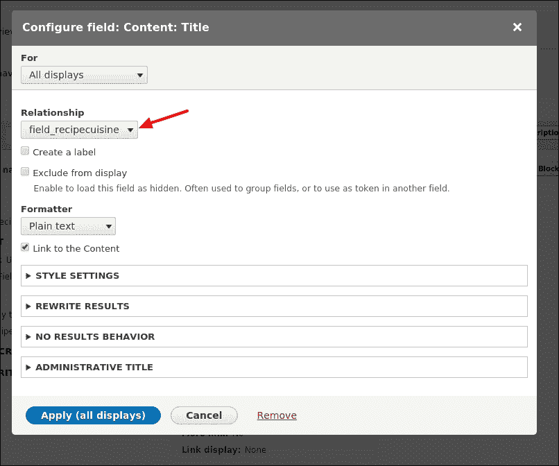

1.  保持**创建标签**复选框未勾选，因为我们只想显示标题本身。我们将保持**链接到此内容…**复选框勾选，以便用户能够导航到完整的食谱。点击**应用（所有显示）**按钮。

    现在如果您滚动到视图配置页面的底部，您将看到此视图输出的预览，您会看到我们正在显示菜系类型术语名称和食谱标题，但我们希望按术语名称分组食谱标题。

1.  接下来，在**格式**部分下，点击格式**设置**链接，然后为**分组字段编号 1**选择**Taxonomy term: Name**，并点击**应用**按钮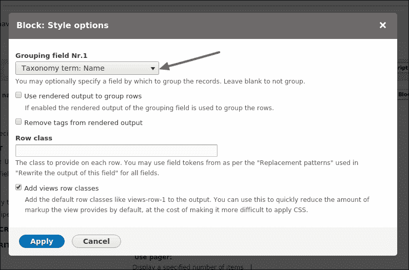

1.  您将看到此视图输出的预览，您会看到我们正在显示菜系类型术语名称和食谱标题，因为我们按术语名称分组了食谱标题，并且术语名称显示了两遍。因此，我们将在**字段**设置中隐藏它们。

1.  现在点击**分类术语：名称**链接，并勾选**排除显示**复选框，因为我们只想显示内容标题。然后点击**应用（所有显示）**按钮。

1.  现在我们将添加一个排序标准，以便首先显示按最新食谱分组的术语。点击**添加**按钮为**排序标准**，在**搜索**字段中输入`Authored on`，选择**Authored on**字段，然后点击**应用（所有显示）**按钮。

1.  在下一屏幕上，选择**降序**为**顺序**字段，并点击**应用（所有显示）**按钮。此视图的预览现在应该类似于以下截图。注意：以下内容是 Devel 模块生成的内容。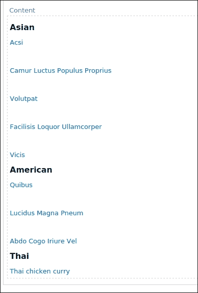

1.  接下来，点击此视图的**保存**按钮。

## *发生了什么事？*

我们创建了一个基于视图的食谱块，通过菜系名称显示食谱。尽管表面上看起来一切正常，但我们的新视图在分组和限制方面存在问题。我们希望显示三种不同的菜系和每种菜系类型的五道食谱，但我们创建的视图只限制了返回的总行数。如果我们再添加一道食谱，那么这道食谱就会显示出来。然而，第六古老的食谱将会被移除，如果新添加的食谱恰好是泰国或亚洲菜系，那么美国分组将会消失。因此，我们只剩下两种菜系类型的分组。实际上，这是一个相当复杂的 SQL 问题，但有一个贡献模块可以让我们得到我们想要的确切结果。

视图字段视图模块([`drupal.org/project/views_field_view`](http://drupal.org/project/views_field_view))启用了一个全局视图字段，允许你将另一个视图嵌入为父视图的字段，有点像一套俄罗斯套娃。然而，对于实际生产使用，请注意，使用这种方法会有一些相当严重的性能影响，因为将会有四个 SQL 查询而不是一个。所以你绝对需要在使用类似这种方法的生产站点之前确保你理解视图缓存和 Drupal 缓存。

# 操作时间 – 为我们的“按菜系类型查看食谱”安装和使用视图字段视图模块

通过安装和使用视图字段视图模块，我们将学习到有许多与视图相关的扩展模块，它们扩展了视图模块的功能和能力。

1.  首先，我们需要安装视图字段视图模块。打开终端（Mac OS X）或命令提示符（Windows）应用程序，并转到我们的 d8dev 站点根目录。

1.  使用 Drush 下载并启用视图字段视图模块：

    ```php
    $ drush dl views_field_vies
    Project views_field_view (8.x-1.0-beta2) downloaded to /var/www/html/d8dev/modules/views_field_view.  [success] 
    $ drush en views_field_view 
    The following extensions will be enabled: views_field_view 
    Do you really want to continue? (y/n): y 
    views_field_view was enabled successfully. [ok]

    ```

1.  现在，在我们修改我们的“按菜系查看食谱”视图之前，你需要了解视图字段视图功能是如何工作的。我们将移除食谱标题字段并添加一个**全局：视图**字段。**全局：视图**字段允许我们指定另一个视图作为字段的内联内容，而不是我们的食谱内容类型中的字段。它允许我们将任何其他可用的视图字段作为参数传递给其他视图，作为上下文过滤器传递给用作字段内容的视图。我知道这听起来相当复杂，这就是为什么我们将一起慢慢走过这个过程。首先，我们需要创建一个视图，用作视图字段视图，其中将按发布日期降序列出食谱，因此我们将使用视图字段视图字段来显示我们的食谱列表视图中的内容。

1.  在**管理**工具栏中点击**结构**链接，然后点击**视图**链接，并点击我们随机最高评分食谱视图的**编辑**按钮。

1.  在下一页的顶部，点击**添加**按钮，然后点击**块**链接。

1.  点击**添加字段**链接，在输入搜索框中搜索 node id。勾选**排除显示**复选框，然后点击**应用（此显示）**按钮。

1.  再次点击**添加字段**链接，在输入搜索框中搜索“视图”。在下一屏幕上，在**视图设置**部分，选择**食谱点赞数**作为**视图**，**块**作为**显示**，以及`{{ fields.nid }}`作为**上下文过滤器**。点击**应用（此显示）**按钮。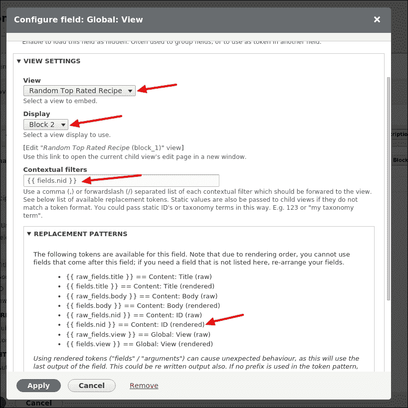

1.  现在，在 **ADVANCED**（高级）部分，点击 **Contextual filters**（上下文过滤器）的 **Add**（添加）链接。在弹出的窗口中，搜索节点 ID 关键词。现在勾选 **Node ID**（节点 ID）复选框，然后点击 **Apply (this displays)**（应用（显示））按钮。在下一屏幕上，保持设置默认，然后点击 **Apply and continue**（应用并继续）按钮。注意：确保在顶部选择了 **This block (override)**（此块（覆盖））。

1.  在下一屏幕上，在 **WHEN THE FILTER VALUE IS NOT AVAILABLE**（当过滤器值不可用）部分，选择 **Provide default value**（提供默认值）单选按钮。选择 **Type** 为 **Content ID from URL**，然后点击底部的 **Apply(this displays)**（应用（显示））按钮。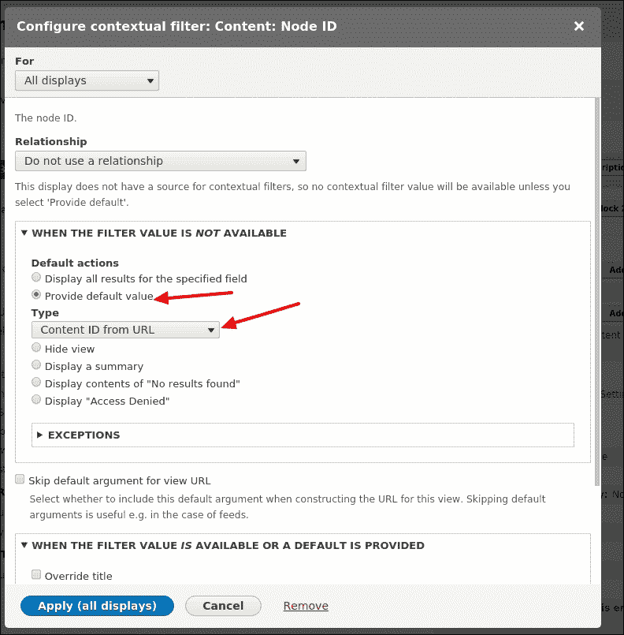

1.  然后保存视图，我们可以看到如下截图所示的预览：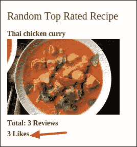

1.  接下来，点击 **Admin** 工具栏中的 **Structure**（结构）链接，然后点击 **Views**（视图）链接，并点击我们食谱按菜系视图的编辑按钮。

1.  在下一页的顶部，点击 **Add**（添加）按钮，然后点击 **Block**（块）链接。

1.  点击 **Add Field**（添加字段）链接，并在输入搜索框中搜索节点 ID。勾选 **Exclude from display**（从显示中排除）复选框，然后点击 **Apply (this displays)**（应用（显示））按钮。

1.  再次点击 **Add Field**（添加字段）链接，并在输入搜索框中搜索视图。在下一屏幕上，在 **VIEW SETTINGS**（视图设置）部分，选择 **Random Top Rated Recipe**（随机最高评分食谱）作为 **View**（视图），**Block 2**（块 2）作为 **Display**（显示），以及 `{{ raw_fields.nid }}`（原始字段.nid）作为 **Contextual filters**（上下文过滤器）。点击 **Apply (this displays)**（应用（显示））按钮。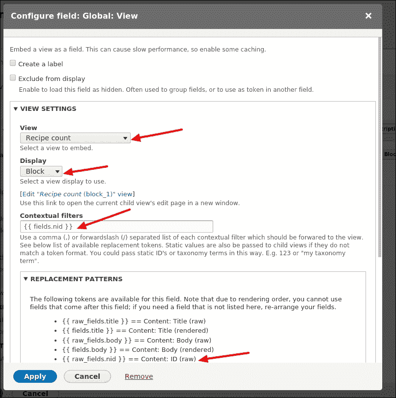

1.  然后保存视图，我们可以看到如下截图所示的预览：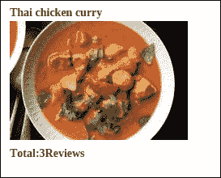

1.  现在，我们需要配置这个基于 Views 的新块，使其显示在首页上。点击 **Admin** 工具栏中的 **Structure**（结构），然后点击 **Block Layout**（块布局）链接。

1.  向下滚动到 **Sidebar first Region**（侧边栏第一个区域），然后点击 **Place block**（放置块）链接。在弹出的窗口中，搜索 `Recipes by`，然后点击 Recipes by Cuisine 块的 **Place block**（放置块）按钮。

## *发生了什么？*

在 Views Field View 模块的协助下，我们创建了一个显示我们食谱内容的视图。

# 标签视图显示

为了使“按菜系查看食谱”更加视觉上吸引人，并在我们 d8dev 前页的可视区域内看起来更有组织，我们将显示每个菜系类型作为一个选项卡，并为活动选项卡提供食谱。我们将使用基于 JavaScript 的方法在我们的选项卡界面中显示按菜系分组的食谱。请查看 jQuery UI 选项卡页面（[`jqueryui.com/tabs/`](http://jqueryui.com/tabs/)），你将看到我们如何显示“按菜系查看食谱”的示例。


我之所以指出基于 jQuery 的 UI 选项卡，是因为 Drupal 8 包含了 JavaScript 库。因此，使用一个作为 Drupal 8 核心安装的一部分已经可用的 JavaScript 小部件来处理选项卡是非常有意义的。然而，目前为我们的“按菜系查看食谱”生成的标记将很难与 jQuery UI 选项卡集成，因为 jQuery UI 选项卡旨在在单独的 HTML 容器中处理选项卡及其内容。请查看上一张截图中的 jQuery UI 选项卡页面上的示例标记，以了解我的意思。

```php
<div id="tabs">
  <ul>
    <li><a href="#tabs-1">Tab1 title</a></li>
    <li><a href="#tabs-2">Tab2 title</a></li>
    <li><a href="#tabs-3">Tab3 title</a></li>
  </ul>
  <div id="tabs-1">
    <p>Tab1 content</p>
  </div>
  <div id="tabs-2">
    <p>Tab2 content</p>
  </div>
  <div id="tabs-3">
    <p>Tab3 content</p>
  </div>
</div>
```

Views 为我们的“按菜系查看食谱”生成的标记更加语义化。它保留了与相关内容关联的组标题（实际上，Views 生成的标记比这要多得多，所以请查看浏览器中“按菜系查看食谱”视图的源输出）。基本上，一个简化版本的 Views 为默认 HTML 列表格式生成的标记更接近以下内容：

```php
<div>
  <ul>
    <li>content 1</li>
    <li>content 2</li>
  </ul>
</div>
```

因此，如果我们想使用 jQuery UI 选项卡，那么我们必须修改 Views 为我们的“按菜系查看食谱”视图生成的标记。一个 Views 风格插件将允许我们生成与 jQuery UI 选项卡通常使用的标记类型。然而，由于我们无论如何都要为 Views 编写一个自定义插件，为什么还要编写一个创建非语义且在渐进增强方面有限的选项卡插件呢？

# 行动时间 - 开发一个用于语义选项卡的 Views 风格插件

我们将创建一个新的模块来介绍 Views 插件。我们将在下一主题中将它贡献给 Drupal。

1.  打开 PhpStorm 并导航到我们 d8dev 项目的 `/modules/custom` 文件夹。

1.  创建一个名为 `views_semantic_tabs` 的新文件夹——这是我们新模块的名称。

1.  创建一个名为 `views_semantic_tabs.info.yml` 的新文件，并输入以下信息：

    ```php
      name: Views semantic tabs
      type: module
      description: Provides a views style plugin to display views results in jQuery UI Tabs.
      core: 8.x
      package: Views
      dependencies:
        - views
    ```

    在 Drupal 7 中，我们使用 `hook_views_plugins()` 钩子函数来注册新插件。另一方面，Drupal 8 依赖于注解和自动加载来发现任何插件，如块和视图样式。自动加载的概念允许我们将插件文件放在预定义的目录中，Views/Blocks 在需要时找到它。在插件文件内部使用注释块指定的任何插件元数据称为注解。

1.  要通过视图找到我们的样式插件，我们必须将其放置在我们自定义模块`modules/views_semantic_tabs`目录内的`src/Plugin/views/style`文件夹中。因此，我们希望构建一个语义标签样式插件，该插件显示基于 jQuery UI 标签的样式。

1.  在`/views_semantic_tabs/src/Plugin/views/style`目录内创建一个新的文件`ViewsSemanticTabs.php`。语义标签样式插件的骨架如下所示：

    ```php
    <?php

    /**
     * @file
     * Contains \Drupal\views\Plugin\views\style\HtmlList.
     */

    namespace Drupal\views_semantic_tabs\Plugin\views\style;

    use Drupal\Core\Form\FormStateInterface;
    use Drupal\views\Plugin\views\style\StylePluginBase;

    /**
     * Style plugin to render each item in an ordered or unordered list.
     *
     * @ViewsStyle(
     *   id = "views_semantic_tabs",
     *   title = @Translation("Semantic tabs"),
     *   help = @Translation("Configurable semantic tabs for views fields."),
     *   theme = "views_semantic_tabs_format",
     *   display_types = {"normal"}
     * )
     */
    class ViewsSemanticTabs extends StylePluginBase {

      /**
       * Does the style plugin allows to use style plugins.
       *
       * @var bool
       */
      protected $usesRowPlugin = TRUE;

      /**
       * Does the style plugin support custom css class for the rows.
       *
       * @var bool
       */
      protected $usesRowClass = TRUE;

        /**
         * Does the style plugin support grouping of rows.
         *
         * @var bool
         */
        protected $usesGrouping = FALSE;

      /**
       * Set default options
       */
      protected function defineOptions() {
        $options = parent::defineOptions();
        $options['group'] = array('default' => array());
        return $options;}

      /**
       * Render the given style.
       */
      public function buildOptionsForm(&$form, FormStateInterface $form_state) {
          parent::buildOptionsForm($form, $form_state);
          $options = array('' => $this->t('- None -'));
          $field_labels = $this->displayHandler->getFieldLabels(TRUE);
          $options += $field_labels;
          $grouping = $this->options['group'];
          $form['group'] = array(
              '#type' => 'select',
              '#title' => $this->t('Grouping field'),
              '#options' => $options,
              '#default_value' => $grouping,
              '#description' => $this->t('You should specify a field by which to group the records.'),
              '#required' => TRUE,
          );
      }
    }
    ```

    我们的`ViewsSemanticTabs`类需要继承自`StylePluginBase`类，因此我们使用了一个关键字。此外，我们使用`FormStateInterface`在我们的类中使用表单。此文件位于正确的位置，并在类定义上方有一个注解。这个注解提供了样式、主题和显示类型的 ID。因此，视图将找到这个插件，它将在视图格式样式设置中可用。受保护的`$usesRowPlugin`属性对这个插件是必要的，它让我们选择是否希望在视图显示中显示字段或渲染的内容。受保护的`$usesRowClass`属性也是我们案例中必需的，它决定了样式插件是否支持为行提供自定义 CSS 类。受保护的`defineOptions()`方法用于定义默认选项，这些选项将在设置表单中显示。受保护的`buildOptionsForm()`方法用于定义任何将在设置表单中显示的任何自定义表单值。`parent::buildOptionsForm($form, $form_state);`允许我们访问我们扩展的类的输出并操作该输出。我们使`$form['group']`字段成为必填项，因为视图 HTML 渲染输出需要分组字段名称。

1.  视图的输出将保存在模板文件中，并且模板文件需要放置在我们模块的`templates`目录内，文件名为`views-semantic-tabs-format.html.twig`。我们不需要实现`hook_theme()`钩子函数，因为它将根据在`views_semantic_tabs_format`注解中指定的主题名称自动注册。模板文件名是通过将主题名称中的下划线替换为连字符，并添加`html.twig`扩展名来生成的。

    ```php
    <div class="views-semantic-tabs">
        <ul>
            
            
              <li><a href="#tabs-{{ i }}">{{ row }}</a></li>
            
            
        </ul>
        
        
                <div id="tabs-{{ j }}">{{ row.content }}</div>
            
        
    </div>
    ```

    首先，我们需要理解这个模板将用于每个标签页。我们不得不将分组字段值作为一组单独的集合，这些集合是`<ul>`中的`<li>`标签的一部分。我们正在包装行数据，这是标签页的内容，并用带有唯一`tabs-id`属性的`div`标签包装。

1.  模板中的变量由视图提供。为`twig`文件准备变量可以通过`.module`文件中的`template_preprocess_views_semantic_tabs_format()`函数来完成。这个函数名称是基于注释`views_semantic_tabs_format`中指定的名称定义的。在`/modules/views_semantic_tabs`目录内创建一个名为`views_semantic_tabs.module`的新文件。语义标签样式插件的骨架如下所示：

    ```php
    <?php

    /**
     * @file
     * Contains views_semantic_tabs.module..
     */

    use Drupal\Core\Routing\RouteMatchInterface;
    use Drupal\Core\Template\Attribute;

    /**
     * Implements hook_help().
     */
    function views_semantic_tabs_help($route_name, RouteMatchInterface $route_match) {
      switch ($route_name) {
        // Main module help for the views_semantic_tabs module.
        case 'help.page.views_semantic_tabs':
          $output = '';
          $output .= '<h3>' . t('About') . '</h3>';
          $output .= '<p>' . t('Provides a views style plugin to display views results in jQuery UI Tabs.') . '</p>';
          return $output;

        default:
      }
    }

    /**
     * Prepares variables for Views HTML list templates.
     *
     * @param array $variables
     *   An associative array containing:
     *   - view: A View object.
     */
    function template_preprocess_views_semantic_tabs_format(&$variables) {
        $handler  = $variables['view']->style_plugin;
        $view = $variables['view'];
        $rows = $variables['rows'];
        $style = $view->style_plugin;
        $fields = &$view->field;
        $options = $style->options;
        $variables['fields'] = $fields;

        // add jquery & jquery ui
        $variables['view']->element['#attached']['library'][] = 'core/jquery.ui.tabs';
        $variables['view']->element['#attached']['library'][] = 'core/jquery';
        $variables['view']->element['#attached']['library'][] = 'views_semantic_tabs/views-semantic-tabs';

        // Get first group field selected
        if($options){
            $first_group_field = $options['group'];
        }

        // Add tabs id to main div
        $variables['attributes'] = new Attribute(array('id' => 'tabs'));
        $fields = &$view->field;

        $variables['default_row_class'] = !empty($options['default_row_class']);
        foreach ($rows as $id => $row) {
            // todo : group field value should be plain text
            $field_output = $handler->getField($id, $first_group_field);
            $variables['rows']['group'][] = $field_output;
            $variables['rows'][$id] = array();
            $variables['rows'][$id]['content'] = $row;
            $variables['rows'][$id]['attributes'] = new Attribute();
            if ($row_class = $view->style_plugin->getRowClass($id)) {
              $variables['rows'][$id]['attributes']->addClass($row_class);
            }
        }

    }
    ```

    有两个函数，`template_preprocess_views_semantic_tabs_format()`和`hook_help`。在我们的`template_preprocess_views_semantic_tabs_format()`函数的顶部，我们正在从`$variables`变量中获取所需的处理器、行、字段和样式属性。然后我们将`jquery.ui.tabs`和 jQuery 核心 jQuery 库附加到`$variable`上，因为它需要这两个 jQuery 库。我们还附加了自定义的`views-semantic-tabs`库，它有一个自定义 JS 文件，我们将定义 jQuery 代码来工作标签。在接下来的几行中，我们正在构建行数据，它是标签内容的一部分。我们还声明了帮助函数来定义关于此模块的简单文档。有关`hook_help()`函数的更多信息，请访问[`api.drupal.org/api/drupal/core!modules!help!help.api.php/function/hook_help/8`](https://api.drupal.org/api/drupal/core!modules!help!help.api.php/function/hook_help/8)。

1.  接下来，在新的主题文件夹上右键点击，创建一个名为`views_semantic_tabs.libraries.yml`的新文件，并将以下代码添加到该文件中：

    ```php
    views-semantic-tabs:
      version: VERSION
      js:
        js/views-semantic-tabs.js: {}
      dependencies:
        - core/jquery
        - core/drupal
    ```

    这是我们在上一步的`template_preprocess_views_semantic_tabs_format()`函数中附加的库文件。它定义了`views-semantic-tabs.js`文件，该文件包含使 jQuery 标签按 twig 文件中定义的渲染 HTML 结构工作的 jQuery 代码。

1.  接下来，在模块文件夹上右键点击，创建一个名为`js`的新文件夹。再次右键点击`js`文件夹，创建一个名为`views-semantic-tabs.js`的文件。将以下代码添加到该文件中：

    ```php
      (function ($) {
        $(function() {
            $( ".views-semantic-tabs" ).tabs();
        });
    })(jQuery);
    ```

    注意整个 JavaScript 代码块是如何被`(function ($) { ... })(jQuery);`包裹的。这是 Drupal 7 和 Drupal 8 的新 JavaScript 命名空间特性，它允许其他 JavaScript 库与 Drupal 一起使用，减少了冲突的可能性。`$( ".views-semantic-tabs" ).tabs();`是使我们的 twig 渲染的 HTML 代码作为标签工作的代码。

1.  现在我们已经完成了所有代码，我们的`views_semantic_tabs`文件夹应该看起来类似于以下截图：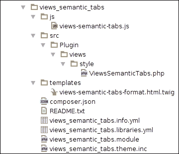

1.  现在我们已经准备好通过将其应用于我们的“按菜系查看食谱”视图来测试我们新的视图样式插件，但首先我们需要启用我们的新模块。我们可以使用 Drush 来做这件事，但我希望能在浏览器中启用自定义模块，这样我就能看到我的新模块。

1.  在您的浏览器中打开我们的 d8dev 网站，点击**管理**工具栏中的**扩展**链接，然后滚动到模块的**视图**部分或搜索输入框中搜索`views semantic`。

1.  您应该看到我们的新视图语义标签模块与其他已安装的视图模块一起列出。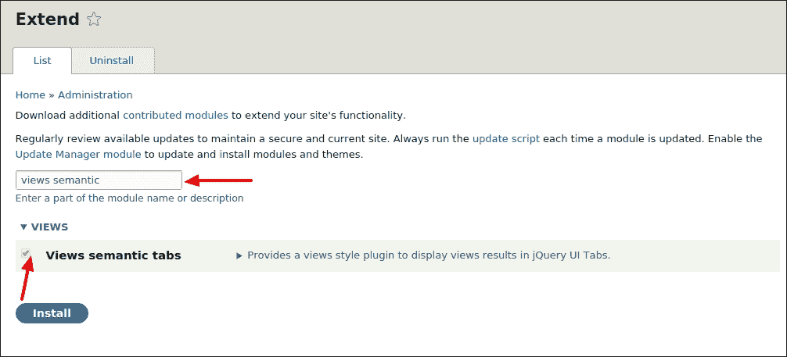

1.  打勾以启用我们的新模块，然后点击**安装**按钮。

1.  接下来，点击**管理**工具栏中的**主页**链接，然后点击我们的食谱按菜系视图的**上下文链接**按钮，并点击**编辑视图**链接。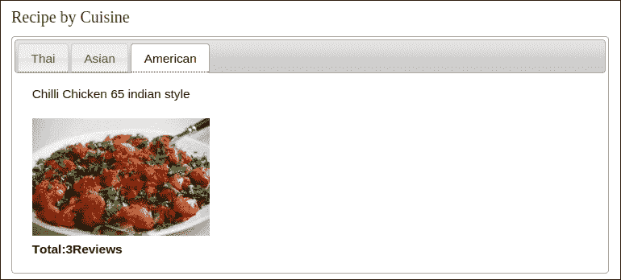

1.  在**格式**下，点击**未格式化列表**链接。现在，视图样式设置表单包括我们新的视图样式插件：**语义标签**。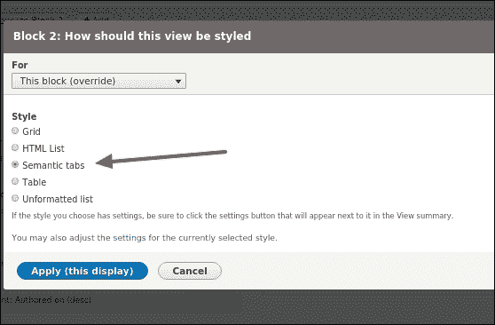

1.  选择我们的**语义标签**样式，然后点击**应用（此显示）**按钮。

1.  接下来，在**样式选项**屏幕上，选择**分类术语：名称**作为**分组字段**，然后点击**应用**按钮。请注意，**分组字段**是必需的，因为我们已在我们的插件类中指定。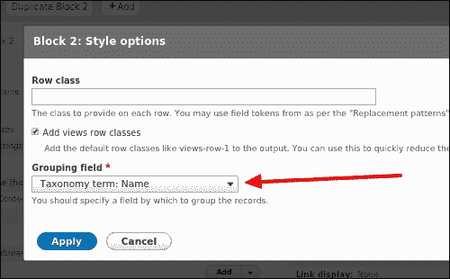

1.  现在，点击**保存**按钮以保存我们对视图的更改。您现在应该有一个类似于以下截图的食谱按菜系视图块：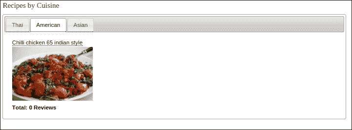

## *刚才发生了什么？*

虽然这个例子相当复杂，但一旦你掌握了视图插件的一些开发概念，实际的代码就相当简单了。我们能够创建一个定制的视图样式插件，这将增强我们 d8dev 网站上内容的显示。

# 又是时候准备另一道菜谱

这是一点点辣味美式风情——库尔特的经典辣椒。将它添加到 d8dev 网站上，并查看上一节中的食谱按菜系视图（秘密成分是香叶）。


+   **名称**: 库尔特的经典辣椒

+   **描述**: 在寒冷的冬日里，没有什么比一碗热腾腾的辣椒更让人感到舒适了。自制的辣椒粉真的给这道菜增添了独特的美味风味。

+   **食谱份量**: 八份

+   **准备时间**: 30 分钟

+   **烹饪时间**: 60 分钟

+   **配料**:

    +   一磅碎牛肉

    +   两汤匙橄榄油

    +   一个大型的甜洋葱，切碎

    +   六瓣大蒜，压碎

    +   八个安乔辣椒，干燥

    +   八个瓜希洛辣椒，干燥

    +   两汤匙糖浆

    +   一汤匙可可粉

    +   六盎司拉格啤酒

    +   三汤匙孜然

    +   半杯牛肉汤

    +   两杯番茄酱

    +   一个大型的黄甜椒，切丁

    +   一个大型的哈瓦那辣椒，切丁

    +   一杯淡色肾豆

    +   一杯深色肾豆

    +   三片香叶

+   **步骤**:

    +   将干辣椒放入食品加工机中，搅拌两分钟。

    +   加入捣碎的大蒜、糖浆和可可粉，搅拌两分钟。

    +   在中等低温下向一个大荷兰炖锅中加入油，加热三到四分钟。

    +   将火力调至中等，加入洋葱并烹饪，频繁搅拌，直到开始焦糖化，大约四到八分钟。

    +   将牛肉末加入洋葱中，频繁搅拌，直到肉变棕色，大约八分钟。

    +   将干辣椒混合物与牛肉末和洋葱混合，炒三到四分钟。

    +   向荷兰炖锅中加入啤酒并搅拌，以松动底部烧焦的碎片，然后在中等火候下煮沸五分钟。

    +   加入番茄酱和孜然，搅拌至混合均匀。煮沸五分钟。

    +   加入切碎的辣椒、红肾豆和月桂叶。将火力调至低，偶尔搅拌，煮沸 30 分钟。

# 将 Views 语义标签模块贡献给 Drupal

在本章中，我们在语义标签模块上投入了大量精力。似乎让这些增强功能对整个 Drupal 社区都很有意义。但在我们这样做之前，我们需要做一些事情来确保该模块对 Drupal 社区尽可能有用。

Drupal 有严格的编码标准，在首次推广任何代码时必须严格执行。有关 Drupal 编码标准的良好概述可在 [`drupal.org/coding-standards`](http://drupal.org/coding-standards) 找到。在将任何代码贡献给 Drupal 之前，应检查以确保其符合 Drupal 的编码标准。幸运的是，这相当简单，因为正如之前提到的页面所指出的，有一个 Coder 模块可以提供检查代码标准合规性的自动化流程。

然而，我们不需要安装此模块，因为我们有在线工具可以完成这项工作。[`pareview.sh`](http://pareview.sh) 是一个服务，它使用 PHP CodeSniffer 对 Drupal 项目进行自动审查。此在线服务提供了最新的 pareview 脚本，无需安装本地测试环境。现在，是时候在 Drupal 中创建一个沙盒模块项目并推送我们的 views 语义标签模块代码了。

# 创建 views 语义标签模块的沙盒 - 行动时间

Drupal 允许我们创建新的项目类型，如模块、主题或发行版。在我们的案例中，我们想要贡献一个模块。

1.  前往 [`www.drupal.org/node/add`](https://www.drupal.org/node/add) 并点击 **模块项目** 链接。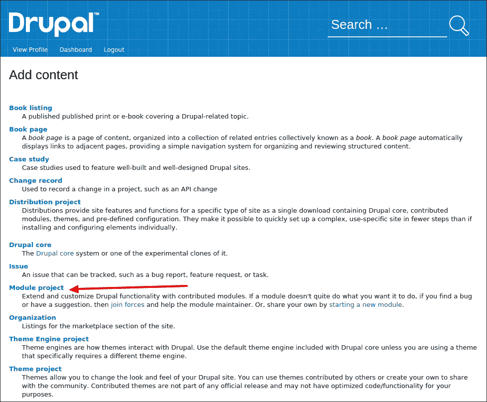

1.  我正在填写表格。我们的新项目最初将是一个沙盒项目。我已经有权限将项目从沙盒提升到完整项目。我可以看到一个复选框，允许您选择**完整项目**，但通常最好是先从沙盒开始。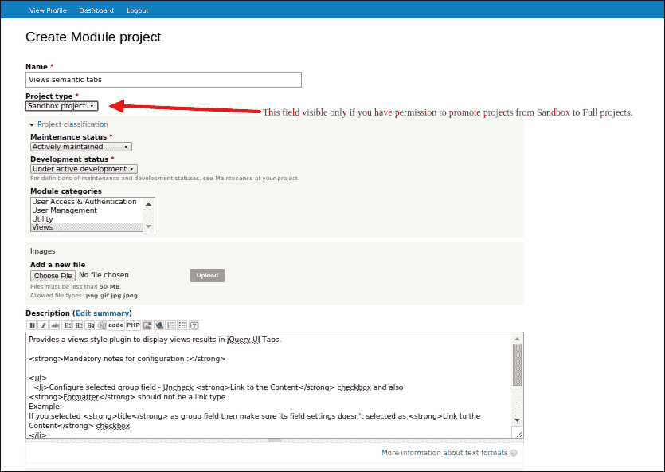

1.  点击**保存**按钮，Drupal 将为您的全新项目创建和加载一个页面：[`www.drupal.org/sandbox/krishnakanth17/2665888`](https://www.drupal.org/sandbox/krishnakanth17/2665888)。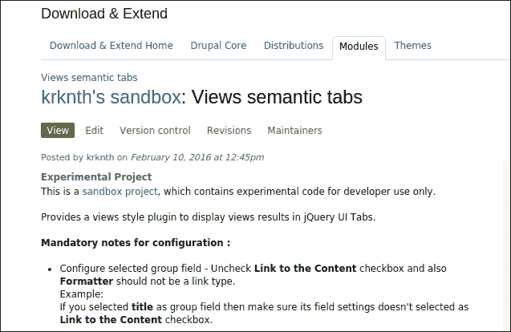

1.  点击新项目页面顶部附近**版本控制**标签，以获取如何开始向沙盒仓库提交代码的说明。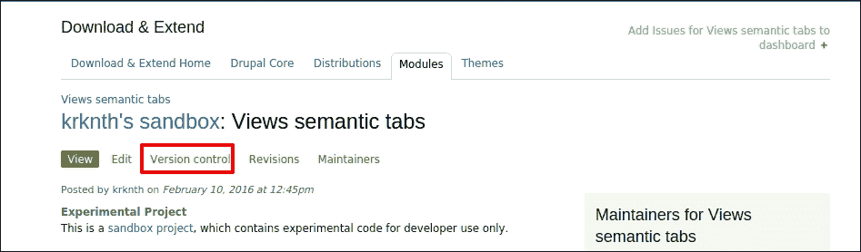

1.  首次设置此仓库时，我们需要遵循一些 Git 步骤来推送我们的模块代码。注意：在最后一步后，您将被提示输入您的 Drupal 密码。

    ```php
    $ mkdir views_semantic_tabs
    $ cd views_semantic_tabs
    $ git init
    $ git checkout -b 8.x-1.x
    $ echo "name = Views semantic tabs" > views_semantic_tabs.info.yml
    $ git add views_semantic_tabs.info
    $ git commit -m "Initial commit."
    $ git remote add origin krishnakanth17@git.drupal.org:sandbox/krishnakanth17/2665888.git
    $ git push origin 8.x-1.x

    ```

1.  接下来，我们需要将所有模块文件推送到沙盒中。因此，复制并粘贴此目录内的所有文件，并按照[`www.drupal.org/project/2665888/git-instructions`](https://www.drupal.org/project/2665888/git-instructions)页面上的这些`git`命令进行操作。

    ```php
    $ git add -A
    $ git commit -m "Pushing all files of module"
    $ git push -u origin 8.x-1.x

    ```

1.  我们已经完成了创建沙盒项目和将我们的模块代码推送到它的操作。接下来，我们需要将这个模块提升为完整项目。我有权限将项目从沙盒提升到完整项目，一旦我们的沙盒处于我们认为可以提升为完整项目状态时，可以申请这个权限。如果我们没有这个权限，那么我们必须通过一次性的审批流程。查看[`www.drupal.org/node/1011698`](https://www.drupal.org/node/1011698)获取更多信息。

1.  但我们正在继续提升到完整项目，我们的代码已贡献给 drupal.org，应该检查它是否符合 Drupal 的编码标准。因此，我们将使用在线工具来检查 Drupal 标准。正如我们之前讨论的，我们将使用[`pareview.sh`](http://pareview.sh)。在 URL 输入框中，输入 URL `http://git.drupal.org/sandbox/krishnakanth17/2665888.git`，然后点击**提交分支**按钮。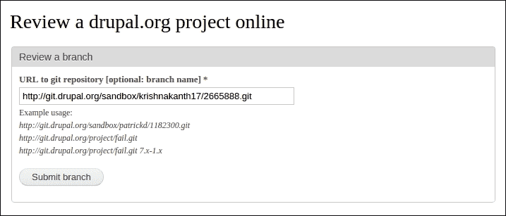

1.  提交后，它会把我带到[`pareview.sh/pareview/httpgitdrupalorgsandboxkrishnakanth172665888.git`](http://pareview.sh/pareview/httpgitdrupalorgsandboxkrishnakanth172665888.git)页面，并列出需要修复的事项。

1.  修复所有这些错误需要一些时间。

在下一章中，我们将把这个沙盒模块提升为一个完整的项目。

# 摘要

在本章中，我们学习了很多关于视图的知识，并看到了视图如何通过基于网络的用户界面让你向网站添加有趣的功能组件。我们还了解到，视图提供了一个强大的开发平台，用于自定义扩展。我们为视图语义标签模块创建了一个沙盒项目。我们还调查了一些在线工具，以审查我们的模块并检查 Drupal 编码标准。

在下一章中，我们将添加一些视觉上引人注目的横幅组件，这些组件将利用本章中提到的视图开发，并展示 d8dev 网站上所有美丽的食谱照片。最后，我们将推广视图语义标签模块作为完整项目。
